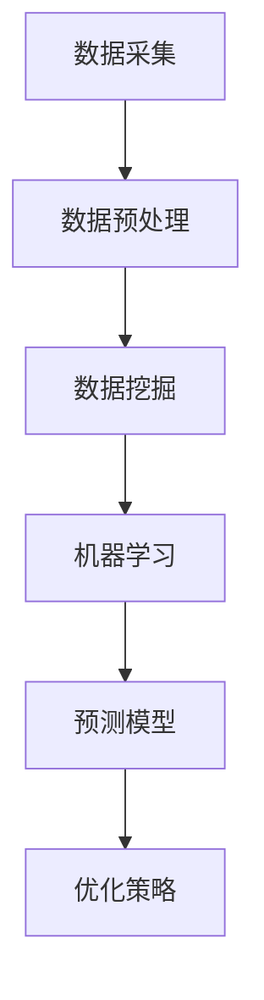
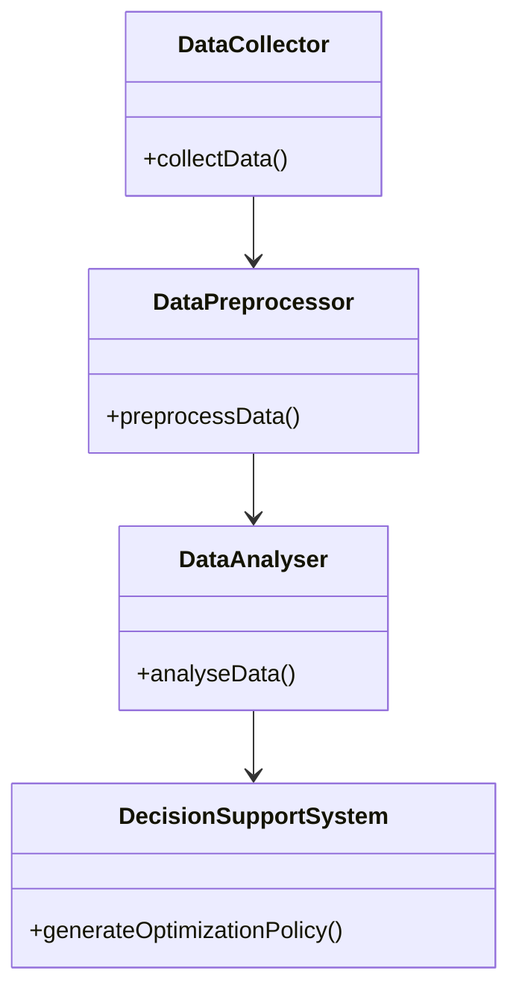
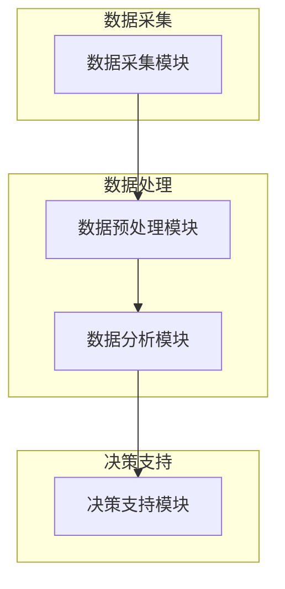
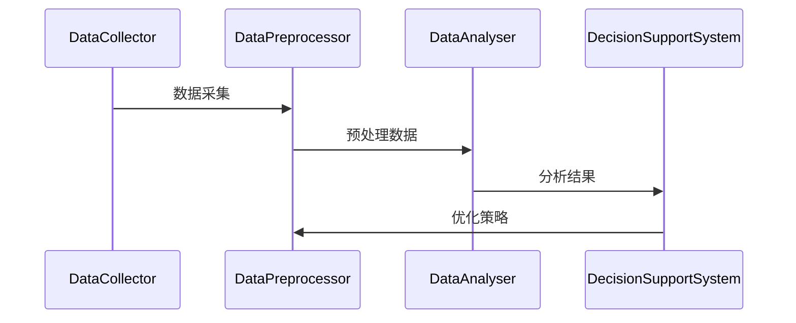

                 


### 第1章：智慧城市与排水系统概述

#### 1.1 智慧城市的定义与发展

**背景介绍：**

智慧城市作为现代城市发展的新趋势，其核心是通过信息化和智能化手段提升城市治理效率和居民生活质量。随着物联网、大数据、人工智能等新兴技术的迅猛发展，智慧城市已经成为城市可持续发展的重要方向。

**问题背景：**

当前城市排水系统在应对极端气候和突发暴雨等事件时，常常出现排水不畅、内涝频发等问题，严重影响了城市的正常运行和居民的生活质量。智慧城市的建设为解决这些问题提供了新的思路和手段。

**问题描述：**

智慧城市排水系统的优化目标是在保证城市排水系统正常运行的基础上，通过智能化手段提高排水效率，降低内涝风险，提升城市防洪排涝能力。

**问题解决：**

智慧城市排水系统的优化主要依靠物联网、大数据和人工智能等先进技术。通过实时监测、智能分析和优化决策，实现对排水系统的实时监控和动态调整，从而提高排水系统的运行效率和应对能力。

**边界与外延：**

智慧城市排水系统的优化不仅仅局限于排水系统的本身，还涉及到城市规划、城市建设、水资源管理等多个方面。因此，智慧城市排水系统的优化是一个综合性的工程，需要多学科、多领域的协同合作。

**核心概念与联系：**

- **智慧城市**：一个通过信息技术实现城市资源高效管理和利用的城市。
- **排水系统**：城市中的雨水排放系统，包括雨水收集、传输和排放等环节。
- **物联网**：通过传感器、网络和数据处理技术，实现物体之间的信息交换和通信。
- **大数据**：海量数据的存储、管理和分析技术。
- **人工智能**：模拟人类智能的计算机系统，通过学习、推理和决策实现智能化。

**概念属性特征对比表格：**

| 概念   | 特征                               |
| ------ | ---------------------------------- |
| 智慧城市 | 利用信息技术提升城市治理能力       |
| 排水系统 | 城市雨水排放系统                   |
| 物联网  | 物体之间信息交换与通信             |
| 大数据  | 海量数据的存储、管理和分析技术     |
| 人工智能 | 模拟人类智能的计算机系统           |

**ER实体关系图架构：**

```mermaid
erDiagram
    Product ||--|{ Customer } : "is bought by"
    Customer ||--|{ Product } : "owns"
```

**算法原理讲解：**

智慧城市排水系统优化的算法原理主要基于实时监测数据和历史数据分析，通过数据挖掘和机器学习技术，建立排水系统运行状态预测模型，进而制定优化策略。

- **实时监测数据**：通过安装在排水系统各关键位置的传感器，实时采集排水流量、水位、气象等信息。
- **历史数据分析**：通过对历史降雨数据、排水系统运行数据的分析，建立排水系统运行状态与气象条件、地形地貌等因素的关系模型。

- **数据挖掘与机器学习**：利用数据挖掘算法（如聚类、关联规则等）和机器学习算法（如回归分析、神经网络等），对实时监测数据和历史数据分析，建立排水系统运行状态预测模型。

- **预测模型训练与验证**：通过训练数据集对预测模型进行训练，并在验证数据集上进行验证，调整模型参数，提高模型预测准确性。

- **优化策略制定**：根据预测模型的结果，制定优化排水系统运行策略，包括排水管道清洗、排水泵站调度、雨水收集设施优化等。

**数学公式和算法流程图：**

$$
Y = f(X, \theta)
$$



**系统分析与架构设计方案：**

**问题场景介绍：** 智慧城市排水系统优化项目，旨在提高排水效率，降低内涝风险。

**项目介绍：** 项目包括排水监测系统、数据分析平台、决策支持系统等。

**系统功能设计（领域模型类图）：**



**系统架构设计（架构图）：**



**系统接口设计和系统交互（序列图）：**



**项目实战：**

**环境安装：** 在项目中使用Python环境，安装必要的库，如scikit-learn、numpy、pandas等。

**系统核心实现源代码：**

```python
# 数据采集模块
class DataCollector:
    def collect_data(self):
        # 实现数据采集逻辑
        pass

# 数据预处理模块
class DataPreprocessor:
    def preprocess_data(self, raw_data):
        # 实现数据预处理逻辑
        pass

# 数据分析模块
class DataAnalyser:
    def analyse_data(self, preprocessed_data):
        # 实现数据分析逻辑
        pass

# 决策支持模块
class DecisionSupportSystem:
    def generate_optimization_policy(self, analysis_result):
        # 实现优化策略生成逻辑
        pass
```

**代码应用解读与分析：** 在代码中，各个模块负责不同的功能，通过模块间的调用，实现了智慧城市排水系统优化的全过程。

**实际案例分析：** 以某城市排水系统优化实践为例，详细讲解项目背景、数据收集与预处理、模拟与预测模型构建、优化策略制定与实现等环节。

**详细讲解剖析：** 对案例中的每个环节进行详细讲解，分析模型构建、算法实现、优化策略等关键部分。

**项目小结：** 总结项目实施过程，提出项目成功的关键因素和经验教训。

**最佳实践 tips：** 提出在智慧城市排水系统优化中的最佳实践建议，如加强数据采集与处理、优化算法模型、提高系统稳定性等。

**小结：** 智慧城市排水系统优化是城市可持续发展的重要一环，通过人工智能技术，可以有效提高排水效率，降低内涝风险，提升城市治理能力。

**注意事项：** 在实施智慧城市排水系统优化时，需要注意数据的准确性和实时性，以及系统的稳定性和可扩展性。

**拓展阅读：** 推荐相关领域的经典书籍、学术论文和行业报告，以供读者进一步学习和研究。**作者：AI天才研究院/AI Genius Institute & 禅与计算机程序设计艺术 /Zen And The Art of Computer Programming**

