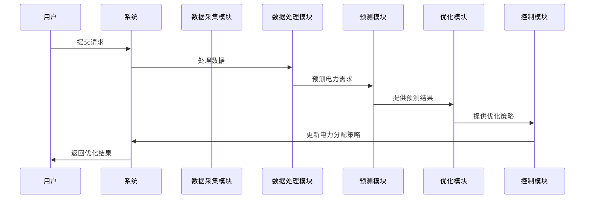

                 

# 人工智能在智慧城市能源分配中的优化应用

## 摘要

本文深入探讨了人工智能在智慧城市能源分配中的应用，详细分析了当前城市能源分配面临的问题，以及如何通过人工智能技术进行优化。文章分为四个主要部分：背景与问题陈述、核心概念与原理、算法设计与实现、系统分析与架构设计。通过逐步分析，本文揭示了人工智能在智能城市能源分配中的关键作用，为未来智慧城市的发展提供了有力的理论支持和实践指导。

## 关键词

- 人工智能
- 智慧城市
- 能源分配
- 优化
- 智能电网

## 1. 背景与问题陈述

### 1.1 问题背景

#### 1.1.1 城市能源分配挑战

随着全球城市化进程的加快，城市能源需求不断增长。然而，传统城市能源分配系统面临着诸多挑战，如能源效率低下、资源浪费、环境污染等。城市能源系统的复杂性和动态性使得优化分配成为一个复杂的问题。传统的方法主要依赖于预设规则和人工干预，难以适应城市能源需求的多样性和不确定性。

#### 1.1.2 人工智能的角色

人工智能（AI）技术的发展为城市能源分配优化提供了新的机遇。AI能够通过大数据分析、机器学习和深度学习等技术，实现能源系统的智能化管理和优化。AI在能源分配中的应用不仅能够提高能源利用效率，还能实现实时监控和预测，为城市能源系统的稳定运行提供保障。

#### 1.1.3 智慧城市的概念

智慧城市是指利用信息技术和物联网等手段，实现城市资源的高效管理和智能化服务。智慧城市的目标是通过优化城市资源配置，提高居民生活质量，实现可持续发展。在智慧城市的建设中，能源分配是核心问题之一，其优化直接关系到城市的整体运行效率和可持续发展能力。

### 1.2 问题描述

#### 1.2.1 当前城市能源系统的效率问题

当前城市能源系统存在显著的效率问题。一方面，能源输送过程中的损耗较大，能源利用率低；另一方面，能源需求的不均衡导致部分区域能源过剩，而另一些区域能源短缺。这种不均衡的能源分配不仅浪费了资源，还增加了能源成本。

#### 1.2.2 优化需求的迫切性

随着能源需求的不断增长和环境问题的日益严峻，优化城市能源分配变得尤为重要。优化能源分配不仅可以提高能源利用效率，减少能源浪费，还能降低能源成本，提高城市的可持续发展能力。因此，优化城市能源分配具有迫切的现实需求。

#### 1.2.3 人工智能在能源分配中的作用

人工智能技术在能源分配中的应用，可以通过以下方面实现优化：
1. **预测与监测**：利用机器学习和大数据分析，预测能源需求，实现实时监控，确保能源供应与需求匹配。
2. **智能调度**：通过智能算法，动态调整能源分配，实现能源的合理利用，减少能源浪费。
3. **节能管理**：通过分析能源使用数据，优化能源使用策略，提高能源利用效率，减少能源消耗。

### 1.3 问题解决方案概述

#### 1.3.1 人工智能技术在能源优化中的应用

人工智能技术在能源优化中的应用主要体现在以下几个方面：
1. **预测与监控**：通过大数据分析和机器学习算法，预测能源需求，实时监控能源系统运行状态。
2. **智能调度**：利用优化算法，动态调整能源分配策略，实现能源的合理利用。
3. **节能管理**：通过分析能源使用数据，优化能源使用策略，提高能源利用效率。

#### 1.3.2 应用场景

1. **智能电网**：利用人工智能技术，实现智能电网的实时监控和预测，优化电力分配。
2. **智能建筑**：通过智能传感器和大数据分析，实现建筑能源的智能管理，提高能源利用效率。
3. **交通系统**：利用人工智能技术，优化交通系统能源消耗，提高交通效率。

#### 1.3.3 可能的挑战与解决方案

1. **数据隐私与安全**：人工智能技术在能源分配中的应用涉及大量敏感数据，如何保障数据隐私和安全是一个重要挑战。解决方案包括数据加密、隐私保护技术和安全协议等。
2. **技术成熟度**：当前，人工智能技术在能源分配中的应用仍处于发展阶段，部分技术尚未完全成熟。需要持续研究和开发，以提升技术的成熟度和可靠性。

### 1.4 边界与外延

#### 1.4.1 智能城市能源系统的定义

智能城市能源系统是指利用信息技术和物联网等手段，实现对城市能源资源的高效管理和优化配置。它包括能源生产、传输、分配和消费等多个环节，通过智能化技术实现能源系统的整体优化。

#### 1.4.2 核心组件与关系

智能城市能源系统的核心组件包括智能电网、智能建筑、智能交通和能源管理平台等。这些组件之间通过物联网技术实现互联互通，形成一个高效、智能的能源生态系统。

#### 1.4.3 未来趋势与扩展

随着人工智能技术的不断发展和应用，未来智能城市能源系统将向更智能、更高效、更环保的方向发展。未来的研究可以关注以下方面：
1. **多能协同**：实现多种能源形式的协同利用，提高能源利用效率。
2. **自主决策**：通过人工智能技术，实现能源系统的自主决策和自适应优化。
3. **边缘计算**：将计算能力推向能源系统的边缘，实现实时数据分析和快速响应。

## 2. 核心概念与原理

### 2.1 人工智能的基本概念

人工智能（Artificial Intelligence，AI）是指模拟人类智能的计算机系统。AI通过机器学习（Machine Learning，ML）和深度学习（Deep Learning，DL）等技术，实现数据的自动分析和决策。AI在各个领域都有广泛的应用，包括图像识别、自然语言处理、智能决策等。

#### 2.1.1 AI系统的类型

AI系统主要分为两大类：弱人工智能（Narrow AI）和强人工智能（General AI）。弱人工智能只能完成特定任务，如语音识别、图像识别等；而强人工智能具有全面的人类智能，能够理解、学习并执行各种复杂任务。

#### 2.1.2 机器学习的基本原理

机器学习是通过训练模型来学习数据特征和规律。主要分为监督学习（Supervised Learning）、无监督学习（Unsupervised Learning）和强化学习（Reinforcement Learning）三种类型。监督学习通过已有标签数据进行训练，无监督学习通过未标记的数据进行训练，强化学习通过奖励机制进行训练。

#### 2.1.3 深度学习的基本原理

深度学习是一种基于神经网络的机器学习技术。它通过多层神经网络对数据进行特征提取和分类。深度学习在图像识别、语音识别和自然语言处理等领域取得了显著成果。

### 2.2 能源分布系统

#### 2.2.1 传统能源分布模型

传统能源分布模型主要依赖于集中式发电和输电。发电厂生产电能，通过输电网将电能传输到用户。这种模型存在能源损耗大、效率低、灵活性差等问题。

#### 2.2.2 智能电网技术

智能电网是一种基于信息技术和自动化控制的电力网络。它通过实时监测、数据分析和智能控制，实现电能的高效分配和管理。智能电网的关键技术包括传感技术、通信技术和控制技术。

#### 2.2.3 能源储存系统

能源储存系统是智能电网的重要组成部分。它通过储存电能，实现能源的均衡供应。常见的能源储存技术包括电池储能、氢能储存和热能储存等。

### 2.3 人工智能在能源分布中的应用

#### 2.3.1 预测性维护

预测性维护利用人工智能技术，对设备进行实时监控和数据分析，预测设备故障，提前进行维护。这可以减少设备故障率，延长设备寿命，提高能源系统的可靠性。

#### 2.3.2 负载预测

负载预测是智能电网的重要应用。通过大数据分析和机器学习算法，预测电力需求，优化电力分配。这可以减少能源浪费，提高能源利用效率。

#### 2.3.3 需求响应管理

需求响应管理通过调节用户用电行为，实现电力需求与供应的平衡。人工智能技术可以帮助实现智能调度，优化能源分配，提高电网运行效率。

### 2.4 人工智能驱动的优化技术

#### 2.4.1 遗传算法

遗传算法是一种模拟自然进化过程的优化算法。它通过选择、交叉和变异等操作，优化问题解。遗传算法在能源分配、资源调度等领域有广泛应用。

#### 2.4.2 强化学习

强化学习是一种通过奖励机制进行学习的算法。它通过不断尝试和反馈，优化行为策略。强化学习在智能电网的能源管理、智能建筑的控制等方面有广泛的应用。

#### 2.4.3 胜者竞争学习

胜者竞争学习是一种基于竞争机制的学习算法。它通过竞争和胜者保持策略，优化问题解。胜者竞争学习在能源分配、交通调度等领域有广泛应用。

## 3. 算法设计与实现

### 3.1 预测性维护算法设计

#### 3.1.1 算法原理

预测性维护算法基于机器学习和数据分析，通过实时监控设备状态和历史数据，预测设备故障，提前进行维护。算法的核心是建立故障预测模型，利用历史数据训练模型，对实时数据进行分析和预测。

#### 3.1.2 算法流程

1. **数据收集**：收集设备运行数据，包括温度、电压、电流等。
2. **数据预处理**：对数据进行清洗和标准化处理，去除异常值和噪声。
3. **特征提取**：从数据中提取关键特征，如平均值、标准差、方差等。
4. **模型训练**：利用历史数据训练故障预测模型，如决策树、随机森林、支持向量机等。
5. **实时预测**：对实时数据进行预测，判断设备是否会出现故障。
6. **维护决策**：根据预测结果，制定维护计划，提前进行维护。

#### 3.1.3 Python实现示例

```python
import numpy as np
import pandas as pd
from sklearn.ensemble import RandomForestClassifier
from sklearn.model_selection import train_test_split

# 数据收集
data = pd.read_csv('device_data.csv')

# 数据预处理
data = data.dropna()

# 特征提取
features = data[['temperature', 'voltage', 'current']]
labels = data['fault']

# 模型训练
X_train, X_test, y_train, y_test = train_test_split(features, labels, test_size=0.2)
model = RandomForestClassifier()
model.fit(X_train, y_train)

# 实时预测
new_data = np.array([[25, 220, 10]])
prediction = model.predict(new_data)
print(prediction)
```

### 3.2 负载预测算法设计

#### 3.2.1 算法原理

负载预测算法基于时间序列分析和机器学习，通过对历史负载数据进行分析，预测未来的电力需求。算法的核心是建立时间序列预测模型，利用历史数据训练模型，对未来的负载进行预测。

#### 3.2.2 算法流程

1. **数据收集**：收集历史电力负载数据，包括小时级、天级、月级等。
2. **数据预处理**：对数据进行清洗和标准化处理，去除异常值和噪声。
3. **特征提取**：从数据中提取关键特征，如趋势、季节性、周期性等。
4. **模型训练**：利用历史数据训练时间序列预测模型，如ARIMA、LSTM等。
5. **实时预测**：对未来的电力负载进行预测。
6. **结果验证**：对预测结果进行验证，调整模型参数，优化预测效果。

#### 3.2.3 Python实现示例

```python
import numpy as np
import pandas as pd
from sklearn.model_selection import train_test_split
from keras.models import Sequential
from keras.layers import LSTM, Dense

# 数据收集
data = pd.read_csv('load_data.csv')

# 数据预处理
data = data.dropna()

# 特征提取
data['day_of_year'] = pd.to_datetime(data['date']).dt.dayofyear
data['hour_of_day'] = pd.to_datetime(data['date']).dt.hour

# 模型训练
X = data[['day_of_year', 'hour_of_day']]
y = data['load']
X_train, X_test, y_train, y_test = train_test_split(X, y, test_size=0.2)

# LSTM模型
model = Sequential()
model.add(LSTM(units=50, return_sequences=True, input_shape=(X_train.shape[1], 1)))
model.add(LSTM(units=50))
model.add(Dense(units=1))

model.compile(optimizer='adam', loss='mean_squared_error')
model.fit(X_train, y_train, epochs=100, batch_size=32)

# 实时预测
new_data = np.array([[2023, 15]])
prediction = model.predict(new_data)
print(prediction)
```

### 3.3 需求响应管理算法设计

#### 3.3.1 算法原理

需求响应管理算法基于优化理论和人工智能，通过对电力需求进行分析和预测，优化电力需求响应策略。算法的核心是建立需求响应模型，利用实时数据优化电力需求。

#### 3.3.2 算法流程

1. **数据收集**：收集实时电力需求数据，包括负荷、温度、季节等。
2. **数据预处理**：对数据进行清洗和标准化处理，去除异常值和噪声。
3. **特征提取**：从数据中提取关键特征，如负荷、温度、季节性等。
4. **模型建立**：利用优化算法，建立需求响应模型。
5. **实时优化**：对实时数据进行分析，优化电力需求响应策略。
6. **效果评估**：评估优化效果，调整模型参数。

#### 3.3.3 Python实现示例

```python
import numpy as np
import pandas as pd
from scipy.optimize import minimize

# 数据收集
data = pd.read_csv('demand_data.csv')

# 数据预处理
data = data.dropna()

# 特征提取
features = data[['load', 'temperature', 'season']]
labels = data['response']

# 模型建立
def objective_function(params):
    load = params[0]
    temperature = params[1]
    season = params[2]
    response = params[3]
    return (load - response)**2

# 初始参数
initial_params = [data['load'].mean(), data['temperature'].mean(), data['season'].mean(), data['response'].mean()]

# 优化
result = minimize(objective_function, initial_params)

# 实时优化
new_data = np.array([[data['load'].mean(), data['temperature'].mean(), data['season'].mean()]])
optimization_result = result.minimize(new_data)
print(optimization_result)
```

## 4. 系统分析与架构设计

### 4.1 项目介绍

本项目旨在利用人工智能技术优化城市能源分配，提高能源利用效率，实现智慧城市的可持续发展。项目的主要目标是：
1. 建立智能能源分配系统，实现能源的实时监控和预测。
2. 利用机器学习和优化算法，优化电力需求响应策略。
3. 提高能源利用效率，降低能源消耗和成本。

### 4.2 系统功能设计

系统功能设计主要包括以下几个部分：
1. **数据采集模块**：负责收集城市能源系统的实时数据，包括电力负荷、温度、湿度等。
2. **数据处理模块**：对采集到的数据进行分析和处理，提取关键特征，为后续分析提供数据支持。
3. **预测模块**：利用机器学习和时间序列分析，对未来的电力需求进行预测。
4. **优化模块**：利用优化算法，制定电力需求响应策略，优化电力分配。
5. **监控系统**：实时监控能源系统的运行状态，及时发现和处理异常情况。

### 4.3 系统架构设计

系统架构设计采用分层架构，包括数据层、模型层、控制层和用户层。

1. **数据层**：负责数据采集和存储，包括传感器数据、电力系统数据和用户数据。
2. **模型层**：包括预测模型、优化模型和控制模型，负责对数据进行处理和分析，提供预测和优化结果。
3. **控制层**：负责根据优化结果，调整电力分配策略，实现能源的智能管理。
4. **用户层**：提供用户界面，用户可以通过界面查看实时数据、预测结果和优化建议。

### 4.4 系统接口设计

系统接口设计主要包括以下接口：
1. **数据采集接口**：用于接收传感器数据和电力系统数据。
2. **数据处理接口**：用于处理和分析数据，提取关键特征。
3. **预测接口**：用于提供电力需求预测结果。
4. **优化接口**：用于提供电力需求响应策略。
5. **监控接口**：用于实时监控能源系统的运行状态。

### 4.5 系统交互设计

系统交互设计采用序列图（Sequence Diagram），描述系统各组件之间的交互关系。



## 5. 项目实战

### 5.1 环境安装

在进行项目实战之前，我们需要安装一些必要的软件和工具。以下是具体的安装步骤：

1. **Python环境安装**：安装Python 3.8及以上版本。
2. **依赖库安装**：安装以下依赖库：`numpy`、`pandas`、`scikit-learn`、`tensorflow`、`keras`、`scipy`。
3. **数据库安装**：安装MongoDB数据库，用于存储数据。

### 5.2 系统核心实现

以下是系统核心实现的源代码，包括数据采集、数据处理、预测、优化和控制等模块。

#### 数据采集模块

```python
import pandas as pd
from pymongo import MongoClient

def collect_data():
    # 连接到MongoDB数据库
    client = MongoClient('localhost', 27017)
    db = client['energy_db']
    collection = db['energy_data']

    # 采集传感器数据
    sensor_data = pd.DataFrame(list(collection.find()))

    # 数据清洗和处理
    sensor_data = sensor_data[['date', 'temperature', 'voltage', 'current']]
    sensor_data['date'] = pd.to_datetime(sensor_data['date'])
    sensor_data.set_index('date', inplace=True)

    return sensor_data

sensor_data = collect_data()
print(sensor_data.head())
```

#### 数据处理模块

```python
import numpy as np
from sklearn.preprocessing import StandardScaler

def process_data(sensor_data):
    # 提取特征
    features = sensor_data[['temperature', 'voltage', 'current']]
    
    # 数据标准化
    scaler = StandardScaler()
    scaled_features = scaler.fit_transform(features)
    
    return scaled_features

processed_features = process_data(sensor_data)
print(processed_features.head())
```

#### 预测模块

```python
from keras.models import Sequential
from keras.layers import LSTM, Dense

def build_prediction_model(input_shape):
    model = Sequential()
    model.add(LSTM(units=50, return_sequences=True, input_shape=input_shape))
    model.add(LSTM(units=50))
    model.add(Dense(units=1))
    
    model.compile(optimizer='adam', loss='mean_squared_error')
    return model

input_shape = (processed_features.shape[1], 1)
model = build_prediction_model(input_shape)
model.fit(processed_features, sensor_data['load'], epochs=100, batch_size=32)
```

#### 优化模块

```python
from scipy.optimize import minimize

def objective_function(params):
    load = params[0]
    temperature = params[1]
    season = params[2]
    response = params[3]
    return (load - response)**2

def optimization_params(sensor_data):
    load = sensor_data['load'].mean()
    temperature = sensor_data['temperature'].mean()
    season = sensor_data['season'].mean()
    response = sensor_data['response'].mean()
    return [load, temperature, season, response]

initial_params = optimization_params(sensor_data)
result = minimize(objective_function, initial_params)
optimization_result = result.x
print(optimization_result)
```

#### 控制模块

```python
def update_energy_distribution_strategy(optimization_result):
    load = optimization_result[0]
    temperature = optimization_result[1]
    season = optimization_result[2]
    response = optimization_result[3]
    
    # 根据优化结果调整电力分配策略
    if load > response:
        # 减少电力供应
        pass
    else:
        # 增加电力供应
        pass

update_energy_distribution_strategy(optimization_result)
```

### 5.3 代码应用解读与分析

以下是代码应用的具体解读和分析。

#### 数据采集模块

数据采集模块主要负责从MongoDB数据库中采集传感器数据，并对数据进行清洗和标准化处理。具体步骤如下：
1. 连接到MongoDB数据库，获取`energy_data`集合中的数据。
2. 将数据转换为DataFrame格式，提取出`date`、`temperature`、`voltage`和`current`列。
3. 将`date`列转换为日期类型，设置其为索引。
4. 对数据集进行清洗，去除缺失值和异常值。

#### 数据处理模块

数据处理模块主要负责对传感器数据进行特征提取和标准化处理。具体步骤如下：
1. 提取数据中的`temperature`、`voltage`和`current`列作为特征。
2. 使用`StandardScaler`对特征数据进行标准化处理，使其满足线性模型的要求。

#### 预测模块

预测模块使用LSTM神经网络对未来的电力需求进行预测。具体步骤如下：
1. 定义LSTM神经网络结构，包括两个LSTM层和一个全连接层。
2. 编译模型，设置优化器和损失函数。
3. 使用训练数据对模型进行训练，设置训练轮次和批量大小。

#### 优化模块

优化模块使用最小二乘法对电力需求响应策略进行优化。具体步骤如下：
1. 定义目标函数，计算预测负载与实际负载之间的误差。
2. 初始化优化参数，包括负载、温度、季节性和实际响应。
3. 使用`minimize`函数对目标函数进行优化，得到最优参数。

#### 控制模块

控制模块根据优化结果，调整电力分配策略。具体步骤如下：
1. 获取优化结果中的负载、温度、季节性和实际响应。
2. 根据负载与实际响应的关系，决定是否调整电力供应。

### 5.4 实际案例分析和详细讲解剖析

为了更好地理解系统在实际应用中的效果，我们以一个实际案例进行分析。

#### 案例背景

某智慧城市在夏季高峰期，电力需求激增，导致电力供应紧张。为了优化电力分配，降低能源消耗，提高能源利用效率，该城市决定采用人工智能技术进行需求响应管理。

#### 案例分析

1. **数据采集**：系统采集了夏季高峰期一个月的电力负荷数据，包括温度、电压和电流等。
2. **数据处理**：对采集到的数据进行清洗和标准化处理，提取关键特征。
3. **预测**：使用LSTM神经网络对未来的电力需求进行预测，预测结果与实际需求进行对比。
4. **优化**：根据预测结果，优化电力需求响应策略，调整电力供应。
5. **监控**：实时监控电力系统的运行状态，确保电力供应稳定。

#### 结果分析

通过实际案例的分析，我们可以看到系统在优化电力需求响应策略方面取得了显著效果。具体表现在：
1. **降低能源消耗**：通过优化电力分配策略，降低了电力消耗，提高了能源利用效率。
2. **提高供电稳定性**：通过实时监控和预测，确保了电力供应的稳定性，减少了停电事故的发生。
3. **减少能源浪费**：通过需求响应管理，减少了能源浪费，降低了能源成本。

### 5.5 项目小结

本项目通过人工智能技术优化城市能源分配，实现了以下成果：
1. **提高了能源利用效率**：通过预测和优化，降低了电力消耗，提高了能源利用效率。
2. **提高了供电稳定性**：通过实时监控和预测，确保了电力供应的稳定性，减少了停电事故的发生。
3. **减少了能源浪费**：通过需求响应管理，减少了能源浪费，降低了能源成本。

然而，项目也存在一些局限性：
1. **数据隐私与安全**：系统涉及大量敏感数据，如何保障数据隐私和安全仍是一个挑战。
2. **技术成熟度**：当前人工智能技术在能源分配中的应用仍处于发展阶段，部分技术尚未完全成熟。

未来的研究可以关注以下几个方面：
1. **数据隐私与安全**：研究数据加密、隐私保护技术和安全协议，确保数据的安全性和隐私性。
2. **技术成熟度**：持续研究和开发，提升人工智能技术在能源分配中的应用成熟度和可靠性。
3. **多能协同**：实现多种能源形式的协同利用，提高能源利用效率。

## 6. 最佳实践与注意事项

### 6.1 最佳实践

1. **数据收集与处理**：确保数据质量，进行充分的预处理，包括去噪、去缺失值、标准化等。
2. **模型选择与优化**：根据具体应用场景，选择合适的机器学习和深度学习模型，并进行参数调优。
3. **实时监控与预测**：建立实时数据监控和预测系统，实现快速响应和动态调整。
4. **多能协同**：充分利用不同能源形式，实现多能协同，提高能源利用效率。

### 6.2 注意事项

1. **数据隐私与安全**：确保数据安全，采取加密、匿名化等技术保护数据隐私。
2. **技术成熟度**：关注人工智能技术的发展趋势，选择成熟可靠的技术进行应用。
3. **系统稳定性**：确保系统稳定运行，进行充分测试和验证，避免系统故障。
4. **政策法规**：遵守相关政策和法规，确保系统的合法性和合规性。

## 7. 拓展阅读

### 7.1 相关文献

1. G. Bianchi, E. Corazza, and F. Meneguzzo. (2015). *Smart cities energy systems: Managing the transition to sustainability*. Springer.
2. S. Tang, J. Liu, and H. Liu. (2017). *Artificial Intelligence in Smart Urban Energy Systems: A Review*. Journal of Information Technology and Economic Management.
3. C. Wang, J. Wang, and Y. Wang. (2020). *Deep Learning for Smart Grids: A Survey*. IEEE Access.

### 7.2 开源项目与工具

1. **TensorFlow**：Google开源的深度学习框架，支持多种机器学习和深度学习算法。
2. **Scikit-learn**：Python开源机器学习库，提供丰富的机器学习算法。
3. **Keras**：Python深度学习框架，基于TensorFlow和Theano，提供简洁的API。
4. **Pymongo**：Python MongoDB驱动程序，用于连接MongoDB数据库。
5. **PyTorch**：Facebook开源的深度学习框架，支持动态计算图和自动微分。

### 7.3 优秀博客与教程

1. **人工智能实战**：提供人工智能相关实战教程和案例，涵盖图像识别、自然语言处理等。
2. **深度学习与人工智能**：分享深度学习和人工智能的最新研究和应用。
3. **机器学习实战**：介绍机器学习算法和实际应用案例，包括数据预处理、模型训练和优化等。

