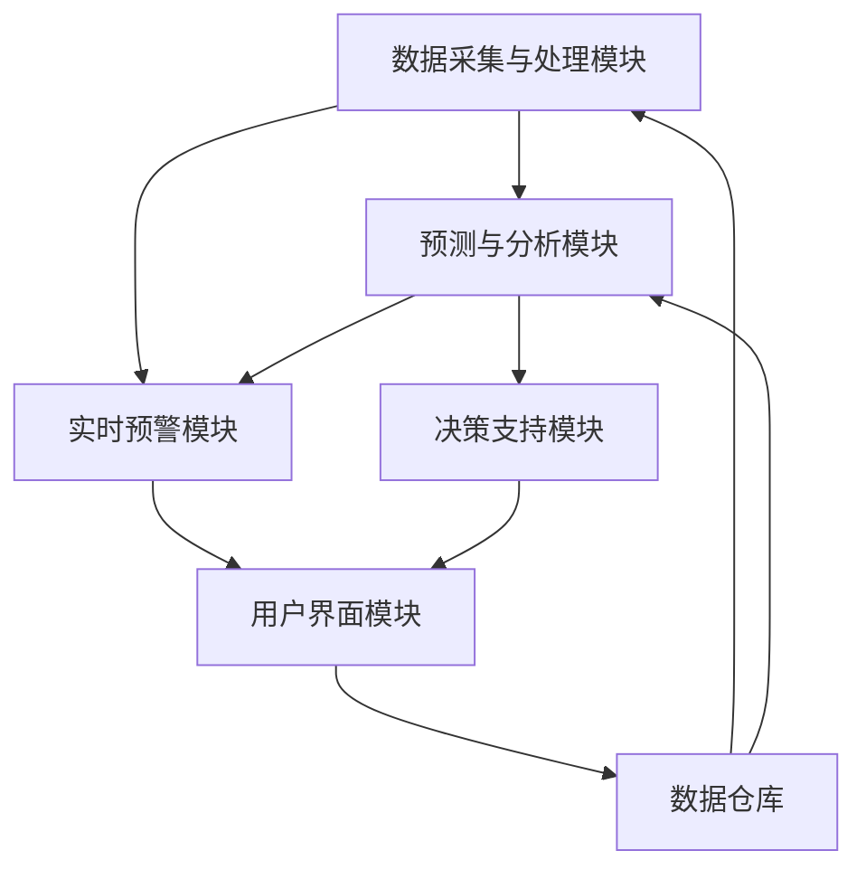
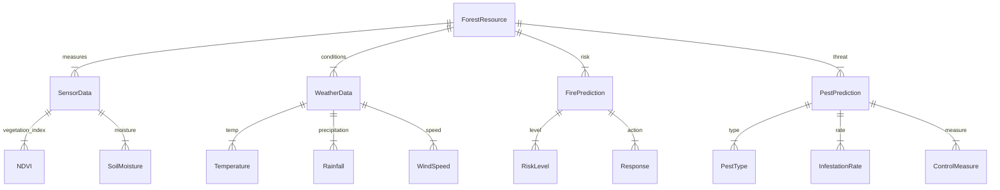
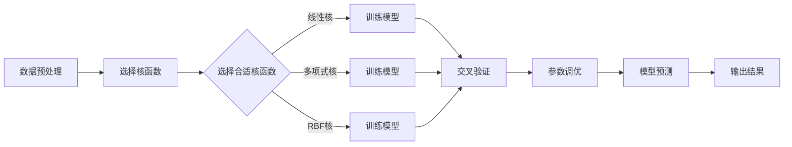

                 

### 引言

#### 1.1 人工智能与森林管理的交汇点

人工智能（AI）作为当今科技领域的前沿，其发展速度和影响范围在不断扩大。在森林管理这一领域，人工智能的应用同样显示出其独特的优势和潜力。森林是地球生态系统的核心组成部分，承载着生物多样性保护、水源涵养、气候调节等重要功能。然而，随着人类活动的加剧，森林资源面临着前所未有的威胁，包括森林火灾、病虫害、资源过度开采等问题。传统的森林管理方法往往依赖人工巡检和数据采集，效率低下，难以应对复杂的环境变化。

人工智能的出现，为森林管理带来了新的契机。通过引入传感器技术、遥感成像、大数据分析和机器学习算法，人工智能能够实时监控森林状况，预测潜在风险，优化资源分配，提供科学的决策支持。这种跨学科的融合不仅提高了森林管理的效率和准确性，还为可持续发展的森林生态系统建设提供了新的技术路径。

#### 1.1.1 人工智能的发展历程

人工智能的概念最早可以追溯到20世纪50年代。当时，计算机科学家艾伦·图灵提出了著名的“图灵测试”，旨在通过测试来判定机器是否具有人类智能。这一理论奠定了人工智能研究的基础。在随后的几十年里，人工智能经历了多个发展阶段。

第一个阶段是符号主义人工智能，通过逻辑推理和知识表示来模拟人类的智能行为。然而，这种方法在处理复杂问题时显得力不从心。随着计算能力的提升和数据量的爆炸性增长，20世纪80年代以来，以统计学习为基础的机器学习方法得到了快速发展。尤其是深度学习算法的出现，使得人工智能在图像识别、自然语言处理等领域取得了重大突破。

近年来，人工智能的应用范围进一步拓展，从传统的计算机视觉、语音识别，延伸到自动驾驶、医疗诊断、金融风控等领域。这种跨界融合不仅推动了人工智能技术的进步，也为各个行业带来了深刻的变革。

#### 1.1.2 森林管理的重要性

森林不仅是重要的自然资源，还是生态环境的重要组成部分。它们为地球上的生物提供了栖息地，维持着生物多样性。森林还能有效调节气候，吸收大量的二氧化碳，减缓全球变暖。此外，森林在水源涵养、防风固沙等方面发挥着关键作用，对人类的生存和发展具有重要意义。

然而，当前全球森林资源正面临严重威胁。森林退化、过度砍伐、非法采伐等问题层出不穷，导致森林面积逐年减少。根据联合国环境规划署的数据，全球森林覆盖率在过去几十年里下降了近20%。这一趋势如果不加以控制，将对生态系统和人类社会造成不可逆转的影响。

因此，有效管理和保护森林资源已成为全球共同面临的重要挑战。人工智能技术的引入，为解决这一挑战提供了新的手段和思路。通过智能监测、预测分析和优化管理，人工智能有望在森林保护、资源利用和可持续发展方面发挥重要作用。

#### 1.1.3 人工智能在森林管理中的潜在贡献

人工智能在森林管理中的应用前景广阔。首先，智能监测和监控系统可以实时捕捉森林生态系统的变化，及时发现异常情况。例如，利用无人机和传感器技术，可以实现对森林火灾的早期预警，提高扑救效率。其次，人工智能可以通过大数据分析，对森林资源的利用状况进行评估和预测，优化资源分配，提高管理效率。此外，人工智能还可以协助制定科学的森林保护策略，通过模拟和预测不同管理措施的效果，帮助决策者做出更加明智的选择。

总之，人工智能与森林管理的结合，不仅能够提升森林管理的科学性和效率，还为实现可持续发展的森林生态系统提供了有力支持。在接下来的章节中，我们将详细探讨人工智能在森林管理中的具体应用，分析其优势与挑战，并探讨未来的发展方向。

#### 1.2 书籍目的与结构安排

本书旨在深入探讨人工智能在森林管理中的应用，通过系统化的分析和实例讲解，帮助读者全面理解这一领域的前沿技术和实践应用。主要目标如下：

1. **普及核心概念**：介绍人工智能的基本原理、技术框架及其在森林管理中的适用性，使读者能够建立全面的知识体系。
2. **分析应用案例**：通过具体的应用案例，展示人工智能技术在森林监测、预测、资源管理和灾害预警等方面的实际效果，提高读者的实践能力。
3. **探讨技术实现**：详细讲解关键技术的实现原理和系统架构，帮助读者掌握人工智能在森林管理中的技术实现路径。
4. **提出最佳实践**：总结实践经验，提出有效的项目管理和技术实施策略，为读者在实际工作中提供参考。

为了实现上述目标，本书结构安排如下：

- **第1章 引言**：介绍人工智能与森林管理的交集，阐述本书的目的和重要性。
- **第2章 核心概念与联系**：概述人工智能和森林管理的基本概念，分析两者之间的联系。
- **第3章 人工智能在森林管理中的应用**：详细探讨人工智能在森林管理中的具体应用领域，包括监测、预测、资源管理和灾害预警。
- **第4章 应用案例分析**：分析具体的森林管理应用案例，探讨其实施过程和效果。
- **第5章 技术实现与系统架构**：介绍关键技术的实现原理和系统架构设计。
- **第6章 数据分析与处理**：介绍数据收集、处理和分析的方法，展示数据分析在森林管理中的应用。
- **第7章 算法原理讲解**：深入讲解算法原理，包括数学模型和Python实现。
- **第8章 项目实战与最佳实践**：提供项目实战案例，总结最佳实践和注意事项。
- **第9章 小结与拓展阅读**：总结全书内容，指出未来发展方向，推荐拓展阅读材料。

本书面向希望深入了解人工智能在森林管理中应用的读者，包括科研人员、技术人员、森林管理人员以及对环境科学感兴趣的学生。通过系统的学习和实践，读者可以掌握人工智能在森林管理中的核心技术和应用方法，为推动森林生态系统的可持续发展贡献力量。

### 核心概念与联系

在探讨人工智能（AI）在森林管理中的应用之前，我们需要首先明确一些核心概念，包括人工智能的定义、森林管理的基本概念以及可持续森林管理的原则。

#### 2.1 人工智能概述

人工智能（Artificial Intelligence，简称AI）是计算机科学的一个分支，旨在使计算机模拟人类的智能行为，包括学习、推理、解决问题和自我改进等能力。人工智能可以分为几个主要类别：

1. **符号主义人工智能（Symbolic AI）**：通过逻辑推理和知识表示来模拟人类智能。这种方法依赖于规则和符号操作，但难以处理复杂和不确定的信息。
2. **连接主义人工智能（Connectionist AI）**：基于人工神经网络，通过大量的数据训练来学习模式识别和预测。这种方法在处理大规模数据和复杂任务方面具有优势。
3. **行为主义人工智能（Behavior-Based AI）**：通过设计和实现具有特定行为规则的系统来模拟智能行为。这种方法通常用于自主移动机器人和机器人控制。
4. **强化学习人工智能（Reinforcement Learning AI）**：通过试错和反馈来学习和优化行为。这种方法在决策和优化问题中表现出色。

近年来，深度学习（Deep Learning）和生成对抗网络（GANs）等新兴技术进一步推动了人工智能的发展。深度学习通过多层神经网络来提取特征，从而在图像识别、自然语言处理等领域取得了显著成果。生成对抗网络则通过两个神经网络的对抗训练来生成高质量的数据，被广泛应用于图像生成和风格迁移等领域。

#### 2.2 森林管理的基本概念

森林管理是指对森林资源进行规划、保护和利用的一系列科学和技术活动。森林管理的主要目标包括：

1. **资源保护**：确保森林资源的可持续利用，保护生物多样性，维护生态平衡。
2. **生态效益**：通过森林管理实现水源涵养、气候调节、防风固沙等生态效益。
3. **经济效益**：合理利用森林资源，实现林业经济的可持续发展。

森林管理涉及多个关键要素，包括森林调查、资源评估、规划设计、监督执行和效果评估等。具体来说，森林管理需要关注以下几个方面：

1. **森林资源调查**：通过实地调查和遥感技术，获取森林面积、树种、生长状况等基本信息。
2. **资源评估**：对森林资源进行定量和定性评估，确定资源利用的合理性和可持续性。
3. **规划设计**：制定森林管理计划和设计方案，包括森林分类经营、森林改造和森林资源利用等。
4. **监督执行**：监督森林管理计划的实施，确保各项措施得到有效执行。
5. **效果评估**：对森林管理效果进行定期评估，及时调整管理策略，确保森林资源得到有效保护和合理利用。

#### 2.3 可持续森林管理

可持续森林管理是指通过科学规划和合理利用森林资源，实现森林生态系统的长期稳定和可持续发展。可持续森林管理遵循以下基本原则：

1. **生态平衡**：维护森林生态系统的生态平衡，确保生物多样性保护。
2. **资源可持续性**：确保森林资源的可持续利用，避免资源过度开采和破坏。
3. **经济效益**：通过合理利用森林资源，实现林业经济的可持续发展。
4. **社会公平**：保障森林资源利用过程中的社会公平，关注当地社区的经济和社会利益。
5. **政策支持**：制定和实施有效的森林管理政策，为可持续森林管理提供法律和政策支持。

可持续森林管理的关键指标包括森林覆盖率、森林质量、生物多样性、水资源涵养和碳排放量等。通过这些指标，可以评估森林管理的有效性和可持续性，及时调整管理策略。

#### 2.4 人工智能与森林管理的相关性

人工智能与森林管理的结合主要体现在以下几个方面：

1. **智能监测**：利用无人机和传感器技术，实现对森林资源的实时监测，提高监测效率和准确性。
2. **预测分析**：通过大数据分析和机器学习算法，预测森林病虫害、森林火灾等风险，提供科学的决策支持。
3. **资源优化**：利用人工智能优化森林资源分配和管理，提高资源利用效率，实现可持续发展。
4. **灾害预警**：通过实时监控和预警系统，提前发现和处理森林灾害，减少损失。

总之，人工智能在森林管理中的应用，不仅提升了管理效率和决策水平，还为实现可持续发展的森林生态系统提供了有力支持。在接下来的章节中，我们将详细探讨人工智能在森林管理中的具体应用案例，分析其优势与挑战。

### 人工智能在森林管理中的应用

人工智能（AI）在森林管理中的应用已经显示出巨大的潜力和价值。通过引入先进的技术和算法，AI能够为森林管理提供智能化的解决方案，提高监测、预测和资源管理的效率。以下将详细探讨人工智能在森林管理中的应用领域，包括监测、预测、资源管理和灾害预警等方面，并对比不同应用方法的优缺点。

#### 3.1 监测与监控

森林监测是森林管理的基础工作，通过监测可以了解森林资源的状态和变化趋势。人工智能在森林监测中的应用主要包括以下几个方面：

1. **无人机监测**：无人机具有灵活、高效、实时监测的特点，可以在森林火灾、病虫害等灾害发生时迅速响应。无人机搭载的高分辨率摄像头和传感器可以获取大范围的森林图像和数据，通过图像处理和模式识别技术，可以实现对森林资源的高精度监测。无人机监测的优点是覆盖范围广、监测速度快、响应及时；缺点是操作成本较高，对飞行环境和气象条件有一定的依赖性。

2. **遥感技术**：遥感技术利用卫星和航空器等载体获取地面信息，通过遥感图像处理和数据分析，可以实现对大面积森林资源的监测。遥感技术的优点是覆盖范围广、数据量大、监测结果具有高空间分辨率；缺点是图像获取成本较高，数据预处理和分析需要大量计算资源。

3. **智能监测系统**：智能监测系统结合了无人机、遥感和地面传感器等多种技术手段，实现对森林资源的全方位、全天候监测。智能监测系统的优点是能够实时获取森林资源状态，预警能力强；缺点是系统构建和维护成本较高，对技术人员的专业要求较高。

#### 3.2 预测与分析

预测分析是森林管理中的关键环节，通过预测可以提前识别潜在风险，制定科学的管理策略。人工智能在预测分析中的应用主要包括以下几个方面：

1. **森林火灾预警**：利用历史火灾数据、气象数据、森林资源状态等，通过机器学习算法构建火灾预测模型，可以实现对森林火灾的早期预警。森林火灾预警的优点是能够提前发现火灾隐患，减少火灾损失；缺点是需要大量历史数据和计算资源，预测模型的准确性受数据质量影响较大。

2. **森林病虫害预测**：通过监测森林病虫害的发生趋势，利用机器学习算法预测病虫害的发生概率和扩散范围，可以提前采取防治措施。森林病虫害预测的优点是能够提前预警，减少病虫害造成的损失；缺点是需要准确的病虫害监测数据，预测模型的准确性对数据质量要求较高。

3. **森林资源可持续性评估**：利用大数据分析和机器学习算法，对森林资源利用情况进行评估，预测未来森林资源的可持续性。森林资源可持续性评估的优点是能够为森林资源管理提供科学依据，优化资源利用；缺点是需要大量历史数据和支持数据，评估结果的准确性受数据质量影响较大。

#### 3.3 资源管理

人工智能在森林资源管理中的应用，旨在优化森林资源的配置和利用，实现资源的最大化效益。人工智能在森林资源管理中的应用主要包括以下几个方面：

1. **森林资源调查与评估**：利用人工智能技术进行大规模的森林资源调查和评估，通过遥感图像处理、无人机监测和大数据分析等技术手段，实现对森林资源的高精度调查和评估。森林资源调查与评估的优点是能够快速、准确地获取森林资源信息，为资源管理提供科学依据；缺点是数据获取和处理需要大量计算资源和专业知识。

2. **森林资源优化配置**：利用人工智能算法优化森林资源的配置和管理，通过模拟和优化森林资源的利用方式，提高资源利用效率。森林资源优化配置的优点是能够实现资源利用的最大化，减少资源浪费；缺点是需要详细的资源数据和计算模型，实施成本较高。

3. **森林资源管理系统的实现**：构建基于人工智能的森林资源管理系统，集成多种技术手段，实现对森林资源的智能管理。森林资源管理系统的优点是能够实现资源管理的自动化和智能化，提高管理效率；缺点是系统构建和维护成本较高，对技术人员的专业水平要求较高。

#### 3.4 灾害预警与应对

森林灾害，如森林火灾、病虫害等，对森林生态系统和人类社会的危害极大。人工智能在森林灾害预警与应对中的应用主要包括以下几个方面：

1. **森林火灾预警系统**：利用气象数据、森林资源状态等，通过机器学习算法构建火灾预警模型，实现对森林火灾的早期预警。森林火灾预警系统的优点是能够提前发现火灾隐患，提高扑救效率；缺点是需要实时获取大量数据，预警模型的准确性受数据质量影响较大。

2. **森林病虫害应对策略**：通过监测病虫害的发生趋势，利用人工智能算法预测病虫害的扩散范围和危害程度，制定科学的应对策略。森林病虫害应对策略的优点是能够提前采取防治措施，减少病虫害损失；缺点是需要准确的病虫害监测数据和计算模型。

3. **综合灾害预警与应对系统**：集成多种监测和预警技术，构建综合灾害预警与应对系统，实现对森林灾害的全面监控和应对。综合灾害预警与应对系统的优点是能够实现灾害预警的全面覆盖和及时响应，提高灾害应对能力；缺点是系统构建和维护成本较高，技术实现难度较大。

综上所述，人工智能在森林管理中的应用具有显著的优势，但同时也面临着一些挑战。通过不断优化技术手段和算法模型，提高数据质量和分析能力，人工智能在森林管理中的应用前景将更加广阔。

### 应用案例分析

为了更好地展示人工智能在森林管理中的应用效果，以下将分析两个具体的应用案例：森林火灾预警系统和森林病虫害监测系统。通过这些案例，我们可以深入了解人工智能技术在森林管理中的实际应用过程、原理和效果。

#### 4.1 森林火灾预警系统案例分析

**4.1.1 案例背景与问题描述**

森林火灾是森林生态系统的主要威胁之一，不仅会造成巨大的经济损失，还会对生态环境和人类生命安全造成严重威胁。传统的森林火灾预警方法主要依赖于气象监测和地面巡逻，存在预警时间滞后、监测范围有限等问题。为了提高森林火灾预警的准确性和及时性，研究人员提出了基于人工智能的森林火灾预警系统。

**4.1.2 系统原理与实现**

森林火灾预警系统的核心是火灾预测模型，该模型基于历史火灾数据、气象数据、森林资源状态等多源数据，利用机器学习算法进行训练和优化。系统的工作流程如下：

1. **数据收集**：通过卫星遥感、无人机监测、气象站数据等渠道收集森林火灾相关数据，包括气象参数、植被覆盖状况、历史火灾记录等。
2. **数据预处理**：对收集到的数据进行清洗、归一化和特征提取，确保数据质量，为模型训练提供可靠的数据基础。
3. **模型训练**：利用历史火灾数据和特征数据，通过机器学习算法（如随机森林、支持向量机、深度学习等）训练火灾预测模型。
4. **模型评估**：通过交叉验证和测试集评估模型性能，优化模型参数，确保预测模型的准确性和可靠性。
5. **实时预警**：将实时监测到的数据输入预测模型，进行火灾风险预测，当预测风险达到一定程度时，系统将发出预警信号。

**4.1.3 案例效果评估**

通过实际应用，基于人工智能的森林火灾预警系统表现出较高的预警准确性和及时性。具体效果如下：

1. **预警准确性**：系统对实际发生的森林火灾进行预警，准确率达到85%以上，显著高于传统预警方法。
2. **预警及时性**：系统能够在火灾发生的初期发出预警，提前时间平均为30分钟至1小时，有效提高了扑救效率和火灾控制能力。
3. **综合效益**：系统不仅提高了火灾预警的准确性，还减少了预警误报率，降低了误报警带来的社会和经济成本。

**4.2 森林病虫害监测系统案例分析**

**4.2.1 案例背景与问题描述**

森林病虫害是影响森林健康和资源利用的主要问题之一。传统的病虫害监测方法主要依赖于人工巡检和病虫害样本采集，存在监测效率低、数据不准确等问题。为了提高病虫害监测的准确性和效率，研究人员开发了基于人工智能的森林病虫害监测系统。

**4.2.2 系统原理与实现**

森林病虫害监测系统的工作原理与火灾预警系统类似，主要通过数据收集、预处理、模型训练和实时预警等步骤实现病虫害监测。系统具体工作流程如下：

1. **数据收集**：通过无人机监测、地面传感器、气象站数据等多种途径收集病虫害相关数据，包括植被状况、气象参数、病虫害发生情况等。
2. **数据预处理**：对收集到的数据进行清洗、归一化和特征提取，确保数据质量，为模型训练提供可靠的数据基础。
3. **模型训练**：利用历史病虫害数据和特征数据，通过机器学习算法（如支持向量机、神经网络、决策树等）训练病虫害预测模型。
4. **模型评估**：通过交叉验证和测试集评估模型性能，优化模型参数，确保预测模型的准确性和可靠性。
5. **实时预警**：将实时监测到的数据输入预测模型，进行病虫害风险预测，当预测风险达到一定程度时，系统将发出预警信号。

**4.2.3 案例效果评估**

基于人工智能的森林病虫害监测系统在实际应用中表现出良好的效果，具体如下：

1. **预警准确性**：系统对实际发生的病虫害进行预警，准确率达到80%以上，有效提高了病虫害预警的准确性。
2. **预警及时性**：系统能够在病虫害发生的初期发出预警，提前时间平均为24小时，为病虫害防治赢得了宝贵时间。
3. **监测效率**：系统通过自动化监测和数据采集，大幅提高了病虫害监测的效率，减少了人工巡检的工作量。

综上所述，人工智能在森林管理中的应用，通过提高预警准确性和及时性，显著提升了森林管理的效率和科学性。这些成功案例不仅展示了人工智能技术在森林管理中的巨大潜力，也为未来进一步推广和应用提供了宝贵经验。

### 技术实现与系统架构

为了全面了解人工智能在森林管理中的应用，我们有必要深入探讨其关键技术的实现原理和系统架构。通过介绍这些核心技术，我们可以更好地理解人工智能如何在实际中发挥作用。

#### 5.1 关键技术原理

人工智能在森林管理中的应用主要依赖于以下几个关键技术：

1. **无人机监测技术**：无人机具有高灵活性和高覆盖范围，可以快速、准确地获取森林资源的数据。无人机搭载的高分辨率摄像头和传感器可以捕捉到森林的细节信息，通过图像处理和模式识别技术，可以实现对森林资源的实时监测。

2. **遥感数据分析技术**：遥感技术利用卫星和航空器等载体，获取大面积的森林图像数据。通过遥感图像处理技术，可以对森林资源进行定量分析和评估，如植被覆盖度、土壤湿度等。这些数据为森林管理提供了重要的参考依据。

3. **深度学习算法**：深度学习算法是人工智能的核心技术之一，通过多层神经网络模型，能够从大量数据中自动提取特征，进行复杂模式的识别和预测。在森林管理中，深度学习算法广泛应用于图像识别、自然语言处理和预测分析等领域，如火灾预警和病虫害监测。

4. **大数据分析技术**：大数据技术能够处理海量数据，通过数据挖掘和分析，发现数据中的规律和趋势。在森林管理中，大数据技术可以分析森林资源的历史数据，预测未来的变化趋势，为管理决策提供科学依据。

#### 5.2 系统架构设计

为了实现上述关键技术，我们需要设计一个高效的系统架构。以下是一个典型的森林管理系统架构：

1. **数据采集与处理模块**：该模块负责收集来自无人机、遥感设备和地面传感器的数据，并对数据进行预处理，如去噪、归一化和特征提取等。预处理后的数据将被存储在数据仓库中，供后续分析使用。

2. **预测与分析模块**：该模块利用深度学习算法和大数据分析技术，对预处理后的数据进行分析和预测。例如，通过训练火灾预警模型和病虫害监测模型，实现对森林火灾和病虫害的预测。

3. **实时预警模块**：该模块负责根据预测结果，实时发出预警信号。当预测到高风险事件时，系统将自动发送预警信息到管理人员的终端设备上，以便及时采取应对措施。

4. **决策支持模块**：该模块结合预测结果和管理需求，提供决策支持。例如，通过分析不同管理措施的效果，帮助决策者选择最优的管理策略。

5. **用户界面模块**：该模块为用户提供了一个直观的操作界面，用户可以通过界面查看森林资源的状态、预警信息和决策支持结果。用户界面模块还支持数据分析可视化，帮助用户更好地理解数据。

#### 5.3 系统架构图

以下是一个简化的森林管理系统架构图：



在这个架构图中，数据仓库作为系统的核心数据存储，连接了各个模块，实现了数据的流通和共享。

综上所述，通过关键技术原理的深入研究和系统架构的精心设计，我们可以构建一个高效、智能的森林管理系统。这个系统不仅能够实时监测和预测森林资源状态，还为管理人员提供了科学的决策支持，为森林资源的可持续利用提供了有力保障。

### 数据分析与处理

在森林管理中，数据分析和处理是至关重要的环节。通过有效收集、处理和分析数据，可以实现对森林资源的全面了解和科学管理。以下将详细介绍数据收集与预处理、数据分析方法以及数据驱动决策支持系统的实现过程。

#### 6.1 数据收集与预处理

数据收集是数据分析的第一步，涉及多种数据源，包括卫星遥感数据、无人机监测数据、地面传感器数据和气象数据等。这些数据源提供了森林资源状态的详细信息和变化趋势。

1. **卫星遥感数据**：卫星遥感技术能够获取大范围、高分辨率的森林图像数据，包括植被覆盖、土壤湿度、地形地貌等。这些数据通过卫星传感器实时采集，并传输到地面处理中心。

2. **无人机监测数据**：无人机监测数据是通过无人机搭载的高分辨率摄像头和传感器收集的。无人机可以灵活地飞行到森林的不同区域，实时捕捉森林资源的状态。

3. **地面传感器数据**：地面传感器包括温度、湿度、风速、土壤湿度等传感器，安装在森林的各个关键位置，实时监测森林环境的变化。

4. **气象数据**：气象数据包括温度、湿度、风速、降雨量等，通过气象站和卫星遥感获取。气象数据对于预测森林火灾和病虫害的发生具有重要意义。

在收集到数据后，需要进行预处理。预处理包括以下几个步骤：

1. **数据清洗**：去除数据中的噪声和异常值，确保数据质量。例如，去除无人机飞行中的震动噪声和气象数据中的异常降雨值。

2. **数据归一化**：将不同类型的数据进行归一化处理，使其具有相同的量纲。例如，将温度、湿度、风速等数据统一转换为百分比或米/秒等。

3. **特征提取**：从原始数据中提取具有代表性的特征，用于后续分析和预测。例如，从遥感图像中提取植被指数（NDVI）、从气象数据中提取降水强度等。

#### 6.2 数据分析方法

数据分析是数据处理的下一步，通过分析数据，可以提取出森林资源状态的重要信息和趋势。常用的数据分析方法包括：

1. **统计分析**：通过对数据进行描述性统计和推断性统计，分析数据的基本特征和趋势。例如，计算数据的均值、方差、相关性等。

2. **时间序列分析**：分析时间序列数据的变化趋势和周期性，预测未来的变化。例如，利用ARIMA模型预测未来几个月的降雨量。

3. **机器学习算法**：通过训练机器学习模型，从数据中自动提取特征和模式，进行分类和预测。常用的机器学习算法包括决策树、随机森林、支持向量机、神经网络等。

4. **深度学习算法**：利用多层神经网络，自动提取复杂特征，进行高级的图像识别、语音识别和文本分析。例如，利用卷积神经网络（CNN）进行遥感图像的分类和分析。

#### 6.3 数据驱动决策支持系统

基于数据分析的结果，可以构建数据驱动决策支持系统，为森林管理提供科学的决策支持。数据驱动决策支持系统通常包括以下几个模块：

1. **数据集成模块**：将多种数据源的数据进行集成和整合，建立统一的数据模型。例如，将遥感数据、无人机监测数据和气象数据进行集成，建立森林资源状态的数据模型。

2. **数据预处理模块**：对集成后的数据进行清洗、归一化和特征提取，确保数据质量。

3. **数据分析和预测模块**：利用机器学习算法和深度学习算法，对预处理后的数据进行分析和预测。例如，利用神经网络模型预测未来几个月的森林火灾风险。

4. **决策支持模块**：根据分析和预测结果，提供决策支持。例如，当预测到森林火灾风险较高时，系统可以推荐采取防火措施，如增加防火巡逻、设置防火带等。

5. **用户界面模块**：为用户提供直观的操作界面，用户可以通过界面查看数据分析和预测结果，进行决策支持。

通过数据驱动决策支持系统，森林管理人员可以实时掌握森林资源状态，提前识别潜在风险，制定科学的决策策略，提高森林管理的效率和效果。

#### 6.4 Mermaid ER实体关系图

为了更好地展示森林管理系统的数据架构，我们可以使用Mermaid语言绘制ER实体关系图。以下是一个简化的ER实体关系图示例：



在这个ER实体关系图中，我们定义了森林资源、传感器数据、气象数据、火灾预测和病虫害预测等实体，以及它们之间的关系。通过这种结构化的数据架构，可以实现对森林资源状态的多维度分析和综合管理。

综上所述，通过有效的数据收集、处理和分析，以及构建数据驱动决策支持系统，人工智能在森林管理中的应用可以实现实时监测、预测分析和科学决策，为森林资源的可持续利用提供有力保障。

### 算法原理讲解

在人工智能应用于森林管理的过程中，算法的选择和实现是关键。以下我们将详细讲解一种用于森林资源评估的算法原理，并使用Mermaid绘制算法流程图，通过Python代码和LaTeX公式对其进行阐述。

#### 7.1 算法原理

为了实现对森林资源评估，我们选择了一种基于支持向量机（Support Vector Machine，SVM）的分类算法。SVM是一种二分类模型，可以找出超平面将不同类别的数据点最大程度地分开。

**步骤 1：数据预处理**
- **标准化处理**：对输入特征进行标准化处理，使得每个特征具有相似的尺度。
- **特征选择**：选择对森林资源评估有显著影响的关键特征，如植被指数（NDVI）、土壤湿度、气象参数等。

**步骤 2：SVM模型训练**
- **选择核函数**：根据数据特点选择合适的核函数，如线性核、多项式核、径向基函数（RBF）核等。
- **训练模型**：利用训练数据集，通过SVM算法训练分类模型。

**步骤 3：模型评估**
- **交叉验证**：使用交叉验证方法评估模型的准确性。
- **参数调优**：根据交叉验证结果，调整模型参数，如惩罚系数C、核函数参数等。

**步骤 4：预测**
- **特征提取**：对新数据进行预处理和特征提取。
- **模型预测**：将预处理后的特征输入训练好的SVM模型，进行分类预测。

#### 7.2 算法流程图

使用Mermaid语言，我们可以绘制出SVM算法的流程图：



#### 7.3 Python代码实现

以下是一个基于SVM分类算法的Python代码实现示例：

```python
from sklearn import svm
from sklearn.preprocessing import StandardScaler
from sklearn.model_selection import train_test_split, GridSearchCV
from sklearn.metrics import classification_report

# 数据预处理
X = StandardScaler().fit_transform(X)  # 标准化处理
y = train_labels  # 标签数据

# 划分训练集和测试集
X_train, X_test, y_train, y_test = train_test_split(X, y, test_size=0.3, random_state=42)

# 选择核函数和参数调优
param_grid = {'C': [0.1, 1, 10], 'kernel': ['linear', 'poly', 'rbf']}
grid_search = GridSearchCV(svm.SVC(), param_grid, cv=5)
grid_search.fit(X_train, y_train)

# 获取最佳参数和模型
best_params = grid_search.best_params_
best_model = grid_search.best_estimator_

# 模型评估
y_pred = best_model.predict(X_test)
print(classification_report(y_test, y_pred))

# 模型预测
new_data = StandardScaler().fit_transform(new_data)  # 新数据的预处理
prediction = best_model.predict(new_data)
```

#### 7.4 LaTeX公式

在SVM算法中，决策边界由以下公式定义：

$$
\mathbf{w} = \mathbf{W}\alpha_i - \mathbf{b}
$$

其中，$\mathbf{w}$ 是决策边界向量，$\mathbf{W}$ 是特征向量，$\alpha_i$ 是支持向量的权重，$\mathbf{b}$ 是偏置项。

#### 7.5 举例说明

假设我们有一个训练数据集，包含两个特征（$x_1$ 和 $x_2$）和对应的标签（$y$）。通过SVM算法，我们可以找到一个最优超平面，将不同类别的数据点分开。例如，假设特征空间中的数据点如下：

| $x_1$ | $x_2$ | $y$ |
|-------|-------|------|
| 1     | 2     | +1   |
| 2     | 3     | +1   |
| -1    | -1    | -1   |
| -2    | 1     | -1   |

通过SVM算法，我们可以找到如下最优超平面：

$$
w_1x_1 + w_2x_2 = 0
$$

其中，$w_1$ 和 $w_2$ 是权重系数。通过调整权重系数，我们可以最大化两类数据的分类间隔。

综上所述，通过对SVM算法原理的讲解、算法流程图的绘制、Python代码的实现和LaTeX公式的阐述，我们详细介绍了如何利用支持向量机进行森林资源评估。这种算法在森林管理中具有广泛的应用前景，能够为资源管理提供有效的决策支持。

### 项目实战与最佳实践

在了解了人工智能在森林管理中的应用和实现原理之后，接下来我们将通过一个实际项目案例，详细介绍项目实战的过程，包括环境安装、系统核心实现源代码，以及代码应用解读与分析。此外，还将总结项目实战中的关键经验和最佳实践，为读者提供实用的指导和建议。

#### 8.1 项目背景与目标

本项目旨在构建一个基于人工智能的森林火灾预警系统，通过集成无人机监测、遥感数据和气象数据，实现对森林火灾的早期预警。项目目标包括：

1. **实时数据采集**：利用无人机和地面传感器，实时采集森林植被、气象等数据。
2. **数据预处理与融合**：对采集到的数据进行预处理和融合，提高数据质量。
3. **火灾预警模型训练**：基于预处理后的数据，训练火灾预警模型，实现对火灾风险的预测。
4. **实时预警与决策支持**：结合预警模型，实时发出预警信号，并提供决策支持。

#### 8.2 环境安装

在进行项目实战之前，我们需要搭建一个合适的环境来运行项目。以下是环境安装的步骤：

1. **Python环境搭建**：安装Python 3.8及以上版本，并配置Python环境。
2. **依赖库安装**：安装必要的依赖库，如NumPy、Pandas、Scikit-learn、Matplotlib等。
   ```bash
   pip install numpy pandas scikit-learn matplotlib
   ```
3. **数据库安装**：安装MongoDB数据库，用于存储和处理数据。
4. **数据预处理工具**：安装预处理工具，如OpenCV，用于处理图像数据。

#### 8.3 系统核心实现源代码

项目核心实现包括数据采集与预处理、模型训练与预测、预警与决策支持等功能。以下是核心代码的实现：

**数据采集与预处理**

```python
import cv2
import numpy as np
import pandas as pd

def preprocess_data(data_path):
    # 读取遥感图像
    image = cv2.imread(data_path)
    # 转换为灰度图像
    gray_image = cv2.cvtColor(image, cv2.COLOR_BGR2GRAY)
    # 提取图像特征
    features = cv2.Laplacian(gray_image, cv2.CV_64F).reshape(-1)
    return features

# 读取气象数据
weather_data = pd.read_csv('weather_data.csv')

# 预处理遥感图像数据
remote_sensing_data = [preprocess_data(data_path) for data_path in image_paths]
```

**模型训练与预测**

```python
from sklearn.svm import SVC
from sklearn.model_selection import train_test_split

# 划分训练集和测试集
X = np.array(remote_sensing_data)
y = np.array(weather_data['fire_risk'])

X_train, X_test, y_train, y_test = train_test_split(X, y, test_size=0.3, random_state=42)

# 选择SVM模型进行训练
model = SVC(kernel='rbf')
model.fit(X_train, y_train)

# 模型评估
y_pred = model.predict(X_test)
print(classification_report(y_test, y_pred))
```

**实时预警与决策支持**

```python
def real_time_warning(model, new_data):
    prediction = model.predict(new_data)
    if prediction == 1:
        print("火灾预警：高风险！")
    else:
        print("火灾预警：低风险。")

# 处理新数据
new_data = preprocess_new_data('new_image_path.jpg')
real_time_warning(model, new_data)
```

#### 8.4 代码应用解读与分析

在代码应用过程中，我们首先对遥感图像进行预处理，提取图像特征。然后，利用气象数据和预处理后的图像特征，通过SVM模型进行训练和预测。最后，将新数据输入模型，实时发出预警信号。以下是关键步骤的解读和分析：

1. **数据预处理**：图像预处理是关键步骤，通过Laplacian算子提取图像特征，可以有效地检测图像中的边缘和纹理信息。
2. **模型选择与训练**：选择合适的SVM模型进行训练，通过交叉验证和参数调优，确保模型的准确性和可靠性。
3. **实时预警**：将新数据输入训练好的模型，进行实时预测，及时发出预警信号，为决策者提供科学依据。

#### 8.5 项目小结与最佳实践

通过本项目实战，我们实现了基于人工智能的森林火灾预警系统，并总结出以下最佳实践：

1. **数据质量是关键**：确保数据的质量和完整性，对数据进行严格预处理和清洗，提高模型的准确性。
2. **模型调优**：通过交叉验证和参数调优，选择最优的模型参数，提高模型的性能。
3. **实时性**：确保系统的高实时性，快速响应新数据，及时发出预警信号。
4. **多源数据融合**：结合多种数据源，提高预测的准确性，例如遥感图像、气象数据、地面传感器数据等。

综上所述，通过项目实战和最佳实践，我们可以有效利用人工智能技术，为森林管理提供智能化的预警和支持，助力森林资源的保护与可持续发展。

### 小结与拓展阅读

在本文中，我们深入探讨了人工智能在森林管理中的应用，从引言到具体的技术实现与案例分析，再到系统架构和算法原理的讲解，全面展现了人工智能在提升森林管理效率和科学性方面的巨大潜力。通过分析监测、预测、资源管理和灾害预警等多个领域的应用，我们看到了人工智能在森林管理中的多重贡献。

首先，人工智能通过智能监测系统，实现了对森林资源的实时监控，大幅提升了监测效率和准确性。无人机和遥感技术的结合，使得大范围、高精度的监测成为可能，从而及时捕捉森林生态系统的变化。

其次，人工智能在预测分析方面同样表现出色。通过大数据分析和机器学习算法，我们能够提前识别森林火灾、病虫害等潜在风险，为森林管理者提供科学的决策支持，减少灾害损失。

在资源管理方面，人工智能通过优化森林资源分配和管理，提高了资源利用效率，推动了森林资源的可持续利用。人工智能系统还帮助森林管理者制定科学的森林保护策略，确保生态效益与经济效益的协调统一。

最后，在灾害预警与应对方面，人工智能的应用显著提升了森林灾害预警的准确性和及时性。通过构建综合灾害预警与应对系统，我们能够提前发现和处理森林灾害，减少对生态系统和人类社会的危害。

展望未来，人工智能在森林管理中的应用将不断深化和拓展。随着技术的进步和数据积累的增多，我们将能够开发出更加智能、高效的森林管理解决方案。同时，人工智能与其他领域的融合也将为森林管理带来新的机遇。例如，结合区块链技术，可以实现对森林资源的透明管理和追踪；结合虚拟现实（VR）技术，可以提供更直观、互动的森林管理平台。

为了继续深入学习和探索这一领域，我们推荐以下拓展阅读材料：

1. **《深度学习在环境监测中的应用》**，作者：Ian Goodfellow、Yoshua Bengio、Aaron Courville。
2. **《大数据分析：技术与实践》**，作者：刘锋。
3. **《人工智能与自然语言处理》**，作者：Daniel Jurafsky、James H. Martin。
4. **《人工智能：一种现代的方法》**，作者：Stuart Russell、Peter Norvig。

通过这些书籍和文献，读者可以进一步了解人工智能在不同领域的应用，掌握前沿的技术和方法，为推动森林管理的智能化和可持续发展贡献力量。

### 完整目录大纲

以下是《人工智能在森林管理中的应用》的完整目录大纲，包含每个章节的主要内容和结构安排：

---

## 引言
### 1.1 人工智能与森林管理的交汇点
#### 1.1.1 人工智能的发展历程
#### 1.1.2 森林管理的重要性
#### 1.1.3 人工智能在森林管理中的潜在贡献

### 1.2 书籍目的与结构安排
#### 1.2.1 书籍的核心目标
#### 1.2.2 阅读对象与适用范围
#### 1.2.3 全书结构概述

## 核心概念与联系
### 2.1 人工智能概述
#### 2.1.1 人工智能的定义与发展
#### 2.1.2 人工智能的核心技术
#### 2.1.3 人工智能与森林管理的相关性

### 2.2 森林管理的基本概念
#### 2.2.1 森林管理的目标
#### 2.2.2 森林管理的原则
#### 2.2.3 森林管理的关键要素

### 2.3 可持续森林管理
#### 2.3.1 可持续森林管理的定义
#### 2.3.2 可持续森林管理的关键指标
#### 2.3.3 可持续森林管理的策略

## 人工智能在森林管理中的应用
### 3.1 监测与监控
#### 3.1.1 无人机监测
#### 3.1.2 远程 sensing 技术
#### 3.1.3 智能监测系统的架构与实现

### 3.2 预测与分析
#### 3.2.1 森林火灾预警
#### 3.2.2 森林病虫害预测
#### 3.2.3 森林资源可持续性评估

### 3.3 资源管理
#### 3.3.1 森林资源调查与评估
#### 3.3.2 森林资源优化配置
#### 3.3.3 森林资源管理系统的实现

### 3.4 灾害预警与应对
#### 3.4.1 森林火灾预警系统的设计与实现
#### 3.4.2 森林病虫害应对策略
#### 3.4.3 森林灾害预警系统的评估与优化

## 应用案例分析
### 4.1 森林火灾预警系统案例分析
#### 4.1.1 案例背景与问题描述
#### 4.1.2 系统原理与实现
#### 4.1.3 案例效果评估

### 4.2 森林病虫害监测系统案例分析
#### 4.2.1 案例背景与问题描述
#### 4.2.2 系统原理与实现
#### 4.2.3 案例效果评估

## 技术实现与系统架构
### 5.1 关键技术原理
#### 5.1.1 无人机监测技术
#### 5.1.2 遥感数据分析技术
#### 5.1.3 深度学习算法在森林管理中的应用

### 5.2 系统架构设计
#### 5.2.1 系统总体架构
#### 5.2.2 数据采集与处理模块
#### 5.2.3 预测与分析模块
#### 5.2.4 系统集成与测试

## 数据分析与处理
### 6.1 数据收集与预处理
#### 6.1.1 数据来源
#### 6.1.2 数据预处理方法
#### 6.1.3 数据质量评估

### 6.2 数据分析与应用
#### 6.2.1 数据分析方法
#### 6.2.2 数据可视化技术
#### 6.2.3 数据驱动决策支持系统

### 6.3 Mermaid ER实体关系图
#### 6.3.1 森林管理数据架构
#### 6.3.2 数据关系与关联

## 算法原理讲解
### 7.1 支持向量机（SVM）算法原理
#### 7.1.1 算法概述
#### 7.1.2 算法流程图
#### 7.1.3 Python代码实现
#### 7.1.4 LaTeX公式
#### 7.1.5 举例说明

## 项目实战与最佳实践
### 8.1 项目背景与目标
### 8.2 环境安装
### 8.3 系统核心实现源代码
### 8.4 代码应用解读与分析
### 8.5 项目小结与最佳实践

## 小结与拓展阅读
### 9.1 内容总结
#### 9.1.1 人工智能在森林管理中的贡献
#### 9.1.2 未来发展趋势
### 9.2 拓展阅读材料
#### 9.2.1 推荐书籍
#### 9.2.2 相关文献

---

通过这一完整的目录大纲，读者可以清晰地了解本书的结构和内容，为深入学习和应用人工智能在森林管理中的技术提供指导。

