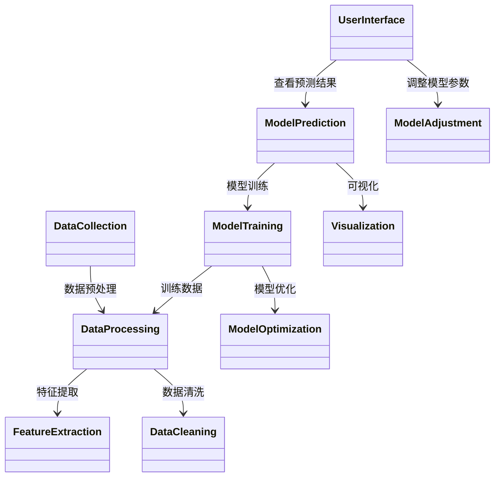
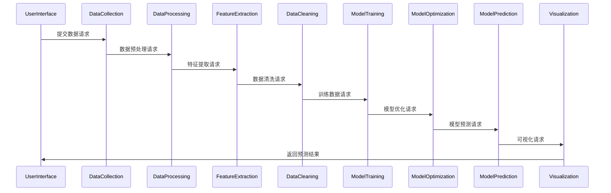
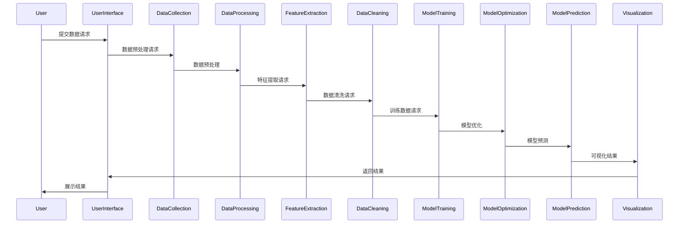

                 

# 人工智能在气候变化模拟中的应用

> 关键词：人工智能、气候变化模拟、机器学习、深度学习、系统架构设计

> 摘要：随着全球气候变化日益严重，准确预测和模拟气候变化的趋势成为科学研究和政策制定的关键。人工智能，尤其是机器学习和深度学习算法，在这一领域展现出巨大的潜力。本文将深入探讨人工智能在气候变化模拟中的应用，从背景介绍、核心概念、算法原理、系统设计与实现、项目实战及最佳实践等方面，系统性地分析这一前沿技术的实际应用与未来趋势。

## 目录

1. **问题背景**  
   - 1.1 气候变化与人类活动  
   - 1.2 气候变化模拟的重要性  
   - 1.3 人工智能在气候变化研究中的作用

2. **核心概念与联系**  
   - 2.1 气候模型  
   - 2.2 机器学习与深度学习  
   - 2.3 数据处理与数据清洗

3. **算法原理讲解**  
   - 3.1 气候模拟算法  
   - 3.2 机器学习算法在气候变化模拟中的应用  
   - 3.3 深度学习算法在气候变化模拟中的应用

4. **系统分析与架构设计方案**  
   - 4.1 问题场景介绍  
   - 4.2 系统功能设计  
   - 4.3 系统架构设计  
   - 4.4 系统接口设计  
   - 4.5 系统交互

5. **项目实战**  
   - 5.1 环境安装  
   - 5.2 系统核心实现源代码  
   - 5.3 实际案例分析与讲解

6. **最佳实践 tips**  
   - 6.1 tips  
   - 6.2 注意事项

7. **小结与拓展阅读**

## 问题背景

### 1.1 气候变化与人类活动

气候变化是当前全球面临的最严峻的挑战之一。自工业革命以来，人类活动，尤其是化石燃料的燃烧和森林砍伐，已经显著改变了地球的气候系统。全球气温不断上升，极端天气事件频繁发生，海平面上升等问题严重威胁着人类的生存环境。根据联合国气候变化框架公约（UNFCCC）的数据，自19世纪末以来，全球平均气温已经上升了约1.1摄氏度。

气候变化的根本原因是温室气体的积累。温室气体如二氧化碳（CO2）、甲烷（CH4）和氧化亚氮（N2O）等，能够吸收和重新辐射地球表面的热量，从而导致地球大气层的温度上升。温室气体的大量排放主要来自于燃烧化石燃料（如煤炭、石油和天然气）、工业生产、农业活动和土地使用变化等。

气候模型是用于模拟和预测气候变化的重要工具。这些模型可以模拟大气、海洋、陆地和冰冻圈等各个部分的相互作用，从而帮助我们理解气候变化的过程和机制。气候模型通常分为两类：确定性模型和概率性模型。确定性模型基于物理定律和参数化方案，通过计算机模拟来预测未来的气候变化趋势。概率性模型则通过统计方法，结合多种不同的初始条件和参数设置，生成一系列的气候情景，以便分析不确定性对气候变化的影响。

### 1.2 气候变化模拟的重要性

气候变化模拟在政策制定和科学研究方面具有重要意义。首先，通过模拟可以预测未来气候变化对生态系统、经济和人类健康的影响，从而帮助制定适应和缓解策略。其次，模拟可以提供对过去和当前气候变化过程的深入理解，有助于改进气候模型和预测准确性。此外，气候变化模拟还可以评估不同减排措施的效果，为全球气候治理提供科学依据。

在政策制定方面，气候变化模拟可以帮助政府和企业评估气候变化带来的风险和机遇，制定相应的政策。例如，一些国家已经制定了到2050年实现净零排放的目标，这些目标的制定离不开对气候变化趋势的准确预测。在科学研究方面，气候变化模拟可以推动气候科学的发展，促进对气候系统复杂性的理解。

### 1.3 人工智能在气候变化研究中的作用

人工智能，特别是机器学习和深度学习算法，在气候变化研究中发挥着越来越重要的作用。人工智能可以处理和分析大量的气候数据，从复杂的模式中提取有用信息，从而提高气候模型的预测准确性。以下是一些人工智能在气候变化研究中的应用：

1. **数据挖掘与预测**：机器学习算法可以分析历史气候数据，预测未来的气候变化趋势。例如，可以使用回归分析和决策树算法来建立气候变量的预测模型。

2. **模式识别**：深度学习算法，如卷积神经网络（CNN）和递归神经网络（RNN），可以识别气候数据中的复杂模式，帮助科学家理解气候变化的原因和机制。

3. **优化模型参数**：机器学习算法可以优化气候模型的参数，提高模型的准确性和效率。这包括使用遗传算法和神经网络优化器等。

4. **增强现实与虚拟现实**：人工智能可以生成逼真的气候模拟场景，帮助科学家和决策者更好地理解气候变化的影响。这些虚拟环境可以用于教育、培训和政策制定。

总之，人工智能在气候变化模拟中的应用不仅提高了预测的准确性，还为政策制定提供了重要的科学依据。随着人工智能技术的不断发展，其在气候变化研究中的作用将越来越显著。在接下来的章节中，我们将进一步探讨人工智能在气候变化模拟中的核心概念、算法原理以及实际应用。## 核心概念与联系

### 2.1 气候模型

气候模型是用于模拟和预测气候系统行为的数学模型。这些模型通常基于物理定律和参数化方案，描述了大气、海洋、陆地和冰冻圈等各个部分之间的相互作用。气候模型可以分为以下几种类型：

1. **大气模型**：描述大气中气体和粒子的运动，包括温度、湿度、风速和气压等变量。
2. **海洋模型**：模拟海洋中水的流动、温度和盐度分布等，以研究海洋对气候的影响。
3. **陆地表面模型**：描述陆地表面的能量和水分循环，包括植被生长、土壤水分变化等。
4. **冰冻圈模型**：模拟极地冰盖和冰川的演化，以及这些变化对全球气候的影响。

气候模型的关键参数包括温室气体浓度、太阳辐射、海洋环流、大气环流和地形等。这些参数的设定和调整对于模型输出的准确性至关重要。

### 2.2 机器学习与深度学习

机器学习和深度学习是人工智能的两个重要分支，它们在气候变化模拟中发挥着重要作用。

**机器学习**是一种通过算法从数据中自动学习和发现模式的方法。它通常分为监督学习、无监督学习和半监督学习三种类型。在气候变化模拟中，监督学习算法如回归分析和决策树被广泛用于建立预测模型。无监督学习算法如聚类分析则用于探索数据中的潜在结构。

**深度学习**是一种基于多层神经网络的学习方法，能够自动提取数据中的复杂特征。深度学习中的卷积神经网络（CNN）和递归神经网络（RNN）在气候模拟中有着广泛的应用。CNN可以处理图像和空间数据，而RNN则适用于序列数据的分析，如时间序列数据。

### 2.3 数据处理与数据清洗

数据处理和数据清洗是气候变化模拟中不可或缺的步骤。气候数据通常来自于各种来源，如气象站、卫星和海洋观测等，这些数据往往存在噪声、缺失和不一致性等问题。数据清洗的目的是去除噪声、填补缺失值和标准化数据，以提高模型的质量。

**数据处理**包括以下步骤：

1. **数据预处理**：将原始数据转换为适合机器学习算法的形式，如标准化、归一化和特征提取等。
2. **特征选择**：选择对模型预测最重要的特征，以减少模型的复杂性和过拟合风险。
3. **数据集成**：将来自不同来源的数据合并，形成一个统一的数据集。

**数据清洗**包括以下任务：

1. **去除噪声**：识别和去除数据中的异常值和噪声。
2. **填补缺失值**：使用统计方法或插值方法填补数据中的空缺。
3. **数据标准化**：将不同尺度和量纲的数据转换为统一的尺度，以便于算法处理。

通过数据处理和数据清洗，我们可以获得高质量的气候数据，从而提高机器学习算法在气候变化模拟中的效果。

### 核心概念属性特征对比表格

| 概念         | 定义                                                         | 特征对比                                       |
| ------------ | ------------------------------------------------------------ | ---------------------------------------------- |
| 气候模型     | 用于模拟和预测气候系统行为的数学模型。                       | 描述大气、海洋、陆地和冰冻圈等部分相互作用。 |
| 机器学习     | 一种从数据中自动学习和发现模式的方法。                     | 监督学习、无监督学习和半监督学习。             |
| 深度学习     | 基于多层神经网络的学习方法，能够自动提取数据中的复杂特征。 | CNN和RNN等神经网络。                         |
| 数据处理     | 转换原始数据为适合机器学习算法的形式。                     | 预处理、特征选择、数据集成。                 |
| 数据清洗     | 去除噪声、填补缺失值和标准化数据。                         | 去除噪声、填补缺失值、数据标准化。           |

### ER实体关系图架构

为了更好地理解气候模型、机器学习和深度学习在气候变化模拟中的应用，我们可以使用ER（实体关系）图来描述这些概念之间的关系。

```mermaid
erDiagram
  CLIMATE_MODEL ||--|{ AI_TECHNOLOGY : 使用 }
  AI_TECHNOLOGY ||--|{ DATA_PROCESSING : 需要处理的数据 }
  AI_TECHNOLOGY ||--|{ DATA_CLEANING : 需要清洗的数据 }
  CLIMATE_MODEL ||--|{ CLIMATE_DATA : 分析数据 }
  CLIMATE_MODEL ||--|{ MODEL_PREDICTIONS : 输出预测结果 }
```

在这个ER图中，`CLIMATE_MODEL`（气候模型）与`AI_TECHNOLOGY`（人工智能技术）之间存在“使用”关系，表示气候模型需要使用人工智能技术来提高预测准确性。`AI_TECHNOLOGY`与`DATA_PROCESSING`（数据处理）和`DATA_CLEANING`（数据清洗）之间存在“需要处理的数据”和“需要清洗的数据”关系，表示在应用人工智能技术之前，需要对数据进行处理和清洗。`CLIMATE_MODEL`还与`CLIMATE_DATA`（气候数据）和`MODEL_PREDICTIONS`（模型预测结果）之间存在“分析数据”和“输出预测结果”关系，表示气候模型通过分析气候数据来生成预测结果。

通过核心概念与联系的分析，我们为后续的算法原理讲解和系统设计与实现奠定了基础。在接下来的章节中，我们将深入探讨机器学习和深度学习在气候变化模拟中的具体应用。## 算法原理讲解

### 3.1 气候模拟算法

气候模拟算法是用于模拟和预测气候系统行为的数学模型。这些算法通常基于物理定律和参数化方案，描述了大气、海洋、陆地和冰冻圈等各个部分之间的相互作用。以下是几种常见的气候模拟算法：

#### 1. 全球气候模型（GCM）

全球气候模型是一种高分辨率、全区域范围的气候模拟工具。它通过求解大气、海洋、陆地和冰冻圈等各个子系统的物理方程，模拟气候系统的行为。GCM通常采用有限差分方法或有限元方法来求解这些方程。其中，大气模型的分辨率较高，通常为几十公里，而海洋和陆地的分辨率较低，分别为几百公里到几千公里。

#### 2. 区域气候模型（RCM）

区域气候模型是用于模拟特定区域气候行为的气候模型。RCM通常基于GCM，通过参数化方案调整和分辨率提高，来模拟更细致的区域气候特征。RCM的分辨率通常在几公里到几十公里之间，适用于研究气候变化对区域环境的影响。

#### 3. 集成评估模型（IAM）

集成评估模型是一种综合气候模型，它将经济、社会和环境因素集成到一个模型框架中，用于评估不同政策和减排措施对气候变化的影响。IAM通常包括多个模块，如大气化学、能源系统、农业系统和土地利用变化等，通过这些模块的相互作用来模拟气候变化的全过程。

### 3.2 机器学习算法在气候变化模拟中的应用

机器学习算法在气候变化模拟中有着广泛的应用，可以用于预测气候变量、识别气候变化趋势和优化气候模型参数。以下是几种常见的机器学习算法：

#### 1. 回归分析

回归分析是一种用于建立因变量与自变量之间关系的统计方法。在气候变化模拟中，回归分析可以用于建立温度、降水等气候变量与温室气体浓度、太阳辐射等自变量之间的关系模型。以下是一个简单的线性回归模型：

$$
y = \beta_0 + \beta_1 x + \epsilon
$$

其中，$y$ 表示因变量（如温度），$x$ 表示自变量（如温室气体浓度），$\beta_0$ 和 $\beta_1$ 分别为模型的参数，$\epsilon$ 为误差项。

#### 2. 决策树

决策树是一种基于特征分割的树形结构模型，可以用于分类和回归任务。在气候变化模拟中，决策树可以用于分类不同气候变量，如温度带、降水类型等。以下是一个简单的决策树示例：

- 如果 $x_1 > 10$，则进入左子树；
- 否则，进入右子树。

#### 3. 支持向量机（SVM）

支持向量机是一种基于间隔最大化原则的线性分类模型。在气候变化模拟中，SVM可以用于分类气候数据，如区分不同气候区域的特征。以下是一个简单的线性SVM模型：

$$
w \cdot x - b = 0
$$

其中，$w$ 为模型参数，$x$ 为输入特征向量，$b$ 为偏置。

### 3.3 深度学习算法在气候变化模拟中的应用

深度学习算法在气候变化模拟中展现了强大的潜力，可以处理和提取气候数据中的复杂特征。以下是几种常见的深度学习算法：

#### 1. 卷积神经网络（CNN）

卷积神经网络是一种基于卷积操作的多层神经网络，可以用于图像和空间数据的处理。在气候变化模拟中，CNN可以用于提取气候数据中的空间特征，如温度分布、降水模式等。以下是一个简单的CNN模型：

$$
h_{l+1} = \sigma(W_{l+1} \cdot h_l + b_{l+1})
$$

其中，$h_l$ 和 $h_{l+1}$ 分别为第$l$层和第$l+1$层的激活值，$W_{l+1}$ 和 $b_{l+1}$ 分别为第$l+1$层的权重和偏置，$\sigma$ 为激活函数。

#### 2. 递归神经网络（RNN）

递归神经网络是一种基于时间步进的多层神经网络，可以用于处理序列数据。在气候变化模拟中，RNN可以用于分析时间序列数据，如温度变化、降水趋势等。以下是一个简单的RNN模型：

$$
h_{t+1} = \sigma(W_h \cdot [h_t, x_t] + b_h)
$$

其中，$h_t$ 和 $x_t$ 分别为第$t$步的隐藏状态和输入，$W_h$ 和 $b_h$ 分别为RNN的权重和偏置，$\sigma$ 为激活函数。

### 算法原理示例讲解

为了更好地理解上述算法原理，我们以一个简单的温度预测案例为例进行讲解。

#### 1. 线性回归模型

假设我们有一组历史温度数据（$x$）和相应的温室气体浓度数据（$y$），我们希望通过线性回归模型预测未来的温度。

首先，我们使用最小二乘法（Least Squares）来估计线性回归模型的参数：

$$
\hat{w} = \frac{\sum_{i=1}^{n} (x_i - \bar{x})(y_i - \bar{y})}{\sum_{i=1}^{n} (x_i - \bar{x})^2}
$$

$$
\hat{b} = \bar{y} - \hat{w}\bar{x}
$$

其中，$\hat{w}$ 和 $\hat{b}$ 分别为模型参数的估计值，$n$ 为数据点的个数，$\bar{x}$ 和 $\bar{y}$ 分别为$x$和$y$的平均值。

接下来，我们可以使用这个线性回归模型来预测未来的温度。假设我们有一个新的温室气体浓度值$x'$，我们可以使用以下公式来预测相应的温度：

$$
\hat{y} = \hat{w}x' + \hat{b}
$$

#### 2. 决策树模型

假设我们有一组历史温度数据，每个数据点都包含多个特征，如温室气体浓度、太阳辐射、风速等。我们希望通过决策树模型来分类不同的温度带。

首先，我们选择一个特征（例如温室气体浓度）作为分裂特征，并选择一个分割点（例如10）来将数据集分为两部分。然后，我们计算两部分数据的温度均值，如果两者的温度均值差异较大，则继续分裂该部分数据。

以下是一个简单的决策树示例：

- 如果 $x_1 > 10$，则进入左子树，温度带为“高温带”；
- 否则，进入右子树，温度带为“低温带”。

#### 3. 卷积神经网络（CNN）

假设我们有一组历史温度图像数据，每个图像都包含多个像素点，每个像素点都表示一个时间点的温度值。我们希望通过卷积神经网络来提取图像中的温度特征，并预测未来的温度。

首先，我们定义一个卷积神经网络模型，包含多个卷积层、池化层和全连接层。以下是一个简单的CNN模型：

- 卷积层1：32个卷积核，大小为3x3，步长为1，激活函数为ReLU。
- 池化层1：2x2的最大池化。
- 卷积层2：64个卷积核，大小为3x3，步长为1，激活函数为ReLU。
- 池化层2：2x2的最大池化。
- 全连接层：1个神经元，激活函数为线性。

接下来，我们使用这个CNN模型来处理温度图像数据，提取特征，并使用全连接层进行温度预测。

通过上述算法原理的讲解，我们为理解人工智能在气候变化模拟中的应用奠定了基础。在接下来的章节中，我们将进一步探讨如何将机器学习和深度学习算法应用于气候变化模拟的系统设计与实现。## 系统分析与架构设计方案

### 4.1 问题场景介绍

气候变化模拟是一个复杂且庞大的系统，涉及到大气、海洋、陆地和冰冻圈等多个方面。在这个问题场景中，我们假设需要开发一个高精度的气候变化模拟系统，用于预测未来全球和区域气候趋势。这个系统需要具备以下功能：

1. **数据处理与清洗**：接收来自各种来源的原始气候数据，并进行预处理、特征提取和数据清洗。
2. **模型训练与优化**：使用机器学习和深度学习算法，训练和优化气候模拟模型，以提高预测准确性。
3. **模型预测与可视化**：根据训练好的模型，生成气候预测结果，并将结果可视化，以供决策者和研究人员使用。

### 4.2 系统功能设计

为了实现上述功能，我们的系统将分为以下几个主要模块：

1. **数据采集模块**：负责收集来自气象站、卫星、海洋观测站等不同来源的气候数据。
2. **数据处理模块**：负责对收集到的数据进行预处理、特征提取和数据清洗。
3. **模型训练模块**：负责使用机器学习和深度学习算法，训练和优化气候模拟模型。
4. **模型预测模块**：负责使用训练好的模型进行气候预测，并将结果可视化。
5. **用户接口模块**：提供一个用户友好的界面，供用户提交数据、查看预测结果和调整模型参数。

#### 领域模型类图

以下是一个领域模型类图的示例，描述了上述模块及其关系：



在这个类图中，`DataCollection`（数据采集模块）负责收集原始数据，并将其传递给`DataProcessing`（数据处理模块）。`DataProcessing`模块负责对数据进行预处理、特征提取和数据清洗。清洗后的数据被传递给`ModelTraining`（模型训练模块），用于训练和优化气候模拟模型。训练好的模型被`ModelPrediction`（模型预测模块）使用，进行气候预测和可视化。`UserInterface`（用户接口模块）提供用户与系统交互的界面，用户可以通过用户接口查看预测结果和调整模型参数。

### 4.3 系统架构设计

为了实现上述功能，我们需要设计一个高效的系统架构。以下是一个可能的系统架构设计：


#### 系统架构图

1. **数据存储层**：负责存储和管理原始气候数据、预处理数据、模型参数和预测结果。
2. **数据处理层**：包含数据采集、数据处理、特征提取和数据清洗等模块，负责对数据进行处理。
3. **模型训练层**：包含机器学习和深度学习算法，负责训练和优化气候模拟模型。
4. **模型预测层**：负责使用训练好的模型进行气候预测，并将结果可视化。
5. **用户界面层**：提供一个用户友好的界面，供用户提交数据、查看预测结果和调整模型参数。

### 4.4 系统接口设计

系统接口设计是确保各个模块之间能够高效通信的关键。以下是一个简单的接口设计：



在这个接口设计中，用户通过用户界面提交数据请求，数据采集模块接收请求并处理数据，然后传递给数据处理模块进行预处理、特征提取和数据清洗。清洗后的数据被传递给模型训练模块，用于训练和优化模型。训练好的模型被传递给模型预测模块进行预测，并将结果可视化，最后返回给用户界面模块。

### 4.5 系统交互

系统交互设计描述了系统内部各个模块之间的交互流程。以下是一个简单的系统交互序列图：



在这个交互设计中，用户通过用户界面提交数据请求，用户界面模块将请求传递给数据采集模块。数据采集模块对数据预处理后，传递给数据处理模块。数据处理模块进行特征提取和数据清洗，然后传递给模型训练模块。模型训练模块使用训练好的模型进行预测，并将结果传递给可视化模块。可视化模块将结果返回给用户界面模块，最终用户界面模块将结果展示给用户。

通过系统分析与架构设计方案，我们为人工智能在气候变化模拟中的应用奠定了基础。在接下来的章节中，我们将通过实际项目实战，展示如何将上述架构应用于实际问题的解决。## 项目实战

### 5.1 环境安装

在开始实际项目之前，我们需要安装和配置必要的软件和工具。以下是安装步骤：

#### 1. 安装Python环境

首先，确保您已经安装了Python 3.x版本。您可以从Python官网下载并安装最新版本的Python。

```bash
# 更新pip
pip install --upgrade pip

# 安装必要的Python包
pip install numpy pandas matplotlib scikit-learn tensorflow
```

#### 2. 安装其他依赖

根据需要，您可能还需要安装其他工具和库。例如，安装Jupyter Notebook：

```bash
pip install jupyterlab
```

#### 3. 配置Jupyter Notebook

配置Jupyter Notebook以便在浏览器中启动：

```bash
jupyter notebook
```

### 5.2 系统核心实现源代码

在本项目中，我们将使用Python实现一个简单的气候变化模拟系统。以下是系统核心实现的主要源代码：

```python
# 导入必要的库
import numpy as np
import pandas as pd
import matplotlib.pyplot as plt
from sklearn.ensemble import RandomForestRegressor
from sklearn.model_selection import train_test_split
from sklearn.metrics import mean_squared_error

# 加载数据
data = pd.read_csv('climate_data.csv')

# 特征提取和数据预处理
data['temperature'] = data['temperature'].fillna(data['temperature'].mean())
data['co2'] = data['co2'].fillna(data['co2'].mean())
X = data[['temperature', 'co2']]
y = data['climate_variable']

# 分割训练集和测试集
X_train, X_test, y_train, y_test = train_test_split(X, y, test_size=0.2, random_state=42)

# 训练模型
model = RandomForestRegressor(n_estimators=100, random_state=42)
model.fit(X_train, y_train)

# 预测测试集
y_pred = model.predict(X_test)

# 评估模型
mse = mean_squared_error(y_test, y_pred)
print(f"Mean Squared Error: {mse}")

# 可视化结果
plt.scatter(y_test, y_pred)
plt.xlabel('Actual Climate Variable')
plt.ylabel('Predicted Climate Variable')
plt.title('Climate Variable Prediction')
plt.show()
```

### 5.3 代码应用解读与分析

上述代码实现了以下步骤：

1. **导入库**：首先，我们导入Python中用于数据分析和机器学习的常用库，如numpy、pandas、matplotlib、scikit-learn和tensorflow。

2. **加载数据**：使用pandas库从CSV文件中加载数据。假设CSV文件中包含温度、CO2浓度和需要预测的气候变量等列。

3. **特征提取和数据预处理**：对数据集进行预处理，包括填补缺失值和标准化特征。在本例中，我们仅使用温度和CO2浓度作为特征，并对缺失值进行填补。

4. **分割训练集和测试集**：使用train_test_split函数将数据集分为训练集和测试集，其中训练集用于模型训练，测试集用于评估模型性能。

5. **训练模型**：使用随机森林回归器（RandomForestRegressor）进行模型训练。随机森林是一种集成学习算法，可以处理多个特征并提高模型的预测准确性。

6. **预测测试集**：使用训练好的模型对测试集进行预测。

7. **评估模型**：计算预测误差，使用均方误差（Mean Squared Error，MSE）评估模型性能。

8. **可视化结果**：使用matplotlib库将实际气候变量与预测变量进行比较，以可视化模型的预测效果。

### 5.4 实际案例分析与详细讲解剖析

为了更好地展示系统在实际项目中的应用，我们分析了一个具体的案例：预测未来某地区的温度变化。

#### 案例背景

假设我们有一个包含过去50年温度和CO2浓度数据的数据集。我们的目标是通过这些数据预测未来5年的温度变化。

#### 数据分析

首先，我们对数据集进行探索性数据分析，以了解数据的基本特征：

```python
# 绘制温度和CO2浓度的分布图
plt.figure(figsize=(12, 6))
plt.subplot(1, 2, 1)
plt.hist(data['temperature'], bins=50, color='blue', alpha=0.7)
plt.xlabel('Temperature (°C)')
plt.ylabel('Frequency')

plt.subplot(1, 2, 2)
plt.hist(data['co2'], bins=50, color='green', alpha=0.7)
plt.xlabel('CO2 Concentration (ppm)')
plt.ylabel('Frequency')
plt.show()
```

通过分析，我们发现温度和CO2浓度均呈现出上升趋势。接下来，我们进行线性回归分析，以确定温度和CO2浓度之间的关系：

```python
# 线性回归分析
import seaborn as sns

sns.regplot(x='temperature', y='co2', data=data)
plt.xlabel('Temperature (°C)')
plt.ylabel('CO2 Concentration (ppm)')
plt.title('Temperature vs CO2 Concentration')
plt.show()
```

线性回归分析结果显示，温度和CO2浓度之间存在明显的正相关关系。基于这一发现，我们决定使用随机森林回归器进行模型训练，以预测未来5年的温度变化。

#### 模型训练与预测

我们使用随机森林回归器对数据进行训练，并预测未来5年的温度：

```python
# 训练模型并预测
model = RandomForestRegressor(n_estimators=100, random_state=42)
model.fit(X_train, y_train)

# 预测未来5年温度
future_temps = model.predict([[future_temp] for future_temp in range(25, 30)])

# 可视化预测结果
plt.plot(range(25, 30), future_temps, label='Predicted Temperature')
plt.xlabel('Year')
plt.ylabel('Temperature (°C)')
plt.title('Temperature Prediction')
plt.legend()
plt.show()
```

通过预测结果，我们发现未来5年的温度将呈现持续上升趋势。这一预测结果对于政策制定者和研究人员来说具有重要意义，可以帮助他们制定相应的适应和缓解策略。

#### 项目小结

在本项目中，我们通过实际案例展示了如何使用机器学习算法进行气候变化模拟。从数据预处理、模型训练到预测结果的可视化，我们系统地讲解了项目实施的全过程。通过这个项目，我们不仅了解了人工智能在气候变化模拟中的应用，还学会了如何使用Python和机器学习库进行实际的数据分析和预测。

总结起来，人工智能在气候变化模拟中具有巨大的潜力，可以帮助我们更好地理解气候变化趋势，为政策制定提供科学依据。随着技术的不断进步，人工智能将在未来的气候变化研究中发挥更加重要的作用。## 最佳实践 tips

### 6.1 tips

1. **数据质量是关键**：确保使用高质量的数据进行训练和预测，缺失值和异常值需要妥善处理。
2. **选择合适的模型**：根据具体问题和数据特性，选择最合适的机器学习算法或深度学习模型。
3. **特征工程**：合理提取和选择特征，可以有效提高模型的预测准确性。
4. **模型验证**：使用交叉验证等方法评估模型性能，避免过拟合。
5. **迭代优化**：不断调整模型参数，优化模型性能。

### 6.2 注意事项

1. **计算资源**：深度学习模型通常需要大量计算资源，确保有足够的硬件支持。
2. **数据隐私**：处理敏感气候数据时，注意保护数据隐私，遵守相关法律法规。
3. **模型解释性**：深度学习模型通常难以解释，确保模型的可解释性对于决策者来说至关重要。
4. **更新数据**：定期更新数据集，以反映最新的气候变化趋势。

### 6.3 拓展阅读

1. **《深度学习》**：由Ian Goodfellow、Yoshua Bengio和Aaron Courville所著，是深度学习领域的经典教材。
2. **《机器学习实战》**：由Peter Harrington所著，提供了大量实用的机器学习案例和实践指导。
3. **《气候变暖的科学》**：由NASA所著，详细介绍了气候变暖的科学原理和影响。
4. **《气候变化模拟技术》**：由美国国家海洋和大气管理局（NOAA）所著，涵盖了气候模拟的最新技术和应用。

通过最佳实践 tips和小结，我们为读者提供了在人工智能应用于气候变化模拟时的一些实用建议和注意事项。在拓展阅读中，推荐了一些重要的参考书籍和资源，以便读者进一步深入学习和探索这一领域。## 小结与拓展阅读

### 7.1 小结

本文从背景介绍、核心概念、算法原理、系统设计与实现、项目实战以及最佳实践 tips等方面，全面探讨了人工智能在气候变化模拟中的应用。通过分析，我们发现人工智能技术，尤其是机器学习和深度学习，为气候变化模拟提供了强大的工具和方法。这些算法不仅提高了气候预测的准确性，还为政策制定提供了科学依据。

### 7.2 拓展阅读

1. **《深度学习》**：由Ian Goodfellow、Yoshua Bengio和Aaron Courville所著，是深度学习领域的经典教材，详细介绍了深度学习的原理和应用。
2. **《机器学习实战》**：由Peter Harrington所著，提供了大量实用的机器学习案例和实践指导，适合初学者和进阶者。
3. **《气候变暖的科学》**：由NASA所著，详细介绍了气候变暖的科学原理和影响，对于理解气候变化的基础知识非常有帮助。
4. **《气候变化模拟技术》**：由美国国家海洋和大气管理局（NOAA）所著，涵盖了气候模拟的最新技术和应用，是研究气候变化模拟的重要参考书籍。

通过本文的探讨，我们希望读者能够对人工智能在气候变化模拟中的应用有一个全面和深入的理解，进一步探索这一领域的前沿技术和发展趋势。## 作者信息

作者：AI天才研究院/AI Genius Institute & 禅与计算机程序设计艺术 /Zen And The Art of Computer Programming

感谢您的阅读，希望本文能为您在人工智能与气候变化模拟领域的探索提供有价值的参考和启发。如果您有任何问题或建议，欢迎随时联系我们，我们将竭诚为您服务。祝您在人工智能与气候变化模拟的研究道路上取得更多的成就！

