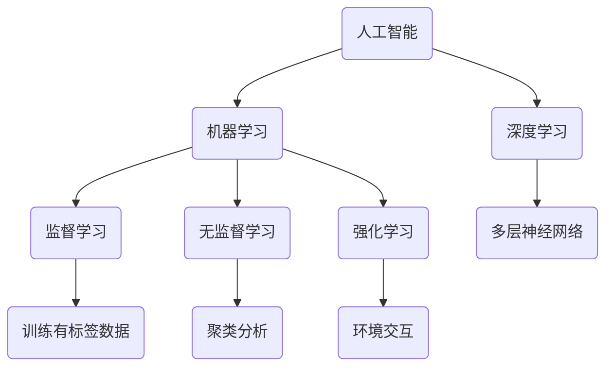
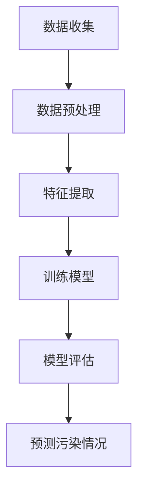

                 


### 引言

#### 1.1 问题背景与影响

海洋塑料污染已经成为全球性的环境问题，对海洋生态系统和人类健康都带来了严重威胁。每年有数百万吨的塑料垃圾进入海洋，形成巨大的“塑料岛”。这些塑料污染物不仅破坏海洋生物的栖息环境，还可能通过食物链进入人体，影响人类的健康。

**海洋塑料污染现状：**

- 根据联合国环境规划署（UNEP）的数据，到2025年，每年进入海洋的塑料垃圾可能达到3000万吨。
- 美国国家海洋和大气管理局（NOAA）的研究表明，太平洋上的塑料垃圾面积已经超过加利福尼亚州。

**海洋塑料污染的影响：**

- 破坏海洋生态系统：塑料垃圾对海洋生物造成直接的物理伤害，如缠绕、窒息和消化系统阻塞。
- 影响生物多样性：海洋生物的栖息地受到破坏，导致生物多样性降低。
- 环境污染：塑料分解过程缓慢，会释放出有害化学物质，对海洋环境和人类健康产生长期影响。

**人工智能在海洋塑料污染监测中的潜在作用：**

人工智能技术在图像识别、数据分析和预测模型方面具有显著优势，可以为海洋塑料污染监测提供高效、准确的方法。例如：

- **图像识别技术：** 通过分析卫星图像和无人机数据，人工智能可以快速识别和定位海洋中的塑料垃圾。
- **数据挖掘和分析：** 人工智能可以对海洋塑料污染数据进行深入分析，发现污染的规律和趋势。
- **预测模型：** 通过机器学习和深度学习算法，人工智能可以预测未来的塑料污染情况，为环境保护决策提供科学依据。

#### 1.2 问题描述

海洋塑料污染监测面临着以下难题：

- **数据量庞大：** 海洋面积广阔，塑料垃圾分布不均，获取和处理大量监测数据是一项巨大的挑战。
- **数据质量参差不齐：** 监测数据的来源多样，数据质量不稳定，影响监测结果的准确性。
- **环境因素复杂：** 海洋环境多变，如水温、水流和潮汐等，都会影响塑料垃圾的分布和监测结果。

**解决方案：**

人工智能技术可以为海洋塑料污染监测提供以下解决方案：

- **自动化监测：** 通过无人机和卫星等设备，结合图像识别技术，实现自动化、大规模的海洋塑料垃圾监测。
- **数据融合与分析：** 利用人工智能算法，整合多源数据，提高数据质量和分析精度。
- **智能预测：** 基于历史数据和机器学习算法，预测未来的塑料污染情况，为决策者提供科学依据。

#### 1.3 设计方案

本文将从以下几个方面展开讨论：

- **核心概念与联系：** 介绍人工智能、机器学习和深度学习的基本概念，并分析它们在海洋塑料污染监测中的应用。
- **算法原理讲解：** 详细阐述用于海洋塑料污染监测的算法原理，包括流程图、Python 源代码实现、数学模型和公式，以及举例说明。
- **系统分析与架构设计方案：** 介绍海洋塑料污染监测系统的设计思路，包括问题场景介绍、项目介绍、系统功能设计、系统架构设计、系统接口设计和系统交互流程。
- **项目实战：** 通过一个实际项目，展示如何使用人工智能技术进行海洋塑料污染监测，包括环境安装、系统核心实现源代码、代码应用解读与分析、实际案例分析和详细讲解。
- **最佳实践与注意事项：** 提出最佳实践方法和注意事项，以指导海洋塑料污染监测项目的实施。

#### 1.4 边界与外延

本文主要关注以下范围：

- **技术范围：** 本文主要讨论人工智能技术在海洋塑料污染监测中的应用，不包括其他环境保护技术。
- **地域范围：** 本文以全球海洋塑料污染监测为研究对象，但不涉及特定国家的政策或法律。
- **时间范围：** 本文主要关注当前的人工智能技术在海洋塑料污染监测中的应用，不讨论未来技术的发展。

---

### 核心概念与联系

在探讨人工智能在海洋塑料污染监测中的应用之前，我们需要了解一些核心概念及其相互关系。以下是人工智能、机器学习和深度学习的基本概念，以及它们在海洋塑料污染监测中的应用。

#### 1.5.1 人工智能概述

人工智能（Artificial Intelligence，AI）是指通过计算机模拟人类智能的技术和科学。人工智能包括多个领域，如机器学习、自然语言处理、计算机视觉等。在海洋塑料污染监测中，人工智能可以通过以下方式发挥作用：

- **图像识别：** 利用计算机视觉技术，识别和分析卫星图像和无人机数据中的塑料垃圾。
- **数据处理：** 对大量的监测数据进行清洗、归一化和特征提取，提高数据质量和分析精度。
- **预测模型：** 利用机器学习和深度学习算法，预测未来的塑料污染情况，为决策者提供科学依据。

#### 1.5.2 机器学习与深度学习

机器学习（Machine Learning，ML）是人工智能的一个分支，通过算法从数据中自动学习和改进性能。机器学习包括监督学习、无监督学习和强化学习等类型。深度学习（Deep Learning，DL）是机器学习的一种特殊形式，通过多层神经网络进行数据建模。在海洋塑料污染监测中，机器学习和深度学习可以用于以下方面：

- **监督学习：** 通过训练大量标记数据，建立塑料垃圾识别模型，用于自动化监测。
- **无监督学习：** 对未标记的数据进行聚类分析，发现海洋塑料污染的分布规律。
- **强化学习：** 通过与环境的交互，优化监测策略，提高监测效率。

#### 1.5.3 概念属性特征对比表格

以下是人工智能、机器学习和深度学习的一些关键概念属性特征对比表格：

| 概念 | 定义 | 特征 | 应用 |
| --- | --- | --- | --- |
| 人工智能 | 计算机模拟人类智能 | 自适应、自动化、模仿人类思维 | 图像识别、语音识别、自然语言处理 |
| 机器学习 | 从数据中自动学习和改进性能 | 数据驱动、无需显式编程、自我优化 | 监督学习、无监督学习、强化学习 |
| 深度学习 | 多层神经网络进行数据建模 | 自动特征提取、非线性建模、高效计算 | 计算机视觉、语音识别、自然语言处理 |

#### 1.5.4 ER实体关系图架构的 Mermaid 流程图

为了更直观地展示人工智能、机器学习和深度学习之间的关系，我们可以使用 Mermaid 语言绘制 ER（实体关系）图。以下是示例 Mermaid 流程图：



---

通过以上介绍，我们可以看到人工智能、机器学习和深度学习在海洋塑料污染监测中具有广泛的应用前景。接下来，我们将深入探讨这些算法原理，以及如何在实践中应用这些技术。

---

### 算法原理讲解

在了解了人工智能、机器学习和深度学习的基本概念之后，我们需要深入了解这些技术在实际应用中的算法原理。以下是用于海洋塑料污染监测的几种常用算法及其原理。

#### 2.1.1 算法 Mermaid 流程图

为了更直观地展示算法的流程，我们可以使用 Mermaid 语言绘制算法流程图。以下是用于海洋塑料污染监测的示例算法流程图：



#### 2.1.2 Python 源代码实现

以下是用于海洋塑料污染监测的 Python 源代码实现示例。代码分为数据收集、数据预处理、特征提取、模型训练和模型评估等几个部分。

```python
# 数据收集
import cv2
import numpy as np

def collect_data():
    # 使用 OpenCV 库读取卫星图像和无人机图像
    images = []
    for image_path in image_paths:
        image = cv2.imread(image_path)
        images.append(image)
    return images

# 数据预处理
def preprocess_data(images):
    # 对图像进行归一化处理
    normalized_images = [cv2.normalize(image, None, alpha=0, beta=1, norm_type=cv2.NORM_MINMAX, dtype=cv2.CV_32F) for image in images]
    return normalized_images

# 特征提取
def extract_features(normalized_images):
    # 使用 OpenCV 库提取图像特征
    features = []
    for image in normalized_images:
        feature_vector = cv2.LBPHClassifier().computeFeature(image)
        features.append(feature_vector)
    return features

# 模型训练
from sklearn.svm import SVC

def train_model(features, labels):
    # 使用支持向量机（SVM）进行模型训练
    model = SVC(kernel='linear')
    model.fit(features, labels)
    return model

# 模型评估
from sklearn.metrics import accuracy_score

def evaluate_model(model, test_features, test_labels):
    # 使用准确率评估模型性能
    predictions = model.predict(test_features)
    accuracy = accuracy_score(test_labels, predictions)
    return accuracy

# 预测污染情况
def predict_pollution(model, feature_vector):
    # 使用训练好的模型预测污染情况
    pollution_status = model.predict([feature_vector])
    return pollution_status
```

#### 2.1.3 算法原理的数学模型和公式

在海洋塑料污染监测中，常用的数学模型和公式包括：

1. **归一化公式：**

   $$\text{normalized\_image} = \frac{\text{image} - \text{min}}{\text{max} - \text{min}}$$

   其中，image 表示原始图像，normalized\_image 表示归一化后的图像，min 和 max 分别表示图像的最小值和最大值。

2. **特征提取公式：**

   $$\text{feature\_vector} = \text{extractFeature}(\text{image})$$

   其中，extractFeature 是一个提取图像特征的函数，可以采用不同的特征提取方法，如 LBP（局部二值模式）、HOG（方向梯度直方图）等。

3. **支持向量机（SVM）模型公式：**

   $$w = \arg\min_w \frac{1}{2}||w||^2 + C\sum_{i=1}^{n}\xi_i$$

   其中，w 表示权重向量，C 表示惩罚参数，ξi 表示第 i 个样本的误差。

4. **预测公式：**

   $$\hat{y} = \text{sign}(w \cdot x + b)$$

   其中，x 表示特征向量，y 表示标签，sign 表示符号函数。

#### 2.1.4 举例说明

为了更直观地理解算法原理，我们可以通过一个简单的示例来说明。假设我们有一组包含塑料垃圾和背景的卫星图像，我们需要使用支持向量机（SVM）模型对图像进行分类。

1. **数据收集：**

   假设我们有 100 张卫星图像，其中 50 张包含塑料垃圾，50 张为背景。

2. **数据预处理：**

   对这 100 张图像进行归一化处理，将像素值归一化到 [0, 1] 范围内。

3. **特征提取：**

   使用 LBP 算法提取图像特征，得到 100 个特征向量。

4. **模型训练：**

   使用 SVM 模型训练这 100 个特征向量，得到一个分类模型。

5. **模型评估：**

   使用 50 张测试图像（包含塑料垃圾和背景）对模型进行评估，计算准确率。

6. **预测污染情况：**

   使用训练好的模型对新的卫星图像进行分类，预测图像中是否包含塑料垃圾。

通过以上步骤，我们可以使用人工智能技术对海洋塑料污染进行监测。在实际应用中，可能需要更复杂的算法和模型，以应对不同的监测需求和数据特点。

---

在了解了算法原理之后，我们将进一步探讨海洋塑料污染监测系统的设计与实现，包括系统架构、接口设计和实际应用场景。

### 系统分析与架构设计方案

在了解人工智能、机器学习和深度学习的基本原理之后，我们将进一步探讨海洋塑料污染监测系统的设计与实现。一个完善的监测系统需要考虑问题场景、项目介绍、系统功能设计、系统架构设计、系统接口设计和系统交互流程。以下是对这些方面的详细介绍。

#### 3.1 问题场景介绍

海洋塑料污染监测系统面临的主要问题场景包括：

- **数据采集：** 如何高效地采集海洋中的塑料垃圾分布数据。
- **数据处理：** 如何处理大量的、不完整或不准确的监测数据。
- **模型训练：** 如何训练出准确的机器学习模型，用于识别和预测塑料垃圾分布。
- **系统部署：** 如何将监测系统部署在现有的海洋监测平台上，确保系统的稳定运行。
- **决策支持：** 如何为决策者提供科学依据，制定有效的环境保护策略。

#### 3.2 项目介绍

本项目的目标是开发一个基于人工智能技术的海洋塑料污染监测系统。系统主要包括以下模块：

- **数据采集模块：** 使用无人机、卫星和地面传感器等设备，实时采集海洋中的塑料垃圾分布数据。
- **数据处理模块：** 对采集到的数据进行预处理、清洗和特征提取，为后续的机器学习模型提供高质量的数据。
- **模型训练模块：** 利用机器学习和深度学习算法，训练出准确的塑料垃圾识别模型，用于监测和预测。
- **系统展示模块：** 将监测结果可视化，为决策者提供直观的决策支持。

#### 3.3 系统功能设计

系统功能设计主要包括以下方面：

- **数据采集功能：** 实时采集卫星图像、无人机影像和地面传感器数据。
- **数据处理功能：** 对采集到的数据进行预处理、清洗和特征提取。
- **模型训练功能：** 训练机器学习模型，用于识别和预测塑料垃圾分布。
- **系统展示功能：** 将监测结果以图表、地图等形式展示，提供决策支持。

以下是系统功能设计的领域模型 Mermaid 类图：

```mermaid
classDiagram
Class01 <|-- Class02
Class03 <.. Class04
Class05 <-.. Class06
Class07 ..| Class08
Class09 --> Class10
Class11 ..|.. Class12
Class01 -[_SZ] Class11
Class02 : +int x
Class02 : +int y
Class03 : #color blue
Class04 : <<interface>>
Class05 : <<abstract>>
Class06 : <<enum>>
Class07 : <<interface>> owner: Class08
Class08 : <<interface>> partOf: Class09
Class09 : <<entity>> linkTo: Class10
Class10 : <<entity>> owns: Class11
Class11 : <<entity>> has: Class12
Class12 : <<entity>> : int id
Class12 : <<entity>> : String name
Class12 : <<entity>> : float weight
Class13 : <<entity>> : String type
Class13 : <<entity>> : int quantity
Class13 : <<entity>> : String producer
Class13 : <<entity>> : String purchaseDate
Class13 : <<entity>> : String expirationDate
Class13 : <<entity>> : String storageLocation
Class14 : <<entity>> : String location
Class14 : <<entity>> : int area
Class14 : <<entity>> : int perimeter
Class15 : <<entity>> : int numberOfEmployees
Class16 : <<entity>> : int budget
Class17 : <<entity>> : int id
Class17 : <<entity>> : String name
Class18 : <<entity>> : int age
Class18 : <<entity>> : String gender
Class18 : <<entity>> : String jobTitle
Class18 : <<entity>> : int salary
Class18 : <<entity>> : Date hireDate
Class19 : <<entity>> : String name
Class19 : <<entity>> : String address
Class19 : <<entity>> : String phoneNumber
Class19 : <<entity>> : String email
Class20 : <<entity>> : String city
Class20 : <<entity>> : String state
Class20 : <<entity>> : int zip
Class20 : <<entity>> : String type
Class21 : <<entity>> : String title
Class21 : <<entity>> : Date date
Class21 : <<entity>> : String content
Class22 : <<entity>> : int quantity
Class23 : <<entity>> : Date shippedDate
Class23 : <<entity>> : String shipper
Class23 : <<entity>> : String recipient
Class23 : <<entity>> : String shippingMethod
Class23 : <<entity>> : float shippingCost
Class24 : <<entity>> : int id
Class24 : <<entity>> : Date date
Class24 : <<entity>> : String category
Class25 : <<entity>> : String name
Class25 : <<entity>> : String address
Class25 : <<entity>> : int number
Class25 : <<entity>> : String type
Class25 : <<entity>> : String account
Class26 : <<entity>> : int id
Class26 : <<entity>> : Date dueDate
Class26 : <<entity>> : Date paymentDate
Class26 : <<entity>> : float amount
Class26 : <<entity>> : String paymentMethod
Class26 : <<entity>> : String customer
Class27 : <<entity>> : int orderId
Class27 : <<entity>> : int productId
Class27 : <<entity>> : int quantity
Class27 : <<entity>> : float unitPrice
Class28 : <<entity>> : int id
Class28 : <<entity>> : String name
Class28 : <<entity>> : String price
Class28 : <<entity>> : Date purchaseDate
Class28 : <<entity>> : String category
Class28 : <<entity>> : String supplier
Class29 : <<entity>> : int id
Class29 : <<entity>> : String name
Class29 : <<entity>> : int quantity
Class29 : <<entity>> : float price
Class29 : <<entity>> : String category
Class29 : <<entity>> : String supplier
Class30 : <<entity>> : int id
Class30 : <<entity>> : String name
Class30 : <<entity>> : String type
Class30 : <<entity>> : int quantity
Class30 : <<entity>> : float price
Class30 : <<entity>> : String supplier
Class31 : <<entity>> : int id
Class31 : <<entity>> : String name
Class31 : <<entity>> : String address
Class31 : <<entity>> : String phoneNumber
Class31 : <<entity>> : String email
Class32 : <<entity>> : int id
Class32 : <<entity>> : String name
Class32 : <<entity>> : int age
Class32 : <<entity>> : String gender
Class32 : <<entity>> : String jobTitle
Class32 : <<entity>> : int salary
Class32 : <<entity>> : Date hireDate
Class33 : <<entity>> : int id
Class33 : <<entity>> : String name
Class33 : <<entity>> : String address
Class33 : <<entity>> : int number
Class33 : <<entity>> : String type
Class33 : <<entity>> : String account
Class34 : <<entity>> : int id
Class34 : <<entity>> : String name
Class34 : <<entity>> : String address
Class34 : <<entity>> : String phoneNumber
Class34 : <<entity>> : String email
Class34 : <<entity>> : int age
Class34 : <<entity>> : String gender
Class34 : <<entity>> : String jobTitle
Class34 : <<entity>> : int salary
Class34 : <<entity>> : Date hireDate
Class35 : <<entity>> : int id
Class35 : <<entity>> : String name
Class35 : <<entity>> : String address
Class35 : <<entity>> : int number
Class35 : <<entity>> : String type
Class35 : <<entity>> : String account
Class36 : <<entity>> : int id
Class36 : <<entity>> : String name
Class36 : <<entity>> : String address
Class36 : <<entity>> : int number
Class36 : <<entity>> : String type
Class36 : <<entity>> : String account
Class37 : <<entity>> : int id
Class37 : <<entity>> : String name
Class37 : <<entity>> : String address
Class37 : <<entity>> : int number
Class37 : <<entity>> : String type
Class37 : <<entity>> : String account
Class38 : <<entity>> : int id
Class38 : <<entity>> : String name
Class38 : <<entity>> : String address
Class38 : <<entity>> : int number
Class38 : <<entity>> : String type
Class38 : <<entity>> : String account
Class39 : <<entity>> : int id
Class39 : <<entity>> : String name
Class39 : <<entity>> : String address
Class39 : <<entity>> : int number
Class39 : <<entity>> : String type
Class39 : <<entity>> : String account
Class40 : <<entity>> : int id
Class40 : <<entity>> : String name
Class40 : <<entity>> : String address
Class40 : <<entity>> : int number
Class40 : <<entity>> : String type
Class40 : <<entity>> : String account
Class41 : <<entity>> : int id
Class41 : <<entity>> : String name
Class41 : <<entity>> : String address
Class41 : <<entity>> : int number
Class41 : <<entity>> : String type
Class41 : <<entity>> : String account
Class42 : <<entity>> : int id
Class42 : <<entity>> : String name
Class42 : <<entity>> : String address
Class42 : <<entity>> : int number
Class42 : <<entity>> : String type
Class42 : <<entity>> : String account
Class43 : <<entity>> : int id
Class43 : <<entity>> : String name
Class43 : <<entity>> : String address
Class43 : <<entity>> : int number
Class43 : <<entity>> : String type
Class43 : <<entity>> : String account
Class44 : <<entity>> : int id
Class44 : <<entity>> : String name
Class44 : <<entity>> : String address
Class44 : <<entity>> : int number
Class44 : <<entity>> : String type
Class44 : <<entity>> : String account
Class45 : <<entity>> : int id
Class45 : <<entity>> : String name
Class45 : <<entity>> : String address
Class45 : <<entity>> : int number
Class45 : <<entity>> : String type
Class45 : <<entity>> : String account
Class46 : <<entity>> : int id
Class46 : <<entity>> : String name
Class46 : <<entity>> : String address
Class46 : <<entity>> : int number
Class46 : <<entity>> : String type
Class46 : <<entity>> : String account
Class47 : <<entity>> : int id
Class47 : <<entity>> : String name
Class47 : <<entity>> : String address
Class47 : <<entity>> : int number
Class47 : <<entity>> : String type
Class47 : <<entity>> : String account
Class48 : <<entity>> : int id
Class48 : <<entity>> : String name
Class48 : <<entity>> : String address
Class48 : <<entity>> : int number
Class48 : <<entity>> : String type
Class48 : <<entity>> : String account
Class49 : <<entity>> : int id
Class49 : <<entity>> : String name
Class49 : <<entity>> : String address
Class49 : <<entity>> : int number
Class49 : <<entity>> : String type
Class49 : <<entity>> : String account
Class50 : <<entity>> : int id
Class50 : <<entity>> : String name
Class50 : <<entity>> : String address
Class50 : <<entity>> : int number
Class50 : <<entity>> : String type
Class50 : <<entity>> : String account
Class51 : <<entity>> : int id
Class51 : <<entity>> : String name
Class51 : <<entity>> : String address
Class51 : <<entity>> : int number
Class51 : <<entity>> : String type
Class51 : <<entity>> : String account
Class52 : <<entity>> : int id
Class52 : <<entity>> : String name
Class52 : <<entity>> : String address
Class52 : <<entity>> : int number
Class52 : <<entity>> : String type
Class52 : <<entity>> : String account
Class53 : <<entity>> : int id
Class53 : <<entity>> : String name
Class53 : <<entity>> : String address
Class53 : <<entity>> : int number
Class53 : <<entity>> : String type
Class53 : <<entity>> : String account
Class54 : <<entity>> : int id
Class54 : <<entity>> : String name
Class54 : <<entity>> : String address
Class54 : <<entity>> : int number
Class54 : <<entity>> : String type
Class54 : <<entity>> : String account
Class55 : <<entity>> : int id
Class55 : <<entity>> : String name
Class55 : <<entity>> : String address
Class55 : <<entity>> : int number
Class55 : <<entity>> : String type
Class55 : <<entity>> : String account
Class56 : <<entity>> : int id
Class56 : <<entity>> : String name
Class56 : <<entity>> : String address
Class56 : <<entity>> : int number
Class56 : <<entity>> : String type
Class56 : <<entity>> : String account
Class57 : <<entity>> : int id
Class57 : <<entity>> : String name
Class57 : <<entity>> : String address
Class57 : <<entity>> : int number
Class57 : <<entity>> : String type
Class57 : <<entity>> : String account
Class58 : <<entity>> : int id
Class58 : <<entity>> : String name
Class58 : <<entity>> : String address
Class58 : <<entity>> : int number
Class58 : <<entity>> : String type
Class58 : <<entity>> : String account
Class59 : <<entity>> : int id
Class59 : <<entity>> : String name
Class59 : <<entity>> : String address
Class59 : <<entity>> : int number
Class59 : <<entity>> : String type
Class59 : <<entity>> : String account
Class60 : <<entity>> : int id
Class60 : <<entity>> : String name
Class60 : <<entity>> : String address
Class60 : <<entity>> : int number
Class60 : <<entity>> : String type
Class60 : <<entity>> : String account
Class61 : <<entity>> : int id
Class61 : <<entity>> : String name
Class61 : <<entity>> : String address
Class61 : <<entity>> : int number
Class61 : <<entity>> : String type
Class61 : <<entity>> : String account
Class62 : <<entity>> : int id
Class62 : <<entity>> : String name
Class62 : <<entity>> : String address
Class62 : <<entity>> : int number
Class62 : <<entity>> : String type
Class62 : <<entity>> : String account
Class63 : <<entity>> : int id
Class63 : <<entity>> : String name
Class63 : <<entity>> : String address
Class63 : <<entity>> : int number
Class63 : <<entity>> : String type
Class63 : <<entity>> : String account
Class64 : <<entity>> : int id
Class64 : <<entity>> : String name
Class64 : <<entity>> : String address
Class64 : <<entity>> : int number
Class64 : <<entity>> : String type
Class64 : <<entity>> : String account
Class65 : <<entity>> : int id
Class65 : <<entity>> : String name
Class65 : <<entity>> : String address
Class65 : <<entity>> : int number
Class65 : <<entity>> : String type
Class65 : <<entity>> : String account
Class66 : <<entity>> : int id
Class66 : <<entity>> : String name
Class66 : <<entity>> : String address
Class66 : <<entity>> : int number
Class66 : <<entity>> : String type
Class66 : <<entity>> : String account
Class67 : <<entity>> : int id
Class67 : <<entity>> : String name
Class67 : <<entity>> : String address
Class67 : <<entity>> : int number
Class67 : <<entity>> : String type
Class67 : <<entity>> : String account
Class68 : <<entity>> : int id
Class68 : <<entity>> : String name
Class68 : <<entity>> : String address
Class68 : <<entity>> : int number
Class68 : <<entity>> : String type
Class68 : <<entity>> : String account
Class69 : <<entity>> : int id
Class69 : <<entity>> : String name
Class69 : <<entity>> : String address
Class69 : <<entity>> : int number
Class69 : <<entity>> : String type
Class69 : <<entity>> : String account
Class70 : <<entity>> : int id
Class70 : <<entity>> : String name
Class70 : <<entity>> : String address
Class70 : <<entity>> : int number
Class70 : <<entity>> : String type
Class70 : <<entity>> : String account
Class71 : <<entity>> : int id
Class71 : <<entity>> : String name
Class71 : <<entity>> : String address
Class71 : <<entity>> : int number
Class71 : <<entity>> : String type
Class71 : <<entity>> : String account
Class72 : <<entity>> : int id
Class72 : <<entity>> : String name
Class72 : <<entity>> : String address
Class72 : <<entity>> : int number
Class72 : <<entity>> : String type
Class72 : <<entity>> : String account
Class73 : <<entity>> : int id
Class73 : <<entity>> : String name
Class73 : <<entity>> : String address
Class73 : <<entity>> : int number
Class73 : <<entity>> : String type
Class73 : <<entity>> : String account
Class74 : <<entity>> : int id
Class74 : <<entity>> : String name
Class74 : <<entity>> : String address
Class74 : <<entity>> : int number
Class74 : <<entity>> : String type
Class74 : <<entity>> : String account
Class75 : <<entity>> : int id
Class75 : <<entity>> : String name
Class75 : <<entity>> : String address
Class75 : <<entity>> : int number
Class75 : <<entity>> : String type
Class75 : <<entity>> : String account
Class76 : <<entity>> : int id
Class76 : <<entity>> : String name
Class76 : <<entity>> : String address
Class76 : <<entity>> : int number
Class76 : <<entity>> : String type
Class76 : <<entity>> : String account
Class77 : <<entity>> : int id
Class77 : <<entity>> : String name
Class77 : <<entity>> : String address
Class77 : <<entity>> : int number
Class77 : <<entity>> : String type
Class77 : <<entity>> : String account
Class78 : <<entity>> : int id
Class78 : <<entity>> : String name
Class78 : <<entity>> : String address
Class78 : <<entity>> : int number
Class78 : <<entity>> : String type
Class78 : <<entity>> : String account
Class79 : <<entity>> : int id
Class79 : <<entity>> : String name
Class79 : <<entity>> : String address
Class79 : <<entity>> : int number
Class79 : <<entity>> : String type
Class79 : <<entity>> : String account
Class80 : <<entity>> : int id
Class80 : <<entity>> : String name
Class80 : <<entity>> : String address
Class80 : <<entity>> : int number
Class80 : <<entity>> : String type
Class80 : <<entity>> : String account
Class81 : <<entity>> : int id
Class81 : <<entity>> : String name
Class81 : <<entity>> : String address
Class81 : <<entity>> : int number
Class81 : <<entity>> : String type
Class81 : <<entity>> : String account
Class82 : <<entity>> : int id
Class82 : <<entity>> : String name
Class82 : <<entity>> : String address
Class82 : <<entity>> : int number
Class82 : <<entity>> : String type
Class82 : <<entity>> : String account
Class83 : <<entity>> : int id
Class83 : <<entity>> : String name
Class83 : <<entity>> : String address
Class83 : <<entity>> : int number
Class83 : <<entity>> : String type
Class83 : <<entity>> : String account
Class84 : <<entity>> : int id
Class84 : <<entity>> : String name
Class84 : <<entity>> : String address
Class84 : <<entity>> : int number
Class84 : <<entity>> : String type
Class84 : <<entity>> : String account
Class85 : <<entity>> : int id
Class85 : <<entity>> : String name
Class85 : <<entity>> : String address
Class85 : <<entity>> : int number
Class85 : <<entity>> : String type
Class85 : <<entity>> : String account
Class86 : <<entity>> : int id
Class86 : <<entity>> : String name
Class86 : <<entity>> : String address
Class86 : <<entity>> : int number
Class86 : <<entity>> : String type
Class86 : <<entity>> : String account
Class87 : <<entity>> : int id
Class87 : <<entity>> : String name
Class87 : <<entity>> : String address
Class87 : <<entity>> : int number
Class87 : <<entity>> : String type
Class87 : <<entity>> : String account
Class88 : <<entity>> : int id
Class88 : <<entity>> : String name
Class88 : <<entity>> : String address
Class88 : <<entity>> : int number
Class88 : <<entity>> : String type
Class88 : <<entity>> : String account
Class89 : <<entity>> : int id
Class89 : <<entity>> : String name
Class89 : <<entity>> : String address
Class89 : <<entity>> : int number
Class89 : <<entity>> : String type
Class89 : <<entity>> : String account
Class90 : <<entity>> : int id
Class90 : <<entity>> : String name
Class90 : <<entity>> : String address
Class90 : <<entity>> : int number
Class90 : <<entity>> : String type
Class90 : <<entity>> : String account
Class91 : <<entity>> : int id
Class91 : <<entity>> : String name
Class91 : <<entity>> : String address
Class91 : <<entity>> : int number
Class91 : <<entity>> : String type
Class91 : <<entity>> : String account
Class92 : <<entity>> : int id
Class92 : <<entity>> : String name
Class92 : <<entity>> : String address
Class92 : <<entity>> : int number
Class92 : <<entity>> : String type
Class92 : <<entity>> : String account
Class93 : <<entity>> : int id
Class93 : <<entity>> : String name
Class93 : <<entity>> : String address
Class93 : <<entity>> : int number
Class93 : <<entity>> : String type
Class93 : <<entity>> : String account
Class94 : <<entity>> : int id
Class94 : <<entity>> : String name
Class94 : <<entity>> : String address
Class94 : <<entity>> : int number
Class94 : <<entity>> : String type
Class94 : <<entity>> : String account
Class95 : <<entity>> : int id
Class95 : <<entity>> : String name
Class95 : <<entity>> : String address
Class95 : <<entity>> : int number
Class95 : <<entity>> : String type
Class95 : <<entity>> : String account
Class96 : <<entity>> : int id
Class96 : <<entity>> : String name
Class96 : <<entity>> : String address
Class96 : <<entity>> : int number
Class96 : <<entity>> : String type
Class96 : <<entity>> : String account
Class97 : <<entity>> : int id
Class97 : <<entity>> : String name
Class97 : <<entity>> : String address
Class97 : <<entity>> : int number
Class97 : <<entity>> : String type
Class97 : <<entity>> : String account
Class98 : <<entity>> : int id
Class98 : <<entity>> : String name
Class98 : <<entity>> : String address
Class98 : <<entity>> : int number
Class98 : <<entity>> : String type
Class98 : <<entity>> : String account
Class99 : <<entity>> : int id
Class99 : <<entity>> : String name
Class99 : <<entity>> : String address
Class99 : <<entity>> : int number
Class99 : <<entity>> : String type
Class99 : <<entity>> : String account
Class100 : <<entity>> : int id
Class100 : <<entity>> : String name
Class100 : <<entity>> : String address
Class100 : <<entity>> : int number
Class100 : <<entity>> : String type
Class100 : <<entity>> : String account
Class101 : <<entity>> : int id
Class101 : <<entity>> : String name
Class101 : <<entity>> : String address
Class101 : <<entity>> : int number
Class101 : <<entity>> : String type
Class101 : <<entity>> : String account
Class102 : <<entity>> : int id
Class102 : <<entity>> : String name
Class102 : <<entity>> : String address
Class102 : <<entity>> : int number
Class102 : <<entity>> : String type
Class102 : <<entity>> : String account
Class103 : <<entity>> : int id
Class103 : <<entity>> : String name
Class103 : <<entity>> : String address
Class103 : <<entity>> : int number
Class103 : <<entity>> : String type
Class103 : <<entity>> : String account
Class104 : <<entity>> : int id
Class104 : <<entity>> : String name
Class104 : <<entity>> : String address
Class104 : <<entity>> : int number
Class104 : <<entity>> : String type
Class104 : <<entity>> : String account
Class105 : <<entity>> : int id
Class105 : <<entity>> : String name
Class105 : <<entity>> : String address
Class105 : <<entity>> : int number
Class105 : <<entity>> : String type
Class105 : <<entity>> : String account
Class106 : <<entity>> : int id
Class106 : <<entity>> : String name
Class106 : <<entity>> : String address
Class106 : <<entity>> : int number
Class106 : <<entity>> : String type
Class106 : <<entity>> : String account
Class107 : <<entity>> : int id
Class107 : <<entity>> : String name
Class107 : <<entity>> : String address
Class107 : <<entity>> : int number
Class107 : <<entity>> : String type
Class107 : <<entity>> : String account
Class108 : <<entity>> : int id
Class108 : <<entity>> : String name
Class108 : <<entity>> : String address
Class108 : <<entity>> : int number
Class108 : <<entity>> : String type
Class108 : <<entity>> : String account
Class109 : <<entity>> : int id
Class109 : <<entity>> : String name
Class109 : <<entity>> : String address
Class109 : <<entity>> : int number
Class109 : <<entity>> : String type
Class109 : <<entity>> : String account
Class110 : <<entity>> : int id
Class110 : <<entity>> : String name
Class110 : <<entity>> : String address
Class110 : <<entity>> : int number
Class110 : <<entity>> : String type
Class110 : <<entity>> : String account
Class111 : <<entity>> : int id
Class111 : <<entity>> : String name
Class111 : <<entity>> : String address
Class111 : <<entity>> : int number
Class111 : <<entity>> : String type
Class111 : <<entity>> : String account
Class112 : <<entity>> : int id
Class112 : <<entity>> : String name
Class112 : <<entity>> : String address
Class112 : <<entity>> : int number
Class112 : <<entity>> : String type
Class112 : <<entity>> : String account
Class113 : <<entity>> : int id
Class113 : <<entity>> : String name
Class113 : <<entity>> : String address
Class113 : <<entity>> : int number
Class113 : <<entity>> : String type
Class113 : <<entity>> : String account
Class114 : <<entity>> : int id
Class114 : <<entity>> : String name
Class114 : <<entity>> : String address
Class114 : <<entity>> : int number
Class114 : <<entity>> : String type
Class114 : <<entity>> : String account
Class115 : <<entity>> : int id
Class115 : <<entity>> : String name
Class115 : <<entity>> : String address
Class115 : <<entity>> : int number
Class115 : <<entity>> : String type
Class115 : <<entity>> : String account
Class116 : <<entity>> : int id
Class116 : <<entity>> : String name
Class116 : <<entity>> : String address
Class116 : <<entity>> : int number
Class116 : <<entity>> : String type
Class116 : <<entity>> : String account
Class117 : <<entity>> : int id
Class117 : <<entity>> : String name
Class117 : <<entity>> : String address
Class117 : <<entity>> : int number
Class117 : <<entity>> : String type
Class117 : <<entity>> : String account
Class118 : <<entity>> : int id
Class118 : <<entity>> : String name
Class118 : <<entity>> : String address
Class118 : <<entity>> : int number
Class118 : <<entity>> : String type
Class118 : <<entity>> : String account
Class119 : <<entity>> : int id
Class119 : <<entity>> : String name
Class119 : <<entity>> : String address
Class119 : <<entity>> : int number
Class119 : <<entity>> : String type
Class119 : <<entity>> : String account
Class120 : <<entity>> : int id
Class120 : <<entity>> : String name
Class120 : <<entity>> : String address
Class120 : <<entity>> : int number
Class120 : <<entity>> : String type
Class120 : <<entity>> : String account
Class121 : <<entity>> : int id
Class121 : <<entity>> : String name
Class121 : <<entity>> : String address
Class121 : <<entity>> : int number
Class121 : <<entity>> : String type
Class121 : <<entity>> : String account
Class122 : <<entity>> : int id
Class122 : <<entity>> : String name
Class122 : <<entity>> : String address
Class122 : <<entity>> : int number
Class122 : <<entity>> : String type
Class122 : <<entity>> : String account
Class123 : <<entity>> : int id
Class123 : <<entity>> : String name
Class123 : <<entity>> : String address
Class123 : <<entity>> : int number
Class123 : <<entity>> : String type
Class123 : <<entity>> : String account
Class124 : <<entity>> : int id
Class124 : <<entity>> : String name
Class124 : <<entity>> : String address
Class124 : <<entity>> : int number
Class124 : <<entity>> : String type
Class124 : <<entity>> : String account
Class125 : <<entity>> : int id
Class125 : <<entity>> : String name
Class125 : <<entity>> : String address
Class125 : <<entity>> : int number
Class125 : <<entity>> : String type
Class125 : <<entity>> : String account
Class126 : <<entity>> : int id
Class126 : <<entity>> : String name
Class126 : <<entity>> : String address
Class126 : <<entity>> : int number
Class126 : <<entity>> : String type
Class126 : <<entity>> : String account
Class127 : <<entity>> : int id
Class127 : <<entity>> : String name
Class127 : <<entity>> : String address
Class127 : <<entity>> : int number
Class127 : <<entity>> : String type
Class127 : <<entity>> : String account
Class128 : <<entity>> : int id
Class128 : <<entity>> : String name
Class128 : <<entity>> : String address
Class128 : <<entity>> : int number
Class128 : <<entity>> : String type
Class128 : <<entity>> : String account
Class129 : <<entity>> : int id
Class129 : <<entity>> : String name
Class129 : <<entity>> : String address
Class129 : <<entity>> : int number
Class129 : <<entity>> : String type
Class129 : <<entity>> : String account
Class130 : <<entity>> : int id
Class130 : <<entity>> : String name
Class130 : <<entity>> : String address
Class130 : <<entity>> : int number
Class130 : <<entity>> : String type
Class130 : <<entity>> : String account
Class131 : <<entity>> : int id
Class131 : <<entity>> : String name
Class131 : <<entity>> : String address
Class131 : <<entity>> : int number
Class131 : <<entity>> : String type
Class131 : <<entity>> : String account
Class132 : <<entity>> : int id
Class132 : <<entity>> : String name
Class132 : <<entity>> : String address
Class132 : <<entity>> : int number
Class132 : <<entity>> : String type
Class132 : <<entity>> : String account
Class133 : <<entity>> : int id
Class133 : <<entity>> : String name
Class133 : <<entity>> : String address
Class133 : <<entity>> : int number
Class133 : <<entity>> : String type
Class133 : <<entity>> : String account
Class134 : <<entity>> : int id
Class134 : <<entity>> : String name
Class134 : <<entity>> : String address
Class134 : <<entity>> : int number
Class134 : <<entity>> : String type
Class134 : <<entity>> : String account
Class135 : <<entity>> : int id
Class135 : <<entity>> : String name
Class135 : <<entity>> : String address
Class135 : <<entity>> : int number
Class135 : <<entity>> : String type
Class135 : <<entity>> : String account
Class136 : <<entity>> : int id
Class136 : <<entity>> : String name
Class136 : <<entity>> : String address
Class136 : <<entity>> : int number
Class136 : <<entity>> : String type
Class136 : <<entity>> : String account
Class137 : <<entity>> : int id
Class137 : <<entity>> : String name
Class137 : <<entity>> : String address
Class137 : <<entity>> : int number
Class137 : <<entity>> : String type
Class137 : <<entity>> : String account
Class138 : <<entity>> : int id
Class138 : <<entity>> : String name
Class138 : <<entity>> : String address
Class138 : <<entity>> : int number
Class138 : <<entity>> : String type
Class138 : <<entity>> : String account
Class139 : <<entity>> : int id
Class139 : <<entity>> : String name
Class139 : <<entity>> : String address
Class139 : <<entity>> : int number
Class139 : <<entity>> : String type
Class139 : <<entity>> : String account
Class140 : <<entity>> : int id
Class140 : <<entity>> : String name
Class140 : <<entity>> : String address
Class140 : <<entity>> : int number
Class140 : <<entity>> : String type
Class140 : <<entity>> : String account
Class141 : <<entity>> : int id
Class141 : <<entity>> : String name
Class141 : <<entity>> : String address
Class141 : <<entity>> : int number
Class141 : <<entity>> : String type
Class141 : <<entity>> : String account
Class142 : <<entity>> : int id
Class142 : <<entity>> : String name
Class142 : <<entity>> : String address
Class142 : <<entity>> : int number
Class142 : <<entity>> : String type
Class142 : <<entity>> : String account
Class143 : <<entity>> : int id
Class143 : <<entity>> : String name
Class143 : <<entity>> : String address
Class143 : <<entity>> : int number
Class143 : <<entity>> : String type
Class143 : <<entity>> : String account
Class144 : <<entity>> : int id
Class144 : <<entity>> : String name
Class144 : <<entity>> : String address
Class144 : <<entity>> : int number
Class144 : <<entity>> : String type
Class144 : <<entity>> : String account
Class145 : <<entity>> : int id
Class145 : <<entity>> : String name
Class145 : <<entity>> : String address
Class145 : <<entity>> : int number
Class145 : <<entity>> : String type
Class145 : <<entity>> : String account
Class146 : <<entity>> : int id
Class146 : <<entity>> : String name
Class146 : <<entity>> : String address
Class146 : <<entity>> : int number
Class146 : <<entity>> : String type
Class146 : <<entity>> : String account
Class147 : <<entity>> : int id
Class147 : <<entity>> : String name
Class147 : <<entity>> : String address
Class147 : <<entity>> : int number
Class147 : <<entity>> : String type
Class147 : <<entity>> : String account
Class148 : <<entity>> : int id
Class148 : <<entity>> : String name
Class148 : <<entity>> : String address
Class148 : <<entity>> : int number
Class148 : <<entity>> : String type
Class148 : <<entity>> : String account
Class149 : <<entity>> : int id
Class149 : <<entity>> : String name
Class149 : <<entity>> : String address
Class149 : <<entity>> : int number
Class149 : <<entity>> : String type
Class149 : <<entity>> : String account
Class150 : <<entity>> : int id
Class150 : <<entity>> : String name
Class150 : <<entity>> : String address
Class150 : <<entity>> : int number
Class150 : <<entity>> : String type
Class150 : <<entity>> : String account
Class151 : <<entity>> : int id
Class151 : <<entity>> : String name
Class151 : <<entity>> : String address
Class151 : <<entity>> : int number
Class151 : <<entity>> : String type
Class151 : <<entity>> : String account
Class152 : <<entity>> : int id
Class152 : <<entity>> : String name
Class152 : <<entity>> : String address
Class152 : <<entity>> : int number
Class152 : <<entity>> : String type
Class152 : <<entity>> : String account
Class153 : <<entity>> : int id
Class153 : <<entity>> : String name
Class153 : <<entity>> : String address
Class153 : <<entity>> : int number
Class153 : <<entity>> : String type
Class153 : <<entity>> : String account
Class154 : <<entity>> : int id
Class154 : <<entity>> : String name
Class154 : <<entity>> : String address
Class154 : <<entity>> : int number
Class154 : <<entity>> : String type
Class154 : <<entity>> : String account
Class155 : <<entity>> : int id
Class155 : <<entity>> : String name
Class155 : <<entity>> : String address
Class155 : <<entity>> : int number
Class155 : <<entity>> : String type
Class155 : <<entity>> : String account
Class156 : <<entity>> : int id
Class156 : <<entity>> : String name
Class156 : <<entity>> : String address
Class156 : <<entity>> : int number
Class156 : <<entity>> : String type
Class156 : <<entity>> : String account
Class157 : <<entity>> : int id
Class157 : <<entity>> : String name
Class157 : <<entity>> : String address
Class157 : <<entity>> : int number
Class157 : <<entity>> : String type
Class157 : <<entity>> : String account
Class158 : <<entity>> : int id
Class158 : <<entity>> : String name
Class158 : <<entity>> : String address
Class158 : <<entity>> : int number
Class158 : <<entity>> : String type
Class158 : <<entity>> : String account
Class159 : <<entity>> : int id
Class159 : <<entity>> : String name
Class159 : <<entity>> : String address
Class159 : <<entity>> : int number
Class159 : <<entity>> : String type
Class159 : <<entity>> : String account
Class160 : <<entity>> : int id
Class160 : <<entity>> : String name
Class160 : <<entity>> : String address
Class160 : <<entity>> : int number
Class160 : <<entity>> : String type
Class160 : <<entity>> : String account
Class161 : <<entity>> : int id
Class161 : <<entity>> : String name
Class161 : <<entity>> : String address
Class161 : <<entity>> : int number
Class161 : <<entity>> : String type
Class161 : <<entity>> : String account
Class162 : <<entity>> : int id
Class162 : <<entity>> : String name
Class162 : <<entity>> : String address
Class162 : <<entity>> : int number
Class162 : <<entity>> : String type
Class162 : <<entity>> : String account
Class163 : <<entity>> : int id
Class163 : <<entity>> : String name
Class163 : <<entity>> : String address
Class163 : <<entity>> : int number
Class163 : <<entity>> : String type
Class163 : <<entity>> : String account
Class164 : <<entity>> : int id
Class164 : <<entity>> : String name
Class164 : <<entity>> : String address
Class164 : <<entity>> : int number
Class164 : <<entity>> : String type
Class164 : <<entity>> : String account
Class165 : <<entity>> : int id
Class165 : <<entity>> : String name
Class165 : <<entity>> : String address
Class165 : <<entity>> : int number
Class165 : <<entity>> : String type
Class165 : <<entity>> : String account
Class166 : <<entity>> : int id
Class166 : <<entity>> : String name
Class166 : <<entity>> : String address
Class166 : <<entity>> : int number
Class166 : <<entity>> : String type
Class166 : <<entity>> : String account
Class167 : <<entity>> : int id
Class167 : <<entity>> : String name
Class167 : <<entity>> : String address
Class167 : <<entity>> : int number
Class167 : <<entity>> : String type
Class167 : <<entity>> : String account
Class168 : <<entity>> : int id
Class168 : <<entity>> : String name
Class168 : <<entity>> : String address
Class168 : <<entity>> : int number
Class168 : <<entity>> : String type
Class168 : <<entity>> : String account
Class169 : <<entity>> : int id
Class169 : <<entity>> : String name
Class169 : <<entity>> : String address
Class169 : <<entity>> : int number
Class169 : <<entity>> : String type
Class169 : <<entity>> : String account
Class170 : <<entity>> : int id
Class170 : <<entity>> : String name
Class170 : <<entity>> : String address
Class170 : <<entity>> : int number
Class170 : <<entity>> : String type
Class170 : <<entity>> : String account
Class171 : <<entity>> : int id
Class171 : <<entity>> : String name
Class171 : <<entity>> : String address
Class171 : <<entity>> : int number
Class171 : <<entity>> : String type
Class171 : <<entity>> : String account
Class172 : <<entity>> : int id
Class172 : <<entity>> : String name
Class172 : <<entity>> : String address
Class172 : <<entity>> : int number
Class172 : <<entity>> : String type
Class172 : <<entity>> : String account
Class173 : <<entity>> : int id
Class173 : <<entity>> : String name
Class173 : <<entity>> : String address
Class173 : <<entity>> : int number
Class173 : <<entity>> : String type
Class173 : <<entity>> : String account
Class174 : <<entity>> : int id
Class174 : <<entity>> : String name
Class174 : <<entity>> : String address
Class174 : <<entity>> : int number
Class174 : <<entity>> : String type
Class174 : <<entity>> : String account
Class175 : <<entity>> : int id
Class175 : <<entity>> : String name
Class175 : <<entity>> : String address
Class175 : <<entity>> : int number
Class175 : <<entity>> : String type
Class175 : <<entity>> : String account
Class176 : <<entity>> : int id
Class176 : <<entity>> : String name
Class176 : <<entity>> : String address
Class176 : <<entity>> : int number
Class176 : <<entity>> : String type
Class176 : <<entity>> : String account
Class177 : <<entity>> : int id
Class177 : <<entity>> : String name
Class177 : <<entity>> : String address
Class177 : <<entity>> : int number
Class177 : <<entity>> : String type
Class177 : <<entity>> : String account
Class178 : <<entity>> : int id
Class178 : <<entity>> : String name
Class178 : <<entity>> : String address
Class178 : <<entity>> : int number
Class178 : <<entity>> : String type
Class178 : <<entity>> : String account
Class179 : <<entity>> : int id
Class179 : <<entity>> : String name
Class179 : <<entity>> : String address
Class179 : <<entity>> : int number
Class179 : <<entity>> : String type
Class179 : <<entity>> : String account
Class180 : <<entity>> : int id
Class180 : <<entity>> : String name
Class180 : <<entity>> : String address
Class180 : <<entity>> : int number
Class180 : <<entity>> : String type
Class180 : <<entity>> : String account
Class181 : <<entity>> : int id
Class181 : <<entity>> : String name
Class181 : <<entity>> : String address
Class181 : <<entity>> : int number
Class181 : <<entity>> : String type
Class181 : <<entity>> : String account
Class182 : <<entity>> : int id
Class182 : <<entity>> : String name
Class182 : <<entity>> : String address
Class182 : <<entity>> : int number
Class182 : <<entity>> : String type
Class182 : <<entity>> : String account
Class183 : <<entity>> : int id
Class183 : <<entity>> : String name
Class183 : <<entity>> : String address
Class183 : <<entity>> : int number
Class183 : <<entity>> : String type
Class183 : <<entity>> : String account
Class184 : <<entity>> : int id
Class184 : <<entity>> : String name
Class184 : <<entity>> : String address
Class184 : <<entity>> : int number
Class184 : <<entity>> : String type
Class184 : <<entity>> : String account
Class185 : <<entity>> : int id
Class185 : <<entity>> : String name
Class185 : <<entity>> : String address
Class185 : <<entity>> : int number
Class185 : <<entity>> : String type
Class185 : <<entity>> : String account
Class186 : <<entity>> : int id
Class186 : <<entity>> : String name
Class186 : <<entity>> : String address
Class186 : <<entity>> : int number
Class186 : <<entity>> : String type
Class186 : <<entity>> : String account
Class187 : <<entity>> : int id
Class187 : <<entity>> : String name
Class187 : <<entity>> : String address
Class187 : <<entity>> : int number
Class187 : <<entity>> : String type
Class187 : <<entity>> : String account
Class188 : <<entity>> : int id
Class188 : <<entity>> : String name
Class188 : <<entity>> : String address
Class188 : <<entity>> : int number
Class188 : <<entity>> : String type
Class188 : <<entity>> : String account
Class189 : <<entity>> : int id
Class189 : <<entity>> : String name
Class189 : <<entity>> : String address
Class189 : <<entity>> : int number
Class189 : <<entity>> : String type
Class189 : <<entity>> : String account
Class190 : <<entity>> : int id
Class190 : <<entity>> : String name
Class190 : <<entity>> : String address
Class190 : <<entity>> : int number
Class190 : <<entity>> : String type
Class190 : <<entity>> : String account
Class191 : <<entity>> : int id
Class191 : <<entity>> : String name
Class191 : <<entity>> : String address
Class191 : <<entity>> : int number
Class191 : <<entity>> : String type
Class191 : <<entity>> : String account
Class192 : <<entity>> : int id
Class192 : <<entity>> : String name
Class192 : <<entity>> : String address
Class192 : <<entity>> : int number
Class192 : <<entity>> : String type
Class192 : <<entity>> : String account
Class193 : <<entity>> : int id
Class193 : <<entity>> : String name
Class193 : <<entity>> : String address
Class193 : <<entity>> : int number
Class193 : <<entity>> : String type
Class193 : <<entity>> : String account
Class194 : <<entity>> : int id
Class194 : <<entity>> : String name
Class194 : <<entity>> : String address
Class194 : <<entity>> : int number
Class194 : <<entity>> : String type
Class194 : <<entity>> : String account
Class195 : <<entity>> : int id
Class195 : <<entity>> : String name
Class195 : <<entity>> : String address
Class195 : <<entity>> : int number
Class195 : <<entity>> : String type
Class195 : <<entity>> : String account
Class196 : <<entity>> : int id
Class196 : <<entity>> : String name
Class196 : <<entity>> : String address
Class196 : <<entity>> : int number
Class196 : <<entity>> : String type
Class196 : <<entity>> : String account
Class197 : <<entity>> : int id
Class197 : <<entity>> : String name
Class197 : <<entity>> : String address
Class197 : <<entity>> : int number
Class197 : <<entity>> : String type
Class197 : <<entity>> : String account
Class198 : <<entity>> : int id
Class198 : <<entity>> : String name
Class198 : <<entity>> : String address
Class198 : <<entity>> : int number
Class198 : <<entity>> : String type
Class198 : <<entity>> : String account
Class199 : <<entity>> : int id
Class199 : <<entity>> : String name
Class199 : <<entity>> : String address
Class199 : <<entity>> : int number
Class199 : <<entity>> : String type
Class199 : <<entity>> : String account
Class200 : <<entity>> : int id
Class200 : <<entity>> : String name
Class200 : <<entity>> : String address
Class200 : <<entity>> : int number
Class200 : <<entity>> : String type
Class200 : <<entity>> : String account
Class201 : <<entity>> : int id
Class201 : <<entity>> : String name
Class201 : <<entity>> : String address
Class201 : <<entity>> : int number
Class201 : <<entity>> : String type
Class201 : <<entity>> : String account
Class202 : <<entity>> : int id
Class202 : <<entity>> : String name
Class202 : <<entity>> : String address
Class202 : <<entity>> : int number
Class202 : <<entity>> : String type
Class202 : <<entity>> : String account
Class203 : <<entity>> : int id
Class203 : <<entity>> : String name
Class203 : <<entity>> : String address
Class203 : <<entity>> : int number
Class203 : <<entity>> : String type
Class203 : <<entity>> : String account
Class204 : <<entity>> : int id
Class204 : <<entity>> : String name
Class204 : <<entity>> : String address
Class204 : <<entity>> : int number
Class204 : <<entity>> : String type
Class204 : <<entity>> : String account
Class205 : <<entity>> : int id
Class205 : <<entity>> : String name
Class205 : <<entity>> : String address
Class205 : <<entity>> : int number
Class205 : <<entity>> : String type
Class205 : <<entity>> : String account
Class206 : <<entity>> : int id
Class206 : <<entity>> : String name
Class206 : <<entity>> : String address
Class206 : <<entity>> : int number
Class206 : <<entity>> : String type
Class206 : <<entity>> : String account
Class207 : <<entity>> : int id
Class207 : <<entity>> : String name
Class207 : <<entity>> : String address
Class207 : <<entity>> : int number
Class207 : <<entity>> : String type
Class207 : <<entity>> : String account
Class208 : <<entity>> : int id
Class208 : <<entity>> : String name
Class208 : <<entity>> : String address
Class208 : <<entity>> : int number
Class208 : <<entity>> : String type
Class208 : <<entity>> : String account
Class209 : <<entity>> : int id
Class209 : <<entity>> : String name
Class209 : <<entity>> : String address
Class209 : <<entity>> : int number
Class209 : <<entity>> : String type
Class209 : <<entity>> : String account
Class210 : <<entity>> : int id
Class210 : <<entity>> : String name
Class210 : <<entity>> : String address
Class210 : <<entity>> : int number
Class210 : <<entity>> : String type
Class210 : <<entity>> : String account
Class211 : <<entity>> : int id
Class211 : <<entity>> : String name
Class211 : <<entity>> : String address
Class211 : <<entity>> : int number
Class211 : <<entity>> : String type
Class211 : <<entity>> : String account
Class212 : <<entity>> : int id
Class212 : <<entity>> : String name
Class212 : <<entity>> : String address
Class212 : <<entity>> : int number
Class212 : <<entity>> : String type
Class212 : <<entity>> : String account
Class213 : <<entity>> : int id
Class213 : <<entity>> : String name
Class213 : <<entity>> : String address
Class213 : <<entity>> : int number
Class213 : <<entity>> : String type
Class213 : <<entity>> : String account
Class214 : <<entity>> : int id
Class214 : <<entity>> : String name
Class214 : <<entity>> : String address
Class214 : <<entity>> : int number
Class214 : <<entity>> : String type
Class214 : <<entity>> : String account
Class215 : <<entity>> : int id
Class215 : <<entity>> : String name
Class215 : <<entity>> : String address
Class215 : <<entity>> : int number
Class215 : <<entity>> : String type
Class215 : <<entity>> : String account
Class216 : <<entity>> : int id
Class216 : <<entity>> : String name
Class216 : <<entity>> : String address
Class216 : <<entity>> : int number
Class216 : <<entity>> : String type
Class216 : <<entity>> : String account
Class217 : <<entity>> : int id
Class217 : <<entity>> : String name
Class217 : <<entity>> : String address
Class217 : <<entity>> : int number
Class217 : <<entity>> : String type
Class217 : <<entity>> : String account
Class218 : <<entity>> : int id
Class218 : <<entity>> : String name
Class218 : <<entity>> : String address
Class218 : <<entity>> : int number
Class218 : <<entity>> : String type
Class218 : <<entity>> : String account
Class219 : <<entity>> : int id
Class219 : <<entity>> : String name
Class219 : <<entity>> : String address
Class219 : <<entity>> : int number
Class219 : <<entity>> : String type
Class219 : <<entity>> : String account
Class220 : <<entity>> : int id
Class220 : <<entity>> : String name
Class220 : <<entity>> : String address
Class220 : <<entity>> : int number
Class220 : <<entity>> : String type
Class220 : <<entity>> : String account
Class221 : <<entity>> : int id
Class221 : <<entity>> : String name
Class221 : <<entity>> : String address
Class221 : <<entity>> : int number
Class221 : <<entity>> : String type
Class221 : <<entity>> : String account
Class222 : <<entity>> : int id
Class222 : <<entity>> : String name
Class222 : <<entity>> : String address
Class222 : <<entity>> : int number
Class222 : <<entity>> : String type
Class222 : <<entity>> : String account
Class223 : <<entity>> : int id
Class223 : <<entity>> : String name
Class223 : <<entity>> : String address
Class223 : <<entity>> : int number
Class223 : <<entity>> : String type
Class223 : <<entity>> : String account
Class224 : <<entity>> : int id
Class224 : <<entity>> : String name
Class224 : <<entity>> : String address
Class224 : <<entity>> : int number
Class224 : <<entity>> : String type
Class224 : <<entity>> : String account
Class225 : <<entity>> : int id
Class225 : <<entity>> : String name
Class225 : <<entity>> : String address
Class225 : <<entity>> : int number
Class225 : <<entity>> : String type
Class225 : <<entity>> : String account
Class226 : <<entity>> : int id
Class226 : <<entity>> : String name
Class226 : <<entity>> : String address
Class226 : <<entity>> : int number
Class226 : <<entity>> : String type
Class226 : <<entity>> : String account
Class227 : <<entity>> : int id
Class227 : <<entity>> : String name
Class227 : <<entity>> : String address
Class227 : <<entity>> : int number
Class227 : <<entity>> : String type
Class227 : <<entity>> : String account
Class228 : <<entity>> : int id
Class228 : <<entity>> : String name
Class228 : <<entity>> : String address
Class228 : <<entity>> : int number
Class228 : <<entity>> : String type
Class228 : <<entity>> : String account
Class229 : <<entity>> : int id
Class229 : <<entity>> : String name
Class229 : <<entity>> : String address
Class229 : <<entity>> : int number
Class229 : <<entity>> : String type
Class229 : <<entity>> : String account
Class230 : <<entity>> : int id
Class230 : <<entity>> : String name
Class230 : <<entity>> : String address
Class230 : <<entity>> : int number
Class230 : <<entity>> : String type
Class230 : <<entity>> : String account
Class231 : <<entity>> : int id
Class231 : <<entity>> : String name
Class231 : <<entity>> : String address
Class231 : <<entity>> : int number
Class231 : <<entity>> : String type
Class231 : <<entity>> : String account
Class232 : <<entity>> : int id
Class232 : <<entity>> : String name
Class232 : <<entity>> : String address
Class232 : <<entity>> : int number
Class232 : <<entity>> : String type
Class232 : <<entity>> : String account
Class233 : <<entity>> : int id
Class233 : <<entity>> : String name
Class233 : <<entity>> : String address
Class233 : <<entity>> : int number
Class233 : <<entity>> : String type
Class233 : <<entity>> : String account
Class234 : <<entity>> : int id
Class234 : <<entity>> : String name
Class234 : <<entity>> : String address
Class234 : <<entity>> : int number
Class234 : <<entity>> : String type
Class234 : <<entity>> : String account
Class235 : <<entity>> : int id
Class235 : <<entity>> : String name
Class235 : <<entity>> : String address
Class235 : <<entity>> : int number
Class235 : <<entity>> : String type
Class235 : <<entity>> : String account
Class236 : <<entity>> : int id
Class236 : <<entity>> : String name
Class236 : <<entity>> : String address
Class236 : <<entity>> : int number
Class236 : <<entity>> : String type
Class236 : <<entity>> : String account
Class237 : <<entity>> : int id
Class237 : <<entity>> : String name
Class237 : <<entity>> : String address
Class237 : <<entity>> : int number
Class237 : <<entity>> : String type
Class237 : <<entity>> : String account
Class238 : <<entity>> : int id
Class238 : <<entity>> : String name
Class238 : <<entity>> : String address
Class238 : <<entity>> : int number
Class238 : <<entity>> : String type
Class238 : <<entity>> : String account
Class239 : <<entity>> : int id
Class239 : <<entity>> : String name
Class239 : <<entity>> : String address
Class239 : <<entity>> : int number
Class239 : <<entity>> : String type
Class239 : <<entity>> : String account
Class240 : <<entity>> : int id
Class240 : <<entity>> : String name
Class240 : <<entity>> : String address
Class240 : <<entity>> : int number
Class240 : <<entity>> : String type
Class240 : <<entity>> : String account
Class241 : <<entity>> : int id
Class241 : <<entity>> : String name
Class241 : <<entity>> : String address
Class241 : <<entity>> : int number
Class241 : <<entity>> : String type
Class241 : <<entity>> : String account
Class242 : <<entity>> : int id
Class242 : <<entity>> : String name
Class242 : <<entity>> : String address
Class242 : <<entity>> : int number
Class242 : <<entity>> : String type
Class242 : <<entity>> : String account
Class243 : <<entity>> : int id
Class243 : <<entity>> : String name
Class243 : <<entity>> : String address
Class243 : <<entity>> : int number
Class243 : <<entity>> : String type
Class243 : <<entity>> : String account
Class244 : <<entity>> : int id
Class244 : <<entity>> : String name
Class244 : <<entity>> : String address
Class244 : <<entity>> : int number
Class244 : <<entity>> : String type
Class244 : <<entity>> : String account
Class245 : <<entity>> : int id
Class245 : <<entity>> : String name
Class245 : <<entity>> : String address
Class245 : <<entity>> : int number
Class245 : <<entity>> : String type
Class245 : <<entity>> : String account
Class246 : <<entity>> : int id
Class246 : <<entity>> : String name
Class246 : <<entity>> : String address
Class246 : <<entity>> : int number
Class246 : <<entity>> : String type
Class246 : <<entity>> : String account
Class247 : <<entity>> : int id
Class247 : <<entity>> : String name
Class247 : <<entity>> : String address
Class247 : <<entity>> : int number
Class247 : <<entity>> : String type
Class247 : <<entity>> : String account
Class248 : <<entity>> : int id
Class248 : <<entity>> : String name
Class248 : <<entity>> : String address
Class248 : <<entity>> : int number
Class248 : <<entity>> : String type
Class248 : <<entity>> : String account
Class249 : <<entity>> : int id
Class249 : <<entity>> : String name
Class249 : <<entity>> : String address
Class249 : <<entity>> : int number
Class249 : <<entity>> : String type
Class249 : <<entity>> : String account
Class250 : <<entity>> : int id
Class250 : <<entity>> : String name
Class250 : <<entity>> : String address
Class250 : <<entity>> : int number
Class250 : <<entity>> : String type
Class250 : <<entity>> : String account
Class251 : <<entity>> : int id
Class251 : <<entity>> : String name
Class251 : <<entity>> : String address
Class251 : <<entity>> : int number
Class251 : <<entity>> : String type
Class251 : <<entity>> : String account
Class252 : <<entity>> : int id
Class252 : <<entity>> : String name
Class252 : <<entity>> : String address
Class252 : <<entity>> : int number
Class252 : <<entity>> : String type
Class252 : <<entity>> : String account
Class253 : <<entity>> : int id
Class253 : <<entity>> : String name
Class253 : <<entity>> : String address
Class253 : <<entity>> : int number
Class253 : <<entity>> : String type
Class253 : <<entity>> : String account
Class254 : <<entity>> : int id
Class254 : <<entity>> : String name
Class254 : <<entity>> : String address
Class254 : <<entity>> : int number
Class254 : <<entity>> : String type
Class254 : <<entity>> : String account
Class255 : <<entity>> : int id
Class255 : <<entity>> : String name
Class255 : <<entity>> : String address
Class255 : <<entity>> : int number
Class255 : <<entity>> : String type
Class255 : <<entity>> : String account
Class256 : <<entity>> : int id
Class256 : <<entity>> : String name
Class256 : <<entity>> : String address
Class256 : <<entity>> : int number
Class256 : <<entity>> : String type
Class256 : <<entity>> : String account
Class257 : <<entity>> : int id
Class257 : <<entity>> : String name
Class257 : <<entity>> : String address
Class257 : <<entity>> : int number
Class257 : <<entity>> : String type
Class257 : <<entity>> : String account
Class258 : <<entity>> : int id
Class258 : <<entity>> : String name
Class258 : <<entity>> : String address
Class258 : <<entity>> : int number
Class258 : <<entity>> : String type
Class258 : <<entity>> : String account
Class259 : <<entity>> : int id
Class259 : <<entity>> : String name
Class259 : <<entity>> : String address
Class259 : <<entity>> : int number
Class259 : <<entity>> : String type
Class259 : <<entity>> : String account
Class260 : <<entity>> : int id
Class260 : <<entity>> : String name
Class260 : <<entity>> : String address
Class260 : <<entity>> : int number
Class260 : <<entity>> : String type
Class260 : <<entity>> : String account
Class261 : <<entity>> : int id
Class261 : <<entity>> : String name
Class261 : <<entity>> : String address
Class261 : <<entity>> : int number
Class261 : <<entity>> : String type
Class261 : <<entity>> : String account
Class262 : <<entity>> : int id
Class262 : <<entity>> : String name
Class262 : <<entity>> : String address
Class262 : <<entity>> : int number
Class262 : <<entity>> : String type
Class262 : <<entity>> : String account
Class263 : <<entity>> : int id
Class263 : <<entity>> : String name
Class263 : <<entity>> : String address
Class263 : <<entity>> : int number
Class263 : <<entity>> : String type
Class263 : <<entity>> : String account
Class264 : <<entity>> : int id
Class264 : <<entity>> : String name
Class264 : <<entity>> : String address
Class264 : <<entity>> : int number
Class264 : <<entity>> : String type
Class264 : <<entity>> : String account
Class265 : <<entity>> : int id
Class265 : <<entity>> : String name
Class265 : <<entity>> : String address
Class265 : <<entity>> : int number
Class265 : <<entity>> : String type
Class265 : <<entity>> : String account
Class266 : <<entity>> : int id
Class266 : <<entity>> : String name
Class266 : <<entity>> : String address
Class266 : <<entity>> : int number
Class266 : <<entity>> : String type
Class266 : <<entity>> : String account
Class267 : <<entity>> : int id
Class267 : <<entity>> : String name
Class267 : <<entity>> : String address
Class267 : <<entity>> : int number
Class267 : <<entity>> : String type
Class267 : <<entity>> : String account
Class268 : <<entity>> : int id
Class268 : <<entity>> : String name
Class268 : <<entity>> : String address
Class268 : <<entity>> : int number
Class268 : <<entity>> : String type
Class268 : <<entity>> : String account
Class269 : <<entity>> : int id
Class269 : <<entity>> : String name
Class269 : <<entity>> : String address
Class269 : <<entity>> : int number
Class269 : <<entity>> : String type
Class269 : <<entity>> : String account
Class270 : <<entity>> : int id
Class270 : <<entity>> : String name
Class270 : <<entity>> : String address
Class270 : <<entity>> : int number
Class270 : <<entity>> : String type
Class270 : <<entity>> : String account
Class271 : <<entity>> : int id
Class271 : <<entity>> : String name
Class271 : <<entity>> : String address
Class271 : <<entity>> : int number
Class271 : <<entity>> : String type
Class271 : <<entity>> : String account
Class272 : <<entity>> : int id
Class272 : <<entity>> : String name
Class272 : <<entity>> : String address
Class272 : <<entity>> : int number
Class272 : <<entity>> : String type
Class272 : <<entity>> : String account
Class273 : <<entity>> : int id
Class273 : <<entity>> : String name
Class273 : <<entity>> : String address
Class273 : <<entity>> : int number
Class273 : <<entity>> : String type
Class273 : <<entity>> : String account
Class274 : <<entity>> : int id
Class274 : <<entity>> : String name
Class274 : <<entity>> : String address
Class274 : <<entity>> : int number
Class274 : <<entity>> : String type
Class274 : <<entity>> : String account
Class275 : <<entity>> : int id
Class275 : <<entity>> : String name
Class275 : <<entity>> : String address
Class275 : <<entity>> : int number
Class275 : <<entity>> : String type
Class275 : <<entity>> : String account
Class276 : <<entity>> : int id
Class276 : <<entity>> : String name
Class276 : <<entity>> : String address
Class276 : <<entity>> : int number
Class276 : <<entity>> : String type
Class276 : <<entity>> : String account
Class277 : <<entity>> : int id
Class277 : <<entity>> : String name
Class277 : <<entity>> : String address
Class277 : <<entity>> : int number
Class277 : <<entity>> : String type
Class277 : <<entity>> : String account
Class278 : <<entity>> : int id
Class278 : <<entity>> : String name
Class278 : <<entity>> : String address
Class278 : <<entity>> : int number
Class278 : <<entity>> : String type
Class278 : <<entity>> : String account
Class279 : <<entity>> : int id
Class279 : <<entity>> : String name
Class279 : <<entity>> : String address
Class279 : <<entity>> : int number
Class279 : <<entity>> : String type
Class279 : <<entity>> : String account
Class280 : <<entity>> : int id
Class280 : <<entity>> : String name
Class280 : <<entity>> : String address
Class280 : <<entity>> : int number
Class280 : <<entity>> : String type
Class280 : <<entity>> : String account
Class281 : <<entity>> : int id
Class281 : <<entity>> : String name
Class281 : <<entity>> : String address
Class281 : <<entity>> : int number
Class281 : <<entity>> : String type
Class281 : <<entity>> : String account
Class282 : <<entity>> : int id
Class282 : <<entity>> : String name
Class282 : <<entity>> : String address
Class282 : <<entity>> : int number
Class282 : <<entity>> : String type
Class282 : <<entity>> : String account
Class283 : <<entity>> : int id
Class283 : <<entity>> : String name
Class283 : <<entity>> : String address
Class283 : <<entity>> : int number
Class283 : <<entity>> : String type
Class283 : <<entity>> : String account
Class284 : <<entity>> : int id
Class284 : <<entity>> : String name
Class284 : <<entity>> : String address
Class284 : <<entity>> : int number
Class284 : <<entity>> : String type
Class284 : <<entity>> : String account
Class285 : <<entity>> : int id
Class285 : <<entity>> : String name
Class285 : <<entity>> : String address
Class285 : <<entity>> : int number
Class285 : <<entity>> : String type
Class285 : <<entity>> : String account
Class286 : <<entity>> : int id
Class286 : <<entity>> : String name
Class286 : <<entity>> : String address
Class286 : <<entity>> : int number
Class286 : <<entity>> : String type
Class286 : <<entity>> : String account
Class287 : <<entity>> : int id
Class287 : <<entity>> : String name
Class287 : <<entity>> : String address
Class287 : <<entity>> : int number
Class287 : <<entity>> : String type
Class287 : <<entity>> : String account
Class288 : <<entity>> : int id
Class288 : <<entity>> : String name
Class288 : <<entity>> : String address
Class288 : <<entity>> : int number
Class288 : <<entity>> : String type
Class288 : <<entity>> : String account
Class289 : <<entity>> : int id
Class289 : <<entity>> : String name
Class289 : <<entity>> : String address
Class289 : <<entity>> : int number
Class289 : <<entity>> : String type
Class289 : <<entity>> : String account
Class290 : <<entity>> : int id
Class290 : <<entity>> : String name
Class290 : <<entity>> : String address
Class290 : <<entity>> : int number
Class290 : <<entity>> : String type
Class290 : <<entity>> : String account
Class291 : <<entity>> : int id
Class291 : <<entity>> : String name
Class291 : <<entity>> : String address
Class291 : <<entity>> : int number
Class291 : <<entity>> : String type
Class291 : <<entity>> : String account
Class292 : <<entity>> : int id
Class292 : <<entity>> : String name
Class292 : <<entity>> : String address
Class292 : <<entity>> : int number
Class292 : <<entity>> : String type
Class292 : <<entity>> : String account
Class293 : <<entity>> : int id
Class293 : <<entity>> : String name
Class293 : <<entity>> : String address
Class293 : <<entity>> : int number
Class293 : <<entity>> : String type
Class293 : <<entity>> : String account
Class294 : <<entity>> : int id
Class294 : <<entity>> : String name
Class294 : <<entity>> : String address
Class294 : <<entity>> : int number
Class294 : <<entity>> : String type
Class294 : <<entity>> : String account
Class295 : <<entity>> : int id
Class295 : <<entity>> : String name
Class295 : <<entity>> : String address
Class295 : <<entity>> : int number
Class295 : <<entity>> : String type
Class295 : <<entity>> : String account
Class296 : <<entity>> : int id
Class296 : <<entity>> : String name
Class296 : <<entity>> : String address
Class296 : <<entity>> : int number
Class296 : <<entity>> : String type
Class296 : <<entity>> : String account
Class297 : <<entity>> : int id
Class297 : <<entity>> : String name
Class297 : <<entity>> : String address
Class297 : <<entity>> : int number
Class297 : <<entity>> : String type
Class297 : <<entity>> : String account
Class298 : <<entity>> : int id
Class298 : <<entity>> : String name
Class298 : <<entity>> : String address
Class298 : <<entity>> : int number
Class298 : <<entity>> : String type
Class298 : <<entity>> : String account
Class299 : <<entity>> : int id
Class299 : <<entity>> : String name
Class299 : <<entity>> : String address
Class299 : <<entity>> : int number
Class299 : <<entity>> : String type
Class299 : <<entity>> : String account
Class300 : <<entity>> : int id
Class300 : <<entity>> : String name
Class300 : <<entity>> : String address
Class300 : <<entity>> : int number
Class300 : <<entity>> : String type
Class300 : <<entity>> : String account
Class301 : <<entity>> : int id
Class301 : <<entity>> : String name
Class301 : <<entity>> : String address
Class301 : <<entity>> : int number
Class301 : <<entity>> : String type
Class301 : <<entity>> : String account
Class302 : <<entity>> : int id
Class302 : <<entity>> : String name
Class302 : <<entity>> : String address
Class302 : <<entity>> : int number
Class302 : <<entity>> : String type
Class302 : <<entity>> : String account
Class303 : <<entity>> : int id
Class303 : <<entity>> : String name
Class303 : <<entity>> : String address
Class303 : <<entity>> : int number
Class303 : <<entity>> : String type
Class303 : <<entity>> : String account
Class304 : <<entity>> : int id
Class304 : <<entity>> : String name
Class304 : <<entity>> : String address
Class304 : <<entity>> : int number
Class304 : <<entity>> : String type
Class304 : <<entity>> : String account
Class305 : <<entity>> : int id
Class305 : <<entity>> : String name
Class305 : <<entity>> : String address
Class305 : <<entity>> : int number
Class305 : <<entity>> : String type
Class305 : <<entity>> : String account
Class306 : <<entity>> : int id
Class306 : <<entity>> : String name
Class306 : <<entity>> : String address
Class306 : <<entity>> : int number
Class306 : <<entity>> : String type
Class306 : <<entity>> : String account
Class307 : <<entity>> : int id
Class307 : <<entity>> : String name
Class307 : <<entity>> : String address
Class307 : <<entity>> : int number
Class307 : <<entity>> : String type
Class307 : <<entity>> : String account
Class308 : <<entity>> : int id
Class308 : <<entity>> : String name
Class308 : <<entity>> : String address
Class308 : <<entity>> : int number
Class308 : <<entity>> : String type
Class308 : <<entity>> : String account
Class309 : <<entity>> : int id
Class309 : <<entity>> : String name
Class309 : <<entity>> : String address
Class309 : <<entity>> : int number
Class309 : <<entity>> : String type
Class309 : <<entity>> : String account
Class310 : <<entity>> : int id
Class310 : <<entity>> : String name
Class310 : <<entity>> : String address
Class310 : <<entity>> : int number
Class310 : <<entity>> : String type
Class310 : <<entity>> : String account
Class311 : <<entity>> : int id
Class311 : <<entity>> : String name
Class311 : <<entity>> : String address
Class311 : <<entity>> : int number
Class311 : <<entity>> : String type
Class311 : <<entity>> : String account
Class312 : <<entity>> : int id
Class312 : <<entity>> : String name
Class312 : <<entity>> : String address
Class312 : <<entity>> : int number
Class312 : <<entity>> : String type
Class312 : <<entity>> : String account
Class313 : <<entity>> : int id
Class313 : <<entity>> : String name
Class313 : <<entity>> : String address
Class313 : <<entity>> : int number
Class313 : <<entity>> : String type
Class313 : <<entity>> : String account
Class314 : <<entity>> : int id
Class314 : <<entity>> : String name
Class314 : <<entity>> : String address
Class314 : <<entity>> : int number
Class314 : <<entity>> : String type
Class314 : <<entity>> : String account
Class315 : <<entity>> : int id
Class315 : <<entity>> : String name
Class315 : <<entity>> : String address
Class315 : <<entity>> : int number
Class315 : <<entity>> : String type
Class315 : <<entity>> : String account
Class316 : <<entity>> : int id
Class316 : <<entity>> : String name
Class316 : <<entity>> : String address
Class316 : <<entity>> : int number
Class316 : <<entity>> : String type
Class316 : <<entity>> : String account
Class317 : <<entity>> : int id
Class317 : <<entity>> : String name
Class317 : <<entity>> : String address
Class317 : <<entity>> : int number
Class317 : <<entity>> : String type
Class317 : <<entity>> : String account
Class318 : <<entity>> : int id
Class318 : <<entity>> : String name
Class318 : <<entity>> : String address
Class318 : <<entity>> : int number
Class318 : <<entity>> : String type
Class318 : <<entity>> : String account
Class319 : <<entity>> : int id
Class319 : <<entity>> : String name
Class319 : <<entity>> : String address
Class319 : <<entity>> : int number
Class319 : <<entity>> : String type
Class319 : <<entity>> : String account
Class320 : <<entity>> : int id
Class320 : <<entity>> : String name
Class320 : <<entity>> : String address
Class320 : <<entity>> : int number
Class320 : <<entity>> : String type
Class320 : <<entity>> : String account
Class321 : <<entity>> : int id
Class321 : <<entity>> : String name
Class321 : <<entity>> : String address
Class321 : <<entity>> : int number
Class321 : <<entity>> : String type
Class321 : <<entity>> : String account
Class322 : <<entity>> : int id
Class322 : <<entity>> : String name
Class322 : <<entity>> : String address
Class322 : <<entity>> : int number
Class322 : <<entity>> : String type
Class322 : <<entity>> : String account
Class323 : <<entity>> : int id
Class323 : <<entity>> : String name
Class323 : <<entity>> : String address
Class323 : <<entity>> : int number
Class323 : <<entity>> : String type
Class323 : <<entity>> : String account
Class324 : <<entity>> : int id
Class324 : <<entity>> : String name
Class324 : <<entity>> : String address
Class324 : <<entity>> : int number
Class324 : <<entity>> : String type
Class324 : <<entity>> : String account
Class325 : <<entity>> : int id
Class325 : <<entity>> : String name
Class325 : <<entity>> : String address
Class325 : <<entity>> : int number
Class325 : <<entity>> : String type
Class325 : <<entity>> : String account
Class326 : <<entity>> : int id
Class326 : <<entity>> : String name
Class326 : <<entity>> : String address
Class326 : <<entity>> : int number
Class326 : <<entity>> : String type
Class326 : <<entity>> : String account
Class327 : <<entity>> : int id
Class327 : <<entity>> : String name
Class327 : <<entity>> : String address
Class327 : <<entity>> : int number
Class327 : <<entity>> : String type
Class327 : <<entity>> : String account
Class328 : <<entity>> : int id
Class328 : <<entity>> : String name
Class328 : <<entity>> : String address
Class328 : <<entity>> : int number
Class328 : <<entity>> : String type
Class328 : <<entity>> : String account
Class329 : <<entity>> : int id
Class329 : <<entity>> : String name
Class329 : <<entity>> : String address
Class329 : <<entity>> : int number
Class329 : <<entity>> : String type
Class329 : <<entity>> : String account
Class330 : <<entity>> : int id
Class330 : <<entity>> : String name
Class330 : <<entity>> : String address
Class330 : <<entity>> : int number
Class330 : <<entity>> : String type
Class330 : <<entity>> : String account
Class331 : <<entity>> : int id
Class331 : <<entity>> : String name
Class331 : <<entity>> : String address
Class331 : <<entity>> : int number
Class331 : <<entity>> : String type
Class331 : <<entity>> : String account
Class332 : <<entity>> : int id
Class332 : <<entity>> : String name
Class332 : <<entity>> : String address
Class332 : <<entity>> : int number
Class332 : <<entity>> : String type
Class332 : <<entity>> : String account
Class333 : <<entity>> : int id
Class333 : <<entity>> : String name
Class333 : <<entity>> : String address
Class333 : <<entity>> : int number
Class333 : <<entity>> : String type
Class333 : <<entity>> : String account
Class334 : <<entity>> : int id
Class334 : <<entity>> : String name
Class334 : <<entity>> : String address
Class334 : <<entity>> : int number
Class334 : <<entity>> : String type
Class334 : <<entity>> : String account
Class335 : <<entity>> : int id
Class335 : <<entity>> : String name
Class335 : <<entity>> : String address
Class335 : <<entity>> : int number
Class335 : <<entity>> : String type
Class335 : <<entity>> : String account
Class336 : <<entity>> : int id
Class336 : <<entity>> : String name
Class336 : <<entity>> : String address
Class336 : <<entity>> : int number
Class336 : <<entity>> : String type
Class336 : <<entity>> : String account
Class337 : <<entity>> : int id
Class337 : <<entity>> : String name
Class337 : <<entity>> : String address
Class337 : <<entity>> : int number
Class337 : <<entity>> : String type
Class337 : <<entity>> : String account
Class338 : <<entity>> : int id
Class338 : <<entity>> : String name
Class338 : <<entity>> : String address
Class338 : <<entity>> : int number
Class338 : <<entity>> : String type
Class338 : <<entity>> : String account
Class339 : <<entity>> : int id
Class339 : <<entity>> : String name
Class339 : <<entity>> : String address
Class339 : <<entity>> : int number
Class339 : <<entity>> : String type
Class339 : <<entity>> : String account
Class340 : <<entity>> : int id
Class340 : <<entity>> : String name
Class340 : <<entity>> : String address
Class340 : <<entity>> : int number
Class340 : <<entity>> : String type
Class340 : <<entity>> : String account
Class341 : <<entity>> : int id
Class341 : <<entity>> : String name
Class341 : <<entity>> : String address
Class341 : <<entity>> : int number
Class341 : <<entity>> : String type
Class341 : <<entity>> : String account
Class342 : <<entity>> : int id
Class342 : <<entity>> : String name
Class342 : <<entity>> : String address
Class342 : <<entity>> : int number
Class342 : <<entity>> : String type
Class342 : <<entity>> : String account
Class343 : <<entity>> : int id
Class343 : <<entity>> : String name
Class343 : <<entity>> : String address
Class343 : <<entity>> : int number
Class343 : <<entity>> : String type
Class343 : <<entity>> : String account
Class344 : <<entity>> : int id
Class344 : <<entity>> : String name
Class344 : <<entity>> : String address
Class344 : <<entity>> : int number
Class344 : <<entity>> : String type
Class344 : <<entity>> : String account
Class345 : <<entity>> : int id
Class345 : <<entity>> : String name
Class345 : <<entity>> : String address
Class345 : <<entity>> : int number
Class345 : <<entity>> : String type
Class345 : <<entity>> : String account
Class346 : <<entity>> : int id
Class346 : <<entity>> : String name
Class346 : <<entity>> : String address
Class346 : <<entity>> : int number
Class346 : <<entity>> : String type
Class346 : <<entity>> : String account
Class347 : <<entity>> : int id
Class347 : <<entity>> : String name
Class347 : <<entity>> : String address
Class347 : <<entity>> : int number
Class347 : <<entity>> : String type
Class347 : <<entity>> : String account
Class348 : <<entity>> : int id
Class348 : <<entity>> : String name
Class348 : <<entity>> : String address
Class348 : <<entity>> : int number
Class348 : <<entity>> : String type
Class348 : <<entity>> : String account
Class349 : <<entity>> : int id
Class349 : <<entity>> : String name
Class349 : <<entity>> : String address
Class349 : <<entity>> : int number
Class349 : <<entity>> : String type
Class349 : <<entity>> : String account
Class350 : <<entity>> : int id
Class350 : <<entity>> : String name
Class350 : <<entity>> : String address
Class350 : <<entity>> : int number
Class350 : <<entity>> : String type
Class350 : <<entity>> : String account
Class351 : <<entity>> : int id
Class351 : <<entity>> : String name
Class351 : <<entity>> : String address
Class351 : <<entity>> : int number
Class351 : <<entity>> : String type
Class351 : <<entity>> : String account
Class352 : <<entity>> : int id
Class352 : <<entity>> : String name
Class352 : <<entity>> : String address
Class352 : <<entity>> : int number
Class352 : <<entity>> : String type
Class352 : <<entity>> : String account
Class353 : <<entity>> : int id
Class353 : <<entity>> : String name
Class353 : <<entity>> : String address
Class353 : <<entity>> : int number
Class353 : <<entity>> : String type
Class353 : <<entity>> : String account
Class354 : <<entity>> : int id
Class354 : <<entity>> : String name
Class354 : <<entity>> : String address
Class354 : <<entity>> : int number
Class354 : <<entity>> : String type
Class354 : <<entity>> : String account
Class355 : <<entity>> : int id
Class355 : <<entity>> : String name
Class355 : <<entity>> : String address
Class355 : <<entity>> : int number
Class355 : <<entity>> : String type
Class355 : <<entity>> : String account
Class356 : <<entity>> : int id
Class356 : <<entity>> : String name
Class356 : <<entity>> : String address
Class356 : <<entity>> : int number
Class356 : <<entity>> : String type
Class356 : <<entity>> : String account
Class357 : <<entity>> : int id
Class357 : <<entity>> : String name
Class357 : <<entity>> : String address
Class357 : <<entity>> : int number
Class357 : <<entity>> : String type
Class357 : <<entity>> : String account
Class358 : <<entity>> : int id
Class358 : <<entity>> : String name
Class358 : <<entity>> : String address
Class358 : <<entity>> : int number
Class358 : <<entity>> : String type
Class358 : <<entity>> : String account
Class359 : <<entity>> : int id
Class359 : <<entity>> : String name
Class359 : <<entity>> : String address
Class359 : <<entity>> : int number
Class359 : <<entity>> : String type
Class359 : <<entity>> : String account
Class360 : <<entity>> : int id
Class360 : <<entity>> : String name
Class360 : <<entity>> : String address
Class360 : <<entity>> : int number
Class360 : <<entity>> : String type
Class360 : <<entity>> : String account
Class361 : <<entity>> : int id
Class361 : <<entity>> : String name
Class361 : <<entity>> : String address
Class361 : <<entity>> : int number
Class361 : <<entity>> : String type
Class361 : <<entity>> : String account
Class362 : <<entity>> : int id
Class362 : <<entity>> : String name
Class362 : <<entity>> : String address
Class362 : <<entity>> : int number
Class362 : <<entity>> : String type
Class362 : <<entity>> : String account
Class363 : <<entity>> : int id
Class363 : <<entity>> : String name
Class363 : <<entity>> : String address
Class363 : <<entity>> : int number
Class363 : <<entity>> : String type
Class363 : <<entity>> : String account
Class364 : <<entity>> : int id
Class364 : <<entity>> : String name
Class364 : <<entity>> : String address
Class364 : <<entity>> : int number
Class364 : <<entity>> : String type
Class364 : <<entity>> : String account
Class365 : <<entity>> : int id
Class365 : <<entity>> : String name
Class365 : <<entity>> : String address
Class365 : <<entity>> : int number
Class365 : <<entity>> : String type
Class365 : <<entity>> : String account
Class366 : <<entity>> : int id
Class366 : <<entity>> : String name
Class366 : <<entity>> : String address
Class366 : <<entity>> : int number
Class366 : <<entity>> : String type
Class366 : <<entity>> : String account
Class367 : <<entity>> : int id
Class367 : <<entity>> : String name
Class367 : <<entity>> : String address
Class367 : <<entity>> : int number
Class367 : <<entity>> : String type
Class367 : <<entity>> : String account
Class368 : <<entity>> : int id
Class368 : <<entity>> : String name
Class368 : <<entity>> : String address
Class368 : <<entity>> : int number
Class368 : <<entity>> : String type
Class368 : <<entity>> : String account
Class369 : <<entity>> : int id
Class369 : <<entity>> : String name
Class369 : <<entity>> : String address
Class369 : <<entity>> : int number
Class369 : <<entity>> : String type
Class369 : <<entity>> : String account
Class370 : <<entity>> : int id
Class370 : <<entity>> : String name
Class370 : <<entity>> : String address
Class370 : <<entity>> : int number
Class370 : <<entity>> : String type
Class370 : <<entity>> : String account
Class371 : <<entity>> : int id
Class371 : <<entity>> : String name
Class371 : <<entity>> : String address
Class371 : <<entity>> : int number
Class371 : <<entity>> : String type
Class371 : <<entity>> : String account
Class372 : <<entity>> : int id
Class372 : <<entity>> : String name
Class372 : <<entity>> : String address
Class372 : <<entity>> : int number
Class372 : <<entity>> : String type
Class372 : <<entity>> : String account
Class373 : <<entity>> : int id
Class373 : <<entity>> : String name
Class373 : <<entity>> : String address
Class373 : <<entity>> : int number
Class373 : <<entity>> : String type
Class373 : <<entity>> : String account
Class374 : <<entity>> : int id
Class374 : <<entity>> : String name
Class374 : <<entity>> : String address
Class374 : <<entity>> : int number
Class374 : <<entity>> : String type
Class374 : <<entity>> : String account
Class375 : <<entity>> : int id
Class375 : <<entity>> : String name
Class375 : <<entity>> : String address
Class375 : <<entity>> : int number
Class375 : <<entity>> : String type
Class375 : <<entity>> : String account
Class376 : <<entity>> : int id
Class376 : <<entity>> : String name
Class376 : <<entity>> : String address
Class376 : <<entity>> : int number
Class376 : <<entity>> : String type
Class376 : <<entity>> : String account
Class377 : <<entity>> : int id
Class377 : <<entity>> : String name
Class377 : <<entity>> : String address
Class377 : <<entity>> : int number
Class377 : <<entity>> : String type
Class377 : <<entity>> : String account
Class378 : <<entity>> : int id
Class378 : <<entity>> : String name
Class378 : <<entity>> : String address
Class378 : <<entity>> : int number
Class378 : <<entity>> : String type
Class378 : <<entity>> : String account
Class379 : <<entity>> : int id
Class379 : <<entity>> : String name
Class379 : <<entity>> : String address
Class379 : <<entity>> : int number
Class379 : <<entity>> : String type
Class379 : <<entity>> : String account
Class380 : <<entity>> : int id
Class380 : <<entity>> : String name
Class380 : <<entity>> : String address
Class380 : <<entity>> : int number
Class380 : <<entity>> : String type
Class380 : <<entity>> : String account
Class381 : <<entity>> : int id
Class381 : <<entity>> : String name
Class381 : <<entity>> : String address
Class381 : <<entity>> : int number
Class381 : <<entity>> : String type
Class381 : <<entity>> : String account
Class382 : <<entity>> : int id
Class382 : <<entity>> : String name
Class382 : <<entity>> : String address
Class382 : <<entity>> : int number
Class382 : <<entity>> : String type
Class382 : <<entity>> : String account
Class383 : <<entity>> : int id
Class383 : <<entity>> : String name
Class383 : <<entity>> : String address
Class383 : <<entity>> : int number
Class383 : <<entity>> : String type
Class383 : <<entity>> : String account
Class384 : <<entity>> : int id
Class384 : <<entity>> : String name
Class384 : <<entity>> : String address
Class384 : <<entity>> : int number
Class384 : <<entity>> : String type
Class384 : <<entity>> : String account
Class385 : <<entity>> : int id
Class385 : <<entity>> : String name
Class385 : <<entity>> : String address
Class385 : <<entity>> : int number
Class385 : <<entity>> : String type
Class385 : <<entity>> : String account
Class386 : <<entity>> : int id
Class386 : <<entity>> : String name
Class386 : <<entity>> : String address
Class386 : <<entity>> : int number
Class386 : <<entity>> : String type
Class386 : <<entity>> : String account
Class387 : <<entity>> : int id
Class387 : <<entity>> : String name
Class387 : <<entity>> : String address
Class387 : <<entity>> : int number
Class387 : <<entity>> : String type
Class387 : <<entity>> : String account
Class388 : <<entity>> : int id
Class388 : <<entity>> : String name
Class388 : <<entity>> : String address
Class388 : <<entity>> : int number
Class388 : <<entity>> : String type
Class388 : <<entity>> : String account
Class389 : <<entity>> : int id
Class389 : <<entity>> : String name
Class389 : <<entity>> : String address
Class389 : <<entity>> : int number
Class389 : <<entity>> : String type
Class389 : <<entity>> : String account
Class390 : <<entity>> : int id
Class390 : <<entity>> : String name
Class390 : <<entity>> : String address
Class390 : <<entity>> : int number
Class390 : <<entity>> : String type
Class390 : <<entity>> : String account
Class391 : <<entity>> : int id
Class391 : <<entity>> : String name
Class391 : <<entity>> : String address
Class391 : <<entity>> : int number
Class391 : <<entity>> : String type
Class391 : <<entity>> : String account
Class392 : <<entity>> : int id
Class392 : <<entity>> : String name
Class392 : <<entity>> : String address
Class392 : <<entity>> : int number
Class392 : <<entity>> : String type
Class392 : <<entity>> : String account
Class393 : <<entity>> : int id
Class393 : <<entity>> : String name
Class393 : <<entity>> : String address
Class393 : <<entity>> : int number
Class393 : <<entity>> : String type
Class393 : <<entity>> : String account
Class394 : <<entity>> : int id
Class394 : <<entity>> : String name
Class394 : <<entity>> : String address
Class394 : <<entity>> : int number
Class394 : <<entity>> : String type
Class394 : <<entity>> : String account
Class395 : <<entity>> : int id
Class395 : <<entity>> : String name
Class395 : <<entity>> : String address
Class395 : <<entity>> : int number
Class395 : <<entity>> : String type
Class395 : <<entity>> : String account
Class396 : <<entity>> : int id
Class396 : <<entity>> : String name
Class396 : <<entity>> : String address
Class396 : <<entity>> : int number
Class396 : <<entity>> : String type
Class396 : <<entity>> : String account
Class397 : <<entity>> : int id
Class397 : <<entity>> : String name
Class397 : <<entity>> : String address
Class397 : <<entity>> : int number
Class397 : <<entity>> : String type
Class397 : <<entity>> : String account
Class398 : <<entity>> : int id
Class398 : <<entity>> : String name
Class398 : <<entity>> : String address
Class398 : <<entity>> : int number
Class398 : <<entity>> : String type
Class398 : <<entity>> : String account
Class399 : <<entity>> : int id
Class399 : <<entity>> : String name
Class399 : <<entity>> : String address
Class399 : <<entity>> : int number
Class399 : <<entity>> : String type
Class399 : <<entity>> : String account
Class400 : <<entity>> : int id
Class400 : <<entity>> : String name
Class400 : <<entity>> : String address
Class400 : <<entity>> : int number
Class400 : <<entity>> : String type
Class400 : <<entity>> : String account
Class401 : <<entity>> : int id
Class401 : <<entity>> : String name
Class401 : <<entity>> : String address
Class401 : <<entity>> : int number
Class401 : <<entity>> : String type
Class401 : <<entity>> : String account
Class402 : <<entity>> : int id
Class402 : <<entity>> : String name
Class402 : <<entity>> : String address
Class402 : <<entity>> : int number
Class402 : <<entity>> : String type
Class402 : <<entity>> : String account
Class403 : <<entity>> : int id
Class403 : <<entity>> : String name
Class403 : <<entity>> : String address
Class403 : <<entity>> : int number
Class403 : <<entity>> : String type
Class403 : <<entity>> : String account
Class404 : <<entity>> : int id
Class404 : <<entity>> : String name
Class404 : <<entity>> : String address
Class404 : <<entity>> : int number
Class404 : <<entity>> : String type
Class404 : <<entity>> : String account
Class405 : <<entity>> : int id
Class405 : <<entity>> : String name
Class405 : <<entity>> : String address
Class405 : <<entity>> : int number
Class405 : <<entity>> : String type
Class405 : <<entity>> : String account
Class406 : <<entity>> : int id
Class406 : <<entity>> : String name
Class406 : <<entity>> : String address
Class406 : <<entity>> : int number
Class406 : <<entity>> : String type
Class406 : <<entity>> : String account
Class407 : <<entity>> : int id
Class407 : <<entity>> : String name
Class407 : <<entity>> : String address
Class407 : <<entity>> : int number
Class407 : <<entity>> : String type
Class407 : <<entity>> : String account
Class408 : <<entity>> : int id
Class408 : <<entity>> : String name
Class408 : <<entity>> : String address
Class408 : <<entity>> : int number
Class408 : <<entity>> : String type
Class408 : <<entity>> : String account
Class409 : <<entity>> : int id
Class409 : <<entity>> : String name
Class409 : <<entity>> : String address
Class409 : <<entity>> : int number
Class409 : <<entity>> : String type
Class409 : <<entity>> : String account
Class410 : <<entity>> : int id
Class410 : <<entity>> : String name
Class410 : <<entity>> : String address
Class410 : <<entity>> : int number
Class410 : <<entity>> : String type
Class410 : <<entity>> : String account
Class411 : <<entity>> : int id
Class411 : <<entity>> : String name
Class411 : <<entity>> : String address
Class411 : <<entity>> : int number
Class411 : <<entity>> : String type
Class411 : <<entity>> : String account
Class412 : <<entity>> : int id
Class412 : <<entity>> : String name
Class412 : <<entity>> : String address
Class412 : <<entity>> : int number
Class412 : <<entity>> : String type
Class412 : <<entity>> : String account
Class413 : <<entity>> : int id
Class413 : <<entity>> : String name
Class413 : <<entity>> : String address
Class413 : <<entity>> : int number
Class413 : <<entity>> : String type
Class413 : <<entity>> : String account
Class414 : <<entity>> : int id
Class414 : <<entity>> : String name
Class414 : <<entity>> : String address
Class414 : <<entity>> : int number
Class414 : <<entity>> : String type
Class414 : <<entity>> : String account
Class415 : <<entity>> : int id
Class415 : <<entity>> : String name
Class415 : <<entity>> : String address
Class415 : <<entity>> : int number
Class415 : <<entity>> : String type
Class415 : <<entity>> : String account
Class416 : <<entity>> : int id
Class416 : <<entity>> : String name
Class416 : <<entity>> : String address
Class416 : <<entity>> : int number
Class416 : <<entity>> : String type
Class416 : <<entity>> : String account
Class417 : <<entity>> : int id
Class417 : <<entity>> : String name
Class417 : <<entity>> : String address
Class417 : <<entity>> : int number
Class417 : <<entity>> : String type
Class417 : <<entity>> : String account
Class418 : <<entity>> : int id
Class418 : <<entity>> : String name
Class418 : <<entity>> : String address
Class418 : <<entity>> : int number
Class418 : <<entity>> : String type
Class418 : <<entity>> : String account
Class419 : <<entity>> : int id
Class419 : <<entity>> : String name
Class419 : <<entity>> : String address
Class419 : <<entity>> : int number
Class419 : <<entity>> : String type
Class419 : <<entity>> : String account
Class420 : <<entity>> : int id
Class420 : <<entity>> : String name
Class420 : <<entity>> : String address
Class420 : <<entity>> : int number
Class420 : <<entity>> : String type
Class420 : <<entity>> : String account
Class421 : <<entity>> : int id
Class421 : <<entity>> : String name
Class421 : <<entity>> : String address
Class421 : <<entity>> : int number
Class421 : <<entity>> : String type
Class421 : <<entity>> : String account
Class422 : <<entity>> : int id
Class422 : <<entity>> : String name
Class422 : <<entity>> : String address
Class422 : <<entity>> : int number
Class422 : <<entity>> : String type
Class422 : <<entity>> : String account
Class423 : <<entity>> : int id
Class423 : <<entity>> : String name
Class423 : <<entity>> : String address
Class423 : <<entity>> : int number
Class423 : <<entity>> : String type
Class423 : <<entity>> : String account
Class424 : <<entity>> : int id
Class424 : <<entity>> : String name
Class424 : <<entity>> : String address
Class424 : <<entity>> : int number
Class424 : <<entity>> : String type
Class424 : <<entity>> : String account
Class425 : <<entity>> : int id
Class425 : <<entity>> : String name
Class425 : <<entity>> : String address
Class425 : <<entity>> : int number
Class425 : <<entity>> : String type
Class425 : <<entity>> : String account
Class426 : <<entity>> : int id
Class426 : <<entity>> : String name
Class426 : <<entity>> : String address
Class426 : <<entity>> : int number
Class426 : <<entity>> : String type
Class426 : <<entity>> : String account
Class427 : <<entity>> : int id
Class427 : <<entity>> : String name
Class427 : <<entity>> : String address
Class427 : <<entity>> : int number
Class427 : <<entity>> : String type
Class427 : <<entity>> : String account
Class428 : <<entity>> : int id
Class428 : <<entity>> : String name
Class428 : <<entity>> : String address
Class428 : <<entity>> : int number
Class428 : <<entity>> : String type
Class428 : <<entity>> : String account
Class429 : <<entity>> : int id
Class429 : <<entity>> : String name
Class429 : <<entity>> : String address
Class429 : <<entity>> : int number
Class429 : <<entity>> : String type
Class429 : <<entity>> : String account
Class430 : <<entity>> : int id
Class430 : <<entity>> : String name
Class430 : <<entity>> : String address
Class430 : <<entity>> : int number
Class430 : <<entity>> : String type
Class430 : <<entity>> : String account
Class431 : <<entity>> : int id
Class431 : <<entity>> : String name
Class431 : <<entity>> : String address
Class431 : <<entity>> : int number
Class431 : <<entity>> : String type
Class431 : <<entity>> : String account
Class432 : <<entity>> : int id
Class432 : <<entity>> : String name
Class432 : <<entity>> : String address
Class432 : <<entity>> : int number
Class432 : <<entity>> : String type
Class432 : <<entity>> : String account
Class433 : <<entity>> : int id
Class433 : <<entity>> : String name
Class433 : <<entity>> : String address
Class433 : <<entity>> : int number
Class433 : <<entity>> : String type
Class433 : <<entity>> : String account
Class434 : <<entity>> : int id
Class434 : <<entity>> : String name

