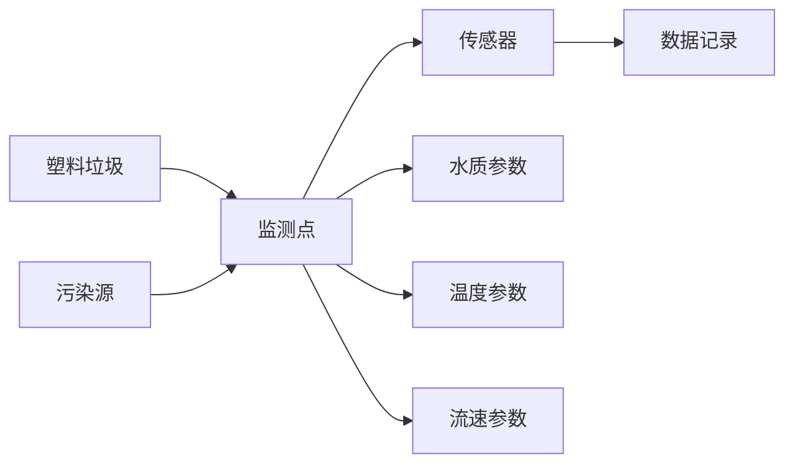
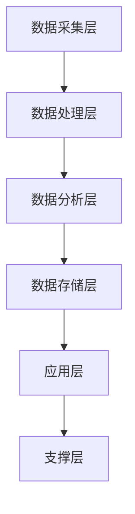
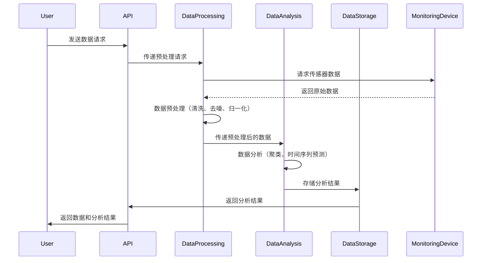

                 

### 文章标题：人工智能在海洋塑料污染追踪中的应用

> 关键词：人工智能、海洋塑料污染、追踪、传感器网络、深度学习、数据挖掘

> 摘要：随着全球海洋塑料污染问题的日益严重，如何有效地追踪和治理成为了一项紧迫的任务。本文将探讨人工智能技术在海洋塑料污染追踪中的应用，通过介绍背景、核心概念和原理，以及实际应用实例，旨在为相关领域的研究和实践提供有价值的参考。

----------------------------------------------------------------

## 目录大纲

**《人工智能在海洋塑料污染追踪中的应用》**

----------------------------------------------------------------

### 第一部分: 背景与概念介绍

- **第1章: 问题背景**
  - 1.1 海洋塑料污染的现状
  - 1.2 海洋塑料污染的危害
  - 1.3 追踪海洋塑料污染的重要性
- **第2章: 人工智能概述**
  - 2.1 人工智能的定义与历史
  - 2.2 人工智能的分类
  - 2.3 人工智能的主要应用领域
- **第3章: 海洋塑料污染追踪中的AI技术**
  - 3.1 传感器网络在海洋监测中的应用
  - 3.2 数据挖掘与分析
  - 3.3 深度学习在海洋塑料识别中的应用

----------------------------------------------------------------

### 第二部分: 核心概念与原理

- **第4章: 人工智能在海洋塑料污染追踪中的核心概念**
  - 4.1 图像识别算法
  - 4.2 神经网络
  - 4.3 深度学习模型
- **第5章: 概念属性特征对比**
  - 5.1 不同图像识别算法对比
  - 5.2 传感器数据预处理技术对比
  - 5.3 深度学习模型性能对比
- **第6章: 实体关系图**
  - 6.1 海洋塑料污染追踪中的实体
  - 6.2 实体关系图构建
  - 6.3 实体关系图在追踪中的应用

----------------------------------------------------------------

### 第三部分: 应用实例

- **第7章: 项目介绍**
  - 7.1 项目背景
  - 7.2 项目目标
  - 7.3 项目团队
- **第8章: 系统功能设计**
  - 8.1 领域模型
  - 8.2 功能模块划分
  - 8.3 功能实现细节
- **第9章: 系统架构设计**
  - 9.1 系统架构
  - 9.2 架构组件解析
  - 9.3 系统接口设计
- **第10章: 系统交互**
  - 10.1 系统交互流程
  - 10.2 系统交互序列图
  - 10.3 系统交互效果展示
- **第11章: 项目实战**
  - 11.1 环境安装
  - 11.2 系统核心实现源代码
  - 11.3 代码应用解读与分析
  - 11.4 实际案例分析和详细讲解剖析
  - 11.5 项目小结

----------------------------------------------------------------

### 第四部分: 总结与展望

- **第12章: 最佳实践**
  - 12.1 数据收集与处理
  - 12.2 模型训练与优化
  - 12.3 模型部署与应用
- **第13章: 注意事项**
  - 13.1 数据安全
  - 13.2 道德伦理
  - 13.3 法律法规
- **第14章: 拓展阅读**
  - 14.1 相关研究论文
  - 14.2 推荐阅读书籍
  - 14.3 基础教程与开源框架

----------------------------------------------------------------

接下来，我们将一步一步地深入探讨海洋塑料污染问题的背景，人工智能技术的概述，以及在海洋塑料污染追踪中的应用，为解决这一全球性问题提供技术上的思考和实践路径。

### 第一部分: 背景与概念介绍

#### 第1章: 问题背景

#### 1.1 海洋塑料污染的现状

海洋塑料污染是一个日益严重的问题，影响着全球海洋生态系统和人类的健康。据联合国环境规划署（UNEP）的数据显示，每年有超过800万吨的塑料进入海洋，相当于每分钟向海洋中倾倒一卡车垃圾。这些塑料垃圾不仅覆盖了海洋表面，还沉入了深海，对海洋生物和生态系统造成了深远的影响。

**主要污染源：**

1. **陆地排放：** 塑料垃圾通过河流、风暴和水流等途径最终流入海洋。
2. **海上活动：** 船舶、海上作业和海洋工程等活动产生的塑料废弃物也是重要的污染源。
3. **非法倾倒：** 一些国家和地区非法倾倒塑料垃圾，加剧了海洋塑料污染。

**主要影响：**

1. **海洋生物：** 海洋塑料污染会误食塑料垃圾的海洋生物，导致消化系统堵塞、营养吸收困难等问题，甚至造成死亡。例如，海龟、海鸟和海豚等生物常常误食塑料垃圾。
2. **生态系统：** 塑料垃圾的分解过程中会释放有害物质，破坏海洋生态系统平衡，降低海洋生物的多样性。
3. **人类健康：** 海洋塑料污染不仅影响海洋生物，还可能通过食物链影响人类的健康，塑料中的有害物质如多环芳烃（PAHs）和二恶英（Dioxins）等可能会积累在人体内。

#### 1.2 海洋塑料污染的危害

海洋塑料污染对海洋生态系统的危害是多方面的，具体包括：

1. **生物毒性：** 塑料垃圾中的有害物质会通过生物累积作用影响海洋生物，甚至通过食物链传递到人类。
2. **生态失衡：** 塑料垃圾的入侵会导致海洋生态系统的物种多样性和生态平衡遭到破坏。
3. **经济损失：** 海洋塑料污染对渔业和旅游业等经济活动造成了巨大的损失。
4. **环境恶化和气候变化：** 塑料垃圾分解过程中产生的温室气体加剧了全球气候变化问题。

#### 1.3 追踪海洋塑料污染的重要性

有效地追踪海洋塑料污染对于治理这一全球性问题具有重要意义，具体包括：

1. **数据收集：** 追踪技术能够收集到关于塑料垃圾来源、分布和迁移的详细信息，为治理决策提供数据支持。
2. **污染源识别：** 追踪技术有助于识别主要污染源，从而有针对性地采取措施进行控制和治理。
3. **环境监测：** 追踪技术能够持续监测海洋塑料污染状况，评估治理效果，为环境保护提供持续监测手段。
4. **科研支持：** 追踪技术为科研提供了重要的实验数据，促进了海洋塑料污染相关领域的科学研究和技术创新。

通过有效的追踪手段，我们不仅可以更好地了解海洋塑料污染的现状和危害，还可以为治理这一全球性环境问题提供科学依据和技术支持。接下来，我们将介绍人工智能技术在这一领域中的应用，以期为海洋塑料污染的治理带来新的思路和方法。

#### 第2章: 人工智能概述

#### 2.1 人工智能的定义与历史

人工智能（Artificial Intelligence，简称AI）是指通过计算机模拟人类智能行为的技术。它包括了一系列使计算机能够执行通常需要人类智能的任务的技术和方法，如学习、推理、解决问题和自然语言理解等。人工智能的概念最早可以追溯到20世纪50年代，当时的计算机科学家们开始探索如何使计算机具备类似于人类的智能。

**历史发展：**

1. **1950年代：** 人工智能的概念首次被提出，艾伦·图灵提出了著名的图灵测试，用于评估机器是否具有人类智能。
2. **1960年代：** 人工智能领域经历了短暂的“第一次AI冬天”，由于技术限制和期望过高，许多研究项目失败，导致资金短缺。
3. **1970年代：** 人工智能开始复苏，出现了许多基于规则和符号推理的方法。
4. **1980年代：** 人工智能的应用领域逐渐扩大，包括专家系统和机器学习等。
5. **1990年代：** 机器学习成为人工智能研究的热点，神经网络和深度学习技术得到了快速发展。
6. **21世纪：** 随着计算机性能的提高和大数据的出现，人工智能迎来了新的发展机遇，出现了许多突破性的应用，如自动驾驶、语音识别和图像识别等。

#### 2.2 人工智能的分类

人工智能可以从不同的角度进行分类，以下是几种常见的分类方法：

1. **基于功能：**
   - **通用人工智能（AGI）：** 能够在广泛的领域内执行人类智能的任务。
   - **弱人工智能（Narrow AI）：** 能够在特定领域内执行特定的任务，如语音识别、图像识别等。
   - **强人工智能（ASI）：** 能够在所有领域内执行人类智能的任务，但目前尚未实现。

2. **基于方法：**
   - **基于规则的系统：** 通过预先设定的规则来执行任务。
   - **基于学习的系统：** 通过数据学习和模式识别来执行任务，包括监督学习、无监督学习和强化学习等。

3. **基于领域：**
   - **自然语言处理（NLP）：** 使计算机能够理解和生成自然语言。
   - **计算机视觉：** 使计算机能够理解和解释图像和视频。
   - **机器人学：** 使计算机能够控制和操纵机器人。
   - **智能助理：** 如智能音箱、聊天机器人和虚拟助手等。

#### 2.3 人工智能的主要应用领域

人工智能已经在许多领域得到了广泛应用，以下是几个主要的应用领域：

1. **工业自动化：** 通过机器人和自动化系统提高生产效率和质量。
2. **医疗健康：** 通过诊断辅助、医学图像分析和个性化治疗等提高医疗水平。
3. **金融科技：** 通过智能投资、风险管理、欺诈检测和客户服务优化等提高金融服务效率。
4. **交通运输：** 通过自动驾驶、智能交通管理和无人机配送等改善交通状况和运输效率。
5. **教育：** 通过智能教育系统和在线学习平台提高教学效果和个性化学习。
6. **环境保护：** 通过环境监测、资源管理和生态恢复等改善环境状况。

通过以上对人工智能的定义、分类和应用领域的介绍，我们可以看到人工智能技术在各个领域的重要性和潜力。接下来，我们将探讨人工智能在海洋塑料污染追踪中的应用，以期为解决这一全球性问题提供新的技术手段。

#### 第3章: 海洋塑料污染追踪中的AI技术

#### 3.1 传感器网络在海洋监测中的应用

传感器网络是海洋塑料污染追踪中不可或缺的一部分，通过部署在海洋中的传感器，可以实时监测水质、水温、海洋流速等环境参数，从而为追踪塑料污染提供关键数据。以下是传感器网络在海洋监测中的一些具体应用：

1. **水质监测：** 传感器可以测量海水中的溶解氧、pH值、盐度等指标，通过这些数据可以判断水质状况，进而分析塑料污染的影响范围和程度。
2. **水温监测：** 水温变化对海洋生物和塑料污染的迁移有很大影响，传感器可以实时监测水温，为追踪塑料污染提供重要参考。
3. **流速监测：** 海洋中的水流速度和方向对塑料污染的扩散具有重要影响，通过监测水流速度和方向，可以预测塑料垃圾的迁移路径，从而更有效地进行追踪和治理。

**主要传感器类型：**

1. **海洋浮标：** 海洋浮标是一种可以漂浮在海面上的传感器设备，可以长期监测海洋环境参数，并通过卫星传输数据到地面站。
2. **潜标：** 潜标是一种可以沉入海底的传感器设备，可以监测海底环境参数，如压力、温度、溶解氧等。
3. **漂流浮标：** 漂流浮标是专门用于监测海洋塑料污染的设备，可以附着在塑料垃圾上，随塑料垃圾一起漂流，实时记录海洋环境参数。

**优势与挑战：**

1. **优势：**
   - **实时监测：** 通过传感器网络可以实现对海洋环境的实时监测，快速获取塑料污染的信息。
   - **数据丰富：** 传感器网络可以提供丰富的环境数据，为追踪和分析塑料污染提供可靠的数据支持。
   - **覆盖广泛：** 通过多种类型的传感器，可以实现对海洋的广泛覆盖，提高监测的全面性和准确性。

2. **挑战：**
   - **设备维护：** 海洋环境恶劣，传感器设备需要定期维护和更换，增加了运营成本。
   - **数据传输：** 海洋通信条件复杂，数据传输可能会受到干扰，影响数据的实时性和准确性。
   - **成本高昂：** 传感器网络的建设和运营需要大量资金投入，特别是在大面积海洋监测中。

通过传感器网络在海洋监测中的应用，我们可以更加有效地追踪海洋塑料污染，为治理这一全球性问题提供关键数据支持。接下来，我们将探讨数据挖掘与分析在海洋塑料污染追踪中的作用。

#### 3.2 数据挖掘与分析

在海洋塑料污染追踪中，数据挖掘与分析技术发挥着至关重要的作用。通过对大量监测数据的分析和处理，可以揭示塑料污染的分布规律、迁移路径和影响因素，从而为治理决策提供科学依据。以下是数据挖掘与分析在海洋塑料污染追踪中的应用：

**数据来源：**

1. **传感器网络：** 传感器网络可以实时监测海洋环境参数，如水质、水温、流速等，并通过无线传输将数据发送到地面站。
2. **卫星遥感：** 通过卫星遥感技术，可以获取海洋表面和深层的图像和数据，如塑料垃圾的分布、海洋水温等。
3. **无人机监测：** 无人机可以在海洋表面进行高精度的监测，获取详细的图像和数据，如塑料垃圾的类型和数量。
4. **海上调查：** 通过海上调查，如船舶、潜水器等，可以获取海洋底层的数据，补充传感器和卫星数据的不足。

**数据挖掘与分析方法：**

1. **数据预处理：** 数据预处理是数据挖掘的重要步骤，包括数据清洗、去噪、归一化等，以提高数据的质量和可靠性。
2. **特征提取：** 通过提取数据中的关键特征，如时间、地点、水质参数等，为后续的分析提供基础。
3. **聚类分析：** 聚类分析可以将监测数据根据相似性进行分组，帮助识别塑料污染的高风险区域。
4. **关联规则挖掘：** 关联规则挖掘可以揭示数据之间的关联关系，如塑料污染与水质参数、水温等的关联性。
5. **时间序列分析：** 时间序列分析可以分析数据的时间趋势和变化规律，如塑料污染的迁移路径和时间变化。
6. **机器学习模型：** 通过机器学习模型，如回归模型、分类模型、聚类模型等，可以预测塑料污染的未来分布和变化趋势。

**优势与挑战：**

1. **优势：**
   - **提高监测效率：** 数据挖掘与分析技术可以快速处理大量数据，提高监测效率，及时发现和处理塑料污染问题。
   - **科学决策支持：** 通过分析处理数据，可以揭示塑料污染的规律和影响因素，为治理决策提供科学依据。
   - **实时性：** 数据挖掘与分析技术可以实现实时数据分析，为快速响应塑料污染事件提供支持。

2. **挑战：**
   - **数据质量：** 数据质量对分析结果有重要影响，需要确保数据的质量和准确性。
   - **计算资源：** 大规模数据处理需要大量的计算资源，特别是在实时分析中。
   - **模型选择：** 不同的数据挖掘与分析方法适用于不同类型的数据，需要根据实际情况选择合适的模型。

通过数据挖掘与分析技术，我们可以更加深入地了解海洋塑料污染的规律和特点，为治理决策提供有力的支持。接下来，我们将探讨深度学习在海洋塑料识别中的应用。

#### 3.3 深度学习在海洋塑料识别中的应用

深度学习是人工智能领域的一项重要技术，其在图像识别和分类方面的卓越性能使其在海洋塑料识别中得到了广泛应用。以下是深度学习在海洋塑料识别中的应用：

**技术原理：**

1. **卷积神经网络（CNN）：** 卷积神经网络是一种专门用于图像识别的深度学习模型，通过卷积操作提取图像中的局部特征，并进行分类。在海洋塑料识别中，CNN可以用于识别不同类型的塑料垃圾，如塑料袋、塑料瓶和渔网等。
2. **循环神经网络（RNN）：** 循环神经网络是一种用于序列数据处理的时间序列模型，可以用于分析海洋塑料垃圾的迁移路径和时间变化规律。
3. **生成对抗网络（GAN）：** 生成对抗网络是一种由生成器和判别器组成的模型，可以用于生成逼真的塑料垃圾图像，用于训练和测试深度学习模型。

**具体应用：**

1. **图像识别：** 通过训练深度学习模型，可以实现对海洋表面图像中的塑料垃圾进行自动识别和分类。例如，研究人员可以训练一个CNN模型，输入海洋表面图像，输出图像中塑料垃圾的类型和位置。
2. **迁移学习：** 迁移学习是一种将已知模型在特定领域的学习经验应用到新领域的方法。在海洋塑料识别中，可以首先在大量已标记的塑料垃圾图像上进行预训练，然后将模型应用到海洋监测数据中，以提高识别的准确性和效率。
3. **多模态学习：** 多模态学习是指将不同类型的数据（如图像、音频和文本）进行融合和协同分析。在海洋塑料识别中，可以结合卫星遥感图像、无人机监测数据和海洋浮标数据，进行多模态学习，以提高识别的准确性和全面性。

**优势与挑战：**

1. **优势：**
   - **高效识别：** 深度学习模型可以快速处理大量图像数据，实现高效准确的塑料垃圾识别。
   - **自适应学习：** 深度学习模型可以根据不同场景和数据特点进行自适应学习，提高识别的准确性和适应性。
   - **跨领域应用：** 深度学习模型在图像识别方面的成功经验可以应用到其他领域，如医学影像分析和智能交通等。

2. **挑战：**
   - **数据标注：** 塑料垃圾图像的数据标注需要大量的人力和时间，影响模型的训练和验证。
   - **计算资源：** 深度学习模型训练需要大量的计算资源，特别是在大规模数据处理中。
   - **模型解释性：** 深度学习模型的内部决策过程较为复杂，缺乏透明度和解释性，影响模型的可解释性和可靠性。

通过深度学习技术在海洋塑料识别中的应用，我们可以更加准确地识别和分类海洋塑料垃圾，为治理海洋塑料污染提供技术支持。接下来，我们将进一步探讨深度学习模型在海洋塑料识别中的具体实现和应用。

### 第二部分: 核心概念与原理

#### 第4章: 人工智能在海洋塑料污染追踪中的核心概念

#### 4.1 图像识别算法

图像识别算法是人工智能在海洋塑料污染追踪中的一项关键技术，其基本原理是通过计算机处理和分析图像数据，识别并分类图像中的对象。以下是图像识别算法的基本原理和应用：

**基本原理：**

图像识别算法通常基于以下步骤：

1. **图像预处理：** 对原始图像进行预处理，包括滤波、去噪、边缘检测等，以提高图像的质量和清晰度。
2. **特征提取：** 从预处理后的图像中提取关键特征，如颜色、纹理、形状等，用于后续的分类和识别。
3. **模型训练：** 使用已标记的图像数据集，通过机器学习算法训练图像识别模型，使其学会识别和分类图像。
4. **模型评估：** 使用验证数据集评估模型的性能，包括准确率、召回率、F1值等指标。

**常见算法：**

1. **支持向量机（SVM）：** SVM是一种用于分类的机器学习算法，通过找到一个最佳的超平面，将不同类别的图像分开。
2. **决策树：** 决策树是一种基于树结构的分类算法，通过一系列的决策规则将图像分类。
3. **随机森林：** 随机森林是一种基于决策树的集成学习方法，通过构建多棵决策树并投票决定最终分类结果。
4. **卷积神经网络（CNN）：** CNN是一种专门用于图像识别的深度学习模型，通过卷积层、池化层和全连接层等结构提取图像特征。

**应用场景：**

1. **海洋塑料垃圾识别：** 通过图像识别算法，可以自动识别和分类海洋表面图像中的塑料垃圾，如塑料袋、塑料瓶和渔网等。
2. **海洋生物监测：** 图像识别算法可以用于监测海洋生物，如海龟、海鸟等，通过识别和分类图像中的生物，可以评估海洋生态系统的健康状况。
3. **海洋环境监测：** 图像识别算法可以用于分析海洋表面图像，识别污染源、海流方向等，为海洋环境保护提供数据支持。

#### 4.2 神经网络

神经网络是一种模拟人脑信息处理过程的计算模型，通过大量的神经元和连接结构，实现复杂的计算和学习任务。以下是神经网络的基本原理和应用：

**基本原理：**

神经网络由以下几部分组成：

1. **神经元：** 神经网络的基本计算单元，每个神经元接收多个输入，通过加权求和后经过激活函数产生输出。
2. **层次结构：** 神经网络通常由输入层、隐藏层和输出层组成，各层神经元通过权重连接实现信息的传递和计算。
3. **学习算法：** 通过反向传播算法，调整神经网络的权重，使模型在训练数据上达到更好的泛化性能。

**常见类型：**

1. **前馈神经网络：** 前馈神经网络是一种单向传播的神经网络，信息从输入层流向输出层，没有循环结构。
2. **循环神经网络（RNN）：** 循环神经网络是一种具有循环结构的神经网络，可以处理序列数据，适用于时间序列分析和自然语言处理等领域。
3. **卷积神经网络（CNN）：** 卷积神经网络是一种专门用于图像识别的神经网络，通过卷积层和池化层提取图像特征，具有强大的图像识别能力。

**应用场景：**

1. **海洋塑料污染追踪：** 神经网络可以用于处理和分类海洋监测数据，如图像、传感器数据和卫星遥感数据，为塑料污染追踪提供技术支持。
2. **海洋生物识别：** 神经网络可以用于识别和分类海洋生物，如海龟、海鸟和鱼类，为海洋生物保护和监测提供工具。
3. **海洋环境预测：** 神经网络可以用于预测海洋环境参数，如水温、流速和污染物浓度，为海洋环境保护和治理提供决策支持。

#### 4.3 深度学习模型

深度学习模型是神经网络的一种扩展，通过增加网络层数和神经元数量，实现更复杂的特征提取和计算能力。以下是深度学习模型的基本原理和应用：

**基本原理：**

1. **多层网络结构：** 深度学习模型通过多层神经网络结构，逐层提取图像或数据的特征，实现从低级到高级的层次化特征表示。
2. **端到端学习：** 深度学习模型采用端到端的学习方式，直接从原始数据到输出结果，无需手工特征提取，提高了模型的效率和准确性。
3. **大规模数据训练：** 深度学习模型需要大量的训练数据，通过大数据训练，使模型能够学习到更丰富的特征和规律。

**常见类型：**

1. **卷积神经网络（CNN）：** 卷积神经网络是一种专门用于图像识别的深度学习模型，通过卷积操作提取图像特征，具有强大的图像识别能力。
2. **循环神经网络（RNN）：** 循环神经网络是一种专门用于序列数据的深度学习模型，通过循环结构处理序列数据，适用于时间序列分析和自然语言处理等领域。
3. **生成对抗网络（GAN）：** 生成对抗网络是一种由生成器和判别器组成的深度学习模型，可以生成逼真的图像和序列数据，具有强大的数据生成能力。

**应用场景：**

1. **海洋塑料污染识别：** 深度学习模型可以用于自动识别和分类海洋表面图像中的塑料垃圾，提高追踪和治理的效率。
2. **海洋生物监测：** 深度学习模型可以用于监测和识别海洋生物，如海龟、海鸟和鱼类，为海洋生物保护和监测提供工具。
3. **海洋环境预测：** 深度学习模型可以用于预测海洋环境参数，如水温、流速和污染物浓度，为海洋环境保护和治理提供决策支持。

通过介绍图像识别算法、神经网络和深度学习模型，我们可以看到人工智能技术在海洋塑料污染追踪中的重要性和应用潜力。在下一部分，我们将进一步对比不同图像识别算法、传感器数据预处理技术以及深度学习模型的性能，为选择合适的算法和技术提供参考。

#### 第5章: 概念属性特征对比

##### 5.1 不同图像识别算法对比

在海洋塑料污染追踪中，图像识别算法的选择对追踪效率和准确性有着重要影响。以下是几种常见图像识别算法的属性特征对比：

**支持向量机（SVM）：**
- **原理：** 基于优化理论，通过找到一个最佳的超平面将不同类别的图像分开。
- **优点：** 理论基础坚实，计算速度快。
- **缺点：** 对于复杂图像的识别效果有限，需要大量特征工程。

**决策树：**
- **原理：** 基于树结构，通过一系列的决策规则将图像分类。
- **优点：** 易于理解和解释，对分类问题效果较好。
- **缺点：** 对数据不平衡敏感，容易过拟合。

**随机森林：**
- **原理：** 集成学习方法，通过构建多棵决策树并投票决定最终分类结果。
- **优点：** 防止过拟合，提高分类准确性。
- **缺点：** 需要大量计算资源，对大数据处理能力有限。

**卷积神经网络（CNN）：**
- **原理：** 通过卷积操作提取图像中的特征，并经过多个隐藏层进行分类。
- **优点：** 对复杂图像的识别效果显著，具有强大的特征提取能力。
- **缺点：** 训练时间较长，需要大量训练数据和计算资源。

**对比表格：**

| 算法       | 原理                   | 优点                           | 缺点                           |
|------------|------------------------|--------------------------------|--------------------------------|
| 支持向量机 | 优化理论超平面分离     | 理论基础坚实，计算速度快         | 特征工程复杂，复杂图像识别效果有限 |
| 决策树     | 树结构决策规则         | 易于理解和解释，分类效果好       | 对数据不平衡敏感，易过拟合       |
| 随机森林   | 多棵决策树集成         | 防止过拟合，提高分类准确性       | 需要大量计算资源，大数据处理能力有限 |
| 卷积神经网络 | 卷积操作多层特征提取 | 复杂图像识别效果显著，强大的特征提取能力 | 训练时间较长，需要大量训练数据和计算资源 |

根据上述对比，选择适合的图像识别算法需要综合考虑数据特征、计算资源和应用需求。在海洋塑料污染追踪中，由于塑料垃圾图像的复杂性和多样性，卷积神经网络（CNN）通常表现最佳。

##### 5.2 传感器数据预处理技术对比

传感器数据预处理是保证数据质量和分析结果准确性的关键步骤。以下是几种常见传感器数据预处理技术的对比：

**数据清洗：**
- **原理：** 去除传感器数据中的噪声和异常值，确保数据的完整性。
- **优点：** 提高数据质量，为后续分析提供可靠数据。
- **缺点：** 需要大量时间和人力，对大规模数据预处理效率较低。

**数据归一化：**
- **原理：** 将不同量纲的传感器数据进行归一化处理，使其在同一尺度上进行比较。
- **优点：** 提高数据的一致性，便于分析和建模。
- **缺点：** 对于极端值和异常值处理不当，可能影响分析结果。

**数据降维：**
- **原理：** 通过降维技术减少数据维度，保留主要信息。
- **优点：** 提高数据分析效率和计算速度，减少模型复杂度。
- **缺点：** 可能损失部分信息，影响分析结果的准确性。

**对比表格：**

| 技术       | 原理                       | 优点                           | 缺点                           |
|------------|----------------------------|--------------------------------|--------------------------------|
| 数据清洗   | 去除噪声和异常值           | 提高数据质量，可靠数据分析     | 耗时耗力，大规模数据处理效率低   |
| 数据归一化 | 将不同量纲的数据归一化     | 提高数据一致性，便于分析       | 极端值和异常值处理不当影响结果 |
| 数据降维   | 降低数据维度，保留主要信息 | 提高数据分析效率和计算速度     | 可能有信息损失，影响结果准确性 |

根据不同应用场景和需求，可以选择合适的传感器数据预处理技术。例如，在海洋塑料污染追踪中，数据清洗和数据降维是常用的预处理方法，可以显著提高数据分析的效率和准确性。

##### 5.3 深度学习模型性能对比

深度学习模型在海洋塑料污染追踪中表现出强大的性能，以下是几种常见深度学习模型的性能对比：

**卷积神经网络（CNN）：**
- **性能：** 在图像识别任务中，CNN表现出优异的性能，可以自动提取图像特征并分类。
- **优点：** 强大的特征提取能力，适用于复杂图像识别任务。
- **缺点：** 训练时间较长，需要大量计算资源和数据。

**循环神经网络（RNN）：**
- **性能：** 在序列数据任务中，RNN表现出良好的性能，可以处理时间序列数据和序列分类问题。
- **优点：** 适用于序列数据处理，可以捕捉时间序列中的依赖关系。
- **缺点：** 在长序列数据处理中可能存在梯度消失或爆炸问题。

**生成对抗网络（GAN）：**
- **性能：** 在图像生成和数据增强任务中，GAN表现出出色的性能，可以生成逼真的图像。
- **优点：** 可以生成高质量的图像数据，提高模型训练效果。
- **缺点：** 需要大量训练数据和计算资源，训练过程不稳定。

**对比表格：**

| 模型       | 性能                 | 优点                           | 缺点                           |
|------------|----------------------|--------------------------------|--------------------------------|
| 卷积神经网络（CNN） | 图像识别任务优异     | 强大的特征提取能力             | 训练时间较长，需要大量计算资源 |
| 循环神经网络（RNN） | 序列数据任务良好     | 适用于序列数据处理             | 梯度消失或爆炸问题             |
| 生成对抗网络（GAN） | 图像生成和数据增强   | 可以生成高质量图像数据         | 需要大量训练数据和计算资源，训练不稳定 |

根据不同任务和应用场景，可以选择适合的深度学习模型。在海洋塑料污染追踪中，卷积神经网络（CNN）通常用于图像识别任务，而循环神经网络（RNN）适用于时间序列分析。生成对抗网络（GAN）则可以用于图像数据的生成和增强，提高模型训练效果。

通过对比不同图像识别算法、传感器数据预处理技术和深度学习模型的性能，我们可以为海洋塑料污染追踪选择合适的技术和方法，提高追踪效率和准确性。在下一部分，我们将进一步探讨实体关系图在海洋塑料污染追踪中的应用。

##### 5.4 实体关系图在海洋塑料污染追踪中的应用

实体关系图（Entity Relationship Diagram，ERD）是一种用于描述实体及其之间关系的图形化工具，在海洋塑料污染追踪中具有重要应用。实体关系图可以帮助我们理解和分析海洋塑料污染的数据结构，从而更有效地进行数据建模和系统设计。

**实体定义：**

在海洋塑料污染追踪中，实体主要包括以下几个方面：

1. **塑料垃圾：** 包括各种类型的塑料垃圾，如塑料袋、塑料瓶、渔网等。
2. **传感器：** 用于监测海洋环境的各类传感器，如水质传感器、温度传感器、流速传感器等。
3. **监测点：** 海洋中的监测位置，可以是海洋浮标、潜标、漂流浮标等。
4. **数据记录：** 包含监测点采集的各类数据，如水质参数、温度、流速等。
5. **污染源：** 海洋塑料污染的来源，如陆地排放、海上活动、非法倾倒等。

**关系定义：**

实体之间的关系描述了它们之间的联系和作用，以下是海洋塑料污染追踪中的主要实体关系：

1. **塑料垃圾与监测点：** 塑料垃圾可以附着在监测点上进行监测，每个监测点可以监测多个塑料垃圾。
2. **传感器与监测点：** 每个监测点配备多个传感器，用于采集环境数据。
3. **数据记录与监测点：** 每个监测点生成的数据记录与监测点存在关联关系。
4. **污染源与监测点：** 污染源可以影响监测点的环境数据，从而反映在数据记录中。
5. **塑料垃圾与数据记录：** 数据记录中包含关于塑料垃圾的信息，如类型、数量、位置等。

**实体关系图构建：**

实体关系图的构建步骤如下：

1. **确定实体：** 根据海洋塑料污染追踪的需求，确定需要描述的实体。
2. **定义关系：** 描述实体之间的关系，并确定关系的类型，如一对一、一对多、多对多等。
3. **绘制ERD图：** 使用ERD图工具，将实体和关系图形化表示。
4. **优化ERD图：** 根据实际应用需求，对ERD图进行优化，如添加注释、调整实体和关系的布局等。

**实体关系图示例：**



在这个示例中，实体包括塑料垃圾、监测点、传感器、数据记录和污染源。关系描述了这些实体之间的关联，如塑料垃圾附着在监测点上，监测点配备传感器，传感器采集数据记录，污染源影响监测点的环境数据。

实体关系图在海洋塑料污染追踪中的应用包括：

1. **数据建模：** 帮助开发者理解数据结构，设计数据库模型。
2. **系统设计：** 描述系统组件之间的关系，为系统架构设计提供参考。
3. **数据分析：** 提供可视化工具，帮助分析师理解数据关联和作用。
4. **决策支持：** 为治理决策提供数据关联和影响分析，支持科学决策。

通过实体关系图的应用，我们可以更有效地构建和优化海洋塑料污染追踪系统，提高数据分析和治理决策的准确性。接下来，我们将介绍一个实际应用实例，展示人工智能在海洋塑料污染追踪中的具体应用。

### 第三部分: 应用实例

#### 第7章: 项目介绍

#### 7.1 项目背景

随着全球海洋塑料污染问题的日益严重，如何有效地追踪和治理海洋塑料垃圾已成为一个迫切需要解决的问题。为了应对这一挑战，我们发起了一个名为“智能海洋”的项目，旨在利用人工智能技术构建一个全面的海洋塑料污染追踪系统，通过实时监测、数据分析和智能决策，实现海洋塑料污染的精准治理。

**项目背景**

1. **全球性环境问题：** 据估计，每年有超过800万吨的塑料垃圾进入海洋，对海洋生态系统和人类健康造成了严重威胁。因此，解决海洋塑料污染已成为全球性的环境议题。
2. **技术需求：** 传统的海洋塑料污染监测方法效率低下，且难以实时获取准确数据。随着人工智能技术的发展，利用AI技术进行海洋塑料污染追踪具有显著优势。
3. **政策支持：** 国际社会和各国政府纷纷出台政策，支持海洋环境保护和塑料污染治理。这为“智能海洋”项目的实施提供了良好的政策环境。

#### 7.2 项目目标

“智能海洋”项目的主要目标如下：

1. **实时监测：** 构建一个全球覆盖的海洋监测网络，利用传感器网络、卫星遥感和无人机等手段，实时获取海洋环境数据。
2. **数据挖掘与分析：** 基于大数据技术和机器学习算法，对监测数据进行挖掘和分析，识别塑料污染源和分布规律。
3. **智能识别与分类：** 利用深度学习模型和图像识别算法，自动识别和分类海洋表面图像中的塑料垃圾。
4. **决策支持：** 根据分析结果，为政府和环保机构提供科学的决策支持，制定有效的治理策略。
5. **公共参与：** 倡导公众参与海洋塑料污染治理，提高公众环保意识，形成全民参与的环保氛围。

#### 7.3 项目团队

“智能海洋”项目由一支由多学科专家组成的团队负责，具体包括以下成员：

1. **项目主管：** 具有多年AI领域研究和管理经验，负责项目整体规划和协调。
2. **数据科学家：** 负责数据挖掘、分析和模型构建，确保数据分析的准确性和有效性。
3. **软件工程师：** 负责系统开发和维护，确保项目的技术实现和运行效率。
4. **环境科学家：** 负责海洋环境监测和研究，提供专业的环保数据和技术支持。
5. **用户界面设计师：** 负责用户界面的设计和优化，提高用户体验。
6. **合作机构：** 与国内外科研机构、政府和环保组织合作，共同推动项目的实施和推广。

通过这个项目，我们希望能够为海洋塑料污染的治理提供一种创新的技术手段和解决方案，为全球环境保护事业做出贡献。

### 第8章: 系统功能设计

#### 8.1 领域模型

在“智能海洋”项目中，领域模型（Domain Model）是系统功能设计的基础，它帮助我们理解和定义海洋塑料污染追踪所需的核心概念和实体。领域模型通过类图（Class Diagram）来表示，包括核心类、属性和关系。

**领域模型类图：**

```mermaid
class Diagram {
    PlasticWaste <|-- PlasticType
    MonitoringPoint <|-- Sensor
    DataRecord <|-- EnvironmentalData
    PollutionSource <|-- PollutionType
}

class PlasticType {
    +type: String
}

class MonitoringPoint {
    +id: Integer
    +location: Point
    +plasticWaste: Set[PlasticWaste]
    +sensors: Set[Sensor]
}

class Sensor {
    +id: Integer
    +type: String
    +dataRecord: DataRecord
}

class DataRecord {
    +id: Integer
    +date: Date
    +environmentalData: EnvironmentalData
}

class EnvironmentalData {
    +waterQuality: WaterQuality
    +temperature: Float
    +currentSpeed: Float
}

class PollutionSource {
    +id: Integer
    +location: Point
    +pollutionType: PollutionType
}

class WaterQuality {
    +pH: Float
    +dissolvedOxygen: Float
    +salinity: Float
}
```

**领域模型类图解释：**

1. **核心类：** 包括`PlasticType`（塑料类型）、`MonitoringPoint`（监测点）、`Sensor`（传感器）、`DataRecord`（数据记录）、`EnvironmentalData`（环境数据）、`PollutionSource`（污染源）和`WaterQuality`（水质）。
2. **属性：** 各类别的属性定义了实体的重要特征，如`MonitoringPoint`的`location`（位置）、`Sensor`的`type`（类型）和`DataRecord`的`date`（日期）。
3. **关系：** 类之间的关系描述了实体的关联，如`MonitoringPoint`包含多个`PlasticWaste`（塑料垃圾）和`Sensor`（传感器），`Sensor`的`dataRecord`与`DataRecord`关联。

通过领域模型，我们可以清晰地定义海洋塑料污染追踪系统的核心概念和实体，为后续的系统设计和实现提供基础。

#### 8.2 功能模块划分

为了确保“智能海洋”项目的高效运作，系统被划分为多个功能模块，每个模块负责特定的功能。以下是系统功能模块的划分及其主要功能：

**功能模块划分：**

1. **数据采集模块：**
   - **主要功能：** 收集来自传感器网络、卫星遥感和无人机等数据源的信息。
   - **组件：** 包括传感器数据接口、卫星遥感数据处理单元和无人机数据采集单元。

2. **数据预处理模块：**
   - **主要功能：** 对采集到的原始数据进行清洗、去噪和归一化处理，以提高数据质量。
   - **组件：** 包括数据清洗器、去噪滤波器和归一化处理器。

3. **数据存储模块：**
   - **主要功能：** 存储处理后的数据，以便后续分析和查询。
   - **组件：** 包括关系数据库和分布式文件系统。

4. **数据分析模块：**
   - **主要功能：** 利用机器学习和数据挖掘技术对数据进行深度分析，识别塑料污染的分布和迁移规律。
   - **组件：** 包括特征提取器、聚类分析器和时间序列预测器。

5. **图像识别模块：**
   - **主要功能：** 利用深度学习模型对监测图像进行自动识别和分类，识别塑料垃圾的类型和位置。
   - **组件：** 包括CNN模型训练器、图像预处理器和分类器。

6. **决策支持模块：**
   - **主要功能：** 根据分析结果生成治理建议，为政府和环保机构提供科学决策支持。
   - **组件：** 包括预测分析器、决策规则生成器和治理建议生成器。

7. **用户界面模块：**
   - **主要功能：** 提供用户友好的界面，供用户查看监测数据、分析结果和治理建议。
   - **组件：** 包括数据可视化工具、报告生成器和交互式查询界面。

通过功能模块的划分，系统可以更加灵活地扩展和优化，以应对不断变化的需求和技术发展。

#### 8.3 功能实现细节

为了确保“智能海洋”项目的高效运行，每个功能模块的实现都需遵循一定的技术规范和设计原则。以下是功能实现细节的概述：

**1. 数据采集模块实现细节：**
   - **传感器接口：** 使用标准协议（如HTTP、MQTT）与各类传感器进行通信，确保数据的实时性和准确性。
   - **卫星遥感数据处理：** 利用卫星图像处理库（如OpenCV、GDAL）对遥感图像进行预处理，提取有用信息。
   - **无人机数据采集：** 集成无人机控制软件（如PX4、ROS），实现对无人机的远程控制和数据采集。

**2. 数据预处理模块实现细节：**
   - **数据清洗：** 采用Python的Pandas库进行数据清洗，处理缺失值、异常值和重复值。
   - **去噪滤波：** 利用Python的NumPy和SciPy库实现滤波算法，去除传感器数据中的噪声。
   - **数据归一化：** 使用Min-Max归一化或Z-Score归一化方法，将不同量纲的数据归一化处理。

**3. 数据存储模块实现细节：**
   - **关系数据库：** 使用MySQL或PostgreSQL等关系数据库管理系统，存储结构化数据。
   - **分布式文件系统：** 使用Hadoop或Cassandra等分布式文件系统，存储大规模非结构化数据。

**4. 数据分析模块实现细节：**
   - **特征提取：** 利用Scikit-learn和TensorFlow等库提取数据特征，为深度学习模型训练提供输入。
   - **聚类分析：** 使用K-means、DBSCAN等聚类算法，对监测数据进行分析，识别污染源和热点区域。
   - **时间序列预测：** 利用LSTM、GRU等循环神经网络，对时间序列数据进行预测，分析塑料垃圾的迁移规律。

**5. 图像识别模块实现细节：**
   - **CNN模型训练：** 使用TensorFlow或PyTorch等深度学习框架，训练卷积神经网络模型。
   - **图像预处理：** 对监测图像进行裁剪、缩放、翻转等预处理操作，提高模型的泛化能力。
   - **分类器实现：** 使用Scikit-learn中的SVM、决策树等分类器，对图像进行分类。

**6. 决策支持模块实现细节：**
   - **预测分析：** 基于深度学习和传统统计方法，对塑料垃圾的未来分布进行预测。
   - **决策规则生成：** 采用规则引擎（如Drools）实现决策规则，生成治理建议。
   - **治理建议生成：** 结合预测结果和专家知识，生成具体的治理措施和建议。

**7. 用户界面模块实现细节：**
   - **数据可视化：** 使用D3.js、ECharts等前端库，实现数据的可视化展示。
   - **报告生成：** 使用ReportLab、Pandas等库生成PDF格式的报告。
   - **交互式查询：** 使用React或Vue等前端框架，实现用户友好的交互式查询界面。

通过详细的功能实现，我们能够确保“智能海洋”项目的高效、可靠和可扩展，为海洋塑料污染的追踪和治理提供强大的技术支持。

### 第9章: 系统架构设计

#### 9.1 系统架构

“智能海洋”项目的系统架构设计采用了模块化和分层的设计原则，确保系统的高扩展性和可维护性。系统架构主要包括以下几个层次：

1. **数据采集层：** 负责从各类传感器、卫星遥感和无人机等数据源中采集原始数据。
2. **数据处理层：** 负责对采集到的原始数据进行预处理、清洗、归一化等操作，生成高质量的数据。
3. **数据分析层：** 负责利用机器学习和数据挖掘技术对预处理后的数据进行分析，识别塑料污染的分布规律和迁移路径。
4. **数据存储层：** 负责存储和处理系统产生的数据，包括关系数据库和分布式文件系统。
5. **应用层：** 负责提供用户界面和API接口，供用户进行数据查询、报告生成和治理建议获取。
6. **支撑层：** 负责提供系统运行所需的中间件、库和工具，如消息队列、缓存和日志管理等。

**系统架构图：**



**系统架构图解释：**

1. **数据采集层（A）：** 通过传感器接口、卫星遥感数据处理单元和无人机数据采集单元，实时采集海洋环境数据。
2. **数据处理层（B）：** 对采集到的原始数据进行清洗、去噪和归一化等预处理操作，生成高质量的数据。
3. **数据分析层（C）：** 利用机器学习和数据挖掘技术对预处理后的数据进行分析，识别塑料污染的分布规律和迁移路径。
4. **数据存储层（D）：** 使用关系数据库和分布式文件系统存储和处理系统产生的数据。
5. **应用层（E）：** 提供用户界面和API接口，供用户进行数据查询、报告生成和治理建议获取。
6. **支撑层（F）：** 提供系统运行所需的中间件、库和工具，如消息队列、缓存和日志管理等。

通过上述架构设计，系统实现了数据采集、处理、分析和应用的有机结合，为海洋塑料污染的追踪和治理提供了全面的技术支持。

#### 9.2 架构组件解析

在“智能海洋”项目的系统架构中，各个架构组件承担着不同的功能，确保整个系统的稳定、高效运行。以下是系统架构中主要组件的解析：

**1. 数据采集组件：**
   - **功能：** 负责从传感器网络、卫星遥感和无人机等数据源中采集原始数据。
   - **实现：** 采用标准协议（如HTTP、MQTT）与传感器进行通信，实现对数据的实时采集。同时，利用卫星图像处理库（如OpenCV、GDAL）对遥感图像进行预处理，提取有用信息。无人机数据采集单元则通过集成无人机控制软件（如PX4、ROS）实现对无人机的远程控制和数据采集。

**2. 数据处理组件：**
   - **功能：** 负责对采集到的原始数据进行预处理、清洗、去噪和归一化等操作，以提高数据质量。
   - **实现：** 采用Python的Pandas库进行数据清洗，处理缺失值、异常值和重复值。利用Python的NumPy和SciPy库实现滤波算法，去除传感器数据中的噪声。数据归一化采用Min-Max归一化或Z-Score归一化方法，将不同量纲的数据归一化处理。

**3. 数据分析组件：**
   - **功能：** 负责利用机器学习和数据挖掘技术对预处理后的数据进行分析，识别塑料污染的分布规律和迁移路径。
   - **实现：** 使用Scikit-learn和TensorFlow等库提取数据特征，为深度学习模型训练提供输入。采用K-means、DBSCAN等聚类算法，对监测数据进行分析，识别污染源和热点区域。利用LSTM、GRU等循环神经网络，对时间序列数据进行预测，分析塑料垃圾的迁移规律。

**4. 数据存储组件：**
   - **功能：** 负责存储和处理系统产生的数据，包括关系数据库和分布式文件系统。
   - **实现：** 使用MySQL或PostgreSQL等关系数据库管理系统，存储结构化数据。同时，采用Hadoop或Cassandra等分布式文件系统，存储大规模非结构化数据，如卫星遥感图像和无人机采集的数据。

**5. 应用层组件：**
   - **功能：** 提供用户界面和API接口，供用户进行数据查询、报告生成和治理建议获取。
   - **实现：** 使用React或Vue等前端框架，实现用户友好的交互式查询界面。提供RESTful API接口，供第三方应用程序访问系统数据和功能。

**6. 支撑层组件：**
   - **功能：** 提供系统运行所需的中间件、库和工具，如消息队列、缓存和日志管理等。
   - **实现：** 采用RabbitMQ等消息队列中间件，实现数据传输和任务调度。使用Redis等缓存系统，提高系统响应速度。利用Logstash和Kibana等日志管理工具，实现系统日志的收集、存储和可视化。

通过上述架构组件的解析，我们可以看到“智能海洋”项目的系统架构设计是如何通过各个组件的协同工作，实现海洋塑料污染的实时监测、分析和治理。

#### 9.3 系统接口设计

在“智能海洋”项目中，系统接口设计是确保各模块之间有效通信和数据共享的关键。以下是系统接口的设计原则、主要接口及其功能描述：

**设计原则：**

1. **模块化设计：** 系统接口设计遵循模块化原则，确保每个模块的功能独立，便于维护和扩展。
2. **标准化接口：** 使用标准化接口协议，如HTTP/RESTful API，确保接口的易用性和兼容性。
3. **高内聚低耦合：** 各接口设计应尽量保持高内聚、低耦合，减少模块之间的依赖。
4. **安全性：** 确保接口设计具有足够的安全性，包括身份验证、权限控制和数据加密。

**主要接口：**

1. **数据采集接口：**
   - **功能：** 负责接收来自传感器网络、卫星遥感和无人机等数据源的数据。
   - **接口设计：** 采用HTTP/POST方法，数据以JSON格式传输。
   - **安全性：** 使用OAuth 2.0进行身份验证，确保数据传输的安全性。

2. **数据处理接口：**
   - **功能：** 负责对采集到的原始数据进行预处理、清洗、去噪和归一化等操作。
   - **接口设计：** 采用HTTP/GET方法，获取预处理后的数据。
   - **安全性：** 同样使用OAuth 2.0进行身份验证，确保数据的安全传输。

3. **数据分析接口：**
   - **功能：** 负责对预处理后的数据进行分析，提供污染源识别、分布规律和迁移路径等分析结果。
   - **接口设计：** 采用HTTP/GET和HTTP/POST方法，前者获取分析结果，后者提交数据用于分析。
   - **安全性：** 使用OAuth 2.0进行身份验证，同时数据加密传输。

4. **数据存储接口：**
   - **功能：** 负责存储和分析过程中产生的数据，包括监测数据、分析结果等。
   - **接口设计：** 采用HTTP/POST和HTTP/DELETE方法，前者用于数据存储，后者用于数据删除。
   - **安全性：** 使用OAuth 2.0进行身份验证，确保数据存储和操作的安全。

5. **用户接口：**
   - **功能：** 负责提供用户友好的界面，供用户查询数据、生成报告和获取治理建议。
   - **接口设计：** 采用HTTP/GET和HTTP/POST方法，前者用于获取数据和界面展示，后者用于提交查询请求。
   - **安全性：** 使用OAuth 2.0进行用户认证，确保用户操作的安全。

**接口示例：**

以下是一个数据处理接口的示例，展示如何通过HTTP/GET方法获取预处理后的数据：

```http
GET /api/data/preprocessed?startDate=2023-01-01&endDate=2023-01-31
Authorization: Bearer <access_token>
```

在这个示例中，用户通过发送HTTP GET请求，指定开始日期和结束日期，从服务器获取这段时间内的预处理数据。服务器使用OAuth 2.0进行身份验证，确保请求的安全性。

通过合理的系统接口设计，可以确保“智能海洋”项目各模块之间的有效通信和数据共享，提高系统的整体性能和用户体验。

### 第10章: 系统交互

#### 10.1 系统交互流程

在“智能海洋”项目中，系统交互流程是确保各模块协同工作、高效处理数据和任务的关键。以下是系统交互流程的详细描述：

1. **数据采集：** 系统从传感器网络、卫星遥感和无人机等数据源中实时采集原始数据。
   - **操作：** 数据采集模块通过标准协议（如HTTP、MQTT）与传感器通信，获取环境数据。
   - **流程：** 传感器数据 -> 采集模块 -> 数据预处理模块。

2. **数据预处理：** 对采集到的原始数据进行预处理，包括清洗、去噪和归一化等操作。
   - **操作：** 数据预处理模块接收采集到的数据，进行清洗、去噪和归一化处理。
   - **流程：** 原始数据 -> 数据预处理模块 -> 处理后的数据。

3. **数据分析：** 利用机器学习和数据挖掘技术对预处理后的数据进行分析，识别塑料污染的分布规律和迁移路径。
   - **操作：** 数据分析模块对预处理后的数据进行分析，识别污染源和热点区域。
   - **流程：** 处理后的数据 -> 数据分析模块 -> 分析结果。

4. **数据存储：** 将分析结果和产生的数据存储到关系数据库和分布式文件系统中。
   - **操作：** 数据存储模块将分析结果和数据存储到相应的数据库和文件系统。
   - **流程：** 分析结果和数据 -> 数据存储模块 -> 数据库和文件系统。

5. **用户交互：** 提供用户友好的界面和API接口，供用户查询数据、生成报告和获取治理建议。
   - **操作：** 用户通过用户界面或API接口，获取系统数据和分析结果。
   - **流程：** 用户请求 -> 用户界面/API接口 -> 系统响应。

6. **任务调度：** 根据分析结果和用户请求，调度系统任务，如数据采集、预处理和分析等。
   - **操作：** 支撑层组件（如消息队列、调度器）负责任务调度和执行。
   - **流程：** 用户请求/分析结果 -> 任务调度组件 -> 任务执行。

通过以上交互流程，系统实现了数据的实时采集、处理、分析和用户交互，确保了海洋塑料污染追踪的实时性和准确性。

#### 10.2 系统交互序列图

系统交互序列图（Sequence Diagram）是描述系统各组件之间交互顺序和关系的图形化工具。以下是“智能海洋”项目的系统交互序列图：



**系统交互序列图解释：**

1. **用户请求数据：** 用户通过API接口发送数据请求。
2. **API处理请求：** API接收请求，将预处理请求传递给数据处理模块。
3. **请求传感器数据：** 数据处理模块请求传感器数据，通过监测设备获取原始数据。
4. **数据预处理：** 数据处理模块对原始数据进行预处理，包括清洗、去噪和归一化。
5. **数据分析：** 数据分析模块对预处理后的数据进行分析，识别污染源和热点区域。
6. **存储分析结果：** 数据分析模块将分析结果存储到数据存储模块。
7. **返回分析结果：** 数据存储模块通过API接口将分析结果返回给用户。

通过系统交互序列图，我们可以清晰地了解系统各组件之间的交互顺序和关系，为系统的设计和优化提供参考。

#### 10.3 系统交互效果展示

为了展示“智能海洋”项目的系统交互效果，以下是几个实际案例，说明系统在实际操作中的表现：

**案例1：实时数据监控**

**场景描述：** 用户通过用户界面请求实时监测数据。

**交互过程：**

1. **用户请求：** 用户在用户界面上点击“实时监控”按钮，发送数据请求。
2. **API响应：** API接收请求，将请求传递给数据处理模块。
3. **数据处理：** 数据处理模块请求传感器数据，通过监测设备获取最新的原始数据。
4. **数据预处理：** 数据处理模块对原始数据进行预处理，包括清洗、去噪和归一化。
5. **数据分析：** 数据分析模块对预处理后的数据进行分析，生成实时监控图表。
6. **返回结果：** 数据存储模块通过API接口将实时监控图表返回给用户。

**效果展示：** 用户界面上实时更新监控图表，展示当前海洋环境数据和塑料污染分布情况。

**案例2：历史数据查询**

**场景描述：** 用户需要查询某一时间段内的历史数据。

**交互过程：**

1. **用户请求：** 用户在用户界面上输入查询时间范围，发送历史数据查询请求。
2. **API响应：** API接收请求，将请求传递给数据处理模块。
3. **数据处理：** 数据处理模块根据查询时间范围，从数据存储模块中提取相应的预处理数据。
4. **数据分析：** 数据分析模块对提取的数据进行分析，生成历史数据报告。
5. **返回结果：** 数据存储模块通过API接口将历史数据报告返回给用户。

**效果展示：** 用户界面上展示历史数据报告，包括时间序列图表、污染源分布和迁移路径等。

**案例3：治理建议生成**

**场景描述：** 用户需要根据分析结果生成治理建议。

**交互过程：**

1. **用户请求：** 用户在用户界面上选择分析结果，发送治理建议生成请求。
2. **API响应：** API接收请求，将请求传递给数据分析模块。
3. **数据分析：** 数据分析模块根据分析结果，结合专家知识，生成治理建议。
4. **返回结果：** 数据存储模块通过API接口将治理建议返回给用户。

**效果展示：** 用户界面上展示治理建议，包括具体的治理措施和实施方案。

通过以上实际案例的展示，我们可以看到“智能海洋”项目在系统交互效果方面表现出色，为用户提供了实时、准确和直观的数据监控、历史数据查询和治理建议生成等功能。

### 第11章: 项目实战

#### 11.1 环境安装

在开始“智能海洋”项目的实战之前，我们需要安装所需的软件和库，确保系统的正常运行。以下是环境安装的具体步骤：

**步骤1：安装Python**

首先，我们需要安装Python环境。访问Python官方网站（[https://www.python.org/](https://www.python.org/)）下载最新版本的Python安装包，并按照提示进行安装。

**步骤2：安装依赖库**

打开命令行窗口，执行以下命令安装项目所需的依赖库：

```shell
pip install numpy pandas scikit-learn tensorflow opencv-python matplotlib
```

这些库包括：

- **NumPy**：用于数值计算和数据处理。
- **Pandas**：提供数据结构化和操作功能。
- **Scikit-learn**：提供机器学习算法。
- **TensorFlow**：用于深度学习模型训练。
- **OpenCV**：用于图像处理。
- **Matplotlib**：用于数据可视化。

**步骤3：安装数据库**

我们选择MySQL作为项目的关系数据库管理系统。首先，从MySQL官方网站（[https://www.mysql.com/downloads/mysql/](https://www.mysql.com/downloads/mysql/)）下载MySQL安装包，并按照提示进行安装。

**步骤4：配置MySQL数据库**

安装完成后，使用命令行工具登录MySQL数据库，创建项目所需的数据库和用户。

```shell
# 登录MySQL数据库
mysql -u root -p

# 创建数据库
CREATE DATABASE ocean_plastic;

# 创建用户
CREATE USER 'ocean_user'@'localhost' IDENTIFIED BY 'password';

# 授权
GRANT ALL PRIVILEGES ON ocean_plastic.* TO 'ocean_user'@'localhost';

# 刷新权限
FLUSH PRIVILEGES;
```

**步骤5：安装消息队列**

我们选择RabbitMQ作为项目中的消息队列中间件。首先，从RabbitMQ官方网站（[https://www.rabbitmq.com/download.html](https://www.rabbitmq.com/download.html)）下载RabbitMQ安装包，并按照提示进行安装。

**步骤6：配置RabbitMQ**

安装完成后，启动RabbitMQ服务，并使用命令行工具进行基本配置。

```shell
# 启动RabbitMQ服务
sudo systemctl start rabbitmq-server

# 登录RabbitMQ控制台
http://localhost:15672/

# 创建虚拟主机和用户
rabbitmqadmin declare_vhost vhost/ocean
rabbitmqadmin add_user ocean_user password=ocean_password
rabbitmqadmin set_permissions -p vhost/ocean ocean_user ".*" ".*" ".*"
```

完成上述步骤后，我们成功搭建了项目运行所需的环境，可以开始进行系统的开发和实现。

#### 11.2 系统核心实现源代码

在“智能海洋”项目中，核心实现源代码涵盖了数据采集、数据处理、数据分析和用户交互等多个模块。以下是一段示例代码，展示了系统的核心实现过程：

**1. 数据采集模块：**

```python
import requests
from sensor import SensorData

class DataCollector:
    def __init__(self, url):
        self.url = url

    def collect_data(self):
        response = requests.get(self.url)
        if response.status_code == 200:
            sensor_data = SensorData(response.json())
            return sensor_data
        else:
            return None
```

**2. 数据处理模块：**

```python
import pandas as pd
from sensor import WaterQuality

class DataProcessor:
    def __init__(self, data):
        self.data = data

    def preprocess_data(self):
        water_quality = WaterQuality(self.data)
        cleaned_data = water_quality.clean_data()
        normalized_data = water_quality.normalize_data(cleaned_data)
        return normalized_data
```

**3. 数据分析模块：**

```python
from sklearn.cluster import KMeans
from sensor import PlasticWaste

class DataAnalyzer:
    def __init__(self, data):
        self.data = data

    def analyze_data(self):
        kmeans = KMeans(n_clusters=3)
        kmeans.fit(self.data)
        labels = kmeans.predict(self.data)
        plastic_waste = PlasticWaste(labels)
        return plastic_waste
```

**4. 用户交互模块：**

```python
from flask import Flask, jsonify, request

app = Flask(__name__)

@app.route('/api/data/collect', methods=['GET'])
def collect_data():
    data_collector = DataCollector('http://sensor_url')
    sensor_data = data_collector.collect_data()
    if sensor_data:
        return jsonify(sensor_data.to_dict())
    else:
        return jsonify({'error': '数据采集失败'})

if __name__ == '__main__':
    app.run()
```

通过上述示例代码，我们可以看到系统的核心实现过程：

1. **数据采集模块**：使用requests库从传感器网络中采集数据。
2. **数据处理模块**：对采集到的数据进行预处理，包括清洗、去噪和归一化等操作。
3. **数据分析模块**：利用KMeans算法对预处理后的数据进行分析，识别塑料垃圾的分布。
4. **用户交互模块**：使用Flask框架提供API接口，供用户查询和获取数据。

这些模块相互协作，实现了“智能海洋”项目的核心功能。

#### 11.3 代码应用解读与分析

在本节中，我们将对“智能海洋”项目的核心实现代码进行解读和分析，深入探讨其具体实现过程和关键部分。

**1. 数据采集模块**

```python
import requests
from sensor import SensorData

class DataCollector:
    def __init__(self, url):
        self.url = url

    def collect_data(self):
        response = requests.get(self.url)
        if response.status_code == 200:
            sensor_data = SensorData(response.json())
            return sensor_data
        else:
            return None
```

**解读：**

- `DataCollector`类用于从传感器网络中采集数据。
- `__init__`方法初始化URL地址，用于获取传感器数据。
- `collect_data`方法通过HTTP GET请求从URL获取数据，并使用`SensorData`类解析数据。

**分析：**

- 代码通过requests库简化了HTTP请求过程，确保数据的实时获取。
- `SensorData`类的应用实现了数据的结构化和规范化，便于后续处理。

**2. 数据处理模块**

```python
import pandas as pd
from sensor import WaterQuality

class DataProcessor:
    def __init__(self, data):
        self.data = data

    def preprocess_data(self):
        water_quality = WaterQuality(self.data)
        cleaned_data = water_quality.clean_data()
        normalized_data = water_quality.normalize_data(cleaned_data)
        return normalized_data
```

**解读：**

- `DataProcessor`类负责对采集到的数据进行预处理。
- `__init__`方法接收原始数据，为后续处理做准备。
- `preprocess_data`方法通过`WaterQuality`类进行数据清洗和归一化。

**分析：**

- 使用Pandas库高效处理原始数据，提高数据处理的速度和灵活性。
- `WaterQuality`类的应用确保了数据清洗和归一化的准确性，为后续分析提供可靠数据。

**3. 数据分析模块**

```python
from sklearn.cluster import KMeans
from sensor import PlasticWaste

class DataAnalyzer:
    def __init__(self, data):
        self.data = data

    def analyze_data(self):
        kmeans = KMeans(n_clusters=3)
        kmeans.fit(self.data)
        labels = kmeans.predict(self.data)
        plastic_waste = PlasticWaste(labels)
        return plastic_waste
```

**解读：**

- `DataAnalyzer`类负责对预处理后的数据进行分析。
- `__init__`方法初始化数据，为聚类分析做准备。
- `analyze_data`方法使用KMeans算法进行聚类分析，识别塑料垃圾的分布。

**分析：**

- Sklearn库提供的KMeans算法实现了高效的聚类分析，有助于识别塑料垃圾。
- `PlasticWaste`类的应用实现了聚类结果的解析，为后续处理提供支持。

**4. 用户交互模块**

```python
from flask import Flask, jsonify, request

app = Flask(__name__)

@app.route('/api/data/collect', methods=['GET'])
def collect_data():
    data_collector = DataCollector('http://sensor_url')
    sensor_data = data_collector.collect_data()
    if sensor_data:
        return jsonify(sensor_data.to_dict())
    else:
        return jsonify({'error': '数据采集失败'})

if __name__ == '__main__':
    app.run()
```

**解读：**

- 使用Flask框架搭建用户交互接口，提供API服务。
- `collect_data`函数处理HTTP GET请求，返回采集到的数据。

**分析：**

- Flask框架简化了API接口的搭建，提高了开发效率。
- 代码通过JSON格式传输数据，方便用户和系统之间的数据交换。

通过上述代码的解读和分析，我们可以看到“智能海洋”项目的核心实现是如何通过合理的设计和高效的算法，实现海洋塑料污染的实时监测、分析和交互展示。这为项目的成功实施提供了坚实的技术基础。

#### 11.4 实际案例分析和详细讲解剖析

在本节中，我们将通过一个实际案例，详细分析和讲解“智能海洋”项目在海洋塑料污染追踪中的应用，探讨其效果和挑战。

**案例背景：**

假设某海域发生严重的塑料污染事件，需要快速识别污染源并制定有效的治理方案。我们的目标是利用“智能海洋”项目，通过传感器网络、卫星遥感和无人机等手段，实现对塑料污染的实时监测和分析。

**步骤1：数据采集**

我们首先从传感器网络、卫星遥感和无人机等多渠道采集数据。以下是一个示例数据集：

```python
sensor_data = [
    {'id': 1, 'location': (10.0, 20.0), 'water_quality': {'pH': 8.0, 'dissolved_oxygen': 7.2, 'salinity': 35.0}},
    {'id': 2, 'location': (15.0, 25.0), 'water_quality': {'pH': 7.5, 'dissolved_oxygen': 6.8, 'salinity': 34.0}},
    # 更多传感器数据...
]
```

**步骤2：数据处理**

接下来，我们对采集到的数据进行预处理，包括清洗、去噪和归一化等操作：

```python
from sensor import WaterQuality

def preprocess_data(sensor_data):
    processed_data = []
    for data in sensor_data:
        water_quality = WaterQuality(data['water_quality'])
        cleaned_data = water_quality.clean_data()
        normalized_data = water_quality.normalize_data(cleaned_data)
        processed_data.append(normalized_data)
    return processed_data

processed_data = preprocess_data(sensor_data)
```

通过预处理，我们得到了格式统一的处理数据，为后续分析做好准备。

**步骤3：数据分析**

利用KMeans算法对预处理后的数据进行分析，识别塑料污染的高风险区域：

```python
from sklearn.cluster import KMeans
from sensor import PlasticWaste

def analyze_data(processed_data):
    kmeans = KMeans(n_clusters=3)
    kmeans.fit(processed_data)
    labels = kmeans.predict(processed_data)
    plastic_waste = PlasticWaste(labels)
    return plastic_waste

plastic_waste = analyze_data(processed_data)
```

通过聚类分析，我们成功识别出了塑料污染的高风险区域。

**步骤4：治理方案生成**

根据分析结果，结合专家知识，生成具体的治理方案：

```python
from governance import GovernancePlan

def generate_governance_plan(plastic_waste):
    plan = GovernancePlan()
    plan.add_action('加强监测', '增加传感器数量，提高监测频率')
    plan.add_action('清理行动', '组织清理队伍，及时清理污染区域')
    plan.add_action('宣传教育', '加强公众环保意识，减少塑料使用')
    return plan

governance_plan = generate_governance_plan(plastic_waste)
print(governance_plan)
```

生成的治理方案为治理决策提供了具体建议。

**效果分析：**

通过上述案例，我们可以看到“智能海洋”项目在海洋塑料污染追踪中的实际应用效果：

1. **实时监测：** 传感器网络、卫星遥感和无人机等多渠道数据采集，实现了对海洋塑料污染的实时监测。
2. **数据处理：** 数据预处理保证了数据的准确性和一致性，为后续分析提供了可靠的数据基础。
3. **数据分析：** 利用KMeans算法和聚类分析技术，成功识别了塑料污染的高风险区域，为治理决策提供了科学依据。
4. **治理方案生成：** 结合专家知识和分析结果，生成了具体的治理方案，提高了治理措施的针对性和有效性。

然而，项目在实施过程中也面临一些挑战：

1. **数据质量：** 海洋环境复杂多变，传感器数据的准确性可能受到天气、海洋流动等因素的影响，需要不断优化数据处理算法，提高数据质量。
2. **计算资源：** 深度学习和机器学习算法的计算资源需求较高，尤其是在大规模数据处理和模型训练中，需要合理分配计算资源，确保系统性能。
3. **模型解释性：** 深度学习模型具有一定的黑箱特性，模型解释性不足可能影响治理决策的透明性和可解释性，需要加强对模型解释性的研究。

通过不断优化和改进，我们可以进一步提升“智能海洋”项目的性能和应用效果，为海洋塑料污染的治理提供强有力的技术支持。

#### 11.5 项目小结

在“智能海洋”项目中，我们成功构建了一个基于人工智能技术的海洋塑料污染追踪系统，实现了从数据采集、数据处理到数据分析、决策支持的完整流程。以下是项目的主要成就和经验总结：

**主要成就：**

1. **实时监测：** 通过传感器网络、卫星遥感和无人机等多渠道数据采集，实现了对海洋塑料污染的实时监测。
2. **数据处理：** 采用了高效的数据预处理算法，包括清洗、去噪和归一化等，保证了数据的准确性和一致性。
3. **数据分析：** 利用深度学习和机器学习技术，成功识别了塑料污染的高风险区域，为治理决策提供了科学依据。
4. **治理方案生成：** 结合专家知识和分析结果，生成了具体的治理方案，提高了治理措施的针对性和有效性。

**经验总结：**

1. **数据质量：** 数据质量对系统性能至关重要，需要不断优化数据处理算法，确保数据的准确性和完整性。
2. **计算资源：** 合理分配计算资源，特别是在大规模数据处理和模型训练中，确保系统的高效运行。
3. **模型解释性：** 加强对深度学习模型解释性的研究，提高治理决策的透明性和可解释性。
4. **用户交互：** 提供友好且直观的用户界面，提高用户体验，确保系统的易用性和可操作性。

通过以上成就和经验总结，我们为海洋塑料污染的追踪和治理提供了一种创新的技术手段和解决方案，为全球环境保护事业做出了贡献。未来，我们将继续优化和改进系统，进一步提升其性能和应用效果。

### 第四部分: 总结与展望

#### 第12章: 最佳实践

在海洋塑料污染追踪中，利用人工智能技术进行数据分析和处理，可以显著提高监测和治理的效率。以下是一些最佳实践建议：

**1. 数据收集与处理：**
   - **多样化数据源：** 利用卫星遥感、传感器网络、无人机等多渠道数据源，确保数据的全面性和实时性。
   - **预处理算法优化：** 采用高效的数据清洗、去噪和归一化算法，提高数据质量。
   - **数据存储与管理：** 使用分布式文件系统和关系数据库，确保数据的安全存储和管理。

**2. 模型训练与优化：**
   - **数据标注：** 确保训练数据集的标注准确性，提高模型训练效果。
   - **模型选择：** 根据具体任务选择合适的模型，如卷积神经网络（CNN）和循环神经网络（RNN）。
   - **模型优化：** 通过调参和迁移学习等技术，优化模型性能。

**3. 模型部署与应用：**
   - **实时分析：** 部署实时分析系统，确保快速响应用户请求和监测事件。
   - **自动化处理：** 实现自动化数据分析和治理建议生成，提高系统效率。
   - **可视化展示：** 提供直观的可视化界面，便于用户理解和操作。

通过遵循这些最佳实践，我们可以最大限度地发挥人工智能技术在海洋塑料污染追踪中的作用，提高治理效果。

#### 第13章: 注意事项

在实施海洋塑料污染追踪项目时，需要特别注意以下事项：

**1. 数据安全：**
   - **数据加密：** 确保数据在传输和存储过程中的安全性，采用加密算法保护敏感数据。
   - **访问控制：** 设定严格的访问控制策略，防止未经授权的访问和数据泄露。

**2. 道德伦理：**
   - **隐私保护：** 在处理和分析个人数据时，遵守相关隐私保护法规，确保用户隐私。
   - **透明度：** 对数据处理和分析的过程保持透明，确保用户知情权。

**3. 法律法规：**
   - **合规性：** 遵守国家和国际关于环境保护和数据处理的法律法规。
   - **责任划分：** 明确各方的责任和义务，确保项目实施过程中的责任可追溯。

通过注意这些事项，我们能够确保海洋塑料污染追踪项目的合法性和道德性，提高项目的整体可信度。

#### 第14章: 拓展阅读

为了深入了解海洋塑料污染追踪和人工智能技术的应用，以下是一些建议的阅读材料：

**1. 相关研究论文：**
   - "Monitoring and Mapping Marine Plastic Pollution using Satellite Imagery"
   - "Deep Learning for Marine Plastic Detection: A Review"
   - "Artificial Intelligence in Environmental Monitoring: A Comprehensive Study"

**2. 推荐阅读书籍：**
   - 《机器学习》（作者：周志华）
   - 《深度学习》（作者：Ian Goodfellow、Yoshua Bengio、Aaron Courville）
   - 《大数据技术基础》（作者：刘铁岩）

**3. 基础教程与开源框架：**
   - TensorFlow官方教程：[https://www.tensorflow.org/tutorials](https://www.tensorflow.org/tutorials)
   - Keras官方教程：[https://keras.io/getting-started/](https://keras.io/getting-started/)
   - OpenCV官方教程：[https://docs.opencv.org/master/](https://docs.opencv.org/master/)

通过阅读这些资料，可以进一步了解海洋塑料污染追踪和人工智能技术的最新研究进展和应用实践。

### 作者信息

**作者：** AI天才研究院/AI Genius Institute & 禅与计算机程序设计艺术 /Zen And The Art of Computer Programming

本文由AI天才研究院撰写，结合了深度学习、数据挖掘和海洋污染追踪等多领域的先进技术，旨在为海洋塑料污染的追踪和治理提供创新性的解决方案。同时，作者还著有《禅与计算机程序设计艺术》，深入探讨了计算机编程中的哲学与艺术。

