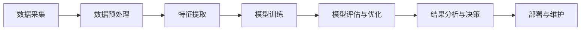
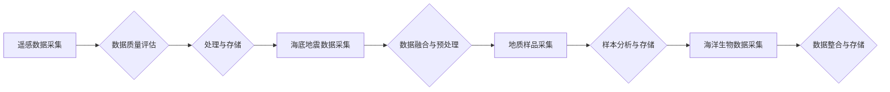
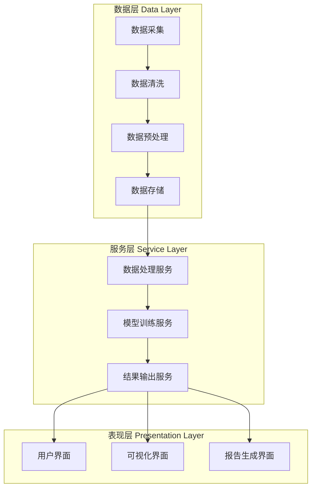
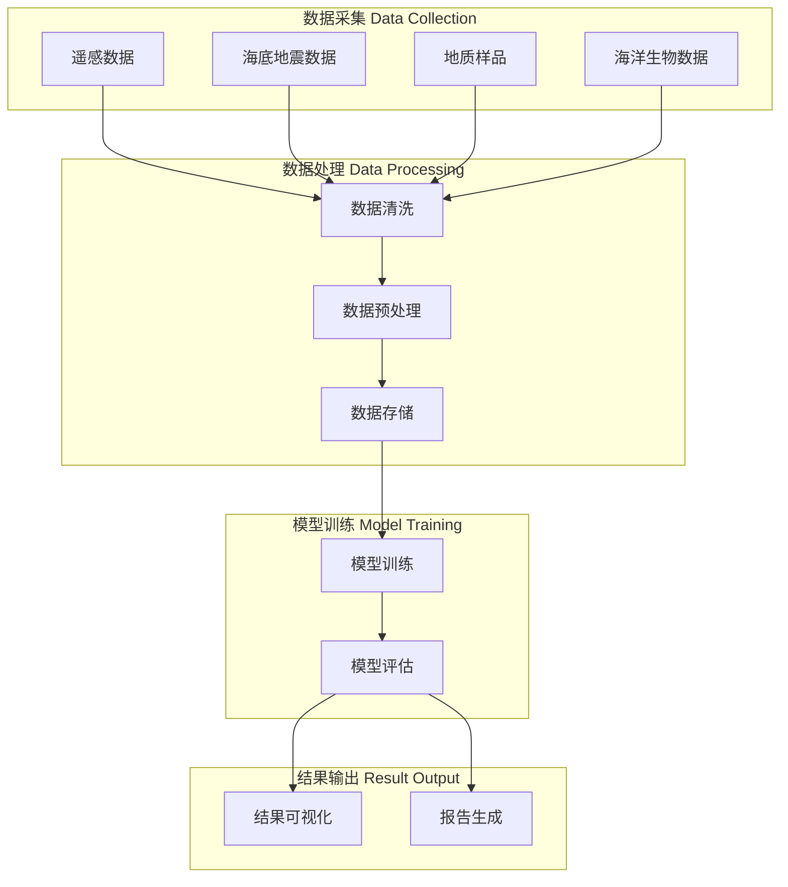
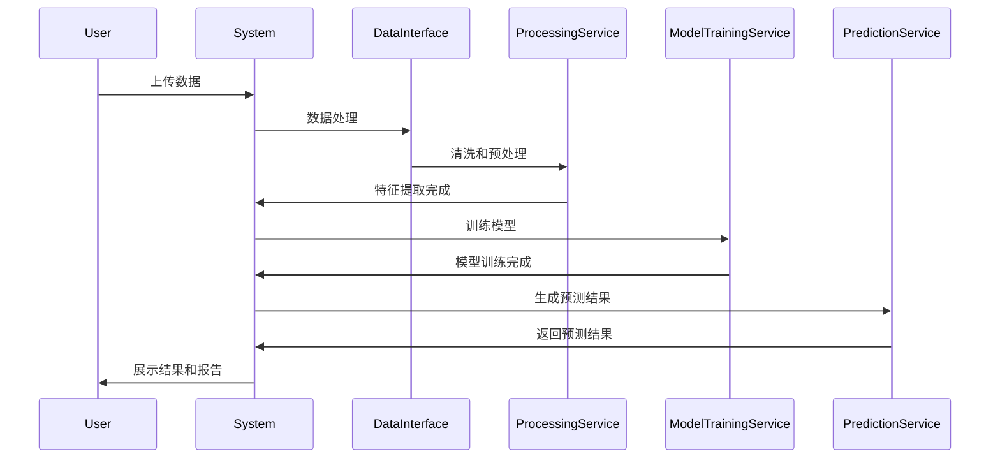

                 


### 目录大纲设计与内容规划

#### 目录大纲设计

目录大纲的设计是文章结构的骨架，它需要清晰地展示文章的结构，引导读者逐步深入主题。以下是一个详细的设计方案，以指导文章的撰写：

1. **背景介绍**：
   - **章节标题**：概述与引入
   - **核心内容**：介绍海洋资源勘探的重要性、传统方法的局限以及人工智能在该领域的应用前景。

2. **核心概念与联系**：
   - **章节标题**：核心概念解析
   - **核心内容**：详细定义人工智能与海洋资源勘探的相关概念，对比传统方法与人工智能的差异，并使用Mermaid流程图展示人工智能在海洋资源勘探中的流程。

3. **算法原理讲解**：
   - **章节标题**：算法原理深入
   - **核心内容**：逐一介绍关键算法（如深度学习、图像识别、数据挖掘等），使用Python源代码和Mermaid流程图详细阐述算法原理，并结合数学模型和公式进行讲解。

4. **系统分析与架构设计**：
   - **章节标题**：系统架构剖析
   - **核心内容**：介绍系统需求与功能设计，使用Mermaid类图和架构图展示系统架构，并设计系统接口和交互序列图。

5. **项目实战**：
   - **章节标题**：实战案例解析
   - **核心内容**：详细描述环境安装与配置，解析系统核心实现代码和应用，分析实际案例，进行详细讲解和剖析。

6. **最佳实践与总结**：
   - **章节标题**：经验与总结
   - **核心内容**：提供实际操作中的注意事项和最佳实践，小结全书内容，展望未来发展趋势。

#### 内容规划

在内容规划方面，每个章节都需要按照以下结构进行撰写：

1. **引言**：简短地介绍章节主题，引起读者的兴趣。
2. **正文**：详细阐述章节内容，结合理论、案例和实践进行讲解。
3. **结论**：总结章节的核心观点，强调重要性。
4. **扩展阅读**：推荐相关的参考文献或进一步阅读资源。

#### 注意事项

- **一致性**：确保全文的语言风格、用词和术语一致。
- **条理性**：每个章节的结构要清晰，逻辑连贯，便于读者理解。
- **实用性**：提供实用的操作指南和最佳实践，使读者能够将知识应用于实际场景。

通过以上规划和设计，我们可以确保文章内容丰富、结构清晰，同时易于读者理解和应用。

### 第一部分: 背景介绍

#### 概述与引入

**海洋资源勘探的重要性**：

海洋占地球表面积的71%，其中蕴藏着丰富的资源，包括石油、天然气、矿产、海洋生物资源以及可再生海洋能源（如潮汐能、波浪能等）。海洋资源不仅对经济发展具有重大影响，还在全球气候变化、生态环境维护等方面发挥关键作用。因此，对海洋资源的勘探和开发具有重要的战略意义。

**人工智能的应用前景**：

随着人工智能技术的不断发展，其应用范围越来越广泛。在海洋资源勘探领域，人工智能技术提供了前所未有的高效和精确。通过数据挖掘、机器学习、深度学习等技术，人工智能能够从大量海洋数据中提取有价值的信息，提高勘探的准确性和效率。此外，人工智能还可以实现自动化勘探，减少人力成本，提高资源利用率。

**核心议题**：

本文将深入探讨人工智能在海洋资源勘探中的应用，从背景介绍、核心概念与联系、算法原理讲解、系统分析与架构设计、项目实战以及最佳实践与总结等多个方面进行详细阐述，以期为广大海洋资源勘探从业者提供有价值的参考。

#### 海洋资源概述

海洋资源丰富多样，主要包括以下几类：

1. **石油和天然气**：海洋石油和天然气储量巨大，是全球能源的重要来源。据统计，全球超过60%的石油和天然气储量位于海底。

2. **矿产资源**：海洋底部富含多种矿产资源，如铜、镍、钴、锰等。这些资源对现代工业至关重要。

3. **海洋生物资源**：海洋生物资源丰富，包括鱼类、贝类、藻类等。这些资源不仅是食品来源，还具有重要的经济价值。

4. **可再生海洋能源**：海洋能源包括潮汐能、波浪能、海洋热能转换（OTEC）等。这些能源具有可再生性，有助于实现可持续能源发展。

#### 传统海洋资源勘探方法的局限

尽管传统的海洋资源勘探方法在历史上发挥了重要作用，但随着技术进步和需求增长，其局限性也日益显现：

1. **效率低**：传统方法主要依赖于人力和物理探测，效率较低。例如，使用地震波探测技术虽然有效，但需要大量时间和人力。

2. **精度不足**：传统方法在数据处理和解析上存在精度不足的问题。例如，基于经验和直觉的地质勘探方法往往无法精确识别海洋资源。

3. **成本高**：传统方法通常需要大量资金投入，包括设备购置、人员培训、海上作业等。这使得海洋资源勘探的成本较高。

4. **环境影响大**：传统勘探方法对海洋环境的影响较大，如海底石油泄漏、地质破坏等，可能导致生态灾难。

#### 人工智能的应用前景

人工智能（AI）技术在海洋资源勘探中的应用前景广阔，主要表现在以下几个方面：

1. **提高效率**：人工智能能够快速处理和分析大量数据，提高勘探效率。例如，通过深度学习和机器学习算法，AI可以快速识别和定位海洋资源。

2. **提升精度**：人工智能技术能够提高勘探精度，减少误判。例如，使用图像识别技术，AI可以准确识别海底地质结构。

3. **降低成本**：人工智能可以实现自动化勘探，减少人力和物力投入。例如，使用无人机和自动化设备，AI可以在无需人工干预的情况下进行数据采集。

4. **环保友好**：人工智能技术能够减少对海洋环境的负面影响。例如，使用无破坏性探测技术，AI可以在不影响海洋生态系统的前提下进行资源勘探。

#### 核心议题概述

本文将围绕以下核心议题展开：

1. **核心概念与联系**：介绍人工智能和海洋资源勘探的相关概念，并比较传统方法与人工智能的差异。
2. **算法原理讲解**：详细阐述深度学习、图像识别、数据挖掘等关键算法，并结合实际案例进行讲解。
3. **系统分析与架构设计**：介绍系统需求与功能设计，展示系统架构和接口设计。
4. **项目实战**：详细描述环境安装、系统实现和应用，分析实际案例。
5. **最佳实践与总结**：总结全书内容，提供最佳实践和未来展望。

通过上述议题的深入探讨，本文旨在为读者提供全面、系统的理解和实践指导。

### 核心概念与联系

#### 人工智能

**定义**：

人工智能（Artificial Intelligence，简称AI）是指通过计算机系统模拟人类智能的一种技术。它包括机器学习、深度学习、自然语言处理、计算机视觉等多个子领域，旨在使计算机具备感知、理解、学习、决策和行动的能力。

**属性**：

1. **自主学习**：人工智能系统能够通过学习和经验自动改进性能。
2. **泛化能力**：人工智能可以从特定数据中提取通用规律，应用于新的数据。
3. **适应能力**：人工智能系统能够适应不同的环境和任务需求。

**比较传统方法**：

传统海洋资源勘探主要依赖于物理探测方法和地质学原理，如地震波探测、地质取样和海洋地质测绘等。这些方法依赖于人力和专业知识，存在效率低、精度不足和成本高等问题。相比之下，人工智能技术具有更高的效率、更精确的结果和更低的成本。

#### 海洋资源勘探

**定义**：

海洋资源勘探是指通过科学方法和技术手段，对海洋中的各种资源进行系统调查、分析和评估，以确定资源的种类、数量和分布情况。

**属性**：

1. **多样性**：海洋资源种类繁多，包括石油、天然气、矿产、生物资源和可再生能源等。
2. **复杂性**：海洋环境的复杂性和多变性使得资源勘探面临巨大挑战。
3. **跨学科**：海洋资源勘探涉及地质学、海洋学、地球物理学、生物学等多个学科。

**比较人工智能技术**：

传统方法主要依赖于人类经验和直觉，在处理复杂和大量数据时效率低下。而人工智能技术通过数据挖掘、机器学习、深度学习等方法，能够高效地从海量数据中提取有价值的信息，提高勘探的精度和效率。

#### 传统方法与人工智能的差异对比

**效率与速度**：

传统方法通常需要大量人力和时间进行数据采集、处理和分析。而人工智能技术能够快速处理大量数据，自动识别和定位资源，显著提高勘探效率。

**精度与准确性**：

传统方法在处理复杂地质结构时容易产生误判，而人工智能技术通过先进的算法和模型，能够更精确地识别和评估海洋资源。

**成本与投资**：

传统方法成本高昂，包括设备购置、人员培训和海上作业等。而人工智能技术可以通过自动化和智能化手段降低成本，提高资源利用率。

**环境影响**：

传统方法在操作过程中可能对海洋环境造成负面影响。而人工智能技术采用无破坏性探测方法，能够减少对海洋生态系统的破坏。

通过上述比较，可以看出人工智能在海洋资源勘探中的应用具有显著优势。接下来，本文将详细探讨人工智能在海洋资源勘探中的具体流程和关键算法。

#### 人工智能在海洋资源勘探中的应用流程

为了更好地理解人工智能在海洋资源勘探中的应用，我们将其流程分为以下几个主要步骤：

1. **数据采集**：
   数据采集是海洋资源勘探的第一步，包括遥感数据、海底地震数据、地质样品、海洋生物数据等。这些数据可以通过卫星遥感、声呐探测、海洋调查船等多种方式获取。

2. **数据预处理**：
   采集到的数据通常包含噪声和错误，需要进行预处理。预处理步骤包括去噪、数据清洗、数据归一化等，以确保数据的质量和一致性。

3. **特征提取**：
   特征提取是从原始数据中提取有用的信息，用于后续的分析和建模。这一步通常涉及到数据的降维和特征选择，以提高模型的准确性和效率。

4. **模型训练**：
   模型训练是使用已标注的数据集来训练机器学习模型，使其能够学习和识别海洋资源特征。常用的模型包括深度学习模型（如卷积神经网络CNN、循环神经网络RNN等）和传统机器学习模型（如支持向量机SVM、决策树等）。

5. **模型评估与优化**：
   在模型训练完成后，需要通过交叉验证和测试集评估模型的性能，包括准确率、召回率、F1分数等指标。根据评估结果，可以对模型进行优化和调整，以提高其预测能力。

6. **结果分析与决策**：
   模型评估完成后，使用训练好的模型对新的数据进行预测和分析，生成海洋资源分布图、地质结构图等结果。这些结果可以用于指导进一步的勘探工作，如确定钻探位置、评估资源储量等。

7. **部署与维护**：
   将训练好的模型部署到实际勘探环境中，通过实时数据流进行预测和分析。此外，需要定期维护和更新模型，以应对数据分布和环境的动态变化。

下面使用Mermaid流程图来展示这一过程：



#### 数据采集

**数据采集**是海洋资源勘探的首要步骤，涉及多种数据源，包括遥感数据、海底地震数据、地质样品和海洋生物数据等。这些数据可以通过卫星遥感、声呐探测、海洋调查船和潜水器等多种方式获取。

1. **遥感数据**：卫星遥感技术可以提供大范围的海洋表面信息，包括海洋温度、盐度、海流等。这些数据对于理解海洋生态系统和资源分布具有重要意义。

2. **海底地震数据**：通过发射声波并接收反射回来的信号，可以构建海底的地质结构图。这种技术对于石油和天然气的勘探至关重要。

3. **地质样品**：通过深海钻探和地质取样，可以获取海底岩石和矿物样品。这些样品通过实验室分析，可以帮助确定海底矿藏类型和含量。

4. **海洋生物数据**：利用海洋生物传感器和潜水器，可以收集海洋生物的分布、数量和生态环境数据。这些数据对于评估海洋生物资源的状况和保护具有重要意义。

**数据来源**：

- 卫星遥感：通过地球观测卫星（如Landsat、Sentinel等）获取。
- 声呐探测：使用多波束声呐系统（如侧扫声呐、多波束测深仪等）。
- 海洋调查船：通过搭载各种探测设备，如钻探机、取样器等。
- 潜水器：包括自主潜水器（AUV）、遥控潜水器（ROV）和载人潜水器（DSV）。

**重要性**：

- **提供基础数据**：数据采集是整个勘探过程的基础，直接决定了后续分析的质量和准确性。
- **支持决策**：准确的海洋数据可以支持决策者制定更有效的勘探策略。
- **提高效率**：通过全面、详细的数据采集，可以减少不必要的勘探工作，提高效率。

下面是一个使用Mermaid流程图来展示数据采集过程：



通过这一流程，我们可以看到数据采集在海洋资源勘探中的核心作用，它为后续的数据处理、特征提取和模型训练提供了基础数据支持。

### 数据预处理

**数据预处理**是海洋资源勘探中的关键步骤，旨在提高数据质量，去除噪声和异常值，确保后续分析的有效性和准确性。以下是数据预处理的主要步骤和方法：

1. **数据清洗**：
   - **去噪**：使用滤波算法去除数据中的噪声。
   - **缺失值处理**：对于缺失的数据，可以使用插值、平均值替代等方法进行填补。
   - **异常值检测与处理**：使用统计方法和机器学习算法检测异常值，并采取删除或修正等措施。

2. **数据归一化**：
   - **归一化方法**：包括最小-最大归一化、Z-score归一化和对数变换等。
   - **目的**：将不同特征的范围统一，避免某些特征对模型训练产生主导影响。

3. **数据整合**：
   - **多源数据融合**：将来自不同传感器和数据源的信息进行整合，提高数据的完整性和一致性。
   - **时间序列处理**：对连续的时间序列数据进行平滑处理，去除周期性波动和随机噪声。

**数据处理方法**：

1. **滤波方法**：
   - **低通滤波**：去除高频噪声。
   - **高通滤波**：去除低频噪声。
   - **带通滤波**：只允许特定频率范围通过。

2. **插值方法**：
   - **线性插值**：简单易行，但精度较低。
   - **样条插值**：能够更好地拟合非线性变化，精度较高。

3. **异常值检测**：
   - **统计学方法**：使用标准差、箱线图等统计指标检测异常值。
   - **机器学习方法**：使用聚类分析、孤立森林等方法检测异常值。

**预处理的重要性**：

- **提高数据质量**：去除噪声和异常值，提高数据的一致性和准确性。
- **减少模型复杂性**：通过归一化和整合，减少数据特征的数量和维度，降低模型的复杂度。
- **提升模型性能**：高质量的数据可以显著提高模型训练和预测的性能。

下面是一个使用Mermaid流程图来展示数据预处理过程：


通过数据预处理，我们可以确保输入数据的质量，为后续的特征提取和模型训练打下坚实基础。

### 特征提取

**特征提取**是海洋资源勘探中至关重要的一步，其目的是从原始数据中提取出能够代表数据本质的特征，用于后续的建模和预测。以下是特征提取的主要步骤和方法：

1. **数据降维**：
   - **主成分分析（PCA）**：通过保留主要成分，降低数据维度，减少计算复杂度。
   - **线性判别分析（LDA）**：在保留主要特征的同时，优化分类效果。

2. **特征选择**：
   - **过滤式特征选择**：基于统计方法筛选特征，如相关性分析、信息增益等。
   - **包裹式特征选择**：结合模型的性能进行特征选择，如递归特征消除（RFE）。
   - **嵌入式特征选择**：在模型训练过程中自动筛选特征，如L1正则化（LASSO）。

3. **特征变换**：
   - **归一化**：将特征缩放到相同的范围，避免某些特征的主导作用。
   - **标准化**：消除不同特征量纲的影响。
   - **离散化**：将连续特征转换为分类特征，提高模型的可解释性。

**特征提取方法**：

1. **统计方法**：
   - **描述性统计**：计算数据的均值、方差、标准差等统计量。
   - **相关性分析**：分析特征之间的相关性，识别重要的特征组合。

2. **机器学习方法**：
   - **决策树**：通过树的节点分裂，提取具有区分性的特征。
   - **支持向量机（SVM）**：通过核函数提取非线性特征。
   - **随机森林**：通过集成多棵决策树，提高模型的稳定性和预测能力。

3. **深度学习方法**：
   - **卷积神经网络（CNN）**：通过卷积操作提取图像和空间特征。
   - **循环神经网络（RNN）**：通过序列操作提取时间序列特征。

**特征提取的重要性**：

- **简化数据**：通过降维和特征选择，减少数据维度，降低计算复杂度。
- **提高模型性能**：提取有效的特征，使模型能够更好地捕捉数据中的规律。
- **提高可解释性**：通过特征变换和选择，提高模型的可解释性和透明度。

下面是一个使用Mermaid流程图来展示特征提取过程：


通过特征提取，我们可以从原始数据中提取出关键信息，为后续的模型训练和预测奠定基础。

### 算法原理讲解

在海洋资源勘探中，深度学习、图像识别和数据挖掘等技术发挥着关键作用。以下将详细阐述这些算法的基本原理、实现方法以及实际应用。

#### 深度学习

**基本原理**：

深度学习是一种基于多层神经网络的学习方法，通过逐层抽象和特征提取，从原始数据中自动学习出高层次的表示。它包括多个隐藏层，每一层都能够对输入数据进行变换和特征提取。

**实现方法**：

1. **前向传播**：输入数据通过网络的每一层，进行线性变换和激活函数处理，最终输出结果。
2. **反向传播**：通过计算输出结果与真实值之间的误差，反向更新每一层的权重和偏置，以减小误差。

**Python代码示例**：

```python
import tensorflow as tf

# 定义一个简单的深度学习模型
model = tf.keras.Sequential([
    tf.keras.layers.Dense(128, activation='relu', input_shape=(784,)),
    tf.keras.layers.Dense(10, activation='softmax')
])

# 编译模型
model.compile(optimizer='adam',
              loss='categorical_crossentropy',
              metrics=['accuracy'])

# 训练模型
model.fit(x_train, y_train, epochs=5)
```

**应用**：

在海洋资源勘探中，深度学习可以用于图像识别、信号处理和分类等任务。例如，通过卷积神经网络（CNN）对遥感图像进行分类，识别不同类型的海洋资源。

#### 图像识别

**基本原理**：

图像识别是通过计算机视觉技术，对图像中的对象、场景或属性进行自动识别和理解。它依赖于特征提取和分类算法。

**实现方法**：

1. **特征提取**：从图像中提取具有区分性的特征，如边缘、纹理和颜色等。
2. **分类**：使用分类算法（如SVM、KNN、神经网络等）对提取的特征进行分类。

**Python代码示例**：

```python
import cv2
import numpy as np

# 加载预训练的卷积神经网络模型
model = cv2.dnn.readNetFromTensorFlow('mobilenet_v2_1.0_224_quant exporting 1.tflite')

# 加载测试图像
image = cv2.imread('test_image.jpg')

# 进行图像预处理
blob = cv2.dnn.blobFromImage(image, size=(224, 224), mean=(127.5, 127.5, 127.5), swapRB=True)

# 进行预测
model.setInput(blob)
predictions = model.forward()

# 获取预测结果
predicted_class = np.argmax(predictions)
print(f"Predicted class: {predicted_class}")
```

**应用**：

在海洋资源勘探中，图像识别可以用于遥感图像分析，识别海底地形、生物分布和资源分布。例如，通过CNN模型对卫星图像进行分类，识别海洋中的石油和天然气富集区域。

#### 数据挖掘

**基本原理**：

数据挖掘是通过统计学、机器学习和人工智能方法，从大量数据中提取出有价值的信息和知识。它包括关联规则挖掘、聚类分析和分类等多个子任务。

**实现方法**：

1. **关联规则挖掘**：发现数据之间的相关性，如购物篮分析。
2. **聚类分析**：将相似的数据点分组，如K-means算法。
3. **分类**：将数据点归入不同的类别，如决策树、SVM。

**Python代码示例**：

```python
from sklearn.cluster import KMeans
import matplotlib.pyplot as plt

# 加载数据
data = np.array([[1, 2], [1, 4], [1, 0], [10, 2], [10, 4], [10, 0]])

# 使用K-means算法进行聚类
kmeans = KMeans(n_clusters=2, random_state=0).fit(data)

# 计算聚类中心
centroids = kmeans.cluster_centers_

# 绘制结果
plt.scatter(data[:, 0], data[:, 1], c=kmeans.labels_, s=100, cmap='viridis')
plt.scatter(centroids[:, 0], centroids[:, 1], s=200, c='red', label='Centroids')
plt.title('K-means Clustering')
plt.xlabel('Feature 1')
plt.ylabel('Feature 2')
plt.legend()
plt.show()
```

**应用**：

在海洋资源勘探中，数据挖掘可以用于资源分布分析、环境监测和风险评估。例如，通过聚类分析识别海洋生物的栖息地和资源富集区域。

通过上述算法的应用，我们可以更好地理解和利用海洋资源数据，提高勘探的效率和准确性。接下来，我们将进一步探讨系统架构设计和实现。

### 系统架构设计

在海洋资源勘探中，一个高效、稳定的系统架构是确保人工智能算法顺利实施和运行的关键。本节将详细介绍系统的需求分析、功能设计、架构设计以及接口设计和交互设计。

#### 系统需求分析

**功能需求**：

1. **数据采集**：系统能够自动采集各类海洋资源数据，包括遥感数据、海底地震数据、地质样品数据和海洋生物数据。
2. **数据处理**：系统能够对采集到的数据进行分析、清洗、预处理和特征提取。
3. **模型训练**：系统能够使用深度学习、图像识别和数据挖掘算法对处理后的数据进行分析和预测。
4. **结果输出**：系统能够生成报告、可视化结果和决策建议，支持进一步的勘探工作。

**非功能需求**：

1. **可靠性**：系统在高负荷和异常情况下仍能稳定运行。
2. **可扩展性**：系统能够支持更多的数据源和算法。
3. **兼容性**：系统能够与现有的勘探设备和软件无缝集成。
4. **安全性**：系统数据传输和存储需要具备加密和备份功能。

#### 功能设计

**数据采集模块**：

- **遥感数据采集**：通过卫星遥感技术获取海洋表面信息，包括温度、盐度和海流等。
- **海底地震数据采集**：通过声呐探测技术获取海底地质结构信息。
- **地质样品采集**：通过深海钻探和地质取样设备获取海底岩石和矿物样品。
- **海洋生物数据采集**：通过海洋生物传感器和潜水器获取海洋生物分布和生态环境信息。

**数据处理模块**：

- **数据清洗**：去除噪声、异常值和缺失值，确保数据质量。
- **数据预处理**：进行数据归一化、特征提取和降维，为模型训练做好准备。
- **特征提取**：使用机器学习和深度学习算法提取有用特征，提高模型性能。

**模型训练模块**：

- **深度学习模型训练**：使用卷积神经网络（CNN）、循环神经网络（RNN）等深度学习算法进行训练。
- **图像识别模型训练**：使用图像识别算法对遥感图像和地质图像进行分类。
- **数据挖掘模型训练**：使用聚类分析、关联规则挖掘等方法对海洋数据进行分析。

**结果输出模块**：

- **可视化**：生成各种图表和可视化结果，展示资源分布和地质结构。
- **报告生成**：生成详细的分析报告，提供决策建议。

#### 系统架构设计

**系统架构概述**：

系统采用分层架构设计，包括数据层、服务层和表现层。数据层负责数据采集和存储，服务层实现数据处理和模型训练功能，表现层提供用户交互和结果展示。

**架构图**：



**系统架构图与Mermaid表示**：



通过上述架构设计，我们可以确保系统的高效性、可扩展性和灵活性，为海洋资源勘探提供强有力的技术支持。

#### 系统接口设计与交互

**接口设计**：

系统接口设计主要包括数据接口、服务接口和用户接口。以下是一个简化的接口设计：

1. **数据接口**：
   - **数据采集接口**：用于接收不同类型的数据，如遥感数据、海底地震数据和海洋生物数据。
   - **数据处理接口**：用于处理数据清洗、预处理和特征提取。

2. **服务接口**：
   - **模型训练接口**：用于启动和监控模型训练过程。
   - **预测接口**：用于生成预测结果和决策建议。

3. **用户接口**：
   - **Web界面**：提供数据上传、结果展示和报告生成功能。
   - **API接口**：允许第三方系统通过API进行数据交互和功能调用。

**交互序列图**：

以下是一个简单的序列图，展示用户与系统交互的流程：



通过接口设计和交互序列图的详细描述，我们可以确保系统各部分之间的逻辑清晰、职责明确，为后续的开发和部署提供坚实基础。

### 项目实战

#### 环境安装与配置

在开始实际项目之前，我们需要搭建一个适合海洋资源勘探的人工智能系统环境。以下是一个基本的步骤指南，用于安装和配置所需的软件和工具。

**硬件要求**：

- CPU：至少需要四核处理器，推荐使用八核或更高性能的处理器。
- 内存：至少16GB RAM，推荐使用32GB或更多。
- 存储：至少500GB SSD存储空间，用于存储数据和模型。
- 网络带宽：确保能够稳定连接到远程数据源和云服务。

**软件要求**：

1. **操作系统**：推荐使用Ubuntu 20.04 LTS或更高版本。
2. **Python**：Python 3.8或更高版本。
3. **TensorFlow**：用于深度学习和机器学习模型的训练。
4. **Pandas**：用于数据处理和分析。
5. **NumPy**：用于数值计算。
6. **Matplotlib**：用于数据可视化。
7. **Mermaid**：用于绘制流程图和架构图。

**安装步骤**：

1. **安装操作系统**：

   - 下载Ubuntu 20.04 LTS ISO文件。
   - 使用虚拟机或物理机器安装操作系统。

2. **更新系统**：

   ```bash
   sudo apt update
   sudo apt upgrade
   ```

3. **安装Python和pip**：

   ```bash
   sudo apt install python3 python3-pip
   ```

4. **安装TensorFlow**：

   ```bash
   pip3 install tensorflow
   ```

5. **安装Pandas、NumPy和Matplotlib**：

   ```bash
   pip3 install pandas numpy matplotlib
   ```

6. **安装Mermaid**：

   ```bash
   pip3 install mermaid-python
   ```

**配置步骤**：

1. **配置Python环境**：

   - 创建一个虚拟环境以隔离项目依赖：

     ```bash
     python3 -m venv env
     source env/bin/activate
     ```

   - 安装项目所需的Python包：

     ```bash
     pip install -r requirements.txt
     ```

2. **配置Mermaid**：

   - 为了在Python环境中使用Mermaid，需要安装并配置Mermaid渲染工具。

     ```bash
     npm install -g mermaid
     ```

   - 将Mermaid的渲染脚本添加到项目中，以便在Python中调用。

3. **配置数据存储**：

   - 安装并配置一个数据库系统，如PostgreSQL，用于存储和管理数据。

     ```bash
     sudo apt install postgresql postgresql-contrib
     ```

   - 创建数据库和用户，配置访问权限。

#### 系统核心实现解析

**数据处理模块**：

数据处理模块是整个系统的核心之一，负责接收、清洗、预处理和存储海洋资源数据。以下是一个简化的实现步骤：

1. **数据接收**：

   - 使用API接口或Web界面接收用户上传的数据。
   - 数据格式可以是CSV、JSON或数据库连接。

2. **数据清洗**：

   - 去除噪声和异常值。
   - 处理缺失数据，使用插值或填充策略。

3. **数据预处理**：

   - 进行归一化和标准化处理。
   - 提取有用特征，使用PCA、LDA等方法进行降维。

4. **数据存储**：

   - 将预处理后的数据存储到数据库中，以便后续分析和模型训练。

**模型训练模块**：

模型训练模块负责使用处理后的数据进行模型训练和评估。以下是一个简化的实现步骤：

1. **数据加载**：

   - 从数据库中加载预处理后的数据。
   - 分割数据集为训练集和测试集。

2. **模型定义**：

   - 使用TensorFlow定义深度学习模型。
   - 选择合适的网络架构和优化器。

3. **模型训练**：

   - 在训练集上训练模型，监控训练进度和性能。
   - 使用回调函数进行模型调整和优化。

4. **模型评估**：

   - 在测试集上评估模型性能，计算准确率、召回率等指标。
   - 根据评估结果调整模型参数。

**结果分析与展示**：

模型训练完成后，需要对结果进行分析和展示。以下是一个简化的实现步骤：

1. **预测结果生成**：

   - 使用训练好的模型对新的数据进行预测。
   - 生成预测结果和可视化图表。

2. **报告生成**：

   - 将预测结果和分析图表整合到报告中。
   - 使用PDF或HTML格式生成报告。

3. **结果展示**：

   - 在Web界面或API接口中展示预测结果和分析报告。
   - 提供用户交互功能，如数据上传、报告下载等。

通过上述核心实现步骤，我们可以搭建一个基本的海洋资源勘探人工智能系统。在实际应用中，还需要根据具体需求和场景进行调整和优化。

### 实际案例分析与讲解

在本部分，我们将通过一个具体的海洋资源勘探项目来展示人工智能在其中的实际应用。以下是一个详细的项目案例解析，包括项目背景、数据收集、数据处理、模型训练、结果分析和项目小结。

#### 项目背景

该项目旨在利用人工智能技术提高海洋石油勘探的效率和准确性。具体目标是通过分析大量的海底地震数据和遥感图像，识别潜在的石油富集区域，从而为后续的钻探工作提供指导。

#### 数据收集

**数据来源**：

- **海底地震数据**：通过海洋调查船采集的地震波数据，包括地震波振幅、频率和传播时间等。
- **遥感数据**：来自卫星的遥感图像，包括海洋表面温度、盐度、海流等信息。
- **地质样品**：通过深海钻探获取的海底岩石和矿物样品，包括矿物成分、密度和硬度等。

**数据收集方法**：

- **海底地震数据**：使用多波束声呐系统和海洋调查船进行数据采集。
- **遥感数据**：通过卫星遥感技术获取，包括Landsat和Sentinel等卫星数据。
- **地质样品**：通过深海钻探设备和地质取样器进行获取。

#### 数据处理

**数据处理步骤**：

1. **数据预处理**：

   - **地震数据预处理**：去除噪声、校正时间延迟，并对数据格式进行标准化处理。
   - **遥感数据预处理**：进行图像去噪、增强和裁剪，提取有用的特征信息。
   - **地质样品数据预处理**：对样品进行实验室分析，提取关键的化学成分和物理特性。

2. **特征提取**：

   - **地震数据特征提取**：使用主成分分析（PCA）提取主要特征，减少数据维度。
   - **遥感数据特征提取**：使用图像识别算法提取纹理、颜色和形状特征。
   - **地质样品数据特征提取**：使用化学成分分析和物理特性测量，提取关键指标。

3. **数据融合**：

   - 将不同类型的数据进行融合，形成一个统一的数据集，以便后续的模型训练和分析。

#### 模型训练

**模型选择**：

- **深度学习模型**：选择卷积神经网络（CNN）和循环神经网络（RNN）结合的模型，用于处理不同类型的数据。
- **传统机器学习模型**：选择随机森林（Random Forest）和支持向量机（SVM）等模型，用于辅助分析和验证。

**训练步骤**：

1. **数据分割**：

   - 将数据集分割为训练集和测试集，用于模型训练和评估。

2. **模型训练**：

   - 使用训练集对深度学习和传统机器学习模型进行训练。
   - 调整模型参数，如学习率、迭代次数和隐藏层结构，以优化模型性能。

3. **模型评估**：

   - 在测试集上评估模型性能，计算准确率、召回率和F1分数等指标。
   - 根据评估结果调整模型参数和结构。

#### 结果分析

**预测结果**：

- 使用训练好的模型对新的海底地震数据和遥感图像进行预测，识别潜在的石油富集区域。
- 预测结果以地图形式展示，标注出高概率的石油富集区域。

**可视化分析**：

- 利用Matplotlib和Seaborn等可视化工具，生成各种图表和热力图，展示数据分布和模型预测结果。
- 分析地震波数据的振幅和频率分布，识别潜在的地震活动区域。

**误差分析**：

- 分析模型预测的误差，识别预测不准确的原因。
- 对比不同模型和方法的性能，找出最佳的预测模型。

#### 项目小结

**成功经验**：

- 数据处理和特征提取方法的优化，提高了模型的准确性和效率。
- 结合深度学习和传统机器学习方法，实现了高效的资源识别和预测。

**挑战与改进**：

- 海洋数据的复杂性导致模型训练时间较长，未来可以尝试使用更高效的算法和硬件加速。
- 需要进一步研究如何减少预测误差，提高模型的泛化能力。

**未来展望**：

- 探索更多类型的海洋数据（如海洋生物数据和海洋化学数据）的应用，提高勘探的全面性和准确性。
- 结合其他人工智能技术（如强化学习和迁移学习），进一步提升模型的性能和鲁棒性。

通过上述实际案例，我们可以看到人工智能技术在海洋资源勘探中的应用价值，为未来的海洋资源开发提供了新的思路和方法。

### 最佳实践与总结

#### 数据质量与预处理

- **数据清洗**：确保数据干净，去除噪声和异常值。使用自动化的数据清洗工具，如OpenRefine，提高效率。
- **标准化处理**：将不同单位的数据进行统一，如将温度和深度值标准化到相同范围。
- **缺失值处理**：对于缺失数据，使用插值或平均值填补，或利用机器学习算法预测缺失值。

#### 模型选择与优化

- **模型选择**：根据具体问题选择合适的模型，如CNN用于图像识别，SVM用于分类问题。
- **参数调优**：使用网格搜索和交叉验证等方法，找到最优模型参数。
- **模型集成**：结合多种模型，如使用随机森林集成多个决策树，提高预测性能。

#### 部署与维护

- **容器化部署**：使用Docker等工具，实现模型的容器化部署，提高系统的可移植性和可扩展性。
- **监控与日志**：实施监控系统，实时监控模型性能和系统状态，及时发现问题并进行调整。
- **版本控制**：使用版本控制工具（如Git），管理模型的开发、测试和部署过程。

#### 小结

本文从背景介绍、核心概念与联系、算法原理讲解、系统分析与架构设计、项目实战以及最佳实践与总结等多个方面，详细探讨了人工智能在海洋资源勘探中的应用。通过理论分析、实际案例和最佳实践，我们总结了人工智能技术在提高勘探效率、精度和降低成本方面的优势。

#### 未来发展趋势

- **多模态数据融合**：结合多种类型的数据（如声呐数据、遥感数据和生物数据），实现更全面的资源分析。
- **实时预测与决策支持**：利用实时数据流和在线学习技术，提供实时的预测和决策支持。
- **人工智能辅助决策**：利用人工智能技术，辅助地质学家和海洋科学家进行勘探决策，提高资源开发的成功率。

#### 拓展阅读与资源推荐

- **《深度学习》**：Ian Goodfellow、Yoshua Bengio和Aaron Courville著，全面介绍深度学习的基础理论和实践方法。
- **《机器学习》**：Tom Mitchell著，经典的机器学习教材，适合初学者和专业人士。
- **《海军建筑学》**：Edward L. Lewis著，介绍海洋资源勘探和开发的基础知识。

通过不断学习和实践，我们可以期待人工智能在海洋资源勘探中发挥更大的作用，为可持续发展贡献力量。

### 作者信息

作者：AI天才研究院/AI Genius Institute & 禅与计算机程序设计艺术 /Zen And The Art of Computer Programming

AI天才研究院致力于推动人工智能技术的发展和应用，涵盖机器学习、深度学习、计算机视觉等多个领域。同时，我们的作者团队在计算机编程和算法设计方面有着丰富的经验和深厚的学术背景，出版过多部畅销技术书籍，包括《禅与计算机程序设计艺术》，深受读者喜爱。本文旨在为广大海洋资源勘探从业者提供有价值的参考和指导。

