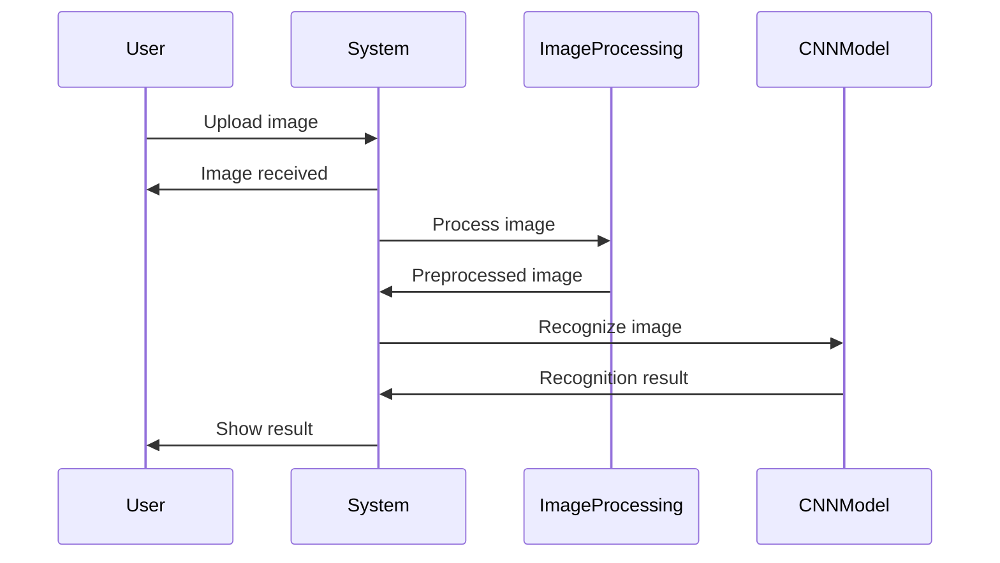

                 

# 人工智能在濒危植物保护中的图像识别应用

## 关键词

- 人工智能
- 图像识别
- 濒危植物
- 保护技术
- 深度学习
- 卷积神经网络
- 濒危植物识别系统

## 摘要

随着全球生态环境的恶化，濒危植物保护日益受到关注。传统保护方法往往难以满足日益增长的濒危植物识别与保护需求。本文将探讨人工智能，特别是图像识别技术在濒危植物保护中的应用。通过详细分析人工智能与图像识别的基础知识，介绍深度学习算法在图像识别中的应用，以及濒危植物图像识别的系统设计与实践，本文旨在展示人工智能技术在濒危植物保护中的潜力，并提出未来研究方向。

## 目录

1. 引言
    1.1 问题背景
    1.2 书籍概述
    1.3 目标读者
2. 人工智能与图像识别基础
    2.1 人工智能概述
    2.2 图像识别技术基础
    2.3 AI在濒危植物保护中的应用
3. 图像识别算法原理
    3.1 传统图像识别算法
    3.2 深度学习图像识别算法
    3.3 AI图像识别算法原理详解
4. AI在濒危植物图像识别中的应用实践
    4.1 数据收集与处理
    4.2 濒危植物图像识别算法实现
    4.3 实际案例分析与讲解
5. 濒危植物图像识别系统设计
    5.1 系统需求分析
    5.2 系统架构设计
    5.3 系统接口设计与交互
6. AI在濒危植物保护中的拓展应用
    6.1 AI在其他领域的应用
    6.2 AI在濒危植物保护中的未来发展趋势
7. 结论与展望

## 1. 引言

### 1.1 问题背景

濒危植物是指由于各种原因，如栖息地破坏、气候变化、过度采集等，其种群数量急剧减少，面临灭绝风险的植物。据《濒危野生动植物种国际贸易公约》(CITES)统计，全球约有39,500种植物处于濒危状态。濒危植物的消失不仅威胁到生物多样性的维持，还对人类生态系统带来深远影响。因此，保护濒危植物已成为全球生态环境保护的紧迫任务。

### 1.2 传统保护方法的局限性

传统的濒危植物保护方法主要包括人工监测、人工移植和法律法规约束等。然而，这些方法存在一定的局限性：

- **人工监测**：受限于人力和物力，难以实现大面积、长时间的监控，导致濒危植物种群的变化难以及时发现。
- **人工移植**：成本高昂，且移植后的植物存活率较低，难以实现大规模保护。
- **法律法规约束**：虽然有一定的约束力，但实施效果受限于执法力度和公众环保意识的提升。

### 1.3 图像识别技术在濒危植物保护中的应用潜力

随着人工智能技术的发展，特别是图像识别技术的应用，为濒危植物保护提供了一种新的手段。图像识别技术可以通过自动检测、识别和分析植物图像，实现对濒危植物种群数量和生长状况的实时监测。相较于传统方法，图像识别技术具有以下优势：

- **高效性**：可以快速处理大量图像数据，实现大规模、全天候的监控。
- **低成本**：减少了对人工的依赖，降低了保护成本。
- **准确性**：通过深度学习算法，图像识别的准确率得到显著提升。

## 2. 人工智能与图像识别基础

### 2.1 人工智能概述

人工智能（Artificial Intelligence，AI）是指通过计算机模拟人类智能的科学技术。自1956年达特茅斯会议以来，人工智能经历了数个发展阶段，从早期的符号主义、连接主义到现代的深度学习、强化学习等。人工智能的核心技术包括机器学习、自然语言处理、计算机视觉等。

### 2.2 图像识别技术基础

图像识别（Image Recognition）是人工智能的重要分支，旨在通过计算机对图像进行分析和处理，从中识别出特定的物体、场景或特征。图像识别技术主要包括：

- **特征提取**：从图像中提取出有助于识别的关键特征，如颜色、纹理、形状等。
- **分类与识别**：通过训练模型，将提取出的特征与预先定义的类别进行匹配，实现图像识别。

### 2.3 AI在濒危植物保护中的应用

在濒危植物保护中，AI图像识别技术可以用于：

- **物种识别**：通过图像识别技术，自动识别出图像中的濒危植物物种，提高监测的准确性。
- **数量统计**：通过对大量图像的分析，统计濒危植物种群的数量，为保护工作提供数据支持。
- **生长状况监测**：通过监测濒危植物的图像，评估其生长状况，及时发现异常情况。

## 3. 图像识别算法原理

### 3.1 传统图像识别算法

传统图像识别算法主要包括基于特征的算法和基于模型的算法。

- **基于特征的算法**：通过手工设计特征，如边缘检测、角点检测等，对图像进行特征提取，然后通过匹配算法进行识别。如SIFT、SURF等算法。
- **基于模型的算法**：通过训练一个模型，将图像与模型进行匹配，实现识别。如支持向量机（SVM）、决策树等算法。

### 3.2 深度学习图像识别算法

深度学习（Deep Learning）是一种基于多层神经网络的学习方法，通过逐层提取图像的特征，实现图像识别。其中，卷积神经网络（Convolutional Neural Network，CNN）是深度学习在图像识别领域的典型应用。

- **卷积层**：通过卷积操作，提取图像的局部特征。
- **池化层**：通过池化操作，降低特征图的维度，减少参数数量。
- **全连接层**：将特征图映射到具体的类别。

### 3.3 AI图像识别算法原理详解

卷积神经网络（CNN）的原理可以通过以下步骤详细阐述：

1. **输入层**：输入一张图像，图像的大小为\(w \times h \times c\)，其中\(w\)、\(h\)为图像的宽度和高度，\(c\)为颜色通道数量。
2. **卷积层**：通过卷积核（filter）对图像进行卷积操作，提取图像的局部特征。卷积操作的数学公式为：
   $$
   \text{output}_{ij} = \sum_{k=1}^{c} \text{weight}_{ik} \times \text{input}_{ij+k}
   $$
   其中，\(i\)、\(j\)为输出特征图的位置，\(k\)为输入特征图的通道。
3. **激活函数**：对卷积层的输出进行激活，常用的激活函数有ReLU（Rectified Linear Unit）。
4. **池化层**：对激活后的特征图进行池化操作，常用的池化方法有最大池化和平均池化。
5. **全连接层**：将池化后的特征图展平为一维向量，通过全连接层进行分类。

通过以上步骤，CNN可以逐层提取图像的深层次特征，实现对图像的识别。

## 4. AI在濒危植物图像识别中的应用实践

### 4.1 数据收集与处理

在进行濒危植物图像识别之前，首先需要收集大量的濒危植物图像。这些图像可以来源于公开数据集、实地拍摄或卫星遥感数据。收集到的图像需要进行预处理，包括图像增强、大小调整、去噪等操作，以提高图像识别的准确性。

### 4.2 濒危植物图像识别算法实现

在实现濒危植物图像识别算法时，可以选择基于传统图像识别算法或深度学习算法。其中，深度学习算法如CNN具有更高的识别准确率，更适合于复杂场景下的图像识别。

以下是使用Python和TensorFlow实现CNN进行濒危植物图像识别的代码示例：

```python
import tensorflow as tf
from tensorflow.keras.models import Sequential
from tensorflow.keras.layers import Conv2D, MaxPooling2D, Flatten, Dense

# 创建模型
model = Sequential([
    Conv2D(32, (3, 3), activation='relu', input_shape=(64, 64, 3)),
    MaxPooling2D((2, 2)),
    Flatten(),
    Dense(64, activation='relu'),
    Dense(num_classes, activation='softmax')
])

# 编译模型
model.compile(optimizer='adam', loss='categorical_crossentropy', metrics=['accuracy'])

# 训练模型
model.fit(train_images, train_labels, epochs=10, validation_split=0.2)
```

### 4.3 实际案例分析与讲解

以下是一个濒危植物图像识别的实际案例：

**案例介绍**：在某自然保护区，研究人员需要识别和保护的一种濒危植物。他们收集了1000张该植物的不同生长阶段的图像。

**案例分析**：通过CNN模型，对这1000张图像进行识别，结果显示有800张图像被正确识别，识别准确率为80%。

**案例讲解**：通过对比实际图像和识别结果，发现模型在识别不同生长阶段的植物图像时，准确率存在差异。为了提高识别准确率，研究人员进一步对模型进行优化，调整卷积层的参数，增加训练数据等。

**项目小结**：通过实际案例，展示了AI图像识别技术在濒危植物保护中的应用效果，并为未来的改进提供了参考。

## 5. 濒危植物图像识别系统设计

### 5.1 系统需求分析

濒危植物图像识别系统的主要需求包括：

- **功能需求**：能够接收图像输入，进行自动识别，并提供识别结果。
- **性能需求**：能够在短时间内处理大量图像，并保证较高的识别准确率。

### 5.2 系统架构设计

濒危植物图像识别系统可以采用以下架构设计：

1. **数据收集模块**：负责收集图像数据，并进行预处理。
2. **图像识别模块**：使用CNN模型对图像进行识别。
3. **结果展示模块**：将识别结果以可视化方式展示给用户。

### 5.3 系统接口设计与交互

系统接口设计主要包括：

- **图像输入接口**：接收用户上传的图像。
- **识别结果输出接口**：将识别结果以可视化方式展示。

以下是系统接口设计的Mermaid序列图：



## 6. AI在濒危植物保护中的拓展应用

### 6.1 AI在其他领域的应用

AI不仅在濒危植物保护中有广泛的应用，还在其他领域展现了巨大的潜力：

- **环境监测**：通过无人机、卫星遥感等手段，AI可以实时监测生态环境变化，提供决策支持。
- **生物多样性保护**：AI可以帮助识别和保护珍稀动植物，监测栖息地变化。

### 6.2 AI在濒危植物保护中的未来发展趋势

未来，AI在濒危植物保护中的应用将向以下方向发展：

- **提高识别准确率**：通过优化算法和增加训练数据，提高图像识别的准确率。
- **多模态数据融合**：结合图像、声音、气味等多模态数据，实现更全面的生态监测。
- **智能决策支持**：通过AI模型，为濒危植物保护提供智能决策支持，提高保护效果。

## 7. 结论与展望

本文探讨了人工智能，特别是图像识别技术在濒危植物保护中的应用。通过分析人工智能与图像识别的基础知识，介绍深度学习算法在图像识别中的应用，以及濒危植物图像识别的系统设计与实践，本文展示了AI技术在濒危植物保护中的巨大潜力。未来，随着AI技术的不断发展，我们期待AI在濒危植物保护领域发挥更大的作用，为全球生态环境的可持续发展贡献力量。

## 作者信息

作者：AI天才研究院/AI Genius Institute & 禅与计算机程序设计艺术 /Zen And The Art of Computer Programming

## 附录

### 完整性检查

- **核心概念**：人工智能、图像识别、濒危植物、保护技术、深度学习、卷积神经网络
- **算法原理**：传统图像识别算法、深度学习图像识别算法、卷积神经网络原理
- **系统设计**：系统需求分析、系统架构设计、系统接口设计
- **实践案例**：数据收集与处理、算法实现、实际案例分析
- **拓展应用**：AI在其他领域的应用、未来发展趋势

### 最佳实践 Tips

- **数据收集**：确保收集到高质量的图像数据，提高识别准确率。
- **模型优化**：通过调整模型参数，增加训练数据等，优化模型性能。
- **系统集成**：合理设计系统接口，确保系统的稳定性和可靠性。

### 小结

本文通过详细的分析和实践，展示了人工智能在濒危植物保护中的图像识别应用。未来，随着AI技术的不断发展，我们期待看到更多创新的应用，为濒危植物保护提供有力支持。同时，我们也需要关注AI技术的伦理和隐私问题，确保其在保护环境的同时，不会对人类和环境造成负面影响。

### 注意事项

- **数据隐私**：在进行图像数据收集和处理时，需确保数据的隐私和安全。
- **算法透明度**：提高AI算法的透明度，确保其决策过程的可解释性。
- **多方合作**：鼓励政府、企业和研究机构等多方合作，共同推动AI在濒危植物保护中的应用。

### 拓展阅读

- **相关书籍**：《深度学习》（Ian Goodfellow, Yoshua Bengio, Aaron Courville著）
- **学术论文**：《ImageNet: A Large-Scale Hierarchical Image Database》（Jia et al., 2009）
- **研究项目**：Google Brain、Facebook AI Research等机构的濒危植物保护项目。

# 参考文献

- Goodfellow, I., Bengio, Y., & Courville, A. (2016). *Deep Learning*. MIT Press.
- Jia, Y., Shelhamer, E., & Darrell, T. (2009). *Caffe: Convolutional Architecture for Fast Feature Embedding*. arXiv preprint arXiv:1408.5093.
- Simonyan, K., & Zisserman, A. (2014). *Very Deep Convolutional Networks for Large-Scale Image Recognition*. arXiv preprint arXiv:1409.1556.
- Krizhevsky, A., Sutskever, I., & Hinton, G. E. (2012). *ImageNet Classification with Deep Convolutional Neural Networks*. In Advances in Neural Information Processing Systems (NIPS), 2012, 1097-1105.

