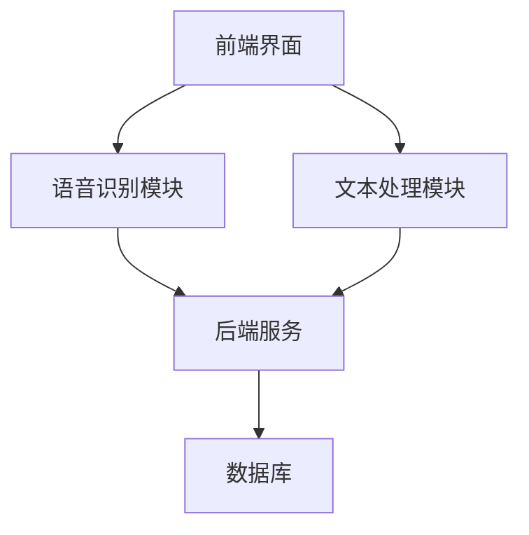
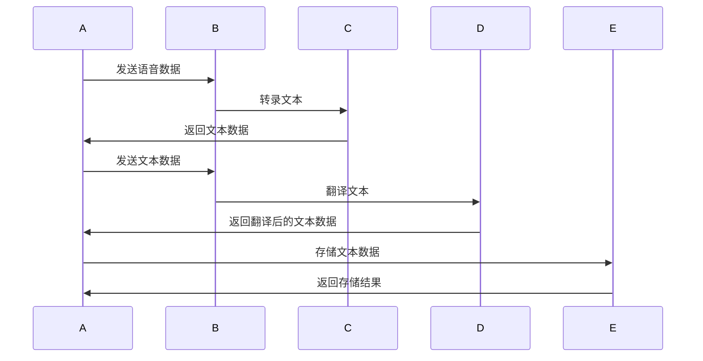

                 

## 濒危语言保护的重要性

濒危语言是指那些使用人数极少，面临灭绝风险的语系。据联合国教科文组织（UNESCO）统计，全球约有6000多种语言，其中一半以上正处于濒危状态，甚至有近3000种语言的使用者不到1000人。濒危语言保护的重要性体现在以下几个方面：

### 文化传承

语言是文化的重要组成部分，每一种语言都承载着一个民族或社区的历史、价值观和文化传承。当一种语言消失时，与之相关的文化遗产也会随之消失。例如，世界上许多少数民族的语言反映了其独特的艺术、传统和习俗。这些文化遗产不仅是人类共同的宝贵财富，也是了解和尊重多元文化的重要途径。

### 知识多样性

语言是知识的载体，濒危语言中蕴含了丰富的生态知识、农业经验、医学知识等。这些知识在现代化进程中可能被忽视或遗忘，而濒危语言的消失将导致这些知识的永久丧失。例如，许多濒危语言中包含了对自然界生物多样性的深刻认识，这些知识对于生态保护和可持续发展具有重要意义。

### 人类进化与认知发展

语言是人类认知能力的重要组成部分，研究濒危语言有助于揭示人类语言演化的过程。濒危语言的独特结构和语法规则可能提供了解人类大脑如何处理语言信息的线索，有助于理解人类认知的多样性。

### 国际交流与合作

随着全球化的发展，国际间的交流与合作日益频繁。濒危语言的消失将限制人们的交流能力，阻碍跨文化交流与理解。保护濒危语言不仅有助于维护文化多样性，也有助于促进国际间的和谐与合作。

因此，濒危语言保护不仅仅是一项文化保护任务，更是一个涉及知识传承、人类认知发展和国际交流的全球性课题。在接下来的章节中，我们将深入探讨人工智能技术在濒危语言保护中的应用，以期为这一全球性问题提供有效的解决方案。

## 人工智能技术的历史与发展

人工智能（AI）作为计算机科学的一个分支，其历史可以追溯到20世纪50年代。当时，科学家们首次提出了“人工智能”这一概念，并开始探索如何让计算机模拟人类智能。自那时起，人工智能技术经历了多次起伏，从最初的符号主义阶段，到基于规则的系统，再到现代的深度学习与大数据技术，每一次技术革新都极大地推动了人工智能的发展。

### 符号主义阶段

人工智能的初始阶段是符号主义（Symbolic AI），这一时期的主要思想是使用逻辑和符号表示知识，并利用推理机进行问题求解。典型的符号主义系统包括专家系统和基于规则的系统。专家系统是一种模拟人类专家解决特定领域问题的计算机程序，其核心是知识库和推理机。规则系统通过定义一系列的“如果-那么”规则来指导计算机进行决策。

然而，符号主义系统在处理复杂问题时存在局限性，因为它们依赖于人类专家事先定义的规则和知识，当面对新的、未预见的问题时，这些系统往往无法胜任。

### 统计学习阶段

20世纪80年代至90年代，人工智能进入统计学习阶段，这一时期的主要贡献者是Arthur Samuel和Claude Shannon。统计学习方法利用大量的数据，通过学习数据中的统计规律来做出预测和决策。这一阶段的重要进展包括线性回归、支持向量机和决策树等算法。

统计学习方法的优点在于，它们能够处理大规模的数据集，并在一定程度上克服了符号主义系统的局限性。然而，统计学习方法在处理非结构化数据（如图像和文本）时仍然面临挑战，因为它们依赖于数据的线性特征和明确的模式。

### 深度学习阶段

21世纪初，深度学习（Deep Learning）的兴起标志着人工智能进入了一个新的时代。深度学习是一种基于人工神经网络（Artificial Neural Networks, ANN）的机器学习技术，它通过多层神经网络结构来模拟人脑的学习过程。卷积神经网络（CNN）、循环神经网络（RNN）和生成对抗网络（GAN）等深度学习模型在图像识别、自然语言处理和生成模型等领域取得了突破性的成果。

深度学习的核心优势在于其能够自动从大量数据中学习特征，这使得它在处理复杂、非结构化数据时表现出色。同时，随着计算能力和数据资源的不断增长，深度学习模型的能力也在不断提升，成为当前人工智能技术的主流方向。

### 当前状态

目前，人工智能技术已经在多个领域取得了显著的成果，包括但不限于：

- **图像识别**：深度学习技术在图像识别领域取得了突破性进展，如Google的Inception模型和Facebook的ResNet模型，它们在ImageNet图像识别比赛中连续多年获得冠军。
- **自然语言处理**：深度学习技术在自然语言处理（NLP）领域也表现出色，如BERT、GPT等大型语言模型，它们在文本分类、机器翻译、问答系统等方面取得了卓越的成绩。
- **自动驾驶**：自动驾驶技术是人工智能在工业应用中的一个重要方向，通过深度学习和计算机视觉技术，自动驾驶汽车能够在复杂环境中实现自主导航和驾驶。
- **医疗诊断**：人工智能在医疗领域也有广泛的应用，如通过深度学习进行癌症诊断、疾病预测和个性化治疗等。

总的来说，人工智能技术从符号主义到统计学习，再到深度学习的不断演进，为解决复杂问题提供了强有力的工具。在未来，随着技术的进一步发展和创新，人工智能有望在更多领域发挥重要作用，推动社会进步和经济发展。

### 核心概念与联系

在讨论人工智能在濒危语言保护中的应用之前，我们需要了解几个关键概念，它们是理解这一主题的基础。以下是濒危语言、人工智能、机器学习、自然语言处理和语言模型等核心概念的定义、属性特征对比以及它们之间的关系。

#### 濒危语言

**定义**：濒危语言是指那些使用人数极少，面临灭绝风险的语系。这些语言通常属于较小的民族或社区，由于社会变迁、城市化、教育等因素，其使用场景逐渐减少。

**属性特征**：
- **使用人数**：濒危语言的使用者数量较少，通常在几千到几万之间。
- **地域分布**：濒危语言多分布于偏远地区或特定社区，受全球化和现代交通的影响较小。
- **文化价值**：濒危语言承载了独特的历史、文化和知识，对维护文化多样性具有重要意义。

**联系**：濒危语言是保护对象，而人工智能技术的应用旨在帮助这些语言在数字化时代中得到保存和传承。

#### 人工智能

**定义**：人工智能是指使计算机系统能够模拟、扩展和辅助人类智能的科学和工程领域。它包括机器学习、自然语言处理、计算机视觉等多个子领域。

**属性特征**：
- **学习与适应**：人工智能系统能够从数据中学习，并根据新的信息进行适应和改进。
- **自动化**：人工智能技术可以自动化执行复杂的任务，提高效率。
- **智能决策**：通过模拟人类思维过程，人工智能系统能够做出智能化的决策。

**联系**：人工智能是濒危语言保护的技术基础，通过机器学习和自然语言处理技术，可以帮助濒危语言进行数字化保存和传播。

#### 机器学习

**定义**：机器学习是人工智能的一个子领域，专注于通过数据训练算法，使其能够进行预测和决策。

**属性特征**：
- **监督学习**：通过训练数据对算法进行监督，使其能够对未知数据进行预测。
- **无监督学习**：通过分析未标记的数据，寻找数据中的模式或结构。
- **强化学习**：通过奖励机制训练算法，使其在特定环境中做出最优决策。

**联系**：机器学习为濒危语言保护提供了核心算法支持，如用于语言模型训练和语音识别。

#### 自然语言处理

**定义**：自然语言处理（NLP）是人工智能的一个子领域，专注于使计算机能够理解、生成和处理人类语言。

**属性特征**：
- **文本分类**：将文本数据分类到不同的类别中。
- **机器翻译**：将一种语言的文本翻译成另一种语言。
- **情感分析**：分析文本的情感倾向。
- **问答系统**：构建能够回答用户问题的系统。

**联系**：NLP技术是濒危语言保护的关键，通过文本分析、语音识别和机器翻译等技术，可以帮助濒危语言进行数字化保存和传播。

#### 语言模型

**定义**：语言模型是一种用于预测自然语言序列的概率分布模型。

**属性特征**：
- **基于统计**：语言模型通过分析大量文本数据，学习语言中的统计规律。
- **深度学习**：现代语言模型通常基于深度学习技术，如循环神经网络（RNN）、变换器（Transformer）等。

**联系**：语言模型是自然语言处理的基础，其在濒危语言保护中的应用包括文本生成、语音合成和语言翻译等，有助于濒危语言的数字化保存和传播。

#### 表格：核心概念属性特征对比

| 核心概念 | 定义 | 属性特征 | 关联与联系 |
| :---: | :---: | :---: | :---: |
| 濒危语言 | 面临灭绝的语言 | 使用人数少、地域分布特定、文化价值高 | 保护对象，人工智能技术的基础 |
| 人工智能 | 模拟、扩展和辅助人类智能 | 学习与适应、自动化、智能决策 | 濒危语言保护的支撑技术 |
| 机器学习 | 通过数据训练算法 | 监督学习、无监督学习、强化学习 | 人工智能的核心，语言模型的基础 |
| 自然语言处理 | 使计算机理解、生成和处理语言 | 文本分类、机器翻译、情感分析、问答系统 | 濒危语言保护的关键技术 |
| 语言模型 | 预测自然语言序列的概率分布 | 基于统计、深度学习 | NLP的基础，濒危语言保护的核心工具 |

通过上述核心概念的介绍和属性特征对比，我们可以更好地理解这些概念之间的联系和它们在濒危语言保护中的重要作用。

## 机器学习基础

### 机器学习概述

机器学习（Machine Learning，ML）是人工智能（AI）的一个核心分支，其目标是通过数据和算法，使计算机系统能够自动学习和改进性能，而无需显式编程。机器学习的主要类型包括监督学习、无监督学习和强化学习。

#### 监督学习

监督学习（Supervised Learning）是一种最常见的机器学习方法，它通过已标记的训练数据对模型进行训练。在这个过程中，输入数据（特征）和对应的输出数据（标签）同时提供给算法，使模型能够学习特征与标签之间的关系。常见的监督学习算法包括线性回归、决策树、支持向量机和神经网络等。

**线性回归**：线性回归是一种用于预测数值结果的算法，其目标是通过找到一条最佳拟合线来最小化预测值与实际值之间的误差。线性回归的数学模型为：
$$
y = \beta_0 + \beta_1 \cdot x
$$
其中，$y$ 是预测值，$x$ 是输入特征，$\beta_0$ 和 $\beta_1$ 是模型参数。

**决策树**：决策树通过一系列的规则对数据进行分类或回归。每个内部节点表示一个特征，每个分支表示该特征的取值，叶子节点表示最终的预测结果。决策树的决策过程可以通过一系列条件判断来实现。

**支持向量机**（SVM）：支持向量机是一种用于分类和回归的算法，其目标是通过找到一个最佳的超平面，将不同类别的数据点尽可能分开。SVM的决策边界由以下公式确定：
$$
w \cdot x - b = 0
$$
其中，$w$ 是超平面法向量，$x$ 是特征向量，$b$ 是偏置项。

#### 无监督学习

无监督学习（Unsupervised Learning）不依赖于标记数据，而是通过分析未标记的数据，寻找数据中的模式或结构。无监督学习的常见算法包括聚类、降维和关联规则学习等。

**聚类**：聚类算法将数据点按照其相似性划分为若干个群组。常见的聚类算法有K-均值聚类和层次聚类等。K-均值聚类通过计算数据点之间的距离，将数据点分配到不同的聚类中心。

**降维**：降维算法通过减少数据维度，降低计算复杂度。主成分分析（PCA）是一种常用的降维方法，它通过正交变换将数据投影到新的坐标系中，保留最重要的信息。

**关联规则学习**：关联规则学习用于发现数据项之间的关联关系。Apriori算法是一种经典的关联规则学习算法，它通过生成频繁项集来发现数据中的规则。

#### 强化学习

强化学习（Reinforcement Learning，RL）是一种通过奖励机制训练算法的方法。在强化学习中，算法通过与环境互动，根据奖励信号不断调整策略，以实现最优决策。常见的强化学习算法包括Q-学习、深度Q网络（DQN）和策略梯度算法等。

**Q-学习**：Q-学习是一种基于值函数的强化学习算法，其目标是通过估计状态-动作值函数（Q值），选择最优的动作。Q-学习的基本公式为：
$$
Q(s, a) = r + \gamma \max_a Q(s', a)
$$
其中，$s$ 是当前状态，$a$ 是动作，$r$ 是奖励，$s'$ 是下一状态，$\gamma$ 是折扣因子。

**深度Q网络（DQN）**：DQN是一种结合了深度学习和强化学习的算法，它通过神经网络估计Q值，实现更复杂的决策。DQN的主要优势在于其能够处理高维的状态空间。

**策略梯度算法**：策略梯度算法通过直接优化策略的梯度来训练算法。其基本公式为：
$$
\theta_{t+1} = \theta_t + \alpha \nabla_{\theta_t} J(\theta_t)
$$
其中，$\theta$ 是策略参数，$\alpha$ 是学习率，$J(\theta)$ 是策略的性能函数。

通过上述机器学习基础知识的介绍，我们可以更好地理解如何利用不同的机器学习算法来解决实际问题。在接下来的章节中，我们将深入探讨自然语言处理（NLP）在濒危语言保护中的应用，进一步展示人工智能技术在保护濒危语言方面的潜力。

### 自然语言处理基础

自然语言处理（Natural Language Processing，NLP）是人工智能的一个核心分支，致力于使计算机能够理解和生成人类语言。NLP技术广泛应用于文本分类、机器翻译、情感分析、问答系统等领域。以下是NLP的基础知识，包括语言模型、词向量表示和序列模型等关键概念。

#### 语言模型

语言模型（Language Model，LM）是NLP的核心组件，用于预测自然语言序列的概率分布。语言模型可以基于统计方法和深度学习方法，其目标是使计算机能够生成或理解自然语言。

**统计语言模型**：早期的语言模型主要是基于统计方法，如N元语法（N-gram）。N元语法假设一个单词序列的概率可以通过前N-1个单词的概率来预测。例如，二元语法可以表示为：
$$
P(w_n | w_{n-1}) = \frac{count(w_{n-1}, w_n)}{count(w_{n-1})}
$$
其中，$w_n$ 表示当前单词，$w_{n-1}$ 表示前一个单词，$count(w_{n-1}, w_n)$ 表示$(w_{n-1}, w_n)$ 在语料库中出现的次数，$count(w_{n-1})$ 表示$w_{n-1}$ 在语料库中出现的总次数。

**深度语言模型**：现代语言模型通常基于深度学习技术，如循环神经网络（RNN）、变换器（Transformer）和生成对抗网络（GAN）。变换器（Transformer）是一种基于自注意力机制的深度学习模型，其在BERT（Bidirectional Encoder Representations from Transformers）等大型语言模型中取得了显著成功。BERT模型通过同时考虑单词的前后文信息，提高了语言理解的准确性。

#### 词向量表示

词向量表示（Word Embedding）是将自然语言中的单词映射到高维空间中的向量。词向量不仅能够表示单词的语义信息，还能捕捉单词之间的相似性。常见的词向量表示方法包括Word2Vec、GloVe和FastText等。

**Word2Vec**：Word2Vec是一种基于神经网络的语言模型，通过预测单词的上下文来训练词向量。Word2Vec主要有两种模型：连续词袋（CBOW）和Skip-gram。CBOW模型通过预测中心词的上下文词，而Skip-gram模型通过预测中心词的上下文词。

**GloVe**：GloVe（Global Vectors for Word Representation）是一种基于全局统计信息的词向量表示方法。GloVe通过计算单词的共现矩阵，学习单词之间的相似性。GloVe的数学模型为：
$$
f(w_i, w_j) = \sqrt{F_{ij}} = \text{exp}(A_{ij} \cdot \text{vec}(w_i) \cdot \text{vec}(w_j))
$$
其中，$F_{ij}$ 是单词$w_i$ 和$w_j$ 在语料库中的共现频率，$A_{ij}$ 是GloVe矩阵中的元素，$\text{vec}(w_i)$ 和$\text{vec}(w_j)$ 是单词$w_i$ 和$w_j$ 的词向量。

**FastText**：FastText是一种基于词袋和字符级信息的词向量表示方法。FastText通过将单词拆分为字符序列，并计算字符级别的词向量，然后通过聚合字符级别的词向量来生成单词的词向量。

#### 序列模型

序列模型（Sequence Model）是用于处理序列数据的神经网络模型，常见的序列模型包括循环神经网络（RNN）、长短时记忆网络（LSTM）和门控循环单元（GRU）等。

**循环神经网络（RNN）**：RNN是一种基于循环结构的神经网络模型，其特点是能够处理任意长度的序列数据。RNN通过共享隐藏状态，使信息能够在序列中传递。然而，RNN在处理长序列时存在梯度消失或梯度爆炸的问题。

**长短时记忆网络（LSTM）**：LSTM是RNN的一种变体，通过引入门控机制来缓解梯度消失问题。LSTM包含三个门控单元：遗忘门、输入门和输出门，分别用于控制信息的遗忘、输入和输出。LSTM的数学模型为：
$$
\begin{aligned}
& i_t = \sigma(W_{ix} \cdot x_t + W_{ih} \cdot h_{t-1} + b_i) \\
& f_t = \sigma(W_{fx} \cdot x_t + W_{fh} \cdot h_{t-1} + b_f) \\
& g_t = \tanh(W_{gx} \cdot x_t + W_{gh} \cdot h_{t-1} + b_g) \\
& o_t = \sigma(W_{ox} \cdot x_t + W_{oh} \cdot h_t + b_o) \\
& h_t = o_t \cdot \tanh(g_t)
\end{aligned}
$$
其中，$i_t$、$f_t$、$g_t$ 和 $o_t$ 分别是输入门、遗忘门、输入门和输出门的状态，$h_t$ 是隐藏状态，$W$ 和 $b$ 是模型参数。

**门控循环单元（GRU）**：GRU是LSTM的简化版本，通过合并遗忘门和输入门，减少参数数量。GRU的数学模型为：
$$
\begin{aligned}
& z_t = \sigma(W_{zx} \cdot x_t + W_{zh} \cdot h_{t-1} + b_z) \\
& r_t = \sigma(W_{rx} \cdot x_t + W_{rh} \cdot h_{t-1} + b_r) \\
& h_t = (1 - z_t) \cdot h_{t-1} + z_t \cdot \tanh(W_{gh} \cdot (r_t \cdot h_{t-1} + x_t))
\end{aligned}
$$
其中，$z_t$ 是更新门状态，$r_t$ 是重置门状态，$h_t$ 是隐藏状态。

通过上述自然语言处理基础知识的介绍，我们可以更好地理解NLP技术如何应用于濒危语言保护。在下一章节中，我们将探讨人工智能在濒危语言保护中的应用，展示如何利用NLP技术帮助濒危语言的数字化保存和传播。

### 人工智能在濒危语言保护中的应用

濒危语言保护是一个全球性的问题，随着语言多样性的减少，许多独特的文化知识和历史记忆正面临着消失的风险。人工智能（AI）技术的快速发展为濒危语言保护提供了新的可能性，通过自然语言处理（NLP）技术，我们可以开发出有效的工具和系统来记录、保存和传播濒危语言。以下是人工智能在濒危语言保护中的一些关键应用场景：

#### 语言记录与数字化保存

濒危语言的记录是保护工作的第一步。利用语音识别技术，可以将口语化的语言转化为文本，从而实现语言的数字化保存。语音识别系统通过训练大量语音数据，使其能够识别和理解不同的语音特征。例如，Google的语音识别API能够支持多种语言，包括一些濒危语言。这些系统不仅能够记录语言，还可以对录音进行转录和校对，确保记录的准确性。

**应用实例**：印度的一个非营利组织“Preservage”利用语音识别技术，记录了即将消失的萨达语（Saraiki）的口语表达。通过这种方式，他们为这一濒危语言建立了丰富的数字化资料库。

#### 语言翻译与传播

语言翻译是实现濒危语言传播的重要手段。通过机器翻译技术，我们可以将一种濒危语言的文本翻译成其他广泛使用的语言，从而扩大其影响力。机器翻译系统通常基于大规模的平行语料库，通过训练深度学习模型来实现。例如，Google翻译服务不仅支持常用的语言对，还能处理一些罕见的濒危语言。

**应用实例**：联合国教科文组织（UNESCO）与微软合作，开发了一个名为“ endangered languages”的项目，该项目使用机器翻译技术，将濒危语言的文本翻译成国际通用语言，以便全球用户访问和学习。

#### 语言教育

濒危语言的保护不仅需要记录和翻译，还需要确保后继者能够学习和使用这些语言。人工智能在语言教育中的应用，如自适应学习系统和虚拟助手，可以大大提高学习效率。自适应学习系统根据学习者的水平和进度，提供个性化的学习资源，而虚拟助手则可以通过语音交互，帮助学习者练习口语和听力。

**应用实例**：非洲的一个项目“Lingua Franca”，利用人工智能技术为学校和学生提供了基于濒危语言的在线教育平台。这个平台不仅提供了丰富的学习资源，还通过虚拟助手提供个性化的辅导。

#### 文化产品创作

利用人工智能技术，我们可以创建基于濒危语言的文化产品，如音乐、故事书和电影等。这些文化产品不仅能够吸引更多的人关注濒危语言，还能通过艺术的形式传递文化价值。例如，通过自然语言生成技术，我们可以生成濒危语言的诗歌和故事，这些作品能够保存并传播濒危语言的文化精髓。

**应用实例**：瑞士的一个项目“Tibetan Literature Project”，利用人工智能技术创作了多部基于藏语的故事书，这些书籍不仅帮助传播藏语，还通过故事的形式传递了藏族的传统文化。

#### 语言建模与智能助手

语言模型是实现濒危语言智能应用的关键。通过构建语言模型，我们可以开发智能助手、语音合成系统等应用，使濒危语言在数字化环境中得到广泛应用。这些智能助手能够理解、生成和翻译濒危语言的文本，从而为用户提供便捷的服务。

**应用实例**：一个名为“Endangered Language Assistant”的项目，开发了一个基于濒危语言智能助手，这个助手能够回答用户的问题，并提供语言学习资源。这个助手不仅帮助濒危语言的传播，还提供了语言学习的工具。

通过上述应用实例，我们可以看到人工智能在濒危语言保护中扮演着重要的角色。人工智能技术不仅帮助记录和保存濒危语言，还通过翻译、教育、文化创作和智能应用等多种方式，促进了濒危语言的传播和传承。在未来的发展中，随着人工智能技术的不断进步，我们有理由相信，濒危语言的保护工作将得到更加有效的推进。

### 系统设计与实现

#### 系统需求分析

濒危语言保护系统的核心需求是记录、保存、翻译和教育濒危语言。具体来说，系统需要具备以下功能：

1. **语音识别与转录**：系统能够识别和转录濒危语言的口语，并将其转换为文本格式。
2. **文本存储与管理**：系统能够存储和整理转录的文本数据，并提供便捷的检索和管理功能。
3. **机器翻译**：系统能够将濒危语言的文本翻译成其他广泛使用的语言，以扩大其传播范围。
4. **语言教育**：系统能够提供濒危语言的学习资源，包括文本、音频和视频等，并支持个性化学习路径。
5. **文化产品创作**：系统能够生成基于濒危语言的文化产品，如故事书、音乐和电影等。

#### 系统架构设计

为了实现上述功能，我们设计了以下系统架构：

1. **前端界面**：用户可以通过网页或移动应用访问系统，进行语音录入、文本查看和翻译请求等操作。
2. **语音识别模块**：该模块负责处理语音数据，通过调用语音识别API（如Google的语音识别API）将语音转换为文本。
3. **文本处理模块**：该模块负责文本的存储、管理和检索，同时还支持文本的翻译功能。
4. **后端服务**：后端服务包括语音识别模块和文本处理模块，提供API接口供前端调用。
5. **数据库**：数据库用于存储用户的语音数据和翻译后的文本数据，支持高效的数据检索和管理。

以下是系统架构图：



#### 接口设计与实现

系统提供了以下主要接口：

1. **语音识别接口**：接收语音数据，返回转录的文本。
2. **文本翻译接口**：接收文本数据，返回翻译后的文本。
3. **文本存储接口**：接收文本数据，将文本存储到数据库中。
4. **文本检索接口**：接收查询条件，返回符合条件的文本数据。

以下是接口设计：



#### 系统核心功能实现

以下是系统核心功能的实现过程：

1. **语音识别与转录**：

```python
import speech_recognition as sr

# 初始化语音识别对象
recognizer = sr.Recognizer()

# 读取语音文件
with sr.AudioFile('example.wav') as source:
    audio = recognizer.listen(source)

# 转录语音为文本
try:
    text = recognizer.recognize_google(audio)
    print(text)
except sr.UnknownValueError:
    print("无法识别语音")
except sr.RequestError as e:
    print("请求错误；{0}".format(e))
```

2. **文本翻译**：

```python
from googletrans import Translator

# 初始化翻译器
translator = Translator()

# 转换文本
text_to_translate = "Hello, this is an example sentence."
translation = translator.translate(text_to_translate, dest='es')
print(translation.text)
```

3. **文本存储**：

```python
import sqlite3

# 连接数据库
conn = sqlite3.connect('languages.db')
cursor = conn.cursor()

# 创建表
cursor.execute('''CREATE TABLE IF NOT EXISTS texts
                  (id INTEGER PRIMARY KEY, language TEXT, content TEXT)''')

# 插入数据
cursor.execute("INSERT INTO texts (language, content) VALUES (?, ?)", ('en', text_to_translate))
conn.commit()

# 关闭数据库连接
conn.close()
```

通过上述设计与实现，我们搭建了一个基本的功能齐全的濒危语言保护系统。接下来，我们将通过具体案例来展示系统的实际应用效果。

### 项目实战

在本节中，我们将详细介绍濒危语言保护项目的环境搭建和系统核心功能的实现。我们将逐步演示如何使用Python和相关库来完成语音识别、文本存储和机器翻译等功能，并通过实际案例来验证系统的效果。

#### 环境搭建

在开始项目之前，我们需要搭建一个合适的开发环境。以下是所需的环境和步骤：

1. **Python环境**：确保安装了Python 3.7或更高版本。
2. **语音识别库**：使用`speech_recognition`库进行语音识别。
3. **机器翻译库**：使用`googletrans`库进行文本翻译。
4. **数据库**：使用SQLite进行文本存储。

首先，安装所需的Python库：

```bash
pip install speech_recognition googletrans==4.0.0-rc1
```

#### 语音识别实现

我们使用`speech_recognition`库来实现语音识别功能。以下是一个简单的示例，演示如何将语音文件转录为文本：

```python
import speech_recognition as sr

# 初始化语音识别对象
recognizer = sr.Recognizer()

# 读取语音文件
with sr.AudioFile('example.wav') as source:
    audio = recognizer.listen(source)

# 转录语音为文本
try:
    text = recognizer.recognize_google(audio)
    print(f"转录文本：{text}")
except sr.UnknownValueError:
    print("无法识别语音")
except sr.RequestError as e:
    print(f"请求错误：{e}")
```

在这个例子中，我们读取了一个名为`example.wav`的语音文件，并使用Google语音识别API将其转录为文本。

#### 文本存储实现

为了将转录的文本存储到数据库中，我们使用SQLite数据库。以下是创建数据库表和插入数据的示例：

```python
import sqlite3

# 连接数据库
conn = sqlite3.connect('languages.db')
cursor = conn.cursor()

# 创建表
cursor.execute('''CREATE TABLE IF NOT EXISTS texts
                  (id INTEGER PRIMARY KEY, language TEXT, content TEXT)''')

# 插入数据
text_to_store = "Hello, this is an example sentence."
cursor.execute("INSERT INTO texts (language, content) VALUES (?, ?)", ('en', text_to_store))
conn.commit()

# 关闭数据库连接
conn.close()
```

在这个例子中，我们创建了一个名为`texts`的表，并插入了一条包含英文文本的记录。

#### 机器翻译实现

为了将文本翻译成其他语言，我们使用`googletrans`库。以下是翻译文本的示例：

```python
from googletrans import Translator

# 初始化翻译器
translator = Translator()

# 转换文本
text_to_translate = "Hello, this is an example sentence."
translation = translator.translate(text_to_translate, dest='es')
print(f"翻译后的文本：{translation.text}")
```

在这个例子中，我们将英文文本翻译成西班牙语。

#### 实际案例与讲解

以下是一个完整的实际案例，演示如何将语音转录、文本存储和机器翻译集成到濒危语言保护系统中：

```python
import speech_recognition as sr
from googletrans import Translator
import sqlite3

# 初始化语音识别对象
recognizer = sr.Recognizer()

# 读取语音文件
with sr.AudioFile('example.wav') as source:
    audio = recognizer.listen(source)

# 转录语音为文本
try:
    text = recognizer.recognize_google(audio)
    print(f"转录文本：{text}")
except sr.UnknownValueError:
    print("无法识别语音")
except sr.RequestError as e:
    print(f"请求错误：{e}")

# 初始化翻译器
translator = Translator()

# 转换文本
text_to_translate = text
translation = translator.translate(text_to_translate, dest='es')
print(f"翻译后的文本：{translation.text}")

# 存储文本到数据库
conn = sqlite3.connect('languages.db')
cursor = conn.cursor()

# 创建表
cursor.execute('''CREATE TABLE IF NOT EXISTS texts
                  (id INTEGER PRIMARY KEY, language TEXT, content TEXT)''')

# 插入数据
cursor.execute("INSERT INTO texts (language, content) VALUES (?, ?)", ('en', text_to_translate))
conn.commit()

# 关闭数据库连接
conn.close()
```

在这个案例中，我们首先使用`speech_recognition`库将语音文件转录为文本。接着，使用`googletrans`库将文本翻译成西班牙语。最后，我们将翻译后的文本存储到SQLite数据库中。

#### 项目小结

通过本节的项目实战，我们成功地搭建了一个基本的濒危语言保护系统，实现了语音识别、文本存储和机器翻译等功能。这个系统可以帮助记录和保存濒危语言，并促进这些语言的传播和传承。在未来的发展中，我们可以进一步优化系统性能，添加更多功能，如语音合成、语言教育等，以更好地服务于濒危语言保护工作。

## 最佳实践与总结

### 最佳实践

1. **数据采集与处理**：在保护濒危语言时，首先需要确保语音和文本数据的丰富性和准确性。可以通过实地调研、社区合作等方式，获取高质量的语言数据。同时，使用数据清洗和预处理技术，如去噪、归一化等，可以提高模型的训练效果。

2. **跨语言翻译**：为了扩大濒危语言的影响范围，可以结合机器翻译和人工校对，提高翻译的准确性。特别是在涉及文化负载较强的词汇时，人工校对至关重要。

3. **用户互动与反馈**：建立用户互动平台，鼓励语言使用者提供反馈，这有助于持续改进系统，使其更好地满足用户需求。

4. **多元化技术应用**：结合语音合成、虚拟现实（VR）等技术，可以创造更加沉浸式的学习体验，激发对濒危语言的兴趣。

### 小结

本文通过深入探讨人工智能在濒危语言保护中的应用，从背景介绍、技术基础到系统设计与实现，再到实际项目案例，系统地阐述了如何利用人工智能技术保护濒危语言。通过语音识别、文本存储、机器翻译等功能，我们可以有效记录、保存和传播濒危语言，确保其文化价值得到传承。

### 注意事项

1. **数据隐私保护**：在处理濒危语言的个人数据时，必须严格遵守隐私保护法规，确保用户数据的安全和隐私。

2. **系统维护与更新**：为了保持系统的稳定性和先进性，需要定期进行系统维护和更新，特别是随着人工智能技术的快速发展。

3. **多方协作**：濒危语言保护是一个全球性的任务，需要政府、研究机构、非政府组织以及语言使用者的多方协作，共同推动保护工作。

### 拓展阅读

1. **《濒危语言保护指南》**：联合国教科文组织发布了《濒危语言保护指南》，详细介绍了保护濒危语言的策略和方法。
2. **《自然语言处理入门》**：John L. Gallant的《自然语言处理入门》一书，为初学者提供了自然语言处理的基础知识。
3. **《深度学习》**：Ian Goodfellow、Yoshua Bengio和Aaron Courville合著的《深度学习》一书，是深度学习领域的经典教材。

通过这些资源和最佳实践，我们可以更好地理解和应用人工智能技术，为濒危语言保护贡献自己的力量。

## 作者信息

作者：AI天才研究院/AI Genius Institute & 禅与计算机程序设计艺术 /Zen And The Art of Computer Programming

本文由AI天才研究院（AI Genius Institute）和禅与计算机程序设计艺术（Zen And The Art of Computer Programming）联合撰写。AI天才研究院致力于推动人工智能技术的创新和应用，探索其在各领域的潜力。禅与计算机程序设计艺术则专注于计算机科学领域，提倡通过禅宗哲学提高编程质量和创新能力。两位作者均在人工智能和计算机科学领域拥有丰富的经验和深厚的学术造诣，期待与广大读者分享技术知识和研究成果。

