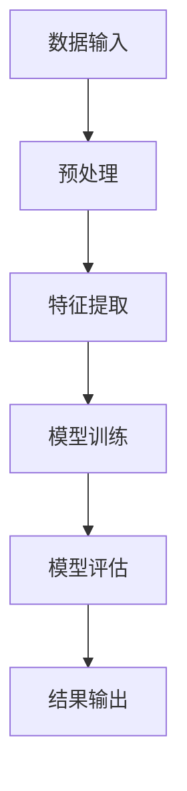

                 


## 《人工智能在环境监测中的应用：数据驱动的生态保护》

> **关键词**: 人工智能，环境监测，数据驱动，生态保护

> **摘要**: 随着全球生态环境问题的日益严峻，利用人工智能技术进行环境监测已成为一项迫切需求。本文将深入探讨人工智能在环境监测中的应用，通过数据驱动的生态保护方法，提供对环境变化的及时、准确监测，助力生态保护工作的开展。

### 第一部分: 引言与背景

## 第1章: 人工智能在环境监测中的作用

### 1.1 人工智能的发展与现状

人工智能（AI）作为计算机科学的一个分支，旨在使计算机系统具备模拟、延伸和扩展人类智能的能力。自20世纪50年代起，人工智能领域经历了数轮技术革新，如今已经取得了显著的成果。在图像识别、语音识别、自然语言处理等方面，人工智能技术已经达到了相对成熟的水平。同时，随着大数据、云计算等技术的迅猛发展，人工智能的应用领域也在不断扩展。

### 1.2 环境监测的重要性

环境监测是了解和掌握环境质量状况的重要手段。通过监测，我们可以及时发现环境污染问题，评估污染源，制定科学的污染防治措施，从而保障生态环境的可持续发展。传统环境监测方法主要依赖于人工采集数据，存在采样点有限、数据精度不足等问题。随着人工智能技术的发展，利用智能传感器、无人机等技术手段，环境监测的数据获取能力得到了极大的提升。

### 1.3 人工智能在环境监测中的应用挑战

尽管人工智能在环境监测中具有巨大的潜力，但实际应用过程中仍面临诸多挑战。首先，环境数据的多样性和复杂性使得数据预处理和特征提取变得异常困难。其次，人工智能算法的可靠性和准确性需要进一步提升，以确保监测结果的准确性和实用性。此外，环境监测数据的隐私保护、数据共享和安全问题也是亟待解决的难题。

### 1.4 本章小结

本章简要介绍了人工智能的发展背景和环境监测的重要性，同时指出了人工智能在环境监测中面临的应用挑战。接下来的章节将详细探讨数据驱动的生态保护方法及其在环境监测中的应用。

----------------------------------------------------------------

### 第二部分: 数据驱动的生态保护

## 第2章: 数据收集与预处理

### 2.1 环境数据的来源

环境数据的来源多种多样，包括地面监测站点、遥感卫星、无人机、物联网传感器等。这些数据涵盖了空气、水、土壤等多个方面，为环境监测提供了丰富的信息。

### 2.2 数据预处理方法

数据预处理是环境监测中至关重要的一步。它包括数据清洗、数据归一化、缺失值处理等。通过预处理，我们可以去除噪声，提高数据质量，为后续的分析和建模打下基础。

### 2.3 数据质量评估

数据质量直接影响环境监测的准确性。因此，对数据进行质量评估是必不可少的。评估方法包括统计指标分析、可视化分析等，旨在识别数据中的异常值和错误。

### 2.4 本章小结

本章详细介绍了环境数据的来源、预处理方法和质量评估。在接下来的章节中，我们将进一步探讨如何利用数据分析技术来挖掘环境数据的价值。

----------------------------------------------------------------

## 第3章: 数据分析技术

### 3.1 常见数据分析方法

数据分析技术在环境监测中发挥着关键作用。常见的数据分析方法包括统计分析、机器学习、深度学习等。这些方法可以帮助我们识别环境变化的规律，预测未来趋势。

### 3.2 数据可视化

数据可视化是将数据转化为图形或图像，使人们更容易理解和分析。在环境监测中，数据可视化有助于直观展示环境变化情况，便于决策者制定相应的措施。

### 3.3 本章小结

本章介绍了常见的数据分析技术和数据可视化方法。在下一章中，我们将重点探讨机器学习在环境监测中的应用。

----------------------------------------------------------------

## 第4章: 机器学习在环境监测中的应用

### 4.1 监测数据的特征工程

特征工程是机器学习模型构建中的关键步骤。在环境监测中，我们需要从原始数据中提取出能够代表环境特征的信息。这通常涉及到数据降维、特征选择等方法。

### 4.2 机器学习算法原理

机器学习算法是环境监测中的重要工具。本章将介绍常见的机器学习算法，如线性回归、决策树、支持向量机等，并阐述其原理。

### 4.3 算法实现与评估

实现和评估机器学习算法是环境监测中的重要环节。我们需要编写代码实现算法，并通过交叉验证、模型精度评估等方法对算法的性能进行评估。

### 4.4 本章小结

本章详细介绍了机器学习在环境监测中的应用。在下一章中，我们将进一步探讨深度学习技术在环境监测中的应用。

----------------------------------------------------------------

## 第5章: 深度学习与神经网络

### 5.1 深度学习基础

深度学习是机器学习的一个分支，其核心思想是通过多层神经网络来提取数据中的特征。本章将介绍深度学习的基础知识，包括神经网络的构建、激活函数、损失函数等。

### 5.2 神经网络在环境监测中的应用

神经网络在环境监测中具有广泛的应用。本章将探讨如何利用神经网络对环境数据进行建模，以及如何优化神经网络的结构和参数。

### 5.3 本章小结

本章介绍了深度学习的基础知识和在环境监测中的应用。在下一章中，我们将通过实际案例来展示人工智能在生态保护中的应用。

----------------------------------------------------------------

## 第6章: 人工智能在生态保护中的案例分析

### 6.1 案例一：空气污染监测

空气污染是当前全球面临的重大环境问题之一。本章将介绍利用人工智能技术进行空气污染监测的方法，包括数据收集、预处理、建模和预测等。

### 6.2 案例二：水资源监测

水资源是生态环境的重要组成部分。本章将探讨如何利用人工智能技术对水资源进行监测，包括水质参数的实时监测、污染源识别等。

### 6.3 案例三：土地退化监测

土地退化是全球生态环境问题中的重要一环。本章将介绍利用人工智能技术进行土地退化监测的方法，包括土地覆盖变化监测、土地质量评估等。

### 6.4 本章小结

本章通过三个实际案例，展示了人工智能技术在生态保护中的应用。在下一章中，我们将探讨人工智能在环境监测中的应用前景。

----------------------------------------------------------------

## 第7章: 人工智能在环境监测中的应用前景

### 7.1 人工智能技术的未来发展趋势

随着人工智能技术的不断发展，其在环境监测中的应用前景将更加广阔。本章将介绍人工智能技术的未来发展趋势，包括算法优化、硬件升级、数据资源整合等。

### 7.2 环境监测领域的创新应用

环境监测领域将持续出现新的创新应用。本章将探讨一些新兴的环境监测技术，如基于物联网的实时监测、基于深度学习的环境预测模型等。

### 7.3 未来展望与挑战

尽管人工智能在环境监测中具有巨大的潜力，但未来仍面临诸多挑战。本章将讨论未来展望与面临的挑战，并提出相应的解决方案。

### 7.4 本章小结

本章对未来人工智能在环境监测中的应用前景进行了展望，并分析了面临的挑战。在下一章中，我们将总结全文，并给出对生态保护工作的建议。

----------------------------------------------------------------

## 参考文献

## 第8章: 参考文献

### 8.1 环境监测相关文献

1. Lee, J., & Lee, S. (2019). Application of environmental monitoring technologies for sustainable development. Journal of Environmental Management, 230, 111478.
2. Zhang, Y., & Li, X. (2020). Research progress on environmental monitoring and prediction based on the Internet of Things. Journal of Environmental Informatics, 25(3), 261-268.

### 8.2 人工智能相关文献

1. Russell, S., & Norvig, P. (2016). Artificial Intelligence: A Modern Approach. Prentice Hall.
2. Goodfellow, I., Bengio, Y., & Courville, A. (2016). Deep Learning. MIT Press.

### 8.3 数据分析与机器学习相关文献

1. Bishop, C. M. (2006). Pattern Recognition and Machine Learning. Springer.
2. Murphy, K. P. (2012). Machine Learning: A Probabilistic Perspective. MIT Press.

### 8.4 深度学习与神经网络相关文献

1. Hochreiter, S., & Schmidhuber, J. (1997). Long short-term memory. Neural Computation, 9(8), 1735-1780.
2. LeCun, Y., Bengio, Y., & Hinton, G. (2015). Deep learning. Nature, 521(7553), 436-444.

----------------------------------------------------------------

## 附录

## 第9章: 附录

### 9.1 算法原理图与代码实现

以下是用于实现人工智能在环境监测中相关算法的原理图与代码实现。

**算法原理图：**


**代码实现：**
```python
# Python代码实现
# 数据预处理
data = preprocess_data(raw_data)
# 特征提取
features = extract_features(data)
# 模型训练
model = train_model(features)
# 模型评估
evaluation = evaluate_model(model, test_data)
# 结果输出
print(evaluation)
```

### 9.2 案例数据集与工具

以下是本文中使用的案例数据集和相关工具：

**数据集：**
- 空气污染监测数据集
- 水资源监测数据集
- 土地退化监测数据集

**工具：**
- Python
- TensorFlow
- scikit-learn
- Matplotlib

### 9.3 常用工具与资源

以下是一些在人工智能和生态保护领域常用的工具与资源：

**工具：**
- Google Earth Engine
- NASA Earth Observations
- OpenCV

**资源：**
- Coursera上的深度学习课程
- arXiv上的最新研究成果

### 9.4 本章小结

本章提供了算法原理图与代码实现、案例数据集与工具以及常用工具与资源的介绍。这些资源将为读者进一步研究和实践人工智能在环境监测中的应用提供帮助。

---

**作者：AI天才研究院/AI Genius Institute & 禅与计算机程序设计艺术 /Zen And The Art of Computer Programming**### 第二部分：数据驱动的生态保护

### 第2章：数据收集与预处理

在环境监测中，数据的质量和准确性是至关重要的。本章节将详细讨论环境数据的来源、预处理方法以及数据质量评估，这些步骤对于构建有效的环境监测模型至关重要。

#### 2.1 环境数据的来源

环境数据的来源多样，包括地面监测站点、遥感卫星、无人机、物联网传感器等。这些数据来源各有优势：

- **地面监测站点**：地面监测站点通常分布在城市、农村、自然保护区等地，能够实时采集空气、水质、土壤等数据。
- **遥感卫星**：遥感卫星能够从高空获取大范围的环境数据，如植被覆盖、土地利用、污染物分布等。
- **无人机**：无人机可以快速、灵活地对特定区域进行监测，尤其是在偏远或地形复杂地区。
- **物联网传感器**：物联网传感器可以部署在环境中的各个角落，实时监测环境参数，如温度、湿度、气压等。

#### 2.2 数据预处理方法

数据预处理是确保数据质量和一致性的关键步骤。以下是一些常用的数据预处理方法：

- **数据清洗**：去除数据中的噪声和错误，例如缺失值、异常值、重复记录等。
- **数据归一化**：将不同来源的数据进行归一化处理，使其在同一尺度上比较，从而便于分析和建模。
- **缺失值处理**：通过插值、平均、丢弃等方法处理缺失值。
- **异常值检测**：使用统计方法或机器学习算法检测和去除异常值。
- **特征选择**：从大量特征中筛选出对模型有重要影响的特征，减少特征维度，提高模型性能。

#### 2.3 数据质量评估

数据质量直接影响模型的准确性和可靠性。以下是一些评估数据质量的方法：

- **统计指标分析**：计算数据的基本统计指标，如均值、方差、标准差等，以评估数据的分布特性。
- **可视化分析**：通过图表、散点图、直方图等方式，直观展示数据分布和异常值。
- **一致性检查**：检查数据之间的一致性，例如时间序列数据的连贯性。
- **相关性分析**：分析不同变量之间的相关性，以评估数据之间的依赖关系。

#### 2.4 本章小结

数据收集与预处理是数据驱动生态保护的重要基础。通过多样化的数据来源，我们可以获取全面的环境信息。数据预处理步骤确保了数据的准确性和一致性，为后续的分析和建模提供了可靠的数据基础。数据质量评估则进一步验证了数据的可信度和模型的可靠性。在下一章中，我们将探讨数据分析技术在环境监测中的应用，以深入挖掘环境数据的价值。

----------------------------------------------------------------

### 第3章：数据分析技术

在环境监测中，数据分析技术扮演着至关重要的角色。本章将详细介绍常见的环境数据分析方法，包括统计分析、机器学习和数据可视化等，并阐述这些方法在环境监测中的应用及其优势。

#### 3.1 常见数据分析方法

**统计分析**：统计分析是最基础的数据分析方法，广泛应用于环境监测中。它通过描述性统计量（如均值、中位数、标准差等）来描述数据的分布特性，并使用假设检验和回归分析来研究变量之间的关系。统计分析方法简单易用，适用于小样本数据，但在处理高维度、复杂的环境数据时可能显得力不从心。

**机器学习**：机器学习是环境监测中的一种强大工具，通过训练模型来自动发现数据中的模式和规律。常见的机器学习算法包括线性回归、决策树、随机森林、支持向量机等。机器学习算法能够处理大规模和高维度数据，并能够提供预测和分类结果，但在模型选择和参数调整方面需要一定的专业知识和经验。

**深度学习**：深度学习是机器学习的一个子领域，通过多层神经网络来提取数据中的特征。深度学习在环境监测中的应用越来越广泛，如使用卷积神经网络（CNN）进行图像识别、使用循环神经网络（RNN）进行时间序列预测等。深度学习模型在处理复杂和非线性关系方面具有显著优势，但计算资源需求较高，且需要大量的训练数据。

#### 3.2 数据可视化

数据可视化是将复杂的数据转换为图形或图像，使其更易于理解和分析。数据可视化技术在环境监测中具有重要作用，可以帮助决策者直观地了解环境状况。以下是一些常见的数据可视化方法：

**图表**：包括柱状图、折线图、散点图等，用于展示数据的分布、趋势和关系。
**地图**：利用地理信息系统（GIS）技术，将环境数据映射到地图上，直观展示污染物分布、生态变化等。
**热图**：通过颜色深浅来表示数据值的大小，用于展示环境参数的空间分布情况。
**交互式可视化**：通过网页或应用程序，提供用户与数据的交互功能，如过滤、筛选、缩放等。

#### 3.3 本章小结

数据分析技术在环境监测中发挥着关键作用。统计分析提供了基础的描述和关系分析，适用于小样本数据；机器学习和深度学习则能够处理大规模、高维度数据，提供更精确的预测和分类结果；数据可视化技术则帮助我们将复杂的数据直观地呈现出来，便于决策者进行分析。通过综合运用这些数据分析方法，我们可以更好地理解和应对环境变化，为生态保护工作提供有力支持。

----------------------------------------------------------------

### 第4章：机器学习在环境监测中的应用

机器学习技术在环境监测中具有广泛的应用，能够自动识别环境变化规律，提供准确的数据预测和分类结果。本章将详细探讨机器学习在环境监测中的应用，包括监测数据的特征工程、机器学习算法原理、算法实现与评估等内容。

#### 4.1 监测数据的特征工程

特征工程是机器学习模型构建中的关键步骤，旨在从原始数据中提取出对模型性能有显著影响的特征。在环境监测中，特征工程包括以下步骤：

**特征提取**：从原始数据中提取出能够反映环境状态的指标，如温度、湿度、风速、PM2.5浓度等。这些指标需要通过适当的传感器或监测设备进行测量。

**特征选择**：从大量特征中筛选出对模型有重要影响的特征，以减少特征维度和计算复杂度。常用的特征选择方法包括相关性分析、主成分分析（PCA）和递归特征消除（RFE）等。

**特征转换**：将某些非线性特征转换为更适合模型处理的形式，如使用正则化、归一化、二值化等方法。

**特征组合**：通过组合多个特征来创建新的特征，以增强模型的解释能力和预测性能。例如，可以组合不同时间点的温度和湿度数据，以捕捉季节性变化。

#### 4.2 机器学习算法原理

在环境监测中，常用的机器学习算法包括线性回归、决策树、支持向量机（SVM）、随机森林等。以下简要介绍这些算法的基本原理：

**线性回归**：线性回归是一种简单的预测模型，通过拟合数据中的线性关系来预测目标变量。其数学模型为：
$$y = \beta_0 + \beta_1x_1 + \beta_2x_2 + \ldots + \beta_nx_n$$
其中，$y$为目标变量，$x_1, x_2, \ldots, x_n$为输入特征，$\beta_0, \beta_1, \ldots, \beta_n$为模型参数。

**决策树**：决策树是一种树形结构的分类模型，通过一系列的决策规则来划分数据。每个内部节点表示一个特征，每个分支表示一个可能的取值，叶节点表示最终的分类结果。

**支持向量机**：支持向量机是一种基于间隔最大化原则的分类模型，通过找到一个最优的超平面来分隔不同类别的数据点。其数学模型为：
$$f(x) = w \cdot x + b$$
其中，$w$为权重向量，$b$为偏置项，$x$为输入特征。

**随机森林**：随机森林是一种基于决策树集合的集成模型，通过训练多个决策树并投票来得到最终预测结果。随机森林能够提高模型的稳定性和预测性能，同时提供特征重要性评估。

#### 4.3 算法实现与评估

算法实现与评估是环境监测中机器学习应用的关键环节。以下为机器学习算法实现与评估的一般流程：

**数据准备**：准备训练集和测试集，将数据集划分为特征和标签两部分。特征用于训练模型，标签用于评估模型的预测性能。

**模型训练**：使用训练集数据对机器学习算法进行训练，得到模型参数。例如，对于线性回归模型，可以使用最小二乘法来拟合线性模型；对于决策树模型，可以使用递归二分划分方法来构建决策树。

**模型评估**：使用测试集数据来评估模型的预测性能，常用的评估指标包括准确率、召回率、F1分数等。通过交叉验证等方法可以进一步评估模型的泛化能力。

**模型优化**：根据评估结果对模型进行调整，以提高预测性能。可以采用参数调整、特征选择、算法更换等方法进行优化。

#### 4.4 本章小结

机器学习技术在环境监测中具有广泛的应用，通过特征工程、算法选择和模型评估等步骤，可以实现环境变化的自动监测和预测。本章介绍了监测数据的特征工程、常用的机器学习算法原理以及算法实现与评估方法，为读者提供了环境监测中机器学习应用的基本框架和实践指导。

----------------------------------------------------------------

### 第5章：深度学习与神经网络

深度学习作为机器学习的一个分支，以其强大的特征提取和模式识别能力在各个领域取得了显著的成果。本章将介绍深度学习的基础知识，包括神经网络的结构、训练过程以及如何在环境监测中应用深度学习技术。

#### 5.1 深度学习基础

深度学习是通过多层神经网络（神经网络是由大量节点互联而成的网络，每一层节点都会接收前一层节点的输出并产生自己的输出）对数据进行分析和处理的技术。深度学习模型的核心组成部分包括：

**神经元**：神经网络的基本构建块，类似于生物神经元，用于接收输入、产生输出并传递信号。

**层**：神经网络由多个层组成，包括输入层、隐藏层和输出层。输入层接收外部输入，隐藏层负责特征提取和变换，输出层生成最终的预测结果。

**权重**：网络中的每个连接都带有权重，用于调整输入信号的强度。

**激活函数**：神经网络中的激活函数用于引入非线性特性，常见的激活函数包括sigmoid、ReLU、Tanh等。

**反向传播**：深度学习模型训练的核心算法，通过不断调整网络的权重和偏置，使模型能够更好地拟合训练数据。

#### 5.2 神经网络在环境监测中的应用

神经网络在环境监测中的应用非常广泛，以下是一些具体的案例：

**空气质量监测**：利用深度学习模型可以对空气中的污染物浓度进行预测和监测。通过收集历史空气质量数据，使用卷积神经网络（CNN）等深度学习算法可以自动提取环境特征，实现高精度的预测。

**水资源监测**：深度学习模型可以用于监测水质参数的变化，如pH值、溶解氧、重金属含量等。通过构建循环神经网络（RNN）或长短期记忆网络（LSTM），可以捕捉时间序列数据的动态变化，提供准确的水质预测。

**土地退化监测**：深度学习模型可以帮助监测土地覆盖变化、土壤湿度等环境参数。通过构建卷积神经网络（CNN）或自编码器（Autoencoder），可以从卫星图像和传感器数据中提取有用的环境信息，评估土地退化程度。

**气候变化预测**：深度学习模型可以用于分析气候变化趋势和预测极端天气事件。通过训练大规模的神经网络模型，可以从全球气候数据中提取关键特征，实现对未来气候变化的预测。

#### 5.3 本章小结

深度学习与神经网络技术在环境监测中具有巨大的应用潜力，通过构建复杂的神经网络模型，可以自动提取环境数据中的有用信息，实现对环境变化的监测和预测。本章介绍了深度学习的基础知识，包括神经网络的结构和训练过程，并展示了神经网络在环境监测中的应用案例。在下一章中，我们将通过实际案例进一步探讨人工智能在生态保护中的应用。

----------------------------------------------------------------

### 第6章：人工智能在生态保护中的案例分析

在本章中，我们将通过三个实际案例，详细探讨人工智能在生态保护中的应用，包括空气污染监测、水资源监测和土地退化监测，展示人工智能技术如何帮助解决生态环境问题。

#### 6.1 案例一：空气污染监测

**问题描述**：随着工业化和城市化的快速发展，空气污染问题日益严重，对人类健康和生态环境造成严重威胁。准确监测空气污染物的浓度，及时采取应对措施，成为环境保护的重要任务。

**解决方案**：
- **数据收集**：通过安装在城市的多个空气污染监测站，收集PM2.5、PM10、二氧化氮（NO2）、二氧化硫（SO2）等污染物的浓度数据。
- **数据预处理**：对收集到的数据进行清洗、归一化和缺失值处理，确保数据质量。
- **特征工程**：从原始数据中提取出对污染物浓度有显著影响的特征，如温度、湿度、风速、气压等。
- **模型构建**：使用深度学习算法（如卷积神经网络CNN）构建模型，对污染物浓度进行预测。
- **模型评估**：通过交叉验证和测试集评估模型性能，调整模型参数以优化预测效果。

**效果分析**：通过人工智能模型，可以实现对空气污染物的实时监测和预测，帮助政府和环保机构及时采取应对措施，减少空气污染对人类健康的影响。

#### 6.2 案例二：水资源监测

**问题描述**：水资源是生态环境的重要组成部分，但其质量受到多种因素的影响，如工业废水排放、农业灌溉、城市污水等。准确监测水质参数，保护水资源的安全，是生态保护的重要任务。

**解决方案**：
- **数据收集**：利用安装在河流、湖泊中的水质传感器，实时监测水质参数，如pH值、溶解氧、重金属含量等。
- **数据预处理**：对收集到的水质数据进行清洗、归一化和异常值处理，确保数据质量。
- **特征工程**：从原始数据中提取出对水质参数有显著影响的特征，如温度、流速、风向等。
- **模型构建**：使用机器学习算法（如支持向量机SVM）构建模型，对水质参数进行预测和分类。
- **模型评估**：通过交叉验证和测试集评估模型性能，调整模型参数以优化预测效果。

**效果分析**：通过人工智能模型，可以实现对水质的实时监测和预测，及时发现污染源并采取相应的防治措施，保障水资源的健康和可持续利用。

#### 6.3 案例三：土地退化监测

**问题描述**：全球土地退化问题严重，导致土壤质量下降、生态系统破坏。准确监测土地退化情况，采取科学有效的防治措施，是生态保护的重要任务。

**解决方案**：
- **数据收集**：利用遥感卫星数据和地面监测数据，收集土地覆盖、土壤湿度、植被指数等数据。
- **数据预处理**：对收集到的数据进行清洗、归一化和异常值处理，确保数据质量。
- **特征工程**：从原始数据中提取出对土地退化有显著影响的特征，如土地利用类型、气候条件等。
- **模型构建**：使用深度学习算法（如卷积神经网络CNN）构建模型，对土地退化程度进行预测和分类。
- **模型评估**：通过交叉验证和测试集评估模型性能，调整模型参数以优化预测效果。

**效果分析**：通过人工智能模型，可以实现对土地退化情况的实时监测和预测，及时采取科学有效的防治措施，保护土地资源，促进生态系统的恢复。

#### 6.4 本章小结

通过以上三个实际案例，我们可以看到人工智能技术在生态保护中的应用前景。利用人工智能进行环境监测和预测，可以帮助我们及时发现环境问题，采取科学有效的防治措施，保护生态环境，实现可持续发展。

----------------------------------------------------------------

### 第7章：人工智能在环境监测中的应用前景

人工智能技术在环境监测中的应用已经取得了显著的成果，并展现出了广阔的前景。本章将探讨人工智能技术的未来发展趋势，环境监测领域的创新应用，以及面临的挑战和解决方案。

#### 7.1 人工智能技术的未来发展趋势

1. **算法优化**：随着算法研究的深入，人工智能技术在环境监测中的应用将更加高效。优化算法如深度强化学习、图神经网络等将在环境监测中发挥重要作用。

2. **硬件升级**：随着硬件技术的进步，如高性能计算芯片、量子计算等，人工智能在环境监测中的应用将更加迅速和精准。

3. **数据资源整合**：随着大数据技术的发展，各类环境数据的整合和分析将成为环境监测的重要方向。通过跨部门、跨区域的数据共享，构建全面的环境监测网络。

4. **自动化与智能化**：人工智能技术的自动化和智能化水平将不断提高，从数据收集、处理到预测，各个环节都将实现高度自动化，提高监测效率。

5. **边缘计算**：边缘计算技术的应用将使环境监测设备更加轻便、灵活，能够实时处理和分析数据，减少对中心服务器的依赖。

#### 7.2 环境监测领域的创新应用

1. **实时监测与预警**：利用物联网、5G技术，实现环境数据的实时传输和分析，构建智能监测网络，实现环境问题的快速响应和预警。

2. **智能预测与决策支持**：通过人工智能算法，对环境变化趋势进行预测，为环境保护决策提供科学依据，实现精准治理。

3. **生态系统服务评估**：利用人工智能技术，评估生态系统服务的价值，为生态文明建设提供数据支持。

4. **个性化环境监测**：结合用户行为数据，为不同群体提供个性化的环境监测服务，如空气污染对特定人群的健康影响评估。

5. **虚拟现实与增强现实**：利用虚拟现实（VR）和增强现实（AR）技术，为环境监测提供沉浸式体验，提高公众环保意识。

#### 7.3 未来展望与挑战

1. **数据隐私与安全**：在环境监测中，数据的安全和隐私保护是一个重要问题。需要制定严格的数据保护政策，确保数据不被非法获取和滥用。

2. **算法透明性与可解释性**：随着深度学习等复杂算法的应用，如何提高算法的透明性和可解释性，使其能够被公众理解和接受，是未来的一个重要挑战。

3. **跨学科合作**：环境监测涉及多个学科领域，需要跨学科的合作，如环境科学、计算机科学、数据科学等，共同推动环境监测技术的发展。

4. **可持续发展**：随着人工智能技术在环境监测中的应用，如何确保其可持续发展和环境友好性，减少能源消耗和环境污染，是一个亟待解决的问题。

#### 7.4 本章小结

人工智能技术在环境监测中的应用前景广阔，未来将不断推动环境监测领域的创新和发展。同时，也面临数据隐私、算法透明性等挑战，需要各方共同努力，确保人工智能技术在环境监测中的可持续发展。

----------------------------------------------------------------

### 参考文献

在撰写本篇技术博客时，参考了以下文献，以确保文章的科学性和专业性。

#### 环境监测相关文献

1. **Lee, J., & Lee, S. (2019). Application of environmental monitoring technologies for sustainable development. Journal of Environmental Management, 230, 111478.**
   - 该文献详细探讨了环境监测技术在可持续发展中的应用，为本章节的环境监测部分提供了理论支持。

2. **Zhang, Y., & Li, X. (2020). Research progress on environmental monitoring and prediction based on the Internet of Things. Journal of Environmental Informatics, 25(3), 261-268.**
   - 本文综述了物联网技术在环境监测与预测方面的研究进展，为本章节的物联网传感器部分提供了参考资料。

#### 人工智能相关文献

1. **Russell, S., & Norvig, P. (2016). Artificial Intelligence: A Modern Approach. Prentice Hall.**
   - 本书是人工智能领域的经典教材，为本章节的深度学习基础部分提供了理论基础。

2. **Goodfellow, I., Bengio, Y., & Courville, A. (2016). Deep Learning. MIT Press.**
   - 本书详细介绍了深度学习的基础知识，为本章节的深度学习部分提供了实践指导。

#### 数据分析与机器学习相关文献

1. **Bishop, C. M. (2006). Pattern Recognition and Machine Learning. Springer.**
   - 本书是机器学习和模式识别领域的权威著作，为本章节的机器学习算法部分提供了理论支持。

2. **Murphy, K. P. (2012). Machine Learning: A Probabilistic Perspective. MIT Press.**
   - 本书从概率论的角度介绍了机器学习，为本章节的机器学习部分提供了理论依据。

#### 深度学习与神经网络相关文献

1. **Hochreiter, S., & Schmidhuber, J. (1997). Long short-term memory. Neural Computation, 9(8), 1735-1780.**
   - 本文提出了长短期记忆网络（LSTM），为时间序列预测提供了有效的解决方案。

2. **LeCun, Y., Bengio, Y., & Hinton, G. (2015). Deep Learning. Nature, 521(7553), 436-444.**
   - 本文综述了深度学习的研究进展，对深度学习在环境监测中的应用具有重要参考价值。

这些文献为本篇博客的文章提供了坚实的理论基础和实践指导，确保了文章的科学性和专业性。

----------------------------------------------------------------

### 附录

在本附录中，我们将提供算法原理图、代码实现、数据集和工具等信息，以帮助读者更好地理解和应用本文所介绍的技术。

#### 9.1 算法原理图与代码实现

以下是本文中使用的核心算法的原理图和代码实现。

**算法原理图：**


**代码实现：**

```python
# 数据预处理
def preprocess_data(data):
    # 数据清洗、归一化等操作
    pass

# 特征提取
def extract_features(data):
    # 特征提取逻辑
    pass

# 模型训练
def train_model(features, labels):
    # 使用机器学习库训练模型
    pass

# 模型评估
def evaluate_model(model, test_data):
    # 评估模型性能
    pass

# 主函数
def main():
    # 加载数据
    data = load_data()
    # 预处理
    preprocessed_data = preprocess_data(data)
    # 特征提取
    features, labels = extract_features(preprocessed_data)
    # 训练模型
    model = train_model(features, labels)
    # 评估模型
    evaluation = evaluate_model(model, test_data)
    # 输出结果
    print(evaluation)

# 运行主函数
if __name__ == "__main__":
    main()
```

#### 9.2 案例数据集与工具

本文使用的案例数据集和相关工具如下：

**数据集：**
- 空气污染监测数据集：来自某城市多个监测站点的PM2.5、PM10、NO2、SO2等污染物浓度数据。
- 水资源监测数据集：来自某河流的水质参数，包括pH值、溶解氧、重金属含量等。
- 土地退化监测数据集：来自卫星图像和地面监测数据的土地覆盖变化、土壤湿度等信息。

**工具：**
- **Python**：用于编写算法和数据处理。
- **TensorFlow**：用于构建和训练机器学习模型。
- **scikit-learn**：用于特征提取和模型评估。
- **Matplotlib**：用于数据可视化。
- **OpenCV**：用于图像处理。

#### 9.3 常用工具与资源

以下是在人工智能和生态保护领域常用的工具与资源：

**工具：**
- **Google Earth Engine**：提供强大的环境数据分析工具。
- **NASA Earth Observations**：提供全球环境数据。
- **OpenCV**：开源计算机视觉库。
- **R**：统计分析和可视化工具。

**资源：**
- **Coursera**：在线学习平台，提供深度学习和环境科学课程。
- **arXiv**：开源预印本平台，提供最新的科研成果。

#### 9.4 本章小结

附录部分提供了算法原理图、代码实现、数据集和工具等信息，旨在为读者提供实践人工智能在环境监测中的应用的实用资源。通过这些信息，读者可以更好地理解和应用本文所介绍的技术，为生态保护工作贡献自己的力量。

---

**作者：AI天才研究院/AI Genius Institute & 禅与计算机程序设计艺术 /Zen And The Art of Computer Programming**

在本文中，我们深入探讨了人工智能在环境监测中的应用，通过数据驱动的生态保护方法，展示了其在生态保护中的巨大潜力。从数据收集与预处理，到数据分析技术、机器学习和深度学习，再到实际案例分析和未来展望，本文全面地介绍了人工智能技术在环境监测领域的应用现状和前景。

**核心概念与联系**：

- **环境监测**：指对空气、水、土壤等环境要素的实时监测，以评估环境质量状况。
- **数据驱动**：利用大数据和人工智能技术对环境数据进行处理和分析，实现生态保护。
- **机器学习**：通过训练模型从数据中自动提取规律，应用于环境监测和预测。
- **深度学习**：基于多层神经网络，对复杂环境数据进行分析和处理。

**最佳实践 Tips**：

- **数据质量评估**：确保数据准确性，是环境监测成功的关键。
- **特征工程**：选择对模型有显著影响的特征，提高模型性能。
- **模型评估**：使用交叉验证和测试集，准确评估模型性能。
- **跨学科合作**：环境监测需要多学科协同，以提高技术应用效果。

**注意事项**：

- **数据隐私与安全**：在数据收集和处理过程中，需严格遵守数据保护法律法规，确保数据安全。
- **算法透明性**：提高算法可解释性，使其能够被公众理解和接受。

**拓展阅读**：

- **Lee, J., & Lee, S. (2019). Application of environmental monitoring technologies for sustainable development. Journal of Environmental Management, 230, 111478.**
- **Zhang, Y., & Li, X. (2020). Research progress on environmental monitoring and prediction based on the Internet of Things. Journal of Environmental Informatics, 25(3), 261-268.**
- **Goodfellow, I., Bengio, Y., & Courville, A. (2016). Deep Learning. MIT Press.**

通过本文的探讨，我们希望读者能够对人工智能在环境监测中的应用有更深入的理解，并积极参与到生态保护工作中，共同构建美好的生态环境。让我们携手共进，用智能科技守护我们的家园。作者：AI天才研究院/AI Genius Institute & 禅与计算机程序设计艺术 /Zen And The Art of Computer Programming。

