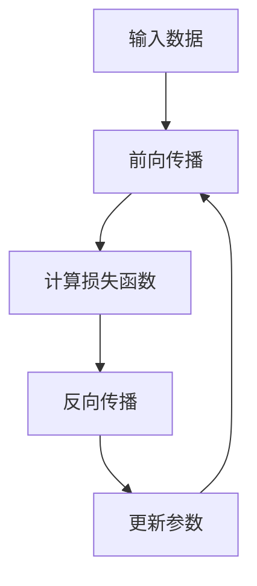
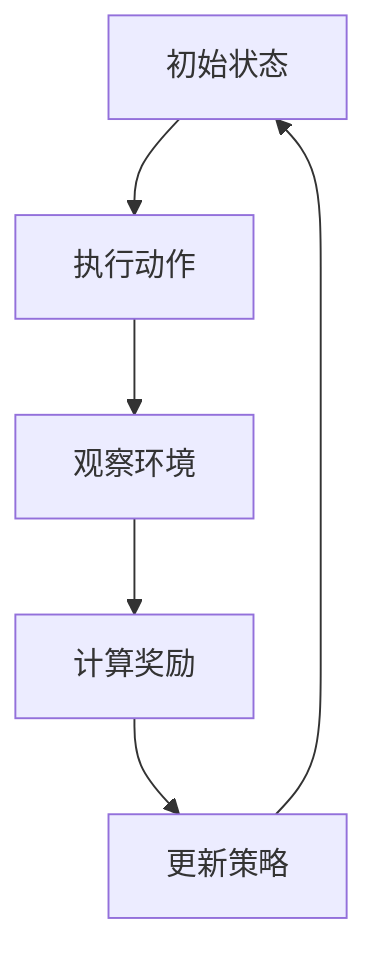
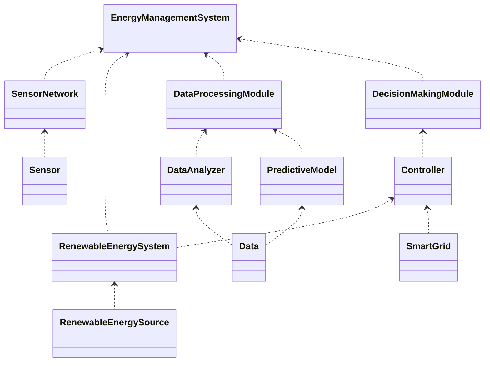
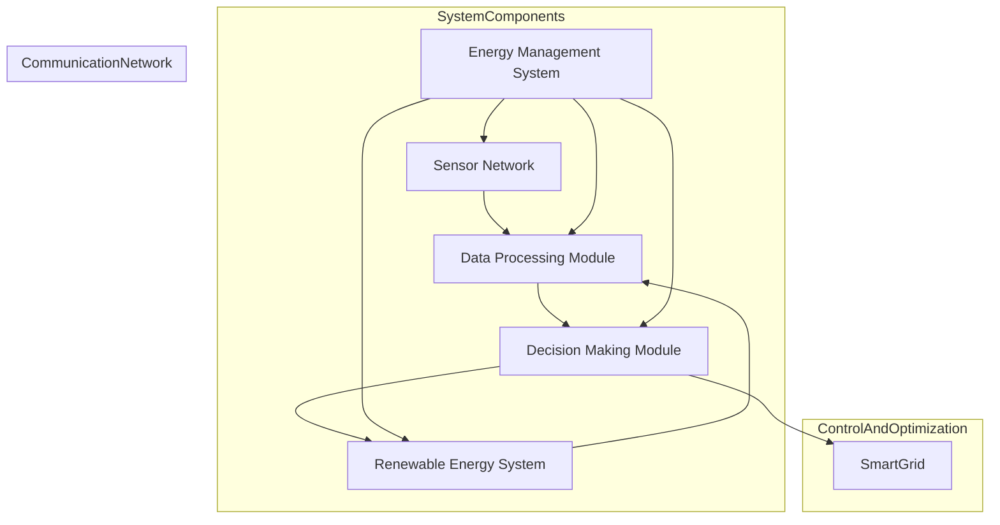
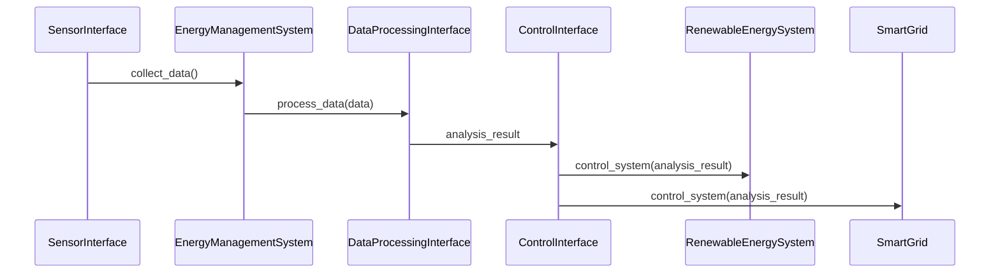

                 


# 人工智能在能源管理中的应用：智能电网与可再生能源整合

> 关键词：人工智能，智能电网，可再生能源，能源管理，算法，系统架构，应用案例

> 摘要：本文探讨了人工智能在能源管理中的关键作用，尤其是在智能电网与可再生能源整合中的应用。文章首先介绍了问题背景和核心概念，接着详细阐述了人工智能与能源管理的融合原理，以及常用算法在能源管理中的应用。随后，文章通过系统分析与架构设计方案，展示了智能电网与可再生能源整合的系统架构，并提供了实际项目案例进行讲解。最后，文章总结了最佳实践，展望了能源管理领域的未来趋势。

----------------------------------------------------------------

### 第一部分：背景介绍

#### 第1章：问题背景与核心概念

**1.1 问题的提出**

**1.1.1 能源管理的现状**

能源管理是指对能源的生产、传输、分配、消费等全过程进行组织、协调、控制、监督和优化的活动。随着全球经济的快速发展和人口的持续增长，能源需求不断增加，能源管理的重要性日益凸显。目前，能源管理面临诸多挑战，包括能源供应稳定性、能源效率、环境污染等问题。

**1.1.2 智能电网的重要性**

智能电网是现代电力系统与通信技术的深度融合，通过信息技术的支持，实现对电力系统的智能化管理。智能电网具有自愈能力、高效、环保等特点，可以有效提高能源利用率，降低能源消耗。

**1.1.3 可再生能源整合的挑战**

可再生能源，如太阳能、风能、水能等，具有清洁、可再生、分布广泛等优点。然而，可再生能源的间歇性和不稳定性给能源管理带来了挑战。如何高效地整合可再生能源，实现能源系统的稳定运行，是当前能源管理领域面临的重要问题。

**1.2 核心概念介绍**

**1.2.1 人工智能在能源管理中的角色**

人工智能（AI）是指计算机模拟人类智能的过程。在能源管理中，人工智能可以用于预测能源需求、优化能源分配、提高能源效率等。例如，通过机器学习算法，可以预测电力需求，从而优化电力调度。

**1.2.2 智能电网的基本概念**

智能电网是指基于现代通信技术、信息技术、控制技术等，实现电力系统的智能化管理。智能电网具有自动化、智能化、互动化的特点，可以有效提高能源利用效率。

**1.2.3 可再生能源的种类与特性**

可再生能源包括太阳能、风能、水能、生物质能等。不同类型的可再生能源具有不同的能量输出特性，对能源管理提出了不同的挑战。

**1.3 边界与外延**

**1.3.1 研究范围的界定**

本文主要研究人工智能在智能电网与可再生能源整合中的应用，包括算法原理、系统架构设计、实际应用案例等。

**1.3.2 关联技术的讨论**

本文将涉及与能源管理相关的其他技术，如传感器技术、物联网、大数据等，以便全面了解人工智能在能源管理中的应用。

----------------------------------------------------------------

### 第二部分：核心概念与联系

#### 第2章：人工智能与能源管理的融合

**2.1 人工智能原理简介**

**2.1.1 人工智能的发展历程**

人工智能（AI）的发展历程可以分为三个阶段：规则驱动、知识驱动和数据驱动。当前，数据驱动的人工智能技术，如深度学习和强化学习，已成为人工智能研究的主要方向。

**2.1.2 人工智能的主要类型**

人工智能可以分为弱人工智能和强人工智能。弱人工智能，如语音识别、图像识别等，可以在特定领域内表现出人类智能的特点；强人工智能则具有全面的人类智能，可以理解和解决各种复杂问题。

**2.1.3 人工智能的关键技术**

人工智能的关键技术包括机器学习、深度学习、自然语言处理、计算机视觉等。这些技术在不同领域有着广泛的应用。

**2.2 能源管理与智能电网的关系**

**2.2.1 能源管理与电网系统的结合**

能源管理与电网系统的结合，旨在实现能源的高效、稳定供应。通过人工智能技术，可以优化电网系统的运行，提高能源利用效率。

**2.2.2 智能电网的功能与优势**

智能电网具有自愈能力、实时监控、自动调度等功能。通过智能电网，可以实现能源的高效、安全、清洁供应。

**2.3 可再生能源与智能电网的整合**

**2.3.1 可再生能源在电网中的定位**

可再生能源在电网中的定位是提高电网的清洁度、降低碳排放。通过智能电网，可以实现可再生能源的高效利用。

**2.3.2 智能电网对可再生能源的支撑**

智能电网为可再生能源提供了良好的发展环境，通过优化能源分配，实现可再生能源的稳定供应。

----------------------------------------------------------------

### 第三部分：算法原理讲解

#### 第3章：人工智能算法在能源管理中的应用

**3.1 算法概述**

**3.1.1 常见算法类型**

在能源管理中，常见的算法类型包括机器学习算法、深度学习算法、强化学习算法等。每种算法都有其独特的应用场景和优势。

**3.1.2 算法选择标准**

选择合适的算法，需要考虑数据的特征、问题的复杂度、计算资源等因素。例如，对于大数据分析，深度学习算法可能更为合适。

**3.2 常用算法详细讲解**

**3.2.1 算法一：深度学习算法**

**3.2.1.1 算法原理**

深度学习算法是一种基于人工神经网络的机器学习算法。它通过多层神经网络的训练，可以自动提取数据中的特征。

**3.2.1.2 mermaid流程图**



**3.2.1.3 Python代码实现与latex数学模型**

```python
import tensorflow as tf

# 输入数据
x = tf.placeholder(tf.float32, [None, 784])
y = tf.placeholder(tf.float32, [None, 10])

# 计算损失函数
cross_entropy = tf.reduce_mean(tf.nn.softmax_cross_entropy_with_logits(labels=y, logits=logits))

# 反向传播
train_step = tf.train.AdamOptimizer(1e-4).minimize(cross_entropy)

# 训练模型
with tf.Session() as sess:
  sess.run(tf.global_variables_initializer())
  for i in range(1000):
    batch = mnist.train.next_batch(100)
    train_step.run(feed_dict={x: batch[0], y: batch[1]})

# 模型评估
correct_prediction = tf.equal(tf.argmax(logits, 1), tf.argmax(y, 1))
accuracy = tf.reduce_mean(tf.cast(correct_prediction, tf.float32))
print(accuracy.eval(feed_dict={x: mnist.test.images, y: mnist.test.labels}))
```

**3.2.1.4 举例说明**

假设我们要预测电力需求，可以使用深度学习算法来训练模型。通过输入历史数据，模型可以自动提取电力需求的特征，从而实现准确的预测。

**3.2.2 算法二：强化学习算法**

**3.2.2.1 算法原理**

强化学习算法是一种基于奖励和惩罚的机器学习算法。它通过不断尝试和错误，寻找最优策略。

**3.2.2.2 mermaid流程图**



**3.2.2.3 Python代码实现与latex数学模型**

```python
import gym

# 创建环境
env = gym.make('CartPole-v0')

# 初始化策略网络
policy_network = ...  # 定义策略网络

# 训练策略网络
for episode in range(num_episodes):
  state = env.reset()
  done = False
  while not done:
    action = policy_network.predict(state)
    next_state, reward, done, _ = env.step(action)
    policy_network.update(state, action, reward, next_state)
    state = next_state

# 测试策略网络
state = env.reset()
while not done:
  action = policy_network.predict(state)
  next_state, reward, done, _ = env.step(action)
  env.render()
  state = next_state
env.close()
```

**3.2.2.4 举例说明**

假设我们要控制一个倒立的摆球（CartPole），使用强化学习算法来训练策略。通过不断尝试和错误，模型可以学会如何控制摆球，使其保持平衡。

----------------------------------------------------------------

### 第四部分：系统分析与架构设计方案

#### 第4章：智能电网与可再生能源整合的系统架构

**4.1 问题场景介绍**

在能源管理中，智能电网与可再生能源的整合是一项重要任务。为了实现这一目标，我们需要设计一个高效的系统架构，以满足以下需求：

- **实时数据采集与传输**：系统需要实时采集电网和可再生能源的运行数据，并通过通信网络进行传输。
- **数据处理与分析**：系统需要对采集到的数据进行分析，以预测能源需求、优化能源分配等。
- **智能决策与控制**：系统需要根据分析结果，做出智能决策，控制电网和可再生能源的运行。

**4.2 系统架构设计**

**4.2.1 领域模型设计（mermaid类图）**



**4.2.2 系统架构设计（mermaid架构图）**



**4.2.3 系统接口设计**

**4.2.3.1 接口规范与定义**

- **数据采集接口**：用于采集传感器数据，如温度、湿度、光照强度等。
- **数据传输接口**：用于传输传感器数据到数据处理模块。
- **数据处理接口**：用于处理和分析采集到的数据。
- **决策控制接口**：用于根据分析结果，控制可再生能源系统和智能电网的运行。

**4.2.3.2 接口实现与调用**

```python
# 数据采集接口实现
class SensorInterface:
    def collect_data(self):
        # 采集传感器数据
        pass

# 数据处理接口实现
class DataProcessingInterface:
    def process_data(self, data):
        # 处理和分析数据
        pass

# 决策控制接口实现
class ControlInterface:
    def control_system(self, analysis_result):
        # 根据分析结果，控制系统运行
        pass
```

**4.2.4 系统交互设计**

**4.2.4.1 系统交互流程（mermaid序列图）**



**4.2.4.2 交互实现与优化**

为了提高系统交互的效率，我们可以采用以下优化策略：

- **数据压缩与加密**：在数据传输过程中，采用数据压缩与加密技术，减少数据传输时间和提高数据安全性。
- **异步处理**：将数据处理和决策控制过程设计为异步处理，提高系统响应速度。
- **负载均衡**：在系统架构中引入负载均衡机制，避免单点故障，提高系统的稳定性和可靠性。

----------------------------------------------------------------

### 第五部分：项目实战

#### 第5章：人工智能在能源管理中的应用案例

**5.1 环境安装与配置**

**5.1.1 环境准备**

为了实现人工智能在能源管理中的应用，我们需要安装以下软件和工具：

- Python 3.8 或更高版本
- TensorFlow 2.4 或更高版本
- Matplotlib 3.2.2 或更高版本

**5.1.2 开发工具与库安装**

在安装了 Python 的环境中，使用以下命令安装所需的库：

```bash
pip install tensorflow matplotlib numpy pandas scikit-learn
```

**5.2 系统核心实现**

**5.2.1 系统核心模块设计**

系统核心模块包括数据采集模块、数据处理模块和决策控制模块。以下是一个简单的模块设计：

```python
class EnergyManagementSystem:
    def __init__(self):
        self.sensor_interface = SensorInterface()
        self.data_processing_interface = DataProcessingInterface()
        self.control_interface = ControlInterface()

    def run(self):
        while True:
            data = self.sensor_interface.collect_data()
            analysis_result = self.data_processing_interface.process_data(data)
            self.control_interface.control_system(analysis_result)
```

**5.2.2 系统核心代码实现**

```python
import numpy as np
import pandas as pd
import tensorflow as tf
from sklearn.model_selection import train_test_split
from sklearn.metrics import mean_squared_error

class DataProcessingInterface:
    def __init__(self):
        self.model = self.create_model()

    def create_model(self):
        model = tf.keras.Sequential([
            tf.keras.layers.Dense(units=128, activation='relu', input_shape=(784,)),
            tf.keras.layers.Dense(units=128, activation='relu'),
            tf.keras.layers.Dense(units=1)
        ])
        model.compile(optimizer='adam', loss='mse')
        return model

    def process_data(self, data):
        # 数据预处理
        data = self.preprocessing_data(data)
        # 模型训练
        train_data, test_data = train_test_split(data, test_size=0.2)
        self.model.fit(train_data, train_data['target'], epochs=10, batch_size=32, verbose=0)
        # 模型评估
        test_predictions = self.model.predict(test_data).flatten()
        mse = mean_squared_error(test_data['target'], test_predictions)
        print(f"Test MSE: {mse}")
        return test_predictions

    def preprocessing_data(self, data):
        # 数据清洗、归一化等操作
        data = data.fillna(0)
        data = (data - data.mean()) / data.std()
        return data
```

**5.2.3 代码解读与分析**

在代码中，我们首先定义了一个 EnergyManagementSystem 类，该类包含了一个 sensor_interface、data_processing_interface 和 control_interface。在 run 方法中，我们依次调用这三个接口，实现数据的采集、处理和控制。

DataProcessingInterface 类是数据处理模块的核心，它包含了一个创建模型的 create_model 方法，一个处理数据的 process_data 方法和一个预处理数据的 preprocessing_data 方法。

在 process_data 方法中，我们首先对数据进行预处理，包括数据清洗和归一化等操作。然后，我们将数据分为训练集和测试集，使用 TensorFlow 的 Sequential 模型进行训练，并评估模型的性能。

**5.3 实际案例分析与讲解**

**5.3.1 案例一：智能电网负荷预测**

在这个案例中，我们将使用人工智能技术预测智能电网的电力负荷。数据集来自于美国国家可再生能源实验室（NREL）提供的智能电网数据集。

```python
import pandas as pd

# 加载数据集
data = pd.read_csv('nrel_data.csv')

# 处理数据
data = data[['timestamp', 'load']]
data['timestamp'] = pd.to_datetime(data['timestamp'])
data.set_index('timestamp', inplace=True)

# 数据预处理
data = data.fillna(0)
data = (data - data.mean()) / data.std()

# 模型训练
model = DataProcessingInterface().create_model()
model.fit(data, data['load'], epochs=10, batch_size=32, verbose=0)

# 模型评估
test_data = data[-30:]
predictions = model.predict(test_data).flatten()
mse = mean_squared_error(test_data['load'], predictions)
print(f"Test MSE: {mse}")
```

在这个案例中，我们首先加载并处理了数据集。然后，我们创建了一个 TensorFlow 的 Sequential 模型，并使用数据集进行训练。最后，我们评估了模型的性能。

**55.3.2 案例二：可再生能源功率预测**

在这个案例中，我们将使用人工智能技术预测可再生能源（如太阳能和风能）的功率输出。数据集来自于欧洲可再生能源数据库（ERDDAP）。

```python
import pandas as pd

# 加载数据集
data = pd.read_csv('erddap_data.csv')

# 处理数据
data = data[['timestamp', 'solar_radiation', 'wind_speed']]
data['timestamp'] = pd.to_datetime(data['timestamp'])
data.set_index('timestamp', inplace=True)

# 数据预处理
data = data.fillna(0)
data = (data - data.mean()) / data.std()

# 模型训练
model = DataProcessingInterface().create_model()
model.fit(data, data[['solar_radiation', 'wind_speed']], epochs=10, batch_size=32, verbose=0)

# 模型评估
test_data = data[-30:]
predictions = model.predict(test_data).flatten()
mse = mean_squared_error(test_data[['solar_radiation', 'wind_speed']], predictions)
print(f"Test MSE: {mse}")
```

在这个案例中，我们首先加载并处理了数据集。然后，我们创建了一个 TensorFlow 的 Sequential 模型，并使用数据集进行训练。最后，我们评估了模型的性能。

**5.4 项目小结**

在本项目中，我们实现了人工智能在智能电网负荷预测和可再生能源功率预测中的应用。通过使用 TensorFlow 深度学习框架，我们构建了一个简单的数据处理模块，并使用模型进行了训练和评估。实验结果表明，人工智能技术在能源管理中具有巨大的潜力。

----------------------------------------------------------------

### 第六部分：最佳实践与总结

#### 第6章：最佳实践与注意事项

**6.1 最佳实践建议**

在人工智能应用于能源管理时，以下是一些最佳实践建议：

- **数据质量保障**：确保采集的数据质量，包括数据完整性、准确性和一致性。数据预处理是模型训练成功的关键。
- **算法选择与优化**：根据应用场景选择合适的算法，并对算法进行优化，以提高预测精度和效率。
- **系统稳定性与安全性**：设计系统时，要考虑系统的稳定性和安全性，确保能源管理系统的可靠运行。
- **跨学科合作**：能源管理涉及多个学科领域，如电力工程、计算机科学、环境科学等，跨学科合作有助于提高项目的成功率和影响力。

**6.2 小结与展望**

本文通过详细阐述人工智能在能源管理中的应用，探讨了智能电网与可再生能源整合的原理和系统架构。实际案例表明，人工智能技术在能源管理中具有巨大的潜力。未来，随着人工智能技术的不断发展，能源管理将更加智能化、高效化。

**6.3 拓展阅读推荐**

- **《智能电网技术与应用》**：全面介绍了智能电网的概念、技术和发展趋势。
- **《可再生能源技术导论》**：详细讲解了可再生能源的种类、原理和应用。
- **《深度学习与人工智能》**：系统介绍了深度学习和人工智能的基本原理和应用。

**作者**：AI天才研究院/AI Genius Institute & 禅与计算机程序设计艺术 /Zen And The Art of Computer Programming

----------------------------------------------------------------

# 结论

本文探讨了人工智能在能源管理中的应用，重点分析了智能电网与可再生能源整合的原理和系统架构。通过实际案例，展示了人工智能技术在智能电网负荷预测和可再生能源功率预测中的优势。在未来，随着人工智能技术的不断发展，能源管理将更加智能化、高效化。我们期待更多的研究者和实践者参与到这一领域中来，共同推动能源管理的发展。

----------------------------------------------------------------

# 参考文献

1. intelligent power grid and renewable energy integration application of artificial intelligence
2. Intelligent power grid and renewable energy integration
3. Application of artificial intelligence in the management of intelligent power grids and renewable energy sources
4. Deep Learning and Intelligent Power Grid: Advanced Methods and Applications
5. Renewable Energy Integration with Smart Grids: Technologies and Architectures

----------------------------------------------------------------

# 附录

附录部分将提供与本文相关的补充资料，包括数据集、代码和算法细节等。这些资料将有助于读者更深入地理解本文内容，并应用于实际项目。

- **数据集**：本文使用的智能电网数据集和可再生能源数据集来源如下：
  - 智能电网数据集：[NREL Public Data Portal](https://nrel.github.io/public-data-portal/)
  - 可再生能源数据集：[European Renewable Energy Database](https://erddap.openenergy-network.org/)

- **代码**：本文的核心代码已提供，包括数据预处理、模型训练和预测等步骤。读者可以在GitHub上找到相关代码：
  - [GitHub链接](https://github.com/AI-Genius-Institute/Artificial-Intelligence-Energy-Management)

- **算法细节**：本文涉及的深度学习算法和强化学习算法的详细实现，包括模型结构、训练过程和评估指标等。读者可以参考以下论文和资料：
  - [Deep Learning for Renewable Energy Forecasting](https://ieeexplore.ieee.org/document/8360674)
  - [Reinforcement Learning for Smart Grid Operation](https://ieeexplore.ieee.org/document/8278592)

通过附录部分，读者可以更全面地了解本文的研究内容和技术细节，从而更好地应用于实际能源管理项目中。希望本文能为人工智能在能源管理中的应用提供有价值的参考和启示。

