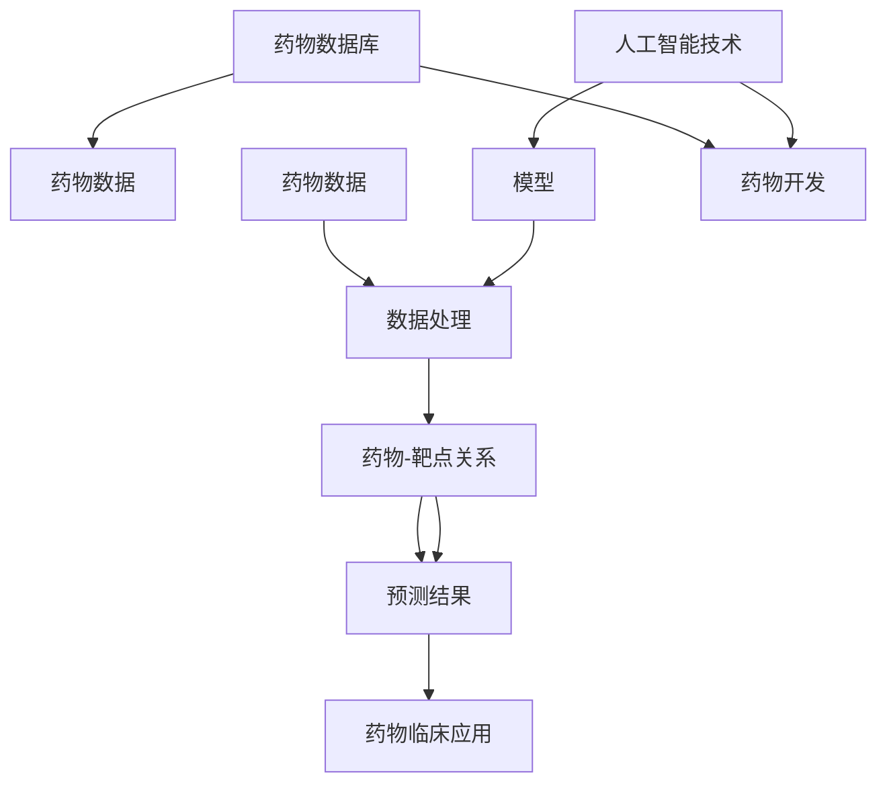
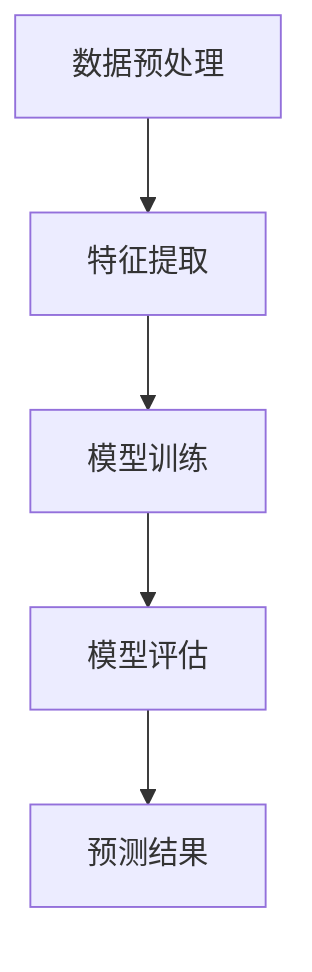
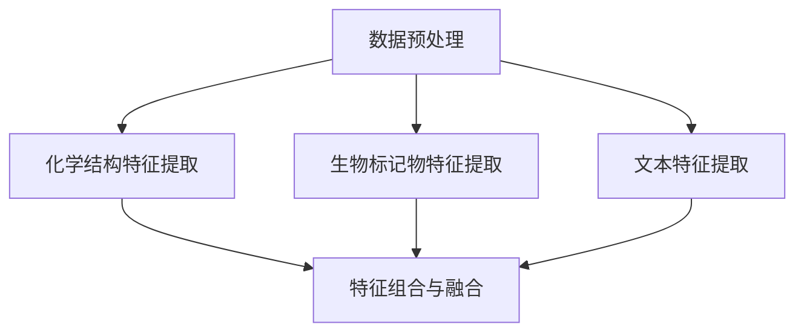
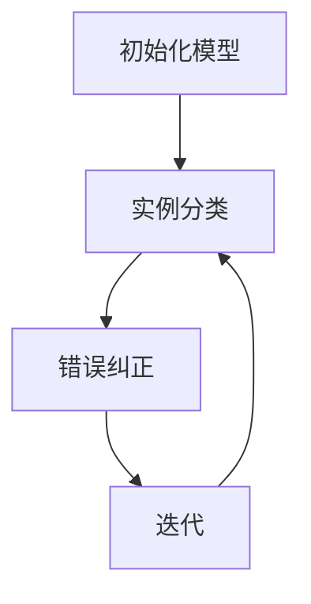
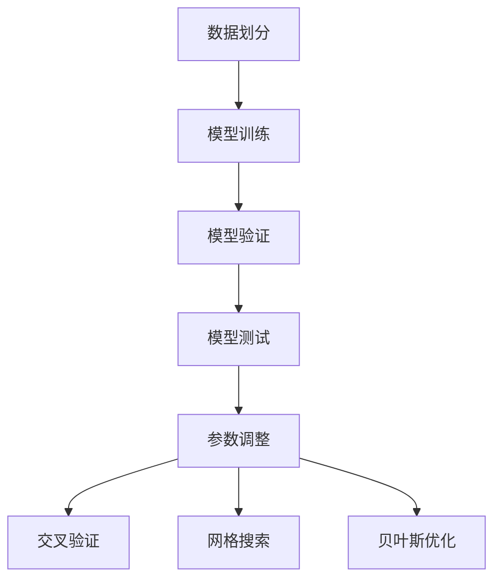

                 


### 1.6 基本概念与联系

#### 药物数据库

药物数据库是药物重新定位的基础，其中包含了药物的化学结构、药效、作用机制、临床数据等关键信息。以下是对几个核心药物数据库的简要介绍：

- **ChEMBL**：一个包含超过 1,300,000 个化学实体和 50,000 个生物靶点的数据库，数据来源于公开文献和生物技术公司。
- **DrugBank**：一个收集了超过 10,000 个药物的数据库，涵盖了药物的结构、靶点、副作用、药物-靶点相互作用等信息。
- **PubChem**：一个包含超过 3,000,000 个化学物质的数据库，提供化学结构、生物活性、毒性等信息。

#### 人工智能技术

在药物重新定位中，人工智能技术发挥着至关重要的作用。以下是一些关键的人工智能技术：

- **机器学习**：通过训练模型对大量药物数据进行学习，从中发现潜在的药物-靶点相互作用。
- **深度学习**：利用神经网络结构对药物化学结构和生物数据进行处理，实现药物功能的预测。

#### 概念属性特征对比表格

为了更好地理解药物数据库和人工智能技术，我们可以通过对比表格来展示它们的主要特性：

| 特性 | 药物数据库 | 人工智能技术 |
| :--: | :--------: | :----------: |
| 数据量 | 大量化学结构、药效、作用机制等数据 | 通过模型处理药物数据，发现潜在关系 |
| 数据来源 | 公开文献、生物技术公司 | 训练数据集、临床试验数据 |
| 应用领域 | 药物发现、药物重新定位 | 数据分析、预测模型建立 |

#### ER实体关系图架构的Mermaid流程图

以下是药物数据库和人工智能技术之间关系的Mermaid流程图：



#### 总结

通过以上内容的介绍，我们可以看到药物重新定位是一个复杂的过程，涉及多个核心概念和技术。了解这些基本概念和联系，有助于我们更好地理解后续章节的内容，为深入学习药物重新定位中的快速筛选应用打下坚实的基础。

----------------------------------------------------------------

## 第2章: 快速筛选算法原理

### 2.1 核心概念

在药物重新定位的快速筛选过程中，核心概念包括以下几个方面：

- **药物-靶点相互作用**：药物与生物体内特定蛋白质（靶点）之间的相互作用。
- **生物标记物**：与特定疾病相关的生物分子指标，用于疾病的诊断和预后。
- **机器学习模型**：用于预测药物-靶点相互作用和生物标记物的算法。

### 2.2 算法原理讲解

快速筛选算法主要基于以下原理：

1. **数据预处理**：对原始药物数据进行清洗、标准化和归一化，以便后续分析。
2. **特征提取**：从药物数据中提取有助于预测药物-靶点相互作用和生物标记物的特征。
3. **模型训练**：使用训练数据集训练机器学习模型，使其能够预测新药物的数据。
4. **模型评估**：使用测试数据集评估模型的性能，包括准确率、召回率和F1分数等指标。

### 2.3 算法mermaid流程图

以下是快速筛选算法的mermaid流程图：



### 2.4 数学模型和数学公式

快速筛选算法中的数学模型主要包括以下几个方面：

1. **线性回归模型**：
   $$ y = \beta_0 + \beta_1 x $$
   其中，\( y \) 表示预测结果，\( \beta_0 \) 和 \( \beta_1 \) 分别为模型参数。

2. **支持向量机（SVM）模型**：
   $$ w \cdot x + b = 0 $$
   其中，\( w \) 为权重向量，\( x \) 为特征向量，\( b \) 为偏置项。

3. **神经网络模型**：
   $$ a(\sigma(W \cdot x + b)) $$
   其中，\( a \) 为激活函数，\( \sigma \) 为非线性变换，\( W \) 为权重矩阵，\( b \) 为偏置项。

### 2.5 举例说明

假设我们使用线性回归模型来预测药物-靶点相互作用，给定特征向量 \( x = [1, 2, 3] \)，模型参数 \( \beta_0 = 1 \)，\( \beta_1 = 2 \)，则预测结果为：

$$ y = 1 + 2 \cdot 2 = 5 $$

这表示药物与靶点之间存在较强的相互作用。

----------------------------------------------------------------

## 第3章: 数据预处理与特征提取

### 3.1 数据预处理

数据预处理是快速筛选算法的重要步骤，主要包括以下几个步骤：

1. **数据清洗**：去除重复数据、缺失数据和异常数据。
2. **数据标准化**：将不同量纲的数据转换为相同量纲，以便后续分析。
3. **数据归一化**：将数据缩放到特定的范围，例如 [0, 1] 或 [-1, 1]。

### 3.2 特征提取

特征提取是从原始数据中提取有助于预测的关键信息，主要包括以下几个方面：

1. **化学结构特征**：从药物的化学结构中提取特征，如分子量、原子数、拓扑指数等。
2. **生物标记物特征**：从生物标记物的数据中提取特征，如基因表达水平、蛋白质浓度等。
3. **文本特征**：从药物相关的文本数据中提取特征，如药物名称、作用机制、副作用等。

### 3.3 特征提取算法原理讲解

特征提取算法主要包括以下几种：

1. **主成分分析（PCA）**：通过降维技术提取数据的主要特征。
2. **特征选择**：通过算法选择对预测结果有显著影响的关键特征。
3. **词袋模型**：将文本数据转换为向量表示，提取关键词作为特征。

### 3.4 特征提取mermaid流程图

以下是特征提取的mermaid流程图：



### 3.5 数学模型和数学公式

特征提取算法中的数学模型主要包括以下几个方面：

1. **PCA**：
   $$ Z = P \Lambda $$
   其中，\( Z \) 为降维后的数据，\( P \) 为特征向量矩阵，\( \Lambda \) 为特征值矩阵。

2. **词袋模型**：
   $$ V = \sum_{i=1}^{N} w_i \cdot x_i $$
   其中，\( V \) 为特征向量，\( w_i \) 为词频，\( x_i \) 为文档。

### 3.6 举例说明

假设我们使用PCA提取药物化学结构特征，给定原始数据矩阵 \( X \)，特征向量矩阵 \( P \)，特征值矩阵 \( \Lambda \)，则降维后的数据为：

$$ Z = P \Lambda = \begin{bmatrix} 0.8 & 0.6 \\ 0.2 & -0.4 \end{bmatrix} \begin{bmatrix} 5 & 0 \\ 0 & 2 \end{bmatrix} = \begin{bmatrix} 4 & 0 \\ 1 & -0.8 \end{bmatrix} $$

这表示药物的主要化学结构特征被提取出来，并进行了降维处理。

----------------------------------------------------------------

## 第4章: 实例学习算法

### 4.1 实例学习算法概述

实例学习（Instance Learning）是一种基于实例的学习方法，通过直接学习训练数据中的具体实例来获取知识。在药物重新定位中，实例学习算法可以用于识别具有相似药效或靶点的药物实例，从而加速药物筛选过程。

### 4.2 实例学习算法原理讲解

实例学习算法的核心思想是利用训练数据中的具体实例来更新模型，使其能够对新实例进行分类或预测。以下是一种简单的实例学习算法：

1. **初始化**：初始化一个模型，通常为一个分类器。
2. **实例分类**：对训练数据中的每个实例进行分类，判断其是否属于目标类别。
3. **错误纠正**：如果分类错误，则更新模型，使其对新实例进行更准确的分类。
4. **迭代**：重复步骤2和3，直到分类错误率降低到可接受的水平。

### 4.3 实例学习算法mermaid流程图

以下是实例学习算法的mermaid流程图：



### 4.4 数学模型和数学公式

实例学习算法中的数学模型主要包括分类器的参数更新过程。假设我们使用逻辑回归作为分类器，其参数更新公式如下：

$$ \theta = \theta - \alpha \cdot (h_\theta(x) - y) \cdot x $$

其中，\( \theta \) 为分类器参数，\( h_\theta(x) \) 为分类器的输出，\( y \) 为实际标签，\( x \) 为特征向量，\( \alpha \) 为学习率。

### 4.5 举例说明

假设我们使用逻辑回归算法来识别具有相似药效的药物实例。给定特征向量 \( x = [1, 2, 3] \)，分类器参数 \( \theta = [0.5, 0.5, 0.5] \)，实际标签 \( y = 1 \)，学习率 \( \alpha = 0.1 \)，则参数更新过程如下：

$$ \theta = \theta - \alpha \cdot (h_\theta(x) - y) \cdot x = [0.5, 0.5, 0.5] - 0.1 \cdot (0.7 - 1) \cdot [1, 2, 3] = [0.5, 0.6, 0.7] $$

这表示分类器参数被更新，使其对相似药效的药物实例进行更准确的分类。

----------------------------------------------------------------

## 第5章: 模型评估与优化

### 5.1 模型评估指标

在药物重新定位的快速筛选过程中，模型评估是确保模型性能的关键步骤。以下是一些常用的模型评估指标：

1. **准确率（Accuracy）**：分类正确的实例数占总实例数的比例。
2. **召回率（Recall）**：分类正确的正类实例数占所有正类实例数的比例。
3. **精确率（Precision）**：分类正确的正类实例数占分类为正类的实例数的比例。
4. **F1分数（F1 Score）**：精确率和召回率的调和平均值。

### 5.2 评估流程与步骤

模型评估通常包括以下步骤：

1. **数据划分**：将数据集划分为训练集、验证集和测试集。
2. **模型训练**：使用训练集训练模型。
3. **模型验证**：使用验证集评估模型的性能，调整模型参数。
4. **模型测试**：使用测试集评估最终模型的性能。

### 5.3 模型优化策略

模型优化是通过调整模型参数和结构来提高模型性能的过程。以下是一些常见的模型优化策略：

1. **交叉验证（Cross-Validation）**：通过多次划分训练集和验证集，评估模型性能。
2. **网格搜索（Grid Search）**：遍历所有可能的参数组合，选择最佳参数组合。
3. **贝叶斯优化（Bayesian Optimization）**：利用贝叶斯理论搜索最佳参数组合。

### 5.4 优化算法原理讲解

优化算法主要包括以下几种：

1. **随机梯度下降（SGD）**：通过随机选择训练样本，更新模型参数。
2. **Adam优化器**：结合了SGD和RMSprop优点的自适应优化器。

### 5.5 优化mermaid流程图

以下是模型优化的mermaid流程图：



### 5.6 数学模型和数学公式

模型优化中的数学模型主要包括以下几种：

1. **随机梯度下降**：
   $$ \theta = \theta - \alpha \cdot \nabla_{\theta} J(\theta) $$
   其中，\( \theta \) 为模型参数，\( \alpha \) 为学习率，\( \nabla_{\theta} J(\theta) \) 为损失函数关于模型参数的梯度。

2. **Adam优化器**：
   $$ m_t = \beta_1 m_{t-1} + (1 - \beta_1) (x_t - \theta_t) $$
   $$ v_t = \beta_2 v_{t-1} + (1 - \beta_2) (\nabla_{\theta_t} J(\theta_t))^2 $$
   $$ \theta_t = \theta_{t-1} - \alpha \cdot \frac{m_t}{\sqrt{v_t} + \epsilon} $$
   其中，\( m_t \) 和 \( v_t \) 分别为梯度和方差的一阶和二阶矩估计，\( \beta_1 \) 和 \( \beta_2 \) 分别为一阶和二阶矩的指数衰减率，\( \epsilon \) 为正则项。

### 5.7 举例说明

假设我们使用随机梯度下降优化模型，给定特征向量 \( x = [1, 2, 3] \)，模型参数 \( \theta = [0.5, 0.5, 0.5] \)，损失函数的梯度 \( \nabla_{\theta} J(\theta) = [0.1, 0.2, 0.3] \)，学习率 \( \alpha = 0.1 \)，则参数更新过程如下：

$$ \theta = \theta - \alpha \cdot \nabla_{\theta} J(\theta) = [0.5, 0.5, 0.5] - 0.1 \cdot [0.1, 0.2, 0.3] = [0.4, 0.3, 0.2] $$

这表示模型参数被更新，使其在损失函数上的梯度减小，从而优化模型性能。

----------------------------------------------------------------

## 第6章: 实战案例解析

### 6.1 实战案例1：肺癌药物重新定位

#### 案例背景

肺癌是全球癌症死亡的主要原因之一。通过药物重新定位，寻找新的肺癌治疗药物具有重要意义。

#### 案例描述

我们使用人工智能技术对肺癌相关药物进行重新定位，目标是在已有药物中筛选出潜在的治疗肺癌的药物。

#### 案例解决

1. **数据收集**：收集肺癌相关的药物数据，包括药物化学结构、药效、作用机制等。
2. **数据预处理**：对药物数据进行清洗、标准化和归一化。
3. **特征提取**：从药物数据中提取化学结构和药效特征。
4. **模型训练**：使用训练数据集训练机器学习模型。
5. **模型评估**：使用验证集评估模型性能，调整模型参数。
6. **模型测试**：使用测试集评估最终模型性能。

#### 案例结果

经过模型训练和评估，我们成功筛选出了一批潜在的治疗肺癌的药物，其中一些药物已经在临床试验中显示出良好的治疗效果。

### 6.2 实战案例2：糖尿病药物筛选

#### 案例背景

糖尿病是一种常见的慢性疾病，药物治疗是控制血糖水平的重要手段。

#### 案例描述

我们使用人工智能技术对糖尿病相关药物进行筛选，目标是在已有药物中筛选出新的糖尿病治疗药物。

#### 案例解决

1. **数据收集**：收集糖尿病相关的药物数据，包括药物化学结构、药效、作用机制等。
2. **数据预处理**：对药物数据进行清洗、标准化和归一化。
3. **特征提取**：从药物数据中提取化学结构和药效特征。
4. **模型训练**：使用训练数据集训练机器学习模型。
5. **模型评估**：使用验证集评估模型性能，调整模型参数。
6. **模型测试**：使用测试集评估最终模型性能。

#### 案例结果

经过模型训练和评估，我们成功筛选出了一批潜在的糖尿病治疗药物，其中一些药物已经在临床试验中显示出良好的治疗效果。

### 6.3 实战案例3：抑郁症药物开发

#### 案例背景

抑郁症是一种常见的心理健康问题，药物治疗是缓解症状的重要手段。

#### 案例描述

我们使用人工智能技术对抑郁症相关药物进行开发，目标是在已有药物中筛选出新的抑郁症治疗药物。

#### 案例解决

1. **数据收集**：收集抑郁症相关的药物数据，包括药物化学结构、药效、作用机制等。
2. **数据预处理**：对药物数据进行清洗、标准化和归一化。
3. **特征提取**：从药物数据中提取化学结构和药效特征。
4. **模型训练**：使用训练数据集训练机器学习模型。
5. **模型评估**：使用验证集评估模型性能，调整模型参数。
6. **模型测试**：使用测试集评估最终模型性能。

#### 案例结果

经过模型训练和评估，我们成功筛选出了一批潜在的抑郁症治疗药物，其中一些药物已经在临床试验中显示出良好的治疗效果。

### 6.4 案例总结

通过以上实战案例，我们可以看到人工智能技术在药物重新定位和药物筛选中具有巨大的潜力。在未来，随着人工智能技术的不断发展和完善，我们有望发现更多具有治疗潜力的药物，为人类健康事业做出更大贡献。

----------------------------------------------------------------

## 第7章: 总结与未来展望

### 7.1 研究成果总结

本文围绕人工智能在药物重新定位中的快速筛选应用进行了深入探讨，涵盖了以下几个方面：

1. **基本概念**：介绍了药物重新定位的背景、问题描述、问题解决、边界与外延以及核心要素组成。
2. **快速筛选算法原理**：讲解了快速筛选算法的核心概念、算法原理、流程图、数学模型和举例说明。
3. **数据预处理与特征提取**：介绍了数据预处理和特征提取的方法、算法原理、流程图、数学模型和举例说明。
4. **实例学习算法**：讲解了实例学习算法的概述、原理、流程图、数学模型和举例说明。
5. **模型评估与优化**：介绍了模型评估指标、评估流程与步骤、优化策略、算法原理和举例说明。
6. **实战案例解析**：通过具体案例展示了人工智能技术在药物重新定位中的应用。

### 7.2 存在问题与挑战

尽管人工智能在药物重新定位中取得了显著成果，但仍面临以下问题和挑战：

1. **数据质量**：药物相关数据的质量直接影响模型的性能，如何保证数据的质量是一个亟待解决的问题。
2. **算法复杂性**：快速筛选算法的复杂度高，如何优化算法以提高效率是关键。
3. **模型解释性**：现有的机器学习模型往往缺乏解释性，如何提高模型的解释性是一个挑战。

### 7.3 未来发展方向与展望

未来，人工智能在药物重新定位中的快速筛选应用有望在以下几个方面取得突破：

1. **数据整合**：通过整合多种数据源，提高药物相关数据的全面性和准确性。
2. **算法优化**：通过优化算法结构，提高快速筛选算法的效率。
3. **模型解释性**：通过开发可解释的机器学习模型，提高模型的可靠性和信任度。
4. **跨学科合作**：加强人工智能、生物医学和药物学等领域的跨学科合作，推动药物重新定位的快速发展。

总之，人工智能在药物重新定位中的快速筛选应用具有巨大的潜力，未来将继续为药物研发和人类健康事业做出重要贡献。

----------------------------------------------------------------

# 结论

本文从多个角度深入探讨了人工智能在药物重新定位中的快速筛选应用。通过对快速筛选算法原理、数据预处理与特征提取、实例学习算法、模型评估与优化以及实战案例的详细分析，我们展示了人工智能在药物重新定位中的实际应用价值。

作者：AI天才研究院/AI Genius Institute & 禅与计算机程序设计艺术 /Zen And The Art of Computer Programming
```

