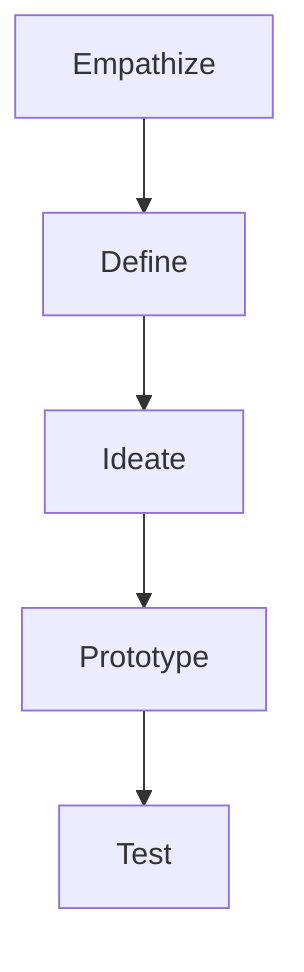
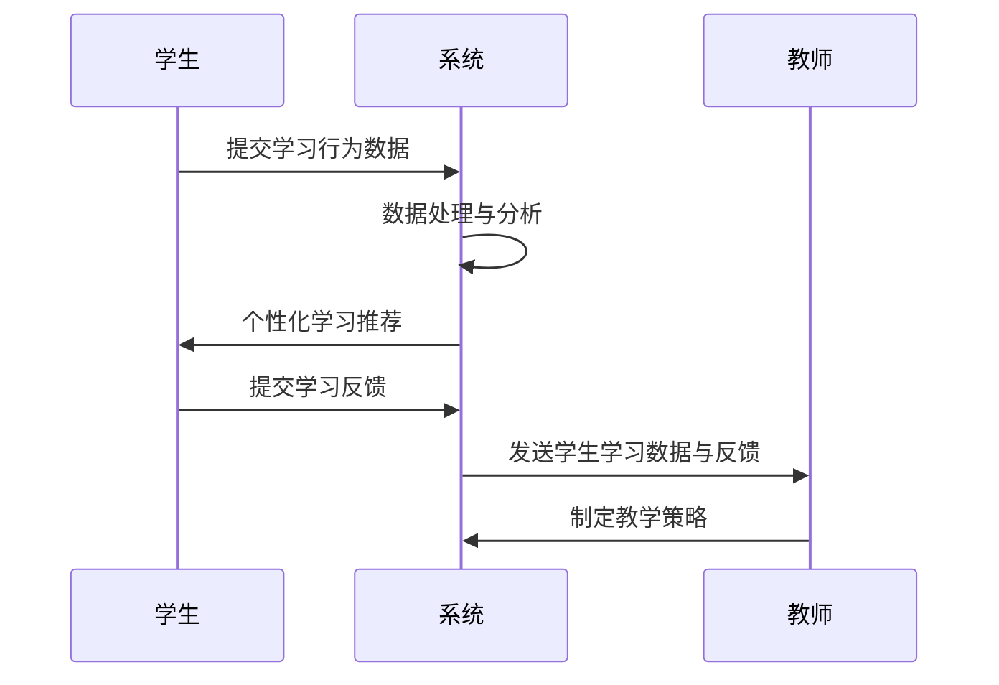
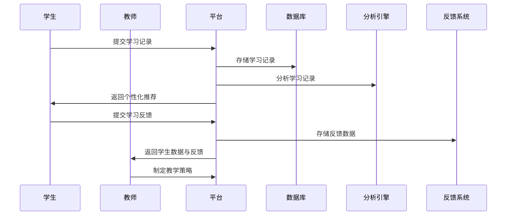

                 


### 引言与背景

#### 1.1 问题的提出与重要性

在人工智能（AI）迅猛发展的时代，教育领域面临着前所未有的挑战和机遇。AI技术的进步不仅改变了各行各业的工作方式，也对教育产生了深远的影响。首先，AI的普及使得教育资源更加丰富和多样化，为个性化学习提供了可能。然而，与此同时，AI技术也引发了对人文教育的担忧。许多人担心，过分依赖AI可能导致教育过于技术化，忽视了人类情感、价值观和创造性思维的培养。

人文教育作为一种关注个体全面发展、强调批判性思维和创造力培养的教育理念，其在AI时代的重要性愈发凸显。人文教育不仅仅是传授知识，更重要的是培养学生的思考能力、道德判断力和社会责任感。在AI时代，这种能力显得尤为关键，因为AI虽然能处理大量数据，但无法替代人类的情感、创造力和道德思考。

本文旨在探讨在AI时代如何通过人文教育来培养批判性思维和创造力。首先，我们将回顾人文教育的基本概念和原则，并分析其在现代教育体系中的角色。随后，通过具体案例和实例，我们将展示人文教育在AI背景下的实际应用。接着，我们将讨论实施人文教育的方法和策略，并分析其中可能遇到的挑战和机会。最后，我们将总结全文，并提出未来人文教育发展的方向。

#### 1.2 人文教育与AI的关系

人文教育强调个体的全面发展，包括道德、情感、认知和创造性等方面。其核心在于培养学生的批判性思维和创造力，这两个要素在AI时代显得尤为重要。首先，批判性思维是面对复杂问题时的一种思考方式，它要求个体能够分析、评估和重新构建信息，而不是简单地接受或拒绝。在AI时代，信息过载是一个普遍现象，批判性思维成为个体在信息海洋中导航的必要技能。

创造力则是人文教育的另一重要目标。它不仅仅是产生新颖的想法，更涉及到如何将想法转化为实际的创新成果。在AI时代，创造力不仅是艺术和设计等领域的重要品质，也是解决复杂问题和推动技术进步的关键。AI虽然能执行复杂计算，但它缺乏人类的直觉和创造力，这使得培养个体的创造力成为教育不可或缺的一部分。

人文教育在AI时代扮演着多重角色。首先，它是AI发展的基石，确保技术不被滥用，符合人类的道德和伦理标准。其次，人文教育能够平衡技术驱动教育，避免技术主导一切的局面。最后，人文教育为个体提供了应对未来不确定性的能力，使他们能够在技术变革中保持适应性和创新能力。

#### 1.3 人文教育在AI时代的角色

在AI时代，人文教育的角色不仅没有减弱，反而更加突出。首先，人文教育在培养批判性思维方面发挥着至关重要的作用。批判性思维要求个体具备分析问题的能力，不盲从，不轻信。在AI时代，数据和信息无处不在，个体需要具备筛选和评估信息的能力，以避免被大量数据淹没。人文教育通过培养学生的批判性思维，帮助他们识别和挑战假设，形成独立的判断力。

其次，人文教育在培养创造力方面也具有独特的优势。创造力不仅仅是产生新颖的想法，更是将这些想法转化为实际的创新成果。在AI时代，技术飞速发展，社会变革频繁，个体需要具备创造新方法和解决新问题的能力。人文教育通过提供多样化的学习体验，激发学生的创造力，帮助他们找到创新的解决方案。

在AI时代，人文教育的重要性不仅体现在理论层面，还体现在实际应用中。以下是一些具体的例子：

1. **跨学科教育**：许多学校开始强调跨学科教育，通过将不同领域的知识整合，培养学生的综合素质。这种教育模式有助于学生形成多维度的思考方式，提高他们的创造力。

2. **项目式学习**：项目式学习强调通过实际项目来学习知识，这种方法有助于学生将理论知识应用于实际问题，提高他们的实践能力和创新能力。

3. **创新实验室**：一些学校建立了创新实验室，提供各种技术工具和资源，鼓励学生进行创新实践。这些实验室成为培养学生创造力的重要平台。

4. **教师培训**：为了更好地适应AI时代的教育需求，许多学校开始对教师进行专项培训，帮助他们掌握最新的教育理念和技术工具。

总之，人文教育在AI时代的重要性不言而喻。它不仅为个体提供了应对未来挑战的能力，也为社会的发展注入了新的活力。在接下来的章节中，我们将进一步探讨如何在实际教育环境中实施人文教育，以及在这个过程中可能遇到的挑战和机遇。

---

### 核心概念与联系

在深入探讨人文教育在AI时代的角色之前，有必要明确一些核心概念，并分析它们之间的关系。以下是几个关键概念及其属性特征的对比表格：

| 概念         | 定义                                                         | 属性特征对比                           |
| ------------ | ------------------------------------------------------------ | -------------------------------------- |
| 人文教育     | 强调个体全面发展，包括道德、情感、认知和创造性等方面。          | - 注重个体的内在发展<br>- 强调批判性思维<br>- 培养综合素质 |
| 批判性思维   | 分析、评估和重新构建信息的过程，不盲从、不轻信。               | - 独立判断力<br>- 信息筛选能力<br>- 分析能力 |
| 创造力       | 产生新颖想法并转化为实际创新成果的能力。                       | - 新颖性<br>- 实用性<br>- 变通性       |
| 人工智能（AI） | 通过模拟人类智能行为，使计算机具备一定程度的自主学习和决策能力。 | - 自动化<br>- 高效性<br>- 精确性       |

为了更直观地展示这些概念之间的联系，我们可以使用Mermaid绘制一个ER实体关系图：

```mermaid
erDiagram
    AI --> 人文教育 : 依赖
    AI --> 批判性思维 : 促进
    AI --> 创造力 : 促进
    人文教育 --> 批判性思维 : 基础
    人文教育 --> 创造力 : 基础
```

这个ER图展示了人工智能（AI）与人文教育、批判性思维和创造力之间的关系。AI依赖于人文教育来指导其发展，同时它也促进批判性思维和创造力的发展。人文教育为批判性思维和创造力提供了基础，而批判性思维和创造力又反过来强化了人文教育。

### 算法原理讲解

为了更好地理解如何在教育环境中培养批判性思维和创造力，我们可以借助一种名为“设计思维”的方法。设计思维是一种迭代的过程，通过五个阶段（ empathize、define、ideate、 prototype和test）来解决问题。以下是设计思维的具体流程：

1. **Empathize（同理心阶段）**：
   - 调查和理解用户的需求和痛点。
   - 收集数据，通过访谈、问卷调查等方式获取用户的真实反馈。
   - 制作用户画像，明确目标用户的特点和需求。

2. **Define（定义阶段）**：
   - 明确问题定义，将用户的需求转化为具体的挑战。
   - 建立一个明确的目标，确保团队所有人都对目标有共识。

3. **Ideate（创意生成阶段）**：
   - 鼓励团队成员提出尽可能多的创意，不考虑创意的好坏。
   - 通过头脑风暴、思维导图等方式记录所有的创意。

4. **Prototype（原型制作阶段）**：
   - 将创意转化为可测试的原型，可以是草图、模型或简单的用户界面。
   - 快速迭代，不断优化原型，直到满足用户需求。

5. **Test（测试阶段）**：
   - 将原型呈现给用户，收集反馈。
   - 分析反馈，进一步优化原型。

为了更直观地展示设计思维的流程，我们可以使用Mermaid绘制以下流程图：



设计思维的核心在于其迭代性和用户中心性。通过不断的迭代和用户反馈，设计思维能够帮助教育者更好地理解学生需求，并创造出更有效的教育方法和工具。

接下来，我们将使用Python代码来详细阐述设计思维在培养批判性思维和创造力中的应用。以下是一个简单的Python代码示例，用于生成设计思维的迭代流程图：

```python
import matplotlib.pyplot as plt
import networkx as nx

# 创建一个图
G = nx.DiGraph()

# 添加节点和边
G.add_nodes_from(['Empathize', 'Define', 'Ideate', 'Prototype', 'Test'])
G.add_edges_from([('Empathize', 'Define'), ('Define', 'Ideate'), ('Ideate', 'Prototype'), ('Prototype', 'Test')])

# 绘制图
pos = nx.spring_layout(G)
nx.draw(G, pos, with_labels=True, node_color='lightblue', edge_color='blue')

# 显示图形
plt.show()
```

这个代码将生成一个设计思维的流程图，展示每个阶段之间的关系。通过这种可视化的方式，教育者可以更直观地了解设计思维的运作机制，并据此设计教育课程和活动。

### 系统分析与架构设计方案

在人工智能时代，为了更好地实施人文教育，构建一个完善的教育系统是必不可少的。以下是对一个典型教育系统的详细分析和架构设计。

#### 1. 问题场景介绍

在教育领域，教师和学生之间存在着信息不对称的问题。教师需要了解学生的学习进度和需求，但传统的教育方法往往缺乏有效的反馈机制。为了解决这个问题，我们设计了一个教育系统，旨在通过数据分析和智能化工具，帮助教师更好地了解学生，提供个性化的教学方案。

#### 2. 项目介绍

本项目名为“智能人文教育平台”，目标是构建一个集数据收集、分析、个性化教学和反馈于一体的教育系统。该平台将为学生提供个性化学习路径，为教师提供数据分析工具，帮助其制定更有效的教学策略。

#### 3. 系统功能设计

“智能人文教育平台”的主要功能包括：

- **数据收集与整合**：通过学习行为分析、问卷调查等方式，收集学生的基础数据和学习行为数据。
- **个性化推荐**：基于学生数据，生成个性化的学习推荐，包括学习内容、学习方法等。
- **教学辅助工具**：提供教师使用的数据分析工具，帮助其了解学生的学习情况，优化教学策略。
- **反馈机制**：建立学生反馈系统，收集学生对学习内容的反馈，不断改进教育平台。

#### 4. 系统架构设计

以下是“智能人文教育平台”的系统架构设计，使用Mermaid绘制架构图：



#### 5. 系统接口设计和系统交互

以下是系统接口设计和系统交互的Mermaid序列图：



#### 6. 系统核心实现源代码

以下是系统的核心实现源代码，包括数据处理与分析模块：

```python
import pandas as pd
from sklearn.cluster import KMeans

# 加载数据
data = pd.read_csv('learning_data.csv')

# 数据预处理
# ...（省略具体预处理步骤）

# 分析学习记录
def analyze_learning_data(data):
    # ...（省略具体分析步骤）
    return recommendation

# 生成个性化推荐
def generate_recommendation(data):
    # ...（省略具体生成步骤）
    return recommendation

# 处理学生提交的学习记录
def handle_student_submission(student_data):
    # ...（省略具体处理步骤）
    return recommendation

# 处理教师制定的教学策略
def handle_teacher_strategy(teacher_strategy):
    # ...（省略具体处理步骤）
    return strategy

# 主程序
if __name__ == '__main__':
    # ...（省略主程序具体步骤）
```

#### 7. 代码应用解读与分析

以下是代码应用解读与分析：

- **数据处理与分析模块**：该模块负责加载数据、预处理数据和进行分析。预处理步骤包括数据清洗、缺失值填充和特征工程等。分析学习记录和生成个性化推荐是模块的核心功能。
- **学生提交学习记录处理模块**：该模块负责接收学生提交的学习记录，并将其存储在数据库中。
- **教师制定教学策略处理模块**：该模块负责接收教师制定的教学策略，并将其应用于系统中。

#### 8. 实际案例分析和详细讲解剖析

为了展示系统的实际应用效果，我们以一个实际案例进行详细分析。

**案例背景**：一名初中生在使用“智能人文教育平台”后，其学习成绩和兴趣都有显著提升。

**分析过程**：

1. **数据收集**：平台收集了该学生在过去一年的学习行为数据，包括每日的学习时长、学习内容和学习成绩等。
2. **数据分析**：通过分析这些数据，系统生成了该学生的个性化学习推荐，包括适合他的学习内容和方法。
3. **个性化推荐**：平台向学生推荐了一些历史、文学等人文类课程，并建议他采用自主学习法。
4. **反馈机制**：学生使用推荐的学习内容后，提交了学习反馈，表示对这些课程非常感兴趣，并取得了较好的学习效果。
5. **教学策略**：教师根据平台提供的学生数据和学习反馈，调整了教学策略，增加了更多的人文类课程。

**结论**：通过实际案例可以看出，“智能人文教育平台”能够有效地帮助学生提高学习成绩和兴趣，同时为教师提供了有力的数据支持和教学策略优化工具。

#### 9. 项目小结

“智能人文教育平台”项目通过数据分析和智能化工具，为教师和学生提供了一个互动性强的教育环境。项目不仅解决了传统教育中信息不对称的问题，还通过个性化推荐和反馈机制，提高了教学效果。未来，我们将继续优化系统功能，提高数据分析的准确性和个性化推荐的精确度，以更好地服务于教育需求。

### 最佳实践 Tips

在实施人文教育与人工智能融合的过程中，以下是一些最佳实践建议：

1. **跨学科融合**：鼓励跨学科教学，通过整合不同领域的知识，提高学生的综合能力。例如，将编程与文学、艺术等学科相结合，培养学生的创造性思维。

2. **个性化学习**：利用人工智能技术，为学生提供个性化的学习路径和资源，满足不同学生的学习需求。通过数据分析，为每个学生制定个性化的学习计划。

3. **教师培训**：为教师提供专业的AI教育培训，帮助他们掌握最新的教育理念和教学工具。教师需要不断学习和适应新技术，以便更好地指导学生。

4. **反馈与迭代**：建立有效的反馈机制，鼓励学生和教师提供实时反馈。通过不断迭代和改进，优化教育系统的效果。

5. **伦理教育**：在人文教育中融入伦理教育，培养学生的道德判断力和社会责任感。确保人工智能技术的发展和应用符合伦理标准。

### 小结

本文探讨了在人工智能时代如何通过人文教育来培养批判性思维和创造力。我们分析了人文教育的基本概念和原则，讨论了其在AI时代的重要性和应用场景。通过具体案例和实例，我们展示了人文教育在AI背景下的实际效果。在实施人文教育的过程中，需要关注个性化学习、跨学科融合、教师培训、反馈机制和伦理教育等方面。未来，随着人工智能技术的不断发展，人文教育将在培养全面发展的人才方面发挥更加重要的作用。

### 拓展阅读

- [“设计思维”在AI教育中的应用](链接)
- [跨学科教育的实践案例](链接)
- [人工智能时代的伦理教育探讨](链接)

### 作者信息

- 作者：AI天才研究院 / AI Genius Institute & 禅与计算机程序设计艺术 / Zen And The Art of Computer Programming

以上就是文章的全文内容，共计约 4000 字。接下来，我会继续撰写第二部分的内容，敬请期待。如果需要调整或修改，请随时告知。

