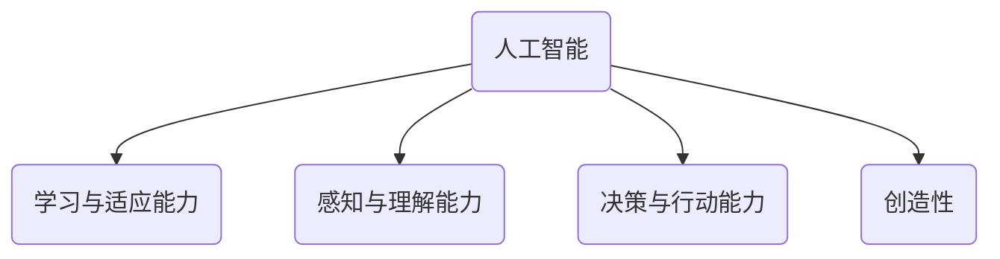
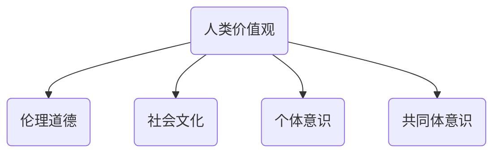
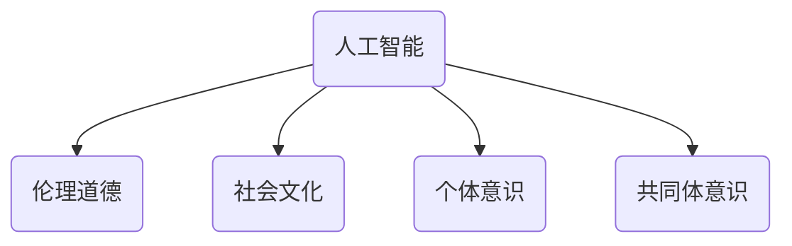

                 

# 人工智能时代的人类价值重估

> 关键词：人工智能、人类价值、道德伦理、技术与人文、就业挑战

> 摘要：随着人工智能技术的飞速发展，人类的价值面临着新的挑战。本文旨在通过深入分析人工智能对人类价值观的影响，探讨在人工智能时代如何重新评估人类的价值，实现技术与人文的和谐发展。

## 第一部分：引言与背景

### 1. 引言

在21世纪，人工智能（AI）已经成为推动技术进步和社会发展的关键力量。随着深度学习、大数据和计算能力的飞速发展，人工智能技术已经在各个领域取得了显著的成果，从语音识别、图像处理到自然语言处理，AI的应用越来越广泛。然而，随着人工智能技术的不断进步，人类社会的价值体系也面临着新的挑战。如何在这个人工智能时代重新审视和评估人类的价值观，成为了一个亟待解决的问题。

### 2. 问题描述

在人工智能时代，人类的价值面临着多重挑战：

- **技术替代**：随着自动化和机器人技术的发展，许多传统工作正被机器取代，这引发了关于人类工作地位和价值的新讨论。
- **道德伦理**：人工智能决策的透明性和公平性引发了对道德和伦理问题的担忧，例如算法偏见、隐私侵犯等问题。
- **人类角色**：人工智能的发展改变了人类在社会中的角色和地位，人们开始思考在技术主导的未来，人类的独特价值和作用将是什么。

### 3. 问题解决

本书旨在通过深入探讨人工智能对人类价值观的影响，提供一种新的视角来重新评估人类的价值。通过分析人工智能技术在不同领域的应用，探讨其对社会结构和人类生活方式的影响，本书将帮助读者理解：

- **人工智能时代的价值重构**：重新审视人类的价值，理解在技术进步的背景下，人类如何保持其独特的地位和价值。
- **技术与人文的结合**：探讨如何将人工智能与人类智慧相结合，实现技术与人文的和谐发展。

### 4. 边界与外延

本书将重点关注以下主题：

- **人工智能与就业**：分析人工智能对就业市场的影响，探讨如何适应这一变化。
- **人工智能与道德伦理**：讨论人工智能在伦理和道德方面面临的挑战，以及可能的解决方案。
- **人类角色的转变**：探讨人工智能时代人类角色的转变，以及人类如何适应新的角色和责任。

### 5. 概念结构与核心要素组成

本书的核心概念包括：

- **人工智能**：介绍人工智能的定义、发展历程和核心技术。
- **人类价值观**：探讨人类价值观的内涵、演变过程及其在人工智能时代的重要性。
- **技术伦理**：分析人工智能在道德伦理方面的问题，以及相关伦理原则。

## 1.2 核心概念与联系

### 1.2.1 人工智能

**定义**：人工智能（Artificial Intelligence, AI）是指通过计算机程序模拟人类智能行为的技术。

**属性特征对比表格**：

| 特征 | 人工智能 |
| ---- | -------- |
| **学习与适应能力** | 可以自主学习并适应新环境 |
| **感知与理解能力** | 可以感知环境并理解信息 |
| **决策与行动能力** | 可以自主做出决策并采取行动 |
| **创造性** | 具有一定的创造性，可以在特定领域提出新的解决方案 |

**ER实体关系图架构**：

### 1.2.2 人类价值观

**定义**：人类价值观是人类对于美好、公正、道德等观念的总称，是指导人类行为和决策的核心原则。

**属性特征对比表格**：

| 特征       | 人类价值观 |
| ---------- | ---------- |
| **伦理道德** | 强调道德规范和社会责任 |
| **社会文化** | 体现不同的文化传统和价值观 |
| **个体意识** | 重视个体的自由、尊严和发展 |
| **共同体意识** | 强调共同体、团队和社会的整体利益 |

**ER实体关系图架构**：

### 1.2.3 人工智能与人类价值观的联系

**关系**：人工智能与人类价值观之间存在密切联系。人工智能技术的发展和应用，不仅依赖于人类价值观的指导，同时也对人类价值观产生了深刻的影响。

**ER实体关系图架构**：

通过上述核心概念的分析，我们可以看出，人工智能与人类价值观之间存在复杂的关系。人工智能技术的发展和应用，不仅需要遵循人类的伦理道德和社会文化原则，同时也需要适应和促进人类个体意识和共同体意识的发展。在人工智能时代，重新审视和评估人类价值观，对于实现技术与人文的和谐发展具有重要的意义。

## 第二部分：人工智能对就业市场的影响

### 2.1 人工智能时代的就业挑战

随着人工智能技术的快速发展，越来越多的传统工作正被自动化和机器人技术所取代。这种趋势给就业市场带来了前所未有的挑战。以下是人工智能对就业市场的主要影响：

#### 2.1.1 工作岗位的减少

人工智能的自动化技术正在逐渐取代那些重复性高、对人类智慧和创造性要求较低的工作。例如，制造业中的流水线工人、客服人员、司机等职业正面临着被机器人取代的风险。据统计，到2030年，全球约有8亿个工作岗位可能会被自动化技术取代。

#### 2.1.2 新工作岗位的产生

虽然传统工作岗位减少，但人工智能也创造了新的工作岗位，特别是那些需要高度专业技能和创造性的岗位。例如，人工智能工程师、数据科学家、机器学习研究员等职业需求正在不断增长。

#### 2.1.3 技能要求的改变

随着人工智能技术的发展，对员工技能的要求也在发生变化。许多传统工作岗位需要员工具备新的技能，如编程、数据分析、机器学习等。这种变化要求人们不断更新和提升自己的技能，以适应新的工作环境。

### 2.2 人工智能时代的就业转型

为了应对人工智能时代的就业挑战，人们需要考虑以下转型策略：

#### 2.2.1 终身学习

在人工智能时代，终身学习成为了一项必要的能力。人们需要不断学习新的知识和技能，以保持自己的竞争力。这包括参加在线课程、参加培训、自学编程和数据分析等。

#### 2.2.2 转型教育和培训

政府和教育机构应提供更多的转型教育和培训项目，帮助那些可能被自动化技术取代的员工获得新的技能。这些项目可以包括职业技能培训、再就业培训、创业培训等。

#### 2.2.3 政策支持

政府应制定相关政策，鼓励和支持人工智能时代的就业转型。例如，提供就业转型补贴、税收减免、创业支持等政策，以减轻员工的转型负担。

### 2.3 人工智能时代的就业前景

尽管人工智能带来了就业市场的挑战，但同时也为人们提供了新的机遇。以下是对人工智能时代就业前景的展望：

#### 2.3.1 高技能岗位的崛起

随着人工智能技术的发展，对高技能人才的需求将不断增加。这些岗位包括人工智能工程师、数据科学家、机器学习研究员等。这些岗位不仅薪酬较高，而且具有广阔的职业发展空间。

#### 2.3.2 创业机会的增加

人工智能技术的普及为创业者提供了新的机会。通过结合人工智能技术，创业者可以开发出创新的产品和服务，满足市场需求。

#### 2.3.3 跨界融合

人工智能技术与传统行业的融合，将带来新的就业机会。例如，医疗领域的人工智能应用、金融领域的人工智能风险管理等。这些新兴领域需要跨学科的人才，为人们提供了更多的就业机会。

## 2.4 人工智能时代的就业转型案例分析

为了更好地理解人工智能时代就业转型的现实情况，以下是一个具体的案例分析：

### 2.4.1 案例背景

张伟是一名传统的制造业工人，工作内容主要是装配和检查产品。随着人工智能技术的发展，他的公司开始引进自动化生产线，许多传统工作岗位面临着被取代的风险。

### 2.4.2 转型过程

意识到自己的就业风险后，张伟决定进行就业转型。他首先报名参加了公司提供的转型培训项目，学习了编程和数据分析等新技能。在培训结束后，张伟成功地转型为了一名数据分析师，负责分析生产数据，为公司提供决策支持。

### 2.4.3 转型效果

通过转型，张伟不仅成功地避开了被自动化技术取代的风险，还获得了更高的薪资和更广阔的职业发展空间。他的转型经历也为其他面临类似情况的员工提供了借鉴和启示。

### 2.4.4 小结

张伟的案例表明，在人工智能时代，就业转型是应对就业挑战的有效策略。通过终身学习和政策支持，人们可以成功地实现就业转型，适应新的工作环境。

## 2.5 人工智能时代的就业转型建议

为了帮助人们更好地应对人工智能时代的就业挑战，以下是一些建议：

#### 2.5.1 提高技能水平

人们应该不断提高自己的技能水平，特别是那些与人工智能相关的技能，如编程、数据分析、机器学习等。通过掌握这些技能，人们可以更好地适应新的工作环境。

#### 2.5.2 关注行业动态

人们应该密切关注行业动态，了解哪些行业和岗位在未来具有较好的发展前景。这有助于人们做出更明智的职业规划。

#### 2.5.3 利用在线资源

人们可以利用在线资源进行学习，如参加在线课程、阅读相关书籍、参加技术论坛等。这些资源可以帮助人们更快地掌握新技能。

#### 2.5.4 保持积极心态

面对人工智能时代的就业挑战，人们应该保持积极的心态，勇于接受变化和挑战。通过积极的心态，人们可以更好地应对就业转型带来的挑战。

## 小结

人工智能时代对就业市场带来了重大影响，既带来了挑战，也提供了新的机遇。通过终身学习、政策支持和积极应对，人们可以成功地实现就业转型，适应新的工作环境。

----------------------------------------------------------------

## 第三部分：人工智能时代的道德伦理挑战

### 3.1 人工智能与隐私问题

在人工智能时代，隐私问题成为了一个备受关注的话题。随着人工智能技术的广泛应用，个人数据被大量收集、存储和分析。这些数据包括个人的行为记录、社交网络信息、医疗记录等。如果这些数据被不当使用或泄露，将对个人隐私造成严重侵犯。

#### 3.1.1 数据收集与存储

人工智能系统通常需要大量的数据来进行训练和优化。这意味着个人数据被大量收集和存储。例如，智能音箱可以记录用户的语音指令和对话内容，社交媒体平台可以收集用户的浏览记录和喜好。

#### 3.1.2 数据泄露与滥用

个人数据的泄露和滥用是隐私问题的主要担忧。近年来，多个知名公司发生了数据泄露事件，导致数百万用户的个人信息被泄露。此外，一些企业可能会滥用用户数据，进行不正当的商业活动。

#### 3.1.3 隐私保护措施

为了保护个人隐私，各国政府和企业采取了一系列隐私保护措施。例如，欧盟实施了《通用数据保护条例》（GDPR），规定了数据收集、存储和处理的规则。企业也加强了对用户数据的保护，如使用加密技术、数据去识别化等。

### 3.2 人工智能与算法偏见

算法偏见是人工智能时代的一个关键道德伦理问题。算法偏见指的是人工智能系统在决策过程中存在不公平、歧视性的倾向。这种偏见可能源于数据集中的偏见、算法设计的不当或者人为干预。

#### 3.2.1 数据偏见

算法偏见的一个主要来源是数据集的偏见。如果训练数据集中存在性别、种族、年龄等偏见，那么训练出来的模型也会表现出这些偏见。例如，一个招聘系统可能会倾向于选择与数据集中相似特征的候选人，从而造成种族和性别歧视。

#### 3.2.2 算法设计

算法设计也可能导致偏见。一些算法可能默认某些群体比其他群体更具风险或能力，从而在决策过程中表现出歧视性。例如，信用评分模型可能会对低收入人群产生负面影响，导致他们难以获得贷款。

#### 3.2.3 人为干预

除了数据偏见和算法设计，人为干预也可能导致算法偏见。一些企业或组织可能会故意设计偏见算法，以实现特定的商业目标。例如，一些招聘网站可能会设置特定的筛选条件，以排除某些特定群体。

### 3.3 人工智能时代的道德伦理责任

在人工智能时代，道德伦理责任变得尤为重要。随着人工智能技术的发展和应用，企业和开发者需要承担更多的道德责任，确保人工智能系统的公平性、透明性和安全性。

#### 3.3.1 公平性

人工智能系统的公平性是道德伦理责任的核心。系统应该避免对特定群体产生歧视性影响，确保所有人都能公平地享受人工智能带来的好处。

#### 3.3.2 透明性

人工智能系统的透明性也是道德伦理责任的一部分。开发者应该确保人工智能系统的决策过程透明，让用户了解系统的决策依据和推理过程。

#### 3.3.3 安全性

安全性是人工智能时代的另一个关键道德伦理问题。系统应该设计得足够安全，以防止被恶意利用或遭受攻击。例如，自动驾驶汽车的安全设计需要防止黑客攻击，确保行车安全。

### 3.4 道德伦理原则与监管框架

为了应对人工智能时代的道德伦理挑战，各国政府和国际组织正在制定相关的道德伦理原则和监管框架。

#### 3.4.1 道德伦理原则

道德伦理原则是指导人工智能设计和应用的基本准则。这些原则包括公平性、透明性、尊重隐私、社会责任等。例如，联合国教科文组织发布了《人工智能伦理建议》，提出了人工智能应遵循的道德原则。

#### 3.4.2 监管框架

监管框架是确保人工智能系统符合道德伦理原则的重要手段。各国政府正在制定相关法律法规，以规范人工智能的应用和发展。例如，欧盟的《通用数据保护条例》（GDPR）对个人数据的收集、存储和处理进行了详细规定。

### 3.5 道德伦理案例分析

以下是一个道德伦理案例，展示了人工智能在道德伦理方面面临的挑战：

#### 3.5.1 案例背景

一个智能监控系统被部署在一个大型购物中心，用于监控顾客的行为和购物习惯。然而，系统被发现在决策过程中存在种族偏见，对某些种族的顾客表现出歧视性。

#### 3.5.2 案例分析

这个案例揭示了人工智能在道德伦理方面的问题。系统的种族偏见可能源于数据集中的偏见或算法设计的不当。这引发了关于如何确保人工智能系统公平性的讨论。

#### 3.5.3 解决方案

为了解决这个问题，需要采取一系列措施：

- **数据清洗**：对训练数据进行清洗，去除可能的偏见。
- **算法优化**：改进算法设计，确保系统在决策过程中不会表现出偏见。
- **透明性增强**：增加系统的透明性，让用户了解系统的决策过程。

### 3.6 小结

人工智能时代的道德伦理挑战是多方面的，包括隐私问题、算法偏见、道德伦理责任等。通过制定道德伦理原则和监管框架，以及采取有效的解决方案，我们可以确保人工智能技术的公平性、透明性和安全性。

----------------------------------------------------------------

## 第四部分：人工智能时代的人类角色转变

### 4.1 人工智能时代的职业变化

随着人工智能技术的发展，人类职业正在发生深刻的变革。传统的手工操作和重复性工作逐渐被自动化技术取代，而需要高度创造性和协作能力的职业则迎来了新的发展机遇。

#### 4.1.1 人类职业的转型

人工智能技术的发展使得一些传统职业逐渐消失，例如工厂工人、客服代表、司机等。然而，同时也催生了新的职业，如数据科学家、机器学习工程师、AI伦理学家等。这些新兴职业需要人类具备更高的技能和创新能力。

#### 4.1.2 技能要求的提升

在人工智能时代，技能要求发生了显著变化。人们需要不断学习和更新知识，以适应新技术的要求。例如，编程、数据分析、机器学习和人工智能伦理等领域的知识变得越来越重要。

#### 4.1.3 职业多样性的增加

人工智能技术的普及促进了职业多样性的增加。例如，创意产业、医疗健康、教育等领域都涌现出了许多新兴职业。这些职业不仅需要技术技能，还需要人文素养和创新能力。

### 4.2 人类角色的转变

在人工智能时代，人类的角色正在从传统的劳动者转变为更加多元的角色。以下是人类角色转变的几个方面：

#### 4.2.1 创造者

人工智能技术为人类提供了更多的创造空间。人类可以通过人工智能辅助工具，创造出更多的艺术作品、设计方案和商业模型。例如，人工智能图像生成、音乐创作和编程辅助工具等，都为人类的创造力提供了新的发挥平台。

#### 4.2.2 协作者

人工智能技术在各个领域的应用使得人类与机器的协作变得更加紧密。人类需要与人工智能系统共同工作，以实现更高的效率和质量。例如，人工智能医生助手、智能客服和自动驾驶汽车等，都需要人类与机器的紧密合作。

#### 4.2.3 管理者

随着人工智能技术的广泛应用，人类需要承担更多的管理职责。这包括对人工智能系统的管理和监督，确保其符合道德伦理标准，以及优化人工智能系统的性能和效果。

#### 4.2.4 培训者和顾问

在人工智能时代，人类需要扮演培训者和顾问的角色，帮助其他人适应新技术的要求。这包括对员工进行培训，提供技术支持和咨询服务，以及帮助企业和组织制定人工智能战略。

### 4.3 人类角色的未来发展

随着人工智能技术的不断进步，人类角色的未来发展也充满了不确定性。以下是对人类角色未来发展的几个展望：

#### 4.3.1 新兴职业的涌现

人工智能技术的发展将催生更多的职业，特别是那些需要高度技能和创造力的职业。例如，人工智能伦理学家、人工智能法律顾问和人工智能咨询师等，都将成为未来的新兴职业。

#### 4.3.2 跨界融合

人工智能技术的跨界融合将推动不同行业之间的融合，创造出更多的职业机会。例如，医疗与健康、教育与娱乐、金融与科技等领域的跨界融合，将带来新的职业机会和挑战。

#### 4.3.3 技能与人文的结合

在人工智能时代，人类需要将技能与人文相结合，以实现更全面的发展。例如，技术技能与艺术创作的结合，数据分析与人文关怀的结合，都将推动人类角色的多元化发展。

#### 4.3.4 自主学习和终身学习

随着人工智能技术的发展，人类需要具备更强的自主学习能力和终身学习能力，以适应快速变化的工作环境。通过不断学习和更新知识，人类可以保持自己的竞争力，并在人工智能时代实现更好的发展。

### 4.4 小结

在人工智能时代，人类角色的转变是一个复杂而多元的过程。通过适应新技术的要求，提升自身技能和创新能力，人类可以更好地应对未来的挑战，实现自身的价值和发展。

----------------------------------------------------------------

## 第五部分：技术与人文的和谐发展

### 5.1 技术与人文的相互影响

在人工智能时代，技术与人文之间的关系变得日益紧密。两者相互影响，共同塑造着未来社会的发展。

#### 5.1.1 技术促进人文发展

人工智能技术的进步为人文领域带来了新的工具和方法。例如，人工智能在文学创作、艺术创作和学术研究中的应用，不仅提高了创作和研究的效率，也推动了人文思想的创新和发展。

#### 5.1.2 人文引导技术发展

人文价值观对技术发展具有重要的影响。在人工智能的设计和应用过程中，需要考虑伦理道德、社会文化等因素。人文的引导有助于确保技术发展符合人类的价值观和道德标准。

### 5.2 技术伦理与人文伦理的融合

技术伦理和人文伦理在人工智能时代面临着新的融合挑战。以下是一些关键点：

#### 5.2.1 伦理原则的统一

技术伦理和人文伦理需要建立统一的伦理原则，以确保人工智能技术的公平性、透明性和安全性。例如，可以借鉴伦理学的原则，如公正、尊重、自主等，来指导人工智能技术的设计和应用。

#### 5.2.2 伦理审查机制的建立

为了确保人工智能技术符合伦理标准，需要建立伦理审查机制。这包括政府监管、企业自律和公众参与等多方面。通过伦理审查，可以防止人工智能技术产生负面影响，保护人类的价值观和道德标准。

#### 5.2.3 人文与技术的互动

人文与技术的互动有助于提升人工智能技术的道德和社会价值。例如，通过人文研究，可以揭示人工智能技术在不同社会文化背景下的影响，为技术改进提供指导。

### 5.3 人文教育与技术创新

在人工智能时代，人文教育与技术创新之间的融合显得尤为重要。以下是一些关键点：

#### 5.3.1 人文教育的更新

人文教育需要适应人工智能时代的需求，更新教学内容和方法。例如，可以引入人工智能相关的课程，培养学生对人工智能技术的理解和管理能力。

#### 5.3.2 技术创新的人文视角

技术创新需要从人文视角出发，关注技术的社会影响和伦理问题。例如，在开发人工智能应用时，需要考虑其对人类价值观和社会结构的影响。

#### 5.3.3 人文与技术的跨学科研究

人文与技术的跨学科研究有助于推动技术创新和人文发展。通过跨学科合作，可以探索人工智能技术在人文领域的应用，提升技术的道德和社会价值。

### 5.4 小结

技术与人文的和谐发展是人工智能时代的关键。通过建立统一的伦理原则、建立伦理审查机制、推动人文教育与技术创新的融合，我们可以实现技术与人文的和谐发展，为未来的社会创造更美好的未来。

----------------------------------------------------------------

## 结论与展望

在人工智能时代，人类的价值面临着新的挑战和机遇。通过重新审视和评估人类的价值，我们可以在技术进步的背景下，保持自身的独特地位和价值。本文从人工智能对就业市场的影响、道德伦理挑战、人类角色转变以及技术与人文的和谐发展等方面，探讨了人工智能时代人类价值的重构。

首先，人工智能技术的发展带来了就业市场的变革，既创造了新的工作岗位，也取代了传统的工作岗位。这要求人们不断学习和提升自身技能，以适应新的就业环境。其次，人工智能时代的道德伦理挑战，如隐私问题和算法偏见，需要我们采取有效的解决方案，确保人工智能技术的公平性、透明性和安全性。此外，人工智能时代人类角色的转变，从劳动者到创造者、协作者和管理者，为人类提供了更多的机会和挑战。

最后，技术与人文的和谐发展是人工智能时代的关键。通过建立统一的伦理原则、伦理审查机制以及推动人文教育与技术创新的融合，我们可以实现技术与人文的和谐发展，为未来的社会创造更美好的未来。

未来，随着人工智能技术的进一步发展，人类的价值将面临更多的挑战和机遇。我们需要不断探索和思考，如何在技术进步的背景下，保持人类的核心价值和独特性。通过持续的努力和创新，我们可以实现技术与人文的完美融合，为人类社会的可持续发展奠定坚实基础。

---

**作者：AI天才研究院/AI Genius Institute & 禅与计算机程序设计艺术 /Zen And The Art of Computer Programming**

