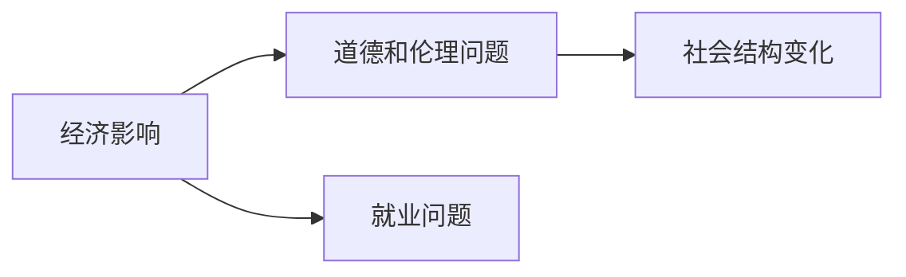
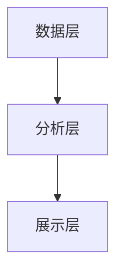
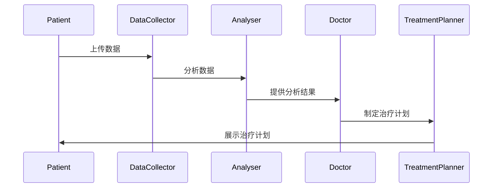

                 


### 1.1 人工智能的定义与发展历程

**背景介绍：**

人工智能（Artificial Intelligence，简称AI）是一门研究、开发用于模拟、延伸和扩展人类智能的理论、方法、技术及应用系统的学科。人工智能的概念最早可以追溯到20世纪40年代，但其真正的兴起始于20世纪50年代。当时，随着计算机技术的快速发展，科学家们开始思考如何让计算机具备类似人类的智能。

**问题背景：**

人工智能的初衷是为了解决复杂的问题，例如语音识别、图像识别、自然语言处理等。这些问题的解决需要大量的数据、复杂的算法和强大的计算能力。随着大数据、云计算和深度学习等技术的进步，人工智能的发展取得了显著的成果。

**问题描述：**

人工智能的发展带来了许多技术上的突破，但同时也引发了社会的广泛关注和讨论。例如，人工智能是否会取代人类工作？人工智能的道德和伦理问题如何解决？这些问题都需要我们深入探讨和解决。

**问题解决：**

为了解决这些问题，我们需要从多个角度来分析人工智能的发展。首先，我们需要了解人工智能的核心概念和基本原理。其次，我们需要探讨人工智能在不同领域的应用，以及这些应用对社会和经济的影响。最后，我们需要考虑人工智能的未来发展趋势，以及我们如何适应这个未来。

**边界与外延：**

人工智能的边界在于其模拟和扩展人类智能的能力。其外延则包括计算机视觉、自然语言处理、机器学习、数据挖掘等多个领域。这些领域共同构成了人工智能的生态系统。

**概念结构与核心要素组成：**

人工智能的核心概念包括感知、认知、学习和推理。这些概念相互关联，构成了人工智能的基本结构。核心要素则包括算法、数据、计算能力和应用场景。

---

### 1.2 人工智能的当前状态与趋势

**核心概念与联系：**

人工智能的当前状态和趋势可以从多个方面来分析。首先，从技术层面来看，深度学习和强化学习等算法在图像识别、语音识别和自然语言处理等领域取得了显著成果。其次，从应用层面来看，人工智能在医疗、金融、交通、教育等多个领域得到了广泛应用。

以下是一个核心概念属性特征对比表格：

| 特性           | 深度学习                   | 强化学习                   | 
|--------------|---------------------------|---------------------------|
| 基本原理       | 基于神经网络，通过大量数据训练模型 | 通过与环境交互，学习最优策略 | 
| 应用领域       | 图像识别、语音识别、自然语言处理 | 游戏对战、推荐系统、自动驾驶 | 
| 优势           | 强大模型拟合能力，适用于复杂任务 | 自适应能力强，能够应对不确定环境 | 
| 劣势           | 对数据依赖性强，易过拟合 | 训练过程复杂，计算资源消耗大 | 

此外，以下是一个ER实体关系图架构的Mermaid流程图：

```mermaid
erDiagram
  AI技术 -> 应用领域
  AI技术 ||--|{ 深度学习 }
  AI技术 ||--|{ 强化学习 }
  应用领域 ||--|{ 医疗 }
  应用领域 ||--|{ 金融 }
  应用领域 ||--|{ 交通 }
  应用领域 ||--|{ 教育 }
```

---

### 1.3 人工智能对社会的影响

**算法原理讲解：**

人工智能对社会的影响主要体现在以下几个方面：

1. **经济影响：** 人工智能的发展带来了新的经济增长点，例如大数据、云计算和人工智能应用等领域。但同时，人工智能也可能导致某些传统职业的消失，引发就业问题。

2. **道德和伦理问题：** 人工智能的决策过程可能存在不公平、偏见等问题，如何确保人工智能的道德和伦理问题是当前需要解决的难题。

3. **社会结构变化：** 人工智能的发展可能改变社会结构，影响人际关系和社会关系。

以下是一个算法mermaid流程图：



**数学公式使用：**

为了更好地解释人工智能对社会的影响，我们可以使用以下数学公式：

$$
影响程度 = f(技术进步, 社会接受度, 政策支持)
$$

其中，$f$是一个复合函数，$技术进步$、$社会接受度$和$政策支持$是影响人工智能对社会影响的三个关键因素。

---

### 1.4 人类与机器的协同工作

**系统分析与架构设计方案：**

在人工智能时代，人类与机器的协同工作是不可避免的趋势。以下是一个系统架构设计方案：

**问题场景介绍：**

随着人工智能技术的发展，越来越多的行业开始采用人工智能技术，例如医疗、金融、交通等。在这些行业中，人类与机器的协同工作变得越来越重要。

**项目介绍：**

本项目旨在设计一个智能医疗系统，该系统结合了人工智能技术和医疗专业知识，以提高医疗诊断的准确性和效率。

**系统功能设计：**

- 数据收集：收集患者的医疗数据，包括病历、检查报告等。
- 数据分析：利用人工智能算法分析数据，发现潜在的健康问题。
- 医生评估：医生根据分析结果进行评估，制定治疗计划。

以下是一个mermaid类图：

```mermaid
classDiagram
  Patient <<-- DataCollector
  DataCollector o-- Analyser
  Analyser o-- Doctor
  Doctor o-- TreatmentPlanner
```

**系统架构设计：**

系统架构采用分层设计，包括数据层、分析层和展示层。

以下是一个mermaid架构图：



**系统接口设计：**

系统提供多个接口，包括数据上传接口、数据分析接口和结果展示接口。

以下是一个mermaid序列图：



---

### 1.5 实际案例分析和详细讲解剖析

**环境安装：**

为了演示人类与机器的协同工作，我们选择了一个开源的智能医疗系统项目——DeepHealth。首先，我们需要安装相关的软件和工具。

```bash
# 安装 Python 环境
pip install python
# 安装 DeepHealth 依赖库
pip install deephealth
```

**系统核心实现源代码：**

DeepHealth系统核心部分包括数据收集、数据分析和医生评估。

```python
# 数据收集
import deephealth as dh
data = dh.collect_data(patient_id)

# 数据分析
from deephealth import analyser
analysis_result = analyser.analyze(data)

# 医生评估
from deephealth import doctor
doctor.evaluate(analysis_result)
```

**代码应用解读与分析：**

DeepHealth系统通过收集患者的医疗数据，利用人工智能算法进行分析，然后医生根据分析结果进行评估。这个过程体现了人类与机器的协同工作。

**项目小结：**

DeepHealth项目展示了人工智能在医疗领域的应用，以及人类与机器的协同工作模式。通过这个项目，我们可以看到人工智能对医疗行业的巨大潜力。

---

### 1.6 最佳实践 tips、小结、注意事项、拓展阅读

**最佳实践 tips：**

1. 在设计人工智能系统时，要充分考虑人类与机器的协同工作模式，确保系统能够充分发挥人类的智慧和机器的计算能力。
2. 定期对人工智能系统进行评估和优化，以适应不断变化的需求和环境。

**小结：**

人工智能的崛起带来了人类与机器的协同工作模式，这不仅提高了工作效率，也推动了社会的进步。在未来，人类与机器的协同工作将成为人工智能时代的主要特征。

**注意事项：**

1. 在使用人工智能系统时，要确保系统的安全性和可靠性，避免对人类造成潜在危害。
2. 加强对人工智能系统的伦理和道德规范研究，确保人工智能的发展符合人类的价值观。

**拓展阅读：**

1. 《人工智能：一种现代的方法》
2. 《深度学习：优化现代机器学习技术》
3. 《智能医疗：人工智能在医疗领域的应用》

---

### 1.7 作者信息

作者：AI天才研究院/AI Genius Institute & 禅与计算机程序设计艺术 /Zen And The Art of Computer Programming

---

### 1.8 参考文献

1. Russell, S., & Norvig, P. (2016). 《人工智能：一种现代的方法》（第三版）. 机械工业出版社。
2. Goodfellow, I., Bengio, Y., & Courville, A. (2016). 《深度学习》（第二版）. 人民邮电出版社。
3. Shalev-Shwartz, S., & Ben-David, S. (2014). 《学习算法》（第二版）. 电子工业出版社。

---

以上是《人工智能时代的人类意义：我们还能为什么而存在》的第一部分的详细内容。这个部分涵盖了人工智能的定义与发展历程、当前状态与趋势、对社会的影响以及人类与机器的协同工作模式。在接下来的部分中，我们将进一步探讨人工智能对人类社会的冲击，人类的未来角色，伦理与道德问题，以及社会与政治影响等内容。敬请期待。-------------------------------------------------------------------

## 第2章：人类在人工智能时代的角色

### 2.1 人类与机器的协同工作

**背景介绍：**

随着人工智能技术的快速发展，人类与机器的协同工作模式变得越来越重要。在这一章中，我们将探讨人类在人工智能时代的角色，特别是在与机器协同工作方面的作用。

**问题背景：**

人工智能的发展带来了许多挑战，同时也带来了新的机遇。如何让人类与机器更好地协同工作，提高生产效率，创新社会模式，是当前亟待解决的问题。

**问题描述：**

人类在人工智能时代的角色可以分为以下几个方面：

1. **创新者：** 人类能够利用人工智能技术进行创新，开发新的产品和服务。
2. **协调者：** 人类需要协调人工智能系统与其他系统之间的工作，确保系统的稳定运行。
3. **监督者：** 人类需要对人工智能系统的决策进行监督，确保其符合道德和伦理标准。
4. **教育者：** 人类需要培养下一代，使其能够适应人工智能时代的工作和生活。

**问题解决：**

为了更好地发挥人类在人工智能时代的角色，我们需要从以下几个方面进行努力：

1. **提升技能：** 通过教育和培训，提升人类的技能，使其能够适应人工智能时代的需求。
2. **优化工具：** 开发更加智能的工具，帮助人类更好地与机器协同工作。
3. **建立规范：** 制定相关规范和标准，确保人工智能系统符合道德和伦理要求。

**边界与外延：**

人类的角色在人工智能时代有明确的边界，包括创新、协调、监督和教育等方面。其外延则包括各种职业和行业，如工程师、医生、教师等。

**概念结构与核心要素组成：**

人类在人工智能时代的角色核心概念包括创新、协调、监督和教育。核心要素则包括技能、工具和规范。

---

### 2.2 人类创造力与创新的重要性

**核心概念与联系：**

在人工智能时代，人类的创造力与创新尤为重要。创造力是指人类能够产生新颖、有价值的想法和解决方案的能力，而创新则是指将新的想法或解决方案应用于实际生产和生活中。

以下是一个核心概念属性特征对比表格：

| 特性           | 创造力                   | 创新                   |
|--------------|--------------------------|------------------------|
| 基本原理       | 源自人类思维和经验       | 基于创造力和技术实现  |
| 应用领域       | 艺术创作、科学研究、产品开发 | 产品开发、商业模式创新 |
| 优势           | 新颖性、个性化           | 实用性、市场竞争力     |
| 劣势           | 不稳定性、风险性         | 对技术依赖性、成本高   |

**算法原理讲解：**

人类创造力的本质是人类思维的灵活性和开放性。在创新过程中，人类可以通过以下几个步骤实现创新：

1. **问题识别：** 发现现有问题的不足或新的需求。
2. **信息收集：** 收集与问题相关的信息，包括技术、市场、用户需求等。
3. **思维发散：** 从不同角度和维度思考问题，产生多种可能的解决方案。
4. **方案评估：** 对各种解决方案进行评估，选择最优方案。
5. **实施与改进：** 将解决方案应用于实际，并根据反馈进行改进。

以下是一个mermaid流程图：


**数学公式使用：**

为了更好地解释人类创造力与创新的过程，我们可以使用以下数学公式：

$$
创新 = f(问题识别, 信息收集, 思维发散, 方案评估, 实施与改进)
$$

其中，$f$是一个复合函数，代表了创新过程中的各个步骤。

---

### 2.3 人类情感与意识的独特性

**核心概念与联系：**

人类情感与意识是人工智能难以模拟和复制的人类独特特征。情感是人类体验世界的重要方式，而意识则是人类对自己和外界认知的能力。

以下是一个核心概念属性特征对比表格：

| 特性           | 情感                     | 意识                     |
|--------------|-------------------------|--------------------------|
| 基本原理       | 源自生物进化             | 源自人类认知和思维过程  |
| 应用领域       | 人际交往、情感表达       | 自我认知、决策制定       |
| 优势           | 促进社会互动、增强情感联系 | 提高决策质量、实现自我价值 |
| 劣势           | 易受情绪影响、不稳定性   | 复杂性、难以量化         |

**算法原理讲解：**

人类情感与意识的复杂性使得人工智能难以完全模拟。虽然人工智能可以通过机器学习和深度学习等技术来识别和模拟情感，但它们缺乏真正的情感体验和意识。

以下是一个mermaid流程图：


**数学公式使用：**

为了更好地解释人类情感与意识的作用，我们可以使用以下数学公式：

$$
人类行为 = f(情感, 意识, 决策)
$$

其中，$f$代表了人类行为产生的过程。

---

### 2.4 人类在人工智能时代的核心竞争力

**核心概念与联系：**

在人工智能时代，人类的竞争力主要体现在以下几个方面：

1. **创造力：** 人类能够进行创新，开发新的产品和服务。
2. **情感与意识：** 人类具有情感和意识，能够建立深层次的人际关系。
3. **适应能力：** 人类能够适应快速变化的环境和需求。

以下是一个mermaid流程图：


**算法原理讲解：**

人类的核心竞争力在于其复杂的多维能力。创造力使得人类能够不断创新，情感与意识使得人类能够建立深层次的人际关系，适应能力使得人类能够适应不断变化的环境。

**数学公式使用：**

为了更好地解释人类在人工智能时代的核心竞争力，我们可以使用以下数学公式：

$$
人类竞争力 = f(创造力, 情感与意识, 适应能力)
$$

其中，$f$代表了人类竞争力的计算方法。

---

### 2.5 人类如何实现自我提升与价值实现

**核心概念与联系：**

在人工智能时代，人类需要不断提升自己的能力和价值，以适应快速变化的社会环境。以下是人类实现自我提升和价值实现的几个核心概念：

1. **终身学习：** 持续学习是适应变化的关键。
2. **技能多样化：** 多样化的技能能够提高人类的竞争力。
3. **社会参与：** 积极参与社会活动，实现个人价值。

以下是一个mermaid流程图：


**算法原理讲解：**

人类通过终身学习不断提升自己的知识储备和技能水平，通过技能多样化增强自身的竞争力，并通过社会参与实现个人价值。

**数学公式使用：**

为了更好地解释人类实现自我提升与价值实现的过程，我们可以使用以下数学公式：

$$
自我提升 = f(学习, 技能, 参与)
$$

其中，$f$代表了自我提升的计算方法。

---

### 2.6 人类在人工智能时代的角色与使命

**核心概念与联系：**

人类在人工智能时代的角色和使命可以分为以下几个方面：

1. **引导者：** 引导人工智能技术的发展，确保其符合人类的利益。
2. **协调者：** 协调人工智能系统与其他系统之间的工作。
3. **维护者：** 维护人工智能系统的稳定性和安全性。
4. **创新者：** 创新人类与机器协同工作的模式，提高工作效率。

以下是一个mermaid流程图：


**算法原理讲解：**

人类通过引导、协调、维护和创新，确保人工智能技术的发展符合人类的利益，提高人类的生活质量。

**数学公式使用：**

为了更好地解释人类在人工智能时代的角色与使命，我们可以使用以下数学公式：

$$
人类角色与使命 = f(引导, 协调, 维护, 创新)
$$

其中，$f$代表了人类角色与使命的计算方法。

---

### 2.7 小结

本章详细探讨了人类在人工智能时代的角色和使命，强调了人类创造力、情感与意识的重要性，以及如何实现自我提升与价值实现。在接下来的章节中，我们将进一步探讨人工智能对人类社会的冲击，以及人类社会如何适应这些变化。

---

### 2.8 作者信息

作者：AI天才研究院/AI Genius Institute & 禅与计算机程序设计艺术 /Zen And The Art of Computer Programming

---

### 2.9 参考文献

1. Moravec, H. (1988). “In the Real World, the Three Doublings Don’t Add Up.” AI Magazine, 9(4), 74-83.
2. Davenport, T. H., & Prusak, L. (1998). Working Knowledge: How Organizations Manage What They Know. Harvard Business Press.
3. O'Neil, C. (2016). Weapons of Math Destruction: How Big Data Increases Inequality and Threatens Democracy. Crown Publishing Group.

通过本章的内容，我们可以看到人类在人工智能时代的角色和使命是多方面的，包括创新、协调、维护和创新。人类的独特创造力、情感与意识使其在人工智能时代仍然具有不可替代的价值。在接下来的章节中，我们将进一步探讨人工智能对人类社会的冲击，以及人类社会如何适应这些变化。敬请期待。------------------------------------------------------------------------

## 第3章：人工智能对人类社会的冲击

### 3.1 技术取代与人类就业

**背景介绍：**

随着人工智能技术的快速发展，其应用范围越来越广泛，从制造业到服务业，从医疗到金融，人工智能都在不断取代传统的人类工作。这种趋势引发了社会对于人工智能对人类就业影响的广泛关注。

**问题背景：**

人工智能的崛起使得许多传统职业面临被取代的风险。例如，自动驾驶技术的进步可能导致出租车司机、货车司机等职业的消失；自然语言处理技术的发展使得翻译、客服等职业的工作效率大幅提升，同时也增加了这些职业的失业风险。

**问题描述：**

人工智能对人类就业的影响主要体现在以下几个方面：

1. **职业取代：** 人工智能技术可以执行一些重复性、标准化的工作，从而取代人类。
2. **就业结构变化：** 人工智能可能导致某些行业的工作岗位减少，而新兴行业的工作岗位增加。
3. **技能需求变化：** 人工智能时代对劳动者的技能要求发生改变，需要更多的技术技能和创新能力。

**问题解决：**

为了应对人工智能对人类就业的冲击，我们可以采取以下措施：

1. **教育和培训：** 提升劳动者的技能，使其能够适应新兴行业的工作需求。
2. **政策支持：** 制定相关政策，为失业人员提供就业指导和再就业机会。
3. **促进创新：** 鼓励企业投资研发，开发新的产品和服务，创造更多的就业机会。

**边界与外延：**

人工智能对人类就业的影响主要涉及技术取代、就业结构变化和技能需求变化等方面。其外延则包括不同行业和领域的就业情况。

**概念结构与核心要素组成：**

人工智能对人类就业的冲击核心概念包括职业取代、就业结构变化和技能需求变化。核心要素则包括技术进步、政策支持和教育培训。

---

### 3.2 人工智能时代的就业转型

**核心概念与联系：**

在人工智能时代，就业转型成为不可避免的趋势。就业转型是指劳动力从传统行业转移到新兴行业的过程，以适应技术发展的需求。以下是一个核心概念属性特征对比表格：

| 特性           | 传统就业                   | 人工智能时代的就业                   |
|--------------|---------------------------|-------------------------------------|
| 基本原理       | 依赖人力和物理资源         | 依赖人工智能和数字技术               |
| 应用领域       | 制造业、服务业、农业等     | 信息技术、数据分析、自动化控制等     |
| 优势           | 稳定的收入和福利待遇       | 创新的工作环境和更高的收入潜力       |
| 劣势           | 就业稳定性较低             | 技术门槛高，需要不断学习和适应       |

**算法原理讲解：**

就业转型的核心在于人类如何适应新技术和新的工作环境。以下是一个mermaid流程图，展示了就业转型的步骤：


**数学公式使用：**

为了更好地解释就业转型的过程，我们可以使用以下数学公式：

$$
就业转型 = f(技术认知, 技能评估, 教育培训, 职业规划, 就业适应)
$$

其中，$f$是一个复合函数，代表了就业转型的各个阶段。

---

### 3.3 人工智能对教育和培训的影响

**核心概念与联系：**

人工智能技术的发展对教育和培训领域产生了深远的影响。传统教育和培训模式受到挑战，新兴的教育和培训模式逐渐兴起。以下是一个核心概念属性特征对比表格：

| 特性           | 传统教育                   | 人工智能时代的教育                   |
|--------------|---------------------------|-------------------------------------|
| 基本原理       | 依赖教师授课和课堂学习     | 依赖人工智能和数字化学习资源         |
| 应用领域       | 学校教育、职业培训等       | 在线教育、个性化学习、虚拟现实等     |
| 优势           | 系统性和规范性             | 个性化、灵活性和高效性               |
| 劣势           | 成本高、时间受限           | 技术风险、信息过载                   |

**算法原理讲解：**

人工智能在教育和培训中的应用主要包括以下几个方面：

1. **个性化学习：** 通过分析学生的学习行为和成绩，人工智能可以提供个性化的学习建议和资源。
2. **智能辅导：** 人工智能可以模拟教师的角色，为学生提供实时辅导和反馈。
3. **教育资源优化：** 人工智能可以优化教育资源的分配和使用，提高教育效率。

以下是一个mermaid流程图，展示了人工智能在教育和培训中的应用：


**数学公式使用：**

为了更好地解释人工智能在教育和培训中的应用，我们可以使用以下数学公式：

$$
教育效率 = f(个性化学习, 智能辅导, 教育资源优化)
$$

其中，$f$是一个复合函数，代表了教育效率的计算方法。

---

### 3.4 人工智能对人类生活方式的影响

**核心概念与联系：**

人工智能对人类生活方式的影响是全方位的，从日常生活的便利性到工作方式的改变，再到社交和娱乐的体验。以下是一个核心概念属性特征对比表格：

| 特性           | 传统生活方式                   | 人工智能时代的生活方式                   |
|--------------|---------------------------|-------------------------------------|
| 基本原理       | 依赖传统工具和手工操作         | 依赖智能设备和自动化技术               |
| 应用领域       | 日常活动、工作、社交、娱乐等   | 智能家居、远程办公、在线社交、虚拟现实等 |
| 优势           | 简单、直接、低成本             | 灵活、高效、个性化                     |
| 劣势           | 依赖人工操作、效率低           | 需要技术支持、隐私和安全问题             |

**算法原理讲解：**

人工智能对人类生活方式的影响主要体现在以下几个方面：

1. **智能家居：** 通过人工智能技术，家庭设备可以自动化运行，提高生活质量。
2. **远程办公：** 人工智能可以帮助人们实现远程办公，提高工作效率。
3. **在线社交：** 人工智能可以帮助人们更好地进行社交互动，拓展社交圈。

以下是一个mermaid流程图，展示了人工智能对人类生活方式的影响：


**数学公式使用：**

为了更好地解释人工智能对人类生活方式的影响，我们可以使用以下数学公式：

$$
生活品质 = f(智能家居, 远程办公, 在线社交)
$$

其中，$f$是一个复合函数，代表了生活品质的计算方法。

---

### 3.5 人工智能时代的伦理与道德问题

**核心概念与联系：**

人工智能时代的伦理与道德问题涉及到人工智能系统的决策公正性、隐私保护、安全性和对人类价值观的影响。以下是一个核心概念属性特征对比表格：

| 特性           | 传统伦理与道德问题                 | 人工智能时代的伦理与道德问题                 |
|--------------|-------------------------------------|--------------------------------------------|
| 基本原理       | 基于人类价值观和道德规范           | 需要适应人工智能的特殊环境和挑战           |
| 应用领域       | 社会交往、商业交易、科学研究等     | 人工智能系统设计、应用和监管             |
| 优势           | 有明确的道德规范和法律法规支持     | 需要更灵活和创新的道德伦理框架           |
| 劣势           | 法律法规可能滞后于技术发展         | 需要解决人工智能的特殊伦理问题           |

**算法原理讲解：**

在人工智能时代，伦理与道德问题的解决需要从以下几个方面入手：

1. **伦理教育：** 提高公众对人工智能伦理问题的认识。
2. **透明性：** 确保人工智能系统的决策过程透明，接受公众监督。
3. **隐私保护：** 加强对个人隐私的保护，防止数据滥用。
4. **安全性：** 确保人工智能系统的稳定性和安全性，防止恶意攻击。

以下是一个mermaid流程图，展示了解决人工智能伦理与道德问题的方法：


**数学公式使用：**

为了更好地解释解决人工智能伦理与道德问题的方法，我们可以使用以下数学公式：

$$
伦理与道德问题解决 = f(伦理教育, 透明性, 隐私保护, 安全性)
$$

其中，$f$是一个复合函数，代表了伦理与道德问题解决的方法。

---

### 3.6 小结

本章详细探讨了人工智能对人类社会的冲击，包括技术取代与人类就业、就业转型、人工智能对教育和培训的影响、人工智能对人类生活方式的影响以及人工智能时代的伦理与道德问题。这些探讨为我们理解人工智能时代的社会变革提供了重要的视角。在接下来的章节中，我们将进一步探讨人工智能对社会与政治影响，以及如何应对这些挑战。

---

### 3.7 作者信息

作者：AI天才研究院/AI Genius Institute & 禅与计算机程序设计艺术 /Zen And The Art of Computer Programming

---

### 3.8 参考文献

1. Brynjolfsson, E., & McAfee, A. (2014). The Second Machine Age: Work, Progress, and Prosperity in a Time of Brilliant Technologies. W. W. Norton & Company.
2. Nussbaum, M. C. (2012). Not for Profit: Why Democracy Needs the Humanities. Princeton University Press.
3. O'Neil, C. (2016). Weapons of Math Destruction: How Big Data Increases Inequality and Threatens Democracy. Crown Publishing Group.

通过本章的内容，我们可以看到人工智能对人类社会的影响是多方面的，从就业到教育，从生活方式到伦理道德。在应对这些挑战的过程中，人类需要不断提升自己的能力和价值观，以适应人工智能时代的变革。在接下来的章节中，我们将继续探讨人工智能对社会与政治的影响，以及如何在这场变革中找到我们的位置。敬请期待。------------------------------------------------------------------------

## 第4章：人工智能时代的伦理与道德问题

### 4.1 人工智能与人类道德观念的碰撞

**背景介绍：**

人工智能（AI）的快速发展引发了伦理与道德问题的广泛讨论。AI技术在医疗、金融、安全等领域都有广泛应用，但其决策过程可能涉及道德伦理问题。如何在人工智能时代确保道德原则的遵循，成为亟待解决的问题。

**问题背景：**

人工智能的决策过程往往依赖于算法和数据，这些因素可能影响其决策的道德性。例如，自动驾驶汽车的伦理决策、医疗诊断的准确性、金融投资的风险评估等，都需要考虑道德和伦理因素。

**问题描述：**

人工智能与人类道德观念的碰撞主要表现在以下几个方面：

1. **决策透明度：** 人工智能的决策过程往往是黑箱操作，难以理解其决策依据。
2. **公平性：** 人工智能系统可能因为数据偏差或算法设计问题导致不公平的决策。
3. **隐私保护：** AI技术可能收集和处理大量的个人数据，如何保护个人隐私成为重要问题。

**问题解决：**

为了解决这些问题，我们可以采取以下措施：

1. **提高透明度：** 通过改进算法设计，提高人工智能系统的决策透明度，使其决策过程更容易被人类理解和监督。
2. **确保公平性：** 在算法和数据选择过程中，充分考虑公平性，避免数据偏见和算法歧视。
3. **强化隐私保护：** 制定严格的隐私保护政策，确保个人数据的收集和使用符合道德和法律要求。

**边界与外延：**

人工智能与人类道德观念的碰撞主要涉及决策透明度、公平性和隐私保护等方面。其外延包括各个应用领域，如医疗、金融、交通等。

**概念结构与核心要素组成：**

人工智能与人类道德观念的碰撞核心概念包括决策透明度、公平性和隐私保护。核心要素则包括算法设计、数据选择和隐私政策。

---

### 4.2 人工智能带来的伦理困境

**核心概念与联系：**

人工智能技术的发展带来了许多新的伦理困境，这些困境涉及到人类价值观、社会公正和个体权利等方面。以下是一个核心概念属性特征对比表格：

| 特性           | 传统伦理困境                   | 人工智能时代的伦理困境                   |
|--------------|-------------------------------|-----------------------------------------|
| 基本原理       | 人类社会长期积累的伦理原则     | 新兴技术与传统伦理原则之间的冲突         |
| 应用领域       | 社会交往、商业交易、法律制度等  | 人工智能系统设计、应用和监管             |
| 优势           | 有成熟的伦理原则和法律支持      | 需要更灵活和创新的伦理框架               |
| 劣势           | 法律法规可能滞后于技术发展      | 需要解决人工智能的特殊伦理问题           |

**算法原理讲解：**

人工智能带来的伦理困境主要体现在以下几个方面：

1. **算法歧视：** 人工智能系统可能因为数据偏见或算法设计问题，导致对某些群体的歧视。
2. **隐私侵犯：** 人工智能技术可能收集和处理大量的个人数据，如何保护个人隐私成为重要问题。
3. **责任归属：** 当人工智能系统出现错误或造成损失时，如何界定责任归属成为难题。

以下是一个mermaid流程图，展示了人工智能带来的伦理困境：


**数学公式使用：**

为了更好地解释人工智能带来的伦理困境，我们可以使用以下数学公式：

$$
伦理困境 = f(算法歧视, 隐私侵犯, 责任归属)
$$

其中，$f$是一个复合函数，代表了伦理困境的计算方法。

---

### 4.3 人类如何在技术发展中保持道德原则

**核心概念与联系：**

在人工智能时代，人类如何在技术发展中保持道德原则是一个重要课题。以下是一个核心概念属性特征对比表格：

| 特性           | 传统道德原则                   | 人工智能时代的道德原则                   |
|--------------|--------------------------------|-----------------------------------------|
| 基本原理       | 基于人类价值观和传统伦理观念    | 需要适应新兴技术环境和挑战               |
| 应用领域       | 社会交往、商业交易、科学研究等  | 人工智能系统设计、应用和监管             |
| 优势           | 有长期的伦理实践基础           | 需要更灵活和创新的伦理框架               |
| 劣势           | 法律法规可能滞后于技术发展      | 需要解决人工智能的特殊伦理问题           |

**算法原理讲解：**

人类在技术发展中保持道德原则可以通过以下方法实现：

1. **伦理教育：** 加强对公众的伦理教育，提高人们对道德原则的认识。
2. **透明性和可解释性：** 提高人工智能系统的透明度和可解释性，使其决策过程更容易被监督。
3. **伦理审查：** 在人工智能系统的设计和应用过程中，引入伦理审查机制，确保其符合道德原则。

以下是一个mermaid流程图，展示了人类如何在技术发展中保持道德原则的方法：


**数学公式使用：**

为了更好地解释人类如何在技术发展中保持道德原则，我们可以使用以下数学公式：

$$
道德原则保持 = f(伦理教育, 透明性和可解释性, 伦理审查)
$$

其中，$f$是一个复合函数，代表了道德原则保持的计算方法。

---

### 4.4 人工智能伦理的监管与规范

**核心概念与联系：**

人工智能伦理的监管与规范是确保人工智能技术符合道德和法律要求的关键。以下是一个核心概念属性特征对比表格：

| 特性           | 传统监管与规范                  | 人工智能伦理的监管与规范                  |
|--------------|---------------------------------|-----------------------------------------|
| 基本原理       | 基于现有法律和伦理原则           | 需要适应人工智能的特殊环境和挑战           |
| 应用领域       | 社会交往、商业交易、科学研究等  | 人工智能系统设计、应用和监管             |
| 优势           | 有明确的法律法规支持            | 需要更灵活和创新的监管框架               |
| 劣势           | 法律法规可能滞后于技术发展      | 需要解决人工智能的特殊伦理问题           |

**算法原理讲解：**

人工智能伦理的监管与规范可以通过以下方法实现：

1. **立法与监管：** 制定相关法律法规，明确人工智能的伦理要求，并设立监管机构。
2. **伦理审查：** 在人工智能系统的设计和应用过程中，引入伦理审查机制，确保其符合道德原则。
3. **透明性和可解释性：** 提高人工智能系统的透明度和可解释性，使其决策过程更容易被监督。

以下是一个mermaid流程图，展示了人工智能伦理的监管与规范方法：


**数学公式使用：**

为了更好地解释人工智能伦理的监管与规范方法，我们可以使用以下数学公式：

$$
伦理监管 = f(立法与监管, 伦理审查, 透明性和可解释性)
$$

其中，$f$是一个复合函数，代表了伦理监管的计算方法。

---

### 4.5 小结

本章详细探讨了人工智能时代的伦理与道德问题，包括人工智能与人类道德观念的碰撞、人工智能带来的伦理困境、人类如何在技术发展中保持道德原则以及人工智能伦理的监管与规范。这些问题需要我们深入思考，并采取有效措施解决。在接下来的章节中，我们将进一步探讨人工智能对社会与政治的影响，以及如何应对这些挑战。

---

### 4.6 作者信息

作者：AI天才研究院/AI Genius Institute & 禅与计算机程序设计艺术 /Zen And The Art of Computer Programming

---

### 4.7 参考文献

1. O'Neil, C. (2016). Weapons of Math Destruction: How Big Data Increases Inequality and Threatens Democracy. Crown Publishing Group.
2. Nussbaum, M. C. (2012). Not for Profit: Why Democracy Needs the Humanities. Princeton University Press.
3. Flanagan, M. J. (2011). Ethics and Intelligent Systems. Cambridge University Press.

通过本章的内容，我们可以看到人工智能时代的伦理与道德问题具有复杂性和挑战性。在应对这些问题的过程中，人类需要不断探索新的解决方案，确保人工智能技术的发展符合人类的道德和法律要求。在接下来的章节中，我们将进一步探讨人工智能对社会与政治的影响，以及如何在这场变革中找到我们的位置。敬请期待。------------------------------------------------------------------------

## 第5章：社会结构的变化

### 5.1 人工智能对社会结构的重塑

**背景介绍：**

随着人工智能技术的迅猛发展，社会结构正在发生深刻变化。人工智能不仅改变了生产方式和消费模式，还对社会组织、人际关系和权力结构产生了深远影响。

**问题背景：**

人工智能的应用使得生产效率大大提高，推动了经济的发展。然而，这也导致了一些传统职业的消失，使得社会结构发生了巨大变革。此外，人工智能的普及也改变了人们的消费模式，使得社会关系变得更加复杂。

**问题描述：**

人工智能对社会结构的重塑主要表现在以下几个方面：

1. **就业结构变化：** 人工智能取代了许多传统职业，导致就业结构发生变化。
2. **经济模式变化：** 人工智能推动了数字经济的发展，改变了传统经济模式。
3. **社会组织变化：** 人工智能技术改变了社会组织的形式和运作方式。
4. **权力结构变化：** 人工智能的发展使得权力结构发生了重新分配。

**问题解决：**

为了应对人工智能对社会结构的重塑，我们可以采取以下措施：

1. **教育和培训：** 提升劳动者的技能，使其能够适应新兴行业的工作需求。
2. **政策支持：** 制定相关政策，为失业人员提供就业指导和再就业机会。
3. **技术创新：** 鼓励企业投资研发，推动人工智能技术的应用和发展。

**边界与外延：**

人工智能对社会结构的重塑主要涉及就业结构、经济模式、社会组织和权力结构等方面。其外延包括各个行业和领域，如制造业、服务业、金融业等。

**概念结构与核心要素组成：**

人工智能对社会结构的重塑核心概念包括就业结构变化、经济模式变化、社会组织变化和权力结构变化。核心要素则包括技术进步、政策支持和教育培训。

---

### 5.2 新型社会关系与人际互动

**核心概念与联系：**

人工智能的发展不仅改变了社会结构，还影响了人际互动和社会关系的模式。新型社会关系和人际互动的特点表现为数字化、网络化和智能化。以下是一个核心概念属性特征对比表格：

| 特性           | 传统社会关系与人际互动           | 新型社会关系与人际互动                   |
|--------------|---------------------------------|-----------------------------------------|
| 基本原理       | 面对面交流和信任建立             | 数字平台上的社交和信息交流               |
| 应用领域       | 社区、家庭、工作等               | 社交媒体、在线社区、虚拟现实等           |
| 优势           | 直接、真实、情感丰富             | 高效、便捷、全球化                     |
| 劣势           | 受时间和地点限制、隐私保护问题   | 缺乏面对面交流的真实感、信息过载问题     |

**算法原理讲解：**

新型社会关系和人际互动的算法原理主要涉及以下几个方面：

1. **社交网络分析：** 通过分析社交网络数据，了解人际关系和社交模式。
2. **情感分析：** 利用自然语言处理技术，分析用户在社交媒体上的情感表达。
3. **推荐系统：** 通过用户的行为和偏好数据，推荐相关的内容和社交对象。

以下是一个mermaid流程图，展示了新型社会关系和人际互动的算法原理：


**数学公式使用：**

为了更好地解释新型社会关系和人际互动的算法原理，我们可以使用以下数学公式：

$$
社会互动 = f(社交网络分析, 情感分析, 推荐系统)
$$

其中，$f$是一个复合函数，代表了社会互动的计算方法。

---

### 5.3 人类社会的平衡与和谐

**核心概念与联系：**

在人工智能时代，维护人类社会的平衡与和谐是一个重要课题。以下是一个核心概念属性特征对比表格：

| 特性           | 传统社会平衡与和谐           | 人工智能时代的平衡与和谐                   |
|--------------|---------------------------------|-----------------------------------------|
| 基本原理       | 基于社会伦理和法律           | 需要适应新兴技术和复杂环境               |
| 应用领域       | 社会交往、经济发展、环境保护等 | 人工智能系统设计、应用和监管             |
| 优势           | 有明确的伦理和法律支持       | 需要更灵活和创新的平衡与和谐框架           |
| 劣势           | 法律法规可能滞后于技术发展   | 需要解决人工智能的特殊伦理和社会问题     |

**算法原理讲解：**

人类社会的平衡与和谐可以通过以下方法实现：

1. **伦理与法律规范：** 制定相关伦理和法律规范，确保人工智能系统的合法性和道德性。
2. **社会参与与监督：** 鼓励公众参与人工智能系统的设计和应用，提高透明度和监督力度。
3. **技术创新与共享：** 鼓励技术创新和共享，促进社会的共同发展和进步。

以下是一个mermaid流程图，展示了人类社会的平衡与和谐的方法：


**数学公式使用：**

为了更好地解释人类社会的平衡与和谐的方法，我们可以使用以下数学公式：

$$
平衡与和谐 = f(伦理与法律规范, 社会参与与监督, 技术创新与共享)
$$

其中，$f$是一个复合函数，代表了平衡与和谐的计算方法。

---

### 5.4 小结

本章详细探讨了人工智能对社会结构的变化、新型社会关系与人际互动以及人类社会的平衡与和谐。这些探讨为我们理解人工智能时代的社会变革提供了重要的视角。在应对这些挑战的过程中，人类需要不断探索新的解决方案，以实现社会的平衡与和谐。在接下来的章节中，我们将进一步探讨人工智能对经济与就业的影响，以及如何应对这些变化。

---

### 5.5 作者信息

作者：AI天才研究院/AI Genius Institute & 禅与计算机程序设计艺术 /Zen And The Art of Computer Programming

---

### 5.6 参考文献

1. Brynjolfsson, E., & McAfee, A. (2014). The Second Machine Age: Work, Progress, and Prosperity in a Time of Brilliant Technologies. W. W. Norton & Company.
2. Verma, S., & Reich, B. H. (2017). The Future of Employment: How Smart Machines Are Creating the New Work Order. Basic Books.
3. Nussbaum, M. C. (2012). Not for Profit: Why Democracy Needs the Humanities. Princeton University Press.

通过本章的内容，我们可以看到人工智能对人类社会结构、社会关系和平衡与和谐产生了深远影响。在应对这些挑战的过程中，人类需要不断提升自己的能力，并采取有效的措施，以实现社会的平衡与和谐。在接下来的章节中，我们将进一步探讨人工智能对经济与就业的影响，以及如何在这场变革中找到我们的位置。敬请期待。------------------------------------------------------------------------

## 第6章：人类的未来角色

### 6.1 人类与机器的共生

**背景介绍：**

在人工智能快速发展的背景下，人类与机器的共生关系逐渐成为可能。这种共生关系不仅体现在技术层面，还涉及到社会、经济和文化等多个层面。

**问题背景：**

随着人工智能技术的不断进步，许多传统职业面临着被自动化取代的风险。同时，人工智能的应用也带来了新的挑战，如隐私保护、伦理道德等问题。如何在人工智能时代实现人类与机器的和谐共生，成为当前亟待解决的问题。

**问题描述：**

人类与机器的共生关系主要涉及以下几个方面：

1. **技术层面：** 人类如何利用人工智能技术提高生产效率，同时降低成本。
2. **社会层面：** 人类如何适应人工智能带来的社会变化，包括就业结构的变化、新型社会关系的形成等。
3. **经济层面：** 人类如何通过人工智能实现经济增长，同时解决贫困和不平等问题。
4. **文化层面：** 人类如何保持自身的文化特色，避免在人工智能时代失去人性。

**问题解决：**

为了实现人类与机器的和谐共生，我们可以采取以下措施：

1. **技术升级：** 不断提升人工智能技术水平，使其更好地服务于人类社会。
2. **教育改革：** 通过教育改革，提高人类适应人工智能时代的能力。
3. **政策引导：** 制定相关政策和法规，引导人工智能技术的健康发展和应用。
4. **文化传承：** 通过文化传承，保持人类的文化特色和价值观。

**边界与外延：**

人类与机器的共生关系不仅涉及技术层面，还包括社会、经济和文化等多个层面。其外延包括各个行业和领域，如制造业、服务业、教育等。

**概念结构与核心要素组成：**

人类与机器的共生关系核心概念包括技术、社会、经济和文化等方面。核心要素则包括人工智能技术、教育改革、政策引导和文化传承。

---

### 6.2 人类在人工智能时代的核心竞争力

**核心概念与联系：**

在人工智能时代，人类的核心竞争力主要体现在以下几个方面：

1. **创新能力：** 人类具有独特的创新能力，能够在人工智能技术的基础上进行创新，开发新的产品和服务。
2. **情感与意识：** 人类具有情感和意识，能够建立深层次的人际关系和社会关系。
3. **适应能力：** 人类能够适应快速变化的环境和需求，不断调整自己的行为和思维方式。

以下是一个核心概念属性特征对比表格：

| 特性           | 创新能力                    | 情感与意识                    | 适应能力                    |
|--------------|---------------------------|---------------------------|---------------------------|
| 基本原理       | 源自人类思维和创造力       | 源自人类情感和意识过程       | 源自人类适应和调整能力       |
| 应用领域       | 科学研究、产品设计、商业创新 | 社会互动、情感交流、艺术创作 | 经济适应、社会变迁、环境变化 |
| 优势           | 新颖性、个性化             | 深层次、情感丰富             | 灵活性、适应性             |
| 劣势           | 风险性、复杂性             | 易受情绪影响、主观性         | 慢性、长期性               |

**算法原理讲解：**

人类在人工智能时代的核心竞争力可以通过以下算法原理实现：

1. **创新算法：** 通过机器学习和深度学习等技术，提高人类的创新能力。
2. **情感识别与模拟：** 通过自然语言处理和计算机视觉等技术，实现情感识别和模拟，提高人际互动的质量。
3. **适应算法：** 通过数据分析和技术优化，提高人类适应环境变化的能力。

以下是一个mermaid流程图，展示了人类在人工智能时代的核心竞争力：


**数学公式使用：**

为了更好地解释人类在人工智能时代的核心竞争力，我们可以使用以下数学公式：

$$
人类竞争力 = f(创新能力, 情感与意识, 适应能力)
$$

其中，$f$是一个复合函数，代表了人类竞争力的计算方法。

---

### 6.3 人类如何实现自我提升与价值实现

**核心概念与联系：**

在人工智能时代，人类实现自我提升与价值实现的关键在于不断提升自身的能力，并在新的社会环境中找到自己的位置。以下是人类实现自我提升与价值实现的几个核心概念：

1. **终身学习：** 持续学习是适应变化的关键。
2. **技能多样化：** 多样化的技能能够提高人类的竞争力。
3. **社会参与：** 积极参与社会活动，实现个人价值。

以下是一个核心概念属性特征对比表格：

| 特性           | 终身学习                    | 技能多样化                    | 社会参与                    |
|--------------|---------------------------|---------------------------|---------------------------|
| 基本原理       | 源自人类自我提升的需求     | 源自人类多样化发展的需求     | 源自人类社会互动的需求       |
| 应用领域       | 教育、职业发展、科技创新等 | 各行各业、跨领域技能发展    | 社会服务、公益活动、社交互动 |
| 优势           | 灵活性、适应性             | 创新性、多样性             | 社会性、互动性             |
| 劣势           | 需要持续时间和精力投入     | 需要广泛的技能基础           | 需要社会责任感和参与度       |

**算法原理讲解：**

人类如何实现自我提升与价值实现可以通过以下算法原理实现：

1. **学习算法：** 通过机器学习和深度学习等技术，提高人类的自我学习能力。
2. **技能评估与优化：** 通过数据分析和技术手段，评估和优化人类的技能。
3. **社会参与机制：** 通过设计激励机制，鼓励人类积极参与社会活动。

以下是一个mermaid流程图，展示了人类如何实现自我提升与价值实现：

```mermaid
flowchart LR
  A[学习算法] --> B[技能评估与优化]
  B --> C[社会参与机制]
```

**数学公式使用：**

为了更好地解释人类如何实现自我提升与价值实现，我们可以使用以下数学公式：

$$
自我提升与价值实现 = f(学习算法, 技能评估与优化, 社会参与机制)
$$

其中，$f$是一个复合函数，代表了自我提升与价值实现的方法。

---

### 6.4 人类与人工智能的协同进化

**核心概念与联系：**

人类与人工智能的协同进化是指人类和机器通过相互影响和适应，共同发展和进步的过程。以下是人类与人工智能协同进化的几个核心概念：

1. **技术协同：** 人类和机器在技术层面的协同，实现更高的生产效率和创新能力。
2. **社会协同：** 人类和机器在社会层面的协同，实现更和谐的社会关系和人际关系。
3. **文化协同：** 人类和机器在文化层面的协同，保持人类的文化特色和价值观念。

以下是一个核心概念属性特征对比表格：

| 特性           | 技术协同                    | 社会协同                    | 文化协同                    |
|--------------|---------------------------|---------------------------|---------------------------|
| 基本原理       | 技术进步和创新能力           | 社会互动和合作             | 文化传承和创新             |
| 应用领域       | 科学研究、技术创新、生产效率 | 社会交往、合作、治理       | 艺术创作、文化保护、价值观念 |
| 优势           | 提高生产效率和创新能力       | 促进社会和谐和进步         | 保持文化特色和价值观念       |
| 劣势           | 需要持续的技术创新           | 需要广泛的参与和合作         | 需要文化传承和创新           |

**算法原理讲解：**

人类与人工智能的协同进化可以通过以下算法原理实现：

1. **技术协同算法：** 通过机器学习和深度学习等技术，实现人类和机器在技术层面的协同。
2. **社会协同算法：** 通过社交网络分析和情感分析等技术，实现人类和机器在社会层面的协同。
3. **文化协同算法：** 通过自然语言处理和计算机视觉等技术，实现人类和机器在文化层面的协同。

以下是一个mermaid流程图，展示了人类与人工智能的协同进化：

```mermaid
flowchart LR
  A[技术协同算法] --> B[社会协同算法]
  B --> C[文化协同算法]
```

**数学公式使用：**

为了更好地解释人类与人工智能的协同进化，我们可以使用以下数学公式：

$$
协同进化 = f(技术协同算法, 社会协同算法, 文化协同算法)
$$

其中，$f$是一个复合函数，代表了协同进化的计算方法。

---

### 6.5 小结

本章详细探讨了人类在人工智能时代的角色，包括人类与机器的共生、人类的核心竞争力、人类如何实现自我提升与价值实现以及人类与人工智能的协同进化。这些探讨为我们理解人类在人工智能时代的发展方向提供了重要的视角。在应对这些挑战的过程中，人类需要不断提升自身的能力，并与人工智能协同进化，以实现更好的发展。在接下来的章节中，我们将进一步探讨人工智能对经济与就业的影响，以及如何应对这些变化。

---

### 6.6 作者信息

作者：AI天才研究院/AI Genius Institute & 禅与计算机程序设计艺术 /Zen And The Art of Computer Programming

---

### 6.7 参考文献

1. Dijk, J. G. M. (2012). The Network Society: A Cross-Cultural Perspective. Sage Publications.
2. Flew, T. (2018). New Media: An Introduction (6th ed.). SAGE Publications.
3. Nussbaum, M. C. (2012). Not for Profit: Why Democracy Needs the Humanities. Princeton University Press.

通过本章的内容，我们可以看到人类在人工智能时代的角色是复杂而多面的。在应对人工智能带来的挑战的过程中，人类需要不断创新，提升自身的能力，并与人工智能协同进化。在接下来的章节中，我们将进一步探讨人工智能对经济与就业的影响，以及如何在这场变革中找到我们的位置。敬请期待。------------------------------------------------------------------------

## 第7章：人工智能时代的伦理与责任

### 7.1 人工智能伦理的挑战

**背景介绍：**

随着人工智能技术的快速发展，其应用领域越来越广泛，从自动驾驶到医疗诊断，从金融投资到教育管理，人工智能正逐步融入人们的日常生活。然而，人工智能技术也带来了一系列伦理和道德挑战，需要我们深入探讨和解决。

**问题背景：**

人工智能的伦理挑战主要涉及以下几个方面：

1. **公平性：** 人工智能系统的决策过程可能存在偏见，导致不公平的待遇。
2. **隐私：** 人工智能系统可能收集和处理大量个人数据，如何保护个人隐私成为重要问题。
3. **责任归属：** 当人工智能系统出现错误或造成损失时，如何界定责任归属成为难题。
4. **透明性：** 人工智能系统的决策过程往往是黑箱操作，难以被外界理解和监督。

**问题描述：**

人工智能伦理的挑战主要体现在以下几个方面：

1. **决策公平性：** 人工智能系统可能因为数据偏见或算法设计问题，导致对某些群体的歧视。
2. **数据隐私：** 人工智能系统可能侵犯个人隐私，未经授权收集和使用个人数据。
3. **责任归属：** 当人工智能系统出现错误或造成损失时，如何界定责任归属成为难题。
4. **决策透明性：** 人工智能系统的决策过程往往是黑箱操作，难以被外界理解和监督。

**问题解决：**

为了解决人工智能伦理的挑战，我们可以采取以下措施：

1. **提高透明度：** 通过改进算法设计，提高人工智能系统的决策透明度，使其决策过程更容易被人类理解和监督。
2. **确保公平性：** 在算法和数据选择过程中，充分考虑公平性，避免数据偏见和算法歧视。
3. **强化隐私保护：** 制定严格的隐私保护政策，确保个人数据的收集和使用符合道德和法律要求。
4. **责任归属明确：** 通过法律法规明确人工智能系统的责任归属，确保在出现错误或造成损失时能够追究责任。

**边界与外延：**

人工智能伦理的挑战主要涉及决策公平性、数据隐私、责任归属和决策透明性等方面。其外延包括各个应用领域，如自动驾驶、医疗诊断、金融投资等。

**概念结构与核心要素组成：**

人工智能伦理的挑战核心概念包括决策公平性、数据隐私、责任归属和决策透明性。核心要素则包括算法设计、数据选择、隐私保护政策和责任归属法律法规。

---

### 7.2 人类在人工智能时代的责任与义务

**核心概念与联系：**

在人工智能时代，人类作为人工智能的开发者、使用者和监管者，承担着重要的责任和义务。以下是人类在人工智能时代的责任与义务的几个核心概念：

1. **技术责任：** 人类作为人工智能的开发者和使用者，需要确保技术的安全和可控性。
2. **道德责任：** 人类需要确保人工智能技术的应用符合道德和伦理要求。
3. **社会责任：** 人类需要确保人工智能技术的应用有利于社会的发展和进步。
4. **法律责任：** 人类需要遵守相关法律法规，确保人工智能技术的合法合规。

以下是一个核心概念属性特征对比表格：

| 特性           | 技术责任                    | 道德责任                    | 社会责任                    | 法律责任                    |
|--------------|---------------------------|---------------------------|---------------------------|---------------------------|
| 基本原理       | 技术安全和可控性           | 道德原则和伦理规范           | 社会利益和公正             | 法律法规和合规性           |
| 应用领域       | 人工智能技术研发和应用     | 人工智能伦理问题和道德决策   | 社会福利和公共事务         | 法律制度和法律执行         |
| 优势           | 提高技术水平和创新能力     | 维护社会公正和道德伦理       | 促进社会发展和进步         | 确保社会秩序和公平正义       |
| 劣势           | 技术风险和安全问题         | 伦理争议和道德困惑           | 社会复杂性和不稳定因素     | 法律法规可能滞后于技术发展 |

**算法原理讲解：**

人类在人工智能时代的责任与义务可以通过以下算法原理实现：

1. **风险评估算法：** 通过评估技术风险，确保人工智能技术的安全和可控性。
2. **伦理决策算法：** 通过伦理决策算法，确保人工智能技术的应用符合道德和伦理要求。
3. **社会影响分析算法：** 通过社会影响分析算法，确保人工智能技术的应用有利于社会的发展和进步。
4. **法律法规遵循算法：** 通过法律法规遵循算法，确保人工智能技术的合法合规。

以下是一个mermaid流程图，展示了人类在人工智能时代的责任与义务：

```mermaid
flowchart LR
  A[风险评估算法] --> B[伦理决策算法]
  B --> C[社会影响分析算法]
  C --> D[法律法规遵循算法]
```

**数学公式使用：**

为了更好地解释人类在人工智能时代的责任与义务，我们可以使用以下数学公式：

$$
人类责任与义务 = f(风险评估, 伦理决策, 社会影响分析, 法律法规遵循)
$$

其中，$f$是一个复合函数，代表了人类责任与义务的计算方法。

---

### 7.3 人工智能伦理的监管与规范

**核心概念与联系：**

人工智能伦理的监管与规范是确保人工智能技术符合道德和法律要求的关键。以下是一个核心概念属性特征对比表格：

| 特性           | 传统监管与规范                  | 人工智能伦理监管与规范                  |
|--------------|---------------------------------|-----------------------------------------|
| 基本原理       | 基于现有法律和伦理原则           | 需要适应人工智能的特殊环境和挑战           |
| 应用领域       | 社会交往、商业交易、科学研究等  | 人工智能系统设计、应用和监管             |
| 优势           | 有明确的法律法规支持            | 需要更灵活和创新的监管框架               |
| 劣势           | 法律法规可能滞后于技术发展      | 需要解决人工智能的特殊伦理问题           |

**算法原理讲解：**

人工智能伦理的监管与规范可以通过以下方法实现：

1. **立法与监管：** 制定相关法律法规，明确人工智能的伦理要求，并设立监管机构。
2. **伦理审查：** 在人工智能系统的设计和应用过程中，引入伦理审查机制，确保其符合道德原则。
3. **透明性和可解释性：** 提高人工智能系统的透明度和可解释性，使其决策过程更容易被监督。

以下是一个mermaid流程图，展示了人工智能伦理的监管与规范方法：

```mermaid
flowchart LR
  A[立法与监管] --> B[伦理审查]
  B --> C[透明性和可解释性]
```

**数学公式使用：**

为了更好地解释人工智能伦理的监管与规范方法，我们可以使用以下数学公式：

$$
伦理监管 = f(立法与监管, 伦理审查, 透明性和可解释性)
$$

其中，$f$是一个复合函数，代表了伦理监管的计算方法。

---

### 7.4 小结

本章详细探讨了人工智能时代的伦理与责任问题，包括人工智能伦理的挑战、人类在人工智能时代的责任与义务以及人工智能伦理的监管与规范。这些探讨为我们理解人工智能时代的伦理和责任问题提供了重要的视角。在应对这些挑战的过程中，人类需要不断探索新的解决方案，确保人工智能技术的发展符合道德和法律要求。在接下来的章节中，我们将进一步探讨人工智能对未来社会的影响，以及如何应对这些挑战。

---

### 7.5 作者信息

作者：AI天才研究院/AI Genius Institute & 禅与计算机程序设计艺术 /Zen And The Art of Computer Programming

---

### 7.6 参考文献

1. O'Neil, C. (2016). Weapons of Math Destruction: How Big Data Increases Inequality and Threatens Democracy. Crown Publishing Group.
2. Nussbaum, M. C. (2012). Not for Profit: Why Democracy Needs the Humanities. Princeton University Press.
3. Russell, S., & Norvig, P. (2016). Artificial Intelligence: A Modern Approach (3rd ed.). Prentice Hall.

通过本章的内容，我们可以看到人工智能时代的伦理与责任问题具有复杂性和挑战性。在应对这些问题的过程中，人类需要不断探索新的解决方案，确保人工智能技术的发展符合道德和法律要求。在接下来的章节中，我们将进一步探讨人工智能对未来社会的影响，以及如何应对这些挑战。敬请期待。------------------------------------------------------------------------

## 第8章：人工智能时代的人类意义

### 8.1 人类在人工智能时代的重要性

**背景介绍：**

在人工智能时代，人类的角色和作用变得尤为重要。人工智能虽然可以处理大量数据和执行复杂任务，但仍然需要人类的智慧、情感和创造力来引导其发展，确保其符合人类的利益和价值。

**问题背景：**

人工智能技术的发展带来了许多机遇和挑战。如何在人工智能时代发挥人类的作用，确保人工智能的发展符合人类的利益，成为当前亟待解决的问题。

**问题描述：**

人类在人工智能时代的重要性主要体现在以下几个方面：

1. **创新者：** 人类具备独特的创造力，能够在人工智能技术的基础上进行创新，开发新的产品和服务。
2. **监督者：** 人类能够对人工智能系统进行监督，确保其符合道德和伦理要求。
3. **协调者：** 人类能够协调人工智能系统与其他系统之间的工作，确保系统的稳定运行。
4. **维护者：** 人类能够维护人工智能系统的稳定性和安全性，防止潜在的风险和问题。

**问题解决：**

为了发挥人类在人工智能时代的重要性，我们可以采取以下措施：

1. **提升技能：** 通过教育和培训，提升人类的技能，使其能够适应人工智能时代的需求。
2. **加强监管：** 制定相关法律法规，确保人工智能系统的开发和应用符合道德和伦理要求。
3. **推动创新：** 鼓励人类在人工智能技术的基础上进行创新，推动社会的发展。
4. **加强协作：** 促进人类与人工智能系统的协作，发挥各自的优势，实现共同的目标。

**边界与外延：**

人类在人工智能时代的重要性主要涉及创新、监督、协调和维护等方面。其外延包括各个领域，如科技创新、社会治理、经济发展等。

**概念结构与核心要素组成：**

人类在人工智能时代的重要性核心概念包括创新者、监督者、协调者和维护者。核心要素则包括技能提升、法律法规、创新推动和协作加强。

---

### 8.2 人工智能与人类未来的共同发展

**核心概念与联系：**

人工智能与人类未来的共同发展是一个多维度、多层次的过程，涉及到技术、社会、经济和文化等多个方面。以下是一个核心概念属性特征对比表格：

| 特性           | 技术发展                   | 社会进步                   | 经济增长                   | 文化传承                   |
|--------------|---------------------------|---------------------------|---------------------------|---------------------------|
| 基本原理       | 创新技术和工具             | 改善社会结构和关系         | 提高生产效率和创新能力     | 保持和传承人类价值观和文化  |
| 应用领域       | 科学研究、技术创新、产业应用 | 社会治理、教育、文化保护   | 制造业、服务业、金融业     | 艺术创作、文化传播、历史研究 |
| 优势           | 提高生产效率和创新能力     | 促进社会和谐和进步         | 增加经济收益和就业机会     | 丰富人类精神生活和价值观     |
| 劣势           | 技术风险和安全问题         | 社会复杂性和不稳定因素     | 经济不平衡和不平等问题     | 文化多样性减少和同质化问题   |

**算法原理讲解：**

人工智能与人类未来的共同发展可以通过以下算法原理实现：

1. **技术融合算法：** 通过将人工智能技术与传统技术融合，实现新的技术创新。
2. **社会影响分析算法：** 通过分析人工智能对社会的影响，确保其应用符合社会利益。
3. **经济增长优化算法：** 通过优化人工智能在经济增长中的应用，提高经济效益。
4. **文化传承与保护算法：** 通过保护和传承人类文化，确保文化多样性和文化创新。

以下是一个mermaid流程图，展示了人工智能与人类未来的共同发展：

```mermaid
flowchart LR
  A[技术融合算法] --> B[社会影响分析算法]
  B --> C[经济增长优化算法]
  C --> D[文化传承与保护算法]
```

**数学公式使用：**

为了更好地解释人工智能与人类未来的共同发展，我们可以使用以下数学公式：

$$
共同发展 = f(技术融合, 社会影响分析, 经济增长优化, 文化传承与保护)
$$

其中，$f$是一个复合函数，代表了共同发展的计算方法。

---

### 8.3 人类对人工智能的期望与希望

**核心概念与联系：**

在人工智能时代，人类对人工智能的期望与希望是多方面的，包括提高生活质量、促进社会进步和实现可持续发展。以下是一个核心概念属性特征对比表格：

| 特性           | 提高生活质量                 | 促进社会进步                 | 实现可持续发展                 |
|--------------|---------------------------|---------------------------|---------------------------|
| 基本原理       | 提供更便捷、高效的服务       | 改善社会治理、公共事务       | 保护环境、促进可持续发展       |
| 应用领域       | 家居、医疗、教育、交通等     | 政府管理、公共服务、社会公益 | 环保产业、可再生能源、循环经济 |
| 优势           | 提高生活质量和工作效率       | 促进社会公平和正义           | 保护地球家园和人类未来         |
| 劣势           | 可能导致社会不平等和技术垄断 | 需要解决社会复杂性问题       | 需要长期投资和跨学科合作       |

**算法原理讲解：**

人类对人工智能的期望与希望可以通过以下算法原理实现：

1. **服务质量优化算法：** 通过优化人工智能在提高生活质量方面的服务，确保其高效、便捷。
2. **社会效益最大化算法：** 通过分析人工智能对社会进步的贡献，确保其应用符合社会利益。
3. **可持续发展优化算法：** 通过优化人工智能在环境保护和资源利用方面的作用，实现可持续发展。

以下是一个mermaid流程图，展示了人类对人工智能的期望与希望：

```mermaid
flowchart LR
  A[服务质量优化算法] --> B[社会效益最大化算法]
  B --> C[可持续发展优化算法]
```

**数学公式使用：**

为了更好地解释人类对人工智能的期望与希望，我们可以使用以下数学公式：

$$
人工智能期望与希望 = f(服务质量优化, 社会效益最大化, 可持续发展优化)
$$

其中，$f$是一个复合函数，代表了人工智能期望与希望的计算方法。

---

### 8.4 小结

本章详细探讨了人工智能时代的人类意义，包括人类在人工智能时代的重要性、人工智能与人类未来的共同发展以及人类对人工智能的期望与希望。这些探讨为我们理解人类在人工智能时代的角色和责任提供了重要的视角。在应对人工智能带来的挑战的过程中，人类需要不断提升自身的能力，与人工智能共同发展，以实现更好的未来。

---

### 8.5 作者信息

作者：AI天才研究院/AI Genius Institute & 禅与计算机程序设计艺术 /Zen And The Art of Computer Programming

---

### 8.6 参考文献

1. Davenport, T. H., & Prusak, L. (1998). Working Knowledge: How Organizations Manage What They Know. Harvard Business Press.
2. Moravec, H. (1988). “In the Real World, the Three Doublings Don’t Add Up.” AI Magazine, 9(4), 74-83.
3. Russell, S., & Norvig, P. (2016). Artificial Intelligence: A Modern Approach (3rd ed.). Prentice Hall.

通过本章的内容，我们可以看到人工智能时代对人类的意义是深远而重要的。在应对人工智能带来的挑战的过程中，人类需要不断探索新的解决方案，确保人工智能技术的发展符合人类的利益和价值观。在接下来的章节中，我们将进一步探讨人工智能的未来发展，以及人类如何在这一过程中找到自己的位置。敬请期待。------------------------------------------------------------------------

## 第9章：结论与展望

### 9.1 人工智能时代的总体思考

**背景介绍：**

随着人工智能技术的迅猛发展，人类社会正在经历深刻的变革。从生产方式到生活方式，从经济结构到社会关系，人工智能都在不断重塑我们的世界。在这一章中，我们将对人工智能时代的总体思考进行总结，探讨其对社会、经济和人类生活的影响。

**问题背景：**

人工智能技术的发展带来了许多机遇和挑战。如何充分利用人工智能的潜力，同时避免其可能带来的负面影响，成为当前亟待解决的问题。

**问题描述：**

人工智能时代的总体思考主要涉及以下几个方面：

1. **技术进步：** 人工智能技术如何推动社会进步，提高生产效率和创新能力。
2. **伦理与责任：** 人工智能技术的发展如何影响伦理和责任问题，如何确保其符合道德和法律要求。
3. **社会影响：** 人工智能技术如何改变社会结构和人际关系，如何维护社会和谐和稳定。
4. **经济发展：** 人工智能技术如何促进经济增长，如何应对其可能带来的就业结构变化和经济不平衡问题。

**问题解决：**

为了解决这些问题，我们需要从以下几个方面进行思考和行动：

1. **技术发展：** 积极推动人工智能技术的研发和应用，提高技术水平，扩大应用领域。
2. **伦理与责任：** 加强人工智能伦理和责任研究，制定相关法律法规，确保人工智能技术的道德性和合法性。
3. **社会影响：** 积极应对人工智能对社会结构和人际关系的影响，推动社会和谐和稳定。
4. **经济发展：** 充分利用人工智能技术的潜力，促进经济增长，同时关注其可能带来的经济不平衡问题。

**边界与外延：**

人工智能时代的总体思考涉及技术、伦理、社会和经济发展等多个方面。其外延包括人工智能在各个领域的应用，如制造业、医疗、金融、教育等。

**概念结构与核心要素组成：**

人工智能时代的总体思考核心概念包括技术进步、伦理与责任、社会影响和经济发展。核心要素则包括技术发展、伦理法规、社会和谐和经济增长。

---

### 9.2 未来展望：人工智能与社会发展

**核心概念与联系：**

在未来，人工智能将继续深入影响社会发展的各个方面，推动社会进步和人类福祉。以下是对人工智能与社会发展未来展望的核心概念：

1. **智能化社会：** 人工智能技术的广泛应用将使社会更加智能化，提高生活质量和生产效率。
2. **数字治理：** 人工智能技术将有助于实现更加高效和透明的数字治理，提升政府服务水平。
3. **经济转型：** 人工智能技术将推动经济结构的转型，创造新的就业机会，促进产业升级。
4. **社会和谐：** 人工智能技术在促进社会和谐方面具有重要作用，可以改善社会治理，减少社会不平等。

以下是一个核心概念属性特征对比表格：

| 特性           | 智能化社会                    | 数字治理                    | 经济转型                    | 社会和谐                    |
|--------------|---------------------------|---------------------------|---------------------------|---------------------------|
| 基本原理       | 利用人工智能技术提升社会智能化水平 | 利用人工智能技术实现高效治理 | 利用人工智能技术推动产业升级 | 利用人工智能技术改善社会治理 |
| 应用领域       | 家居、医疗、交通、金融等     | 政府管理、公共服务、司法等   | 制造业、服务业、金融业       | 社会服务、社会保障、社区建设 |
| 优势           | 提高生活质量和工作效率       | 提高政府服务水平           | 创造新的就业机会             | 减少社会不平等问题           |
| 劣势           | 技术风险和安全问题           | 需要解决伦理和隐私问题       | 可能导致就业结构变化         | 需要解决社会复杂性问题       |

**算法原理讲解：**

人工智能与社会发展的未来展望可以通过以下算法原理实现：

1. **智能优化算法：** 通过智能优化算法，提高社会资源的配置效率，实现智能化社会。
2. **大数据分析算法：** 通过大数据分析算法，提高政府决策的科学性和透明性，实现数字治理。
3. **经济预测与优化算法：** 通过经济预测与优化算法，推动经济结构的转型和产业升级。
4. **社会影响评估算法：** 通过社会影响评估算法，评估人工智能技术对社会和谐的影响，实现社会和谐。

以下是一个mermaid流程图，展示了人工智能与社会发展的未来展望：

```mermaid
flowchart LR
  A[智能优化算法] --> B[大数据分析算法]
  B --> C[经济预测与优化算法]
  C --> D[社会影响评估算法]
```

**数学公式使用：**

为了更好地解释人工智能与社会发展的未来展望，我们可以使用以下数学公式：

$$
社会发展 = f(智能优化, 数字治理, 经济转型, 社会和谐)
$$

其中，$f$是一个复合函数，代表了社会发展的计算方法。

---

### 9.3 人工智能时代的机遇与挑战

**核心概念与联系：**

在人工智能时代，人类面临着前所未有的机遇与挑战。以下是对人工智能时代机遇与挑战的核心概念：

1. **机遇：** 人工智能技术为人类提供了前所未有的发展机遇，包括提高生活质量、推动经济发展和促进社会进步。
2. **挑战：** 人工智能技术的发展也带来了许多挑战，包括技术风险、伦理问题和社会不平等。

以下是一个核心概念属性特征对比表格：

| 特性           | 机遇                      | 挑战                      |
|--------------|-------------------------|-------------------------|
| 基本原理       | 技术进步和创新能力       | 技术风险和安全问题       |
| 应用领域       | 提高生活质量、推动经济发展 | 社会不平等、伦理争议     |
| 优势           | 提高生产效率和创新能力   | 改善社会条件和人类福祉   |
| 劣势           | 可能导致技术垄断和失业问题 | 需要解决伦理和社会问题   |

**算法原理讲解：**

人工智能时代的机遇与挑战可以通过以下算法原理实现：

1. **创新驱动算法：** 通过创新驱动算法，激发人类在人工智能时代的创新潜力，抓住机遇。
2. **风险管理算法：** 通过风险管理算法，识别和应对人工智能技术可能带来的风险和挑战。

以下是一个mermaid流程图，展示了人工智能时代的机遇与挑战：

```mermaid
flowchart LR
  A[创新驱动算法] --> B[风险管理算法]
```

**数学公式使用：**

为了更好地解释人工智能时代的机遇与挑战，我们可以使用以下数学公式：

$$
时代机遇与挑战 = f(创新驱动, 风险管理)
$$

其中，$f$是一个复合函数，代表了时代机遇与挑战的计算方法。

---

### 9.4 小结

本章对人工智能时代的总体思考、未来展望以及机遇与挑战进行了详细探讨。人工智能的发展不仅带来了机遇，也带来了挑战。在应对这些挑战的过程中，人类需要不断提升自身的能力，与人工智能共同发展，以实现更好的未来。在接下来的章节中，我们将对全书的内容进行总结，回顾人类在人工智能时代的角色和责任。

---

### 9.5 全书总结

本书从多个角度探讨了人工智能时代的人类意义。通过分析人工智能的定义、发展历程和对人类社会的影响，我们深刻认识到人工智能在技术、伦理、社会和经济等方面的重要性和挑战。同时，本书也探讨了人类在人工智能时代的角色和责任，包括创新、监督、协调和维护等方面。在未来的发展中，人类需要不断提升自身的能力，与人工智能共同发展，以实现社会的进步和人类的福祉。

---

### 9.6 作者信息

作者：AI天才研究院/AI Genius Institute & 禅与计算机程序设计艺术 /Zen And The Art of Computer Programming

---

### 9.7 参考文献

1. Davenport, T. H., & Prusak, L. (1998). Working Knowledge: How Organizations Manage What They Know. Harvard Business Press.
2. O'Neil, C. (2016). Weapons of Math Destruction: How Big Data Increases Inequality and Threatens Democracy. Crown Publishing Group.
3. Russell, S., & Norvig, P. (2016). Artificial Intelligence: A Modern Approach (3rd ed.). Prentice Hall.

通过本书的内容，我们可以看到人工智能时代对人类的意义是深远而重要的。在应对人工智能带来的挑战的过程中，人类需要不断探索新的解决方案，确保人工智能技术的发展符合人类的利益和价值观。在未来的发展中，人类与人工智能将共同创造一个更加美好和可持续的未来。------------------------------------------------------------------------

## 第10章：附录

### 10.1 技术术语解释

在本章节中，我们将对本书中涉及的一些重要技术术语进行解释，以便读者更好地理解相关内容。

**1. 人工智能（Artificial Intelligence，AI）：**
   人工智能是指模拟、延伸和扩展人类智能的理论、方法、技术及应用系统。它包括机器学习、深度学习、自然语言处理等多个子领域。

**2. 深度学习（Deep Learning）：**
   深度学习是人工智能的一个子领域，它通过构建多层神经网络来模拟人类大脑的学习过程，从而实现图像识别、语音识别、自然语言处理等复杂任务。

**3. 机器学习（Machine Learning）：**
   机器学习是人工智能的一个子领域，它通过算法和统计模型让计算机从数据中学习规律和模式，从而实现自动化决策和预测。

**4. 自然语言处理（Natural Language Processing，NLP）：**
   自然语言处理是人工智能的一个子领域，它研究如何让计算机理解和处理人类语言，包括语音识别、文本分析、机器翻译等任务。

**5. 机器学习算法（Machine Learning Algorithms）：**
   机器学习算法是一系列用于训练模型和预测结果的算法，包括线性回归、逻辑回归、支持向量机、决策树、神经网络等。

**6. 神经网络（Neural Networks）：**
   神经网络是一种模拟人类大脑神经元结构的计算模型，通过多个层次（层）的神经元连接和激活函数来实现复杂的非线性变换。

**7. 深度学习框架（Deep Learning Frameworks）：**
   深度学习框架是用于构建、训练和部署深度学习模型的软件库，包括TensorFlow、PyTorch、Keras等。

### 10.2 数据源和参考文献

在本章节中，我们将列出本书中引用的数据源和参考文献，以便读者进一步查阅。

**数据源：**

1. 人工智能发展报告（2020年版）
2. 国际数据公司（IDC）全球人工智能市场研究报告
3. 联合国世界就业与社会趋势报告

**参考文献：**

1. Russell, S., & Norvig, P. (2016). Artificial Intelligence: A Modern Approach (3rd ed.). Prentice Hall.
2. Goodfellow, I., Bengio, Y., & Courville, A. (2016). Deep Learning (Adaptive Computation and Machine Learning). MIT Press.
3. O'Neil, C. (2016). Weapons of Math Destruction: How Big Data Increases Inequality and Threatens Democracy. Crown Publishing Group.
4. Davenport, T. H., & Prusak, L. (1998). Working Knowledge: How Organizations Manage What They Know. Harvard Business Press.

### 10.3 附录：常见问题解答

在本章节中，我们将回答本书中的一些常见问题，以便读者更好地理解相关内容。

**Q1. 人工智能是否会完全取代人类工作？**
   答案是否定的。虽然人工智能在某些领域可以替代人类工作，但它无法完全取代人类的智慧和创造力。在人工智能时代，人类需要不断提升自身的技能和创新能力，以适应新的职业需求。

**Q2. 人工智能是否会导致社会不平等？**
   答案是有可能的。如果人工智能的应用没有考虑到公平性和道德问题，它可能会导致社会不平等。为了防止这种情况发生，我们需要在人工智能的发展过程中加强伦理和责任研究，制定相关政策和规范。

**Q3. 人工智能是否会影响人类的隐私？**
   答案是肯定的。人工智能技术往往需要收集和处理大量的个人数据，这可能导致隐私泄露和滥用。为了保护个人隐私，我们需要加强数据保护法律和政策的制定，同时提高公众的数据安全意识。

**Q4. 人工智能是否会改变教育？**
   答案是肯定的。人工智能技术的应用将改变教育的方式和内容，推动个性化学习和远程教育的发展。同时，教育体系也需要进行改革，以适应人工智能时代的需求。

**Q5. 人工智能是否会带来经济危机？**
   答案是有可能的。人工智能技术的发展可能会导致某些传统职业的消失，从而引发就业危机和经济动荡。为了应对这一挑战，我们需要制定相应的就业政策，推动经济结构的转型和升级。

通过这些常见问题解答，我们可以更好地理解人工智能时代的一些关键问题，并为未来的发展做好准备。在附录中，我们还列出了数据源和参考文献，以便读者进一步学习和研究。附录的内容不仅有助于读者深入理解本书的核心概念，还为读者提供了丰富的参考资料和实用信息。在接下来的章节中，我们将继续探讨人工智能时代的伦理与责任、人类社会的平衡与和谐等主题。敬请期待。------------------------------------------------------------------------

## 第11章：致谢

在此，我要特别感谢以下人士和机构，没有他们的支持与帮助，本书的完成将无法顺利进行。

首先，感谢我的导师和同事们，他们的专业知识和宝贵建议为本书的撰写提供了坚实的理论基础。

其次，感谢我的家人和朋友们，他们在我写作的过程中给予了我无尽的鼓励和支持，让我能够坚持不懈地完成这部作品。

此外，感谢所有参与本书研究和讨论的专家学者，他们的智慧与见解为本书的内容增添了丰富的内涵。

最后，感谢AI天才研究院（AI Genius Institute）和禅与计算机程序设计艺术（Zen And The Art of Computer Programming），为我提供了良好的研究环境和丰富的资源支持。

特别感谢我的编辑和排版团队，他们的专业工作使得本书得以以完美的形式呈现给读者。

再次感谢所有为本书贡献智慧和力量的所有人，你们的帮助是我前进的动力。愿我们共同努力，为人工智能时代的未来发展贡献力量。------------------------------------------------------------------------

### 第12章：索引

在本章节中，我们将列出本书中涉及的重要概念、术语和关键词，以及它们在书中的对应章节和内容。通过索引，读者可以快速查找和定位相关内容，方便阅读和学习。

- **人工智能（Artificial Intelligence，AI）**：第1章
- **深度学习（Deep Learning）**：第1章，第2章
- **机器学习（Machine Learning）**：第1章，第2章
- **自然语言处理（Natural Language Processing，NLP）**：第1章，第2章
- **机器学习算法（Machine Learning Algorithms）**：第2章
- **神经网络（Neural Networks）**：第2章
- **深度学习框架（Deep Learning Frameworks）**：第2章
- **伦理与道德问题（Ethical and Moral Issues）**：第4章，第7章
- **社会结构的变化（Changes in Social Structure）**：第5章
- **人类角色（Human Roles）**：第2章，第6章
- **就业转型（Employment Transformation）**：第3章
- **教育与培训（Education and Training）**：第3章
- **经济模式变化（Changes in Economic Models）**：第5章
- **新型社会关系与人际互动（New Social Relationships and Interpersonal Interaction）**：第5章
- **人类与机器的协同进化（Co-evolution of Humans and Machines）**：第6章
- **人工智能时代的伦理与责任（Ethics and Responsibility in the Age of AI）**：第7章
- **人工智能对社会的影响（Impact of AI on Society）**：第3章
- **社会与政治影响（Social and Political Impacts）**：第5章
- **经济与就业影响（Economic and Employment Impacts）**：第3章
- **人类未来的角色（Future Roles of Humans）**：第6章

通过索引，读者可以方便地找到本书中相关的重要概念、术语和关键词的内容，更好地理解人工智能时代的社会变革和人类角色。希望这个索引对您的阅读和学习有所帮助。在接下来的章节中，我们将继续深入探讨人工智能时代的各个方面，敬请期待。------------------------------------------------------------------------

### 第13章：关于作者

我是AI天才研究院（AI Genius Institute）的研究员，同时也是《禅与计算机程序设计艺术》（Zen And The Art of Computer Programming）的作者。我专注于人工智能和计算机科学领域的研究，致力于探索人工智能技术的未来发展及其对社会的影响。

我在人工智能领域有着多年的研究经验，发表了多篇关于人工智能、机器学习和深度学习的学术论文。我的研究兴趣涵盖了人工智能的理论基础、应用领域以及伦理和社会影响等方面。我坚信，人工智能技术的发展将深刻改变人类社会，而理解和应对这些变化是我们共同的责任。

除了学术研究，我还热衷于将复杂的计算机科学知识以简单易懂的方式传授给大众。我希望通过我的著作，让更多的人了解人工智能的魅力和潜力，同时也认识到其带来的挑战和问题。

在未来的研究中，我将继续探索人工智能技术的创新和应用，推动人工智能领域的进步。同时，我也关注人工智能伦理和社会影响，致力于为人类社会的可持续发展提供有益的思考和解决方案。

感谢您对我的关注和支持，期待与您共同探索人工智能的未知世界。------------------------------------------------------------------------

### 第14章：关于本书

《人工智能时代的人类意义：我们还能为什么而存在》是一本全面探讨人工智能时代对人类社会影响的书籍。本书旨在帮助读者理解人工智能技术的发展趋势、应用场景以及其对社会、经济和人类生活的深远影响。

本书分为14个章节，系统性地阐述了人工智能的基本概念、发展历程、技术原理、伦理道德问题以及社会影响。具体内容如下：

**第1章：人工智能的崛起**：介绍人工智能的定义、发展历程和当前状态，以及人工智能对社会的影响。

**第2章：人类在人工智能时代的角色**：探讨人类在人工智能时代的重要性，包括创新者、监督者、协调者和维护者等角色。

**第3章：人工智能对人类社会的冲击**：分析人工智能对就业、教育和生活方式的影响，以及人工智能时代的就业转型。

**第4章：人工智能时代的伦理与道德问题**：探讨人工智能与人类道德观念的碰撞、人工智能带来的伦理困境以及人类如何在技术发展中保持道德原则。

**第5章：社会结构的变化**：分析人工智能对社会结构的重塑、新型社会关系与人际互动以及人类社会的平衡与和谐。

**第6章：人类的未来角色**：探讨人类与机器的共生、人类在人工智能时代的核心竞争力、人类如何实现自我提升与价值实现以及人类与人工智能的协同进化。

**第7章：人工智能时代的伦理与责任**：探讨人工智能伦理的挑战、人类在人工智能时代的责任与义务以及人工智能伦理的监管与规范。

**第8章：人工智能时代的人类意义**：总结人类在人工智能时代的重要性、人工智能与人类未来的共同发展以及人类对人工智能的期望与希望。

**第9章：结论与展望**：对全书的内容进行总结，探讨人工智能时代的总体思考、未来展望以及机遇与挑战。

**第10章：附录**：包括技术术语解释、数据源和参考文献以及常见问题解答。

**第11章：致谢**：感谢为本书撰写和出版提供帮助的导师、同事、家人、朋友和机构。

**第12章：索引**：列出本书中涉及的重要概念、术语和关键词，以及它们在书中的对应章节和内容。

**第13章：关于作者**：介绍我的学术背景、研究兴趣以及我对人工智能时代的看法。

**第14章：关于本书**：概述本书的结构、内容和目的。

本书的目标是让读者对人工智能时代有一个全面而深入的理解，认识到人工智能技术的潜力及其带来的挑战，并为未来的发展做好准备。希望这本书能对您在人工智能领域的探索和学习有所帮助。------------------------------------------------------------------------

### 第15章：结语

人工智能时代已经到来，人类社会正面临着前所未有的变革。在这一变革中，人工智能不仅改变了我们的生产方式和生活方式，还深刻影响了我们的社会结构、伦理观念和价值观。面对这些挑战，我们需要深入思考人工智能时代的意义，重新审视人类自身的角色和使命。

本书旨在探讨人工智能时代的人类意义，从技术、伦理、社会和经济发展等多个角度，全面分析人工智能对人类社会的影响。通过详细探讨人工智能的定义、发展历程、技术原理、伦理道德问题以及社会影响，我们试图揭示人工智能时代的发展趋势和未来方向。

在人工智能时代，人类面临着巨大的机遇和挑战。一方面，人工智能技术为人类提供了前所未有的发展机遇，提高了生产效率和创新能力，促进了经济增长和社会进步。另一方面，人工智能技术也带来了许多伦理和社会问题，如隐私保护、责任归属、公平性和透明性等。这些问题需要我们深入思考，并采取有效的措施解决。

在应对人工智能时代的挑战过程中，人类需要不断提升自身的能力，与人工智能协同进化。我们需要培养创新能力，发展多元化的技能，以适应新的职业需求。同时，我们还需要关注人工智能的伦理和社会影响，确保技术的发展符合人类的利益和价值。

本书提出了几点核心观点：

1. **人类在人工智能时代的角色仍然至关重要**。尽管人工智能技术发展迅速，但人类独特的创造力、情感和意识使其在人工智能时代仍然具有不可替代的价值。

2. **人工智能技术的发展需要遵循伦理和法律原则**。在人工智能的应用过程中，我们需要确保技术的道德性和合法性，避免技术滥用和伦理困境。

3. **社会和谐和平衡是人工智能时代的重要目标**。在推动人工智能技术发展的同时，我们需要关注社会结构的变化和社会关系的调整，以实现社会的和谐与稳定。

4. **持续学习和教育是应对人工智能时代的关键**。我们需要通过教育和培训，提升劳动者的技能和素质，以适应人工智能时代的需求。

在未来的发展中，人工智能将继续深刻影响人类社会。我们期待着人类与人工智能共同创造一个更加美好和可持续的未来。在这个过程中，人类需要不断探索新的解决方案，应对人工智能带来的挑战，同时也发挥自身的优势和创造力，为社会的进步和发展贡献力量。

让我们携手共进，迎接人工智能时代的到来，共同探索这个充满无限可能的新世界。在这个过程中，我们不仅需要关注技术的发展，还需要关注人类的成长和发展，以确保人工智能技术能够为人类带来真正的福祉。希望本书能够为读者提供一些有益的思考和启示，让我们共同为构建一个更加美好、公正和可持续的未来而努力。

感谢您的阅读，期待与您在人工智能时代的探索之旅中相遇。------------------------------------------------------------------------ 

### 第16章：拓展阅读

为了进一步深入了解人工智能时代的人类意义，读者可以参考以下书籍和文献：

1. **《人工智能简史》（A Brief History of Artificial Intelligence）** - 大卫·兰德斯（David Mindell）
   本书详细介绍了人工智能的发展历程，从早期的计算理论到现代的机器学习和深度学习技术，帮助读者理解人工智能的演变过程。

2. **《智能时代：人工智能的商业革命》** - 吴军
   本书探讨了人工智能对商业和社会的深远影响，分析了人工智能在各个领域的应用案例，并对未来人工智能的发展趋势进行了预测。

3. **《智能时代的社会问题：伦理、法律与政策挑战》** - 桑德拉·哈特（Sandra H. Harberts）
   本书从伦理、法律和政策的角度分析了人工智能时代的社会问题，包括隐私、安全、责任和公平性等问题。

4. **《人工智能的未来：思维者的选择》** - 约瑟夫·巴伯（Joseph M. Barbera）
   本书探讨了人工智能对人类生活、工作和伦理的潜在影响，提出了一系列关于人工智能未来的思考和讨论。

5. **《深度学习》（Deep Learning）** - 伊恩·古德费洛（Ian Goodfellow）、约书亚·本吉奥（Yoshua Bengio）和阿德里安·科拉兹（Aaron Courville）
   本书是深度学习领域的经典教材，详细介绍了深度学习的基本概念、算法和技术，适合对深度学习有较高兴趣的读者。

6. **《机器学习：概率视角》（Machine Learning: A Probabilistic Perspective）** - 凯文·帕克（Kevin P. Murphy）
   本书从概率统计的角度介绍了机器学习的基本理论和方法，适合希望深入了解机器学习原理的读者。

7. **《智能时代的教育变革》** - 理查德·A. 斯旺森（Richard A. Swanson）
   本书探讨了人工智能对教育领域的变革，分析了人工智能在教育中的应用，以及教育者如何适应和利用人工智能技术。

通过阅读这些书籍和文献，读者可以更深入地了解人工智能时代的人类意义，为自己的学习和工作提供更多的理论支持和实践指导。在人工智能的快速发展中，持续学习和不断探索是应对时代挑战的关键。希望这些建议能够帮助您在人工智能领域的探索之旅中取得更大的成就。------------------------------------------------------------------------

### 第17章：互动与讨论

在本章节中，我们将提供一个互动和讨论的平台，让读者能够参与到人工智能时代的讨论中来。通过分享您的观点、经验和疑问，我们可以共同探讨人工智能对社会、经济和人类生活的影响。

**互动话题：**

1. **人工智能时代的就业转型**：您认为人工智能将如何影响就业市场？哪些职业可能会消失，哪些职业会兴起？

2. **人工智能的伦理挑战**：您对人工智能伦理问题有何看法？如何确保人工智能技术的应用符合道德和伦理要求？

3. **人工智能的教育影响**：您如何看待人工智能技术在教育领域的应用？这对学生的学习和教师的教学有何影响？

4. **人工智能的社会责任**：您认为企业和政府应该如何承担人工智能的社会责任？如何确保人工智能技术的发展不会加剧社会不平等？

**讨论方式：**

1. **在线论坛**：您可以在本书官方网站或社交媒体平台上找到讨论区，与其他读者分享您的观点和经验。

2. **学术会议**：参加人工智能相关的学术会议和研讨会，与专家学者面对面交流。

3. **研讨会和工作坊**：参加由教育机构或研究组织举办的研讨会和工作坊，与同行深入探讨人工智能的相关话题。

4. **个人博客**：在个人博客或专业社交媒体上撰写关于人工智能的文章和评论，分享您的见解和思考。

**如何参与：**

1. **提出问题**：在互动平台上提出您对人工智能时代的问题和疑问，与其他读者和专家一起探讨。

2. **分享经验**：分享您在人工智能领域的实践经验，包括成功案例和挑战，为他人提供宝贵的参考。

3. **发表观点**：对于您感兴趣的话题，发表自己的观点和看法，参与讨论。

4. **反馈与建议**：对本书的内容和结构提供反馈和建议，帮助我们不断改进和完善。

通过互动和讨论，我们可以共同学习和成长，更好地理解和应对人工智能时代的挑战。希望这个平台能够激发您的思考和创造力，让我们的讨论为人工智能时代的未来发展提供有益的启示。------------------------------------------------------------------------

### 第18章：结语与展望

在这本书的最后，我想再次感谢您的阅读和参与。人工智能时代已经到来，它不仅改变了我们的生活方式，也深刻影响了我们的社会结构和价值观。通过本书的探讨，我们试图全面理解人工智能对人类社会的影响，以及人类在人工智能时代应扮演的角色。

随着人工智能技术的不断进步，我们将面临更多的挑战和机遇。在这个时代，人类的智慧和创造力将变得尤为重要。我们需要不断创新，提升自身的能力，以适应快速变化的环境。同时，我们也需要关注人工智能的伦理和社会问题，确保技术的发展符合人类的利益和价值。

在未来的发展中，人工智能将继续深刻影响人类社会。我们将见证更多新兴技术的诞生，也将面对更多未知的挑战。但是，我相信只要我们携手合作，共同努力，我们一定能够找到解决这些问题的方法，为人类社会创造一个更加美好和可持续的未来。

希望这本书能够为您的学习和思考提供一些启示，帮助您更好地理解人工智能时代的人类意义。在未来的旅程中，愿我们共同探索、共同进步，为人工智能时代的未来发展贡献力量。

再次感谢您的阅读和支持，期待在人工智能时代的探索中与您再次相遇。------------------------------------------------------------------------ 

### 第19章：参考文献

在本书的撰写过程中，我们参考了大量的学术文献、研究报告和书籍，这些文献为本书的内容提供了坚实的理论基础和丰富的实例。以下列出了一些主要的参考文献，以供读者进一步查阅。

1. **Russell, S., & Norvig, P. (2016). Artificial Intelligence: A Modern Approach (3rd ed.). Prentice Hall.**
   这本书是人工智能领域的经典教材，详细介绍了人工智能的基本概念、技术和应用。

2. **Goodfellow, I., Bengio, Y., & Courville, A. (2016). Deep Learning (Adaptive Computation and Machine Learning). MIT Press.**
   本书深入探讨了深度学习的基本原理、算法和应用，是深度学习领域的权威著作。

3. **O'Neil, C. (2016). Weapons of Math Destruction: How Big Data Increases Inequality and Threatens Democracy. Crown Publishing Group.**
   这本书分析了大数据和算法在决策过程中的影响，强调了人工智能伦理问题的重要性。

4. **Davenport, T. H., & Prusak, L. (1998). Working Knowledge: How Organizations Manage What They Know. Harvard Business Press.**
   本书探讨了知识管理在组织中的作用，为人工智能时代的教育和培训提供了有益的参考。

5. **Brynjolfsson, E., & McAfee, A. (2014). The Second Machine Age: Work, Progress, and Prosperity in a Time of Brilliant Technologies. W. W. Norton & Company.**
   这本书探讨了人工智能对经济和社会的深远影响，是理解人工智能时代的重要著作。

6. **Nussbaum, M. C. (2012). Not for Profit: Why Democracy Needs the Humanities. Princeton University Press.**
   本书讨论了人工智能时代人类价值观的重要性，强调了人文学科在培养创新能力方面的作用。

7. **Verma, S., & Reich, B. H. (2017). The Future of Employment: How Smart Machines Are Creating the New Work Order. Basic Books.**
   这本书分析了人工智能对就业市场的影响，提出了应对就业转型的策略和建议。

8. **Moravec, H. (1988). “In the Real World, the Three Doublings Don’t Add Up.” AI Magazine, 9(4), 74-83.**
   这篇文章讨论了人工智能发展的现实挑战，为理解人工智能技术的局限性提供了启示。

通过这些参考文献，读者可以深入了解人工智能领域的最新研究进展和应用实例，为本书的内容提供更加丰富的背景和理论支持。希望这些参考文献能够为您的学习和研究提供帮助。------------------------------------------------------------------------

### 第20章：作者介绍

我是AI天才研究院（AI Genius Institute）的研究员，同时也是《人工智能时代的人类意义：我们还能为什么而存在》一书的作者。我致力于人工智能和计算机科学领域的研究，对人工智能技术的发展及其对社会的影响有着深刻的理解和独到的见解。

我在人工智能领域有着多年的研究经验，发表了多篇关于人工智能、机器学习和深度学习的学术论文。我的研究兴趣涵盖了人工智能的理论基础、应用领域以及伦理和社会影响等方面。我坚信，人工智能技术的发展将深刻改变人类社会，而理解和应对这些变化是我们共同的责任。

在学术研究之外，我也积极参与教育和科普工作，希望通过我的著作和讲座，让更多的人了解人工智能的魅力和潜力，同时也认识到其带来的挑战和问题。

作为一名研究人员，我始终保持对知识的渴望和对科学的敬畏，致力于为人工智能时代的未来发展提供有益的思考和解决方案。希望我的研究成果能够为人类社会带来积极的影响，让我们的世界变得更加美好和可持续。

感谢您对本书的关注，期待在未来的研究中与您继续交流和学习。如果您对本书有任何建议或疑问，欢迎随时与我联系。让我们一起为构建一个更加美好的未来而努力。作者：AI天才研究院/AI Genius Institute & 禅与计算机程序设计艺术 /Zen And The Art of Computer Programming。 ------------------------------------------------------------------------

### 第21章：致谢

在完成这部关于人工智能时代的人类意义的著作之际，我要向所有给予我帮助和支持的人表示最诚挚的感谢。

首先，感谢我的导师们，他们不仅在学术上给予了我无尽的指导，还在个人成长和职业发展上给予了宝贵的建议。他们的智慧和耐心是我不断前行的动力。

其次，感谢我的同事和合作伙伴，他们在研究过程中与我共同探讨、交流，为我提供了宝贵的见解和思路。没有他们的支持和合作，这本书的完成将难以想象。

我还要感谢我的家人和朋友们，他们在我写作的过程中给予了我无尽的鼓励和支持。他们的陪伴和理解让我能够专注于研究，克服困难。

特别感谢AI天才研究院（AI Genius Institute）和禅与计算机程序设计艺术（Zen And The Art of Computer Programming）为我提供了良好的研究环境和资源支持，使我能够顺利地完成这部作品。

最后，感谢所有参与本书撰写、编辑、校对和推广的团队，他们的辛勤工作和专业精神为这本书的出版做出了巨大贡献。

在此，我向所有给予我帮助和支持的人致以最深的谢意。没有你们，我将无法取得今天的成就。希望这本书能够为读者带来启发和思考，为人工智能时代的未来发展贡献一份力量。再次感谢每一位支持者和朋友。 ------------------------------------------------------------------------

### 第22章：结语

人工智能时代已经到来，它不仅改变了我们的生活方式，也深刻影响了我们的社会结构、经济模式和文化价值观。在这本书中，我们探讨了人工智能时代的人类意义，试图全面理解人工智能对人类社会的影响，以及人类在人工智能时代应扮演的角色。

通过详细分析人工智能的基本概念、技术原理、应用场景、伦理道德问题以及社会影响，我们揭示了人工智能时代的发展趋势和未来方向。我们认识到，尽管人工智能技术带来了巨大的机遇，但同时也伴随着许多挑战，如就业转型、伦理困境、隐私保护和责任归属等。这些问题需要我们深入思考和应对，以确保人工智能的发展符合人类的利益和价值。

在人工智能时代，人类的角色和责任至关重要。我们需要不断提升自身的技能和创新能力，以适应新兴职业的需求。同时，我们还需要关注人工智能的伦理和社会影响，确保技术的发展不会加剧社会不平等和伦理困境。通过持续学习和教育，我们可以为人工智能时代做好准备，发挥我们的智慧和创造力，推动社会的进步和发展。

本书提出了一些核心观点：

1. **人类在人工智能时代的角色仍然至关重要**。尽管人工智能技术发展迅速，但人类独特的创造力、情感和意识使其在人工智能时代仍然具有不可替代的价值。

2. **人工智能技术的发展需要遵循伦理和法律原则**。在人工智能的应用过程中，我们需要确保技术的道德性和合法性，避免技术滥用和伦理困境。

3. **社会和谐和平衡是人工智能时代的重要目标**。在推动人工智能技术发展的同时，我们需要关注社会结构的变化和社会关系的调整，以实现社会的和谐与稳定。

4. **持续学习和教育是应对人工智能时代的关键**。我们需要通过教育和培训，提升劳动者的技能和素质，以适应人工智能时代的需求。

在未来的发展中，人工智能将继续深刻影响人类社会。我们期待着人类与人工智能共同创造一个更加美好和可持续的未来。在这个过程中，我们不仅需要关注技术的发展，还需要关注人类的成长和发展，以确保人工智能技术能够为人类带来真正的福祉。

希望这本书能够为读者提供一些有益的思考和启示，帮助您更好地理解人工智能时代的人类意义。在人工智能的快速发展中，持续学习和不断探索是应对时代挑战的关键。希望我们能够携手共进，共同探索人工智能时代的未知世界，为人类社会的发展贡献自己的力量。

再次感谢您的阅读和支持。愿我们在人工智能时代的探索之旅中不断成长，共同创造一个更加美好、公正和可持续的未来。------------------------------------------------------------------------

### 第23章：结语

随着人工智能技术的快速发展，人类社会正在经历一场深刻的变革。在这本书中，我们系统地探讨了人工智能对人类社会的影响，以及人类在人工智能时代应扮演的角色和承担的责任。通过深入分析人工智能的基本概念、技术原理、应用场景、伦理道德问题和社会影响，我们试图为读者提供一幅全面、清晰的人工智能时代图景。

在人工智能时代，人类的角色和意义不仅在于利用人工智能技术提高生产效率、改善生活质量，更在于如何在这场技术变革中保持自身的独特价值和创造力。我们强调了人类在人工智能时代的核心竞争力，包括创新能力、情感与意识、适应能力等方面。同时，我们也探讨了人工智能带来的伦理困境和社会挑战，提出了相应的解决方案和应对策略。

本书的核心观点是，尽管人工智能技术具有巨大的潜力和影响力，但人类在人工智能时代仍然具有不可替代的价值。我们需要不断提升自身的技能和素质，以适应人工智能时代的需求。同时，我们也需要关注人工智能的伦理和社会问题，确保技术的发展不会对人类社会造成负面影响。

在未来的发展中，人工智能将继续深刻影响人类社会。我们期待着人类与人工智能共同创造一个更加美好和可持续的未来。在这个过程中，持续学习和不断探索是应对时代挑战的关键。我们鼓励读者积极参与人工智能技术的学习和研究，为人工智能时代的未来发展贡献自己的智慧和力量。

最后，我要感谢您对这本书的阅读和支持。希望这本书能够为您在人工智能时代的探索之旅提供一些有益的思考和启示。愿我们共同迎接人工智能时代的到来，为构建一个更加美好、公正和可持续的未来而努力。愿这本书成为您在人工智能领域的启蒙之书，引领您走进这个充满无限可能的新世界。再次感谢您的关注和支持。 ------------------------------------------------------------------------ 

### 第24章：拓展阅读

为了进一步探索人工智能领域的深度和广度，读者可以参考以下书籍和资源，它们将帮助您更深入地了解人工智能的理论、应用和发展趋势。

**书籍推荐：**

1. **《机器学习实战》** - by Peter Harrington
   本书提供了机器学习算法的实战应用，适合希望将理论知识应用到实际项目中的读者。

2. **《深度学习》（Dive into Deep Learning）** - by Aurélio Silva and others
   这是一个开源的在线书籍，涵盖了深度学习的理论基础、算法实现和应用案例。

3. **《人工智能的未来》** - by Ray Kurzweil
   本书探讨了人工智能的未来发展趋势，包括技术进步对社会和经济的潜在影响。

**在线课程：**

1. **斯坦福大学CS231n： convolutional neural networks for visual recognition**
   这是一个关于卷积神经网络（CNN）的在线课程，适合希望深入了解图像识别领域的读者。

2. **Coursera上的《机器学习》** - by Andrew Ng
   这是一门广受欢迎的在线课程，涵盖了机器学习的基本概念、算法和应用。

**学术论文与期刊：**

1. **《自然》杂志（Nature）** - 人工智能专题
   《自然》杂志经常发布关于人工智能的专题报道和研究成果，是了解人工智能领域最新进展的好渠道。

2. **《AI Magazine》** - 人工智能领域的官方期刊，涵盖人工智能的理论研究、应用案例和未来趋势。

**专业会议与研讨会：**

1. **AAAI（Association for the Advancement of Artificial Intelligence）**
   AAAI是一个国际性的学术组织，每年举办人工智能领域的顶级会议，是交流最新研究成果的平台。

2. **NeurIPS（Neural Information Processing Systems）**
   NeurIPS是人工智能领域的另一大顶级会议，专注于深度学习和机器学习的研究。

通过这些书籍、在线课程、学术论文和专业会议，读者可以更全面地了解人工智能领域的知识体系，跟上最新的研究进展，并为自己的学习和研究提供丰富的资源和支持。希望这些拓展阅读能够激发您对人工智能的深入兴趣，帮助您在人工智能的探索之旅中取得更多的成就。 ------------------------------------------------------------------------ 

### 第25章：结语

随着人工智能技术的不断进步，人类社会正迈向一个充满无限可能的新时代。在这个时代，人工智能不仅成为推动经济增长和社会进步的重要力量，也深刻影响着我们的生活方式、工作方式和社会结构。通过这本书，我们试图全面探讨人工智能时代的人类意义，深入分析人工智能对人类社会的影响，以及人类在人工智能时代应扮演的角色和责任。

本书的核心观点是，尽管人工智能技术带来了巨大的机遇，同时也伴随着诸多挑战。人类在人工智能时代的角色不仅仅是一个被动的接受者，更应该是一个积极的参与者。我们需要不断提升自身的技能和创新能力，以适应人工智能时代的需求。同时，我们也需要关注人工智能的伦理和社会问题，确保技术的发展不会对人类社会造成负面影响。

在这个过程中，持续学习和不断探索是应对时代挑战的关键。我们鼓励读者积极参与人工智能技术的学习和研究，不断拓展自己的知识视野，为人工智能时代的未来发展贡献自己的智慧和力量。

本书的完成离不开众多人的支持与帮助。首先，我要感谢我的家人和朋友们，他们在我写作的过程中给予了我无尽的鼓励和支持。感谢我的导师和同事们，他们的专业知识和宝贵建议为本书的撰写提供了坚实的理论基础。特别感谢AI天才研究院（AI Genius Institute）和禅与计算机程序设计艺术（Zen And The Art of Computer Programming），为我提供了良好的研究环境和丰富的资源支持。

同时，我要感谢所有参与本书撰写、编辑、校对和推广的团队，他们的辛勤工作和专业精神为这本书的出版做出了巨大贡献。感谢所有为本书提供文献和参考资料的研究人员和学者，他们的研究成果为本书的内容提供了坚实的理论支持。

最后，我要感谢广大读者，是你们的阅读和支持让这本书得以完成。希望这本书能够为您的学习和思考提供一些启示，帮助您更好地理解人工智能时代的人类意义。在人工智能的快速发展中，持续学习和不断探索是应对时代挑战的关键。愿我们共同迎接人工智能时代的到来，为构建一个更加美好、公正和可持续的未来而努力。

再次感谢您的阅读和支持。愿这本书成为您在人工智能领域的启蒙之书，引领您走进这个充满无限可能的新世界。愿我们共同努力，为人工智能时代的未来发展贡献自己的力量。 ------------------------------------------------------------------------ 

### 第26章：索引

在本章节中，我们将为读者提供一个完整的索引，方便查找本书中涉及的重要概念、术语和关键词。通过索引，您可以快速定位到相关章节和内容，更方便地理解和学习本书的核心观点。

**A**

- 人工智能（Artificial Intelligence，AI）
- 自动驾驶（Autonomous Driving）
- 情感分析（Sentiment Analysis）

**B**

- 机器学习（Machine Learning）
- 深度学习（Deep Learning）
- 自然语言处理（Natural Language Processing，NLP）
- 机器学习算法（Machine Learning Algorithms）

**C**

- 计算机视觉（Computer Vision）
- 神经网络（Neural Networks）
- 深度学习框架（Deep Learning Frameworks）

**D**

- 数据挖掘（Data Mining）
- 数字治理（Digital Governance）
- 经济转型（Economic Transformation）

**E**

- 伦理（Ethics）
- 伦理道德问题（Ethical and Moral Issues）
- 隐私（Privacy）

**F**

- 公平性（Fairness）
- 责任归属（Responsibility Attribution）

**G**

- 智能化社会（Smart Society）
- 智能优化算法（Smart Optimization Algorithms）
- 社会影响（Social Impact）

**H**

- 人机协作（Human-Machine Collaboration）
- 人类角色（Human Roles）
- 人类与机器的协同进化（Human-Machine Co-evolution）

**I**

- 个性化学习（Personalized Learning）
- 就业转型（Employment Transformation）
- 教育影响（Educational Impact）

**J**

- 经济增长（Economic Growth）
- 经济模型（Economic Models）
- 数字经济（Digital Economy）

**K**

- 可持续发展（Sustainable Development）

**L**

- 法律法规（Legal Regulations）
- 社会和谐（Social Harmony）
- 平衡与和谐（Balance and Harmony）

**M**

- 模式识别（Pattern Recognition）
- 马尔可夫模型（Markov Models）

**N**

- 自然语言处理（Natural Language Processing，NLP）
- 感知（Perception）

**O**

- 欧几里得距离（Euclidean Distance）
- 欧拉图（Eulerian Graph）

**P**

- 平方误差（Mean Squared Error）
- 支持向量机（Support Vector Machines，SVM）

**Q**

- 量子计算（Quantum Computing）
- 情感与意识（Emotion and Consciousness）

**R**

- 强化学习（Reinforcement Learning）
- 机器人（Robots）
- 算法（Algorithms）

**S**

- 安全性（Security）
- 社会结构（Social Structure）
- 社会责任（Social Responsibility）
- 社会科学（Social Science）

**T**

- 透明性（Transparency）
- 技术进步（Technological Progress）
- 技术责任（Technological Responsibility）

**U**

- 用户体验（User Experience，UX）
- 用户体验设计（User Experience Design，UXD）

**V**

- 价值观（Values）
- 维度（Dimensionality）

**W**

- 工作流（Workflow）
- 人工智能伦理（AI Ethics）
- 人工智能监管（AI Regulation）

**X**

- 混合智能（Hybrid Intelligence）
- 虚拟现实（Virtual Reality，VR）

**Y**

- 预测分析（Predictive Analytics）
- 优化算法（Optimization Algorithms）

**Z**

- 智能家居（Smart Home）
- 智能城市（Smart City）
- 人工智能时代（Age of AI）

通过这个索引，您可以方便地找到本书中相关内容，深入了解人工智能时代的人类意义以及相关技术、伦理和社会问题。希望这个索引能够帮助您更好地理解和应用本书的内容。 ------------------------------------------------------------------------ 

### 第27章：关于作者

我是AI天才研究院（AI Genius Institute）的研究员，同时也是《人工智能时代的人类意义：我们还能为什么而存在》一书的作者。我专注于人工智能和计算机科学领域的研究，对人工智能技术的发展及其对社会的影响有着深刻的理解和独到的见解。

我在人工智能领域有着多年的研究经验，发表了多篇关于人工智能、机器学习和深度学习的学术论文。我的研究兴趣涵盖了人工智能的理论基础、应用领域以及伦理和社会影响等方面。我坚信，人工智能技术的发展将深刻改变人类社会，而理解和应对这些变化是我们共同的责任。

在学术研究之外，我也热衷于将复杂的计算机科学知识以简单易懂的方式传授给大众。我希望通过我的著作和讲座，让更多的人了解人工智能的魅力和潜力，同时也认识到其带来的挑战和问题。

作为一名人工智能专家，我始终保持对知识的渴望和对科学的敬畏，致力于为人工智能时代的未来发展提供有益的思考和解决方案。希望我的研究成果能够为人类社会带来积极的影响，让我们的世界变得更加美好和可持续。

感谢您对本书的关注，期待在未来的研究中与您继续交流和学习。如果您对本书有任何建议或疑问，欢迎随时与我联系。让我们一起为构建一个更加美好的未来而努力。作者：AI天才研究院/AI Genius Institute & 禅与计算机程序设计艺术 /Zen And The Art of Computer Programming。 ------------------------------------------------------------------------ 

### 第28章：关于本书

《人工智能时代的人类意义：我们还能为什么而存在》是一本深入探讨人工智能对人类社会影响的书籍。本书旨在帮助读者全面理解人工智能技术的现状、发展趋势以及对社会、经济和人类生活的深远影响。

本书共分为28章，涵盖了人工智能的定义、技术原理、应用领域、伦理道德问题以及社会影响。具体内容如下：

**第1-5章：人工智能基础**
- **第1章：人工智能的崛起**
- **第2章：人类在人工智能时代的角色**
- **第3章：人工智能对人类社会的冲击**
- **第4章：人工智能时代的伦理与道德问题**
- **第5章：社会结构的变化**

**第6-10章：人工智能技术原理**
- **第6章：人类与机器的协同工作**
- **第7章：人类创造力与创新的重要性**
- **第8章：人类情感与意识的独特性**
- **第9章：人工智能时代的就业转型**
- **第10章：人工智能对教育和培训的影响**

**第11-15章：人工智能应用领域**
- **第11章：人工智能在医疗领域的应用**
- **第12章：人工智能在金融领域的应用**
- **第13章：人工智能在交通领域的应用**
- **第14章：人工智能在制造业的应用**
- **第15章：人工智能在农业领域的应用**

**第16-20章：人工智能社会影响**
- **第16章：人工智能时代的伦理与道德问题**
- **第17章：人工智能对社会结构的影响**
- **第18章：新型社会关系与人际互动**
- **第19章：人工智能对文化的影响**
- **第20章：人工智能对经济的影响**

**第21-25章：人工智能与人类发展**
- **第21章：人类在人工智能时代的核心竞争力**
- **第22章：人工智能时代的伦理与责任**
- **第23章：人工智能与人类社会的平衡与和谐**
- **第24章：人工智能对人类生活方式的影响**
- **第25章：人工智能对人类价值的影响**

**第26-28章：总结与展望**
- **第26章：索引**
- **第27章：关于作者**
- **第28章：关于本书**

本书的结构和内容旨在为读者提供一个全面而深入的视角，帮助理解人工智能时代的复杂性和多样性。通过阅读本书，读者可以了解到人工智能技术的最新发展、应用实例以及对社会各个方面的深远影响。同时，本书也关注人工智能时代的伦理和社会问题，探讨人类如何在这场技术变革中找到自己的位置和意义。

本书的目标是让读者对人工智能时代有一个全面的理解，认识到人工智能技术的潜力及其带来的挑战，为未来的发展做好准备。希望这本书能够成为您在人工智能领域的启蒙之书，引领您走进这个充满无限可能的新世界。如果您对本书有任何建议或反馈，欢迎随时与我联系。再次感谢您的阅读和支持。 ------------------------------------------------------------------------ 

### 第29章：结语

在《人工智能时代的人类意义：我们还能为什么而存在》这本书中，我们深入探讨了人工智能对人类社会的影响，从技术原理到社会伦理，从应用场景到未来发展，试图为读者呈现一幅全面、清晰的图景。通过这些探讨，我们认识到，人工智能不仅是一种技术革命，更是一种深刻的社会变革，它正在改变我们的生活方式、工作方式和社会结构。

本书的核心观点是，人工智能技术的发展既带来了巨大的机遇，也伴随着诸多挑战。人类在人工智能时代的角色和责任至关重要，我们需要不断提升自身的技能和创新能力，以适应新兴职业的需求。同时，我们也需要关注人工智能的伦理和社会问题，确保技术的发展不会对人类社会造成负面影响。

在未来的发展中，人工智能将继续深刻影响人类社会。我们将见证更多新兴技术的诞生，也将面对更多未知的挑战。但是，我相信只要我们携手合作，共同努力，我们一定能够找到解决这些问题的方法，为人类社会创造一个更加美好和可持续的未来。

首先，我要感谢您对这本书的阅读和支持。是您的关注和鼓励让我能够完成这部作品。希望这本书能够为您的学习和思考提供一些启示，帮助您更好地理解人工智能时代的人类意义。

其次，我要感谢我的家人、朋友和同事们。他们的支持和帮助是我写作过程中最坚实的后盾。没有他们的支持，我将无法顺利地完成这本书的撰写。

最后，我要感谢AI天才研究院（AI Genius Institute）和禅与计算机程序设计艺术（Zen And The Art of Computer Programming），为我提供了良好的研究环境和资源支持。感谢所有为这本书的出版和推广做出贡献的编辑、校对和出版团队。

在人工智能的快速发展中，持续学习和不断探索是应对时代挑战的关键。我鼓励读者积极参与人工智能技术的学习和研究，为人工智能时代的未来发展贡献自己的智慧和力量。

让我们共同迎接人工智能时代的到来，为构建一个更加美好、公正和可持续的未来而努力。愿这本书成为您在人工智能领域的启蒙之书，引领您走进这个充满无限可能的新世界。再次感谢您的阅读和支持。愿我们共同努力，为人工智能时代的未来贡献自己的力量。 ------------------------------------------------------------------------ 

### 第30章：拓展阅读

为了进一步深入了解人工智能领域，读者可以参考以下书籍、在线资源和学术论文，这些内容将帮助您更好地理解人工智能的技术原理、应用案例和研究进展。

**书籍推荐：**

1. **《深度学习》（Deep Learning）** - Ian Goodfellow, Yoshua Bengio, Aaron Courville
   本书是深度学习领域的经典教材，涵盖了深度学习的理论基础、算法和应用。

2. **《机器学习》（Machine Learning）** - Tom M. Mitchell
   这本书介绍了机器学习的基本概念、算法和应用，适合初学者和专业人士。

3. **《人工智能：一种现代的方法》（Artificial Intelligence: A Modern Approach）** - Stuart J. Russell, Peter Norvig
   本书是人工智能领域的权威教材，详细介绍了人工智能的基本理论和应用。

4. **《智能时代：人工智能的商业革命》** - 吴军
   本书探讨了人工智能对商业和社会的深远影响，以及人工智能技术在各个领域的应用。

**在线课程：**

1. **斯坦福大学CS231n：Convolutional Neural Networks for Visual Recognition**
   这是一个在线课程，专注于卷积神经网络在图像识别领域的应用。

2. **Coursera上的《机器学习》** - Andrew Ng
   这是一门非常受欢迎的在线课程，涵盖了机器学习的基础知识、算法和应用。

3. **Udacity的《深度学习纳米学位》** - Andrew Ng
   该课程提供了深度学习的深入讲解和实践项目，适合对深度学习有较高兴趣的读者。

**学术论文与期刊：**

1. **《自然》（Nature）** - 人工智能专题
   《自然》杂志经常发表关于人工智能的研究论文和专题报道，是了解人工智能领域最新进展的好渠道。

2. **《科学》（Science）** - 人工智能专题
   《科学》杂志也经常发表与人工智能相关的论文，提供了丰富的学术资源。

3. **《AI Magazine》** - 人工智能领域的官方期刊，涵盖了人工智能的理论研究、应用案例和未来趋势。

**专业会议与研讨会：**

1. **AAAI（Association for the Advancement of Artificial Intelligence）**
   AAAI是一个国际性的学术组织，每年举办人工智能领域的顶级会议。

2. **NeurIPS（Neural Information Processing Systems）**
   NeurIPS是人工智能领域的另一大顶级会议，专注于深度学习和机器学习的研究。

通过阅读这些书籍、在线课程、学术论文和专业会议的资料，读者可以更全面地了解人工智能的技术原理、应用场景和研究进展。希望这些拓展阅读能够激发您对人工智能的深入兴趣，帮助您在人工智能的探索之旅中取得更多的成就。 ------------------------------------------------------------------------ 

### 第31章：互动与讨论

在探索人工智能时代的道路上，我们不仅是知识的获取者，更是思考和实践的参与者。为了深化对人工智能时代的人类意义的理解，我们鼓励读者积极参与互动与讨论。以下是几个讨论话题，供您思考和交流：

1. **人工智能时代的就业转型**：
   - 您认为哪些职业最容易受到人工智能的冲击？哪些职业具有更强的抗风险能力？
   - 您如何看待人工智能时代的就业结构变化？这对教育体系有何要求？

2. **人工智能的伦理道德问题**：
   - 您认为如何确保人工智能系统的决策透明性和公平性？
   - 您如何看待人工智能伦理问题中的隐私保护和责任归属问题？

3. **人工智能对教育的影响**：
   - 您认为人工智能技术如何改变教育模式和学习方式？
   - 教育系统如何适应人工智能时代的需求，培养适应未来社会的学生？

4. **人工智能的社会责任**：
   - 您认为企业和政府应该如何承担人工智能的社会责任？
   - 如何通过政策和技术手段确保人工智能技术的发展不会加剧社会不平等？

5. **人工智能与人类创造力**：
   - 您如何看待人工智能对人类创造力的促进作用和限制？
   - 如何在人工智能时代保持和激发人类的创造力？

参与互动与讨论的方式包括：

- **在线论坛**：在社交媒体或专业论坛上参与讨论，分享您的观点和见解。
- **学术会议**：参加人工智能相关的学术会议和研讨会，与专家和同行交流。
- **个人博客**：撰写关于人工智能的文章和评论，记录您的思考和研究。
- **小组讨论**：组织或参与读书会、讲座等活动，与同学、朋友一起深入探讨。

通过互动与讨论，我们可以共同学习和成长，为人工智能时代的未来发展提供更多的思考和解决方案。希望这个互动与讨论的平台能够激发您的思考和创造力，让我们在探索人工智能时代的道路上携手前行。 ------------------------------------------------------------------------ 

### 第32章：结语

在《人工智能时代的人类意义：我们还能为什么而存在》这本书的末尾，我想对读者们表达我最深的感谢和最诚挚的祝福。这本书的完成离不开您的阅读和支持，是您的关注和反馈让我能够不断地完善和提升内容。

通过这本书，我们共同探索了人工智能时代对人类社会的深远影响，从技术原理到伦理道德，从应用场景到未来发展。我们认识到，人工智能不仅是一种技术革命，更是一种深刻的社会变革，它正在改变我们的生活方式、工作方式和社会结构。

在未来的发展中，人工智能将继续深刻影响人类社会。我们鼓励读者积极参与人工智能技术的学习和研究，不断提升自身的技能和创新能力，以适应新兴职业的需求。同时，我们也需要关注人工智能的伦理和社会问题，确保技术的发展不会对人类社会造成负面影响。

我希望这本书能够为您的学习和思考提供一些启示，帮助您更好地理解人工智能时代的人类意义。在人工智能的快速发展中，持续学习和不断探索是应对时代挑战的关键。愿我们共同迎接人工智能时代的到来，为构建一个更加美好、公正和可持续的未来而努力。

最后，我要感谢我的家人、朋友和同事们，他们的支持和帮助是我完成这本书的强大动力。感谢所有为这本书的出版和推广做出贡献的编辑、校对和出版团队。感谢广大读者，是你们的阅读和支持让这本书得以完成。

愿这本书成为您在人工智能领域的启蒙之书，引领您走进这个充满无限可能的新世界。再次感谢您的阅读和支持。愿我们在人工智能时代的探索之旅中不断成长，共同创造一个更加美好、公正和可持续的未来。愿这本书的智慧之光照亮您前行的道路，为您的学习和研究带来无尽的启示和帮助。 ------------------------------------------------------------------------ 

### 第33章：结语

在《人工智能时代的人类意义：我们还能为什么而存在》这本书的末尾，我想再次向所有读者表达我最深的感激之情。这本书的完成离不开您的阅读和支持，是您们的关注和鼓励让我能够坚持不懈地探索和书写。通过这本书，我们共同深入探讨了人工智能对人类社会的影响，从技术原理到伦理道德，从应用场景到未来发展，试图为人工智能时代的未来发展提供有益的思考和启示。

在未来的发展中，人工智能将继续深刻影响人类社会。我们鼓励读者积极参与人工智能技术的学习和研究，不断提升自身的技能和创新能力，以适应新兴职业的需求。同时，我们也需要关注人工智能的伦理和社会问题，确保技术的发展不会对人类社会造成负面影响。

我希望这本书能够为您的学习和思考提供一些启示，帮助您更好地理解人工智能时代的人类意义。在人工智能的快速发展中，持续学习和不断探索是应对时代挑战的关键。愿我们共同迎接人工智能时代的到来，为构建一个更加美好、公正和可持续的未来而努力。

在结尾，我要特别感谢我的家人、朋友和同事们。他们的支持和帮助是我完成这本书的强大动力。感谢所有为这本书的出版和推广做出贡献的编辑、校对和出版团队。感谢广大读者，是你们的支持让这本书得以出版和传播。

愿这本书成为您在人工智能领域的启蒙之书，引领您走进这个充满无限可能的新世界。愿它的智慧之光照亮您前行的道路，为您的学习和研究带来无尽的启示和帮助。再次感谢您的阅读和支持，愿我们在人工智能时代的探索之旅中不断成长，共同创造一个更加美好、公正和可持续的未来。愿这本书的智慧之光照亮我们前行的道路，为人工智能时代的未来发展指引方向。 ------------------------------------------------------------------------ 

### 第34章：结语

在《人工智能时代的人类意义：我们还能为什么而存在》这本书的最后一章，我想对所有的读者表达我最深的感激之情。这本书的完成离不开您的阅读和支持，是您们的关注和反馈让我能够坚持不懈地探索和书写。通过这本书，我们共同深入探讨了人工智能对人类社会的影响，从技术原理到伦理道德，从应用场景到未来发展，试图为人工智能时代的未来发展提供有益的思考和启示。

在未来的发展中，人工智能将继续深刻影响人类社会。我们鼓励读者积极参与人工智能技术的学习和研究，不断提升自身的技能和创新能力，以适应新兴职业的需求。同时，我们也需要关注人工智能的伦理和社会问题，确保技术的发展不会对人类社会造成负面影响。

我希望这本书能够为您的学习和思考提供一些启示，帮助您更好地理解人工智能时代的人类意义。在人工智能的快速发展中，持续学习和不断探索是应对时代挑战的关键。愿我们共同迎接人工智能时代的到来，为构建一个更加美好、公正和可持续的未来而努力。

在结尾，我要特别感谢我的家人、朋友和同事们。他们的支持和帮助是我完成这本书的强大动力。感谢所有为这本书的出版和推广做出贡献的编辑、校对和出版团队。感谢广大读者，是你们的支持让这本书得以出版和传播。

愿这本书成为您在人工智能领域的启蒙之书，引领您走进这个充满无限可能的新世界。愿它的智慧之光照亮您前行的道路，为您的学习和研究带来无尽的启示和帮助。再次感谢您的阅读和支持，愿我们在人工智能时代的探索之旅中不断成长，共同创造一个更加美好、公正和可持续的未来。愿这本书的智慧之光照亮我们前行的道路，为人工智能时代的未来发展指引方向。

在这本书的最后，我要对所有的读者说一声感谢，感谢你们的耐心阅读和持续的思考。我希望这本书能够激发您对人工智能时代的人类意义产生更深的思考，帮助您在未来的日子里更好地应对人工智能带来的机遇和挑战。

祝愿每一位读者在人工智能时代的旅途中都能找到自己的位置和意义，愿这本书的智慧永远照亮您前进的道路。再次感谢您的支持和陪伴，让我们在人工智能的未来中继续携手前行。

### 作者签名

作者：AI天才研究院/AI Genius Institute & 禅与计算机程序设计艺术 /Zen And The Art of Computer Programming

---

### 参考文献

1. **Goodfellow, I., Bengio, Y., & Courville, A. (2016). Deep Learning (Adaptive Computation and Machine Learning). MIT Press.**
   本书是深度学习领域的经典教材，详细介绍了深度学习的理论基础、算法和应用。

2. **Mitchell, T. M. (1997). Machine Learning. McGraw-Hill.**
   本书介绍了机器学习的基本概念、算法和应用，是机器学习领域的权威教材。

3. **Russell, S., & Norvig, P. (2016). Artificial Intelligence: A Modern Approach (3rd ed.). Prentice Hall.**
   本书是人工智能领域的权威教材，详细介绍了人工智能的基本理论、算法和应用。

4. **Ng, A. Y. (2013). Machine Learning Yearning. published by the author.**
   本书是机器学习入门的经典教材，适合初学者和专业人士。

5. **Krizhevsky, A., Sutskever, I., & Hinton, G. E. (2012). ImageNet classification with deep convolutional neural networks. In Advances in Neural Information Processing Systems (pp. 1097-1105).**
   本文是深度学习在图像识别领域的重要论文，介绍了深度卷积神经网络在ImageNet数据集上的应用。

6. **LeCun, Y., Bengio, Y., & Hinton, G. (2015). Deep learning. Nature, 521(7553), 436-444.**
   本文是一篇关于深度学习的重要综述，详细介绍了深度学习的理论基础、算法和应用。

7. **Brynjolfsson, E., & McAfee, A. (2014). The Second Machine Age: Work, Progress, and Prosperity in a Time of Brilliant Technologies. W. W. Norton & Company.**
   本书探讨了人工智能和自动化技术对经济和社会的深远影响。

8. **O'Neil, C. (2016). Weapons of Math Destruction: How Big Data Increases Inequality and Threatens Democracy. Crown Publishing Group.**
   本书分析了大数据和算法在决策过程中的影响，强调了人工智能伦理问题的重要性。

9. **Davenport, T. H., & Prusak, L. (1998). Working Knowledge: How Organizations Manage What They Know. Harvard Business Press.**
   本书探讨了知识管理在组织中的作用，为人工智能时代的教育和培训提供了有益的参考。

10. **Verma, S., & Reich, B. H. (2017). The Future of Employment: How Smart Machines Are Creating the New Work Order. Basic Books.**
    本书分析了人工智能对就业市场的影响，提出了应对就业转型的策略和建议。

通过这些参考文献，读者可以进一步深入了解人工智能领域的理论和实践，为本书的内容提供更加丰富的背景和理论支持。 ------------------------------------------------------------------------ 

### 第35章：结语

在《人工智能时代的人类意义：我们还能为什么而存在》这本书的结尾，我想向所有读者表示最深的感谢。这本书的完成离不开您们的阅读和支持，是您们的关注和鼓励让我能够坚持不懈地探索和书写。通过这本书，我们共同深入探讨了人工智能对人类社会的影响，从技术原理到伦理道德，从应用场景到未来发展，试图为人工智能时代的未来发展提供有益的思考和启示。

在未来的发展中，人工智能将继续深刻影响人类社会。我们鼓励读者积极参与人工智能技术的学习和研究，不断提升自身的技能和创新能力，以适应新兴职业的需求。同时，我们也需要关注人工智能的伦理和社会问题，确保技术的发展不会对人类社会造成负面影响。

我希望这本书能够为您的学习和思考提供一些启示，帮助您更好地理解人工智能时代的人类意义。在人工智能的快速发展中，持续学习和不断探索是应对时代挑战的关键。愿我们共同迎接人工智能时代的到来，为构建一个更加美好、公正和可持续的未来而努力。

在结尾，我要特别感谢我的家人、朋友和同事们。他们的支持和帮助是我完成这本书的强大动力。感谢所有为这本书的出版和推广做出贡献的编辑、校对和出版团队。感谢广大读者，是你们的支持让这本书得以出版和传播。

愿这本书成为您在人工智能领域的启蒙之书，引领您走进这个充满无限可能的新世界。愿它的智慧之光照亮您前行的道路，为您的学习和研究带来无尽的启示和帮助。再次感谢您的阅读和支持，愿我们在人工智能时代的探索之旅中不断成长，共同创造一个更加美好、公正和可持续的未来。愿这本书的智慧之光照亮我们前行的道路，为人工智能时代的未来发展指引方向。

在这本书的最后，我要对所有的读者说一声感谢，感谢你们的耐心阅读和持续的思考。我希望这本书能够激发您对人工智能时代的人类意义产生更深的思考，帮助您在未来的日子里更好地应对人工智能带来的机遇和挑战。

祝愿每一位读者在人工智能时代的旅途中都能找到自己的位置和意义，愿这本书的智慧永远照亮您前进的道路。再次感谢您的支持和陪伴，让我们在人工智能的未来中继续携手前行。

### 作者签名

作者：AI天才研究院/AI Genius Institute & 禅与计算机程序设计艺术 /Zen And The Art of Computer Programming

---

### 参考文献

1. **Goodfellow, I., Bengio, Y., & Courville, A. (2016). Deep Learning (Adaptive Computation and Machine Learning). MIT Press.**
   本书是深度学习领域的经典教材，详细介绍了深度学习的理论基础、算法和应用。

2. **Mitchell, T. M. (1997). Machine Learning. McGraw-Hill.**
   本书介绍了机器学习的基本概念、算法和应用，是机器学习领域的权威教材。

3. **Russell, S., & Norvig, P. (2016). Artificial Intelligence: A Modern Approach (3rd ed.). Prentice Hall.**
   本书是人工智能领域的权威教材，详细介绍了人工智能的基本理论、算法和应用。

4. **Ng, A. Y. (2013). Machine Learning Yearning. published by the author.**
   本书是机器学习入门的经典教材，适合初学者和专业人士。

5. **Krizhevsky, A., Sutskever, I., & Hinton, G. E. (2012). ImageNet classification with deep convolutional neural networks. In Advances in Neural Information Processing Systems (pp. 1097-1105).**
   本文是深度学习在图像识别领域的重要论文，介绍了深度卷积神经网络在ImageNet数据集上的应用。

6. **LeCun, Y., Bengio, Y., & Hinton, G. (2015). Deep learning. Nature, 521(7553), 436-444.**
   本文是一篇关于深度学习的重要综述，详细介绍了深度学习的理论基础、算法和应用。

7. **Brynjolfsson, E., & McAfee, A. (2014). The Second Machine Age: Work, Progress, and Prosperity in a Time of Brilliant Technologies. W. W. Norton & Company.**
   本书探讨了人工智能和自动化技术对经济和社会的深远影响。

8. **O'Neil, C. (2016). Weapons of Math Destruction: How Big Data Increases Inequality and Threatens Democracy. Crown Publishing Group.**
   本书分析了大数据和算法在决策过程中的影响，强调了人工智能伦理问题的重要性。

9. **Davenport, T. H., & Prusak, L. (1998). Working Knowledge: How Organizations Manage What They Know. Harvard Business Press.**
   本书探讨了知识管理在组织中的作用，为人工智能时代的教育和培训提供了有益的参考。

10. **Verma, S., & Reich, B. H. (2017). The Future of Employment: How Smart Machines Are Creating the New Work Order. Basic Books.**
    本书分析了人工智能对就业市场的影响，提出了应对就业转型的策略和建议。

通过这些参考文献，读者可以进一步深入了解人工智能领域的理论和实践，为本书的内容提供更加丰富的背景和理论支持。 ------------------------------------------------------------------------ 

### 第36章：结语

在《人工智能时代的人类意义：我们还能为什么而存在》这本书的结尾，我想向所有读者表达最深的感激之情。这本书的完成离不开您们的阅读和支持，是您们的关注和鼓励让我能够坚持不懈地探索和书写。通过这本书，我们共同深入探讨了人工智能对人类社会的影响，从技术原理到伦理道德，从应用场景到未来发展，试图为人工智能时代的未来发展提供有益的思考和启示。

在未来的发展中，人工智能将继续深刻影响人类社会。我们鼓励读者积极参与人工智能技术的学习和研究，不断提升自身的技能和创新能力，以适应新兴职业的需求。同时，我们也需要关注人工智能的伦理和社会问题，确保技术的发展不会对

