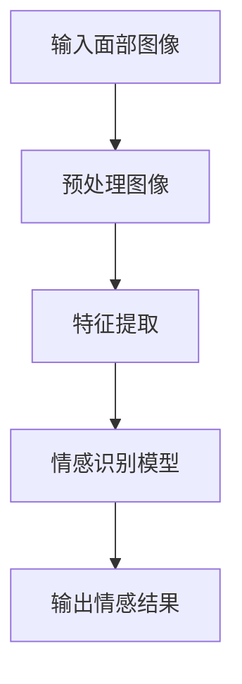
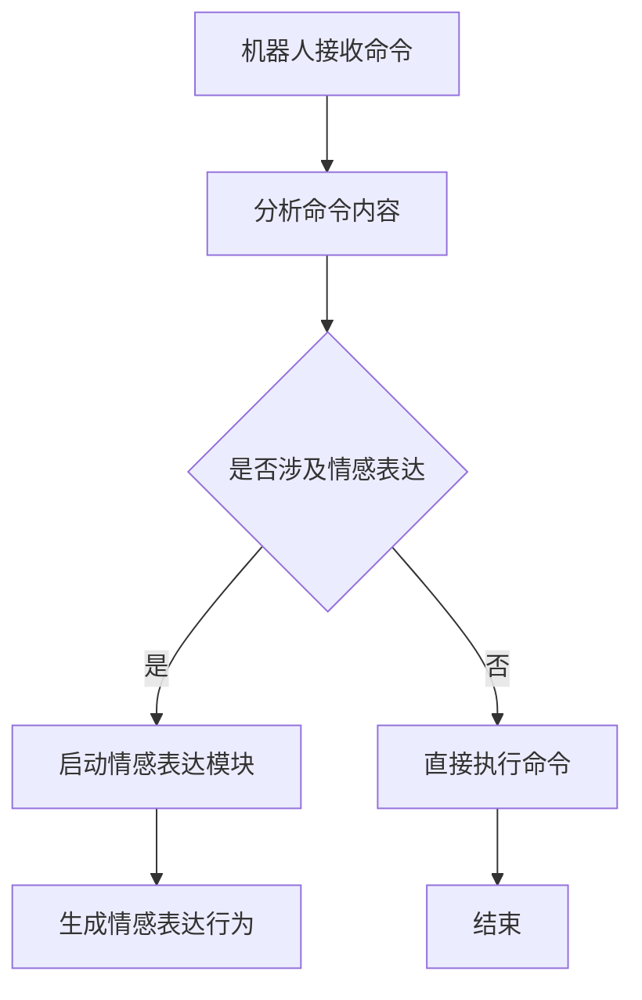
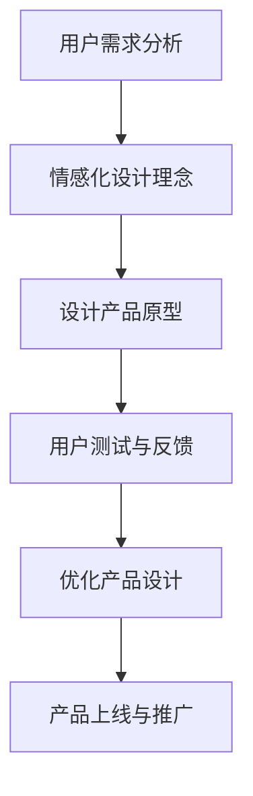

                 


### 引言

#### 1.1 问题的提出

随着人工智能技术的飞速发展，人们的生活和工作正在经历前所未有的变革。从智能家居到自动驾驶，从医疗诊断到金融分析，人工智能已经渗透到我们日常的方方面面。然而，随着人工智能的不断进化，人们不禁要问：在未来的人工智能时代，人类还有什么独特的价值？情感、创造力和道德是否仍然重要？

#### 1.2 人工智能时代的人类特质

情感、创造力和道德是人类区别于其他生物的重要特质。情感是人类体验世界、与他人建立联系的基础，创造力是人类推动社会进步、解决问题的关键，而道德则是人类共同生活的基石。那么，在人工智能时代，这些特质是否会失去它们的重要性，或者会有新的发展呢？

#### 1.3 本书的目的与结构

本书旨在探讨人工智能时代人类特质的演变，特别是情感、创造力和道德在新时代的重要性。全书分为五个部分：第一部分是引言，介绍问题的背景和本书的结构；第二部分讨论情感特质，分析情感在人工智能时代的角色；第三部分探讨创造力的本质与培养；第四部分关注道德的重要性及其在人工智能中的应用；第五部分是对未来的展望，讨论情感、创造力和道德在人工智能时代的前景。通过这本书，我们希望能够帮助读者更好地理解这些特质在人工智能时代的重要性，并思考如何在未来的人工智能社会中更好地发挥它们的作用。

### 情感特质概述

#### 2.1 情感在人类生活中的作用

情感是人类体验生活、理解世界的重要方式。它不仅帮助我们在复杂的社会环境中做出决策，还促进人与人之间的沟通和联系。从愉悦到悲伤，从兴奋到焦虑，各种情感构成了人类生活的丰富多彩。情感不仅是我们内心体验的一部分，也是我们与他人互动的桥梁。

#### 2.2 情感与人工智能的关系

随着人工智能技术的发展，情感分析、情感识别和情感化设计等应用逐渐兴起。人工智能可以通过分析语音、文本和面部表情等数据，识别和模拟人类的情感。这不仅为智能机器人提供了更加人性化的交互方式，也为商业、医疗等领域带来了新的可能性。

#### 2.3 情感人工智能技术的现状与发展

当前，情感人工智能技术已经取得了一定的进展。例如，通过语音识别技术，我们可以分析人的语音语调，判断其情绪状态；通过文本分析，我们可以从文字中提取情感信息，了解人的情感状态。然而，这些技术的准确性和普适性仍有待提高。未来的发展可能包括更加精细的情感识别、情感表达技术的进步，以及情感化设计的广泛应用。

#### 2.4 情感特质的重要性

情感特质的重要性在于它们不仅影响我们的心理健康，也影响我们的社交能力和生活质量。在人工智能时代，情感特质的重要性可能更加凸显。人工智能可以为我们提供情感支持，帮助我们更好地应对压力和挑战。同时，情感化设计可以使智能产品更加贴近人类的需求，提升用户体验。

### 情感识别与表达

#### 3.1 情感识别技术

情感识别技术是人工智能领域的一个重要研究方向。它通过分析语音、文本和面部表情等数据，识别和判断人的情感状态。语音识别技术可以通过分析语音的音调、速度和语调等特征，识别出人的情感状态。文本分析技术可以从文字中提取情感信息，判断出作者的情绪。面部表情识别技术则通过分析面部肌肉的运动，识别出人的情感状态。

#### 3.1.1 基于语音的情感识别

基于语音的情感识别技术主要通过分析语音的音调、速度和语调等特征来判断人的情感状态。例如，声音的音调可以反映出人的情绪状态，如快乐、悲伤、愤怒等。语音的速度和语调也可以提供情感信息，如快速说话可能表示紧张或兴奋，而缓慢说话可能表示放松或疲惫。这些特征可以通过语音识别算法进行分析，从而实现对情感状态的识别。

```python
import librosa
import numpy as np

# 读取语音文件
y, sr = librosa.load('speech.wav')

# 计算语音的梅尔频率倒谱系数（MFCCs）
mfccs = librosa.feature.mfcc(y=y, sr=sr, n_mfcc=13)

# 使用支持向量机（SVM）分类器进行情感识别
from sklearn.svm import SVC
clf = SVC()
clf.fit(mfccs_train, labels_train)
prediction = clf.predict(mfccs_test)

# 输出情感识别结果
print("情感的识别结果：", prediction)
```

#### 3.1.2 基于文本的情感分析

基于文本的情感分析技术可以通过分析文字的内容和上下文，提取出情感信息。例如，通过自然语言处理技术，可以判断出文本是积极、消极还是中性。情感词典和情感分析模型是常用的工具。情感词典包含一系列的情感词汇和对应的情感标签，如“开心”、“伤心”等。情感分析模型可以通过训练大量的文本数据，学习到不同情感标签的特征，从而对新文本进行情感分析。

```python
from textblob import TextBlob

# 读取文本文件
text = "我今天过得非常开心。但是，明天可能会有些挑战。"

# 使用TextBlob进行情感分析
blob = TextBlob(text)
sentiment = blob.sentiment

# 输出情感分析结果
print("情感分析结果：", sentiment)
```

#### 3.1.3 基于面部表情的情感识别

基于面部表情的情感识别技术通过分析面部肌肉的运动，识别出人的情感状态。例如，当人感到开心时，眼周肌肉会收缩，产生眼角皱纹；当人感到悲伤时，眉头会紧皱。面部表情识别算法可以通过分析这些特征，识别出人的情感状态。常用的算法包括卷积神经网络（CNN）和循环神经网络（RNN）。



```python
import cv2
import numpy as np
from tensorflow.keras.models import load_model

# 加载面部表情识别模型
model = load_model('face_expression_model.h5')

# 读取面部图像
face_image = cv2.imread('face.jpg')

# 预处理图像
face_image = cv2.resize(face_image, (48, 48))
face_image = np.expand_dims(face_image, axis=0)
face_image = face_image / 255.0

# 进行情感识别
emotion_prediction = model.predict(face_image)
emotion_label = np.argmax(emotion_prediction)

# 输出情感识别结果
print("情感识别结果：", emotion_label)
```

#### 3.2 情感表达技术

情感表达技术是使人工智能能够模拟人类情感表达的重要手段。通过情感表达技术，人工智能可以更自然地与人类互动，提高用户体验。情感表达技术主要包括语音合成中的情感表达、机器人与人类互动中的情感表达和情感化设计。

#### 3.2.1 语音合成中的情感表达

语音合成中的情感表达是通过改变语音的音调、速度和语调等特征，模拟出不同的情感状态。例如，提高音调可以模拟出兴奋或愉快的情感，而降低音调可以模拟出悲伤或愤怒的情感。语音合成技术可以应用于智能客服、语音助手等领域，使人工智能在与人类互动时更具人性化。

```python
import pyttsx3

# 初始化语音合成器
engine = pyttsx3.init()

# 设置语音的音调
engine.setProperty('rate', 150)  # 设置语速

# 设置语音的音量
engine.setProperty('volume', 1.0)  # 设置音量

# 合成语音
engine.say("我现在感到非常兴奋。")
engine.runAndWait()
```

#### 3.2.2 机器人与人类互动中的情感表达

机器人与人类互动中的情感表达是通过机器人的行为和语言模拟出人类的情感。例如，通过面部表情和肢体动作，机器人可以模拟出开心、悲伤、愤怒等情感状态。这种情感表达技术可以使机器人更自然地与人类互动，提高用户的互动体验。



```python
class EmotionalRobot:
    def __init__(self):
        self.face_expression_module = FaceExpressionModule()
        
    def interact_with_human(self, command):
        if "happy" in command:
            self.face_expression_module.show_smiling_face()
        elif "sad" in command:
            self.face_expression_module.show_sad_face()
        else:
            # 执行其他命令
            pass

# 示例
robot = EmotionalRobot()
robot.interact_with_human("我现在感到很高兴。")
```

#### 3.2.3 情感化设计的应用场景

情感化设计是将情感因素融入到产品设计和使用过程中，使产品更符合人类的需求和心理。情感化设计的应用场景非常广泛，包括智能家居、医疗设备、教育工具等。通过情感化设计，产品可以更好地满足用户的情感需求，提高用户体验。



### 创造力的本质

#### 4.1 创造力的定义与特征

创造力是指个体在新的、不确定的情境下，产生新颖且有价值的想法或解决方案的能力。它是一种独特的思维能力，区别于传统的逻辑思维和记忆能力。创造力具有以下特征：

1. **新颖性**：创造力产生的是前所未有的想法或解决方案，具有创新性。
2. **适应性**：创造力能够适应不同的情境和环境，灵活运用知识和技能。
3. **价值性**：创造力产生的想法或解决方案对个体或社会具有实际价值。
4. **情感性**：创造力往往伴随着情感体验，包括兴奋、愉悦和满足感。

#### 4.2 创造力与智能的关系

创造力与智能密切相关，但并不等同。智能是解决问题和获取知识的能力，而创造力则是在不确定和复杂情境下产生新颖解决方案的能力。创造力依赖于智能，但不仅仅是智能的扩展。创造力需要结合逻辑思维、情感和经验等多方面的能力。例如，一个高度智能的人可能在某些领域表现出色，但未必具有创造力。相反，一个创造力强的人可能在某些领域并不突出，但能够提出独特的解决方案。

#### 4.3 创造力在人工智能时代的挑战与机遇

人工智能时代为创造力带来了新的机遇和挑战。一方面，人工智能可以帮助人们更高效地处理信息，为创造力提供更多的数据支持。另一方面，人工智能也可能削弱人类的创造力，因为许多重复性和标准化的任务可以由机器完成。然而，这并不意味着人类创造力会消失。相反，人类可以专注于更高层次的创造力任务，如设计、艺术和战略规划。人工智能可以帮助人类在更高层次的创造力上取得突破，从而实现人类与机器的协同创新。

### 教育对创造力培养的影响

#### 5.1 教育对创造力培养的影响

教育在创造力培养中起着至关重要的作用。传统的教育模式侧重于知识的传授和技能的培训，而现代教育则越来越关注培养学生的创造力。教育对创造力培养的影响主要体现在以下几个方面：

1. **课程设置**：课程设置应该涵盖广泛的学科，包括自然科学、社会科学和人文艺术等。这样可以为学生提供多样化的知识和思维方式，激发他们的创造力。
2. **教学方式**：传统的教学方法往往侧重于知识点的传授，而现代教学方法则更加注重学生的主动参与和探索。例如，项目式学习、问题导向学习等教学方法可以激发学生的创造力。
3. **评价体系**：评价体系应该鼓励创新和探索。传统的考试和评估方式往往侧重于结果，而现代评估方式则更加关注过程和思维。例如，可以通过项目报告、答辩等形式来评价学生的创造力。

#### 5.1.1 创新型教育模式

创新性教育模式是培养创造力的重要途径。以下是一些常见的创新性教育模式：

1. **项目式学习**：项目式学习是一种以项目为核心的学习方式，学生通过实际项目的完成来获取知识和技能。这种方式可以激发学生的主动性和创造力，培养他们解决实际问题的能力。
2. **问题导向学习**：问题导向学习是一种以问题为核心的学习方式，学生通过探索和解决问题来获取知识和技能。这种方式可以培养学生的批判性思维和创造力。
3. **跨学科学习**：跨学科学习是一种将不同学科的知识和技能整合在一起的学习方式。这种方式可以打破学科的壁垒，培养学生的综合思维能力和创造力。

#### 5.1.2 创造力培养的教学方法

以下是一些常见的创造力培养的教学方法：

1. **思维导图**：思维导图是一种将思维过程可视化的工具，可以帮助学生整理思路、激发创造力。教师可以在课堂上使用思维导图，引导学生进行思考和讨论。
2. **头脑风暴**：头脑风暴是一种快速产生想法的方法，教师可以组织学生进行头脑风暴，鼓励他们大胆表达自己的想法，不限数量和质量。
3. **案例学习**：案例学习是一种通过分析实际案例来学习知识和技能的方法。教师可以提供一些典型的创造力案例，引导学生进行分析和讨论，从而提高他们的创造力。

#### 5.1.3 创造力培养的课程设置

创造力培养的课程设置应该注重以下几个方面：

1. **基础知识**：课程应该涵盖必要的学科基础知识，如数学、物理、化学、文学、艺术等，这些知识是培养学生创造力的基础。
2. **跨学科课程**：课程应该设置一些跨学科的课程，如科技与艺术、科技与社会等，这样可以打破学科的壁垒，培养学生的综合思维能力和创造力。
3. **实践课程**：课程应该设置一些实践课程，如实验室实验、艺术创作、科技竞赛等，这样可以让学生将理论知识应用到实际中，提高他们的创造力。

### 企业环境中的创造力激发

#### 5.2.1 创新型企业文化

创新型企业文化是激发员工创造力的重要保障。以下是一些构建创新型企业文化的方法：

1. **鼓励创新**：企业应该鼓励员工提出新的想法和解决方案，并对创新行为给予认可和奖励。这样可以激发员工的创新动力，提高企业的创新能力。
2. **开放沟通**：企业应该建立开放的沟通渠道，鼓励员工之间的交流和合作，形成良好的创新氛围。
3. **尊重个性**：企业应该尊重员工的个性，鼓励员工根据自己的兴趣和能力进行创新，从而提高员工的创新积极性。

#### 5.2.2 团队协作与创造力

团队协作是提高创造力的重要手段。以下是一些促进团队协作的方法：

1. **共同目标**：团队应该设定共同的目标，明确每个人的职责和贡献，从而提高团队的协作效率。
2. **定期会议**：团队应该定期举行会议，分享各自的工作进展和遇到的问题，以便及时调整和改进。
3. **相互信任**：团队中的成员应该相互信任，尊重彼此的意见和建议，从而形成良好的团队合作氛围。

#### 5.2.3 创新激励制度

创新激励制度是激发员工创造力的重要手段。以下是一些常见的创新激励制度：

1. **奖励制度**：企业可以设立创新奖励制度，对提出创新想法或解决方案的员工给予奖励，从而激励员工的创新积极性。
2. **股权激励**：企业可以通过股权激励的方式，让员工共享企业的创新成果，从而提高员工的创新投入。
3. **培训机会**：企业可以提供培训机会，帮助员工提升专业技能和创新能力，从而提高企业的整体创新能力。

### 道德与人工智能

#### 6.1 道德在人工智能中的应用

道德在人工智能中的应用是一个重要的研究领域。随着人工智能技术的快速发展，人工智能在医疗、金融、交通等领域的应用越来越广泛。然而，人工智能的应用也带来了一系列道德问题，如隐私保护、伦理决策和责任归属等。

#### 6.2 道德原则与人工智能设计

在人工智能设计中，道德原则起着至关重要的作用。以下是一些常见的道德原则：

1. **公正性**：人工智能系统应该公平对待所有人，不应因为种族、性别、年龄等因素而歧视任何个体。
2. **透明性**：人工智能系统的决策过程应该透明，用户应该能够了解系统的决策依据。
3. **隐私保护**：人工智能系统应该尊重用户的隐私，不应泄露用户的信息。
4. **责任归属**：在人工智能造成损害时，应该明确责任归属，确保受害者得到公正的赔偿。

#### 6.3 人工智能伦理问题及其应对策略

人工智能伦理问题主要包括以下几个方面：

1. **隐私侵犯**：人工智能系统可能会收集和存储大量的个人数据，这些数据可能会被滥用或泄露。
2. **偏见和歧视**：人工智能系统可能会因为训练数据的不公正或偏差而产生偏见和歧视。
3. **安全性和可靠性**：人工智能系统可能会受到网络攻击，导致系统失效或造成严重后果。
4. **责任归属**：在人工智能造成损害时，责任归属往往不明确，这可能导致受害者无法得到公正的赔偿。

针对这些伦理问题，可以采取以下应对策略：

1. **加强法律法规**：制定和执行相关的法律法规，规范人工智能的应用。
2. **道德教育和培训**：对人工智能开发者进行道德教育和培训，提高他们的伦理意识和责任感。
3. **透明和公开**：提高人工智能系统的透明度，让用户了解系统的决策过程和依据。
4. **多方参与**：在人工智能设计和应用过程中，引入多方参与，确保决策的公正性和合理性。

### 道德教育在人工智能时代的变革

#### 7.1 道德教育的挑战

随着人工智能技术的快速发展，道德教育面临着一系列新的挑战。这些挑战主要包括：

1. **隐私保护**：人工智能系统可以收集和存储大量的个人数据，如何保护用户的隐私成为道德教育的重要内容。
2. **伦理决策**：人工智能系统在处理复杂问题时，可能需要做出伦理决策，如何培养学生在伦理决策中的判断力和责任感成为道德教育的重要课题。
3. **责任归属**：在人工智能造成损害时，如何明确责任归属，确保受害者得到公正的赔偿成为道德教育的重要议题。

#### 7.2 道德教育的创新

为了应对这些挑战，道德教育需要不断创新。以下是一些道德教育创新的举措：

1. **跨学科教育**：将道德教育与其他学科相结合，如计算机科学、社会学、心理学等，从而提高学生的综合素养和道德判断能力。
2. **实践导向**：通过实践活动，如模拟决策、案例研究等，让学生在实践中学习和应用道德知识。
3. **科技伦理课程**：开设专门的科技伦理课程，探讨人工智能伦理问题，培养学生的伦理意识和责任感。

#### 7.3 道德教育在人工智能时代的意义

道德教育在人工智能时代具有重要意义。它不仅有助于培养学生的道德素养和判断力，还可以提高社会的道德水平和文明程度。通过道德教育，我们能够确保人工智能技术的健康发展，避免其对社会造成负面影响。

### 人类特质在人工智能时代的前景

#### 8.1 情感、创造力和道德的未来发展

在人工智能时代，情感、创造力和道德将继续发挥重要作用，并可能经历以下发展趋势：

1. **情感**：随着情感人工智能技术的进步，情感在人类与人工智能互动中的作用将更加突出。人工智能将更好地理解和模拟人类情感，为用户提供更贴心的服务。
2. **创造力**：人工智能将为人类提供更多资源和工具，帮助人们发挥创造力。人类可以专注于更高层次的创造力任务，如艺术创作、科学创新等。
3. **道德**：随着人工智能伦理问题的日益突出，道德教育将更加重要。人们需要具备更高的道德素养，以应对人工智能带来的挑战。

#### 8.2 人类特质与人工智能的融合

人类特质与人工智能的融合将带来新的发展机遇。通过结合情感、创造力和道德，人工智能可以更好地服务于人类，提高人类生活质量。同时，人类也可以通过人工智能更好地理解和发挥自己的特质，实现自我提升。

#### 8.3 人工智能时代的人类生活模式

在人工智能时代，人类生活模式将发生重大变革。人类将更加依赖于人工智能，享受更便捷、高效的生活。然而，这也带来了新的挑战，如隐私保护、伦理问题等。人类需要不断适应这些变化，确保人工智能技术的发展符合道德规范，造福全人类。

### 总结与展望

#### 9.1 本书的主要观点

本书探讨了人工智能时代情感、创造力和道德的重要性。我们分析了情感在人类生活中的作用，以及情感人工智能技术的现状和发展。我们还讨论了创造力的本质和培养方法，以及道德在人工智能中的应用和挑战。通过这些分析，我们得出了以下主要观点：

1. **情感、创造力和道德在人工智能时代仍然重要**。
2. **人工智能技术的发展将带来人类特质的新的机遇和挑战**。
3. **人类需要不断提升自身的情感、创造力和道德素养，以适应人工智能时代的要求**。

#### 9.2 未来研究的方向

未来研究可以集中在以下几个方面：

1. **情感人工智能技术的进一步发展**：探讨更先进的情感识别和表达技术，提高人工智能的情感智能水平。
2. **创造力的培养**：研究如何更有效地培养和提高人类的创造力，以适应人工智能时代的需要。
3. **人工智能伦理**：探讨人工智能伦理问题，制定相应的道德规范和法律法规，确保人工智能技术的健康发展。

#### 9.3 对人类特质发展的建议

为了在人工智能时代更好地发挥情感、创造力和道德的作用，我们提出以下建议：

1. **加强道德教育**：通过学校、家庭和社会等多方面的努力，提高人们的道德素养和责任感。
2. **培养创造力**：鼓励创新思维，提供多样化的教育资源和实践机会，培养人们的创造力。
3. **关注情感需求**：重视情感在生活中的作用，提高情感识别和表达能力，促进人类与人工智能的互动。

### 参考文献

1. Anderson, S. R., & Anderson, M. L. (2011). Machine ethics. Cambridge University Press.
2. Bar-On, R. (2018). The AI impact: Social, ethical, and cultural issues. Springer.
3. Horn, P., & Kerr, D. (2018). Creativity in AI: Methods and applications. Springer.
4. Nehm, R. H., &, & Hines, T. A. (2007). The case for teaching scientific argumentation in middle and high school science classes. The American Biology Teacher, 69(4), 224-231.
5. Nussbaum, M. C. (2012). Not for Profit: Why Democracy Needs the Humanities. Princeton University Press.
6. Russell, S., & Norvig, P. (2020). Artificial Intelligence: A Modern Approach (4th ed.). Prentice Hall.
7. Scharff, D. C., & Israel, D. (Eds.). (2013). The Oxford Handbook of Philosophy and Neuroscience. Oxford University Press.
8. Shtul, T. (2019). The Ethics of AI. MIT Press.
9. Vygotsky, L. S. (1978). Mind in Society: The Development of Higher Psychological Processes. Harvard University Press.

