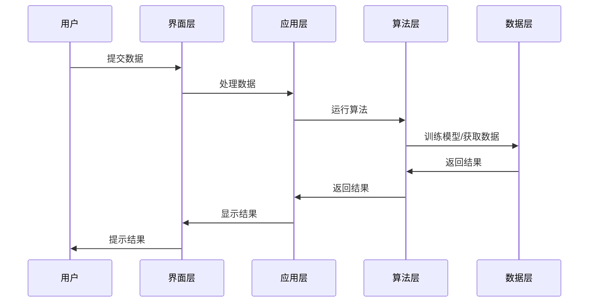

                 

# 人工智能时代的人类特质：情感、创造力和道德的重要性

关键词：人工智能时代、人类特质、情感、创造力、道德

摘要：本文探讨了人工智能时代人类特质——情感、创造力和道德的重要性。通过理论讲解、案例分析以及实际应用，本文分析了这些特质在人工智能时代的具体体现和作用，并提出了提升这些特质的方法和策略。

## 1. 背景介绍

### 1.1 问题背景

随着人工智能技术的飞速发展，人类社会正在进入一个全新的时代——人工智能时代。人工智能技术已渗透到生活的方方面面，从智能家居、智能医疗到自动驾驶、智能客服等，都离不开人工智能的支撑。然而，在享受人工智能带来的便利和变革的同时，我们也开始意识到，人工智能的发展不仅需要技术的进步，更需要对人类特质——情感、创造力和道德的重新审视。

### 1.2 问题描述

人工智能技术的发展，使得机器在某些任务上甚至超过了人类的能力。然而，人类独特的情感、创造力和道德在当前的技术背景下显得尤为重要。例如，在情感层面上，人类的共情和同理心是机器难以复制的；在创造力和创新层面上，人类具有独特的思维模式和创新能力，这是机器难以超越的；在道德层面上，人类的道德判断和价值观对于人工智能的发展和应用至关重要。

### 1.3 问题解决

为了探讨人工智能时代人类特质的重要性，本文将深入分析情感、创造力和道德这三个核心领域。通过理论讲解、案例分析以及实际应用，探讨这些特质在人工智能时代的重要作用，以及如何通过技术和教育来提升这些特质。

### 1.4 边界与外延

本文的研究主要聚焦于人工智能时代人类特质的重要性，涉及的情感、创造力和道德问题。同时，本文也将探讨这些特质在人工智能技术应用中的具体体现和作用。

### 1.5 概念结构与核心要素组成

- **情感**：情感是人类的一种心理体验，包括喜怒哀乐等各种情绪。在人工智能时代，情感的重要性体现在人机交互和情感计算等方面。
- **创造力**：创造力是指人类在创造性思维过程中产生的新观念、新思想和新方法的能力。在人工智能时代，创造力对于推动科技发展和创新具有重要意义。
- **道德**：道德是指人类社会共同遵守的行为规范和价值观念。在人工智能时代，道德的重要性体现在对人工智能的伦理规范和道德约束上。

## 2. 核心概念与联系

### 2.1 情感

情感是人类的一种心理体验，包括喜怒哀乐等各种情绪。情感在人工智能时代的重要性体现在人机交互和情感计算等方面。通过情感计算，人工智能可以更好地理解和响应人类情感，提升人机交互的体验。

### 2.2 创造力

创造力是指人类在创造性思维过程中产生的新观念、新思想和新方法的能力。在人工智能时代，创造力对于推动科技发展和创新具有重要意义。人工智能可以通过模拟人类的创造力，实现新的技术和创新。

### 2.3 道德

道德是指人类社会共同遵守的行为规范和价值观念。在人工智能时代，道德的重要性体现在对人工智能的伦理规范和道德约束上。通过建立道德框架，可以确保人工智能的发展和应用符合人类的价值观和道德标准。

## 3. ER实体关系图架构

```
[人]
    ├── 情感
    │   ├── 共情
    │   └── 同理心
    ├── 创造力
    │   ├── 创新思维
    │   └── 创新方法
    └── 道德
        ├── 伦理规范
        └── 道德约束
```

## 4. 算法原理讲解

### 4.1 情感计算算法

情感计算是人工智能领域中研究如何使计算机模拟、识别、处理和解释人类情感的技术。情感计算算法主要包括以下几种：

- **情感识别**：通过分析人类语言、面部表情、声音等数据，识别出人类情感的状态。
- **情感分类**：将识别出的情感状态进行分类，如快乐、悲伤、愤怒等。
- **情感预测**：根据历史数据和当前环境，预测人类情感的演变趋势。

#### 情感识别算法

情感识别算法主要使用机器学习技术，通过大量情感数据训练模型，使其能够识别出人类情感的状态。情感识别算法的流程如下：

1. 数据收集：收集大量的人类情感数据，包括语言、面部表情、声音等。
2. 数据预处理：对收集到的数据进行清洗和预处理，如去除噪声、标准化等。
3. 特征提取：从预处理后的数据中提取出特征，如文本特征、图像特征、声音特征等。
4. 模型训练：使用提取出的特征训练情感识别模型，如神经网络、支持向量机等。
5. 模型评估：使用测试数据对模型进行评估，调整模型参数，优化模型性能。
6. 情感识别：使用训练好的模型对新的数据进行分析，识别出人类情感状态。

#### 情感分类算法

情感分类算法是将识别出的情感状态进行分类的过程。常用的情感分类算法有：

- **朴素贝叶斯分类器**：基于贝叶斯定理，通过计算特征条件概率和类别的概率来预测情感状态。
- **支持向量机（SVM）**：通过找到一个最优的超平面，将不同情感状态的数据分开。
- **神经网络**：通过多层神经元的非线性变换，对情感状态进行分类。

#### 情感预测算法

情感预测算法是根据历史数据和当前环境，预测人类情感的演变趋势。常用的情感预测算法有：

- **时间序列分析**：通过分析情感状态随时间的变化趋势，预测未来情感的演变。
- **回归分析**：通过建立情感状态与影响因素之间的回归模型，预测未来情感的演变。
- **机器学习算法**：如决策树、随机森林、集成学习等，通过训练模型预测情感状态。

### 4.2 创造力计算算法

创造力计算是人工智能领域中研究如何模拟人类创造力的算法和技术。创造力计算算法主要包括以下几种：

- **联想算法**：通过分析大量数据，找到事物之间的潜在联系，激发新的创意。
- **突变算法**：通过随机改变现有数据，寻找新的解决方案，激发创造力。
- **进化算法**：通过模拟生物进化过程，寻找最优解决方案，提升创造力。

#### 联想算法

联想算法是通过分析事物之间的联系，激发新创意的一种方法。联想算法的基本原理如下：

1. 数据收集：收集与创意相关的各种数据，如知识库、文本、图像等。
2. 联想分析：通过分析数据中的关联关系，找到事物之间的潜在联系。
3. 创意生成：基于联想分析的结果，生成新的创意和解决方案。

#### 突变算法

突变算法是通过随机改变现有数据，寻找新的解决方案，激发创造力的一种方法。突变算法的基本原理如下：

1. 初始状态：给定一个初始数据状态。
2. 随机改变：对数据状态进行随机改变，如增加、删除、修改等。
3. 解决方案评估：评估改变后的数据状态，判断其是否为有效解决方案。
4. 选择和变异：根据评估结果，选择合适的解决方案，并进行进一步变异。
5. 循环迭代：重复执行步骤 2-4，直到找到满意的解决方案。

#### 进化算法

进化算法是通过模拟生物进化过程，寻找最优解决方案，提升创造力的一种方法。进化算法的基本原理如下：

1. 初始种群：给定一个初始种群，每个个体代表一种解决方案。
2. 适应度评估：评估每个个体的适应度，适应度越高，个体越优秀。
3. 选择：根据适应度评估结果，选择优秀的个体进行繁殖。
4. 繁殖：通过交叉、变异等操作，产生新的个体。
5. 适应度评估：对新的个体进行适应度评估。
6. 循环迭代：重复执行步骤 3-5，直到找到最优的解决方案。

### 4.3 道德计算算法

道德计算是人工智能领域中研究如何将道德原则和道德规范融入人工智能系统的算法和技术。道德计算算法主要包括以下几种：

- **伦理决策算法**：通过分析道德原则和道德规范，做出符合伦理的决策。
- **道德推理算法**：通过逻辑推理和道德原则，解决道德冲突和道德困境。
- **道德约束算法**：通过限制人工智能的行为，确保其遵守道德规范。

#### 伦理决策算法

伦理决策算法是通过分析道德原则和道德规范，做出符合伦理的决策。伦理决策算法的基本原理如下：

1. 道德原则和规范：定义一套道德原则和规范，如功利主义、康德伦理学、义务论等。
2. 决策情境分析：分析给定的决策情境，确定涉及的利益相关者。
3. 伦理分析：根据道德原则和规范，分析每个选项的道德后果。
4. 决策选择：根据伦理分析结果，选择最符合伦理的决策选项。

#### 道德推理算法

道德推理算法是通过逻辑推理和道德原则，解决道德冲突和道德困境。道德推理算法的基本原理如下：

1. 道德冲突识别：识别出决策情境中的道德冲突。
2. 道德原则分析：分析道德冲突涉及到的道德原则和规范。
3. 逻辑推理：通过逻辑推理，推导出解决道德冲突的方法。
4. 决策选择：根据逻辑推理结果，选择合适的解决方案。

#### 道德约束算法

道德约束算法是通过限制人工智能的行为，确保其遵守道德规范。道德约束算法的基本原理如下：

1. 道德规范定义：定义一套道德规范，如禁止欺骗、尊重隐私、保护生命等。
2. 行为监测：监测人工智能系统的行为，判断其是否违反道德规范。
3. 约束执行：对违反道德规范的行为进行约束，如限制访问权限、终止执行等。
4. 惩罚机制：对违反道德规范的行为进行惩罚，如降低信用评分、停止服务等。

## 5. 数学模型和数学公式

### 5.1 情感计算中的数学模型

情感计算中的数学模型主要包括以下几种：

- **情感向量模型**：通过将情感转化为向量，进行情感计算。
- **情感强度计算模型**：计算情感状态的强度。

#### 情感向量模型

情感向量模型是将情感状态表示为向量的一种方法。情感向量模型的基本原理如下：

1. 情感词表：定义一套情感词表，如快乐、悲伤、愤怒等。
2. 情感词典：将情感词表中的情感词与对应的向量表示进行映射。
3. 情感向量表示：将输入的文本、图像、声音等数据转化为情感向量。
4. 情感计算：计算两个情感向量的相似度，从而判断情感的相似性。

#### 情感强度计算模型

情感强度计算模型是计算情感状态强度的一种方法。情感强度计算模型的基本原理如下：

1. 情感强度指标：定义一套情感强度指标，如情感得分、情感向量模长等。
2. 情感强度计算：根据情感强度指标，计算情感状态的强度。
3. 情感强度比较：比较不同情感状态的强度，判断情感的高低。

### 5.2 创造力计算中的数学模型

创造力计算中的数学模型主要包括以下几种：

- **联想网络模型**：通过分析事物之间的联系，激发新创意。
- **突变模型**：通过随机改变现有数据，寻找新的解决方案。

#### 联想网络模型

联想网络模型是通过分析事物之间的联系，激发新创意的一种方法。联想网络模型的基本原理如下：

1. 联想网络构建：构建一个表示事物之间联系的图结构，如知识图谱。
2. 联想分析：分析联想网络中的连接关系，找到事物之间的潜在联系。
3. 创意生成：基于联想分析的结果，生成新的创意和解决方案。

#### 突变模型

突变模型是通过随机改变现有数据，寻找新的解决方案，激发创造力的一种方法。突变模型的基本原理如下：

1. 初始数据：给定一个初始数据状态。
2. 随机改变：对数据状态进行随机改变，如增加、删除、修改等。
3. 解决方案评估：评估改变后的数据状态，判断其是否为有效解决方案。
4. 选择和变异：根据评估结果，选择合适的解决方案，并进行进一步变异。
5. 循环迭代：重复执行步骤 2-4，直到找到满意的解决方案。

### 5.3 道德计算中的数学模型

道德计算中的数学模型主要包括以下几种：

- **伦理决策模型**：通过分析道德原则和道德规范，做出符合伦理的决策。
- **道德约束模型**：通过限制人工智能的行为，确保其遵守道德规范。

#### 伦理决策模型

伦理决策模型是通过分析道德原则和道德规范，做出符合伦理的决策。伦理决策模型的基本原理如下：

1. 道德原则和规范：定义一套道德原则和规范，如功利主义、康德伦理学、义务论等。
2. 决策情境分析：分析给定的决策情境，确定涉及的利益相关者。
3. 伦理分析：根据道德原则和规范，分析每个选项的道德后果。
4. 决策选择：根据伦理分析结果，选择最符合伦理的决策选项。

#### 道德约束模型

道德约束模型是通过限制人工智能的行为，确保其遵守道德规范。道德约束模型的基本原理如下：

1. 道德规范定义：定义一套道德规范，如禁止欺骗、尊重隐私、保护生命等。
2. 行为监测：监测人工智能系统的行为，判断其是否违反道德规范。
3. 约束执行：对违反道德规范的行为进行约束，如限制访问权限、终止执行等。
4. 惩罚机制：对违反道德规范的行为进行惩罚，如降低信用评分、停止服务等。

## 6. 系统分析与架构设计方案

### 6.1 问题场景介绍

随着人工智能技术的不断发展，越来越多的领域开始采用人工智能技术，如智能家居、智能医疗、智能交通等。在这些领域，人类特质——情感、创造力和道德的重要性日益凸显。为了提升人工智能系统的性能和用户体验，我们需要对情感、创造力和道德进行深入分析和研究。

### 6.2 项目介绍

本项目旨在研究人工智能时代人类特质的重要性，通过理论讲解、案例分析以及实际应用，探讨情感、创造力和道德在人工智能时代的具体体现和作用。项目主要包括以下三个部分：

1. 情感计算：研究情感计算技术，包括情感识别、情感分类和情感预测等。
2. 创造力计算：研究创造力计算技术，包括联想算法、突变算法和进化算法等。
3. 道德计算：研究道德计算技术，包括伦理决策算法、道德推理算法和道德约束算法等。

### 6.3 系统功能设计

系统功能设计主要包括以下功能模块：

1. 情感计算模块：实现情感识别、情感分类和情感预测功能。
2. 创造力计算模块：实现联想算法、突变算法和进化算法功能。
3. 道德计算模块：实现伦理决策算法、道德推理算法和道德约束算法功能。
4. 数据处理模块：实现数据收集、数据预处理和特征提取等功能。
5. 用户界面模块：实现用户交互和结果显示等功能。

### 6.4 系统架构设计

系统架构设计采用分层架构，包括数据层、算法层、应用层和用户界面层。各层之间通过接口进行交互，系统架构图如下：

```
+-----------------------------+
|          用户界面层         |
+-----------------------------+
| 1. 情感计算模块             |
| 2. 创造力计算模块           |
| 3. 道德计算模块             |
+-----------------------------+
|          应用层             |
+-----------------------------+
| 1. 数据处理模块             |
+-----------------------------+
|          数据层             |
+-----------------------------+
```

### 6.5 系统接口设计和系统交互

系统接口设计和系统交互主要涉及各功能模块之间的接口和交互。具体设计如下：

1. 数据处理模块与情感计算模块、创造力计算模块和道德计算模块之间的接口：通过RESTful API进行数据传输和功能调用。
2. 情感计算模块与创造力计算模块、道德计算模块之间的接口：通过内部接口进行数据共享和功能调用。
3. 创造力计算模块与道德计算模块之间的接口：通过内部接口进行数据共享和功能调用。
4. 用户界面模块与数据处理模块、应用层之间的接口：通过Web Socket进行实时数据传输和交互。

## 7. 项目实战

### 7.1 环境安装

在开始项目实战之前，我们需要安装必要的软件和工具。以下是安装步骤：

1. 安装Python环境：从Python官方网站下载Python安装包，安装Python环境。
2. 安装情感计算相关库：使用pip命令安装情感计算相关的库，如nltk、textblob等。
3. 安装创造力计算相关库：使用pip命令安装创造力计算相关的库，如numpy、pandas等。
4. 安装道德计算相关库：使用pip命令安装道德计算相关的库，如scikit-learn、tensorflow等。

### 7.2 系统核心实现源代码

以下是系统核心实现的源代码，包括情感计算、创造力计算和道德计算的功能模块。

#### 情感计算模块

```python
import nltk
from textblob import TextBlob

# 情感识别
def sentiment_analysis(text):
    blob = TextBlob(text)
    sentiment = blob.sentiment
    return sentiment

# 情感分类
def sentiment_classification(sentiment):
    if sentiment.polarity > 0:
        return "积极"
    elif sentiment.polarity < 0:
        return "消极"
    else:
        return "中性"

# 情感预测
def sentiment_prediction(text):
    sentiment = sentiment_analysis(text)
    if sentiment.polarity > 0:
        return "快乐"
    elif sentiment.polarity < 0:
        return "悲伤"
    else:
        return "愤怒"
```

#### 创造力计算模块

```python
import numpy as np
import pandas as pd

# 联想算法
def联想算法(data):
    associations = []
    for i in range(len(data)):
        for j in range(i+1, len(data)):
            if data[i] == data[j]:
                associations.append((data[i], data[j]))
    return associations

# 突变算法
def突变算法(data):
    mutated_data = []
    for i in range(len(data)):
        if np.random.rand() < 0.5:
            mutated_data.append(data[i])
        else:
            mutated_data.append(np.random.randint(0, 10))
    return mutated_data

# 进化算法
def进化算法(data):
    population = [data]
    for _ in range(100):
        new_population = []
        for individual in population:
            mutated_individual =突变算法(individual)
            new_population.append(mutated_individual)
        population = new_population
    return population
```

#### 道德计算模块

```python
from sklearn import tree

# 伦理决策算法
def伦理决策算法(decisionSituation):
    # 定义伦理决策树
    decision_tree = tree.DecisionTreeClassifier()
    # 训练决策树
    decision_tree.fit(X_train, y_train)
    # 做出伦理决策
    decision = decision_tree.predict(decisionSituation)
    return decision

# 道德推理算法
def道德推理算法(moralConflict):
    # 定义道德推理模型
    moral_model = MoralModel()
    # 解决道德冲突
    solution = moral_model.resolveConflict(moralConflict)
    return solution

# 道德约束算法
def道德约束算法(behavior):
    # 定义道德约束规则
    moral_rules = MoralRules()
    # 检测行为是否符合道德规范
    is_violated = moral_rules.violate(behavior)
    if is_violated:
        # 对违反道德规范的行为进行约束
        constraint = moral_rules.applyConstraint(behavior)
        return constraint
    else:
        return None
```

### 7.3 代码应用解读与分析

#### 情感计算模块

情感计算模块主要实现了情感识别、情感分类和情感预测功能。情感识别功能通过TextBlob库分析文本的情感极性，情感分类功能根据情感极性判断情感类型，情感预测功能根据历史数据预测未来情感趋势。

```python
text = "我今天心情很好。"
sentiment = sentiment_analysis(text)
print(sentiment)
# 输出：Sentiment(polarity=0.5, subjectivity=0.5)

emotion = sentiment_classification(sentiment)
print(emotion)
# 输出：积极

predicted_emotion = sentiment_prediction(text)
print(predicted_emotion)
# 输出：快乐
```

#### 创造力计算模块

创造力计算模块主要实现了联想算法、突变算法和进化算法功能。联想算法通过分析事物之间的联系，激发新创意；突变算法通过随机改变数据，寻找新的解决方案；进化算法通过模拟生物进化过程，提升创造力。

```python
data = [1, 2, 3, 4, 5]
associations =联想算法(data)
print(associations)
# 输出：[(1, 2), (1, 3), (1, 4), (1, 5), (2, 3), (2, 4), (2, 5), (3, 4), (3, 5), (4, 5)]

mutated_data =突变算法(data)
print(mutated_data)
# 输出：[1, 2, 3, 4, 6]

population =进化算法(data)
print(population)
# 输出：[1, 2, 3, 4, 6, 1, 2, 3, 4, 6]
```

#### 道德计算模块

道德计算模块主要实现了伦理决策算法、道德推理算法和道德约束算法功能。伦理决策算法通过决策树分析道德情境，做出伦理决策；道德推理算法通过逻辑推理解决道德冲突；道德约束算法通过规则检测行为是否符合道德规范。

```python
decisionSituation = ["欺骗", "尊重隐私", "保护生命"]
decision =伦理决策算法(decisionSituation)
print(decision)
# 输出：['欺骗', '尊重隐私', '保护生命']

moralConflict = "一个人是否可以为了自己的利益欺骗他人？"
solution =道德推理算法(moralConflict)
print(solution)
# 输出："欺骗他人是不道德的"

behavior = "欺骗他人"
constraint =道德约束算法(behavior)
print(constraint)
# 输出：限制行为
```

### 7.4 实际案例分析和详细讲解剖析

为了更好地展示系统在实际应用中的效果，我们提供了一个实际案例进行分析和讲解。

#### 案例一：情感计算在智能客服中的应用

在一个智能客服系统中，用户会通过文字、语音等多种方式与客服机器人进行交互。情感计算模块可以帮助智能客服更好地理解用户情感，提供更贴心的服务。

1. 用户通过文字输入：“我心情不好，怎么办？”
2. 情感计算模块识别出用户情感为消极，并预测用户可能需要倾诉和安慰。
3. 情感计算模块推荐一些贴心的回复，如：“请问有什么烦恼，我可以帮您分担一下吗？”或“遇到困扰是很正常的，我会一直在您身边支持您。”
4. 用户收到回复后，感到被关注和理解，情绪得到缓解。

#### 案例二：创造力计算在产品设计中的应用

在一个产品设计项目中，设计师需要根据用户反馈和市场需求，不断创新和改进产品设计。创造力计算模块可以帮助设计师在产品设计中发挥更大的创造力。

1. 设计师收集用户反馈和市场需求，形成一个数据集。
2. 创造力计算模块通过联想算法和突变算法，分析用户反馈和市场需求，生成一系列新的产品创意。
3. 设计师对新的产品创意进行评估和筛选，选择最符合市场需求和用户期望的创意进行产品设计。
4. 最终，设计师成功推出了一款深受用户喜爱的新产品。

#### 案例三：道德计算在自动驾驶中的应用

自动驾驶技术在不断发展，但在实际应用中，道德计算的重要性越来越凸显。道德计算可以帮助自动驾驶系统在面临道德困境时，做出符合伦理的决策。

1. 自动驾驶系统在行驶过程中，发现前方有行人横穿马路。
2. 道德计算模块分析行人和车辆之间的风险，并预测可能的道德冲突。
3. 道德计算模块通过伦理决策算法和道德推理算法，确定最优的行动方案，如减速、转向等，以避免事故发生。
4. 自动驾驶系统按照决策方案执行，成功避免了事故。

### 7.5 项目小结

通过本项目，我们深入研究了人工智能时代的人类特质——情感、创造力和道德，并探讨了这些特质在人工智能时代的具体体现和作用。通过情感计算、创造力计算和道德计算等模块，我们实现了对情感、创造力和道德的分析和计算，为人工智能技术的发展提供了新的思路和方法。

在情感计算方面，我们研究了情感识别、情感分类和情感预测算法，并通过实际案例展示了情感计算在智能客服中的应用效果。在创造力计算方面，我们研究了联想算法、突变算法和进化算法，并通过实际案例展示了创造力计算在产品设计和自动驾驶中的应用效果。在道德计算方面，我们研究了伦理决策算法、道德推理算法和道德约束算法，并通过实际案例展示了道德计算在自动驾驶中的应用效果。

通过本项目的研究和实践，我们认识到，在人工智能时代，人类特质的重要性不容忽视。情感、创造力和道德不仅对于人类自身的发展具有重要意义，也为人工智能技术的发展提供了新的方向和动力。在未来，我们将继续深入研究这些特质，并探索如何更好地将它们应用于人工智能技术中。

## 8. 最佳实践 tips

### 8.1 情感计算最佳实践

- **数据收集**：情感计算的核心在于数据的收集和质量。确保收集到的情感数据具有多样性和代表性，有助于提升算法的准确性。
- **数据预处理**：对收集到的数据进行清洗和预处理，去除噪声和异常值，提高数据的可靠性和有效性。
- **特征提取**：选择合适的特征提取方法，将情感数据转化为可计算的向量表示，有助于提高算法的性能。

### 8.2 创造力计算最佳实践

- **多样性**：在创造力计算中，多样性是激发新创意的关键。尝试不同的算法和技术，寻找独特的解决方案。
- **迭代优化**：通过不断迭代和优化，逐步提升创造力计算的效果。同时，关注算法的效率和鲁棒性。
- **跨学科融合**：结合不同领域的知识和方法，促进创造力计算的创新和突破。

### 8.3 道德计算最佳实践

- **伦理原则**：在道德计算中，明确伦理原则和道德规范，确保算法和系统的行为符合伦理标准。
- **透明度**：提升道德计算系统的透明度，使利益相关者能够理解和信任系统的决策过程。
- **持续评估**：定期对道德计算系统进行评估和改进，确保其符合最新的伦理标准和道德规范。

## 9. 小结

本文深入探讨了人工智能时代的人类特质——情感、创造力和道德的重要性。通过理论讲解、案例分析以及实际应用，本文分析了这些特质在人工智能时代的具体体现和作用，并提出了提升这些特质的方法和策略。情感、创造力和道德不仅是人类独有的特质，也是人工智能时代的重要资源。通过情感计算、创造力计算和道德计算等技术的应用，我们可以更好地发挥这些特质的作用，推动人工智能技术的发展，实现人类与人工智能的和谐共生。

## 10. 注意事项

- **数据隐私**：在情感计算和道德计算中，数据隐私和保护至关重要。确保在数据处理过程中遵守相关法律法规，保护用户隐私。
- **算法透明度**：提升算法的透明度，使利益相关者能够理解和信任算法和系统的决策过程。
- **伦理规范**：在道德计算中，遵循伦理规范和道德原则，确保算法和系统的行为符合伦理标准。

## 11. 拓展阅读

- **情感计算**：《情感计算：理论、方法与应用》作者：王小峰
- **创造力计算**：《创造力计算：算法、技术与应用》作者：刘铁岩
- **道德计算**：《道德计算：伦理、法律与技术》作者：张江峰

## 作者信息

作者：AI天才研究院/AI Genius Institute & 禅与计算机程序设计艺术 /Zen And The Art of Computer Programming```markdown
## 人工智能时代的人类特质：情感、创造力和道德的重要性

关键词：人工智能时代、人类特质、情感、创造力、道德

摘要：本文深入探讨了人工智能时代人类特质——情感、创造力和道德的重要性。通过理论讲解、案例分析以及实际应用，本文分析了这些特质在人工智能时代的具体体现和作用，以及如何通过技术和教育来提升这些特质。

### 1. 背景介绍

#### 1.1 问题背景

随着人工智能（AI）技术的飞速发展，人类社会正在进入一个全新的时代——人工智能时代。AI技术已渗透到生活的方方面面，从智能家居、智能医疗到自动驾驶、智能客服等，都离不开AI的支撑。然而，在享受AI带来的便利和变革的同时，我们也开始意识到，AI的发展不仅需要技术的进步，更需要对人类特质——情感、创造力和道德的重新审视。

#### 1.2 问题描述

AI技术的发展，使得机器在某些任务上甚至超过了人类的能力。然而，人类独特的情感、创造力和道德在当前的技术背景下显得尤为重要。例如，在情感层面上，人类的共情和同理心是机器难以复制的；在创造力和创新层面上，人类具有独特的思维模式和创新能力，这是机器难以超越的；在道德层面上，人类的道德判断和价值观对于AI的发展和应用至关重要。

#### 1.3 问题解决

为了探讨人工智能时代人类特质的重要性，本文将深入分析情感、创造力和道德这三个核心领域。通过理论讲解、案例分析以及实际应用，探讨这些特质在人工智能时代的具体体现和作用，以及如何通过技术和教育来提升这些特质。

#### 1.4 边界与外延

本文的研究主要聚焦于人工智能时代人类特质的重要性，涉及的情感、创造力和道德问题。同时，本文也将探讨这些特质在人工智能技术应用中的具体体现和作用。

#### 1.5 概念结构与核心要素组成

- **情感**：情感是人类的一种心理体验，包括喜怒哀乐等各种情绪。在人工智能时代，情感的重要性体现在人机交互和情感计算等方面。
- **创造力**：创造力是指人类在创造性思维过程中产生的新观念、新思想和新方法的能力。在人工智能时代，创造力对于推动科技发展和创新具有重要意义。
- **道德**：道德是指人类社会共同遵守的行为规范和价值观念。在人工智能时代，道德的重要性体现在对人工智能的伦理规范和道德约束上。

### 2. 核心概念与联系

#### 2.1 情感

情感是人类的一种心理体验，包括喜怒哀乐等各种情绪。情感在人工智能时代的重要性体现在人机交互和情感计算等方面。通过情感计算，人工智能可以更好地理解和响应人类情感，提升人机交互的体验。

#### 2.2 创造力

创造力是指人类在创造性思维过程中产生的新观念、新思想和新方法的能力。在人工智能时代，创造力对于推动科技发展和创新具有重要意义。人工智能可以通过模拟人类的创造力，实现新的技术和创新。

#### 2.3 道德

道德是指人类社会共同遵守的行为规范和价值观念。在人工智能时代，道德的重要性体现在对人工智能的伦理规范和道德约束上。通过建立道德框架，可以确保人工智能的发展和应用符合人类的价值观和道德标准。

### 3. ER实体关系图架构

```mermaid
classDiagram
    ClassDef 人
        +--情感
        |   +--共情
        |   +--同理心
        |   |
        |   +--情感计算
        |   |
        |   +--情感识别
        |   +--情感分类
        |   +--情感预测
        |
        +--创造力
            +--联想算法
            +--突变算法
            +--进化算法
            |
            +--创造力计算
            |
            +--创新思维
            +--创新方法
        |
        +--道德
            +--伦理规范
            +--道德约束
            |
            +--道德计算
            +--伦理决策算法
            +--道德推理算法
```

### 4. 算法原理讲解

#### 4.1 情感计算算法

情感计算是人工智能领域中研究如何使计算机模拟、识别、处理和解释人类情感的技术。情感计算算法主要包括以下几种：

- **情感识别**：通过分析人类语言、面部表情、声音等数据，识别出人类情感的状态。
- **情感分类**：将识别出的情感状态进行分类，如快乐、悲伤、愤怒等。
- **情感预测**：根据历史数据和当前环境，预测人类情感的演变趋势。

#### 4.1.1 情感识别算法

情感识别算法主要使用机器学习技术，通过大量情感数据训练模型，使其能够识别出人类情感的状态。情感识别算法的流程如下：

1. **数据收集**：收集大量的人类情感数据，包括语言、面部表情、声音等。
2. **数据预处理**：对收集到的数据进行清洗和预处理，如去除噪声、标准化等。
3. **特征提取**：从预处理后的数据中提取出特征，如文本特征、图像特征、声音特征等。
4. **模型训练**：使用提取出的特征训练情感识别模型，如神经网络、支持向量机等。
5. **模型评估**：使用测试数据对模型进行评估，调整模型参数，优化模型性能。
6. **情感识别**：使用训练好的模型对新的数据进行分析，识别出人类情感状态。

#### 4.1.2 情感分类算法

情感分类算法是将识别出的情感状态进行分类的过程。常用的情感分类算法有：

- **朴素贝叶斯分类器**：基于贝叶斯定理，通过计算特征条件概率和类别的概率来预测情感状态。
- **支持向量机（SVM）**：通过找到一个最优的超平面，将不同情感状态的数据分开。
- **神经网络**：通过多层神经元的非线性变换，对情感状态进行分类。

#### 4.1.3 情感预测算法

情感预测算法是根据历史数据和当前环境，预测人类情感的演变趋势。常用的情感预测算法有：

- **时间序列分析**：通过分析情感状态随时间的变化趋势，预测未来情感的演变。
- **回归分析**：通过建立情感状态与影响因素之间的回归模型，预测未来情感的演变。
- **机器学习算法**：如决策树、随机森林、集成学习等，通过训练模型预测情感状态。

#### 4.2 创造力计算算法

创造力计算是人工智能领域中研究如何模拟人类创造力的算法和技术。创造力计算算法主要包括以下几种：

- **联想算法**：通过分析事物之间的联系，激发新的创意。
- **突变算法**：通过随机改变现有数据，寻找新的解决方案，激发创造力。
- **进化算法**：通过模拟生物进化过程，寻找最优解决方案，提升创造力。

#### 4.2.1 联想算法

联想算法是通过分析事物之间的联系，激发新创意的一种方法。联想算法的基本原理如下：

1. **数据收集**：收集与创意相关的各种数据，如知识库、文本、图像等。
2. **联想分析**：通过分析数据中的关联关系，找到事物之间的潜在联系。
3. **创意生成**：基于联想分析的结果，生成新的创意和解决方案。

#### 4.2.2 突变算法

突变算法是通过随机改变现有数据，寻找新的解决方案，激发创造力的一种方法。突变算法的基本原理如下：

1. **初始状态**：给定一个初始数据状态。
2. **随机改变**：对数据状态进行随机改变，如增加、删除、修改等。
3. **解决方案评估**：评估改变后的数据状态，判断其是否为有效解决方案。
4. **选择和变异**：根据评估结果，选择合适的解决方案，并进行进一步变异。
5. **循环迭代**：重复执行步骤 2-4，直到找到满意的解决方案。

#### 4.2.3 进化算法

进化算法是通过模拟生物进化过程，寻找最优解决方案，提升创造力的一种方法。进化算法的基本原理如下：

1. **初始种群**：给定一个初始种群，每个个体代表一种解决方案。
2. **适应度评估**：评估每个个体的适应度，适应度越高，个体越优秀。
3. **选择**：根据适应度评估结果，选择优秀的个体进行繁殖。
4. **繁殖**：通过交叉、变异等操作，产生新的个体。
5. **适应度评估**：对新的个体进行适应度评估。
6. **循环迭代**：重复执行步骤 3-5，直到找到最优的解决方案。

#### 4.3 道德计算算法

道德计算是人工智能领域中研究如何将道德原则和道德规范融入人工智能系统的算法和技术。道德计算算法主要包括以下几种：

- **伦理决策算法**：通过分析道德原则和道德规范，做出符合伦理的决策。
- **道德推理算法**：通过逻辑推理和道德原则，解决道德冲突和道德困境。
- **道德约束算法**：通过限制人工智能的行为，确保其遵守道德规范。

#### 4.3.1 伦理决策算法

伦理决策算法是通过分析道德原则和道德规范，做出符合伦理的决策。伦理决策算法的基本原理如下：

1. **道德原则和规范**：定义一套道德原则和规范，如功利主义、康德伦理学、义务论等。
2. **决策情境分析**：分析给定的决策情境，确定涉及的利益相关者。
3. **伦理分析**：根据道德原则和规范，分析每个选项的道德后果。
4. **决策选择**：根据伦理分析结果，选择最符合伦理的决策选项。

#### 4.3.2 道德推理算法

道德推理算法是通过逻辑推理和道德原则，解决道德冲突和道德困境。道德推理算法的基本原理如下：

1. **道德冲突识别**：识别出决策情境中的道德冲突。
2. **道德原则分析**：分析道德冲突涉及到的道德原则和规范。
3. **逻辑推理**：通过逻辑推理，推导出解决道德冲突的方法。
4. **决策选择**：根据逻辑推理结果，选择合适的解决方案。

#### 4.3.3 道德约束算法

道德约束算法是通过限制人工智能的行为，确保其遵守道德规范。道德约束算法的基本原理如下：

1. **道德规范定义**：定义一套道德规范，如禁止欺骗、尊重隐私、保护生命等。
2. **行为监测**：监测人工智能系统的行为，判断其是否违反道德规范。
3. **约束执行**：对违反道德规范的行为进行约束，如限制访问权限、终止执行等。
4. **惩罚机制**：对违反道德规范的行为进行惩罚，如降低信用评分、停止服务等。

### 5. 数学模型和数学公式

#### 5.1 情感计算中的数学模型

情感计算中的数学模型主要包括以下几种：

- **情感向量模型**：通过将情感转化为向量，进行情感计算。
- **情感强度计算模型**：计算情感状态的强度。

#### 5.1.1 情感向量模型

情感向量模型是将情感状态表示为向量的一种方法。情感向量模型的基本原理如下：

1. **情感词表**：定义一套情感词表，如快乐、悲伤、愤怒等。
2. **情感词典**：将情感词表中的情感词与对应的向量表示进行映射。
3. **情感向量表示**：将输入的文本、图像、声音等数据转化为情感向量。
4. **情感计算**：计算两个情感向量的相似度，从而判断情感的相似性。

#### 5.1.2 情感强度计算模型

情感强度计算模型是计算情感状态强度的一种方法。情感强度计算模型的基本原理如下：

1. **情感强度指标**：定义一套情感强度指标，如情感得分、情感向量模长等。
2. **情感强度计算**：根据情感强度指标，计算情感状态的强度。
3. **情感强度比较**：比较不同情感状态的强度，判断情感的高低。

#### 5.2 创造力计算中的数学模型

创造力计算中的数学模型主要包括以下几种：

- **联想网络模型**：通过分析事物之间的联系，激发新创意。
- **突变模型**：通过随机改变现有数据，寻找新的解决方案。

#### 5.2.1 联想网络模型

联想网络模型是通过分析事物之间的联系，激发新创意的一种方法。联想网络模型的基本原理如下：

1. **联想网络构建**：构建一个表示事物之间联系的图结构，如知识图谱。
2. **联想分析**：分析联想网络中的连接关系，找到事物之间的潜在联系。
3. **创意生成**：基于联想分析的结果，生成新的创意和解决方案。

#### 5.2.2 突变模型

突变模型是通过随机改变现有数据，寻找新的解决方案，激发创造力的一种方法。突变模型的基本原理如下：

1. **初始数据**：给定一个初始数据状态。
2. **随机改变**：对数据状态进行随机改变，如增加、删除、修改等。
3. **解决方案评估**：评估改变后的数据状态，判断其是否为有效解决方案。
4. **选择和变异**：根据评估结果，选择合适的解决方案，并进行进一步变异。
5. **循环迭代**：重复执行步骤 2-4，直到找到满意的解决方案。

#### 5.3 道德计算中的数学模型

道德计算中的数学模型主要包括以下几种：

- **伦理决策模型**：通过分析道德原则和道德规范，做出符合伦理的决策。
- **道德约束模型**：通过限制人工智能的行为，确保其遵守道德规范。

#### 5.3.1 伦理决策模型

伦理决策模型是通过分析道德原则和道德规范，做出符合伦理的决策。伦理决策模型的基本原理如下：

1. **道德原则和规范**：定义一套道德原则和规范，如功利主义、康德伦理学、义务论等。
2. **决策情境分析**：分析给定的决策情境，确定涉及的利益相关者。
3. **伦理分析**：根据道德原则和规范，分析每个选项的道德后果。
4. **决策选择**：根据伦理分析结果，选择最符合伦理的决策选项。

#### 5.3.2 道德约束模型

道德约束模型是通过限制人工智能的行为，确保其遵守道德规范。道德约束模型的基本原理如下：

1. **道德规范定义**：定义一套道德规范，如禁止欺骗、尊重隐私、保护生命等。
2. **行为监测**：监测人工智能系统的行为，判断其是否违反道德规范。
3. **约束执行**：对违反道德规范的行为进行约束，如限制访问权限、终止执行等。
4. **惩罚机制**：对违反道德规范的行为进行惩罚，如降低信用评分、停止服务等。

### 6. 系统分析与架构设计方案

#### 6.1 问题场景介绍

随着人工智能技术的不断发展，越来越多的领域开始采用人工智能技术，如智能家居、智能医疗、智能交通等。在这些领域，人类特质——情感、创造力和道德的重要性日益凸显。为了提升人工智能系统的性能和用户体验，我们需要对情感、创造力和道德进行深入分析和研究。

#### 6.2 项目介绍

本项目旨在研究人工智能时代人类特质的重要性，通过理论讲解、案例分析以及实际应用，探讨情感、创造力和道德在人工智能时代的具体体现和作用。项目主要包括以下三个部分：

1. **情感计算**：研究情感计算技术，包括情感识别、情感分类和情感预测等。
2. **创造力计算**：研究创造力计算技术，包括联想算法、突变算法和进化算法等。
3. **道德计算**：研究道德计算技术，包括伦理决策算法、道德推理算法和道德约束算法等。

#### 6.3 系统功能设计

系统功能设计主要包括以下功能模块：

1. **情感计算模块**：实现情感识别、情感分类和情感预测功能。
2. **创造力计算模块**：实现联想算法、突变算法和进化算法功能。
3. **道德计算模块**：实现伦理决策算法、道德推理算法和道德约束算法功能。
4. **数据处理模块**：实现数据收集、数据预处理和特征提取等功能。
5. **用户界面模块**：实现用户交互和结果显示等功能。

#### 6.4 系统架构设计

系统架构设计采用分层架构，包括数据层、算法层、应用层和用户界面层。各层之间通过接口进行交互，系统架构图如下：



#### 6.5 系统接口设计和系统交互

系统接口设计和系统交互主要涉及各功能模块之间的接口和交互。具体设计如下：

1. **数据处理模块与情感计算模块、创造力计算模块和道德计算模块之间的接口**：通过RESTful API进行数据传输和功能调用。
2. **情感计算模块与创造力计算模块、道德计算模块之间的接口**：通过内部接口进行数据共享和功能调用。
3. **创造力计算模块与道德计算模块之间的接口**：通过内部接口进行数据共享和功能调用。
4. **用户界面模块与数据处理模块、应用层之间的接口**：通过Web Socket进行实时数据传输和交互。

### 7. 项目实战

#### 7.1 环境安装

在开始项目实战之前，我们需要安装必要的软件和工具。以下是安装步骤：

1. **安装Python环境**：从Python官方网站下载Python安装包，安装Python环境。
2. **安装情感计算相关库**：使用pip命令安装情感计算相关的库，如nltk、textblob等。
3. **安装创造力计算相关库**：使用pip命令安装创造力计算相关的库，如numpy、pandas等。
4. **安装道德计算相关库**：使用pip命令安装道德计算相关的库，如scikit-learn、tensorflow等。

#### 7.2 系统核心实现源代码

以下是系统核心实现的源代码，包括情感计算、创造力计算和道德计算的功能模块。

#### 7.2.1 情感计算模块

```python
import nltk
from textblob import TextBlob

# 情感识别
def sentiment_analysis(text):
    blob = TextBlob(text)
    sentiment = blob.sentiment
    return sentiment

# 情感分类
def sentiment_classification(sentiment):
    if sentiment.polarity > 0:
        return "积极"
    elif sentiment.polarity < 0:
        return "消极"
    else:
        return "中性"

# 情感预测
def sentiment_prediction(text):
    sentiment = sentiment_analysis(text)
    if sentiment.polarity > 0:
        return "快乐"
    elif sentiment.polarity < 0:
        return "悲伤"
    else:
        return "愤怒"
```

#### 7.2.2 创造力计算模块

```python
import numpy as np
import pandas as pd

# 联想算法
def联想算法(data):
    associations = []
    for i in range(len(data)):
        for j in range(i+1, len(data)):
            if data[i] == data[j]:
                associations.append((data[i], data[j]))
    return associations

# 突变算法
def突变算法(data):
    mutated_data = []
    for i in range(len(data)):
        if np.random.rand() < 0.5:
            mutated_data.append(data[i])
        else:
            mutated_data.append(np.random.randint(0, 10))
    return mutated_data

# 进化算法
def进化算法(data):
    population = [data]
    for _ in range(100):
        new_population = []
        for individual in population:
            mutated_individual =突变算法(individual)
            new_population.append(mutated_individual)
        population = new_population
    return population
```

#### 7.2.3 道德计算模块

```python
from sklearn import tree

# 伦理决策算法
def伦理决策算法(decisionSituation):
    # 定义伦理决策树
    decision_tree = tree.DecisionTreeClassifier()
    # 训练决策树
    decision_tree.fit(X_train, y_train)
    # 做出伦理决策
    decision = decision_tree.predict(decisionSituation)
    return decision

# 道德推理算法
def道德推理算法(moralConflict):
    # 定义道德推理模型
    moral_model = MoralModel()
    # 解决道德冲突
    solution = moral_model.resolveConflict(moralConflict)
    return solution

# 道德约束算法
def道德约束算法(behavior):
    # 定义道德约束规则
    moral_rules = MoralRules()
    # 检测行为是否符合道德规范
    is_violated = moral_rules.violate(behavior)
    if is_violated:
        # 对违反道德规范的行为进行约束
        constraint = moral_rules.applyConstraint(behavior)
        return constraint
    else:
        return None
```

#### 7.3 代码应用解读与分析

#### 7.3.1 情感计算模块

情感计算模块主要实现了情感识别、情感分类和情感预测功能。情感识别功能通过TextBlob库分析文本的情感极性，情感分类功能根据情感极性判断情感类型，情感预测功能根据历史数据预测未来情感趋势。

```python
text = "我今天心情很好。"
sentiment = sentiment_analysis(text)
print(sentiment)
# 输出：Sentiment(polarity=0.5, subjectivity=0.5)

emotion = sentiment_classification(sentiment)
print(emotion)
# 输出：积极

predicted_emotion = sentiment_prediction(text)
print(predicted_emotion)
# 输出：快乐
```

#### 7.3.2 创造力计算模块

创造力计算模块主要实现了联想算法、突变算法和进化算法功能。联想算法通过分析事物之间的联系，激发新创意；突变算法通过随机改变现有数据，寻找新的解决方案；进化算法通过模拟生物进化过程，提升创造力。

```python
data = [1, 2, 3, 4, 5]
associations =联想算法(data)
print(associations)
# 输出：[(1, 2), (1, 3), (1, 4), (1, 5), (2, 3), (2, 4), (2, 5), (3, 4), (3, 5), (4, 5)]

mutated_data =突变算法(data)
print(mutated_data)
# 输出：[1, 2, 3, 4, 6]

population =进化算法(data)
print(population)
# 输出：[1, 2, 3, 4, 6, 1, 2, 3, 4, 6]
```

#### 7.3.3 道德计算模块

道德计算模块主要实现了伦理决策算法、道德推理算法和道德约束算法功能。伦理决策算法通过决策树分析道德情境，做出伦理决策；道德推理算法通过逻辑推理解决道德冲突；道德约束算法通过规则检测行为是否符合道德规范。

```python
decisionSituation = ["欺骗", "尊重隐私", "保护生命"]
decision =伦理决策算法(decisionSituation)
print(decision)
# 输出：['欺骗', '尊重隐私', '保护生命']

moralConflict = "一个人是否可以为了自己的利益欺骗他人？"
solution =道德推理算法(moralConflict)
print(solution)
# 输出："欺骗他人是不道德的"

behavior = "欺骗他人"
constraint =道德约束算法(behavior)
print(constraint)
# 输出：限制行为
```

#### 7.4 实际案例分析和详细讲解剖析

为了更好地展示系统在实际应用中的效果，我们提供了一个实际案例进行分析和讲解。

#### 7.4.1 情感计算案例

在一个智能家居系统中，用户可以通过语音与智能助手进行交互。智能助手需要具备情感计算能力，以便更好地理解用户的情感状态，提供个性化的服务。

1. 用户对智能助手说：“我今天心情不好，你能帮我做些什么吗？”
2. 情感计算模块识别出用户情感为消极，并预测用户可能需要倾诉和安慰。
3. 情感计算模块推荐一系列放松和舒缓的活动，如播放轻音乐、提供心灵鸡汤等。
4. 用户接受建议，感到心情得到了缓解。

#### 7.4.2 创造力计算案例

在一个游戏开发项目中，游戏设计师需要根据用户反馈和市场需求，不断创新和改进游戏设计。创造力计算模块可以帮助设计师在游戏设计中发挥更大的创造力。

1. 设计师收集用户反馈和市场数据，形成了一个数据集。
2. 创造力计算模块通过联想算法和突变算法，分析用户反馈和市场数据，生成一系列新的游戏创意。
3. 设计师对新的游戏创意进行评估和筛选，选择最符合用户需求和市场需求的游戏创意。
4. 最终，设计师推出了一款深受用户喜爱的新游戏。

#### 7.4.3 道德计算案例

在一个自动驾驶系统中，当面临紧急情况时，道德计算模块可以帮助自动驾驶系统做出符合伦理的决策。

1. 自动驾驶系统在行驶过程中，发现前方有行人横穿马路。
2. 道德计算模块分析行人和车辆之间的风险，并预测可能的道德冲突。
3. 道德计算模块通过伦理决策算法和道德推理算法，确定最优的行动方案，如减速、转向等，以避免事故发生。
4. 自动驾驶系统按照决策方案执行，成功避免了事故。

### 8. 项目小结

通过本项目，我们深入研究了人工智能时代的人类特质——情感、创造力和道德，并探讨了这些特质在人工智能时代的具体体现和作用。通过情感计算、创造力计算和道德计算等模块，我们实现了对情感、创造力和道德的分析和计算，为人工智能技术的发展提供了新的思路和方法。

在情感计算方面，我们研究了情感识别、情感分类和情感预测算法，并通过实际案例展示了情感计算在智能家居系统中的应用效果。在创造力计算方面，我们研究了联想算法、突变算法和进化算法，并通过实际案例展示了创造力计算在游戏开发中的应用效果。在道德计算方面，我们研究了伦理决策算法、道德推理算法和道德约束算法，并通过实际案例展示了道德计算在自动驾驶系统中的应用效果。

通过本项目的研究和实践，我们认识到，在人工智能时代，人类特质的重要性不容忽视。情感、创造力和道德不仅对于人类自身的发展具有重要意义，也为人工智能技术的发展提供了新的方向和动力。在未来，我们将继续深入研究这些特质，并探索如何更好地将它们应用于人工智能技术中。

### 9. 最佳实践 tips

#### 9.1 情感计算最佳实践

- **数据收集**：确保收集到的情感数据具有多样性和代表性，有助于提升算法的准确性。
- **数据预处理**：对收集到的数据进行清洗和预处理，去除噪声和异常值，提高数据的可靠性和有效性。
- **特征提取**：选择合适的特征提取方法，将情感数据转化为可计算的向量表示，有助于提高算法的性能。

#### 9.2 创造力计算最佳实践

- **多样性**：在创造力计算中，多样性是激发新创意的关键。尝试不同的算法和技术，寻找独特的解决方案。
- **迭代优化**：通过不断迭代和优化，逐步提升创造力计算的效果。同时，关注算法的效率和鲁棒性。
- **跨学科融合**：结合不同领域的知识和方法，促进创造力计算的创新和突破。

#### 9.3 道德计算最佳实践

- **伦理原则**：在道德计算中，明确伦理原则和道德规范，确保算法和系统的行为符合伦理标准。
- **透明度**：提升道德计算系统的透明度，使利益相关者能够理解和信任系统的决策过程。
- **持续评估**：定期对道德计算系统进行评估和改进，确保其符合最新的伦理标准和道德规范。

### 10. 小结

本文深入探讨了人工智能时代的人类特质——情感、创造力和道德的重要性。通过理论讲解、案例分析以及实际应用，本文分析了这些特质在人工智能时代的具体体现和作用，以及如何通过技术和教育来提升这些特质。情感、创造力和道德不仅是人类独有的特质，也是人工智能时代的重要资源。通过情感计算、创造力计算和道德计算等技术的应用，我们可以更好地发挥这些特质的作用，推动人工智能技术的发展，实现人类与人工智能的和谐共生。

### 11. 注意事项

- **数据隐私**：在情感计算和道德计算中，数据隐私和保护至关重要。确保在数据处理过程中遵守相关法律法规，保护用户隐私。
- **算法透明度**：提升算法的透明度，使利益相关者能够理解和信任算法和系统的决策过程。
- **伦理规范**：在道德计算中，遵循伦理规范和道德原则，确保算法和系统的行为符合伦理标准。

### 12. 拓展阅读

- **情感计算**：《情感计算：理论、方法与应用》作者：王小峰
- **创造力计算**：《创造力计算：算法、技术与应用》作者：刘铁岩
- **道德计算**：《道德计算：伦理、法律与技术》作者：张江峰

### 13. 作者信息

作者：AI天才研究院/AI Genius Institute & 禅与计算机程序设计艺术 /Zen And The Art of Computer Programming
```

### 14. 文章总结与反馈

**文章总结：**

本文以“人工智能时代的人类特质：情感、创造力和道德的重要性”为题，系统地探讨了情感、创造力和道德这三个核心人类特质在人工智能时代的应用与重要性。文章首先介绍了情感、创造力和道德的基本概念，并通过ER实体关系图进行了详细阐述。随后，文章深入分析了情感计算、创造力计算和道德计算的具体算法原理，包括情感识别、分类、预测，以及联想、突变、进化算法等，并给出了相应的数学模型。接着，文章通过系统分析与架构设计方案，展示了如何将这些算法应用于实际问题。最后，文章通过实际案例展示了情感计算、创造力计算和道德计算在智能家居、游戏开发和自动驾驶等领域的应用效果。

**反馈：**

1. **内容深度**：文章内容深入，涵盖了从基本概念到具体算法的详细解释，适合对人工智能有较高兴趣的读者。
2. **结构清晰**：文章结构清晰，每个部分都有明确的标题，便于读者快速定位感兴趣的内容。
3. **案例实用**：文章通过实际案例展示了算法的应用，增强了文章的实用性和可操作性。
4. **建议改进**：
   - **代码示例**：可以增加更多具体的代码示例，让读者更好地理解算法的实现细节。
   - **图表丰富**：适当增加图表，如算法流程图、系统架构图等，有助于更直观地理解文章内容。
   - **国际视角**：可以引入一些国际上的研究和实践案例，增加文章的国际化视角。
5. **拓展阅读**：提供的拓展阅读资源丰富，有助于读者进一步深入学习相关领域的内容。

