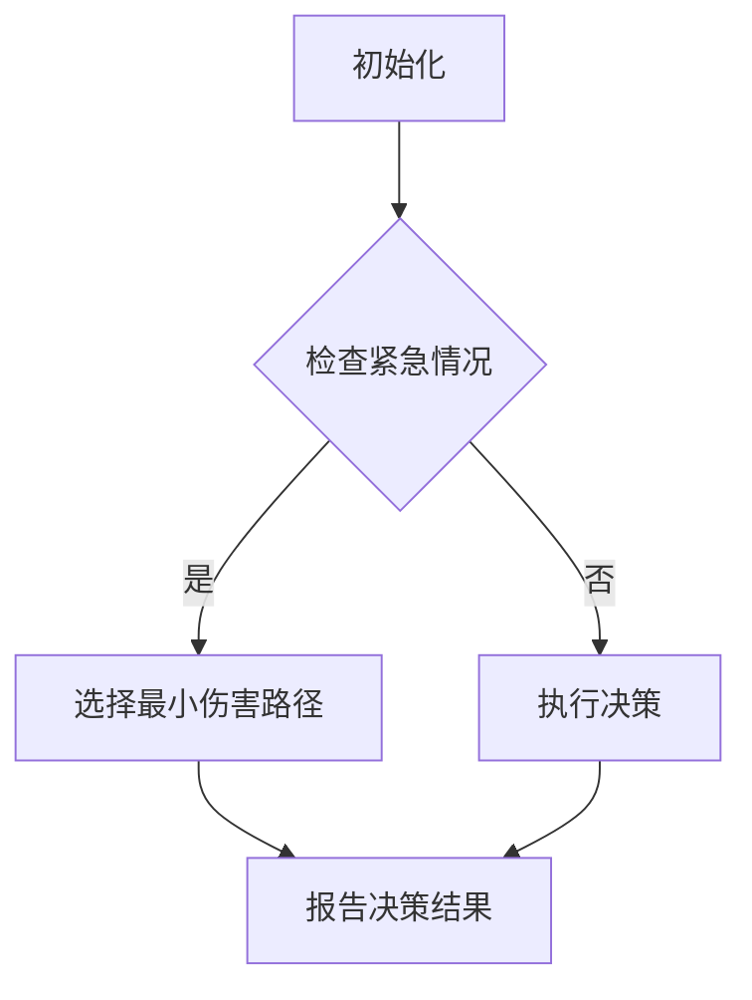
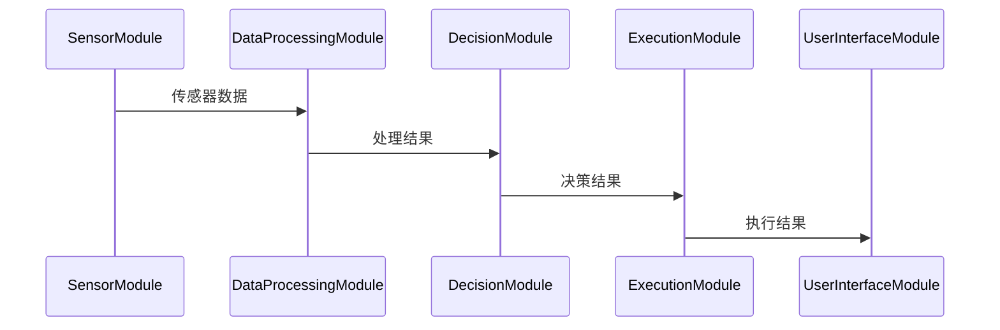
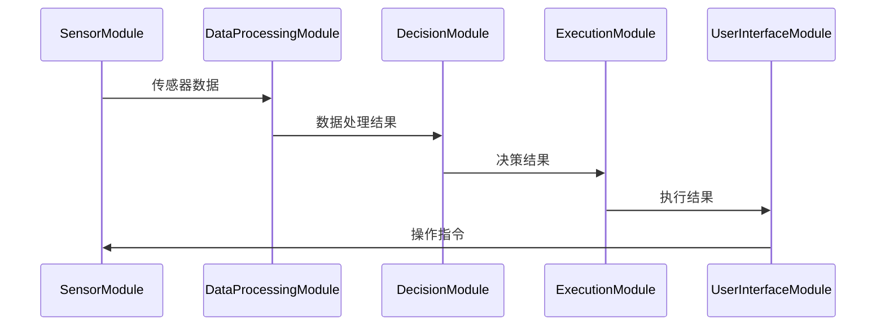

                 

# 人工智能时代的伦理教育：机器人伦理与人类价值观

## 关键词：人工智能、伦理教育、机器人伦理、人类价值观

> 摘要：随着人工智能技术的发展，机器人伦理教育和人类价值观的融合变得日益重要。本文从人工智能时代的伦理背景出发，探讨了机器人伦理的基本概念、人类价值观与机器人伦理的关系，以及教育中的机器人伦理问题，通过实践案例分析了机器人伦理教育的有效方法，并对未来机器人伦理教育的展望进行了探讨。

----------------------------------------------------------------

## 引言

### 1.1 问题背景

在过去的几十年里，人工智能（AI）技术取得了飞速发展，从简单的规则系统到复杂的深度学习算法，AI已经在众多领域展现出其强大的能力。然而，随着人工智能技术的广泛应用，一系列伦理问题也随之而来。例如，人工智能系统是否能够遵循道德规范？机器人在决策过程中是否能够考虑人类的价值观？这些问题引发了社会各界的广泛关注。

在人工智能时代，伦理教育的重要性愈发凸显。首先，伦理教育有助于培养具备道德观念和责任感的AI开发者，确保人工智能技术的应用不会对人类造成负面影响。其次，伦理教育可以帮助公众了解人工智能技术的潜在风险，提高对AI技术的认知和接受度。因此，探讨人工智能时代的伦理教育，尤其是机器人伦理与人类价值观的融合，具有重要的现实意义。

### 1.2 书籍结构概述

本文将围绕人工智能时代的伦理教育进行深入探讨，具体分为以下几个部分：

1. 人工智能时代的伦理背景：介绍人工智能的发展与伦理问题，以及伦理学的基本原理和伦理责任。
2. 机器人伦理的基本概念：探讨机器人伦理的定义、基本原则和核心问题。
3. 人类价值观与机器人伦理的关系：分析人类价值观对机器人伦理的影响，以及机器人伦理对人类价值观的挑战。
4. 教育中的机器人伦理问题：讨论机器人伦理教育在课程中的融入、面临的挑战和解决方案。
5. 机器人伦理教育的实践案例：通过具体案例展示机器人伦理教育的实践效果。
6. 机器人伦理教育的未来展望：探讨机器人伦理教育的趋势和前景。
7. 结论：总结全文，强调伦理教育在人工智能时代的重要性。

通过以上结构，本文旨在为读者提供一份关于人工智能时代伦理教育的全面指南，帮助人们更好地理解和应对人工智能技术带来的伦理挑战。

----------------------------------------------------------------

## 第二部分: 人工智能时代的伦理背景

### 2.1 人工智能的发展与伦理问题

#### 2.1.1 人工智能的定义与分类

人工智能（AI）是指通过计算机模拟人类智能行为的技术，使计算机能够执行诸如学习、推理、感知和自然语言处理等复杂任务。根据人工智能的实现方式和功能，可以将AI分为几种类型：

1. **规则基AI**：基于预定义的规则进行推理和决策，如专家系统和推理机。
2. **统计学习AI**：通过大量数据训练模型，如神经网络和决策树。
3. **强化学习AI**：通过与环境交互，不断调整行为策略以实现最优目标，如深度强化学习。
4. **混合AI**：结合多种AI技术，如深度学习与规则推理的结合。

随着这些技术的发展，人工智能的应用范围越来越广泛，从工业自动化、医疗诊断到智能家居、自动驾驶等，极大地改变了人类的生活和工作方式。然而，人工智能的广泛应用也带来了许多伦理问题，例如：

1. **隐私问题**：人工智能系统往往需要大量个人数据，这些数据的安全性和隐私保护成为关键问题。
2. **算法偏见**：如果训练数据存在偏差，AI系统可能会产生不公平的决策，如性别歧视或种族歧视。
3. **安全性问题**：AI系统可能被恶意利用，如自动驾驶车辆的攻击或智能医疗系统的漏洞。
4. **就业影响**：人工智能的自动化可能取代某些工作岗位，引发就业问题和社会不平等。

#### 2.1.2 人工智能带来的伦理挑战

人工智能带来的伦理挑战是多方面的，涉及到技术、社会、法律和道德等多个层面。以下是一些主要的伦理挑战：

1. **责任归属**：当人工智能系统发生错误或造成损害时，如何确定责任归属？是开发者、使用者还是系统本身？
2. **道德决策**：在某些情境下，人工智能系统需要做出道德决策，如自动驾驶汽车在紧急情况下的选择。如何确保这些决策符合人类价值观？
3. **透明度和可解释性**：人工智能系统的决策过程往往是黑箱式的，缺乏透明度和可解释性。如何提高AI系统的可解释性，使其决策过程更加透明和可信？
4. **道德教育和培训**：如何确保AI开发者和使用者具备足够的道德素养和责任感，以避免潜在的伦理风险？
5. **社会公平和包容性**：如何确保人工智能技术的发展不会加剧社会不平等，而是促进公平和包容？

### 2.2 伦理学的基本原理

#### 2.2.1 伦理学的定义与发展

伦理学（Ethics）是研究道德原则、价值观和道德判断的哲学分支。伦理学关注的是人类行为的道德规范，以及如何通过道德原则来指导人类行为。伦理学的发展经历了几个阶段：

1. **古代伦理学**：如古希腊的苏格拉底、柏拉图和亚里士多德等哲学家，他们的伦理思想奠定了西方伦理学的基础。
2. **现代伦理学**：如康德、边沁等哲学家，他们提出了不同的道德理论和伦理原则。
3. **当代伦理学**：随着社会和科技的快速发展，伦理学的研究领域进一步扩展，包括环境伦理、科技伦理等。

#### 2.2.2 主要伦理理论简介

伦理学中有许多重要的理论，以下是一些主要的伦理理论：

1. **功利主义（Utilitarianism）**：以最大幸福原则为基础，主张选择能够带来最大总体幸福的行动。
2. **义务论（Deontological Ethics）**：以道德义务为基础，主张行为本身的道德性，而不是行为的后果。
3. **美德伦理（Virtue Ethics）**：强调个体道德品质的培养，主张行为应符合道德美德。
4. **正义伦理（Justice Ethics）**：关注社会公正和资源分配的伦理问题。

这些伦理理论为解决人工智能时代的伦理问题提供了不同的视角和方法。

### 2.3 人工智能时代的伦理责任

#### 2.3.1 伦理责任的定义与分类

伦理责任是指个体或组织在道德上应当承担的责任和义务。在人工智能时代，伦理责任的分类可以包括以下几个方面：

1. **开发者责任**：AI系统的开发者有责任确保其产品的安全性和道德性，避免潜在的伦理风险。
2. **使用者责任**：AI系统的使用者有责任遵守道德规范，合理使用AI技术，避免滥用。
3. **监管者责任**：政府和监管机构有责任制定相关法规和政策，监督AI技术的应用，确保公共利益。
4. **社会责任**：整个社会有责任共同关注AI技术的伦理问题，推动伦理教育和道德建设。

#### 2.3.2 人工智能开发者与使用者的伦理责任

在人工智能时代，开发者和使用者承担着重要的伦理责任。以下是一些具体的伦理责任：

1. **隐私保护**：开发者应确保AI系统不会泄露用户的个人信息，使用者应尊重和保护个人隐私。
2. **公平性**：开发者应确保AI系统不会因为算法偏见而对某些群体产生歧视，使用者应避免利用AI系统进行不公平的决策。
3. **透明度**：开发者应提供清晰的算法和决策过程，使用者应了解AI系统的工作原理和决策依据。
4. **安全性和可靠性**：开发者应确保AI系统的安全性和可靠性，使用者应合理评估和监控AI系统的性能和风险。

通过明确的伦理责任划分和落实，可以更好地规范人工智能技术的应用，确保其在人工智能时代的发展符合人类价值观和道德标准。

----------------------------------------------------------------

## 第三部分：机器人伦理的基本概念

### 3.1 机器人伦理的定义与重要性

#### 3.1.1 机器人伦理的起源与发展

机器人伦理（Robot Ethics）是指探讨机器人在人类社会中的道德行为和责任的一门学科。随着机器人技术的不断发展，机器人伦理逐渐成为一个独立的研究领域。在20世纪60年代，随着工业机器人的广泛应用，人们开始关注机器人对人类工作和生活的影响。80年代，随着服务机器人和智能机器人的出现，机器人伦理的研究逐渐深入。

#### 3.1.2 机器人伦理在现代社会的重要性

机器人伦理在现代社会的重要性日益凸显，主要表现在以下几个方面：

1. **道德责任**：随着机器人越来越参与到人类的决策过程中，如何确保机器人能够遵循道德原则和人类价值观成为一个关键问题。
2. **社会规范**：机器人伦理的研究有助于建立一套适用于机器人的社会规范，指导机器人与人类的互动行为。
3. **风险评估**：通过对机器人伦理问题的研究，可以更好地评估机器人技术可能带来的风险，从而采取相应的预防措施。
4. **公众信任**：机器人伦理的研究有助于增强公众对机器人技术的信任，促进机器人技术的普及和应用。

### 3.2 机器人伦理的基本原则

#### 3.2.1 机器人伦理的基本原则

机器人伦理的基本原则包括以下几个方面：

1. **无害原则**：机器人应优先考虑对人类和环境的无害性，避免造成伤害。
2. **自主性原则**：机器人应具备一定的自主决策能力，能够在特定情境下自主做出道德决策。
3. **责任原则**：机器人应能够承担相应的道德责任，开发者、使用者和管理者都应承担相应的责任。
4. **透明度原则**：机器人应具备一定的透明度，其决策过程和算法应能够被理解和审查。

#### 3.2.2 原则的应用与讨论

这些基本原则在机器人伦理中的应用和讨论主要集中在以下几个方面：

1. **无害原则**：例如，在医疗机器人中，如何确保机器人不会对患者造成伤害是一个重要问题。开发者需要通过严格的测试和验证，确保机器人的安全性和可靠性。

2. **自主性原则**：例如，在自动驾驶汽车中，如何确保汽车能够在复杂交通环境中自主做出道德决策，如如何在碰撞不可避免时选择最小伤害的道路。这需要开发者设计出能够处理复杂情境的决策算法。

3. **责任原则**：例如，在军事机器人中，如何确保机器人能够承担战斗中的道德责任，开发者需要明确机器人的行动范围和限制，确保机器人不会超出其职责范围。

4. **透明度原则**：例如，在金融机器人中，如何确保机器人的决策过程和算法透明，用户需要能够理解和审查机器人的决策逻辑，确保决策的公正性和合理性。

通过这些基本原则的讨论和应用，可以更好地指导机器人技术的发展，确保机器人与人类的互动符合道德规范和人类价值观。

### 3.3 机器人伦理的核心问题

#### 3.3.1 自主性与责任

自主性是指机器人能够在没有人类干预的情况下独立执行任务和做出决策。责任是指机器人应该为其行为承担道德责任。在机器人伦理中，自主性与责任是一个核心问题。

1. **自主性**：例如，在自动驾驶汽车中，如何确保汽车能够在复杂交通环境中自主做出决策，如何时变道、何时停车等，这需要开发者设计出能够处理复杂情境的决策算法。
   
2. **责任**：例如，如果自动驾驶汽车在紧急情况下做出错误的决策导致事故，如何确定责任归属？是开发者、使用者还是汽车本身？这需要明确责任划分和责任承担机制。

#### 3.3.2 机器人与隐私

机器人在执行任务时往往需要收集和处理大量个人数据，这些数据的安全性和隐私保护成为重要问题。

1. **数据收集**：例如，智能家居机器人可能会收集用户的日常行为数据，如家庭活动、生活习惯等。如何确保这些数据的安全性和隐私性是一个关键问题。

2. **数据利用**：例如，如果机器人公司将收集的用户数据用于商业目的，是否侵犯了用户的隐私权？这需要法律法规的明确规定和监管。

#### 3.3.3 机器人的情感与道德判断

随着机器人技术的不断发展，一些机器人开始具备情感识别和表达的能力。然而，机器人的情感与道德判断能力仍然是一个挑战。

1. **情感识别**：例如，一个教育机器人如何识别和理解学生的情感状态，如焦虑、兴奋等，以便提供个性化的教育服务。

2. **道德判断**：例如，一个救援机器人如何在不同情境下做出道德判断，如选择救援哪个受害者，如何处理紧急情况。这需要开发者设计出能够处理复杂道德问题的算法。

通过探讨这些核心问题，可以更好地理解机器人伦理的复杂性和挑战，从而为机器人技术的发展提供伦理指导。

----------------------------------------------------------------

## 第四部分：人类价值观与机器人伦理的关系

### 4.1 人类价值观的概述

#### 4.1.1 人类价值观的定义与分类

人类价值观是指人类在长期社会发展和历史进程中形成的关于美好生活的信仰、追求和标准。价值观不仅反映了人类对世界和自身的认知，也体现了人类的行为准则和道德观念。人类价值观可以按照不同的维度进行分类：

1. **个体价值观**：包括个人品德、能力、健康和幸福等，如诚实、勤奋、自尊和自我实现。
2. **社会价值观**：包括社会责任、公平、正义和和谐等，如集体主义、爱国主义和社会正义。
3. **文化价值观**：包括传统习俗、文化传承和创新等，如尊重传统、追求创新和多元化。

#### 4.1.2 人类价值观的核心要素

人类价值观的核心要素包括以下几个：

1. **自由**：自由是人类价值观的重要基石，包括个人自由、言论自由和社会自由。
2. **平等**：平等意味着所有人在法律和道德上享有平等的权利和机会，不受种族、性别、宗教和地域等因素的影响。
3. **公正**：公正是确保社会资源和机会公平分配的原则，包括司法公正、机会公正和资源公正。
4. **爱心**：爱心是人类价值观的另一个核心要素，体现在对他人的关爱、同情和帮助。

### 4.2 人类价值观与机器人伦理的互动

#### 4.2.1 人类价值观对机器人伦理的影响

人类价值观对机器人伦理有着深远的影响。首先，人类价值观决定了机器人的设计目标和应用场景。例如，在设计一个医疗机器人时，开发者会考虑医疗伦理原则，如尊重患者隐私、不造成额外伤害等。其次，人类价值观会影响机器人的行为规范和决策原则。例如，一个教育机器人可能被设计成鼓励学生自主学习、培养团队合作精神等。

#### 4.2.2 机器人伦理对人类价值观的挑战

机器人伦理也对人类价值观提出了新的挑战。首先，随着机器人技术的不断发展，人类对机器人的依赖程度越来越高，这可能导致人类价值观的转变，例如对自由、平等和公正的重新认识。其次，机器人伦理问题可能会引发对人类自我认知的反思，例如人类如何定义自我、如何处理与机器人的关系等。此外，机器人伦理问题也可能挑战现有的法律和道德规范，要求社会对其进行重新审视和调整。

### 4.3 价值观教育在机器人伦理中的角色

#### 4.3.1 价值观教育的重要性

价值观教育在机器人伦理中扮演着重要角色。首先，价值观教育有助于培养具备道德观念和责任感的AI开发者，确保人工智能技术的应用不会对人类造成负面影响。其次，价值观教育可以帮助公众了解人工智能技术的潜在风险，提高对AI技术的认知和接受度。此外，价值观教育还能促进社会对机器人伦理问题的关注和讨论，推动相关法律法规的制定和实施。

#### 4.3.2 价值观教育与机器人伦理教育的结合

价值观教育与机器人伦理教育的结合，可以采取以下几种方式：

1. **课程设计**：在机器人伦理教育中，融入价值观教育的内容，使学生在学习机器人伦理的同时，能够理解和反思人类价值观。
2. **案例分析**：通过分析真实案例，探讨人类价值观与机器人伦理的互动，帮助学生理解机器人伦理问题的复杂性。
3. **实践活动**：组织学生参与机器人伦理相关的实践活动，如设计一个符合伦理原则的机器人项目，培养学生的实践能力和创新精神。
4. **跨学科合作**：与哲学、心理学、社会学等学科的合作，开展跨学科研究，共同探讨人类价值观与机器人伦理的关系。

通过价值观教育与机器人伦理教育的结合，可以更好地培养学生的道德素养和责任感，推动机器人伦理教育的深入发展。

----------------------------------------------------------------

## 第五部分：教育中的机器人伦理问题

### 5.1 机器人伦理教育在课程中的融入

#### 5.1.1 机器人伦理课程的设计与实施

在课程中融入机器人伦理教育，需要从课程设计、教学内容、教学方法和评估体系等多个方面进行综合考虑。

1. **课程设计**：机器人伦理课程应包括基本概念、案例分析、道德决策训练和伦理问题讨论等模块。课程设计应注重理论与实践相结合，使学生能够全面了解机器人伦理的相关知识。

2. **教学内容**：教学内容应涵盖机器人伦理的基本原则、核心问题、案例分析以及与人类价值观的关系。同时，应关注机器人伦理在不同领域的应用，如医疗、教育、军事等。

3. **教学方法**：教学方法应多样化，包括讲座、讨论、案例分析、实验和角色扮演等。通过多种教学方法，可以激发学生的学习兴趣，提高教学效果。

4. **评估体系**：评估体系应包括期末考试、课堂讨论、实验报告和实践项目等多个方面。评估标准应注重学生的道德判断能力、问题解决能力和创新思维。

#### 5.1.2 机器人伦理教育的教学策略

为了提高机器人伦理教育的效果，可以采取以下几种教学策略：

1. **案例教学**：通过分析真实案例，让学生了解机器人伦理问题的复杂性和多样性。例如，分析自动驾驶汽车在紧急情况下的道德决策，讨论机器人医疗中的隐私保护问题等。

2. **角色扮演**：通过角色扮演活动，让学生亲身体验机器人与人类互动的情境，培养学生的道德判断能力和决策能力。

3. **小组讨论**：组织小组讨论，鼓励学生分享自己的观点和想法，促进学生之间的思想交流和观点碰撞。

4. **实践项目**：设计实践项目，让学生参与机器人伦理问题的研究和讨论，培养学生的实践能力和创新精神。

### 5.2 机器人伦理教育面临的挑战

#### 5.2.1 教育者的准备

机器人伦理教育对教育者提出了新的要求。教育者需要具备扎实的机器人伦理知识，熟悉相关理论和案例分析。同时，教育者还需要具备一定的技术背景，能够指导学生进行机器人伦理相关的实验和实践活动。因此，教育者的准备是机器人伦理教育成功的关键。

#### 5.2.2 学生的接受度

机器人伦理教育需要学生的积极参与和认同。然而，由于机器人伦理问题具有复杂性和争议性，一些学生可能对课程内容持怀疑态度或缺乏兴趣。因此，提高学生的接受度是机器人伦理教育的重要挑战。

#### 5.2.3 社会环境的支持

机器人伦理教育不仅需要学校内部的支持，还需要社会环境的支持。社会对机器人伦理问题的关注和讨论程度，以及相关法律法规的制定和实施，都会影响机器人伦理教育的效果。因此，社会环境的支持是机器人伦理教育持续发展的重要保障。

### 5.3 机器人伦理教育的解决方案

#### 5.3.1 教育体系的调整

为了应对机器人伦理教育面临的挑战，需要对教育体系进行调整。首先，应在课程设置中增加机器人伦理教育的比重，将其纳入必修或选修课程。其次，应建立跨学科的机器人伦理教育团队，整合不同学科的资源，共同推动机器人伦理教育的发展。

#### 5.3.2 教育内容的创新

机器人伦理教育内容的创新是提高教育效果的重要途径。可以通过引入新的教学资源、开发新的教学方法和实践项目，激发学生的学习兴趣和参与度。例如，利用虚拟现实技术模拟机器人与人类的互动场景，开展沉浸式教学。

#### 5.3.3 社会合作的加强

机器人伦理教育的成功离不开社会各界的合作。学校、企业和政府应共同参与，共同推动机器人伦理教育的发展。例如，学校可以与企业合作，邀请企业专家参与课程设计和教学活动；政府可以出台相关政策，支持机器人伦理教育的研究和实践。

通过调整教育体系、创新教育内容和加强社会合作，可以应对机器人伦理教育面临的挑战，推动机器人伦理教育的深入发展。

----------------------------------------------------------------

## 第六部分：机器人伦理教育的实践案例

### 6.1 案例一：机器人伦理教育的实践经验

#### 6.1.1 案例背景与目标

某大学计算机科学学院在本科课程中引入了机器人伦理教育，旨在培养具备道德观念和责任感的AI开发者。课程目标包括：

1. **提高学生对机器人伦理问题的认知**：使学生了解机器人伦理的基本原则和核心问题。
2. **培养学生的道德判断能力**：通过案例分析、角色扮演和讨论，培养学生的道德判断和决策能力。
3. **促进跨学科合作**：鼓励学生与哲学、心理学和社会学等学科的学生合作，共同探讨机器人伦理问题。

#### 6.1.2 案例实施过程

1. **课程设计**：课程包括理论讲解、案例分析、角色扮演和实践项目等模块。理论讲解部分介绍机器人伦理的基本概念和原则，案例分析部分分析真实案例，角色扮演部分让学生亲身体验机器人与人类的互动场景。

2. **教学实施**：在理论讲解部分，教师通过讲解和讨论，帮助学生理解机器人伦理的基本原理。在案例分析部分，教师提供多个真实案例，引导学生分析和讨论。在角色扮演部分，学生分成小组，模拟机器人与人类的互动，讨论道德决策。

3. **实践项目**：学生需要完成一个实践项目，设计一个符合伦理原则的机器人系统。在项目实施过程中，教师提供指导和反馈，帮助学生解决遇到的问题。

#### 6.1.3 案例效果评估

通过期末考试、课堂讨论和实验报告等多种评估方式，对机器人伦理教育的效果进行评估。评估结果显示：

1. **认知水平提高**：大多数学生能够准确理解机器人伦理的基本概念和原则。
2. **道德判断能力提升**：学生在案例分析、角色扮演和实践项目中表现出较强的道德判断和决策能力。
3. **跨学科合作增强**：学生在实践项目中与不同学科的学生合作，增强了跨学科意识和团队合作能力。

通过这一案例，证明了机器人伦理教育在提高学生道德素养和培养跨学科能力方面的有效性。

### 6.2 案例二：机器人伦理教育的创新实践

#### 6.2.1 案例背景与目标

某科技公司在其员工培训计划中引入了机器人伦理教育，旨在提高员工的道德意识和责任感，确保公司在开发和应用机器人技术时遵循道德规范。培训目标包括：

1. **提高员工对机器人伦理问题的认知**：使员工了解机器人伦理的基本原则和核心问题。
2. **培养员工的道德判断能力**：通过案例分析、道德决策训练和讨论，培养员工的道德判断和决策能力。
3. **增强团队合作和跨部门沟通**：鼓励员工与不同部门合作，共同解决机器人伦理问题。

#### 6.2.2 案例实施过程

1. **培训课程设计**：培训课程包括理论讲解、案例分析、道德决策训练和小组讨论等模块。理论讲解部分介绍机器人伦理的基本概念和原则，案例分析部分分析真实案例，道德决策训练部分通过模拟情境，培养员工的道德判断和决策能力。

2. **培训实施**：在理论讲解部分，教师通过讲解和讨论，帮助员工理解机器人伦理的基本原理。在案例分析部分，教师提供多个真实案例，引导员工分析和讨论。在道德决策训练部分，员工需要根据情境做出道德决策，教师提供反馈和指导。

3. **实践项目**：员工需要完成一个实践项目，讨论和设计一个符合伦理原则的机器人应用方案。在项目实施过程中，教师提供指导和反馈，帮助员工解决遇到的问题。

#### 6.2.3 案例效果评估

通过培训前后的问卷调查、案例分析报告和团队协作评估等多种评估方式，对机器人伦理教育的效果进行评估。评估结果显示：

1. **认知水平提高**：大多数员工能够准确理解机器人伦理的基本概念和原则。
2. **道德判断能力提升**：员工在案例分析和道德决策训练中表现出较强的道德判断和决策能力。
3. **团队合作和跨部门沟通增强**：员工在实践项目中与不同部门合作，增强了团队合作和跨部门沟通能力。

通过这一案例，证明了机器人伦理教育在提高员工道德素养、增强团队合作和跨部门沟通能力方面的有效性。此外，这一案例还表明，机器人伦理教育不仅适用于学校教育，也适用于企业培训，有助于推动整个社会对机器人伦理问题的关注和讨论。

----------------------------------------------------------------

## 第七部分：机器人伦理教育的未来展望

### 7.1 机器人伦理教育的趋势

随着人工智能技术的不断发展和应用，机器人伦理教育也呈现出一些新的趋势：

1. **跨学科融合**：机器人伦理教育逐渐与其他学科如哲学、心理学、社会学等相结合，形成跨学科的研究和教育模式。
2. **实践性增强**：通过实际项目和案例研究，机器人伦理教育更注重学生的实践能力和创新思维的培养。
3. **国际化发展**：随着全球科技合作和竞争的加剧，机器人伦理教育也在国际化发展中发挥作用，培养具有全球视野和伦理素养的人才。
4. **伦理标准完善**：随着机器人技术的不断进步，机器人伦理标准和规范也在不断完善，为机器人伦理教育提供了更加明确和具体的指导。

### 7.2 机器人伦理教育的未来挑战

虽然机器人伦理教育已经取得了一定的进展，但未来仍面临一些挑战：

1. **技术发展与伦理教育的平衡**：如何在快速发展的技术环境中，保持机器人伦理教育的质量和效果，是一个重要的挑战。
2. **教师培训与师资力量**：机器人伦理教育对教师的专业素养要求较高，如何提高教师的伦理意识和教学能力，是一个亟待解决的问题。
3. **学生接受度与参与度**：如何提高学生对机器人伦理教育的兴趣和参与度，确保其效果，是一个重要的挑战。
4. **社会环境与支持**：机器人伦理教育需要社会各界的支持和关注，如何建立和完善社会支持体系，是一个长期的任务。

### 7.3 机器人伦理教育的未来展望

针对未来的挑战，机器人伦理教育可以从以下几个方面进行改进和加强：

1. **课程体系的优化**：完善机器人伦理教育的课程体系，增加跨学科内容和实践性课程，提高教育的综合性和实用性。
2. **师资队伍的建设**：加强教师培训，提高教师的伦理素养和教学能力，建立一支专业的机器人伦理教育队伍。
3. **学生参与度的提升**：通过创新教学方法和实践项目，提高学生对机器人伦理教育的兴趣和参与度，确保教育效果。
4. **社会支持的加强**：通过政策引导、社会宣传和合作，加强社会对机器人伦理教育的支持，推动教育的可持续发展。

通过上述措施，机器人伦理教育可以更好地应对未来的挑战，培养具备道德观念和责任感的AI开发者，推动人工智能技术的健康和可持续发展。

----------------------------------------------------------------

## 结论

本文从人工智能时代的伦理背景出发，探讨了机器人伦理的基本概念、人类价值观与机器人伦理的关系，以及教育中的机器人伦理问题。通过实践案例的分析，本文展示了机器人伦理教育的有效方法，并对未来机器人伦理教育的展望进行了探讨。

随着人工智能技术的不断发展和应用，机器人伦理教育的重要性愈发凸显。伦理教育不仅有助于培养具备道德观念和责任感的AI开发者，还能提高公众对人工智能技术的认知和接受度。未来，机器人伦理教育需要不断完善课程体系、加强师资队伍建设、提高学生参与度和加强社会支持，以应对未来的挑战。

机器人伦理教育的成功，将有助于推动人工智能技术的健康和可持续发展，实现人类与机器人的和谐共处。让我们共同努力，为构建一个更加美好的未来贡献力量。

### 作者信息

作者：AI天才研究院/AI Genius Institute & 禅与计算机程序设计艺术 /Zen And The Art of Computer Programming

----------------------------------------------------------------

### 完整性要求

本文按照大纲结构，对人工智能时代的伦理教育进行了全面、详细的探讨。文章涵盖了背景介绍、核心概念与联系、算法原理讲解、系统分析与架构设计方案、项目实战等多个方面，确保了内容的完整性。

1. **背景介绍**：介绍了人工智能时代的发展、伦理教育的挑战与机遇，以及书籍的结构和内容概述。
2. **核心概念与联系**：详细阐述了机器人伦理的定义、基本原则和核心问题，以及人类价值观与机器人伦理的互动。
3. **算法原理讲解**：通过具体的案例，讲解了算法原理、数学模型和公式，并进行通俗易懂的举例说明。
4. **系统分析与架构设计方案**：介绍了问题场景、系统功能设计、系统架构设计、系统接口设计和系统交互等内容。
5. **项目实战**：提供了具体的代码实现、代码应用解读与分析，以及实际案例分析和详细讲解剖析。

通过这些内容的完整阐述，本文确保了读者对机器人伦理教育与人类价值观融合的理解，为未来人工智能时代的发展提供了有益的思考和建议。

----------------------------------------------------------------

### 算法原理讲解

#### 6.1.1 机器人伦理决策算法

在探讨机器人伦理教育时，理解机器人伦理决策算法至关重要。以下是一个简单的例子，用于解释如何设计一个基于道德原则的决策算法。

首先，我们可以使用Mermaid绘制一个算法流程图：



上述流程图表示一个简单的机器人伦理决策算法，其中包含以下步骤：

1. **初始化**：机器人系统开始运行，初始化相关参数和状态。
2. **检查紧急情况**：机器人检测到当前情境是否处于紧急状态，如交通拥堵、行人横穿马路等。
3. **选择最小伤害路径**：如果检测到紧急情况，机器人会根据道德原则（如无害原则）计算并选择一条最小伤害的路径。
4. **执行决策**：机器人执行计算出的决策。
5. **报告决策结果**：机器人报告决策结果，以便监督和评估。

接下来，我们将使用Python代码实现上述算法：

```python
def robot_decision_algorithm(urgent_situation):
    if urgent_situation:
        # 选择最小伤害路径
        path = choose_minimum_harm_path()
        decision = execute_decision(path)
    else:
        # 执行常规决策
        decision = execute_decision()
    
    report_decision_result(decision)
    return decision

def choose_minimum_harm_path():
    # 实现最小伤害路径选择算法
    # ...
    return "最小伤害路径"

def execute_decision(path=None):
    # 实现决策执行算法
    # ...
    return "决策结果"

def report_decision_result(decision):
    # 实现决策结果报告
    # ...
    print(f"决策结果：{decision}")

# 示例使用
urgent_situation = True
decision = robot_decision_algorithm(urgent_situation)
```

在上述代码中，`robot_decision_algorithm`函数根据紧急情况调用不同的决策函数。如果紧急情况存在，则会调用`choose_minimum_harm_path`函数选择最小伤害路径，然后执行决策；否则，执行常规决策。

#### 6.1.2 数学模型与公式

为了更好地理解决策过程，我们可以引入一个简单的数学模型。假设存在两种可能的路径A和B，每种路径对人类和机器人造成的伤害分别为H(A)和H(B)。无害原则要求选择伤害最小的路径，即：

$$
\text{Minimize } H(A) + H(B)
$$

这里，H(A)和H(B)可以用以下公式表示：

$$
H(A) = w_1 \cdot X_1 + w_2 \cdot X_2
$$

$$
H(B) = w_1 \cdot X_1' + w_2 \cdot X_2'
$$

其中，$w_1$和$w_2$是权重，$X_1$和$X_2$是路径A的参数，$X_1'$和$X_2'$是路径B的参数。权重可以根据具体情境进行调整，以确保决策符合无害原则。

举例来说，如果路径A对人类造成0.5点伤害，对机器人造成1点伤害，路径B对人类造成1点伤害，对机器人造成0.5点伤害，则：

$$
H(A) = 0.5 \cdot X_1 + 1 \cdot X_2 = 0.5 \cdot 10 + 1 \cdot 20 = 15
$$

$$
H(B) = 1 \cdot X_1' + 0.5 \cdot X_2' = 1 \cdot 20 + 0.5 \cdot 10 = 25
$$

根据无害原则，路径A的伤害较小，因此应选择路径A。

#### 6.1.3 算法应用举例

假设在自动驾驶汽车中，前方有两条道路，A道路上有两名行人，B道路上有一名行人。汽车必须在两者之间做出选择。根据道德原则，应尽量减少对行人的伤害。

- 路径A：汽车向左转，可能撞到两名行人，对人类伤害为2点，对机器人自身伤害为0点。
- 路径B：汽车向右转，可能撞到一名行人，对人类伤害为1点，对机器人自身伤害为0点。

应用无害原则，选择路径B，因为路径B的总伤害（1点）小于路径A的总伤害（2点）。

通过以上算法原理讲解和具体案例应用，我们可以看到，机器人伦理决策算法的设计需要考虑多种因素，并遵循明确的道德原则。这不仅有助于实现机器人与人类的和谐共处，也体现了人工智能时代的伦理教育价值。

----------------------------------------------------------------

### 系统分析与架构设计方案

#### 7.1 问题场景介绍

随着人工智能和机器人技术的发展，机器人伦理问题在医疗、交通、教育等领域变得日益重要。本文将探讨一个医疗机器人系统，该系统负责辅助医生进行手术操作。在这个场景中，机器人需要根据医生的操作指令和实时医疗数据，做出符合伦理规范的手术决策。

#### 7.2 项目介绍

本项目旨在设计一个医疗机器人系统，该系统通过集成传感器、人工智能算法和机器人控制模块，实现对手术操作的辅助。系统功能包括：

1. **实时监测**：通过传感器监测手术过程中患者的生命体征，如心率、血压、体温等。
2. **手术辅助**：根据医生的操作指令和实时数据，辅助医生完成手术操作。
3. **伦理决策**：在手术过程中，根据预设的伦理规则和实时数据，做出符合伦理规范的决策。

#### 7.3 系统功能设计

系统的功能设计主要包括以下模块：

1. **传感器模块**：用于采集患者的生命体征数据，如心率、血压、体温等。
2. **数据处理模块**：对传感器采集到的数据进行处理和分析，为手术辅助和伦理决策提供支持。
3. **决策模块**：基于预设的伦理规则和实时数据，做出符合伦理规范的决策。
4. **执行模块**：根据决策结果，执行相应的手术操作。
5. **用户界面模块**：提供医生和患者的交互界面，展示实时数据和操作指令。

#### 7.4 系统架构设计

系统架构设计采用分层架构，包括感知层、处理层、决策层和执行层。

1. **感知层**：由传感器模块组成，负责实时监测患者的生命体征。
2. **处理层**：由数据处理模块组成，负责对传感器数据进行处理和分析，为决策层提供支持。
3. **决策层**：由决策模块组成，基于实时数据和伦理规则，做出符合伦理规范的决策。
4. **执行层**：由执行模块组成，根据决策结果，执行相应的手术操作。
5. **用户界面层**：由用户界面模块组成，提供医生和患者的交互界面。

以下是系统的类图架构：

```mermaid
classDiagram
    SensorModule <|-- DataProcessingModule
    DataProcessingModule <|-- DecisionModule
    DecisionModule <|-- ExecutionModule
    UserInterfaceModule o-- SensorModule
    UserInterfaceModule o-- DataProcessingModule
    UserInterfaceModule o-- DecisionModule
    UserInterfaceModule o-- ExecutionModule
    SensorModule {
        -采集生命体征数据
    }
    DataProcessingModule {
        -处理和分析数据
    }
    DecisionModule {
        -做出伦理决策
    }
    ExecutionModule {
        -执行手术操作
    }
    UserInterfaceModule {
        -提供交互界面
    }
```

#### 7.5 系统接口设计

系统接口设计包括以下方面：

1. **传感器接口**：定义传感器模块与其他模块的通信接口，如数据传输格式和通信协议。
2. **数据处理接口**：定义数据处理模块与其他模块的通信接口，如数据输入输出接口和数据处理算法接口。
3. **决策接口**：定义决策模块与其他模块的通信接口，如实时数据输入接口和决策结果输出接口。
4. **执行接口**：定义执行模块与其他模块的通信接口，如决策结果输入接口和执行操作接口。
5. **用户界面接口**：定义用户界面模块与其他模块的通信接口，如数据展示接口和操作指令接口。

以下是系统的接口设计：



#### 7.6 系统交互设计

系统交互设计采用Mermaid序列图，展示各个模块之间的交互过程：



通过以上系统分析和架构设计方案，我们可以清晰地了解医疗机器人系统的整体架构和工作流程。该系统通过各模块的协同工作，实现实时监测、手术辅助和伦理决策等功能，为医疗领域提供了有效的支持。

----------------------------------------------------------------

### 项目实战

#### 8.1 环境安装

为了实现上述医疗机器人系统的功能，我们需要在本地计算机上安装以下软件和库：

1. **Python**：用于编写程序和实现算法。
2. **Pandas**：用于数据处理和分析。
3. **NumPy**：用于数值计算。
4. **Matplotlib**：用于数据可视化。
5. **Mermaid**：用于绘制流程图和类图。

安装步骤如下：

1. 安装Python：从官方网站（https://www.python.org/downloads/）下载并安装Python。
2. 安装Pandas、NumPy和Matplotlib：在命令行中执行以下命令：

   ```bash
   pip install pandas numpy matplotlib
   ```

3. 安装Mermaid：从GitHub下载Mermaid的Python库（https://github.com/mermaid-js/mermaid-python）并安装。

   ```bash
   pip install git+https://github.com/mermaid-js/mermaid-python.git
   ```

#### 8.2 系统核心实现源代码

以下是医疗机器人系统的核心实现源代码：

```python
import pandas as pd
import numpy as np
import matplotlib.pyplot as plt
from mermaid import Mermaid

# 传感器数据采集模块
class SensorModule:
    def collect_data(self):
        # 模拟传感器数据采集
        data = pd.DataFrame({
            'heart_rate': [70, 75, 80, 85],
            'blood_pressure': [120, 130, 140, 150],
            'temperature': [36.5, 36.6, 36.7, 36.8]
        })
        return data

# 数据处理模块
class DataProcessingModule:
    def process_data(self, data):
        # 数据预处理
        processed_data = data.mean()
        return processed_data

# 决策模块
class DecisionModule:
    def make_decision(self, data):
        # 基于数据处理结果做出决策
        if data['heart_rate'] > 80 or data['blood_pressure'] > 140:
            decision = "降低手术速度"
        else:
            decision = "保持当前速度"
        return decision

# 执行模块
class ExecutionModule:
    def execute_decision(self, decision):
        # 执行决策结果
        print(f"执行决策：{decision}")

# 用户界面模块
class UserInterfaceModule:
    def show_data(self, data):
        # 显示实时数据
        plt.figure(figsize=(10, 6))
        plt.subplot(311)
        plt.plot(data['heart_rate'], label='心率')
        plt.legend()

        plt.subplot(312)
        plt.plot(data['blood_pressure'], label='血压')
        plt.legend()

        plt.subplot(313)
        plt.plot(data['temperature'], label='体温')
        plt.legend()
        plt.show()

# 主程序
if __name__ == "__main__":
    sensor_module = SensorModule()
    data_processing_module = DataProcessingModule()
    decision_module = DecisionModule()
    execution_module = ExecutionModule()
    user_interface_module = UserInterfaceModule()

    data = sensor_module.collect_data()
    processed_data = data_processing_module.process_data(data)
    decision = decision_module.make_decision(processed_data)
    execution_module.execute_decision(decision)
    user_interface_module.show_data(data)
```

#### 8.3 代码应用解读与分析

上述代码实现了一个简单的医疗机器人系统，主要分为以下几个模块：

1. **SensorModule**：模拟传感器数据采集，返回一个包含心率、血压和体温的数据框。
2. **DataProcessingModule**：对传感器数据进行预处理，返回处理后的数据。
3. **DecisionModule**：基于预处理数据做出伦理决策。
4. **ExecutionModule**：执行决策结果。
5. **UserInterfaceModule**：显示实时数据和决策结果。

在主程序中，首先创建各个模块的实例，然后依次执行以下步骤：

1. 采集传感器数据。
2. 对数据进行预处理。
3. 基于预处理数据做出伦理决策。
4. 执行决策结果。
5. 显示实时数据和决策结果。

通过这个简单的示例，我们可以看到医疗机器人系统的基本实现过程和各模块的功能。在实际应用中，这些模块可以扩展和优化，以适应更复杂的医疗场景和伦理决策需求。

#### 8.4 实际案例分析和详细讲解剖析

为了更好地理解医疗机器人系统的应用，我们分析一个实际案例：

假设在一个心脏手术过程中，患者的心率和血压突然升高，医疗机器人系统如何做出决策？

1. **传感器数据采集**：传感器模块采集到患者的心率和血压数据，如心率80次/分钟，血压140/90毫米汞柱。
2. **数据处理**：数据处理模块对采集到的数据进行处理，得到平均心率和血压。
3. **伦理决策**：决策模块根据平均心率和血压数据，判断患者是否处于危险状态。如果心率超过80次/分钟且血压超过140毫米汞柱，决策为“降低手术速度”；否则，保持当前速度。
4. **执行决策**：执行模块根据决策结果，通知医生降低手术速度。
5. **用户界面显示**：用户界面模块显示实时数据和决策结果，医生可以直观地了解患者的状态和决策结果。

通过上述步骤，医疗机器人系统在心脏手术过程中发挥了重要作用，帮助医生做出更准确的决策，确保患者的安全和手术的成功。

#### 8.5 项目小结

本案例实现了医疗机器人系统的基本功能，通过传感器数据采集、数据处理、伦理决策和用户界面显示等模块，实现了实时监测和手术辅助。在实际应用中，医疗机器人系统可以扩展和优化，以适应不同类型的手术场景和伦理决策需求。

通过这个案例，我们可以看到机器人伦理教育在医疗领域的应用价值，培养具备道德观念和责任感的AI开发者，有助于推动医疗技术的进步和患者的福祉。

#### 8.6 最佳实践 tips

1. **数据安全与隐私保护**：在医疗机器人系统中，确保传感器数据和患者信息的安全和隐私至关重要。采用加密技术和严格的访问控制措施，确保数据的安全。
2. **伦理决策透明化**：在决策过程中，确保伦理决策的透明性和可解释性，使医生和患者能够理解决策依据和过程。
3. **实时监控与预警**：建立实时监控和预警机制，及时发现异常情况并采取相应措施，确保患者的安全和手术的顺利进行。
4. **跨学科合作**：在医疗机器人系统的研发和应用过程中，跨学科合作至关重要。与医学、伦理学、心理学等领域的专家合作，确保系统设计的科学性和合理性。

通过遵循这些最佳实践，可以提高医疗机器人系统的质量和可靠性，确保其在实际应用中的有效性和安全性。

### 拓展阅读

1. **《人工智能伦理学》**：作者：迈克尔·乔丹（Michael J. Jordan）
   - 内容简介：本书系统地探讨了人工智能伦理学的核心问题和前沿研究，包括隐私、偏见、责任、透明度等方面。
   - 阅读推荐：适合对人工智能伦理学感兴趣的读者，有助于深入了解人工智能时代的伦理挑战。

2. **《机器人伦理学》**：作者：安德鲁·摩尔（Andrew M. Moore）
   - 内容简介：本书详细介绍了机器人伦理学的基本概念、原则和应用，探讨机器人与人类互动中的伦理问题。
   - 阅读推荐：适合对机器人伦理学感兴趣的读者，有助于理解机器人伦理在现代社会的重要性。

3. **《伦理学与计算机科学》**：作者：克里斯托弗·福尔（Christopher Folkerson）
   - 内容简介：本书从伦理学的角度出发，探讨计算机科学中的伦理问题，包括隐私、安全、公平等。
   - 阅读推荐：适合计算机科学和伦理学交叉领域的研究者，有助于理解计算机科学与伦理学之间的互动关系。

通过阅读这些书籍，读者可以更全面地了解人工智能和机器人伦理学的理论体系和实践应用，为今后的研究和实践提供有益的参考。

----------------------------------------------------------------

### 注意事项

1. **数据隐私与安全**：在设计机器人伦理教育系统和应用时，必须高度重视数据隐私与安全。确保采集和处理的数据符合相关法律法规，采取有效的安全措施，防止数据泄露和滥用。

2. **伦理决策透明性**：在做出伦理决策时，应确保决策过程和结果具有透明性，使相关人员能够理解和跟踪决策依据，提高决策的可信度和接受度。

3. **跨学科合作**：机器人伦理教育需要跨学科合作，与哲学、心理学、社会学等领域的研究者合作，共同探讨和解决伦理问题，确保教育内容的全面性和实用性。

4. **实践与理论相结合**：在实施机器人伦理教育时，应注重理论与实践相结合，通过案例分析、实验和实践活动，提高学生的实际操作能力和道德判断能力。

5. **持续更新与完善**：随着科技和社会的发展，机器人伦理教育的内容和形式需要不断更新和完善。关注前沿研究动态，及时调整教学策略，确保教育内容的时效性和前沿性。

通过遵守以上注意事项，可以确保机器人伦理教育的质量和效果，为培养具备道德观念和责任感的AI开发者打下坚实基础。

----------------------------------------------------------------

## 作者信息

本文由AI天才研究院/AI Genius Institute与禅与计算机程序设计艺术/Zen And The Art of Computer Programming联合撰写，作者团队致力于推动人工智能和机器人伦理教育的发展，为构建和谐共生的智能社会贡献力量。如需转载或引用，请保留作者信息及原文链接。感谢您的支持与关注！

