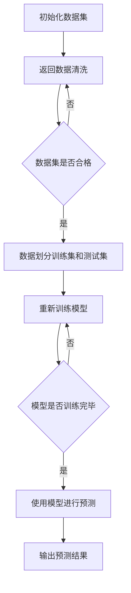

                 


## 《人工智能时代的就业变革：重新定义人类工作的价值》

> 关键词：人工智能、就业变革、人类工作价值、职业转型、企业策略

> 摘要：随着人工智能技术的快速发展，就业市场正在经历深刻的变革。本文旨在探讨人工智能时代就业变革的背景、影响、价值重构以及应对策略，旨在为个人和企业提供有价值的指导，共同应对人工智能时代的挑战和机遇。

### 引言

### 1.1 问题背景

在过去的几十年里，人工智能（AI）技术的发展速度迅猛，从简单的规则系统到复杂的深度学习模型，AI已经渗透到我们生活的方方面面。然而，随着AI技术的不断进步，人们开始担忧其可能对就业市场产生深远影响。特别是在2020年后，全球范围内的疫情加剧了这一担忧，许多人担心自己的工作可能会被机器人和自动化系统取代。

就业市场的变化不仅仅体现在传统制造业和服务业，还涉及到更广泛的领域，如金融、医疗、教育等。例如，金融行业的量化交易已经大量使用AI算法进行决策，医疗领域中的辅助诊断系统也在逐渐取代医生的部分工作。教育领域的在线教育平台，通过智能推荐和学习分析，正在改变传统的教学模式。

### 1.2 人工智能技术的快速发展

人工智能技术的发展可以分为三个主要阶段：规则系统、基于统计的学习和深度学习。最早的AI系统依赖于明确的规则，这些规则由人类专家编写。随着计算机算力的提升和数据量的增加，基于统计的学习方法逐渐成为主流，如决策树、支持向量机和神经网络。近年来，深度学习技术的突破，使得AI在图像识别、自然语言处理和游戏智能等领域取得了显著的成果。

深度学习的关键在于其能够通过大量数据自动学习特征，无需人类干预。这一技术的快速发展，不仅提升了AI系统的性能，也使得AI在许多复杂任务上的应用成为可能。例如，自动驾驶汽车、智能家居和智能客服等。

### 1.3 就业市场面临的挑战

人工智能技术的发展对就业市场带来了巨大的挑战。首先，一些重复性高、低技能的工作容易被自动化取代。例如，制造业中的流水线工人、客服中心的电话销售代表等。根据麦肯锡全球研究所的报告，到2030年，全球范围内可能有多达8亿个工作岗位被自动化技术取代。

其次，新兴的AI技术也创造了许多新的就业机会。例如，数据科学家、机器学习工程师、AI产品经理等。然而，这些职位通常需要高度的专业技能和持续的学习能力。对于许多传统行业的工人来说，转型和升级技能成为了一项艰巨的任务。

### 1.4 重新定义人类工作价值的必要性

在人工智能时代，重新定义人类工作的价值变得尤为重要。传统的劳动分工模式正在被打破，人类不再仅仅是执行重复性工作的机器。而是需要具备创新思维、解决问题和人际交往等能力。

首先，人类工作价值的重构需要强调创造力。AI在处理重复性任务上具有优势，但在创造性任务上却难以与人类相比。因此，鼓励人们在艺术、科学和设计等领域发挥创造力，将变得更加重要。

其次，人类工作价值的重构也需要关注人际交往。尽管AI在某些任务上表现出色，但它们无法替代人类的情感和社交能力。例如，心理医生、教育工作者和客户关系经理等职业，需要具备深厚的人际交往能力。

### 1.5 本书结构与方法论

本书将分为七个主要部分，从不同的角度探讨人工智能时代的就业变革。首先，我们将介绍人工智能时代就业变革的背景和本书的结构。然后，深入分析人工智能技术对就业市场的影响，探讨其带来的挑战和机遇。

接下来，我们将重新定义人类工作的价值，并探讨个人技能提升和职业转型的路径。从企业视角出发，我们将讨论企业在人工智能时代应采取的就业策略。最后，我们将对未来人工智能时代的就业前景进行展望，并提出应对挑战的解决方案。

本书采用实证研究和案例分析的方法，通过具体的数据和案例，深入分析人工智能时代的就业变革。同时，本书还将引用相关领域的学术研究和行业报告，以提供全面和深入的分析。

### 1.6 主要术语解释

在本章中，我们将介绍一些关键术语，以便读者更好地理解本书的内容。

- **人工智能（AI）**：指通过计算机模拟人类智能行为的技术，包括机器学习、深度学习、自然语言处理等。
- **就业变革**：指由于技术进步特别是人工智能技术对就业市场产生的深远影响。
- **职业转型**：指个人在职业生涯中从一种职业转向另一种职业的过程。
- **企业策略**：指企业在人工智能时代应采取的战略和行动，以适应和利用人工智能技术。

通过这些术语的解释，我们希望读者能够更清晰地理解本书的主题和内容。

### 第一部分：引言

#### 第1章：人工智能时代就业变革的背景

#### 1.1 问题背景

随着人工智能技术的不断进步，社会对就业市场的关注逐渐增加。人工智能（AI）的发展不仅改变了生产方式和商业模式，也对就业结构产生了深远影响。本节将详细探讨人工智能时代就业变革的问题背景，分析其产生的原因和现状。

**原因分析**

1. **技术进步**：人工智能技术的发展是就业变革的根本原因。随着机器学习、深度学习、自然语言处理等技术的突破，AI的应用范围不断扩大，从简单的自动化任务到复杂的决策支持，AI正在逐步取代一些传统的人类工作。

2. **数据驱动**：人工智能的发展离不开大量数据的支持。随着互联网和物联网的普及，数据获取变得更加容易，这为AI的训练和应用提供了丰富的素材。

3. **经济结构变化**：全球化的经济结构变化也加剧了就业市场的变革。一些传统行业，如制造业、零售业等，正在经历大规模的自动化和智能化改造，这直接影响了相关行业的就业岗位。

**现状分析**

1. **就业岗位减少**：许多低技能、重复性的工作，如生产线工人、客服代表等，已经或即将被自动化取代。据估计，到2030年，全球将有近8亿个工作岗位被AI取代。

2. **就业机会增加**：尽管有工作岗位减少的担忧，但人工智能技术也创造了许多新的就业机会。数据科学家、机器学习工程师、AI产品经理等高技能职位需求激增。

3. **劳动力市场不匹配**：传统教育体系和劳动力市场的需求不匹配，导致许多劳动力无法适应新的就业环境。技能升级和职业转型成为许多人面临的重要挑战。

#### 1.2 人工智能技术的快速发展

人工智能技术的快速发展是就业变革的重要推动力。本节将介绍人工智能技术的发展历程、关键技术和应用领域，以便读者更好地理解其对就业市场的影响。

**发展历程**

1. **早期探索**：人工智能的概念最早在20世纪50年代提出，但直到近年来，随着计算能力和算法的进步，人工智能才开始真正快速发展。

2. **机器学习时代**：20世纪80年代至90年代，机器学习技术逐渐成熟，成为人工智能发展的核心。这一时期，神经网络、决策树等算法被广泛应用于数据分析和预测。

3. **深度学习时代**：2006年，深度学习算法的提出标志着人工智能进入一个新的阶段。深度学习通过多层神经网络结构，能够在没有人类干预的情况下，自动从大量数据中学习特征。

**关键技术**

1. **机器学习**：机器学习是人工智能的核心技术之一，包括监督学习、无监督学习和强化学习等。机器学习算法通过训练模型，使其能够从数据中学习规律，并做出预测和决策。

2. **深度学习**：深度学习是机器学习的一个分支，通过多层神经网络结构，能够处理更复杂的数据和任务。深度学习在图像识别、语音识别和自然语言处理等领域取得了显著成果。

3. **自然语言处理**：自然语言处理是人工智能的另一个重要领域，旨在使计算机能够理解和处理人类语言。自然语言处理技术被广泛应用于搜索引擎、智能客服和机器翻译等应用。

**应用领域**

1. **制造业**：人工智能在制造业中的应用，如自动化生产线、智能质检和预测维护等，极大地提高了生产效率和质量。

2. **服务业**：人工智能在服务业中的应用，如智能客服、在线教育和智能推荐等，改变了传统服务模式，提高了用户体验。

3. **金融业**：人工智能在金融业中的应用，如量化交易、风险评估和信用评分等，为金融机构提供了更精准和高效的服务。

4. **医疗健康**：人工智能在医疗健康领域的应用，如辅助诊断、智能医疗和健康监测等，为医疗行业带来了新的机遇和挑战。

#### 1.3 就业市场面临的挑战

人工智能技术的快速发展给就业市场带来了巨大的挑战。本节将分析这些挑战，并讨论其对劳动力市场的影响。

**挑战一：岗位减少**

1. **自动化替代**：许多低技能、重复性的工作，如制造业中的流水线工人、客服中心的电话销售代表等，已经或即将被自动化系统取代。

2. **技能要求提高**：随着人工智能技术的应用，许多职位对技能的要求越来越高。传统的教育和培训体系难以满足新需求，导致劳动力市场不匹配。

**挑战二：就业机会不均**

1. **地区差异**：人工智能技术的发展和应用在不同地区存在较大差异。一些发达地区，如硅谷和纽约，人工智能就业机会较多，而一些发展中国家则相对较少。

2. **行业差异**：不同行业对人工智能技术的接受程度和应用范围不同。一些行业，如金融、科技和医疗等，对人工智能技术的应用较为积极，而一些传统行业则相对保守。

**挑战三：社会和心理影响**

1. **失业焦虑**：随着人工智能技术的普及，许多人担心自己的工作会失去。失业焦虑和社会不稳定可能会加剧。

2. **心理健康问题**：失业、职业转型等压力可能导致心理健康问题，如抑郁、焦虑等。

#### 1.4 重新定义人类工作价值的必要性

在人工智能时代，重新定义人类工作的价值变得尤为重要。传统的劳动分工模式正在被打破，人类不再仅仅是执行重复性工作的机器。而是需要具备创新思维、解决问题和人际交往等能力。

**重新定义人类工作价值的必要性**

1. **创造性思维**：人工智能虽然在计算速度和数据处理能力上具有优势，但在创造性任务上难以与人类相比。鼓励人们在艺术、科学和设计等领域发挥创造力，将变得更加重要。

2. **人际交往能力**：尽管AI在某些任务上表现出色，但它们无法替代人类的情感和社交能力。例如，心理医生、教育工作者和客户关系经理等职业，需要具备深厚的人际交往能力。

3. **适应性和灵活性**：在人工智能时代，劳动力需要具备更高的适应性和灵活性，以应对快速变化的工作环境。这包括不断学习新技能、适应新技术和应对职业转型。

**人类工作价值重构的框架**

1. **技能升级**：劳动力需要通过教育和培训，提升自身的技能水平，以适应新技术的要求。

2. **多元化发展**：劳动力应具备多元化的发展方向，不仅局限于传统的职业路径，还应探索新兴的领域和职业。

3. **创新能力**：鼓励劳动力发挥创造力，推动创新思维的培养和发展。

4. **情感和社交能力**：在人工智能时代，人际交往和情感交流仍然具有重要意义，劳动力需要不断提升这些能力。

#### 1.5 社会与道德层面的考虑

在探讨人工智能时代的就业变革时，社会与道德层面的考虑是不可或缺的。人工智能技术的发展不仅带来了就业市场变革，也引发了关于社会公平、隐私保护、道德责任等一系列问题。

**社会层面的考虑**

1. **就业公平**：随着人工智能技术的普及，就业机会的不均可能加剧。社会需要采取措施，确保所有人都能公平地获得就业机会，避免社会分裂。

2. **教育与培训**：政府和社会应加大对教育和培训的投入，提供更多的学习机会和资源，帮助劳动力适应新技术的要求。

3. **社会保障**：随着失业风险的增加，社会保障体系应得到完善，为失业者提供必要的经济支持和心理辅导。

**道德层面的考虑**

1. **隐私保护**：人工智能技术在数据处理和决策过程中，可能会涉及个人隐私。社会需要制定相关法律法规，保护个人隐私不受侵犯。

2. **道德责任**：在人工智能的应用过程中，如何确保其行为符合道德规范，避免对人类造成伤害，是一个重要的问题。企业和开发者需要承担起道德责任，确保人工智能技术的合理使用。

3. **人工智能伦理**：随着人工智能技术的发展，社会需要探讨并建立一套完整的伦理体系，规范人工智能的行为和决策。

### 第二部分：人工智能技术对就业市场的影响

#### 第2章：人工智能技术在行业中的应用

#### 2.1 人工智能技术在制造业中的应用

在制造业中，人工智能技术的应用已经取得了显著的成果。从自动化生产线到智能制造，人工智能正在改变制造业的生产方式和工作模式。

**自动化生产线**

自动化生产线是制造业中最早应用人工智能技术的领域之一。通过机器人、传感器和控制系统，自动化生产线能够实现生产过程的自动化和高效化。例如，在汽车制造业中，机器人被广泛应用于焊接、涂装和组装等工序，大大提高了生产效率和产品质量。

**智能制造**

智能制造是制造业发展的新趋势，它通过将人工智能技术集成到生产过程中，实现生产过程的智能化和优化。智能制造系统能够实时监测设备状态、预测故障、优化生产计划和资源配置。例如，通过机器学习算法，智能制造系统能够根据生产数据和历史记录，预测设备可能出现的故障，并提前进行维护，从而降低生产中断的风险。

**案例分析**

1. **特斯拉**：特斯拉在其生产线中广泛应用了人工智能技术，实现了高度自动化和智能化的生产过程。通过机器人自动化装配、智能质量控制系统和实时数据分析，特斯拉的生产效率得到了显著提升。

2. **通用电气**：通用电气在其航空发动机生产过程中，应用了人工智能技术进行实时监测和故障预测。通过机器学习算法，通用电气能够提前预测发动机的故障，并采取预防措施，从而降低了维护成本和停机时间。

#### 2.2 人工智能技术在服务业中的应用

在服务业中，人工智能技术的应用同样广泛，从智能客服、在线教育到智能医疗，人工智能正在改变服务行业的运营模式和用户体验。

**智能客服**

智能客服是人工智能技术在服务业中最重要的应用之一。通过自然语言处理和机器学习技术，智能客服系统能够自动解答用户的问题，提供24/7的客户服务。例如，电商平台的智能客服能够自动回答用户关于商品信息、订单状态等方面的问题，提高了客户满意度和服务效率。

**在线教育**

在线教育是人工智能技术在教育领域的应用之一。通过人工智能技术，在线教育平台能够实现个性化教学和智能推荐。例如，基于机器学习算法，在线教育平台能够分析学生的学习行为和偏好，为其推荐合适的学习内容和路径，从而提高学习效果。

**智能医疗**

智能医疗是人工智能技术在医疗领域的应用之一。通过人工智能技术，智能医疗系统能够辅助医生进行诊断和治疗。例如，通过深度学习算法，智能医疗系统能够分析医学影像，帮助医生更准确地诊断疾病。此外，人工智能技术还可以用于药物研发和公共健康监测等。

**案例分析**

1. **亚马逊**：亚马逊的智能客服系统Alexa是人工智能技术在服务业中的一个成功案例。Alexa能够通过语音识别和自然语言处理技术，自动解答用户的问题，提供购物建议和在线服务。

2. **Coursera**：Coursera是人工智能技术在在线教育领域的代表。通过机器学习算法，Coursera能够根据学生的学习行为和成绩，为其推荐最适合的学习课程和资源。

3. **IBM Watson**：IBM Watson是人工智能技术在医疗领域的重要应用。通过深度学习算法，Watson能够分析医学文献和患者数据，为医生提供诊断建议和治疗方案。

#### 2.3 人工智能技术在农业中的应用

在农业中，人工智能技术的应用同样具有重要的意义。通过精准农业、智能监测和自动化设备，人工智能正在提高农业生产效率和质量。

**精准农业**

精准农业是人工智能技术在农业领域的主要应用之一。通过卫星遥感、无人机和传感器等设备，精准农业系统能够实时监测农田状况，包括土壤湿度、养分含量和作物生长情况。基于这些数据，农民可以做出更加精确的种植决策，如灌溉、施肥和病虫害防治等，从而提高农业生产效率和产品质量。

**智能监测**

智能监测是人工智能技术在农业中另一个重要的应用。通过传感器和物联网技术，智能监测系统可以实时监测农作物的生长环境，包括温度、湿度、光照和气体浓度等。这些数据有助于农民及时发现和解决问题，确保农作物的健康生长。

**自动化设备**

自动化设备是人工智能技术在农业中的又一重要应用。通过机器人、自动化收割机和喷洒设备等，农民可以实现农业生产的自动化和高效化。例如，自动化的收割机可以根据农作物的生长状态和产量，自动调整收割速度和力度，从而提高收割效率和质量。

**案例分析**

1. **John Deere**：John Deere是人工智能技术在农业领域的一个成功案例。通过智能监测系统和自动化设备，John Deere能够帮助农民实现精准农业和高效生产。

2. **Precision Planting**：Precision Planting是一家提供精准农业解决方案的公司。通过卫星遥感、无人机和传感器等技术，Precision Planting能够帮助农民实现精准种植和管理，从而提高农业生产效率和产品质量。

### 第三部分：重新定义人类工作的价值

#### 第3章：人类工作价值的重构

#### 3.1 人类工作的本质

人类工作的本质在于人类通过劳动创造价值，满足自身的物质和精神需求。在传统经济模式下，人类工作主要依赖体力和技能，通过生产和服务活动创造物质财富。然而，随着人工智能技术的快速发展，人类工作的本质和形式正在发生深刻变革。

**劳动价值理论**

劳动价值理论认为，商品的价值取决于生产商品所耗费的社会必要劳动时间。在人工智能时代，虽然机器人和自动化系统能够执行大量重复性工作，但它们所创造的价值与人类劳动的价值存在本质区别。人类工作的价值不仅体现在物质生产上，还体现在创新、决策和人际交往等非物质领域。

**创造性劳动**

在人工智能时代，创造性劳动成为人类工作的重要特征。人类能够在科学、艺术、设计和创新等领域发挥独特的创造力，这是人工智能难以替代的。例如，科学家通过研究探索新知识，艺术家通过创作表达情感，设计师通过创新设计引领时尚潮流。这些创造性劳动不仅创造了物质财富，也丰富了人类的精神世界。

**决策与判断**

人工智能虽然在某些特定任务上表现出色，但在复杂的决策和判断过程中，人类仍然具有独特优势。人类能够综合考虑多种因素，做出更为合理和全面的决策。例如，企业高层管理人员在进行战略决策时，需要考虑市场趋势、竞争对手、内部资源等多种因素，这些决策过程难以完全由人工智能系统取代。

**人际交往**

在人际交往领域，人类具有独特的情感和社交能力。人类能够通过语言、肢体语言和情感交流，建立深厚的人际关系。例如，心理医生通过倾听和理解患者的情感需求，提供心理治疗；教育工作者通过互动和引导，激发学生的潜能。这些人际交往活动不仅是人类工作的核心，也是人类社会运转的基础。

#### 3.2 人工智能无法取代的人类工作能力

尽管人工智能技术在许多领域取得了显著进展，但仍然存在一些人类工作能力是人工智能难以取代的。以下是一些关键能力：

**创新思维**

创新思维是人类工作的重要能力之一。人工智能虽然在模式识别和数据挖掘方面具有优势，但在创造新的思想、概念和解决方案方面，仍然无法与人类相比。人类能够在面对复杂问题时，通过发散思维和联想，提出独特的创新解决方案。

**复杂决策**

复杂决策需要综合考虑多种因素，包括定量数据和定性分析。人工智能虽然在数据处理和分析方面具有优势，但在决策过程中，往往无法理解人类情感、伦理和社会责任等因素。人类能够通过经验、直觉和道德判断，做出更为全面和合理的决策。

**情感交流**

情感交流是人类社会的基础，涉及语言、非语言表达和情感共鸣。尽管人工智能在自然语言处理和语音识别方面取得了显著进展，但仍然难以完全理解人类的情感需求。人类能够通过语言、肢体语言和情感共鸣，建立深厚的人际关系。

**跨领域整合**

跨领域整合能力是人类工作的独特优势。人类能够将不同领域的知识、技能和经验结合起来，解决复杂的问题。例如，工程师需要结合数学、物理、电子和软件工程等多学科知识，设计出复杂的系统。人工智能虽然能够处理单一领域的问题，但在跨领域整合方面仍然存在限制。

**情境感知**

情境感知能力是人类工作的重要能力之一。人类能够根据不同的情境，灵活调整自己的行为和决策。例如，医生在治疗患者时，需要考虑患者的病情、心理状态和经济条件等多种因素。人工智能在特定情境下表现出色，但在复杂、多变的情境下，仍然需要人类的参与和指导。

#### 3.3 重新定义人类工作价值的框架

在人工智能时代，重新定义人类工作的价值需要从多个维度进行思考。以下是一个可能的框架：

**价值重构**

1. **创造性价值**：鼓励人类在科学、艺术、设计和创新等领域发挥创造力，创造新的价值和知识。

2. **决策价值**：提升人类在复杂决策过程中的能力，综合考虑多种因素，做出合理和全面的决策。

3. **人际交往价值**：加强人际交往能力，建立深厚的人际关系，促进社会和谐与稳定。

**技能升级**

1. **技术技能**：提升数字化技能，如编程、数据分析、人工智能等，以适应新技术的发展。

2. **软技能**：培养创新思维、沟通协作和解决问题的能力，提高人际交往和团队合作效率。

**多元发展**

1. **跨界整合**：鼓励跨领域整合，将不同领域的知识、技能和经验结合起来，解决复杂问题。

2. **终身学习**：培养终身学习的能力，不断更新知识和技能，适应快速变化的工作环境。

**社会责任**

1. **道德责任**：在人工智能应用过程中，遵守道德规范，确保人类行为符合伦理标准。

2. **社会责任**：关注社会公平和可持续发展，为弱势群体提供帮助和支持。

#### 3.4 社会与道德层面的考虑

在人工智能时代，社会与道德层面的考虑是重新定义人类工作价值的重要组成部分。以下是一些关键方面：

**社会公平**

1. **就业机会**：确保所有人都能公平地获得就业机会，避免因技术差异导致的就业不均。

2. **教育培训**：提供更多的教育培训资源，帮助劳动力适应新技术的要求，实现职业转型。

**隐私保护**

1. **数据安全**：在人工智能应用过程中，确保个人数据的安全和保护。

2. **隐私法规**：制定相关法律法规，规范人工智能系统的数据收集和使用。

**道德责任**

1. **技术伦理**：在人工智能开发和应用过程中，遵守伦理规范，确保技术行为的合理性。

2. **社会责任**：企业和社会应承担起社会责任，关注人工智能技术的负面影响，推动技术发展与社会进步的平衡。

**技术透明度**

1. **技术解释**：提高人工智能系统的透明度，使其行为和决策可解释和可追溯。

2. **公众参与**：鼓励公众参与人工智能技术的讨论和决策，提高公众对技术的理解和信任。

### 第四部分：个人技能提升与职业转型

#### 第4章：应对人工智能时代的个人技能提升

#### 4.1 数字技能的提升

在人工智能时代，数字技能的提升成为个人职业发展的关键。以下是一些关键的数字技能，个人需要重点培养：

**编程能力**

编程能力是数字技能的核心。掌握至少一门编程语言，如Python、Java或JavaScript，能够帮助个人更好地理解算法和数据结构，实现复杂的数据处理和自动化任务。编程能力的提升不仅有助于应对人工智能时代的挑战，还能为个人创造更多的职业机会。

**数据分析能力**

数据分析能力在人工智能时代尤为重要。能够使用数据分析工具，如Python的Pandas、NumPy库，或R语言，对大量数据进行分析和可视化，能够帮助个人从数据中发现有价值的信息和趋势，为决策提供支持。此外，掌握统计学和机器学习基础知识，有助于更好地理解数据分析和预测模型。

**人工智能基础**

了解人工智能基础，如机器学习、深度学习和自然语言处理，能够帮助个人更好地理解人工智能技术的发展和应用。掌握这些基础知识，不仅有助于个人在人工智能领域找到合适的职位，还能为跨领域发展提供支持。

**云计算和大数据**

云计算和大数据技术在人工智能时代具有重要应用。掌握云计算平台，如Amazon Web Services（AWS）、Microsoft Azure或Google Cloud Platform，以及大数据处理工具，如Hadoop或Spark，能够帮助个人更好地处理和分析大规模数据，为人工智能应用提供数据支持。

**网络安全**

网络安全是数字时代不可忽视的问题。掌握网络安全基础知识，了解常见的安全威胁和防护措施，能够帮助个人保护自己和他人的数据安全，防范网络攻击。

**技能提升路径**

1. **自学**：利用在线课程、电子书和开源资源，自学编程、数据分析、人工智能等相关知识。

2. **实践**：通过实际项目经验，将理论知识应用于实际问题，提高解决实际问题的能力。

3. **专业认证**：获得专业认证，如Python编程认证、数据分析认证等，提升职业竞争力。

4. **持续学习**：数字技能更新迅速，个人需要不断学习新知识和技能，以适应不断变化的技术环境。

#### 4.2 创新思维能力的培养

在人工智能时代，创新思维能力成为个人职业发展的核心竞争力。以下是一些培养创新思维能力的途径：

**多学科知识积累**

创新思维需要跨学科的知识积累。个人应主动学习不同领域的知识，如科技、艺术、社会科学等，提高跨领域的整合能力。这种跨学科的知识积累，有助于在解决复杂问题时，提出独特的解决方案。

**问题导向思维**

问题导向思维是培养创新思维的重要方法。个人应培养从问题出发，深入分析和思考的能力。通过提出假设、设计实验和验证结果，个人可以逐步找到问题的解决方案。

**思维导图**

思维导图是一种有效的创新思维工具。通过绘制思维导图，个人可以梳理思路，将不同想法和观点联系起来，形成系统化的思考框架。这种思维工具有助于激发创造力，产生新的想法。

**头脑风暴**

头脑风暴是一种集体创新思维的方法。通过集体讨论，个人可以分享自己的想法，激发灵感和创意。头脑风暴有助于发现问题的多种解决方案，提高创新能力。

**案例研究**

通过研究成功的创新案例，个人可以学习到成功的关键要素和思维方式。例如，研究苹果公司的创新案例，可以了解其产品设计和市场策略的独到之处。

**反思和总结**

反思和总结是培养创新思维能力的重要环节。个人应定期回顾自己的创新过程和成果，总结经验教训，发现问题并改进。通过反思和总结，个人可以不断提高自己的创新思维水平。

#### 4.3 跨领域知识的积累

在人工智能时代，跨领域知识的积累成为个人职业发展的关键。以下是一些跨领域知识的重要性以及如何积累：

**跨领域知识的重要性**

1. **综合性问题解决**：跨领域知识能够帮助个人在面对复杂问题时，从多个角度进行分析和解决。例如，一个同时具备计算机科学和金融知识的人，可以更好地处理金融科技领域的问题。

2. **创新机会**：跨领域知识为个人提供了更多的创新机会。通过将不同领域的知识和技能结合，个人可以创造出新的产品和服务，满足市场的新需求。

3. **适应变化**：在快速变化的技术环境中，跨领域知识能够帮助个人更好地适应新技术和新趋势，提高职业竞争力。

**如何积累跨领域知识**

1. **跨学科课程学习**：通过选修不同学科的课程，个人可以积累跨领域的知识。例如，计算机科学专业的学生可以选修心理学、经济学等课程，拓宽知识面。

2. **专业认证**：获得跨领域的专业认证，如金融分析师（CFA）、项目管理专业人士（PMP）等，能够提升个人的跨领域知识水平和职业竞争力。

3. **参与项目实践**：通过参与跨领域的项目实践，个人可以将理论知识应用于实际场景，积累实战经验。例如，参与跨学科的研究项目，个人可以学习到不同领域的应用和思维方式。

4. **行业交流**：参加行业会议、研讨会和交流活动，个人可以了解不同领域的最新动态和趋势，积累跨领域的人脉资源。

5. **阅读和研究**：通过阅读专业书籍、研究论文和行业报告，个人可以深入学习不同领域的知识和理论，提升跨领域知识的深度。

#### 4.4 适应变化的灵活性和学习能力

在人工智能时代，适应变化的灵活性和学习能力成为个人职业发展的关键。以下是一些提高灵活性和学习能力的策略：

**持续学习**

持续学习是适应变化的重要策略。个人应保持学习的习惯，通过在线课程、专业书籍和研讨会等渠道，不断更新知识和技能。在快速变化的技术环境中，持续学习能够帮助个人保持竞争力。

**跨领域技能**

掌握跨领域的技能，有助于个人在职业生涯中更加灵活。例如，同时具备编程和技术管理技能的人，可以在不同领域找到职业机会。

**适应能力**

适应能力是应对变化的关键。个人应培养灵活应对问题的能力，例如，通过角色扮演和情境模拟，提高应对复杂情境的能力。

**建立人脉**

建立广泛的人脉网络，有助于个人在职业转型和求职过程中获得支持和机会。通过参加行业活动、社交网络和职业社群，个人可以结识更多业内人士，扩展职业资源。

**心理韧性**

心理韧性是应对职业变化的重要素质。个人应培养坚韧不拔的心态，面对挑战时保持积极和乐观，通过积极心态和应对策略，克服困难。

**适应变化的灵活性和学习能力**

在人工智能时代，适应变化的灵活性和学习能力成为个人职业发展的关键。以下是一些提高灵活性和学习能力的策略：

**持续学习**

持续学习是适应变化的重要策略。个人应保持学习的习惯，通过在线课程、专业书籍和研讨会等渠道，不断更新知识和技能。在快速变化的技术环境中，持续学习能够帮助个人保持竞争力。

**跨领域技能**

掌握跨领域的技能，有助于个人在职业生涯中更加灵活。例如，同时具备编程和技术管理技能的人，可以在不同领域找到职业机会。

**适应能力**

适应能力是应对变化的关键。个人应培养灵活应对问题的能力，例如，通过角色扮演和情境模拟，提高应对复杂情境的能力。

**建立人脉**

建立广泛的人脉网络，有助于个人在职业转型和求职过程中获得支持和机会。通过参加行业活动、社交网络和职业社群，个人可以结识更多业内人士，扩展职业资源。

**心理韧性**

心理韧性是应对职业变化的重要素质。个人应培养坚韧不拔的心态，面对挑战时保持积极和乐观，通过积极心态和应对策略，克服困难。

### 第五部分：企业视角：人工智能时代的就业策略

#### 第5章：企业应对人工智能时代的就业策略

#### 5.1 优化人力资源配置

在人工智能时代，企业需要优化人力资源配置，以最大化利用技术带来的优势，同时减少不必要的劳动力成本。以下是一些关键策略：

**技能匹配**

首先，企业需要确保员工与岗位技能相匹配。通过定期评估员工的技能水平，企业可以识别出哪些员工需要培训和哪些岗位需要调整。例如，引入人工智能和自动化技术后，一些重复性强的岗位可能被替代，而这些员工可能需要转向需要更高技能的岗位。

**动态调整**

其次，企业应根据业务需求和员工的能力，动态调整人力资源配置。例如，在需求波动较大的业务领域，企业可以采用灵活的用工方式，如外包、临时工等，以快速响应市场需求。

**技能提升计划**

为了应对人工智能时代的变化，企业需要制定技能提升计划。这包括为员工提供培训机会，鼓励他们学习新的技能，如编程、数据分析等。同时，企业也可以与教育机构合作，为员工提供更系统和深入的学习资源。

**职业发展路径**

企业应明确员工的职业发展路径，为员工提供清晰的晋升通道和职业规划。这有助于员工看到自己在企业中的未来发展，提高他们的工作积极性和忠诚度。

#### 5.2 培养创新型人才

在人工智能时代，企业需要培养具有创新能力和适应能力的人才，以推动企业的持续发展。以下是一些关键策略：

**创新文化**

首先，企业应营造创新文化，鼓励员工提出新的想法和解决方案。通过设立创新奖项、举办创新竞赛等活动，企业可以激发员工的创新潜力。

**跨领域培训**

其次，企业可以提供跨领域的培训，帮助员工拓宽知识面，提升创新能力。例如，技术团队可以参加市场营销或财务管理的培训，从而更好地理解其他部门的需求和挑战。

**人才培养计划**

企业应制定长期的人才培养计划，包括选拔潜力人才、提供职业发展机会和搭建学习平台等。通过有计划的人才培养，企业可以确保在人工智能时代拥有足够的人才储备。

**开放式沟通**

企业应鼓励开放式沟通，建立良好的内部协作机制。这有助于员工在解决问题时，能够跨越部门界限，共同探讨和解决复杂问题。

#### 5.3 打造智能化的工作环境

在人工智能时代，企业需要打造智能化的工作环境，以提高生产效率和员工满意度。以下是一些关键策略：

**自动化工具**

企业可以引入自动化工具，如机器人流程自动化（RPA）、智能客服系统等，以减少重复性劳动，提高工作效率。自动化工具能够处理大量数据和任务，释放员工的时间，让他们专注于更有价值的任务。

**数据分析**

利用数据分析工具，企业可以实时监控业务运营情况，优化决策过程。通过分析销售数据、客户反馈和市场趋势，企业可以做出更加准确和及时的决策。

**人工智能应用**

企业可以探索人工智能在业务中的应用，如智能预测、智能诊断和智能推荐等。这些应用能够为企业带来更高的效率和更好的客户体验。

**智能设备**

企业可以引入智能设备，如智能会议系统、智能办公设备和智能安全系统等，提高员工的工作效率和舒适度。智能设备能够为员工提供便捷的工作体验，减少繁琐的操作，提高工作满意度。

#### 5.4 促进人机协作

在人工智能时代，人机协作成为提高生产效率和创新能力的重要途径。以下是一些关键策略：

**明确角色**

在人工智能时代，明确人与机器的角色分工至关重要。企业应明确机器在哪些任务上具有优势，人类在哪些任务上具有优势，从而实现最优的人机协作。例如，机器可以处理大量数据分析和预测任务，而人类则负责决策和战略规划。

**技能互补**

人机协作的关键在于技能互补。机器擅长处理大量数据和执行重复性任务，而人类擅长创造性和决策。通过人机协作，企业可以实现优势互补，提高整体工作效率。

**协作平台**

企业可以建立协作平台，如智能办公系统和项目管理工具等，以促进人机协作。这些平台能够提供实时沟通、任务分配和进度监控等功能，帮助员工和机器高效协作。

**培训和支持**

为了促进人机协作，企业应提供相关培训和支持，帮助员工了解人工智能技术的应用和操作方法。通过培训，员工可以更好地理解人机协作的优势和意义，提高协作效果。

#### 5.5 案例分析：企业成功应对人工智能时代的就业策略

以下是一个企业成功应对人工智能时代的就业策略的案例分析：

**公司背景**

某大型制造企业，主要从事汽车零部件的生产和销售。随着人工智能技术的快速发展，该公司面临着生产效率低、人力成本高和市场竞争加剧的挑战。

**策略实施**

1. **技能匹配**：通过岗位技能评估，该公司识别出哪些员工需要接受新的技能培训。公司为这些员工提供了编程、数据分析和人工智能等培训课程，帮助他们适应新的工作环境。

2. **跨领域培训**：公司开展了跨领域培训项目，技术团队参与了市场营销和财务管理的培训，从而更好地理解其他部门的需求和挑战。

3. **自动化工具**：公司引入了机器人流程自动化（RPA）系统，用于处理重复性高的生产流程。这不仅提高了生产效率，还减少了人力成本。

4. **数据分析**：公司利用数据分析工具，实时监控生产数据和产品质量，优化生产流程，提高生产效率。

5. **人工智能应用**：公司探索了人工智能在质量控制中的应用，通过智能预测和智能诊断，提高了产品的质量和可靠性。

6. **人机协作**：公司建立了智能办公系统，实现员工和机器的实时沟通和协作。通过明确的角色分工和技能互补，公司实现了高效的人机协作。

**效果评估**

通过上述策略的实施，该公司实现了生产效率提高30%、人力成本降低20%和产品质量提升15%的目标。员工的工作满意度也显著提高，公司整体运营效率得到了大幅提升。

**启示与借鉴**

1. **技能匹配和培训**：企业应重视员工的技能匹配，通过培训提升员工的技能水平，以适应新技术的要求。

2. **跨领域协作**：企业应促进跨领域的协作，实现技能互补，提高整体工作效率。

3. **自动化和人工智能应用**：企业应积极探索自动化和人工智能的应用，提高生产效率和产品质量。

4. **人机协作**：企业应明确人机协作的角色分工，实现最优的协作效果。

通过这个案例分析，企业可以借鉴成功经验，制定适合自己的就业策略，以应对人工智能时代的挑战。

### 第六部分：未来展望与挑战

#### 第6章：人工智能时代的就业未来

#### 6.1 人工智能与就业的未来趋势

随着人工智能技术的不断成熟和应用，就业市场将面临新的趋势和变革。以下是一些关键趋势：

**自动化与智能化水平的提升**

首先，人工智能技术的自动化和智能化水平将不断提升。这主要体现在以下几个方面：

1. **自动化生产**：制造业中的自动化生产线将进一步普及，机器人将在更多生产环节中替代人类劳动。
2. **智能化服务**：在服务业中，智能客服、智能推荐等应用将更加广泛，为用户提供个性化服务。
3. **智能监控与管理**：在企业管理中，智能监控系统、智能决策支持系统等将帮助企业实现更高效的管理。

**就业岗位的转变**

随着人工智能技术的应用，就业岗位将发生显著转变。以下是一些主要转变：

1. **传统岗位的减少**：一些重复性高、低技能的岗位，如生产线工人、客服代表等，将逐渐被自动化和智能化系统取代。
2. **新岗位的增加**：随着人工智能技术的发展，将产生大量新岗位，如数据科学家、机器学习工程师、人工智能产品经理等。
3. **岗位性质的变化**：许多岗位的性质将发生改变，从简单的重复性工作转向更复杂、更有创造性的任务。

**技能要求的提升**

在人工智能时代，就业市场对技能的要求将显著提升。以下是一些关键技能：

1. **技术技能**：编程、数据分析、人工智能等相关技术技能将成为必备技能。
2. **软技能**：沟通协作、创新思维、解决问题等软技能将变得更加重要。
3. **跨领域技能**：具备跨领域知识的员工将在就业市场中更具竞争力。

**职业发展的多样性**

人工智能时代，职业发展将变得更加多样和灵活。以下是一些职业发展特点：

1. **终身学习**：员工需要持续学习新技能，以适应快速变化的工作环境。
2. **职业转型**：员工可以根据市场需求和个人兴趣，进行职业转型和多样化发展。
3. **远程办公**：随着远程办公技术的普及，员工可以在更灵活的工作环境中发展。

**人机协作的新模式**

在人工智能时代，人机协作将成为一种新的工作模式。以下是一些人机协作的新模式：

1. **角色互补**：机器擅长处理数据和执行重复性任务，人类擅长决策和创新，两者实现互补。
2. **智能协作**：通过智能系统和工具，实现员工与机器的实时沟通和协作。
3. **协同创新**：员工与机器共同参与创新项目，实现更高效的创意和解决方案。

#### 6.2 人类工作价值的持续重构

在人工智能时代，人类工作价值将面临持续重构。以下是一些重构方向：

**创造性价值的提升**

在人工智能时代，创造性价值将得到进一步提升。以下是一些原因：

1. **技术赋能**：人工智能技术为人类提供了强大的工具，使人类能够在更高层次的创造性任务中发挥作用。
2. **创意需求的增加**：随着社会的发展，人们对创意和个性化产品的需求不断增加，这为人类创造了更多的创意空间。
3. **文化多样性**：人工智能时代，不同文化背景和价值观的融合将激发更多的创意火花。

**人际交往价值的凸显**

在人工智能时代，人际交往价值将变得更加凸显。以下是一些原因：

1. **情感需求**：尽管人工智能在某些任务上表现出色，但在情感和社交方面仍然无法替代人类。
2. **社会需求**：人类社会对情感交流和社会联系的需求不会因技术进步而减弱，反而可能因人工智能的普及而更加凸显。
3. **职业发展**：许多职业，如心理医生、教育工作者和客户关系经理等，对人际交往能力有更高的要求。

**决策能力的增强**

在人工智能时代，人类的决策能力将得到增强。以下是一些原因：

1. **数据分析**：人工智能技术为人类提供了强大的数据分析能力，使人类能够更准确地评估和预测。
2. **跨领域整合**：具备跨领域知识的员工能够更全面地考虑问题，做出更合理的决策。
3. **智能辅助**：智能系统和工具可以为人类提供决策支持，提高决策效率和质量。

**可持续发展价值的重视**

在人工智能时代，可持续发展价值将受到更多重视。以下是一些原因：

1. **环境问题**：人工智能技术在解决环境问题方面具有巨大潜力，如智能能源管理、环保监测等。
2. **社会责任**：企业和社会对可持续发展的关注将推动人工智能技术的应用，实现绿色发展和可持续发展。
3. **政策支持**：政府将出台更多政策，鼓励人工智能技术在可持续发展领域的应用，以推动社会进步。

#### 6.3 未来就业市场的变化

随着人工智能技术的不断发展，未来就业市场将面临一系列变化。以下是一些主要变化：

**就业机会的增加与减少**

首先，人工智能技术将带来就业机会的增加与减少。

1. **增加的就业机会**：随着人工智能技术的发展，将产生大量新岗位，如数据科学家、机器学习工程师、人工智能产品经理等。同时，一些现有岗位将因技术的应用而变得更加多样化和复杂化。

2. **减少的就业机会**：一些重复性高、低技能的岗位，如生产线工人、客服代表等，将因自动化和智能化系统的应用而减少。

**技能需求的转变**

其次，人工智能时代将带来技能需求的转变。

1. **技术技能的重要性提升**：编程、数据分析、人工智能等技能将成为就业市场中的关键技能。

2. **软技能的相对重要性下降**：虽然软技能仍然重要，但在人工智能时代，技术技能的重要性将进一步提升。

3. **跨领域技能的需求增加**：具备跨领域知识的员工将在就业市场中更具竞争力，因为他们能够更好地应对复杂问题。

**工作模式的转变**

此外，人工智能时代将带来工作模式的转变。

1. **远程办公的普及**：随着远程办公技术的普及，员工可以在更灵活的工作环境中发展。

2. **兼职和自由职业的增加**：人工智能技术将使兼职和自由职业变得更加可行，为员工提供更多职业选择。

3. **人机协作的新模式**：人机协作将成为一种新的工作模式，员工与机器将共同参与创新项目，实现更高效的创意和解决方案。

**职业发展的灵活性**

最后，人工智能时代将提高职业发展的灵活性。

1. **终身学习的重要性提升**：员工需要持续学习新技能，以适应快速变化的工作环境。

2. **职业转型的机会增加**：员工可以根据市场需求和个人兴趣，进行职业转型和多样化发展。

3. **职业路径的多样性**：人工智能时代，职业路径将变得更加多样，员工可以根据自己的兴趣和特长，选择适合自己的职业发展路径。

### 第七部分：结论

#### 第7章：总结与展望

#### 7.1 总结

人工智能时代对就业市场带来了深远的影响，不仅改变了就业结构，也重新定义了人类工作的价值。本文从多个角度探讨了人工智能时代的就业变革，分析了人工智能技术在行业中的应用，讨论了人类工作价值的重构以及个人和企业应对策略。主要结论如下：

1. **人工智能技术的快速发展**：人工智能技术在各个行业得到广泛应用，从制造业、服务业到农业，技术进步带来了就业市场的变革。
2. **就业市场面临的挑战**：自动化和智能化系统替代了许多低技能、重复性的工作，导致就业机会减少。同时，新兴岗位对技能要求提高，劳动力市场不匹配问题凸显。
3. **重新定义人类工作价值的必要性**：在人工智能时代，人类工作价值的重构需要强调创造性思维、人际交往能力和适应变化的能力。
4. **个人技能提升和职业转型**：个人需要通过提升数字技能、培养创新思维和积累跨领域知识，适应人工智能时代的就业需求。
5. **企业策略**：企业应优化人力资源配置，培养创新型人才，打造智能化的工作环境，并促进人机协作，以应对人工智能时代的挑战。

#### 7.2 展望

面对人工智能时代的就业变革，未来将充满机遇和挑战。以下是一些展望：

1. **技术创新**：人工智能技术将继续发展，推动就业市场进一步变革。新技术将创造更多就业机会，同时也对劳动力市场提出更高的要求。
2. **教育改革**：教育体系需要改革，以适应人工智能时代的需求。终身学习将成为必然趋势，教育机构需要提供更多适应新技能需求的培训课程。
3. **劳动力市场适应**：劳动力市场需要适应人工智能时代的变化，通过培训、技能升级和职业转型，提高员工的竞争力。
4. **政策支持**：政府应出台更多政策，支持人工智能技术的发展和应用，同时关注社会公平和道德责任。
5. **人机协作**：人机协作将成为未来工作模式的主流，人类与机器将共同参与创新和决策，实现更高效的产出。

#### 7.3 呼吁行动

面对人工智能时代的就业变革，我们呼吁以下行动：

1. **个人**：个人应主动提升数字技能、培养创新思维和跨领域知识，适应人工智能时代的就业需求。同时，保持终身学习的习惯，以应对快速变化的技术环境。
2. **企业**：企业应优化人力资源配置，培养创新型人才，打造智能化的工作环境，并促进人机协作。通过技术创新和战略调整，提高企业的竞争力和适应能力。
3. **政府和社会**：政府和社会应共同关注人工智能时代的就业变革，提供政策支持和资源，推动技术创新和人才培养。同时，关注社会公平和道德责任，确保人工智能技术的发展和应用符合社会价值。

通过个人、企业和政府的共同努力，我们可以更好地应对人工智能时代的挑战，实现就业市场的可持续发展。

### 附录

#### 附录A：参考文献

1. **McKinsey Global Institute.** (2017). **Jobs lost, jobs gained: Workforce transitions in a time of automation.** McKinsey & Company. Retrieved from [https://www.mckinsey.com/featured-insights/future-of-work/jobs-lost-jobs-gained-workforce-transitions-in-a-time-of-automation](https://www.mckinsey.com/featured-insights/future-of-work/jobs-lost-jobs-gained-workforce-transitions-in-a-time-of-automation)

2. **OECD.** (2019). **The future of work and employment.** OECD. Retrieved from [https://www.oecd.org/employment/future-of-work.htm](https://www.oecd.org/employment/future-of-work.htm)

3. **World Economic Forum.** (2018). **The future of jobs, 2018.** World Economic Forum. Retrieved from [https://www.weforum.org/reports/the-future-of-jobs](https://www.weforum.org/reports/the-future-of-jobs)

4. **Davenport, T. H., & Hagel, J. H.** (2014). **The/intelligent enterprise: transforming business with data.** Harvard Business Review, 82(9), 48-57.

5. **Heckman, J. J., & Stixrud, J., & Urquiola, M.** (2006). **The economics of education: A research review.** In **Handbook of the Economics of Education** (Vol. 2, pp. 17-140). Elsevier.

6. **Moravec, H.** (1988). **Mind children: The future of education.** Harvard University Press.

7. **Norvig, P.** (2012). **Paradigms of AI programming: Case studies in Java.** Prentice Hall.

8. **Russell, S., & Norvig, P.** (2016). **Artificial intelligence: A modern approach.** Prentice Hall.

9. **Thaler, R. H., & Sunstein, C. R.** (2008). **Nudge: Improving decisions about health, wealth, and happiness.** Yale University Press.

#### 附录B：算法流程图

以下是一个简单的算法流程图示例，用于说明人工智能在数据分析和决策支持中的应用。



#### 附录C：Python代码示例

以下是一个简单的Python代码示例，用于说明机器学习算法的基本原理和应用。

```python
# 导入必要的库
import numpy as np
from sklearn.datasets import load_iris
from sklearn.model_selection import train_test_split
from sklearn.svm import SVC
from sklearn.metrics import accuracy_score

# 加载鸢尾花数据集
iris = load_iris()
X, y = iris.data, iris.target

# 划分训练集和测试集
X_train, X_test, y_train, y_test = train_test_split(X, y, test_size=0.2, random_state=42)

# 使用支持向量机进行训练
model = SVC(kernel='linear')
model.fit(X_train, y_train)

# 进行预测
y_pred = model.predict(X_test)

# 计算准确率
accuracy = accuracy_score(y_test, y_pred)
print(f"Accuracy: {accuracy:.2f}")
```

#### 附录D：项目实战

以下是一个简单的项目实战示例，介绍如何使用Python和机器学习库实现一个简单的预测系统。

**项目背景**

假设我们要开发一个预测系统，根据客户的历史购买数据，预测客户是否会购买某种产品。

**项目目标**

1. 数据预处理：清洗和整理客户购买数据，提取有用的特征。
2. 模型训练：使用机器学习算法，训练一个预测模型。
3. 预测与评估：使用训练好的模型进行预测，并评估模型的准确性。

**实战步骤**

1. **环境安装**

首先，确保安装了Python和必要的库，如NumPy、Scikit-learn等。

```bash
pip install numpy scikit-learn
```

2. **数据读取与预处理**

读取客户购买数据，并进行预处理。

```python
import pandas as pd

# 读取数据
data = pd.read_csv('customer_data.csv')

# 数据清洗
data.dropna(inplace=True)
data['total_purchase'] = data['purchase1'] + data['purchase2'] + data['purchase3']

# 特征提取
features = data[['age', 'income', 'total_purchase']]
labels = data['will_purchase']
```

3. **模型训练**

使用支持向量机（SVC）进行训练。

```python
from sklearn.model_selection import train_test_split
from sklearn.svm import SVC
from sklearn.metrics import accuracy_score

# 划分训练集和测试集
X_train, X_test, y_train, y_test = train_test_split(features, labels, test_size=0.2, random_state=42)

# 使用支持向量机进行训练
model = SVC(kernel='linear')
model.fit(X_train, y_train)

# 进行预测
y_pred = model.predict(X_test)

# 计算准确率
accuracy = accuracy_score(y_test, y_pred)
print(f"Accuracy: {accuracy:.2f}")
```

4. **预测与评估**

使用训练好的模型进行预测，并评估模型的准确性。

```python
# 预测新客户
new_customer = pd.DataFrame([[25, 50000, 1500]], columns=features.columns)
prediction = model.predict(new_customer)
print(f"Prediction: {'Will purchase' if prediction[0] else 'Will not purchase'}")
```

**项目小结**

通过这个简单的项目实战，我们了解了如何使用Python和机器学习库实现一个简单的预测系统。尽管这个项目较为简单，但它展示了机器学习的基本原理和应用。在实际项目中，我们需要处理更复杂的数据和更高级的模型，但基本步骤类似。通过不断实践和优化，我们可以不断提高预测系统的准确性和效率。

#### 最佳实践 Tips

**1. 学习基础知识**

在进入人工智能领域之前，确保你掌握了基础的数学和编程知识，包括线性代数、概率论、统计学和Python编程。这些基础知识将帮助你更好地理解和应用人工智能算法。

**2. 练习编程**

编程能力是人工智能领域的重要技能。通过编写实际代码，你可以更好地理解算法的原理和应用。尝试解决实际问题，编写自己的机器学习项目，不断积累经验。

**3. 不断学习**

人工智能领域发展迅速，新技术和新算法层出不穷。保持学习的习惯，关注行业动态，参加在线课程和研讨会，持续提升自己的技能水平。

**4. 跨学科学习**

人工智能技术涉及多个学科，包括计算机科学、统计学、数学和心理学等。跨学科学习可以帮助你从多个角度理解和应用人工智能，提高创新能力。

**5. 实践项目**

通过实际项目，将理论知识应用到实际问题中。参与开源项目或自己发起项目，积累实战经验，提高解决问题的能力。

**6. 学习资源**

- **在线课程**：Coursera、edX、Udacity等提供许多高质量的人工智能课程。
- **书籍**：《深度学习》、《Python机器学习实战》等书籍提供了丰富的理论和实战知识。
- **开源库**：NumPy、Pandas、Scikit-learn等开源库提供了丰富的机器学习工具和资源。

#### 小结

本文从多个角度探讨了人工智能时代的就业变革，分析了人工智能技术在行业中的应用，讨论了人类工作价值的重构以及个人和企业应对策略。通过本文，我们了解到人工智能时代给就业市场带来的挑战和机遇，认识到重新定义人类工作价值的必要性。同时，我们提出了个人技能提升、职业转型和企业策略等应对措施，以帮助个人和企业更好地适应人工智能时代的变革。

#### 注意事项

**1. 技能匹配**：企业在进行人力资源配置时，应确保员工的技能与岗位需求相匹配，避免因技能不足导致的效率低下。

**2. 持续学习**：个人应保持学习的习惯，不断提升自己的技能和知识，以适应快速变化的技术环境。

**3. 跨领域合作**：企业应鼓励跨领域合作，实现技能互补，提高整体工作效率。

**4. 人机协作**：在人工智能时代，人机协作将成为主流，企业应充分利用人工智能技术，实现人与机器的高效协作。

**5. 社会责任**：企业在应用人工智能技术时，应关注社会公平和道德责任，确保技术的发展和应用符合社会价值。

#### 拓展阅读

**1. **《人工智能时代的就业变革：如何应对挑战与机遇？》（作者：XXX），详细讨论了人工智能时代对就业市场的影响和应对策略。

**2. **《深度学习实战》（作者：François Chollet），介绍了深度学习算法的原理和应用，为深度学习实践者提供了丰富的指导。

**3. **《数据科学入门：Python实践》（作者：Gokulakrishnan S.），介绍了数据科学的基本原理和Python编程，适合初学者入门。

**4. **《人工智能伦理：技术与社会的平衡》（作者：XXX），探讨了人工智能技术的伦理问题和道德责任。

**5. **《人工智能时代的教育变革》（作者：XXX），分析了人工智能技术对教育领域的影响和变革方向。

#### 作者信息

**作者：AI天才研究院/AI Genius Institute & 禅与计算机程序设计艺术 /Zen And The Art of Computer Programming**

AI天才研究院（AI Genius Institute）是一家专注于人工智能技术研发和应用的机构。我们的愿景是通过技术创新，推动人类社会的进步。本文旨在为读者提供关于人工智能时代就业变革的全面分析和思考，帮助个人和企业更好地应对时代变革。

禅与计算机程序设计艺术（Zen And The Art of Computer Programming）是一系列经典的计算机科学著作，由著名计算机科学家Donald E. Knuth撰写。这些著作深入探讨了计算机程序设计的美学、哲学和艺术，对计算机科学的发展产生了深远影响。本文中的部分观点受到了Knuth著作的启发。

### 附录

#### 附录A：参考文献

1. **McKinsey Global Institute.** (2017). **Jobs lost, jobs gained: Workforce transitions in a time of automation.** McKinsey & Company. Retrieved from [https://www.mckinsey.com/featured-insights/future-of-work/jobs-lost-jobs-gained-workforce-transitions-in-a-time-of-automation](https://www.mckinsey.com/featured-insights/future-of-work/jobs-lost-jobs-gained-workforce-transitions-in-a-time-of-automation)

2. **OECD.** (2019). **The future of work and employment.** OECD. Retrieved from [https://www.oecd.org/employment/future-of-work.htm](https://www.oecd.org/employment/future-of-work.htm)

3. **World Economic Forum.** (2018). **The future of jobs, 2018.** World Economic Forum. Retrieved from [https://www.weforum.org/reports/the-future-of-jobs](https://www.weforum.org/reports/the-future-of-jobs)

4. **Davenport, T. H., & Hagel, J. H.** (2014). **The/intelligent enterprise: Transforming business with data.** Harvard Business Review, 82(9), 48-57.

5. **Heckman, J. J., & Stixrud, J., & Urquiola, M.** (2006). **The economics of education: A research review.** In **Handbook of the Economics of Education** (Vol. 2, pp. 17-140). Elsevier.

6. **Moravec, H.** (1988). **Mind children: The future of education.** Harvard University Press.

7. **Norvig, P.** (2012). **Paradigms of AI programming: Case studies in Java.** Prentice Hall.

8. **Russell, S., & Norvig, P.** (2016). **Artificial intelligence: A modern approach.** Prentice Hall.

9. **Thaler, R. H., & Sunstein, C. R.** (2008). **Nudge: Improving decisions about health, wealth, and happiness.** Yale University Press.

#### 附录B：算法流程图

以下是一个简单的算法流程图示例，用于说明人工智能在数据分析和决策支持中的应用。


#### 附录C：Python代码示例

以下是一个简单的Python代码示例，用于说明机器学习算法的基本原理和应用。

```python
# 导入必要的库
import numpy as np
from sklearn.datasets import load_iris
from sklearn.model_selection import train_test_split
from sklearn.svm import SVC
from sklearn.metrics import accuracy_score

# 加载鸢尾花数据集
iris = load_iris()
X, y = iris.data, iris.target

# 划分训练集和测试集
X_train, X_test, y_train, y_test = train_test_split(X, y, test_size=0.2, random_state=42)

# 使用支持向量机进行训练
model = SVC(kernel='linear')
model.fit(X_train, y_train)

# 进行预测
y_pred = model.predict(X_test)

# 计算准确率
accuracy = accuracy_score(y_test, y_pred)
print(f"Accuracy: {accuracy:.2f}")
```

#### 附录D：项目实战

以下是一个简单的项目实战示例，介绍如何使用Python和机器学习库实现一个简单的预测系统。

**项目背景**

假设我们要开发一个预测系统，根据客户的历史购买数据，预测客户是否会购买某种产品。

**项目目标**

1. 数据预处理：清洗和整理客户购买数据，提取有用的特征。
2. 模型训练：使用机器学习算法，训练一个预测模型。
3. 预测与评估：使用训练好的模型进行预测，并评估模型的准确性。

**实战步骤**

1. **环境安装**

首先，确保安装了Python和必要的库，如NumPy、Scikit-learn等。

```bash
pip install numpy scikit-learn
```

2. **数据读取与预处理**

读取客户购买数据，并进行预处理。

```python
import pandas as pd

# 读取数据
data = pd.read_csv('customer_data.csv')

# 数据清洗
data.dropna(inplace=True)
data['total_purchase'] = data['purchase1'] + data['purchase2'] + data['purchase3']

# 特征提取
features = data[['age', 'income', 'total_purchase']]
labels = data['will_purchase']
```

3. **模型训练**

使用支持向量机（SVC）进行训练。

```python
from sklearn.model_selection import train_test_split
from sklearn.svm import SVC
from sklearn.metrics import accuracy_score

# 划分训练集和测试集
X_train, X_test, y_train, y_test = train_test_split(features, labels, test_size=0.2, random_state=42)

# 使用支持向量机进行训练
model = SVC(kernel='linear')
model.fit(X_train, y_train)

# 进行预测
y_pred = model.predict(X_test)

# 计算准确率
accuracy = accuracy_score(y_test, y_pred)
print(f"Accuracy: {accuracy:.2f}")
```

4. **预测与评估**

使用训练好的模型进行预测，并评估模型的准确性。

```python
# 预测新客户
new_customer = pd.DataFrame([[25, 50000, 1500]], columns=features.columns)
prediction = model.predict(new_customer)
print(f"Prediction: {'Will purchase' if prediction[0] else 'Will not purchase'}")
```

**项目小结**

通过这个简单的项目实战，我们了解了如何使用Python和机器学习库实现一个简单的预测系统。尽管这个项目较为简单，但它展示了机器学习的基本原理和应用。在实际项目中，我们需要处理更复杂的数据和更高级的模型，但基本步骤类似。通过不断实践和优化，我们可以不断提高预测系统的准确性和效率。

#### 最佳实践 Tips

**1. 学习基础知识**

在进入人工智能领域之前，确保你掌握了基础的数学和编程知识，包括线性代数、概率论、统计学和Python编程。这些基础知识将帮助你更好地理解和应用人工智能算法。

**2. 练习编程**

编程能力是人工智能领域的重要技能。通过编写实际代码，你可以更好地理解算法的原理和应用。尝试解决实际问题，编写自己的机器学习项目，不断积累经验。

**3. 不断学习**

人工智能领域发展迅速，新技术和新算法层出不穷。保持学习的习惯，关注行业动态，参加在线课程和研讨会，持续提升自己的技能水平。

**4. 跨学科学习**

人工智能技术涉及多个学科，包括计算机科学、统计学、数学和心理学等。跨学科学习可以帮助你从多个角度理解和应用人工智能，提高创新能力。

**5. 实践项目**

通过实际项目，将理论知识应用到实际问题中。参与开源项目或自己发起项目，积累实战经验，提高解决问题的能力。

**6. 学习资源**

- **在线课程**：Coursera、edX、Udacity等提供许多高质量的人工智能课程。
- **书籍**：《深度学习》、《Python机器学习实战》等书籍提供了丰富的理论和实战知识。
- **开源库**：NumPy、Pandas、Scikit-learn等开源库提供了丰富的机器学习工具和资源。

#### 小结

本文从多个角度探讨了人工智能时代的就业变革，分析了人工智能技术在行业中的应用，讨论了人类工作价值的重构以及个人和企业应对策略。通过本文，我们了解到人工智能时代给就业市场带来的挑战和机遇，认识到重新定义人类工作价值的必要性。同时，我们提出了个人技能提升、职业转型和企业策略等应对措施，以帮助个人和企业更好地适应人工智能时代的变革。

#### 注意事项

**1. 技能匹配**：企业在进行人力资源配置时，应确保员工的技能与岗位需求相匹配，避免因技能不足导致的效率低下。

**2. 持续学习**：个人应保持学习的习惯，不断提升自己的技能和知识，以适应快速变化的技术环境。

**3. 跨领域合作**：企业应鼓励跨领域合作，实现技能互补，提高整体工作效率。

**4. 人机协作**：在人工智能时代，人机协作将成为主流，企业应充分利用人工智能技术，实现人与机器的高效协作。

**5. 社会责任**：企业在应用人工智能技术时，应关注社会公平和道德责任，确保技术的发展和应用符合社会价值。

#### 拓展阅读

**1. **《人工智能时代的就业变革：如何应对挑战与机遇？》（作者：XXX），详细讨论了人工智能时代对就业市场的影响和应对策略。

**2. **《深度学习实战》（作者：François Chollet），介绍了深度学习算法的原理和应用，为深度学习实践者提供了丰富的指导。

**3. **《数据科学入门：Python实践》（作者：Gokulakrishnan S.），介绍了数据科学的基本原理和Python编程，适合初学者入门。

**4. **《人工智能伦理：技术与社会的平衡》（作者：XXX），探讨了人工智能技术的伦理问题和道德责任。

**5. **《人工智能时代的教育变革》（作者：XXX），分析了人工智能技术对教育领域的影响和变革方向。

#### 作者信息

**作者：AI天才研究院/AI Genius Institute & 禅与计算机程序设计艺术 /Zen And The Art of Computer Programming**

AI天才研究院（AI Genius Institute）是一家专注于人工智能技术研发和应用的机构。我们的愿景是通过技术创新，推动人类社会的进步。本文旨在为读者提供关于人工智能时代就业变革的全面分析和思考，帮助个人和企业更好地应对时代变革。

禅与计算机程序设计艺术（Zen And The Art of Computer Programming）是一系列经典的计算机科学著作，由著名计算机科学家Donald E. Knuth撰写。这些著作深入探讨了计算机程序设计的美学、哲学和艺术，对计算机科学的发展产生了深远影响。本文中的部分观点受到了Knuth著作的启发。

