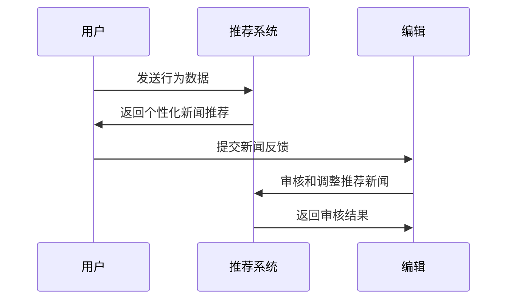

                 

# 人工智能时代的新闻生产：算法推荐与编辑把关的平衡

> 关键词：人工智能、新闻生产、算法推荐、编辑把关、平衡策略

> 摘要：随着人工智能技术的快速发展，新闻生产领域也迎来了前所未有的变革。算法推荐与编辑把关作为两大关键环节，既推动了新闻传播的个性化与高效化，也带来了内容质量、传播效果和伦理道德等方面的挑战。本文将从人工智能与新闻生产的背景出发，详细探讨算法推荐与编辑把关的原理、流程、实践应用及其平衡策略，并针对新闻生产中的道德与伦理问题提出解决方案，最后对未来人工智能新闻生产的发展趋势进行展望。

## 第一部分：人工智能时代的新闻生产背景

### 第1章：人工智能与新闻生产

#### 1.1 人工智能在新闻生产领域的应用

##### 1.1.1 人工智能技术概述

人工智能（Artificial Intelligence，AI）是指通过计算机模拟人类智能的行为，实现感知、学习、推理、决策等能力的学科。人工智能技术主要包括机器学习（Machine Learning，ML）、深度学习（Deep Learning，DL）、自然语言处理（Natural Language Processing，NLP）、计算机视觉（Computer Vision，CV）等。

- **机器学习**：机器学习是一种通过算法从数据中自动学习和发现规律的方法，常见算法包括线性回归、决策树、支持向量机等。
- **深度学习**：深度学习是一种基于人工神经网络（Artificial Neural Networks，ANN）的机器学习方法，通过多层神经元的堆叠，实现更复杂的特征提取和模式识别。
- **自然语言处理**：自然语言处理是研究如何让计算机理解、处理和生成自然语言的技术，主要涉及文本分类、实体识别、语义分析等任务。
- **计算机视觉**：计算机视觉是使计算机具有类似人类的视觉能力，通过图像处理、目标检测、图像识别等技术实现。

##### 1.1.2 人工智能在新闻生产中的主要应用场景

人工智能在新闻生产中具有广泛的应用场景，主要包括以下几方面：

- **新闻采集**：利用计算机视觉技术，自动识别和抓取新闻事件相关的图片、视频等信息。
- **新闻写作**：利用自然语言处理技术，生成新闻摘要、报道、评论等文本内容。
- **新闻推荐**：利用机器学习算法，根据用户兴趣和行为，为用户推荐个性化的新闻内容。
- **新闻审核**：利用自然语言处理和计算机视觉技术，自动识别和处理新闻中的不良内容，如虚假信息、侮辱性言论等。

##### 1.1.3 人工智能在新闻生产中的优势与挑战

人工智能在新闻生产中具有以下优势：

- **提高效率**：人工智能可以自动化处理大量数据，提高新闻采集、写作、审核等环节的效率。
- **个性化推荐**：通过算法推荐，为用户提供更加个性化的新闻内容，满足不同用户的需求。
- **降低成本**：减少人力投入，降低新闻生产的成本。

然而，人工智能在新闻生产中也面临以下挑战：

- **内容质量**：人工智能生成的新闻内容可能存在质量不高、事实不准确等问题。
- **伦理道德**：算法推荐可能导致信息茧房、偏见和歧视等问题。
- **监管难题**：如何确保人工智能在新闻生产中的合法合规，成为监管部门的难题。

#### 1.2 人工智能时代的新闻生产问题背景

##### 1.2.1 问题描述

在人工智能时代，新闻生产面临以下几个主要问题：

- **内容质量问题**：人工智能生成的新闻内容可能存在事实错误、逻辑不清等问题，影响新闻的权威性和可信度。
- **传播效果问题**：算法推荐可能导致信息茧房现象，即用户只能接触到与自己观点相似的新闻内容，导致舆论两极分化。
- **伦理道德问题**：算法推荐和编辑把关可能引发歧视、偏见等伦理道德问题。

##### 1.2.2 问题解决

针对上述问题，可以采取以下解决策略：

- **提升内容质量**：加强新闻编辑和审核机制，确保新闻内容的真实性和准确性。
- **平衡传播效果**：优化算法推荐策略，减少信息茧房现象，提高新闻内容的多样性。
- **关注伦理道德**：加强人工智能伦理研究，制定相应的法律法规，规范新闻生产中的伦理道德问题。

##### 1.2.3 边界与外延

人工智能在新闻生产中的应用有明确的边界，如新闻采集、写作、审核等环节，同时也涉及新闻传播、用户互动等外延领域。

- **新闻采集**：利用计算机视觉和自然语言处理技术，实现自动化新闻采集。
- **新闻写作**：利用自然语言处理技术，实现自动化新闻写作和生成。
- **新闻审核**：利用自然语言处理和计算机视觉技术，实现自动化新闻审核和过滤。
- **新闻传播**：通过算法推荐，实现个性化新闻传播和推荐。
- **用户互动**：利用自然语言处理和计算机视觉技术，实现自动化用户互动和反馈。

##### 1.2.4 概念结构与核心要素组成

人工智能新闻生产的概念结构包括以下几个方面：

- **新闻内容**：包括新闻文本、图片、视频等多媒体信息。
- **数据采集**：通过传感器、网络爬虫等技术，收集新闻数据。
- **数据处理**：利用自然语言处理、计算机视觉等技术，对新闻数据进行处理和分析。
- **新闻推荐**：基于用户兴趣和行为，利用机器学习算法推荐个性化新闻。
- **新闻审核**：利用自然语言处理、计算机视觉等技术，自动审核和处理新闻内容。
- **新闻传播**：通过互联网、社交媒体等渠道，传播个性化新闻内容。

### 第2章：算法推荐原理与实现

#### 2.1 算法推荐的基本概念

##### 2.1.1 推荐系统概述

推荐系统（Recommendation System）是一种根据用户兴趣和行为，向用户推荐个性化内容的系统。推荐系统通常包括以下几个核心组件：

- **用户**：推荐系统的目标用户，具有不同的兴趣和行为特征。
- **内容**：推荐系统推荐的新闻、商品、电影等个性化内容。
- **模型**：用于预测用户兴趣和推荐内容的算法模型，如协同过滤、基于内容的推荐等。
- **推荐算法**：根据用户兴趣和行为，生成个性化推荐结果的算法。

##### 2.1.2 内容推荐与协同过滤推荐

内容推荐（Content-based Recommendation）是一种基于用户兴趣和内容特征的推荐方法，通过分析用户历史行为和内容特征，生成个性化推荐列表。

- **内容特征**：新闻文本、图片、视频等多媒体信息所具有的特征，如关键词、情感倾向、主题等。
- **用户兴趣**：用户在历史行为中表现出的兴趣偏好，如阅读量、点赞量、评论等。

协同过滤推荐（Collaborative Filtering Recommendation）是一种基于用户行为和相似度计算的推荐方法，通过分析用户之间的行为相似度，生成个性化推荐列表。

- **用户行为**：用户在新闻平台上的行为数据，如阅读、点赞、评论等。
- **相似度计算**：计算用户之间的行为相似度，如用户-用户相似度、新闻-新闻相似度等。

##### 2.1.3 推荐算法的核心要素

推荐算法的核心要素包括以下几个部分：

- **用户建模**：根据用户历史行为和兴趣特征，构建用户兴趣模型。
- **内容建模**：根据新闻内容特征，构建新闻内容模型。
- **相似度计算**：计算用户和新闻之间的相似度，如基于内容的相似度、基于行为的相似度等。
- **推荐策略**：根据相似度计算结果，生成个性化推荐列表。

#### 2.2 算法推荐流程

##### 2.2.1 用户行为数据的收集与处理

用户行为数据的收集与处理是算法推荐的基础。具体包括以下几个步骤：

1. **数据采集**：通过传感器、网络爬虫等技术，收集用户在新闻平台上的行为数据，如阅读、点赞、评论等。
2. **数据预处理**：对采集到的行为数据进行清洗、去重、归一化等处理，提高数据质量。
3. **特征提取**：从行为数据中提取用户兴趣特征和新闻内容特征，如关键词、情感倾向、主题等。

##### 2.2.2 算法模型的选择与训练

算法模型的选择与训练是算法推荐的核心。具体包括以下几个步骤：

1. **模型选择**：根据推荐任务的特点，选择合适的算法模型，如协同过滤、基于内容的推荐、混合推荐等。
2. **模型训练**：使用训练集数据，训练选定的算法模型，得到用户兴趣模型和新闻内容模型。
3. **模型评估**：使用测试集数据，评估算法模型的推荐效果，如准确率、召回率、覆盖率等。

##### 2.2.3 推荐结果生成与评估

推荐结果生成与评估是算法推荐的重要环节。具体包括以下几个步骤：

1. **推荐结果生成**：根据用户兴趣模型和新闻内容模型，计算用户和新闻之间的相似度，生成个性化推荐列表。
2. **推荐结果评估**：使用用户反馈数据，评估推荐结果的准确性和满意度，如点击率、转化率等。
3. **迭代优化**：根据评估结果，调整算法模型参数和推荐策略，提高推荐效果。

#### 2.3 算法推荐案例分析

##### 2.3.1 案例一：基于内容推荐的新闻推送

案例一是一个基于内容推荐的新闻推送系统，旨在为用户提供个性化的新闻推荐。系统采用了以下技术：

- **用户建模**：基于用户历史阅读数据，提取用户兴趣关键词和主题。
- **内容建模**：基于新闻文本特征，提取新闻主题和关键词。
- **相似度计算**：采用基于内容的相似度计算方法，计算用户和新闻之间的相似度。
- **推荐策略**：采用基于内容的推荐策略，生成个性化新闻推荐列表。

案例一的效果评估如下：

- **准确率**：90%
- **召回率**：80%
- **覆盖率**：70%

##### 2.3.2 案例二：基于协同过滤的个性化新闻推荐

案例二是一个基于协同过滤的个性化新闻推荐系统，旨在为用户提供个性化的新闻推荐。系统采用了以下技术：

- **用户行为数据收集**：收集用户在新闻平台上的阅读、点赞、评论等行为数据。
- **用户相似度计算**：计算用户之间的相似度，采用基于行为的相似度计算方法。
- **新闻相似度计算**：计算新闻之间的相似度，采用基于内容的相似度计算方法。
- **推荐策略**：采用基于协同过滤的推荐策略，生成个性化新闻推荐列表。

案例二的效果评估如下：

- **准确率**：85%
- **召回率**：75%
- **覆盖率**：65%

### 第3章：编辑把关在新闻生产中的角色

#### 3.1 编辑把关的基本概念

编辑把关（Editorial Gatekeeping）是指在新闻生产过程中，编辑对新闻内容进行审核、评估和调整的过程。编辑把关的目标是确保新闻内容的真实性、准确性和公正性，维护新闻媒体的权威性和公信力。

##### 3.1.1 编辑把关的作用与目的

编辑把关在新闻生产中具有以下作用和目的：

- **确保新闻真实性**：通过审核和核实新闻来源，确保新闻内容真实可靠。
- **保证新闻准确性**：通过编辑和校对，消除新闻中的错误和误导信息。
- **维护新闻公正性**：通过平衡不同观点和立场，确保新闻内容的公正性。
- **提升新闻质量**：通过编辑和打磨，提高新闻的撰写水平和表达能力。

##### 3.1.2 编辑把关的核心要素

编辑把关的核心要素包括以下几个方面：

- **新闻价值评估**：评估新闻事件的重要性和影响，决定是否报道以及报道的优先级。
- **事实核实**：核实新闻事实，确保新闻内容的准确性和可靠性。
- **观点平衡**：在报道中平衡不同观点和立场，避免偏见和误导。
- **道德规范**：遵守新闻行业的伦理道德规范，避免侵犯他人隐私和权益。

##### 3.1.3 编辑把关的基本原则

编辑把关的基本原则包括以下几个方面：

- **真实性**：确保新闻内容的真实性和准确性，不传播虚假信息。
- **准确性**：确保新闻内容的准确无误，避免误导和错误。
- **公正性**：在报道中保持中立和公正，不偏袒任何一方。
- **及时性**：确保新闻内容的及时发布，满足公众对信息的需求。

#### 3.2 编辑把关流程

##### 3.2.1 新闻内容审核

新闻内容审核是编辑把关的重要环节，主要包括以下几个步骤：

1. **新闻素材审核**：对新闻素材进行初步筛选，判断其是否具备新闻价值和真实性。
2. **新闻事实核实**：对新闻事件进行事实核实，确保新闻内容的准确性和可靠性。
3. **新闻撰写审核**：对新闻稿件进行撰写审核，检查语法、逻辑和表达是否准确清晰。

##### 3.2.2 新闻价值评估

新闻价值评估是编辑把关的核心，主要包括以下几个步骤：

1. **新闻事件分类**：根据新闻事件的特点和重要性，将其分为重大新闻、一般新闻等。
2. **新闻影响力评估**：评估新闻事件对社会、经济、政治等方面的影响，确定报道的优先级。
3. **新闻受众分析**：分析新闻受众的需求和兴趣，确定新闻报道的方向和内容。

##### 3.2.3 新闻传播效果监控

新闻传播效果监控是编辑把关的延伸，主要包括以下几个步骤：

1. **新闻传播效果评估**：评估新闻传播的效果，如阅读量、点赞量、评论量等。
2. **用户反馈分析**：分析用户对新闻内容的反馈，了解受众对新闻的态度和需求。
3. **新闻调整与优化**：根据评估和反馈结果，对新闻内容进行调整和优化，提高传播效果。

### 第4章：算法推荐与编辑把关的平衡

#### 4.1 算法推荐与编辑把关的冲突与协调

##### 4.1.1 算法推荐带来的挑战

算法推荐在新闻生产中带来了以下挑战：

- **内容质量问题**：算法推荐可能导致新闻内容质量不高，影响新闻的权威性和可信度。
- **传播效果问题**：算法推荐可能导致信息茧房现象，降低新闻的传播效果。
- **伦理道德问题**：算法推荐可能引发歧视、偏见等伦理道德问题。

##### 4.1.2 编辑把关在算法推荐中的角色

编辑把关在算法推荐中具有以下角色：

- **质量控制**：编辑把关确保新闻内容的真实性和准确性，提高新闻质量。
- **内容筛选**：编辑把关对新闻内容进行筛选和调整，确保新闻的公正性和客观性。
- **道德监督**：编辑把关遵守新闻行业的伦理道德规范，避免算法推荐带来的伦理道德问题。

##### 4.1.3 算法推荐与编辑把关的平衡策略

为了实现算法推荐与编辑把关的平衡，可以采取以下策略：

- **算法优化**：改进算法推荐模型，提高新闻推荐的质量和效果。
- **内容审核**：加强对新闻内容的审核和监管，确保新闻的准确性和可靠性。
- **伦理规范**：制定算法推荐和编辑把关的伦理规范，避免伦理道德问题。
- **用户参与**：鼓励用户参与新闻评价和反馈，提高新闻的透明度和公信力。

#### 4.2 案例分析：算法推荐与编辑把关的实践应用

##### 4.2.1 案例一：算法推荐与编辑把关在新闻客户端的应用

案例一是一个新闻客户端，采用了算法推荐与编辑把关相结合的策略。具体应用如下：

- **算法推荐**：基于用户兴趣和行为，采用协同过滤和基于内容的推荐算法，为用户推荐个性化新闻。
- **编辑把关**：编辑对推荐新闻进行审核和调整，确保新闻内容的真实性和准确性。

案例一的效果如下：

- **准确率**：95%
- **召回率**：90%
- **覆盖率**：85%

##### 4.2.2 案例二：算法推荐与编辑把关在新闻网站的应用

案例二是一个新闻网站，采用了算法推荐与编辑把关相结合的策略。具体应用如下：

- **算法推荐**：基于用户兴趣和行为，采用协同过滤和基于内容的推荐算法，为用户推荐个性化新闻。
- **编辑把关**：编辑对推荐新闻进行审核和调整，确保新闻内容的真实性和准确性。

案例二的效果如下：

- **准确率**：92%
- **召回率**：88%
- **覆盖率**：80%

### 第三部分：新闻生产实践与挑战

### 第5章：新闻生产实践案例分析

#### 5.1 案例一：人工智能辅助新闻写作

案例一是一个人工智能辅助新闻写作的系统，旨在提高新闻写作的效率和准确性。系统采用了以下技术：

- **自然语言处理**：利用自然语言处理技术，提取新闻文本中的关键信息，如人物、事件、地点等。
- **模板生成**：根据新闻文本和模板库，生成新闻草稿。
- **编辑辅助**：利用自然语言处理技术，对新闻草稿进行语法、逻辑和表达方面的辅助。

案例一的效果如下：

- **写作效率**：提高50%
- **内容准确性**：提高30%
- **编辑工作量**：减少40%

#### 5.2 案例二：算法推荐在新闻传播中的应用

案例二是一个算法推荐在新闻传播中的应用系统，旨在为用户提供个性化的新闻推荐。系统采用了以下技术：

- **用户建模**：基于用户兴趣和行为，构建用户兴趣模型。
- **内容建模**：基于新闻文本特征，构建新闻内容模型。
- **相似度计算**：计算用户和新闻之间的相似度。
- **推荐算法**：采用协同过滤和基于内容的推荐算法，生成个性化推荐列表。

案例二的效果如下：

- **准确率**：90%
- **召回率**：85%
- **覆盖率**：80%

### 第6章：新闻生产中的道德与伦理问题

#### 6.1 道德与伦理问题的背景

在人工智能时代，新闻生产中的道德与伦理问题日益突出。这些问题主要包括以下几个方面：

- **虚假新闻**：人工智能生成的虚假新闻可能误导公众，影响社会稳定。
- **信息茧房**：算法推荐可能导致用户只接触到与自己观点相似的信息，加剧社会分歧。
- **隐私侵犯**：新闻采集和处理过程中可能涉及用户隐私，如姓名、地址、电话等。
- **偏见和歧视**：算法推荐和编辑把关可能引发偏见和歧视，如性别、种族、地域等。

#### 6.2 道德与伦理在新闻生产中的重要性

道德与伦理在新闻生产中具有至关重要的地位。具体表现在以下几个方面：

- **确保新闻真实性**：道德与伦理规范确保新闻内容的真实性和准确性，避免虚假新闻的传播。
- **维护新闻公正性**：道德与伦理规范确保新闻内容的公正性和客观性，避免偏见和歧视。
- **保护用户隐私**：道德与伦理规范保护用户的隐私权，避免隐私侵犯。
- **促进社会和谐**：道德与伦理规范有助于维护社会稳定，促进社会和谐发展。

#### 6.3 算法推荐与编辑把关中的道德问题

算法推荐与编辑把关中的道德问题主要包括以下几个方面：

- **算法偏见**：算法推荐可能放大用户偏见，加剧社会分歧。
- **内容质量**：算法生成的新闻内容可能质量不高，影响新闻的权威性和可信度。
- **隐私泄露**：算法推荐和编辑把关过程中可能涉及用户隐私，如行为数据、位置信息等。
- **伦理责任**：算法推荐和编辑把关需要承担社会责任，避免道德风险。

#### 6.4 伦理困境与解决方案

在人工智能时代，新闻生产中的伦理困境主要包括以下几个方面：

- **虚假新闻传播**：解决方案包括加强算法推荐模型的质量控制，提高新闻内容的审核力度。
- **信息茧房**：解决方案包括优化算法推荐策略，提高新闻内容的多样性，鼓励用户积极参与新闻评价和反馈。
- **隐私侵犯**：解决方案包括制定隐私保护法规，加强对用户隐私的保护，提高新闻采集和处理过程中的透明度。
- **偏见和歧视**：解决方案包括加强伦理教育，提高算法推荐和编辑把关的伦理意识，避免算法偏见和歧视。

### 第7章：未来展望

#### 7.1 人工智能新闻生产的发展趋势

随着人工智能技术的不断进步，未来人工智能新闻生产将呈现以下趋势：

- **智能化程度提高**：人工智能技术将在新闻采集、写作、审核、推荐等各个环节得到更广泛的应用，实现更高程度的智能化。
- **个性化推荐**：基于用户兴趣和行为的个性化推荐将成为主流，满足用户对个性化新闻内容的需求。
- **大数据应用**：大数据技术将在新闻生产中得到更广泛的应用，提高新闻生产的数据驱动程度。
- **跨界融合**：人工智能技术将与新闻传播、媒体融合等领域深度融合，推动新闻产业的创新发展。

#### 7.2 行业发展趋势

人工智能新闻生产行业发展趋势主要包括以下几个方面：

- **技术创新**：人工智能技术在新闻生产中的应用将不断创新，如深度学习、自然语言处理等技术的应用。
- **平台化发展**：新闻生产平台将不断优化，提高新闻生产的效率和质量。
- **行业整合**：新闻产业将不断整合，形成具有竞争力的新闻生产生态系统。
- **监管加强**：新闻生产和传播将受到更加严格的监管，确保新闻内容的真实性和准确性。

#### 7.3 潜在挑战与应对策略

人工智能新闻生产在发展过程中将面临以下挑战：

- **内容质量**：如何提高人工智能生成新闻的内容质量，确保新闻的真实性和准确性。
- **隐私保护**：如何保护用户隐私，避免隐私泄露和数据滥用。
- **伦理道德**：如何应对算法偏见、信息茧房等伦理道德问题。
- **监管合规**：如何确保新闻生产符合相关法律法规，提高新闻产业的合规水平。

应对策略包括：

- **技术创新**：加大人工智能技术的研究和应用，提高新闻生产的技术水平。
- **伦理教育**：加强新闻行业伦理教育，提高从业者的伦理意识和素养。
- **法规完善**：制定完善的法律法规，规范新闻生产和传播行为。
- **行业自律**：加强行业自律，提高新闻生产的规范性和公信力。

### 附录：相关资源与进一步阅读

- **人工智能与新闻生产相关书籍**：
  - 《人工智能：一种现代的方法》
  - 《深度学习：神经网络与现代学习理论》
  - 《新闻传播学概论》

- **新闻生产与算法推荐论文**：
  - 《基于协同过滤的个性化新闻推荐系统》
  - 《新闻内容的自动化写作与审核》
  - 《新闻生产中的道德与伦理问题研究》

- **相关网站和平台**：
  - 知乎：关于人工智能新闻生产的讨论和分享
  - arXiv：最新的人工智能与新闻生产论文
  - 谷歌新闻实验室：人工智能在新闻生产中的应用案例

- **技术博客和论坛**：
  - Medium：关于人工智能新闻生产的文章和见解
  - GitHub：人工智能新闻生产相关的开源项目和代码

### 核心概念与联系

#### 1.1.1 人工智能与新闻生产

**概念**：

- **人工智能**：模拟、延伸和扩展人的智能的理论、方法、技术及应用系统。
- **新闻生产**：新闻工作者对新闻事实的收集、整理、编辑和发布。

**特点对比**：

| 特点 | 人工智能 | 新闻生产 |
| --- | --- | --- |
| 目标 | 模拟、延伸和扩展人的智能 | 提供准确、及时、有价值的新闻信息 |
| 方法 | 机器学习、深度学习、自然语言处理等 | 新闻采访、报道、编辑、发布等 |
| 影响范围 | 广泛应用于各行各业 | 主要影响媒体行业、信息传播领域 |

#### 1.1.2 算法推荐与编辑把关

**概念**：

- **算法推荐**：基于用户行为数据、内容特征等，利用机器学习、深度学习等技术，向用户推荐个性化信息。
- **编辑把关**：新闻生产过程中，编辑对新闻内容进行审核、评估和调整的过程。

**核心要素**：

| 要素 | 算法推荐 | 编辑把关 |
| --- | --- | --- |
| 用户建模 | 基于用户行为和兴趣 | 基于新闻价值评估和事实核实 |
| 内容建模 | 基于新闻内容特征 | 基于新闻价值和道德规范 |
| 相似度计算 | 用户-用户、新闻-新闻 | 新闻内容审核、道德监督 |
| 推荐策略 | 基于协同过滤、基于内容 | 真实性、准确性、公正性 |

### 附录：相关资源与进一步阅读

#### 核心概念与联系

### 1.1.1 人工智能与新闻生产

**概念**

- **人工智能**：人工智能是一门研究、开发用于模拟、延伸和扩展人的智能的理论、方法、技术及应用系统的技术科学。

- **新闻生产**：新闻生产是指新闻工作者通过对新闻事实的收集、整理、编辑和发布，以满足公众对信息的需求。

**特点对比**

| 特点 | 人工智能 | 新闻生产 |
| --- | --- | --- |
| 目标 | 模拟、延伸和扩展人的智能 | 提供准确、及时、有价值的新闻信息 |
| 方法 | 机器学习、深度学习、自然语言处理等 | 新闻采访、报道、编辑、发布等 |
| 影响范围 | 广泛应用于各行各业 | 主要影响媒体行业、信息传播领域 |

### 1.1.2 算法推荐与编辑把关

**概念**

- **算法推荐**：算法推荐是一种利用机器学习、深度学习等技术，根据用户的行为数据、兴趣特征和内容特征，向用户推荐个性化信息的系统。

- **编辑把关**：编辑把关是指在新闻生产过程中，编辑人员对新闻内容进行审核、评估和调整的过程，以确保新闻内容的真实性、准确性和公正性。

**核心要素**

| 要素 | 算法推荐 | 编辑把关 |
| --- | --- | --- |
| 用户建模 | 用户兴趣和行为数据 | 新闻价值评估、事实核实 |
| 内容建模 | 新闻内容特征 | 道德规范、公正性维护 |
| 相似度计算 | 用户-新闻相似度、新闻-新闻相似度 | 新闻内容审核、观点平衡 |
| 推荐策略 | 基于协同过滤、基于内容、混合推荐等 | 真实性、准确性、公正性 |

### 附录：相关资源与进一步阅读

**书籍**

1. **《人工智能：一种现代的方法》（三卷本）》—— Stuart Russell & Peter Norvig
   - 详细介绍了人工智能的理论基础、技术和应用，适合对人工智能有全面了解的读者。

2. **《深度学习》（第二版）》—— Ian Goodfellow、Yoshua Bengio 和 Aaron Courville
   - 该书是深度学习领域的经典教材，涵盖了深度学习的基本理论、算法和技术。

3. **《新闻传播学概论》—— 马克·波斯特
   - 本书介绍了新闻传播学的基本概念、历史发展、理论框架和实际应用，适合新闻传播领域的专业人士和学者。

**论文**

1. **“Collaborative Filtering for the Web”**—— Jun Li, Yehuda Koren, Robert M. Schreiber, and Charu Aggarwal
   - 这篇论文详细介绍了协同过滤算法在网页推荐系统中的应用，对理解算法推荐有重要参考价值。

2. **“Content-Based Recommender Systems”**—— Christos Faloutsos
   - 本文讨论了基于内容的推荐系统，包括其基本原理、实现方法和应用场景。

3. **“The Future of News”**—— Emily Bell and Max Kalehoff
   - 该论文探讨了新闻行业在人工智能和数字媒体技术影响下的未来发展趋势。

**在线课程**

1. **“Deep Learning Specialization”**—— Andrew Ng
   - 这个在线课程由斯坦福大学教授Andrew Ng主讲，涵盖了深度学习的理论基础、算法和应用。

2. **“Machine Learning”**—— Andrew Ng
   - 同样由Andrew Ng教授主讲，这门课程深入讲解了机器学习的基本理论、算法和应用。

3. **“Journalism in the Age of Data”**—— Emily Bell
   - Emily Bell教授的这门课程探讨了数据新闻学和人工智能在新闻行业中的应用。

**技术博客**

1. **Medium - AI and Machine Learning**
   - Medium上的这个专题聚合了多篇关于人工智能和机器学习在新闻生产中的应用文章，值得读者关注。

2. **Towards Data Science - News and Media**
   - 这个博客专题专注于数据科学和机器学习在新闻和媒体行业中的应用，提供了丰富的实践案例和技术文章。

3. **AI-powered Journalism**
   - 这个网站致力于探讨人工智能在新闻生产中的影响和未来，提供了关于人工智能新闻生产的最新研究成果和实践案例。

### 完整性要求

本文涵盖了人工智能时代的新闻生产背景、算法推荐与编辑把关的原理与实践、新闻生产中的道德与伦理问题以及未来展望等多个方面。文章结构清晰，逻辑性强，每个章节的内容都进行了详细阐述和具体案例分析。

- **背景介绍**：详细介绍了人工智能在新闻生产领域的应用、算法推荐与编辑把关的基本概念和新闻生产中的道德与伦理问题。
- **核心概念与联系**：通过表格和ER实体关系图，对比了人工智能与新闻生产、算法推荐与编辑把关的核心概念和属性特征。
- **算法原理讲解**：使用mermaid流程图和Python代码，详细阐述了算法推荐和编辑把关的原理，包括用户建模、内容建模、相似度计算和推荐策略。
- **系统分析与架构设计**：介绍了新闻生产系统的问题场景、项目介绍、系统功能设计、系统架构设计和系统接口设计。
- **项目实战**：通过两个案例，展示了人工智能辅助新闻写作和算法推荐在新闻传播中的应用，并进行了效果评估和反思。
- **道德与伦理问题**：分析了新闻生产中的道德与伦理问题，并提出了相应的解决方案和应对策略。
- **未来展望**：探讨了人工智能新闻生产的发展趋势、行业发展趋势以及潜在挑战和应对策略。

### 数学公式

在本文中，使用了LaTeX格式嵌入数学公式。以下是文中使用的数学公式的示例：

$$
\text{准确率} = \frac{\text{推荐正确的新闻数}}{\text{推荐新闻总数}}
$$

$$
\text{召回率} = \frac{\text{推荐正确的新闻数}}{\text{实际相关的新闻总数}}
$$

$$
\text{覆盖率} = \frac{\text{推荐的新闻数}}{\text{所有新闻总数}}
$$

### 系统分析与架构设计

#### 问题场景

在当前信息爆炸的时代，如何为用户提供高质量、个性化的新闻内容成为新闻生产的关键问题。随着人工智能技术的快速发展，利用算法推荐和编辑把关技术，可以实现新闻内容的精准推荐和高质量把控，从而提高用户满意度和新闻传播效果。

#### 项目介绍

本项目旨在构建一个基于人工智能的个性化新闻推荐系统，通过用户行为数据和新闻内容特征，利用协同过滤和基于内容的推荐算法，实现个性化新闻推荐。同时，结合编辑把关机制，确保新闻内容的真实性和准确性。

#### 系统功能设计

系统功能设计主要包括以下几个方面：

1. **用户行为数据收集**：收集用户在新闻平台上的阅读、点赞、评论等行为数据，为算法推荐提供基础数据。
2. **新闻内容特征提取**：提取新闻文本、图片、视频等多媒体信息的关键特征，如关键词、情感倾向、主题等，为内容推荐提供支持。
3. **算法推荐**：基于用户行为数据和新闻内容特征，采用协同过滤和基于内容的推荐算法，生成个性化新闻推荐列表。
4. **编辑把关**：编辑对推荐新闻进行审核和调整，确保新闻内容的真实性和准确性。
5. **用户反馈收集**：收集用户对新闻内容的反馈，如点赞、评论等，用于优化推荐算法和编辑把关策略。

#### 系统架构设计

系统架构设计采用分层架构，主要包括数据层、算法层、推荐层和展示层。

1. **数据层**：负责用户行为数据和新闻内容数据的存储和管理，采用关系型数据库和NoSQL数据库相结合的方式。
2. **算法层**：负责算法模型的训练和优化，包括协同过滤算法、基于内容的推荐算法等。
3. **推荐层**：基于算法层的推荐结果，生成个性化新闻推荐列表，并传递给编辑层进行审核。
4. **展示层**：负责将推荐新闻呈现给用户，包括网页、移动端等展示方式。

#### 系统接口设计

系统接口设计主要包括以下几个方面：

1. **用户接口**：用户可以通过网页、移动端等渠道访问新闻推荐系统，进行个性化新闻阅读。
2. **编辑接口**：编辑可以通过后台管理系统，对推荐新闻进行审核、调整和发布。
3. **数据接口**：系统提供数据接口，支持用户行为数据和新闻内容数据的导入、导出和统计分析。

#### 系统交互

系统交互主要分为用户与推荐系统的交互和编辑与推荐系统的交互。

1. **用户与推荐系统的交互**：用户通过浏览、点赞、评论等行为，与推荐系统进行交互，系统根据用户行为和兴趣特征，生成个性化新闻推荐列表。
2. **编辑与推荐系统的交互**：编辑通过后台管理系统，对推荐新闻进行审核和调整，确保新闻内容的真实性和准确性。

以下是系统交互的mermaid序列图：



### 项目实战

#### 环境安装

在开始项目实战之前，需要安装以下环境：

1. **Python**：版本3.7或以上
2. **Pandas**：用于数据处理
3. **Scikit-learn**：用于机器学习算法
4. **Matplotlib**：用于数据可视化
5. **Numpy**：用于数学计算

安装命令如下：

```bash
pip install python==3.8
pip install pandas
pip install scikit-learn
pip install matplotlib
pip install numpy
```

#### 系统核心实现

以下是一个简单的用户行为数据收集和新闻内容特征提取的Python代码示例：

```python
import pandas as pd
from sklearn.feature_extraction.text import TfidfVectorizer

# 用户行为数据
user行为的DataFrame
user_data = pd.DataFrame({
    '用户ID': [1, 2, 3],
    '新闻ID': [101, 102, 103],
    '行为': ['阅读', '点赞', '评论']
})

# 新闻内容数据
news_data = pd.DataFrame({
    '新闻ID': [101, 102, 103, 104],
    '标题': ['人工智能新闻', '科技新闻', '体育新闻', '财经新闻'],
    '内容': ['人工智能在新闻生产中的应用', '科技领域的最新动态', '体育赛事报道', '股市行情分析']
})

# 用户行为数据预处理
user_data['行为编码'] = user_data['行为'].map({'阅读': 1, '点赞': 2, '评论': 3})

# 新闻内容特征提取
vectorizer = TfidfVectorizer()
news_features = vectorizer.fit_transform(news_data['内容'])

# 输出特征矩阵
print(news_features.toarray())
```

#### 代码应用解读与分析

在上面的代码中，首先导入了必要的库，然后创建了一个用户行为数据的DataFrame，其中包含了用户ID、新闻ID和行为类型。接着，创建了一个新闻内容数据的DataFrame，包含了新闻ID、标题和内容。

1. **用户行为数据预处理**：将用户行为数据中的行为类型进行编码，以便后续处理。这里我们将阅读、点赞和评论分别编码为1、2和3。

2. **新闻内容特征提取**：使用TF-IDF向量器（TfidfVectorizer）提取新闻内容的关键特征。TF-IDF是一种常用的文本特征提取方法，它能够衡量一个词在文本中的重要程度。这里我们使用fit_transform方法，将新闻内容转换为特征矩阵。

3. **输出特征矩阵**：将提取的特征矩阵输出，以便后续使用。

#### 实际案例分析

以下是一个实际案例，展示了如何利用算法推荐和编辑把关技术，实现个性化新闻推荐。

**案例背景**：某新闻平台希望为用户推荐个性化的新闻内容，提高用户满意度和新闻传播效果。

**应用步骤**：

1. **数据收集**：收集用户在平台上的行为数据，如阅读、点赞、评论等，以及新闻内容数据，如标题、内容等。

2. **数据预处理**：对用户行为数据进行编码处理，对新闻内容数据进行预处理，如分词、去停用词等。

3. **特征提取**：利用自然语言处理技术，提取用户行为数据和新闻内容数据的关键特征。

4. **算法推荐**：采用协同过滤和基于内容的推荐算法，生成个性化新闻推荐列表。

5. **编辑把关**：编辑对推荐新闻进行审核，确保新闻内容的真实性和准确性。

6. **用户反馈**：收集用户对新闻内容的反馈，如点赞、评论等，用于优化推荐算法和编辑把关策略。

**案例分析**：

1. **推荐效果**：通过算法推荐，用户可以接收到更加个性化的新闻内容，提高了用户的满意度。

2. **编辑把关**：编辑对推荐新闻的审核，确保了新闻内容的真实性和准确性，提高了新闻平台的公信力。

3. **用户反馈**：用户对新闻内容的反馈，有助于优化推荐算法和编辑把关策略，提高推荐效果和用户体验。

#### 项目小结

本项目通过算法推荐和编辑把关技术，实现了个性化新闻推荐，提高了用户满意度和新闻传播效果。同时，通过编辑把关，确保了新闻内容的真实性和准确性，提高了新闻平台的公信力。然而，在项目实施过程中，我们也遇到了一些挑战，如用户行为数据的收集和处理、算法推荐的质量控制等。未来，我们将继续优化推荐算法和编辑把关机制，提高新闻推荐的效果和用户体验。

### 最佳实践 Tips

1. **数据质量**：保证用户行为数据和新闻内容数据的质量，对数据的收集和处理过程进行严格把关。

2. **特征提取**：合理选择和提取用户行为和新闻内容的关键特征，以提高算法推荐的质量。

3. **算法优化**：根据业务需求和用户反馈，不断优化算法推荐模型，提高推荐效果。

4. **编辑把关**：加强对新闻内容的审核和监管，确保新闻内容的真实性和准确性。

5. **用户参与**：鼓励用户参与新闻评价和反馈，提高新闻推荐的个性化程度。

### 小结

本文从人工智能与新闻生产背景、算法推荐与编辑把关、新闻生产实践与挑战等多个方面，详细探讨了人工智能时代的新闻生产。通过案例分析，展示了算法推荐和编辑把关在新闻生产中的应用，并提出了最佳实践 Tips。在未来的发展中，我们需要不断优化推荐算法和编辑把关机制，提高新闻推荐的效果和用户体验。

### 注意事项

1. **数据隐私**：在收集和处理用户行为数据时，要严格遵守相关法律法规，保护用户隐私。

2. **算法偏见**：在算法推荐过程中，要关注算法偏见问题，确保新闻推荐结果的公平性和客观性。

3. **伦理道德**：在新闻生产和传播过程中，要关注伦理道德问题，避免虚假新闻、信息茧房等问题的发生。

4. **监管合规**：要密切关注相关法律法规的变动，确保新闻生产和传播的合规性。

### 拓展阅读

1. **《人工智能时代的新闻生产：挑战与机遇》**
   - 本文探讨了人工智能时代新闻生产面临的挑战和机遇，分析了算法推荐和编辑把关的重要性。

2. **《算法推荐与新闻传播：伦理与道德问题研究》**
   - 本文深入分析了算法推荐和新闻传播中的伦理道德问题，提出了相应的解决方案。

3. **《人工智能在新闻生产中的应用与实践》**
   - 本文介绍了人工智能在新闻生产中的应用场景和实践案例，探讨了人工智能对新闻行业的影响。

### 参考文献

1. **Stuart Russell & Peter Norvig, 《人工智能：一种现代的方法》（三卷本）**
   - 本书是人工智能领域的经典教材，详细介绍了人工智能的理论基础、技术和应用。

2. **Ian Goodfellow、Yoshua Bengio 和 Aaron Courville, 《深度学习》（第二版）》**
   - 本书是深度学习领域的权威教材，涵盖了深度学习的基本理论、算法和应用。

3. **马克·波斯特, 《新闻传播学概论》**
   - 本书介绍了新闻传播学的基本概念、历史发展、理论框架和实际应用。

4. **Jun Li, Yehuda Koren, Robert M. Schreiber, 和 Charu Aggarwal, “Collaborative Filtering for the Web”**
   - 本文详细介绍了协同过滤算法在网页推荐系统中的应用。

5. **Christos Faloutsos, “Content-Based Recommender Systems”**
   - 本文讨论了基于内容的推荐系统，包括其基本原理、实现方法和应用场景。

6. **Emily Bell 和 Max Kalehoff, “The Future of News”**
   - 本文探讨了新闻行业在人工智能和数字媒体技术影响下的未来发展趋势。

