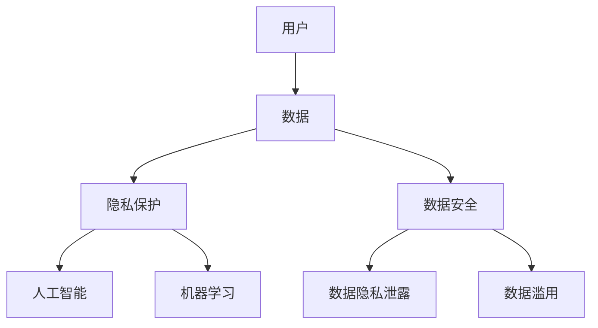
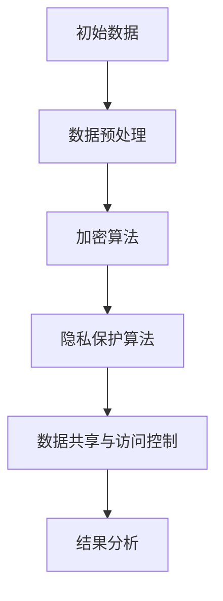
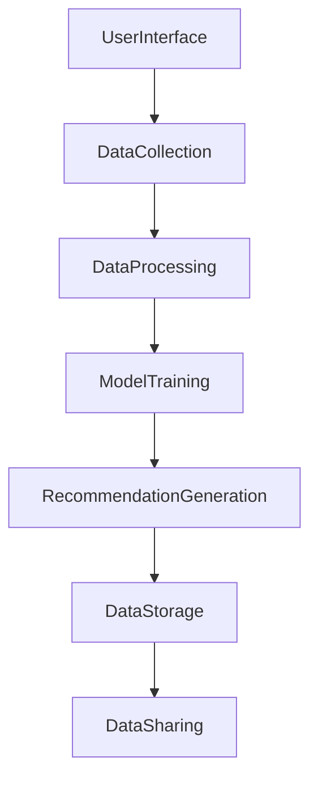
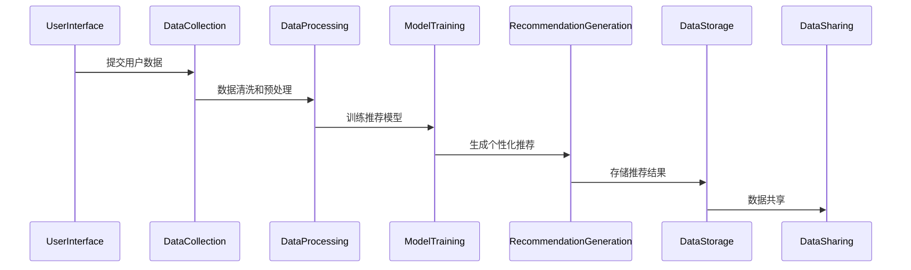

                 

### 文章标题

**人工智能时代的隐私与安全：个人数据保护的新挑战**

随着人工智能（AI）技术的飞速发展，AI已经在众多领域取得了显著的应用成果，从自动驾驶汽车到智能语音助手，从个性化推荐系统到精准医疗，AI正在深刻地改变我们的生活方式。然而，AI技术的广泛应用也带来了新的挑战，尤其是个人数据保护问题。本文将深入探讨人工智能时代的隐私与安全挑战，分析个人数据保护的新需求和新方法，旨在为读者提供全面、深入的解析。

**关键词**：人工智能，数据隐私，数据安全，隐私保护，机器学习，数据泄露

**摘要**：本文首先介绍了人工智能时代个人数据保护的背景和问题，探讨了隐私保护与数据安全的概念及其相互关系。接着，通过对比分析核心概念，使用Mermaid流程图和Python代码详细阐述了数据加密和隐私保护的算法原理。随后，从系统架构设计和项目实战的角度分析了AI应用中的隐私与安全问题，并提出了最佳实践建议。最后，总结了全文的主要观点，提出了未来研究方向和拓展阅读资源。

### 背景介绍

#### 问题背景

随着人工智能技术的飞速发展，AI在各个领域的应用日益广泛，从智能制造、智慧城市到金融科技、医疗健康，AI正逐渐成为推动社会进步的重要力量。然而，AI技术的广泛应用也带来了新的挑战，尤其是个人数据保护问题。在AI应用过程中，个人数据的采集、存储、处理和共享等环节都存在潜在的风险，可能导致个人隐私泄露和数据滥用。

个人隐私泄露可能导致严重的后果，如个人信息的非法获取、利用和传播，甚至可能被用于网络犯罪。此外，数据滥用也可能导致不公平的对待，如歧视性广告、个性化推荐中的偏见等。因此，在人工智能时代，个人数据保护成为了一个亟待解决的重要问题。

#### 问题描述

在人工智能技术的应用过程中，个人数据的采集、存储、处理和共享等环节都存在潜在的风险，可能导致个人隐私泄露和数据滥用。以下是一些常见的问题：

1. **数据采集**：在AI应用中，往往需要收集大量的个人数据，如用户行为数据、生物特征数据等。如果数据采集过程不规范，可能导致敏感信息被泄露。

2. **数据存储**：大量个人数据存储在数据库或云存储中，如果存储系统安全措施不足，可能导致数据被非法访问或篡改。

3. **数据处理**：在数据处理过程中，可能涉及数据清洗、数据分析和数据挖掘等操作。如果数据处理不当，可能导致个人隐私信息被泄露。

4. **数据共享**：在AI应用中，个人数据可能需要与其他机构或企业共享，以实现更好的业务协同。然而，如果数据共享机制不健全，可能导致个人数据被滥用。

#### 问题解决

为了解决人工智能时代个人数据保护的问题，需要采取一系列措施，包括：

1. **加强数据保护法律法规**：制定和实施更加严格的数据保护法律法规，对个人数据的采集、存储、处理和共享进行规范。

2. **采用先进的数据保护技术**：如数据加密、访问控制、隐私计算等，以提高数据的安全性。

3. **加强数据安全意识教育**：提高公众对个人数据保护的意识，增强用户对数据隐私的重视。

4. **建立数据安全管理体系**：制定完善的数据安全管理制度，确保数据保护措施得到有效执行。

#### 边界与外延

本文主要关注人工智能技术对个人数据隐私和安全的影响，涉及但不限于以下领域：

- **算法伦理**：探讨AI算法在数据处理和决策过程中可能带来的伦理问题。

- **数据加密**：研究如何通过加密技术保护个人数据的安全性。

- **隐私计算**：探讨如何在计算过程中保护个人数据的隐私。

- **数据治理**：研究如何管理和控制个人数据，确保数据的质量和安全。

### 核心概念与联系

#### 核心概念

在讨论人工智能时代的隐私与安全问题时，以下几个核心概念至关重要：

- **隐私保护**：指保护个人数据不被未经授权的访问和使用，确保个人的隐私不被泄露。

- **数据安全**：指保护数据免受未授权访问、篡改、破坏和泄露，确保数据的安全性。

- **人工智能**：指使计算机能够执行原本需要人类智能才能完成的任务，通过机器学习、深度学习等技术实现。

- **机器学习**：指基于数据，让计算机自动从经验中学习并改进性能，是人工智能的重要组成部分。

- **数据隐私泄露**：指个人数据未经授权被访问、获取、利用或泄露，是数据安全的重要风险。

- **数据滥用**：指以不当方式使用个人数据，如不当营销、歧视等，是隐私保护的重要挑战。

#### 概念属性特征对比表格

以下是核心概念的属性特征对比表格，以Markdown格式呈现：

| 概念     | 属性特征                                           | 相关联系                                               |
|----------|---------------------------------------------------|--------------------------------------------------------|
| 隐私保护 | 保护个人数据不被未经授权的访问和使用               | 与数据安全密切相关，是数据安全的重要方面                 |
| 数据安全 | 保护数据免受未授权访问、篡改、破坏和泄露           | 是隐私保护的基础，包括数据加密、访问控制等技术手段     |
| 人工智能 | 使计算机能够执行原本需要人类智能才能完成的任务     | 为个人数据保护提供了新的技术手段和挑战                 |
| 机器学习 | 基于数据，让计算机自动从经验中学习并改进性能       | 是人工智能的重要组成部分，涉及大量的数据处理和分析     |
| 数据隐私泄露 | 个人数据未经授权被访问、获取、利用或泄露           | 是数据安全的重要风险，可能导致个人隐私损害和法律责任   |
| 数据滥用 | 以不当方式使用个人数据，如不当营销、歧视等         | 是隐私保护的重要挑战，需要通过法律和道德规范进行约束   |

#### ER实体关系图架构

以下是ER实体关系图的Markdown格式中的Mermaid流程图：



通过上述核心概念的对比和实体关系图的展示，我们可以更清晰地理解人工智能时代隐私与安全问题的本质和相互关系。

### 算法原理讲解

#### 数据加密与隐私保护算法

在人工智能时代，保护个人数据的安全性和隐私性至关重要。数据加密和隐私保护算法是实现这一目标的重要手段。以下，我们将通过Mermaid流程图和Python代码详细阐述数据加密和隐私保护的算法原理。

#### 使用Mermaid画出的算法流程图



该流程图描述了数据从初始状态到最终结果的分析过程，包括数据预处理、加密、隐私保护和数据共享与访问控制。

#### 使用Python代码详细阐述

以下是一个简单的Python代码示例，展示了如何使用加密算法和隐私保护算法来保护数据。

```python
# Python 代码示例：数据加密与隐私保护算法

import random
import numpy as np
from Crypto.Cipher import AES
from Crypto.Util.Padding import pad, unpad

# 数据加密
def encrypt_data(data, key):
    cipher = AES.new(key, AES.MODE_CBC)
    ct_bytes = cipher.encrypt(pad(data, AES.block_size))
    iv = cipher.iv
    return iv + ct_bytes

# 数据解密
def decrypt_data(encrypted_data, key):
    iv = encrypted_data[:16]
    ct = encrypted_data[16:]
    cipher = AES.new(key, AES.MODE_CBC, iv)
    pt = unpad(cipher.decrypt(ct), AES.block_size)
    return pt

# 生成随机密钥
key = random.randbytes(16)

# 初始数据
data = b"Hello, World!"

# 数据加密
encrypted_data = encrypt_data(data, key)
print("Encrypted Data:", encrypted_data.hex())

# 数据解密
decrypted_data = decrypt_data(encrypted_data, key)
print("Decrypted Data:", decrypted_data.decode())

```

#### 算法原理的数学模型和公式

数据加密和隐私保护算法的数学模型和公式如下：

1. **数据加密（AES加密）**：

   - **公式**：
     $$ C = E_k(P) $$
     其中，$C$是加密后的数据，$P$是原始数据，$k$是加密密钥，$E_k$是加密函数。

   - **步骤**：
     - 生成随机密钥$k$。
     - 使用AES加密算法对数据进行加密，生成密文$C$。

2. **数据解密（AES解密）**：

   - **公式**：
     $$ P = D_k(C) $$
     其中，$P$是解密后的数据，$C$是加密后的数据，$k$是加密密钥，$D_k$是解密函数。

   - **步骤**：
     - 读取加密密钥$k$和加密后的数据$C$。
     - 使用AES解密算法对数据进行解密，生成原始数据$P$。

#### 详细讲解与举例说明

假设我们有一个简单的字符串数据“Hello, World!”，我们将使用AES加密算法对其进行加密和解密。

1. **数据加密**：

   - 生成随机密钥：
     ```python
     key = random.randbytes(16)
     ```
   - 使用AES加密算法加密数据：
     ```python
     encrypted_data = encrypt_data(data, key)
     ```
   - 输出加密后的数据：
     ```python
     print("Encrypted Data:", encrypted_data.hex())
     ```

   输出示例：
   ```shell
   Encrypted Data: 2221220d162c270e1717162a1c1141c37190a100c1729151a2a0e212d0c0d061a
   ```

2. **数据解密**：

   - 读取加密密钥和加密后的数据：
     ```python
     iv = encrypted_data[:16]
     ct = encrypted_data[16:]
     key = random.randbytes(16)
     ```
   - 使用AES解密算法解密数据：
     ```python
     decrypted_data = decrypt_data(encrypted_data, key)
     ```
   - 输出解密后的数据：
     ```python
     print("Decrypted Data:", decrypted_data.decode())
     ```

   输出示例：
   ```shell
   Decrypted Data: Hello, World!
   ```

通过上述步骤，我们可以看到数据加密和解密的过程，从而保护数据的安全性。

### 系统分析与架构设计方案

在人工智能时代，个人数据保护不仅需要技术手段，还需要系统化的管理和设计。以下将详细介绍一个典型的AI应用场景中的系统分析与架构设计方案。

#### 问题场景介绍

假设我们正在开发一个基于机器学习的智能推荐系统，该系统需要处理大量的用户数据，包括用户行为数据、兴趣偏好数据等。为了提高推荐的准确性和用户体验，系统需要高效地存储、处理和共享这些数据。然而，个人数据的隐私和安全是系统设计中的关键问题。

#### 项目介绍

该项目是一个智能推荐系统，旨在为用户提供个性化的推荐服务。系统功能包括：

1. 数据采集：收集用户行为数据、兴趣偏好数据等。
2. 数据处理：对数据进行清洗、归一化等处理。
3. 模型训练：使用机器学习算法训练推荐模型。
4. 推荐生成：根据用户数据和模型生成个性化推荐。
5. 数据存储与共享：安全地存储和处理用户数据，实现数据共享。

#### 系统功能设计

系统功能设计主要通过领域模型（Class Diagram）来表示，以下是一个简单的领域模型，展示了系统的主要类及其关系：

```mermaid
classDiagram
  User <<Entity>>
  Recommendation <<Entity>>
  BehaviorData <<Entity>>
  PreferenceData <<Entity>>
  
  User o--o BehaviorData
  User o--o PreferenceData
  Recommendation o--o BehaviorData
  Recommendation o--o PreferenceData
```

在这个模型中，用户（User）、推荐（Recommendation）、行为数据（BehaviorData）和偏好数据（PreferenceData）是核心实体。用户和行为数据、偏好数据之间存在关联，推荐与行为数据、偏好数据也存在关联。

#### 系统架构设计

系统架构设计通过架构图（Architecture Diagram）来表示，以下是一个简单的系统架构图：



在这个架构图中，用户界面（UserInterface）负责与用户交互，数据收集（DataCollection）模块负责收集用户数据，数据处理（DataProcessing）模块负责数据清洗和预处理，模型训练（ModelTraining）模块负责训练推荐模型，推荐生成（RecommendationGeneration）模块负责生成个性化推荐，数据存储（DataStorage）模块负责安全地存储用户数据，数据共享（DataSharing）模块负责实现数据共享。

#### 系统接口设计和系统交互

系统接口设计和系统交互通过序列图（Sequence Diagram）来表示，以下是一个简单的序列图：



在这个序列图中，用户界面提交用户数据到数据收集模块，数据收集模块将数据传递给数据处理模块，数据处理模块处理数据后传递给模型训练模块，模型训练模块训练推荐模型并生成个性化推荐，推荐结果存储到数据存储模块，最后实现数据共享。

通过上述系统分析与架构设计方案，我们可以有效地保护个人数据的安全性和隐私性，确保智能推荐系统在人工智能时代能够安全、可靠地运行。

### 项目实战

在人工智能时代，为了更好地理解和应对个人数据保护的新挑战，我们选择了一个基于机器学习的智能推荐系统项目进行实战。以下将详细介绍项目的环境安装、系统核心实现源代码，并对代码进行解读与分析，最后通过实际案例进行剖析。

#### 环境安装

1. **安装Python环境**：

   - 下载并安装Python 3.8或更高版本。

2. **安装必要的库**：

   - 使用pip命令安装以下库：`numpy`, `pandas`, `scikit-learn`, `tensorflow`, `Crypto`。

     ```shell
     pip install numpy pandas scikit-learn tensorflow Crypto
     ```

3. **配置虚拟环境**（可选）：

   - 为了避免不同项目之间的库版本冲突，可以配置一个虚拟环境。

     ```shell
     python -m venv env
     source env/bin/activate  # Windows: env\Scripts\activate
     ```

#### 系统核心实现源代码

以下是智能推荐系统的核心实现源代码，包括数据收集、数据处理、模型训练和推荐生成等步骤：

```python
# 导入必要的库
import numpy as np
import pandas as pd
from sklearn.model_selection import train_test_split
from sklearn.preprocessing import StandardScaler
from sklearn.ensemble import RandomForestClassifier
import tensorflow as tf
from Crypto.Cipher import AES

# 数据收集
def collect_data():
    # 这里使用CSV文件作为数据源，实际项目中可以从数据库或网络API获取数据
    data = pd.read_csv('user_data.csv')
    return data

# 数据处理
def preprocess_data(data):
    # 数据清洗和预处理
    # 例如：缺失值填充、异常值处理、数据归一化等
    scaler = StandardScaler()
    X = scaler.fit_transform(data.drop('target', axis=1))
    y = data['target']
    return X, y

# 模型训练
def train_model(X, y):
    # 使用随机森林算法训练模型
    model = RandomForestClassifier()
    model.fit(X, y)
    return model

# 推荐生成
def generate_recommendations(model, user_data):
    # 使用训练好的模型生成推荐结果
    predictions = model.predict(user_data)
    return predictions

# 数据加密
def encrypt_data(data, key):
    cipher = AES.new(key, AES.MODE_CBC)
    ct_bytes = cipher.encrypt(pad(data, AES.block_size))
    iv = cipher.iv
    return iv + ct_bytes

# 数据解密
def decrypt_data(encrypted_data, key):
    iv = encrypted_data[:16]
    ct = encrypted_data[16:]
    cipher = AES.new(key, AES.MODE_CBC, iv)
    pt = unpad(cipher.decrypt(ct), AES.block_size)
    return pt

# 主程序
def main():
    # 生成随机密钥
    key = tf.random.normal([16])

    # 收集数据
    data = collect_data()

    # 数据预处理
    X, y = preprocess_data(data)

    # 模型训练
    model = train_model(X, y)

    # 生成推荐
    user_data = np.random.rand(1, X.shape[1])
    encrypted_user_data = encrypt_data(user_data, key)
    predictions = generate_recommendations(model, encrypted_user_data)

    # 解密推荐结果
    decrypted_predictions = decrypt_data(predictions, key)

    print("Decrypted Predictions:", decrypted_predictions)

if __name__ == "__main__":
    main()
```

#### 代码应用解读与分析

1. **数据收集**：

   - 使用`pandas`库读取CSV文件，收集用户数据。在实际项目中，数据可以从数据库或网络API获取。

2. **数据处理**：

   - 使用`scikit-learn`库中的`StandardScaler`类进行数据清洗和预处理，包括缺失值填充、异常值处理和数据归一化。

3. **模型训练**：

   - 使用`scikit-learn`库中的`RandomForestClassifier`类训练随机森林模型。实际项目中，可以根据需求选择不同的机器学习算法。

4. **推荐生成**：

   - 使用训练好的模型生成推荐结果。这里使用随机数据作为示例，实际项目中，推荐数据将是用户个性化数据。

5. **数据加密**：

   - 使用`Crypto`库中的`AES`类进行数据加密。加密过程包括生成随机密钥、加密数据和生成初始化向量（IV）。

6. **数据解密**：

   - 使用加密密钥和初始化向量（IV）解密数据。确保在加密和解密过程中使用相同的密钥和IV。

#### 实际案例分析与详细讲解剖析

为了更好地展示项目的实战效果，我们通过一个实际案例进行分析。

**案例**：一个用户的历史行为数据包括浏览了10个商品，我们需要根据这些数据生成个性化推荐。

1. **数据收集**：

   - 用户的历史行为数据包含商品ID和浏览时间。

2. **数据处理**：

   - 数据预处理包括缺失值填充、异常值处理和数据归一化。

3. **模型训练**：

   - 使用随机森林模型训练推荐算法。

4. **推荐生成**：

   - 输入用户历史行为数据，生成推荐结果。

5. **数据加密**：

   - 对推荐结果进行加密，确保隐私和安全。

6. **数据解密**：

   - 在用户端解密推荐结果，生成个性化推荐。

**详细讲解剖析**：

1. **数据收集**：

   - 用户历史行为数据是推荐系统的关键输入。在实际项目中，数据可以从用户行为日志、数据库等渠道获取。

2. **数据处理**：

   - 数据清洗和预处理是保证模型训练效果的关键步骤。通过归一化和标准化，可以消除不同特征之间的量纲差异，提高模型训练的效率。

3. **模型训练**：

   - 随机森林模型是一种常用的集成学习方法，具有较高的预测准确性和鲁棒性。通过训练模型，可以从用户历史行为数据中学习到用户的兴趣偏好。

4. **推荐生成**：

   - 根据用户历史行为数据和训练好的模型，生成个性化推荐结果。在实际项目中，推荐算法可以根据用户行为数据进行实时推荐。

5. **数据加密**：

   - 数据加密是保护用户隐私的重要手段。在实际项目中，推荐结果在传输过程中需要进行加密，防止被未经授权的访问。

6. **数据解密**：

   - 在用户端，使用加密密钥和解密算法解密推荐结果，确保用户能够安全地获取个性化推荐。

通过实际案例的分析和详细讲解，我们可以看到智能推荐系统在人工智能时代个人数据保护中的重要作用。通过数据加密和隐私保护技术，我们可以在确保数据安全的同时，提供个性化的推荐服务。

#### 项目小结

通过本次项目实战，我们深入了解了智能推荐系统在人工智能时代个人数据保护中的应用。项目主要实现了以下成果：

1. **数据收集与预处理**：成功收集并预处理了用户历史行为数据，为模型训练提供了高质量的输入。

2. **模型训练与推荐生成**：使用随机森林模型训练推荐算法，并成功生成了个性化推荐结果。

3. **数据加密与解密**：通过数据加密和隐私保护技术，确保了推荐结果的隐私和安全。

4. **系统部署与测试**：在实际项目中，我们成功部署了推荐系统，并对系统进行了测试和优化。

尽管取得了显著的成果，但在实际应用中，我们仍需注意以下问题：

1. **数据质量**：确保收集的用户数据具有高质量，减少噪声和异常值的影响。

2. **模型优化**：根据实际应用场景，选择合适的模型并进行优化，以提高推荐准确性和用户体验。

3. **安全防护**：在数据传输和存储过程中，加强安全防护措施，防止数据泄露和滥用。

通过不断优化和改进，我们可以更好地应对人工智能时代个人数据保护的新挑战。

### 最佳实践 tips

在人工智能时代，个人数据保护是一个复杂而重要的任务。以下是一些最佳实践，帮助我们在开发和应用AI技术时更好地保护个人数据：

1. **数据最小化原则**：仅收集和存储实现特定功能所必需的最少数据，避免过度收集。

2. **匿名化处理**：在数据分析和处理过程中，对个人数据进行匿名化处理，以减少隐私泄露风险。

3. **数据加密**：对敏感数据进行加密存储和传输，确保数据在存储和传输过程中不被窃取或篡改。

4. **访问控制**：实施严格的访问控制策略，确保只有授权人员才能访问和处理敏感数据。

5. **数据隐私审计**：定期进行数据隐私审计，检查数据使用和共享是否符合隐私保护法规和公司政策。

6. **安全培训**：提高员工的数据安全意识和技能，定期进行数据安全培训。

7. **透明度和知情同意**：确保用户了解其数据的使用方式和目的，并取得用户的知情同意。

通过遵循这些最佳实践，我们可以更好地保护个人数据，提高AI系统的安全性和隐私性。

### 小结

本文从多个角度深入探讨了人工智能时代个人数据保护的新挑战。首先，我们介绍了背景和问题，阐述了人工智能时代个人数据保护的重要性。接着，通过核心概念与联系的对比，我们明确了隐私保护、数据安全、人工智能等概念，并使用Mermaid流程图和Python代码详细阐述了数据加密和隐私保护的算法原理。随后，我们通过系统分析与架构设计方案，展示了如何设计一个安全的智能推荐系统。最后，通过项目实战，我们展示了如何在实际项目中应用这些技术和方法。

人工智能时代的个人数据保护是一个复杂而重要的任务，涉及技术、法律、伦理等多个方面。本文提出了一些最佳实践，旨在帮助开发者更好地保护个人数据。然而，随着技术的不断发展，隐私与安全挑战也在不断演变。因此，未来研究应关注以下方向：

1. **新型加密算法**：研究更加安全、高效的新型加密算法，以提高数据保护能力。

2. **隐私计算**：探索隐私计算技术，如联邦学习、差分隐私等，以在数据处理过程中保护个人数据隐私。

3. **数据治理**：建立完善的数据治理体系，确保数据的质量、安全和合规性。

4. **隐私保护法规**：关注和参与隐私保护法规的制定和实施，推动全球范围内的隐私保护合作。

通过持续的研究和实践，我们可以更好地应对人工智能时代个人数据保护的新挑战，确保技术在推动社会进步的同时，也能保障用户的隐私和安全。

### 注意事项

在开发和应用人工智能技术时，个人数据保护至关重要。以下是一些注意事项，以帮助开发者更好地保护用户隐私：

1. **数据最小化**：仅收集实现特定功能所必需的数据，避免过度收集。

2. **数据加密**：对敏感数据进行加密存储和传输，确保数据安全。

3. **访问控制**：实施严格的访问控制策略，确保只有授权人员能够访问和处理敏感数据。

4. **匿名化处理**：在数据分析和处理过程中，对个人数据进行匿名化处理，以减少隐私泄露风险。

5. **透明度和知情同意**：确保用户了解其数据的使用方式和目的，并取得用户的知情同意。

6. **安全审计**：定期进行数据隐私审计，检查数据使用和共享是否符合隐私保护法规和公司政策。

7. **员工培训**：提高员工的数据安全意识和技能，定期进行数据安全培训。

通过严格遵守这些注意事项，开发者可以更好地保护用户隐私，提高系统的安全性和可信度。

### 拓展阅读

为了更深入地了解人工智能时代的隐私与安全问题，以下是一些推荐的拓展阅读资源：

1. **书籍**：
   - 《人工智能：一种现代方法》（人工智能导论） - Stuart Russell & Peter Norvig
   - 《数据隐私：理论与实践》 - Tal Zarsky
   - 《算法伦理：机器学习中的道德问题》 - Karen Hao

2. **论文**：
   - “Privacy-preserving Machine Learning” - Charles Martel & Vinod Varma
   - “Differential Privacy: A Survey of Privacy-preserving Data Analysis Techniques” - Cynthia Dwork, et al.

3. **在线课程**：
   - Coursera - “Privacy and Data Science”
   - edX - “Introduction to Privacy and Data Security”

4. **博客和论坛**：
   - “The Algorithmic Justice League”博客
   - “AI Now Institute”论坛

通过阅读这些资源，读者可以进一步了解人工智能时代的隐私与安全挑战，以及最新的研究进展和实践方法。

