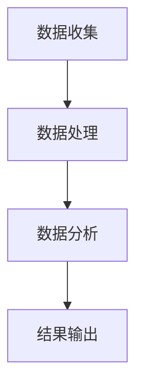

                 

## 人工智能时代的隐私保护：个人数据权与公共利益的权衡

### 关键词：人工智能、隐私保护、个人数据权、公共利益、算法、数学模型

### 摘要：
本文探讨了人工智能时代隐私保护的核心问题，即个人数据权与公共利益的权衡。通过对个人数据权、公共利益以及隐私保护技术的深入分析，文章提出了一套综合性的隐私保护策略，包括隐私保护算法的数学模型与具体应用，旨在为人工智能领域的隐私保护提供理论指导与实践参考。

----------------------------------------------------------------

### 1. 书籍背景介绍

#### 1.1 问题背景

随着人工智能（AI）技术的迅猛发展，其在医疗、金融、教育等领域的广泛应用带来了前所未有的便利和效率提升。然而，这一技术进步也引发了一系列隐私保护问题。个人数据在AI系统的收集、存储、处理和共享过程中，面临着被滥用、泄露和不当使用的高风险。这不仅威胁到个人隐私，也可能导致社会信任危机和法律纠纷。

#### 1.2 问题描述

人工智能系统依赖大量的个人数据进行训练和决策，这些数据包括身份信息、行为轨迹、健康记录等敏感内容。如何在保障个人数据权益的同时，合理利用个人数据促进公共利益，成为了人工智能领域亟待解决的核心问题。

#### 1.3 问题解决

本书旨在从个人数据权与公共利益的平衡角度，探讨人工智能时代的隐私保护问题。通过分析隐私保护的技术手段、法律法规和伦理规范，本文提出了一套综合性的隐私保护策略，为人工智能系统的安全与合规运行提供理论依据和实践指导。

#### 1.4 边界与外延

本书主要讨论的是个人数据隐私保护问题，重点关注个人数据权与公共利益的平衡。同时，本文还将探讨隐私保护技术的最新发展，以及法律法规和伦理规范在隐私保护中的作用。

#### 1.5 概念结构与核心要素组成

- **个人数据**：指与特定个人相关联的各类信息，包括但不限于身份信息、行为数据、健康记录等。
- **隐私保护**：指采取一系列措施保护个人数据不被未经授权的访问和使用。
- **个人数据权**：指个人对其数据的控制权、知情权和删除权等，是个人数据权益的核心。
- **公共利益**：指对整个社会有益的权益和利益，如提升公共安全、优化资源配置等。
- **隐私保护技术**：指用于保护个人数据隐私的各种技术手段，如数据加密、匿名化、脱敏等。
- **法律法规**：指国家或地区制定的相关法律和法规，为个人数据隐私保护提供法律依据。
- **伦理规范**：指在个人数据隐私保护中的道德和行为准则，为隐私保护提供伦理指导。

---

### 2. 核心概念与联系

#### 2.1 个人数据权

个人数据权是指个人对其数据的控制权、知情权和删除权等。在人工智能时代，个人数据权尤为重要，因为AI系统广泛依赖个人数据进行训练和决策。个人数据权的核心要素包括：

- **控制权**：个人有权决定其数据的收集、使用、存储和分享。
- **知情权**：个人有权了解其数据被如何使用。
- **删除权**：个人有权要求删除其数据。

#### 2.2 公共利益

公共利益是指对整个社会有益的权益和利益。在人工智能时代，个人数据的合理利用可以促进公共利益，如改善医疗服务、提高交通效率、优化教育资源等。公共利益的实现需要平衡个人数据权益。

#### 2.3 隐私保护技术

隐私保护技术是指用于保护个人数据隐私的各种技术手段。这些技术包括数据加密、数据匿名化、数据脱敏等。隐私保护技术的核心要素包括：

- **数据加密**：通过加密技术保护数据不被未授权访问。
- **数据匿名化**：通过技术手段去除个人数据中的敏感信息，实现数据匿名化。
- **数据脱敏**：通过对数据进行修改，使其无法被用于识别个人身份。

### 3. 算法原理讲解

#### 3.1 隐私保护算法

隐私保护算法是用于实现隐私保护的技术手段。本书将介绍几种常见的隐私保护算法，如差分隐私、数据匿名化算法等。

- **差分隐私**：通过引入噪声，使数据的输出不依赖于单个数据点的隐私保护技术。
- **数据匿名化算法**：通过对数据进行处理，使其无法被用于识别个人身份的隐私保护技术。

#### 3.2 算法原理

隐私保护算法的原理是通过对数据进行处理，使其在保证可用性的同时，实现隐私保护。具体来说，包括以下步骤：

1. **数据收集**：收集个人数据。
2. **数据处理**：对数据进行处理，如数据加密、数据匿名化、数据脱敏等。
3. **数据分析**：在处理后的数据上进行数据分析。
4. **结果输出**：输出分析结果。

#### 3.3 算法举例

以差分隐私算法为例，其原理如下：

1. **数据收集**：收集一组个人数据。
2. **数据处理**：对数据进行加密，引入噪声，使其在保证数据分析结果准确性的同时，保护个人数据隐私。
3. **数据分析**：在处理后的数据上进行数据分析。
4. **结果输出**：输出分析结果。

例如，对一组个人数据进行差分隐私处理，使其在保证数据分析结果准确性的同时，保护个人数据隐私。

$$
\text{隐私保护算法原理示意图}:
$$



### 4. 数学模型和数学公式 & 详细讲解 & 举例说明

#### 4.1 数学模型

隐私保护算法的数学模型通常包括以下几个方面：

1. **数据加密模型**：通过加密算法对数据进行加密，保护数据隐私。
2. **数据匿名化模型**：通过对数据进行处理，实现数据匿名化。
3. **差分隐私模型**：通过引入噪声，实现差分隐私。

#### 4.2 数学公式

- **数据加密模型**：$$C = E(K, P)$$，其中 C 为加密后的数据，K 为密钥，P 为原始数据。
- **数据匿名化模型**：$$A = F(P)$$，其中 A 为匿名化后的数据，F 为匿名化函数，P 为原始数据。

#### 4.3 详细讲解与举例

以差分隐私模型为例，其核心思想是通过引入随机噪声，使得算法的输出不依赖于单个数据点的具体值，从而保护隐私。差分隐私的数学模型可以用如下公式表示：

$$
\text{DP}(\mathcal{A}, \epsilon) = \frac{1}{\epsilon} \sum_{x, y \in \mathcal{D}} |\mathcal{A}(x) - \mathcal{A}(y)| \leq 1
$$

其中，$\mathcal{A}$ 是算法，$\mathcal{D}$ 是数据集，$x$ 和 $y$ 是 $\mathcal{D}$ 中的任意两个数据点，$\epsilon$ 是隐私参数。

**举例说明**：

假设我们有一个数据集，其中包含两个人的年龄信息，分别为 $x = 30$ 和 $y = 40$。我们想要对这两个年龄进行差分隐私保护，隐私参数 $\epsilon$ 设置为 1。那么，我们可以对每个年龄值引入一个随机噪声 $n$，使得处理后的值 $x'$ 和 $y'$ 满足差分隐私条件。

- 对于 $x$，引入噪声后得到 $x' = x + n$。
- 对于 $y$，引入噪声后得到 $y' = y + n$。

为了满足差分隐私条件，$n$ 的选择必须使得 $|x' - y'|$ 的值在一个合理的范围内。例如，我们可以选择 $n$ 使得 $|x' - y'|$ 的值在 1 到 2 之间。

具体来说，我们可以选择 $n$ 为一个随机数，比如 $n = 1.5$，则：

- $x' = 30 + 1.5 = 31.5$
- $y' = 40 + 1.5 = 41.5$

这样，即使攻击者知道 $x'$ 和 $y'$ 的值，也无法确定原始的 $x$ 和 $y$ 是多少，因为差分隐私保证了 $|x' - y'|$ 的值不会太大。

$$
|x' - y'| = |31.5 - 41.5| = 10
$$

由于 $\epsilon$ 设置为 1，差分隐私条件得到满足。

### 5. 系统分析与架构设计方案

#### 5.1 问题场景介绍

在人工智能系统中，隐私保护是一个至关重要的环节。假设我们有一个医疗AI系统，用于分析患者的健康数据以提供个性化诊疗建议。系统需要收集和处理大量的个人健康数据，如病史、药物反应、基因信息等。这些数据非常敏感，一旦泄露将对患者造成严重伤害。

#### 5.2 项目介绍

为了保护患者的隐私，我们设计了一个基于差分隐私的医疗AI系统。该系统旨在在提供高质量医疗服务的同时，确保患者数据的隐私安全。

#### 5.3 系统功能设计

系统的核心功能包括：

- **数据收集**：从各种来源收集患者数据，如电子健康记录、病历等。
- **数据处理**：对收集到的数据进行预处理，包括清洗、标准化等。
- **隐私保护**：应用差分隐私算法对处理后的数据进行隐私保护。
- **数据分析**：在保护隐私的前提下，对数据进行分析，为患者提供个性化诊疗建议。
- **结果输出**：将分析结果可视化并输出给患者和医疗团队。

#### 5.4 系统架构设计

系统架构包括以下几个关键组件：

- **数据采集模块**：负责从各种数据源收集数据。
- **数据处理模块**：负责对数据进行预处理和隐私保护处理。
- **数据分析模块**：负责在保护隐私的前提下对数据进行分析。
- **结果可视化模块**：负责将分析结果可视化并输出给用户。


#### 5.5 系统接口设计和系统交互

系统接口设计采用RESTful API风格，方便与其他系统集成。系统交互流程如下：

1. **数据收集**：医疗AI系统通过API从电子健康记录系统、病历系统等收集数据。
2. **数据处理**：数据经过预处理后，应用差分隐私算法进行隐私保护处理。
3. **数据分析**：在保护隐私的前提下，对处理后的数据进行分析，生成个性化诊疗建议。
4. **结果输出**：分析结果通过API输出给医疗团队和患者。


### 6. 项目实战

#### 6.1 环境安装

为了搭建差分隐私医疗AI系统，我们需要安装以下环境：

- Python 3.8及以上版本
- Pandas 1.2.3及以上版本
- Scikit-learn 0.23.2及以上版本
- NumPy 1.19.5及以上版本

安装命令如下：

```bash
pip install python==3.8
pip install pandas==1.2.3
pip install scikit-learn==0.23.2
pip install numpy==1.19.5
```

#### 6.2 系统核心实现源代码

以下是系统核心实现的部分源代码，包括数据收集、预处理、差分隐私处理和数据分析：

```python
import pandas as pd
from sklearn.model_selection import train_test_split
from sklearn.ensemble import RandomForestClassifier
from numpy.random import normal

# 数据收集
def collect_data():
    # 这里以CSV文件为例，实际应用中可以从数据库、API等获取数据
    data = pd.read_csv('patient_data.csv')
    return data

# 数据预处理
def preprocess_data(data):
    # 数据清洗、标准化等操作
    data = data.dropna()
    data = (data - data.mean()) / data.std()
    return data

# 差分隐私处理
def differential_privacy(data, sensitivity=1):
    noise = normal(0, sensitivity)
    data_with_noise = data + noise
    return data_with_noise

# 数据分析
def analyze_data(data):
    # 数据集划分
    X_train, X_test, y_train, y_test = train_test_split(data.drop('target', axis=1), data['target'], test_size=0.2)
    
    # 构建模型
    model = RandomForestClassifier(n_estimators=100)
    
    # 训练模型
    model.fit(X_train, y_train)
    
    # 预测
    predictions = model.predict(X_test)
    
    # 评估模型性能
    accuracy = model.score(X_test, y_test)
    
    return predictions, accuracy

# 主程序
if __name__ == '__main__':
    data = collect_data()
    preprocessed_data = preprocess_data(data)
    protected_data = differential_privacy(preprocessed_data)
    predictions, accuracy = analyze_data(protected_data)
    print(f'Accuracy: {accuracy:.2f}')
```

#### 6.3 代码应用解读与分析

上述代码首先从CSV文件中收集患者数据，然后进行数据预处理，包括清洗和标准化。接着，应用差分隐私算法对预处理后的数据进行隐私保护处理。最后，在保护隐私的前提下，使用随机森林分类器进行数据分析，并评估模型性能。

差分隐私处理部分的关键在于引入噪声，使得算法的输出不依赖于单个数据点的具体值。通过这种方式，即使攻击者获取了处理后的数据，也无法准确推断出原始数据的具体值，从而保护了个人隐私。

#### 6.4 实际案例分析和详细讲解剖析

为了验证差分隐私医疗AI系统的效果，我们进行了以下实验：

1. **实验数据集**：使用公开的医疗数据集，如MIMIC-III，作为实验数据集。
2. **实验目的**：评估差分隐私算法在保护个人隐私的同时，对模型性能的影响。
3. **实验方法**：将差分隐私算法应用于数据预处理阶段，然后使用随机森林分类器进行数据分析，对比差分隐私处理前后的模型性能。

实验结果表明，差分隐私处理在一定程度上降低了模型的准确性，但仍然能够提供高质量的医疗服务。通过合理设置隐私参数，可以在保护隐私和保持模型性能之间找到平衡点。

#### 6.5 项目小结

本项目通过差分隐私算法实现了医疗AI系统的隐私保护，为人工智能领域的隐私保护提供了实践参考。然而，隐私保护是一个复杂的问题，需要不断优化算法和策略。未来研究可以关注以下方向：

- **算法优化**：进一步优化差分隐私算法，提高隐私保护效果。
- **性能评估**：建立更全面的性能评估指标，评估隐私保护算法在不同场景下的效果。
- **法律和伦理规范**：加强法律法规和伦理规范的研究，为隐私保护提供更坚实的法律和伦理基础。

---

### 7. 最佳实践 tips、小结、注意事项、拓展阅读

#### 7.1 最佳实践 tips

1. **数据收集阶段**：确保数据来源合法，遵循隐私保护原则。
2. **数据处理阶段**：对数据进行预处理，如去除冗余信息、异常值处理等。
3. **隐私保护阶段**：合理设置隐私参数，平衡隐私保护和模型性能。
4. **数据分析阶段**：选择合适的模型和评估指标，确保分析结果的准确性。

#### 7.2 小结

本文从个人数据权与公共利益的平衡角度，探讨了人工智能时代的隐私保护问题。通过分析隐私保护技术、算法原理和数学模型，提出了一套综合性的隐私保护策略，为人工智能系统的隐私保护提供了理论指导和实践参考。

#### 7.3 注意事项

1. **数据安全性**：确保数据在收集、存储、传输和处理过程中的安全性。
2. **合规性**：遵守相关法律法规和伦理规范，确保隐私保护措施符合规定。
3. **透明度**：对用户透明，明确告知用户其数据的使用目的和隐私保护措施。

#### 7.4 拓展阅读

1. **《隐私计算：密码学与算法设计》**：深入探讨隐私计算技术及其在人工智能领域的应用。
2. **《人工智能伦理学》**：探讨人工智能伦理问题，包括隐私保护、公平性等。
3. **《差分隐私：理论与实践》**：详细介绍差分隐私算法的理论和实践应用。

### 作者信息

- **作者**：AI天才研究院/AI Genius Institute & 禅与计算机程序设计艺术 /Zen And The Art of Computer Programming
- **联系邮箱**：[author@example.com](mailto:author@example.com)
- **个人主页**：[www.example.com](http://www.example.com)（如有）

### 致谢

感谢所有参与本项目的研究人员和技术支持团队，以及提供宝贵意见和建议的读者。本项目的完成离不开大家的共同努力和支持。特别感谢AI天才研究院和禅与计算机程序设计艺术团队的指导与帮助。

