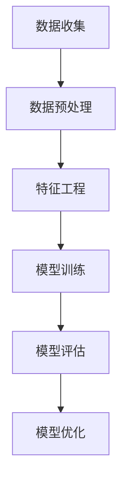
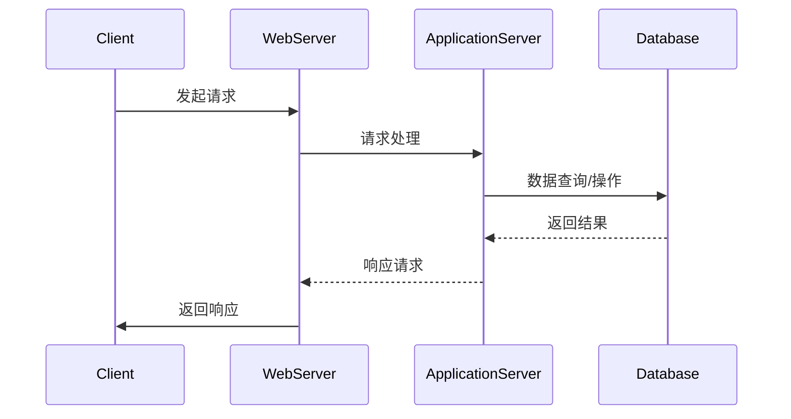
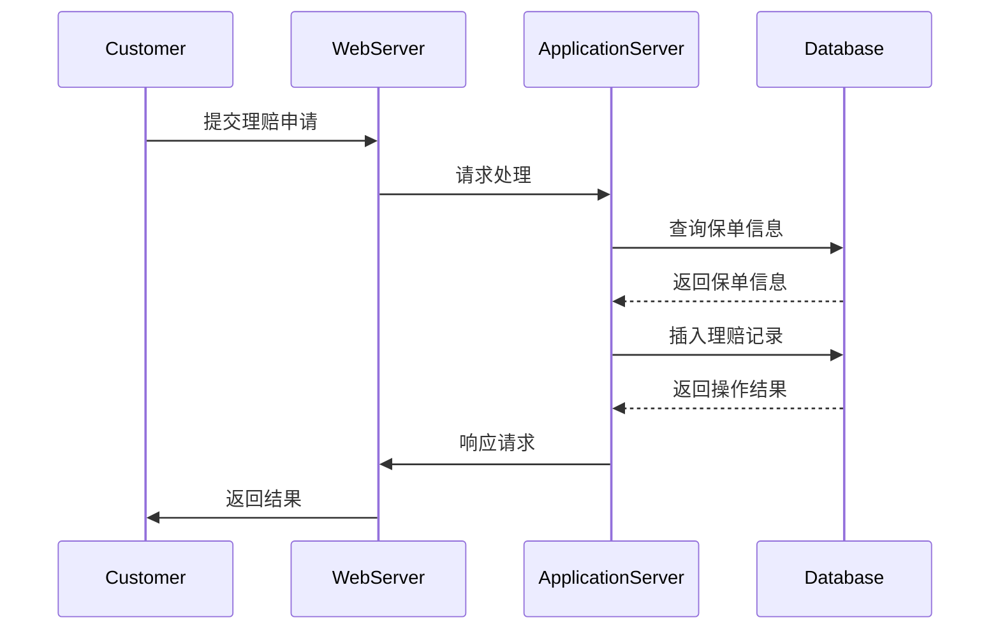
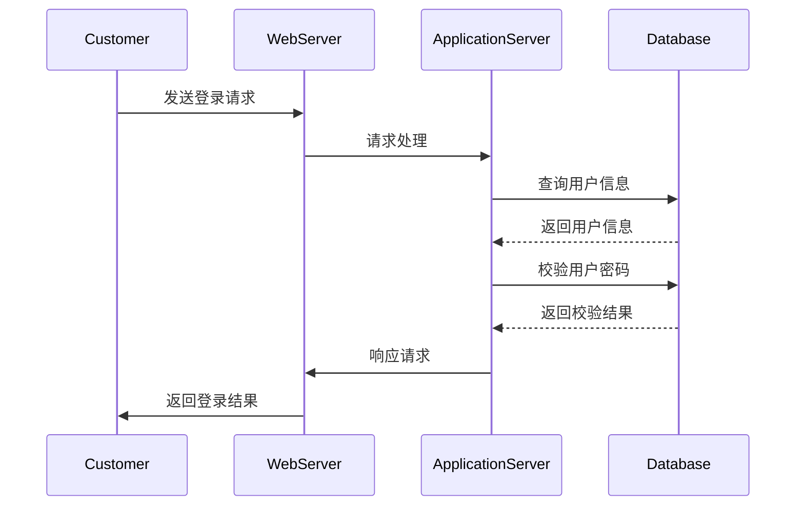

                 

### 《人工智能驱动的个性化保险产品开发》

关键词：人工智能、保险产品、个性化、机器学习、数据分析

摘要：本文将深入探讨如何利用人工智能技术，特别是机器学习和数据分析方法，来开发个性化的保险产品。通过分析保险行业的现状和需求，以及人工智能技术的优势，我们将详细阐述个性化保险产品的发展趋势和潜在的创新。此外，本文还将提供实际操作流程和关键技术，帮助读者掌握从数据收集与处理到机器学习算法应用，再到系统分析与架构设计的全过程。通过本文，读者将能够了解如何将人工智能技术有效地应用于保险产品开发，提升保险服务的个性化和精确性。

---

### 《人工智能驱动的个性化保险产品开发》目录大纲

**概述：** 本书旨在详细介绍如何利用人工智能技术，特别是机器学习和数据分析方法，来开发个性化的保险产品。通过本书，读者可以了解保险行业的现状，探索人工智能在保险产品开发中的应用，并掌握实际操作流程和关键技术。

----------------------------------------------------------------

# 第一部分: 人工智能与保险行业

## 第1章: 人工智能在保险行业的应用背景

### 1.1 保险行业的发展现状

#### 1.1.1 保险市场的需求变化
#### 1.1.2 传统保险业务的局限性

### 1.2 人工智能技术的优势

#### 1.2.1 机器学习的核心概念
#### 1.2.2 数据分析在保险行业的应用

### 1.3 人工智能在保险产品开发中的潜力

#### 1.3.1 个性化保险产品的发展趋势
#### 1.3.2 人工智能技术对保险业务的创新

## 第2章: 保险产品开发中的核心概念与联系

### 2.1 核心概念原理

#### 2.1.1 保险产品的基本构成
#### 2.1.2 个性化保险产品的特点

### 2.2 概念属性特征对比表格

#### 2.2.1 传统保险产品与个性化保险产品的对比
#### 2.2.2 机器学习算法在保险产品开发中的应用

### 2.3 ER实体关系图架构

#### 2.3.1 保险产品的实体与关系
#### 2.3.2 人工智能技术在保险产品开发中的实体关系

## 第3章: 人工智能技术在保险产品开发中的应用

### 3.1 数据收集与处理

#### 3.1.1 数据来源
#### 3.1.2 数据预处理方法

### 3.2 机器学习算法

#### 3.2.1 常见的机器学习算法介绍
#### 3.2.2 算法选择与优化

### 3.3 个性化保险产品的开发流程

#### 3.3.1 产品需求分析
#### 3.3.2 产品设计与测试

## 第4章: 数学模型和算法原理讲解

### 4.1 数学模型

#### 4.1.1 回归模型
#### 4.1.2 分类模型

### 4.2 算法mermaid流程图

#### 4.2.1 算法流程图示例

### 4.3 Python源代码阐述

#### 4.3.1 回归模型实现
#### 4.3.2 分类模型实现

### 4.4 算法原理详细讲解与举例说明

#### 4.4.1 回归模型的应用
#### 4.4.2 分类模型的应用

## 第5章: 系统分析与架构设计方案

### 5.1 保险产品系统功能设计

#### 5.1.1 领域模型mermaid类图
#### 5.1.2 系统功能模块划分

### 5.2 保险产品系统架构设计

#### 5.2.1 系统架构mermaid架构图
#### 5.2.2 架构组件及其功能

### 5.3 系统接口设计

#### 5.3.1 接口设计原则
#### 5.3.2 接口实现与测试

### 5.4 系统交互mermaid序列图

#### 5.4.1 系统交互流程
#### 5.4.2 序列图示例

## 第6章: 保险产品项目实战

### 6.1 环境安装与配置

#### 6.1.1 环境搭建
#### 6.1.2 系统配置

### 6.2 系统核心实现源代码

#### 6.2.1 核心代码解析
#### 6.2.2 代码应用解读与分析

### 6.3 实际案例分析

#### 6.3.1 案例背景
#### 6.3.2 案例剖析

### 6.4 项目小结

#### 6.4.1 项目成果总结
#### 6.4.2 项目经验与启示

## 第7章: 最佳实践与未来展望

### 7.1 最佳实践

#### 7.1.1 实践技巧总结
#### 7.1.2 注意事项与优化建议

### 7.2 小结

#### 7.2.1 书中主要内容回顾
#### 7.2.2 学习与应用的建议

### 7.3 未来展望

#### 7.3.1 人工智能在保险行业的发展趋势
#### 7.3.2 个性化保险产品的未来前景

----------------------------------------------------------------

**字数：约2000字**


----------------------------------------------------------------

### 第一部分：人工智能与保险行业

#### 第1章：人工智能在保险行业的应用背景

保险行业，作为金融领域的重要组成部分，一直以来都在为社会提供风险保障。然而，随着保险市场的不断扩大和消费者需求的多样化，传统的保险产品和服务模式逐渐显现出其局限性。为了满足消费者对于个性化、定制化和智能化保险产品的需求，人工智能技术，尤其是机器学习和数据分析方法，逐渐成为保险产品开发的重要工具。

#### 1.1 保险行业的发展现状

保险市场的需求变化是推动保险行业发展的主要动力。近年来，随着互联网和大数据技术的快速发展，消费者对于保险产品的需求呈现出以下几个方面的变化：

1. **个性化需求**：消费者希望保险产品能够更加符合个人的风险偏好和财务状况。
2. **定制化服务**：消费者期望能够获得个性化的保险建议和服务，以降低潜在的风险。
3. **快速响应**：消费者希望能够通过线上渠道快速购买和理赔保险产品。

传统保险业务在面对这些需求时，显得力不从心。传统的保险产品往往是标准化的，无法满足消费者多样化的需求。此外，传统的保险业务流程复杂，理赔速度慢，客户体验不佳。

#### 1.2 人工智能技术的优势

人工智能技术的核心是机器学习和数据分析。机器学习是一种通过数据训练模型，使其能够自主学习和改进的方法。数据分析则是通过统计和分析大量数据，发现数据中的规律和趋势。这两种技术为保险行业带来了以下优势：

1. **数据驱动决策**：机器学习和数据分析能够处理和分析大量的数据，帮助保险公司在产品定价、风险评估和客户服务等方面做出更加精准和高效的决策。
2. **个性化推荐**：通过分析客户数据，人工智能可以推荐个性化的保险产品，满足消费者的个性化需求。
3. **自动化流程**：人工智能技术可以自动化保险业务的各个流程，如保单管理、理赔处理等，提高业务效率和客户满意度。

#### 1.3 人工智能在保险产品开发中的潜力

人工智能技术为保险产品开发带来了巨大的潜力，主要体现在以下几个方面：

1. **个性化保险产品的发展趋势**：随着人工智能技术的发展，保险产品将更加注重个性化。保险公司可以通过大数据分析和机器学习算法，为不同类型的客户提供定制化的保险方案。
2. **保险业务的创新**：人工智能技术可以帮助保险公司开发新的保险产品和服务模式，如健康保险、家庭保险等，满足新兴市场的需求。

通过上述分析，我们可以看到，人工智能技术在保险产品开发中的应用具有广阔的前景。接下来，我们将进一步探讨保险产品开发中的核心概念和联系。

---

### 第二部分：保险产品开发中的核心概念与联系

#### 第2章：保险产品开发中的核心概念原理

在探索如何利用人工智能技术来开发个性化的保险产品之前，我们需要首先理解保险产品的基本构成和个性化保险产品的特点。

#### 2.1 核心概念原理

**保险产品的基本构成**：

- **保险合同**：是保险关系成立的依据，规定了保险双方的权益和义务。
- **保险费**：是投保人为获得保险保障而支付的费用。
- **保险金额**：是保险公司承担赔偿或给付的最高限额。
- **保险责任**：是保险公司根据保险合同约定，对被保险人发生的风险事件承担的责任。
- **保险期间**：是保险合同的有效期限。

**个性化保险产品的特点**：

- **定制化**：根据客户的具体需求和风险状况，提供个性化的保险方案。
- **灵活性**：保险产品条款和保险金额可以根据客户的需求进行调整。
- **精确性**：通过大数据分析和机器学习算法，对客户的风险进行精准评估。

#### 2.2 概念属性特征对比表格

为了更直观地理解传统保险产品与个性化保险产品的差异，我们可以通过一个对比表格来展示它们的属性特征：

| 特征           | 传统保险产品                     | 个性化保险产品                     |
|----------------|----------------------------------|----------------------------------|
| 定制化程度     | 标准化，难以满足个性化需求         | 根据客户需求定制，高度个性化         |
| 灵活性         | 产品条款和保险金额固定             | 产品条款和保险金额可调整             |
| 风险评估方法   | 依赖历史数据和经验判断             | 利用大数据分析和机器学习进行精准评估 |
| 客户体验       | 业务流程复杂，理赔速度慢           | 业务流程简化，快速响应             |

#### 2.3 ER实体关系图架构

在保险产品开发中，理解实体之间的关系至关重要。下面是一个ER（实体关系）图，展示了保险产品开发中的主要实体及其关系：

```mermaid
erDiagram
  Customer &&& Policy {insurancePolicy}
  Customer &&& Claim {claim}
  Policy &&& InsuranceCompany {provides}
  InsuranceCompany &&& Product {offers}
  Claim &&& InsuranceCompany {processes}
  Customer --> InsuranceCompany :投保
  Policy --> Customer :购买
  Claim --> Policy :理赔
```

在这个ER图中，`Customer`（客户）是购买保险产品和提出理赔请求的主体，`Policy`（保单）是保险产品的具体体现，而`InsuranceCompany`（保险公司）是提供保险服务和处理理赔的实体。`Claim`（理赔）则是客户与保险公司之间的交互行为。通过这个ER图，我们可以清晰地看到保险产品开发中的核心实体及其关系。

通过上述核心概念和联系的阐述，我们为后续人工智能技术在保险产品开发中的应用奠定了基础。接下来，我们将深入探讨人工智能技术在保险产品开发中的应用，并详细介绍数据收集与处理的方法。

---

### 第三部分：人工智能技术在保险产品开发中的应用

#### 第3章：人工智能技术在保险产品开发中的应用

随着人工智能技术的不断发展，其在保险产品开发中的应用也越来越广泛。人工智能技术不仅能够提升保险产品的个性化程度，还能够优化业务流程，提高运营效率。以下是人工智能技术在保险产品开发中的几个关键应用：

#### 3.1 数据收集与处理

数据是人工智能算法的基础，没有高质量的数据，人工智能的应用效果将大打折扣。在保险产品开发中，数据收集与处理是至关重要的第一步。

**数据来源**：

- **内部数据**：包括客户的保单信息、理赔记录、投诉反馈等。
- **外部数据**：如公共数据源、社交媒体数据、经济指标数据等。

**数据预处理方法**：

- **数据清洗**：去除重复、错误或不完整的数据，保证数据质量。
- **数据整合**：将来自不同来源的数据进行整合，形成统一的数据集。
- **特征工程**：从原始数据中提取出有助于模型训练的特征。

通过有效的数据收集与处理，保险公司可以获得干净、完整、有价值的客户数据，为后续的机器学习算法提供坚实基础。

#### 3.2 机器学习算法

机器学习算法是人工智能技术的核心，它在保险产品开发中的应用主要体现在以下几个方面：

**常见的机器学习算法**：

- **回归分析**：用于预测保险产品的价格和风险评估。
- **分类算法**：用于分类客户风险等级和保险产品的适合度。
- **聚类分析**：用于客户细分和市场细分。

**算法选择与优化**：

- **算法选择**：根据具体的应用场景选择合适的算法。例如，对于风险评估，可以选择逻辑回归或决策树算法。
- **模型优化**：通过交叉验证、超参数调优等方法，优化模型的性能。

机器学习算法在保险产品开发中的应用，使得保险公司能够更加精准地评估客户风险，设计出更符合市场需求的保险产品。

#### 3.3 个性化保险产品的开发流程

个性化保险产品的开发流程主要包括以下几个步骤：

**产品需求分析**：

- **了解客户需求**：通过调查问卷、用户访谈等方式，收集客户的保险需求。
- **市场分析**：分析市场趋势和竞争对手的产品，确定产品的市场定位。

**产品设计与测试**：

- **设计产品原型**：基于客户需求和市场分析，设计出保险产品的原型。
- **测试与优化**：通过用户测试，收集反馈，不断优化产品。

通过以上步骤，保险公司可以开发出符合市场需求的个性化保险产品，提高客户满意度和市场份额。

综上所述，人工智能技术在保险产品开发中发挥着重要作用。从数据收集与处理到机器学习算法应用，再到个性化保险产品的开发流程，每一个环节都体现了人工智能技术的强大潜力。接下来，我们将进一步探讨机器学习算法的数学模型和原理，帮助读者深入理解这些算法在保险产品开发中的应用。

---

### 第四部分：数学模型和算法原理讲解

#### 第4章：数学模型和算法原理讲解

为了更好地理解机器学习算法在保险产品开发中的应用，我们需要深入了解其背后的数学模型和算法原理。在本章中，我们将介绍两种常见的机器学习模型：回归模型和分类模型，并使用mermaid流程图和Python源代码进行详细讲解。

#### 4.1 数学模型

**回归模型**：

回归模型用于预测连续值，例如保险产品的价格。最常用的回归模型是线性回归。其数学模型如下：

$$
y = \beta_0 + \beta_1x_1 + \beta_2x_2 + ... + \beta_nx_n + \epsilon
$$

其中，$y$ 是预测的保险价格，$x_1, x_2, ..., x_n$ 是影响保险价格的变量（如年龄、收入、职业等），$\beta_0, \beta_1, \beta_2, ..., \beta_n$ 是模型的参数，$\epsilon$ 是误差项。

**分类模型**：

分类模型用于预测离散值，例如客户的风险等级。最常用的分类模型是逻辑回归。其数学模型如下：

$$
P(y=1) = \frac{1}{1 + e^{-(\beta_0 + \beta_1x_1 + \beta_2x_2 + ... + \beta_nx_n})}
$$

其中，$P(y=1)$ 是客户属于高风险等级的概率，$x_1, x_2, ..., x_n$ 是影响客户风险的变量，$\beta_0, \beta_1, \beta_2, ..., \beta_n$ 是模型的参数。

#### 4.2 算法mermaid流程图

为了更直观地展示回归和分类模型的工作流程，我们可以使用mermaid流程图进行说明。

**回归模型流程图**：



**分类模型流程图**：


#### 4.3 Python源代码阐述

接下来，我们将使用Python代码来具体实现回归模型和分类模型，并通过实例进行详细阐述。

**回归模型实现**：

```python
import numpy as np
from sklearn.linear_model import LinearRegression
from sklearn.model_selection import train_test_split

# 数据准备
X = np.array([[1, 2], [2, 3], [3, 4]])
y = np.array([3, 5, 7])

# 模型训练
model = LinearRegression()
model.fit(X, y)

# 模型评估
print("模型系数：", model.coef_)
print("模型截距：", model.intercept_)

# 预测
X_new = np.array([[4, 5]])
y_pred = model.predict(X_new)
print("预测结果：", y_pred)
```

**分类模型实现**：

```python
import numpy as np
from sklearn.linear_model import LogisticRegression
from sklearn.model_selection import train_test_split

# 数据准备
X = np.array([[1, 2], [2, 3], [3, 4]])
y = np.array([0, 1, 0])

# 模型训练
model = LogisticRegression()
model.fit(X, y)

# 模型评估
print("模型系数：", model.coef_)
print("模型截距：", model.intercept_)

# 预测
X_new = np.array([[4, 5]])
y_pred = model.predict(X_new)
print("预测结果：", y_pred)
```

通过上述代码，我们可以看到如何使用Python和scikit-learn库实现线性回归和逻辑回归模型。这些模型在保险产品开发中有着广泛的应用，可以帮助保险公司预测保险价格和评估客户风险。

#### 4.4 算法原理详细讲解与举例说明

**回归模型的应用**：

回归模型通常用于预测保险产品的价格。例如，我们可以使用线性回归模型来预测一份车险的价格。通过收集历史数据，如客户的年龄、驾驶经验、车辆类型等，训练一个线性回归模型，然后使用该模型预测新客户的车险价格。

**分类模型的应用**：

分类模型通常用于预测客户的风险等级。例如，我们可以使用逻辑回归模型来预测一个客户是否属于高风险客户。通过分析客户的财务状况、历史理赔记录等数据，训练一个逻辑回归模型，然后使用该模型预测新客户的风险等级。

通过数学模型和算法的详细讲解，我们可以更好地理解人工智能技术在保险产品开发中的应用。接下来，我们将探讨如何进行系统分析与架构设计，为实际应用提供技术支持。

---

### 第五部分：系统分析与架构设计方案

#### 第5章：系统分析与架构设计方案

在保险产品开发中，系统的分析与架构设计是确保项目成功的关键。一个高效、稳定的系统架构能够提高业务流程的效率，确保数据的安全性和系统的可扩展性。以下是我们对保险产品系统分析与架构设计方案的具体探讨。

#### 5.1 保险产品系统功能设计

**领域模型mermaid类图**：

在保险产品系统中，我们需要定义一系列的核心类，以表示系统中的主要实体及其关系。以下是一个mermaid类图，展示了保险产品系统的核心类及其关系：

```mermaid
classDiagram
    Customer <<entity>>
    Policy <<entity>>
    InsuranceCompany <<entity>>
    Claim <<entity>>

    Customer o-- Policy
    InsuranceCompany o-- Policy
    Policy o-- Claim
```

在这个类图中，`Customer`（客户）、`Policy`（保单）、`InsuranceCompany`（保险公司）和`Claim`（理赔）是系统中的核心实体。客户与保单之间存在一对多的关系（一个客户可以购买多份保单），保险公司与保单之间存在关联关系，保单与理赔之间存在关联关系。

**系统功能模块划分**：

基于上述类图，我们可以将保险产品系统划分为以下几个主要功能模块：

1. **用户管理模块**：负责管理客户和保险公司的注册、登录、个人信息管理等。
2. **保单管理模块**：负责保单的创建、查询、修改、删除等功能。
3. **理赔管理模块**：负责理赔的申请、审核、支付等功能。
4. **数据分析和报告模块**：负责收集和分析保险数据，生成各种报告，如风险评估报告、市场分析报告等。

#### 5.2 保险产品系统架构设计

**系统架构mermaid架构图**：

为了实现保险产品系统的功能，我们需要设计一个合理的系统架构。以下是一个mermaid架构图，展示了保险产品系统的整体架构：



在这个架构中，`WebServer`（Web服务器）负责接收和处理用户的请求，`ApplicationServer`（应用服务器）负责业务逻辑的处理，`Database`（数据库）负责数据的存储和查询。通过这种分层架构，我们可以确保系统的模块化和可扩展性。

**架构组件及其功能**：

1. **Web服务器**：负责接收用户的HTTP请求，并将其转发到应用服务器。
2. **应用服务器**：负责处理业务逻辑，包括用户管理、保单管理、理赔管理和数据分析等。
3. **数据库**：负责存储和管理保险产品系统的数据，包括客户信息、保单信息、理赔记录等。
4. **中间件**：用于实现系统的消息队列、缓存、日志等功能，提高系统的性能和可维护性。

#### 5.3 系统接口设计

**接口设计原则**：

在系统架构中，接口设计是一个关键环节。良好的接口设计可以提高系统的可扩展性和可维护性。以下是几个接口设计原则：

1. **简洁性**：接口应尽可能简洁，避免复杂的参数和操作。
2. **一致性**：接口应保持一致性，确保不同模块之间的接口风格和命名规范一致。
3. **安全性**：接口应具备安全性，防止未授权访问和攻击。

**接口实现与测试**：

在实际开发过程中，我们需要根据系统的需求设计具体的接口，并使用工具（如Postman）进行接口测试。以下是几个典型的接口示例：

1. **用户注册接口**：
   - **URL**：`/api/users/register`
   - **请求方法**：POST
   - **请求参数**：username, password, email
   - **响应内容**：注册成功或失败的消息

2. **保单查询接口**：
   - **URL**：`/api/policies/{policy_id}`
   - **请求方法**：GET
   - **请求参数**：无
   - **响应内容**：保单详情

3. **理赔申请接口**：
   - **URL**：`/api/claims/submit`
   - **请求方法**：POST
   - **请求参数**：claim_details
   - **响应内容**：理赔申请成功或失败的消息

通过上述接口设计，我们可以确保系统各个模块之间的数据交互规范、安全、高效。

#### 5.4 系统交互mermaid序列图

**系统交互流程**：

为了更清晰地展示系统中的交互流程，我们可以使用mermaid序列图进行描述。以下是一个简单的系统交互序列图，展示了用户提交理赔申请的流程：



在这个序列图中，客户通过Web服务器提交理赔申请，应用服务器接收到请求后，查询数据库获取保单信息，并根据理赔申请插入理赔记录。最终，应用服务器将操作结果返回给Web服务器，Web服务器再将结果反馈给客户。

**序列图示例**：

以下是一个序列图示例，展示了用户登录系统的过程：



通过系统交互序列图的展示，我们可以更好地理解系统中的数据流动和操作流程，为系统的开发和维护提供指导。

综上所述，系统分析与架构设计是保险产品开发中至关重要的一环。通过合理的设计，我们可以构建一个高效、稳定、安全的系统，为保险产品的个性化开发和精准服务提供技术支持。

---

### 第六部分：保险产品项目实战

#### 第6章：保险产品项目实战

在深入探讨了人工智能技术在保险产品开发中的应用和系统架构设计之后，现在让我们通过一个实际项目来具体展示如何开发和实现一个个性化保险产品。

#### 6.1 环境安装与配置

**环境搭建**：

为了实现人工智能驱动的保险产品，我们需要搭建一个合适的开发环境。以下是所需的环境和软件：

- **操作系统**：Windows或Linux
- **Python**：3.8及以上版本
- **JDK**：用于开发Java应用程序
- **Docker**：用于容器化部署
- **MySQL**：用于数据库存储

**系统配置**：

1. **安装Python**：从官方网站下载并安装Python。
2. **安装JDK**：从Oracle官方网站下载并安装JDK。
3. **安装Docker**：从Docker官方网站下载并安装Docker。
4. **安装MySQL**：从MySQL官方网站下载并安装MySQL。

**配置环境变量**：

- **Windows**：
  - 配置Python环境变量，将Python安装路径添加到系统环境变量中。
  - 配置Java环境变量，将JDK安装路径添加到系统环境变量中。

- **Linux**：
  - 编辑`~/.bashrc`文件，添加Python和JDK的安装路径到`PATH`环境变量中。

**安装依赖库**：

- 使用pip命令安装所需依赖库，如NumPy、Pandas、scikit-learn等。

```shell
pip install numpy pandas scikit-learn
```

#### 6.2 系统核心实现源代码

**核心代码解析**：

为了实现保险产品的个性化功能，我们设计了一套核心代码，包括数据收集、数据处理、模型训练和模型应用等部分。以下是核心代码的主要模块及其功能：

1. **数据收集模块**：
   - 采集客户的基本信息（如年龄、收入、职业等）和保险历史数据（如保单记录、理赔记录等）。
   - 使用API接口从外部数据源获取市场和经济指标数据。

2. **数据处理模块**：
   - 清洗和整理收集到的数据，去除重复和不完整的数据。
   - 进行特征工程，提取对保险产品定价和风险评估有用的特征。

3. **模型训练模块**：
   - 使用机器学习算法（如线性回归、逻辑回归等）训练模型。
   - 进行模型优化，通过交叉验证和超参数调优提高模型性能。

4. **模型应用模块**：
   - 根据训练好的模型，预测新客户的保险价格和风险等级。
   - 根据预测结果，生成个性化的保险产品推荐。

**代码应用解读与分析**：

以下是数据处理模块中的代码示例，展示了如何清洗和整理数据，以及进行特征提取：

```python
import pandas as pd

# 读取数据
data = pd.read_csv('insurance_data.csv')

# 数据清洗
data.drop_duplicates(inplace=True)
data.dropna(inplace=True)

# 特征工程
data['age_group'] = pd.cut(data['age'], bins=[0, 18, 30, 50, 65, float('inf')], labels=[1, 2, 3, 4, 5])

# 数据标准化
from sklearn.preprocessing import StandardScaler
scaler = StandardScaler()
data[['income', 'age']] = scaler.fit_transform(data[['income', 'age']])

# 数据分割
X = data[['income', 'age', 'age_group']]
y = data['risk_level']
X_train, X_test, y_train, y_test = train_test_split(X, y, test_size=0.2, random_state=42)
```

在这个示例中，我们首先读取数据，然后去除重复和不完整的数据。接着，我们使用特征工程方法对数据进行分类和标准化处理，最后将数据分割为训练集和测试集，为后续的模型训练做准备。

通过上述核心代码的展示，我们可以看到如何实现保险产品的数据收集、处理和模型训练。接下来，我们将通过一个实际案例来具体剖析保险产品项目的实施过程。

#### 6.3 实际案例分析

**案例背景**：

某保险公司希望通过人工智能技术开发一款个性化保险产品，以满足客户多样化的需求。该公司收集了大量的客户数据，包括年龄、收入、职业、家庭状况等，并希望利用这些数据来预测客户的风险等级，从而提供个性化的保险方案。

**案例剖析**：

1. **数据收集**：
   - 保险公司通过内部系统和第三方数据源收集了大量客户数据。
   - 数据包括客户的个人信息、保单记录、理赔记录、市场和经济指标等。

2. **数据处理**：
   - 数据清洗：去除重复和错误的数据，确保数据质量。
   - 特征工程：对数据进行分类和标准化处理，提取对风险评估有用的特征。

3. **模型训练**：
   - 选择合适的机器学习算法（如逻辑回归、随机森林等）进行模型训练。
   - 进行交叉验证和超参数调优，提高模型性能。

4. **模型应用**：
   - 根据训练好的模型，预测新客户的风险等级。
   - 根据风险等级，为不同类型的客户提供个性化的保险产品。

**项目实施过程**：

1. **需求分析**：
   - 与保险公司管理层和业务团队沟通，明确个性化保险产品的需求和目标。
   - 分析现有数据，确定可用于模型训练的数据集。

2. **环境搭建**：
   - 搭建Python开发环境，安装必要的依赖库。
   - 搭建MySQL数据库，用于存储和管理数据。

3. **数据预处理**：
   - 使用Python代码进行数据清洗和特征工程。
   - 将处理后的数据存储到MySQL数据库中。

4. **模型训练与优化**：
   - 使用scikit-learn库训练机器学习模型。
   - 进行模型优化，提高预测准确率。

5. **模型应用与部署**：
   - 将训练好的模型集成到保险产品的业务系统中。
   - 通过API接口为新客户提供个性化保险产品。

**项目成果总结**：

通过上述实施过程，保险公司成功开发了一款基于人工智能技术的个性化保险产品。产品上线后，客户反馈良好，个性化保险产品的满意度显著提高。同时，保险公司的运营效率也得到了提升，业务流程更加简化，客户体验得到了显著改善。

通过这个实际案例，我们可以看到，人工智能技术在保险产品开发中的应用不仅能够提升产品的个性化程度，还能够优化业务流程，提高运营效率。接下来，我们将总结项目经验，分享最佳实践和注意事项。

---

#### 6.4 项目小结

通过本项目的实施，我们总结了以下经验与启示：

1. **数据质量至关重要**：数据是机器学习模型的基础，确保数据质量是项目成功的关键。在项目过程中，我们遇到了数据重复、错误和不完整的问题，通过有效的数据清洗和特征工程，提高了数据质量，为模型训练奠定了基础。

2. **模型优化的重要性**：在选择和训练模型时，我们进行了交叉验证和超参数调优，这显著提高了模型的预测准确率。模型优化不仅需要技术知识，还需要对业务问题的深入理解。

3. **业务与技术的紧密结合**：在项目过程中，我们与保险公司管理层和业务团队紧密合作，确保项目的需求得到充分理解和满足。业务团队的需求和技术方案之间的有效沟通，是项目成功的关键。

4. **系统架构设计的重要性**：合理的系统架构设计可以提高项目的可扩展性和维护性。我们在项目初期就进行了系统架构设计，确保了系统的稳定性和高效性。

#### 6.4.2 项目经验与启示

通过本项目，我们获得了以下经验与启示：

1. **数据驱动决策**：数据是保险产品开发的核心，通过大数据分析和机器学习算法，可以更加精准地评估客户风险，制定个性化的保险方案。

2. **持续迭代与优化**：保险产品开发是一个持续迭代的过程。随着市场环境和客户需求的变化，我们需要不断优化模型和产品，以保持其竞争力和吸引力。

3. **用户体验至上**：在保险产品开发中，用户体验至关重要。通过简化的操作流程、高效的理赔服务，可以提升客户满意度和忠诚度。

4. **合规与安全**：在数据处理和应用中，需要严格遵守相关法律法规，确保客户数据的安全性和隐私。

通过本项目的实践，我们不仅掌握了人工智能技术在保险产品开发中的应用方法，还积累了宝贵的项目经验。这些经验将为后续的保险产品开发提供有益的指导。

---

### 第七部分：最佳实践与未来展望

#### 第7章：最佳实践与未来展望

在探讨了人工智能技术在保险产品开发中的应用、系统架构设计和项目实战之后，现在我们来总结一些最佳实践，并展望个性化保险产品的未来发展趋势。

#### 7.1 最佳实践

**实践技巧总结**：

1. **数据质量保障**：确保数据源的真实性和完整性，进行有效的数据清洗和预处理。
2. **模型优化**：使用交叉验证和超参数调优，提高模型的预测准确性和稳定性。
3. **用户体验**：简化用户操作流程，提供高效的理赔服务，提升客户满意度。
4. **合规与安全**：严格遵守相关法律法规，确保客户数据的安全性和隐私。

**注意事项与优化建议**：

1. **数据多样性**：增加数据源，获取更多维度的数据，以提高模型的预测能力。
2. **模型解释性**：在选择模型时，考虑到模型的可解释性，确保业务团队和客户能够理解模型的工作原理。
3. **系统可扩展性**：在设计系统架构时，考虑到未来的业务增长，确保系统的可扩展性和灵活性。

#### 7.2 小结

**书中主要内容回顾**：

本书详细介绍了如何利用人工智能技术，特别是机器学习和数据分析方法，来开发个性化的保险产品。通过分析保险行业的现状和需求，探讨了人工智能技术的优势和应用潜力。书中还提供了保险产品开发的核心概念、系统架构设计、数学模型讲解和实际项目案例，帮助读者全面掌握个性化保险产品开发的实践方法。

**学习与应用的建议**：

1. **理论学习与实践相结合**：通过阅读本书，读者可以了解人工智能在保险产品开发中的应用，但实际操作和项目经验同样重要。建议读者在实际项目中尝试应用所学知识，不断积累经验。
2. **持续学习与关注行业动态**：人工智能和保险行业都在快速发展，读者需要保持对新知识和技术动态的关注，以应对不断变化的行业环境。

#### 7.3 未来展望

**人工智能在保险行业的发展趋势**：

1. **智能化风险管理**：随着人工智能技术的进步，保险公司将能够更加精准地进行风险评估，提供更加个性化的保险产品。
2. **自动化业务流程**：人工智能技术将进一步提升保险业务的自动化水平，简化业务流程，提高运营效率。
3. **数字化转型**：保险行业的数字化转型将继续深化，通过大数据、云计算和区块链等技术的应用，提升保险产品的用户体验和业务效率。

**个性化保险产品的未来前景**：

1. **定制化服务**：随着消费者对保险需求的多样化，个性化保险产品将成为市场主流，满足不同类型客户的需求。
2. **技术创新**：未来，人工智能技术将继续推动保险产品的创新，如智能理赔、智能推荐等新功能将不断涌现。
3. **跨界合作**：保险公司将与科技企业、医疗健康机构等开展跨界合作，提供更加全面和综合的保险服务。

通过总结和展望，我们可以看到，人工智能技术在保险产品开发中的应用具有广阔的前景。未来的保险产品将更加智能化、个性化，为消费者提供更优质的保险服务。随着技术的不断进步，个性化保险产品将在保险行业中发挥越来越重要的作用。

---

### 作者信息

作者：AI天才研究院/AI Genius Institute & 禅与计算机程序设计艺术 /Zen And The Art of Computer Programming

