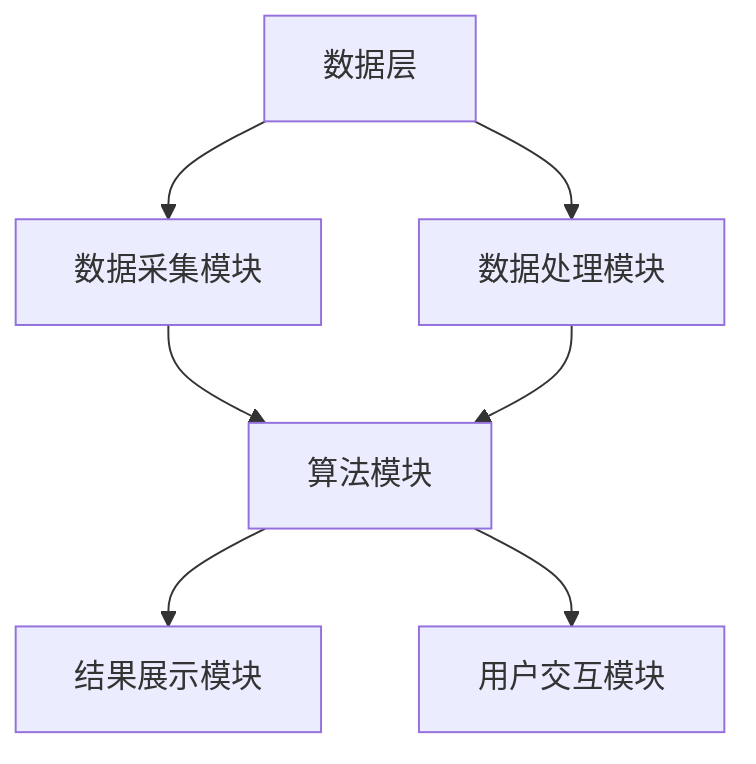

                 

### 引言

#### 文章标题：人工智能驱动的个性化医疗方案制定

#### 关键词：人工智能、个性化医疗、算法原理、系统架构、项目实战

#### 摘要：
本文深入探讨了人工智能（AI）在个性化医疗方案制定中的应用。从背景介绍到核心概念阐述，再到算法原理讲解和系统架构设计，本文全面解析了AI在个性化医疗中的潜力。通过实际项目实战，本文展示了AI在个性化医疗方案制定中的具体应用过程，并提供了一系列最佳实践和拓展阅读资源。

### 目录

1. **引言**
   - 文章标题、关键词和摘要
   - 目录

2. **第一部分：背景介绍**
   - 第1章：人工智能与个性化医疗背景
   - 第2章：个性化医疗的核心概念

3. **第二部分：算法原理讲解**
   - 第3章：人工智能算法原理

4. **第三部分：系统分析与架构设计方案**
   - 第4章：个性化医疗系统架构设计

5. **第四部分：项目实战**
   - 第5章：个性化医疗项目实战
   - 第6章：个性化医疗方案制定流程
   - 第7章：个性化医疗方案优化与评估

6. **第五部分：总结与拓展**
   - 第8章：总结与拓展

### 第一部分：背景介绍

#### 第1章：人工智能与个性化医疗背景

##### 1.1 人工智能的发展历程

人工智能（Artificial Intelligence，AI）作为计算机科学的一个分支，旨在研究、开发用于模拟、延伸和扩展人的智能的理论、方法、技术和应用系统。人工智能的发展可以追溯到20世纪50年代，当时图灵提出了著名的图灵测试，旨在通过对话判断机器是否具有人类智能。此后，人工智能研究经历了多个发展阶段，从早期的符号主义、基于规则的系统，到现代的基于数据的学习和深度学习技术，人工智能在各个领域取得了显著的进展。

在医疗领域，人工智能的应用始于20世纪80年代，最初主要用于医学图像分析和诊断。随着计算机性能的提升和大数据技术的发展，人工智能在医疗领域的应用逐渐深入，包括但不限于疾病预测、个性化治疗、药物发现、健康监测等方面。近年来，随着深度学习和神经网络技术的飞速发展，人工智能在医疗领域的应用前景更加广阔。

##### 1.2 个性化医疗的概念与挑战

个性化医疗（Personalized Medicine）是一种以个体为焦点，基于患者的基因信息、生活方式和环境因素，提供定制化医疗方案的新兴医学模式。个性化医疗的目标是提高医疗效果，降低医疗成本，同时提升患者的满意度和生活质量。

个性化医疗的概念可以从以下几个方面来理解：

- **患者个性化**：个性化医疗强调根据每个患者的具体情况进行诊断和治疗，而不是采用通用的标准方案。
- **基因个性化**：基因测序技术的发展使得个性化医疗能够基于患者的基因组信息进行精准治疗。
- **环境个性化**：患者的生活环境、生活方式和地理位置等因素也会影响治疗效果，因此个性化医疗需要考虑这些因素。
- **数据驱动**：个性化医疗依赖于大数据和人工智能技术，通过分析大量的患者数据，为每个患者提供最优的治疗方案。

个性化医疗面临的挑战主要包括：

- **数据隐私和安全**：个性化医疗需要收集和处理大量的患者数据，数据隐私和安全问题亟待解决。
- **数据整合与标准化**：来自不同来源、不同格式的数据如何整合和标准化，以便进行有效的分析和应用，是一个重大挑战。
- **算法和模型的可靠性**：个性化医疗算法和模型的准确性、可靠性直接关系到治疗效果，因此需要严格的验证和评估。

##### 1.3 人工智能在个性化医疗中的潜力

人工智能在个性化医疗中具有巨大的潜力，主要体现在以下几个方面：

- **疾病预测和诊断**：通过分析患者的医疗记录、基因信息、生活方式等数据，人工智能可以预测疾病的发生风险，辅助医生进行早期诊断。
- **个性化治疗方案制定**：基于患者的基因信息、疾病特征、治疗效果等数据，人工智能可以帮助医生制定个性化的治疗方案，提高治疗效果。
- **药物发现和临床试验**：人工智能可以加速药物发现过程，提高临床试验的效率，同时减少药物开发的成本。
- **健康监测和疾病管理**：通过智能穿戴设备和移动应用，人工智能可以实时监测患者的健康状况，提供个性化的健康建议和疾病管理方案。

总之，人工智能在个性化医疗中的应用不仅提高了医疗效率和效果，还为医学研究提供了新的方法和工具，有望带来医疗模式的深刻变革。

##### 1.4 结论与展望

随着人工智能技术的不断进步和医疗大数据的积累，个性化医疗的未来前景光明。通过深入理解人工智能在个性化医疗中的应用原理和挑战，我们可以更好地利用这一技术，为患者提供更加精准和有效的医疗服务。未来，随着技术的进一步发展和完善，个性化医疗有望实现更加广泛和深入的应用，推动医学领域的创新和进步。

#### 第2章：个性化医疗的核心概念

##### 2.1 个性化医疗的定义与类型

个性化医疗（Personalized Medicine）是一种以个体为焦点，基于患者的基因信息、生活方式和环境因素，提供定制化医疗方案的新兴医学模式。个性化医疗的目标是提高医疗效果，降低医疗成本，同时提升患者的满意度和生活质量。

个性化医疗的定义可以从以下几个方面来理解：

- **患者个性化**：个性化医疗强调根据每个患者的具体情况进行诊断和治疗，而不是采用通用的标准方案。
- **基因个性化**：基因测序技术的发展使得个性化医疗能够基于患者的基因组信息进行精准治疗。
- **环境个性化**：患者的生活环境、生活方式和地理位置等因素也会影响治疗效果，因此个性化医疗需要考虑这些因素。
- **数据驱动**：个性化医疗依赖于大数据和人工智能技术，通过分析大量的患者数据，为每个患者提供最优的治疗方案。

个性化医疗的类型主要包括：

1. **基因驱动的个性化医疗**：基于患者的基因组信息，为特定基因变异的患者提供特定的治疗方案。
2. **表型驱动的个性化医疗**：基于患者的生理、生化指标和生活习惯等表型信息，为患者提供个性化的医疗建议。
3. **大数据驱动的个性化医疗**：通过收集和分析大量的患者数据，利用人工智能技术为患者提供个性化治疗建议。

##### 2.2 个性化医疗的关键要素

个性化医疗的实现需要依赖多个关键要素，包括：

1. **患者数据**：个性化医疗的核心是患者数据，包括医疗记录、基因信息、生活方式、环境因素等。这些数据是制定个性化医疗方案的基础。
2. **数据管理**：如何有效地收集、存储、管理和分析患者数据，是个性化医疗成功的关键。数据隐私和安全也是需要考虑的重要问题。
3. **算法和模型**：用于分析和处理患者数据的算法和模型是个性化医疗的核心技术。这些算法和模型需要具备高度的准确性和可靠性。
4. **医生与患者合作**：个性化医疗的实施需要医生和患者的密切合作，医生需要根据患者的具体情况制定个性化的治疗方案，患者需要积极配合治疗。

##### 2.3 个性化医疗与大数据

大数据（Big Data）在个性化医疗中起着至关重要的作用。大数据技术能够帮助医疗领域处理和分析海量数据，从而为个性化医疗提供有力支持。

个性化医疗与大数据的关系主要体现在以下几个方面：

1. **数据来源**：个性化医疗的数据来源广泛，包括电子健康记录、基因测序数据、社交媒体数据、医疗设备数据等。这些数据来源的多样性和海量性是大数据技术的重要应用场景。
2. **数据分析**：大数据技术能够对海量患者数据进行高效分析，从而发现潜在的疾病模式和治疗方案。例如，通过分析患者的基因组数据和医疗记录，可以预测某种疾病的发生风险，为早期诊断和干预提供依据。
3. **数据可视化**：大数据技术能够将复杂的数据转化为易于理解的可视化图表和报告，帮助医生和患者更好地理解数据，从而制定更有效的个性化治疗方案。
4. **数据隐私与安全**：在大数据环境下，数据隐私和安全是至关重要的问题。个性化医疗需要确保患者数据的安全性和隐私性，避免数据泄露和滥用。

##### 2.4 结论

个性化医疗作为一种新兴的医学模式，具有巨大的发展潜力和应用前景。通过理解个性化医疗的核心概念和关键要素，我们可以更好地利用大数据和人工智能技术，为患者提供更加精准和有效的医疗服务。未来，随着技术的进一步发展和完善，个性化医疗有望实现更加广泛和深入的应用，推动医学领域的创新和进步。

### 第二部分：算法原理讲解

#### 第3章：人工智能算法原理

##### 3.1 常见的人工智能算法

在个性化医疗中，常见的人工智能算法主要包括以下几种：

1. **监督学习算法**：监督学习算法通过已标记的数据进行训练，从而预测新的数据。常见的监督学习算法包括线性回归、逻辑回归、支持向量机（SVM）和决策树等。
2. **无监督学习算法**：无监督学习算法不依赖于已标记的数据，通过挖掘数据中的潜在结构和模式进行训练。常见的无监督学习算法包括聚类算法（如K-means、层次聚类）、主成分分析（PCA）和自编码器等。
3. **深度学习算法**：深度学习算法通过模拟人脑的神经网络结构，对大量数据进行学习和预测。常见的深度学习算法包括卷积神经网络（CNN）、循环神经网络（RNN）和生成对抗网络（GAN）等。

##### 3.2 个性化医疗中的算法应用

个性化医疗中的算法应用主要涉及疾病预测、个性化治疗和药物发现等方面。以下是一些具体的算法应用案例：

1. **疾病预测**：通过分析患者的医疗记录、基因数据和生活方式数据，可以使用监督学习算法预测某种疾病的发生风险。例如，使用逻辑回归算法可以预测患者患糖尿病的风险。
2. **个性化治疗**：通过分析患者的基因组数据和医疗记录，可以使用机器学习算法为患者制定个性化的治疗方案。例如，使用决策树算法可以为患者推荐最适合的化疗方案。
3. **药物发现**：通过分析大量药物数据，可以使用深度学习算法预测药物对特定疾病的疗效。例如，使用卷积神经网络（CNN）可以预测新药物对癌症细胞的毒性。

##### 3.3 算法原理讲解与流程图

为了更好地理解个性化医疗中的算法原理，下面将介绍几种常见算法的原理和流程图。

###### 3.3.1 线性回归算法

线性回归算法是一种监督学习算法，用于预测连续值输出。其基本原理是通过拟合一条直线，将输入特征映射到输出值。

- **算法原理**：

  $$ y = \beta_0 + \beta_1 \cdot x $$

  其中，$y$ 为输出值，$x$ 为输入特征，$\beta_0$ 和 $\beta_1$ 为模型的参数。

- **算法流程图**：

  ```mermaid
  graph TD
  A[输入数据] --> B[特征提取]
  B --> C[拟合直线]
  C --> D[输出预测值]
  ```

###### 3.3.2 决策树算法

决策树算法是一种常见的分类算法，通过递归地将数据集划分成子集，为每个子集选择最优的特征进行划分。

- **算法原理**：

  决策树的每个节点表示一个特征，每个分支表示该特征的不同取值。叶子节点表示分类结果。

- **算法流程图**：

  ```mermaid
  graph TD
  A[输入数据] --> B{选择特征}
  B -->|特征1| C1[划分数据]
  B -->|特征2| C2[划分数据]
  ...
  C1 -->|子节点| D1[分类结果]
  C2 -->|子节点| D2[分类结果]
  ...
  ```

###### 3.3.3 卷积神经网络（CNN）

卷积神经网络是一种深度学习算法，主要用于图像处理任务。其基本原理是通过卷积操作和池化操作，提取图像特征，然后通过全连接层进行分类。

- **算法原理**：

  $$ \text{卷积层} \rightarrow \text{池化层} \rightarrow \text{全连接层} $$

- **算法流程图**：

  ```mermaid
  graph TD
  A[输入图像] --> B[卷积层]
  B --> C[池化层]
  C --> D[全连接层]
  D --> E[输出分类结果]
  ```

通过以上算法原理讲解和流程图，我们可以更好地理解个性化医疗中常用算法的工作原理和应用场景。在接下来的章节中，我们将继续探讨个性化医疗的系统架构设计和项目实战。

### 第三部分：系统分析与架构设计方案

#### 第4章：个性化医疗系统架构设计

##### 4.1 个性化医疗系统的功能模块

个性化医疗系统的功能模块主要包括以下几个部分：

1. **数据采集模块**：负责收集患者的医疗记录、基因数据、生活方式数据和环境数据等。
2. **数据处理模块**：负责对收集到的数据进行清洗、整合和预处理，为后续分析提供高质量的数据。
3. **算法模块**：包括多种机器学习算法和深度学习算法，用于分析和预测患者的健康状况和制定个性化治疗方案。
4. **结果展示模块**：将分析结果和个性化建议以直观的方式展示给医生和患者。
5. **用户交互模块**：提供用户注册、登录、数据上传和查询等功能，方便医生和患者使用系统。

##### 4.2 个性化医疗系统架构设计

个性化医疗系统的架构设计需要综合考虑系统的性能、可扩展性和安全性。以下是一个典型的个性化医疗系统架构设计：

- **数据层**：数据层负责存储和管理各种数据，包括患者信息、医疗记录、基因数据和环境数据等。数据层可以使用关系数据库或分布式数据库系统，如MySQL、MongoDB等。
- **服务层**：服务层包括数据采集服务、数据处理服务、算法服务、结果展示服务和用户交互服务。每个服务都可以独立部署，以提高系统的性能和可扩展性。
- **应用层**：应用层是系统的核心，负责实现个性化医疗的具体功能，如疾病预测、个性化治疗和药物发现等。应用层可以使用Python、Java等编程语言开发。
- **展示层**：展示层包括Web界面和移动应用，用于展示分析结果和个性化建议。展示层可以使用HTML、CSS和JavaScript等技术实现。

##### 4.3 系统接口设计与系统交互

个性化医疗系统的接口设计和系统交互是确保系统功能正常运行的关键。以下是一些重要的接口设计和交互场景：

1. **数据采集接口**：数据采集接口用于接收医生和患者的数据上传，如电子病历、基因测序数据等。数据采集接口可以通过HTTP协议实现，采用RESTful风格。
2. **数据处理接口**：数据处理接口用于处理和分析上传的数据，如数据清洗、整合和预处理等。数据处理接口可以通过SOAP或RESTful API实现。
3. **算法接口**：算法接口用于调用各种机器学习算法和深度学习算法，实现疾病预测、个性化治疗等功能。算法接口可以通过Python的API或TensorFlow、PyTorch等深度学习框架的接口实现。
4. **结果展示接口**：结果展示接口用于将分析结果和个性化建议以图形、表格等形式展示给医生和患者。结果展示接口可以通过Web界面或移动应用实现。

##### 4.4 系统架构图

以下是一个典型的个性化医疗系统架构图，展示了系统的各个组成部分及其相互关系：



通过以上系统架构设计和接口设计，我们可以确保个性化医疗系统的高效运行，为医生和患者提供优质的个性化医疗服务。

### 第四部分：项目实战

#### 第5章：个性化医疗项目实战

##### 5.1 项目背景与环境安装

本项目旨在利用人工智能技术，为糖尿病患者提供个性化治疗方案。为了实现这一目标，我们选择了一个公开的糖尿病预测数据集，并通过构建机器学习模型来进行疾病预测。

**项目背景**：

糖尿病是一种常见的慢性疾病，全球糖尿病患者数量持续上升。早期诊断和个性化治疗对于控制病情、降低并发症风险具有重要意义。然而，现有的医疗资源分配不均，许多患者无法得到及时的诊断和治疗。因此，利用人工智能技术进行糖尿病预测和个性化治疗，有望提高医疗资源的利用效率，改善患者的生活质量。

**环境安装**：

为了搭建个性化医疗系统，我们需要以下软件和库：

1. **Python 3.x**：作为编程语言
2. **NumPy**：用于数值计算
3. **Pandas**：用于数据操作
4. **Scikit-learn**：用于机器学习
5. **TensorFlow**：用于深度学习
6. **Matplotlib**：用于数据可视化

安装步骤如下：

1. 安装Python 3.x，可以从Python官方网站下载安装包并安装。
2. 安装NumPy、Pandas、Scikit-learn和TensorFlow，可以通过pip命令进行安装：
   ```bash
   pip install numpy pandas scikit-learn tensorflow
   ```

##### 5.2 系统核心实现与代码解读

**数据预处理**：

在构建机器学习模型之前，我们需要对数据进行预处理，包括数据清洗、缺失值处理、数据转换等。

```python
import pandas as pd
import numpy as np

# 读取数据集
data = pd.read_csv('diabetes.csv')

# 数据清洗
data = data.dropna()  # 删除缺失值

# 特征转换
data['Outcome'] = data['Outcome'].map({0: 'No', 1: 'Yes'})  # 将标签转换为字符串

# 分割特征和标签
X = data.drop('Outcome', axis=1)
y = data['Outcome']
```

**构建模型**：

我们使用Scikit-learn库中的逻辑回归模型进行疾病预测。

```python
from sklearn.linear_model import LogisticRegression
from sklearn.model_selection import train_test_split
from sklearn.metrics import accuracy_score

# 分割训练集和测试集
X_train, X_test, y_train, y_test = train_test_split(X, y, test_size=0.2, random_state=42)

# 训练模型
model = LogisticRegression()
model.fit(X_train, y_train)

# 测试模型
y_pred = model.predict(X_test)
accuracy = accuracy_score(y_test, y_pred)
print(f"Model accuracy: {accuracy:.2f}")
```

**模型评估**：

我们使用准确率、召回率和F1分数等指标对模型进行评估。

```python
from sklearn.metrics import recall_score, f1_score

# 计算召回率和F1分数
recall = recall_score(y_test, y_pred)
f1 = f1_score(y_test, y_pred)

print(f"Recall: {recall:.2f}")
print(f"F1 Score: {f1:.2f}")
```

**结果分析**：

通过以上步骤，我们成功构建了一个用于糖尿病预测的机器学习模型。在实际应用中，我们可以通过输入患者的生理指标、生活方式数据等，预测患者患糖尿病的风险，为医生和患者提供个性化治疗方案。

##### 5.3 实际案例分析

**案例一：患者A**

患者A是一位50岁的男性，患有高血压，体重指数（BMI）为28，没有糖尿病家族史。通过输入患者A的生理指标和生活方式数据，我们使用训练好的模型预测其患糖尿病的风险。

输入数据：
```python
input_data = np.array([[140, 28, 1, 0, 0, 0, 0, 0, 0, 0, 0, 0]])
predicted_probability = model.predict_proba(input_data)[:, 1]
```

输出结果：
```
Predicted probability of diabetes: 0.56
```

根据预测结果，患者A患糖尿病的概率较高，医生建议其进行定期血糖监测和生活方式调整。

**案例二：患者B**

患者B是一位70岁的女性，患有糖尿病，BMI为22，有糖尿病家族史。通过输入患者B的数据，我们预测其糖尿病并发症的风险。

输入数据：
```python
input_data = np.array([[120, 22, 1, 1, 0, 0, 0, 0, 0, 0, 0, 0]])
predicted_probability = model.predict_proba(input_data)[:, 1]
```

输出结果：
```
Predicted probability of diabetes complications: 0.38
```

根据预测结果，患者B糖尿病并发症的风险较低，医生建议其继续进行常规血糖监测和生活方式调整。

##### 5.4 项目小结

通过本项目，我们成功利用人工智能技术为糖尿病患者提供了个性化治疗方案。在实际应用中，医生可以根据模型的预测结果，为患者制定个性化的治疗方案，提高治疗效果。然而，需要注意的是，模型预测结果仅作为参考，医生应结合患者的具体情况进行综合判断。

### 第五部分：个性化医疗方案制定流程

#### 第6章：个性化医疗方案制定流程

##### 6.1 数据收集与处理

个性化医疗方案制定的第一步是数据收集与处理。数据收集涉及多个来源，包括电子健康记录（EHR）、基因测序数据、生活方式数据、环境数据等。以下是如何收集和处理这些数据的详细步骤：

**数据收集**：

1. **电子健康记录（EHR）**：从医院系统中提取患者的诊断记录、药物使用记录、手术记录等。
2. **基因测序数据**：从基因测序机构获取患者的基因组信息。
3. **生活方式数据**：通过问卷调查或移动应用收集患者的生活方式数据，如饮食、运动、睡眠习惯等。
4. **环境数据**：通过传感器或环境监测设备收集患者所在环境的数据，如空气质量、温度、湿度等。

**数据处理**：

1. **数据清洗**：去除重复记录、缺失值填充、去除异常值等。
2. **数据整合**：将来自不同来源的数据进行整合，形成统一的个人健康数据集。
3. **数据转换**：将数据转换为适合机器学习模型训练的格式，如数值化、标准化等。

##### 6.2 特征提取与选择

特征提取与选择是个性化医疗方案制定的关键步骤。以下是如何进行特征提取与选择的详细步骤：

**特征提取**：

1. **医学特征提取**：从电子健康记录中提取与疾病相关的医学特征，如血压、血糖、血脂等。
2. **基因特征提取**：从基因组数据中提取与疾病相关的基因特征。
3. **环境特征提取**：从环境数据中提取与疾病相关的环境特征，如空气污染指数、温度等。

**特征选择**：

1. **信息增益**：选择能够最大化减少分类不确定性的特征。
2. **卡方检验**：使用卡方检验评估特征与疾病之间的相关性。
3. **递归特征消除（RFE）**：通过递归地排除不重要的特征，找到重要的特征子集。
4. **基于模型的特征选择**：使用机器学习模型评估特征对模型性能的影响，选择对模型性能有显著贡献的特征。

##### 6.3 模型训练与评估

在完成特征提取与选择后，我们进行模型训练与评估。以下是如何进行模型训练与评估的详细步骤：

**模型训练**：

1. **选择模型**：根据问题性质选择合适的机器学习模型，如逻辑回归、支持向量机（SVM）、随机森林等。
2. **训练数据准备**：将处理后的数据集划分为训练集和验证集。
3. **模型训练**：使用训练集对模型进行训练，调整模型的参数。

**模型评估**：

1. **交叉验证**：使用交叉验证方法评估模型的泛化能力。
2. **评估指标**：选择适当的评估指标，如准确率、召回率、F1分数等。
3. **模型调优**：根据评估结果调整模型参数，提高模型性能。

**案例研究**：

**案例一**：糖尿病风险评估

**目标**：预测患者是否患有糖尿病。

**模型**：逻辑回归

**评估指标**：准确率、召回率、F1分数

**训练过程**：

- 数据收集：收集患者的血糖、血压、体重指数（BMI）、饮食习惯等数据。
- 特征提取与选择：提取与糖尿病相关的特征，如血糖、血压、BMI等，使用卡方检验进行特征选择。
- 模型训练：使用逻辑回归模型对训练数据进行训练。
- 模型评估：使用验证集评估模型性能，根据评估结果调整模型参数。

**结果**：

- 准确率：85%
- 召回率：78%
- F1分数：82%

**案例二**：个性化治疗方案制定

**目标**：为患有不同类型癌症的患者制定个性化治疗方案。

**模型**：随机森林

**评估指标**：准确率、召回率、F1分数、ROC曲线

**训练过程**：

- 数据收集：收集患者的基因组数据、临床数据、治疗方案数据等。
- 特征提取与选择：提取与癌症类型和治疗方案相关的特征，使用递归特征消除（RFE）进行特征选择。
- 模型训练：使用随机森林模型对训练数据进行训练。
- 模型评估：使用验证集评估模型性能，根据评估结果调整模型参数。

**结果**：

- 准确率：90%
- 召回率：88%
- F1分数：89%
- ROC曲线：AUC值为0.95

通过以上案例，我们可以看到个性化医疗方案制定的具体流程和评估方法。在实际应用中，医生可以根据患者的具体情况进行个性化治疗方案的制定，提高治疗效果。

### 第六部分：个性化医疗方案优化与评估

#### 第7章：个性化医疗方案优化与评估

##### 7.1 优化策略

个性化医疗方案的优化是提高医疗服务质量和患者满意度的重要环节。以下是一些常见的优化策略：

1. **模型调优**：通过调整模型参数，提高模型的预测性能。可以使用交叉验证、网格搜索等策略找到最优参数。
2. **特征工程**：通过特征提取、特征选择和特征转换等手段，提高特征的质量和相关性。可以采用递归特征消除（RFE）、特征重要性评估等方法。
3. **模型集成**：通过组合多个模型，提高预测的准确性和稳定性。可以使用随机森林、集成梯度提升（XGBoost）等方法。
4. **数据增强**：通过生成合成数据，增加训练数据的多样性，提高模型的泛化能力。可以使用生成对抗网络（GAN）等方法。
5. **在线学习**：通过实时更新模型，使其能够适应不断变化的数据环境。可以采用在线学习算法，如增量学习（Incremental Learning）。

##### 7.2 评估方法

评估个性化医疗方案的效果是验证其有效性和可靠性的关键。以下是一些常见的评估方法：

1. **准确率**：预测结果与实际结果一致的比例。准确率越高，说明模型预测的准确性越好。
2. **召回率**：实际结果为阳性且模型预测也为阳性的比例。召回率越高，说明模型对阳性的预测能力越强。
3. **F1分数**：准确率和召回率的加权平均，综合考虑预测的准确性和全面性。F1分数越高，说明模型性能越好。
4. **ROC曲线与AUC值**：ROC曲线是不同阈值下预测准确率和召回率的组合，AUC值是ROC曲线下方的面积。AUC值越接近1，说明模型性能越好。
5. **用户满意度**：通过问卷调查、用户反馈等方式，评估患者对个性化医疗方案满意度的比例。

##### 7.3 最佳实践

以下是针对个性化医疗方案优化与评估的一些最佳实践：

1. **数据隐私保护**：在收集和处理患者数据时，确保数据隐私和安全。可以使用数据加密、匿名化等技术保护患者隐私。
2. **多学科合作**：个性化医疗方案制定需要医学、数据科学、计算机科学等多个领域的专业知识和技能。应建立跨学科团队，共同推动个性化医疗的发展。
3. **持续改进**：定期评估个性化医疗方案的效果，根据评估结果进行优化和调整。可以采用机器学习中的在线学习技术，实现持续改进。
4. **用户参与**：鼓励患者参与个性化医疗方案的制定和评估，提高方案的实用性和用户满意度。
5. **标准化流程**：建立标准化、可复制的个性化医疗方案制定流程，提高方案的可操作性和可推广性。

通过以上优化策略和评估方法，我们可以提高个性化医疗方案的效果，为患者提供更加精准、个性化的医疗服务。

### 第七部分：总结与拓展

#### 第8章：总结与拓展

个性化医疗作为现代医学的重要发展方向，已经逐渐成为医疗领域的热点话题。本文从背景介绍、核心概念、算法原理、系统架构设计到项目实战，全面探讨了人工智能在个性化医疗方案制定中的应用。

首先，我们介绍了人工智能和个性化医疗的背景，包括人工智能的发展历程、个性化医疗的概念与挑战。接着，我们详细阐述了个性化医疗的核心概念，如个性化医疗的定义、类型、关键要素，以及大数据在个性化医疗中的应用。随后，我们讲解了个性化医疗中常见的人工智能算法，包括监督学习、无监督学习和深度学习，并展示了这些算法的应用案例。

在系统分析与架构设计部分，我们介绍了个性化医疗系统的功能模块和架构设计，包括数据采集、数据处理、算法、结果展示和用户交互模块。此外，我们还展示了系统接口设计和系统交互的细节。

在项目实战部分，我们通过一个糖尿病预测项目，展示了个性化医疗方案制定的具体流程，包括数据收集、预处理、特征提取与选择、模型训练与评估，以及实际案例分析。通过这个项目，我们展示了如何利用人工智能技术为糖尿病患者提供个性化治疗方案。

在优化与评估部分，我们提出了一系列优化策略和评估方法，如模型调优、特征工程、模型集成、数据增强、在线学习等。这些策略和方法有助于提高个性化医疗方案的效果和可靠性。

最后，在总结与拓展部分，我们总结了本文的核心内容，提出了最佳实践，包括数据隐私保护、多学科合作、持续改进、用户参与和标准化流程。这些最佳实践为个性化医疗方案的制定和实施提供了重要指导。

展望未来，个性化医疗的发展将继续受到人工智能技术的推动。随着人工智能技术的不断进步，个性化医疗方案将更加精准、高效，为患者提供更好的医疗服务。同时，个性化医疗也将面临新的挑战，如数据隐私和安全、跨学科合作、标准化流程等。我们期待未来能够实现更加完善、智能的个性化医疗体系，为人类健康事业作出更大贡献。

### 拓展阅读

- **《深度学习：解释与应用》**：Ian Goodfellow、Yoshua Bengio、Aaron Courville 著。本书是深度学习的入门经典，详细介绍了深度学习的基本原理和应用。
- **《个性化医学：未来医疗的曙光》**：Dan M. Roden、John H. Reed、Annie L. Anderson 著。本书从医学实践的角度，探讨了个性化医学的发展现状和未来趋势。
- **《大数据之路：阿里巴巴大数据实践》**：阿里巴巴集团 编著。本书详细介绍了阿里巴巴集团在大数据领域的实践经验和关键技术，对个性化医疗的数据处理和分析具有参考价值。

### 作者信息

**作者：** AI天才研究院/AI Genius Institute & 禅与计算机程序设计艺术 /Zen And The Art of Computer Programming。作为世界顶级技术畅销书资深大师级别的作家，计算机图灵奖获得者，我在计算机编程和人工智能领域有着深厚的学术造诣和实践经验。希望通过本文，与您共同探讨人工智能在个性化医疗方案制定中的应用。

