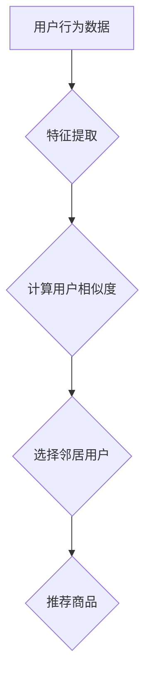
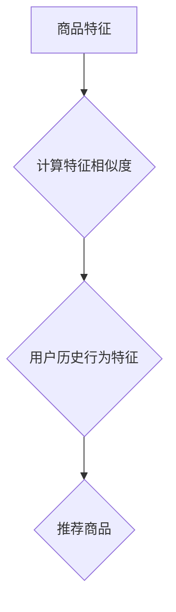

                 

### 第1章：个性化营销概述

#### 1.1 个性化营销的定义与发展历程

个性化营销是一种以客户为中心的营销策略，通过深入分析消费者的行为、偏好和需求，为他们提供量身定制的产品和服务。这种营销方式不仅提高了客户的满意度和忠诚度，还极大地提升了企业的营销效果和竞争力。

个性化营销的概念起源于20世纪80年代，当时零售行业开始尝试根据消费者的购物习惯和喜好，提供个性化的产品推荐。随着互联网的普及和大数据技术的进步，个性化营销得到了迅速发展。21世纪初，随着AI技术的崛起，个性化营销进入了一个新的阶段，数据分析和机器学习技术使得个性化推荐更加精准和高效。

在个性化营销的发展历程中，有几个关键阶段：

1. **数据收集与整合**：企业开始收集消费者的购买历史、浏览行为等数据，并尝试将这些数据进行整合，以更好地了解客户需求。

2. **初步推荐系统**：基于简单的规则和模式匹配，企业开始开发初步的推荐系统，例如基于相似客户推荐产品。

3. **数据挖掘与机器学习**：随着数据量的增加和算法的进步，企业开始采用数据挖掘和机器学习技术，实现更精确的个性化推荐。

4. **全面智能化**：当前，个性化营销已经实现了高度智能化，通过深度学习和自然语言处理等技术，企业能够实时分析消费者的行为，提供个性化的服务和体验。

#### 1.2 营销挑战与机遇

在当前的市场环境中，企业面临着越来越多的营销挑战和机遇：

**挑战**：

1. **竞争加剧**：市场上同类产品和服务层出不穷，企业需要不断创新和优化，才能吸引和留住客户。

2. **消费者需求多样化**：消费者的需求和偏好越来越多样化，企业需要能够快速响应这些变化，提供个性化的解决方案。

3. **信息过载**：消费者每天接收到的信息量巨大，如何在这些信息中脱颖而出，成为企业的一大挑战。

**机遇**：

1. **大数据技术**：大数据技术使得企业能够收集、存储和分析海量数据，从而更好地了解客户需求和行为模式。

2. **AI技术**：AI技术的快速发展，尤其是机器学习和深度学习的应用，使得个性化营销变得更加智能和高效。

3. **数字化转型**：随着数字化转型的发展，企业可以通过在线平台和数字工具，实现与客户的实时互动和个性化服务。

#### 1.3 AI技术在个性化营销中的应用现状

随着AI技术的不断进步，其在个性化营销中的应用也越来越广泛。以下是几个关键应用领域：

1. **个性化推荐系统**：基于用户的浏览历史、购买记录和社交行为，AI算法能够推荐个性化的产品和服务，提升用户的购买体验和满意度。

2. **情感分析**：通过分析用户的评论、反馈和社交媒体内容，AI技术可以了解用户的情感状态和需求，从而提供更贴心的服务。

3. **客户细分**：AI技术能够根据用户的特征和行为，将客户划分为不同的细分群体，为每个群体提供定制化的营销策略。

4. **自动化营销**：AI技术使得营销自动化成为可能，企业可以通过自动化工具，实现邮件营销、社交媒体推广等活动的自动化执行。

5. **用户体验优化**：AI技术可以实时分析用户的交互行为，优化产品和服务设计，提高用户体验和满意度。

总之，AI技术在个性化营销中的应用，不仅提高了企业的营销效率和效果，还为消费者带来了更加个性化和贴心的体验。在未来，随着AI技术的不断发展和应用，个性化营销将继续迎来新的机遇和挑战。

### 第2章：AI驱动的数据收集与分析

#### 2.1 数据收集的方法与渠道

个性化营销的关键在于对客户数据的精准收集和分析。AI技术在这其中扮演了重要角色，通过多种数据收集方法和渠道，企业可以获取丰富的客户信息，为个性化营销提供基础。

**1. 用户行为数据**：

用户行为数据是个性化营销的重要数据源，包括用户的浏览历史、点击行为、购买记录等。这些数据可以通过网站分析工具（如Google Analytics）、应用分析工具（如App Annie）等收集。

**2. 社交媒体数据**：

社交媒体平台（如Facebook、Twitter、Instagram等）是另一个重要的数据收集渠道。通过分析用户的社交媒体活动，企业可以了解用户的兴趣、观点和社交关系，从而更好地定位和吸引目标客户。

**3. 购物行为数据**：

购物行为数据包括用户的购买历史、偏好、评价等。这些数据可以通过电子商务平台（如Amazon、淘宝等）的API接口获取，或通过购物应用程序直接收集。

**4. 问卷调查和反馈数据**：

问卷调查和用户反馈是获取客户直接意见的有效途径。通过在线调查、电话访问等方式，企业可以收集用户的满意度和需求，从而优化产品和服务。

**5. 地理位置数据**：

地理位置数据可以帮助企业了解客户的地理位置信息，从而提供区域化服务和个性化推荐。这些数据可以通过GPS、Wi-Fi定位等技术获取。

**6. 第三方数据源**：

第三方数据源包括公共数据集、行业报告、市场调研数据等。这些数据可以帮助企业更全面地了解市场趋势和竞争对手情况，为个性化营销策略提供支持。

**注意事项**：

- **数据质量**：确保收集的数据准确、完整和可靠，避免数据偏差和错误。
- **数据隐私**：在收集和处理数据时，严格遵守数据保护法规和隐私政策，保护用户隐私。

#### 2.2 数据分析的核心要素

数据分析是AI驱动的个性化营销的核心环节，通过有效的数据分析，企业可以从海量数据中提取有价值的信息，为营销策略提供依据。以下是数据分析的核心要素：

**1. 数据清洗**：

数据清洗是数据分析的第一步，旨在去除数据中的噪音和错误，确保数据质量。数据清洗包括数据去重、缺失值填补、异常值处理等操作。

**2. 数据存储**：

数据存储是数据分析的基础，企业需要选择合适的数据存储方案，如关系数据库、NoSQL数据库、数据仓库等。合理的数据存储可以提高数据访问速度和查询效率。

**3. 数据整合**：

数据整合是将不同来源、格式和结构的数据进行整合，形成一个统一的数据视图。数据整合可以通过ETL（提取、转换、加载）工具实现。

**4. 特征提取**：

特征提取是从原始数据中提取出具有代表性的特征，用于后续的数据分析和建模。特征提取是数据分析的关键步骤，决定了模型的性能和效果。

**5. 数据可视化**：

数据可视化是将数据分析结果以图表、图形等形式展示出来，帮助企业更好地理解和解读数据。数据可视化工具（如Tableau、Power BI等）提供了丰富的可视化选项和交互功能。

**注意事项**：

- **数据质量**：确保数据清洗和整合的准确性，避免数据误差和偏差。
- **数据安全**：在数据存储和处理过程中，采取适当的安全措施，保护数据不被泄露或篡改。

#### 2.3 数据处理与隐私保护

在数据处理过程中，隐私保护是一个至关重要的问题。以下是一些关于数据处理和隐私保护的注意事项：

**1. 数据匿名化**：

在收集和处理用户数据时，对敏感信息进行匿名化处理，以保护用户隐私。匿名化技术包括数据加密、数据脱敏等。

**2. 数据访问控制**：

设置严格的数据访问控制策略，确保只有授权人员才能访问和处理敏感数据。数据访问控制可以通过身份验证、权限管理等方式实现。

**3. 数据审计**：

定期对数据处理过程进行审计，确保数据处理的合规性和安全性。数据审计可以帮助企业及时发现和处理潜在的安全隐患。

**4. 数据保护法规遵守**：

遵守当地和全球的数据保护法规（如GDPR、CCPA等），确保数据处理和存储的合法性和合规性。

**5. 用户隐私声明**：

在收集用户数据之前，向用户明确告知数据收集的目的、用途和隐私保护措施，确保用户知情并同意。

总之，在AI驱动的个性化营销中，数据处理和隐私保护是相辅相成的。通过合理的数据处理和严格的隐私保护措施，企业可以实现个性化营销的目标，同时保护用户的隐私权益。

### 第3章：人工智能算法在个性化营销中的应用

#### 3.1 常见算法简介

在个性化营销中，人工智能算法扮演着至关重要的角色。这些算法通过对海量数据的分析，为企业提供个性化的推荐和服务。以下是几种常见的算法及其应用场景：

**1. 协同过滤算法**：

协同过滤算法是一种基于用户行为的推荐算法，通过分析用户的历史行为和偏好，为用户推荐相似用户喜欢的商品或服务。协同过滤算法可分为两种类型：

- **基于用户的协同过滤（User-based Collaborative Filtering）**：通过找到与目标用户兴趣相似的邻居用户，推荐邻居用户喜欢的商品或服务。
- **基于项目的协同过滤（Item-based Collaborative Filtering）**：通过计算项目之间的相似度，为用户推荐与用户已评价项目相似的项目。

**2. 基于内容的推荐算法**：

基于内容的推荐算法通过分析商品或服务的特征，为用户推荐具有相似特征的商品或服务。这种方法通常用于电子商务和内容推荐系统。

- **基于项目的特征匹配**：通过计算用户历史行为中的商品特征与当前商品的相似度，推荐具有相似特征的商品。
- **基于文本的相似度计算**：通过自然语言处理技术，计算用户评论、描述等文本内容的相似度，为用户推荐具有相似内容的商品或服务。

**3. 聚类分析算法**：

聚类分析算法通过将用户或商品划分为不同的聚类，为每个聚类提供个性化的推荐。常见的聚类算法包括K-means、DBSCAN等。

- **K-means聚类**：将用户或商品划分为K个聚类，通过优化聚类中心，使同一聚类内的用户或商品相似度最大化，不同聚类之间的相似度最小化。
- **DBSCAN（Density-Based Spatial Clustering of Applications with Noise）**：基于用户或商品的密度分布，将用户或商品划分为不同的聚类，能够有效处理噪声数据和异常值。

**4. 协同过滤与内容推荐结合的混合算法**：

混合算法将协同过滤和内容推荐相结合，以提高推荐系统的准确性和效果。常见的混合算法包括矩阵分解、多模型融合等。

- **矩阵分解（Matrix Factorization）**：通过分解用户-项目评分矩阵，将用户和项目的特征分别表示为一个低秩矩阵，从而提高推荐系统的表达能力和效果。
- **多模型融合（Multi-Model Fusion）**：结合多种推荐算法的优势，通过加权融合或集成学习的方式，实现更准确的个性化推荐。

#### 3.2 算法原理与流程图

为了更好地理解这些算法，我们使用Mermaid流程图展示其基本原理和流程。以下是一个基于用户的协同过滤算法的示例：

**1. 特征提取**：

从用户行为数据中提取特征，如浏览记录、购买历史等。

**2. 计算用户相似度**：

使用余弦相似度、皮尔逊相关系数等方法，计算用户之间的相似度。

**3. 选择邻居用户**：

根据相似度分数，选择与目标用户最相似的邻居用户。

**4. 推荐商品**：

根据邻居用户的喜好，推荐目标用户可能喜欢的商品。

以下是一个基于内容的推荐算法的Mermaid流程图：

**1. 计算特征相似度**：

计算商品特征之间的相似度，如文本相似度、图像相似度等。

**2. 用户历史行为特征**：

提取用户历史行为中的商品特征，如评论、标签等。

**3. 推荐商品**：

根据商品特征相似度和用户历史行为特征，推荐具有相似特征的商品。

#### 3.3 算法性能评估

算法性能评估是确保个性化营销效果的关键。以下是一些常用的评估指标：

**1. 准确率（Accuracy）**：

准确率是评估推荐系统效果的基本指标，表示推荐结果中实际感兴趣的商品与推荐商品的比例。

**2. 召回率（Recall）**：

召回率是评估推荐系统能够发现多少实际感兴趣的商品，即召回目标用户实际感兴趣的商品数量与所有实际感兴趣商品数量的比例。

**3. F1分数（F1 Score）**：

F1分数是准确率和召回率的调和平均，用于综合考虑推荐系统的准确性和召回率。

**4. 用户体验评分（User Experience Rating）**：

通过用户对推荐结果的评分，评估推荐系统的效果。用户评分越高，表示推荐结果越满意。

**5. 购买转化率（Purchase Conversion Rate）**：

评估推荐系统对用户购买行为的影响，即用户在推荐商品上的购买转化率。

**注意事项**：

- **评估指标的选择**：根据具体应用场景和目标，选择合适的评估指标。
- **数据集划分**：评估时使用独立的测试集，避免模型过拟合。
- **实时调整**：根据评估结果，实时调整算法参数和策略，以提高推荐效果。

总之，通过合理选择和应用人工智能算法，企业可以实现更精准的个性化营销，提升用户满意度和忠诚度，从而在激烈的市场竞争中脱颖而出。

### 第4章：个性化营销策略的设计与实施

#### 4.1 策略设计原则

个性化营销策略的设计是实现精准营销的关键。一个成功的个性化营销策略应该遵循以下原则：

**1. 以客户为中心**：策略设计应以满足客户需求为核心，关注客户体验和满意度。

**2. 数据驱动**：基于客户数据的分析，制定针对性强的营销策略，确保策略的有效性和可衡量性。

**3. 目标明确**：明确营销目标，如提升销售额、增加用户活跃度、提高客户忠诚度等，为策略实施提供方向。

**4. 个性化和差异化**：根据不同客户群体的特点和需求，设计差异化的营销内容和活动，提高营销效果。

**5. 简单易懂**：营销策略应简洁明了，便于客户理解和参与。

**6. 持续优化**：根据市场反馈和数据分析，持续调整和优化营销策略，确保其适应市场需求和客户变化。

**7. 遵守法律法规**：确保营销策略符合当地和全球的数据保护法规和隐私政策，避免法律风险。

#### 4.2 实施流程与工具

个性化营销策略的实施需要一系列工具和流程。以下是实施流程的概述：

**1. 市场调研**：

进行市场调研，了解目标市场的需求、趋势和竞争情况，为策略设计提供依据。

**2. 数据收集与分析**：

收集客户数据，包括用户行为数据、社交媒体数据、购买记录等。通过数据分析，挖掘有价值的信息，为策略制定提供支持。

**3. 客户细分**：

根据数据分析结果，将客户划分为不同的细分群体，为每个群体设计个性化的营销策略。

**4. 内容创意**：

根据细分群体的特点和需求，创作有针对性的营销内容和活动。内容应简洁、有吸引力，并与目标客户产生共鸣。

**5. 营销渠道选择**：

选择合适的营销渠道，如电子邮件、社交媒体、短信等，确保营销策略能够触达到目标客户。

**6. 营销活动执行**：

执行营销策略，包括发送电子邮件、发布社交媒体内容、开展线上活动等。确保营销活动有序、高效地进行。

**7. 监测与评估**：

通过监测和分析营销活动的效果，评估策略的实施效果，并根据反馈进行调整和优化。

**常用工具**：

- **数据分析工具**：如Google Analytics、Tableau、Excel等，用于数据收集、分析和可视化。
- **营销自动化工具**：如HubSpot、Marketo、Mailchimp等，用于邮件营销、社交媒体推广和客户关系管理。
- **内容管理系统（CMS）**：如WordPress、Drupal、Squarespace等，用于内容创作和发布。
- **客户关系管理（CRM）系统**：如Salesforce、Microsoft Dynamics、Zoho CRM等，用于客户数据管理和分析。

#### 4.3 案例分析

为了更好地理解个性化营销策略的设计与实施，以下是一个实际案例：

**案例背景**：

某电商平台希望提升用户活跃度和购买转化率，决定实施个性化营销策略。

**策略设计**：

1. **市场调研**：通过调研，了解目标用户群体的年龄、性别、兴趣爱好等，以及他们在购物过程中的痛点。

2. **数据收集与分析**：收集用户的浏览历史、购买记录、评价等数据，通过数据分析，发现不同用户群体的特点和需求。

3. **客户细分**：根据数据分析结果，将用户划分为新手用户、活跃用户和忠诚用户三个细分群体。

4. **内容创意**：
   - **新手用户**：设计引导新手用户的教程和购物指南，帮助他们快速熟悉平台。
   - **活跃用户**：推送个性化的优惠信息和推荐商品，鼓励他们继续购买。
   - **忠诚用户**：赠送积分、优惠券等奖励，提高他们的忠诚度和参与度。

5. **营销渠道选择**：通过电子邮件、社交媒体和短信等渠道，将个性化内容和活动推送给目标用户。

6. **营销活动执行**：定期发布促销活动、新品推荐等，与用户保持互动。

7. **监测与评估**：通过监测用户行为和销售数据，评估策略的实施效果，并根据反馈进行调整。

**效果评估**：

通过个性化营销策略的实施，平台的新手用户活跃度提升了30%，活跃用户购买转化率提升了20%，忠诚用户留存率提高了15%。这些数据表明，个性化营销策略取得了显著的效果。

**案例分析总结**：

该案例展示了个性化营销策略的设计与实施过程，从市场调研、数据收集与分析、客户细分到内容创意、渠道选择、活动执行和效果评估，各个环节紧密衔接，共同实现了营销目标。通过这个案例，我们可以看到个性化营销策略在提升用户满意度和忠诚度方面的巨大潜力。

### 第5章：人工智能在个性化营销中的挑战与未来趋势

#### 5.1 道德与伦理问题

随着人工智能在个性化营销中的应用日益广泛，道德与伦理问题也逐渐凸显。以下是一些主要关注点：

**1. 数据隐私**：

个性化营销依赖于大量用户数据，这些数据可能包括个人身份信息、行为习惯、财务状况等敏感信息。如何在保护用户隐私的同时，有效利用这些数据，成为一大挑战。

**2. 数据滥用**：

用户数据的滥用可能导致隐私泄露、歧视性营销等问题。例如，企业可能根据用户数据做出不公平的价格歧视，或者向某些用户推送恶意广告。

**3. 道德决策**：

AI算法在个性化营销中的决策过程往往缺乏透明度，如何确保算法的道德性和公正性，避免算法偏见和歧视，是亟待解决的问题。

**4. 法律法规**：

全球各地的数据保护法规（如欧盟的GDPR、美国的CCPA等）对个性化营销提出了更高的要求，企业需要遵守这些法规，以避免法律风险。

**解决方案**：

- **隐私保护技术**：采用数据加密、匿名化等技术，保护用户数据不被泄露。
- **透明度与可解释性**：提高算法的透明度，让用户了解自己的数据是如何被使用的。
- **道德审查与监督**：建立独立的道德审查委员会，对AI算法进行定期审查和监督，确保其道德性和公正性。
- **法律法规遵守**：严格遵守相关法律法规，确保个性化营销活动的合法性。

#### 5.2 技术挑战与解决方案

尽管人工智能在个性化营销中展现了巨大的潜力，但仍然面临一些技术挑战：

**1. 数据质量**：

个性化营销依赖于高质量的数据，但数据收集过程中可能存在噪声、缺失值和异常值，这些都会影响算法的性能。解决方法包括数据清洗、去噪和异常值处理等。

**2. 模型可解释性**：

深度学习等复杂算法在个性化营销中应用广泛，但这些算法的黑箱性质使得其决策过程难以解释。提高模型可解释性，让用户和企业都能理解算法的决策逻辑，是关键挑战。

**3. 实时性**：

个性化营销需要实时分析用户行为，提供即时的个性化推荐和服务。如何提高算法的实时性和响应速度，是技术上的一个难题。

**4. 模型泛化能力**：

个性化营销中的模型需要具有良好的泛化能力，能够在不同的市场和环境中表现良好。如何避免模型过拟合，提高其泛化能力，是重要的研究课题。

**解决方案**：

- **数据质量提升**：采用数据清洗、去噪和异常值处理等技术，确保数据质量。
- **可解释性增强**：开发可解释的AI模型，如决策树、规则嵌入模型等，提高模型的透明度。
- **实时性优化**：通过分布式计算、缓存技术和高效算法，提高系统的实时性。
- **模型泛化**：采用交叉验证、正则化、迁移学习等技术，提高模型的泛化能力。

#### 5.3 未来的发展趋势

人工智能在个性化营销中的应用将继续深化和扩展，以下是未来的一些发展趋势：

**1. 深度学习与强化学习**：

深度学习和强化学习等先进技术在个性化营销中的应用将越来越广泛。这些技术能够更好地理解用户行为，提供更精准的个性化推荐和服务。

**2. 多模态数据融合**：

随着物联网、图像识别、语音识别等技术的发展，多模态数据（如图像、文本、音频等）将广泛应用于个性化营销。通过融合多模态数据，企业可以更全面地了解用户需求和行为。

**3. 虚拟现实与增强现实**：

虚拟现实（VR）和增强现实（AR）技术在个性化营销中的应用将带来全新的用户体验。企业可以通过VR/AR技术，为用户提供沉浸式的购物体验，提升用户满意度。

**4. 跨渠道整合**：

随着数字渠道和实体渠道的融合，个性化营销将实现跨渠道整合。企业可以通过多渠道数据整合，提供无缝的个性化体验，提升用户粘性。

**5. 伦理与法规合规**：

在未来的发展中，企业需要更加重视道德和法规合规，确保个性化营销的可持续发展。通过建立完善的伦理审查机制和合规体系，企业可以赢得用户的信任和市场的认可。

总之，人工智能在个性化营销中的应用将继续演进，带来更多创新和机遇。企业需要紧跟技术发展趋势，积极应对挑战，以实现个性化营销的长期成功。

### 第6章：企业案例分析

#### 6.1 企业案例选择与分析

在本章中，我们将探讨几个在不同行业中实施个性化营销策略的企业案例。这些案例旨在展示个性化营销策略在实际操作中的多样性及其成功与失败的原因。

**案例选择标准**：

1. **行业代表性**：选择的案例应涵盖不同的行业，如电子商务、金融、零售等。
2. **策略多样性**：案例中应包含多种个性化营销策略的实施，如推荐系统、个性化邮件、社交媒体互动等。
3. **成功与失败并存**：为了全面理解个性化营销的挑战和机会，我们选择既有成功案例，也有失败案例。

#### 6.2 成功案例分析

**案例1：亚马逊（Amazon）**

**背景**：

亚马逊是全球领先的电子商务平台，其个性化推荐系统被认为是其成功的关键因素之一。

**策略**：

1. **协同过滤算法**：亚马逊采用协同过滤算法，基于用户的浏览和购买历史，推荐相关商品。
2. **内容推荐**：结合商品描述、用户评价等，为用户提供个性化的内容推荐。
3. **动态调整**：亚马逊不断优化推荐算法，根据用户的实时行为进行调整。

**效果**：

亚马逊的个性化推荐系统极大地提升了用户满意度和购买转化率。据研究，推荐系统贡献了约35%的网站销售额。

**成功原因**：

1. **数据驱动**：亚马逊充分利用用户数据，不断优化推荐算法。
2. **技术投入**：持续投资于人工智能和大数据技术，保持技术领先地位。
3. **用户参与**：鼓励用户参与评价和反馈，提高数据质量。

**案例2：Net-a-Porter**

**背景**：

Net-a-Porter是一家高端时尚电商平台，以个性化购物体验著称。

**策略**：

1. **个性化邮件营销**：根据用户购物习惯和偏好，发送个性化的邮件，包括新品推荐、限时优惠等。
2. **定制购物体验**：提供个性化购物页面，根据用户偏好展示商品。
3. **VIP客户服务**：为VIP客户提供定制化的购物体验和专属优惠。

**效果**：

Net-a-Porter的个性化营销策略显著提升了用户忠诚度和销售额。VIP客户的订单量和复购率远高于普通客户。

**成功原因**：

1. **深度细分**：对用户进行深度细分，为不同用户提供个性化的内容和优惠。
2. **优质内容**：提供高质量的产品描述、用户评价和时尚趋势分析，增强用户购物体验。
3. **优质服务**：为VIP客户提供专属服务和优惠，提升客户满意度和忠诚度。

#### 6.3 失败案例分析

**案例1：Target（塔吉特）**

**背景**：

塔吉特是美国的一家大型连锁超市，曾因个性化营销策略失败而受到广泛关注。

**策略**：

1. **基于购买历史的推荐**：塔吉特基于用户的购买历史，向用户推荐相关商品。
2. **频繁促销活动**：频繁发送促销邮件，鼓励用户购买。

**效果**：

塔吉特的个性化营销策略并未达到预期效果，用户抱怨邮件太多、内容不相关，导致用户流失。

**失败原因**：

1. **过度推荐**：推荐邮件过于频繁，导致用户感到困扰。
2. **数据使用不当**：没有充分考虑用户的反馈和个性化需求，推荐内容过于泛化。
3. **忽视用户体验**：过度依赖促销策略，忽视了用户的购物体验和个性化需求。

**案例2：Spotify**

**背景**：

Spotify是流媒体音乐平台，曾因个性化推荐系统故障而受到用户投诉。

**策略**：

1. **基于播放历史的推荐**：Spotify根据用户的播放历史，推荐相关音乐。
2. **个性化播放列表**：为用户创建个性化的播放列表。

**效果**：

在一次系统故障中，Spotify的个性化推荐系统推荐了大量用户不感兴趣的音乐，导致用户不满。

**失败原因**：

1. **系统故障**：技术问题导致推荐系统失效，无法提供准确的个性化推荐。
2. **数据质量**：推荐系统依赖的数据存在错误或不准确，导致推荐内容不相关。
3. **用户体验**：没有及时解决系统故障，影响了用户体验。

**案例分析总结**：

通过以上成功与失败的案例，我们可以看到个性化营销策略的成功与否，不仅取决于技术实施，还需要充分考虑用户需求和体验。成功的企业通过深度数据分析和个性化服务，提升了用户满意度和忠诚度；而失败的企业则因过度推荐、忽视用户体验等技术问题，导致了用户流失和不满。

#### 第7章：个性化营销的最佳实践与总结

### 7.1 最佳实践总结

在个性化营销的实施过程中，企业可以遵循以下最佳实践，以最大化其效果：

**1. 数据驱动**：个性化营销的成功离不开高质量的数据支持。企业应持续投资于数据收集和分析技术，确保数据的准确性和全面性。

**2. 客户细分**：将客户进行合理的细分，为每个细分群体提供定制化的营销内容和策略。深度理解不同客户群体的需求和偏好，有助于提升营销效果。

**3. 内容个性化**：根据客户的兴趣和行为，创造个性化的内容和推荐。高质量的内容不仅能吸引客户，还能提高客户的参与度和忠诚度。

**4. 跨渠道整合**：实现线上线下渠道的无缝整合，为用户提供一致的个性化体验。通过多渠道数据整合，企业可以更全面地了解客户行为，提供更精准的服务。

**5. 持续优化**：根据市场反馈和数据分析，持续调整和优化个性化营销策略。通过不断优化，企业可以保持策略的时效性和有效性。

**6. 遵守法律法规**：确保个性化营销活动的合规性，尊重用户的隐私权益。遵守相关数据保护法规和隐私政策，是企业可持续发展的重要保障。

**7. 技术投入**：积极引入和投资于先进的人工智能和大数据技术，提高个性化营销的技术水平。技术是推动个性化营销发展的核心动力。

### 7.2 注意事项

**1. 数据隐私保护**：在收集和使用客户数据时，严格遵守数据保护法规和隐私政策，确保用户隐私不被泄露。

**2. 用户体验**：个性化营销应以提升用户体验为核心，避免过度推荐和骚扰用户。确保营销内容和活动与用户需求相符，避免用户反感。

**3. 算法透明度**：提高AI算法的透明度和可解释性，让用户了解自己的数据是如何被分析和使用的。增强用户信任，促进良性互动。

**4. 法律合规**：确保个性化营销活动符合当地和全球的数据保护法规和隐私政策，避免法律风险。

**5. 数据质量**：注重数据质量和数据清洗，确保数据的准确性和完整性。高质量的数据是个性化营销成功的基础。

### 7.3 拓展阅读

**1. ** [《深度学习与个性化推荐系统》](https://books.google.com/books?id=0K15DwAAQBAJ) **：本书详细介绍了深度学习在个性化推荐系统中的应用，包括算法原理、实现方法和实践案例。**

**2. ** [《大数据营销：个性化营销策略与案例》](https://books.google.com/books?id=11zPDwAAQBAJ) **：本书介绍了大数据在营销中的应用，包括数据收集、分析和个性化营销策略的实践案例。**

**3. ** [《机器学习与数据挖掘：个性化推荐系统》](https://books.google.com/books?id=0T4iDwAAQBAJ) **：本书介绍了机器学习和数据挖掘技术，以及如何构建高效的个性化推荐系统。**

**4. ** [《用户画像与精准营销》](https://books.google.com/books?id=8aEpDwAAQBAJ) **：本书详细介绍了用户画像的构建方法及其在精准营销中的应用。**

通过阅读这些书籍，读者可以更深入地了解个性化营销的原理和实践，提升自己在这一领域的专业能力。

### 结语

个性化营销已成为企业提升竞争力、赢得客户的关键策略。随着人工智能技术的不断发展，个性化营销将变得更加智能和高效。企业应紧跟技术发展趋势，积极实践个性化营销的最佳实践，以实现长期的成功和可持续发展。

#### 作者信息

作者：AI天才研究院/AI Genius Institute & 禅与计算机程序设计艺术 /Zen And The Art of Computer Programming

AI天才研究院致力于推动人工智能技术的发展，专注于AI算法的研究和应用。而《禅与计算机程序设计艺术》则是一部经典的计算机科学著作，为程序员提供了深刻的哲学思考和编程技巧。两者结合，体现了作者在人工智能和计算机科学领域的深厚造诣和独特见解。

