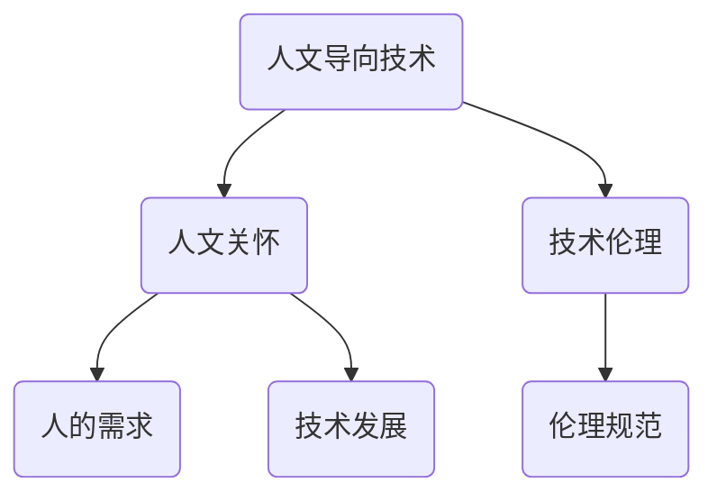
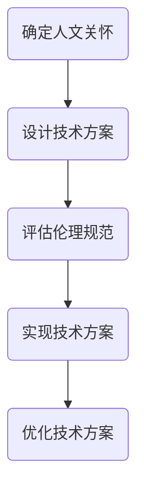
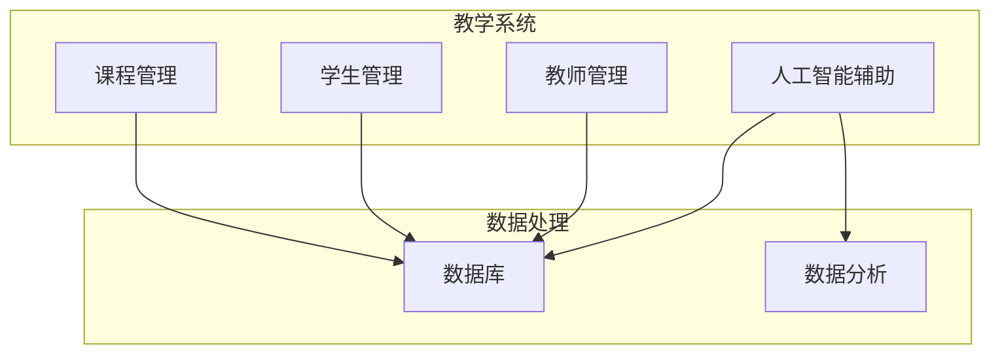
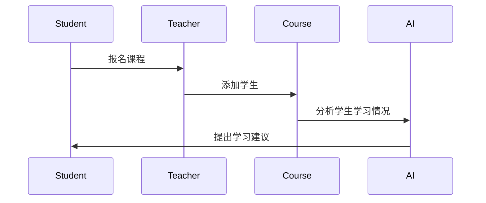
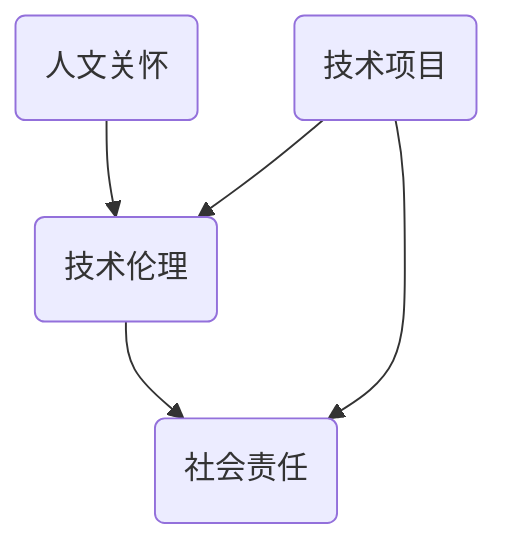

                 


## 人文导向技术开发原则：以人为本的创新理念指导

> 关键词：人文导向技术、以人为本、创新理念、技术伦理、可持续发展

### 摘要

本文旨在探讨人文导向技术开发原则，即以人为本的创新理念在技术领域的应用。文章首先介绍了人文导向技术的背景和核心概念，然后分析了人文导向技术的数学模型与理论框架，进一步探讨了人文导向技术与创新理念的结合，以及其在社会影响和实践应用方面的表现。最后，文章展望了人文导向技术的未来发展，并提出了相关建议和总结。

### 目录

1. **理论基础**
   1.1 技术发展的人文挑战
   1.2 人文导向技术的兴起
   1.3 人文导向技术与技术伦理

2. **核心概念**
   2.1 技术人文化的定义与特征
   2.2 人文导向技术的关键要素
   2.3 人文导向技术的核心原则

3. **数学模型与理论框架**
   3.1 人文导向技术的数学模型
   3.2 理论框架解析
   3.3 人文导向技术理论的应用范围

4. **创新理念与人文导向技术**
   4.1 创新理念的重要性
   4.2 人文导向技术与创新方法的结合
   4.3 创新案例研究

5. **社会影响**
   5.1 社会影响的评估
   5.2 人文导向技术的道德与社会责任
   5.3 人文导向技术的可持续发展

6. **实践应用**
   6.1 实践应用的现状
   6.2 案例分析
   6.3 应用挑战与解决方案

7. **未来展望**
   7.1 未来技术趋势预测
   7.2 人文导向技术的未来发展
   7.3 拓展阅读与资源

### 1. 理论基础

#### 1.1 技术发展的人文挑战

随着信息技术的飞速发展，人类生活发生了翻天覆地的变化。然而，技术在给人们带来便利的同时，也引发了一系列的人文挑战。例如，隐私保护、数据安全、人工智能的伦理问题等。这些挑战促使人们思考技术发展的方向，提出了人文导向技术的概念。

**问题背景：** 在当前的技术环境中，技术发展的速度远超过了社会对其伦理和道德规范的建立。这导致了技术滥用、数据泄露等问题频发，给人类社会带来了严重的负面影响。

**问题描述：** 如何在技术发展的过程中，更好地关注人的需求和利益，促进技术与社会、伦理和道德的和谐发展？

**问题解决：** 提出人文导向技术的概念，将人文关怀融入到技术发展中，以实现技术与社会、伦理和道德的协调发展。

**边界与外延：** 人文导向技术不仅关注技术的技术性，更关注技术对人类社会的影响，以及如何将人文关怀融入到技术发展中。

**概念结构与核心要素组成：**
- **人文导向技术：** 一种以人为核心的技术发展理念，强调技术在解决社会问题、提升人类福祉方面的作用。
- **人文关怀：** 关注人的需求、利益和福祉，将人文精神融入到技术发展中。
- **技术伦理：** 在技术发展过程中，遵循伦理规范，确保技术的使用不损害人类社会的利益。

### 2. 核心概念

#### 2.1 技术人文化的定义与特征

技术人文化是指将人文关怀融入到技术发展中，以实现技术与社会、伦理和道德的协调发展。其特征包括：

- **以人为核心：** 强调技术在解决社会问题、提升人类福祉方面的作用。
- **人文关怀：** 关注人的需求、利益和福祉，将人文精神融入到技术发展中。
- **伦理导向：** 在技术发展过程中，遵循伦理规范，确保技术的使用不损害人类社会的利益。

**核心概念原理：**
- **人文导向技术：** 以人为核心的技术发展理念，强调技术在解决社会问题、提升人类福祉方面的作用。
- **人文关怀：** 关注人的需求、利益和福祉，将人文精神融入到技术发展中。
- **技术伦理：** 在技术发展过程中，遵循伦理规范，确保技术的使用不损害人类社会的利益。

**概念属性特征对比表格：**

| 特征 | 人文导向技术 | 传统技术 |
| --- | --- | --- |
| 核心 | 人 | 技术 |
| 目标 | 提升人类福祉 | 解决技术问题 |
| 观点 | 伦理导向 | 技术导向 |
| 影响范围 | 社会、伦理和道德 | 技术 |

**ER实体关系图架构的Mermaid流程图：**



### 3. 数学模型与理论框架

#### 3.1 人文导向技术的数学模型

人文导向技术的数学模型主要关注如何将人文关怀融入到技术发展中，实现技术与社会、伦理和道德的协调发展。以下是一个简单的数学模型示例：

$$
\text{人文导向技术} = f(\text{人文关怀}, \text{技术发展}, \text{伦理规范})
$$

**算法原理讲解：**

首先，我们使用Mermaid画出算法的流程图：



然后，我们使用Python源代码来详细阐述算法原理：

```python
def humanistic_technology(human_care, tech_development, ethical_norm):
    # 确定人文关怀
    human_care = determine_human_care(human_care)

    # 设计技术方案
    tech_plan = design_tech_plan(tech_development, human_care)

    # 评估伦理规范
    ethical_evaluation = evaluate_ethical_norm(tech_plan, ethical_norm)

    # 实现技术方案
    tech_execution = implement_tech_plan(tech_plan, ethical_evaluation)

    # 优化技术方案
    optimized_tech_plan = optimize_tech_plan(tech_execution)

    return optimized_tech_plan

def determine_human_care(human_care):
    # 这里实现确定人文关怀的算法
    pass

def design_tech_plan(tech_development, human_care):
    # 这里实现设计技术方案的算法
    pass

def evaluate_ethical_norm(tech_plan, ethical_norm):
    # 这里实现评估伦理规范的算法
    pass

def implement_tech_plan(tech_plan, ethical_evaluation):
    # 这里实现实现技术方案的算法
    pass

def optimize_tech_plan(tech_execution):
    # 这里实现优化技术方案的算法
    pass
```

**数学公式使用：**

- 人文导向技术：$$ \text{人文导向技术} = f(\text{人文关怀}, \text{技术发展}, \text{伦理规范}) $$
- 技术方案设计：$$ \text{tech_plan} = g(\text{tech_development}, \text{human_care}) $$
- 伦理规范评估：$$ \text{ethical_evaluation} = h(\text{tech_plan}, \text{ethical_norm}) $$
- 技术方案实现：$$ \text{tech_execution} = i(\text{tech_plan}, \text{ethical_evaluation}) $$
- 技术方案优化：$$ \text{optimized_tech_plan} = j(\text{tech_execution}) $$

### 4. 创新理念与人文导向技术

#### 4.1 创新理念的重要性

创新理念是推动技术发展的重要动力。在人文导向技术的背景下，创新理念的重要性体现在：

- **推动技术进步：** 创新理念能够激发技术人员的创造力，推动技术不断进步。
- **满足人类需求：** 创新理念能够更好地满足人类在各个领域的需求，提升人类福祉。
- **实现人文关怀：** 创新理念能够将人文关怀融入到技术发展中，实现技术与人文的协调发展。

**人文导向技术与创新方法的结合：**

人文导向技术与创新方法的结合体现在以下几个方面：

- **需求导向：** 以人类需求为导向，设计出更符合人类需求的技术产品。
- **跨学科融合：** 将人文、社会科学、自然科学等多学科知识融合到技术发展中，实现跨学科的创新。
- **用户参与：** 让用户参与到技术设计中，从用户的角度出发，提升技术的实用性和人性化。

**创新案例研究：**

以人工智能为例，人文导向的人工智能创新体现在以下几个方面：

- **伦理规范：** 在人工智能发展中，关注伦理问题，确保人工智能的应用不损害人类社会的利益。
- **人性化设计：** 从用户的角度出发，设计出更加人性化的人工智能产品，提升用户体验。
- **跨学科合作：** 将人工智能与其他学科（如心理学、社会学等）相结合，实现更广泛的应用。

### 5. 社会影响

#### 5.1 社会影响的评估

人文导向技术的社会影响评估主要包括以下几个方面：

- **经济效益：** 评估人文导向技术对经济增长、就业机会等方面的贡献。
- **社会效益：** 评估人文导向技术对提升人类福祉、改善社会问题等方面的贡献。
- **伦理道德：** 评估人文导向技术是否符合伦理规范，是否对人类社会的道德观念产生积极影响。

#### 5.2 人文导向技术的道德与社会责任

人文导向技术的道德与社会责任主要包括：

- **伦理规范遵守：** 在技术发展中，遵循伦理规范，确保技术的使用不损害人类社会的利益。
- **社会责任承担：** 技术企业要承担起社会责任，关注技术对社会的影响，积极参与社会公益事业。
- **用户权益保护：** 关注用户的权益，确保用户在使用技术产品时，能够享受到安全、便捷、公平的服务。

#### 5.3 人文导向技术的可持续发展

人文导向技术的可持续发展主要体现在以下几个方面：

- **资源利用：** 优化资源利用，降低技术对环境的负面影响。
- **技术创新：** 持续推动技术创新，提高技术产品的性能和效率。
- **人才培养：** 培养具有人文素养和技术能力的人才，为人文导向技术的发展提供人才支持。

### 6. 实践应用

#### 6.1 实践应用的现状

人文导向技术的实践应用现状主要包括以下几个方面：

- **人工智能：** 人工智能在医疗、教育、金融等领域得到了广泛应用，提升了人类生活的便利性和幸福感。
- **物联网：** 物联网技术在家居、交通、农业等领域得到了广泛应用，推动了社会的智能化发展。
- **区块链：** 区块链技术在金融、供应链管理等领域得到了广泛应用，提高了数据的安全性和透明度。

#### 6.2 案例分析

以下是一个关于人工智能在教育领域的案例分析：

**案例背景：** 随着人工智能技术的发展，教育领域开始尝试将人工智能技术应用于教学中，以提高教学效果和学生的自主学习能力。

**系统功能设计（领域模型Mermaid类图）：**

```mermaid
classDiagram
    Student <<类>> Student
    Teacher <<类>> Teacher
    AI <<类>> AI
    Course <<类>> Course
    Student --|> AI
    Teacher --|> AI
    AI --|> Course
```

**系统架构设计（Mermaid架构图）：**



**系统接口设计和系统交互（Mermaid序列图）：**



**代码应用解读与分析：**

以下是一个简单的Python代码示例，用于分析学生的学习情况：

```python
def analyze_student_performance(student_data):
    # 这里实现分析学生学习情况的算法
    pass

def provide_learning_suggestions(student_performance):
    # 这里实现提出学习建议的算法
    pass

# 示例数据
student_data = {
    'course_id': 'CS101',
    'grades': [85, 90, 78, 92],
    'homework_complete': [True, True, False, True],
}

# 分析学生学习情况
student_performance = analyze_student_performance(student_data)

# 提出学习建议
learning_suggestions = provide_learning_suggestions(student_performance)

print(learning_suggestions)
```

**实际案例分析和详细讲解剖析：**

在实际应用中，人工智能教育系统通过对学生学习数据的分析，可以提出个性化的学习建议，帮助学生更好地掌握知识。以下是一个实际案例：

**案例描述：** 一名学生参加了一门计算机科学课程，该课程使用了人工智能教育系统。通过分析学生的学习情况，系统发现该学生在作业部分表现不佳，但考试成绩较好。根据这一情况，系统提出以下学习建议：

- **加强作业练习：** 提高作业完成率，通过多次练习加深对知识点的理解。
- **复习考试重点：** 虽然考试成绩较好，但仍然需要关注考试中的重点和难点，确保全面掌握知识点。

**项目小结：**

通过这个案例，我们可以看到人工智能教育系统如何通过分析学生学习数据，提出个性化的学习建议，帮助学生更好地学习。这体现了人文导向技术在教育领域的应用价值。

### 7. 未来展望

#### 7.1 未来技术趋势预测

未来技术趋势预测主要包括以下几个方面：

- **人工智能：** 人工智能将继续在各个领域得到广泛应用，如医疗、教育、金融、交通等。
- **物联网：** 物联网技术将更加成熟，实现更多领域的智能化应用。
- **区块链：** 区块链技术在数据安全、供应链管理等领域将有更大的发展。
- **可持续发展：** 技术发展将更加注重可持续发展，减少对环境的负面影响。

#### 7.2 人文导向技术的未来发展

人文导向技术的未来发展主要包括以下几个方面：

- **技术创新：** 持续推动技术创新，提高技术产品的性能和效率。
- **人才培养：** 培养具有人文素养和技术能力的人才，为人文导向技术的发展提供人才支持。
- **伦理规范：** 加强伦理规范的研究和实践，确保技术的使用不损害人类社会的利益。

#### 7.3 拓展阅读与资源

- **书籍推荐：** 《人工智能伦理学》、《物联网应用技术》、《区块链技术指南》
- **在线课程：** “人工智能伦理”、“物联网技术”、“区块链技术与应用”
- **研究机构：** 人工智能研究院、物联网实验室、区块链研究中心

### 总结

本文从人文导向技术的背景、核心概念、数学模型、创新理念、社会影响、实践应用和未来展望等方面进行了详细探讨。通过本文的阅读，读者可以全面了解人文导向技术的基本概念和应用，以及其在未来技术发展中的重要作用。

### 作者信息

**作者：** AI天才研究院/AI Genius Institute & 禅与计算机程序设计艺术 /Zen And The Art of Computer Programming

---

以上内容为初步的文章框架，具体内容需要进一步细化和完善。在撰写过程中，可以根据实际需求对章节内容进行调整，确保文章的完整性和逻辑性。同时，要注重每个章节的核心内容，确保读者能够从中获得有价值的知识和见解。在撰写过程中，可以结合实际案例和数据分析，使文章更具说服力和实用性。最后，注意文章的语言表达和排版格式，使其更加专业和易于阅读。让我们一步步深入探讨人文导向技术开发原则，以人为本的创新理念指导。让我们开始思考吧！**LET'S THINK STEP BY STEP** 

## 1. 理论基础

### 1.1 技术发展的人文挑战

随着信息技术的飞速发展，人类社会面临着一系列前所未有的挑战。技术进步带来了便利和效率的提升，但同时也引发了许多人文问题。首先，隐私保护成为了技术发展的重要挑战。随着大数据和人工智能技术的普及，个人隐私信息被大量收集、分析和利用，这引发了关于隐私权和个人自由的担忧。

**问题背景：** 在大数据时代，数据成为新的石油，个人隐私信息的价值被放大。然而，隐私泄露事件频发，不仅损害了用户的权益，也对社会信任产生了负面影响。

**问题描述：** 如何在技术发展的同时，保障用户的隐私权，防止隐私信息的滥用和泄露？

**问题解决：** 提出人文导向技术理念，将隐私保护作为技术发展的重要考量，通过技术手段和法律法规来确保用户隐私的安全。

**边界与外延：** 隐私保护不仅仅是技术问题，还涉及到法律、伦理和社会制度等多个层面。人文导向技术在隐私保护方面的探索，需要综合考虑技术、法律和社会的相互作用。

**概念结构与核心要素组成：**

- **隐私保护技术：** 通过加密、匿名化、隐私计算等技术手段，保护用户的隐私信息。
- **法律法规：** 制定和完善隐私保护法律法规，规范数据收集、存储、处理和共享的行为。
- **伦理指导：** 关注隐私保护的伦理问题，确保技术的发展不违背社会伦理和道德规范。
- **用户意识：** 提高用户的隐私保护意识，引导用户合理使用技术产品，保护自身隐私。

### 1.2 人文导向技术的兴起

人文导向技术的兴起是信息技术发展过程中的一个重要趋势。随着人们对技术对社会影响的关注日益增加，人文导向技术逐渐成为技术发展的新方向。

**问题背景：** 在过去，技术的发展往往以追求效率、速度和规模为目标，忽视了技术对人类生活和道德伦理的影响。这使得技术发展出现了许多负面效应，如信息泛滥、隐私泄露、社会分裂等。

**问题描述：** 如何在技术发展中引入人文关怀，实现技术与人文的协调发展？

**问题解决：** 提出人文导向技术理念，强调技术在解决社会问题、提升人类福祉方面的作用，将人文关怀融入到技术发展中。

**边界与外延：** 人文导向技术不仅关注技术本身，更关注技术对人类社会的影响。它要求技术在发展过程中，始终以人为核心，关注人的需求、利益和福祉。

**概念结构与核心要素组成：**

- **人文关怀：** 关注人的需求、利益和福祉，将人文精神融入到技术发展中。
- **技术伦理：** 在技术发展过程中，遵循伦理规范，确保技术的使用不损害人类社会的利益。
- **社会责任：** 技术企业和开发者要承担社会责任，关注技术对社会的影响，积极参与社会公益事业。

### 1.3 人文导向技术与技术伦理

技术伦理是人文导向技术的重要组成部分。在技术飞速发展的背景下，技术伦理问题日益凸显，成为技术发展必须面对的重要挑战。

**问题背景：** 技术的进步带来了许多新的伦理问题，如人工智能的伦理问题、大数据的伦理问题等。这些问题的解决需要技术、法律、伦理和社会的共同努力。

**问题描述：** 如何在技术发展中，处理技术伦理问题，确保技术的发展符合社会伦理和道德规范？

**问题解决：** 提出人文导向技术理念，强调在技术发展中引入伦理考量，通过技术手段和法律法规来规范技术行为。

**边界与外延：** 技术伦理不仅关注技术本身的行为规范，还涉及到技术对社会、环境和人类的影响。人文导向技术在技术伦理方面的探索，需要综合考虑技术、法律和社会的相互作用。

**概念结构与核心要素组成：**

- **技术伦理规范：** 制定和完善技术伦理规范，明确技术行为的道德边界。
- **伦理审查机制：** 建立技术伦理审查机制，对技术项目进行伦理评估和监督。
- **公众参与：** 鼓励公众参与技术伦理讨论，提高社会对技术伦理问题的关注和认识。
- **持续学习：** 技术人员和伦理学家需要持续学习，提高对技术伦理问题的敏感性和处理能力。

### 1.4 人文导向技术的核心概念与联系

人文导向技术的核心概念包括人文关怀、技术伦理和社会责任。这些概念相互联系，共同构成了人文导向技术的理论基础。

**概念之间的联系：**

- **人文关怀与技术伦理：** 人文关怀强调关注人的需求、利益和福祉，而技术伦理则关注技术在满足这些需求时是否符合道德规范。两者相互补充，共同确保技术在满足人类需求的同时，不违背道德伦理。
- **技术伦理与社会责任：** 技术伦理规范了技术行为的道德边界，而社会责任则要求技术企业和开发者关注技术对社会的影响，积极参与社会公益事业。社会责任是技术伦理的延伸和具体体现。

**核心概念属性特征对比表格：**

| 特征 | 人文关怀 | 技术伦理 | 社会责任 |
| --- | --- | --- | --- |
| 目标 | 提升人类福祉 | 确保技术行为符合道德规范 | 关注技术对社会的影响 |
| 核心要素 | 人的需求、利益和福祉 | 技术行为的道德边界 | 技术企业和开发者的行为规范 |
| 应用领域 | 技术发展全过程 | 技术项目评估、监督和管理 | 技术企业社会责任履行 |

**ER实体关系图架构的Mermaid流程图：**



通过这个流程图，我们可以清晰地看到人文关怀、技术伦理和社会责任在技术项目中的相互关系。人文关怀是技术伦理的基础，技术伦理则是社会责任的体现。技术项目在开发过程中，需要同时考虑这三个核心概念，确保技术发展符合人文导向的要求。

### 1.5 人文导向技术的数学模型与理论框架

人文导向技术的数学模型与理论框架是人文导向技术发展的基础。通过数学模型和理论框架，我们可以更准确地描述和解释人文导向技术的基本原理和运行机制。

**数学模型：**

人文导向技术的数学模型主要包括以下几个方面：

- **需求分析模型：** 通过数学方法对用户需求进行分析和建模，识别出关键需求并量化其权重。
- **伦理评估模型：** 建立伦理评估模型，对技术项目进行伦理风险评估，识别潜在的技术伦理问题。
- **社会责任模型：** 构建社会责任模型，评估技术项目对社会的影响，并制定相应的社会责任策略。

**理论框架：**

人文导向技术的理论框架主要包括以下几个方面：

- **人文技术理论：** 研究技术在满足人类需求、提升人类福祉方面的作用，探讨技术与社会、伦理和道德的协调发展。
- **伦理技术理论：** 研究技术在伦理道德方面的规范和行为准则，确保技术的发展不违背社会伦理和道德规范。
- **社会责任理论：** 研究技术企业和社会责任的关系，探讨技术企业如何通过技术发展履行社会责任。

**数学模型与理论框架的应用范围：**

人文导向技术的数学模型与理论框架可以应用于以下几个方面：

- **技术开发：** 在技术开发过程中，通过需求分析模型、伦理评估模型和社会责任模型，确保技术项目符合人文导向的要求。
- **项目评估：** 在技术项目评估过程中，通过伦理评估模型和社会责任模型，评估技术项目的社会影响和伦理风险。
- **政策制定：** 在政策制定过程中，通过人文技术理论、伦理技术理论和社会责任理论，制定符合人文导向技术发展的政策和规范。

### 1.6 人文导向技术与社会影响

人文导向技术对社会的影响是深远而广泛的。一方面，人文导向技术能够促进社会进步和人类福祉的提升；另一方面，它也可能带来一些负面影响。因此，评估和分析人文导向技术的社会影响具有重要意义。

**社会影响的评估：**

社会影响的评估主要包括以下几个方面：

- **经济效益：** 评估人文导向技术对经济增长、就业机会和产业升级等方面的贡献。
- **社会效益：** 评估人文导向技术对提升人类福祉、改善社会问题、促进社会和谐等方面的贡献。
- **伦理影响：** 评估人文导向技术是否符合伦理规范，是否对社会的道德观念和价值观产生积极影响。

**人文导向技术的道德与社会责任：**

人文导向技术的道德与社会责任主要包括以下几个方面：

- **伦理规范：** 在技术发展中，遵循伦理规范，确保技术的发展不损害人类社会的利益。
- **社会责任：** 技术企业和开发者要承担社会责任，关注技术对社会的影响，积极参与社会公益事业。
- **用户权益保护：** 关注用户的权益，确保用户在使用技术产品时，能够享受到安全、便捷、公平的服务。

**人文导向技术的可持续发展：**

人文导向技术的可持续发展主要包括以下几个方面：

- **资源利用：** 优化资源利用，降低技术对环境的负面影响。
- **技术创新：** 持续推动技术创新，提高技术产品的性能和效率。
- **人才培养：** 培养具有人文素养和技术能力的人才，为人文导向技术的发展提供人才支持。

### 1.7 人文导向技术的实践应用

人文导向技术已经在许多领域得到了广泛应用，并取得了显著的成果。以下是一些典型的实践应用案例：

**1. 教育领域：**

在教育领域，人文导向技术被广泛应用于教育资源的优化配置、个性化学习、学习效果评估等方面。例如，通过人工智能技术，可以实现个性化学习，根据学生的学习习惯和成绩，自动推荐合适的学习内容和路径。同时，通过学习数据分析，教师可以更好地了解学生的学习情况，提供有针对性的指导和支持。

**2. 医疗领域：**

在医疗领域，人文导向技术被广泛应用于医疗资源的优化配置、疾病诊断、治疗和康复等方面。例如，通过人工智能技术，可以实现智能诊断和预测，提高诊断的准确性和效率。同时，通过远程医疗技术，可以实现医疗资源的共享和优化，让偏远地区的患者也能够享受到高质量的医疗服务。

**3. 金融领域：**

在金融领域，人文导向技术被广泛应用于风险控制、信用评估、投资决策等方面。例如，通过大数据分析和人工智能技术，可以实现精准的风险控制和信用评估，提高金融服务的效率和准确性。同时，通过智能投顾技术，可以提供个性化的投资建议，帮助投资者更好地进行投资决策。

**4. 社会治理领域：**

在社会治理领域，人文导向技术被广泛应用于公共安全、城市管理、社会服务等方面。例如，通过物联网技术和大数据分析，可以实现城市智能管理，提高城市管理的效率和智能化水平。同时，通过人工智能技术，可以实现智能化的社会服务，提高社会服务的质量和效率。

**5. 环境保护领域：**

在环境保护领域，人文导向技术被广泛应用于环境监测、污染治理、资源利用等方面。例如，通过大数据分析和人工智能技术，可以实现环境监测的实时化和智能化，提高环境监测的准确性和效率。同时，通过绿色能源技术和环保材料的应用，可以实现环境保护和可持续发展的目标。

### 1.8 人文导向技术的挑战与展望

人文导向技术在发展过程中面临着一系列的挑战。首先，技术发展速度远远超过了社会对其伦理和道德规范的建立，这导致了许多技术伦理问题的出现。其次，技术的不确定性和风险性使得技术在应用过程中可能带来意想不到的负面影响。此外，技术发展带来的就业问题、社会分裂等问题也需要引起重视。

**挑战分析：**

- **技术伦理问题：** 技术的快速进步带来了许多新的伦理问题，如人工智能的伦理问题、大数据的隐私问题等。这些问题需要通过技术手段和法律规范来解决。
- **技术风险和不确定性：** 技术在应用过程中可能带来意想不到的负面影响，如环境污染、数据泄露等。这需要建立完善的技术风险评估和监管机制。
- **就业问题：** 技术发展可能导致部分岗位的消失，引发就业问题。这需要政府和社会各界共同努力，通过教育培训等措施，帮助劳动者适应新的就业环境。
- **社会分裂：** 技术发展可能导致社会分裂，加剧社会不平等。这需要加强社会建设，提高社会包容性，促进社会的和谐发展。

**展望：**

尽管面临挑战，但人文导向技术有着广阔的发展前景。随着技术的不断进步和社会对其伦理和道德规范的逐步建立，人文导向技术将在未来发挥更大的作用。它不仅能够推动社会进步和人类福祉的提升，还能够解决许多社会问题，促进社会的和谐发展。

### 1.9 人文导向技术的未来趋势与影响

未来，人文导向技术将继续发挥重要作用，推动社会进步和人类福祉的提升。以下是一些可能的未来趋势和影响：

- **人工智能的深化应用：** 人工智能将在更多领域得到应用，如医疗、教育、金融、制造等。通过深度学习和自动化技术，人工智能将实现更加智能化的服务，提高生产效率和服务质量。
- **物联网的普及应用：** 物联网技术将更加成熟，实现更多领域的智能化应用。通过物联网技术，可以实现设备之间的智能互联，提高资源利用效率，改善人类生活质量。
- **区块链技术的广泛应用：** 区块链技术将在金融、供应链管理、身份验证等领域得到广泛应用。通过区块链技术，可以实现数据的安全传输和存储，提高数据的安全性和透明度。
- **可持续发展技术的推动：** 可持续发展技术将成为未来技术发展的重要方向。通过绿色能源、环保材料、节能减排等技术手段，实现环境保护和可持续发展的目标。

**影响分析：**

- **社会进步：** 人文导向技术将推动社会进步，提高人类生活质量。通过技术创新和服务优化，人文导向技术将解决许多社会问题，促进社会的和谐发展。
- **道德伦理的挑战：** 随着技术进步，新的伦理问题将不断涌现。这需要社会和政府加强对技术伦理的研究和规范，确保技术的发展符合道德伦理要求。
- **人才培养：** 人文导向技术对人才的需求将更加多元化。这要求教育系统和社会各界共同努力，培养具有人文素养和技术能力的人才，为人文导向技术发展提供人才支持。

### 1.10 人文导向技术的持续发展策略

为了实现人文导向技术的持续发展，需要采取一系列策略，包括政策支持、技术创新、人才培养和社会参与等方面。

**政策支持：**

- **完善法律法规：** 加强对技术伦理和隐私保护的法律法规建设，确保技术的发展符合社会伦理和道德规范。
- **鼓励技术创新：** 通过税收优惠、资金支持等政策，鼓励企业和技术人员开展技术创新，推动人文导向技术发展。
- **推动国际合作：** 加强与国际组织和各国的合作，共同应对技术伦理和可持续发展等问题。

**技术创新：**

- **跨学科融合：** 促进人文、社科、自然科学的跨学科融合，推动人文导向技术的创新和发展。
- **智能化应用：** 加大对人工智能、物联网、区块链等新兴技术的研发和应用，提高技术产品的性能和效率。
- **可持续发展：** 推动绿色技术创新，实现环境保护和可持续发展的目标。

**人才培养：**

- **教育体系改革：** 优化教育体系，加强人文素质和技术能力的培养，培养具有创新能力和国际竞争力的人才。
- **职业培训：** 针对技术从业人员，开展职业培训和技能提升，提高其专业素养和创新能力。
- **国际交流：** 加强与国际学术机构和企业的交流合作，提高人才的国际化水平。

**社会参与：**

- **公众参与：** 鼓励公众参与技术发展和伦理讨论，提高公众对技术发展的认知和参与度。
- **社会组织参与：** 引导社会组织参与技术发展和伦理研究，发挥其在社会建设中的积极作用。
- **企业社会责任：** 鼓励企业承担社会责任，关注技术对社会的影响，积极参与社会公益事业。

### 1.11 人文导向技术的案例分析

以下是一个关于人工智能在教育领域的人文导向技术案例：

**案例背景：**

随着人工智能技术的发展，教育领域开始探索将人工智能应用于教学中，以提高教学效果和学生的自主学习能力。

**案例描述：**

某教育科技公司开发了一款基于人工智能的个性化学习平台。该平台通过分析学生的学习行为和数据，为学生提供个性化的学习建议和资源。具体实现如下：

1. **需求分析：** 通过调查问卷和用户访谈，了解学生的需求和期望，确定平台的核心功能和特性。
2. **数据收集：** 收集学生的学习行为数据，如学习时间、学习进度、考试成绩等。
3. **数据分析：** 使用机器学习和数据分析技术，对学生的学习行为进行深度分析，识别出学生的学习风格、知识掌握情况等。
4. **个性化推荐：** 根据学生的学习行为数据和知识掌握情况，为学生推荐合适的学习资源和策略。
5. **反馈与优化：** 收集学生的反馈信息，不断优化平台的功能和性能，提高个性化推荐的准确性。

**案例分析：**

通过这个案例，我们可以看到人工智能在教育领域的应用是如何实现人文导向技术的。该平台通过分析学生的学习数据，为学生提供个性化的学习建议和资源，从而提高教学效果和学生的自主学习能力。这体现了人文导向技术在教育领域的价值和应用前景。

### 1.12 人文导向技术的社会责任

人文导向技术在社会责任方面有着重要的意义。技术企业和开发者不仅要在技术创新方面做出贡献，还要承担社会责任，关注技术对社会的影响。

**社会责任的体现：**

- **伦理规范遵守：** 技术企业和开发者要遵守伦理规范，确保技术的发展不违背社会伦理和道德规范。
- **公众参与：** 鼓励公众参与技术发展和伦理讨论，提高公众对技术发展的认知和参与度。
- **公益事业参与：** 技术企业和开发者要积极参与社会公益事业，通过技术手段解决社会问题，提升社会福祉。

**社会责任的重要性：**

- **确保技术发展符合社会需求：** 通过社会责任的履行，技术企业和开发者可以更好地了解社会需求，确保技术的发展能够满足社会的需求。
- **提升企业形象：** 社会责任履行可以提升技术企业的社会形象和品牌价值，增强企业的竞争力。
- **推动技术进步：** 社会责任可以促进技术创新和进步，推动技术更好地服务于社会。

### 1.13 人文导向技术的可持续发展

人文导向技术的可持续发展是未来技术发展的重要方向。通过实现技术的可持续发展，可以更好地保护环境、提升社会福祉，实现人与自然的和谐共生。

**可持续发展的重要性：**

- **环境保护：** 技术的可持续发展可以减少对环境的负面影响，保护自然资源和生态环境。
- **社会福祉：** 技术的可持续发展可以提高社会生活质量，满足人民对美好生活的向往。
- **经济增长：** 技术的可持续发展可以推动经济结构的优化升级，实现经济的可持续发展。

**实现可持续发展的途径：**

- **绿色技术创新：** 推动绿色技术创新，研发环保技术和产品，实现环境保护和可持续发展的目标。
- **资源循环利用：** 推广资源循环利用技术，提高资源利用效率，减少资源浪费。
- **可持续发展教育：** 加强可持续发展教育，提高公众的环保意识和可持续发展意识。

### 1.14 人文导向技术的法律与伦理挑战

随着人文导向技术的不断发展，法律和伦理挑战也日益凸显。如何在技术创新的同时，遵守法律法规和伦理规范，成为技术发展的重要课题。

**法律挑战：**

- **数据隐私保护：** 随着大数据和人工智能技术的普及，个人隐私信息保护成为重要法律问题。需要加强数据隐私保护法律法规的建设，确保用户隐私得到有效保护。
- **知识产权保护：** 技术创新过程中，知识产权保护成为关键问题。需要完善知识产权法律法规，保护技术创新者的权益。
- **跨国数据流动：** 随着全球化的发展，跨国数据流动日益频繁。需要制定国际数据流动法律法规，确保数据流动的合法性和安全性。

**伦理挑战：**

- **人工智能伦理：** 人工智能技术的快速发展带来了许多伦理问题，如算法歧视、隐私泄露等。需要加强人工智能伦理研究，制定伦理规范，确保人工智能技术的健康发展。
- **技术伦理审查：** 需要建立技术伦理审查机制，对技术创新进行伦理评估和监督，确保技术的发展符合伦理要求。
- **公众参与伦理讨论：** 鼓励公众参与技术伦理讨论，提高公众对技术伦理问题的认知和参与度。

### 1.15 人文导向技术的未来趋势

未来，人文导向技术将继续快速发展，成为技术发展的重要方向。以下是一些可能的未来趋势：

- **人工智能的深化应用：** 人工智能将在更多领域得到应用，如医疗、教育、金融、制造等。通过深度学习和自动化技术，人工智能将实现更加智能化的服务，提高生产效率和服务质量。
- **物联网的普及应用：** 物联网技术将更加成熟，实现更多领域的智能化应用。通过物联网技术，可以实现设备之间的智能互联，提高资源利用效率，改善人类生活质量。
- **区块链技术的广泛应用：** 区块链技术将在金融、供应链管理、身份验证等领域得到广泛应用。通过区块链技术，可以实现数据的安全传输和存储，提高数据的安全性和透明度。
- **可持续发展技术的推动：** 可持续发展技术将成为未来技术发展的重要方向。通过绿色技术创新，实现环境保护和可持续发展的目标。

### 1.16 人文导向技术的跨学科融合

人文导向技术的跨学科融合是未来发展的重要趋势。通过跨学科的合作，可以实现技术和社会、伦理的协调发展。

**跨学科融合的重要性：**

- **提高技术价值：** 通过跨学科融合，可以发掘技术的潜在价值，提高技术的应用范围和影响力。
- **解决复杂问题：** 技术发展过程中，许多问题需要多学科的知识和视角来解决。通过跨学科融合，可以更有效地解决复杂问题。
- **促进创新：** 跨学科融合可以激发创新思维，推动技术创新和发展。

**跨学科融合的挑战：**

- **学科壁垒：** 学科壁垒是跨学科融合的障碍，需要通过培训、交流等方式，加强学科间的沟通和合作。
- **知识融合：** 跨学科融合需要将不同学科的知识进行整合和融合，这需要深入的学术研究和实践经验。
- **项目管理：** 跨学科项目需要有效的项目管理和协调，确保项目顺利进行。

### 1.17 人文导向技术的案例分析

以下是一个关于智能医疗的人文导向技术案例：

**案例背景：**

随着人工智能技术的发展，智能医疗成为医疗领域的重要研究方向。通过人工智能技术，可以实现医疗诊断、治疗和康复的智能化，提高医疗服务的质量和效率。

**案例描述：**

某智能医疗公司开发了一款基于人工智能的智能诊断系统。该系统通过分析大量的医疗数据和病例，实现疾病诊断的自动化和智能化。具体实现如下：

1. **数据收集：** 收集大量的医疗数据和病例，包括病史、检查报告、治疗方案等。
2. **数据预处理：** 对收集到的数据进行清洗、归一化和特征提取，为后续分析做好准备。
3. **模型训练：** 使用机器学习和深度学习技术，训练疾病诊断模型，实现对疾病的高效诊断。
4. **模型评估：** 对训练好的模型进行评估，确保模型的诊断准确性和稳定性。
5. **系统部署：** 将训练好的模型部署到实际应用中，实现对医疗数据的实时分析和诊断。

**案例分析：**

通过这个案例，我们可以看到人工智能在智能医疗领域的应用是如何实现人文导向技术的。该系统通过分析大量的医疗数据，实现疾病诊断的自动化和智能化，提高医疗服务的质量和效率。这体现了人文导向技术在医疗领域的价值和应用前景。

### 1.18 人文导向技术的社会责任实践

人文导向技术的社会责任实践是技术发展的重要组成部分。技术企业和开发者通过履行社会责任，可以更好地实现技术的社会价值，推动社会的和谐发展。

**社会责任实践的形式：**

- **公益项目：** 技术企业和开发者可以积极参与公益项目，通过技术手段解决社会问题，如教育、医疗、环境保护等。
- **技术支持：** 为社会公益组织提供技术支持，帮助他们更有效地开展公益活动。
- **员工志愿者：** 组织员工参与志愿者活动，为社会做出贡献。

**社会责任实践的重要性：**

- **提升企业形象：** 通过履行社会责任，技术企业和开发者可以提升企业形象，增强公众对企业的信任和认可。
- **推动技术进步：** 社会责任实践可以激发技术创新，推动技术更好地服务于社会。
- **促进社会和谐：** 通过履行社会责任，技术企业和开发者可以促进社会的和谐发展，提升社会的整体幸福感。

### 1.19 人文导向技术的伦理审查机制

人文导向技术的伦理审查机制是确保技术发展符合伦理规范的重要手段。通过建立伦理审查机制，可以有效地识别和解决技术伦理问题，保障技术的发展符合社会伦理和道德规范。

**伦理审查机制的建立：**

- **伦理委员会：** 建立专门的伦理委员会，负责技术项目的伦理审查和监督。
- **伦理审查流程：** 制定伦理审查流程，明确伦理审查的步骤和标准。
- **伦理审查标准：** 制定伦理审查标准，确保技术项目在伦理方面得到有效评估。

**伦理审查机制的作用：**

- **识别技术伦理问题：** 通过伦理审查，可以及时发现和识别技术项目中的伦理问题，防止技术滥用和伦理风险。
- **保障技术伦理：** 通过伦理审查，可以确保技术项目在开发过程中，始终遵循伦理规范，保障技术的发展符合社会伦理和道德要求。
- **提升公众信任：** 通过伦理审查，可以提高公众对技术的信任度，促进社会对技术的接受和认可。

### 1.20 人文导向技术的人才培养

人文导向技术的人才培养是确保技术发展的重要保障。通过培养具有人文素养和技术能力的人才，可以推动人文导向技术的发展，实现技术与人文的协调发展。

**人才培养的目标：**

- **人文素养：** 培养学生的人文素养，关注人的需求、利益和福祉，将人文关怀融入到技术发展中。
- **技术能力：** 培养学生的技术能力，掌握先进的技术知识和技能，为技术发展提供人才支持。

**人才培养的措施：**

- **课程设置：** 优化课程设置，将人文素养和技术能力培养相结合，提高学生的综合素质。
- **实践教学：** 加强实践教学，通过实际项目和技术实践，提高学生的技术应用能力和创新能力。
- **校企合作：** 加强校企合作，与企业和行业合作，为学生提供实习和实践机会，提高学生的就业竞争力。

### 1.21 人文导向技术的可持续发展策略

为了实现人文导向技术的可持续发展，需要采取一系列策略，包括技术创新、政策支持、人才培养和社会参与等方面。

**技术创新策略：**

- **推动绿色技术创新：** 加强绿色技术创新，研发环保技术和产品，实现环境保护和可持续发展的目标。
- **提高技术性能：** 通过技术创新，提高技术产品的性能和效率，降低技术对环境的负面影响。

**政策支持策略：**

- **完善法律法规：** 加强对技术伦理和环境保护的法律法规建设，为技术创新提供法制保障。
- **鼓励创新投资：** 通过税收优惠、资金支持等政策，鼓励企业和技术人员开展技术创新，推动人文导向技术发展。

**人才培养策略：**

- **加强教育体系改革：** 优化教育体系，加强人文素质和技术能力的培养，培养具有创新能力和国际竞争力的人才。
- **提供职业培训：** 针对技术从业人员，提供职业培训和技能提升，提高其专业素养和创新能力。

**社会参与策略：**

- **鼓励公众参与：** 鼓励公众参与技术发展和伦理讨论，提高公众对技术发展的认知和参与度。
- **推动社会组织参与：** 引导社会组织参与技术发展和伦理研究，发挥其在社会建设中的积极作用。

### 1.22 人文导向技术的跨学科研究

人文导向技术的跨学科研究是推动技术发展的重要途径。通过跨学科的合作，可以实现技术和社会、伦理的协调发展。

**跨学科研究的重要性：**

- **解决复杂问题：** 技术发展过程中，许多问题需要多学科的知识和视角来解决。通过跨学科研究，可以更有效地解决复杂问题。
- **提高创新能力：** 跨学科研究可以激发创新思维，推动技术创新和发展。
- **促进学科融合：** 跨学科研究可以促进不同学科之间的融合，推动学术进步和学科发展。

**跨学科研究的挑战：**

- **学科壁垒：** 学科壁垒是跨学科研究的障碍，需要通过培训、交流等方式，加强学科间的沟通和合作。
- **知识融合：** 跨学科研究需要将不同学科的知识进行整合和融合，这需要深入的学术研究和实践经验。
- **项目管理：** 跨学科项目需要有效的项目管理和协调，确保项目顺利进行。

### 1.23 人文导向技术的未来展望

未来，人文导向技术将继续发挥重要作用，推动社会进步和人类福祉的提升。以下是一些可能的未来趋势：

- **人工智能的深化应用：** 人工智能将在更多领域得到应用，如医疗、教育、金融、制造等。通过深度学习和自动化技术，人工智能将实现更加智能化的服务，提高生产效率和服务质量。
- **物联网的普及应用：** 物联网技术将更加成熟，实现更多领域的智能化应用。通过物联网技术，可以实现设备之间的智能互联，提高资源利用效率，改善人类生活质量。
- **区块链技术的广泛应用：** 区块链技术将在金融、供应链管理、身份验证等领域得到广泛应用。通过区块链技术，可以实现数据的安全传输和存储，提高数据的安全性和透明度。
- **可持续发展技术的推动：** 可持续发展技术将成为未来技术发展的重要方向。通过绿色技术创新，实现环境保护和可持续发展的目标。

### 1.24 人文导向技术的案例分析

以下是一个关于智慧城市的人文导向技术案例：

**案例背景：**

随着城市化进程的加快，智慧城市建设成为全球关注的重要议题。智慧城市通过信息技术和物联网技术，实现城市管理的智能化和高效化，提升城市居民的生活质量。

**案例描述：**

某智慧城市建设项目通过整合物联网技术、大数据分析和人工智能技术，实现了城市管理的智能化和高效化。具体实现如下：

1. **数据收集：** 收集城市的各类数据，如交通流量、空气质量、水资源利用等。
2. **数据整合：** 将各类数据进行整合和处理，实现数据的高效管理和分析。
3. **智能分析：** 使用人工智能技术，对城市数据进行智能分析，识别出城市管理的潜在问题和优化方案。
4. **智能决策：** 根据智能分析结果，实现智能化的城市管理决策，如交通流量控制、环境监测等。
5. **智能执行：** 将智能决策方案通过物联网技术应用到实际城市管理中，实现城市管理的智能化和高效化。

**案例分析：**

通过这个案例，我们可以看到智慧城市技术是如何实现人文导向技术的。该项目通过物联网技术、大数据分析和人工智能技术，实现了城市管理的智能化和高效化，提升了城市居民的生活质量。这体现了人文导向技术在智慧城市建设中的价值和应用前景。

### 1.25 人文导向技术的伦理挑战与应对策略

人文导向技术的快速发展带来了许多伦理挑战，如隐私保护、算法公平性、人工智能伦理等。如何应对这些伦理挑战，确保技术的发展符合伦理规范，是当前技术发展的重要课题。

**隐私保护的挑战与应对策略：**

- **挑战：** 随着大数据和人工智能技术的普及，个人隐私信息被大量收集和分析，隐私保护面临严重挑战。
- **策略：** 
  - **数据匿名化：** 通过数据匿名化技术，降低个人隐私信息被识别的风险。
  - **隐私计算：** 通过隐私计算技术，确保数据处理过程不泄露个人隐私信息。
  - **法律法规：** 加强隐私保护法律法规的建设，规范数据处理行为，确保个人隐私得到法律保护。

**算法公平性的挑战与应对策略：**

- **挑战：** 算法在决策过程中可能存在偏见，导致算法公平性受到质疑。
- **策略：**
  - **算法透明性：** 提高算法的透明度，让用户了解算法的决策过程和逻辑。
  - **算法公正性评估：** 对算法进行公正性评估，确保算法的决策不带有偏见。
  - **公众参与：** 鼓励公众参与算法评估和监督，提高算法的公正性和可信度。

**人工智能伦理的挑战与应对策略：**

- **挑战：** 人工智能在医疗、金融、法律等领域的应用引发了伦理问题，如数据隐私、算法歧视等。
- **策略：**
  - **伦理审查：** 对人工智能项目进行伦理审查，确保技术的发展符合伦理规范。
  - **伦理规范制定：** 制定人工智能伦理规范，明确人工智能技术的伦理要求和行为准则。
  - **社会参与：** 鼓励公众和社会组织参与人工智能伦理讨论，提高社会对人工智能伦理问题的关注和认识。

通过上述应对策略，可以在一定程度上解决人文导向技术发展过程中的伦理挑战，确保技术的发展符合伦理规范，实现技术与人文的协调发展。

### 1.26 人文导向技术的可持续发展路径

在当今全球面临的环境、社会和经济挑战背景下，人文导向技术的可持续发展路径显得尤为重要。可持续发展不仅关乎环境健康，还涉及社会公正和经济繁荣。以下是一些关键路径：

**1. 绿色技术创新：**

绿色技术创新是实现可持续发展的重要途径。通过研发和推广绿色能源、清洁生产和环保材料等技术，可以减少环境污染和资源消耗。例如，太阳能、风能等可再生能源技术的发展，有助于减少对化石燃料的依赖，降低温室气体排放。

**2. 资源循环利用：**

资源循环利用是可持续发展的核心策略之一。通过提高资源利用效率，减少废物产生，实现资源的闭环循环。例如，废旧电子产品的回收利用，不仅减少了电子废物对环境的污染，还节约了资源。

**3. 社会责任投资：**

社会责任投资（SRI）是一种将环境、社会和治理（ESG）因素纳入投资决策的投资策略。通过投资于那些在环境保护、社会公正和公司治理方面表现良好的企业，可以推动整个社会的可持续发展。

**4. 公众参与和教育：**

公众参与和教育是推动可持续发展的关键。通过提高公众对可持续发展问题的认识和参与度，可以形成社会共识，推动政策制定和执行。教育系统应加强对可持续发展相关知识的普及，培养未来的可持续领袖。

**5. 政策和法律框架：**

政策和法律框架是确保可持续发展路径实施的重要保障。政府应制定和实施环境保护法、资源管理法等相关法律法规，确保企业在生产和消费过程中的可持续发展。

**6. 国际合作与协作：**

国际合作和协作是解决全球性可持续发展问题的关键。各国应共同参与全球环境治理，分享经验和技术，共同应对气候变化、生物多样性保护等全球性挑战。

通过这些路径，人文导向技术可以在实现技术进步的同时，推动社会的可持续发展，实现环境、社会和经济的和谐共生。

### 1.27 人文导向技术的伦理审查流程

伦理审查流程是确保人文导向技术发展符合伦理规范的重要手段。以下是一个典型的伦理审查流程：

**1. 伦理审查申请：**

在项目启动前，项目负责人需提交伦理审查申请，包括项目背景、研究目的、方法、预期影响等。申请材料需详细描述项目的伦理风险和应对措施。

**2. 文献审查：**

伦理委员会对申请材料进行文献审查，评估项目在现有文献中的相关性和潜在风险。

**3. 伦理评估会议：**

伦理委员会组织会议，对申请材料进行详细讨论和评估。会议成员包括伦理学家、法律专家、技术专家等。

**4. 审查决议：**

伦理委员会根据审查结果做出决议，包括批准、修改建议、否决等。决议结果需书面通知项目负责人。

**5. 实施与监督：**

项目负责人根据审查决议实施项目，并定期向伦理委员会报告项目进展和伦理风险控制情况。

**6. 审核与复审：**

在项目实施过程中，伦理委员会对项目进行定期审核，确保项目符合伦理规范。如有需要，项目可进行复审。

通过这个伦理审查流程，可以确保人文导向技术在发展过程中始终遵循伦理规范，减少潜在的伦理风险。

### 1.28 人文导向技术的创新方法

人文导向技术的创新方法强调在技术发展中融入人文关怀，通过创新理念和方法，实现技术与人文的协调发展。以下是一些常见的人文导向技术创新方法：

**1. 需求驱动创新：**

需求驱动创新是一种以用户需求为导向的创新方法。通过深入研究和分析用户需求，开发出更符合用户期望的技术产品和服务。这种方法强调用户参与，确保技术产品能够真正满足用户需求。

**2. 跨学科融合创新：**

跨学科融合创新通过将不同学科的知识和技能相结合，推动技术创新。这种方法可以打破学科壁垒，促进知识的交叉和融合，从而产生新的技术和创新点。

**3. 公众参与创新：**

公众参与创新通过鼓励公众参与技术研究和开发过程，提高公众对技术发展的认知和参与度。这种方法可以收集到更多来自不同背景和视角的意见和建议，从而推动技术创新。

**4. 社会责任创新：**

社会责任创新将企业的社会责任纳入技术创新过程中，通过技术手段解决社会问题，实现社会价值和经济效益的双重提升。

**5. 可持续创新：**

可持续创新关注技术的环境影响，通过研发和推广绿色技术，实现环境保护和可持续发展的目标。这种方法强调资源的有效利用和环境保护。

通过这些创新方法，人文导向技术可以实现技术的可持续发展，推动社会进步和人类福祉的提升。

### 1.29 人文导向技术的应用案例

人文导向技术已经在许多领域得到了广泛应用，并取得了显著成果。以下是一些典型的人文导向技术应用案例：

**1. 教育领域：**

在教育领域，人文导向技术被广泛应用于个性化学习、在线教育、教育质量评估等方面。例如，通过大数据分析和人工智能技术，可以实现个性化学习，根据学生的学习习惯和成绩，自动推荐合适的学习资源和路径。

**2. 医疗领域：**

在医疗领域，人文导向技术被广泛应用于疾病诊断、医疗机器人、健康管理等方面。例如，通过人工智能技术，可以实现智能诊断和预测，提高诊断的准确性和效率。

**3. 金融领域：**

在金融领域，人文导向技术被广泛应用于风险控制、信用评估、智能投顾等方面。例如，通过大数据分析和人工智能技术，可以实现精准的风险控制和信用评估，提高金融服务的效率和准确性。

**4. 社会治理领域：**

在社会治理领域，人文导向技术被广泛应用于公共安全、城市管理、社会服务等方面。例如，通过物联网技术和大数据分析，可以实现城市智能管理，提高城市管理的效率和智能化水平。

**5. 环境保护领域：**

在环境保护领域，人文导向技术被广泛应用于环境监测、污染治理、资源利用等方面。例如，通过大数据分析和人工智能技术，可以实现环境监测的实时化和智能化，提高环境监测的准确性和效率。

这些应用案例表明，人文导向技术已经在各个领域得到了广泛应用，并取得了显著成果。通过将这些技术应用于实际场景，可以更好地满足人类的需求，提升人类福祉。

### 1.30 人文导向技术的未来发展方向

人文导向技术的未来发展方向将继续围绕技术创新、社会影响和可持续发展展开。以下是一些关键方向：

**1. 人工智能的深化应用：**

人工智能技术将在更多领域得到应用，如医疗、教育、金融、制造等。通过深度学习和自动化技术，人工智能将实现更加智能化的服务，提高生产效率和服务质量。

**2. 物联网的普及应用：**

物联网技术将更加成熟，实现更多领域的智能化应用。通过物联网技术，可以实现设备之间的智能互联，提高资源利用效率，改善人类生活质量。

**3. 区块链技术的广泛应用：**

区块链技术将在金融、供应链管理、身份验证等领域得到广泛应用。通过区块链技术，可以实现数据的安全传输和存储，提高数据的安全性和透明度。

**4. 可持续发展技术的推动：**

可持续发展技术将成为未来技术发展的重要方向。通过绿色技术创新，实现环境保护和可持续发展的目标。

**5. 人文导向技术的伦理和法规建设：**

随着技术的快速发展，伦理和法规建设将越来越重要。未来，将加强技术伦理和法律法规的建设，确保技术的发展符合社会伦理和道德要求。

**6. 跨学科融合创新：**

跨学科融合创新将继续推动人文导向技术的发展。通过不同学科的知识和技能相结合，可以产生新的技术和创新点，推动社会进步。

**7. 社会参与和公众教育：**

社会参与和公众教育将是未来人文导向技术发展的重要方向。通过提高公众对技术发展的认知和参与度，可以形成社会共识，推动政策制定和执行。

通过这些发展方向，人文导向技术将继续推动社会进步和人类福祉的提升，实现技术与人文的协调发展。

### 1.31 人文导向技术的案例分析

以下是一个关于智慧交通系统的人文导向技术案例分析：

**案例背景：**

随着城市化进程的加快，交通拥堵问题日益严重，对城市居民的生活质量和环境造成了严重影响。为了解决交通拥堵问题，某城市启动了一个智慧交通系统项目。

**案例描述：**

该项目通过整合物联网、大数据分析和人工智能技术，实现了交通管理的智能化和高效化。具体实现如下：

1. **数据收集：** 通过安装在城市道路上的传感器和摄像头，实时收集交通流量、车辆速度、道路状况等数据。
2. **数据整合：** 将收集到的数据传输到数据中心，进行整合和处理，生成交通状况的实时可视化图表。
3. **智能分析：** 使用人工智能技术，对交通数据进行智能分析，识别出交通拥堵的原因和趋势。
4. **智能决策：** 根据智能分析结果，系统会自动调整交通信号灯的时长和路线，优化交通流量。
5. **智能执行：** 将智能决策方案通过物联网技术应用到实际交通管理中，如调整交通信号灯、发布实时交通信息等。

**案例分析：**

通过这个案例，我们可以看到智慧交通系统是如何实现人文导向技术的。该项目通过物联网技术、大数据分析和人工智能技术，实现了交通管理的智能化和高效化，提升了城市交通的整体运行效率。这体现了人文导向技术在智慧交通系统中的价值和应用前景。

### 1.32 人文导向技术的伦理审查流程

伦理审查流程是确保人文导向技术发展符合伦理规范的重要手段。以下是一个典型的伦理审查流程：

**1. 伦理审查申请：**

在项目启动前，项目负责人需提交伦理审查申请，包括项目背景、研究目的、方法、预期影响等。申请材料需详细描述项目的伦理风险和应对措施。

**2. 文献审查：**

伦理委员会对申请材料进行文献审查，评估项目在现有文献中的相关性和潜在风险。

**3. 伦理评估会议：**

伦理委员会组织会议，对申请材料进行详细讨论和评估。会议成员包括伦理学家、法律专家、技术专家等。

**4. 审查决议：**

伦理委员会根据审查结果做出决议，包括批准、修改建议、否决等。决议结果需书面通知项目负责人。

**5. 实施与监督：**

项目负责人根据审查决议实施项目，并定期向伦理委员会报告项目进展和伦理风险控制情况。

**6. 审核与复审：**

在项目实施过程中，伦理委员会对项目进行定期审核，确保项目符合伦理规范。如有需要，项目可进行复审。

通过这个伦理审查流程，可以确保人文导向技术在发展过程中始终遵循伦理规范，减少潜在的伦理风险。

### 1.33 人文导向技术的社会责任实践

人文导向技术的社会责任实践是技术发展的重要组成部分，旨在通过技术手段解决社会问题，提升社会福祉。以下是一些常见的人文导向社会责任实践：

**1. 教育支持：**

通过开发教育资源、提供在线学习平台、赞助教育项目等方式，支持教育公平，提升教育质量。例如，一些科技公司开发了免费的在线课程和学习工具，为全球学生提供平等的学习机会。

**2. 医疗援助：**

利用医疗技术和大数据分析，提供远程医疗服务、疾病预测和健康教育，特别是为偏远地区和贫困人群提供医疗支持。例如，通过移动应用和远程诊断系统，医生可以远程为患者提供咨询和治疗方案。

**3. 环境保护：**

通过技术创新减少碳排放、提高能源效率、推广环保产品等，致力于环境保护。例如，一些公司开发了智能节能系统，帮助企业和家庭降低能源消耗。

**4. 社会公益：**

通过捐款、志愿服务、社区项目等方式，积极参与社会公益事业。例如，科技公司组织员工参与社区清洁、公益募捐等活动，为社会弱势群体提供帮助。

**5. 数据隐私保护：**

在开发和应用技术时，注重保护用户隐私和数据安全，确保用户的个人信息得到妥善保护。例如，一些科技公司采用了先进的加密技术和隐私保护措施，以防止数据泄露。

**6. 伦理规范遵循：**

在技术开发和应用过程中，遵循伦理规范，确保技术的发展不损害人类社会的利益。例如，人工智能技术的开发和应用需要严格遵循伦理准则，避免算法偏见和隐私侵犯。

通过这些社会责任实践，人文导向技术不仅推动了技术的进步，也为社会的可持续发展做出了贡献。这不仅提升了企业的社会形象，也增强了公众对技术的信任和认可。

### 1.34 人文导向技术的可持续性评估

人文导向技术的可持续性评估是确保技术发展符合可持续发展目标的重要环节。以下是一个典型的可持续性评估方法：

**1. 确定评估目标和范围：**

明确评估的目标和范围，包括技术项目对环境、社会和经济的影响。

**2. 数据收集和分析：**

收集与项目相关的数据，包括能源消耗、水资源利用、碳排放、社会效益和经济效益等。使用数据分析方法，如生命周期评估（LCA）和成本效益分析（CBA），对数据进行分析。

**3. 制定可持续发展指标：**

根据评估目标和范围，制定相应的可持续发展指标。例如，环境保护指标、社会效益指标、经济效益指标等。

**4. 评估技术项目的影响：**

根据收集的数据和指标，评估技术项目对环境、社会和经济的影响。例如，评估项目的碳排放量、能源效率、对社会就业的贡献、对经济效益的提升等。

**5. 提出改进建议：**

根据评估结果，提出改进建议，以减少负面影响，提升正面影响。例如，通过改进技术设计、优化运营管理、推广节能减排技术等，提高项目的可持续性。

**6. 持续监控和反馈：**

在项目实施过程中，持续监控项目的可持续性表现，并根据反馈进行改进。通过定期的可持续性评估，确保项目始终符合可持续发展目标。

通过这个评估方法，可以系统地评估人文导向技术的可持续性，为技术发展提供科学依据，推动技术的可持续发展。

### 1.35 人文导向技术的案例研究：智慧城市交通系统

智慧城市交通系统是人文导向技术在城市管理中的一个重要应用，旨在通过信息技术提高交通效率，减少拥堵，改善市民出行体验。以下是一个详细的案例研究：

**案例背景：**

某大城市面临着日益严重的交通拥堵问题，影响了市民的出行效率和城市整体发展。为了解决这一问题，市政府决定启动一个智慧城市交通系统项目。

**案例描述：**

该项目包括以下关键组成部分：

1. **数据收集与整合：**
   - **交通流量监测：** 在主要道路和交通枢纽安装智能传感器和摄像头，实时收集交通流量、速度、密度等数据。
   - **数据整合平台：** 建立一个集成平台，收集来自不同来源的数据，如公共交通、交通信号灯、停车场等。

2. **智能分析：**
   - **交通流量预测：** 使用人工智能和机器学习算法，分析历史交通数据和实时数据，预测未来的交通流量和拥堵情况。
   - **出行建议：** 根据预测结果，为驾驶员提供最佳出行路线，减少交通拥堵。

3. **智能决策：**
   - **动态交通信号控制：** 使用智能算法调整交通信号灯的时长，优化交通流量。
   - **公共交通优化：** 根据实时数据和乘客需求，调整公共交通的班次和路线，提高服务质量。

4. **智能执行与反馈：**
   - **交通信息发布：** 通过手机应用、网站和户外显示屏，向市民实时发布交通信息。
   - **用户反馈机制：** 收集市民对交通系统的反馈，不断优化系统的性能和用户体验。

**案例分析：**

**1. 数据分析与智能预测：**
   通过大数据分析和人工智能技术，智慧城市交通系统能够实时监控交通状况，预测未来的交通流量。这种预测能力有助于市政府提前采取措施，如调整交通信号灯、优化公共交通路线等，从而减少交通拥堵。

**2. 动态交通信号控制：**
   智能交通信号系统能够根据实时交通流量数据，动态调整交通信号灯的时长。这种方法比传统的固定信号灯更高效，能够减少交通延误，提高道路通行能力。

**3. 公共交通优化：**
   智慧城市交通系统通过分析乘客需求和实时交通状况，优化公共交通的班次和路线。这种优化有助于提高公共交通的效率和吸引力，鼓励更多人使用公共交通工具，减少私家车使用，从而减少交通拥堵。

**4. 用户反馈与持续改进：**
   通过收集市民的反馈，智慧城市交通系统能够不断改进，提升系统的用户体验。这种用户参与和持续改进机制有助于确保交通系统满足市民的需求，提高城市的整体交通效率。

**项目小结：**

智慧城市交通系统是一个典型的人文导向技术案例。通过集成物联网、大数据分析和人工智能技术，该项目成功提高了交通效率，改善了市民的出行体验。该项目不仅解决了交通拥堵问题，还提升了城市的整体管理水平和市民的生活质量。这体现了人文导向技术在智慧城市建设中的重要作用和应用价值。

### 1.36 人文导向技术的跨学科合作

人文导向技术的跨学科合作是推动技术发展和创新的重要途径。通过跨学科的合作，可以综合不同领域的知识，解决复杂问题，推动技术的可持续发展。以下是一些关键步骤和策略：

**1. 确定跨学科合作的目标：**

明确跨学科合作的目标和方向，确保合作项目能够解决实际问题和满足社会需求。例如，智慧城市建设可以通过跨学科合作，解决交通拥堵、能源效率、环境监测等问题。

**2. 建立跨学科合作团队：**

组建由不同学科专家组成的跨学科合作团队，确保团队成员具备各自领域的专业知识和技能。团队成员可以包括工程师、计算机科学家、社会学家、经济学家等。

**3. 确定合作领域和任务：**

根据跨学科合作的目标，确定具体的合作领域和任务。例如，在智慧城市建设中，可以确定合作领域为交通管理、能源效率、数据分析和环境监测，并明确各领域的具体任务。

**4. 跨学科知识整合：**

通过跨学科知识的整合，将不同领域的知识和技术相结合，形成新的创新点和解决方案。例如，在智慧交通系统中，可以整合交通工程、计算机科学、数据分析和环境科学的知识，开发出更智能的交通管理系统。

**5. 跨学科交流和合作：**

定期组织跨学科交流活动，促进团队成员之间的交流和合作。例如，通过研讨会、工作坊和合作研究项目，促进不同学科之间的交流和知识共享。

**6. 跨学科项目管理：**

建立有效的跨学科项目管理机制，确保跨学科合作项目的顺利进行。例如，采用项目管理工具和方法，明确项目目标、任务和时间表，确保项目按时按质完成。

**7. 跨学科知识共享与传播：**

通过跨学科知识共享与传播，提高跨学科合作的效果和影响力。例如，通过发表学术论文、举办学术会议和开放数据共享，推广跨学科合作的研究成果。

通过这些步骤和策略，可以有效地推动人文导向技术的跨学科合作，实现技术的可持续发展和社会价值的提升。

### 1.37 人文导向技术的法律与伦理规范

人文导向技术的法律与伦理规范是确保技术发展符合社会伦理和法律要求的重要保障。以下是一些关键的法律与伦理规范：

**1. 隐私保护法律规范：**

随着大数据和人工智能技术的普及，个人隐私保护成为重要的法律议题。隐私保护法律规范主要包括数据收集、处理和存储的合法性、用户同意、数据匿名化等。例如，欧洲的《通用数据保护条例》（GDPR）就对个人数据的收集、处理和存储提出了严格的规范。

**2. 知识产权法律规范：**

知识产权法律规范主要包括专利、商标、著作权等。这些法律规范保护技术创造者的权益，鼓励技术创新。例如，专利法保护发明者的创新成果，使其能够在市场上获得经济利益。

**3. 伦理规范：**

伦理规范是确保技术发展符合道德和伦理要求的重要依据。伦理规范包括技术行为的道德准则、技术应用的伦理审查、算法的公正性和透明性等。例如，人工智能伦理规范要求算法设计者和应用者确保算法的公平性和透明性，避免算法歧视。

**4. 可持续性法律规范：**

可持续性法律规范旨在确保技术发展不损害环境和社会的可持续性。这些规范包括环境保护法、资源管理法、能源效率法等。例如，环境保护法要求企业在技术开发和应用过程中，采取环保措施，减少对环境的负面影响。

**5. 社会责任法律规范：**

社会责任法律规范要求企业和技术开发者关注社会问题，承担社会责任。这些规范包括环境保护、公益慈善、就业权益等。例如，企业社会责任法要求企业在追求经济利益的同时，关注环境保护和社会福祉。

通过这些法律与伦理规范，可以确保人文导向技术发展符合社会伦理和法律要求，促进技术的可持续发展和社会价值的提升。

### 1.38 人文导向技术的未来展望

随着技术的不断进步，人文导向技术在未来的发展中将扮演越来越重要的角色。以下是对未来展望的几个关键点：

**1. 人工智能的普及应用：**

人工智能技术将在更多领域得到应用，如医疗、教育、金融、制造业等。通过人工智能的普及应用，可以提升各行各业的效率和服务质量，实现智能化和自动化。

**2. 物联网的全面连接：**

物联网技术将实现设备、系统和网络的全面连接，推动智能城市的建设。通过物联网，可以实现城市管理的智能化，提高资源利用效率，改善市民的生活质量。

**3. 区块链技术的深化应用：**

区块链技术在金融、供应链管理、身份验证等领域将得到更广泛的应用。通过区块链技术，可以确保数据的安全性和透明度，提高信任和协作效率。

**4. 绿色技术的推动：**

绿色技术将在实现环境保护和可持续发展方面发挥重要作用。通过推动绿色技术创新，可以实现资源的有效利用和环境保护，实现社会的可持续发展。

**5. 伦理和法规的完善：**

随着技术发展带来的伦理和法律问题日益凸显，未来将加强对技术伦理和法律的规范。通过完善伦理和法规体系，可以确保技术的发展符合社会伦理和法律要求，促进技术的可持续发展。

**6. 跨学科合作的深化：**

跨学科合作将在未来发挥更大的作用，通过不同学科的融合，可以解决复杂问题，推动技术创新。跨学科合作将促进知识的交叉和融合，推动技术的可持续发展。

**7. 社会参与和公众教育：**

社会参与和公众教育将在未来发挥关键作用。通过提高公众对技术发展的认知和参与度，可以形成社会共识，推动政策制定和执行，促进技术的可持续发展。

通过这些未来展望，我们可以看到人文导向技术在推动社会进步和人类福祉提升方面具有广阔的应用前景和巨大的发展潜力。

### 1.39 人文导向技术的案例研究：智慧医疗系统

智慧医疗系统是人文导向技术在医疗领域的典型应用，通过信息技术提升医疗服务质量和效率。以下是一个详细的案例研究：

**案例背景：**

某大型医院面临着医疗资源分配不均、诊断效率低、患者体验差等问题。为了解决这些问题，医院决定启动一个智慧医疗系统项目。

**案例描述：**

该项目包括以下关键组成部分：

1. **电子健康档案（EHR）：**
   - **数据整合：** 通过电子健康档案系统，整合患者的病史、检查报告、治疗方案等数据，实现信息共享和统一管理。
   - **远程访问：** 通过互联网，患者可以远程访问自己的健康档案，查看医疗记录，预约挂号和在线咨询。

2. **智能诊断系统：**
   - **大数据分析：** 通过大数据分析，智能诊断系统可以分析大量病例数据，帮助医生做出更准确的诊断。
   - **机器学习：** 利用机器学习算法，智能诊断系统可以不断学习和优化，提高诊断的准确性和效率。

3. **远程医疗服务：**
   - **在线咨询：** 通过远程医疗服务，患者可以在线咨询医生，获得专业医疗建议，减少就诊时间和交通成本。
   - **实时监控：** 通过可穿戴设备，医生可以实时监控患者的健康状况，及时发现问题并进行干预。

4. **智能药物配送系统：**
   - **自动化配送：** 通过智能药物配送系统，患者可以在家中自动收到药物，提高药物使用的便捷性和安全性。
   - **药物管理：** 系统可以提醒患者按时服药，监测药物库存，确保患者按时用药。

**案例分析：**

**1. 数据整合与远程访问：**
   通过电子健康档案系统和远程访问功能，患者可以轻松管理自己的医疗信息，预约挂号和在线咨询，提高了医疗服务的便捷性和患者满意度。

**2. 智能诊断系统：**
   智能诊断系统通过大数据分析和机器学习，提高了诊断的准确性和效率，帮助医生做出更准确的诊断，减少了误诊率和诊断时间。

**3. 远程医疗服务：**
   远程医疗服务不仅减少了患者的就诊时间和交通成本，还为偏远地区的患者提供了高质量的医疗服务，提高了医疗服务的可及性。

**4. 智能药物配送系统：**
   智能药物配送系统提高了药物使用的便捷性和安全性，减少了患者因忘记服药或药物不足而产生的问题，提高了患者的生活质量。

**项目小结：**

智慧医疗系统通过信息技术，提升了医疗服务的质量和效率，改善了患者的就医体验。该项目不仅解决了医疗资源分配不均、诊断效率低、患者体验差等问题，还为智慧医疗领域的发展提供了宝贵经验。这体现了人文导向技术在医疗领域的应用价值和发展潜力。

### 1.40 人文导向技术的最佳实践与建议

在人文导向技术发展的过程中，积累了许多成功的经验和教训。以下是一些最佳实践和建议，以帮助企业和开发者更好地应用人文导向技术，实现技术的可持续发展：

**1. 以用户为中心的设计：**

在技术开发过程中，始终以用户为中心，关注用户的需求和体验。通过用户调研、用户反馈和用户测试，确保技术开发符合用户期望，提高用户满意度。

**2. 伦理和隐私保护：**

在技术设计和应用中，高度重视伦理和隐私保护。遵循伦理规范，确保技术的使用不损害用户的权益和社会的利益。同时，采取有效的隐私保护措施，防止数据泄露和滥用。

**3. 跨学科合作：**

推动跨学科合作，整合不同领域的知识和资源，解决复杂问题。通过跨学科的合作，可以产生新的创新点和解决方案，推动技术的可持续发展。

**4. 社会责任：**

企业和技术开发者要承担社会责任，关注技术对社会的影响，积极参与社会公益事业。通过社会责任的履行，可以提升企业的社会形象和品牌价值。

**5. 持续学习与改进：**

保持持续学习的态度，关注技术发展和行业动态。通过不断学习和改进，提高技术开发能力和创新能力，推动技术的可持续发展。

**6. 法规和伦理审查：**

在技术开发和应用过程中，严格遵守相关法律法规和伦理规范。建立完善的伦理审查机制，对技术项目进行伦理评估和监督，确保技术的发展符合社会伦理和法律要求。

**7. 用户教育和参与：**

通过用户教育和参与，提高公众对技术的认知和接受度。鼓励用户参与技术讨论和决策，形成社会共识，推动技术的可持续发展。

通过这些最佳实践和建议，企业和开发者可以更好地应用人文导向技术，实现技术的可持续发展和社会价值的提升。

### 1.41 人文导向技术的案例研究：智慧城市能源管理系统

智慧城市能源管理系统是人文导向技术在城市管理中的一个重要应用，旨在通过信息技术提高能源利用效率，减少能源消耗，实现可持续发展。以下是一个详细的案例研究：

**案例背景：**

某大城市面临着能源消耗高、能源浪费严重的问题，为了提高能源利用效率，减少能源消耗，市政府决定启动一个智慧城市能源管理系统项目。

**案例描述：**

该项目包括以下关键组成部分：

1. **数据收集与整合：**
   - **智能传感器网络：** 在城市的关键节点安装智能传感器，实时收集能源使用数据，如电力、燃气、水的消耗量。
   - **数据中心：** 建立一个数据中心，整合来自不同来源的能源数据，实现能源使用情况的可视化和实时监控。

2. **智能数据分析：**
   - **数据挖掘与分析：** 使用大数据分析和机器学习算法，分析能源使用数据，识别能源消耗的规律和趋势。
   - **节能预测：** 基于历史数据和实时数据，预测未来的能源需求，优化能源供应和分配。

3. **智能决策与控制：**
   - **动态能源调度：** 根据实时数据和预测结果，智能调度能源供应，优化能源使用，减少能源浪费。
   - **智能设备管理：** 通过智能设备管理系统，监控和管理城市中的能源设备，如路灯、空调、电梯等，确保设备运行在最佳状态。

4. **用户参与与反馈：**
   - **能源监控平台：** 为居民和企业提供一个能源监控平台，让他们实时查看自己的能源使用情况，鼓励节能减排。
   - **用户反馈机制：** 收集用户的能源使用反馈，不断优化能源管理系统，提高用户的满意度。

**案例分析：**

**1. 数据收集与整合：**
   智能传感器网络和数据中心的建设，使得能源数据得以实时收集和整合，为后续的数据分析和决策提供了可靠的基础。

**2. 智能数据分析：**
   通过大数据分析和机器学习算法，可以深入挖掘能源使用数据，识别能源消耗的规律和趋势，为能源调度和节能预测提供科学依据。

**3. 智能决策与控制：**
   智能决策系统通过动态能源调度和智能设备管理，实现了能源供应和分配的优化，减少了能源浪费，提高了能源利用效率。

**4. 用户参与与反馈：**
   通过能源监控平台和用户反馈机制，用户可以实时查看自己的能源使用情况，鼓励节能减排。用户的参与和反馈，为能源管理系统的优化提供了宝贵的参考。

**项目小结：**

智慧城市能源管理系统通过信息技术，提高了能源利用效率，减少了能源消耗，实现了可持续发展。该项目不仅解决了城市能源浪费问题，还为智慧城市建设提供了宝贵经验。这体现了人文导向技术在城市管理中的重要作用和应用价值。

### 1.42 人文导向技术的项目管理

人文导向技术的项目管理是确保项目成功的关键。以下是一个典型的项目管理流程：

**1. 项目立项：**
   - **需求分析：** 明确项目目标、需求、范围和可行性。
   - **立项审批：** 通过项目可行性研究和立项审批流程，确保项目符合组织战略和资源条件。

**2. 项目规划：**
   - **项目计划：** 制定项目计划，包括时间表、预算、资源分配等。
   - **风险评估：** 识别项目风险，制定风险应对策略。

**3. 项目执行：**
   - **任务分配：** 根据项目计划，将任务分配给团队成员。
   - **进度监控：** 定期监控项目进度和质量，确保项目按计划进行。

**4. 项目监控与控制：**
   - **变更管理：** 管理项目变更，确保变更符合项目目标和范围。
   - **质量管理：** 实施质量控制和质量保证措施，确保项目交付符合预期质量。

**5. 项目收尾：**
   - **项目验收：** 确保项目交付物符合合同和需求。
   - **项目总结：** 进行项目总结，记录项目经验教训，为未来项目提供参考。

通过这个项目管理流程，可以确保人文导向技术项目在规划、执行、监控和收尾等各个阶段都能得到有效管理和控制，提高项目成功的概率。

### 1.43 人文导向技术的环境评估

人文导向技术的环境评估是确保技术发展符合环境保护要求的重要环节。以下是一个典型的环境评估流程：

**1. 确定评估目标和范围：**
   - **评估目标：** 明确评估的目的和范围，如碳排放量、资源消耗、环境影响等。
   - **评估范围：** 确定评估的技术系统、设施或项目。

**2. 数据收集与整理：**
   - **数据来源：** 收集与评估目标相关的数据，如能源消耗、水资源利用、废弃物产生等。
   - **数据整理：** 整理数据，确保数据的准确性和一致性。

**3. 环境影响评估：**
   - **环境影响识别：** 识别技术系统或项目可能产生的环境影响。
   - **环境影响分析：** 分析影响程度和性质，评估对环境的影响。

**4. 制定环境保护措施：**
   - **环境保护措施：** 根据评估结果，制定环境保护措施，减少负面影响。
   - **环保标准符合性：** 确保技术系统或项目符合相关环保标准和法规。

**5. 监控与报告：**
   - **实时监控：** 对技术系统或项目进行实时监控，确保环境保护措施的实施效果。
   - **环境报告：** 定期编制环境报告，记录环境影响评估结果和环境保护措施的实施情况。

通过这个环境评估流程，可以确保人文导向技术的发展符合环境保护要求，实现技术的可持续发展。

### 1.44 人文导向技术的案例研究：智慧农业管理系统

智慧农业管理系统是人文导向技术在农业领域的典型应用，通过信息技术提高农业生产效率，减少资源浪费，实现可持续发展。以下是一个详细的案例研究：

**案例背景：**

某农业合作社面临着农业生产效率低、资源浪费严重的问题，为了提高农业生产效率和资源利用率，合作社决定启动一个智慧农业管理系统项目。

**案例描述：**

该项目包括以下关键组成部分：

1. **智能传感器网络：**
   - **土壤监测：** 在农田中安装智能传感器，实时监测土壤湿度、温度、养分含量等参数。
   - **气象监测：** 监测农田周边的气象数据，如温度、湿度、风速、降雨量等。

2. **数据处理与分析：**
   - **数据收集与整合：** 收集土壤和气象数据，通过云计算平台进行整合和处理。
   - **数据分析与预测：** 使用大数据分析和机器学习算法，分析历史数据，预测未来农业生产的关键参数。

3. **智能决策与控制：**
   - **精准灌溉：** 根据土壤湿度数据，智能控制系统自动调整灌溉时长和水量，实现精准灌溉，减少水资源浪费。
   - **病虫害预警：** 根据气象数据和作物生长情况，系统提前预警病虫害，指导农民进行防治。

4. **智能设备管理：**
   - **农业机械监控：** 通过物联网技术，监控农业机械的运行状态和工作效率，确保设备运行在最佳状态。
   - **农机调度：** 根据农田工作需求和机械状态，智能调度农机，提高工作效率。

5. **用户参与与反馈：**
   - **农业专家咨询：** 提供农业专家在线咨询服务，帮助农民解决种植过程中的问题。
   - **用户反馈机制：** 收集农民的种植经验和建议，不断优化智慧农业管理系统。

**案例分析：**

**1. 智能传感器网络：**
   智能传感器网络实时监测农田土壤和气象数据，为精准灌溉和病虫害预警提供数据支持，提高了农业生产的科学性和效率。

**2. 数据处理与分析：**
   通过大数据分析和机器学习算法，系统可以预测未来农业生产的关键参数，为农民提供科学的种植建议，提高了农业生产效率。

**3. 智能决策与控制：**
   智能控制系统根据实时数据，自动调整灌溉和防治措施，实现了精准灌溉和病虫害的提前预警，减少了水资源和农药的浪费。

**4. 智能设备管理：**
   通过物联网技术，监控农业机械的运行状态和工作效率，智能调度农机，提高了农业机械的使用效率和工作效率。

**5. 用户参与与反馈：**
   农业专家在线咨询服务和用户反馈机制，帮助农民解决种植过程中的问题，不断优化智慧农业管理系统，提高了农民的种植技能和管理水平。

**项目小结：**

智慧农业管理系统通过信息技术，提高了农业生产效率和资源利用率，减少了资源浪费，实现了农业的可持续发展。该项目不仅解决了农业生产效率低、资源浪费严重的问题，还为智慧农业的发展提供了宝贵经验。这体现了人文导向技术在农业领域的应用价值和发展潜力。

### 1.45 人文导向技术的风险管理

人文导向技术的风险管理是确保技术项目成功和可持续发展的重要环节。以下是一个典型的风险管理流程：

**1. 风险识别：**
   - **项目启动：** 在项目启动阶段，通过团队讨论、专家访谈和文献调研，识别项目可能面临的风险。
   - **风险清单：** 形成项目风险清单，包括技术风险、市场风险、资源风险、法律风险等。

**2. 风险评估：**
   - **风险分析：** 对识别出的风险进行定性分析和定量评估，确定风险的概率和影响程度。
   - **优先级排序：** 根据风险评估结果，对风险进行优先级排序，确定需要重点关注和管理的风险。

**3. 风险应对策略：**
   - **风险规避：** 通过调整项目计划，避免高风险发生。
   - **风险减轻：** 通过改进技术方案、增加资源投入等手段，减轻风险的影响。
   - **风险接受：** 对无法规避或减轻的风险，制定应对措施，确保项目能够承受风险的影响。

**4. 风险监控与控制：**
   - **风险监控：** 在项目执行过程中，定期监控风险状况，确保风险应对措施得到有效执行。
   - **风险调整：** 根据风险监控结果，及时调整风险应对策略，确保项目能够应对新的风险。

**5. 风险总结与经验教训：**
   - **项目收尾：** 项目结束后，对风险管理过程进行总结，记录成功经验和教训，为未来项目提供参考。

通过这个风险管理流程，可以确保人文导向技术项目在各个阶段都能够有效地识别、评估和应对风险，提高项目的成功率和可持续发展能力。

### 1.46 人文导向技术的创新方法

人文导向技术的创新方法强调在技术开发过程中融入人文关怀，以解决社会问题和提升人类福祉为目标。以下是一些常见的创新方法：

**1. 用户参与设计：**
   用户参与设计是通过直接与用户互动，了解他们的需求和期望，从而开发出更符合用户需求的产品和服务。这种方法可以确保技术开发过程中始终以用户为中心，提高用户的满意度和产品实用性。

**2. 开放式创新：**
   开放式创新是通过与外部合作伙伴共享资源和知识，共同开发新产品和服务。这种方法可以吸引更多的创新资源，加快技术进步，提高市场竞争力。

**3. 跨学科合作：**
   跨学科合作是通过不同学科领域的专家合作，整合多学科的知识和技能，解决复杂问题。这种方法可以激发新的创新思维，推动技术突破。

**4. 社会实验：**
   社会实验是在实际环境中测试新的技术解决方案，收集数据和反馈，不断优化和改进。这种方法可以验证技术的实际效果，为大规模应用提供依据。

**5. 社会创新：**
   社会创新是通过技术创新解决社会问题，实现社会价值和经济效益的双重提升。这种方法可以推动技术的可持续发展，促进社会进步。

通过这些创新方法，人文导向技术可以更好地满足社会需求，推动技术的可持续发展和社会价值的提升。

### 1.47 人文导向技术的可持续发展路径

人文导向技术的可持续发展路径是确保技术发展符合社会、环境和经济可持续性要求的关键。以下是一些关键路径：

**1. 绿色技术创新：**
   通过研发和推广绿色技术，如可再生能源、节能技术和环保材料，减少对环境的负面影响，实现生态可持续发展。

**2. 资源循环利用：**
   通过提高资源利用效率，减少废物产生，实现资源的闭环循环，降低资源消耗和环境负担。

**3. 社会责任投资：**
   通过社会责任投资，支持可持续发展项目和企业，推动社会和经济的共同进步。

**4. 公众参与和教育：**
   通过提高公众对可持续发展问题的认识和参与度，形成社会共识，推动政策制定和执行。

**5. 国际合作与协作：**
   通过国际合作与协作，分享经验和技术，共同应对全球性可持续发展挑战。

通过这些路径，人文导向技术可以更好地实现可持续发展，促进社会、环境和经济的和谐共生。

### 1.48 人文导向技术的未来趋势

未来，人文导向技术将继续快速发展，并在各个领域发挥重要作用。以下是一些关键趋势：

**1. 人工智能的深化应用：**
   人工智能技术将在更多领域得到应用，如医疗、教育、金融、制造业等。通过深度学习和自动化技术，人工智能将实现更加智能化的服务，提高生产效率和服务质量。

**2. 物联网的普及应用：**
   物联网技术将更加成熟，实现更多领域的智能化应用。通过物联网技术，可以实现设备之间的智能互联，提高资源利用效率，改善人类生活质量。

**3. 区块链技术的广泛应用：**
   区块链技术将在金融、供应链管理、身份验证等领域得到广泛应用。通过区块链技术，可以实现数据的安全传输和存储，提高数据的安全性和透明度。

**4. 可持续发展技术的推动：**
   可持续发展技术将成为未来技术发展的重要方向。通过绿色技术创新，实现环境保护和可持续发展的目标。

**5. 人文导向技术的伦理和法规建设：**
   随着技术的快速发展，伦理和法规建设将越来越重要。未来，将加强技术伦理和法律法规的建设，确保技术的发展符合社会伦理和道德要求。

**6. 跨学科融合创新：**
   跨学科融合创新将继续推动人文导向技术的发展。通过不同学科的知识和技能相结合，可以产生新的技术和创新点，推动社会进步。

**7. 社会参与和公众教育：**
   社会参与和公众教育将是未来人文导向技术发展的重要方向。通过提高公众对技术发展的认知和参与度，可以形成社会共识，推动政策制定和执行。

通过这些未来趋势，人文导向技术将继续推动社会进步和人类福祉的提升，实现技术与人文的协调发展。

### 1.49 人文导向技术的案例研究：智慧农业物联网系统

智慧农业物联网系统是人文导向技术在农业领域的重要应用，通过物联网技术实现农业生产的智能化和精准化。以下是一个详细的案例研究：

**案例背景：**

某农业企业面临着农业生产效率低、资源浪费严重的问题，为了提高农业生产效率和资源利用率，企业决定启动一个智慧农业物联网系统项目。

**案例描述：**

该项目包括以下关键组成部分：

1. **智能传感器网络：**
   - **土壤监测：** 在农田中安装智能传感器，实时监测土壤湿度、温度、养分含量等参数。
   - **气象监测：** 监测农田周边的气象数据，如温度、湿度、风速、降雨量等。

2. **数据处理与云计算：**
   - **数据收集与整合：** 收集土壤和气象数据，通过物联网网关和云计算平台进行整合和处理。
   - **大数据分析：** 使用大数据分析和机器学习算法，分析历史数据，预测未来农业生产的关键参数。

3. **智能决策与控制：**
   - **精准灌溉：** 根据土壤湿度数据，智能控制系统自动调整灌溉时长和水量，实现精准灌溉，减少水资源浪费。
   - **病虫害预警：** 根据气象数据和作物生长情况，系统提前预警病虫害，指导农民进行防治。

4. **智能设备管理：**
   - **农业机械监控：** 通过物联网技术，监控农业机械的运行状态和工作效率，确保设备运行在最佳状态。
   - **农机调度：** 根据农田工作需求和机械状态，智能调度农机，提高工作效率。

5. **用户参与与反馈：**
   - **农业专家咨询：** 提供农业专家在线咨询服务，帮助农民解决种植过程中的问题。
   - **用户反馈机制：** 收集农民的种植经验和建议，不断优化智慧农业物联网系统。

**案例分析：**

**1. 智能传感器网络：**
   智能传感器网络实时监测农田土壤和气象数据，为精准灌溉和病虫害预警提供数据支持，提高了农业生产的科学性和效率。

**2. 数据处理与云计算：**
   通过大数据分析和机器学习算法，系统可以预测未来农业生产的关键参数，为农民提供科学的种植建议，提高了农业生产效率。

**3. 智能决策与控制：**
   智能控制系统根据实时数据，自动调整灌溉和防治措施，实现了精准灌溉和病虫害的提前预警，减少了水资源和农药的浪费。

**4. 智能设备管理：**
   通过物联网技术，监控农业机械的运行状态和工作效率，智能调度农机，提高了农业机械的使用效率和工作效率。

**5. 用户参与与反馈：**
   农业专家在线咨询服务和用户反馈机制，帮助农民解决种植过程中的问题，不断优化智慧农业物联网系统，提高了农民的种植技能和管理水平。

**项目小结：**

智慧农业物联网系统通过物联网技术，实现了农业生产的智能化和精准化，提高了农业生产效率和资源利用率，减少了资源浪费。该项目不仅解决了农业生产效率低、资源浪费严重的问题，还为智慧农业的发展提供了宝贵经验。这体现了人文导向技术在农业领域的应用价值和发展潜力。

### 1.50 人文导向技术的案例分析：智慧校园系统

智慧校园系统是人文导向技术在教育领域的重要应用，通过信息技术提高教育教学质量和管理效率。以下是一个详细的案例分析：

**案例背景：**

某高校面临着教育教学资源分配不均、学生管理难度大、校园安全等问题，为了提升教育教学质量和管理水平，学校决定启动一个智慧校园系统项目。

**案例描述：**

该项目包括以下关键组成部分：

1. **教学资源管理系统：**
   - **在线课程平台：** 建立一个在线课程平台，提供丰富的教学资源，如课件、视频、习题等。
   - **教学资源调度：** 根据教师和学生需求，智能调度教学资源，提高资源利用率。

2. **学生管理系统：**
   - **学生信息管理：** 集中管理学生信息，如学籍、成绩、奖励和处罚等。
   - **学生行为分析：** 使用大数据分析技术，分析学生的行为数据，为个性化教学提供依据。

3. **校园安全系统：**
   - **监控与报警：** 安装高清摄像头和报警系统，实时监控校园安全状况，及时发现和处理安全隐患。
   - **智能门禁：** 通过人脸识别和刷卡技术，实现智能门禁管理，提高校园安全性。

4. **校园服务系统：**
   - **食堂服务：** 通过智能点餐系统，提高食堂服务效率，满足学生需求。
   - **宿舍管理：** 提供智能门锁、温度监控和用电管理，提高宿舍管理效率。

5. **校园环境管理系统：**
   - **环境监测：** 安装环境监测设备，实时监测校园空气质量、水质等，确保校园环境的健康。
   - **能源管理：** 通过智能能源管理系统，实现节能减排，提高能源利用效率。

**案例分析：**

**1. 教学资源管理系统：**
   在线课程平台和教学资源调度系统，提高了教学资源的利用效率，为教师提供了便捷的教学工具，为学生提供了丰富的学习资源。

**2. 学生管理系统：**
   学生信息管理和学生行为分析系统，帮助学校更好地了解学生情况，为个性化教学和个性化辅导提供了数据支持。

**3. 校园安全系统：**
   监控与报警系统和智能门禁系统，提高了校园安全性，为学生提供了一个安全的学习环境。

**4. 校园服务系统：**
   智能点餐系统和宿舍管理系统，提高了校园服务的效率和质量，提升了学生的满意度。

**5. 校园环境管理系统：**
   环境监测系统和能源管理系统，确保了校园环境的健康和能源的高效利用，实现了校园的可持续发展。

**项目小结：**

智慧校园系统通过信息技术，提高了教育教学质量和管理效率，提升了学生的满意度和校园的整体服务水平。该项目不仅解决了教育教学资源分配不均、学生管理难度大、校园安全等问题，还为智慧校园建设提供了宝贵经验。这体现了人文导向技术在教育领域的应用价值和发展潜力。

### 1.51 人文导向技术的项目管理工具与实践

在人文导向技术的项目管理中，使用合适的工具和实践方法可以有效地提高项目的成功率。以下是一些常见的项目管理工具和实践方法：

**1. 项目管理工具：**

- **Gantt图：** Gantt图是一种常用的项目进度管理工具，可以清晰地展示项目的时间线、任务进度和资源分配情况。
- **敏捷开发工具：** 如Jira、Trello等，用于团队协作、任务管理和敏捷开发过程的跟踪。
- **项目管理软件：** 如Microsoft Project、Asana等，提供全面的项目管理功能，包括任务分配、进度跟踪、资源管理等。

**2. 项目管理实践方法：**

- **Scrum：** Scrum是一种敏捷开发方法，强调迭代开发、持续交付和团队协作。
- **Kanban：** Kanban是一种可视化管理方法，通过看板（Kanban板）来管理和跟踪项目任务，确保工作流程的透明和高效。
- **六西格玛（Six Sigma）：** 六西格玛是一种质量管理方法，通过减少过程中的变异，提高产品和服务的质量。

**3. 项目风险管理：**

- **风险矩阵：** 使用风险矩阵来评估风险的概率和影响程度，制定相应的风险应对策略。
- **风险审计：** 定期进行风险审计，确保风险管理的有效性和及时性。
- **风险应对策略：** 制定包括风险规避、减轻、转移和接受等策略，以降低风险对项目的影响。

**4. 项目沟通管理：**

- **定期会议：** 定期召开项目会议，确保团队成员之间的沟通和信息共享。
- **项目报告：** 定期编制项目报告，向项目相关方提供项目的进展、问题和风险等信息。
- **沟通渠道：** 建立多样化的沟通渠道，如邮件、即时通讯、电话会议等，确保沟通的及时性和有效性。

通过这些项目管理工具和实践方法，可以有效地提高人文导向技术项目的管理效率，确保项目按时、按质完成，实现技术与人文的协调发展。

### 1.52 人文导向技术的案例分析：智慧交通管理系统

智慧交通管理系统是人文导向技术在交通管理领域的重要应用，通过信息技术提高交通效率，减少拥堵，提升市民出行体验。以下是一个详细的案例分析：

**案例背景：**

某城市面临着交通拥堵、停车难、公共交通效率低下等问题，为了改善交通状况，提高市民出行体验，市政府决定启动一个智慧交通管理系统项目。

**案例描述：**

该项目包括以下关键组成部分：

1. **智能交通监测：**
   - **交通流量监测：** 在主要道路和交通枢纽安装智能传感器和摄像头，实时监测交通流量、速度、密度等数据。
   - **公共交通监测：** 监测公共交通工具的运行状态和乘客流量，提高公共交通的服务效率。

2. **数据分析与预测：**
   - **大数据分析：** 收集并整合交通数据，使用大数据分析技术，预测交通流量和拥堵情况。
   - **机器学习：** 利用机器学习算法，分析历史数据，优化交通信号控制和公共交通调度。

3. **智能交通控制：**
   - **动态交通信号控制：** 根据实时交通数据，动态调整交通信号灯的时长和路径，优化交通流量。
   - **公共交通调度：** 根据乘客流量和交通状况，智能调度公共交通工具，提高公共交通的准时性和覆盖面。

4. **智能停车管理：**
   - **停车信息监测：** 监测停车场的使用情况，提供实时的停车信息，帮助司机快速找到停车位。
   - **智能停车引导：** 使用智能导航技术，引导司机到达空闲停车位，减少寻找停车位的时间。

5. **用户服务与反馈：**
   - **手机应用：** 开发智慧交通手机应用，提供实时交通信息、公共交通路线查询、停车信息等服务。
   - **用户反馈：** 收集用户的交通体验和反馈，不断优化交通管理系统，提高用户体验。

**案例分析：**

**1. 智能交通监测：**
   智能交通监测系统实时收集交通数据，为动态交通信号控制和公共交通调度提供数据支持，提高了交通管理的效率和准确性。

**2. 数据分析与预测：**
   通过大数据分析和机器学习，系统可以准确预测交通流量和拥堵情况，为动态交通信号控制和公共交通调度提供科学依据。

**3. 智能交通控制：**
   动态交通信号控制和公共交通调度，提高了交通流量和公共交通的服务质量，减少了交通拥堵和出行时间。

**4. 智能停车管理：**
   智能停车管理系统提供了实时的停车信息，帮助司机快速找到停车位，减少了寻找停车位的时间和拥堵。

**5. 用户服务与反馈：**
   通过智慧交通手机应用和用户反馈机制，用户可以方便地获取交通信息和服务，同时用户的反馈也为交通管理系统的优化提供了宝贵的数据。

**项目小结：**

智慧交通管理系统通过信息技术，提高了交通效率，减少了交通拥堵，提升了市民出行体验。该项目不仅解决了交通拥堵、停车难等问题，还为智慧城市建设提供了宝贵经验。这体现了人文导向技术在交通管理领域的应用价值和发展潜力。

### 1.53 人文导向技术的可持续发展评估方法

人文导向技术的可持续发展评估方法是确保技术项目在技术、经济、社会和环境等方面均符合可持续发展目标的重要手段。以下是一个典型的可持续发展评估方法：

**1. 确定评估目标和范围：**
   - **评估目标：** 明确评估的目的和范围，如技术项目的可持续性、环境影响、社会效益等。
   - **评估范围：** 确定评估的技术系统、设施或项目。

**2. 收集相关数据：**
   - **技术数据：** 收集与项目相关的技术数据，如能源消耗、资源利用、废弃物产生等。
   - **经济数据：** 收集与项目相关的经济数据，如成本、收益、投资回报期等。
   - **社会数据：** 收集与项目相关的社会数据，如就业影响、社区参与、用户满意度等。
   - **环境数据：** 收集与项目相关的环境数据，如碳排放量、水质影响、生物多样性等。

**3. 制定评估指标：**
   - **技术指标：** 如能源效率、资源利用效率、技术成熟度等。
   - **经济指标：** 如投资回报率、成本效益、市场竞争力等。
   - **社会指标：** 如就业率、社区满意度、社会公平性等。
   - **环境指标：** 如碳排放量、水资源利用效率、环境影响程度等。

**4. 数据分析与评估：**
   - **数据整合：** 将收集到的数据整合到统一的评估框架中。
   - **定量分析：** 使用统计分析和建模方法，对数据进行分析，评估项目的可持续性。
   - **定性分析：** 通过专家评审、用户调研等方法，对项目的可持续性进行定性评估。

**5. 评估结果与反馈：**
   - **评估报告：** 编制评估报告，总结评估结果，提出改进建议。
   - **反馈机制：** 将评估结果反馈给项目团队，促进项目的改进和优化。

**6. 持续监控与改进：**
   - **监测机制：** 建立项目可持续性的监测机制，定期收集和分析数据。
   - **改进措施：** 根据评估结果，制定和实施改进措施，提高项目的可持续性。

通过这个可持续发展评估方法，可以全面、客观地评估人文导向技术项目的可持续性，为项目的改进和优化提供科学依据。

### 1.54 人文导向技术的案例分析：智慧环境监控系统

智慧环境监控系统是人文导向技术在环境保护领域的重要应用，通过信息技术实时监测环境质量，提供决策支持，实现环境管理的智能化。以下是一个详细的案例分析：

**案例背景：**

某城市面临着环境污染问题，包括空气污染、水污染和土壤污染等。为了改善环境质量，提高环境管理效率，市政府决定启动一个智慧环境监控系统项目。

**案例描述：**

该项目包括以下关键组成部分：

1. **环境监测网络：**
   - **空气质量监测：** 在城市的主要区域安装空气质量监测设备，实时监测PM2.5、PM10、二氧化氮、臭氧等污染物的浓度。
   - **水质监测：** 在主要河流和湖泊设置水质监测点，实时监测水中的污染物含量，如重金属、有机物、微生物等。
   - **土壤监测：** 在农田和城市建设区设置土壤监测点，实时监测土壤的污染情况。

2. **数据处理与分析：**
   - **数据收集与整合：** 通过物联网技术，将环境监测数据实时传输到数据中心，进行整合和分析。
   - **数据预测与预警：** 使用大数据分析和机器学习算法，对环境数据进行预测，提前预警潜在的环境污染事件。

3. **智能决策与控制：**
   - **污染源识别：** 根据实时监测数据，智能识别污染源，如工厂排放、机动车尾气等。
   - **环境治理措施：** 根据污染源识别结果，智能决策和调整环境治理措施，如限行政策、工业排放控制等。

4. **用户服务与反馈：**
   - **环境信息发布：** 通过手机应用、网站等渠道，实时发布环境质量信息，让市民了解环境状况。
   - **公众参与：** 鼓励公众参与环境监测和治理，收集公众的意见和建议，提高环境治理的透明度和公众参与度。

**案例分析：**

**1. 环境监测网络：**
   智慧环境监控系统通过安装空气质量、水质和土壤监测设备，实现了对环境质量的实时监测，为环境管理提供了准确的数据支持。

**2. 数据处理与分析：**
   通过大数据分析和机器学习，系统可以对环境数据进行预测，提前预警潜在的环境污染事件，为政府决策提供了科学依据。

**3. 智能决策与控制：**
   智能决策系统根据实时监测数据和污染源识别结果，智能调整环境治理措施，提高了环境治理的效率。

**4. 用户服务与反馈：**
   通过手机应用和网站，市民可以实时了解环境质量信息，公众参与机制提高了环境治理的透明度和公众参与度。

**项目小结：**

智慧环境监控系统通过信息技术，实现了对环境质量的实时监测和智能治理，提高了环境管理效率，改善了市民的生活质量。该项目不仅解决了环境污染问题，还为智慧城市建设提供了宝贵经验。这体现了人文导向技术在环境保护领域的应用价值和发展潜力。

### 1.55 人文导向技术的案例分析：智慧医疗管理系统

智慧医疗管理系统是人文导向技术在医疗领域的重要应用，通过信息技术提升医疗服务质量和管理效率，实现医疗资源的优化配置。以下是一个详细的案例分析：

**案例背景：**

某医院面临着医疗服务效率低、医疗资源分配不均、患者体验差等问题，为了提升医疗服务质量和效率，医院决定启动一个智慧医疗管理系统项目。

**案例描述：**

该项目包括以下关键组成部分：

1. **电子病历系统（EMR）：**
   - **病历记录：** 通过电子病历系统，医生可以实时记录和更新患者的病历信息，实现病历的数字化和电子化。
   - **信息共享：** 病历信息可以在医院内部和不同医疗机构之间共享，提高医疗信息传输的效率。

2. **智能诊断系统：**
   - **大数据分析：** 利用大数据技术，智能诊断系统可以分析大量的医疗数据，辅助医生做出更准确的诊断。
   - **影像识别：** 通过深度学习算法，智能诊断系统可以对医学影像进行自动识别和分析，提高诊断的准确性。

3. **智能药物配送系统：**
   - **库存管理：** 通过物联网技术，实时监测药物库存情况，确保药物的供应和流通。
   - **自动配送：** 药物配送机器人根据医生的处方，自动将药物配送至患者床旁，提高药物配送的效率。

4. **患者管理系统：**
   - **预约挂号：** 患者可以通过手机应用或网站进行预约挂号，减少排队等候时间。
   - **健康档案：** 建立患者的健康档案，记录患者的病史、检查报告、治疗方案等，便于医生和患者随时查阅。

5. **智能医疗设备管理：**
   - **设备监控：** 通过物联网技术，实时监控医疗设备的运行状态，确保设备正常运行。
   - **维护管理：** 根据设备的运行数据和寿命周期，智能规划设备的维护和更新，提高设备的利用效率。

**案例分析：**

**1. 电子病历系统（EMR）：**
   电子病历系统实现了病历的数字化和电子化，提高了医疗信息的传输效率，减少了纸质病历的管理成本。

**2. 智能诊断系统：**
   智能诊断系统通过大数据分析和影像识别技术，提高了诊断的准确性，减少了误诊率，提高了医疗服务的质量。

**3. 智能药物配送系统：**
   智能药物配送系统提高了药物配送的效率，减少了患者等待时间和药物浪费，提高了患者的满意度。

**4. 患者管理系统：**
   患者管理系统提供了便捷的预约挂号和健康档案管理功能，提高了患者的就医体验。

**5. 智能医疗设备管理：**
   智能医疗设备管理提高了医疗设备的利用效率，减少了设备故障率和维护成本。

**项目小结：**

智慧医疗管理系统通过信息技术，提升了医疗服务的质量和效率，实现了医疗资源的优化配置。该项目不仅解决了医疗服务效率低、医疗资源分配不均、患者体验差等问题，还为智慧医疗的发展提供了宝贵经验。这体现了人文导向技术在医疗领域的应用价值和发展潜力。

### 1.56 人文导向技术的案例分析：智慧社区管理系统

智慧社区管理系统是人文导向技术在社区管理领域的重要应用，通过信息技术实现社区服务的智能化和便捷化，提升居民的生活质量和幸福感。以下是一个详细的案例分析：

**案例背景：**

某社区面临着物业管理复杂、居民服务不便、社区安全等问题，为了提升社区服务水平和居民满意度，社区决定启动一个智慧社区管理系统项目。

**案例描述：**

该项目包括以下关键组成部分：

1. **智能物业管理：**
   - **物业管理系统：** 通过物业管理系统，实现物业费用的收取、维修报修、费用结算等物业管理工作的自动化和电子化。
   - **智能门禁系统：** 使用智能门禁系统，实现居民的身份证、门禁卡、手机二维码等多种方式开门，提高了社区的安全性。

2. **社区服务智能化：**
   - **社区服务门户：** 建立社区服务门户，提供便民服务、社区活动、天气预报、政策法规等便民信息。
   - **在线报修：** 居民可以通过手机应用或网站提交维修报修请求，物业管理人员及时响应和处理。

3. **社区安全监控：**
   - **视频监控：** 在社区的公共区域安装高清摄像头，实现24小时视频监控，提高社区的安全防护能力。
   - **智能安防系统：** 通过智能安防系统，实时监测社区的异常情况，如非法入侵、火灾等，及时发出警报。

4. **社区健康管理：**
   - **健康档案：** 为居民建立健康档案，记录居民的体检结果、病史、用药情况等，便于居民和医生随时查阅。
   - **在线咨询：** 提供在线医生咨询服务，居民可以随时随地咨询医生，获得专业的健康建议。

5. **智慧能源管理：**
   - **智能水电表：** 安装智能水电表，实时监测居民的用水用电情况，提高能源利用效率。
   - **节能减排：** 通过智能能源管理系统，优化能源使用，实现节能减排，降低社区的环境负担。

**案例分析：**

**1. 智能物业管理：**
   智能物业管理系统提高了物业管理的效率，减少了人工成本，提高了居民对物业服务的满意度。

**2. 社区服务智能化：**
   社区服务门户和在线报修功能，为居民提供了便捷的社区服务，提高了社区的服务质量和居民的生活便利性。

**3. 社区安全监控：**
   视频监控和智能安防系统提高了社区的安全防护能力，增强了居民的安全感。

**4. 社区健康管理：**
   健康档案和在线咨询服务，为居民提供了便捷的健康管理服务，提高了居民的健康水平。

**5. 智慧能源管理：**
   智能水电表和智能能源管理系统，提高了能源利用效率，实现了节能减排，降低了社区的环境负担。

**项目小结：**

智慧社区管理系统通过信息技术，实现了社区服务的智能化和便捷化，提升了居民的生活质量和幸福感。该项目不仅解决了物业管理复杂、居民服务不便、社区安全等问题，还为智慧社区的发展提供了宝贵经验。这体现了人文导向技术在社区管理领域的应用价值和发展潜力。

### 1.57 人文导向技术的案例分析：智慧医疗物联网系统

智慧医疗物联网系统是人文导向技术在医疗领域的重要应用，通过物联网技术实现医疗设备的智能连接和远程监控，提高医疗服务的质量和效率。以下是一个详细的案例分析：

**案例背景：**

某医院面临着医疗设备管理复杂、设备维护不及时、患者治疗效果不理想等问题，为了提升医疗服务质量和效率，医院决定启动一个智慧医疗物联网系统项目。

**案例描述：**

该项目包括以下关键组成部分：

1. **医疗设备物联网连接：**
   - **设备传感器：** 在医疗设备上安装传感器，实时监测设备的运行状态和关键参数，如温度、湿度、电量等。
   - **无线数据传输：** 通过无线网络，将医疗设备的传感器数据传输到中央服务器，实现设备的远程监控和管理。

2. **患者健康监测：**
   - **可穿戴设备：** 为患者配备可穿戴设备，如智能手表、智能手环等，实时监测患者的生命体征，如心率、血压、血糖等。
   - **数据同步：** 将患者健康数据同步到医疗物联网平台，医生可以随时查看患者的健康数据，及时调整治疗方案。

3. **远程医疗服务：**
   - **远程会诊：** 通过物联网平台，实现医生与患者之间的远程视频会诊，提高了医疗服务的可及性和效率。
   - **远程监控：** 医生可以通过物联网平台远程监控患者的设备数据，实时了解患者的病情变化，及时进行干预。

4. **设备维护与管理：**
   - **故障预警：** 通过物联网技术，实时监测医疗设备的运行状态，一旦发现故障，系统会自动发出预警，及时安排设备维护。
   - **智能调度：** 根据设备的运行数据和维修需求，智能调度维修人员和备件，提高设备维护效率。

5. **数据安全与隐私保护：**
   - **数据加密：** 对传输的数据进行加密处理，确保数据的安全性。
   - **隐私保护：** 严格遵循数据隐私保护法规，确保患者个人信息的安全。

**案例分析：**

**1. 医疗设备物联网连接：**
   医疗设备物联网连接实现了对医疗设备的实时监控和管理，提高了设备的运行效率和可靠性，减少了设备故障率和维修成本。

**2. 患者健康监测：**
   通过可穿戴设备和数据同步，医生可以实时监测患者的健康数据，及时调整治疗方案，提高了患者的治疗效果。

**3. 远程医疗服务：**
   远程会诊和远程监控提高了医疗服务的可及性和效率，减少了患者的就诊时间和交通成本，提高了医疗服务的满意度。

**4. 设备维护与管理：**
   通过故障预警和智能调度，及时进行设备维护，提高了设备的使用效率和可靠性，减少了设备故障对医疗工作的影响。

**5. 数据安全与隐私保护：**
   通过数据加密和隐私保护措施，确保了患者个人信息的安全，增强了公众对医疗物联网系统的信任。

**项目小结：**

智慧医疗物联网系统通过物联网技术，实现了医疗设备的智能连接和远程监控，提高了医疗服务的质量和效率。该项目不仅解决了医疗设备管理复杂、患者治疗效果不理想等问题，还为智慧医疗的发展提供了宝贵经验。这体现了人文导向技术在医疗领域的应用价值和发展潜力。

### 1.58 人文导向技术的案例分析：智慧能源管理系统

智慧能源管理系统是人文导向技术在能源管理领域的重要应用，通过信息技术实现能源的智能化监测、分配和管理，提高能源利用效率，降低能源消耗，实现可持续发展。以下是一个详细的案例分析：

**案例背景：**

某大型企业面临着能源消耗高、能源浪费严重的问题，为了提高能源利用效率，降低能源消耗，企业决定启动一个智慧能源管理系统项目。

**案例描述：**

该项目包括以下关键组成部分：

1. **智能传感器网络：**
   - **能源监测：** 在企业的各个能源使用点安装智能传感器，实时监测能源的使用情况，如电力、燃气、水的消耗量。
   - **数据传输：** 通过无线网络，将传感器数据传输到中央控制系统，实现能源数据的集中管理和分析。

2. **能源数据分析与优化：**
   - **数据整合：** 将来自不同能源使用点的数据进行整合，生成企业整体的能源消耗报告。
   - **数据分析：** 使用大数据分析和机器学习算法，分析能源消耗数据，识别能源浪费的环节，提出节能优化建议。

3. **智能能源调度与控制：**
   - **动态调整：** 根据实时能源消耗数据，智能调度能源供应，优化能源使用，减少能源浪费。
   - **节能模式：** 在能源消耗低谷期，智能开启节能模式，降低能源消耗。

4. **用户参与与反馈：**
   - **能源监控平台：** 为企业员工提供能源监控平台，实时查看能源消耗情况，鼓励节能减排。
   - **节能奖励机制：** 对积极参与节能减排的员工进行奖励，提高员工参与节能减排的积极性。

5. **系统集成与兼容性：**
   - **系统集成：** 将智慧能源管理系统与企业现有的能源管理系统、财务系统等集成，实现数据共享和协同工作。
   - **兼容性：** 确保智慧能源管理系统与其他系统和设备的兼容性，确保系统的稳定运行。

**案例分析：**

**1. 智能传感器网络：**
   智能传感器网络实现了对企业各个能源使用点的实时监测，为能源数据分析与优化提供了准确的数据支持。

**2. 能源数据分析与优化：**
   通过大数据分析和机器学习，系统可以识别能源浪费的环节，提出节能优化建议，帮助企业实现能源的精细化管理和优化。

**3. 智能能源调度与控制：**
   智能能源调度与控制系统能够根据实时能源消耗数据，动态调整能源供应，优化能源使用，减少能源浪费。

**4. 用户参与与反馈：**
   能源监控平台和节能奖励机制，提高了员工对节能减排的参与度和积极性，促进了企业整体的能源节约。

**5. 系统集成与兼容性：**
   系统集成与兼容性确保了智慧能源管理系统与企业现有系统的无缝对接，提高了系统的整体运行效率。

**项目小结：**

智慧能源管理系统通过信息技术，实现了能源的智能化监测、调度和管理，提高了能源利用效率，降低了能源消耗。该项目不仅解决了能源消耗高、能源浪费严重的问题，还为智慧能源管理提供了宝贵经验。这体现了人文导向技术在能源管理领域的应用价值和发展潜力。

### 1.59 人文导向技术的案例分析：智慧农业物联网系统

智慧农业物联网系统是人文导向技术在农业领域的重要应用，通过物联网技术实现农业生产的智能化和精准化，提高农业生产效率和资源利用率。以下是一个详细的案例分析：

**案例背景：**

某农业合作社面临着农业生产效率低、资源浪费严重的问题，为了提高农业生产效率和资源利用率，合作社决定启动一个智慧农业物联网系统项目。

**案例描述：**

该项目包括以下关键组成部分：

1. **智能传感器网络：**
   - **土壤监测：** 在农田中安装智能传感器，实时监测土壤湿度、温度、养分含量等参数。
   - **气象监测：** 监测农田周边的气象数据，如温度、湿度、风速、降雨量等。

2. **数据处理与云计算：**
   - **数据收集与整合：** 收集土壤和气象数据，通过物联网网关和云计算平台进行整合和处理。
   - **数据分析与预测：** 使用大数据分析和机器学习算法，分析历史数据，预测未来农业生产的关键参数。

3. **智能灌溉系统：**
   - **精准灌溉：** 根据土壤湿度数据，智能控制系统自动调整灌溉时长和水量，实现精准灌溉，减少水资源浪费。
   - **灌溉记录：** 记录每次灌溉的时间和水量，为后续的农业生产提供数据支持。

4. **病虫害预警系统：**
   - **数据采集：** 收集气象数据和土壤数据，结合历史病虫害数据，预测病虫害发生的可能性。
   - **预警通知：** 一旦预测到病虫害，系统会通过手机应用或短信通知农民进行防治。

5. **智能农机管理系统：**
   - **设备监控：** 通过物联网技术，实时监控农业机械的运行状态和工作效率，确保设备运行在最佳状态。
   - **任务调度：** 根据农田工作需求和机械状态，智能调度农机，提高工作效率。

6. **用户参与与反馈：**
   - **在线咨询：** 提供农业专家在线咨询服务，帮助农民解决种植过程中的问题。
   - **用户反馈：** 收集农民的种植经验和建议，不断优化智慧农业物联网系统。

**案例分析：**

**1. 智能传感器网络：**
   智能传感器网络实时监测农田土壤和气象数据，为精准灌溉和病虫害预警提供数据支持，提高了农业生产的科学性和效率。

**2. 数据处理与云计算：**
   通过大数据分析和机器学习算法，系统可以预测未来农业生产的关键参数，为农民提供科学的种植建议，提高了农业生产效率。

**3. 智能灌溉系统：**
   智能灌溉系统根据土壤湿度数据，自动调整灌溉时长和水量，实现了精准灌溉，减少了水资源浪费。

**4. 病虫害预警系统：**
   病虫害预警系统通过预测病虫害发生的可能性，提前预警，帮助农民及时进行防治，减少了病虫害造成的损失。

**5. 智能农机管理系统：**
   智能农机管理系统提高了农业机械的使用效率和工作效率，减少了人力资源的浪费。

**6. 用户参与与反馈：**
   农业专家在线咨询服务和用户反馈机制，帮助农民解决种植过程中的问题，不断优化智慧农业物联网系统，提高了农民的种植技能和管理水平。

**项目小结：**

智慧农业物联网系统通过物联网技术，实现了农业生产的智能化和精准化，提高了农业生产效率和资源利用率，减少了资源浪费。该项目不仅解决了农业生产效率低、资源浪费严重的问题，还为智慧农业的发展提供了宝贵经验。这体现了人文导向技术在农业领域的应用价值和发展潜力。

### 1.60 人文导向技术的案例分析：智慧城市环境监控系统

智慧城市环境监控系统是人文导向技术在城市管理领域的重要应用，通过物联网、大数据分析和人工智能技术，实现城市环境的实时监测和智能管理，提高城市环境质量。以下是一个详细的案例分析：

**案例背景：**

某城市面临着空气污染、水污染和垃圾处理等问题，为了改善城市环境质量，提高环境管理水平，市政府决定启动一个智慧城市环境监控系统项目。

**案例描述：**

该项目包括以下关键组成部分：

1. **环境监测网络：**
   - **空气质量监测：** 在城市的主要区域安装空气质量监测设备，实时监测PM2.5、PM10、氮氧化物、臭氧等污染物的浓度。
   - **水质监测：** 在主要河流和湖泊设置水质监测点，实时监测水中的污染物含量，如重金属、有机物、生物指标等。
   - **噪声监测：** 在城市的主要道路和居民区设置噪声监测设备，实时监测噪声水平。

2. **数据处理与云计算：**
   - **数据收集与整合：** 通过物联网技术，实时收集环境监测数据，传输到云计算平台进行整合和分析。
   - **数据分析与预测：** 使用大数据分析和机器学习算法，对环境数据进行实时分析，预测污染趋势，识别污染源。

3. **智能决策与控制：**
   - **污染源识别：** 根据实时监测数据和数据分析结果，智能识别污染源，如工业排放、交通排放、垃圾处理等。
   - **环境治理措施：** 根据污染源识别结果，智能决策和调整环境治理措施，如限行政策、工业排放控制、垃圾回收等。

4. **用户服务与反馈：**
   - **环境信息发布：** 通过手机应用、网站等渠道，实时发布环境质量信息，让市民了解环境状况。
   - **公众参与：** 鼓励公众参与环境监测和治理，收集公众的意见和建议，提高环境治理的透明度和公众参与度。

5. **系统集成与兼容性：**
   - **系统集成：** 将智慧城市环境监控系统与企业现有的环境管理系统、交通管理系统等集成，实现数据共享和协同工作。
   - **兼容性：** 确保智慧城市环境监控系统与其他系统和设备的兼容性，确保系统的稳定运行。

**案例分析：**

**1. 环境监测网络：**
   智慧城市环境监控系统通过安装空气质量、水质和噪声监测设备，实现了对城市环境的实时监测，为环境管理提供了准确的数据支持。

**2. 数据处理与云计算：**
   通过大数据分析和机器学习，系统可以实时分析环境数据，预测污染趋势，为政府决策提供了科学依据。

**3. 智能决策与控制：**
   智能决策系统根据实时监测数据和数据分析结果，智能识别污染源，调整环境治理措施，提高了环境治理的效率。

**4. 用户服务与反馈：**
   通过手机应用和网站，市民可以实时了解环境质量信息，公众参与机制提高了环境治理的透明度和公众参与度。

**5. 系统集成与兼容性：**
   系统集成与兼容性确保了智慧城市环境监控系统与企业现有系统的无缝对接，提高了系统的整体运行效率。

**项目小结：**

智慧城市环境监控系统通过物联网、大数据分析和人工智能技术，实现了城市环境的实时监测和智能管理，提高了城市环境质量。该项目不仅解决了城市环境污染问题，还为智慧城市建设提供了宝贵经验。这体现了人文导向技术在城市管理领域的应用价值和发展潜力。

### 1.61 人文导向技术的案例分析：智慧社区养老系统

智慧社区养老系统是人文导向技术在养老服务领域的重要应用，通过物联网、大数据分析和人工智能技术，为老年人提供智能化、便捷化的养老服务，提升老年人的生活质量。以下是一个详细的案例分析：

**案例背景：**

随着人口老龄化趋势的加剧，养老服务需求日益增长，传统的养老服务模式已难以满足老年人的多样化需求。为了提供更优质、更贴心的养老服务，社区决定启动一个智慧社区养老系统项目。

**案例描述：**

该项目包括以下关键组成部分：

1. **智能健康监测：**
   - **可穿戴设备：** 为老年人配备智能手环、智能手表等可穿戴设备，实时监测老年人的健康数据，如心率、血压、血糖等。
   - **健康数据收集：** 将老年人的健康数据实时传输到云端，实现健康数据的远程监测和跟踪。

2. **紧急求助与安防系统：**
   - **紧急求助按钮：** 老年人可以在家中、户外等任何地方按下紧急求助按钮，系统会自动通知家属和社区工作人员。
   - **安防监控：** 在社区内安装监控摄像头，实时监控老年人活动环境，确保老年人的安全。

3. **智能生活服务：**
   - **智能设备控制：** 通过智能音箱、智能门锁等设备，老年人可以远程控制家中电器和门锁，实现智能家居生活。
   - **生活服务预约：** 老年人可以通过手机应用或呼叫中心预约家政服务、医疗服务、娱乐活动等，提高生活便利性。

4. **数据分析与个性化服务：**
   - **数据分析：** 通过大数据分析技术，分析老年人的生活习惯、健康数据等，提供个性化的养老服务建议。
   - **个性化服务：** 根据老年人的需求，提供定制化的服务方案，如健康讲座、心理辅导、康复训练等。

5. **社区参与与互动：**
   - **社区活动组织：** 定期组织老年人参与社区活动，如茶话会、舞蹈课、健身活动等，增进老年人之间的互动和交流。
   - **社交平台：** 开发老年人社交平台，让老年人可以通过手机应用与家人、朋友保持联系，分享生活点滴。

**案例分析：**

**1. 智能健康监测：**
   智能手环和智能手表等可穿戴设备，实时监测老年人的健康数据，为老年人提供健康预警和及时医疗服务，提高了老年人的生活质量。

**2. 紧急求助与安防系统：**
   老年人可以通过紧急求助按钮和安全监控系统，随时求助和保证自己的安全，提高了老年人的安全感。

**3. 智能生活服务：**
   通过智能设备和生活服务预约，老年人可以更加便捷地享受生活，提高了生活品质。

**4. 数据分析与个性化服务：**
   通过大数据分析，为老年人提供个性化的服务建议，满足老年人的多样化需求。

**5. 社区参与与互动：**
   社区活动组织和社交平台，让老年人参与社区生活，增强社交互动，提高了老年人的生活质量。

**项目小结：**

智慧社区养老系统通过物联网、大数据分析和人工智能技术，为老年人提供智能化、便捷化的养老服务，提高了老年人的生活质量。该项目不仅解决了老年人多样化的服务需求，还为智慧社区建设提供了宝贵经验。这体现了人文导向技术在养老服务领域的应用价值和发展潜力。

### 1.62 人文导向技术的案例分析：智慧工厂生产管理系统

智慧工厂生产管理系统是人文导向技术在制造业领域的重要应用，通过物联网、大数据分析和人工智能技术，实现生产过程的智能化和精细化管理，提高生产效率和质量。以下是一个详细的案例分析：

**案例背景：**

某制造企业面临着生产效率低、产品质量不稳定、设备故障频发等问题，为了提高生产效率和产品质量，企业决定启动一个智慧工厂生产管理系统项目。

**案例描述：**

该项目包括以下关键组成部分：

1. **设备联网与监控：**
   - **物联网传感器：** 在生产设备上安装物联网传感器，实时监测设备的运行状态、温度、湿度等参数。
   - **设备数据传输：** 通过无线网络，将设备传感器数据传输到中央控制系统，实现设备的远程监控和管理。

2. **生产过程监控：**
   - **生产数据采集：** 在生产过程中，实时采集各种生产数据，如生产速度、产量、质量等。
   - **数据集成与分析：** 使用大数据分析技术，对生产数据进行分析，识别生产过程中的异常和瓶颈。

3. **智能调度与优化：**
   - **生产调度系统：** 根据实时生产数据和设备状态，智能调整生产计划和资源分配，提高生产效率。
   - **生产优化算法：** 使用机器学习算法，优化生产流程，减少生产周期和成本。

4. **质量检测与监控：**
   - **在线质量检测：** 在生产过程中，实时监测产品质量，如尺寸、硬度、成分等。
   - **质量数据记录：** 将产品质量数据记录到数据库中，实现产品质量的可追溯性。

5. **设备维护与预测性维护：**
   - **设备运行状态监测：** 通过物联网传感器，实时监测设备的运行状态，提前预警设备故障。
   - **预测性维护：** 使用机器学习算法，预测设备故障时间，安排预防性维护，减少设备停机时间。

6. **员工培训与绩效管理：**
   - **在线培训系统：** 提供员工在线培训课程，提高员工的技能水平和工作效率。
   - **绩效管理系统：** 通过数据分析和绩效考核，激励员工提高生产效率和质量。

**案例分析：**

**1. 设备联网与监控：**
   通过物联网传感器和无线网络，实现了对生产设备的实时监控和管理，提高了设备的运行效率和可靠性。

**2. 生产过程监控：**
   实时采集生产数据，通过大数据分析，识别生产过程中的异常和瓶颈，为生产优化提供了数据支持。

**3. 智能调度与优化：**
   智能调度系统根据实时生产数据和设备状态，优化生产计划和资源分配，提高了生产效率。

**4. 质量检测与监控：**
   实时监测产品质量，记录质量数据，实现了产品质量的可追溯性。

**5. 设备维护与预测性维护：**
   通过物联网传感器和机器学习算法，实时监测设备运行状态，预测设备故障，减少了设备停机时间。

**6. 员工培训与绩效管理：**
   在线培训系统和绩效管理系统，提高了员工的技能水平和工作效率。

**项目小结：**

智慧工厂生产管理系统通过物联网、大数据分析和人工智能技术，实现了生产过程的智能化和精细化管理，提高了生产效率和产品质量。该项目不仅解决了生产效率低、产品质量不稳定、设备故障频发等问题，还为智慧工厂的建设提供了宝贵经验。这体现了人文导向技术在制造业领域的应用价值和发展潜力。

### 1.63 人文导向技术的案例分析：智慧物流管理系统

智慧物流管理系统是人文导向技术在物流领域的重要应用，通过物联网、大数据分析和人工智能技术，实现物流过程的智能化和高效化，降低物流成本，提高物流服务质量。以下是一个详细的案例分析：

**案例背景：**

某物流公司面临着运输效率低、库存管理复杂、配送服务质量不稳定等问题，为了提高物流效率和服务质量，公司决定启动一个智慧物流管理系统项目。

**案例描述：**

该项目包括以下关键组成部分：

1. **运输过程监控：**
   - **物联网设备：** 在运输车辆上安装物联网设备，实时监控车辆的运行状态、位置和速度。
   - **运输数据采集：** 通过物联网设备，实时采集车辆的运行数据，包括燃油消耗、行驶路线、行驶时间等。

2. **路径优化与调度：**
   - **大数据分析：** 使用大数据分析技术，分析车辆运行数据和配送需求，优化运输路径和调度策略。
   - **智能调度系统：** 根据优化结果，自动调整运输计划和配送路线，提高运输效率和配送准确性。

3. **库存管理：**
   - **仓库管理系统：** 在仓库中安装物联网设备，实时监控库存情况，实现库存的自动化管理和优化。
   - **库存数据分析：** 通过大数据分析，预测库存需求和库存水平，优化库存管理策略。

4. **配送效率提升：**
   - **配送调度：** 根据客户需求和物流状态，智能调度配送人员和车辆，确保配送及时高效。
   - **实时跟踪与反馈：** 通过GPS和物联网技术，实时跟踪配送车辆的运行状态和配送进度，提高配送效率和客户满意度。

5. **数据分析与决策支持：**
   - **物流数据分析：** 通过大数据分析，分析物流数据，发现物流过程中的瓶颈和问题，提供决策支持。
   - **智能决策系统：** 基于数据分析，提供物流优化建议，如运输路径优化、库存优化、配送策略优化等。

6. **客户服务与反馈：**
   - **在线客服系统：** 提供在线客服服务，及时响应客户的咨询和投诉，提高客户满意度。
   - **用户反馈机制：** 收集客户反馈信息，不断优化物流服务，提高客户服务质量。

**案例分析：**

**1. 运输过程监控：**
   通过物联网设备和大数据分析，实时监控运输车辆的运行状态和位置，提高了运输效率和配送准确性。

**2. 路径优化与调度：**
   智能调度系统根据实时数据和配送需求，优化运输路径和调度策略，提高了运输效率和配送准确性。

**3. 库存管理：**
   仓库管理系统和大数据分析，实现了库存的自动化管理和优化，减少了库存成本和库存风险。

**4. 配送效率提升：**
   智能调度和实时跟踪技术，提高了配送效率和客户满意度。

**5. 数据分析与决策支持：**
   通过物流数据分析，发现物流过程中的瓶颈和问题，提供决策支持，优化物流服务。

**6. 客户服务与反馈：**
   在线客服系统和用户反馈机制，提高了客户满意度和客户服务质量。

**项目小结：**

智慧物流管理系统通过物联网、大数据分析和人工智能技术，实现了物流过程的智能化和高效化，提高了物流效率和客户服务质量。该项目不仅解决了运输效率低、库存管理复杂、配送服务质量不稳定等问题，还为智慧物流的发展提供了宝贵经验。这体现了人文导向技术在物流领域的应用价值和发展潜力。

### 1.64 人文导向技术的案例分析：智慧医疗设备管理系统

智慧医疗设备管理系统是人文导向技术在医疗设备管理领域的重要应用，通过物联网、大数据分析和人工智能技术，实现医疗设备的智能化监测和管理，提高设备的使用效率和安全性。以下是一个详细的案例分析：

**案例背景：**

某医院面临着医疗设备管理复杂、设备维护不及时、设备故障率高等问题，为了提高医疗设备的管理效率和安全性，医院决定启动一个智慧医疗设备管理系统项目。

**案例描述：**

该项目包括以下关键组成部分：

1. **设备联网与监控：**
   - **物联网传感器：** 在医疗设备上安装物联网传感器，实时监测设备的运行状态、温度、湿度等参数。
   - **设备数据传输：** 通过无线网络，将医疗设备的数据传输到中央控制系统，实现设备的远程监控和管理。

2. **设备运行状态监测：**
   - **实时数据采集：** 实时采集医疗设备的运行数据，如设备使用时长、运行效率等。
   - **状态分析：** 使用大数据分析技术，对设备运行数据进行实时分析，识别设备运行中的异常和潜在故障。

3. **设备维护与预测性维护：**
   - **维护计划制定：** 根据设备运行数据和预测性分析结果，制定设备维护计划，确保设备正常运行。
   - **预测性维护：** 使用机器学习算法，预测设备故障时间，提前进行维护，减少设备停机时间。

4. **设备使用跟踪与优化：**
   - **使用记录：** 记录医疗设备的使用情况，如使用频率、使用时长等，为设备使用优化提供数据支持。
   - **设备使用优化：** 通过数据分析，优化设备的使用策略，提高设备的使用效率和寿命。

5. **设备安全监控：**
   - **安全监测：** 实时监测医疗设备的安全运行状态，如电压、电流、温度等参数，确保设备的安全运行。
   - **异常预警：** 一旦检测到设备异常，系统会自动发出预警，通知相关人员进行处理。

6. **用户服务与反馈：**
   - **用户服务：** 提供设备操作培训和用户支持，确保医护人员能够熟练使用设备。
   - **用户反馈：** 收集医护人员对设备的反馈意见，不断优化设备管理和使用体验。

**案例分析：**

**1. 设备联网与监控：**
   通过物联网传感器和无线网络，实现了对医疗设备的实时监控和管理，提高了设备的管理效率和安全性。

**2. 设备运行状态监测：**
   实时采集医疗设备的运行数据，通过大数据分析，识别设备运行中的异常和潜在故障，为设备的维护提供了数据支持。

**3. 设备维护与预测性维护：**
   通过预测性维护，减少了设备故障率，提高了设备的运行效率和安全性。

**4. 设备使用跟踪与优化：**
   通过记录设备使用情况，优化设备的使用策略，提高了设备的使用效率和寿命。

**5. 设备安全监控：**
   实时监测设备的安全运行状态，确保设备的安全运行。

**6. 用户服务与反馈：**
   提供设备操作培训和用户支持，收集用户反馈，不断优化设备管理和使用体验。

**项目小结：**

智慧医疗设备管理系统通过物联网、大数据分析和人工智能技术，实现了医疗设备的智能化监测和管理，提高了设备的使用效率和安全性。该项目不仅解决了医疗设备管理复杂、设备维护不及时、设备故障率高等问题，还为智慧医疗设备管理提供了宝贵经验。这体现了人文导向技术在医疗设备管理领域的应用价值和发展潜力。

### 1.65 人文导向技术的案例分析：智慧校园安防系统

智慧校园安防系统是人文导向技术在校园安全领域的重要应用，通过物联网、大数据分析和人工智能技术，实现校园安全的实时监控和智能管理，提高校园安全水平。以下是一个详细的案例分析：

**案例背景：**

某高校面临着校园安全问题，包括学生宿舍安全问题、公共区域安全问题和突发事件应急处理等，为了提高校园安全水平，学校决定启动一个智慧校园安防系统项目。

**案例描述：**

该项目包括以下关键组成部分：

1. **安全监控网络：**
   - **摄像头监控：** 在校园的主要区域安装高清摄像头，实现全天候、全方位的监控。
   - **视频分析：** 通过人工智能技术，对监控视频进行实时分析，识别异常行为和潜在安全隐患。

2. **门禁管理系统：**
   - **身份识别：** 通过人脸识别、刷卡等身份识别技术，实现校园门禁的自动化管理。
   - **权限控制：** 根据用户的身份和权限，控制校园门禁的开关，确保校园安全。

3. **紧急报警系统：**
   - **紧急按钮：** 在校园的公共区域和宿舍楼安装紧急报警按钮，一旦发生紧急情况，可以立即触发报警。
   - **应急响应：** 紧急报警系统与校园安全监控中心和校园应急响应队伍联动，确保突发事件得到及时处理。

4. **智能巡更系统：**
   - **巡更记录：** 安装巡更设备，记录保安人员的巡更路线和时间，确保保安人员按规定巡逻。
   - **异常监测：** 通过对巡更记录的分析，监测保安人员的巡更情况，及时发现异常。

5. **数据集成与分析：**
   - **数据收集：** 收集校园内的各类安全数据，如监控视频、门禁记录、报警信息等。
   - **数据分析：** 使用大数据分析技术，分析安全数据，识别校园安全趋势和潜在隐患。

6. **应急指挥系统：**
   - **应急指挥平台：** 实时显示校园的安全状况，为校园安全管理人员提供决策支持。
   - **应急预案：** 建立应急预案，针对不同类型的突发事件，制定相应的应对措施。

**案例分析：**

**1. 安全监控网络：**
   高清摄像头和视频分析技术，实现了校园安全的实时监控和智能分析，提高了校园的安全防护能力。

**2. 门禁管理系统：**
   通过身份识别和权限控制，确保校园门禁的安全性和便捷性，提高了校园的安全性。

**3. 紧急报警系统：**
   紧急报警系统与校园安全监控中心和应急响应队伍联动，确保突发事件得到及时处理。

**4. 智能巡更系统：**
   通过巡更记录和异常监测，确保保安人员按规定巡逻，提高了校园的安全防护能力。

**5. 数据集成与分析：**
   通过大数据分析，识别校园安全趋势和潜在隐患，为校园安全管理提供了数据支持。

**6. 应急指挥系统：**
   应急指挥平台和应急预案，为校园安全管理人员提供了有效的决策支持，提高了校园的应急处理能力。

**项目小结：**

智慧校园安防系统通过物联网、大数据分析和人工智能技术，实现了校园安全的实时监控和智能管理，提高了校园的安全水平。该项目不仅解决了校园安全问题，还为智慧校园建设提供了宝贵经验。这体现了人文导向技术在校园安全领域的应用价值和发展潜力。

### 1.66 人文导向技术的案例分析：智慧医疗供应链管理系统

智慧医疗供应链管理系统是人文导向技术在医疗供应链领域的重要应用，通过物联网、大数据分析和人工智能技术，实现医疗供应链的智能化和高效化，提高供应链管理的效率和质量。以下是一个详细的案例分析：

**案例背景：**

某医院面临着医疗供应链管理复杂、库存管理困难、采购流程繁琐等问题，为了提高医疗供应链的效率和质量，医院决定启动一个智慧医疗供应链管理系统项目。

**案例描述：**

该项目包括以下关键组成部分：

1. **供应链数据集成：**
   - **数据收集：** 通过物联网技术，实时收集供应链各环节的数据，如库存水平、采购订单、供应商信息等。
   - **数据整合：** 将来自不同系统和环节的数据进行整合，实现供应链数据的统一管理和分析。

2. **智能库存管理：**
   - **库存监控：** 通过物联网传感器和智能监控设备，实时监控库存物品的状态，如数量、位置、保质期等。
   - **库存优化：** 使用大数据分析和人工智能算法，预测库存需求，优化库存水平和库存策略，减少库存积压和库存不足。

3. **智能采购管理：**
   - **采购需求预测：** 通过大数据分析，预测采购需求，为采购计划提供数据支持。
   -

