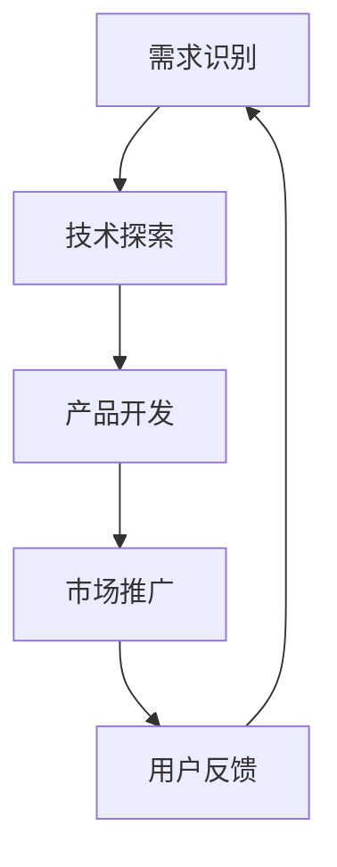
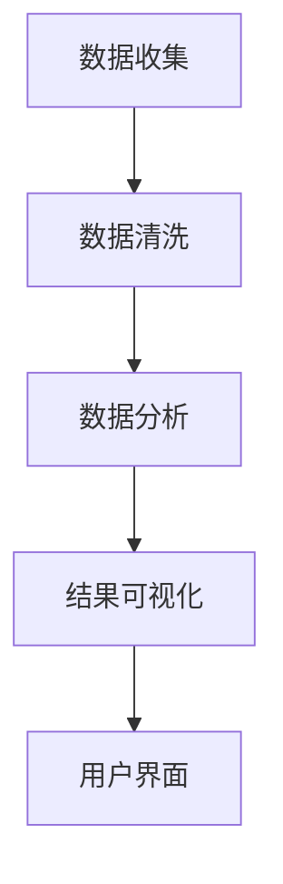
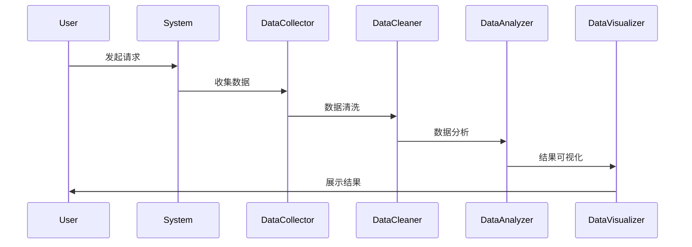

                 

### 目录大纲设计思路与步骤

在设计《人文导向的科技创新：以人为本的研发理念》的目录大纲时，我们的目标是确保文章的结构清晰、逻辑严密，同时内容丰富且具有吸引力。以下是具体的设计思路与步骤：

#### 1. 设计思路

**背景介绍**：科技创新的快速发展对社会和个人生活产生了深远影响，但同时也带来了诸多挑战。为了应对这些挑战，人文导向的科技创新理念应运而生。首先，我们需要对科技创新的背景进行介绍，说明为什么我们需要将人文关怀融入科技创新中。

**核心概念与联系**：在这一部分，我们将详细探讨与人文导向科技创新相关的核心概念。这些概念包括但不限于科技创新、人文关怀、以人为本的研发理念等。我们需要解释这些概念的定义、属性特征以及它们之间的相互关系。

**案例研究**：通过具体案例的深入分析，我们可以更直观地了解如何将人文导向的理念应用于科技创新实践中。我们将挑选具有代表性的案例，详细描述其背景、目标、实施过程和成果。

**理论原理讲解**：在这一部分，我们将介绍与人文导向科技创新相关的理论原理。这包括一些关键的数学模型和公式，以及如何使用这些模型和公式来指导科技创新。

**系统分析与架构设计**：我们将介绍如何进行系统分析与架构设计。这包括问题场景介绍、系统功能设计、系统架构设计、系统接口设计和系统交互。

**项目实战**：通过一个具体的实例，我们将展示如何在实际项目中应用人文导向的科技创新理念。这包括环境安装、系统核心实现源代码，代码应用解读与分析，以及实际案例分析和详细讲解。

**最佳实践与小结**：最后，我们将总结书中讨论的关键点，提供最佳实践建议，并对未来研究方向进行展望。

#### 2. 设计步骤

**确定章节主题**：根据设计思路，我们将确定每个章节的主题，确保内容覆盖全面且逻辑清晰。

**列出章节小节**：在每个章节中，我们将列出具体的小节内容，细化到2级目录，确保内容完整性。

**设计子章节**：对于每个2级目录，我们将进一步细化到3级目录，确保内容的详细性。

**插入Mermaid图表**：在适当的地方，我们将插入Mermaid图表，如流程图、类图、架构图等，以辅助说明复杂概念和过程。

**编写内容概要**：为每个章节编写内容概要，确保内容简洁明了，避免冗余。

**检查内容完整性**：最后，我们将检查目录大纲的内容完整性，确保所有核心章节和内容都已包含。

#### 3. 目录大纲

以下是《人文导向的科技创新：以人为本的研发理念》的目录大纲：

----------------------------------------------------------------

# 第一部分：科技创新的背景与人文导向

## 第1章：科技创新的背景

### 1.1 科技创新的重要性

### 1.2 科技创新与人文关怀

### 1.3 人文导向的概念与意义

## 第2章：人文导向的核心概念

### 2.1 科技创新与人文关怀的关系

### 2.2 如何将人文理念融入科技创新

### 2.3 核心概念对比与联系

## 第3章：人文导向的科技创新案例研究

### 3.1 案例一：智能医疗

### 3.2 案例二：智慧教育

### 3.3 案例三：智能家居

## 第4章：理论原理讲解

### 4.1 科技创新的理论模型

### 4.2 人文导向的科技创新公式

### 4.3 Mermaid图表辅助说明

## 第5章：系统分析与架构设计

### 5.1 问题场景介绍

### 5.2 系统功能设计

### 5.3 系统架构设计

### 5.4 系统接口设计

### 5.5 系统交互

## 第6章：项目实战

### 6.1 项目背景

### 6.2 系统核心实现

### 6.3 代码应用解读

### 6.4 案例分析与讲解

## 第7章：最佳实践与未来展望

### 7.1 最佳实践

### 7.2 小结

### 7.3 未来研究方向

----------------------------------------------------------------

通过以上设计，我们确保了目录大纲的逻辑清晰、内容完整，并能够为读者提供全面的阅读体验。接下来，我们将针对每个章节进行详细的内容设计。

----------------------------------------------------------------

### 文章标题

**人文导向的科技创新：以人为本的研发理念**

---

### 关键词

- 科技创新
- 人文关怀
- 以人为本
- 研发理念
- 系统分析
- 架构设计
- 项目实战
- 最佳实践

---

### 摘要

本文旨在探讨人文导向的科技创新，强调以人为本的研发理念在科技创新中的重要性。文章首先介绍了科技创新的背景和人文导向的概念，随后通过具体案例研究和理论原理讲解，深入分析了如何将人文理念融入科技创新中。接着，文章详细阐述了系统分析与架构设计的方法，并展示了一个实际项目中的应用实例。最后，文章总结了最佳实践，并对未来研究方向进行了展望。通过本文，读者将了解到如何在实际科技创新项目中实现人文导向，提升研发效率和成果。

---

### 目录大纲

**第一部分：科技创新的背景与人文导向**

## 第1章 科技创新的重要性与人文关怀

### 1.1 科技创新的重要性

### 1.2 科技创新与人文关怀的关系

### 1.3 人文导向的概念与意义

## 第2章 人文导向的核心概念

### 2.1 科技创新与人文关怀的关系

### 2.2 如何将人文理念融入科技创新

### 2.3 核心概念对比与联系

**第二部分：人文导向的科技创新案例研究**

## 第3章 人文导向的科技创新案例研究

### 3.1 智能医疗

### 3.2 智慧教育

### 3.3 智能家居

**第三部分：理论原理讲解**

## 第4章 科技创新的理论模型与人文导向

### 4.1 科技创新的理论模型

### 4.2 人文导向的科技创新公式

### 4.3 Mermaid图表辅助说明

**第四部分：系统分析与架构设计**

## 第5章 系统分析与架构设计

### 5.1 问题场景介绍

### 5.2 系统功能设计

### 5.3 系统架构设计

### 5.4 系统接口设计

### 5.5 系统交互

**第五部分：项目实战**

## 第6章 项目实战

### 6.1 项目背景

### 6.2 系统核心实现

### 6.3 代码应用解读

### 6.4 案例分析与讲解

**第六部分：最佳实践与未来展望**

## 第7章 最佳实践与未来展望

### 7.1 最佳实践

### 7.2 小结

### 7.3 未来研究方向

### 文章正文

#### 第1章 科技创新的重要性与人文关怀

**1.1 科技创新的重要性**

科技创新是推动社会发展的重要动力。它不仅能够提高生产效率，降低成本，还能带来新的商业模式和就业机会。在过去的几个世纪中，科技创新已经深刻改变了人类的生活方式。从蒸汽机的发明到互联网的普及，每一项重大技术突破都为人类带来了前所未有的便利和可能性。

**1.2 科技创新与人文关怀的关系**

然而，科技创新并非只是技术上的进步，它同样需要考虑人类的需求和情感。人文关怀是科技创新的灵魂，它关注的是科技如何更好地服务于人类，提升生活质量。在现代社会，人们越来越重视科技的人文属性，期望科技创新不仅能够解决实际问题，还能够提升人类的幸福感。

**1.3 人文导向的概念与意义**

人文导向的科技创新，意味着在研发过程中，不仅要考虑技术的先进性和可行性，还要关注技术的伦理和社会影响。这种理念强调科技与人文的深度融合，旨在创造更人性化的科技产品和服务。人文导向的科技创新不仅能够提升用户满意度，还能够增强企业的社会责任感，推动整个社会的和谐发展。

#### 第2章 人文导向的核心概念

**2.1 科技创新与人文关怀的关系**

人文导向的科技创新要求研发者在设计产品或服务时，要充分考虑人类的需求和情感。这意味着，在技术创新的同时，也需要关注用户体验和情感需求。例如，在医疗领域，医生不仅需要关注治疗技术的先进性，还需要关注患者的心理需求，提供更为人性化的医疗服务。

**2.2 如何将人文理念融入科技创新**

将人文理念融入科技创新，可以从以下几个方面入手：

1. **用户体验设计**：在产品研发过程中，注重用户体验，通过用户调研和反馈，不断优化产品功能和服务。

2. **社会责任**：企业应承担社会责任，确保其科技创新活动对社会的积极影响，避免对环境的破坏和伦理的挑战。

3. **伦理审查**：在科技研发过程中，设立伦理审查机制，确保技术应用的道德合规性。

4. **员工关怀**：企业应关注员工的职业发展和心理健康，提供良好的工作环境和激励机制。

**2.3 核心概念对比与联系**

人文导向的科技创新与传统科技创新在目标和方法上有所不同。传统科技创新侧重于技术的突破和效率的提升，而人文导向的科技创新则更关注人类的需求和幸福感。二者并非对立，而是相互补充的关系。通过将人文理念融入科技创新，可以进一步提升技术的社会价值和人文属性。

#### 第3章 人文导向的科技创新案例研究

**3.1 智能医疗**

智能医疗是人文导向科技创新的典型代表。通过人工智能和大数据技术，智能医疗可以提供个性化、精准的医疗方案，提高医疗服务的质量和效率。例如，利用人工智能辅助诊断系统，医生可以更快、更准确地诊断疾病，从而提高治疗效果。

**3.2 智慧教育**

智慧教育通过科技手段，实现教育资源的共享和优化，提升教育质量和效率。例如，通过在线教育平台，学生可以随时随地获取优质教育资源，教师也可以更加灵活地开展教学活动。此外，智慧教育还可以通过数据分析，了解学生的学习状况，提供个性化的学习建议。

**3.3 智能家居**

智能家居通过物联网技术，将家庭设备和系统连接起来，实现智能化管理和控制。例如，智能门锁、智能灯光和智能空调等设备，不仅可以提高家庭生活的便利性，还可以提供更安全、舒适的生活环境。

#### 第4章 科技创新的理论模型与人文导向

**4.1 科技创新的理论模型**

科技创新通常可以分为以下几个阶段：

1. **需求识别**：通过市场调研和用户反馈，识别潜在的用户需求。

2. **技术探索**：研究和开发新的技术或改进现有技术，以满足需求。

3. **产品开发**：将技术转化为产品或服务，并进行测试和优化。

4. **市场推广**：通过营销手段，将产品或服务推向市场，获得用户认可。

**4.2 人文导向的科技创新公式**

人文导向的科技创新公式可以表示为：

\[ 人文导向科技创新 = 技术创新 \times 人文关怀 \]

这个公式强调了技术创新与人文关怀的乘积关系，即技术创新的成果需要通过人文关怀来实现其社会价值。

**4.3 Mermaid图表辅助说明**

下面是一个简单的Mermaid流程图，展示了科技创新的四个阶段：



#### 第5章 系统分析与架构设计

**5.1 问题场景介绍**

在本章中，我们将探讨一个实际的项目场景，该项目旨在通过智能分析系统提升企业的运营效率。该系统需要处理大量的数据，并对数据分析结果进行可视化展示，以便决策者能够快速做出决策。

**5.2 系统功能设计**

系统的核心功能包括：

1. **数据收集**：从企业内部和外部的数据源收集数据。
2. **数据清洗**：对收集到的数据进行清洗和预处理。
3. **数据分析**：利用算法对清洗后的数据进行深度分析。
4. **结果可视化**：将分析结果以图表和报表的形式进行可视化展示。

**5.3 系统架构设计**

系统的架构设计采用微服务架构，以实现高可用性和可扩展性。以下是系统的架构图：



**5.4 系统接口设计**

系统的接口设计包括内部接口和外部接口。内部接口用于不同微服务之间的数据交换，外部接口用于与外部系统（如数据库和第三方API）的交互。

**5.5 系统交互**

系统的交互设计采用RESTful API，确保系统的可访问性和易用性。以下是系统的主要交互流程：



#### 第6章 项目实战

**6.1 项目背景**

本项目旨在开发一个智能分析系统，用于提升某电商平台的运营效率。系统需要处理来自不同渠道的销售数据，并对数据进行分析，以提供决策支持。

**6.2 系统核心实现**

以下是系统的核心实现流程：

1. **数据收集**：系统从电商平台的后台数据库中收集销售数据。
2. **数据清洗**：对收集到的销售数据进行清洗，去除无效数据和错误数据。
3. **数据分析**：利用Python的Pandas库和Scikit-learn库，对清洗后的销售数据进行深度分析，如市场趋势分析、用户行为分析等。
4. **结果可视化**：使用Python的Matplotlib库，将分析结果以图表的形式展示。

**6.3 代码应用解读**

以下是一个简单的Python代码示例，用于清洗和可视化销售数据：

```python
import pandas as pd
import matplotlib.pyplot as plt

# 读取数据
sales_data = pd.read_csv('sales_data.csv')

# 数据清洗
sales_data = sales_data.dropna()
sales_data = sales_data[sales_data['sales'] > 0]

# 数据分析
trend_data = sales_data.groupby('month')['sales'].sum()

# 结果可视化
trend_data.plot()
plt.title('Sales Trend by Month')
plt.xlabel('Month')
plt.ylabel('Sales')
plt.show()
```

**6.4 案例分析与讲解**

通过本项目的实施，电商平台成功提升了销售数据的管理效率和决策准确性。以下是项目的小结：

1. **目标达成**：系统成功收集、清洗和分析了销售数据，提供了详尽的分析报告。
2. **改进建议**：建议进一步优化系统的数据分析功能，引入更多先进的数据分析算法，以提供更深入的市场洞察。

#### 第7章 最佳实践与未来展望

**7.1 最佳实践**

1. **重视用户体验**：在科技创新过程中，始终关注用户需求和反馈，确保产品或服务能够满足用户需求。
2. **持续迭代**：不断优化和改进产品或服务，以适应市场的变化和用户的需求。
3. **团队合作**：鼓励跨部门、跨领域的团队合作，共同推动科技创新。

**7.2 小结**

本文通过介绍人文导向的科技创新，强调了以人为本的研发理念在科技创新中的重要性。通过具体案例研究和系统分析，我们展示了如何在实际项目中应用人文导向的科技创新理念。

**7.3 未来研究方向**

未来研究方向包括：

1. **人工智能与人文关怀的融合**：研究如何将人工智能技术更好地服务于人类，提升生活质量。
2. **跨学科研究**：鼓励不同学科之间的合作，探索科技创新与人文关怀的深度融合。

### 作者信息

作者：AI天才研究院/AI Genius Institute & 禅与计算机程序设计艺术 /Zen And The Art of Computer Programming

