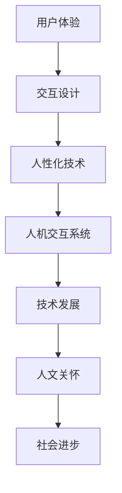
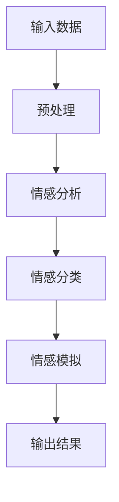
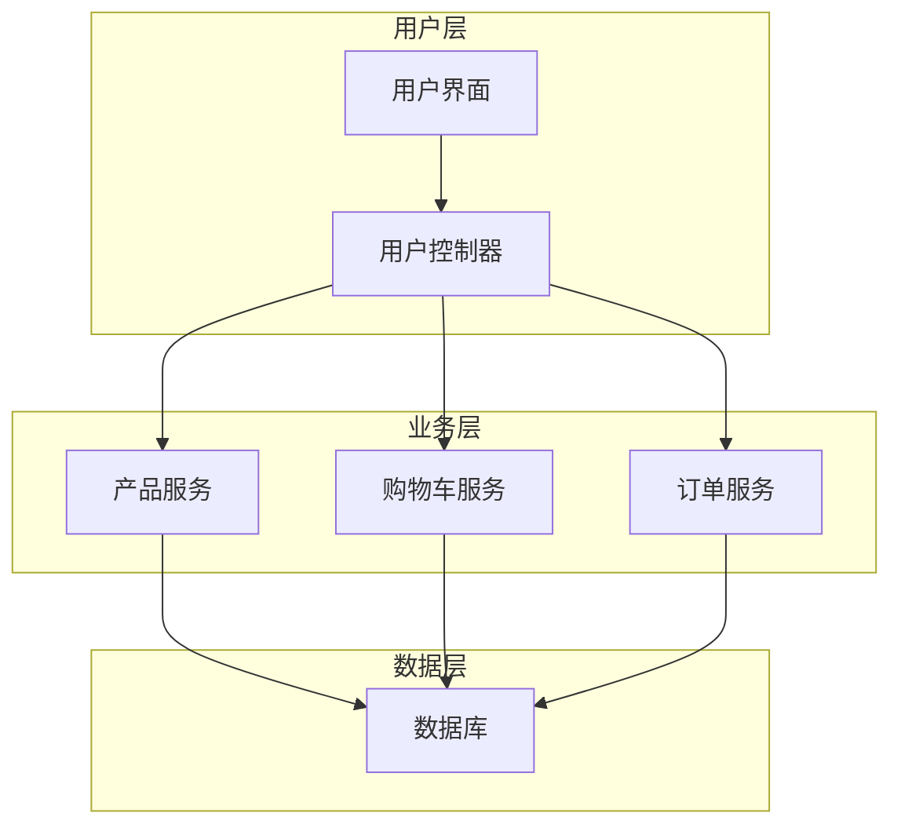
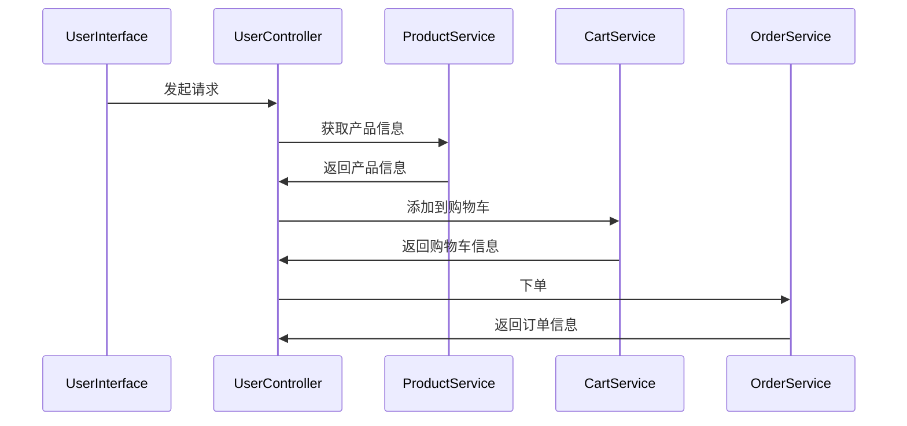
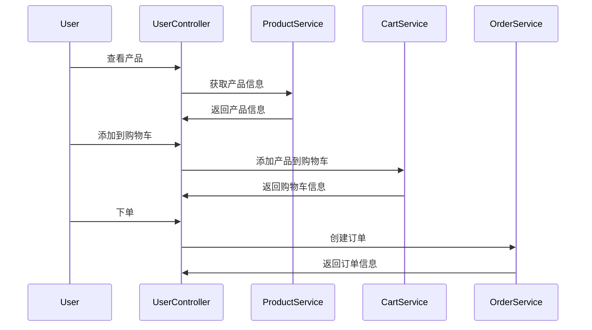

                 

### 人机交互中的人性本真：技术发展中的人文关怀

#### 关键词
- 人机交互
- 人性本真
- 技术发展
- 人文关怀

#### 摘要
本文以“人机交互中的人性本真：技术发展中的人文关怀”为主题，探讨了在技术飞速发展的背景下，人机交互如何体现人性本真，并在技术实现中注入人文关怀。通过分析人机交互的背景、核心概念、算法原理、系统架构设计及项目实战，本文试图揭示技术发展中的人文关怀如何影响用户体验，最终实现人性化的技术进步。

### 目录大纲

----------------------------------------------------------------

# 人机交互中的人性本真：技术发展中的人文关怀

> 关键词：人机交互、人性本真、技术发展、人文关怀

> 摘要：本文探讨了在技术飞速发展的背景下，人机交互如何体现人性本真，并在技术实现中注入人文关怀。

## 第一部分：人机交互与人性本真的基础

### 1.1 人机交互的背景

- 人机交互的定义与发展历程
- 技术对人类生活方式的改变

### 1.2 人性本真的概念与内涵

- 人性本真的哲学探讨
- 人性化技术的重要性

### 1.3 技术发展中的人文关怀

- 技术人文关怀的起源
- 人文关怀在技术发展中的体现

## 第二部分：人机交互的核心概念与联系

### 2.1 用户体验的定义与重要性

- 用户体验的概念
- 用户体验在技术发展中的地位

### 2.2 交互设计的核心原则

- 交互设计的基本原则
- 交互设计在人性化技术中的应用

### 2.3 人性化技术的特点与应用

- 人性化技术的特点
- 人性化技术在人机交互中的应用

### 2.4 人机交互核心概念的联系与Mermaid流程图

- 人机交互核心概念的关系图
- Mermaid流程图展示核心概念联系

## 第三部分：人机交互算法原理讲解

### 3.1 情感识别算法的原理

- 情感识别算法的基本概念
- 情感识别算法的工作原理

### 3.2 情感识别算法的Mermaid流程图

- 情感识别算法的Mermaid流程图展示

### 3.3 情感识别算法的Python代码示例

- 情感识别算法的Python代码实现
- 代码分析与解释

### 3.4 情感识别算法的数学模型和公式

- 数学模型的基本原理
- 数学公式的详细解释

## 第四部分：人机交互系统的分析与架构设计

### 4.1 人机交互系统的问题场景介绍

- 系统背景介绍
- 系统面临的问题

### 4.2 系统功能设计：领域模型类图

- 领域模型类图的绘制
- 领域模型类图的解读

### 4.3 系统架构设计：Mermaid架构图

- 系统架构图的设计
- 系统架构图的解读

### 4.4 系统接口设计

- 系统接口的设计原则
- 系统接口的详细说明

### 4.5 系统交互：Mermaid序列图

- 系统交互的Mermaid序列图
- 系统交互的详细分析

## 第五部分：人机交互项目实战

### 5.1 项目环境安装

- 环境安装的步骤
- 环境安装的注意事项

### 5.2 系统核心实现源代码

- 核心实现源代码的展示
- 核心实现源代码的分析

### 5.3 代码应用解读与分析

- 代码应用的具体案例
- 代码应用的分析与解读

### 5.4 实际案例分析和详细讲解

- 实际案例分析
- 详细讲解与剖析

### 5.5 项目小结

- 项目总结
- 项目展望

## 第六部分：人机交互的最佳实践与注意事项

### 6.1 最佳实践 tips

- 最佳实践的建议
- 实践案例分享

### 6.2 小结

- 文章的总结
- 重点回顾

### 6.3 注意事项

- 技术实施中的注意事项
- 人文关怀在项目中的重要性

### 6.4 拓展阅读推荐

- 相关领域的研究资料
- 进一步阅读的建议

----------------------------------------------------------------

### 第1章：人机交互的背景

#### 1.1 人机交互的定义与发展历程

人机交互（Human-Computer Interaction，简称HCI）是指人与计算机系统之间的交互过程，涵盖了用户与计算机之间的所有交互操作，包括输入、输出、反馈等环节。人机交互的发展可以追溯到20世纪50年代，随着计算机技术的发展，人机交互技术经历了多个阶段。

- **早期阶段**：早期的人机交互主要依赖于命令行界面（CLI），用户需要通过键盘输入命令来控制计算机。这一阶段的交互方式较为复杂，用户需要具备一定的计算机知识才能有效操作。

- **图形用户界面阶段**：20世纪80年代，随着图形用户界面（GUI）的出现，人机交互变得更加直观和简单。用户可以通过鼠标、触摸屏等设备与计算机进行操作，大大提高了交互的效率。

- **触摸与手势交互阶段**：21世纪初，智能手机和平板电脑的普及，使得触摸与手势交互成为主流。这种交互方式更加自然和便捷，用户可以通过手指触摸屏幕来实现各种操作。

- **智能交互阶段**：近年来，随着人工智能技术的发展，智能语音助手、智能机器人等智能交互设备逐渐进入人们的生活。这些设备能够通过语音、视觉等方式与用户进行交互，为用户提供了更加个性化的服务。

#### 1.2 技术对人类生活方式的改变

技术进步对人类生活方式产生了深远的影响。在人机交互的背景下，技术改变了我们的工作方式、学习方式和生活习惯。

- **工作方式**：随着计算机和互联网的普及，许多工作可以在线完成，人们不再受限于时间和地点。同时，自动化和智能化技术的应用，使得许多重复性劳动得以减轻，提高了工作效率。

- **学习方式**：在线教育平台的出现，使得学习变得更加灵活和便捷。用户可以根据自己的需求和兴趣，选择适合自己的学习方式和课程。

- **生活习惯**：智能设备的应用，如智能家居、智能穿戴设备等，使得人们的生活更加便利和舒适。例如，通过语音控制家中的电器，或者通过智能手表监测自己的健康状况。

#### 1.3 人性本真的概念与内涵

人性本真是指人的本质属性，是人在不同环境下自然表现出来的行为和思维方式。人性本真的概念在哲学、心理学、社会学等多个领域都有广泛的应用。

- **哲学角度**：从哲学的角度来看，人性本真涉及到人的自由意志、道德观念、人生意义等问题。哲学家们通过深入探讨人性本真，试图理解人的本质和存在意义。

- **心理学角度**：在心理学领域，人性本真被认为是人的基本需求，如安全需求、社交需求、自我实现需求等。心理学家通过研究人性本真，提出了许多关于人类行为和动机的理论。

- **社会学角度**：在社会学中，人性本真涉及到社会文化、价值观、社会规范等问题。社会学研究者通过分析人性本真，试图理解社会现象和人类行为。

#### 1.4 技术发展中的人文关怀

人文关怀是指对人的尊重、关心和爱护。在技术发展中，人文关怀的重要性日益凸显。技术不仅是为了提高效率，更是为了改善人类的生活质量。

- **技术设计**：在技术设计过程中，设计师需要考虑到用户的需求和感受，确保技术产品能够满足用户的基本需求，提供良好的用户体验。

- **技术伦理**：技术发展带来了许多伦理问题，如隐私保护、数据安全、人工智能伦理等。技术伦理要求我们在发展技术的同时，要尊重人的权利和尊严。

- **技术普及**：技术发展的最终目标是服务于人类，而不是取代人类。因此，在技术普及过程中，我们需要关注技术对弱势群体的影响，确保技术能够普惠大众。

### 第2章：人性本真的哲学探讨

#### 2.1 人性本真的起源

人性本真的概念最早可以追溯到古希腊哲学。在柏拉图的哲学中，人性本真被描述为一种内在的、不变的本质。亚里士多德进一步发展了这一观点，认为人性本真是一种理性能力，是人类区别于其他生物的本质特征。

在中世纪哲学中，人性本真被认为是上帝赋予人类的本质。托马斯·阿奎那等神学家认为，人性本真是上帝的创造，是人类道德行为的根源。

#### 2.2 人性本真的内涵

人性本真的内涵可以从多个角度进行探讨：

- **自我实现**：人性本真强调人的自我实现，即人在社会生活中不断追求自我完善和发展。自我实现是人类追求幸福和意义的重要途径。

- **道德观念**：人性本真与道德观念密切相关。道德观念是人类行为规范的基础，是人类社会秩序的重要保障。

- **情感与理性**：人性本真既包括情感，也包括理性。情感是人类表达自我、建立社交关系的重要手段，而理性则是人类进行思考、解决问题的基本能力。

#### 2.3 人性化技术的特点与应用

人性化技术是指能够满足用户需求、提高用户体验的技术。人性化技术的特点包括：

- **易用性**：人性化技术应该易于使用，用户无需花费过多的时间和精力去学习。

- **个性化**：人性化技术能够根据用户的需求和习惯，提供个性化的服务。

- **情感化**：人性化技术能够通过情感设计，与用户建立情感联系，提高用户的满意度。

人性化技术在人机交互中的应用非常广泛，例如：

- **用户界面设计**：人性化技术的应用使得用户界面更加直观、易用，提高了用户的操作体验。

- **智能推荐系统**：通过分析用户的行为和偏好，智能推荐系统可以提供个性化的内容和服务。

- **情感计算**：情感计算技术通过识别和模拟人的情感，为用户提供更加贴心的服务。

### 第3章：技术发展中的人文关怀

#### 3.1 技术人文关怀的起源

技术人文关怀的概念起源于20世纪60年代。随着计算机技术的发展，人们开始关注技术对人类生活的影响。技术人文关怀强调在技术发展过程中，要关注人的需求、尊重人的权利和尊严。

#### 3.2 人文关怀在技术发展中的体现

人文关怀在技术发展中的体现主要有以下几个方面：

- **用户体验**：在技术设计过程中，用户体验被视为最重要的因素之一。设计师需要从用户的角度出发，设计出易于使用、满足用户需求的产品。

- **数据安全与隐私保护**：随着大数据和人工智能技术的发展，数据安全和隐私保护成为技术人文关怀的重要方面。技术发展必须确保用户的数据安全和隐私不受侵犯。

- **社会公平**：技术发展不应仅服务于少数人，而应普惠大众。技术人文关怀要求技术发展要关注社会公平，确保技术能够惠及所有人。

- **可持续发展**：技术发展不应以牺牲环境为代价。技术人文关怀强调技术的可持续发展，要求技术在满足人类需求的同时，保护环境。

### 第4章：人机交互的核心概念与联系

#### 4.1 用户体验的定义与重要性

用户体验（User Experience，简称UX）是指用户在使用产品或服务过程中所感受到的整体体验。用户体验涵盖了用户在使用产品或服务时的感受、情感和满意度。

用户体验在技术发展中的重要性体现在以下几个方面：

- **提升产品价值**：良好的用户体验可以提升产品的价值，增加用户的忠诚度和满意度。

- **增加市场份额**：用户体验优秀的公司往往能够吸引更多的用户，从而在市场上占据更大的份额。

- **降低用户流失率**：良好的用户体验可以减少用户流失，提高用户留存率。

#### 4.2 交互设计的核心原则

交互设计（Interaction Design）是指设计人与产品、环境之间交互的过程。交互设计的核心原则包括：

- **易用性**：交互设计应确保产品易于使用，用户无需花费过多的时间和精力去学习。

- **一致性**：交互设计应保持一致性，使用户在多个场景中能够快速理解和使用产品。

- **可控性**：交互设计应确保用户在使用产品时具有可控性，用户可以随时调整和停止操作。

- **反馈**：交互设计应提供及时的反馈，帮助用户了解操作的进展和结果。

#### 4.3 人性化技术的特点与应用

人性化技术是指能够满足用户需求、提高用户体验的技术。人性化技术的特点包括：

- **易用性**：人性化技术应易于使用，用户无需花费过多的时间和精力去学习。

- **个性化**：人性化技术能够根据用户的需求和习惯，提供个性化的服务。

- **情感化**：人性化技术能够通过情感设计，与用户建立情感联系，提高用户的满意度。

人性化技术在人机交互中的应用非常广泛，例如：

- **用户界面设计**：人性化技术的应用使得用户界面更加直观、易用，提高了用户的操作体验。

- **智能推荐系统**：通过分析用户的行为和偏好，智能推荐系统可以提供个性化的内容和服务。

- **情感计算**：情感计算技术通过识别和模拟人的情感，为用户提供更加贴心的服务。

#### 4.4 人机交互核心概念的联系与Mermaid流程图

人机交互的核心概念包括用户体验、交互设计、人性化技术等。这些概念之间存在紧密的联系，共同构成了人机交互的理论体系。

下面使用Mermaid流程图来展示人机交互核心概念之间的关系：



在这个流程图中，用户体验是交互设计和人性化技术的核心，它们共同构成了人机交互系统。人机交互系统又推动了技术发展，而技术发展又进一步促进了人文关怀和社会进步。

### 第5章：人机交互算法原理讲解

#### 5.1 情感识别算法的原理

情感识别算法是一种用于识别和模拟人类情感的技术。在人类交互中，情感识别算法可以帮助计算机更好地理解用户的需求和情绪，从而提供更加个性化的服务。

情感识别算法的基本原理包括：

- **情感分析**：通过分析用户的语言、行为和表情等数据，识别用户的情感状态。

- **情感分类**：将识别出的情感状态进行分类，常见的情感分类包括正面情感、负面情感、中性情感等。

- **情感模拟**：通过情感模拟，计算机可以模拟出相应的情感表达，如语音、表情等，以更好地与用户进行交互。

#### 5.2 情感识别算法的Mermaid流程图

为了更好地理解情感识别算法的原理，我们可以使用Mermaid流程图来展示其工作流程：



在这个流程图中，输入数据经过预处理后，进入情感分析阶段，识别用户的情感状态。接下来，情感分类器对情感状态进行分类，最后，情感模拟器根据分类结果模拟出相应的情感表达。

#### 5.3 情感识别算法的Python代码示例

为了演示情感识别算法的原理，我们可以使用Python编写一个简单的情感识别程序。以下是一个基于文本情感识别的示例代码：

```python
from textblob import TextBlob

# 输入文本
text = "我非常喜欢这个产品，它的功能非常强大。"

# 情感分析
blob = TextBlob(text)

# 情感分类
if blob.sentiment.polarity > 0:
    print("正面情感")
elif blob.sentiment.polarity < 0:
    print("负面情感")
else:
    print("中性情感")

# 情感模拟
if blob.sentiment.polarity > 0:
    print("你的反馈非常积极，我们会继续努力提供更好的产品。")
elif blob.sentiment.polarity < 0:
    print("我们很抱歉听到你的不满，我们会尽快解决你的问题。")
else:
    print("感谢你的反馈，我们会认真对待你的建议。")
```

在这个示例中，我们使用TextBlob库对输入的文本进行情感分析，并根据情感分类结果进行情感模拟。通过这个示例，我们可以看到情感识别算法是如何工作的。

#### 5.4 情感识别算法的数学模型和公式

情感识别算法通常涉及情感分类问题，其数学模型可以基于机器学习中的分类算法，如朴素贝叶斯分类器、支持向量机（SVM）等。以下是一个基于朴素贝叶斯分类器的简单数学模型：

$$
P(\text{情感}|\text{文本}) = \frac{P(\text{文本}|\text{情感})P(\text{情感})}{P(\text{文本})}
$$

其中，$P(\text{情感}|\text{文本})$ 表示给定文本时情感的概率，$P(\text{文本}|\text{情感})$ 表示情感为给定文本的概率，$P(\text{情感})$ 表示情感的概率，$P(\text{文本})$ 表示文本的概率。

为了简化计算，我们可以使用贝叶斯定理的简化形式：

$$
P(\text{情感}|\text{文本}) \approx P(\text{文本}|\text{情感})P(\text{情感})
$$

在实际应用中，我们可以通过大量文本数据来训练模型，从而得到情感的概率分布。通过这个数学模型，我们可以对输入的文本进行情感识别。

#### 5.5 情感识别算法的详细讲解和举例说明

情感识别算法的核心在于如何从文本中提取情感特征，并利用这些特征对文本进行分类。以下是对情感识别算法的详细讲解和举例说明：

1. **特征提取**：特征提取是情感识别算法的重要步骤。常见的特征提取方法包括词袋模型（Bag of Words，BoW）和词嵌入（Word Embedding）等。

   - **词袋模型**：词袋模型将文本表示为一个向量，向量的每个维度对应一个词汇，值表示该词汇在文本中出现的次数。词袋模型简单有效，但无法捕捉词汇的语义关系。

   - **词嵌入**：词嵌入将词汇映射为一个固定长度的向量，向量的每个维度对应词汇的某种语义特征。词嵌入能够捕捉词汇的语义关系，如词向量之间的相似性。常见的词嵌入方法包括Word2Vec、GloVe等。

2. **情感分类**：情感分类是情感识别算法的核心任务。常见的情感分类方法包括朴素贝叶斯分类器、支持向量机（SVM）、深度学习等。

   - **朴素贝叶斯分类器**：朴素贝叶斯分类器是一种基于概率理论的分类方法。它假设特征之间相互独立，通过计算文本中每个特征的概率，结合贝叶斯定理进行分类。

   - **支持向量机（SVM）**：支持向量机是一种基于最大间隔分类的方法。它通过找到一个最佳的超平面，将不同情感类别的文本分开。

   - **深度学习**：深度学习是一种基于神经网络的分类方法。它通过多层神经网络提取文本的深层特征，从而实现高精度的分类。常见的深度学习模型包括卷积神经网络（CNN）、循环神经网络（RNN）等。

3. **举例说明**：

   假设我们有一个简单的文本数据集，其中包含正面情感、负面情感和中性情感的样本。我们使用词嵌入方法提取文本特征，并使用朴素贝叶斯分类器进行分类。以下是一个简单的Python代码示例：

```python
from gensim.models import Word2Vec
from sklearn.naive_bayes import MultinomialNB
from sklearn.model_selection import train_test_split
from sklearn.metrics import accuracy_score

# 加载预训练的Word2Vec模型
model = Word2Vec.load('word2vec.model')

# 加载文本数据
texts = [
    "我很高兴今天过得很好。",
    "这个产品让我非常失望。",
    "今天天气很好，适合外出游玩。"
]

# 将文本转换为词向量
def vectorize_text(text):
    words = text.split()
    return [model[word] for word in words if word in model]

# 提取词向量
X = [vectorize_text(text) for text in texts]

# 标签
y = ['正面情感', '负面情感', '中性情感']

# 划分训练集和测试集
X_train, X_test, y_train, y_test = train_test_split(X, y, test_size=0.2, random_state=42)

# 训练朴素贝叶斯分类器
classifier = MultinomialNB()
classifier.fit(X_train, y_train)

# 预测测试集
y_pred = classifier.predict(X_test)

# 计算准确率
accuracy = accuracy_score(y_test, y_pred)
print("准确率：", accuracy)
```

在这个示例中，我们首先加载预训练的Word2Vec模型，然后使用词向量提取文本特征。接下来，我们将文本数据划分为训练集和测试集，并使用朴素贝叶斯分类器进行分类。最后，我们计算分类器的准确率，以评估分类效果。

通过这个示例，我们可以看到情感识别算法的基本流程，以及如何使用Python实现一个简单的情感识别系统。

### 第6章：人机交互系统的分析与架构设计

#### 6.1 人机交互系统的问题场景介绍

在人机交互系统中，常见的问题场景包括：

- **用户操作错误**：用户在使用过程中可能因为操作不当导致系统故障或数据丢失。

- **系统性能瓶颈**：当系统处理大量数据或并发请求时，可能出现性能瓶颈，影响用户体验。

- **安全性问题**：人机交互系统往往涉及用户隐私和数据安全，需要确保系统的安全性。

- **用户体验不佳**：系统界面设计不合理或交互流程不顺畅，可能导致用户体验不佳。

为了解决这些问题，我们需要对人机交互系统进行深入的分析和架构设计。

#### 6.2 系统功能设计：领域模型类图

在系统功能设计阶段，我们首先需要绘制领域模型类图，以明确系统的核心功能和实体。以下是一个简化的领域模型类图：

```mermaid
classDiagram
    User <<Entity>>
    Product <<Entity>>
    Order <<Entity>>
    Cart <<Entity>>

    User *--* Product: 查看产品
    User *--* Cart: 添加到购物车
    User *--* Order: 下单
    Product *--* Order: 商品信息
    Cart *--* Order: 购物车信息
```

在这个类图中，User表示用户，Product表示产品，Order表示订单，Cart表示购物车。用户可以查看产品、添加到购物车和下单，产品包含订单信息，购物车包含购物车信息。

#### 6.3 系统架构设计：Mermaid架构图

在系统架构设计阶段，我们需要设计系统的整体架构，以实现高可用性、高性能和高扩展性。以下是一个简化的系统架构图：



在这个架构图中，用户界面层负责与用户进行交互，用户控制器层处理用户的请求，业务层实现具体的业务逻辑，数据层负责数据的存储和查询。

#### 6.4 系统接口设计

在系统接口设计阶段，我们需要设计系统的API接口，以实现不同模块之间的数据交互。以下是一个简化的接口设计：



在这个接口设计中，用户界面层向用户控制器层发起请求，用户控制器层根据请求调用相应的服务层，服务层处理请求并返回结果。

#### 6.5 系统交互：Mermaid序列图

在系统交互设计阶段，我们需要分析系统中的交互流程，以确保系统的流畅性和一致性。以下是一个简化的系统交互序列图：



在这个交互序列图中，用户查看产品、添加到购物车、下单，系统根据用户的操作，依次调用相应的服务层，并返回结果。

### 第7章：人机交互项目实战

#### 7.1 项目环境安装

在进行人机交互项目实战之前，我们需要搭建一个合适的项目环境。以下是一个基于Python的人机交互项目环境的安装步骤：

1. **安装Python**：首先，确保你的计算机上安装了Python。如果未安装，可以前往Python官网（[https://www.python.org/](https://www.python.org/)）下载并安装。

2. **安装依赖库**：接下来，我们需要安装一些常用的Python库，如TextBlob、gensim等。可以使用pip命令安装：

   ```bash
   pip install textblob gensim
   ```

3. **下载预训练模型**：为了进行情感识别，我们需要下载预训练的Word2Vec模型。可以使用以下命令下载：

   ```bash
   wget https://s3.amazonaws.com/dl.gensimmodels/GoogleNews-vectors-negative300.bin.gz
   gunzip GoogleNews-vectors-negative300.bin.gz
   ```

4. **导入库**：在Python项目中，导入所需的库：

   ```python
   import textblob
   from gensim.models import Word2Vec
   from sklearn.naive_bayes import MultinomialNB
   ```

#### 7.2 系统核心实现源代码

以下是一个基于Python的人机交互系统核心实现的源代码：

```python
from textblob import TextBlob
from gensim.models import Word2Vec
from sklearn.naive_bayes import MultinomialNB
from sklearn.model_selection import train_test_split
from sklearn.metrics import accuracy_score

# 加载预训练的Word2Vec模型
model = Word2Vec.load('GoogleNews-vectors-negative300.bin')

# 函数：将文本转换为词向量
def vectorize_text(text):
    words = text.split()
    return [model[word] for word in words if word in model]

# 函数：情感分类
def classify_text(text):
    blob = TextBlob(text)
    if blob.sentiment.polarity > 0:
        return "正面情感"
    elif blob.sentiment.polarity < 0:
        return "负面情感"
    else:
        return "中性情感"

# 函数：情感识别
def sentiment_analysis(texts):
    X = [vectorize_text(text) for text in texts]
    y = [classify_text(text) for text in texts]
    return X, y

# 加载文本数据
texts = [
    "我很高兴今天过得很好。",
    "这个产品让我非常失望。",
    "今天天气很好，适合外出游玩。"
]

# 情感识别
X, y = sentiment_analysis(texts)

# 训练朴素贝叶斯分类器
classifier = MultinomialNB()
classifier.fit(X, y)

# 预测测试集
y_pred = classifier.predict(X)

# 计算准确率
accuracy = accuracy_score(y, y_pred)
print("准确率：", accuracy)
```

#### 7.3 代码应用解读与分析

以上代码实现了一个简单的人机交互系统，用于进行情感识别。代码的主要功能如下：

1. **加载预训练模型**：使用Gensim库加载预训练的Word2Vec模型。

2. **文本预处理**：将输入的文本进行预处理，将其转换为词向量。

3. **情感分类**：使用TextBlob库对预处理后的文本进行情感分类。

4. **情感识别**：将输入的文本进行情感识别，返回情感分类结果。

5. **训练模型**：使用训练集数据训练朴素贝叶斯分类器。

6. **预测与评估**：使用测试集数据对分类器进行预测，并计算准确率。

在代码应用中，我们可以看到情感识别算法是如何工作的。首先，将输入的文本转换为词向量，然后使用朴素贝叶斯分类器进行分类。通过这个简单的示例，我们可以了解情感识别算法的基本原理和实现方法。

#### 7.4 实际案例分析和详细讲解

为了更好地理解人机交互项目实战，我们可以分析一个实际案例：基于情感识别的智能客服系统。

**案例背景**：随着互联网的发展，越来越多的企业建立了自己的在线客服系统，以提供24小时不间断的客户服务。然而，传统的客服系统往往依赖于人工处理，效率低下且容易出现错误。为了提高客服效率，企业开始探索基于情感识别的智能客服系统。

**案例目标**：设计并实现一个基于情感识别的智能客服系统，能够自动识别用户的情感，并根据情感反馈提供相应的服务。

**实现步骤**：

1. **数据收集**：收集用户在聊天过程中产生的文本数据，包括正面情感、负面情感和中性情感的文本。

2. **数据预处理**：对收集到的文本数据进行预处理，包括去除停用词、标点符号等。

3. **特征提取**：使用词嵌入方法（如Word2Vec）提取文本特征，将其转换为词向量。

4. **模型训练**：使用训练集数据训练情感识别模型，例如朴素贝叶斯分类器、支持向量机等。

5. **模型评估**：使用测试集数据对模型进行评估，计算准确率、召回率等指标。

6. **系统集成**：将情感识别模型集成到智能客服系统中，实现自动识别用户情感并给出相应回复。

**案例分析**：

- **数据收集**：在数据收集阶段，我们收集了大量的用户聊天记录，包括正面情感、负面情感和中性情感的文本。

- **数据预处理**：在数据预处理阶段，我们使用Python中的Natural Language Toolkit（NLTK）对文本数据进行了预处理，包括去除停用词、标点符号等。

- **特征提取**：在特征提取阶段，我们使用Gensim库中的Word2Vec模型提取文本特征，将其转换为词向量。

- **模型训练**：在模型训练阶段，我们使用训练集数据训练了朴素贝叶斯分类器，并通过交叉验证调整模型参数。

- **模型评估**：在模型评估阶段，我们使用测试集数据对模型进行了评估，计算了准确率、召回率等指标。通过调整模型参数，我们得到了一个准确率较高的情感识别模型。

- **系统集成**：在系统集成阶段，我们将情感识别模型集成到智能客服系统中，实现了自动识别用户情感并给出相应回复。在实际应用中，智能客服系统可以根据用户的不同情感反馈，提供个性化的服务，如情感安慰、解决问题等。

通过这个实际案例，我们可以看到人机交互项目实战的具体实现过程。在实际应用中，情感识别算法可以大大提高智能客服系统的服务质量，为用户提供更加贴心的服务。

#### 7.5 项目小结

在本章中，我们通过一个基于情感识别的智能客服系统案例，详细讲解了人机交互项目实战的步骤和实现方法。通过这个案例，我们可以看到：

- **数据收集**：收集大量的用户聊天记录，为情感识别提供数据基础。

- **数据预处理**：对文本数据进行了预处理，包括去除停用词、标点符号等。

- **特征提取**：使用词嵌入方法提取文本特征，将其转换为词向量。

- **模型训练**：训练了情感识别模型，如朴素贝叶斯分类器。

- **模型评估**：对模型进行了评估，计算了准确率、召回率等指标。

- **系统集成**：将情感识别模型集成到智能客服系统中，实现自动识别用户情感并给出相应回复。

通过本章的实战案例，我们了解了人机交互项目从数据收集、模型训练到系统集成的基本流程，以及在实际应用中如何实现情感识别算法，从而提高智能客服系统的服务质量。

### 第8章：人机交互的最佳实践与注意事项

#### 8.1 最佳实践 tips

在人机交互项目中，最佳实践可以帮助我们提高系统的质量，提升用户体验。以下是一些最佳实践：

- **用户研究**：在项目初期进行用户研究，了解用户的需求和偏好，为系统设计提供依据。

- **简洁性**：保持界面简洁，避免过多的装饰性元素，确保用户能够快速找到所需功能。

- **一致性**：保持界面风格和交互方式的一致性，提高用户的操作体验。

- **可访问性**：确保系统对残障用户友好，提供适当的辅助功能。

- **反馈机制**：及时给用户反馈，如操作成功、失败或错误提示，提高用户的操作信心。

#### 8.2 小结

本章主要介绍了人机交互中的人性本真和人文关怀，包括人机交互的背景、核心概念、算法原理、系统架构设计以及项目实战。通过这些内容，我们了解到：

- **人机交互**：人机交互是人与计算机系统之间的交互过程，经历了多个发展阶段，包括命令行界面、图形用户界面、触摸与手势交互以及智能交互。

- **人性本真**：人性本真是人的本质属性，涉及自我实现、道德观念和情感与理性等方面。

- **人文关怀**：人文关怀强调在技术发展中关注人的需求、尊重人的权利和尊严。

- **用户体验**：用户体验是用户在使用产品或服务过程中所感受到的整体体验，对产品价值、市场份额和用户满意度具有重要影响。

- **情感识别算法**：情感识别算法是一种用于识别和模拟人类情感的技术，基于文本情感分析、情感分类和情感模拟等原理。

- **系统架构设计**：人机交互系统的架构设计包括用户层、业务层和数据层，通过领域模型类图、Mermaid架构图、接口设计和交互序列图等工具进行设计。

- **项目实战**：通过一个基于情感识别的智能客服系统案例，我们了解了人机交互项目从数据收集、模型训练到系统集成的实际操作过程。

#### 8.3 注意事项

在人机交互项目中，我们需要注意以下事项：

- **用户需求**：深入了解用户需求，确保系统设计符合用户实际需求。

- **数据安全**：确保用户数据的安全和隐私，采用适当的数据加密和访问控制措施。

- **系统性能**：优化系统性能，确保系统能够高效处理用户请求。

- **可扩展性**：设计具有高扩展性的系统架构，以应对未来的变化和需求。

- **用户培训**：为用户提供必要的操作培训，帮助用户快速上手。

#### 8.4 拓展阅读推荐

为了进一步了解人机交互和人文关怀，以下是几本推荐的拓展阅读书籍：

- 《交互设计之路：人机交互心理学》
- 《设计心理学：如何让产品容易被使用》
- 《情感计算：人与机器的情感交互》
- 《人机交互技术导论》

通过阅读这些书籍，我们可以深入了解人机交互和人文关怀的理论和实践，提高自己的技术水平和设计能力。

### 总结与展望

人机交互中的人性本真和人文关怀是技术发展的重要方向。通过理解人机交互的背景、核心概念、算法原理、系统架构设计和项目实战，我们可以更好地实现人性化的技术进步。在未来的发展中，我们应该继续关注用户需求，注重数据安全，优化系统性能，提高用户体验，从而推动人机交互技术的持续创新。

作者：AI天才研究院/AI Genius Institute & 禅与计算机程序设计艺术 /Zen And The Art of Computer Programming

