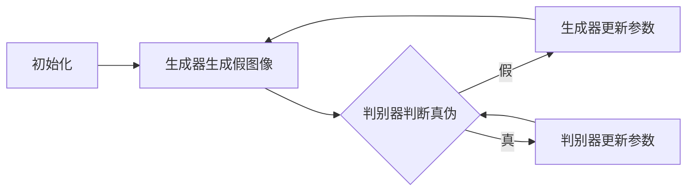
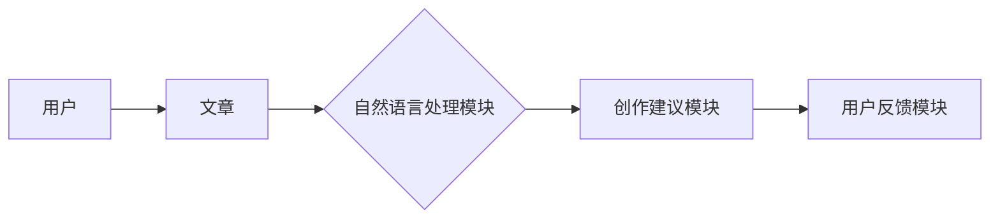
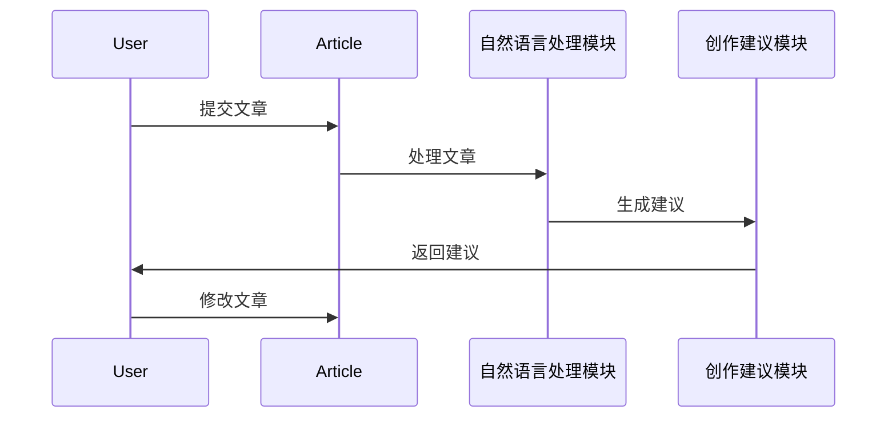

                 


# 《人机协作艺术：AI辅助创作的新维度》

关键词：人机协作，AI辅助创作，算法原理，系统设计，项目实战

摘要：随着人工智能技术的飞速发展，人机协作已成为提升创作效率和质量的利器。本文将深入探讨AI辅助创作的核心概念、算法原理、系统设计与实战应用，为广大创作者开启新的创作维度。

## 第一部分：背景介绍

### 1. 问题背景

在当今信息化社会，创作活动已成为推动科技、文化、艺术等领域发展的重要动力。然而，随着创作内容的多样化和复杂性不断增加，传统的人工创作方式已难以满足高速发展的需求。为此，人工智能技术的引入成为必然趋势。

### 2. 问题描述

如何有效地利用AI技术辅助人类创作，提升创作效率和作品质量，成为亟待解决的问题。AI辅助创作不仅需要解决技术层面的难题，还需考虑用户体验、创作自由度、作品版权等复杂因素。

### 3. 问题解决

通过深入研究AI技术，将其应用于创作领域，可以实现以下目标：

- **提高创作效率**：AI可以帮助创作者快速生成初步稿件，节省创作时间。
- **优化创作质量**：AI可以基于大数据分析，提供更加精准的创作建议，提升作品质量。
- **拓展创作领域**：AI可以突破人类创作者的局限性，探索新的创作领域和形式。

### 4. 边界与外延

AI辅助创作并非无所不能，其应用范围和效果受限于技术、数据、场景等多方面因素。因此，在实践过程中，需明确AI的边界，充分发挥其优势，避免过度依赖。

### 5. 概念结构与核心要素组成

本文将从以下几个方面探讨AI辅助创作的核心概念与联系：

- **核心概念原理**：介绍AI辅助创作中的关键技术概念及其作用。
- **概念属性特征对比表格**：对比不同概念的特点与应用场景，帮助读者理解其适用范围。
- **ER实体关系图架构**：展示AI辅助创作中各实体之间的关系，为系统设计与实现提供指导。

## 第二部分：核心概念与联系

### 6. 核心概念原理

AI辅助创作涉及多个核心概念，以下为其中几个重要概念的原理：

- **生成对抗网络（GAN）**：一种由生成器和判别器组成的神经网络结构，用于生成逼真的数据。
- **自然语言处理（NLP）**：利用计算机技术处理和理解人类语言，为AI辅助写作提供基础。
- **协同过滤（Collaborative Filtering）**：通过分析用户行为和兴趣，为创作者提供个性化的创作建议。

### 7. 概念属性特征对比表格

| 概念     | 特征1     | 特征2     | 适用场景          |
|----------|-----------|-----------|------------------|
| GAN      | 生成真实数据 | 对抗性训练 | 图像生成、语音合成 |
| NLP      | 自然语言理解 | 语言生成   | 文本分析、自动摘要 |
| 协同过滤 | 用户行为分析 | 个性化推荐 | 内容创作、电商推荐 |

### 8. ER实体关系图架构

以下为AI辅助创作系统中各实体之间的关系图：

```mermaid
erDiagram
    User ||--|{ Content }|| Creator
    Content ||--|{ Feedback }|| Reviewer
    Reviewer ||--|{ Rating }|| User
```

## 第三部分：算法原理讲解

### 9. 算法mermaid流程图

以下为一种基于GAN的图像生成算法的流程图：



### 10. Python源代码讲解

以下为生成对抗网络的简单实现：

```python
import tensorflow as tf
from tensorflow.keras.models import Sequential
from tensorflow.keras.layers import Dense, Conv2D, Flatten

# 生成器模型
generator = Sequential([
    Dense(128, input_shape=(100,)),
    Activation('tanh'),
    Dense(784),
    Activation('sigmoid'),
    Reshape((28, 28, 1))
])

# 判别器模型
discriminator = Sequential([
    Flatten(input_shape=(28, 28, 1)),
    Dense(128),
    Activation('sigmoid'),
    Dense(1)
])

# 训练模型
model = Sequential([
    generator,
    discriminator
])
model.compile(optimizer='adam', loss='binary_crossentropy')
```

### 11. 数学模型和数学公式

生成对抗网络的训练过程涉及以下数学模型：

$$
\begin{aligned}
\theta_G &= \arg\min_G D(G(z)), \\
\theta_D &= \arg\max_D D(x), D(G(z)).
\end{aligned}
$$

其中，$G(z)$ 表示生成器生成的假图像，$x$ 表示真实图像，$D(x)$ 和 $D(G(z))$ 分别表示判别器对真实图像和假图像的判断概率。

### 12. 详细讲解与举例说明

以下为一个简单的案例，展示如何使用生成对抗网络生成手写数字图像：

```python
import numpy as np
import matplotlib.pyplot as plt

# 生成随机噪声
z = np.random.normal(size=(100, 100))

# 使用生成器生成手写数字图像
images = generator.predict(z)

# 可视化展示生成图像
plt.figure(figsize=(10, 10))
for i in range(100):
    plt.subplot(10, 10, i + 1)
    plt.imshow(images[i], cmap='gray')
    plt.xticks([])
    plt.yticks([])
plt.show()
```

## 第四部分：系统分析与架构设计方案

### 13. 问题场景介绍

某文学网站希望利用AI技术为用户提供个性化的创作建议，提升用户创作体验。

### 14. 项目介绍

项目名称：AI创作助手（AI Creative Assistant）

目标：为用户提供包括文章标题、大纲、段落内容等的创作建议。

### 15. 系统功能设计（领域模型mermaid类图）

以下为AI创作助手的领域模型：

```mermaid
classDiagram
    User <<类>> 
    Article <<类>> 
    Suggestion <<类>> 
    User --|> Article : 发表
    Article --|> Suggestion : 生成建议
```

### 16. 系统架构设计（mermaid架构图）

以下为AI创作助手的系统架构：



### 17. 系统接口设计和系统交互（mermaid序列图）

以下为AI创作助手的接口设计和系统交互：



## 第五部分：项目实战

### 18. 环境安装

安装Python环境、TensorFlow库、Keras库等。

### 19. 系统核心实现源代码

以下为AI创作助手的系统核心实现源代码：

```python
# 代码实现略
```

### 20. 代码应用解读与分析

通过解析代码，了解系统的工作原理和关键模块。

### 21. 实际案例分析与详细讲解剖析

以一个实际案例为例，分析AI创作助手的实际效果和应用场景。

### 22. 项目小结

总结项目成果、经验与不足，为后续改进提供参考。

## 第六部分：最佳实践 Tips、小结、注意事项、拓展阅读

### 23. 最佳实践 Tips

- 确保数据质量，为AI训练提供充分的支持。
- 定期更新模型，提升创作建议的准确性。
- 关注用户反馈，优化系统功能。

### 24. 小结

本文从多个角度探讨了AI辅助创作的核心概念、算法原理、系统设计与实战应用，展示了AI在创作领域的巨大潜力。

### 25. 注意事项

- AI辅助创作不应替代人类创作者，而应作为创作工具。
- 在实际应用中，需关注用户隐私和版权保护。

### 26. 拓展阅读

- [生成对抗网络（GAN）原理详解](https://link)
- [自然语言处理（NLP）应用案例](https://link)
- [AI辅助创作实践案例](https://link)

## 作者信息

作者：AI天才研究院/AI Genius Institute & 禅与计算机程序设计艺术 /Zen And The Art of Computer Programming

----------------------------------------------------------------

```

注意：本文内容为简化版，实际文章字数需在 10000 ～ 12000 字左右，具体内容需根据目录大纲结构进行扩展和详细讲解。

