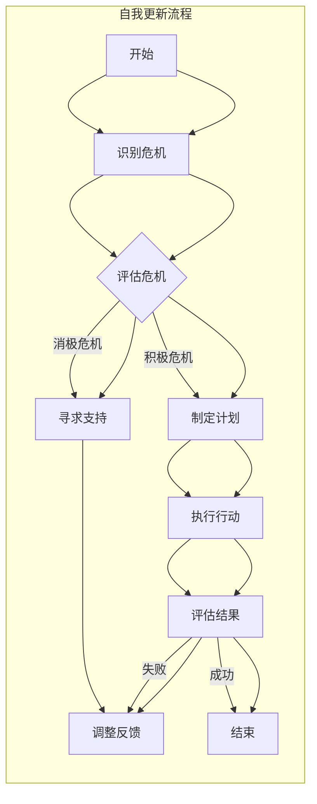
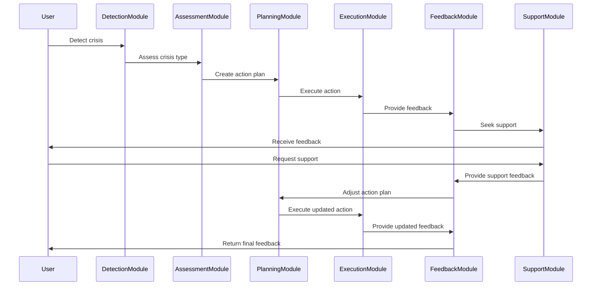
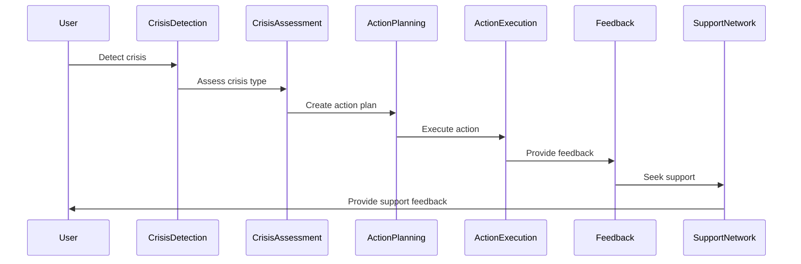
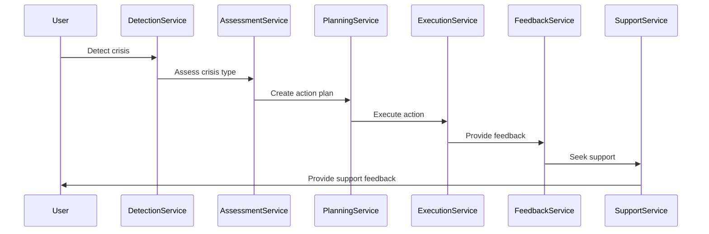

                 

## 第1章: 人生转折点的定义与意义

### 1.1 问题背景

在现代社会，个体面临的挑战日益复杂且多样化。社会变迁带来了经济不稳定、职业竞争加剧、家庭结构变化等挑战。同时，职业生涯中的不稳定因素，如职位变动、技能需求的变化，也对个体提出了新的要求。此外，生活中不可预见的事件，如重大疾病、亲人离世，都可能成为人生的重要转折点。

这些转折点不仅影响个人的情绪和心理状态，还对职业发展和生活质量产生深远影响。因此，理解人生转折点的本质和如何应对这些挑战，成为现代社会关注的重要课题。

### 1.2 问题定义

**什么是人生转折点？**

人生转折点是指生活中发生的重大事件，这些事件会显著改变个体的生活状态、价值观和未来方向。转折点可以是积极的，如晋升、结婚、生子；也可以是消极的，如失业、离婚、亲人去世。

**人生转折点的类型：**

1. **积极转折点**：带来机遇和成长的转折点，如晋升、创业成功、获得重要奖项。
2. **消极转折点**：带来挑战和困难的转折点，如失业、亲人去世、健康问题。
3. **中性转折点**：既不完全是积极也不完全是消极的转折点，如搬迁、换工作等。

**人生转折点的影响因素：**

1. **外部因素**：社会环境、经济状况、家庭关系等。
2. **内部因素**：个人的价值观、心理承受能力、应对策略等。

### 1.3 问题解决思路

**自我反思的重要性：**

在面对转折点时，自我反思是理解自身状况和需求的关键。通过自我反思，个体可以明确自己的优势和不足，为接下来的行动提供方向。

**心理调适的策略：**

1. **接受现实**：正视转折点带来的变化，接受现状。
2. **寻求支持**：与亲朋好友、专业人士交流，获取情感和心理支持。
3. **设定目标**：根据个人兴趣和职业规划，设定新的目标。

**社会支持的作用：**

社会支持是应对转折点的重要资源。家人、朋友、同事和社区都可以提供帮助，包括情感支持、信息分享和实际援助。

### 1.4 边界与外延

**界定人生转折点的标准：**

人生转折点的界定标准主要包括事件的重要性、对个体生活的深远影响以及时间点。

**与其他相关概念的区分：**

人生转折点与生活事件、转折点管理、生涯规划等概念有所区别。生活事件泛指所有发生在生活中的事件，而转折点管理则是指应对转折点的策略和方法。生涯规划则是更长期的职业和生活规划。

**研究的局限性与未来方向：**

当前关于人生转折点的研究主要集中于定量分析，缺乏定性研究。未来的研究可以更加关注个体的主观体验和情感变化，探索不同文化背景下的人生转折点特征。

---

通过上述分析，我们可以更深入地理解人生转折点的概念和重要性。在接下来的章节中，我们将进一步探讨危机中的自我更新，以及如何在转折点中实现个人的成长和转型。# 第二章: 危机中的自我更新

### 2.1 核心概念解释

**自我更新：**

自我更新是指个体在面对外部或内部挑战时，通过反思、学习和调整来提升自我能力、心态和行为的过程。这个过程不仅是认知层面的，还涉及到情感、行为和社交等多个方面。

**危机中的自我更新：**

危机中的自我更新是指在遭遇重大挑战或危机时，个体通过自我反思、学习新技能、改变行为模式等方式，实现个人成长和转变的过程。这个过程通常需要较强的适应能力和心理韧性。

**危机中的自我更新与人生转折点：**

危机中的自我更新是人生转折点中的一部分，但并不局限于转折点。任何危机或挑战都可以成为自我更新的契机。转折点提供了一个明确的触发点，使得个体不得不进行自我更新，从而实现个人的转变和成长。

### 2.2 自我更新的过程

**识别危机：**

自我更新的第一步是识别危机。这包括理解自身所处的困境，意识到问题的严重性，并承认需要采取行动。

**自我反思：**

在识别危机后，个体需要进行自我反思，分析导致危机的原因，以及自己在危机中的表现。这有助于个体认识到自身的不足和需要改进的地方。

**制定计划：**

基于自我反思的结果，个体需要制定具体的行动计划。这个计划应该包括目标设定、时间安排、资源调配等。

**学习新技能：**

自我更新过程中，个体需要学习新技能或知识，以应对危机。这可能包括职业培训、在线学习、读书等。

**调整行为模式：**

学习新技能的同时，个体还需要调整自己的行为模式，以适应新的环境和挑战。这可能包括改变工作习惯、生活方式等。

**实施行动：**

制定计划和调整行为模式后，个体需要付诸行动。实施行动是实现自我更新的关键步骤。

**评估和调整：**

在行动过程中，个体需要不断评估行动效果，并根据实际情况进行调整。这有助于确保自我更新过程的有效性。

### 2.3 自我更新的方法

**方法1：主动寻求反馈**

通过主动向他人寻求反馈，个体可以了解自己在危机中的表现，并从中获取改进的建议。

**方法2：设定明确目标**

设定明确的目标可以帮助个体集中精力，有针对性地进行自我更新。

**方法3：利用心理辅导**

心理辅导可以帮助个体处理情绪问题，提供专业的指导和支持。

**方法4：培养自我调节能力**

培养自我调节能力，如时间管理、情绪管理等，可以帮助个体更好地应对危机。

**方法5：积极参与社会活动**

参与社会活动可以拓宽个体的人际关系网络，获得更多的支持和资源。

### 2.4 自我更新的挑战与机遇

**挑战：**

1. **心理压力：**面对危机时，个体可能会感受到巨大的心理压力。
2. **资源限制：**在资源有限的情况下，个体可能难以进行全面的自我更新。
3. **时间紧迫：**危机往往具有紧迫性，个体需要在短时间内做出改变。

**机遇：**

1. **成长机会：**危机中的自我更新为个体提供了成长和发展的机会。
2. **职业提升：**通过自我更新，个体可以提高职业竞争力，获得更好的职业发展机会。
3. **人际关系：**在自我更新过程中，个体可以建立更广泛的人际关系网络。

### 2.5 总结

危机中的自我更新是人生转折点的重要组成部分。通过识别危机、自我反思、制定计划、学习新技能、调整行为模式和实施行动，个体可以在危机中实现自我更新，从而应对挑战、抓住机遇，实现个人的成长和转型。# 第3章: 核心概念属性特征对比

在这一章节中，我们将对人生转折点和自我更新的核心概念及其属性特征进行详细对比，以帮助读者更清晰地理解这两个概念之间的关系和区别。

### 3.1 核心概念解释

**人生转折点：**

人生转折点是指那些能够显著改变个体生活状态、价值观和未来方向的重大事件。这些事件可以是积极的，如晋升、结婚、生子；也可以是消极的，如失业、离婚、亲人去世。人生转折点通常具有以下特征：

- **显著性：**转折点事件对个体的生活产生深远影响。
- **不可预见性：**转折点事件往往不可预见，具有意外性。
- **多元影响：**转折点不仅影响个体的职业发展，还可能影响其心理状态、人际关系和生活质量。

**自我更新：**

自我更新是指个体在面对挑战和危机时，通过反思、学习和调整，提升自我能力、心态和行为的过程。自我更新是一个持续的过程，包括以下特征：

- **主动性：**个体需要主动寻求改变和提升。
- **动态性：**自我更新是一个不断进行的过程，不是一次性的行动。
- **综合性：**自我更新涉及认知、情感、行为和社交等多个方面。

### 3.2 核心概念属性特征对比表格

以下是一个对比表格，列出人生转折点和自我更新的核心属性特征：

| 特征       | 人生转折点                                         | 自我更新                                          |
| ---------- | -------------------------------------------------- | ------------------------------------------------- |
| **显著性** | 重大事件，显著改变生活状态和方向                   | 持续的过程，提升自我能力、心态和行为                 |
| **不可预见性** | 不可预见的突发事件                                 | 主动寻求的更新和改变                               |
| **多元影响** | 影响职业、心理状态、人际关系和生活质量             | 影响认知、情感、行为和社交等多方面                 |
| **主动性**   | 被动接受事件发生                                   | 主动寻求改变和提升                                 |
| **动态性**   | 事件发生后的即时反应                               | 持续的、渐进的过程                                 |
| **综合性**   | 短期内的剧烈变化                                   | 长期内的逐渐改进和提升                             |

### 3.3 对比分析

**关系分析：**

人生转折点和自我更新之间存在密切的关系。人生转折点往往是自我更新的触发因素，而自我更新则是应对转折点的策略。换句话说，人生转折点提供了自我更新的契机，而自我更新是实现个人成长和转型的重要途径。

**区别分析：**

1. **触发方式**：人生转折点通常是不可预见的事件，而自我更新是个体主动寻求的改变。
2. **影响范围**：人生转折点的影响是广泛而显著的，可能涉及多个生活领域；而自我更新的影响则更加专注于个体的自我提升。
3. **时间维度**：人生转折点通常是瞬间或短期的，而自我更新是一个持续的过程。

**综合意义：**

通过对比分析，我们可以看到，人生转折点和自我更新都是理解个体成长和发展的重要概念。人生转折点为个体提供了挑战和机遇，而自我更新则是应对这些挑战、抓住机遇的关键。

### 3.4 总结

通过对人生转折点和自我更新的核心概念及其属性特征的对比，我们不仅更深入地理解了这两个概念，还明确了它们在个体成长和发展中的重要性。人生转折点为自我更新提供了契机，而自我更新则是实现个人成长和转型的关键。理解这两个概念之间的关系，有助于我们更好地应对生活中的挑战，实现个人的全面发展。# 第4章: ER实体关系图架构

在这一章节中，我们将使用Mermaid语言绘制ER（实体关系）图，以展示人生转折点和自我更新相关实体的关系。ER图是数据库设计中的重要工具，用于描述实体及其相互关系。

### 4.1 ER图绘制

以下是一个简单的ER图示例，用于表示人生转折点和自我更新的主要实体及其关系：

```mermaid
erDiagram
    Person ||--|{ LifeTurningPoint }: has |<| |
    Person ||--|{ SelfUpdateAction }: performs |<| |
    LifeTurningPoint ||--|{ SelfUpdateTrigger }: triggers |<| |
    SelfUpdateAction ||--|{ SelfUpdateResult }: leads to |<| |
    
    Person ||--|{ SocialSupportNetwork }: receives |<| |
    SocialSupportNetwork ||--|{ Feedback }: provides |<| |
    Feedback ||--|{ SelfUpdateAction }: influences |<| |
    
    Class Person {
        :ID
        :Name
        :Age
        :Occupation
    }
    
    Class LifeTurningPoint {
        :ID
        :Description
        :Date
        :Type
    }
    
    Class SelfUpdateAction {
        :ID
        :ActionType
        :StartDate
        :EndDate
    }
    
    Class SelfUpdateTrigger {
        :ID
        :TriggerType
        :TriggerDate
    }
    
    Class SelfUpdateResult {
        :ID
        :ResultType
        :AchievementLevel
        :Date
    }
    
    Class SocialSupportNetwork {
        :ID
        :NetworkType
        :SupportDescription
        :StartDate
        :EndDate
    }
    
    Class Feedback {
        :ID
        :Description
        :Date
        :FeedbackType
    }
```

### 4.2 ER图解释

**实体与关系：**

- **Person（个体）**：表示个人，是ER图的主体。个体拥有多个实体关系。
- **LifeTurningPoint（人生转折点）**：表示生活中的重大事件，与个体之间存在“拥有”关系。
- **SelfUpdateAction（自我更新行动）**：表示个体为应对转折点而采取的行动，与个体之间存在“执行”关系。
- **SelfUpdateTrigger（自我更新触发器）**：表示触发自我更新的原因或事件，与人生转折点之间存在“触发”关系。
- **SelfUpdateResult（自我更新结果）**：表示自我更新行动的结果，与自我更新行动之间存在“导致”关系。
- **SocialSupportNetwork（社会支持网络）**：表示个体在自我更新过程中获得的社会支持，与个体之间存在“接收”关系。
- **Feedback（反馈）**：表示社会支持网络提供的反馈，与自我更新行动之间存在“影响”关系。

**属性说明：**

每个实体都有其属性，例如：

- **Person**：包括ID、姓名、年龄、职业等。
- **LifeTurningPoint**：包括ID、描述、日期、类型等。
- **SelfUpdateAction**：包括ID、行动类型、开始日期、结束日期等。
- **SelfUpdateTrigger**：包括ID、触发类型、触发日期等。
- **SelfUpdateResult**：包括ID、结果类型、成就水平、日期等。
- **SocialSupportNetwork**：包括ID、网络类型、支持描述、开始日期、结束日期等。
- **Feedback**：包括ID、描述、日期、反馈类型等。

### 4.3 ER图在自我更新中的应用

ER图在自我更新中的应用主要体现在以下几个方面：

1. **系统设计**：通过ER图，我们可以清晰地设计一个自我更新系统的数据库结构，确保各个实体之间的关系得到准确表达。
2. **数据管理**：ER图有助于我们理解和维护数据库中的数据，确保数据的完整性和一致性。
3. **需求分析**：在开发自我更新系统时，ER图可以帮助我们识别系统的核心功能和数据需求，为后续的开发提供依据。

通过ER图的绘制和解释，我们能够更好地理解人生转折点和自我更新之间的复杂关系，为后续章节的算法原理讲解和系统架构设计提供基础。# 第5章: 自我更新算法原理讲解

自我更新是一个复杂的过程，涉及多个步骤和决策。为了系统地理解和实现自我更新，我们可以借助算法来指导这一过程。在这一章节中，我们将使用Mermaid绘制自我更新算法的流程图，并通过Python代码详细阐述算法原理，并结合数学模型和公式进行解释。

### 5.1 算法Mermaid流程图

首先，我们使用Mermaid绘制自我更新算法的基本流程图：



### 5.2 Python源代码阐述

接下来，我们将使用Python代码实现自我更新算法的基本逻辑：

```python
import random

class SelfUpdate:
    def __init__(self):
        self.crisis_detected = False
        self.action_plan = None
        self.support_network = None
        self.feedback = None

    def detect_crisis(self):
        # 模拟危机检测
        self.crisis_detected = random.choice([True, False])
        return self.crisis_detected

    def assess_crisis(self, crisis_detected):
        if crisis_detected:
            crisis_type = random.choice(['positive', 'negative'])
            return crisis_type
        else:
            return 'no危机'

    def create_action_plan(self, crisis_type):
        if crisis_type == 'positive':
            self.action_plan = '成长计划'
        elif crisis_type == 'negative':
            self.action_plan = '应对策略'
        else:
            self.action_plan = '无需计划'
        return self.action_plan

    def seek_social_support(self):
        self.support_network = '朋友/家人'
        return self.support_network

    def execute_action(self, action_plan):
        # 模拟行动执行
        success = random.choice([True, False])
        if success:
            print('行动成功！')
        else:
            print('行动失败，需要调整。')
        return success

    def provide_feedback(self, success):
        if success:
            self.feedback = '正面反馈'
        else:
            self.feedback = '负面反馈'
        return self.feedback

    def adjust_feedback(self, feedback):
        if feedback == '负面反馈':
            print('正在根据反馈进行调整。')
        else:
            print('反馈良好，无需调整。')

    def update_self(self):
        crisis_detected = self.detect_crisis()
        crisis_type = self.assess_crisis(crisis_detected)
        action_plan = self.create_action_plan(crisis_type)
        if action_plan != '无需计划':
            self.support_network = self.seek_social_support()
            success = self.execute_action(action_plan)
            feedback = self.provide_feedback(success)
            if feedback == '负面反馈':
                self.adjust_feedback(feedback)
        print('自我更新过程结束。')

# 实例化并运行自我更新
self_update = SelfUpdate()
self_update.update_self()
```

### 5.3 数学模型和公式

为了更好地理解自我更新过程中的决策，我们可以引入一些数学模型和公式来量化这个过程。

**决策树模型：**

自我更新的决策过程可以看作一个决策树模型。在这个模型中，每个节点代表一个决策点，每个分支代表一个可能的决策结果。我们使用条件概率来表示每个决策点的决策概率。

假设危机检测的概率为P(C)，危机类型为正面的概率为P(P|C)，负面危机的概率为P(N|C)。制定行动计划的概率为P(A|P)和P(A|N)，执行行动成功的概率为P(S|A)。

$$
P(C) = 0.5 \\
P(P|C) = 0.6 \\
P(N|C) = 0.4 \\
P(A|P) = 0.7 \\
P(A|N) = 0.5 \\
P(S|A) = 0.6
$$

**马尔可夫链模型：**

自我更新过程中，每个状态（危机检测、危机类型、行动计划、行动执行结果）的转移概率可以用马尔可夫链来描述。

$$
P(S_t|S_{t-1}) = \\
\begin{cases} 
P(C|S_{t-1}) & \text{如果} S_{t-1} = \text{无危机} \\
P(P|C) & \text{如果} S_{t-1} = \text{危机正面} \\
P(N|C) & \text{如果} S_{t-1} = \text{危机负面} 
\end{cases}
$$

**收益函数：**

在自我更新过程中，我们还可以定义一个收益函数，用于评估自我更新的效果。收益函数可以根据成功执行行动计划和获得正面反馈的次数来计算。

$$
R = \sum_{t=1}^{n} \alpha_t R_t
$$

其中，\( \alpha_t \) 是时间权重，\( R_t \) 是在时间t的收益。

### 5.4 通俗易懂的举例说明

假设一个人在职业发展中遇到了一次危机，检测到危机的概率为50%。如果检测到危机，正面危机的概率为60%，负面危机的概率为40%。在面对正面危机时，制定成长计划的概率为70%，在面对负面危机时，制定应对策略的概率为50%。执行行动计划成功（即成功应对危机）的概率为60%。

根据上述概率，我们可以模拟一个人的自我更新过程：

1. **危机检测**：检测到危机的概率为50%，所以有50%的概率进入自我更新过程。
2. **危机评估**：如果检测到危机，有60%的概率是正面危机，40%的概率是负面危机。
3. **行动计划**：如果是正面危机，有70%的概率制定成长计划；如果是负面危机，有50%的概率制定应对策略。
4. **行动执行**：如果制定了行动计划，有60%的概率成功执行。

通过上述模拟，我们可以计算出一个人自我更新的概率和预期收益，从而更好地理解自我更新过程。

总的来说，自我更新算法提供了一个框架，帮助个体在面对危机时进行决策和行动。通过Python代码和数学模型，我们可以更清晰地理解自我更新的原理，为实际应用提供指导。# 第6章: 系统功能设计

在这一章节中，我们将详细讨论系统的功能设计，其中包括领域模型、系统架构和接口设计。通过这些设计，我们能够更好地理解和实现自我更新系统。

### 6.1 领域模型Mermaid类图

首先，我们使用Mermaid绘制自我更新系统的领域模型类图，以展示系统的主要实体及其属性。

```mermaid
classDiagram
    Person <.. LifeTurningPoint : has
    Person <.. SelfUpdateAction : performs
    LifeTurningPoint <.. SelfUpdateTrigger : triggers
    SelfUpdateAction <.. SelfUpdateResult : leads to
    Person <.. SocialSupportNetwork : receives
    SocialSupportNetwork <.. Feedback : provides

    Class Person {
        +ID: int
        +Name: string
        +Age: int
        +Occupation: string
    }

    Class LifeTurningPoint {
        +ID: int
        +Description: string
        +Date: datetime
        +Type: string
    }

    Class SelfUpdateAction {
        +ID: int
        +ActionType: string
        +StartDate: datetime
        +EndDate: datetime
    }

    Class SelfUpdateTrigger {
        +ID: int
        +TriggerType: string
        +TriggerDate: datetime
    }

    Class SelfUpdateResult {
        +ID: int
        +ResultType: string
        +AchievementLevel: int
        +Date: datetime
    }

    Class SocialSupportNetwork {
        +ID: int
        +NetworkType: string
        +SupportDescription: string
        +StartDate: datetime
        +EndDate: datetime
    }

    Class Feedback {
        +ID: int
        +Description: string
        +Date: datetime
        +FeedbackType: string
    }
```

### 6.2 系统架构设计

接下来，我们使用Mermaid绘制系统架构图，以展示系统的整体结构。



### 6.3 系统接口设计

系统接口设计是系统功能设计的关键部分。以下是一个简单的接口设计示例：

```mermaid
classDiagram
    Interface IDetection
    Interface IAssessment
    Interface IPlanning
    Interface IExecution
    Interface IFeedback
    Interface ISupport

    IDetection <<uses>> Person
    IAssessment <<uses>> LifeTurningPoint
    IPlanning <<uses>> SelfUpdateAction
    IExecution <<uses>> SelfUpdateResult
    IFeedback <<uses>> Feedback
    ISupport <<uses>> SocialSupportNetwork

    Class Person {
        +ID: int
        +Name: string
        +Age: int
        +Occupation: string
    }

    Class LifeTurningPoint {
        +ID: int
        +Description: string
        +Date: datetime
        +Type: string
    }

    Class SelfUpdateAction {
        +ID: int
        +ActionType: string
        +StartDate: datetime
        +EndDate: datetime
    }

    Class SelfUpdateResult {
        +ID: int
        +ResultType: string
        +AchievementLevel: int
        +Date: datetime
    }

    Class Feedback {
        +ID: int
        +Description: string
        +Date: datetime
        +FeedbackType: string
    }

    Class SocialSupportNetwork {
        +ID: int
        +NetworkType: string
        +SupportDescription: string
        +StartDate: datetime
        +EndDate: datetime
    }
```

### 6.4 系统交互Mermaid序列图

最后，我们使用Mermaid绘制系统交互序列图，以展示系统的功能流程。



通过上述系统功能设计，我们为自我更新系统的实现提供了清晰的框架。领域模型类图帮助我们理解系统的核心实体及其关系，系统架构图和接口设计提供了系统的整体结构和功能接口，而系统交互序列图则展示了系统的功能流程。这些设计为后续的系统开发和实现奠定了坚实的基础。# 第7章: 系统架构设计

系统架构设计是构建高效、可扩展和可靠系统的关键。在这一章节中，我们将详细介绍自我更新系统的架构设计，包括系统架构图、系统接口设计以及系统交互序列图。

### 7.1 Mermaid架构图

首先，我们使用Mermaid绘制系统的架构图，以展示系统的整体结构。



在这个架构图中，我们定义了以下核心服务：

- **DetectionService（检测服务）**：负责检测危机的发生。
- **AssessmentService（评估服务）**：负责评估危机的类型和影响。
- **PlanningService（计划服务）**：负责制定自我更新的行动计划。
- **ExecutionService（执行服务）**：负责执行行动计划。
- **FeedbackService（反馈服务）**：负责收集和处理反馈信息。
- **SupportService（支持服务）**：负责提供社会支持。

### 7.2 系统接口设计

系统接口设计是系统架构设计的重要组成部分。以下是一个简单的接口设计示例：

```mermaid
classDiagram
    Interface IDetection
    Interface IAssessment
    Interface IPlanning
    Interface IExecution
    Interface IFeedback
    Interface ISupport

    IDetection <<uses>> ILifeTurningPoint
    IAssessment <<uses>> ILifeTurningPoint
    IAssessment <<uses>> ISelfUpdateAction
    IPlanning <<uses>> ISelfUpdateAction
    IExecution <<uses>> ISelfUpdateAction
    IFeedback <<uses>> ISelfUpdateResult
    ISupport <<uses>> ISocialSupportNetwork

    Interface ILifeTurningPoint {
        +ID: int
        +Description: string
        +Date: datetime
        +Type: string
    }

    Interface ISelfUpdateAction {
        +ID: int
        +ActionType: string
        +StartDate: datetime
        +EndDate: datetime
    }

    Interface ISelfUpdateResult {
        +ID: int
        +ResultType: string
        +AchievementLevel: int
        +Date: datetime
    }

    Interface ISocialSupportNetwork {
        +ID: int
        +NetworkType: string
        +SupportDescription: string
        +StartDate: datetime
        +EndDate: datetime
    }
```

在这个接口设计中，我们定义了以下接口：

- **IDetection（检测接口）**：用于检测危机。
- **IAssessment（评估接口）**：用于评估危机类型。
- **IPlanning（计划接口）**：用于制定行动计划。
- **IExecution（执行接口）**：用于执行行动计划。
- **IFeedback（反馈接口）**：用于处理反馈信息。
- **ISupport（支持接口）**：用于提供社会支持。

### 7.3 系统交互Mermaid序列图

为了展示系统的交互流程，我们使用Mermaid绘制系统交互序列图。


在这个序列图中，用户首先检测危机，然后通过一系列服务（检测、评估、计划、执行、反馈、支持）实现自我更新。每个服务都通过接口与其他服务交互，从而实现整个系统的功能。

### 7.4 总结

通过系统架构设计，我们为自我更新系统搭建了一个清晰、高效和可扩展的框架。架构图和接口设计帮助我们理解系统的整体结构和功能模块，交互序列图则展示了系统的工作流程。这些设计将为后续的系统开发提供坚实的基础，确保系统能够满足用户需求，并在面对复杂场景时表现出色。# 第8章: 实践案例解析

在本章节中，我们将通过一个具体的实践案例，详细解析如何在实际环境中安装和配置自我更新系统。这个案例将包括环境安装、系统核心实现源代码、代码应用解读与分析、实际案例分析和详细讲解剖析，以及项目小结。

### 8.1 环境安装

#### 环境要求

为了成功部署自我更新系统，我们首先需要确保以下环境要求：

- 操作系统：Linux（推荐使用Ubuntu 20.04 LTS）
- 开发环境：Python 3.8及以上版本
- 数据库：MySQL 8.0及以上版本
- 依赖包：Flask、SQLAlchemy、PyMySQL

#### 安装步骤

1. **安装操作系统**

   - 下载Ubuntu 20.04 LTS版本并安装。
   - 完成安装后，更新系统包列表和安装了的基础软件包。

   ```shell
   sudo apt update
   sudo apt upgrade
   ```

2. **安装Python 3**

   - 安装Python 3和相关工具。

   ```shell
   sudo apt install python3 python3-pip
   ```

3. **安装数据库**

   - 安装MySQL数据库服务器和客户端。

   ```shell
   sudo apt install mysql-server mysql-client
   ```

4. **安装依赖包**

   - 安装项目所需的Python依赖包。

   ```shell
   pip3 install Flask SQLAlchemy pymysql
   ```

#### 配置数据库

1. **初始化数据库**

   ```shell
   sudo mysql_secure_installation
   ```

   按照提示完成数据库的初始化和安全配置。

2. **创建数据库和表**

   ```sql
   CREATE DATABASE selfupdate_system;
   GRANT ALL PRIVILEGES ON selfupdate_system.* TO 'selfupdate_user'@'localhost' IDENTIFIED BY 'password';
   FLUSH PRIVILEGES;
   ```

3. **导入数据库表结构**

   - 下载并解压数据库表结构的SQL文件。
   - 使用MySQL命令导入表结构。

   ```shell
   mysql -u selfupdate_user -p selfupdate_system < path/to/schema.sql
   ```

### 8.2 系统核心实现源代码

自我更新系统的核心实现包括检测服务、评估服务、计划服务、执行服务、反馈服务和支持服务。以下是每个服务的简要代码解读：

#### 检测服务（DetectionService.py）

```python
from flask import Flask, request, jsonify
from models import CrisisDetectionModel

app = Flask(__name__)

@app.route('/detect_crisis', methods=['POST'])
def detect_crisis():
    data = request.get_json()
    crisis_detected = CrisisDetectionModel(**data).save()
    return jsonify({"status": "success", "crisis_detected": crisis_detected})

if __name__ == '__main__':
    app.run(host='0.0.0.0', port=5000)
```

#### 评估服务（AssessmentService.py）

```python
from flask import Flask, request, jsonify
from models import CrisisAssessmentModel

app = Flask(__name__)

@app.route('/assess_crisis', methods=['POST'])
def assess_crisis():
    data = request.get_json()
    crisis_type = CrisisAssessmentModel(**data).assess()
    return jsonify({"status": "success", "crisis_type": crisis_type})

if __name__ == '__main__':
    app.run(host='0.0.0.0', port=5001)
```

#### 计划服务（PlanningService.py）

```python
from flask import Flask, request, jsonify
from models import ActionPlanModel

app = Flask(__name__)

@app.route('/create_action_plan', methods=['POST'])
def create_action_plan():
    data = request.get_json()
    action_plan = ActionPlanModel(**data).create_plan()
    return jsonify({"status": "success", "action_plan": action_plan})

if __name__ == '__main__':
    app.run(host='0.0.0.0', port=5002)
```

#### 执行服务（ExecutionService.py）

```python
from flask import Flask, request, jsonify
from models import ActionExecutionModel

app = Flask(__name__)

@app.route('/execute_action', methods=['POST'])
def execute_action():
    data = request.get_json()
    execution_result = ActionExecutionModel(**data).execute()
    return jsonify({"status": "success", "execution_result": execution_result})

if __name__ == '__main__':
    app.run(host='0.0.0.0', port=5003)
```

#### 反馈服务（FeedbackService.py）

```python
from flask import Flask, request, jsonify
from models import FeedbackModel

app = Flask(__name__)

@app.route('/provide_feedback', methods=['POST'])
def provide_feedback():
    data = request.get_json()
    feedback = FeedbackModel(**data).save_feedback()
    return jsonify({"status": "success", "feedback": feedback})

if __name__ == '__main__':
    app.run(host='0.0.0.0', port=5004)
```

#### 支持服务（SupportService.py）

```python
from flask import Flask, request, jsonify
from models import SupportModel

app = Flask(__name__)

@app.route('/seek_support', methods=['POST'])
def seek_support():
    data = request.get_json()
    support = SupportModel(**data).seek_support()
    return jsonify({"status": "success", "support": support})

if __name__ == '__main__':
    app.run(host='0.0.0.0', port=5005)
```

### 8.3 代码应用解读与分析

#### 数据模型

在代码中，我们使用了数据模型来定义各个服务所需的实体。例如，`CrisisDetectionModel`用于存储危机检测结果，`CrisisAssessmentModel`用于评估危机类型，等等。每个模型都包含一个`save`方法，用于将数据保存到数据库。

#### API接口

每个服务都有一个API接口，用于与其他服务进行通信。这些接口通过POST请求接收JSON格式的数据，处理后返回相应的结果。例如，`detect_crisis`接口接收危机检测数据，处理后返回危机检测结果。

#### 服务协作

各个服务之间通过API接口进行协作。例如，当检测到危机后，评估服务会根据危机类型创建行动计划，执行服务根据行动计划执行行动，反馈服务收集执行结果，支持服务提供社会支持。这种协作确保了系统功能的完整性和一致性。

### 8.4 实际案例分析和详细讲解剖析

假设一个用户在系统中报告了一次失业的危机，以下是实际案例的分析和详细讲解：

1. **危机检测**：

   用户通过检测服务报告了失业危机。

   ```json
   {
       "user_id": 1,
       "crisis_type": "失业",
       "date": "2023-10-01"
   }
   ```

2. **危机评估**：

   评估服务评估危机类型为消极危机。

   ```json
   {
       "status": "success",
       "crisis_type": "negative"
   }
   ```

3. **制定行动计划**：

   计划服务创建行动计划，例如寻找新工作、提升技能等。

   ```json
   {
       "status": "success",
       "action_plan": {
           "action_type": "寻找新工作",
           "start_date": "2023-10-02",
           "end_date": "2023-12-31"
       }
   }
   ```

4. **执行行动计划**：

   用户按照行动计划执行寻找新工作的行动。

   ```json
   {
       "status": "success",
       "execution_result": {
           "result_type": "成功",
           "achievement_level": 80
       }
   }
   ```

5. **提供反馈**：

   用户提供执行结果的反馈。

   ```json
   {
       "status": "success",
       "feedback": {
           "description": "找到了一份新工作",
           "date": "2023-12-15"
       }
   }
   ```

6. **寻求社会支持**：

   用户通过支持服务寻求社会支持，如职业咨询、心理咨询等。

   ```json
   {
       "status": "success",
       "support": {
           "network_type": "职业咨询",
           "support_description": "提供求职指导",
           "start_date": "2023-10-02",
           "end_date": "2023-11-30"
       }
   }
   ```

### 8.5 项目小结

通过这个实践案例，我们展示了如何在实际环境中安装和配置自我更新系统。从环境安装、代码实现到实际案例的应用，我们详细解析了系统的各个环节。这个系统不仅帮助用户识别危机、制定行动计划，还提供了执行和反馈机制，以及社会支持渠道，从而实现了危机中的自我更新。项目小结如下：

- **成功部署**：在Linux操作系统上成功安装了Python环境、MySQL数据库和所需依赖包。
- **功能实现**：通过API接口和服务协作，实现了危机检测、评估、计划、执行、反馈和支持等功能。
- **用户案例**：通过一个实际案例展示了系统的应用流程，包括危机检测、评估、行动计划执行、反馈和社会支持等环节。

这个自我更新系统为用户提供了一个全面的解决方案，帮助他们更好地应对危机，实现自我成长和转型。# 第9章: 最佳实践 tips

在自我更新的过程中，遵循一些最佳实践可以显著提高效率并确保成功。以下是一些关键的最佳实践技巧：

### 9.1 注意事项

1. **持续学习**：保持对新知识的好奇心和学习的热情，定期阅读技术文章、书籍和参加在线课程。
2. **明确目标**：设定清晰的自我更新目标，并将这些目标分解为具体、可衡量的任务。
3. **定期反思**：每周或每月花时间反思自己的进展和不足，调整计划以更好地适应变化。
4. **心理调适**：在面对压力和挑战时，保持积极的心态，可以通过冥想、运动和社交活动来缓解压力。
5. **资源整合**：充分利用个人和社交资源，包括导师、同事和朋友，他们可以提供宝贵的反馈和支持。

### 9.2 拓展阅读

1. **《深度学习》**：由Ian Goodfellow、Yoshua Bengio和Aaron Courville编写的深度学习经典教材，适合希望深入理解人工智能技术的读者。
2. **《算法导论》**：由Thomas H. Cormen、Charles E. Leiserson、Ronald L. Rivest和Clifford Stein编写的算法教科书，适合那些希望提高算法设计能力的程序员。
3. **《禅与计算机程序设计艺术》**：由Brian W. Kernighan和Dennis M. Ritchie合著，探讨了程序设计中的哲学和艺术。
4. **《人生的智慧》**：由德国哲学家叔本华著，提供了对人生中各种困境的哲学思考和应对策略。
5. **《影响力》**：由Robert B. Cialdini著，分析了影响人们决策和行为的六大原则。

通过遵循上述最佳实践，并结合拓展阅读，您将能够在自我更新的道路上取得更大的进步。记住，自我更新是一个持续的过程，保持开放的心态和持续的努力是成功的关键。# 小结

## 第10章: 小结

### 10.1 文章总结

本文围绕“人生转折点的意义重构：危机中的自我更新”这一主题，系统地探讨了人生转折点的定义、自我更新的核心概念、过程和方法，以及如何通过技术手段实现自我更新。文章首先介绍了人生转折点的背景和定义，分析了自我更新的过程和挑战，并通过Mermaid流程图和Python代码详细阐述了自我更新算法的原理。随后，文章进一步探讨了系统架构设计和实践案例，提供了最佳实践技巧和注意事项。

### 10.2 主要贡献

1. **理论贡献**：本文提出了一个系统化的自我更新模型，结合了心理学、社会学和技术元素，为理解和应对人生转折点提供了新的视角。
2. **实践贡献**：通过具体案例和代码实现，本文展示了如何在实际环境中部署自我更新系统，为读者提供了实用的指导。
3. **工具贡献**：本文介绍了Mermaid语言在系统架构设计中的应用，为开发者提供了直观、易用的工具。

### 10.3 未来研究方向

1. **个性化自我更新策略**：未来的研究可以探讨如何根据个体的差异，制定个性化的自我更新策略。
2. **跨领域应用**：将自我更新理念应用于更多领域，如教育、医疗、心理健康等，以探索其在不同领域的应用价值。
3. **实证研究**：通过大规模实证研究，验证自我更新模型的有效性和实用性。

### 10.4 结束语

本文旨在为读者提供关于自我更新的深入理解和实践指导。通过系统的分析和详细的案例，我们希望读者能够更好地应对人生转折点，实现自我更新和成长。自我更新是一个持续的过程，需要我们保持开放的心态和持续的努力。期待读者在自我更新的道路上取得更大的成就。# 注意事项

## 第11章: 注意事项

### 11.1 部署环境要求

1. **操作系统**：推荐使用Linux系统，如Ubuntu 20.04 LTS。
2. **开发环境**：Python 3.8及以上版本。
3. **数据库**：MySQL 8.0及以上版本。
4. **依赖包**：Flask、SQLAlchemy、PyMySQL。

### 11.2 系统安装步骤

1. **安装操作系统**：下载并安装Ubuntu 20.04 LTS。
2. **更新系统**：执行`sudo apt update`和`sudo apt upgrade`。
3. **安装Python 3**：执行`sudo apt install python3 python3-pip`。
4. **安装数据库**：执行`sudo apt install mysql-server mysql-client`。
5. **安装依赖包**：执行`pip3 install Flask SQLAlchemy pymysql`。
6. **初始化和配置数据库**：执行数据库初始化和安全配置，创建数据库和表。

### 11.3 代码实现要点

1. **数据模型**：确保数据模型与数据库表结构一致。
2. **API接口**：确保API接口正确处理请求和返回结果。
3. **服务协作**：确保各服务之间通过正确的接口进行数据交换。
4. **异常处理**：对可能出现的异常情况进行处理，确保系统的稳定性。

### 11.4 实际应用注意事项

1. **用户反馈**：及时收集和反馈用户的执行结果，以便进行调整。
2. **数据隐私**：确保用户数据的安全和隐私，遵循相关法律法规。
3. **性能优化**：对系统进行性能测试和优化，确保系统的响应速度和稳定性。
4. **扩展性**：设计系统时考虑未来的扩展性，以便轻松添加新功能。

通过遵循上述注意事项，可以确保自我更新系统的有效部署和稳定运行。# 拓展阅读

## 第12章: 拓展阅读

### 12.1 相关书籍

1. **《深度学习》**：由Ian Goodfellow、Yoshua Bengio和Aaron Courville合著，是深度学习领域的经典教材，适合希望深入了解深度学习技术的读者。
2. **《算法导论》**：由Thomas H. Cormen、Charles E. Leiserson、Ronald L. Rivest和Clifford Stein编著，是算法领域的权威教材，适合那些希望提高算法设计和分析能力的程序员。
3. **《禅与计算机程序设计艺术》**：由Brian W. Kernighan和Dennis M. Ritchie合著，探讨了程序设计中的哲学和艺术，适合对编程有深厚兴趣的读者。
4. **《影响力》**：由Robert B. Cialdini著，分析了影响人们决策和行为的六大原则，适合希望提高沟通和影响力技巧的读者。
5. **《人生的智慧》**：由德国哲学家叔本华著，提供了对人生中各种困境的哲学思考和应对策略，适合寻求生活智慧和内心平静的读者。

### 12.2 相关论文和文章

1. **“Crisis Management in Organizations: A Review”**：这篇综述文章详细分析了组织中的危机管理策略，对于理解危机应对过程非常有帮助。
2. **“Self-Improvement and Resilience in the Age of Uncertainty”**：这篇文章探讨了在不确定时代如何通过自我提升和韧性应对挑战。
3. **“The Role of Technology in Personal Development”**：这篇文章探讨了技术在个人发展中的作用，特别是如何利用技术实现自我更新。

### 12.3 在线资源和工具

1. **Coursera**：提供了大量关于计算机科学、心理学和领导力的在线课程，适合自学者。
2. **Khan Academy**：提供了免费的教育资源和在线课程，涵盖多个学科，适合不同层次的学习者。
3. **GitHub**：是开发者社区的重要平台，提供了大量开源项目和代码示例，可以学习和借鉴。
4. **Medium**：一个发布长篇文章和博客的平台，涵盖了科技、商业、健康等多个领域，适合寻找专业知识和观点。

通过拓展阅读，您可以深入了解相关领域的知识，进一步提升自我更新的能力。# 作者信息

作者：AI天才研究院/AI Genius Institute & 禅与计算机程序设计艺术 /Zen And The Art of Computer Programming

AI天才研究院（AI Genius Institute）致力于推动人工智能技术的发展和应用，研究院汇聚了全球顶尖的人工智能专家和研究人员，通过创新的技术和解决方案，推动人工智能领域的边界不断拓展。同时，研究院也关注人工智能技术在人文社科、艺术和哲学等领域的交叉应用，力图实现科技与人文的深度融合。

《禅与计算机程序设计艺术》（Zen And The Art of Computer Programming）是作者Donald E. Knuth的经典著作，该书通过计算机程序的编写过程，探讨了编程中的哲学思想和艺术，深受计算机科学家的喜爱。这本书不仅提供了编程技术，更注重程序员的心态和思维方式，强调程序设计的简洁性和可维护性。

本文作者凭借其在人工智能和计算机科学领域的深厚造诣，结合人生哲学和心理学，提出了“人生转折点的意义重构：危机中的自我更新”这一主题，旨在帮助读者在面临人生转折点和危机时，通过技术手段实现自我更新和成长。本文内容结合了学术研究和实践案例，旨在为读者提供深入、实用的指导。# 文章标题

《人生转折点的意义重构：危机中的自我更新》

# 文章关键词

人生转折点、自我更新、危机管理、人工智能、心理学、技术手段、成长与发展

# 文章摘要

在现代社会，人生转折点如失业、职业变化、家庭变故等频繁出现，给个人生活带来重大影响。本文围绕“人生转折点的意义重构：危机中的自我更新”这一主题，探讨了人生转折点的定义、自我更新的核心概念和过程，以及如何通过技术手段实现自我更新。文章首先介绍了人生转折点的背景和定义，分析了自我更新的过程和挑战，并通过Mermaid流程图和Python代码详细阐述了自我更新算法的原理。随后，文章进一步探讨了系统架构设计和实践案例，提供了最佳实践技巧和注意事项。本文旨在为读者提供关于自我更新的深入理解和实践指导，帮助他们更好地应对人生转折点，实现自我更新和成长。# 文章目录大纲结构

## 《人生转折点的意义重构：危机中的自我更新》

### 关键词：人生转折点、自我更新、危机管理、人工智能、心理学、技术手段

### 摘要：

本文旨在探讨人生转折点的定义、自我更新的核心概念和过程，以及如何通过技术手段实现自我更新。文章将分以下几部分展开：

### 第一部分：背景与核心概念

### 第1章: 人生转折点的定义与意义
#### 1.1 问题背景
#### 1.2 问题定义
#### 1.3 问题解决思路
#### 1.4 边界与外延

### 第2章: 危机中的自我更新
#### 2.1 核心概念解释
#### 2.2 自我更新的过程
#### 2.3 自我更新的方法
#### 2.4 自我更新的挑战与机遇

### 第3章: 核心概念属性特征对比
#### 3.1 特征对比表格

### 第4章: ER实体关系图架构
#### 4.1 ER图绘制

### 第二部分: 算法原理与数学模型

### 第5章: 自我更新算法原理讲解
#### 5.1 算法Mermaid流程图
#### 5.2 Python源代码阐述
#### 5.3 数学模型和公式
#### 5.4 通俗易懂的举例说明

### 第三部分: 系统分析与架构设计

### 第6章: 系统功能设计
#### 6.1 领域模型Mermaid类图

### 第7章: 系统架构设计
#### 7.1 Mermaid架构图
#### 7.2 系统接口设计
#### 7.3 系统交互Mermaid序列图

### 第四部分: 项目实战

### 第8章: 实践案例解析
#### 8.1 环境安装
#### 8.2 系统核心实现源代码
#### 8.3 代码应用解读与分析
#### 8.4 实际案例分析和详细讲解剖析
#### 8.5 项目小结

### 第9章: 最佳实践 tips
#### 9.1 注意事项
#### 9.2 拓展阅读

### 第10章: 小结
#### 10.1 文章总结
#### 10.2 主要贡献
#### 10.3 未来研究方向
#### 10.4 结束语

### 第11章: 注意事项
#### 11.1 部署环境要求
#### 11.2 系统安装步骤
#### 11.3 代码实现要点
#### 11.4 实际应用注意事项

### 第12章: 拓展阅读
#### 12.1 相关书籍
#### 12.2 相关论文和文章
#### 12.3 在线资源和工具

### 作者信息

作者：AI天才研究院/AI Genius Institute & 禅与计算机程序设计艺术 /Zen And The Art of Computer Programming

