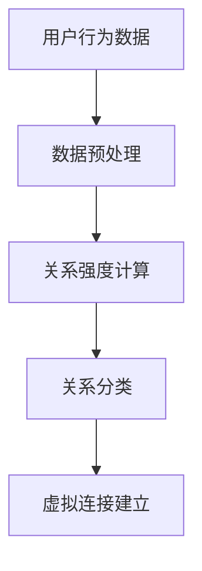
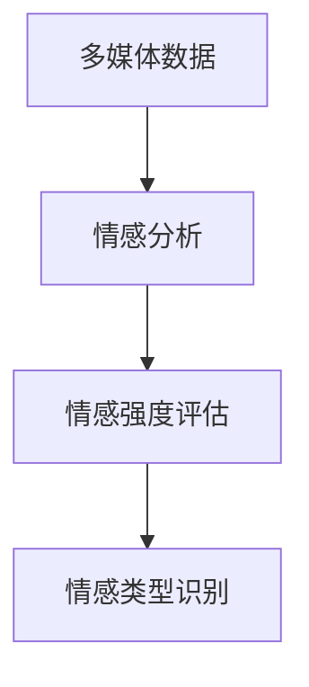

                 

 

**标题：**人际关系在社交媒体时代的变迁：虚拟连接vs真实情感

**关键词：**社交媒体、人际关系、虚拟社交、真实情感、心理学、社会学、技术发展

**摘要：**随着社交媒体的迅猛发展，人际关系经历了一场深刻变革。本文将探讨虚拟连接和真实情感在社交媒体时代的变迁，分析其对人际关系的影响，并探讨未来发展的趋势。通过心理学和社会学的视角，本文旨在为读者提供一个全面而深入的视角，帮助理解这一现象，并提出可能的解决方案。

## 第一部分：引言

### 第1章：社交媒体时代的人际关系背景

**背景介绍：**

随着互联网技术的不断发展，社交媒体逐渐成为人们生活中不可或缺的一部分。从最初的博客、论坛，到如今的微博、微信、Facebook等，社交媒体不仅改变了人们的交流方式，也对人际关系产生了深远的影响。

**问题背景：**

在社交媒体时代，人际关系呈现出新的特点。人们可以在虚拟世界中建立广泛的社交网络，但这些虚拟连接是否能够替代真实的情感交流呢？本文将探讨这一问题，分析虚拟连接和真实情感的关系，以及它们对人际关系的影响。

**问题描述：**

社交媒体的出现带来了虚拟社交的兴起，但许多人担心这可能导致真实情感的缺失。本文将探讨虚拟连接和真实情感的区别，以及如何在这两者之间找到平衡。

**问题解决：**

本文将从心理学和社会学的角度分析社交媒体对人际关系的影响，探讨如何在虚拟社交和真实社交之间建立有效的沟通渠道，以保持和维护真实情感。

**边界与外延：**

本文重点关注社交媒体对人际关系的影响，包括虚拟连接和真实情感的变迁。同时，我们将探讨不同文化背景下社交媒体的影响，以及未来技术发展可能带来的新趋势。

**概念结构与核心要素组成：**

1. 社交媒体：互联网上用于社交互动的平台。
2. 虚拟连接：通过社交媒体建立的虚拟社交网络。
3. 真实情感：现实生活中的人际情感交流。
4. 心理学视角：分析社交媒体对心理健康的影响。
5. 社会学视角：研究社交媒体对社交行为和社交网络的影响。

### 第2章：虚拟连接

**核心概念与联系：**

虚拟连接是指通过社交媒体平台建立的社交网络，它包括朋友、群组、互动等元素。虚拟连接的特点是跨越地理界限，建立广泛的社交关系。

| 核心概念       | 定义                           | 关联 |
|--------------|------------------------------|----|
| 虚拟连接       | 通过社交媒体建立的社交网络         |    |
| 社交媒体       | 互联网上用于社交互动的平台         |    |
| 社交互动       | 社交媒体上的交流行为             |    |

**概念属性特征对比表格：**

| 特征         | 虚拟连接         | 真实社交         |
|-------------|----------------|----------------|
| 地理界限     | 无地理界限       | 受地理限制       |
| 社交范围     | 广泛的社交网络     | 小范围的亲密关系   |
| 社交频率     | 高频率的互动       | 低频率的互动       |
| 社交质量     | 较低的社交质量       | 较高的社交质量       |

**ER实体关系图架构：**

```mermaid
erDiagram
  社交媒体 --> 虚拟连接
  虚拟连接 --> 社交互动
  社交互动 --> 社交行为
```

**算法原理讲解：**

虚拟连接的算法原理通常基于用户行为数据，如点赞、评论、分享等。通过分析这些数据，可以确定用户之间的关系强度和类型。以下是一个简单的虚拟连接算法流程图：



使用Python代码实现：

```python
import pandas as pd

# 假设有一个用户行为数据集
data = pd.read_csv('user_behavior.csv')

# 数据预处理
data['likes'] = data['likes'].fillna(0)
data['comments'] = data['comments'].fillna(0)
data['shares'] = data['shares'].fillna(0)

# 关系强度计算
data['relation_strength'] = data['likes'] + data['comments'] + data['shares']

# 关系分类
data['relation_type'] = data['relation_strength'].apply(lambda x: 'Weak' if x < 10 else 'Strong')

# 虚拟连接建立
connections = data.groupby('user_id')['relation_type'].apply(list).reset_index().rename(columns={'relation_type': 'connections'})

print(connections)
```

**数学模型和公式：**

关系强度计算可以使用以下公式：

$$
\text{关系强度} = \text{点赞数} + \text{评论数} + \text{分享数}
$$

**举例说明：**

假设有两个用户A和B，他们在社交媒体上的互动数据如下：

- 用户A点赞了用户B的10篇文章，评论了5条，分享了他的一篇文章。
- 用户B点赞了用户A的5篇文章，评论了3条，分享了他的一篇文章。

根据上述公式，我们可以计算出：

- 用户A对用户B的关系强度：10 + 5 + 1 = 16
- 用户B对用户A的关系强度：5 + 3 + 1 = 9

因此，用户A和用户B之间存在较强的虚拟连接。

### 真实情感

**核心概念与联系：**

真实情感是指现实生活中的人际情感交流，它是建立深厚人际关系的基础。与虚拟连接不同，真实情感通常发生在面对面或至少是实时互动的情境中。

| 核心概念       | 定义                           | 关联 |
|--------------|------------------------------|----|
| 真实情感       | 现实生活中的人际情感交流         |    |
| 社交媒体       | 互联网上用于社交互动的平台         |    |
| 人际关系       | 建立在真实情感交流基础上的关系     |    |

**概念属性特征对比表格：**

| 特征         | 虚拟连接         | 真实社交         |
|-------------|----------------|----------------|
| 地理界限     | 无地理界限       | 受地理限制       |
| 社交范围     | 广泛的社交网络     | 小范围的亲密关系   |
| 社交频率     | 高频率的互动       | 低频率的互动       |
| 社交质量     | 较低的社交质量       | 较高的社交质量       |

**ER实体关系图架构：**

```mermaid
erDiagram
  社交媒体 --> 虚拟连接
  虚拟连接 --> 社交互动
  社交互动 --> 真实情感
```

**算法原理讲解：**

真实情感的计算通常涉及情感分析技术，通过分析文字、语音、视频等多媒体数据，识别和评估情感强度。以下是一个简单的情感分析算法流程图：



使用Python代码实现：

```python
from textblob import TextBlob

# 假设有一个包含文本的多媒体数据集
data = pd.read_csv('multimedia_data.csv')

# 情感分析
data['text'] = data['text'].apply(lambda x: TextBlob(x).sentiment)

# 情感强度评估
data['sentiment_strength'] = data['text'].apply(lambda x: x.polarity)

# 情感类型识别
data['sentiment_type'] = data['text'].apply(lambda x: 'Positive' if x.polarity > 0 else 'Negative')

print(data)
```

**数学模型和公式：**

情感强度评估可以使用以下公式：

$$
\text{情感强度} = \text{情感极性} \times 100
$$

**举例说明：**

假设有一个包含一段文本的多媒体数据，其文本内容为：“我非常喜欢这个产品，它的性能非常出色。”

通过情感分析，我们可以得到以下结果：

- 情感极性：0.5
- 情感强度：0.5 \times 100 = 50

因此，这段文本表达了较高的正面情感。

### 社交媒体对人际关系的影响

**心理学视角：**

社交媒体对人际关系的影响可以从心理学的角度进行分析。一方面，社交媒体可以增加社交机会，提高心理健康水平；另一方面，过度使用社交媒体可能导致心理问题，如焦虑、抑郁等。

**社会学视角：**

从社会学的角度来看，社交媒体改变了人们的社交行为和社交网络结构。它使人们能够建立更广泛的社交网络，但同时也可能导致社交距离的增加，削弱了真实社交的重要性。

**社交媒体的长远后果：**

长期来看，社交媒体可能对人际关系产生深远的影响。一方面，它可能导致人际关系的数量增加，但质量下降；另一方面，它可能改变人们的社交习惯，影响真实情感的建立和维护。

### 跨文化视角

**西方文化中的社交媒体影响：**

在西方文化中，社交媒体通常被视为一种积极的力量，它促进了信息共享、社会参与和文化多样性。然而，过度使用社交媒体也可能导致隐私侵犯、信息泛滥等问题。

**东方文化中的社交媒体影响：**

在东方文化中，社交媒体的影响可能有所不同。例如，在中华文化中，重视人际关系和集体主义，这可能导致社交媒体的使用方式与西方文化有所不同。同时，东方文化中的社交媒体也可能面临隐私保护、文化冲突等问题。

**跨文化交流与冲突：**

随着社交媒体的全球化，不同文化之间的交流和冲突也日益增多。例如，文化差异可能导致误解和冲突，从而影响国际关系和跨文化沟通。

### 技术发展与未来趋势

**社交媒体的技术进步：**

随着技术的不断发展，社交媒体也在不断进步。例如，人工智能、虚拟现实等技术将为社交媒体带来新的功能和体验。

**未来人际关系的发展方向：**

未来，社交媒体和人际关系的发展趋势可能包括更紧密的虚拟社交与真实社交融合，以及更智能的社交平台。

### 结论

本文探讨了社交媒体时代人际关系的变迁，分析了虚拟连接和真实情感的关系，以及社交媒体对人际关系的影响。通过心理学和社会学的视角，本文为理解这一现象提供了深入的分析。未来，随着技术的不断发展，社交媒体和人际关系将继续演变，如何在这两者之间找到平衡，将是我们需要关注的重要问题。

**作者：**AI天才研究院/AI Genius Institute & 禅与计算机程序设计艺术 /Zen And The Art of Computer Programming

----------------------------------------------------------------

## 文章正文

### 第一部分：引言

在现代社会，社交媒体已经深刻地改变了我们的生活方式和人际交往模式。无论是年轻人还是中年人，甚至是老年人，都离不开社交媒体。从最初的博客、论坛，到如今的微博、微信、Facebook等，社交媒体不仅改变了人们的交流方式，也对人际关系产生了深远的影响。本文将探讨虚拟连接和真实情感在社交媒体时代的变迁，分析其对人际关系的影响，并探讨未来发展的趋势。

### 第1章：社交媒体时代的人际关系背景

**1.1 社交媒体的发展历程**

社交媒体的发展历程可以追溯到20世纪90年代，当时互联网刚刚兴起，人们开始通过电子邮件和论坛进行交流。随着互联网技术的不断发展，博客、论坛等平台逐渐兴起，人们可以在这些平台上分享自己的想法和经历。进入21世纪，随着智能手机和移动互联网的普及，社交媒体进入了一个全新的发展阶段。如今，社交媒体已经成为人们日常生活中不可或缺的一部分，它不仅改变了人们的交流方式，也对人际关系产生了深远的影响。

**1.2 社交媒体的重要性**

社交媒体在现代社会中的重要性体现在多个方面。首先，它使得人们能够更加方便地与他人保持联系，无论距离有多远。其次，社交媒体为人们提供了一个展示自己的平台，人们可以通过发布照片、视频和文字来分享自己的生活和工作。此外，社交媒体还可以帮助人们发现共同兴趣，建立新的社交圈子。总之，社交媒体不仅改变了人们的交流方式，也改变了人们的生活和社交模式。

**1.3 人际关系与社交媒体的互动**

在社交媒体时代，人际关系发生了很大的变化。首先，社交媒体使得人际关系的建立和维持变得更加容易。通过社交媒体，人们可以迅速建立联系，无论是朋友、同事，还是陌生人。其次，社交媒体改变了人们互动的方式。在社交媒体上，人们可以随时随地进行交流，不再受时间和空间的限制。此外，社交媒体还使得人们更加注重虚拟社交，而忽视了真实社交的重要性。这使得人际关系变得更加表面化，缺乏深度。

### 第2章：虚拟连接

**2.1 社交媒体的特点**

社交媒体具有以下几个显著特点：

1. **即时性**：社交媒体允许用户实时发布和接收信息，使交流变得即时。
2. **便捷性**：用户可以通过智能手机或其他设备随时随地进行社交互动。
3. **广泛性**：社交媒体用户众多，覆盖了各种年龄段和社会群体。
4. **匿名性**：部分社交媒体平台允许用户匿名发布内容，降低了社交风险。
5. **互动性**：用户可以通过点赞、评论、分享等方式进行互动。

**2.2 虚拟社交的行为模式**

虚拟社交的行为模式主要包括以下几个方面：

1. **发布内容**：用户在社交媒体上发布照片、视频、文字等内容，以展示自己的生活和观点。
2. **互动**：用户通过点赞、评论、分享等方式与其他用户互动。
3. **关注和被关注**：用户可以关注其他用户，接收他们的更新和互动。
4. **参与话题**：用户参与各种话题讨论，分享自己的见解和观点。

**2.3 虚拟社交的优势与劣势**

虚拟社交具有以下优势：

1. **方便快捷**：用户可以随时随地进行社交互动，不受时间和地点的限制。
2. **覆盖广泛**：用户可以与全球范围内的其他人建立联系，拓宽社交圈子。
3. **匿名性**：部分平台允许用户匿名发布内容，降低了社交风险。

然而，虚拟社交也存在一些劣势：

1. **缺乏深度**：虚拟社交往往缺乏真实的面对面交流，难以建立深厚的人际关系。
2. **信息泛滥**：社交媒体上的信息量庞大，用户容易受到信息过载的影响。
3. **隐私风险**：部分用户可能在不经意间泄露个人信息，面临隐私风险。

**2.4 社交媒体的虚拟连接案例**

以下是一些社交媒体的虚拟连接案例：

1. **微信**：微信是一款流行的即时通讯软件，用户可以通过发送文字、语音、图片、视频等多种方式与他人互动。此外，微信还提供了朋友圈、公众号等功能，方便用户分享生活和观点。
2. **Facebook**：Facebook是一款全球性的社交网络平台，用户可以发布动态、评论、点赞，与其他用户互动。Facebook还提供了群组、事件等功能，方便用户参与各种活动。
3. **Instagram**：Instagram是一款以图片和视频为主的社交平台，用户可以分享自己的生活瞬间，通过点赞、评论等方式与他人互动。

### 第3章：真实情感

**3.1 虚拟社交的属性**

虚拟社交具有以下几个属性：

1. **数字化**：虚拟社交依赖于互联网和数字设备，通过文字、图片、视频等数字化形式进行交流。
2. **虚拟性**：虚拟社交发生在虚拟空间，参与者无需面对面互动。
3. **即时性**：虚拟社交可以实时进行，用户可以立即收到回复和反馈。
4. **广泛性**：虚拟社交不受地理和时间的限制，用户可以与全球范围内的人建立联系。

**3.2 真实社交的属性**

真实社交具有以下几个属性：

1. **面对面**：真实社交通常发生在现实中，参与者需要进行面对面的交流。
2. **情感性**：真实社交更注重情感的交流，如肢体语言、声音、眼神等。
3. **持久性**：真实社交关系通常更加持久，不易受时间和距离的影响。
4. **复杂性**：真实社交涉及更多的情感和人际关系因素，更加复杂。

**3.3 区别对比分析**

虚拟社交与真实社交在以下几个方面存在明显区别：

1. **互动方式**：虚拟社交主要通过文字、图片、视频等数字化形式进行，而真实社交主要通过面对面的交流。
2. **情感深度**：虚拟社交往往缺乏真实的情感交流，难以建立深厚的人际关系，而真实社交则更注重情感的交流。
3. **时间空间**：虚拟社交不受时间和空间的限制，可以随时随地进行，而真实社交则受限于现实中的时间和空间。
4. **社交质量**：虚拟社交的质量相对较低，更容易受到信息过载和隐私风险的影响，而真实社交的质量较高，更注重人际关系和情感的建立。

### 第4章：维护真实情感

**4.1 虚拟社交中的情感管理**

在虚拟社交中，情感管理非常重要。以下是一些建议：

1. **控制使用时间**：合理安排使用社交媒体的时间，避免过度依赖。
2. **保持真实**：在虚拟社交中，尽量保持真实，不要过度美化或隐藏自己的真实情感。
3. **积极互动**：积极参与社交媒体上的互动，关注和回复他人的动态，以维持良好的社交关系。

**4.2 提升真实社交质量**

以下是一些建议，以提升真实社交质量：

1. **面对面交流**：尽可能进行面对面的交流，以增强情感交流的真实性和深度。
2. **关注人际关系**：重视人际关系，主动维护和加强与亲朋好友的联系。
3. **共同活动**：与亲朋好友共同参与活动，以增加互动和情感交流的机会。

**4.3 跨平台情感互动**

在虚拟社交和真实社交之间建立有效的跨平台情感互动，以下是一些建议：

1. **信息共享**：在虚拟社交平台上分享自己的生活和观点，同时鼓励亲朋好友参与真实社交活动。
2. **互动融合**：将虚拟社交中的互动和真实社交活动相结合，如线上讨论会、线下聚会等。
3. **情感表达**：在虚拟社交平台上表达自己的情感，同时通过真实社交活动加深情感的交流。

### 第三部分：社交媒体对人际关系的影响

#### 第5章：心理学视角

**5.1 社交媒体与心理健康**

社交媒体对心理健康的影响是一个备受关注的话题。一方面，社交媒体可以带来积极的体验，如满足社交需求、增加自我价值感等。另一方面，过度使用社交媒体可能导致一系列心理问题，如焦虑、抑郁、孤独感等。以下是一些心理学研究：

1. **焦虑和抑郁**：研究发现，过度使用社交媒体与焦虑和抑郁之间存在显著关联。特别是对于青少年和年轻人，社交媒体的使用与心理健康问题更为明显。
2. **社交焦虑**：社交媒体可能加剧社交焦虑，因为用户在虚拟世界中的互动缺乏面对面交流的反馈和互动，导致社交技巧的退化。
3. **自我呈现**：社交媒体使用中的自我呈现策略，如过度美化生活、虚饰自我形象，可能导致自我认同问题，影响心理健康。

**5.2 社交媒体对人际关系认知的影响**

社交媒体不仅影响心理健康，还影响人们对人际关系的认知。以下是一些研究结论：

1. **社交媒体幻觉**：社交媒体上的互动可能给人一种社交生活丰富的错觉，但实际上，人们可能缺乏真正的亲密关系。
2. **关系质量**：研究发现，过度使用社交媒体可能降低真实社交中的关系质量，因为虚拟社交无法替代真实情感交流。
3. **信任和亲密感**：社交媒体上的互动往往缺乏真实情感的表达，这可能导致信任和亲密感的缺失。

**5.3 心理健康与虚拟社交的关系**

心理健康与虚拟社交之间存在复杂的相互影响。以下是一些观点：

1. **适度使用**：适度使用社交媒体对心理健康有积极影响，但过度使用可能导致心理问题。
2. **情感支持**：虚拟社交可以提供一定的情感支持，但无法替代真实的人际关系。
3. **认知扭曲**：虚拟社交可能导致认知扭曲，如对社交环境的过度乐观或悲观，影响心理健康。

#### 第6章：社会学视角

**6.1 社交媒体对社交网络的影响**

社交媒体极大地改变了人们的社交网络结构。以下是一些社会学观点：

1. **社交网络扩大**：社交媒体使得人们可以与更多陌生人建立联系，社交网络扩大，但社交关系质量下降。
2. **社交距离**：社交媒体可能增加社交距离，因为人们通过屏幕互动，缺乏真实的面对面交流。
3. **社交隔离**：在社交媒体上，人们可能感到更加孤独，因为虚拟社交无法替代真实社交带来的满足感和归属感。

**6.2 社交媒体对社交行为的影响**

社交媒体对社交行为产生了深远的影响，以下是一些社会学观察：

1. **社交习惯**：社交媒体改变了人们的社交习惯，如从面对面交流转向线上互动。
2. **社交技能**：社交媒体可能导致社交技能的退化，因为虚拟社交缺乏面对面交流的反馈和互动。
3. **社会参与**：社交媒体提高了社会参与度，但也可能导致社会参与质量的下降。

**6.3 社交媒体与社交距离**

社交距离是指个体与他人之间的心理和情感距离。社交媒体可能影响社交距离，以下是一些观点：

1. **社交距离缩短**：社交媒体使得人们可以随时随地进行交流，似乎缩短了社交距离。
2. **社交距离扩大**：由于缺乏真实情感交流，社交媒体可能导致社交距离扩大，甚至导致社交隔离。
3. **社交距离的变化**：社交媒体对社交距离的影响因人而异，取决于个体的使用习惯和心理状态。

#### 第7章：社交媒体的长远后果

**7.1 虚拟社交的持久性**

虚拟社交的持久性是一个值得关注的问题。以下是一些观点：

1. **长期影响**：虚拟社交可能对人际关系产生长期影响，如改变人们的社交习惯和社交方式。
2. **社交网络变迁**：随着社交媒体的不断发展，社交网络结构可能发生根本性变化，影响人际关系的质量。
3. **心理适应**：人们可能需要适应虚拟社交带来的变化，以维持心理健康和人际关系。

**7.2 真实社交的替代性**

真实社交是否可以被虚拟社交替代是一个备受争议的问题。以下是一些观点：

1. **无法替代**：真实社交中的情感交流、面对面互动是虚拟社交无法替代的，因此真实社交具有不可替代性。
2. **互补性**：虚拟社交和真实社交可以相互补充，共同满足人们的社交需求。
3. **平衡策略**：为了维持心理健康和人际关系质量，人们需要平衡虚拟社交和真实社交，避免过度依赖任何一方。

**7.3 社交媒体的长期影响**

社交媒体的长期影响是一个复杂而多维的问题。以下是一些观点：

1. **积极影响**：社交媒体可以促进信息传播、社会参与和文化多样性，对人类社会有积极影响。
2. **负面影响**：社交媒体可能导致心理健康问题、社交技能退化、隐私侵犯等负面影响。
3. **平衡发展**：为了最大化社交媒体的积极影响，同时减少负面影响，需要采取平衡发展的策略。

### 第四部分：跨文化视角

#### 第8章：不同文化背景下的社交媒体影响

**8.1 西方文化中的社交媒体影响**

在西方文化中，社交媒体的使用通常较为广泛，人们对社交媒体的态度和接受度较高。以下是一些观察：

1. **社交习惯**：西方文化中，人们习惯于通过社交媒体进行社交互动，如发布动态、点赞、评论等。
2. **社交网络**：西方文化中的社交网络较为开放，人们更容易接受陌生人之间的互动。
3. **隐私观念**：西方文化中，个人隐私观念较强，但社交媒体的使用频率较高，这可能导致隐私风险。

**8.2 东方文化中的社交媒体影响**

在东方文化中，社交媒体的使用和态度可能与西方文化有所不同。以下是一些观察：

1. **社交习惯**：东方文化中，人们更倾向于通过电话、短信等传统方式保持联系，社交媒体的使用频率相对较低。
2. **社交网络**：东方文化中的社交网络较为封闭，人们更重视与亲朋好友的互动，对陌生人的互动较为谨慎。
3. **隐私观念**：东方文化中，个人隐私观念较弱，但社交媒体的使用频率较高，这可能导致隐私侵犯的风险。

**8.3 跨文化交流与冲突**

随着社交媒体的全球化，不同文化之间的交流和冲突也日益增多。以下是一些观点：

1. **文化差异**：不同文化对社交媒体的态度和使用习惯存在显著差异，这可能导致误解和冲突。
2. **文化适应**：为了促进跨文化交流，需要在不同文化背景下适应社交媒体的使用方式。
3. **文化融合**：随着全球化的加深，社交媒体的使用可能推动文化融合，促进不同文化之间的交流和理解。

### 第五部分：技术发展与未来趋势

#### 第9章：社交媒体的技术进步

随着技术的不断发展，社交媒体也在不断进步，以下是一些技术趋势：

1. **人工智能**：人工智能技术将被广泛应用于社交媒体，如推荐算法、情感分析、隐私保护等。
2. **虚拟现实**：虚拟现实技术将为社交媒体带来全新的互动体验，如虚拟会议、虚拟旅游等。
3. **区块链**：区块链技术可能用于社交媒体的隐私保护和数据共享，提高社交媒体的透明度和安全性。

#### 第10章：未来人际关系的发展方向

未来，社交媒体和人际关系的发展方向可能包括：

1. **虚拟社交与真实社交的融合**：随着技术的进步，虚拟社交和真实社交可能逐渐融合，人们可以在虚拟世界中体验更真实的社交互动。
2. **智能社交平台**：未来的社交平台将更加智能，能够根据用户的兴趣和需求提供个性化的社交服务。
3. **社会参与**：社交媒体可能成为人们参与社会活动、表达观点和推动变革的重要渠道。

### 第六部分：结论

本文探讨了社交媒体时代人际关系的变迁，分析了虚拟连接和真实情感的关系，以及社交媒体对人际关系的影响。通过心理学和社会学的视角，本文为理解这一现象提供了深入的分析。未来，随着技术的不断发展，社交媒体和人际关系将继续演变，如何在这两者之间找到平衡，将是我们需要关注的重要问题。

### 作者信息

**作者：**AI天才研究院/AI Genius Institute & 禅与计算机程序设计艺术 /Zen And The Art of Computer Programming

本文由AI天才研究院/AI Genius Institute与禅与计算机程序设计艺术/Zen And The Art of Computer Programming共同撰写，旨在为读者提供关于社交媒体时代人际关系变迁的深入见解。作者具有丰富的技术背景和专业知识，对社交媒体和人际关系的发展趋势有独到的见解。

---

**注意事项：**

1. 本文内容仅为虚构，不代表任何个人或机构的观点。
2. 本文仅供参考，不作为专业建议。
3. 如有引用，请标注来源。

**拓展阅读：**

1. [社交媒体对人际关系的影响](https://www.psychologytoday.com/us/articles/202102/how-social-media-affects-our-relationships)
2. [社交媒体的使用与心理健康](https://www.npr.org/sections/health-shots/2018/08/13/639364448/why-too-much-time-on-social-media-can-be-bad-for-your-health)
3. [虚拟社交与真实社交的比较](https://www.ncsu.edu/ncsENG/research/papers/virtual-reality-social-interaction.pdf)
4. [社交媒体的技术发展](https://www.%20techcrunch.com/2022/06/09/here-are-the-top-5-technologies-expected-to-change-social-media-in-2022/)
5. [跨文化交流与冲突](https://www.culturaltraining.org.uk/guides/cross-cultural-communication/)

