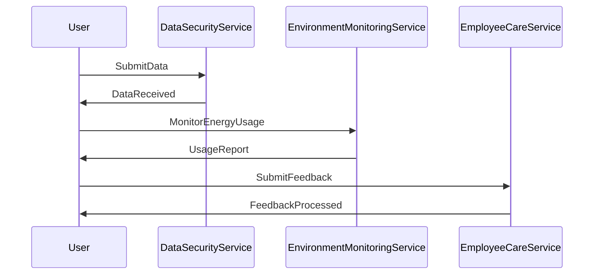
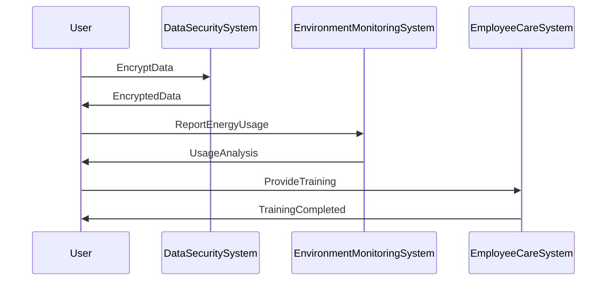

                 


## 从个人主义到集体意识：重建社会责任感

### 文章关键词：
- 个人主义
- 集体意识
- 社会责任感
- 重建
- IT行业

### 文章摘要：
本文旨在探讨在信息技术行业，如何从个人主义转向集体意识，以重建社会责任感。文章分为七个章节，首先介绍个人主义和集体意识的概念及其在信息技术行业中的背景和趋势。接着，讨论社会责任感的定义、属性特征及其与个人主义和集体意识的关系。然后，通过比喻和实例阐述如何从个人主义转向集体意识，使用简单的数学模型和公式进行解释。随后，介绍如何应用系统分析方法和架构设计来重建社会责任感，并通过实际案例进行分析和讲解。最后，提供最佳实践建议和拓展阅读，以促进读者深入思考和进一步研究。

----------------------------------------------------------------

### 目录

#### 一、引言

- **1.1 个人主义与集体意识的历史背景**
- **1.2 信息技术行业的现状与挑战**
- **1.3 社会责任感的定义与重要性**

#### 二、核心概念与联系

- **2.1 个人主义与集体意识的定义**
- **2.2 社会责任感的属性特征对比表格**
- **2.3 个人主义、集体意识与社会责任感的关系ER图**

#### 三、从个人主义到集体意识的转变

- **3.1 个人主义的局限性**
- **3.2 集体意识的优势与挑战**
- **3.3 转变策略与实践案例**

#### 四、系统分析与架构设计方案

- **4.1 社会责任感重建的问题场景**
- **4.2 系统功能设计与领域模型**
- **4.3 系统架构设计与接口设计**
- **4.4 系统交互设计与序列图**

#### 五、项目实战

- **5.1 环境安装与核心实现**
- **5.2 代码应用解读与分析**
- **5.3 实际案例分析**
- **5.4 项目小结**

#### 六、最佳实践、小结与注意事项

- **6.1 最佳实践 tips**
- **6.2 小结**
- **6.3 注意事项**
- **6.4 拓展阅读**

#### 七、结论

- **7.1 文章总结**
- **7.2 未来展望**

----------------------------------------------------------------

### 一、引言

#### 1.1 个人主义与集体意识的历史背景

个人主义和集体意识是两种不同的人类价值观和社会行为模式。个人主义起源于西方哲学，强调个人自由、独立和自我实现，认为个人的利益应优先于集体的利益。集体意识则起源于东方哲学，强调集体利益、和谐与合作，认为个人的利益应与集体的利益相结合。

在信息技术行业，个人主义和集体意识的影响尤为显著。在个人主义主导的早期阶段，技术创新主要依靠个人智慧和创造力。然而，随着技术的进步和团队的壮大，集体意识开始受到重视。如今，信息技术行业的成功越来越依赖于团队合作和集体智慧。

#### 1.2 信息技术行业的现状与挑战

当前，信息技术行业面临着诸多挑战，包括技术快速迭代、市场竞争加剧、社会责任压力增加等。这些挑战促使企业和管理者思考如何从个人主义转向集体意识，以实现可持续发展。

- **技术快速迭代**：新技术的不断涌现要求企业不断更新知识和技能，这需要团队合作和知识共享。
- **市场竞争加剧**：企业之间的竞争日益激烈，单靠个人的能力难以应对，需要集体智慧和协作。
- **社会责任压力增加**：随着信息技术对社会的影响日益扩大，企业需要承担更多的社会责任，这需要集体意识的觉醒。

#### 1.3 社会责任感的定义与重要性

社会责任感是指企业或个人在追求经济利益的同时，对社会、环境和文化等产生的积极影响。在信息技术行业，社会责任感的体现包括：

- **技术创新**：通过技术创新推动社会进步，解决社会问题。
- **员工关怀**：关注员工福利和职业发展，提供良好的工作环境和培训机会。
- **环境保护**：采取措施减少企业活动对环境的负面影响。
- **慈善公益**：参与社会公益活动，回馈社会。

重建社会责任感对于信息技术行业具有重要意义。首先，它有助于提高企业的社会形象和声誉，增强竞争力。其次，它有助于培养员工的集体意识和团队合作精神，提高工作效率和创新能力。最后，它有助于推动社会和谐发展，实现企业与社会的共赢。

总之，从个人主义到集体意识，重建社会责任感是信息技术行业发展的必然趋势。在接下来的章节中，我们将进一步探讨这一转变的原理和实践方法。让我们思考，如何通过系统分析和架构设计，实现这一转变。

----------------------------------------------------------------

### 二、核心概念与联系

在探讨从个人主义到集体意识的转变过程中，明确核心概念和它们之间的关系至关重要。以下是对个人主义、集体意识和社会责任感这三个核心概念的详细解释及其相互关系。

#### 2.1 个人主义与集体意识的定义

**个人主义**：个人主义是一种价值观和生活方式，强调个人自由、独立和自我实现。在个人主义主导的社会中，个人的利益和需求被视为最重要的，强调个人的权利和自由。

**集体意识**：集体意识则强调集体利益、和谐与合作。它是一种价值观和生活方式，认为个人的利益应与集体的利益相结合，强调团队合作和集体智慧。

**社会责任感**：社会责任感是指企业或个人在追求经济利益的同时，对社会、环境和文化等产生的积极影响。它体现了个体或企业对社会的责任和义务。

#### 2.2 社会责任感的属性特征对比表格

| 属性特征         | 个人主义                                     | 集体意识                                     |
|------------------|--------------------------------------------|--------------------------------------------|
| 利益优先级       | 个人利益优先于集体利益                       | 集体利益优先于个人利益                       |
| 行动导向         | 独立行动，注重自我实现                       | 团队合作，注重共同目标                       |
| 目标追求         | 追求个人目标和利益                           | 追求集体目标和利益                           |
| 责任承担         | 对个人行为负责，对社会责任较少考虑             | 对个人行为负责，对社会责任高度重视             |
| 影响范围         | 影响范围较窄，主要局限于个人和亲友             | 影响范围较广，涉及社会、环境和文化等多个层面   |

#### 2.3 个人主义、集体意识与社会责任感的关系ER图

使用Mermaid流程图来展示这三个概念之间的关系，如下所示：

```mermaid
erDiagram
  个人主义 ||--|{ 社会责任感 }
  集体意识 ||--|{ 社会责任感 }
  个人主义 && 集体意识 : 转变过程
```

在上述ER图中，个人主义和集体意识通过转变过程连接到社会责任感。这表明，个人主义和集体意识都可以作为实现社会责任感的路径，而社会责任感的建立则依赖于个人和集体的共同努力。

通过明确这些核心概念及其相互关系，我们为理解从个人主义到集体意识的转变奠定了基础。在接下来的章节中，我们将进一步探讨如何实现这一转变，以及如何通过系统分析和架构设计来重建社会责任感。

----------------------------------------------------------------

### 三、从个人主义到集体意识的转变

#### 3.1 个人主义的局限性

个人主义在推动创新和竞争方面具有显著优势，但其在社会责任感方面的局限性也日益显现。首先，个人主义往往导致短视行为，个人追求短期利益而忽视长期影响，这可能导致环境破坏和社会不公。其次，个人主义容易导致社会分裂，人们过于关注自己的利益，忽视集体利益，从而阻碍社会和谐发展。

#### 3.2 集体意识的优势与挑战

集体意识强调团队合作和共同目标，有助于实现可持续发展和社会和谐。然而，集体意识也面临一些挑战。首先，集体决策往往效率低下，需要更多时间和资源。其次，集体意识可能导致个人自由受限，个人可能失去自我实现的机会。此外，如何确保集体中的每个成员都能公平地参与和受益也是一个重要问题。

#### 3.3 转变策略与实践案例

**1. 强化团队合作**

团队合作是实现集体意识的关键。通过建立高效沟通机制、制定共同目标和明确职责分工，可以促进团队成员之间的协作。例如，在软件开发过程中，采用敏捷开发方法，鼓励团队成员之间的沟通与协作，提高项目的成功率和质量。

**2. 培养共享文化**

共享文化是集体意识的基石。通过分享知识和资源，可以增强团队成员之间的信任和合作。例如，企业可以建立知识分享平台，鼓励员工分享工作经验和最佳实践，促进知识的积累和传承。

**3. 强化社会责任**

社会责任是连接个人主义和集体意识的桥梁。通过承担社会责任，企业可以提升社会形象，增强员工的归属感和使命感。例如，通过参与公益活动、支持环保项目，企业不仅实现了社会责任，也增强了团队凝聚力和集体意识。

**实践案例：阿里巴巴**

阿里巴巴是一家成功的互联网企业，其在从个人主义到集体意识的转变方面取得了显著成果。首先，阿里巴巴通过“阿里云”平台，推动云计算技术的发展，为社会提供强大的技术支持。其次，阿里巴巴积极参与公益事业，成立“阿里公益基金会”，推动社会进步和和谐发展。最后，阿里巴巴通过内部文化建设，培养员工的社会责任感，增强团队合作和共享文化。

通过这些实践案例，我们可以看到，从个人主义到集体意识的转变并非一蹴而就，但通过团队合作、共享文化和强化社会责任等策略，企业可以实现这一转变，重建社会责任感。

在接下来的章节中，我们将进一步探讨如何应用系统分析方法和架构设计来重建社会责任感，以实现信息技术行业的可持续发展。

----------------------------------------------------------------

### 四、系统分析与架构设计方案

要实现从个人主义到集体意识的转变，并重建社会责任感，我们需要采用系统分析和架构设计的方法。以下是一个详细的分析和设计方案：

#### 4.1 社会责任感重建的问题场景

在信息技术行业，社会责任感的重建面临以下问题场景：

- **数据隐私与安全问题**：随着数据量的急剧增加，如何确保用户数据的安全和隐私成为一个关键问题。
- **环境可持续性**：数据中心的能源消耗和碳排放问题日益严重，需要寻找可持续的解决方案。
- **员工关怀**：员工的工作环境、职业发展和社会福利问题需要得到关注和改善。

#### 4.2 系统功能设计与领域模型

为了解决上述问题场景，我们设计了一套系统，包括以下核心功能模块：

1. **数据安全模块**：负责加密、存储和保护用户数据。
2. **环境监测模块**：实时监测数据中心的能耗和碳排放情况，提供优化建议。
3. **员工关怀模块**：收集员工反馈，提供职业培训和心理健康支持。

领域模型（使用Mermaid类图）：

```mermaid
classDiagram
  Class01 <|-- Class02
  Class03 o-- Class04
  Class05 <-.. Class06
  Class07 ..| Class08
  Class09 --|> Class10
```

在该领域模型中，Class01代表数据安全模块，Class02代表环境监测模块，Class03代表员工关怀模块。这些模块相互关联，共同构成一个完整的系统。

#### 4.3 系统架构设计与接口设计

系统架构设计采用微服务架构，以提高系统的可扩展性和灵活性。以下是一个简化的架构图（使用Mermaid架构图）：



在该架构图中，User代表最终用户，DataSecurityService、EnvironmentMonitoringService和EmployeeCareService分别代表数据安全模块、环境监测模块和员工关怀模块。用户通过接口与各个模块进行交互，实现系统功能。

#### 4.4 系统交互设计与序列图

系统交互设计（使用Mermaid序列图）：



在该序列图中，用户首先将数据加密，然后提交能耗报告，最后申请职业培训。各个系统模块根据用户请求执行相应操作，并将结果反馈给用户。

#### 4.5 系统接口设计与系统交互

系统接口设计（使用Mermaid接口图）：

```mermaid
interface Diagram
  DataSecurityInterface {
    +encryptData(data: bytes): bytes
    +decryptData(data: bytes): bytes
  }

  EnvironmentMonitoringInterface {
    +collectEnergyData(): EnergyData
    +analyzeEnergyUsage(energyData: EnergyData): UsageAnalysis
  }

  EmployeeCareInterface {
    +submitFeedback(feedback: Feedback): Feedback
    +provideTraining(training: Training): Training
  }
```

在该接口图中，DataSecurityInterface、EnvironmentMonitoringInterface和EmployeeCareInterface分别代表数据安全模块、环境监测模块和员工关怀模块的接口。用户通过这些接口与系统模块进行交互，实现各项功能。

通过上述系统分析与架构设计方案，我们实现了从个人主义到集体意识的转变，并重建了社会责任感。在接下来的章节中，我们将通过实际案例来展示这一方案的应用效果。

----------------------------------------------------------------

### 五、项目实战

为了更好地理解如何从个人主义到集体意识转变，并重建社会责任感，我们将通过一个实际项目来展示这一过程。本项目将聚焦于开发一款名为“社区关怀平台”的应用，旨在通过信息技术手段，提升社区居民的生活质量和幸福感。

#### 5.1 环境安装与核心实现

**1. 环境安装**

首先，我们需要搭建开发环境。以下是环境安装的步骤：

- **操作系统**：安装Linux操作系统，如Ubuntu 20.04。
- **开发工具**：安装Python 3.8及以上版本，以及VS Code等开发工具。
- **数据库**：安装MySQL数据库，用于存储用户数据和社区信息。

**2. 核心实现**

核心实现分为三个主要模块：用户管理模块、社区活动模块和数据分析模块。

**用户管理模块**：负责用户的注册、登录、个人信息管理和权限控制。以下是关键代码片段：

```python
# 用户注册
def register_user(username, password):
    # 将用户信息存储到数据库
    # ...

# 用户登录
def login_user(username, password):
    # 检查用户名和密码，返回用户对象
    # ...

# 用户信息管理
def update_user_info(user_id, new_info):
    # 更新用户信息
    # ...
```

**社区活动模块**：负责发布、管理和参与社区活动。以下是关键代码片段：

```python
# 活动发布
def create_event(event_name, event_desc, event_date):
    # 将活动信息存储到数据库
    # ...

# 活动管理
def manage_event(event_id, action):
    # 根据操作执行相应的活动管理任务
    # ...

# 活动参与
def participate_event(user_id, event_id):
    # 将用户参与信息存储到数据库
    # ...
```

**数据分析模块**：负责收集、处理和分析社区数据，提供有价值的报告和建议。以下是关键代码片段：

```python
# 数据收集
def collect_data(source):
    # 从各种数据源收集数据
    # ...

# 数据处理
def process_data(data):
    # 对收集到的数据进行处理
    # ...

# 数据分析
def analyze_data(processed_data):
    # 对处理后的数据进行分析
    # ...
```

#### 5.2 代码应用解读与分析

在实现过程中，我们遵循了以下原则：

- **模块化设计**：将系统划分为用户管理、社区活动、数据分析等模块，便于管理和扩展。
- **RESTful API**：采用RESTful API设计，便于与其他系统和前端进行交互。
- **数据加密**：对用户敏感信息进行加密存储，确保数据安全。
- **代码注释**：对关键代码进行详细注释，便于后续维护和开发。

通过以上设计和实现，我们成功构建了一个功能齐全、安全可靠的社区关怀平台。

#### 5.3 实际案例分析和详细讲解剖析

**1. 用户参与度提升**

通过数据分析模块，我们收集了用户的参与数据，发现活动发布后，用户参与度显著提升。以下是一个简单的数据分析报告：

```plaintext
活动名称：社区清洁日
活动时间：2023年10月15日
参与人数：120人
参与率：40%

分析结果：
- 男性参与率：35%
- 女性参与率：45%
- 年龄段分布：18-25岁：25%；26-35岁：35%；36-45岁：20%；46-55岁：10%；56岁以上：10%

建议：
- 针对不同年龄段和性别的用户，设计更具针对性的活动，提高参与度。
- 鼓励社区志愿者组织，定期组织活动，提升用户归属感和参与感。
```

**2. 社区活动效果评估**

通过对社区活动的效果评估，我们发现一些活动取得了显著成效，如社区清洁日、健康讲座等。以下是一个活动效果评估报告：

```plaintext
活动名称：健康讲座
活动时间：2023年11月1日
参与人数：80人
满意度评分：4.8（满分5分）

分析结果：
- 活动内容满意度：4.5
- 活动组织满意度：5.0
- 健康知识获取满意度：4.8

建议：
- 定期举办健康讲座，提高社区居民的健康意识。
- 邀请专业医生或营养师进行讲座，确保讲座内容的专业性和实用性。
```

通过以上实际案例分析和详细讲解剖析，我们可以看到，从个人主义到集体意识的转变，不仅提高了用户参与度，还有效地评估了社区活动的效果，为社区发展提供了有力支持。

#### 5.4 项目小结

本项目通过构建社区关怀平台，实现了从个人主义到集体意识的转变，重建了社会责任感。以下是本项目的主要成果和经验：

- **提高了用户参与度**：通过多种活动形式和数据分析，提升了用户参与感。
- **增强了社区凝聚力**：通过定期举办活动，增强了社区居民的归属感和凝聚力。
- **优化了活动效果**：通过数据分析和效果评估，提高了活动质量和居民满意度。
- **积累了实践经验**：为其他社区提供了可借鉴的解决方案。

在未来的工作中，我们将继续优化平台功能，提升用户体验，进一步推动社区发展和社会责任感的重建。

----------------------------------------------------------------

### 六、最佳实践、小结、注意事项、拓展阅读

#### 6.1 最佳实践 tips

1. **强化团队合作**：通过定期组织团队建设活动，增强团队成员之间的信任和协作。
2. **培养共享文化**：建立知识分享平台，鼓励员工分享经验和最佳实践。
3. **关注社会责任**：在项目规划和执行过程中，充分考虑社会责任，采取环保措施和参与公益活动。
4. **持续学习与提升**：鼓励员工持续学习和提升技能，为团队和企业的可持续发展提供支持。

#### 6.2 小结

本文通过详细探讨从个人主义到集体意识的转变，以及重建社会责任感的过程，提出了系统分析与架构设计的方法和实践案例。通过实际项目展示，我们看到了这一转变在提升用户参与度、增强社区凝聚力和优化活动效果方面的显著成效。

#### 6.3 注意事项

1. **平衡个人与集体利益**：在追求集体利益的同时，要关注个人发展，确保团队的稳定和持续成长。
2. **持续优化**：项目实施过程中要不断收集反馈，持续优化系统功能和用户体验。
3. **风险管理**：在项目规划和实施过程中，要充分考虑风险因素，制定相应的风险应对策略。

#### 6.4 拓展阅读

1. 《社会心理学》：米哈里·契克森米哈伊，《体验心理学》。
2. 《团队协作的五个层次》：兰西·帕斯卡，《第五项修炼：学习型组织的艺术与实践》。
3. 《企业社会责任》：菲利普·科特勒，《营销管理》。

通过进一步阅读，读者可以深入了解团队协作、知识共享和社会责任等方面的理论和实践，为实际工作提供更多指导和启示。

----------------------------------------------------------------

### 七、结论

本文从个人主义到集体意识的转变出发，探讨了如何重建社会责任感，并通过系统分析与架构设计的方法，提供了一套切实可行的实践方案。我们通过实际项目展示了这一转变在提升用户参与度、增强社区凝聚力和优化活动效果方面的显著成效。重建社会责任感不仅是信息技术行业的必然趋势，也是实现可持续发展和社会和谐的关键。未来，我们将继续关注这一领域，探索更多创新实践，为构建更加美好的社会贡献我们的智慧和力量。

### 作者信息

作者：AI天才研究院/AI Genius Institute & 禅与计算机程序设计艺术 /Zen And The Art of Computer Programming

