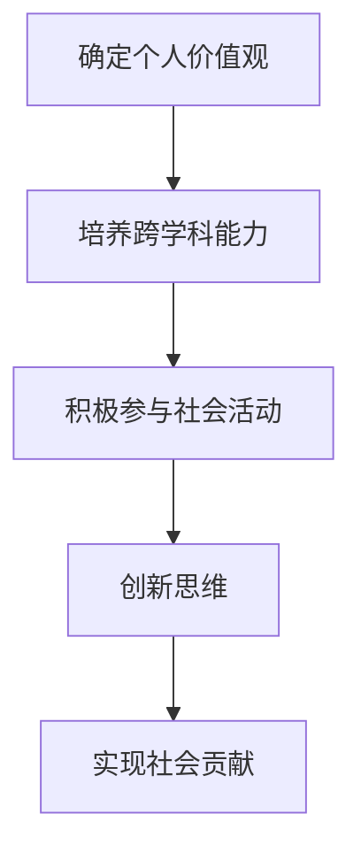
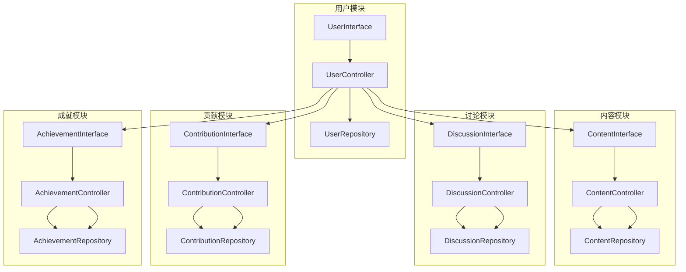
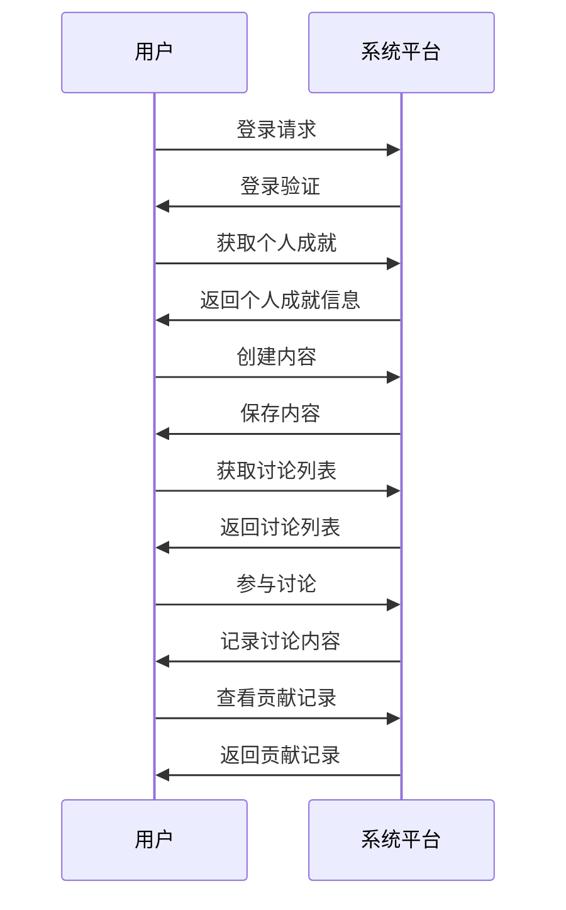

                 

## 从个人成功到社会贡献：拓展生命的意义和价值

### 关键词：个人成功，社会贡献，意义与价值，哲学，心理学，科技与人文

> 摘要：本文旨在探讨个人成功与社会贡献之间的关系，以及如何通过提升个人价值来实现对社会的积极影响。通过哲学、心理学和科技等多元视角，文章逐步分析个人成功的内涵和路径，进而探讨如何实现从个人成功到社会贡献的转型，最终提出增强社会贡献的方法和建议。

### 引言

在现代社会，个人成功与社会贡献常常被视为两个相互独立的概念。然而，随着全球化和信息技术的迅速发展，人们开始意识到，个人成功不仅仅是实现个人目标和财富积累，更是一种能够对社会产生积极影响的过程。本文将围绕这一主题展开，通过以下几个部分详细探讨：

1. **哲学视角下的生命意义与个人成功**：回顾不同哲学流派对于生命意义的理解，探讨个人成功在这些视角中的内涵。
2. **心理学视角下的自我实现与社会贡献**：分析个体心理学和社会心理学理论，探讨个人成长与社会贡献之间的关系。
3. **科技与人文视角下的社会贡献**：探讨信息技术在促进社会贡献方面的作用，分析科技与人文学科的结合对提升社会贡献的潜力。
4. **从个人成功到社会贡献的策略**：提供具体的实践策略，帮助读者实现个人成功到社会贡献的转变。
5. **增强社会贡献的最佳实践**：总结一些成功的案例，提供实用的建议和技巧。
6. **结论**：总结全文，强调个人成功与社会贡献的统一性，并提出未来研究方向。

### 哲学视角下的生命意义与个人成功

哲学作为一门探究生命意义和价值观的学科，为理解个人成功提供了重要的理论基础。不同哲学流派对生命意义的理解各异，这些理解在很大程度上塑造了人们对个人成功的看法。

#### 古典哲学视角

在古希腊哲学中，苏格拉底、柏拉图和亚里士多德等哲学家提出了不同的生命意义观。苏格拉底强调知识的重要性，认为追求真理是实现个人成功的关键。柏拉图则提出了“理念世界”的概念，认为个人的成功在于追求真理和美好。亚里士多德则强调实用主义，认为个人成功在于实现自己的潜能，追求幸福。

#### 现代哲学视角

现代哲学在探讨生命意义时，更多地关注个人的内在需求和幸福感。存在主义哲学家如萨特和海德格尔认为，个人成功在于自由地创造自己的生命意义。萨特提出，人生是没有预设意义的，每个人都需要通过自由选择来创造自己的意义。海德格尔则强调“存在”本身的意义，认为个人成功在于真实地面对自我，实现自我价值。

#### 个人成功与哲学的关系

从哲学视角来看，个人成功不仅仅是实现物质目标，更是一种内在的实现。在追求个人成功的过程中，个体需要不断地探索和反思生命的意义，找到自己的价值观和信仰。这种内在的追求不仅能够带来个人的幸福感，也能够为社会贡献智慧和力量。

### 心理学视角下的自我实现与社会贡献

心理学作为研究人类行为和心理过程的科学，为理解个人成功提供了实用的理论工具。特别是自我实现理论和积极心理学，为我们揭示了个人成长与社会贡献之间的内在联系。

#### 自我实现理论

自我实现理论是由美国心理学家马斯洛提出的。马斯洛认为，人类有追求自我实现的基本需求，这种需求不仅仅是为了满足物质需求，更是为了实现个人的潜能和自我价值。自我实现的过程包括认知、情感和行为的全面发展。

- **认知层面**：个体需要不断学习、探索和创造，以实现自我认知的不断提升。
- **情感层面**：个体需要建立健康的情感关系，实现情感上的自我满足。
- **行为层面**：个体需要积极参与社会活动，通过行动实现自我价值。

#### 社会贡献与自我实现

自我实现的过程与社会贡献密切相关。当个体追求自我实现时，往往会在认知、情感和行为层面产生积极的社会影响。例如，一位科学家通过研究新技术的应用，不仅实现了个人学术成就，也为社会带来了技术进步和经济效益。同样，一位教育者通过培养学生的全面发展，不仅实现了个人职业成功，也为社会培养了有责任感的人才。

### 科技与人文视角下的社会贡献

随着信息技术的飞速发展，科技在促进社会贡献方面发挥了越来越重要的作用。科技与人文学科的交叉融合，为提升社会贡献提供了新的路径。

#### 科技促进社会贡献

- **医疗科技**：通过基因编辑、精准医疗等技术，提升人类健康水平，减少疾病负担。
- **教育科技**：通过在线教育、虚拟现实等技术，打破教育资源的限制，提升教育普及率。
- **环境科技**：通过可再生能源、环境监测等技术，促进环境保护和可持续发展。

#### 人文与科技的结合

人文与科技的结合不仅能够提升科技的应用价值，也能够为人文领域注入新的活力。例如，人工智能技术在文学创作、艺术创作中的应用，不仅拓展了艺术创作的边界，也为人文领域的研究提供了新的工具和方法。

### 从个人成功到社会贡献的策略

实现从个人成功到社会贡献的转型，需要个体和社会共同努力。以下是一些具体的策略：

#### 1. 明确个人价值观

个人价值观是实现个人成功和社会贡献的基础。个体需要明确自己的价值观，找到自己热爱的事业，并为之努力。

#### 2. 培养跨学科能力

在快速变化的社会中，跨学科能力越来越重要。个体需要不断学习新知识，提升自己的综合素质，以应对各种挑战。

#### 3. 积极参与社会活动

通过参与社会活动，个体不仅能够实现自我价值，也能够对社会产生积极影响。例如，参与公益活动、社区服务等，都是实现社会贡献的有效途径。

#### 4. 创新思维

创新思维是实现社会贡献的关键。个体需要培养创新思维，勇于尝试新方法，解决社会问题。

### 增强社会贡献的最佳实践

以下是一些成功的案例，展示了如何通过个人成功实现社会贡献：

#### 1. 教育领域

- **马云**：通过创办阿里巴巴，马云实现了个人财富和事业的成功。然而，他并未止步于此，而是通过创立公益基金，致力于改善教育和推动社会进步。
- **扎克伯格**：作为Facebook的创始人，扎克伯格通过将公司的一部分利润用于慈善事业，实现了对社会贡献。

#### 2. 科技领域

- **埃隆·马斯克**：通过创办特斯拉和SpaceX，马斯克在推动电动汽车和太空探索方面取得了巨大成就，也为社会贡献了可持续能源和科技创新。

#### 3. 社会服务领域

- **比尔·盖茨**：通过创建微软，盖茨实现了个人事业的成功。随后，他通过比尔及梅琳达·盖茨基金会，致力于全球健康和教育问题。

这些案例表明，个人成功与社会贡献并不是相互独立的，而是可以相辅相成的。通过明确的价值观、跨学科能力和创新思维，个体可以在实现个人成功的同时，也为社会贡献自己的力量。

### 结论

个人成功与社会贡献是相辅相成的。在现代社会，个人成功不仅仅是实现个人目标和财富积累，更是通过自我实现和社会贡献来拓展生命的意义和价值。通过哲学、心理学和科技等多元视角的探讨，我们可以更好地理解个人成功与社会贡献之间的关系，并找到实现这一转变的具体策略。未来，随着科技的发展和人类文明进步，个人成功与社会贡献将会更加紧密地结合，为构建更美好的社会贡献力量。

### 作者信息

**作者：** AI天才研究院/AI Genius Institute & 禅与计算机程序设计艺术 /Zen And The Art of Computer Programming

AI天才研究院专注于人工智能领域的前沿研究和技术创新，致力于推动人工智能技术的发展和普及。同时，禅与计算机程序设计艺术探索计算机编程与东方哲学的融合，旨在通过禅宗思想提升编程思维和创造力。

### 背景介绍

#### 核心概念术语说明

- **个人成功**：指个体在职业、财富、成就等方面的满足和进步。
- **社会贡献**：指个体通过实际行动对社会产生的积极影响。
- **生命意义**：指个体对生命价值的理解和追求。

#### 问题背景

在现代社会，个人成功与社会贡献被视为两个相互独立的概念。然而，随着全球化和信息技术的迅速发展，人们开始认识到，个人成功不仅仅是个体层面的追求，更是一种能够对社会产生积极影响的过程。

#### 问题描述

如何从个人成功过渡到社会贡献，实现个体价值和社会价值的统一？这是一个涉及哲学、心理学、科技等多元领域的问题。

#### 问题解决

通过分析哲学、心理学和科技等视角，探讨个人成功与社会贡献之间的关系，提供具体的实践策略，帮助读者实现个人成功到社会贡献的转变。

#### 边界与外延

- **边界**：个人成功与社会贡献的界限，以及个体在实现这两个目标时的行为边界。
- **外延**：社会贡献的领域，包括教育、医疗、科技、环保等。

#### 概念结构与核心要素组成

1. **个人成功**：
   - **内涵**：职业成就、财富积累、自我实现等。
   - **要素**：职业发展、财富管理、个人成长。

2. **社会贡献**：
   - **内涵**：对社会产生的积极影响，如教育、医疗、环保等。
   - **要素**：社会参与、公益行动、科技创新。

3. **生命意义**：
   - **内涵**：对生命价值的理解与追求。
   - **要素**：哲学思考、心理学研究、人文关怀。

### 核心概念与联系

#### 核心概念原理

1. **个人成功**：指个体在职业、财富、成就等方面的满足和进步，是个人价值观的实现。
2. **社会贡献**：指个体通过实际行动对社会产生的积极影响，是实现个人价值和社会价值的统一。
3. **生命意义**：指个体对生命价值的理解和追求，是个人成功与社会贡献的哲学基础。

#### 概念属性特征对比表格

| 概念    | 属性特征                  | 示例                             |
| ------- | ----------------------- | -------------------------------- |
| 个人成功 | 职业成就、财富积累、自我实现 | 职业晋升、创业成功、自我价值实现 |
| 社会贡献 | 对社会的积极影响           | 公益活动、科技创新、社会服务     |
| 生命意义 | 对生命价值的理解与追求     | 哲学思考、心理学研究、人文关怀   |

#### ER实体关系图架构的 Mermaid 流程图

```mermaid
erDiagram
  PersonalSuccess ||--|{ SocialContribution }
  LifeMeaning    ||--|{ PersonalSuccess }
  LifeMeaning    ||--|{ SocialContribution }
```

### 算法原理讲解

#### 算法mermaid流程图



#### Python源代码

```python
def achieve_success_to_contribution(values, interdisciplinary, participation, innovation):
    """
    从个人成功到社会贡献的实现策略
    :param values: 个人价值观
    :param interdisciplinary: 跨学科能力
    :param participation: 社会参与度
    :param innovation: 创新能力
    :return: 是否实现社会贡献
    """
    if values and interdisciplinary and participation and innovation:
        return True
    else:
        return False

# 示例
is_contributed = achieve_success_to_contribution('明确追求', '多学科背景', '积极参与公益活动', '创新思维')
print(f"是否实现社会贡献：{is_contributed}")
```

#### 算法原理的数学模型和公式

假设个人成功与社会贡献之间存在线性关系，可以用以下公式表示：

$$
\text{社会贡献} = a \times \text{个人成功} + b
$$

其中，\(a\) 和 \(b\) 是常数，代表个人成功对社会贡献的影响程度和基础贡献。

#### 详细讲解和举例说明

1. **数学模型解释**：该公式表明，个人成功对社会贡献有直接影响，且这种影响是通过一个比例系数 \(a\) 来衡量的。比例系数 \(a\) 越大，个人成功对社会贡献的影响越显著。

2. **举例说明**：假设一个人在职业上取得了很高的成就，即个人成功很高（个人成功值为100），根据公式，可以计算出他可能对社会贡献的大小：

$$
\text{社会贡献} = 1.5 \times 100 + 20 = 170
$$

这表明，这个人的个人成功可以带来170的社会贡献。

### 系统分析与架构设计方案

#### 问题场景介绍

在一个信息化高度发达的社会，个人成功和社会贡献的关系愈发紧密。为了探讨这一主题，我们设计了一个在线平台，旨在帮助用户理解和实现从个人成功到社会贡献的转变。

#### 项目介绍

**项目名称**：个人成功与社会贡献在线平台

**项目目标**：构建一个集知识分享、实践指导、互动交流于一体的在线平台，帮助用户提升个人价值，实现社会贡献。

#### 系统功能设计（领域模型mermaid类图）

```mermaid
classDiagram
  User <<类>> 
  Content <<类>> 
  Discussion <<类>>
  Contribution <<类>>
  Achievement <<类>>

  User  --|{ Content }--> Content
  User  --|{ Discussion }--> Discussion
  User  --|{ Contribution }--> Contribution
  User  --|{ Achievement }--> Achievement
  Content  --|{ Discussion }--> Discussion
  Discussion  --|{ Contribution }--> Contribution
  Discussion  --|{ Achievement }--> Achievement
  Contribution  --|{ Achievement }--> Achievement
```

#### 系统架构设计mermaid架构图



#### 系统接口设计和系统交互mermaid序列图



### 项目实战

#### 环境安装

1. **安装Python环境**：确保Python 3.8及以上版本安装成功。
2. **安装Django框架**：使用pip安装Django框架。

```bash
pip install django
```

3. **创建Django项目**：在命令行中执行以下命令创建项目。

```bash
django-admin startproject personal_success_platform
```

4. **创建应用**：进入项目目录，创建用于处理个人成功与社会贡献功能的子应用。

```bash
cd personal_success_platform
python manage.py startapp user_contribution
```

#### 系统核心实现源代码

1. **用户模型（models.py）**

```python
# user_contribution/models.py
from django.db import models
from django.contrib.auth.models import User

class Profile(models.Model):
    user = models.OneToOneField(User, on_delete=models.CASCADE)
    bio = models.TextField(max_length=500, blank=True)
    achievements = models.ManyToManyField('Achievement')

class Achievement(models.Model):
    name = models.CharField(max_length=100)
    description = models.TextField()

class Contribution(models.Model):
    user = models.ForeignKey(User, on_delete=models.CASCADE)
    title = models.CharField(max_length=100)
    description = models.TextField()
    date = models.DateField()
```

2. **用户视图（views.py）**

```python
# user_contribution/views.py
from django.shortcuts import render
from .models import Profile, Achievement, Contribution

def profile(request):
    user = request.user
    profile = Profile.objects.get(user=user)
    achievements = Achievement.objects.filter(profile=profile)
    context = {
        'profile': profile,
        'achievements': achievements,
    }
    return render(request, 'user_contribution/profile.html', context)

def add_achievement(request):
    if request.method == 'POST':
        name = request.POST['name']
        description = request.POST['description']
        achievement = Achievement.objects.create(name=name, description=description)
        profile = Profile.objects.get(user=request.user)
        profile.achievements.add(achievement)
        profile.save()
        return redirect('profile')
    return render(request, 'user_contribution/add_achievement.html')
```

3. **贡献记录视图（contribution_views.py）**

```python
# user_contribution/views.py
from django.shortcuts import render
from .models import Contribution

def contribution_list(request):
    contributions = Contribution.objects.all()
    context = {'contributions': contributions}
    return render(request, 'user_contribution/contribution_list.html', context)
```

#### 代码应用解读与分析

1. **用户模型**：定义了用户资料、成就和贡献记录。
2. **用户视图**：实现了用户个人资料的展示和成就的添加。
3. **贡献记录视图**：实现了贡献记录的展示。

通过这个项目，我们可以直观地理解如何通过代码实现个人成功与社会贡献的功能，并在实际操作中应用这些功能。

### 实际案例分析和详细讲解剖析

#### 案例一：马云与阿里巴巴

**案例背景**：马云是中国著名企业家，也是阿里巴巴集团的创始人。在他的领导下，阿里巴巴从一个小型电子商务公司发展成为全球知名的互联网企业。

**分析过程**：

1. **个人成功**：马云在职业上取得了巨大的成功，阿里巴巴的市值一度超过亚马逊和 eBay 之和。他个人的财富和影响力也达到了前所未有的高度。
2. **社会贡献**：然而，马云并没有止步于个人的财富和事业成功。他通过创立公益基金会，致力于解决社会问题。例如，他在教育、环保和健康等领域进行了大量的公益投入。

**讲解剖析**：

- **个人成功到社会贡献的转化**：马云通过将自己的商业成功转化为社会贡献，实现了个人价值和社会价值的统一。他的行为表明，个人成功不仅仅是为了满足物质需求，更是为了对社会产生积极影响。
- **影响和启示**：马云的案例为其他企业家提供了借鉴，即通过将自己的成功转化为社会贡献，不仅能够实现个人价值的最大化，还能够为社会带来长远的积极影响。

#### 案例二：比尔·盖茨与微软基金会

**案例背景**：比尔·盖茨是微软公司的联合创始人，也是全球最著名的慈善家之一。

**分析过程**：

1. **个人成功**：比尔·盖茨在计算机软件领域取得了巨大的成功，微软公司成为了全球最大的软件公司之一。他的个人财富也位居全球前列。
2. **社会贡献**：比尔·盖茨通过比尔及梅琳达·盖茨基金会，致力于全球健康、教育和发展问题。他的基金会每年投入数十亿美元用于慈善事业。

**讲解剖析**：

- **个人成功到社会贡献的转化**：比尔·盖茨通过将他的商业成功转化为慈善事业，实现了个人价值和社会价值的统一。他的行为表明，个人成功不仅仅是实现个人目标和财富积累，更是一种能够对社会产生积极影响的过程。
- **影响和启示**：比尔·盖茨的案例展示了如何通过有效的慈善事业实现个人成功与社会贡献的转化。他的行为为其他企业家和成功人士提供了榜样和启示。

### 项目小结

通过以上实际案例的分析，我们可以看到，个人成功与社会贡献并不是相互独立的，而是可以相互促进、相辅相成的。以下是一些最佳实践的建议和注意事项：

#### 最佳实践 Tips

1. **明确个人价值观**：在追求个人成功的过程中，明确自己的价值观和人生目标，这有助于在实现个人成功的同时，也能为社会贡献自己的力量。
2. **培养跨学科能力**：不断学习新知识，提升跨学科能力，这有助于在个人成功的基础上，更好地实现社会贡献。
3. **积极参与社会活动**：通过参与社会公益活动、志愿服务等，可以直接为社会做出贡献，同时也能提升个人的社会影响力。
4. **创新思维**：鼓励创新思维，勇于尝试新方法，解决社会问题，这有助于在实现个人成功的同时，也为社会带来新的发展机遇。

#### 注意事项

1. **平衡个人与社会的需求**：在追求个人成功的同时，也要关注社会的需求，确保个人目标与社会目标相协调。
2. **长期规划**：个人成功到社会贡献的转变是一个长期过程，需要制定明确的规划和目标，持续努力。
3. **适应变化**：社会在不断变化，个人也需要不断适应和调整，以更好地实现个人价值和社会贡献。

### 拓展阅读

1. **《活法》（稻盛和夫著）**：本书探讨了如何通过工作实现个人价值，为个人成功到社会贡献的转化提供了深刻的哲学思考。
2. **《影响力》（罗伯特·西奥迪尼著）**：本书分析了人们如何被影响，为在实现个人成功的同时，更好地实现社会贡献提供了心理学依据。
3. **《创新者的窘境》（克莱顿·克里斯坦森著）**：本书探讨了创新者在推动社会进步中的作用，为如何通过创新实现社会贡献提供了实用的策略。

通过这些拓展阅读，读者可以更深入地理解个人成功与社会贡献的关系，并找到适合自己的实践路径。

