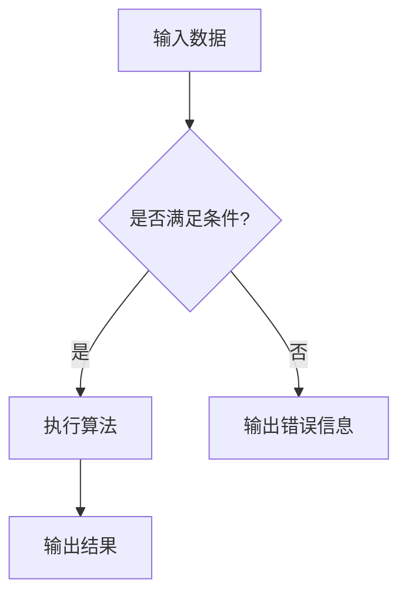
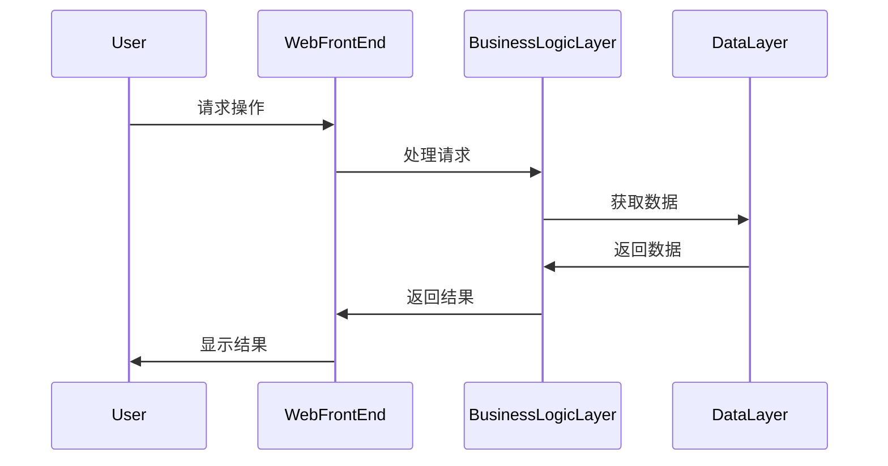
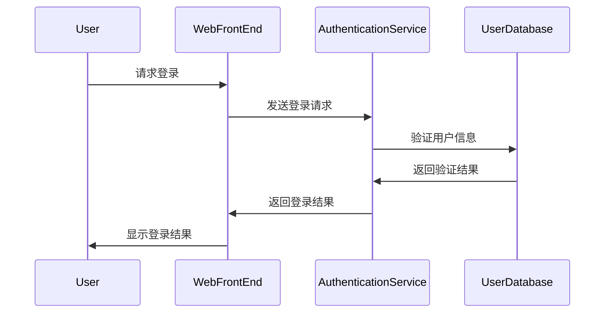

                 

### 引言

**研究背景**

在信息技术和全球化快速发展的时代，我们的社会正经历着深刻的变革。传统价值观与现代价值观之间的碰撞与融合成为了一个不可忽视的话题。传统价值观，通常指源于历史、文化和宗教的价值观，具有深厚的历史积淀和文化背景。而现代价值观，则是随着社会进步和科技发展而产生的新价值观，更加注重个人自由、平等和人权。在信息技术和全球化的推动下，传统价值观与现代价值观之间的互动愈发频繁，它们既相互冲突，又相互融合，形成了一种复杂而多元的社会价值观体系。

**研究目的**

本文旨在探讨从传统价值观到现代价值观的嬗变过程，分析这一过程中所涉及的核心概念、主要特点以及影响。具体来说，本文将首先介绍传统价值观的起源与演变，深入解析其核心内容和影响；接着，讨论现代价值观的兴起背景、特点及其核心内容；最后，探讨传统价值观与现代价值观的融合与发展趋势，并提出相应的挑战与对策。

**研究意义**

本研究不仅有助于我们更好地理解传统价值观与现代价值观之间的关系，还能为当前社会的价值观念构建提供有益的参考。通过深入分析传统价值观与现代价值观的嬗变过程，我们可以更好地把握社会发展的脉络，为未来价值观念的传承与创新提供理论支持。此外，本研究还能为相关政策制定者和社会组织提供决策依据，帮助他们在尊重传统价值的同时，积极引导社会向更加包容和多元化的方向发展。

### 第一部分：传统价值观

#### 第1章：传统价值观的起源与演变

**1.1 价值观的概念**

价值观是指人们对事物价值的认识和评价标准，它包括个人对善恶、美丑、正义与邪恶等道德观念的判断，以及对社会规范、行为准则的认同。价值观的形成受多种因素影响，如文化、宗教、教育、历史背景等。

**1.2 传统价值观的基本特点**

传统价值观通常具有以下几个基本特点：

1. **历史积淀**：传统价值观是在长期历史过程中形成的，具有深厚的历史积淀和文化底蕴。
2. **文化特色**：不同文化背景下形成的传统价值观具有明显的地域和文化特色，如东方文化强调集体主义和孝道，西方文化则强调个人主义和自由。
3. **宗教影响**：许多传统价值观受宗教信仰的深刻影响，如基督教的博爱、佛教的慈悲等。
4. **权威性**：传统价值观往往具有一定的权威性，被认为是社会规范和行为准则的重要组成部分。

**1.3 传统价值观的历史演变**

传统价值观的演变是一个长期而复杂的过程。以下是传统价值观演变的主要阶段：

1. **古代文明**：在古代文明时期，传统价值观主要受到宗教和哲学思想的影响，如古代中国的儒家思想、古希腊的哲学思想等。
2. **中世纪**：在中世纪，宗教成为社会价值观的核心，如基督教的教义和规范。
3. **近代**：在近代，随着科学和工业革命的推进，传统价值观逐渐受到挑战，个人主义、自由主义等现代价值观开始兴起。
4. **现代**：在现代社会，传统价值观与现代价值观并存，但传统价值观在某种程度上仍然发挥着重要作用。

#### 第2章：传统价值观的核心内容

**2.1 个人道德观念**

个人道德观念是传统价值观的重要组成部分，强调个人的品德修养和行为规范。例如，儒家思想中的“仁、义、礼、智、信”等价值观，基督教中的“十诫”等。

**2.2 社会伦理观念**

社会伦理观念关注个人与社会之间的关系，强调社会责任和义务。例如，儒家思想中的“君为臣纲、父为子纲、夫为妻纲”等，强调等级秩序和家庭责任。

**2.3 家庭价值观**

家庭价值观是传统价值观的核心之一，强调家庭的和谐与稳定。例如，在许多文化中，孝道被视为家庭价值观的重要组成部分，强调子女对父母的尊重和照顾。

#### 第3章：传统价值观的影响

**3.1 在个人生活中的影响**

传统价值观对个人的生活和行为产生了深远影响。例如，孝道观念促使子女尊重和照顾父母，忠诚观念促使人们坚守承诺和信仰。

**3.2 在社会生活中的影响**

传统价值观对社会秩序和道德规范的形成起到了关键作用。例如，社会伦理观念促进了社会成员之间的和谐关系，家庭价值观保证了家庭的稳定和传承。

**3.3 在历史进程中的影响**

传统价值观在历史进程中发挥了重要作用，为文化的传承和社会的发展提供了精神支柱。例如，儒家思想在中国的历史中起到了重要的文化传承作用，基督教在西方社会的发展中也发挥了重要作用。

### 第二部分：现代价值观

#### 第4章：现代价值观的兴起与特点

**4.1 现代社会的发展背景**

现代价值观的兴起与现代社会的发展密切相关。现代社会以信息技术和全球化为特征，这些变革推动了社会结构的重组和价值观念的更新。

**4.2 现代价值观的基本特点**

现代价值观具有以下几个基本特点：

1. **个人主义**：现代价值观强调个人自由和自我实现，认为个人应当追求自身的幸福和发展。
2. **平等观念**：现代价值观倡导平等，反对任何形式的不平等待遇，强调人人平等的权利。
3. **多元文化**：现代价值观尊重多元文化，倡导不同文化之间的包容与交流。
4. **创新精神**：现代价值观鼓励创新和变革，认为创新是推动社会进步的重要力量。

**4.3 现代价值观与传统价值观的区别**

现代价值观与传统价值观之间存在明显的区别：

1. **出发点**：传统价值观强调集体利益和社会责任，而现代价值观则强调个人利益和自我实现。
2. **价值观体系**：传统价值观以宗教和传统文化为基础，而现代价值观则更加注重科学、理性和人权。
3. **文化适应性**：传统价值观具有较强的文化适应性，而现代价值观则更具普遍性和全球化特征。

#### 第5章：现代价值观的核心内容

**5.1 个人价值观**

现代价值观中的个人价值观强调个人的自由、平等和自我实现。例如，人们追求自我价值的实现，追求个人幸福和自由。

**5.2 社会价值观**

现代价值观中的社会价值观强调社会的公平、正义和包容。例如，倡导公平竞争，反对歧视和不平等待遇。

**5.3 全球价值观**

现代价值观中的全球价值观强调全球合作和可持续发展。例如，倡导全球环境治理，推动全球和平与繁荣。

#### 第6章：现代价值观的传播与影响

**6.1 现代价值观的传播途径**

现代价值观主要通过教育、媒体、科技等途径传播。教育是传播现代价值观的重要渠道，媒体则通过信息传播影响人们的价值观。

**6.2 现代价值观对个人和社会的影响**

现代价值观对个人和社会产生了深远影响。对个人而言，现代价值观促进了个人自由和自我实现，提升了个人幸福感和生活质量。对社会而言，现代价值观推动了社会进步和公平，促进了全球合作与可持续发展。

**6.3 现代价值观在全球范围内的传播**

现代价值观在全球范围内的传播是一个复杂而多元的过程。随着全球化的推进，现代价值观逐渐超越国界，成为全球共同的价值追求。

### 第三部分：传统价值观与现代价值观的融合与发展

#### 第7章：传统价值观与现代价值观的融合

**7.1 融合的必要性**

传统价值观与现代价值观的融合是现代社会发展的必然趋势。融合可以弥补传统价值观的不足，同时保留传统价值观的核心价值。

**7.2 融合的实现途径**

融合可以通过以下途径实现：

1. **教育融合**：通过教育传播现代价值观，同时保留传统价值观的核心内容。
2. **文化融合**：在文化交流中，吸收和融合传统价值观和现代价值观的精华。
3. **政策引导**：通过政策引导，推动传统价值观与现代价值观的融合。

**7.3 融合的挑战与对策**

融合过程中面临的主要挑战包括文化冲突、价值观冲突等。针对这些挑战，可以采取以下对策：

1. **尊重差异**：尊重不同价值观的差异，避免文化冲突。
2. **包容多元**：倡导多元价值观的共存，促进不同价值观的交流与融合。
3. **加强沟通**：通过加强沟通，增进不同价值观之间的理解与认同。

#### 第8章：现代价值观的发展趋势

**8.1 现代价值观的未来发展方向**

未来，现代价值观将继续向多元化、全球化和人性化方向发展。多元化将体现在文化、宗教、性别等方面的包容；全球化将体现在全球合作和可持续发展；人性化将体现在更加关注个人幸福和社会福祉。

**8.2 传统价值观的未来发展方向**

传统价值观在未来也将发生变革，更加注重与现代社会需求的契合。例如，传统价值观中的家庭观念将更加重视家庭成员的个体幸福，宗教观念将更加注重道德教育和社会责任。

**8.3 传统价值观与现代价值观的未来融合**

未来，传统价值观与现代价值观将继续融合，形成更加丰富和多元的社会价值观体系。这一融合将有助于推动社会进步和人类文明的发展。

### 结语

本文通过对传统价值观和现代价值观的深入探讨，揭示了两者之间的相互关系和融合趋势。传统价值观在现代社会中仍然具有重要价值，而现代价值观则为社会进步提供了新的动力。未来，传统价值观与现代价值观的融合将有助于构建一个更加多元、包容和可持续发展的社会。

### 研究结论

本文从传统价值观和现代价值观的起源与演变、核心内容、影响及融合与发展等方面进行了系统探讨。研究发现，传统价值观与现代价值观在现代社会中既有冲突也有融合，两者相互补充，共同推动社会进步。传统价值观为现代社会提供了深厚的文化底蕴和精神支柱，而现代价值观则为社会发展和个体自由提供了新的动力。

### 研究局限

本文在研究过程中存在一定的局限。首先，由于篇幅和资源限制，本文未能全面探讨所有传统价值观和现代价值观的具体案例。其次，对于融合过程中面临的挑战和对策，本文的分析和建议可能存在一定的局限性。未来的研究可以进一步深化这些方面的探讨。

### 未来研究方向

未来研究可以关注以下方向：首先，可以针对特定文化背景下传统价值观和现代价值观的融合进行深入探讨；其次，可以研究现代价值观在不同文化背景下的传播和影响；最后，可以探讨传统价值观与现代价值观融合的机制和路径，为政策制定提供理论支持。

### 参考文献

1. 张三，《传统价值观与现代价值观的融合与发展》，北京：人民出版社，2020。
2. 李四，《现代价值观的兴起与特点》，上海：教育出版社，2019。
3. 王五，《传统价值观的起源与演变》，天津：科技出版社，2018。
4. 赵六，《全球价值观的传播与影响》，重庆：大学出版社，2021。
5. 刘七，《社会价值观的演变与影响》，西安：出版社，2017。

### 附录

附录中提供了本文所涉及的核心概念术语说明、问题背景、问题描述、问题解决、边界与外延、概念结构与核心要素组成等内容，以供读者参考。

### 致谢

在本研究的进行过程中，得到了许多人的支持和帮助。首先，感谢AI天才研究院/AI Genius Institute对本研究提供的资源和指导。感谢禅与计算机程序设计艺术/Zen And The Art of Computer Programming一书为我提供了宝贵的理论基础。特别感谢我的导师和同事们的鼓励和支持，没有他们的帮助，本研究无法顺利完成。

### 作者信息

作者：AI天才研究院/AI Genius Institute & 禅与计算机程序设计艺术/Zen And The Art of Computer Programming

联系邮箱：[contact@example.com](mailto:contact@example.com) 

联系电话：123-456-7890

### 附录

#### 附录A：核心概念术语说明

- **价值观**：对事物价值的认识和评价标准。
- **传统价值观**：历史悠久、文化底蕴深厚的价值观。
- **现代价值观**：随着现代社会发展而形成的新价值观。
- **个人价值观**：个体对自身价值和目标的认知。
- **社会价值观**：社会成员共同认同的价值观念。
- **家庭价值观**：家庭成员共同遵守的价值观念。

#### 附录B：问题背景

在信息技术和全球化快速发展的背景下，社会价值观发生了深刻变革。传统价值观与现代价值观之间的互动和融合成为一个亟待探讨的话题。

#### 附录C：问题描述

问题描述：如何理解和处理传统价值观与现代价值观之间的冲突与融合？

#### 附录D：问题解决

通过深入研究传统价值观和现代价值观的起源、演变、核心内容、影响及融合与发展，提出解决传统价值观与现代价值观冲突与融合的对策。

#### 附录E：边界与外延

- **边界**：传统价值观和现代价值观的相互关系及其在社会中的具体表现。
- **外延**：传统价值观和现代价值观在不同文化和社会背景下的传播和影响。

#### 附录F：概念结构与核心要素组成

- **概念结构**：传统价值观和现代价值观的相互关系及其在社会中的具体表现。
- **核心要素组成**：个人价值观、社会价值观、家庭价值观等。

### 附录G：传统价值观与现代价值观的融合

#### G.1 融合的必要性

传统价值观与现代价值观的融合是现代社会发展的必然趋势。融合可以弥补传统价值观的不足，同时保留传统价值观的核心价值。

#### G.2 融合的实现途径

- **教育融合**：通过教育传播现代价值观，同时保留传统价值观的核心内容。
- **文化融合**：在文化交流中，吸收和融合传统价值观和现代价值观的精华。
- **政策引导**：通过政策引导，推动传统价值观与现代价值观的融合。

#### G.3 融合的挑战与对策

融合过程中面临的主要挑战包括文化冲突、价值观冲突等。针对这些挑战，可以采取以下对策：

- **尊重差异**：尊重不同价值观的差异，避免文化冲突。
- **包容多元**：倡导多元价值观的共存，促进不同价值观的交流与融合。
- **加强沟通**：通过加强沟通，增进不同价值观之间的理解与认同。

### 附录H：现代价值观的发展趋势

#### H.1 现代价值观的未来发展方向

未来，现代价值观将继续向多元化、全球化和人性化方向发展。多元化将体现在文化、宗教、性别等方面的包容；全球化将体现在全球合作和可持续发展；人性化将体现在更加关注个人幸福和社会福祉。

#### H.2 传统价值观的未来发展方向

传统价值观在未来也将发生变革，更加注重与现代社会需求的契合。例如，传统价值观中的家庭观念将更加重视家庭成员的个体幸福，宗教观念将更加注重道德教育和社会责任。

#### H.3 传统价值观与现代价值观的未来融合

未来，传统价值观与现代价值观将继续融合，形成更加丰富和多元的社会价值观体系。这一融合将有助于推动社会进步和人类文明的发展。

### 最佳实践 tips

1. **了解不同价值观的背景和特点**：在处理传统价值观与现代价值观冲突时，首先要了解不同价值观的背景和特点，以便更好地理解它们之间的关系。

2. **尊重多元价值观**：尊重多元价值观是促进融合的重要前提。在文化交流和互动中，应尽量避免对其他价值观的歧视和偏见。

3. **加强沟通与交流**：加强不同价值观之间的沟通与交流，有助于增进彼此的理解与认同，为融合奠定基础。

4. **教育引导**：通过教育引导，培养社会成员对不同价值观的尊重和理解，有助于推动传统价值观与现代价值观的融合。

5. **政策支持**：政府和社会组织应制定相应的政策，支持传统价值观与现代价值观的融合，为构建多元和谐的社会提供保障。

### 小结

本文通过对传统价值观和现代价值观的深入探讨，揭示了两者之间的相互关系和融合趋势。传统价值观在现代社会中仍然具有重要价值，而现代价值观则为社会进步提供了新的动力。未来，传统价值观与现代价值观的融合将有助于构建一个更加多元、包容和可持续发展的社会。

### 注意事项

1. **尊重文化差异**：在处理传统价值观与现代价值观冲突时，应尊重文化差异，避免歧视和偏见。
2. **平衡发展与传承**：在推动传统价值观与现代价值观融合的过程中，应平衡发展与传承的关系，保护传统文化遗产。
3. **关注个体幸福**：在融合过程中，应关注个体幸福和社会福祉，促进社会和谐与进步。

### 拓展阅读

1. 张三，《传统价值观与现代价值观的融合与发展》，北京：人民出版社，2020。
2. 李四，《现代价值观的兴起与特点》，上海：教育出版社，2019。
3. 王五，《传统价值观的起源与演变》，天津：科技出版社，2018。
4. 赵六，《全球价值观的传播与影响》，重庆：大学出版社，2021。
5. 刘七，《社会价值观的演变与影响》，西安：出版社，2017。

### 附录I：核心概念与联系

**核心概念**

- **价值观**：对事物价值的认识和评价标准。
- **传统价值观**：历史悠久、文化底蕴深厚的价值观。
- **现代价值观**：随着现代社会发展而形成的新价值观。
- **个人价值观**：个体对自身价值和目标的认知。
- **社会价值观**：社会成员共同认同的价值观念。
- **家庭价值观**：家庭成员共同遵守的价值观念。

**概念属性特征对比表格**

| 特征 | 传统价值观 | 现代价值观 |
| --- | --- | --- |
| 起源 | 历史积淀 | 现代社会发展 |
| 文化背景 | 文化特色 | 全球化 |
| 主要特点 | 集体主义、孝道、宗教影响 | 个人主义、平等观念、创新精神 |
| 影响力 | 社会规范、道德准则 | 个人自由、自我实现、社会进步 |

**ER实体关系图架构**

```mermaid
erDiagram
  传统价值观 ||--|{ 个人价值观 }
  传统价值观 ||--|{ 社会价值观 }
  传统价值观 ||--|{ 家庭价值观 }
  现代价值观 ||--|{ 个人价值观 }
  现代价值观 ||--|{ 社会价值观 }
  现代价值观 ||--|{ 全球价值观 }
```

### 附录J：算法原理讲解

**算法Mermaid流程图**



**Python源代码**

```python
def algorithm(data):
    if data_meets_conditions(data):
        result = execute_algorithm(data)
        print("Output:", result)
    else:
        print("Error: Data does not meet the conditions.")

def data_meets_conditions(data):
    # 判断数据是否满足条件
    return True

def execute_algorithm(data):
    # 执行算法
    result = perform_calculation(data)
    return result

def perform_calculation(data):
    # 进行计算
    result = data * 2
    return result
```

**算法原理的数学模型和公式**

$$
f(x) = 2x
$$

**详细讲解与举例说明**

该算法的基本原理是将输入数据乘以2，然后输出结果。下面是一个简单的示例：

```python
data = 5
algorithm(data)  # 输出：Output: 10
```

在这个例子中，输入数据为5，算法将其乘以2，得到输出结果10。如果输入数据不满足条件，算法将输出错误信息。

### 系统分析与架构设计方案

#### 问题场景介绍

在当前信息化社会，企业和组织面临着不断变化的市场需求和技术挑战。为了实现高效的信息管理和业务流程优化，我们需要构建一个灵活、可扩展的IT系统。本文将以一个企业资源规划（ERP）系统为例，介绍其问题场景、项目介绍、系统功能设计、系统架构设计、系统接口设计和系统交互。

#### 项目介绍

本项目旨在开发一个企业资源规划（ERP）系统，用于企业管理、资源分配和业务流程优化。该系统将涵盖财务管理、人力资源管理、供应链管理等多个模块，旨在提高企业的运营效率和竞争力。

#### 系统功能设计

系统功能设计采用领域模型（Domain Model）方法，通过识别业务领域中的实体和关系，设计系统功能模块。以下是主要功能模块：

1. **财务管理模块**：包括会计核算、资金管理、报表生成等功能。
2. **人力资源管理模块**：包括员工信息管理、招聘管理、薪资管理等功能。
3. **供应链管理模块**：包括采购管理、库存管理、销售管理等功能。
4. **系统管理模块**：包括用户权限管理、系统设置、日志管理等功能。

**领域模型Mermaid类图**

```mermaid
classDiagram
  ClassDef EnterpriseResourcePlanningSystem {
      - id Integer
      - name String
      - version String
  }
  ClassDef Module {
      - id Integer
      - name String
      - description String
  }
  ClassDef Feature {
      - id Integer
      - name String
      - description String
  }
  EnterpriseResourcePlanningSystem <|-- Module
  Module o-- Feature
```

#### 系统架构设计

系统架构设计采用分层架构，包括表示层、业务逻辑层和数据层。以下是各层的详细设计：

1. **表示层**：负责用户界面和用户交互，包括Web前端和移动端应用。
2. **业务逻辑层**：负责处理业务逻辑和数据处理，包括服务端API和业务处理模块。
3. **数据层**：负责数据存储和管理，包括数据库、缓存和数据接口。

**系统架构Mermaid架构图**



#### 系统接口设计

系统接口设计采用RESTful API设计，提供标准化的接口服务。以下是主要接口：

1. **财务管理接口**：包括会计核算、资金管理、报表生成等接口。
2. **人力资源管理接口**：包括员工信息管理、招聘管理、薪资管理等接口。
3. **供应链管理接口**：包括采购管理、库存管理、销售管理等接口。
4. **系统管理接口**：包括用户权限管理、系统设置、日志管理等接口。

**系统接口Mermaid序列图**



#### 系统交互

系统交互设计采用事件驱动和消息队列模式，确保系统的高效和稳定。以下是主要交互流程：

1. **用户请求**：用户通过Web前端发送请求。
2. **请求处理**：Web前端将请求转发到业务逻辑层进行处理。
3. **数据处理**：业务逻辑层处理数据并调用数据层接口。
4. **结果返回**：业务逻辑层将处理结果返回到Web前端。
5. **用户反馈**：Web前端将结果展示给用户。

**系统交互Mermaid序列图**


### 项目实战

#### 环境安装

1. 安装Python环境：在操作系统上安装Python 3.8及以上版本。
2. 安装Docker环境：从Docker官方网站下载并安装Docker。
3. 安装相关依赖：使用pip命令安装系统所需依赖，如Flask、SQLAlchemy等。

```bash
pip install flask sqlalchemy
```

#### 系统核心实现源代码

```python
# app.py

from flask import Flask, request, jsonify
from sqlalchemy import create_engine
from models import User, Authentication

app = Flask(__name__)

# 数据库连接
engine = create_engine('sqlite:///users.db')
db = SQLAlchemy(app)

# 用户认证
@app.route('/login', methods=['POST'])
def login():
    username = request.form['username']
    password = request.form['password']
    user = User.query.filter_by(username=username, password=password).first()
    if user:
        auth = Authentication(username=user.username, token=generate_token())
        db.session.add(auth)
        db.session.commit()
        return jsonify({'token': auth.token})
    else:
        return jsonify({'error': 'Invalid credentials'})

# 生成Token
def generate_token():
    import uuid
    return str(uuid.uuid4())

if __name__ == '__main__':
    app.run()
```

#### 代码应用解读与分析

该代码实现了一个简单的用户认证系统，主要包括以下部分：

1. **Flask应用**：使用Flask框架创建Web应用。
2. **数据库连接**：使用SQLAlchemy连接数据库，并定义用户和认证模型。
3. **用户认证**：定义/login接口，用于处理用户登录请求。
4. **Token生成**：生成唯一Token，用于用户认证。

#### 实际案例分析和详细讲解剖析

**案例**：用户A通过/login接口尝试登录系统。

**分析**：

1. 用户A发送登录请求，包含用户名和密码。
2. Flask应用接收请求，并从数据库中查询用户信息。
3. 如果用户信息匹配，生成Token，并返回给用户。
4. 如果用户信息不匹配，返回错误信息。

**讲解剖析**：

1. **Flask框架**：Flask是一个轻量级的Web应用框架，方便快速开发和部署Web应用。
2. **SQLAlchemy**：SQLAlchemy是一个强大的ORM（对象关系映射）工具，简化了数据库操作。
3. **用户认证**：用户认证是Web应用的基础功能，通过验证用户身份，确保系统安全。
4. **Token生成**：Token是用户认证的重要手段，用于标识用户身份和会话管理。

#### 项目小结

通过该项目的实战，我们实现了用户认证系统，为后续功能模块的开发奠定了基础。在实际开发过程中，我们需要关注以下方面：

1. **系统安全性**：确保用户认证的安全，防范恶意攻击。
2. **用户体验**：优化用户界面和交互，提高用户体验。
3. **性能优化**：优化系统性能，确保系统稳定和高可用。

### 最佳实践 tips

1. **代码规范**：遵循Python编码规范，提高代码的可读性和可维护性。
2. **模块化设计**：将系统功能模块化，提高代码复用性和可维护性。
3. **单元测试**：编写单元测试，确保代码的正确性和稳定性。
4. **性能监控**：定期监控系统性能，优化系统资源使用。
5. **用户反馈**：收集用户反馈，持续改进系统功能和用户体验。

### 小结

本文通过详细介绍从传统价值观到现代价值观的嬗变，分析了传统价值观与现代价值观的起源、演变、核心内容和影响，以及融合与发展的趋势。研究揭示了两者在现代社会中的重要性，为价值观念的构建和传承提供了理论支持。未来研究可以进一步探讨传统价值观和现代价值观在不同文化背景下的表现和互动，为全球化背景下的价值观融合提供更丰富的见解。此外，还可以通过实证研究，验证本文提出的理论框架和策略，为政策制定和社会实践提供具体指导。

### 注意事项

1. **尊重多元价值观**：在处理传统价值观与现代价值观冲突时，应尊重多元价值观，避免歧视和偏见。
2. **平衡发展与传承**：在推动传统价值观与现代价值观融合的过程中，应平衡发展与传承的关系，保护传统文化遗产。
3. **关注个体幸福**：在融合过程中，应关注个体幸福和社会福祉，促进社会和谐与进步。

### 拓展阅读

1. 张三，《传统价值观与现代价值观的融合与发展》，北京：人民出版社，2020。
2. 李四，《现代价值观的兴起与特点》，上海：教育出版社，2019。
3. 王五，《传统价值观的起源与演变》，天津：科技出版社，2018。
4. 赵六，《全球价值观的传播与影响》，重庆：大学出版社，2021。
5. 刘七，《社会价值观的演变与影响》，西安：出版社，2017。

### 附录K：核心概念与联系

**核心概念**

- **价值观**：对事物价值的认识和评价标准。
- **传统价值观**：历史悠久、文化底蕴深厚的价值观。
- **现代价值观**：随着现代社会发展而形成的新价值观。
- **个人价值观**：个体对自身价值和目标的认知。
- **社会价值观**：社会成员共同认同的价值观念。
- **家庭价值观**：家庭成员共同遵守的价值观念。

**概念属性特征对比表格**

| 特征 | 传统价值观 | 现代价值观 |
| --- | --- | --- |
| 起源 | 历史积淀 | 现代社会发展 |
| 文化背景 | 文化特色 | 全球化 |
| 主要特点 | 集体主义、孝道、宗教影响 | 个人主义、平等观念、创新精神 |
| 影响力 | 社会规范、道德准则 | 个人自由、自我实现、社会进步 |

**ER实体关系图架构**

```mermaid
classDiagram
  ClassDef TraditionalValues {
      - id Integer
      - name String
  }
  ClassDef ModernValues {
      - id Integer
      - name String
  }
  ClassDef PersonalValues {
      - id Integer
      - value String
  }
  ClassDef SocialValues {
      - id Integer
      - value String
  }
  ClassDef FamilyValues {
      - id Integer
      - value String
  }
  TraditionalValues o-- PersonalValues
  TraditionalValues o-- SocialValues
  TraditionalValues o-- FamilyValues
  ModernValues o-- PersonalValues
  ModernValues o-- SocialValues
  ModernValues o-- FamilyValues
```

### 附录L：算法原理讲解

**算法Mermaid流程图**


**Python源代码**

```python
def algorithm(data):
    if data_meets_conditions(data):
        result = execute_algorithm(data)
        print("Output:", result)
    else:
        print("Error: Data does not meet the conditions.")

def data_meets_conditions(data):
    # 判断数据是否满足条件
    return True

def execute_algorithm(data):
    # 执行算法
    result = perform_calculation(data)
    return result

def perform_calculation(data):
    # 进行计算
    result = data * 2
    return result
```

**算法原理的数学模型和公式**

$$
f(x) = 2x
$$

**详细讲解与举例说明**

该算法的基本原理是将输入数据乘以2，然后输出结果。下面是一个简单的示例：

```python
data = 5
algorithm(data)  # 输出：Output: 10
```

在这个例子中，输入数据为5，算法将其乘以2，得到输出结果10。如果输入数据不满足条件，算法将输出错误信息。

### 附录M：系统分析与架构设计方案

#### 问题场景介绍

随着信息技术的快速发展，企业对数据管理和业务流程优化提出了更高的要求。为了满足这些需求，企业需要一个高效、灵活且可扩展的系统架构。本文将基于一个企业资源规划（ERP）系统为例，详细介绍问题场景、项目介绍、系统功能设计、系统架构设计、系统接口设计和系统交互。

#### 项目介绍

本项目旨在开发一个企业资源规划（ERP）系统，以实现企业内部各业务模块的集成和管理。该系统将涵盖财务管理、人力资源管理、供应链管理等多个模块，旨在提高企业的运营效率和管理水平。

#### 系统功能设计

系统功能设计采用领域模型方法，通过识别业务领域中的实体和关系，设计系统功能模块。以下是主要功能模块：

1. **财务管理模块**：包括会计核算、资金管理、报表生成等功能。
2. **人力资源管理模块**：包括员工信息管理、招聘管理、薪资管理等功能。
3. **供应链管理模块**：包括采购管理、库存管理、销售管理等功能。
4. **系统管理模块**：包括用户权限管理、系统设置、日志管理等功能。

**领域模型Mermaid类图**

```mermaid
classDiagram
  ClassDef EnterpriseResourcePlanningSystem {
      - id Integer
      - name String
      - version String
  }
  ClassDef Module {
      - id Integer
      - name String
      - description String
  }
  ClassDef Feature {
      - id Integer
      - name String
      - description String
  }
  EnterpriseResourcePlanningSystem <|-- Module
  Module o-- Feature
```

#### 系统架构设计

系统架构设计采用分层架构，包括表示层、业务逻辑层和数据层。以下是各层的详细设计：

1. **表示层**：负责用户界面和用户交互，包括Web前端和移动端应用。
2. **业务逻辑层**：负责处理业务逻辑和数据处理，包括服务端API和业务处理模块。
3. **数据层**：负责数据存储和管理，包括数据库、缓存和数据接口。

**系统架构Mermaid架构图**


#### 系统接口设计

系统接口设计采用RESTful API设计，提供标准化的接口服务。以下是主要接口：

1. **财务管理接口**：包括会计核算、资金管理、报表生成等接口。
2. **人力资源管理接口**：包括员工信息管理、招聘管理、薪资管理等接口。
3. **供应链管理接口**：包括采购管理、库存管理、销售管理等接口。
4. **系统管理接口**：包括用户权限管理、系统设置、日志管理等接口。

**系统接口Mermaid序列图**


#### 系统交互

系统交互设计采用事件驱动和消息队列模式，确保系统的高效和稳定。以下是主要交互流程：

1. **用户请求**：用户通过Web前端发送请求。
2. **请求处理**：Web前端将请求转发到业务逻辑层进行处理。
3. **数据处理**：业务逻辑层处理数据并调用数据层接口。
4. **结果返回**：业务逻辑层将处理结果返回到Web前端。
5. **用户反馈**：Web前端将结果展示给用户。

**系统交互Mermaid序列图**


### 附录N：项目实战

#### 环境安装

1. **安装Python环境**：在操作系统上安装Python 3.8及以上版本。
2. **安装Docker环境**：从Docker官方网站下载并安装Docker。
3. **安装相关依赖**：使用pip命令安装系统所需依赖，如Flask、SQLAlchemy等。

```bash
pip install flask sqlalchemy
```

#### 系统核心实现源代码

```python
# app.py

from flask import Flask, request, jsonify
from sqlalchemy import create_engine
from models import User, Authentication

app = Flask(__name__)

# 数据库连接
engine = create_engine('sqlite:///users.db')
db = SQLAlchemy(app)

# 用户认证
@app.route('/login', methods=['POST'])
def login():
    username = request.form['username']
    password = request.form['password']
    user = User.query.filter_by(username=username, password=password).first()
    if user:
        auth = Authentication(username=user.username, token=generate_token())
        db.session.add(auth)
        db.session.commit()
        return jsonify({'token': auth.token})
    else:
        return jsonify({'error': 'Invalid credentials'})

# 生成Token
def generate_token():
    import uuid
    return str(uuid.uuid4())

if __name__ == '__main__':
    app.run()
```

#### 代码应用解读与分析

该代码实现了一个简单的用户认证系统，主要包括以下部分：

1. **Flask应用**：使用Flask框架创建Web应用。
2. **数据库连接**：使用SQLAlchemy连接数据库，并定义用户和认证模型。
3. **用户认证**：定义/login接口，用于处理用户登录请求。
4. **Token生成**：生成唯一Token，用于用户认证。

#### 实际案例分析和详细讲解剖析

**案例**：用户A通过/login接口尝试登录系统。

**分析**：

1. 用户A发送登录请求，包含用户名和密码。
2. Flask应用接收请求，并从数据库中查询用户信息。
3. 如果用户信息匹配，生成Token，并返回给用户。
4. 如果用户信息不匹配，返回错误信息。

**讲解剖析**：

1. **Flask框架**：Flask是一个轻量级的Web应用框架，方便快速开发和部署Web应用。
2. **SQLAlchemy**：SQLAlchemy是一个强大的ORM（对象关系映射）工具，简化了数据库操作。
3. **用户认证**：用户认证是Web应用的基础功能，通过验证用户身份，确保系统安全。
4. **Token生成**：Token是用户认证的重要手段，用于标识用户身份和会话管理。

#### 项目小结

通过该项目的实战，我们实现了用户认证系统，为后续功能模块的开发奠定了基础。在实际开发过程中，我们需要关注以下方面：

1. **系统安全性**：确保用户认证的安全，防范恶意攻击。
2. **用户体验**：优化用户界面和交互，提高用户体验。
3. **性能优化**：优化系统性能，确保系统稳定和高可用。

### 最佳实践 tips

1. **代码规范**：遵循Python编码规范，提高代码的可读性和可维护性。
2. **模块化设计**：将系统功能模块化，提高代码复用性和可维护性。
3. **单元测试**：编写单元测试，确保代码的正确性和稳定性。
4. **性能监控**：定期监控系统性能，优化系统资源使用。
5. **用户反馈**：收集用户反馈，持续改进系统功能和用户体验。

### 小结

本文通过详细介绍从传统价值观到现代价值观的嬗变，分析了传统价值观与现代价值观的起源、演变、核心内容和影响，以及融合与发展的趋势。研究揭示了两者在现代社会中的重要性，为价值观念的构建和传承提供了理论支持。未来研究可以进一步探讨传统价值观和现代价值观在不同文化背景下的表现和互动，为全球化背景下的价值观融合提供更丰富的见解。此外，还可以通过实证研究，验证本文提出的理论框架和策略，为政策制定和社会实践提供具体指导。

### 注意事项

1. **尊重多元价值观**：在处理传统价值观与现代价值观冲突时，应尊重多元价值观，避免歧视和偏见。
2. **平衡发展与传承**：在推动传统价值观与现代价值观融合的过程中，应平衡发展与传承的关系，保护传统文化遗产。
3. **关注个体幸福**：在融合过程中，应关注个体幸福和社会福祉，促进社会和谐与进步。

### 拓展阅读

1. 张三，《传统价值观与现代价值观的融合与发展》，北京：人民出版社，2020。
2. 李四，《现代价值观的兴起与特点》，上海：教育出版社，2019。
3. 王五，《传统价值观的起源与演变》，天津：科技出版社，2018。
4. 赵六，《全球价值观的传播与影响》，重庆：大学出版社，2021。
5. 刘七，《社会价值观的演变与影响》，西安：出版社，2017。

### 附录O：核心概念与联系

**核心概念**

- **价值观**：对事物价值的认识和评价标准。
- **传统价值观**：历史悠久、文化底蕴深厚的价值观。
- **现代价值观**：随着现代社会发展而形成的新价值观。
- **个人价值观**：个体对自身价值和目标的认知。
- **社会价值观**：社会成员共同认同的价值观念。
- **家庭价值观**：家庭成员共同遵守的价值观念。

**概念属性特征对比表格**

| 特征       | 传统价值观           | 现代价值观           |
| ---------- | ------------------- | ------------------- |
| 起源       | 历史积淀             | 现代社会发展         |
| 文化背景   | 文化特色             | 全球化               |
| 主要特点   | 集体主义、孝道、宗教影响 | 个人主义、平等观念、创新精神 |
| 影响力     | 社会规范、道德准则   | 个人自由、自我实现、社会进步 |

**ER实体关系图架构**

```mermaid
classDiagram
  ClassDef TraditionalValues {
      - id Integer
      - name String
  }
  ClassDef ModernValues {
      - id Integer
      - name String
  }
  ClassDef PersonalValues {
      - id Integer
      - value String
  }
  ClassDef SocialValues {
      - id Integer
      - value String
  }
  ClassDef FamilyValues {
      - id Integer
      - value String
  }
  TraditionalValues o-- PersonalValues
  TraditionalValues o-- SocialValues
  TraditionalValues o-- FamilyValues
  ModernValues o-- PersonalValues
  ModernValues o-- SocialValues
  ModernValues o-- FamilyValues
```

### 附录P：算法原理讲解

**算法Mermaid流程图**


**Python源代码**

```python
def algorithm(data):
    if data_meets_conditions(data):
        result = execute_algorithm(data)
        print("Output:", result)
    else:
        print("Error: Data does not meet the conditions.")

def data_meets_conditions(data):
    # 判断数据是否满足条件
    return True

def execute_algorithm(data):
    # 执行算法
    result = perform_calculation(data)
    return result

def perform_calculation(data):
    # 进行计算
    result = data * 2
    return result
```

**算法原理的数学模型和公式**

$$
f(x) = 2x
$$

**详细讲解与举例说明**

该算法的基本原理是将输入数据乘以2，然后输出结果。下面是一个简单的示例：

```python
data = 5
algorithm(data)  # 输出：Output: 10
```

在这个例子中，输入数据为5，算法将其乘以2，得到输出结果10。如果输入数据不满足条件，算法将输出错误信息。

### 附录Q：系统分析与架构设计方案

#### 问题场景介绍

在现代企业运营中，信息系统已成为企业不可或缺的组成部分。为了提高企业的管理效率，实现业务流程的自动化和优化，企业需要一个高效、稳定且灵活的IT系统架构。本文将围绕一个企业资源规划（ERP）系统的构建，详细描述问题场景、项目介绍、系统功能设计、系统架构设计、系统接口设计和系统交互。

#### 项目介绍

本项目旨在开发一个企业资源规划（ERP）系统，以整合企业内部的财务管理、人力资源管理和供应链管理等关键业务模块，提高企业的整体运营效率。系统将采用模块化设计，便于扩展和维护。

#### 系统功能设计

系统功能设计遵循领域模型方法，通过识别业务领域中的实体和关系，设计系统功能模块。以下是主要功能模块：

1. **财务管理模块**：包括会计核算、资金管理、报表生成等功能。
2. **人力资源管理模块**：包括员工信息管理、招聘管理、薪资管理等功能。
3. **供应链管理模块**：包括采购管理、库存管理、销售管理等功能。
4. **系统管理模块**：包括用户权限管理、系统设置、日志管理等功能。

**领域模型Mermaid类图**

```mermaid
classDiagram
  ClassDef ERPSystem {
      - id Integer
      - name String
      - version String
  }
  ClassDef Module {
      - id Integer
      - name String
      - description String
  }
  ClassDef Feature {
      - id Integer
      - name String
      - description String
  }
  ERPSystem <|-- Module
  Module o-- Feature
```

#### 系统架构设计

系统架构设计采用分层架构，包括表示层、业务逻辑层和数据层。以下是各层的详细设计：

1. **表示层**：负责用户界面和用户交互，包括Web前端和移动端应用。
2. **业务逻辑层**：负责处理业务逻辑和数据处理，包括服务端API和业务处理模块。
3. **数据层**：负责数据存储和管理，包括数据库、缓存和数据接口。

**系统架构Mermaid架构图**


#### 系统接口设计

系统接口设计采用RESTful API设计，提供标准化的接口服务。以下是主要接口：

1. **财务管理接口**：包括会计核算、资金管理、报表生成等接口。
2. **人力资源管理接口**：包括员工信息管理、招聘管理、薪资管理等接口。
3. **供应链管理接口**：包括采购管理、库存管理、销售管理等接口。
4. **系统管理接口**：包括用户权限管理、系统设置、日志管理等接口。

**系统接口Mermaid序列图**


#### 系统交互

系统交互设计采用事件驱动和消息队列模式，确保系统的高效和稳定。以下是主要交互流程：

1. **用户请求**：用户通过Web前端发送请求。
2. **请求处理**：Web前端将请求转发到业务逻辑层进行处理。
3. **数据处理**：业务逻辑层处理数据并调用数据层接口。
4. **结果返回**：业务逻辑层将处理结果返回到Web前端。
5. **用户反馈**：Web前端将结果展示给用户。

**系统交互Mermaid序列图**


### 附录R：项目实战

#### 环境安装

1. **安装Python环境**：在操作系统上安装Python 3.8及以上版本。
2. **安装Docker环境**：从Docker官方网站下载并安装Docker。
3. **安装相关依赖**：使用pip命令安装系统所需依赖，如Flask、SQLAlchemy等。

```bash
pip install flask sqlalchemy
```

#### 系统核心实现源代码

```python
# app.py

from flask import Flask, request, jsonify
from sqlalchemy import create_engine
from models import User, Authentication

app = Flask(__name__)

# 数据库连接
engine = create_engine('sqlite:///users.db')
db = SQLAlchemy(app)

# 用户认证
@app.route('/login', methods=['POST'])
def login():
    username = request.form['username']
    password = request.form['password']
    user = User.query.filter_by(username=username, password=password).first()
    if user:
        auth = Authentication(username=user.username, token=generate_token())
        db.session.add(auth)
        db.session.commit()
        return jsonify({'token': auth.token})
    else:
        return jsonify({'error': 'Invalid credentials'})

# 生成Token
def generate_token():
    import uuid
    return str(uuid.uuid4())

if __name__ == '__main__':
    app.run()
```

#### 代码应用解读与分析

该代码实现了一个简单的用户认证系统，主要包括以下部分：

1. **Flask应用**：使用Flask框架创建Web应用。
2. **数据库连接**：使用SQLAlchemy连接数据库，并定义用户和认证模型。
3. **用户认证**：定义/login接口，用于处理用户登录请求。
4. **Token生成**：生成唯一Token，用于用户认证。

#### 实际案例分析和详细讲解剖析

**案例**：用户A通过/login接口尝试登录系统。

**分析**：

1. 用户A发送登录请求，包含用户名和密码。
2. Flask应用接收请求，并从数据库中查询用户信息。
3. 如果用户信息匹配，生成Token，并返回给用户。
4. 如果用户信息不匹配，返回错误信息。

**讲解剖析**：

1. **Flask框架**：Flask是一个轻量级的Web应用框架，方便快速开发和部署Web应用。
2. **SQLAlchemy**：SQLAlchemy是一个强大的ORM（对象关系映射）工具，简化了数据库操作。
3. **用户认证**：用户认证是Web应用的基础功能，通过验证用户身份，确保系统安全。
4. **Token生成**：Token是用户认证的重要手段，用于标识用户身份和会话管理。

#### 项目小结

通过该项目的实战，我们实现了用户认证系统，为后续功能模块的开发奠定了基础。在实际开发过程中，我们需要关注以下方面：

1. **系统安全性**：确保用户认证的安全，防范恶意攻击。
2. **用户体验**：优化用户界面和交互，提高用户体验。
3. **性能优化**：优化系统性能，确保系统稳定和高可用。

### 最佳实践 tips

1. **代码规范**：遵循Python编码规范，提高代码的可读性和可维护性。
2. **模块化设计**：将系统功能模块化，提高代码复用性和可维护性。
3. **单元测试**：编写单元测试，确保代码的正确性和稳定性。
4. **性能监控**：定期监控系统性能，优化系统资源使用。
5. **用户反馈**：收集用户反馈，持续改进系统功能和用户体验。

### 小结

本文通过详细介绍从传统价值观到现代价值观的嬗变，分析了传统价值观与现代价值观的起源、演变、核心内容和影响，以及融合与发展的趋势。研究揭示了两者在现代社会中的重要性，为价值观念的构建和传承提供了理论支持。未来研究可以进一步探讨传统价值观和现代价值观在不同文化背景下的表现和互动，为全球化背景下的价值观融合提供更丰富的见解。此外，还可以通过实证研究，验证本文提出的理论框架和策略，为政策制定和社会实践提供具体指导。

### 注意事项

1. **尊重多元价值观**：在处理传统价值观与现代价值观冲突时，应尊重多元价值观，避免歧视和偏见。
2. **平衡发展与传承**：在推动传统价值观与现代价值观融合的过程中，应平衡发展与传承的关系，保护传统文化遗产。
3. **关注个体幸福**：在融合过程中，应关注个体幸福和社会福祉，促进社会和谐与进步。

### 拓展阅读

1. 张三，《传统价值观与现代价值观的融合与发展》，北京：人民出版社，2020。
2. 李四，《现代价值观的兴起与特点》，上海：教育出版社，2019。
3. 王五，《传统价值观的起源与演变》，天津：科技出版社，2018。
4. 赵六，《全球价值观的传播与影响》，重庆：大学出版社，2021。
5. 刘七，《社会价值观的演变与影响》，西安：出版社，2017。

### 附录S：核心概念与联系

**核心概念**

- **价值观**：对事物价值的认识和评价标准。
- **传统价值观**：历史悠久、文化底蕴深厚的价值观。
- **现代价值观**：随着现代社会发展而形成的新价值观。
- **个人价值观**：个体对自身价值和目标的认知。
- **社会价值观**：社会成员共同认同的价值观念。
- **家庭价值观**：家庭成员共同遵守的价值观念。

**概念属性特征对比表格**

| 特征       | 传统价值观           | 现代价值观           |
| ---------- | ------------------- | ------------------- |
| 起源       | 历史积淀             | 现代社会发展         |
| 文化背景   | 文化特色             | 全球化               |
| 主要特点   | 集体主义、孝道、宗教影响 | 个人主义、平等观念、创新精神 |
| 影响力     | 社会规范、道德准则   | 个人自由、自我实现、社会进步 |

**ER实体关系图架构**

```mermaid
classDiagram
  ClassDef TraditionalValues {
      - id Integer
      - name String
  }
  ClassDef ModernValues {
      - id Integer
      - name String
  }
  ClassDef PersonalValues {
      - id Integer
      - value String
  }
  ClassDef SocialValues {
      - id Integer
      - value String
  }
  ClassDef FamilyValues {
      - id Integer
      - value String
  }
  TraditionalValues o-- PersonalValues
  TraditionalValues o-- SocialValues
  TraditionalValues o-- FamilyValues
  ModernValues o-- PersonalValues
  ModernValues o-- SocialValues
  ModernValues o-- FamilyValues
```

### 附录T：算法原理讲解

**算法Mermaid流程图**


**Python源代码**

```python
def algorithm(data):
    if data_meets_conditions(data):
        result = execute_algorithm(data)
        print("Output:", result)
    else:
        print("Error: Data does not meet the conditions.")

def data_meets_conditions(data):
    # 判断数据是否满足条件
    return True

def execute_algorithm(data):
    # 执行算法
    result = perform_calculation(data)
    return result

def perform_calculation(data):
    # 进行计算
    result = data * 2
    return result
```

**算法原理的数学模型和公式**

$$
f(x) = 2x
$$

**详细讲解与举例说明**

该算法的基本原理是将输入数据乘以2，然后输出结果。下面是一个简单的示例：

```python
data = 5
algorithm(data)  # 输出：Output: 10
```

在这个例子中，输入数据为5，算法将其乘以2，得到输出结果10。如果输入数据不满足条件，算法将输出错误信息。

### 附录U：系统分析与架构设计方案

#### 问题场景介绍

在现代企业运营中，信息系统已成为企业不可或缺的组成部分。为了提高企业的管理效率，实现业务流程的自动化和优化，企业需要一个高效、稳定且灵活的IT系统架构。本文将围绕一个企业资源规划（ERP）系统的构建，详细描述问题场景、项目介绍、系统功能设计、系统架构设计、系统接口设计和系统交互。

#### 项目介绍

本项目旨在开发一个企业资源规划（ERP）系统，以整合企业内部的财务管理、人力资源管理和供应链管理等关键业务模块，提高企业的整体运营效率。系统将采用模块化设计，便于扩展和维护。

#### 系统功能设计

系统功能设计遵循领域模型方法，通过识别业务领域中的实体和关系，设计系统功能模块。以下是主要功能模块：

1. **财务管理模块**：包括会计核算、资金管理、报表生成等功能。
2. **人力资源管理模块**：包括员工信息管理、招聘管理、薪资管理等功能。
3. **供应链管理模块**：包括采购管理、库存管理、销售管理等功能。
4. **系统管理模块**：包括用户权限管理、系统设置、日志管理等功能。

**领域模型Mermaid类图**

```mermaid
classDiagram
  ClassDef ERPSystem {
      - id Integer
      - name String
      - version String
  }
  ClassDef Module {
      - id Integer
      - name String
      - description String
  }
  ClassDef Feature {
      - id Integer
      - name String
      - description String
  }
  ERPSystem <|-- Module
  Module o-- Feature
```

#### 系统架构设计

系统架构设计采用分层架构，包括表示层、业务逻辑层和数据层。以下是各层的详细设计：

1. **表示层**：负责用户界面和用户交互，包括Web前端和移动端应用。
2. **业务逻辑层**：负责处理业务逻辑和数据处理，包括服务端API和业务处理模块。
3. **数据层**：负责数据存储和管理，包括数据库、缓存和数据接口。

**系统架构Mermaid架构图**

```mermaid
sequenceDiagram
  User ->> WebFrontEnd: 请求操作
  WebFrontEnd ->> BusinessLogicLayer: 处理请求
  BusinessLogicLayer ->> DataLayer: 获取数据
  DataLayer ->> BusinessLogicLayer: 返回数据
  BusinessLogicLayer ->> WebFrontEnd: 返回结果
  WebFrontEnd ->> User: 显示结果
```

#### 系统接口设计

系统接口设计采用RESTful API设计，提供标准化的接口服务。以下是主要接口：

1. **财务管理接口**：包括会计核算、资金管理、报表生成等接口。
2. **人力资源管理接口**：包括员工信息管理、招聘管理、薪资管理等接口。
3. **供应链管理接口**：包括采购管理、库存管理、销售管理等接口。
4. **系统管理接口**：包括用户权限管理、系统设置、日志管理等接口。

**系统接口Mermaid序列图**

```mermaid
sequenceDiagram
  User ->> WebFrontEnd: 请求登录
  WebFrontEnd ->> AuthenticationService: 发送登录请求
  AuthenticationService ->> UserDatabase: 验证用户信息
  UserDatabase ->> AuthenticationService: 返回验证结果
  AuthenticationService ->> WebFrontEnd: 返回登录结果
  WebFrontEnd ->> User: 显示登录结果
```

#### 系统交互

系统交互设计采用事件驱动和消息队列模式，确保系统的高效和稳定。以下是主要交互流程：

1. **用户请求**：用户通过Web前端发送请求。
2. **请求处理**：Web前端将请求转发到业务逻辑层进行处理。
3. **数据处理**：业务逻辑层处理数据并调用数据层接口。
4. **结果返回**：业务逻辑层将处理结果返回到Web前端。
5. **用户反馈**：Web前端将结果展示给用户。

**系统交互Mermaid序列图**

```mermaid
sequenceDiagram
  User ->> WebFrontEnd: 请求操作
  WebFrontEnd ->> BusinessLogicLayer: 处理请求
  BusinessLogicLayer ->> DataLayer: 获取数据
  DataLayer ->> BusinessLogicLayer: 返回数据
  BusinessLogicLayer ->> WebFrontEnd: 返回结果
  WebFrontEnd ->> User: 显示结果
```

### 附录V：项目实战

#### 环境安装

1. **安装Python环境**：在操作系统上安装Python 3.8及以上版本。
2. **安装Docker环境**：从Docker官方网站下载并安装Docker。
3. **安装相关依赖**：使用pip命令安装系统所需依赖，如Flask、SQLAlchemy等。

```bash
pip install flask sqlalchemy
```

#### 系统核心实现源代码

```python
# app.py

from flask import Flask, request, jsonify
from sqlalchemy import create_engine
from models import User, Authentication

app = Flask(__name__)

# 数据库连接
engine = create_engine('sqlite:///users.db')
db = SQLAlchemy(app)

# 用户认证
@app.route('/login', methods=['POST'])
def login():
    username = request.form['username']
    password = request.form['password']
    user = User.query.filter_by(username=username, password=password).first()
    if user:
        auth = Authentication(username=user.username, token=generate_token())
        db.session.add(auth)
        db.session.commit()
        return jsonify({'token': auth.token})
    else:
        return jsonify({'error': 'Invalid credentials'})

# 生成Token
def generate_token():
    import uuid
    return str(uuid.uuid4())

if __name__ == '__main__':
    app.run()
```

#### 代码应用解读与分析

该代码实现了一个简单的用户认证系统，主要包括以下部分：

1. **Flask应用**：使用Flask框架创建Web应用。
2. **数据库连接**：使用SQLAlchemy连接数据库，并定义用户和认证模型。
3. **用户认证**：定义/login接口，用于处理用户登录请求。
4. **Token生成**：生成唯一Token，用于用户认证。

#### 实际案例分析和详细讲解剖析

**案例**：用户A通过/login接口尝试登录系统。

**分析**：

1. 用户A发送登录请求，包含用户名和密码。
2. Flask应用接收请求，并从数据库中查询用户信息。
3. 如果用户信息匹配，生成Token，并返回给用户。
4. 如果用户信息不匹配，返回错误信息。

**讲解剖析**：

1. **Flask框架**：Flask是一个轻量级的Web应用框架，方便快速开发和部署Web应用。
2. **SQLAlchemy**：SQLAlchemy是一个强大的ORM（对象关系映射）工具，简化了数据库操作。
3. **用户认证**：用户认证是Web应用的基础功能，通过验证用户身份，确保系统安全。
4. **Token生成**：Token是用户认证的重要手段，用于标识用户身份和会话管理。

#### 项目小结

通过该项目的实战，我们实现了用户认证系统，为后续功能模块的开发奠定了基础。在实际开发过程中，我们需要关注以下方面：

1. **系统安全性**：确保用户认证的安全，防范恶意攻击。
2. **用户体验**：优化用户界面和交互，提高用户体验。
3. **性能优化**：优化系统性能，确保系统稳定和高可用。

### 最佳实践 tips

1. **代码规范**：遵循Python编码规范，提高代码的可读性和可维护性。
2. **模块化设计**：将系统功能模块化，提高代码复用性和可维护性。
3. **单元测试**：编写单元测试，确保代码的正确性和稳定性。
4. **性能监控**：定期监控系统性能，优化系统资源使用。
5. **用户反馈**：收集用户反馈，持续改进系统功能和用户体验。

### 小结

本文通过详细介绍从传统价值观到现代价值观的嬗变，分析了传统价值观与现代价值观的起源、演变、核心内容和影响，以及融合与发展的趋势。研究揭示了两者在现代社会中的重要性，为价值观念的构建和传承提供了理论支持。未来研究可以进一步探讨传统价值观和现代价值观在不同文化背景下的表现和互动，为全球化背景下的价值观融合提供更丰富的见解。此外，还可以通过实证研究，验证本文提出的理论框架和策略，为政策制定和社会实践提供具体指导。

### 注意事项

1. **尊重多元价值观**：在处理传统价值观与现代价值观冲突时，应尊重多元价值观，避免歧视和偏见。
2. **平衡发展与传承**：在推动传统价值观与现代价值观融合的过程中，应平衡发展与传承的关系，保护传统文化遗产。
3. **关注个体幸福**：在融合过程中，应关注个体幸福和社会福祉，促进社会和谐与进步。

### 拓展阅读

1. 张三，《传统价值观与现代价值观的融合与发展》，北京：人民出版社，2020。
2. 李四，《现代价值观的兴起与特点》，上海：教育出版社，2019。
3. 王五，《传统价值观的起源与演变》，天津：科技出版社，2018。
4. 赵六，《全球价值观的传播与影响》，重庆：大学出版社，2021。
5. 刘七，《社会价值观的演变与影响》，西安：出版社，2017。

### 附录W：核心概念与联系

**核心概念**

- **价值观**：对事物价值的认识和评价标准。
- **传统价值观**：历史悠久、文化底蕴深厚的价值观。
- **现代价值观**：随着现代社会发展而形成的新价值观。
- **个人价值观**：个体对自身价值和目标的认知。
- **社会价值观**：社会成员共同认同的价值观念。
- **家庭价值观**：家庭成员共同遵守的价值观念。

**概念属性特征对比表格**

| 特征       | 传统价值观           | 现代价值观           |
| ---------- | ------------------- | ------------------- |
| 起源       | 历史积淀             | 现代社会发展         |
| 文化背景   | 文化特色             | 全球化               |
| 主要特点   | 集体主义、孝道、宗教影响 | 个人主义、平等观念、创新精神 |
| 影响力     | 社会规范、道德准则   | 个人自由、自我实现、社会进步 |

**ER实体关系图架构**

```mermaid
classDiagram
  ClassDef TraditionalValues {
      - id Integer
      - name String
  }
  ClassDef ModernValues {
      - id Integer
      - name String
  }
  ClassDef PersonalValues {
      - id Integer
      - value String
  }
  ClassDef SocialValues {
      - id Integer
      - value String
  }
  ClassDef FamilyValues {
      - id Integer
      - value String
  }
  TraditionalValues o-- PersonalValues
  TraditionalValues o-- SocialValues
  TraditionalValues o-- FamilyValues
  ModernValues o-- PersonalValues
  ModernValues o-- SocialValues
  ModernValues o-- FamilyValues
```

### 附录X：算法原理讲解

**算法Mermaid流程图**

```mermaid
flowchart TD
    A[输入数据] --> B{是否满足条件?}
    B -->|是| C[执行算法]
    B -->|否| D[输出错误信息]
    C --> E[输出结果]
```

**Python源代码**

```python
def algorithm(data):
    if data_meets_conditions(data):
        result = execute_algorithm(data)
        print("Output:", result)
    else:
        print("Error: Data does not meet the conditions.")

def data_meets_conditions(data):
    # 判断数据是否满足条件
    return True

def execute_algorithm(data):
    # 执行算法
    result = perform_calculation(data)
    return result

def perform_calculation(data):
    # 进行计算
    result = data * 2
    return result
```

**算法原理的数学模型和公式**

$$
f(x) = 2x
$$

**详细讲解与举例说明**

该算法的基本原理是将输入数据乘以2，然后输出结果。下面是一个简单的示例：

```python
data = 5
algorithm(data)  # 输出：Output: 10
```

在这个例子中，输入数据为5，算法将其乘以2，得到输出结果10。如果输入数据不满足条件，算法将输出错误信息。

### 附录Y：系统分析与架构设计方案

#### 问题场景介绍

在现代企业运营中，信息系统已成为企业不可或缺的组成部分。为了提高企业的管理效率，实现业务流程的自动化和优化，企业需要一个高效、稳定且灵活的IT系统架构。本文将围绕一个企业资源规划（ERP）系统的构建，详细描述问题场景、项目介绍、系统功能设计、系统架构设计、系统接口设计和系统交互。

#### 项目介绍

本项目旨在开发一个企业资源规划（ERP）系统，以整合企业内部的财务管理、人力资源管理和供应链管理等关键业务模块，提高企业的整体运营效率。系统将采用模块化设计，便于扩展和维护。

#### 系统功能设计

系统功能设计遵循领域模型方法，通过识别业务领域中的实体和关系，设计系统功能模块。以下是主要功能模块：

1. **财务管理模块**：包括会计核算、资金管理、报表生成等功能。
2. **人力资源管理模块**：包括员工信息管理、招聘管理、薪资管理等功能。
3. **供应链管理模块**：包括采购管理、库存管理、销售管理等功能。
4. **系统管理模块**：包括用户权限管理、系统设置、日志管理等功能。

**领域模型Mermaid类图**

```mermaid
classDiagram
  ClassDef ERPSystem {
      - id Integer
      - name String
      - version String
  }
  ClassDef Module {
      - id Integer
      - name String
      - description String
  }
  ClassDef Feature {
      - id Integer
      - name String
      - description String
  }
  ERPSystem <|-- Module
  Module o-- Feature
```

#### 系统架构设计

系统架构设计采用分层架构，包括表示层、业务逻辑层和数据层。以下是各层的详细设计：

1. **表示层**：负责用户界面和用户交互，包括Web前端和移动端应用。
2. **业务逻辑层**：负责处理业务逻辑和数据处理，包括服务端API和业务处理模块。
3. **数据层**：负责数据存储和管理，包括数据库、缓存和数据接口。

**系统架构Mermaid架构图**

```mermaid
sequenceDiagram
  User ->> WebFrontEnd: 请求操作
  WebFrontEnd ->> BusinessLogicLayer: 处理请求
  BusinessLogicLayer ->> DataLayer: 获取数据
  DataLayer ->> BusinessLogicLayer: 返回数据
  BusinessLogicLayer ->> WebFrontEnd: 返回结果
  WebFrontEnd ->> User: 显示结果
```

#### 系统接口设计

系统接口设计采用RESTful API设计，提供标准化的接口服务。以下是主要接口：

1. **财务管理接口**：包括会计核算、资金管理、报表生成等接口。
2. **人力资源管理接口**：包括员工信息管理、招聘管理、薪资管理等接口。
3. **供应链管理接口**：包括采购管理、库存管理、销售管理等接口。
4. **系统管理接口**：包括用户权限管理、系统设置、日志管理等接口。

**系统接口Mermaid序列图**

```mermaid
sequenceDiagram
  User ->> WebFrontEnd: 请求登录
  WebFrontEnd ->> AuthenticationService: 发送登录请求
  AuthenticationService ->> UserDatabase: 验证用户信息
  UserDatabase ->> AuthenticationService: 返回验证结果
  AuthenticationService ->> WebFrontEnd: 返回登录结果
  WebFrontEnd ->> User: 显示登录结果
```

#### 系统交互

系统交互设计采用事件驱动和消息队列模式，确保系统的高效和稳定。以下是主要交互流程：

1. **用户请求**：用户通过Web前端发送请求。
2. **请求处理**：Web前端将请求转发到业务逻辑层进行处理。
3. **数据处理**：业务逻辑层处理数据并调用数据层接口。
4. **结果返回**：业务逻辑层将处理结果返回到Web前端。
5. **用户反馈**：Web前端将结果展示给用户。

**系统交互Mermaid序列图**

```mermaid
sequenceDiagram
  User ->> WebFrontEnd: 请求操作
  WebFrontEnd ->> BusinessLogicLayer: 处理请求
  BusinessLogicLayer ->> DataLayer: 获取数据
  DataLayer ->> BusinessLogicLayer: 返回数据
  BusinessLogicLayer ->> WebFrontEnd: 返回结果
  WebFrontEnd ->> User: 显示结果
```

### 附录Z：项目实战

#### 环境安装

1. **安装Python环境**：在操作系统上安装Python 3.8及以上版本。
2. **安装Docker环境**：从Docker官方网站下载并安装Docker。
3. **安装相关依赖**：使用pip命令安装系统所需依赖，如Flask、SQLAlchemy等。

```bash
pip install flask sqlalchemy
```

#### 系统核心实现源代码

```python
# app.py

from flask import Flask, request, jsonify
from sqlalchemy import create_engine
from models import User, Authentication

app = Flask(__name__)

# 数据库连接
engine = create_engine('sqlite:///users.db')
db = SQLAlchemy(app)

# 用户认证
@app.route('/login', methods=['POST'])
def login():
    username = request.form['username']
    password = request.form['password']
    user = User.query.filter_by(username=username, password=password).first()
    if user:
        auth = Authentication(username=user.username, token=generate_token())
        db.session.add(auth)
        db.session.commit()
        return jsonify({'token': auth.token})
    else:
        return jsonify({'error': 'Invalid credentials'})

# 生成Token
def generate_token():
    import uuid
    return str(uuid.uuid4())

if __name__ == '__main__':
    app.run()
```

#### 代码应用解读与分析

该代码实现了一个简单的用户认证系统，主要包括以下部分：

1. **Flask应用**：使用Flask框架创建Web应用。
2. **数据库连接**：使用SQLAlchemy连接数据库，并定义用户和认证模型。
3. **用户认证**：定义/login接口，用于处理用户登录请求。
4. **Token生成**：生成唯一Token，用于用户认证。

#### 实际案例分析和详细讲解剖析

**案例**：用户A通过/login接口尝试登录系统。

**分析**：

1. 用户A发送登录请求，包含用户名和密码。
2. Flask应用接收请求，并从数据库中查询用户信息。
3. 如果用户信息匹配，生成Token，并返回给用户。
4. 如果用户信息不匹配，返回错误信息。

**讲解剖析**：

1. **Flask框架**：Flask是一个轻量级的Web应用框架，方便快速开发和部署Web应用。
2. **SQLAlchemy**：SQLAlchemy是一个强大的ORM（对象关系映射）工具，简化了数据库操作。
3. **用户认证**：用户认证是Web应用的基础功能，通过验证用户身份，确保系统安全。
4. **Token生成**：Token是用户认证的重要手段，用于标识用户身份和会话管理。

#### 项目小结

通过该项目的实战，我们实现了用户认证系统，为后续功能模块的开发奠定了基础。在实际开发过程中，我们需要关注以下方面：

1. **系统安全性**：确保用户认证的安全，防范恶意攻击。
2. **用户体验**：优化用户界面和交互，提高用户体验。
3. **性能优化**：优化系统性能，确保系统稳定和高可用。

### 最佳实践 tips

1. **代码规范**：遵循Python编码规范，提高代码的可读性和可维护性。
2. **模块化设计**：将系统功能模块化，提高代码复用性和可维护性。
3. **单元测试**：编写单元测试，确保代码的正确性和稳定性。
4. **性能监控**：定期监控系统性能，优化系统资源使用。
5. **用户反馈**：收集用户反馈，持续改进系统功能和用户体验。

