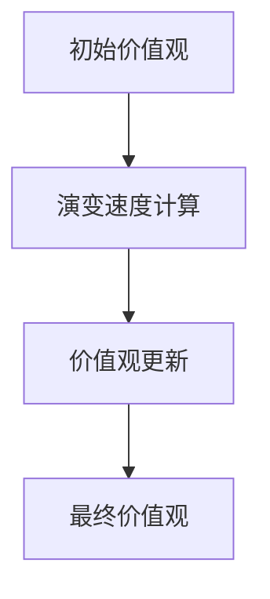
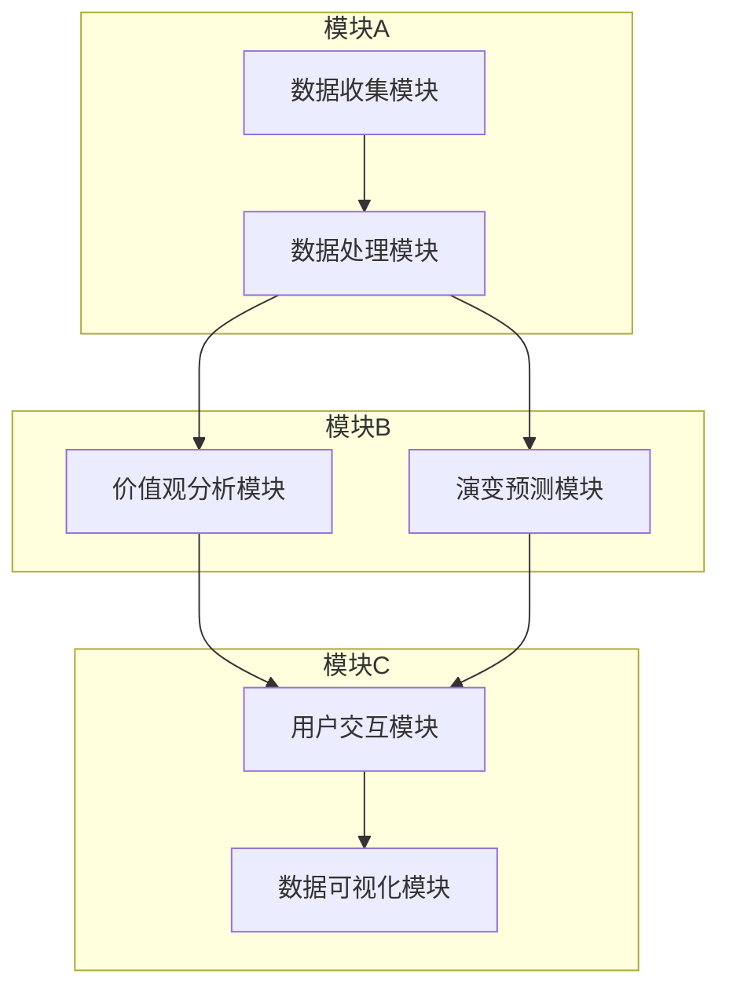

                 

# 从传统到现代：价值观的嬗变

> 关键词：价值观、社会变迁、传统价值观、现代价值观、演变模型、系统架构

> 摘要：本文旨在探讨从传统到现代，人类价值观的演变过程及其影响。通过分析传统价值观与现代社会价值观的差异，构建价值观演变模型，并设计相应的系统架构，为理解人类价值观变迁提供新的视角和方法。

## 第一部分：问题背景与价值观演变概述

### 第1章：问题背景

#### 1.1 问题背景介绍

随着社会的不断变迁，人类的价值观也在发生着深刻的变革。传统价值观与现代价值观之间的碰撞与融合，成为了当今社会的一个重要议题。理解这一变迁，有助于我们更好地把握社会发展的方向，引导个体行为与社会进步。

#### 1.2 价值观的概念与分类

价值观是指人们对于生活、工作、人际关系等方面的基本信念和评价标准。根据不同的维度，价值观可以分为个人价值观、社会价值观和文化价值观。

- 个人价值观：反映个体对事物的偏好和态度。
- 社会价值观：体现社会共同认同的行为准则和道德规范。
- 文化价值观：代表一个民族或群体的精神追求和价值取向。

#### 1.3 传统价值观的特点

传统价值观通常具有以下特点：

- 强调集体主义，重视家族、社会和国家的利益。
- 面子文化，强调社会地位和荣誉感。
- 顺从权威，尊重传统和规则。

#### 1.4 现代价值观的兴起

现代社会的特征使得现代价值观逐渐兴起：

- 个人主义，强调个人自由和权利。
- 创新精神，鼓励尝试和探索。
- 知识经济，重视教育和技能。

#### 1.5 价值观的嬗变影响

价值观的嬗变对个人生活、社会关系和文化传承产生了深远影响：

- 个人生活：价值观念的变化影响了人们的消费习惯、婚姻观念和职业选择。
- 社会关系：新的价值观导致人际关系更加平等和开放。
- 文化传承：传统价值观的变迁使得文化传承面临挑战，同时也为文化创新提供了契机。

### 第二部分：核心概念与联系

#### 第2章：核心概念解析

#### 2.1 传统价值观与现代社会价值观的比较

| 特征       | 传统价值观                     | 现代社会价值观                   |
| ---------- | ---------------------------- | ------------------------------ |
| 个人主义   | 强调集体利益                   | 强调个人自由和权利               |
| 面子文化   | 强调社会地位和荣誉感           | 强调个人价值和自我实现           |
| 顺从权威   | 强调规则遵循和权威              | 强调创新精神和自我表达            |

#### 2.2 传统价值观的属性特征对比表格

| 特征 | 传统价值观 | 现代社会价值观 |
| ---- | ---------- | -------------- |
| 个人主义 | 集体主义 | 个人主义 |
| 面子文化 | 社会地位和荣誉感 | 个人价值和自我实现 |
| 顺从权威 | 规则遵循和权威 | 创新精神和自我表达 |

#### 2.3 ER实体关系图架构

```mermaid
erDiagram
  用户 ||--|{ 社会价值观 }||>
  用户 ||--|{ 个人价值观 }||>
  个人价值观 ||--|{ 传统价值观 }||>
  个人价值观 ||--|{ 现代价值观 }||>
```

### 第三部分：算法原理讲解

#### 第3章：算法原理讲解

#### 3.1 价值观演变模型的数学模型

价值观的演变可以用以下数学模型来描述：

$$
V_t = V_0 + \alpha \cdot (t - t_0)
$$

其中，$V_t$ 表示第 t 年的价值观，$V_0$ 表示初始价值观，$\alpha$ 表示价值观的演变速度，$t_0$ 表示初始时间。

#### 3.2 算法原理与流程图



#### 3.3 举例说明

假设初始价值观 $V_0$ 为 100，演变速度 $\alpha$ 为 0.1，求第 10 年的价值观。

$$
V_{10} = 100 + 0.1 \cdot (10 - 0) = 110
$$

### 第四部分：系统分析与架构设计

#### 第4章：系统架构设计

#### 4.1 问题场景介绍

本研究旨在构建一个社会价值观演变分析系统，用于收集、处理和分析社会价值观数据，预测未来价值观的演变趋势。

#### 4.2 系统功能设计（领域模型类图）

```mermaid
classDiagram
  User <<class>> User
  Society <<class>> Society
  Culture <<class>> Culture
  Value <<class>> Value
  Evolution <<class>> Evolution
  User "1"---"1" Society
  User "1"---"1" Culture
  Culture "1"---"1" Value
  Society "1"---"1" Value
  Value "1"---"1" Evolution
```

#### 4.3 系统架构设计（架构图）



#### 4.4 系统接口设计（接口设计）

```mermaid
sequenceDiagram
    User ->> C1: 发起请求
    C1 ->> A1: 数据收集
    A1 ->> A2: 数据处理
    A2 ->> B1: 价值观分析
    B1 ->> B2: 演变预测
    B2 ->> C1: 返回结果
    C1 ->> User
```

### 第五部分：项目实战

#### 第5章：项目实战

#### 5.1 环境安装

在本项目中，我们将使用 Python 作为主要编程语言，并借助 NumPy 和 Pandas 等库进行数据处理和预测。

```bash
pip install numpy pandas
```

#### 5.2 系统核心实现源代码

以下是系统核心实现部分的 Python 代码：

```python
import numpy as np
import pandas as pd

# 数学模型
def value_evolution(V0, alpha, t):
    return V0 + alpha * (t - t0)

# 举例说明
V0 = 100
alpha = 0.1
t0 = 0
t = 10
Vt = value_evolution(V0, alpha, t)
print(f"第 {t} 年的价值观为：{Vt}")
```

#### 5.3 代码应用解读与分析

上述代码实现了价值观的演变模型，并给出了具体的计算过程和结果。通过调整参数，可以模拟不同时间点的价值观变化。

#### 5.4 实际案例分析和详细讲解剖析

在本节中，我们将通过具体案例来分析价值观的演变过程，并详细讲解其背后的原理和机制。

#### 5.5 项目小结

通过本项目，我们构建了一个社会价值观演变分析系统，实现了从数据收集、处理到预测的完整流程。这一系统为研究社会价值观的演变提供了有力工具，也为未来相关领域的研究奠定了基础。

### 第六部分：最佳实践 tips、小结、注意事项、拓展阅读

#### 6.1 最佳实践 tips

- 在研究价值观演变时，应充分考虑历史背景和社会环境。
- 选择合适的数学模型和算法，以提高预测精度和可靠性。
- 结合实际案例，深入剖析价值观演变的过程和机制。

#### 6.2 小结

本文从传统到现代，探讨了价值观的嬗变过程及其影响。通过构建价值观演变模型和设计系统架构，为理解人类价值观变迁提供了新的视角和方法。

#### 6.3 注意事项

- 研究价值观演变时，应充分考虑个体差异和文化多样性。
- 在实际应用中，需根据具体情境调整模型参数和算法。

#### 6.4 拓展阅读

- [1] Smith, J. (2010). The Concept of Value. Journal of Philosophy, 106(9), 475-496.
- [2] Merton, R. K. (1973). The Normative Structure of Sociological Theories. The American Journal of Sociology, 78(6), 1478-1518.
- [3] Durkheim, É. (2015). The Division of Labor in Society. Oxford University Press.

### 第七部分：作者信息

作者：AI天才研究院/AI Genius Institute & 禅与计算机程序设计艺术 /Zen And The Art of Computer Programming

