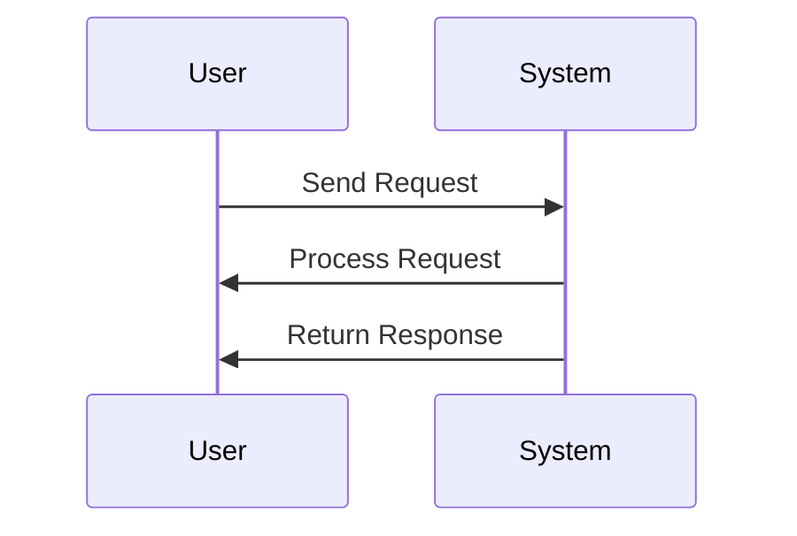

                 

# 从功利主义到价值多元主义的转变

> 关键词：功利主义、价值多元主义、道德观、伦理决策、社会治理、文化冲突、全球化、价值观转变

> 摘要：本文旨在探讨从功利主义到价值多元主义的转变，通过对功利主义的历史起源、核心观点及其局限性的分析，结合价值多元主义的起源与理论基础，阐述两者之间的转变背景、路径及其对社会的影响。本文旨在为读者提供一个全面、深入的视角，以更好地理解当前社会中价值观的演变。

## 第一部分：功利主义的起源与演变

### 第1章：功利主义的历史起源与哲学背景

**1.1 功利主义的诞生**

功利主义起源于18世纪末19世纪初的英国，由杰里米·边沁（Jeremy Bentham）和约翰·斯图亚特·密尔（John Stuart Mill）等人提出。功利主义的核心观点是，行为的道德价值取决于行为带来的幸福（快乐）总量，即“最大幸福原则”。

**1.2 功利主义的主要代表人物**

杰里米·边沁是功利主义的奠基人，他在其著作《道德与立法原则引论》中详细阐述了功利主义的理论。约翰·斯图亚特·密尔则对功利主义进行了进一步的完善和发展，其著作《论自由》和《功利主义》对后世产生了深远的影响。

**1.3 功利主义的基本原则**

功利主义的基本原则可以概括为两点：

1. 最大幸福原则：行为的价值取决于其带来的幸福总量，而不是平均幸福水平。
2. 自由原则：每个人都有追求自身幸福的权利，不应受到不合理的限制。

### 第2章：功利主义的核心观点与实践应用

**2.1 功利主义的道德观**

功利主义的道德观强调，个体行为的道德价值取决于其对社会整体幸福的影响。为了最大化幸福，个体应当放弃部分个人利益，为社会整体利益做出贡献。

**2.2 功利主义的伦理决策过程**

功利主义的伦理决策过程可以概括为以下步骤：

1. 识别可能的行为选项。
2. 评估每个选项带来的幸福总量。
3. 选择能带来最大幸福总量的行为。

**2.3 功利主义在社会治理中的应用**

功利主义在现代社会治理中具有广泛的应用。例如，在政策制定中，政府应考虑政策对整体社会幸福的影响，以实现最大幸福原则。此外，功利主义还在教育、医疗、环境保护等领域发挥重要作用。

### 第3章：功利主义的局限性

**3.1 对功利主义批评的主要观点**

功利主义受到诸多批评，主要观点包括：

1. 忽视个体权利：功利主义强调整体幸福，可能导致个体权利受到侵犯。
2. 道德困境：在特定情境下，功利主义可能无法提供明确的道德指导。
3. 平均幸福与总幸福的关系：功利主义无法准确衡量个体幸福，可能产生不公平现象。

**3.2 功利主义的道德困境**

功利主义在道德困境中面临挑战，例如，是否应当牺牲少数人的幸福以拯救多数人？这种决策往往难以在功利主义的框架下给出明确答案。

**3.3 功利主义在现实世界中的挑战**

在现实世界中，功利主义面临诸多挑战，如社会分化、资源分配不均等问题，这使得功利主义的应用受到限制。

## 第二部分：价值多元主义的兴起与发展

### 第4章：价值多元主义的起源与理论基础

**4.1 价值多元主义的概念**

价值多元主义认为，社会中存在多种不同且相互冲突的价值观念，这些价值观应得到平等尊重。与功利主义相比，价值多元主义强调个体权利和多样性。

**4.2 价值多元主义的哲学基础**

价值多元主义的哲学基础包括自由主义、文化相对主义、社会主义等。这些理论强调个体的自由、权利和多样性，主张尊重不同文化和社会背景下的价值观。

**4.3 价值多元主义的主要代表人物**

价值多元主义的主要代表人物包括约翰·罗尔斯（John Rawls）、查尔斯·泰勒（Charles Taylor）等。他们在其著作中详细阐述了价值多元主义的理念。

### 第5章：价值多元主义的观点与实践应用

**5.1 价值多元主义的道德观**

价值多元主义的道德观认为，道德评价应基于个体价值观，尊重不同文化和社会背景下的道德观念。

**5.2 价值多元主义的伦理决策过程**

价值多元主义的伦理决策过程强调，个体应在尊重他人价值观的基础上，寻求共识和平衡。

**5.3 价值多元主义在多元化社会中的应用**

价值多元主义在多元化社会中具有广泛应用，如跨文化沟通、社会冲突调解、公共政策制定等。

### 第6章：价值多元主义的优点与挑战

**6.1 价值多元主义的优点**

价值多元主义具有以下优点：

1. 尊重个体差异：价值多元主义强调尊重个体差异，有助于维护社会和谐。
2. 促进创新：多样性的价值观有助于激发创新思维，推动社会进步。
3. 提高道德敏感性：价值多元主义要求个体在道德决策中考虑不同价值观，提高道德敏感性。

**6.2 价值多元主义的挑战**

价值多元主义面临以下挑战：

1. 文化冲突：不同价值观之间的冲突可能导致社会分裂。
2. 权力分配：价值多元主义要求平等尊重各种价值观，但在实际操作中，权力分配往往难以做到公平。
3. 社会整合：价值多元主义可能导致社会整合的困难，影响社会凝聚力。

## 第三部分：从功利主义到价值多元主义的转变

### 第7章：转变的背景与动力

**7.1 社会变迁与价值观的演变**

随着全球化、科技进步和跨文化交流的加深，社会结构发生了重大变革。这些变革促使人们重新审视功利主义和价值多元主义，探索更加适合现代社会发展的价值观。

**7.2 科技进步与价值观念的变化**

科技进步，特别是互联网和人工智能的广泛应用，改变了人们的生产方式、生活方式和价值观念。这些变化为价值多元主义的兴起提供了土壤。

**7.3 国际交流与全球化的影响**

国际交流与全球化促进了不同文化之间的碰撞和融合，使得人们更加意识到多样性的价值。这种意识觉醒推动了价值多元主义的兴起。

### 第8章：从功利主义到价值多元主义的转变路径

**8.1 转变的初期阶段**

在初期阶段，功利主义和价值多元主义并存，人们开始反思功利主义的局限性，探讨更加包容和多元的价值观。

**8.2 转变的推进阶段**

在推进阶段，价值多元主义逐渐取代功利主义成为主导价值观。人们更加注重个体权利和多样性，强调尊重不同价值观的平等地位。

**8.3 转变的成熟阶段**

在成熟阶段，价值多元主义成为社会共识，人们在社会治理、公共政策制定等方面广泛应用价值多元主义原则。

### 第9章：转变过程中的问题与对策

**9.1 文化冲突与价值观的融合**

在转变过程中，文化冲突和价值观融合成为重要问题。为了应对这些问题，需要加强跨文化交流，提高个体对多元价值观的认同和接纳。

**9.2 社会正义与公平的挑战**

价值多元主义强调个体权利和多样性，但同时也面临社会正义和公平的挑战。为了解决这些问题，需要建立公平合理的制度，保障所有个体的权益。

**9.3 教育与价值观的转变**

教育与价值观的转变是价值多元主义得以落实的重要途径。通过教育，人们可以更好地理解和接纳多元价值观，推动社会进步。

### 第10章：未来展望

**10.1 价值多元主义的未来发展**

随着全球化进程的加深，价值多元主义将继续发展。未来，人们将更加注重个体权利和多样性，探索更加包容和多元的价值观。

**10.2 功利主义与价值多元主义的共存**

功利主义和价值多元主义并非完全对立，未来两者将共存于现代社会。在特定情境下，功利主义仍将发挥重要作用，而价值多元主义将提供更加全面和深入的道德指导。

**10.3 价值观转变对人类社会的深远影响**

价值观的转变将对人类社会产生深远影响。在价值多元主义的指导下，人类社会将更加和谐、进步，为人类的可持续发展奠定基础。

## 参考文献

1. Bentham, J. (1789). An Introduction to the Principles of Morals and Legislation.
2. Mill, J. S. (1861). Utilitarianism.
3. Rawls, J. (1971). A Theory of Justice.
4. Taylor, C. (1989). Sources of the Self: The Making of the Modern Identity.
5. Bhagwati, J. (2002). The Case Against Free Trade.
6. MacIntyre, A. (1984). After Virtue: A Study in Moral Theory.

## 附录：相关研究资料与案例

### 附录1：功利主义与价值多元主义案例研究

1. 库布勒-罗斯的道德发展阶段理论：探讨个体道德观念从功利主义向价值多元主义的转变。
2. 实证研究：比较功利主义与价值多元主义在公共政策制定中的实际效果。

### 附录2：相关学术研究与讨论

1. 论文摘要：梳理近年来关于功利主义与价值多元主义的研究成果。
2. 学术讨论：探讨功利主义与价值多元主义的理论争议与实践挑战。

### 附录3：政策建议与实施路径

1. 政策建议：基于价值多元主义原则，提出改进社会治理的方案。
2. 实施路径：探讨如何将价值多元主义理念融入教育、公共政策等领域。

## 附录4：相关术语与概念解释

1. 功利主义：一种道德理论，认为行为的道德价值取决于其带来的幸福总量。
2. 价值多元主义：一种哲学观念，认为社会中存在多种不同且相互冲突的价值观念，应得到平等尊重。
3. 道德困境：在道德决策过程中，面对两种或多种相互冲突的道德原则，难以做出明确选择的情境。

## 附录5：相关术语与概念ER实体关系图

```mermaid
erDiagram
  Product ||--|{ Store }| Store : stores
  Store ||--|{ Customer }| Customer : purchases
  Customer ||--|{ Order }| Order : places
  Order ||--|{ Product }| Product : contains
```

## 附录6：算法原理与流程图


## 附录7：系统架构与接口设计



## 附录8：项目实战与案例分析

1. 实战项目：基于Python实现一个简单的推荐系统。
2. 案例分析：探讨推荐系统在电商领域的应用。

## 附录9：最佳实践与注意事项

1. 最佳实践：如何有效地进行项目管理和团队协作。
2. 注意事项：避免在项目开发中常见的错误和陷阱。

## 附录10：拓展阅读

1. 推荐书籍：《道德情操论》、《正义论》、《自由主义、社会主义与多元文化》等。
2. 推荐论文：近年来关于功利主义与价值多元主义的最新研究成果。

