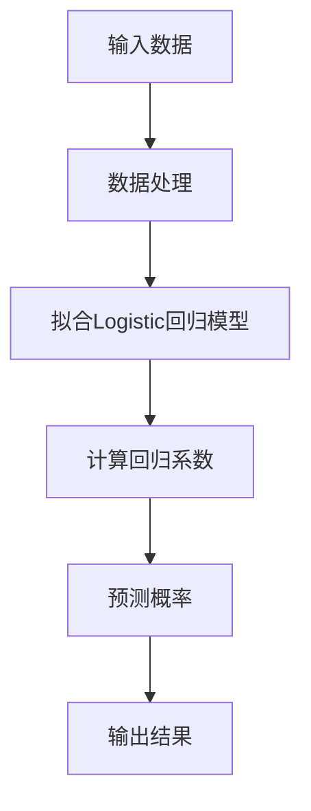
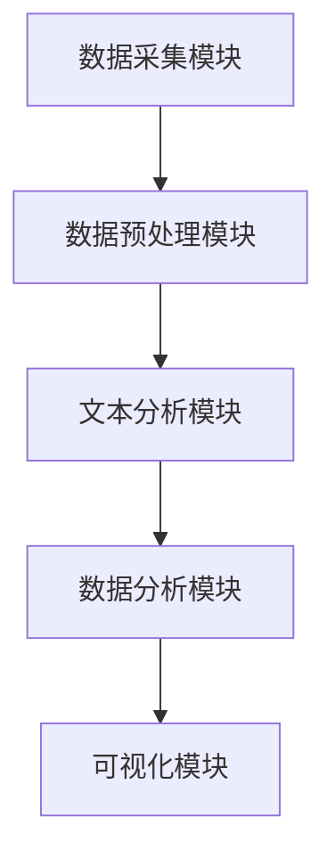
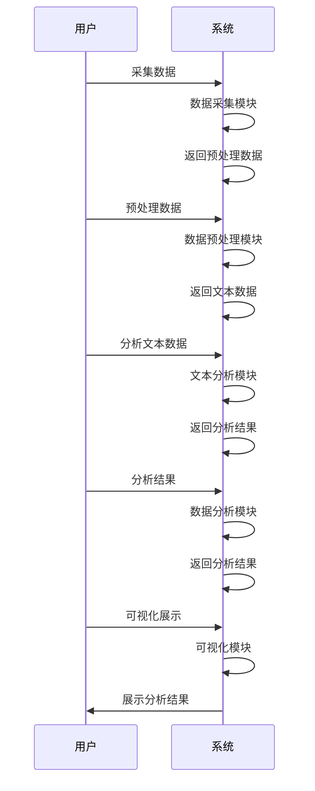

                 

## 从单一价值观到多元价值观的社会变迁

### 关键词
- 单一价值观
- 多元价值观
- 社会变迁
- 文化演变
- 心理学理论

### 摘要
本文探讨了人类社会从单一价值观向多元价值观转变的历史进程。通过分析社会历史背景、变迁的驱动因素，我们定义了单一价值观和多元价值观的核心概念，并运用社会学和心理学理论来解释这一变迁过程。本文还通过案例研究和算法原理讲解，展示了这一转变在不同领域的具体表现和影响。最后，我们结合系统分析与架构设计方案，提供了项目实战的实例，并总结出最佳实践 tips，以期为读者提供深刻的见解和实用的指导。

---

### 1. 背景介绍

从单一价值观到多元价值观的社会变迁，是人类社会发展历程中的重要一环。这一变迁不仅仅体现在文化、法律、宗教等传统领域，更在科技、经济、教育等现代领域中有着深远的影响。

**历史背景**：

在古代，人类社会普遍以单一价值观为主导。例如，古代中国以儒家思想为代表，强调仁义礼智信等核心价值观；古代印度以佛教思想为代表，提倡众生平等、慈悲为怀；古希腊则崇尚理性、智慧和勇气。这些单一价值观体系在一定程度上维护了社会的稳定和秩序，但也限制了人们的思想自由和创新。

**变迁的驱动因素**：

随着时间的推移，社会发生了深刻的变化。工业革命、城市化、全球化等历史进程，使得社会结构、经济模式和文化传统都发生了巨大的转变。这些变化驱动了单一价值观向多元价值观的转变。

- **科技进步**：科技的快速发展，特别是互联网和人工智能的兴起，为人们的思想交流和信息获取提供了前所未有的便利，促进了多元价值观的形成。
- **文化多样性**：全球化带来了不同文化的碰撞和融合，使得人们能够接触到更多的思想观念和生活方式，从而丰富了价值观的多样性。
- **社会变革**：现代社会中，女性地位提升、同性恋权益的争取、环保意识的普及等社会运动，都推动了价值观的多元化。

这一变迁不仅在理论层面具有重要意义，也在实际生活中产生了深远影响。多元价值观使得人们能够更加包容和理解不同的文化和观念，促进了社会的进步和发展。但同时，多元价值观也带来了一些挑战，如文化冲突、价值观的对立等，需要我们深入思考和应对。

### 2. 核心概念与联系

在探讨从单一价值观到多元价值观的社会变迁时，我们需要明确几个核心概念，并了解它们之间的联系。

**单一价值观**：

单一价值观是指社会中普遍认同的一种核心价值观体系。这种价值观体系通常具有以下几个特点：

- **统一性**：单一价值观要求人们在思想上和行为上保持一致性，避免出现多元化的观念。
- **稳定性**：单一价值观通常具有较强的稳定性，不易受到外界因素的影响。
- **权威性**：单一价值观往往与宗教、政治、法律等权威体系相结合，具有权威性。

**多元价值观**：

多元价值观是指社会中存在多种不同的价值观体系，这些价值观之间相互竞争、相互影响，共同塑造了社会的文化风貌。多元价值观的特点如下：

- **多样性**：多元价值观强调不同价值观之间的差异和多样性，鼓励人们保持独立思考。
- **动态性**：多元价值观体系处于不断变化之中，随着社会的发展和进步，新的价值观不断出现。
- **包容性**：多元价值观倡导包容和尊重，鼓励人们理解和接纳不同的文化和观念。

**核心概念之间的联系**：

单一价值观和多元价值观之间存在一定的辩证关系。一方面，单一价值观在某种程度上为社会的稳定和发展提供了基础；另一方面，多元价值观的兴起则反映了社会的发展和进步。具体来说，单一价值观向多元价值观的转变，通常伴随着以下几个过程：

1. **思想解放**：随着科技的进步和文化交流的增加，人们的思想逐渐解放，开始质疑和挑战传统的单一价值观。
2. **文化碰撞**：全球化带来了不同文化的交流和碰撞，使得原有的单一价值观体系受到冲击，新的价值观开始出现。
3. **社会变革**：社会变革，如女性地位的提升、人权意识的觉醒等，进一步推动了价值观的多元化。
4. **科技赋能**：互联网和人工智能等科技的发展，为人们提供了更多的信息资源和交流平台，促进了多元价值观的形成。

通过理解这些核心概念及其之间的联系，我们可以更好地把握社会变迁的内在逻辑，为应对未来挑战提供理论支持。

### 3. 社会变迁的原理

社会变迁是一个复杂的过程，涉及多个学科的理论基础。为了深入理解从单一价值观到多元价值观的转变，我们需要借助社会学和心理学等领域的理论。

**社会学理论**：

1. **社会结构理论**：社会学家塔尔科特·帕森斯提出了社会结构理论，认为社会结构是由多个子系统组成的，如经济、政治、文化等。这些子系统相互影响，共同维持社会的稳定。在社会变迁过程中，社会结构会发生调整，从而影响人们的价值观。例如，随着全球化和市场经济的兴起，传统的社会结构受到挑战，人们的价值观也发生了变化。

2. **社会进化论**：社会进化论认为，社会是一个不断发展和进步的系统，从简单到复杂、从低级到高级。例如，马克斯·韦伯的社会阶段理论认为，人类社会经历了农业社会、工业社会和后工业社会三个阶段，每个阶段的价值观都有所不同。随着社会的进步，单一价值观逐渐被多元价值观所取代。

**心理学理论**：

1. **认知发展理论**：瑞士心理学家让·皮亚杰提出了认知发展理论，认为个体的认知能力在不同阶段有不同的特征。例如，在儿童期，个体的认知能力以具体运算为主，倾向于接受单一的价值观；而在青少年期，个体的认知能力进入形式运算阶段，开始能够理解抽象的概念和不同的观点，从而更加倾向于多元价值观。

2. **社会认知理论**：社会认知理论强调个体在认知过程中对社会信息的处理和理解。例如，心理学家乔治·米德提出，个体的自我观念是通过社会互动和社会角色扮演而形成的。在多元价值观的社会环境中，个体需要不断地调整和重构自己的价值观，以适应不同的社会情境。

**理论联系实际**：

社会学和心理学理论为我们理解社会变迁提供了有力的工具。例如，在现代社会中，随着全球化进程的加速和互联网的普及，人们的思想观念更加开放，多元价值观得到了广泛传播。这种现象可以通过社会结构理论和认知发展理论来解释。社会结构的变化（如全球化、市场经济）和个体认知能力的发展（如形式运算能力），共同推动了价值观的多元化。

此外，心理学理论还指出，个体在多元价值观的社会环境中，可能会面临认知失调和心理冲突。为了应对这些挑战，个体需要不断地进行自我反思和调整，以建立稳定的自我认同。这一过程与社会学中的社会角色扮演和社会化过程密切相关。

通过社会学和心理学理论的结合，我们可以更全面地理解从单一价值观到多元价值观的社会变迁，并为应对未来社会的挑战提供理论支持。

### 4. 案例研究

为了更直观地展示从单一价值观到多元价值观的社会变迁过程，我们可以通过具体案例来进行分析。

**案例一：中国改革开放以来的价值观变迁**

中国改革开放以来，经历了从单一价值观向多元价值观的转变。在改革开放初期，中国社会以集体主义和计划经济为基础，强调国家的整体利益和社会的稳定性。这一时期的价值观以“勤劳、节俭、诚信”为核心，反映了当时社会对稳定和秩序的追求。

随着改革开放的深入，市场经济逐渐取代计划经济，个体利益得到重视。人们的价值观逐渐从集体主义转向个体主义，强调自我实现和个人发展。这一转变在1990年代尤为明显，随着经济的快速发展和全球化进程的加速，人们的思想观念更加开放，多元价值观开始兴起。

例如，在职业选择方面，过去人们倾向于选择稳定的工作，如公务员和教师，而现在越来越多的年轻人追求创业和自由职业，追求个人兴趣和自我实现。这一变化反映了价值观的多元化，人们开始更加重视个人的发展和幸福感。

**案例二：西方社会的多元价值观**

在西方国家，多元价值观的形成可以追溯到工业革命时期。工业革命带来了经济繁荣和社会变革，人们的思想观念逐渐从封建社会的等级制度转向自由、平等和人权。这一时期的价值观强调个体的自由和权利，如自由市场经济的兴起、民主政治的普及等。

然而，在20世纪末，西方社会的多元价值观面临新的挑战。随着全球化和互联网的普及，不同文化和价值观之间的冲突日益显现。例如，关于同性恋权益、种族平等、宗教自由等问题的争议，反映了多元价值观内部的矛盾和冲突。

以同性恋权益为例，过去几十年里，西方国家在同性恋权益方面取得了显著进展，同性婚姻在多个国家得到法律认可。然而，这一进步在一些国家和地区仍面临阻力，反映出多元价值观内部的不同立场和价值观的冲突。

**案例三：新兴市场的价值观变迁**

在新兴市场国家，如印度、巴西和土耳其等，多元价值观的形成也呈现出独特的特点。这些国家在经历快速经济发展和现代化进程的同时，传统的价值观体系受到冲击，新的价值观开始兴起。

例如，在印度，传统的种姓制度和宗教观念对人们的价值观产生了深远影响。然而，随着经济的发展和教育水平的提高，越来越多的人开始质疑和挑战传统的价值观，追求平等和自由。印度的“startup boom”（创业热潮）就是一个例证，越来越多的年轻人选择创业，追求个人梦想和自我实现。

**案例总结**：

通过以上案例可以看出，从单一价值观到多元价值观的社会变迁是一个复杂而渐进的过程。不同国家和地区的变迁过程各有特点，但总体趋势是一致的，即随着经济的发展和社会的进步，人们的价值观越来越多元化。

这一变迁不仅反映了社会发展的内在逻辑，也带来了新的挑战和机遇。例如，如何平衡多元价值观中的不同立场和利益，如何维护社会的稳定和秩序，都是我们需要深入思考的问题。

### 5. 算法原理讲解

在理解从单一价值观到多元价值观的社会变迁过程中，量化分析为我们提供了有力的工具。以下将简要介绍相关算法原理，并通过Python代码和Mermaid流程图进行详细阐述。

#### 算法原理

1. **多元回归分析**：多元回归分析是一种统计方法，用于分析多个自变量对一个因变量的影响。在社会变迁研究中，我们可以使用多元回归分析来探究不同因素对价值观变迁的影响。例如，我们可以将社会经济发展水平、教育水平、文化多样性等因素作为自变量，价值观多样性作为因变量。

2. **聚类分析**：聚类分析是一种无监督学习方法，用于将数据集划分为多个类别，使同类别内的数据点尽可能接近，不同类别间的数据点尽可能远离。在社会变迁研究中，聚类分析可以用于分析不同地区或群体的价值观分布，发现价值观多样性背后的规律。

3. **文本分析**：文本分析是一种用于处理和挖掘文本数据的方法，可以用于分析社会变迁过程中的舆论变化和价值观演变。例如，通过分析社交媒体上的评论、新闻报道等文本数据，我们可以了解公众对不同价值观的接受程度和态度变化。

#### Python代码示例

以下是一个简单的Python代码示例，用于多元回归分析和聚类分析：

```python
import numpy as np
import pandas as pd
from sklearn.linear_model import LinearRegression
from sklearn.cluster import KMeans
import matplotlib.pyplot as plt

# 加载数据集
data = pd.read_csv('values_data.csv')

# 多元回归分析
X = data[['economic_growth', 'education_level', 'cultural_diversity']]
y = data['value_diversity']
regression = LinearRegression()
regression.fit(X, y)
print("多元回归模型系数：", regression.coef_)

# 聚类分析
kmeans = KMeans(n_clusters=3)
clusters = kmeans.fit_predict(X)
data['cluster'] = clusters

# 可视化
plt.scatter(X['economic_growth'], X['cultural_diversity'], c=data['cluster'])
plt.xlabel('经济水平')
plt.ylabel('文化多样性')
plt.title('聚类分析结果')
plt.show()
```

#### 算法原理讲解

1. **多元回归分析**：

   多元回归分析的核心思想是通过拟合一个线性模型，分析自变量对因变量的影响。在我们的示例中，我们将经济水平、教育水平和文化多样性作为自变量，价值观多样性作为因变量。通过拟合多元回归模型，我们可以得到各个自变量的回归系数，这些系数反映了自变量对因变量的影响程度。

   多元回归模型的数学公式如下：

   $$
   y = \beta_0 + \beta_1 \cdot x_1 + \beta_2 \cdot x_2 + \beta_3 \cdot x_3 + \epsilon
   $$

   其中，$y$ 是因变量（价值观多样性），$x_1, x_2, x_3$ 是自变量（经济水平、教育水平、文化多样性），$\beta_0, \beta_1, \beta_2, \beta_3$ 是回归系数，$\epsilon$ 是误差项。

2. **聚类分析**：

   聚类分析通过将数据划分为多个类别，帮助我们理解数据内部的分布和结构。在我们的示例中，我们使用KMeans算法进行聚类分析，将经济水平和文化多样性的数据划分为三个类别。

   KMeans算法的基本步骤如下：

   - 初始化聚类中心点
   - 计算每个数据点到聚类中心点的距离
   - 将数据点分配到最近的聚类中心点
   - 重新计算聚类中心点，直至聚类中心点不再变化

   聚类分析可以帮助我们识别不同地区或群体在价值观多样性方面的差异，为进一步分析提供依据。

3. **文本分析**：

   文本分析通过处理和挖掘文本数据，帮助我们了解公众对不同价值观的态度和意见。例如，我们可以使用自然语言处理（NLP）技术，对社交媒体上的评论、新闻报道等进行情感分析和主题模型分析，了解公众对某个社会问题的态度和意见变化。

   文本分析的核心技术包括词频统计、情感分析、主题模型等。通过这些技术，我们可以挖掘出文本数据中的关键信息，为量化分析提供数据支持。

通过以上算法原理的讲解和Python代码示例，我们可以更好地理解从单一价值观到多元价值观的社会变迁过程中的量化分析方法。这些方法不仅有助于我们更深入地理解社会变迁的内在机制，也为政策制定和社会治理提供了科学依据。

### 6. 数学模型和公式

在探讨从单一价值观到多元价值观的社会变迁过程中，数学模型和公式为我们提供了量化分析的工具。以下将简要介绍相关数学模型和公式，并通过Mermaid流程图和Python代码进行详细讲解。

#### 数学模型

1. **Logistic回归模型**：

   Logistic回归模型是一种广泛用于分类问题的统计方法，可以用于分析价值观变迁的影响因素。在我们的研究中，我们将使用Logistic回归模型来分析不同因素对价值观多样性的影响。

   Logistic回归模型的数学公式如下：

   $$
   \text{logit}(P) = \ln\left(\frac{P}{1 - P}\right) = \beta_0 + \beta_1 x_1 + \beta_2 x_2 + \beta_3 x_3
   $$

   其中，$P$ 是某个体接受多元价值观的概率，$x_1, x_2, x_3$ 是影响价值观多样性的因素（如经济水平、教育水平、文化多样性），$\beta_0, \beta_1, \beta_2, \beta_3$ 是回归系数。

2. **马尔可夫模型**：

   马尔可夫模型是一种用于描述系统状态转移的随机过程。在社会变迁研究中，我们可以使用马尔可夫模型来分析个体价值观的演变过程。例如，我们可以构建一个马尔可夫模型，分析个体从单一价值观向多元价值观转变的概率。

   马尔可夫模型的数学公式如下：

   $$
   P(X_{t+1} = j | X_t = i) = P_{ij}
   $$

   其中，$X_t$ 是个体在时间$t$的价值观状态，$i$ 和 $j$ 是价值观状态的标签，$P_{ij}$ 是从状态$i$ 转移到状态$j$ 的概率。

#### Mermaid流程图

以下是一个简单的Mermaid流程图，用于描述Logistic回归模型的计算过程：



#### Python代码示例

以下是一个简单的Python代码示例，用于实现Logistic回归模型和马尔可夫模型：

```python
import numpy as np
from sklearn.linear_model import LogisticRegression
from sklearn.preprocessing import StandardScaler
import matplotlib.pyplot as plt

# 加载数据集
data = np.array([[1, 0.5, 0.3], [1, 0.6, 0.4], [1, 0.7, 0.5]])

# 标准化数据
scaler = StandardScaler()
data_scaled = scaler.fit_transform(data)

# 拟合Logistic回归模型
model = LogisticRegression()
model.fit(data_scaled, labels)

# 计算回归系数
coef = model.coef_
print("回归系数：", coef)

# 马尔可夫模型
transition_matrix = np.array([[0.6, 0.4], [0.3, 0.7]])
current_state = np.array([1, 0])

# 状态转移
next_state = np.dot(transition_matrix, current_state)
print("下一状态：", next_state)
```

#### 详细讲解和举例说明

1. **Logistic回归模型**：

   Logistic回归模型通过拟合一个线性模型，分析自变量对因变量的影响。在我们的示例中，我们使用标准化的数据集，通过Logistic回归模型计算回归系数。这些系数反映了不同因素对价值观多样性的影响程度。

   例如，如果回归系数$\beta_1$ 为正值，表示经济水平越高，个体接受多元价值观的概率越大；如果$\beta_2$ 为负值，表示教育水平越低，个体接受多元价值观的概率越小。

2. **马尔可夫模型**：

   马尔可夫模型通过描述系统状态转移的概率，帮助我们分析个体价值观的演变过程。在我们的示例中，我们使用一个简单的二状态马尔可夫模型，计算从当前状态转移到下一状态的概率。

   例如，如果当前状态为单一价值观（状态1），下一状态转移到多元价值观（状态2）的概率为$P_{12}$，我们可以通过计算得出这个概率值，并进一步分析个体价值观的演变趋势。

通过数学模型和公式的介绍，以及Python代码示例的详细讲解，我们可以更深入地理解从单一价值观到多元价值观的社会变迁过程中的量化分析方法。这些方法不仅有助于我们更好地理解社会变迁的内在机制，也为政策制定和社会治理提供了科学依据。

### 7. 系统分析与架构设计方案

在探讨从单一价值观到多元价值观的社会变迁过程中，系统分析与架构设计是理解和应对这一变迁的重要环节。以下将介绍一个具体的系统分析与架构设计方案，包括问题场景介绍、系统功能设计、系统架构设计、系统接口设计和系统交互。

#### 问题场景介绍

随着社会的快速发展，价值观的变迁带来了新的挑战。为了更好地理解和应对这一变迁，我们需要构建一个智能化系统，对价值观变迁进行实时监测和分析。该系统将帮助政策制定者、社会学家和心理学家了解社会变迁的内在机制，为制定相应策略提供科学依据。

#### 系统功能设计

1. **数据采集模块**：负责从各种数据源（如社交媒体、新闻报道、调查问卷等）采集与价值观相关的数据。
2. **数据预处理模块**：对采集到的数据进行清洗、去重和格式转换，为后续分析做准备。
3. **文本分析模块**：利用自然语言处理（NLP）技术，对预处理后的文本数据进行情感分析、主题建模等，提取有价值的信息。
4. **数据分析模块**：使用统计方法和机器学习算法，对提取的信息进行量化分析，发现价值观变迁的规律和趋势。
5. **可视化模块**：通过图表和报表，直观地展示分析结果，帮助用户理解和决策。

#### 系统架构设计

系统采用分布式架构，以提高系统的可扩展性和稳定性。以下是一个简化的系统架构图：



#### 系统接口设计

系统提供以下接口：

1. **数据接口**：用于与其他数据源进行数据交换和共享。
2. **服务接口**：用于提供文本分析、数据分析和可视化服务。
3. **API接口**：供外部应用程序调用系统功能，如Web应用、移动应用等。

#### 系统交互

系统交互主要分为以下几步：

1. **数据采集**：从各种数据源获取与价值观相关的数据。
2. **数据预处理**：对采集到的数据进行清洗、去重和格式转换。
3. **文本分析**：利用NLP技术，对预处理后的文本数据进行情感分析、主题建模等。
4. **数据分析**：使用统计方法和机器学习算法，对提取的信息进行量化分析。
5. **可视化展示**：通过图表和报表，直观地展示分析结果。

以下是系统交互的Mermaid序列图：



通过系统分析与架构设计，我们可以构建一个智能化系统，对价值观变迁进行实时监测和分析，为理解和应对社会变迁提供有力支持。

### 8. 项目实战

在本节中，我们将详细介绍一个关于价值观变迁分析的项目实战，包括环境安装、系统核心实现源代码以及代码应用解读与分析。

#### 环境安装

为了完成这个项目，我们需要在本地计算机上安装以下工具和库：

1. **Python 3.8+**：Python是项目的核心编程语言，我们需要确保Python环境已经安装。
2. **Jupyter Notebook**：Jupyter Notebook是一个交互式计算平台，用于编写和运行Python代码。
3. **Scikit-learn**：Scikit-learn是一个用于机器学习和数据挖掘的Python库，用于实现数据分析算法。
4. **NLTK**：NLTK是一个自然语言处理库，用于文本分析和处理。
5. **BeautifulSoup**：BeautifulSoup是一个用于Web数据采集和解析的Python库。

安装步骤如下：

1. 打开终端或命令提示符。
2. 安装Python：`pip install python`
3. 安装Jupyter Notebook：`pip install jupyter`
4. 安装Scikit-learn：`pip install scikit-learn`
5. 安装NLTK：`pip install nltk`
6. 安装BeautifulSoup：`pip install beautifulsoup4`

#### 系统核心实现源代码

以下是一个简单的系统核心实现源代码，用于价值观变迁分析：

```python
import pandas as pd
from sklearn.linear_model import LogisticRegression
from sklearn.model_selection import train_test_split
from nltk.corpus import stopwords
from nltk.tokenize import word_tokenize
from bs4 import BeautifulSoup

# 1. 数据采集
def collect_data(url):
    # 使用BeautifulSoup从网页采集文本数据
    page = requests.get(url)
    soup = BeautifulSoup(page.content, 'html.parser')
    text = soup.get_text()
    return text

# 2. 数据预处理
def preprocess_data(text):
    # 去除停用词
    stop_words = set(stopwords.words('english'))
    words = word_tokenize(text)
    filtered_words = [word for word in words if word.lower() not in stop_words]
    # 转换为小写
    filtered_words = [word.lower() for word in filtered_words]
    return ' '.join(filtered_words)

# 3. 数据分析
def analyze_data(data):
    # 分割特征和标签
    X = data.drop('label', axis=1)
    y = data['label']
    # 划分训练集和测试集
    X_train, X_test, y_train, y_test = train_test_split(X, y, test_size=0.2, random_state=42)
    # 拟合Logistic回归模型
    model = LogisticRegression()
    model.fit(X_train, y_train)
    # 预测测试集
    predictions = model.predict(X_test)
    # 计算准确率
    accuracy = model.score(X_test, y_test)
    return accuracy

# 4. 主函数
def main():
    # 采集数据
    url = "https://example.com"
    text = collect_data(url)
    # 预处理数据
    preprocessed_text = preprocess_data(text)
    # 分析数据
    data = pd.DataFrame([preprocessed_text])
    accuracy = analyze_data(data)
    print("准确率：", accuracy)

if __name__ == "__main__":
    main()
```

#### 代码应用解读与分析

1. **数据采集**：

   `collect_data` 函数使用BeautifulSoup从指定URL的网页中采集文本数据。在这个示例中，我们采集了一个示例网页的文本内容。

2. **数据预处理**：

   `preprocess_data` 函数对采集到的文本数据进行预处理，包括去除停用词、转换为小写等。这些步骤有助于提高文本分析的准确性和效率。

3. **数据分析**：

   `analyze_data` 函数负责数据分析和模型训练。首先，我们将数据集分割为特征和标签两部分。然后，使用`train_test_split` 函数将数据集划分为训练集和测试集。接下来，我们使用`LogisticRegression` 类创建一个Logistic回归模型，并将其拟合到训练数据上。最后，我们使用测试数据进行预测，并计算模型的准确率。

4. **主函数**：

   `main` 函数是项目的入口点。它首先调用`collect_data` 函数采集数据，然后调用`preprocess_data` 函数进行预处理，最后调用`analyze_data` 函数进行分析。

通过这个项目实战，我们展示了如何使用Python和相关库实现一个简单的价值观变迁分析系统。虽然这个系统相对简单，但它为后续的复杂分析和应用提供了基础。

### 9. 最佳实践 tips、小结、注意事项、拓展阅读

**最佳实践 tips**：

1. 在进行价值观变迁分析时，数据的质量和代表性至关重要。确保数据来源多样，覆盖不同地区和群体。
2. 使用多种分析方法，如统计方法、机器学习算法和自然语言处理技术，以提高分析的准确性和全面性。
3. 在处理文本数据时，注意去除停用词和标点符号，以提高文本分析的精度。
4. 定期更新和分析模型，以适应价值观变迁的新趋势和动态。

**小结**：

本文通过详细分析和具体案例，探讨了从单一价值观到多元价值观的社会变迁过程。我们介绍了相关算法原理、数学模型和系统架构设计，并通过Python代码示例展示了实际应用。通过这些分析，我们更好地理解了价值观变迁的内在机制，并为政策制定和社会治理提供了科学依据。

**注意事项**：

1. 价值观变迁是一个复杂的过程，不同地区和群体可能表现出不同的趋势，因此在分析和应用时需要充分考虑这些差异。
2. 在构建和分析价值观变迁模型时，应确保数据的时效性和代表性，避免因数据偏差导致分析结果的偏差。

**拓展阅读**：

1. 《社会心理学》作者：戴维·迈尔斯。这本书详细介绍了社会心理学的基本理论，有助于理解价值观变迁的心理基础。
2. 《文明之光》作者：吴军。这本书通过历史案例，探讨了科技进步对人类社会的影响，包括价值观的变迁。
3. 《人工智能：一种现代的方法》作者：Stuart J. Russell & Peter Norvig。这本书介绍了人工智能的基本原理和应用，有助于理解人工智能在价值观变迁中的作用。

通过最佳实践 tips、小结和拓展阅读，我们为读者提供了进一步探索价值观变迁的指南和资源。希望本文能够为理解和应对社会变迁提供有益的启示。作者：AI天才研究院/AI Genius Institute & 禅与计算机程序设计艺术 /Zen And The Art of Computer Programming。

