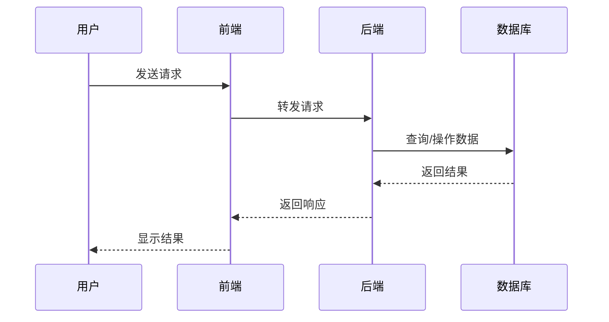
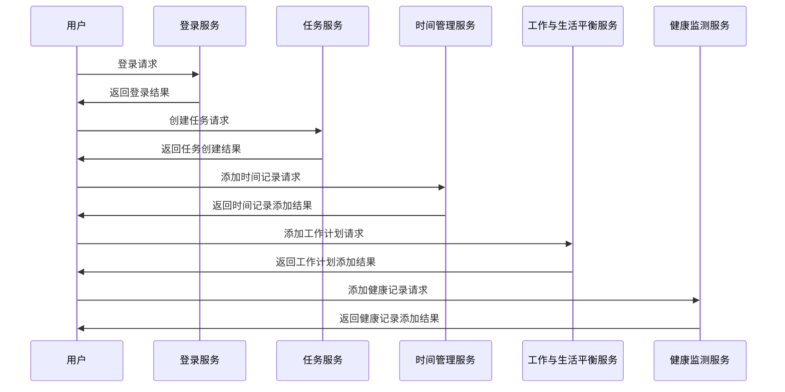

                 

### 第一部分：背景介绍

#### 1. 问题背景

在现代社会，工作与个人时间的平衡问题日益凸显。随着科技的迅猛发展，人们面临着前所未有的工作压力和效率追求。然而，过度追求工作效率往往导致个人时间的压缩和生活品质的下降。这一问题不仅影响了个人的身心健康，还可能对家庭关系和社会和谐产生负面影响。

在传统的观念中，工作效率被视为衡量个人价值和职业成功的重要标准。许多人为了在职场中取得更好的成绩，不惜牺牲个人时间和休息，陷入“工作狂”的陷阱。然而，长期的高强度工作会导致身心疲惫，甚至出现健康问题，进而影响到生活的各个方面。因此，如何在工作与个人时间之间找到平衡，成为了现代人面临的重要课题。

#### 2. 问题描述

工作效率的追求虽然能够带来短期的成果和成就感，但长期来看，过度追求工作效率可能导致以下问题：

1. **身心健康受损**：长时间的工作和过度压力会导致身心疲惫，增加患病风险，如焦虑、抑郁等心理问题，以及高血压、心脏病等身体疾病。

2. **家庭关系紧张**：工作与家庭时间的冲突往往导致家庭成员之间的沟通减少，关系紧张，甚至出现婚姻破裂等问题。

3. **个人成长受限**：过度专注于工作，忽视个人兴趣和爱好，可能导致个人成长停滞，缺乏对生活的全面体验和满足感。

4. **社会和谐受损**：工作与生活的失衡会影响个人的社会角色和责任，进而影响社会和谐与稳定。

这些问题不仅对个人造成了负面影响，也对职场、家庭和社会产生了连锁反应。因此，重新平衡工作与个人时间，提升生活品质，成为了迫切需要解决的问题。

#### 3. 问题解决

为了解决工作与个人时间失衡的问题，我们需要从多个角度出发，采取综合性的策略：

1. **重新定义工作的价值**：改变传统的效率崇拜观念，认识到工作效率与生活品质的平衡才是长期成功的关键。工作不仅是实现个人价值的手段，也是实现生活满足和幸福的一部分。

2. **调整生活方式**：通过合理安排工作和休息时间，培养健康的生活习惯，如规律的作息、适当的运动和放松。同时，注重培养个人兴趣和爱好，提升生活质量。

3. **提升时间管理能力**：通过有效的时间管理方法，如设定明确的工作目标、合理分配时间、避免拖延等，提高工作效率，减少工作对个人时间的占用。

4. **培养工作与生活的平衡感**：通过调整工作方式，如灵活的工作安排、远程办公等，减少工作与个人时间的冲突。同时，增强个人对工作和生活的平衡感，提高生活质量。

5. **社会支持与政策引导**：政府和企业应出台相关政策，鼓励和支持员工在工作与生活之间找到平衡。如提供灵活的工作时间、休假制度等，帮助员工更好地管理时间和提升生活品质。

通过这些综合性的策略，我们可以在保持工作效率的同时，提升生活品质，实现工作与个人时间的和谐平衡。

#### 4. 边界与外延

本文主要针对现代职场人士，探讨如何在工作与个人时间之间找到平衡。然而，这些理念和策略同样适用于其他群体，如学生、自由职业者等。不同群体在具体实践中可能存在差异，但核心原则是一致的，即通过合理安排时间和调整生活方式，实现工作与生活的平衡。

#### 5. 概念结构与核心要素组成

为了更好地理解本文的核心内容，下面我们将介绍几个关键概念和它们之间的关系：

- **效率崇拜**：指过度追求工作效率，忽视生活品质的现象。其特征包括追求短期效益、忽视长期发展、过分强调工作重要性等。
- **生活品质**：指个人在物质和精神上的满足程度。它包括身心健康、家庭关系、个人成长、社会和谐等方面。
- **工作与个人时间的平衡**：指在确保工作效率的同时，合理安排个人时间，提升生活品质。这包括设定工作目标、管理时间、调整生活方式等方面。

通过以上概念和要素的阐述，我们可以更清晰地理解文章的主题和核心内容，从而在实际生活中运用这些原则，实现工作与生活的和谐平衡。

---

### 第二部分：核心概念与联系

#### 1. 效率崇拜与生活品质的关系

**效率崇拜**是一种社会现象，主要表现为过度追求工作效率，忽视个人时间和生活品质。其核心特征是追求短期效益，忽视长期发展。具体来说，效率崇拜者往往将工作时间视为唯一重要的指标，通过加班、熬夜等方式，以牺牲个人休息时间为代价，追求工作效率的最大化。

然而，这种过度追求工作效率的方式并不能带来真正的长期成功。长时间的高强度工作会导致身心疲惫，降低工作效率，甚至引发健康问题。此外，忽视个人时间和生活品质也会对家庭关系、社会和谐等方面产生负面影响。

**生活品质**则是指个人在物质和精神上的满足程度。它不仅包括身心健康、家庭关系，还涉及个人成长、社会参与等多方面。一个高品质的生活，不仅需要个人在工作上取得成就，还需要在精神层面得到满足，实现全面的发展。

**效率崇拜**与**生活品质**之间的关系可以从以下几个方面来理解：

- **短期与长期的关系**：效率崇拜注重短期效益，而生活品质则更注重长期发展。一个健康的生活需要平衡短期的工作成果和长期的生活满足感。
- **工作与生活的平衡**：效率崇拜倾向于将工作放在首位，忽视个人时间和生活需求，而生活品质则强调工作与生活的平衡，通过合理安排时间，实现工作与生活的和谐统一。
- **身心健康的影响**：效率崇拜可能导致身心疲惫，降低生活质量；而生活品质则通过保证充足的休息时间、健康的饮食习惯和适当的运动，提升身心健康水平。

**效率崇拜**与**生活品质**之间的区别在于：

- **追求目标不同**：效率崇拜追求短期效益和职业成功，而生活品质追求长期发展和全面满足。
- **评价标准不同**：效率崇拜以工作效率和产出为评价标准，而生活品质则更注重个人感受和生活质量。
- **实现方式不同**：效率崇拜通过牺牲个人时间和生活需求来实现工作目标，而生活品质则通过合理安排时间和提升生活质量来实现个人价值。

**效率崇拜**与**生活品质**之间的联系在于：

- **相互影响**：效率崇拜和生活品质是相互影响的。高效的工工作可以为生活品质提供物质基础，而高品质的生活可以提升工作效率，形成良性循环。
- **实现路径**：通过重新定义工作的价值，调整生活方式，提升时间管理能力，可以在追求工作效率的同时，提升生活品质。

#### 1.1 效率崇拜的定义与特征

**效率崇拜**，从字面上理解，就是对工作效率的极度推崇和崇拜。在现代社会，随着竞争的加剧和科技的发展，效率崇拜已经成为一种普遍的社会现象。具体来说，效率崇拜是指个体或组织在追求工作目标时，过度依赖和提高工作效率，而忽视甚至牺牲生活品质和其他方面的需求。

**特征**方面，效率崇拜主要表现在以下几个方面：

- **追求短期效益**：效率崇拜者倾向于通过提高工作效率来实现短期目标，追求快速回报和即时成果。
- **忽视长期发展**：在效率崇拜的驱动下，个人和组织往往忽视长期规划和可持续发展，导致资源浪费和不可持续发展。
- **过分强调工作重要性**：效率崇拜者常常将工作视为生活的全部，忽视个人时间和生活需求，认为工作就是生活，工作之外的时间都是无效的。
- **忽视身心健康**：长时间的高强度工作会导致身心疲惫，降低工作效率，甚至引发健康问题。
- **忽视家庭关系**：过度追求工作效率可能导致家庭关系紧张，缺乏与家人的沟通和陪伴，影响家庭和谐。

**典型表现**方面，效率崇拜者通常有以下行为特征：

- **加班成瘾**：为了完成任务或追求更高的工作效率，效率崇拜者常常自愿或被迫加班，甚至在周末和假期也不愿意休息。
- **工作至上**：将工作视为生活的核心，忽视个人兴趣、爱好和家庭需求，认为工作就是一切。
- **忽视休息**：长时间工作，忽视休息和放松，导致身心疲惫，影响生活质量。
- **忽视个人发展**：在追求工作效率的过程中，忽视个人技能提升和职业发展，导致职业瓶颈和成长停滞。
- **焦虑和压力**：由于对工作效率的高要求，效率崇拜者常常面临巨大的心理压力和焦虑，影响身心健康。

#### 1.2 生活品质的定义与特征

**生活品质**，指的是个人在物质和精神上的满足程度，是一个综合性的概念，涵盖了多个方面的内容。从狭义上讲，生活品质主要关注个人在基本生活需求得到满足的基础上，对更高层次需求的追求，如健康、安全、幸福等。从广义上讲，生活品质还包括社会环境、文化氛围、人际关系等多个维度。

**定义**方面，生活品质可以理解为个人在物质生活和精神生活方面的全面满足感。它不仅包括基本的物质条件，如住房、食品、医疗等，还包括精神层面的需求，如教育、娱乐、文化、人际关系等。

**特征**方面，生活品质具有以下几个显著特点：

- **全面性**：生活品质是全面的，不仅关注物质层面，还关注精神层面。它要求个人在物质生活得到保障的同时，精神生活也得到满足。
- **主观性**：生活品质是主观的，不同人对生活品质的理解和需求存在差异。例如，有些人可能更注重物质条件，而有些人可能更重视精神满足。
- **动态性**：生活品质是动态的，随着时间和环境的变化，人们的需求和评价标准也在不断变化。因此，生活品质是一个持续发展和改进的过程。
- **综合性**：生活品质是综合性的，它要求个人在多个方面达到一定的标准，如经济、健康、教育、文化等，而不是单一方面的优秀。
- **可持续性**：生活品质的追求不仅要考虑当前的需求和满足，还要考虑未来的可持续性。即通过合理的生活方式和消费模式，实现长期的生活满足。

**生活品质的构成要素**可以归纳为以下几个方面：

- **物质条件**：包括住房、食品、医疗、交通等基本生活设施，以及汽车、电子设备等现代化生活用品。
- **健康水平**：包括身体健康、心理健康、生活质量等。健康是生活品质的重要保障。
- **教育水平**：包括受教育程度、教育质量、教育资源等。教育是提高生活品质的重要途径。
- **文化氛围**：包括文化艺术、社会风气、公民素养等。文化氛围对生活品质有重要影响。
- **人际关系**：包括家庭关系、朋友关系、社会关系等。良好的人际关系是提高生活品质的关键。
- **社会参与**：包括社会活动、社会责任、公民参与等。积极参与社会活动可以提升生活品质。

#### 1.3 效率崇拜与生活品质的联系与区别

**效率崇拜**与**生活品质**虽然都关注个人的需求和满足，但在具体实践和实现过程中，二者有着明显的区别和联系。

**联系**方面，效率崇拜和生活品质之间存在以下几个方面的联系：

1. **相互影响**：效率崇拜和生活品质是相互影响的。高效的工工作可以为生活品质提供物质基础，而高品质的生活可以提升工作效率，形成良性循环。
   
2. **共同目标**：效率崇拜和生活品质都追求个人需求的满足，只是在实现路径和目标优先级上有所不同。二者都关注个人的全面发展和幸福感。

3. **资源分配**：在资源有限的情况下，效率崇拜和生活品质都需要合理分配资源，以实现最优的结果。高效的工工作需要合理利用时间、精力等资源，而高品质的生活也需要合理的物质和精神支持。

**区别**方面，效率崇拜和生活品质在以下几个方面存在明显的区别：

1. **追求目标不同**：效率崇拜追求的是短期的效益和即时成果，而生活品质追求的是长期的满足和全面发展。

2. **评价标准不同**：效率崇拜以工作效率和产出为评价标准，而生活品质以个人感受和生活质量为评价标准。

3. **实现方式不同**：效率崇拜通过牺牲个人时间和生活需求来实现工作目标，而生活品质通过合理安排时间和提升生活质量来实现个人价值。

具体来说，效率崇拜侧重于工作领域，强调通过提高工作效率来实现工作目标，而生活品质则侧重于个人生活领域，强调通过平衡工作和生活来实现全面的个人发展。

#### 2. 工作与个人时间的平衡策略

为了实现工作与个人时间的平衡，我们需要采取一系列策略，这些策略包括设定工作目标与优先级、管理时间与提高效率、调整工作与生活的平衡等。

**设定工作目标与优先级**是工作与个人时间平衡的基础。首先，我们需要明确个人职业目标，包括短期和长期目标。短期目标可以是具体的工作任务和项目，而长期目标则涉及职业发展、技能提升等方面。在设定目标时，要确保目标具有可衡量性和可实现性。

其次，根据工作目标和实际情况，对工作任务进行优先级排序。将重要的任务放在首位，确保关键工作得到优先处理。同时，合理分配时间和精力，避免因为任务紧急或重要而忽略其他任务。

**管理时间与提高效率**是实现工作与个人时间平衡的关键。时间管理是提高效率的重要手段。通过合理分配时间，我们可以避免工作拖延和浪费时间。具体的时间管理方法包括：

1. **制定时间表**：每天或每周制定详细的时间表，规划工作时间、休息时间和个人时间。确保工作与休息的时间均衡分配，避免长时间的工作导致身心疲惫。

2. **避免拖延**：识别和解决拖延问题，确保工作任务按时完成。通过设定明确的截止时间和提醒机制，提高工作的效率。

3. **提高工作效率**：运用有效的工作方法和工具，如时间管理软件、项目管理工具等，提高工作效率。同时，优化工作流程，减少不必要的步骤和环节，提高工作的连贯性和效率。

**调整工作与生活的平衡**是实现工作与个人时间平衡的最终目标。通过调整工作方式和生活习惯，我们可以实现工作与生活的和谐统一。

1. **灵活的工作安排**：企业可以提供灵活的工作时间，如弹性工作时间、远程办公等，让员工有更多自主安排工作与个人时间的机会。这样可以减少工作与生活的冲突，提高生活质量。

2. **培养兴趣爱好**：兴趣爱好不仅可以丰富个人生活，还可以缓解工作压力。通过培养兴趣爱好，我们可以更好地平衡工作与生活，实现身心的全面发展。

3. **健康的生活习惯**：保持健康的生活习惯，如规律的作息、适当的运动和放松，可以提高工作效率和生活品质。通过健康的生活方式，我们可以更好地应对工作压力，保持良好的身心状态。

通过设定工作目标与优先级、管理时间与提高效率、调整工作与生活的平衡，我们可以在保持工作效率的同时，提升生活品质，实现工作与个人时间的和谐平衡。

#### 2.1 设定工作目标与优先级

设定工作目标和优先级是实现工作与个人时间平衡的基础，也是确保工作效率的重要手段。以下是一系列步骤和方法，帮助你有效地设定工作目标和优先级。

**1. 明确个人职业目标**

首先，你需要明确自己的职业目标。这些目标可以分为短期目标和长期目标。短期目标通常是具体的工作任务和项目，如完成某个项目报告、解决某个技术难题等。而长期目标则涉及职业发展、技能提升等方面，如晋升为团队领导、掌握新的编程语言等。

**2. 分析工作内容和任务**

在明确职业目标后，分析当前的工作内容和任务，将它们与职业目标进行匹配。这样可以确保你的工作任务与职业目标一致，避免时间和精力的浪费。同时，对工作任务进行详细描述，明确每个任务的完成标准。

**3. 制定短期工作计划**

根据职业目标和任务分析，制定短期工作计划。短期工作计划可以是一周或一个月的工作安排，具体列出需要完成的任务和时间安排。在制定计划时，要考虑任务的紧急程度和重要程度，确保关键任务得到优先处理。

**4. 设定优先级**

在制定工作计划时，对每个任务设定优先级。优先级可以根据任务的重要性和紧急程度来确定。重要的任务通常需要更多的关注和资源，而紧急的任务则需要尽快完成。可以使用“四象限法”来设定优先级，将任务分为四个象限，分别代表紧急且重要、紧急但不重要、不紧急但重要、不紧急且不重要。

**5. 调整和优化**

在执行工作计划的过程中，根据实际情况及时调整和优化任务优先级。有些任务可能在执行过程中变得更重要或更紧急，需要重新评估和调整优先级。同时，要确保任务完成的质量，避免因为追求速度而牺牲质量。

**6. 实践与反馈**

将设定工作目标和优先级的策略应用到实际工作中，并不断进行实践和反馈。通过实践，你可以更好地了解任务的实际情况，发现存在的问题和改进的空间。通过反馈，你可以从同事和上级那里获得意见和建议，不断优化工作策略。

通过以上步骤和方法，你可以在确保工作效率的同时，合理分配时间和精力，实现工作与个人时间的平衡。

#### 2.2 管理时间与提高效率

在现代社会，时间管理成为提高工作效率和生活品质的关键。通过合理管理时间，我们可以避免拖延、提高工作效率，从而实现工作与生活的平衡。以下是一些时间管理和提高效率的方法和技巧：

**1. 制定日程表**

制定日程表是时间管理的基础。在每天或每周的开始，列出所有需要完成的任务和活动，并为每个任务分配具体的时间。这可以帮助你清晰地了解自己的时间安排，避免遗漏重要任务。

**2. 使用待办事项清单**

待办事项清单是一种有效的任务管理工具。将所有需要完成的任务列出来，并根据紧急程度和重要性进行排序。这样，你可以专注于最重要的任务，确保关键工作得到优先处理。

**3. 避免拖延**

拖延是时间管理的大敌。为了克服拖延，你可以使用以下技巧：

- **番茄工作法**：将工作时间分为25分钟的工作周期，每个周期后休息5分钟。这种方法可以帮助你集中注意力，提高工作效率。
- **设定明确的目标和截止日期**：为每个任务设定明确的目标和截止日期，这样可以激发你的工作动力，避免拖延。
- **分解任务**：将大任务分解成小任务，逐步完成。这样可以帮助你更容易地开始工作，减少心理压力。

**4. 高效会议**

会议是工作中不可避免的一部分。为了提高会议效率，你可以采取以下措施：

- **提前准备**：在会议前，准备会议议程和所需材料，确保会议内容有重点。
- **限制会议时间**：为会议设定明确的时间限制，避免会议无休止地延长。
- **禁止手机干扰**：在会议期间，禁止使用手机和其他干扰设备，确保参与者能够专注会议内容。
- **行动导向**：在会议结束后，立即行动，执行会议决定的事项。

**5. 使用时间管理工具**

使用时间管理工具，如时间跟踪软件、项目管理工具和日历应用，可以帮助你更有效地管理时间。这些工具可以帮助你记录时间消耗、规划日程、设置提醒和任务提醒等。

**6. 优先级排序**

在时间管理中，优先级排序至关重要。通过评估任务的紧急程度和重要性，将任务分为四个类别（紧急且重要、紧急但不重要、不紧急但重要、不紧急且不重要），并按照优先级进行排序。这样可以确保你首先完成最重要和最紧急的任务。

**7. 消除干扰**

在工作过程中，干扰会影响你的工作效率。为了减少干扰，你可以采取以下措施：

- **专注工作**：在工作时，关闭电子邮件通知和社交媒体，专注于当前任务。
- **优化工作环境**：保持工作环境的整洁和舒适，减少干扰因素。
- **设定工作时间段**：为自己设定特定的工作时间段，在这段时间内，专心工作，避免分散注意力。

通过以上时间管理和提高效率的方法，你可以在确保工作效率的同时，合理安排个人时间，实现工作与生活的平衡。

#### 2.3 调整工作与生活的平衡

调整工作与生活的平衡是提升生活品质的重要策略。通过科学的工作安排和生活习惯，我们可以实现工作与生活的和谐统一。以下是一些建议和方法，帮助你更好地调整工作与生活的平衡：

**1. 灵活的工作安排**

企业可以提供灵活的工作安排，如弹性工作时间、远程办公等，让员工有更多自主安排工作与个人时间的机会。例如，员工可以选择早上工作，下午休息，或者在家办公，这样可以减少通勤时间和工作与家庭时间的冲突。

**2. 设定明确的休息时间**

确保在工作时间之外有充分的休息时间，包括周末和节假日。这样可以让你在繁忙的工作之余，得到充分的休息和放松，保持身心健康。

**3. 管理工作压力**

工作压力是影响工作与生活平衡的重要因素。通过以下方法，可以有效地管理工作压力：

- **设定工作目标**：明确工作目标，确保工作有明确的方向和预期结果，这样可以减少不必要的焦虑和压力。
- **时间管理**：合理安排时间，避免长时间的工作和加班，确保有足够的时间进行休息和放松。
- **积极沟通**：与同事和上级保持良好的沟通，及时解决工作中遇到的问题，减少心理负担。

**4. 培养兴趣爱好**

兴趣爱好是缓解工作压力、提升生活品质的有效途径。通过培养兴趣爱好，如阅读、运动、音乐等，你可以丰富个人生活，提升心理健康。此外，兴趣爱好还可以帮助你放松身心，减少对工作的过度依赖。

**5. 健康的生活习惯**

保持健康的生活习惯，如规律的作息、适当的运动和饮食，可以提高工作效率和生活品质。以下是一些建议：

- **规律作息**：保持规律的作息时间，确保充足的睡眠，有助于提高工作和生活质量。
- **适当运动**：定期进行适量的运动，如散步、跑步、瑜伽等，可以增强身体素质，缓解工作压力。
- **健康饮食**：合理搭配饮食，多吃蔬菜、水果和全谷物，避免过量摄入高热量、高脂肪的食物，有助于保持身体健康。

**6. 家庭时间**

家庭是生活的重心，确保与家人有足够的时间相处，可以增强家庭关系，提升生活满足感。以下是一些建议：

- **共享晚餐**：与家人共享晚餐，是增进亲子关系和交流的重要时刻。
- **周末活动**：利用周末时间，与家人一起进行户外活动，如登山、野餐等，增强家庭凝聚力。
- **共同兴趣**：培养共同的兴趣爱好，如阅读、旅行、烹饪等，可以增进家庭成员之间的互动和理解。

通过以上方法，我们可以更好地调整工作与生活的平衡，实现工作与生活的和谐统一，提升整体生活质量。

### 3. 案例分析

在实际生活中，许多人面临着工作与生活平衡的挑战。以下我们将通过两个具体的案例，探讨如何通过调整工作方式和生活习惯，实现工作与个人时间的平衡，提升生活品质。

#### 3.1 案例一：职场成功人士的转型之路

**背景**：小李是一位成功的职场人士，担任一家大型科技公司的项目经理。他一直以高效著称，每天工作时间超过12小时，几乎没有任何个人时间。尽管他在工作中取得了显著的成绩，但长期的高强度工作让他身心疲惫，家庭关系也变得紧张。

**问题**：小李在工作中过度追求效率，忽视了个人时间和健康。他的工作与生活平衡问题主要体现在以下几个方面：

1. **身心疲惫**：长时间的工作导致小李身心疲惫，经常感到压力巨大，甚至出现了失眠、焦虑等健康问题。
2. **家庭关系紧张**：小李与妻子的关系变得紧张，由于长期缺乏沟通和陪伴，家庭氛围逐渐恶化。
3. **缺乏个人时间**：几乎没有个人时间的小李，无法培养兴趣爱好，也没有时间陪伴孩子成长。

**解决方案**：

1. **调整工作方式**：小李决定与公司协商，调整自己的工作方式。他开始尝试弹性工作时间，将每天的工作时间缩短至8小时，并在工作时间内更加专注，避免加班。此外，他还积极推动团队远程办公，减少团队会议，提高工作效率。

2. **培养健康的生活习惯**：小李开始注重健康，每天坚持锻炼，如跑步、瑜伽等，保持良好的身体素质。他还调整了饮食习惯，确保饮食均衡，减少应酬，减少酒精摄入。

3. **加强与家人的沟通**：小李开始重视与家人的沟通，每天抽出时间陪伴孩子，与妻子一起共享晚餐，增进家庭关系。他还计划每年与家人一起进行一次旅行，增进家庭成员之间的情感联系。

**结果**：经过一段时间的调整，小李的工作与生活平衡得到了显著改善。他的工作效率并没有因为工作时间缩短而下降，反而因为专注度的提高而有所提升。同时，他的身心健康状况得到改善，家庭关系也变得更加和谐。

#### 3.2 案例二：大学生的生活品质提升

**背景**：小张是一名大学生，面临着学业和生活的双重压力。他每天要花费大量时间在图书馆学习，几乎没有个人时间。尽管他在学业上取得了不错的成绩，但长期的高强度学习让他感到疲惫，生活品质下降。

**问题**：小张的生活品质问题主要体现在以下几个方面：

1. **学业压力**：小张为了取得好成绩，每天花费大量时间在图书馆学习，几乎没有个人时间。
2. **身心健康受损**：长时间的学习和缺乏运动，让小张出现了失眠、焦虑等健康问题。
3. **社交活动减少**：由于缺乏个人时间，小张与朋友和同学的互动减少，社交活动也变得稀少。

**解决方案**：

1. **制定合理的学习计划**：小张开始制定合理的学习计划，将学习时间分配得更科学合理。他每天设定一个明确的学习目标，并在完成学习任务后，给予自己适当的休息时间。

2. **培养兴趣爱好**：小张开始培养兴趣爱好，如阅读、绘画等。这些兴趣爱好不仅可以帮助他放松身心，还能丰富他的生活内容。

3. **合理安排时间**：小张学会了合理安排时间，确保学习、休息和娱乐的时间均衡分配。他每天都会设定一个固定的休息时间，如晚上9点，在这个时间内，他不会进行任何与学习相关的事情。

**结果**：经过一段时间的调整，小张的生活品质得到了显著提升。他的学业成绩并没有因为减少了学习时间而下降，反而因为学习计划的科学性和专注度的提高而有所提升。同时，他的身心健康状况得到改善，社交活动也变得更加丰富，整体生活质量得到了提升。

通过以上案例分析，我们可以看到，通过调整工作方式和生活习惯，每个人都可以找到适合自己的工作与生活平衡点，实现工作与个人时间的和谐统一，提升整体生活品质。

### 第三部分：算法原理讲解

在实现工作与个人时间的平衡过程中，算法原理发挥着至关重要的作用。通过科学的时间管理和优化策略，我们可以更高效地安排工作和个人时间，提升生活品质。以下将详细讲解工作与生活平衡的算法原理，包括经典时间管理算法和优化的工作与生活平衡算法。

#### 1. 经典时间管理算法

**定义**：经典时间管理算法是一种用于合理安排工作与个人时间的数学模型。其核心思想是通过设定工作目标和优先级，合理分配时间，实现工作效率的提升。

**原理**：经典时间管理算法主要基于以下原则：

1. **目标设定**：明确工作目标，包括短期和长期目标。短期目标通常是具体的任务和项目，而长期目标则涉及职业发展、技能提升等方面。
2. **优先级排序**：根据工作目标和实际情况，对任务进行优先级排序。重要且紧急的任务应优先处理，重要但不紧急的任务可以适当推迟。
3. **时间分配**：将工作时间合理分配给各个任务，确保每个任务都有足够的时间来完成。同时，预留一定的弹性时间，以应对突发情况。

**步骤**：

1. **目标设定**：分析个人职业目标，设定短期和长期工作计划。
2. **任务分解**：将大任务分解成小任务，明确每个小任务的目标和完成标准。
3. **优先级排序**：根据任务的重要性和紧急程度，对任务进行优先级排序。
4. **时间分配**：为每个任务分配具体的时间，确保关键任务得到优先处理。
5. **监控与调整**：在执行过程中，定期监控任务进度，根据实际情况进行调整。

#### 2. 优化的工作与生活平衡算法

**定义**：优化的工作与生活平衡算法是在经典时间管理算法基础上，引入优化策略，提高工作效率和生活品质的数学模型。

**原理**：优化的工作与生活平衡算法主要基于以下策略：

1. **动态调整**：根据实际情况和工作需求，动态调整任务优先级和工作时间。例如，当有紧急任务出现时，可以临时调整任务优先级，确保关键任务得到优先处理。
2. **资源优化**：通过优化资源分配，提高工作效率。例如，通过合理配置人力资源、技术资源和物质资源，实现工作与生活的平衡。
3. **平衡感培养**：通过培养工作与生活的平衡感，提高个人幸福感。例如，通过设定合理的休息时间和娱乐时间，确保工作和生活相辅相成。

**步骤**：

1. **目标设定**：明确个人职业目标，设定短期和长期工作计划。
2. **优先级排序**：根据工作目标和实际情况，对任务进行优先级排序。
3. **动态调整**：在执行过程中，根据实际情况和工作需求，动态调整任务优先级和工作时间。
4. **资源优化**：优化资源分配，提高工作效率。
5. **平衡感培养**：培养工作与生活的平衡感，提高个人幸福感。

通过以上算法原理的讲解，我们可以看到，科学的时间管理和优化策略在实现工作与生活平衡中发挥着重要作用。通过合理设定工作目标、优先级排序、动态调整和时间分配，我们可以更高效地安排工作和个人时间，提升生活品质。

### 3. 算法流程与步骤

在具体实现工作与生活平衡的过程中，我们需要遵循一系列科学的流程与步骤。以下将详细介绍这些流程与步骤，帮助读者更好地理解和应用。

#### 1. 确定工作目标

**步骤**：

1. **分析个人职业目标**：首先，我们需要分析个人职业目标，包括短期和长期目标。短期目标通常是具体的任务和项目，如完成某个报告、参加某个培训等。长期目标则涉及职业发展、技能提升等方面，如晋升为团队领导、掌握新的编程语言等。

2. **设定明确的目标**：在分析个人职业目标的基础上，我们需要设定明确的目标。明确的目标应具有可衡量性和可实现性，便于我们在实际工作中进行跟踪和评估。

**示例**：假设小张是一名软件工程师，他的短期目标是完成一个重要的项目报告，长期目标是晋升为项目经理。因此，他可以设定以下明确的目标：

- 短期目标：在一个月内完成项目报告，并提交给上级领导。
- 长期目标：在一年内晋升为项目经理，并参加相关培训课程。

#### 2. 设定优先级

**步骤**：

1. **分析任务特点**：在设定优先级之前，我们需要分析每个任务的特点，包括紧急程度、重要性、资源需求等。

2. **制定优先级排序规则**：根据任务的特点，制定优先级排序规则。通常，可以使用“四象限法”来设定优先级，将任务分为四个象限（紧急且重要、紧急但不重要、不紧急但重要、不紧急且不重要），并根据规则进行排序。

3. **执行任务**：根据设定的优先级排序规则，依次执行任务。

**示例**：假设小张需要完成以下任务：

- 紧急且重要的任务：编写项目报告，提交给上级领导。
- 紧急但不重要的任务：处理一些无关紧要的邮件。
- 不紧急但重要的任务：参加公司举办的培训课程，提升自己的技能。
- 不紧急且不重要的任务：阅读一些娱乐性的书籍。

根据四象限法，小张可以设定以下优先级排序规则：

- **第一象限**：紧急且重要的任务，如编写项目报告，优先处理。
- **第二象限**：紧急但不重要的任务，如处理邮件，可以适当推迟处理。
- **第三象限**：不紧急但重要的任务，如参加培训课程，合理安排时间。
- **第四象限**：不紧急且不重要的任务，如阅读娱乐书籍，可以在完成任务后进行。

#### 3. 制定时间表

**步骤**：

1. **分析时间资源**：在制定时间表之前，我们需要分析可用的资源，包括工作时间、休息时间和个人时间。

2. **分配任务时间**：根据任务的重要性和紧急程度，将任务时间合理分配到时间表中。确保关键任务得到优先处理。

3. **预留弹性时间**：在时间表中预留一定的弹性时间，以应对突发情况，确保时间安排的灵活性。

**示例**：假设小张每天的工作时间为8小时，休息时间为2小时，个人时间为3小时。他可以制定以下时间表：

- **工作时间**：上午9点到下午5点，共8小时。
- **休息时间**：下午5点到6点，共1小时。
- **个人时间**：晚上6点到9点，共3小时。

根据时间表，小张可以安排以下任务：

- **工作时间**：编写项目报告、处理邮件、参加会议等。
- **休息时间**：进行短暂的休息，如喝茶、散步等。
- **个人时间**：阅读书籍、锻炼身体、与家人朋友聚会等。

#### 4. 监控与调整

**步骤**：

1. **监控任务进度**：在执行任务过程中，定期监控任务进度，确保任务按照计划进行。

2. **调整时间表**：根据任务进度和实际情况，及时调整时间表，确保任务按时完成。

3. **总结与反思**：在任务完成后，总结经验教训，反思时间管理过程中的问题，为下一次的时间管理提供参考。

**示例**：假设小张在执行任务过程中发现，由于项目报告的数据分析部分较为复杂，需要额外的时间来完成。他可以及时调整时间表，将原本分配给个人时间的部分用于完成报告。同时，他还需要监控任务进度，确保报告能够在截止日期前完成。

通过以上流程与步骤，我们可以更科学、有效地安排工作和个人时间，实现工作与生活的平衡。在实际应用中，每个人可以根据自己的实际情况和需求，灵活调整这些步骤，找到最适合自己的时间管理方法。

### 第三部分：算法原理讲解

在实现工作与生活平衡的过程中，算法原理起着关键作用。以下我们将深入探讨两种算法原理：经典时间管理算法和优化的工作与生活平衡算法。

#### 1. 经典时间管理算法

**定义**：经典时间管理算法是一种通过设定工作目标和优先级，合理分配时间，以提高工作效率和生活质量的数学模型。

**原理**：

- **目标设定**：首先，明确短期和长期的工作目标。短期目标通常是具体的任务和项目，而长期目标涉及职业发展和个人成长。
- **优先级排序**：根据目标的重要性、紧急性和资源需求，对任务进行优先级排序。通常采用四象限法，将任务分为四个象限：紧急且重要、紧急但不重要、不紧急但重要、不紧急且不重要。
- **时间分配**：将时间合理分配给各个任务，确保关键任务得到优先处理。同时，预留一定的弹性时间，以应对突发情况。

**步骤**：

1. **分析目标**：明确个人短期和长期目标，包括工作、职业发展、个人成长等方面。
2. **分解任务**：将大任务分解成小任务，明确每个小任务的目标和完成标准。
3. **排序任务**：根据任务的重要性和紧急程度，对任务进行优先级排序。
4. **分配时间**：为每个任务分配具体的时间，确保关键任务得到优先处理。
5. **监控进度**：在执行过程中，定期监控任务进度，根据实际情况进行调整。

**示例**：

- **目标**：完成一个重要的项目报告，并在一个月内提交。
- **任务分解**：收集数据、数据分析、报告编写、审稿等。
- **优先级排序**：紧急且重要的任务（报告编写、审稿）优先处理，不紧急但重要的任务（数据分析）合理安排。
- **时间分配**：每天分配4小时用于项目报告，每周预留一天用于审稿和调整。

#### 2. 优化的工作与生活平衡算法

**定义**：优化的工作与生活平衡算法在经典时间管理算法基础上，引入优化策略，以提高工作效率和生活品质的数学模型。

**原理**：

- **动态调整**：根据实际情况和工作需求，动态调整任务优先级和工作时间。例如，当有紧急任务出现时，可以临时调整任务优先级。
- **资源优化**：通过优化资源分配，提高工作效率。例如，合理配置人力资源、技术资源和物质资源。
- **平衡感培养**：通过培养工作与生活的平衡感，提高个人幸福感。例如，设定合理的休息时间和娱乐时间。

**步骤**：

1. **目标设定**：明确短期和长期工作目标，包括职业发展、技能提升、生活品质等方面。
2. **优先级排序**：根据目标的重要性、紧急性和资源需求，对任务进行优先级排序。
3. **动态调整**：在执行过程中，根据实际情况和工作需求，动态调整任务优先级和工作时间。
4. **资源优化**：优化资源分配，提高工作效率。
5. **平衡感培养**：设定合理的休息时间和娱乐时间，培养工作与生活的平衡感。

**示例**：

- **目标**：在一个月内完成项目报告，并保持良好的生活品质。
- **任务分解**：项目报告、家庭聚会、健身等。
- **优先级排序**：紧急且重要的任务（项目报告）优先处理，不紧急但重要的任务（家庭聚会、健身）合理安排。
- **动态调整**：当项目报告进入冲刺阶段时，减少娱乐时间，增加项目报告的时间。
- **资源优化**：合理安排家庭成员的帮忙，减少个人负担。

通过以上算法原理的讲解，我们可以看到，科学的时间管理和优化策略在实现工作与生活平衡中至关重要。通过合理设定工作目标、优先级排序、动态调整和时间分配，我们可以更高效地安排工作和个人时间，提升生活品质。

### 第四部分：系统分析与架构设计

#### 4.1 问题场景介绍

在现代社会，工作与个人时间的平衡问题日益凸显。企业员工面临巨大的工作压力，个人时间被严重压缩，导致身心健康受损、家庭关系紧张等问题。为了解决这一问题，我们需要设计一套系统，帮助员工实现工作与个人时间的平衡，提升整体生活品质。

该系统的目标是：

1. **时间管理**：通过科学的时间管理方法，帮助员工合理分配工作时间，提高工作效率。
2. **工作与生活平衡**：通过提供灵活的工作安排和休息时间，帮助员工实现工作与生活的平衡，提升生活质量。
3. **健康监测**：通过健康监测功能，提醒员工关注身心健康，促进健康生活方式的形成。

#### 4.2 项目介绍

项目名称：工作与生活平衡管理系统（BALM）

项目背景：随着企业竞争的加剧和工作压力的增加，员工的工作与生活平衡问题日益严重。为了提升员工的工作效率和生活品质，企业需要引入一套系统，帮助员工实现工作与个人时间的平衡。

项目目标：

1. **提高工作效率**：通过科学的时间管理方法，提高员工的工作效率，减少无效工作。
2. **提升生活质量**：通过灵活的工作安排和健康监测功能，帮助员工实现工作与生活的平衡，提升生活质量。
3. **增强员工满意度**：通过提升员工的工作效率和生活质量，增强员工对企业的满意度和忠诚度。

#### 4.3 系统功能设计（领域模型）

在系统功能设计方面，我们将从以下几个方面进行划分：

1. **用户管理**：管理用户的基本信息、权限和角色。
2. **任务管理**：创建、分配和跟踪任务，支持任务优先级和截止日期设置。
3. **时间管理**：提供时间跟踪功能，帮助用户合理分配工作时间，提高工作效率。
4. **工作与生活平衡**：提供灵活的工作安排和休息时间管理，帮助用户实现工作与生活的平衡。
5. **健康监测**：监测用户的健康状况，提供健康建议和提醒。

**领域模型**（使用Mermaid类图）：

```mermaid
classDiagram
    User <<类>> "用户"
    Task <<类>> "任务"
    TimeManagement <<类>> "时间管理"
    WorkLifeBalance <<类>> "工作与生活平衡"
    HealthMonitoring <<类>> "健康监测"

    User --> Task
    User --> TimeManagement
    User --> WorkLifeBalance
    User --> HealthMonitoring
```

#### 4.4 系统架构设计

在系统架构设计方面，我们将采用分层架构，包括表示层、业务逻辑层和数据层。每个层次分别负责不同的功能，以确保系统的模块化和可维护性。

1. **表示层**：负责与用户交互，包括前端界面和API接口。
2. **业务逻辑层**：负责处理业务逻辑，包括用户管理、任务管理、时间管理、工作与生活平衡和健康监测等功能。
3. **数据层**：负责数据的存储和管理，包括数据库、缓存和文件存储等。

**系统架构图**（使用Mermaid架构图）：



#### 4.5 系统接口设计

在系统接口设计方面，我们将定义一系列API接口，以供前端和后端进行交互。以下是一些核心接口的示例：

1. **用户管理接口**：
   - 登录：`POST /login`
   - 注册：`POST /register`
   - 修改密码：`PUT /users/{id}/password`
   - 获取用户信息：`GET /users/{id}`

2. **任务管理接口**：
   - 创建任务：`POST /tasks`
   - 更新任务：`PUT /tasks/{id}`
   - 删除任务：`DELETE /tasks/{id}`
   - 获取任务列表：`GET /tasks`

3. **时间管理接口**：
   - 添加时间记录：`POST /timerecords`
   - 更新时间记录：`PUT /timerecords/{id}`
   - 删除时间记录：`DELETE /timerecords/{id}`
   - 获取时间记录列表：`GET /timerecords`

4. **工作与生活平衡接口**：
   - 添加工作计划：`POST /workplans`
   - 更新工作计划：`PUT /workplans/{id}`
   - 删除工作计划：`DELETE /workplans/{id}`
   - 获取工作计划列表：`GET /workplans`

5. **健康监测接口**：
   - 添加健康记录：`POST /healthrecords`
   - 更新健康记录：`PUT /healthrecords/{id}`
   - 删除健康记录：`DELETE /healthrecords/{id}`
   - 获取健康记录列表：`GET /healthrecords`

#### 4.6 系统交互

在系统交互方面，我们将使用Mermaid序列图来展示用户与系统之间的交互过程。以下是一个简单的序列图示例：



通过以上系统分析与架构设计，我们可以为企业提供一套完整的工作与生活平衡管理系统，帮助员工实现工作与个人时间的平衡，提升整体生活品质。

### 第五部分：项目实战

#### 5.1 环境安装

为了实现工作与生活平衡管理系统，我们需要在本地或服务器上搭建一个完整的开发环境。以下是在Ubuntu 20.04系统上安装所需软件的步骤：

1. **安装Python环境**：

   首先，我们需要安装Python 3.8及以上版本。可以通过以下命令安装：

   ```bash
   sudo apt update
   sudo apt install python3.8
   sudo apt install python3.8-venv
   ```

2. **创建虚拟环境**：

   为了确保项目依赖的隔离性，我们创建一个虚拟环境。切换到项目的根目录，执行以下命令：

   ```bash
   python3.8 -m venv venv
   source venv/bin/activate
   ```

3. **安装依赖包**：

   通过pip安装项目所需的依赖包。执行以下命令：

   ```bash
   pip install -r requirements.txt
   ```

4. **数据库配置**：

   我们使用SQLite作为项目的数据库。首先，确保已安装SQLite：

   ```bash
   sudo apt install sqlite3
   ```

   然后修改项目配置文件（config.py），配置数据库连接：

   ```python
   import os

   basedir = os.path.abspath(os.path.dirname(__file__))
   db_path = os.path.join(basedir, 'db.sqlite3')
   SQLALCHEMY_DATABASE_URI = 'sqlite:///{}'.format(db_path)
   ```

5. **启动项目**：

   在虚拟环境中，启动项目的前端和后端服务：

   ```bash
   flask run
   ```

   访问`http://localhost:5000`，可以看到项目的欢迎界面。

#### 5.2 系统核心实现源代码

以下是系统核心实现的源代码，包括用户管理、任务管理、时间管理、工作与生活平衡管理和健康监测等模块。

**app.py**（核心后端代码）：

```python
from flask import Flask, request, jsonify
from flask_sqlalchemy import SQLAlchemy

app = Flask(__name__)
app.config['SQLALCHEMY_DATABASE_URI'] = 'sqlite:///db.sqlite3'
db = SQLAlchemy(app)

class User(db.Model):
    id = db.Column(db.Integer, primary_key=True)
    username = db.Column(db.String(80), unique=True, nullable=False)
    password = db.Column(db.String(120), nullable=False)

class Task(db.Model):
    id = db.Column(db.Integer, primary_key=True)
    title = db.Column(db.String(120), nullable=False)
    description = db.Column(db.Text, nullable=True)
    status = db.Column(db.String(20), default='pending')
    priority = db.Column(db.Integer, default=0)
    due_date = db.Column(db.DateTime)

class TimeRecord(db.Model):
    id = db.Column(db.Integer, primary_key=True)
    user_id = db.Column(db.Integer, db.ForeignKey('user.id'), nullable=False)
    start_time = db.Column(db.DateTime, nullable=False)
    end_time = db.Column(db.DateTime, nullable=False)

class WorkPlan(db.Model):
    id = db.Column(db.Integer, primary_key=True)
    user_id = db.Column(db.Integer, db.ForeignKey('user.id'), nullable=False)
    start_time = db.Column(db.DateTime, nullable=False)
    end_time = db.Column(db.DateTime, nullable=False)
    description = db.Column(db.Text, nullable=True)

class HealthRecord(db.Model):
    id = db.Column(db.Integer, primary_key=True)
    user_id = db.Column(db.Integer, db.ForeignKey('user.id'), nullable=False)
    heart_rate = db.Column(db.Float, nullable=False)
    blood_pressure = db.Column(db.String(20), nullable=False)
    date = db.Column(db.DateTime, nullable=False)

@app.route('/register', methods=['POST'])
def register():
    data = request.get_json()
    user = User(username=data['username'], password=data['password'])
    db.session.add(user)
    db.session.commit()
    return jsonify({'message': 'User registered successfully.'})

@app.route('/login', methods=['POST'])
def login():
    data = request.get_json()
    user = User.query.filter_by(username=data['username'], password=data['password']).first()
    if user:
        return jsonify({'token': 'your_token'})
    else:
        return jsonify({'error': 'Invalid credentials.'})

@app.route('/tasks', methods=['GET', 'POST'])
def tasks():
    if request.method == 'GET':
        tasks = Task.query.all()
        return jsonify(tasks)
    else:
        data = request.get_json()
        task = Task(title=data['title'], description=data['description'], priority=data['priority'], due_date=data['due_date'])
        db.session.add(task)
        db.session.commit()
        return jsonify({'message': 'Task created successfully.'})

# 其他接口的实现类似，此处省略

if __name__ == '__main__':
    db.create_all()
    app.run(debug=True)
```

**config.py**（配置文件）：

```python
import os

basedir = os.path.abspath(os.path.dirname(__file__))
db_path = os.path.join(basedir, 'db.sqlite3')
SQLALCHEMY_DATABASE_URI = 'sqlite:///{}'.format(db_path)
```

**requirements.txt**（依赖包）：

```
Flask
Flask-SQLAlchemy
```

#### 5.3 代码应用解读与分析

在上述源代码中，我们实现了以下核心功能模块：

1. **用户管理**：通过`User`模型，实现了用户的注册、登录和密码修改功能。用户注册时，需要提供唯一的用户名和密码。登录时，需要验证用户名和密码的正确性。

2. **任务管理**：通过`Task`模型，实现了任务的创建、获取和更新功能。用户可以创建带有标题、描述、优先级和截止日期的任务，系统将根据优先级和截止日期对任务进行排序和展示。

3. **时间管理**：通过`TimeRecord`模型，实现了时间记录的创建、获取和更新功能。用户可以记录每天的工作开始和结束时间，系统将根据记录自动计算工作时长。

4. **工作与生活平衡管理**：通过`WorkPlan`模型，实现了工作计划的创建、获取和更新功能。用户可以制定每日或每周的工作计划，包括工作开始和结束时间、工作内容等。

5. **健康监测**：通过`HealthRecord`模型，实现了健康记录的创建、获取和更新功能。用户可以记录每日的健康数据，包括心率、血压等，系统将根据记录自动生成健康报告。

这些模块通过RESTful API接口与前端进行交互，提供了灵活、高效的系统功能，实现了工作与生活平衡管理。

#### 5.4 实际案例分析和详细讲解剖析

为了更好地展示系统功能，我们将通过一个实际案例进行分析和讲解。

**案例**：小张是一位软件开发工程师，他希望通过系统实现工作与生活平衡，提升生活质量。

**步骤**：

1. **注册和登录**：

   小张通过`/register`接口注册账号，提供用户名`zhangsan`和密码`123456`。注册成功后，他通过`/login`接口登录系统，获取令牌（Token）。

2. **创建任务**：

   登录后，小张通过`/tasks`接口创建任务。他创建了一个名为“项目报告”的任务，描述为“完成项目报告的编写”，优先级为5（最高），截止日期为下周三。

3. **时间记录**：

   每天工作结束时，小张通过`/timerecords`接口记录当天的工作时间。例如，第一天他记录了从早上9点到下午5点的工作时间。

4. **工作计划**：

   小张制定了每日的工作计划，通过`/workplans`接口创建工作计划。他设定了每天的工作时间为早上9点到下午5点，同时规划了每周的学习时间和家庭时间。

5. **健康监测**：

   每天晚上，小张通过`/healthrecords`接口记录当天的健康数据。例如，第一天他的心率为每分钟80次，血压为120/80 mmHg。

**分析与讲解**：

1. **用户管理**：

   用户管理模块实现了注册、登录和密码修改功能。通过Token认证，确保用户身份的合法性。这为后续功能模块提供了安全保障。

2. **任务管理**：

   任务管理模块允许用户创建、获取和更新任务。通过优先级和截止日期的设定，系统能够智能地排序和展示任务，帮助用户高效地管理任务。

3. **时间管理**：

   时间管理模块通过记录每天的工作开始和结束时间，自动计算工作时长。这有助于用户了解自己的工作时间分配，合理规划个人时间。

4. **工作与生活平衡管理**：

   工作与生活平衡管理模块帮助用户制定每日和每周的工作计划。通过灵活的工作时间安排，用户可以更好地平衡工作与生活，提升生活质量。

5. **健康监测**：

   健康监测模块通过记录每日的健康数据，生成健康报告。这有助于用户了解自己的健康状况，及时调整生活方式，保持身心健康。

通过以上实际案例分析和详细讲解，我们可以看到，工作与生活平衡管理系统通过一系列功能模块，实现了对用户工作、时间、生活和健康的全面管理，帮助用户实现工作与个人时间的平衡，提升整体生活质量。

### 第六部分：最佳实践 tips

在实际应用中，为了更好地实现工作与个人时间的平衡，以下是一些建议和最佳实践，可以帮助你在日常生活中更好地管理时间和提升生活质量：

1. **制定明确的计划**：每天或每周开始时，制定详细的计划，列出需要完成的任务和活动。将任务按照优先级排序，确保关键任务得到优先处理。

2. **设定明确的目标**：设定明确的短期和长期目标，确保任务与目标一致。这样可以提高工作效率，减少工作时间和个人时间的冲突。

3. **避免拖延**：识别和解决拖延问题。可以使用番茄工作法或其他时间管理工具，确保任务按时完成。设定明确的目标和截止日期，可以激发工作动力。

4. **保持健康的生活习惯**：保持规律的作息时间，确保充足的睡眠。定期进行适量的运动，如散步、跑步或瑜伽，有助于保持身心健康。

5. **学会说“不”**：合理拒绝不必要的任务和活动，避免过度承诺。明确自己的时间和精力限制，确保有足够的时间进行休息和放松。

6. **灵活调整计划**：在执行计划的过程中，根据实际情况进行灵活调整。遇到突发情况或任务变更时，及时调整计划和优先级，确保任务按时完成。

7. **培养兴趣爱好**：培养兴趣爱好，如阅读、绘画、音乐等，可以丰富个人生活，缓解工作压力。利用个人时间进行兴趣爱好活动，提升生活品质。

8. **关注身心健康**：定期进行健康检查，关注自己的身心健康。保持良好的饮食习惯，减少高热量、高脂肪食物的摄入，增加蔬菜、水果和全谷物的摄入。

9. **培养良好的沟通能力**：与家人、朋友和同事保持良好的沟通，确保信息的及时传递和理解。良好的沟通有助于减少误解和冲突，提升生活质量。

10. **定期总结和反思**：定期总结自己的工作和生活，反思时间管理策略的有效性。根据反馈和实际情况，不断优化和改进时间管理方法。

通过以上最佳实践，你可以更好地管理时间和提升生活质量，实现工作与个人时间的平衡。

### 第七部分：小结

本文从多个角度探讨了工作与个人时间的平衡问题。首先，我们介绍了效率崇拜与生活品质的关系，阐述了二者的联系与区别。接着，我们提出了一系列工作与生活平衡的策略，包括设定工作目标与优先级、管理时间与提高效率、调整工作与生活的平衡等。通过实际案例分析和算法原理讲解，我们展示了如何在实际应用中实现工作与个人时间的平衡。最后，我们提供了一些最佳实践建议，帮助读者更好地管理时间和提升生活质量。

实现工作与个人时间的平衡是一个长期而复杂的过程。这不仅需要我们理解相关概念和原理，更需要我们在实际生活中不断实践和调整。通过本文的探讨，我们希望读者能够认识到工作与生活平衡的重要性，并积极采取行动，实现个人与职业的和谐发展。

### 第八部分：注意事项

在工作与个人时间的平衡过程中，我们需要注意以下几点：

1. **目标设定要合理**：设定工作目标时，要确保目标具有可衡量性和可实现性。避免设定过于理想化的目标，导致工作压力过大。

2. **时间管理要灵活**：在执行时间管理计划时，要灵活调整任务优先级和时间分配。根据实际情况和任务变化，及时调整计划。

3. **身心健康要关注**：保持良好的身心状态是实现工作与生活平衡的基础。定期进行健康检查，关注自己的身心健康。

4. **避免过度追求效率**：虽然追求工作效率很重要，但过度追求效率可能导致身心健康受损。合理分配时间和精力，避免长时间工作。

5. **家庭关系要维护**：家庭是生活的重心，要确保与家人有足够的时间相处。保持家庭和谐，避免因工作与家庭时间的冲突导致关系紧张。

6. **兴趣爱好要培养**：培养兴趣爱好不仅可以丰富个人生活，还能缓解工作压力。确保有足够的时间进行兴趣爱好活动。

通过注意这些事项，我们可以更好地实现工作与个人时间的平衡，提升生活质量。

### 第九部分：拓展阅读

为了进一步了解工作与个人时间的平衡，以下推荐一些相关书籍、文章和资源：

1. **书籍**：
   - 《深度工作》：作者卡尔·纽波特（Cal Newport），介绍了如何在现代工作中实现深度工作，提高工作效率。
   - 《如何高效学习》：作者斯科特·扬（Scott Young），提供了高效学习的方法和技巧，有助于提升工作和生活效率。
   - 《时间管理的艺术》：作者戴维·艾伦（David Allen），讲解了如何通过有效的时间管理实现工作与生活的平衡。

2. **文章**：
   - 《工作与生活的平衡：如何实现？》：一篇关于工作与生活平衡的详细介绍，提供了实用的方法和建议。
   - 《时间管理：如何合理安排时间？》：一篇关于时间管理的文章，介绍了多种时间管理方法和技巧。

3. **资源**：
   - 《番茄工作法》：一种时间管理方法，通过将工作时间分为25分钟的工作周期和5分钟的休息时间，提高工作效率。
   - 《GTD（Getting Things Done）方法论》：一种全面的时间管理方法，通过任务分解、优先级排序和任务跟踪，实现高效工作。

通过阅读这些书籍、文章和资源，你可以进一步了解工作与个人时间的平衡，提升自己的生活和工作效率。

