                 

# 从效率至上到生活品质：重新平衡工作与生活

## 关键词

**效率至上**，**生活品质**，**时间管理**，**工作习惯**，**自我管理**，**家庭关系**，**身心健康**，**个人发展**，**社会交往**。

## 摘要

在当今社会，效率至上被视为成功的标志，然而，过度追求效率往往导致身心疲惫、家庭关系紧张等问题。本文旨在探讨如何从效率至上转向注重生活品质，重新平衡工作与生活，并提出一系列的策略和实践案例，帮助读者提升整体生活质量。

---

## 第一部分：问题背景与核心概念

### 1.1 问题背景

现代社会，快节奏的生活和工作压力使得许多人陷入效率至上的陷阱。高效完成工作任务成为衡量个人能力的重要标准，但随之而来的却是精神压力、身体疲劳和人际关系紧张。这种过度追求效率的现象，不仅影响了工作效率，还对个人身心健康和家庭关系产生了负面影响。因此，重新平衡工作与生活，提升生活品质成为当务之急。

### 1.2 核心概念

- **效率至上**：追求高效完成任务，忽视生活质量。
- **生活品质**：涵盖身心健康、家庭关系、个人发展和社会交往等多个方面。

## 第二部分：重新平衡工作与生活的策略

### 2.1 制定合理的时间管理计划

#### 2.1.1 确定目标与任务

首先，明确工作与生活的目标。将长远目标分解为短期目标，然后将其细化为具体的任务。这样可以确保工作与生活目标的清晰性和可实现性。

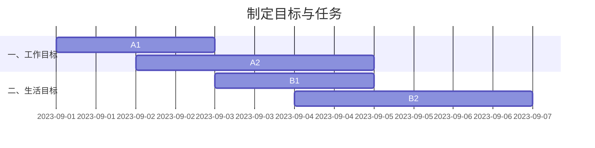

#### 2.1.2 使用时间管理工具

利用日历、待办事项清单等时间管理工具，合理安排工作时间与生活时间，确保两者的平衡。例如，可以使用Google Calendar来规划每日工作与休息时间。

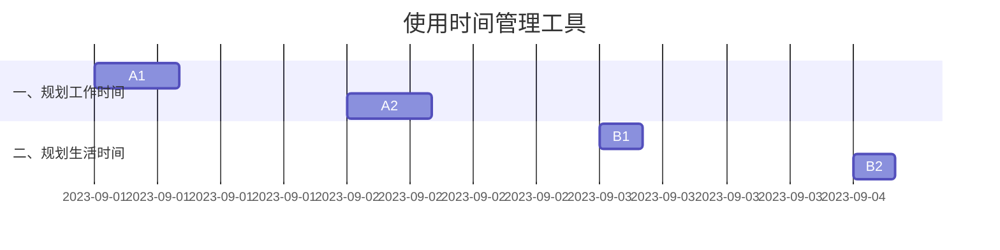

### 2.2 培养良好的工作习惯

#### 2.2.1 工作场所的规划

一个整洁、舒适的工作环境可以提高工作效率。定期整理工作场所，保持桌面整洁，有助于集中注意力。

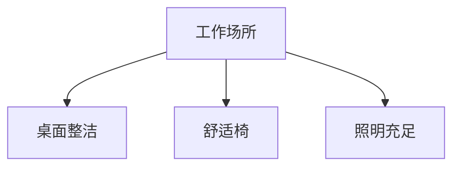

#### 2.2.2 高效的工作流程

合理规划工作流程，减少不必要的重复操作。例如，使用自动化工具来简化日常任务，提高工作效率。

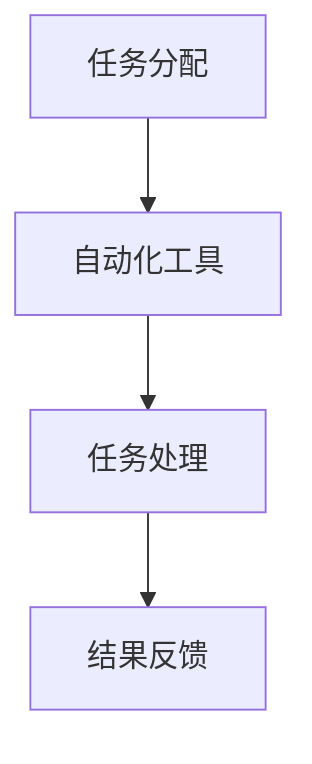

### 2.3 增强自我管理能力

#### 2.3.1 情绪管理

学会调节情绪，保持平和的心态。例如，通过冥想、深呼吸等方法来缓解工作压力。

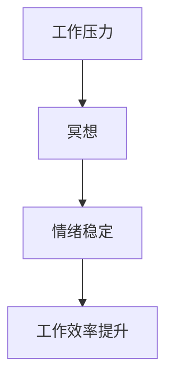

#### 2.3.2 健康生活方式

注意饮食、锻炼和休息。定期进行体检，确保身体健康。

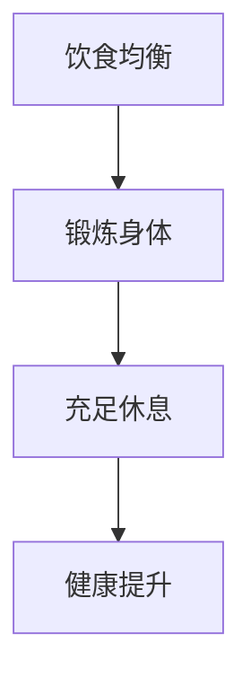

### 2.4 保持良好的家庭关系

#### 2.4.1 亲子沟通

倾听孩子的需求，建立良好的亲子关系。例如，定期与孩子交流，了解他们的想法和需求。

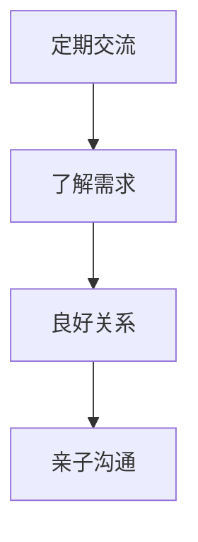

#### 2.4.2 家庭活动

与家人共同参与活动，增进感情。例如，一起做饭、看电影或进行户外运动。

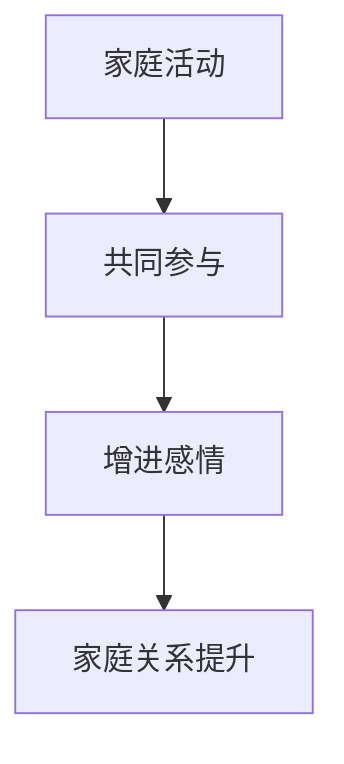

## 第三部分：生活品质的提升

### 3.1 提升身心健康

#### 3.1.1 心理健康

关注心理健康，寻求专业帮助。例如，定期进行心理咨询，解决心理问题。

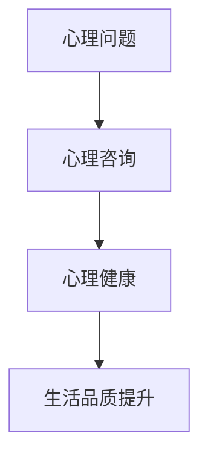

#### 3.1.2 身体健康

定期锻炼，保持良好的身体状况。例如，每天进行30分钟的有氧运动。

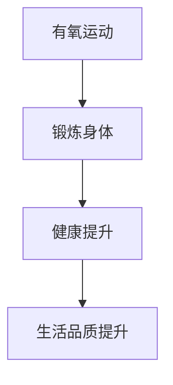

### 3.2 个人发展

#### 3.2.1 兴趣与爱好

培养兴趣，丰富业余生活。例如，学习一门新技能或参与志愿服务。

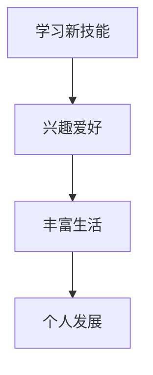

#### 3.2.2 持续学习

不断提升自己的知识和技能。例如，参加在线课程或阅读专业书籍。

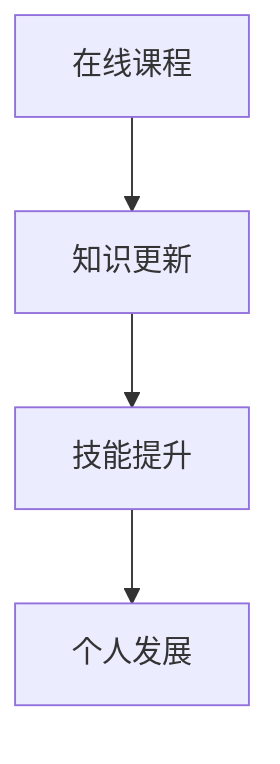

### 3.3 社会交往

#### 3.3.1 拓展人际关系

积极参与社交活动，扩大社交圈子。例如，参加行业会议或社交聚会。

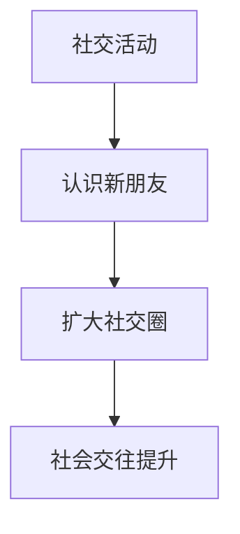

#### 3.3.2 互助合作

与他人建立良好的合作关系，实现资源共享和优势互补。例如，与同事或朋友共同完成项目。

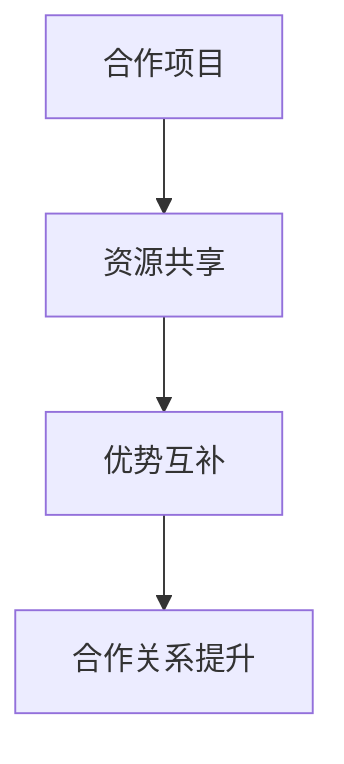

## 第四部分：实践案例分析

### 4.1 案例一：如何在工作繁忙时提升生活品质

#### 案例分析

小明是一位软件工程师，工作繁忙，常常加班。为了提升生活品质，他采取了以下策略：

1. **制定时间管理计划**：合理安排工作时间，确保工作与生活平衡。
2. **培养良好的工作习惯**：规划工作流程，减少不必要的重复操作。
3. **增强自我管理能力**：通过冥想和锻炼来缓解工作压力。
4. **保持良好的家庭关系**：定期与家人沟通，参加家庭活动。

#### 经验总结

小明的成功经验表明，通过合理规划时间、培养良好工作习惯、增强自我管理能力和保持良好家庭关系，即使在工作繁忙时也能提升生活品质。

### 4.2 案例二：如何平衡工作与家庭

#### 案例分析

小芳是一位家庭主妇，同时承担着家庭和工作的重任。为了平衡工作与家庭，她采取了以下策略：

1. **制定家庭计划**：合理安排家庭事务和工作任务。
2. **培养良好的工作习惯**：提高工作效率，减少家庭和工作中的冲突。
3. **参与家庭活动**：与家人共同参与家庭活动，增进感情。
4. **寻求外部支持**：向家人和朋友寻求帮助，减轻负担。

#### 经验总结

小芳的成功经验表明，通过制定家庭计划、培养良好工作习惯、参与家庭活动和寻求外部支持，可以有效地平衡工作与家庭，提升生活质量。

## 第五部分：最佳实践与建议

### 5.1 最佳实践

- **时间管理**：使用日历和待办事项清单来规划时间和任务。
- **工作习惯**：保持工作环境的整洁和舒适，提高工作效率。
- **自我管理**：学会情绪管理和健康管理，保持身心健康。
- **家庭关系**：与家人保持良好的沟通和参与家庭活动。

### 5.2 小结与建议

- **总结**：通过合理规划时间、培养良好工作习惯、增强自我管理能力和保持良好家庭关系，可以重新平衡工作与生活，提升生活品质。
- **建议**：在实际操作中，根据个人情况灵活调整策略，持续优化工作与生活的平衡。

---

## 作者

作者：AI天才研究院/AI Genius Institute & 禅与计算机程序设计艺术 /Zen And The Art of Computer Programming

---

在追求效率的同时，我们不应忽视生活品质的提升。通过本文的探讨和实践案例，希望读者能够找到适合自己的方法，实现工作与生活的重新平衡，享受更加美好的人生。

