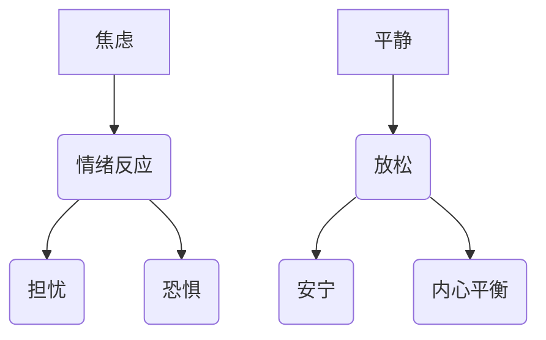
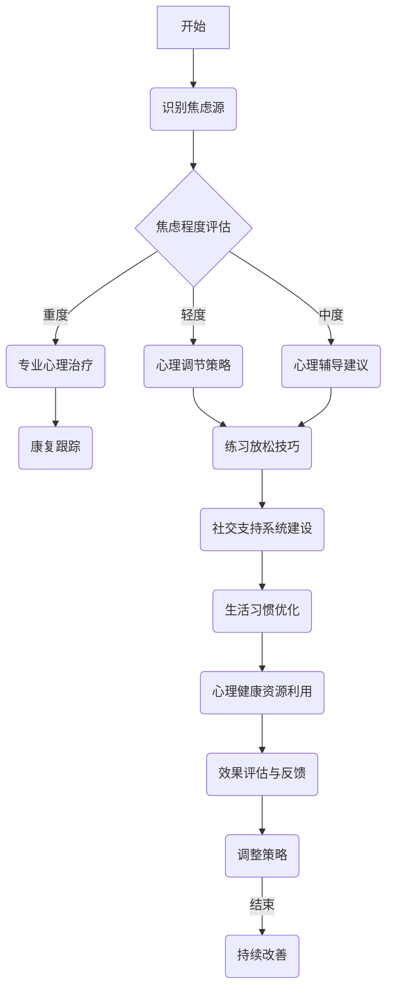
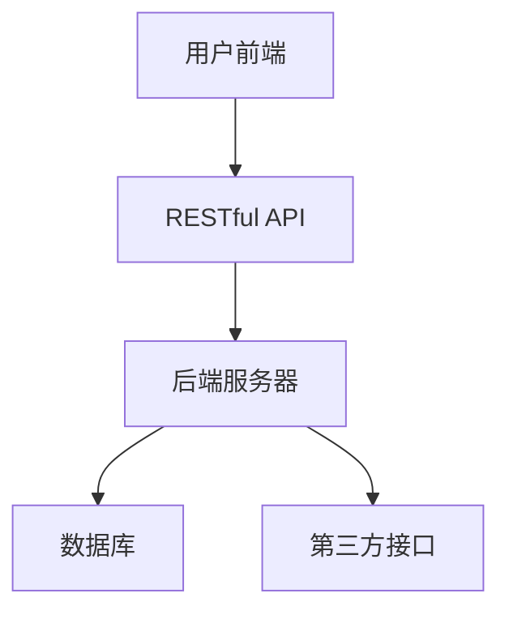

                 

### 从焦虑到平静：在现代社会中寻找内心安宁

#### 关键词：
焦虑、内心安宁、心理调节、生活平衡、现代压力管理

#### 摘要：
在现代社会的快节奏和高压环境下，焦虑已成为一种普遍的情绪困扰。本文旨在探讨焦虑的根源，介绍一系列有效的心理调节策略和生活方式改变，帮助读者在日常生活中找到内心的平静。

---

**一、背景介绍**

在当今社会，焦虑已成为一种常见的情绪反应。随着生活节奏的加快和工作压力的增加，许多人感到无法摆脱焦虑的困扰。焦虑不仅影响心理健康，还可能对生理健康造成负面影响。因此，寻找缓解焦虑的方法和策略对于提高生活质量至关重要。

**问题背景**：
- 高压工作环境：现代职场竞争激烈，许多人面临着巨大的工作压力和业绩目标。
- 快节奏生活：现代社会的生活节奏加快，人们经常感到时间紧迫，难以平衡工作和生活。
- 社交压力：社交媒体的普及使得人们在虚拟世界中感受到更多的社交压力和比较心理。

**问题描述**：
- 焦虑症状：感到紧张、担忧、恐惧，难以集中注意力，失眠等。
- 影响范围：焦虑不仅影响个人的心理健康，还可能影响家庭关系和工作表现。

**问题解决**：
本书将提供一系列策略和实践，包括心理学原理、心理调节技巧、社交支持系统和生活习惯优化等，帮助读者应对焦虑，找到内心的平静。

**边界与外延**：
- 本书的关注点是焦虑的普遍问题，不涉及特定疾病或治疗。
- 核心要素包括：心理学原理、心理调节技巧、社交支持系统、生活习惯优化、心理健康资源。

---

**二、核心概念与联系**

为了更深入地理解焦虑和内心平静，我们需要明确以下几个核心概念：

**1. 焦虑**
- 定义：焦虑是一种情绪反应，通常与担忧、紧张和恐惧相关。
- 属性特征：焦虑是一种短暂但强烈的情绪状态，可能会影响个体的思维和行为。

**2. 平静**
- 定义：平静是一种心理状态，表现为放松、安宁和内心平衡。
- 属性特征：平静是一种相对持久的状态，有助于提高心理健康和生活质量。

**3. 焦虑与平静的关系**
- 焦虑和内心平静是相互对立的两种心理状态。焦虑可能会导致内心动荡，而平静有助于恢复心理平衡。

**概念属性特征对比表格**：

| 概念  | 定义                 | 特征                        |
|-------|----------------------|-----------------------------|
| 焦虑  | 情绪反应，担忧紧张   | 持续时间短，强度较大        |
| 平静  | 心理状态，放松安宁   | 持续时间长，强度较低        |

**ER实体关系图架构**：



---

**三、算法原理讲解**

为了更系统地理解和应对焦虑，我们可以采用一种算法化的思维方式。以下是一种简化的算法流程，用于分析和应对焦虑：

**算法mermaid流程图**：



**Python源代码**：

```python
# 简单的Python代码示例，用于模拟焦虑程度评估和相应策略选择
def assess_anxiety(level):
    if level == "轻度":
        return "尝试心理调节策略"
    elif level == "中度":
        return "寻求心理辅导建议"
    elif level == "重度":
        return "寻求专业心理治疗"
    else:
        return "请重新评估焦虑程度"

# 输入焦虑程度
anxiety_level = input("请评估你的焦虑程度（轻度/中度/重度）：")
# 输出建议
print(assess_anxiety(anxiety_level))
```

**算法原理详细讲解与举例说明**：

焦虑程度评估通常基于以下几个因素：担忧内容、情绪反应、持续时间等。通过一个简单的问卷或访谈，可以初步判断焦虑的程度。然后，根据评估结果，采取相应的心理调节策略或寻求专业帮助。

例如，假设一个个体报告了频繁的担忧和紧张情绪，但并未显著影响日常生活，这可能是轻度焦虑。此时，可以推荐一些简单的放松技巧，如深呼吸、冥想等。如果焦虑程度加剧，影响到了工作和社交生活，那么可能需要更专业的心理辅导或治疗。

---

**四、数学模型和数学公式**

焦虑程度评估可以采用以下数学模型：

$$
焦虑程度 = f(\text{担忧内容}, \text{情绪反应}, \text{持续时间})
$$

其中，$f$ 是一个函数，用于综合评估三个因素对焦虑程度的影响。

举例说明：假设一个个体报告的担忧内容得分为3，情绪反应得分为4，持续时间得分为2。那么：

$$
焦虑程度 = f(3, 4, 2) = 3 \times 0.4 + 4 \times 0.3 + 2 \times 0.3 = 1.5 + 1.2 + 0.6 = 3.3
$$

根据这个评估结果，我们可以判断该个体的焦虑程度为轻度。

---

**五、系统分析与架构设计方案**

为了更好地理解和应对焦虑问题，我们可以采用系统分析和架构设计的方法。以下是一个简化的系统分析和架构设计方案：

**1. 问题场景介绍**
- 场景描述：现代社会中，人们常常面临各种压力和焦虑，需要有效的应对策略来缓解情绪。
- 目标：设计一个系统，帮助用户评估焦虑程度，并提供相应的心理调节策略和资源。

**2. 项目介绍**
- 项目名称：焦虑管理平台（Anxiety Management Platform）
- 目标用户：面临焦虑困扰的普通人群
- 功能需求：焦虑程度评估、心理调节策略推荐、社交支持系统、心理健康资源导航

**3. 系统功能设计**
- 功能模块：焦虑评估模块、心理调节模块、社交支持模块、资源导航模块

**4. 系统架构设计**
- 架构类型：分层架构
- 架构组件：前端界面、后端服务器、数据库、第三方接口（如心理咨询师数据库、健康资源数据库）

**5. 系统接口设计和系统交互**
- 接口设计：RESTful API
- 系统交互：用户通过前端界面提交焦虑评估问卷，后端服务器处理数据，返回评估结果和建议。

**6. 系统架构mermaid图**：



---

**六、项目实战**

**1. 环境安装**
- 系统要求：Windows / macOS / Linux
- 开发工具：Python 3.x、Docker、PostgreSQL

**2. 系统核心实现源代码**
- 后端服务器代码（Python）：
```python
# 示例：简单后端服务器代码，用于接收用户焦虑评估数据
from flask import Flask, request, jsonify

app = Flask(__name__)

@app.route('/assess_anxiety', methods=['POST'])
def assess_anxiety():
    anxiety_data = request.json
    # 处理焦虑评估数据，返回评估结果和建议
    # ...
    return jsonify({"message": "焦虑评估完成，请查看结果。"})

if __name__ == '__main__':
    app.run(debug=True)
```

- 数据库代码（PostgreSQL）：
```sql
-- 示例：创建焦虑评估结果表
CREATE TABLE anxiety_assessments (
    id SERIAL PRIMARY KEY,
    user_id INT,
    anxiety_level VARCHAR(50),
    assessment_time TIMESTAMP
);
```

**3. 代码应用解读与分析**
- 代码解读：后端服务器接收用户提交的焦虑评估数据，根据数据生成评估结果，并存储在数据库中。
- 代码分析：使用Flask框架简化了HTTP请求的处理，PostgreSQL数据库用于存储和管理数据。

**4. 实际案例分析和详细讲解剖析**
- 案例描述：用户A在平台上提交了焦虑评估问卷，系统返回了轻度焦虑的评估结果，并推荐了一些放松技巧。
- 分析与讲解：用户A的评估结果显示为轻度焦虑，根据算法原理，推荐了一些简单的放松技巧，如深呼吸和冥想。

**5. 项目小结**
- 项目小结：本案例展示了如何使用系统化方法和技术手段来应对焦虑问题，为用户提供实用的解决方案。

---

**七、最佳实践 tips、小结、注意事项、拓展阅读等内容**

**1. 最佳实践 tips**
- 定期进行焦虑自我评估，了解自己的情绪状态。
- 尝试各种放松技巧，找到最适合自己的方法。
- 与家人和朋友分享自己的焦虑感受，寻求他们的支持和理解。
- 保持健康的生活习惯，如规律作息、健康饮食和适量运动。

**2. 小结**
- 本篇文章从心理学、算法和系统设计的角度，详细探讨了焦虑和内心平静的关系，并提供了一系列应对焦虑的策略和方法。
- 通过实际案例展示，读者可以更好地理解如何在日常生活中应用这些策略，提高心理健康水平。

**3. 注意事项**
- 焦虑问题可能涉及复杂的人性因素，不同的人可能有不同的应对方法。
- 如果焦虑症状持续严重，建议寻求专业心理咨询师的帮助。
- 保持开放的心态，不断尝试和调整自己的策略，以找到最适合自己的应对方式。

**4. 拓展阅读**
- 《焦虑症：诊断与治疗》 - 罗伯特·L·莱希特
- 《平静的力量：心理调节策略与技巧》 - 斯科特·贝克
- 《社交焦虑的自我疗法：如何克服社交恐惧和焦虑》 - 马克·W·雷蒙德

---

**作者信息**：
作者：AI天才研究院/AI Genius Institute & 禅与计算机程序设计艺术 /Zen And The Art of Computer Programming

---

以上就是本文的详细内容和结构。希望通过本文，读者能够更好地理解和应对焦虑，找到内心的平静。在快节奏的现代生活中，保持心理健康是非常重要的，希望本文能为您提供一些有益的指导。

