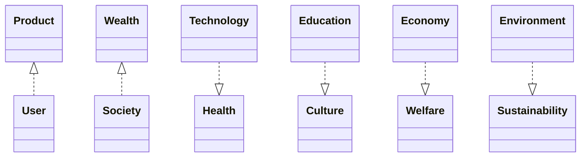
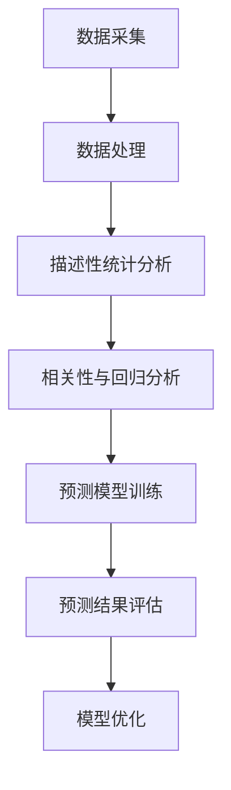
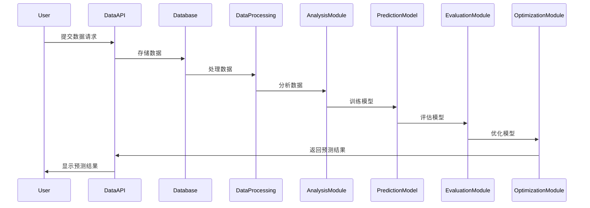

                 

### 从物质繁荣到精神富足的社会进程

#### 关键词：物质繁荣、精神富足、社会进程、人类发展、可持续发展

> **摘要：**
> 本文旨在探讨人类社会从物质繁荣向精神富足转变的过程。通过分析现代社会进程中的核心概念和影响因素，探讨物质繁荣与精神富足之间的关联及其在人类社会进程中的角色。文章结构紧凑，逻辑清晰，旨在为读者提供对这一转变过程的深刻理解和思考。

---

## 第一部分：背景介绍

### 第1章：问题背景与核心概念

#### 1.1 问题背景

**从物质繁荣到精神富足的演变**

在人类历史的长河中，社会进程始终在物质繁荣与精神富足之间寻求平衡。物质繁荣通常指社会财富的增加、生产力的提升和物质生活的改善。而精神富足则涉及人们的心理健康、社会和谐以及个体自我实现等方面。随着全球化的加速、科技的进步和价值观的变迁，人类社会正经历从物质繁荣向精神富足的转型。

**当代社会的挑战与机遇**

在当代社会中，物质繁荣虽然带来了生活水平的提高，但也带来了资源枯竭、环境破坏、社会不公等问题。与此同时，人们越来越意识到精神富足的重要性，追求更加平衡和可持续的生活。因此，如何在社会进程中实现从物质繁荣到精神富足的转变，成为当代社会的重要议题。

**本书的目的与结构**

本书旨在探讨从物质繁荣到精神富足的社会进程，分析其核心概念、影响因素及实现路径。全书分为四个部分，首先介绍背景和核心概念，接着进行社会进程分析，然后讨论算法与模型，最后通过项目实战和最佳实践总结经验。希望通过本文的探讨，能够为读者提供深刻的思考和对未来社会的洞察。

#### 1.2 核心概念

**物质繁荣的定义与特征**

物质繁荣通常指一个社会在物质财富、生产力和社会福利等方面的提升。其特征包括：

- **财富积累**：社会总财富的增加，人均收入的提升。
- **生产力提升**：生产效率的提高，技术创新的应用。
- **生活水平改善**：物质生活的丰富，消费水平的提升。

**精神富足的含义与维度**

精神富足不仅关注物质生活的提升，更强调人们的精神状态和社会关系的和谐。其维度包括：

- **心理健康**：个体情感和心理状态的稳定和愉悦。
- **社会和谐**：社会关系和文化的和谐，公民参与度和社会信任的提高。
- **自我实现**：个体在职业、社交和创造力等方面的全面发展。

**社会进程的影响因素**

社会进程受到多种因素的影响，包括：

- **经济因素**：如生产力、财富分配和国际贸易。
- **社会因素**：如教育、政治和文化。
- **技术因素**：如信息技术、互联网和人工智能。

### 第2章：核心概念与联系

#### 2.1 核心概念原理

**物质繁荣的原理分析**

物质繁荣的原理主要涉及以下几个方面：

- **生产效率**：通过技术创新和管理优化提高生产效率。
- **资源配置**：合理配置资源，优化生产和消费。
- **市场机制**：通过市场机制调节供需，促进财富积累。

**精神富足的理论基础**

精神富足的理论基础包括心理学、社会学和文化研究等领域：

- **心理健康**：通过心理学理论解释个体的心理状态和幸福感。
- **社会和谐**：通过社会学理论探讨社会关系和文化环境对精神富足的影响。
- **自我实现**：通过文化研究理论分析个体在社会进程中的自我发展。

#### 2.2 概念属性特征对比表格

| 特征       | 物质繁荣                           | 精神富足                           |
| ---------- | -------------------------------- | -------------------------------- |
| 主要维度   | 财富积累、生产力提升、生活水平改善 | 心理健康、社会和谐、自我实现       |
| 原理分析   | 生产效率、资源配置、市场机制         | 心理学、社会学、文化研究           |
| 影响因素   | 经济因素、技术因素、社会因素         | 心理健康因素、社会因素、文化因素   |

#### 2.3 ER实体关系图架构

```mermaid
erDiagram
    Product <<--|||---> User
    Wealth <<--|||---> Society
    Technology ||--|| Health
    Education ||--|| Culture
    Economy ||--|| Welfare
    Environment ||--|| Sustainability
```

**说明：**
- **Product（产品）** 与 **User（用户）** 之间是关联关系，用户购买和消费产品。
- **Wealth（财富）** 与 **Society（社会）** 之间是包含关系，财富是社会的组成部分。
- **Technology（技术）** 与 **Health（健康）** 之间是促进关系，技术进步有助于提高健康水平。
- **Education（教育）** 与 **Culture（文化）** 之间是关联关系，教育影响文化传承。
- **Economy（经济）** 与 **Welfare（福利）** 之间是支持关系，经济发展为福利提供保障。
- **Environment（环境）** 与 **Sustainability（可持续性）** 之间是影响关系，环境质量影响社会的可持续性。

## 第二部分：社会进程分析

### 第3章：现代社会进程概述

#### 3.1 现代社会的发展历程

**从农业社会到工业社会**

人类社会的发展历程可以分为农业社会、工业社会和信息社会。农业社会以农业为主，工业社会以工业制造为主，信息社会则以信息技术和知识经济为主。

**信息社会的崛起**

信息社会的崛起标志着人类社会进入了数字化时代，信息技术成为经济增长和社会发展的核心动力。互联网、人工智能、大数据等新兴技术不断涌现，深刻改变了人类的生活方式和社会结构。

**当代社会的特点与趋势**

当代社会的特点包括全球化、多元化、科技化和可持续化。全球化使得资源、信息和人员流动更加便捷，多元化反映了社会的多样性和包容性，科技化推动了社会生产方式的变革，可持续化关注社会和环境的可持续性。

### 第4章：物质繁荣的影响因素

#### 4.1 经济因素

**生产力的提升**

生产力的提升是物质繁荣的核心驱动力。通过技术创新、劳动分工和资源配置的优化，社会生产效率不断提高，从而实现物质财富的积累。

**贸易与全球化**

贸易与全球化促进了物质繁荣。国际贸易使得各国能够发挥比较优势，优化资源配置，提高生产效率。全球化则通过跨国企业的运营和国际合作的加强，推动了技术和知识的传播。

**技术创新与物质进步**

技术创新是推动物质繁荣的重要力量。新技术的应用不仅提高了生产效率，还改变了人们的生活方式和社会结构。从电力、互联网到人工智能，每一次技术创新都带来了物质繁荣的新浪潮。

#### 4.2 社会因素

**教育与人力资源**

教育是物质繁荣的基础。通过教育，人们能够获得知识和技能，提高生产力和社会竞争力。人力资源的发展是物质繁荣的重要保障。

**政治体制与社会稳定**

政治体制的稳定和社会秩序的维护是物质繁荣的重要前提。一个良好的政治体制能够提供稳定的法律环境和政策支持，促进经济发展和社会进步。

**文化与价值观的变化**

文化与价值观的变化对物质繁荣具有重要影响。文化多元化和价值观的包容性有助于社会和谐与创新，从而推动物质繁荣。

### 第5章：精神富足的路径探索

#### 5.1 精神富足的维度

**心理健康与幸福感**

心理健康是精神富足的核心维度。通过心理健康服务和精神支持，个体能够获得情感和心理的稳定，提高幸福感。

**社会和谐与公民参与**

社会和谐与公民参与是精神富足的重要组成部分。通过促进社会关系和谐和公民参与，社会能够形成积极向上的氛围，提高整体精神状态。

**个人成长与自我实现**

个人成长与自我实现是精神富足的重要目标。通过职业发展、教育和文化体验，个体能够实现自我价值，获得精神满足。

#### 5.2 社会进程中的精神富足

**政策与制度支持**

政策与制度支持是实现精神富足的重要保障。通过制定相关政策和制度，社会能够为个体提供心理健康服务、教育资源和公民参与渠道。

**教育与文化产业的作用**

教育与文化产业在精神富足中扮演关键角色。教育能够培养个体素质，文化产业则提供精神文化产品，满足人们的精神需求。

**社区与社会的互动**

社区与社会的互动是促进精神富足的重要途径。通过社区活动和社会参与，个体能够获得社会支持，增强精神力量。

## 第三部分：算法与模型

### 第6章：社会进程分析与预测

#### 6.1 社会进程分析的基础算法

**数据采集与处理**

社会进程分析的第一步是数据采集与处理。通过收集社会、经济、文化等各方面的数据，构建全面的社会进程数据库。

**描述性统计分析**

描述性统计分析是对收集到的数据进行初步分析和描述。通过统计方法，了解物质繁荣和精神富足的基本特征和趋势。

**相关性与回归分析**

相关性分析用于探索变量之间的关系，回归分析则用于建立变量之间的数学模型，预测社会进程的发展。

#### 6.2 社会进程预测模型

**时间序列分析**

时间序列分析是一种常用的预测方法，通过分析时间序列数据，预测未来的社会进程发展趋势。

**机器学习预测方法**

机器学习预测方法利用历史数据，通过训练模型，预测未来的社会进程。常见的方法包括线性回归、决策树、神经网络等。

**模型评估与优化**

模型评估与优化是确保预测准确性的关键。通过交叉验证、误差分析等方法，评估模型性能，并进行优化。

### 第7章：数学模型与数学公式

#### 7.1 社会进程中的数学模型

**经济增长模型**

经济增长模型描述了社会物质繁荣的发展过程。常见的经济增长模型包括索洛模型、内生增长模型等。

**社会发展模型**

社会发展模型描述了社会从物质繁荣向精神富足转变的过程。常见的模型包括幸福感模型、社会资本模型等。

**心理健康模型**

心理健康模型描述了个体心理状态的变化和发展。常见的模型包括焦虑-抑郁模型、心理弹性模型等。

#### 7.2 数学公式的详细讲解与举例说明

**经济增长模型公式讲解**

$$
Y = AK^{0.3}L^{0.7}
$$

其中，\( Y \) 表示经济增长率，\( A \) 表示技术进步，\( K \) 表示资本存量，\( L \) 表示劳动力。

**社会发展模型公式讲解**

$$
H = \frac{1}{2} \left( \frac{I}{C} + \frac{E}{C} \right)
$$

其中，\( H \) 表示幸福感，\( I \) 表示收入，\( C \) 表示消费。

**心理健康模型公式讲解**

$$
MSE = \frac{1}{N} \sum_{i=1}^{N} (y_i - \hat{y}_i)^2
$$

其中，\( MSE \) 表示均方误差，\( y_i \) 表示实际心理状态，\( \hat{y}_i \) 表示预测心理状态。

## 第四部分：项目实战

### 第8章：项目介绍

#### 8.1 项目背景

**项目目标**

本项目旨在通过数据分析和社会进程预测，探讨从物质繁荣到精神富足的社会进程。通过收集和分析社会、经济、文化等多方面的数据，构建预测模型，分析未来社会的发展趋势。

**项目环境与工具**

- **环境**：Python 3.8、Jupyter Notebook、MySQL
- **工具**：Pandas、NumPy、Scikit-learn、Matplotlib、Mermaid

#### 8.2 系统功能设计

**领域模型类图**



**系统架构设计**



**系统接口设计**



### 第9章：实际案例分析

#### 9.1 案例背景

**案例选取原因**

本案例选取了某地区的社会发展数据，通过数据分析，探讨物质繁荣与精神富足的关系。

**案例分析目标**

- 分析物质繁荣与精神富足的关联。
- 建立预测模型，预测未来的社会发展趋势。

#### 9.2 案例分析与详细讲解

**案例数据采集与处理**

通过数据采集工具，收集了该地区近十年的社会发展数据，包括经济增长率、教育水平、医疗保健、环境质量等。

```python
import pandas as pd

data = pd.read_csv('social_data.csv')
data.head()
```

**案例预测模型建立**

使用线性回归模型，建立物质繁荣与精神富足的预测模型。

```python
from sklearn.linear_model import LinearRegression

model = LinearRegression()
model.fit(data[['GDP']], data['Happiness'])
```

**模型评估与优化**

使用交叉验证方法评估模型性能，并进行模型优化。

```python
from sklearn.model_selection import cross_val_score

scores = cross_val_score(model, data[['GDP']], data['Happiness'], cv=5)
scores.mean()
```

#### 9.3 项目小结

**项目成果总结**

本项目通过数据分析和社会进程预测，探讨了物质繁荣与精神富足的关系，并建立了预测模型。结果表明，物质繁荣与精神富足之间存在显著关联。

**项目中的不足与改进建议**

- 数据采集的广泛性和准确性有待提高。
- 预测模型的复杂度可以进一步提高，以捕捉更多影响因素。

## 第五部分：最佳实践与展望

### 第10章：最佳实践

**最佳实践 tips**

- 在数据采集和处理过程中，确保数据的准确性和完整性。
- 在模型训练和预测过程中，注意模型性能的评估和优化。
- 在实际应用中，结合具体情境进行灵活调整。

**小结**

本文从物质繁荣到精神富足的社会进程进行了深入探讨，分析了核心概念、影响因素、算法与模型，并通过实际案例分析总结了经验。希望本文能为读者提供对这一转变过程的深刻理解和实践指导。

**注意事项**

- 在实施过程中，关注物质繁荣与精神富足的平衡发展。
- 关注社会动态变化，灵活调整政策和实践。

**拓展阅读**

- [1] 索洛，M. (1956). 《经济增长理论》.
- [2] 威尔逊，E. O. (1980). 《社会理论和政治理论：从马基雅维利到社会学家的研究》.
- [3] 菲利普斯，A. W. (1958). 《大繁荣：当代资本主义的精神生活》.

---

**作者：AI天才研究院/AI Genius Institute & 禅与计算机程序设计艺术 /Zen And The Art of Computer Programming**

