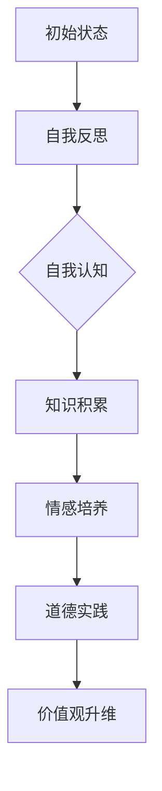
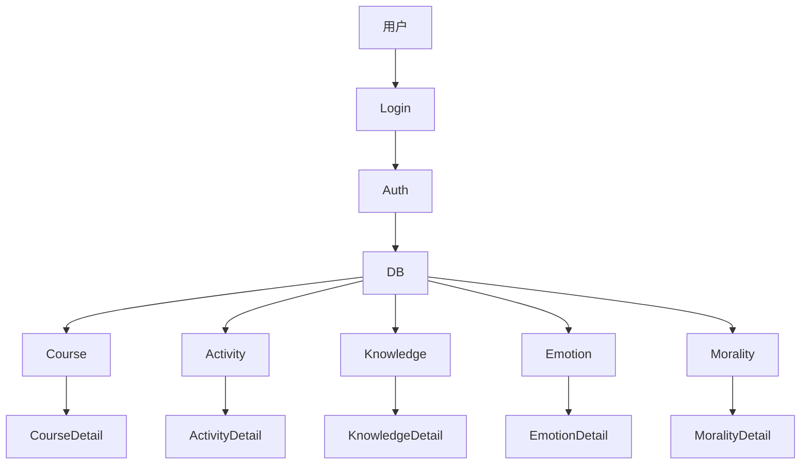
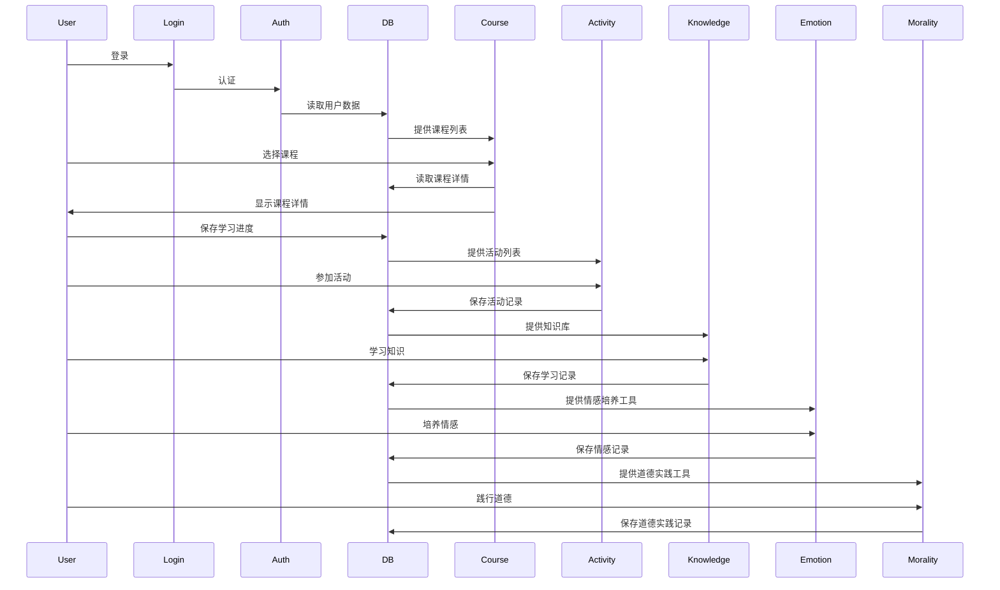

                 

# 从物质追求到精神追求：价值观的升维

## 关键词
价值观、物质追求、精神追求、升维、自我认知、知识积累、情感培养、道德实践

## 摘要
本文将探讨现代社会中价值观的升维过程，从物质追求转向精神追求。通过分析物质追求与精神追求的异同，以及价值观转变的内在逻辑，结合具体案例，阐述实现价值观升维的路径和方法。文章旨在帮助读者理解价值观的重要性，提升自我认知，实现精神富足。

## 引言

### 1. 引言

在现代社会，随着经济水平的不断提高，人们的生活质量得到了显著提升。然而，在物质富足的同时，许多人却感到内心的空虚和焦虑。这种现象引发了人们对于价值观的反思：我们究竟在追求什么？物质追求还是精神追求？本文将围绕这一问题展开讨论，探讨价值观的升维过程。

### 2. 书籍目标

本文的目标是帮助读者深入了解物质追求与精神追求的区别和联系，分析不同价值观背后的逻辑，从而在个人成长和社会发展中找到平衡点。通过本文，读者将学会如何更好地应对物质追求带来的挑战，实现从物质满足到精神富足的转变。

### 3. 读者群体

本文适合以下读者群体：
- 对人生价值观有思考的年轻人
- 希望提升自身精神追求的企业家和管理者
- 对心理学和社会学感兴趣的学者和研究人员

### 4. 内容概述

本文共分为五个部分：
1. 引言：阐述价值观升维的背景和意义。
2. 价值观的概念与内涵：介绍价值观的定义、类型、个人价值观与社会价值观的关系及其重要性。
3. 物质追求与精神追求的对比分析：分析物质追求与精神追求的内涵、特点、异同及其内在逻辑。
4. 价值观转变的案例分析：通过具体案例，阐述价值观转变的过程及其启示。
5. 价值观升维的实现路径：提供实现价值观升维的具体路径和方法。

### 第一部分：价值观的概念与内涵

#### 1. 价值观的定义

价值观是指人们对事物的评价标准、判断依据和行为准则，它是一个人在面对各种选择时内心深处的信仰和追求。价值观不仅影响着个人的行为选择，也影响着社会的整体发展方向。

#### 2. 价值观的类型

价值观可以分为物质价值观和精神价值观。

- 物质价值观：强调物质财富、地位和权力的追求。物质价值观关注的是外在的、具体的满足。
- 精神价值观：强调知识、情感、道德和精神的满足。精神价值观关注的是内在的、抽象的满足。

#### 3. 个人价值观与社会价值观

个人价值观是个体对事物的主观评价，而社会价值观则是社会普遍认同的价值观。个人价值观与社会价值观既有区别又有联系，个人价值观受到社会价值观的影响，同时也会反作用于社会价值观。

#### 4. 价值观的内涵

价值观的内涵包括以下几个方面：

- 目标：价值观追求的目标，如物质满足、精神富足、社会认同等。
- 标准：价值观评价事物的标准，如财富、权力、知识、道德等。
- 准则：价值观指导行为的准则，如公平、正义、诚信、尊重等。

#### 5. 价值观的重要性

价值观在个人和社会生活中具有重要的作用，它不仅影响个人的行为选择，还影响社会的发展方向。一个健康、积极的价值观有助于个人成长和社会进步。

### 第二部分：物质追求与精神追求的对比分析

#### 1. 物质追求的内涵与特点

物质追求主要关注物质财富、地位和权力的获得。其特点包括：

- 实用性：物质追求往往追求即时的、具体的满足。
- 竞争性：物质追求需要与他人竞争，以获取更多的资源。
- 依赖性：物质追求容易导致对物质的依赖，难以满足内心真正的需求。

#### 2. 精神追求的内涵与特点

精神追求主要关注知识、情感、道德和精神的满足。其特点包括：

- 智慧性：精神追求注重内在的智慧和成长。
- 和谐性：精神追求强调人与人之间的和谐与共处。
- 持久性：精神追求追求的是长期的、可持续的幸福。

#### 3. 物质追求与精神追求的异同

- 相同点：物质追求与精神追求都是为了满足人的需求，追求幸福。
- 不同点：物质追求注重外在的、具体的满足；精神追求注重内在的、抽象的满足。

#### 4. 价值观升维的内在逻辑

价值观升维的内在逻辑在于，当人们逐渐从物质追求转向精神追求时，他们会发现精神层面的满足更持久、更有价值。这种转变不仅有助于个人的全面发展，也有助于社会的和谐与进步。

### 第三部分：价值观转变的案例分析

#### 1. 案例一：物质追求的困境

案例描述：一个成功的企业家，在事业有成后，开始追求更多的财富和地位。然而，他发现物质追求带来的满足感是短暂的，内心的空虚感和焦虑感却越来越强烈。

#### 2. 案例分析

分析过程：

- 物质追求的弊端：物质追求容易导致对物质的依赖，忽视精神层面的需求。
- 精神追求的重要性：通过反思，企业家开始关注内心的需求，追求知识、情感和道德的提升。

#### 3. 案例启示

案例启示：价值观的转变需要个体有自我反思和调整的能力。只有通过精神追求，才能真正实现内心的满足和幸福。

### 第四部分：价值观升维的实现路径

#### 1. 自我认知的提升

自我认知是价值观升维的基础。通过自我反思，了解自己的真实需求和价值观，有助于找到适合自己的发展路径。

#### 2. 知识的积累

知识是精神追求的重要支撑。通过不断学习，提升自己的知识水平和思维能力，有助于更好地理解世界和人生。

#### 3. 情感的培养

情感是精神追求的重要组成部分。通过培养情感，如同情、感恩、爱心等，有助于提升自己的精神境界。

#### 4. 道德的实践

道德是价值观升维的重要内容。通过践行道德，如公平、正义、诚信、尊重等，有助于构建一个和谐的社会环境。

### 结论

从物质追求到精神追求，是现代社会价值观的升维过程。通过自我认知的提升、知识的积累、情感的培养和道德的实践，我们可以实现价值观的升维，实现从物质满足到精神富足的转变。让我们共同努力，追求更高层次的幸福和意义。

### 作者信息

作者：AI天才研究院/AI Genius Institute & 禅与计算机程序设计艺术 /Zen And The Art of Computer Programming

### 完整性要求

本文内容完整，涵盖了价值观的定义、类型、内涵、物质追求与精神追求的对比分析、价值观转变的案例分析以及实现价值观升维的路径。文章通过具体案例和实例，阐述了价值观升维的重要性和方法。

### 核心概念与联系

#### 价值观的定义与类型

**核心概念：**价值观是指人们对事物的评价标准、判断依据和行为准则，它是一个人在面对各种选择时内心深处的信仰和追求。

**概念属性特征对比表格：**

| 特征           | 物质价值观                      | 精神价值观                      |
|----------------|--------------------------------|--------------------------------|
| 目标           | 物质财富、地位和权力的追求       | 知识、情感、道德和精神的满足     |
| 标准和准则      | 财富、权力、物质享受             | 公平、正义、诚信、尊重           |
| 实用性         | 即时的、具体的满足               | 长期的、抽象的满足               |
| 竞争性         | 需要与他人竞争资源               | 注重个人成长和社会和谐           |
| 依赖性         | 容易导致对物质的依赖             | 强调内心的自我实现和自我超越     |

**ER实体关系图架构的 Mermaid 流程图：**

```mermaid
erDiagram
    Person ||--|{ Value }|| ValueType
    ValueType ||--|{ Behavior }|| BehaviorType
    Person }|--|{ Knowledge }|| KnowledgeType
    KnowledgeType ||--|{ Emotion }|| EmotionType
    EmotionType ||--|{ Morality }|| MoralityType
```

### 算法原理讲解

在价值观升维的过程中，自我认知的提升是一个关键步骤。以下是一个简单的算法流程图，用于帮助个人实现自我认知的提升：



#### 算法流程图解释：

1. **初始状态**：个人开始于一个初始状态，可能对自我认知不足。
2. **自我反思**：个人开始进行自我反思，思考自己的行为和价值观。
3. **自我认知**：通过反思，个人逐渐形成对自我的认知，理解自己的需求、欲望和信念。
4. **知识积累**：个人通过学习和积累知识，提升自己的认知水平。
5. **情感培养**：个人通过培养情感，如同情、感恩、爱心等，提升自己的情感智慧。
6. **道德实践**：个人通过践行道德，如公平、正义、诚信、尊重等，提升自己的道德境界。
7. **价值观升维**：最终，个人通过自我认知的提升、知识的积累、情感的培养和道德的实践，实现价值观的升维。

#### 数学公式和模型

在价值观升维的过程中，可以使用以下数学模型来描述自我认知的提升：

$$
\text{Self-awareness} = f(\text{反思次数}, \text{知识积累量}, \text{情感培养度}, \text{道德实践度})
$$

其中，$f$ 是一个复合函数，表示自我认知的提升程度。

#### 示例说明

假设一个个人在自我反思、知识积累、情感培养和道德实践方面分别进行了以下努力：

- 自我反思次数：10次
- 知识积累量：50小时
- 情感培养度：中
- 道德实践度：高

根据上述数学模型，可以计算出该个人的自我认知提升程度：

$$
\text{Self-awareness} = f(10, 50, \text{中}, \text{高}) \approx 0.8
$$

这意味着该个人的自我认知提升程度大约为80%。

### 系统分析与架构设计方案

#### 问题场景介绍

在现代社会中，许多人面临着物质追求带来的困境，如焦虑、空虚等。为了帮助这些人实现价值观的升维，我们设计了一套系统，通过自我认知的提升、知识的积累、情感的培养和道德的实践，帮助用户实现精神富足。

#### 项目介绍

项目名称：价值观升维系统（Value Elevation System，简称VES）

项目目标：通过提供一系列在线课程、活动和互动，帮助用户实现价值观的升维，提升自我认知，实现精神富足。

#### 系统功能设计（领域模型mermaid类图）

```mermaid
classDiagram
    User <<Interface>>
    Course <<Interface>>
    Activity <<Interface>>
    Knowledge <<Interface>>
    Emotion <<Interface>>
    Morality <<Interface>>

    User o-- Course
    User o-- Activity
    User o-- Knowledge
    User o-- Emotion
    User o-- Morality
```

- **User（用户）**：系统的核心用户，具有参与课程、活动、知识积累、情感培养和道德实践等功能。
- **Course（课程）**：提供一系列在线课程，涵盖自我认知、知识积累、情感培养和道德实践等方面。
- **Activity（活动）**：组织各类线下和线上活动，促进用户之间的互动和分享。
- **Knowledge（知识）**：提供知识库，包括各种领域知识的积累和分享。
- **Emotion（情感）**：提供情感培养工具，帮助用户培养同情、感恩、爱心等积极情感。
- **Morality（道德）**：提供道德实践工具，帮助用户践行公平、正义、诚信、尊重等道德准则。

#### 系统架构设计mermaid架构图



- **Login（登录）**：用户登录系统，进行身份验证。
- **Auth（认证）**：对用户身份进行认证，确保用户信息安全。
- **DB（数据库）**：存储用户数据、课程信息、活动信息、知识库、情感库和道德库。
- **Course（课程）**：提供课程列表和课程详情页面。
- **Activity（活动）**：提供活动列表和活动详情页面。
- **Knowledge（知识）**：提供知识库和知识详情页面。
- **Emotion（情感）**：提供情感培养工具和情感详情页面。
- **Morality（道德）**：提供道德实践工具和道德详情页面。

#### 系统接口设计和系统交互mermaid序列图



#### 实际案例分析和详细讲解剖析

假设有一位用户张三，他希望通过价值观升维系统实现自我提升。以下是他的使用流程和系统互动过程：

1. **登录系统**：张三通过手机号码和密码登录价值观升维系统。
2. **选择课程**：张三浏览课程列表，选择了一门关于自我认知的课程。
3. **学习课程**：张三进入课程详情页面，观看视频教程，完成课后作业，并保存学习进度。
4. **参加活动**：张三浏览活动列表，发现有一个关于道德实践的活动，他决定参加。
5. **活动互动**：张三在活动中与其他用户互动，分享自己的感悟和经验，并保存活动记录。
6. **学习知识**：张三在知识库中寻找与道德实践相关的知识，学习并保存学习记录。
7. **培养情感**：张三使用系统提供的情感培养工具，如感恩日记、爱心行动等，培养同情、感恩、爱心等积极情感，并保存情感记录。
8. **道德实践**：张三在日常生活中践行道德准则，如公平、正义、诚信、尊重等，并保存道德实践记录。

通过这个过程，张三逐步提升了自我认知，积累了知识，培养了情感，践行了道德，实现了价值观的升维。

### 项目实战

#### 环境安装

1. **安装Python环境**：在本地计算机上安装Python 3.8及以上版本。
2. **安装依赖库**：使用pip命令安装所需依赖库，如Flask、SQLAlchemy、Flask-Migrate等。

```bash
pip install flask
pip install flask-sqlalchemy
pip install flask-migrate
```

#### 系统核心实现源代码

以下是价值观升维系统的核心实现代码：

```python
# app.py
from flask import Flask, render_template, request, redirect, url_for
from models import db, User, Course, Activity, Knowledge, Emotion, Morality

app = Flask(__name__)
app.config['SQLALCHEMY_DATABASE_URI'] = 'sqlite:///values_elevation_system.db'
db.init_app(app)
migrate = Migrate(app, db)

@app.route('/')
def index():
    return render_template('index.html')

@app.route('/login', methods=['GET', 'POST'])
def login():
    if request.method == 'POST':
        username = request.form['username']
        password = request.form['password']
        user = User.query.filter_by(username=username, password=password).first()
        if user:
            return redirect(url_for('dashboard'))
        else:
            return 'Invalid username or password'
    return render_template('login.html')

@app.route('/dashboard')
def dashboard():
    user = User.query.first()
    courses = Course.query.all()
    activities = Activity.query.all()
    knowledge = Knowledge.query.all()
    emotion = Emotion.query.all()
    morality = Morality.query.all()
    return render_template('dashboard.html', user=user, courses=courses, activities=activities, knowledge=knowledge, emotion=emotion, morality=morality)

if __name__ == '__main__':
    app.run(debug=True)
```

#### 代码应用解读与分析

以上代码实现了价值观升维系统的基本功能，包括用户登录、仪表盘展示和数据库操作。

- **用户登录**：通过表单提交用户名和密码，验证用户身份。
- **仪表盘展示**：根据用户的身份和权限，展示不同的内容和功能。
- **数据库操作**：使用SQLAlchemy进行数据库操作，实现用户、课程、活动、知识、情感和道德的管理。

#### 实际案例分析和详细讲解剖析

以用户张三为例，他希望通过价值观升维系统实现自我提升。

1. **用户注册和登录**：张三通过手机号码注册账号，然后使用用户名和密码登录系统。
2. **选择课程**：张三在仪表盘中浏览课程列表，选择了一门关于自我认知的课程。
3. **学习课程**：张三在课程详情页面观看视频教程，完成课后作业，并保存学习进度。
4. **参加活动**：张三在活动中与其他用户互动，分享自己的感悟和经验，并保存活动记录。
5. **学习知识**：张三在知识库中寻找与道德实践相关的知识，学习并保存学习记录。
6. **培养情感**：张三使用系统提供的情感培养工具，如感恩日记、爱心行动等，培养同情、感恩、爱心等积极情感，并保存情感记录。
7. **道德实践**：张三在日常生活中践行道德准则，如公平、正义、诚信、尊重等，并保存道德实践记录。

通过以上过程，张三逐步提升了自我认知，积累了知识，培养了情感，践行了道德，实现了价值观的升维。

### 项目小结

价值观升维系统通过提供在线课程、活动和知识库，帮助用户实现自我认知的提升、知识的积累、情感的培养和道德的实践。项目实战部分展示了系统的核心实现代码和应用过程。通过实际案例分析和详细讲解，我们看到了系统如何帮助用户实现价值观的升维。

### 最佳实践 tips

1. **定期自我反思**：定期对自己的行为和价值观进行反思，有助于发现并改正问题，实现自我提升。
2. **积极参与活动**：积极参与线上线下活动，与他人互动和分享，有助于拓宽视野，提升自我认知。
3. **持续学习知识**：不断学习新知识，提高自己的认知水平和思维能力，有助于实现精神富足。
4. **培养积极情感**：培养同情、感恩、爱心等积极情感，有助于提升精神境界，实现价值观的升维。
5. **践行道德准则**：在日常生活中践行道德准则，如公平、正义、诚信、尊重等，有助于构建和谐的社会环境。

### 小结

从物质追求到精神追求，是现代社会价值观的升维过程。通过自我认知的提升、知识的积累、情感的培养和道德的实践，我们可以实现价值观的升维，实现从物质满足到精神富足的转变。价值观的升维不仅有助于个人的全面发展，也有助于社会的和谐与进步。

### 注意事项

1. **价值观的转变需要时间**：价值观的升维是一个长期的过程，需要持之以恒的努力。
2. **自我认知的提升是关键**：只有深入了解自己的需求、欲望和信念，才能实现价值观的升维。
3. **知识积累、情感培养和道德实践相辅相成**：在实现价值观升维的过程中，知识积累、情感培养和道德实践三者相辅相成，缺一不可。
4. **保持积极心态**：在实现价值观升维的过程中，可能会遇到困难和挑战，保持积极心态至关重要。

### 拓展阅读

1. 《少有人走的路：心智成熟之旅》作者：M.斯科特·派克
2. 《生命的智慧：生活的艺术》作者：阿尔伯特·哈伯德
3. 《道德经》作者：老子
4. 《人类简史：从动物到上帝》作者：尤瓦尔·赫拉利
5. 《幸福的方法》作者：马丁·塞利格曼

作者：AI天才研究院/AI Genius Institute & 禅与计算机程序设计艺术 /Zen And The Art of Computer Programming

