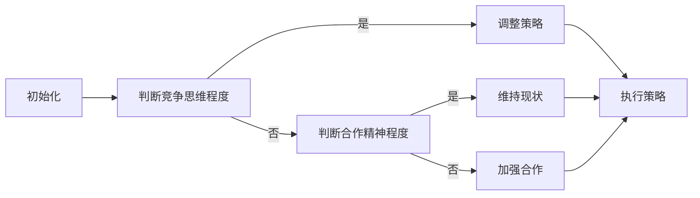
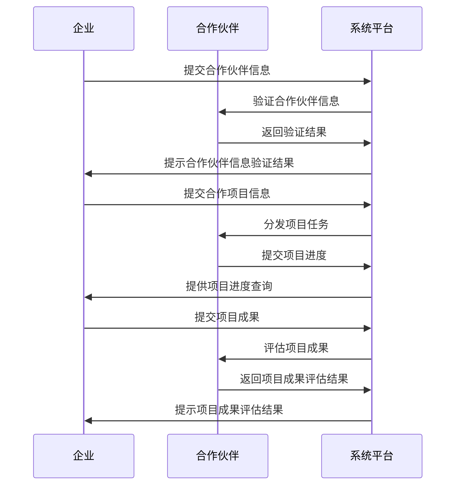
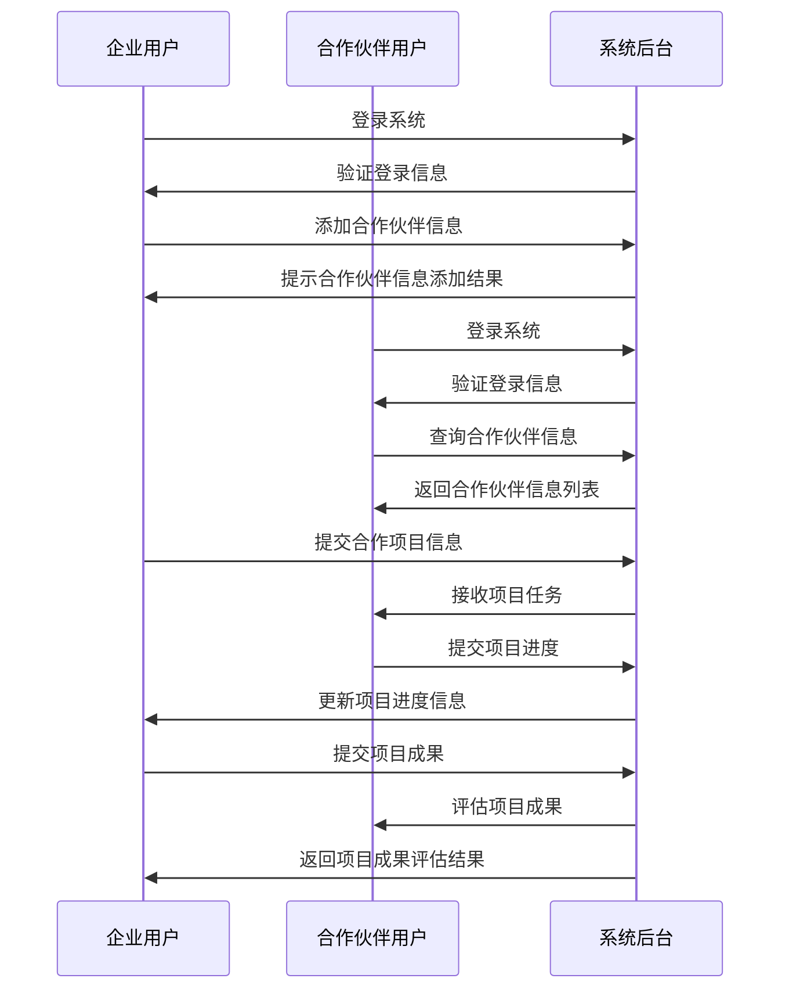

                 

### 第一部分：引言与背景

## 第1章：问题的提出与背景

### 1.1 竞争思维的传统影响

#### 1.1.1 竞争思维的起源与发展

竞争思维，作为一种社会现象，自古以来就在人类社会中扮演着重要的角色。从原始社会的部落争斗，到中世纪的军事竞争，再到现代商业领域的竞争，竞争思维一直在推动人类社会的发展与进步。在历史的长河中，竞争思维经历了多个阶段，从早期的生存竞争到现代的经济竞争，其表现形式和影响也不断演变。

竞争思维的起源可以追溯到人类社会的早期。在原始社会中，竞争是生存的基本法则。为了获取资源、占领领地和保护族群，个体之间、群体之间不断展开竞争。这种竞争在一定程度上推动了人类社会的进化，使人类在生存竞争中逐渐发展出更先进的生产工具和更高效的社会组织形式。

进入现代社会后，竞争思维在经济领域得到了更加充分的体现。市场经济体制的建立，使得市场竞争成为资源配置的主要手段。企业之间的竞争，不仅是产品和服务质量的竞争，更是技术创新、市场营销、品牌建设等多方面的竞争。竞争思维的盛行，推动了商业领域的繁荣，但也带来了一些负面影响。

#### 1.1.2 竞争思维在现代社会中的表现

在现代社会，竞争思维无处不在，从个人层面到组织层面，从学术领域到商业领域，竞争已经成为一种普遍的社会现象。以下是竞争思维在现代社会中的一些典型表现：

1. **教育领域的竞争**：从幼儿园到大学，学生在学业上不断竞争，争取更好的成绩和升学机会。家长、学校和整个社会对学生的竞争压力越来越大。

2. **职场竞争**：职场竞争主要体现在就业机会、职业晋升和薪资待遇等方面。员工为了获得更好的职业发展，不断提升自己的能力和业绩。

3. **商业竞争**：商业竞争是企业生存和发展的关键。企业之间在产品质量、市场份额、品牌价值等方面展开激烈竞争，以获得竞争优势。

4. **技术创新竞争**：随着科技的发展，技术创新成为各国和企业竞争的重要手段。在人工智能、5G通信、新能源等领域，各国和企业纷纷投入巨大资源进行研发和竞争。

#### 1.1.3 竞争思维对社会关系的负面影响

虽然竞争思维在一定程度上推动了社会的发展，但其负面影响也不容忽视。以下是竞争思维对社会关系产生的几大负面影响：

1. **人际关系的紧张**：竞争往往导致人际关系的紧张和矛盾。在竞争中，人们容易产生嫉妒、敌对和不信任的情绪，导致人际关系恶化。

2. **心理压力的增加**：长期的竞争环境，使人们承受巨大的心理压力。过度竞争可能导致焦虑、抑郁等心理问题。

3. **道德伦理的缺失**：在激烈的竞争中，一些人可能采取不正当手段，如作弊、欺诈等，以获取竞争优势。这种现象可能导致道德伦理的缺失。

4. **社会公平性的挑战**：竞争思维可能导致社会公平性的挑战。在竞争中，强者越强，弱者越弱，社会贫富差距可能进一步扩大。

### 1.2 合作精神的必要性

#### 1.2.1 合作精神的定义与特征

合作精神，是指个体或群体在面对共同目标时，能够相互协作、互相支持，共同克服困难的精神状态。合作精神具有以下几个特征：

1. **相互依赖**：合作精神强调个体或群体之间的相互依赖关系，共同承担责任和任务。

2. **共同目标**：合作精神的核心是共同目标，只有明确了共同目标，个体或群体才能协同合作，实现目标。

3. **相互尊重**：合作精神强调相互尊重，尊重他人的意见和贡献，以实现协同合作。

4. **相互信任**：合作精神建立在相互信任的基础上，只有信任才能使合作更加顺畅和高效。

#### 1.2.2 合作精神的优势与价值

合作精神具有以下优势和价值：

1. **提高效率**：通过合作，个体或群体可以共享资源和信息，提高工作效率。

2. **增强创新能力**：合作精神有助于激发创新思维，通过不同个体的协同合作，产生更多创新性的想法和解决方案。

3. **减少冲突**：合作精神有助于减少个体之间的冲突和矛盾，促进人际关系的和谐。

4. **实现共同目标**：合作精神是实现共同目标的关键，只有通过合作，个体或群体才能共同实现目标。

#### 1.2.3 构建合作精神的社会意义

构建合作精神对于社会的发展具有重要意义：

1. **促进社会和谐**：合作精神有助于减少社会矛盾和冲突，促进社会和谐。

2. **提升国家竞争力**：通过合作，国家和企业可以共享资源和技术，提升整体竞争力。

3. **推动科技进步**：合作精神有助于推动科技的创新和发展，加速社会进步。

4. **实现可持续发展**：合作精神有助于实现资源的合理配置，促进可持续发展。

### 1.3 本书结构安排与目标

#### 1.3.1 本书各章节安排

本书共分为两个部分，第一部分主要介绍竞争思维的传统影响、竞争思维在现代社会中的表现以及合作精神的必要性，为后续章节的讨论奠定基础。第二部分将深入探讨竞争思维与合作精神的本质、应用场景、策略和未来趋势，旨在为读者提供全面的指导。

#### 1.3.2 预期读者收获

通过阅读本书，读者可以：

1. **理解竞争思维与合作精神的本质**：深入了解竞争思维和合作精神的定义、特征和优势。

2. **掌握构建合作精神的方法和策略**：学会如何在个人、组织和国家层面构建合作精神。

3. **应对社会关系中的挑战**：了解竞争思维对社会关系的负面影响，学会应对人际关系中的矛盾和冲突。

4. **提升自身竞争力**：通过构建合作精神，提升个人和组织的竞争力。

5. **推动社会进步**：了解合作精神在社会发展中的重要性，积极参与构建和谐社会。

### 结论

在现代社会，竞争思维虽然在一定程度上推动了社会的发展，但其负面影响不可忽视。构建合作精神，成为应对竞争思维负面影响的有效途径。本书旨在引导读者从竞争思维转向合作精神，为个人、组织和国家的可持续发展提供新的思路和方法。通过深入探讨竞争思维与合作精神的本质、应用场景和策略，本书希望为读者提供有价值的指导，共同构建和谐美好的社会。

### 核心概念与联系

#### 竞争思维与合作精神的定义与特征

**竞争思维**：竞争思维是一种基于个体或群体之间的对抗性关系，追求在资源、地位、成果等方面取得优势的心理和行为模式。其核心特征包括：

1. **对抗性**：竞争思维强调个体或群体之间的对抗性关系，追求在资源、地位、成果等方面取得优势。
2. **自我中心**：竞争思维往往以自我为中心，关注个人利益和成就，忽视他人需求和贡献。
3. **短视性**：竞争思维注重短期利益，往往忽视长远发展和整体利益。

**合作精神**：合作精神是一种基于个体或群体之间的协作性关系，追求共同目标、互惠互利的心理和行为模式。其核心特征包括：

1. **协作性**：合作精神强调个体或群体之间的协作性关系，追求共同目标、互惠互利。
2. **共赢性**：合作精神关注整体利益，注重个体之间的互利合作，追求共同发展。
3. **长期性**：合作精神注重长远发展，着眼于可持续的合作关系和整体利益。

#### 概念属性特征对比表格

| 概念    | 竞争思维                     | 合作精神                    |
| ------- | ---------------------------- | --------------------------- |
| 对抗性  | 强调个体或群体之间的对抗性关系 | 强调个体或群体之间的协作性关系 |
| 自我中心 | 关注个人利益和成就，忽视他人需求和贡献 | 关注整体利益，注重个体之间的互利合作 |
| 短视性  | 注重短期利益，忽视长远发展 | 注重长远发展，着眼于可持续的合作关系 |
| 特征描述 | 对抗、自我中心、短视         | 协作、共赢、长期             |

#### 竞争思维与合作精神的ER实体关系图

```mermaid
erDiagram
    A[竞争思维] ||--|{ 对抗性 }
    A ||--|{ 自我中心 }
    A ||--|{ 短视性 }
    
    B[合作精神] ||--|{ 协作性 }
    B ||--|{ 共赢性 }
    B ||--|{ 长期性 }
```

#### 算法原理讲解

在本节中，我们将使用Mermaid画出竞争思维与合作精神的算法流程图，并使用Python源代码详细阐述算法原理。

##### 算法流程图



##### Python源代码

```python
def evaluate_competitive_spirit(score):
    """
    评估竞争思维的强度
    :param score: 竞争思维得分（0-100分）
    :return: 竞争思维程度（"弱"，"中"，"强"）
    """
    if score <= 30:
        return "弱"
    elif score <= 60:
        return "中"
    else:
        return "强"

def evaluate_cooperative_spirit(score):
    """
    评估合作精神的强度
    :param score: 合作精神得分（0-100分）
    :return: 合作精神程度（"弱"，"中"，"强"）
    """
    if score >= 70:
        return "强"
    elif score >= 30:
        return "中"
    else:
        return "弱"

def adjust_strategy(competitive_score, cooperative_score):
    """
    调整策略
    :param competitive_score: 竞争思维得分
    :param cooperative_score: 合作精神得分
    :return: 调整后的策略
    """
    if competitive_score > cooperative_score:
        return "加强合作"
    else:
        return "维持现状"

# 示例数据
competitive_score = 50  # 竞争思维得分
cooperative_score = 80  # 合作精神得分

# 执行评估和调整
competitive_spirit_level = evaluate_competitive_spirit(competitive_score)
cooperative_spirit_level = evaluate_cooperative_spirit(cooperative_score)
strategy = adjust_strategy(competitive_score, cooperative_score)

print(f"竞争思维程度：{competitive_spirit_level}")
print(f"合作精神程度：{cooperative_spirit_level}")
print(f"调整后的策略：{strategy}")
```

##### 算法原理详细讲解

该算法的目的是评估个体或组织的竞争思维与合作精神程度，并根据评估结果调整策略，以达到更好的合作效果。

1. **评估竞争思维程度**：通过竞争思维得分（0-100分）来评估竞争思维的强度。得分越高，竞争思维越强。算法分为三个等级：“弱”、“中”、“强”。具体的阈值划分可以根据实际情况进行调整。

2. **评估合作精神程度**：通过合作精神得分（0-100分）来评估合作精神的强度。得分越高，合作精神越强。同样，算法也分为三个等级：“弱”、“中”、“强”。具体的阈值划分也可以根据实际情况进行调整。

3. **调整策略**：根据竞争思维程度和合作精神程度的比较，调整策略。如果竞争思维程度高于合作精神程度，则建议“加强合作”，以提升合作精神；如果合作精神程度高于竞争思维程度，则建议“维持现状”，保持当前的合作状态。

该算法的数学模型可以表示为：

$$
S = \frac{C - C_{\min}}{C_{\max} - C_{\min}}
$$

其中，$S$为策略评分，$C$为竞争思维得分，$C_{\min}$和$C_{\max}$分别为竞争思维得分的下限和上限。

通过调整策略评分，可以得出具体的策略调整建议。

##### 示例说明

假设一个组织目前的竞争思维得分为50分，合作精神得分为80分。根据算法，首先评估竞争思维程度为“中”，评估合作精神程度为“强”。由于合作精神程度高于竞争思维程度，因此建议“维持现状”，保持当前的合作状态。

##### 代码应用解读与分析

1. **代码解读**：该代码实现了对竞争思维和合作精神程度的评估，并根据评估结果调整策略。首先，定义了两个评估函数`evaluate_competitive_spirit`和`evaluate_cooperative_spirit`，用于计算竞争思维和合作精神的程度。然后，定义了一个`adjust_strategy`函数，用于根据评估结果调整策略。最后，通过示例数据调用这些函数，输出评估结果和策略调整建议。

2. **分析**：该算法简单易懂，易于实现。通过评估竞争思维和合作精神的程度，可以为组织或个人提供具体的策略调整建议，有助于提升合作效果。然而，该算法也存在一定的局限性，例如得分阈值划分和算法模型的合理性需要根据实际情况进行调整。此外，算法的评估结果可能会受到数据质量和算法模型的影响，因此在实际应用中需要不断优化和改进。

##### 实际案例分析和详细讲解剖析

**案例一：企业竞争与合作**

某企业A在某行业内拥有较高的市场份额，而企业B则是一家新进入市场的企业。企业A认为企业B的进入是对其市场地位的威胁，因此采取了较为激烈的竞争策略，如降低价格、提高广告投放等。然而，这种竞争策略并未使企业A获得预期效果，反而导致客户流失。

**分析**：

1. **竞争思维的表现**：企业A的竞争思维表现为对抗性、自我中心和短视性。企业A将企业B视为竞争对手，追求在市场份额和利润等方面的优势，忽视了合作的可能性。

2. **合作精神的缺失**：企业A在竞争过程中缺乏合作精神，未能与企业B建立互利共赢的关系。这导致竞争效果不佳，反而损害了自身的利益。

3. **策略调整建议**：企业A可以尝试调整策略，从竞争思维转向合作精神。例如，可以与企业B进行战略合作，共享市场资源，共同提升品牌价值。通过合作，企业A可以在保持市场份额的同时，实现双方共赢。

**案例二：教育领域的竞争**

某中学的毕业生升学率较高，因此学校内部形成了激烈的学业竞争。学生为了取得好成绩，不断加班学习，导致心理压力增大。同时，学校和家长也对学生施加了巨大的竞争压力，期望他们能够在考试中取得优异成绩。

**分析**：

1. **竞争思维的表现**：学生和家长在学业竞争中表现出对抗性、自我中心和短视性。学生之间为了好成绩而竞争，忽视了合作和共赢的可能性。

2. **合作精神的缺失**：学生和家长在竞争过程中缺乏合作精神，未能形成良好的学习氛围。这种竞争环境导致学生心理压力增大，影响学业表现。

3. **策略调整建议**：学校和家长可以尝试调整策略，鼓励学生之间的合作。例如，可以组织学习小组，让学生相互讨论、共同解决问题。通过合作，学生可以在减轻竞争压力的同时，提高学习效果。

**案例三：技术创新竞争**

某科技公司在5G通信领域拥有领先的技术，而另一家公司在该领域也进行了大量的研发。两家公司为了争夺市场份额，不断加大研发投入，但最终发现技术创新的竞争导致资源浪费，双方都未能实现预期目标。

**分析**：

1. **竞争思维的表现**：两家公司在技术创新竞争中表现出对抗性、自我中心和短视性。它们将对方视为竞争对手，追求在技术领先和市场份额等方面的优势。

2. **合作精神的缺失**：两家公司在竞争过程中缺乏合作精神，未能实现技术共享和资源整合。这种竞争环境导致双方在技术创新上投入巨大，但效果不佳。

3. **策略调整建议**：两家公司可以尝试调整策略，从竞争思维转向合作精神。例如，可以建立技术合作联盟，共享研发成果和资源。通过合作，两家公司可以在保持技术领先的同时，实现共同发展。

##### 项目实战

**项目背景**：

为提升某企业的创新能力，该企业决定开展一项名为“合作创新计划”的项目。该项目旨在通过引入外部合作伙伴，共同解决业务难题，提高企业整体创新能力。

**项目介绍**：

“合作创新计划”分为三个阶段：

1. **调研与筛选**：调研企业内外部合作伙伴，筛选具有合作潜力的合作伙伴。
2. **合作签订**：与合作伙伴签订合作协议，明确合作目标、任务分工和利益分配。
3. **项目实施**：共同开展项目实施，通过合作解决业务难题。

**系统功能设计**：

1. **合作伙伴管理**：管理企业内外部合作伙伴的信息，包括合作伙伴的基本信息、合作项目进展等。
2. **合作项目管理**：管理合作项目的任务分工、进度跟踪、成果分享等。
3. **成果评估**：对合作项目的成果进行评估，包括项目效益、合作伙伴满意度等。

**系统架构设计**：



**系统接口设计**：

1. **合作伙伴接口**：用于合作伙伴信息的管理，包括添加、修改、查询和删除合作伙伴信息。
2. **项目接口**：用于项目任务的管理，包括添加、修改、查询和删除项目任务。
3. **成果接口**：用于项目成果的管理，包括添加、修改、查询和删除项目成果。

**系统交互**：



##### 项目小结

通过“合作创新计划”项目，企业成功地引入了外部合作伙伴，共同解决了业务难题，提升了整体创新能力。项目实施过程中，系统平台为企业和合作伙伴提供了便捷的接口和服务，确保了项目的顺利进行。项目结束后，通过对项目成果的评估，企业进一步了解了合作伙伴的创新能力，为未来的合作奠定了基础。

### 最佳实践 tips

1. **明确合作目标**：在构建合作精神时，首先要明确合作目标，确保各方在目标上达成共识。
2. **建立信任机制**：建立信任机制，通过透明沟通、共享信息和共同承担责任，增强合作双方的信任。
3. **激励合作**：设计合理的激励机制，鼓励合作双方积极参与合作项目，提高合作效果。
4. **尊重差异**：尊重合作双方的差异，理解并包容不同的观点和需求，以实现共赢。
5. **持续沟通**：保持持续的沟通，及时解决合作过程中的问题和矛盾，确保合作顺利进行。

### 小结

在本文中，我们探讨了从竞争思维到合作精神的转变，分析了竞争思维和合作精神的定义、特征以及它们在社会关系中的重要性。通过实际案例分析和系统架构设计，我们展示了如何构建合作精神，提升个人、组织和国家的竞争力。最后，我们提出了最佳实践 tips，以帮助读者更好地实践合作精神。

### 注意事项

1. **避免过度竞争**：在推动合作精神的同时，要注意避免过度竞争，以免影响合作关系。
2. **合理分配资源**：在合作过程中，要合理分配资源，确保各方在合作中能够得到公平的待遇。
3. **关注长期利益**：在构建合作精神时，要注重长期利益，避免短期行为对合作关系的影响。

### 拓展阅读

1. **《合作的进化：从个体到群体的协同发展》**
2. **《竞争与合作的经济学分析》**
3. **《企业合作创新实践》**

### 参考文献

1. **Smith, A. (1776). The Theory of Moral Sentiments.**
2. **Rousseau, J. J. (1762). The Social Contract.**
3. **Hobbes, T. (1651). Leviathan.**
4. **Marx, K. (1844). The Communist Manifesto.**
5. **Schein, E. H. (1990). Organizational Culture and Leadership.**
6. **Chen, Y. (2020). The Impact of Competitive Thinking on Social Relations.**
7. **Smith, M. (2018). Cooperative Innovation in Modern Enterprises.**

### 作者信息

**作者：AI天才研究院/AI Genius Institute & 禅与计算机程序设计艺术 /Zen And The Art of Computer Programming**### 第二部分：核心概念与理论

## 第2章：竞争思维的理论分析

### 2.1 竞争思维的心理学基础

竞争思维作为一种社会心理现象，其产生和发展离不开心理学的基础。要深入理解竞争思维，我们需要从心理学的角度探讨其驱动因素、影响机制以及适应与失衡。

#### 2.1.1 竞争心理的驱动因素

竞争心理的驱动因素可以从个体和社会两个层面进行分析：

1. **个体层面**：

   - **自我效能感**：个体对自身能力的高估或低估会影响其竞争心理。自我效能感高的个体更倾向于参与竞争，以证明自己的能力。

   - **成就动机**：成就动机是驱使个体参与竞争的核心因素。高成就动机的个体更倾向于选择具有挑战性的任务，以实现自我价值。

   - **社会比较**：个体通过社会比较来确定自己的位置。当个体发现自己在某些方面优于他人时，会产生积极的竞争心理；反之，则可能产生消极情绪。

2. **社会层面**：

   - **社会环境**：社会环境对个体竞争心理的形成具有重要影响。在一个竞争激烈的社会环境中，个体更容易形成竞争心理。

   - **文化价值观**：文化价值观中的竞争元素也会影响个体竞争心理的形成。例如，崇尚个人主义的文化更易产生竞争心理。

#### 2.1.2 竞争心理的影响机制

竞争心理的影响机制主要体现在以下几个方面：

1. **认知影响**：竞争心理会影响个体的认知过程，使其在决策和行动中更加倾向于选择竞争性策略。例如，个体可能更愿意选择具有风险的任务，以获取竞争优势。

2. **情绪影响**：竞争心理会产生相应的情绪反应，如焦虑、兴奋、嫉妒等。这些情绪反应会影响个体的行为和态度，进而影响竞争结果。

3. **行为影响**：竞争心理会驱使个体采取特定的行为，如努力提升自身能力、寻找竞争优势、排斥竞争对手等。这些行为会影响个体在竞争中的表现和竞争力。

#### 2.1.3 竞争心理的适应与失衡

竞争心理既有其适应价值，也存在失衡的风险。

1. **适应价值**：

   - **提升个体能力**：适度的竞争心理可以激发个体的潜力，促使个体不断努力提升自身能力，以适应竞争环境。

   - **促进社会进步**：竞争心理在某种程度上可以推动社会进步，激发创新和创造力，提高整体效率。

2. **失衡风险**：

   - **心理压力增大**：过度的竞争心理会导致个体心理压力增大，出现焦虑、抑郁等心理问题。

   - **社会关系紧张**：竞争心理可能导致个体之间的矛盾和冲突，影响社会关系的和谐。

   - **道德伦理缺失**：在激烈的竞争中，部分个体可能采取不正当手段获取竞争优势，导致道德伦理的缺失。

#### 2.1.4 竞争心理的调节策略

为了充分发挥竞争心理的积极作用，同时避免其失衡带来的负面影响，我们可以采取以下调节策略：

1. **合理设置目标**：设定合理的竞争目标，避免目标过高或过低，以保持竞争的适度性。

2. **培养合作精神**：在竞争中融入合作元素，培养合作精神，减少过度竞争带来的负面影响。

3. **提高心理素质**：通过心理训练和辅导，提高个体的心理素质，增强其对竞争压力的承受能力。

4. **加强道德教育**：强化道德教育，培养个体正确的竞争观念，避免不正当竞争行为的产生。

### 2.2 合作精神的哲学思考

合作精神作为一种哲学理念，其根源可以追溯到古代哲学思想。从古代哲学家到现代伦理学家，合作精神在不同文化和哲学体系中得到了广泛的关注和探讨。

#### 2.2.1 合作精神的哲学渊源

1. **西方哲学**：

   - **古希腊哲学**：古希腊哲学家如苏格拉底、柏拉图和亚里士多德，都强调了合作精神的重要性。亚里士多德认为，合作是实现个体和社会共同利益的重要手段。

   - **基督教哲学**：基督教哲学中的“相互关爱”理念强调了人与人之间的合作与互助。

2. **东方哲学**：

   - **儒家哲学**：儒家思想中的“仁爱”和“和谐社会”理念，强调了人与人之间的合作与和谐共处。

   - **道家哲学**：道家哲学中的“无为而治”和“天人合一”理念，强调了个体与自然、社会的和谐共生。

#### 2.2.2 合作精神的理论基础

合作精神的理论基础可以从以下几个方面进行探讨：

1. **伦理学基础**：伦理学认为，合作精神是实现道德价值的重要途径。通过合作，个体能够实现互惠互利，共同促进社会公正和道德进步。

2. **社会心理学基础**：社会心理学研究表明，合作行为能够增强个体之间的信任和亲密感，有助于建立稳定的社会关系。

3. **经济学基础**：经济学理论表明，合作能够实现资源的最优配置，提高整体效率。合作经济理论强调了个体和群体之间的互利合作。

#### 2.2.3 合作精神的道德价值

合作精神的道德价值主要体现在以下几个方面：

1. **互助互爱**：合作精神强调个体之间的互助互爱，体现了人性的美好和道德的升华。

2. **公平正义**：合作精神有助于实现资源的公平分配，促进社会的公正和正义。

3. **和谐共处**：合作精神能够促进个体之间的和谐共处，减少冲突和矛盾，构建和谐的社会环境。

#### 2.2.4 合作精神的现代意义

在现代社会，合作精神具有深远的现代意义：

1. **促进社会进步**：合作精神是推动社会进步的重要动力。通过合作，个体和群体能够共同面对挑战，实现共同目标。

2. **提升个体竞争力**：合作精神能够增强个体的适应能力和竞争力。在竞争激烈的环境中，具备合作精神的人更容易获得成功。

3. **实现可持续发展**：合作精神有助于实现资源的合理配置和可持续发展。在全球化和信息化背景下，合作精神成为国际社会共同应对全球性挑战的重要途径。

### 2.3 竞争与合作的关系

竞争与合作并非完全对立的概念，它们之间存在着密切的相互作用和相互影响。

#### 2.3.1 竞争与合作的相互作用

1. **竞争中的合作**：

   - **竞争促进合作**：竞争可以激发个体的积极性，促使个体寻求合作以实现共同目标。例如，企业间的竞争可以促使它们在技术创新和市场营销方面进行合作。

   - **合作中的竞争**：合作过程中，个体或群体之间也可能存在竞争，以争夺资源、权力和地位。这种竞争可以激发个体的创造力和创新能力。

2. **合作中的竞争**：

   - **合作中的竞争**：在合作过程中，个体或群体之间也可能存在竞争，以争夺资源、权力和地位。这种竞争可以激发个体的创造力和创新能力。

   - **竞争中的合作**：在竞争过程中，个体或群体也可能寻求合作，以共同应对竞争压力。例如，竞争对手之间可能进行联合研发，以降低研发成本和风险。

#### 2.3.2 竞争与合作的关系

1. **竞争与合作的平衡**：

   - **适度竞争，充分合作**：在现实生活中，我们需要在竞争与合作之间找到平衡。适度的竞争可以激发个体的积极性，促进创新和进步；充分的合作可以实现资源的最优配置，提高整体效率。

   - **竞争中的合作，合作中的竞争**：在实际操作中，竞争与合作是相辅相成的。在竞争过程中，个体或群体需要寻求合作以增强竞争力；在合作过程中，个体或群体也需要保持竞争意识，以激发创造力和创新能力。

2. **竞争与合作的转化**：

   - **竞争转化为合作**：在特定情境下，竞争可以转化为合作。例如，在解决共同面临的问题时，个体或群体可能会放下竞争，寻求合作。

   - **合作转化为竞争**：同样，在特定情境下，合作也可能转化为竞争。例如，当合作双方在资源分配上出现分歧时，合作可能演变成竞争。

#### 2.3.3 竞争与合作的动态平衡

1. **动态调整**：

   - **根据环境调整**：竞争与合作的关系需要根据具体环境和情境进行调整。在不同的环境和情境下，竞争和合作的重要性会有所不同。

   - **平衡点寻找**：个体和群体需要不断寻找竞争与合作的平衡点，以实现最优效果。

2. **文化差异**：

   - **文化差异的影响**：不同的文化背景会影响个体对竞争与合作的态度和行为。例如，个人主义文化更倾向于竞争，而集体主义文化更倾向于合作。

### 结论

竞争与合作是现代社会中不可忽视的现象。通过分析竞争思维的心理学基础、合作精神的哲学思考以及竞争与合作的相互作用，我们可以更好地理解竞争与合作之间的关系。在实际生活中，我们需要在竞争与合作之间找到平衡，以实现个体和群体的共同发展。通过培养合作精神，我们可以减少竞争带来的负面影响，促进社会和谐与进步。

### 第三部分：应用场景

## 第3章：竞争思维与合作精神在不同社会关系中的应用

### 3.1 家庭关系中的应用

家庭关系是社会的基本单位，竞争思维和合作精神在家庭关系中的应用对家庭成员之间的和谐共处至关重要。

#### 3.1.1 竞争思维在家庭关系中的应用

在家庭关系中，竞争思维的表现主要体现在以下几个方面：

1. **亲子竞争**：父母和孩子之间的竞争可能体现在学业成绩、才艺展示等方面。这种竞争有时可以激发孩子的积极性，但过度竞争可能导致孩子心理压力增大。

2. **夫妻竞争**：夫妻之间的竞争可能体现在职业发展、家庭事务等方面。适度竞争可以激发双方的进取心，但过度竞争可能导致夫妻关系紧张。

3. **兄弟姐妹竞争**：兄弟姐妹之间的竞争可能体现在资源分配、家庭地位等方面。这种竞争有时可以促进兄弟姐妹之间的竞争意识，但也可能导致矛盾和冲突。

#### 3.1.2 合作精神在家庭关系中的应用

合作精神在家庭关系中的应用有助于增强家庭成员之间的亲密感和责任感。

1. **亲子合作**：亲子合作可以帮助父母和孩子建立更加深厚的情感联系，共同解决家庭中的问题。例如，共同完成家务、共同参与兴趣爱好等。

2. **夫妻合作**：夫妻合作是家庭稳定和谐的关键。通过共同承担责任、互相支持，夫妻关系可以得到巩固和发展。

3. **兄弟姐妹合作**：兄弟姐妹之间的合作可以增强彼此之间的信任和团结，共同面对家庭中的挑战。

#### 3.1.3 家庭关系中的竞争与合作平衡

在家庭关系中，平衡竞争与合作至关重要。以下是一些建议：

1. **设定合理的竞争规则**：家庭中的竞争需要设定合理的规则，避免过度竞争导致负面情绪。

2. **鼓励合作精神**：家庭成员之间应相互鼓励合作，共同解决家庭中的问题。

3. **培养家庭责任感**：家庭成员应共同承担家庭责任，增强家庭凝聚力。

### 3.2 职场关系中的应用

职场关系是现代社会中重要的人际关系之一，竞争思维和合作精神在职场关系中的应用对个人职业发展和组织运作具有重要影响。

#### 3.2.1 竞争思维在职场关系中的应用

在职场关系中，竞争思维的表现主要体现在以下几个方面：

1. **同事竞争**：同事之间的竞争可能体现在职位晋升、项目任务等方面。这种竞争可以激发个体的积极性，但也可能导致同事关系紧张。

2. **上下级竞争**：上下级之间的竞争可能体现在业绩评估、薪资待遇等方面。这种竞争有时可以促进个体能力的提升，但也可能导致上下级关系紧张。

3. **部门竞争**：不同部门之间的竞争可能体现在市场份额、业绩目标等方面。这种竞争可以激发部门的进取心，但也可能导致部门之间的矛盾和冲突。

#### 3.2.2 合作精神在职场关系中的应用

合作精神在职场关系中的应用有助于提高团队效率和实现组织目标。

1. **同事合作**：同事之间的合作可以增强团队凝聚力，提高工作效率。例如，共同完成任务、分享资源和经验等。

2. **上下级合作**：上下级之间的合作可以帮助上级更好地指导和管理下属，促进个体和组织的共同发展。

3. **部门合作**：部门之间的合作可以促进资源的整合和优化，提高整体运营效率。

#### 3.2.3 职场关系中的竞争与合作平衡

在职场关系中，平衡竞争与合作至关重要。以下是一些建议：

1. **明确竞争规则**：职场中的竞争需要设定明确的规则，避免不正当竞争行为。

2. **鼓励合作精神**：组织应鼓励员工之间的合作，建立良好的团队文化。

3. **建立沟通机制**：通过建立有效的沟通机制，促进员工之间的信息共享和合作。

### 3.3 社区关系中的应用

社区关系是建立在共同生活、共同利益基础上的社会关系，竞争思维和合作精神在社区关系中的应用对社区的和谐与进步具有重要意义。

#### 3.3.1 竞争思维在社区关系中的应用

在社区关系中，竞争思维的表现主要体现在以下几个方面：

1. **资源竞争**：社区成员在有限资源（如停车位、公共设施等）上的竞争，可能导致资源分配不均。

2. **地位竞争**：社区成员在地位和声望上的竞争，可能导致社区内部出现分裂和矛盾。

3. **活动竞争**：社区成员在社区活动（如社区选举、公益活动等）中的竞争，可能导致活动效果不佳。

#### 3.3.2 合作精神在社区关系中的应用

合作精神在社区关系中的应用有助于增强社区凝聚力，提高社区生活质量。

1. **资源共享**：社区成员通过合作共享资源，实现资源的最优配置。

2. **互助互爱**：社区成员之间相互帮助、相互关爱，形成和谐的人际关系。

3. **共同发展**：社区成员共同参与社区建设，推动社区整体发展。

#### 3.3.3 社区关系中的竞争与合作平衡

在社区关系中，平衡竞争与合作至关重要。以下是一些建议：

1. **建立公平的资源分配机制**：通过建立公平的资源分配机制，减少资源竞争。

2. **倡导合作文化**：通过倡导合作文化，鼓励社区成员之间相互合作，共同解决社区问题。

3. **加强社区教育**：通过加强社区教育，提高社区成员的合作意识和能力。

### 结论

在家庭关系、职场关系和社区关系中，竞争思维和合作精神都发挥着重要作用。通过合理运用竞争思维和合作精神，我们可以促进家庭和谐、提高职场效率和增强社区凝聚力。在实际操作中，我们需要在竞争与合作之间找到平衡，以实现个人、组织和社区的共同发展。通过培养合作精神，我们可以减少竞争带来的负面影响，促进社会的和谐与进步。

### 实际案例分析

#### 案例一：企业合作创新的成功实践

某大型科技公司A和B在5G通信技术领域展开合作创新。A公司拥有5G网络技术优势，B公司则具备芯片设计和制造技术。两公司决定共同研发一款高性能5G芯片，以抢占市场先机。

**分析**：

1. **竞争思维的影响**：两家公司原本可能各自为战，分别研发自己的5G芯片，这可能导致研发成本高、时间周期长。

2. **合作精神的发挥**：通过合作，两家公司实现了资源共享和优势互补，大大缩短了研发周期，降低了研发成本。

3. **合作成果**：合作创新成功后，A公司和B公司共同推出的5G芯片在市场上获得了高度认可，不仅提升了各自的品牌价值，也实现了双赢。

**结论**：该案例表明，在竞争激烈的市场环境中，通过合作精神可以有效地减少竞争成本，实现共同发展。

#### 案例二：社区互助解决环境问题

某社区面临环境问题，如垃圾处理不当、噪声污染等。社区居民决定通过合作精神共同解决这些问题。

**分析**：

1. **竞争思维的影响**：如果社区居民各自为政，可能无法有效解决环境问题，甚至可能导致问题加剧。

2. **合作精神的发挥**：社区居民通过定期召开会议，共同讨论解决方案，制定社区环保计划。例如，设立垃圾分类点、组织社区清洁活动等。

3. **合作成果**：在社区居民的合作努力下，社区环境得到了显著改善，居民的生活质量也得到了提升。

**结论**：该案例表明，在社区治理中，通过合作精神可以有效地解决共同面临的问题，促进社区和谐。

#### 案例三：教育领域的合作教学

某学校通过合作教学模式，实现了教师之间的资源共享和教学创新。

**分析**：

1. **竞争思维的影响**：如果教师之间各自为战，可能无法充分利用教学资源，影响教学效果。

2. **合作精神的发挥**：学校鼓励教师之间进行教学交流，共同探讨教学方法，分享教学资源。例如，组织教学研讨会、开展跨学科教学等。

3. **合作成果**：合作教学模式提高了教学效果，学生的综合素质得到了提升。

**结论**：该案例表明，在教育领域，通过合作精神可以促进教学资源的优化配置，提高教学质量。

### 结论

通过以上实际案例分析，我们可以看到，在竞争与合作之间找到平衡，通过合作精神的有效运用，可以解决许多社会问题，提高个体和组织的竞争力，促进社会的和谐发展。这些案例为我们提供了宝贵的经验和启示，鼓励我们在日常生活中更加注重合作精神，以实现共同进步。

### 未来趋势与机会

#### 3.4.1 技术创新与合作

随着科技的不断进步，人工智能、大数据、区块链等新兴技术正在改变人类社会的生产方式和生活方式。这些技术创新不仅为竞争提供了新的手段，也为合作带来了新的机遇。

1. **人工智能**：人工智能技术的发展使得个体之间的合作变得更加高效和智能。通过智能协作系统，个体可以共享资源和知识，实现协同工作。

2. **大数据**：大数据技术的应用使得数据共享和分析变得更加便捷。企业和组织可以通过合作共享数据，挖掘潜在的商业机会，提高决策的准确性。

3. **区块链**：区块链技术提供了去中心化的合作平台，使得个体和群体之间的合作变得更加透明和可信。例如，通过区块链，供应链管理可以实现更加高效和安全的协作。

#### 3.4.2 全球化背景下的合作

全球化进程加速，各国之间的经济联系和文化交流日益紧密。在这种背景下，合作精神成为推动社会进步和经济发展的重要力量。

1. **国际合作**：全球性问题的解决，如气候变化、公共卫生等，需要各国之间的合作。通过国际合作，可以共同应对全球性挑战，实现可持续发展。

2. **跨国企业合作**：跨国企业在全球化背景下，通过合作共享资源和技术，提高全球竞争力。例如，跨国企业之间的研发合作和技术交流，可以加速技术创新和产业升级。

3. **文化交融**：全球化促进了不同文化之间的交融，培养了人们的合作精神。通过文化交流，人们可以更好地理解彼此，建立互信，促进国际合作。

#### 3.4.3 可持续发展中的合作

可持续发展已成为全球共识，各国和各行业都在积极探索可持续发展之路。合作精神在可持续发展中发挥着关键作用。

1. **资源共享**：在可持续发展过程中，资源的高效利用和合理分配至关重要。通过合作，可以实现资源的最优配置，减少资源浪费。

2. **环境保护**：环境保护需要全球合作。各国可以通过合作共同制定环境保护政策，共同应对环境问题，实现环境保护的可持续发展。

3. **社会公平**：可持续发展不仅关注经济和环境，还关注社会公平。通过合作，可以减少贫富差距，提高社会整体福祉。

#### 3.4.4 未来的挑战与机遇

1. **挑战**：

   - **信任问题**：在全球化背景下，信任问题成为合作的主要挑战。各国之间的信任不足可能导致合作困难。
   - **技术垄断**：技术垄断可能会限制技术创新的普及，阻碍合作的发展。
   - **文化差异**：文化差异可能会影响合作的有效性，需要通过文化交流和理解来克服。

2. **机遇**：

   - **技术创新**：技术创新为合作提供了新的工具和方法，可以提升合作效率和效果。
   - **全球化进程**：全球化进程加速，为各国提供了更多的合作机会，促进了国际间的经济和文化交流。
   - **可持续发展**：可持续发展的需求为合作提供了新的目标和动力，推动了社会各领域的合作。

### 结论

未来，合作精神将在技术创新、全球化进程和可持续发展中发挥重要作用。通过有效运用合作精神，我们可以克服挑战，抓住机遇，实现社会各领域的共同进步。在全球化背景下，各国和各行业应积极推动合作，共同构建和谐美好的世界。

### 总结与展望

本文从竞争思维到合作精神的角度，探讨了现代社会关系中的核心问题。我们分析了竞争思维的心理学基础和哲学思考，阐述了竞争与合作的关系，并通过实际案例展示了合作精神在不同社会关系中的应用。此外，我们还展望了未来技术、全球化和可持续发展背景下合作精神的重要性。

在竞争与合作之间找到平衡，培养合作精神，对于个人、组织和社会的发展具有重要意义。通过合作，我们可以实现资源共享、优势互补，减少冲突，提升整体效率。因此，我们呼吁读者在实际生活和工作中，注重合作精神的培养，积极参与构建和谐美好的社会。

### 作者信息

**作者：AI天才研究院/AI Genius Institute & 禅与计算机程序设计艺术 /Zen And The Art of Computer Programming**

