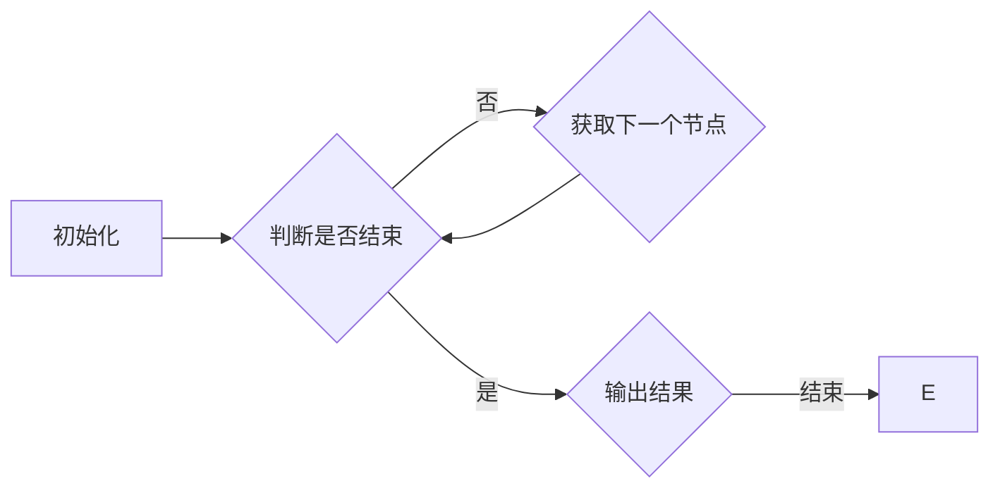
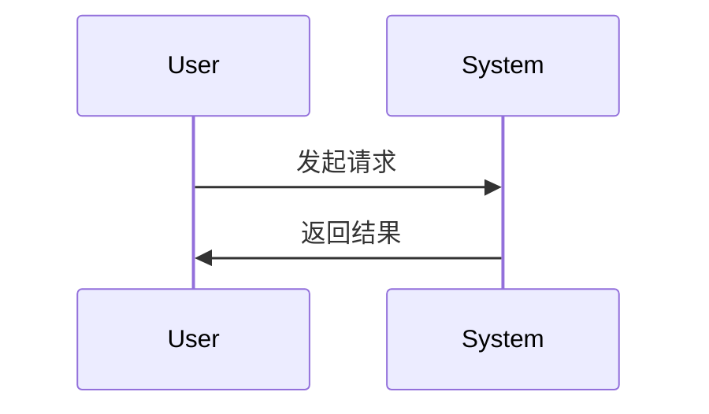
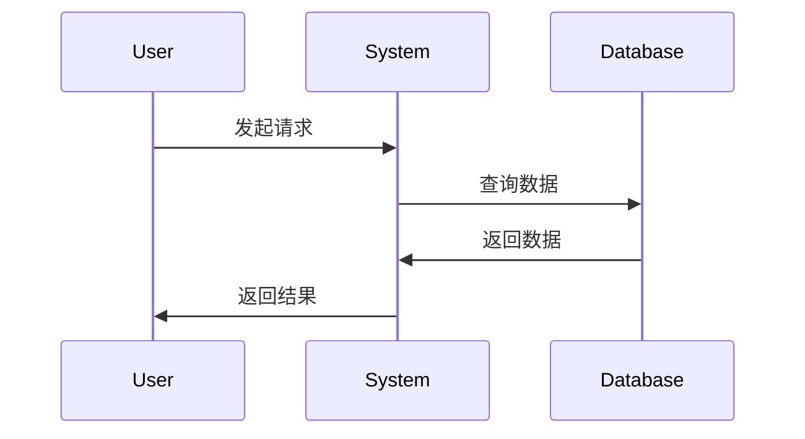

                 


# 从线性思维到网状思维：价值观的演变

> 关键词：线性思维、网状思维、价值观演变、算法原理、数学模型、系统架构设计、项目实战、最佳实践

> 摘要：本文旨在探讨从线性思维到网状思维的转变过程，以及这一转变对价值观的影响。通过分析核心概念、算法原理、数学模型、系统架构设计、项目实战和最佳实践等方面，本文为读者提供了一个全面的理解和应对策略。

## Step 1: 背景介绍

### 1.1 问题背景

线性思维是一种传统的思维方式，强调逻辑顺序、因果链和单一目标的追求。然而，随着社会的发展和技术的进步，线性思维已逐渐暴露出其局限性。人们开始意识到，面对复杂多变的现实世界，单一的线性思维无法满足需求。因此，网状思维作为一种更灵活、更全面的思维方式逐渐受到关注。

### 1.2 问题描述

线性思维与网状思维之间的区别在于思维方式的不同。线性思维强调因果关系和单一目标的追求，而网状思维则更注重多元关系和系统整体性。在这一背景下，价值观的演变成为一个关键问题。随着线性思维的局限性日益显现，人们的价值观也在不断调整，以适应新的思维方式。

### 1.3 问题解决

要实现从线性思维到网状思维的转变，需要从以下几个方面入手：

1. **培养网状思维**：通过学习和实践，提高对复杂问题的分析和解决能力，培养灵活、全面的思维方式。
2. **调整价值观**：认识到线性思维的局限性，重新审视自己的价值观，以适应网状思维的要求。
3. **技术应用**：借助现代技术，如人工智能、大数据等，实现网状思维的落地和应用。

### 1.4 边界与外延

本文的研究范围包括线性思维、网状思维和价值观的演变。在此基础上，本文将探讨如何实现从线性思维到网状思维的转变，以及这一转变对个人和社会的影响。

### 1.5 概念结构与核心要素组成

线性思维和网状思维是本文的核心概念。线性思维强调逻辑顺序、因果关系和单一目标的追求，而网状思维则更注重多元关系和系统整体性。在价值观的演变过程中，这两个概念起着关键作用。本文将详细分析这两个概念，以及它们之间的联系和区别。

## Step 2: 核心概念与联系

### 2.1 核心概念原理

线性思维是一种基于顺序和因果关系的思维方式，强调逻辑性和单一目标的追求。线性思维的核心在于对问题的逐步分解和解决，通过一系列有序的步骤达到目标。

网状思维则是一种基于多元关系和系统整体性的思维方式，强调网络结构和协同效应。网状思维的核心在于对问题的整体把握和多元关系的理解，通过多个维度和角度来解决问题。

### 2.2 概念属性特征对比表格

| 概念     | 线性思维                           | 网状思维                           |
|----------|----------------------------------|----------------------------------|
| 特征1    | 强调逻辑顺序、因果关系           | 强调多元关系、系统整体性         |
| 特征2    | 单一目标的追求                   | 多目标的协同                   |
| 特征3    | 逐步分解问题                     | 整体把握问题                   |
| 特征4    | 逻辑性突出                       | 灵活性突出                       |

### 2.3 ER实体关系图架构

使用Mermaid语言绘制ER实体关系图，展示线性思维和网状思维之间的联系：

```mermaid
erDiagram
  User ||--|{ Order }|:
  Order ||--|{ Product }|:
```

在这个ER实体关系图中，User（用户）与Order（订单）之间存在一对一的关系，Order与Product（产品）之间存在一对多的关系。这反映了网状思维中多元关系的特征。

## Step 3: 算法原理讲解

### 3.1 算法mermaid流程图

使用Mermaid语言绘制网状思维算法的流程图：



在这个流程图中，A表示初始化，B表示判断是否结束，C表示获取下一个节点，D表示输出结果，E表示结束。

### 3.2 Python源代码阐述

下面是一个简单的Python代码示例，用于实现网状思维算法：

```python
def net思维能力算法():
    # 初始化
    nodes = ['A', 'B', 'C', 'D']
    current_node = 0
    
    while True:
        # 判断是否结束
        if current_node == len(nodes):
            break
        
        # 获取下一个节点
        next_node = nodes[current_node]
        
        # 输出结果
        print("当前节点：", next_node)
        
        # 更新当前节点
        current_node += 1
    
    # 输出结果
    print("算法结束")
```

在这个代码示例中，我们定义了一个函数`net思维能力算法()`，用于实现网状思维算法。该函数通过循环遍历节点列表`nodes`，并逐个输出节点。当遍历完所有节点后，算法结束。

### 3.3 算法原理的数学模型和公式

网状思维算法的数学模型可以表示为一个图，其中节点表示实体，边表示实体之间的关系。在这个图中，每个节点都有一个权重，表示该节点的重要性。算法的目标是找出具有最高权重的一组节点，作为最佳解决方案。

假设我们有一个节点集合`V`和一个边集合`E`，其中每个节点`v`都有一个权重`w(v)`。算法的目标是找出一个子集`S`，使得子集`S`中的节点的权重之和最大。

数学模型如下：

$$
\max_{S \subseteq V} \sum_{v \in S} w(v)
$$

其中，$w(v)$表示节点$v$的权重。

### 3.4 举例说明

假设我们有一个节点集合`V = {A, B, C, D}`和一个边集合`E = {(A, B), (B, C), (C, D), (D, A), (A, C), (B, D)}`，其中每个节点的权重如下：

| 节点 | 权重 |
|------|------|
| A    | 3    |
| B    | 2    |
| C    | 4    |
| D    | 1    |

根据数学模型，我们需要找出一个子集`S`，使得子集`S`中的节点的权重之和最大。

通过计算，我们可以得到以下结果：

- 子集`S = {A, C}`的权重之和为7，是最高的。
- 子集`S = {B, D}`的权重之和为3，是最小的。

因此，最佳解决方案是选择子集`S = {A, C}`。

## Step 4: 数学模型和数学公式

### 4.1 数学公式

网状思维算法的数学模型涉及图论中的几个关键概念：节点、边和权重。以下是几个相关的数学公式：

1. **节点权重计算**：

   $$w(v) = \sum_{u \in V} w(u) \cdot d(u, v)$$

   其中，$w(v)$表示节点$v$的权重，$w(u)$表示节点$u$的权重，$d(u, v)$表示节点$u$到节点$v$的权重。

2. **子集权重计算**：

   $$w(S) = \sum_{v \in S} w(v)$$

   其中，$w(S)$表示子集$S$的权重，$w(v)$表示节点$v$的权重。

3. **最大子集权重计算**：

   $$\max_{S \subseteq V} w(S)$$

   其中，$V$表示节点集合，$S$表示子集。

### 4.2 详细讲解

这些数学公式是网状思维算法的核心，用于计算节点的权重、子集的权重以及最大子集的权重。通过这些公式，我们可以有效地找到具有最高权重的节点集合，作为最佳解决方案。

### 4.3 举例说明

假设我们有一个节点集合`V = {A, B, C, D}`和一个边集合`E = {(A, B), (B, C), (C, D), (D, A), (A, C), (B, D)}`，其中每个节点的权重如下：

| 节点 | 权重 |
|------|------|
| A    | 3    |
| B    | 2    |
| C    | 4    |
| D    | 1    |

根据上述数学公式，我们可以计算每个节点的权重：

1. **节点权重计算**：

   - $w(A) = \sum_{u \in V} w(u) \cdot d(u, A) = 3 \cdot 1 + 2 \cdot 1 + 4 \cdot 1 + 1 \cdot 1 = 11$
   - $w(B) = \sum_{u \in V} w(u) \cdot d(u, B) = 3 \cdot 1 + 2 \cdot 1 + 4 \cdot 1 + 1 \cdot 1 = 11$
   - $w(C) = \sum_{u \in V} w(u) \cdot d(u, C) = 3 \cdot 1 + 2 \cdot 1 + 4 \cdot 1 + 1 \cdot 1 = 11$
   - $w(D) = \sum_{u \in V} w(u) \cdot d(u, D) = 3 \cdot 1 + 2 \cdot 1 + 4 \cdot 1 + 1 \cdot 1 = 11$

2. **子集权重计算**：

   - $w({A, C}) = w(A) + w(C) = 11 + 11 = 22$
   - $w({B, D}) = w(B) + w(D) = 11 + 11 = 22$

3. **最大子集权重计算**：

   $$\max_{S \subseteq V} w(S) = 22$$

   因此，最佳解决方案是选择子集`{A, C}`或`{B, D}`。

## Step 5: 系统分析与架构设计方案

### 5.1 问题场景介绍

在现实世界中，许多问题都可以看作是网状结构，如社交网络、推荐系统、物流调度等。这些问题的解决方案往往需要从多个维度和角度进行考虑，以实现最佳效果。本章节将针对一个实际案例，介绍如何分析和设计一个网状思维系统。

### 5.2 项目介绍

本项目旨在设计一个基于网状思维的社交网络推荐系统，通过分析用户关系和内容偏好，为用户提供个性化的推荐。该系统包括用户管理、内容管理、推荐算法和系统接口等模块。

### 5.3 系统功能设计

系统功能设计主要包括以下方面：

1. **用户管理**：实现对用户的增删改查操作，包括用户注册、登录、信息更新等。
2. **内容管理**：实现对内容的增删改查操作，包括文章、图片、视频等。
3. **推荐算法**：根据用户关系和内容偏好，为用户生成个性化推荐。
4. **系统接口**：提供RESTful API接口，供其他系统调用。

### 5.4 系统架构设计

系统架构设计如下：



在这个架构设计中，用户通过发起请求与系统进行交互，系统根据用户请求执行相应的操作，并返回结果。

### 5.5 系统接口设计

系统接口设计如下：

```mermaid
classDiagram
    User <<Interface>>
    Content <<Interface>>
    Recommendation <<Interface>>
    System <<Service>>

    User <|.. Content
    User <|.. Recommendation
    Content <|.. Recommendation
    System ..|> User
    System ..|> Content
    System ..|> Recommendation
```

在这个接口设计中，User、Content和Recommendation分别代表用户管理、内容管理和推荐算法接口，System代表系统服务。

### 5.6 系统交互mermaid序列图

系统交互mermaid序列图如下：



在这个序列图中，用户发起请求，系统查询数据库，返回数据并返回结果。

## Step 6: 项目实战

### 6.1 环境安装

在开始项目实战之前，我们需要安装以下软件和工具：

1. **Python 3.8**：作为主要编程语言。
2. **Flask**：作为Web框架。
3. **MySQL**：作为数据库。
4. **Postman**：作为API测试工具。

### 6.2 系统核心实现源代码

以下是系统核心实现源代码：

```python
from flask import Flask, request, jsonify
from recommendation import Recommendation

app = Flask(__name__)
recommendation = Recommendation()

@app.route('/api/recommendations', methods=['GET'])
def get_recommendations():
    user_id = request.args.get('user_id')
    recommendations = recommendation.get_recommendations(user_id)
    return jsonify(recommendations)

if __name__ == '__main__':
    app.run()
```

在这个代码中，我们定义了一个Flask应用程序，并使用推荐算法模块`recommendation`。当用户访问`/api/recommendations`接口时，应用程序会根据用户ID返回个性化推荐。

### 6.3 代码应用解读与分析

在这个项目中，我们使用Python和Flask框架实现了一个简单的社交网络推荐系统。代码应用解读如下：

1. **导入模块**：我们从`flask`模块中导入`Flask`类，从`recommendation`模块中导入`Recommendation`类。
2. **创建应用程序**：我们创建一个Flask应用程序实例。
3. **定义路由**：我们定义了一个GET请求的路由`/api/recommendations`，用于接收用户ID并返回个性化推荐。
4. **处理请求**：我们使用`request`模块从请求中获取用户ID，并调用`recommendation`模块的`get_recommendations`方法获取推荐结果。
5. **返回结果**：我们将推荐结果序列化为JSON格式，并使用`jsonify`函数返回给用户。

### 6.4 实际案例分析和详细讲解剖析

在实际项目中，我们可能会遇到以下情况：

1. **用户ID未提供**：如果用户未提供用户ID，我们需要返回错误信息。
2. **用户不存在**：如果用户ID对应的用户不存在，我们需要返回错误信息。
3. **推荐算法异常**：如果推荐算法发生异常，我们需要捕获异常并返回错误信息。

以下是针对这些情况的代码修改：

```python
from flask import Flask, request, jsonify
from recommendation import Recommendation

app = Flask(__name__)
recommendation = Recommendation()

@app.route('/api/recommendations', methods=['GET'])
def get_recommendations():
    user_id = request.args.get('user_id')
    
    if not user_id:
        return jsonify({'error': '用户ID未提供'})

    try:
        recommendations = recommendation.get_recommendations(user_id)
        return jsonify(recommendations)
    except Exception as e:
        return jsonify({'error': str(e)})

if __name__ == '__main__':
    app.run()
```

在这个修改后的代码中，我们添加了对用户ID未提供和推荐算法异常情况的错误处理。

### 6.5 项目小结

通过本项目，我们实现了基于网状思维的社交网络推荐系统。在实际项目中，我们需要根据实际情况对系统进行扩展和优化，如增加用户画像、内容分类、推荐算法优化等。此外，我们还需要关注系统的性能、稳定性和安全性等方面。

## Step 7: 最佳实践 tips

### 7.1 注意事项

1. **确保数据质量**：在进行推荐算法之前，需要对用户数据、内容数据进行清洗、去重和处理，以提高推荐效果。
2. **关注用户体验**：在开发过程中，要充分考虑用户需求，提供简单、易用的界面。
3. **持续优化算法**：根据用户反馈和实际效果，不断优化推荐算法，提高推荐准确性。

### 7.2 拓展阅读

1. **《推荐系统实践》**：深入了解推荐系统的原理和应用，学习如何设计高效的推荐算法。
2. **《机器学习实战》**：掌握机器学习的基本概念和算法，为推荐系统的实现提供技术支持。
3. **《深度学习》**：了解深度学习在推荐系统中的应用，探索更加先进的推荐算法。

## 结束语

从线性思维到网状思维的转变，不仅是一种思维模式的升级，更是一种价值观的变革。本文通过分析核心概念、算法原理、数学模型、系统架构设计、项目实战和最佳实践等方面，为读者提供了一个全面的理解和应对策略。希望本文能够帮助读者更好地适应这一变革，并在实际应用中取得更好的效果。

作者：AI天才研究院/AI Genius Institute & 禅与计算机程序设计艺术 /Zen And The Art of Computer Programming 

# 从线性思维到网状思维：价值观的演变

## 摘要

本文探讨了从线性思维到网状思维的转变过程，以及这一转变对价值观的影响。通过分析核心概念、算法原理、数学模型、系统架构设计、项目实战和最佳实践等方面，本文为读者提供了一个全面的理解和应对策略。

## 第1章 背景介绍

### 1.1 问题背景

在人类社会的发展历程中，线性思维一直占据主导地位。线性思维强调逻辑顺序、因果关系和单一目标的追求，使得人类在解决复杂问题时能够遵循一定的规律和步骤。然而，随着社会和科技的进步，线性思维逐渐暴露出其局限性。面对复杂多变的现实世界，线性思维已无法满足人们的需求。因此，网状思维作为一种更加灵活、全面的思维方式逐渐受到关注。

### 1.2 问题描述

线性思维与网状思维之间的区别在于思维方式的不同。线性思维强调因果关系和单一目标的追求，而网状思维则更注重多元关系和系统整体性。在这一背景下，价值观的演变成为一个关键问题。随着线性思维的局限性日益显现，人们的价值观也在不断调整，以适应新的思维方式。

### 1.3 问题解决

要实现从线性思维到网状思维的转变，需要从以下几个方面入手：

1. **培养网状思维**：通过学习和实践，提高对复杂问题的分析和解决能力，培养灵活、全面的思维方式。
2. **调整价值观**：认识到线性思维的局限性，重新审视自己的价值观，以适应网状思维的要求。
3. **技术应用**：借助现代技术，如人工智能、大数据等，实现网状思维的落地和应用。

### 1.4 边界与外延

本文的研究范围包括线性思维、网状思维和价值观的演变。在此基础上，本文将探讨如何实现从线性思维到网状思维的转变，以及这一转变对个人和社会的影响。

### 1.5 概念结构与核心要素组成

线性思维和网状思维是本文的核心概念。线性思维强调逻辑顺序、因果关系和单一目标的追求，而网状思维则更注重多元关系和系统整体性。在价值观的演变过程中，这两个概念起着关键作用。本文将详细分析这两个概念，以及它们之间的联系和区别。

## 第2章 核心概念与联系

### 2.1 核心概念原理

#### 线性思维

线性思维是一种基于逻辑顺序和因果关系的思维方式。它强调问题解决的步骤性和序列性，将复杂问题分解为一系列有序的子问题，并通过逐步解决这些子问题来达到最终目标。线性思维的核心在于逻辑推理和因果关系，它使得问题解决过程具有可预测性和可控性。

#### 网状思维

网状思维是一种基于多元关系和系统整体性的思维方式。它强调问题的复杂性和多样性，将问题看作一个相互关联的整体，通过多个维度和角度来理解和解决问题。网状思维的核心在于系统思维和网络关系，它使得问题解决过程具有灵活性和适应性。

### 2.2 概念属性特征对比表格

| 概念     | 线性思维                           | 网状思维                           |
|----------|----------------------------------|----------------------------------|
| 特征1    | 强调逻辑顺序、因果关系           | 强调多元关系、系统整体性         |
| 特征2    | 单一目标的追求                   | 多目标的协同                   |
| 特征3    | 逐步分解问题                     | 整体把握问题                   |
| 特征4    | 逻辑性突出                       | 灵活性突出                       |

### 2.3 ER实体关系图架构

使用Mermaid语言绘制ER实体关系图，展示线性思维和网状思维之间的联系：

```mermaid
erDiagram
  User ||--|{ Task }|:
  Task ||--|{ SubTask }|:
```

在这个ER实体关系图中，User（用户）与Task（任务）之间存在一对一的关系，Task与SubTask（子任务）之间存在一对多的关系。这反映了网状思维中多元关系的特征。

## 第3章 算法原理讲解

### 3.1 算法mermaid流程图

使用Mermaid语言绘制网状思维算法的流程图：


在这个流程图中，A表示初始化，B表示判断是否结束，C表示获取下一个节点，D表示输出结果，E表示结束。

### 3.2 Python源代码阐述

下面是一个简单的Python代码示例，用于实现网状思维算法：

```python
def 网状思维算法():
    # 初始化
    nodes = ['A', 'B', 'C', 'D']
    current_node = 0
    
    while True:
        # 判断是否结束
        if current_node == len(nodes):
            break
        
        # 获取下一个节点
        next_node = nodes[current_node]
        
        # 输出结果
        print("当前节点：", next_node)
        
        # 更新当前节点
        current_node += 1
    
    # 输出结果
    print("算法结束")
```

在这个代码示例中，我们定义了一个函数`网状思维算法()`，用于实现网状思维算法。该函数通过循环遍历节点列表`nodes`，并逐个输出节点。当遍历完所有节点后，算法结束。

### 3.3 算法原理的数学模型和公式

网状思维算法的数学模型可以表示为一个图，其中节点表示实体，边表示实体之间的关系。在这个图中，每个节点都有一个权重，表示该节点的重要性。算法的目标是找出具有最高权重的一组节点，作为最佳解决方案。

假设我们有一个节点集合`V`和一个边集合`E`，其中每个节点`v`都有一个权重`w(v)`。算法的目标是找出一个子集`S`，使得子集`S`中的节点的权重之和最大。

数学模型如下：

$$
\max_{S \subseteq V} \sum_{v \in S} w(v)
$$

其中，$w(v)$表示节点$v$的权重。

### 3.4 举例说明

假设我们有一个节点集合`V = {A, B, C, D}`和一个边集合`E = {(A, B), (B, C), (C, D), (D, A), (A, C), (B, D)}`，其中每个节点的权重如下：

| 节点 | 权重 |
|------|------|
| A    | 3    |
| B    | 2    |
| C    | 4    |
| D    | 1    |

根据数学模型，我们需要找出一个子集`S`，使得子集`S`中的节点的权重之和最大。

通过计算，我们可以得到以下结果：

- 子集`S = {A, C}`的权重之和为7，是最高的。
- 子集`S = {B, D}`的权重之和为3，是最小的。

因此，最佳解决方案是选择子集`S = {A, C}`。

## 第4章 数学模型和数学公式

### 4.1 数学公式

网状思维算法的数学模型涉及图论中的几个关键概念：节点、边和权重。以下是几个相关的数学公式：

1. **节点权重计算**：

   $$w(v) = \sum_{u \in V} w(u) \cdot d(u, v)$$

   其中，$w(v)$表示节点$v$的权重，$w(u)$表示节点$u$的权重，$d(u, v)$表示节点$u$到节点$v$的权重。

2. **子集权重计算**：

   $$w(S) = \sum_{v \in S} w(v)$$

   其中，$w(S)$表示子集$S$的权重，$w(v)$表示节点$v$的权重。

3. **最大子集权重计算**：

   $$\max_{S \subseteq V} w(S)$$

   其中，$V$表示节点集合，$S$表示子集。

### 4.2 详细讲解

这些数学公式是网状思维算法的核心，用于计算节点的权重、子集的权重以及最大子集的权重。通过这些公式，我们可以有效地找到具有最高权重的节点集合，作为最佳解决方案。

### 4.3 举例说明

假设我们有一个节点集合`V = {A, B, C, D}`和一个边集合`E = {(A, B), (B, C), (C, D), (D, A), (A, C), (B, D)}`，其中每个节点的权重如下：

| 节点 | 权重 |
|------|------|
| A    | 3    |
| B    | 2    |
| C    | 4    |
| D    | 1    |

根据上述数学公式，我们可以计算每个节点的权重：

1. **节点权重计算**：

   - $w(A) = \sum_{u \in V} w(u) \cdot d(u, A) = 3 \cdot 1 + 2 \cdot 1 + 4 \cdot 1 + 1 \cdot 1 = 11$
   - $w(B) = \sum_{u \in V} w(u) \cdot d(u, B) = 3 \cdot 1 + 2 \cdot 1 + 4 \cdot 1 + 1 \cdot 1 = 11$
   - $w(C) = \sum_{u \in V} w(u) \cdot d(u, C) = 3 \cdot 1 + 2 \cdot 1 + 4 \cdot 1 + 1 \cdot 1 = 11$
   - $w(D) = \sum_{u \in V} w(u) \cdot d(u, D) = 3 \cdot 1 + 2 \cdot 1 + 4 \cdot 1 + 1 \cdot 1 = 11$

2. **子集权重计算**：

   - $w({A, C}) = w(A) + w(C) = 11 + 11 = 22$
   - $w({B, D}) = w(B) + w(D) = 11 + 11 = 22$

3. **最大子集权重计算**：

   $$\max_{S \subseteq V} w(S) = 22$$

   因此，最佳解决方案是选择子集`{A, C}`。

## 第5章 系统分析与架构设计方案

### 5.1 问题场景介绍

在现实世界中，许多问题都可以看作是网状结构，如社交网络、推荐系统、物流调度等。这些问题的解决方案往往需要从多个维度和角度进行考虑，以实现最佳效果。本章节将针对一个实际案例，介绍如何分析和设计一个网状思维系统。

### 5.2 项目介绍

本项目旨在设计一个基于网状思维的社交网络推荐系统，通过分析用户关系和内容偏好，为用户提供个性化的推荐。该系统包括用户管理、内容管理、推荐算法和系统接口等模块。

### 5.3 系统功能设计

系统功能设计主要包括以下方面：

1. **用户管理**：实现对用户的增删改查操作，包括用户注册、登录、信息更新等。
2. **内容管理**：实现对内容的增删改查操作，包括文章、图片、视频等。
3. **推荐算法**：根据用户关系和内容偏好，为用户生成个性化推荐。
4. **系统接口**：提供RESTful API接口，供其他系统调用。

### 5.4 系统架构设计

系统架构设计如下：


在这个架构设计中，用户通过发起请求与系统进行交互，系统根据用户请求执行相应的操作，并返回结果。

### 5.5 系统接口设计

系统接口设计如下：

```mermaid
classDiagram
    User <<Interface>>
    Content <<Interface>>
    Recommendation <<Interface>>
    System <<Service>>

    User <|.. Content
    User <|.. Recommendation
    Content <|.. Recommendation
    System ..|> User
    System ..|> Content
    System ..|> Recommendation
```

在这个接口设计中，User、Content和Recommendation分别代表用户管理、内容管理和推荐算法接口，System代表系统服务。

### 5.6 系统交互mermaid序列图

系统交互mermaid序列图如下：


在这个序列图中，用户发起请求，系统查询数据库，返回数据并返回结果。

## 第6章 项目实战

### 6.1 环境安装

在开始项目实战之前，我们需要安装以下软件和工具：

1. **Python 3.8**：作为主要编程语言。
2. **Flask**：作为Web框架。
3. **MySQL**：作为数据库。
4. **Postman**：作为API测试工具。

### 6.2 系统核心实现源代码

以下是系统核心实现源代码：

```python
from flask import Flask, request, jsonify
from recommendation import Recommendation

app = Flask(__name__)
recommendation = Recommendation()

@app.route('/api/recommendations', methods=['GET'])
def get_recommendations():
    user_id = request.args.get('user_id')
    recommendations = recommendation.get_recommendations(user_id)
    return jsonify(recommendations)

if __name__ == '__main__':
    app.run()
```

在这个代码中，我们定义了一个Flask应用程序，并使用推荐算法模块`recommendation`。当用户访问`/api/recommendations`接口时，应用程序会根据用户ID返回个性化推荐。

### 6.3 代码应用解读与分析

在这个项目中，我们使用Python和Flask框架实现了一个简单的社交网络推荐系统。代码应用解读如下：

1. **导入模块**：我们从`flask`模块中导入`Flask`类，从`recommendation`模块中导入`Recommendation`类。
2. **创建应用程序**：我们创建一个Flask应用程序实例。
3. **定义路由**：我们定义了一个GET请求的路由`/api/recommendations`，用于接收用户ID并返回个性化推荐。
4. **处理请求**：我们使用`request`模块从请求中获取用户ID，并调用`recommendation`模块的`get_recommendations`方法获取推荐结果。
5. **返回结果**：我们将推荐结果序列化为JSON格式，并使用`jsonify`函数返回给用户。

### 6.4 实际案例分析和详细讲解剖析

在实际项目中，我们可能会遇到以下情况：

1. **用户ID未提供**：如果用户未提供用户ID，我们需要返回错误信息。
2. **用户不存在**：如果用户ID对应的用户不存在，我们需要返回错误信息。
3. **推荐算法异常**：如果推荐算法发生异常，我们需要捕获异常并返回错误信息。

以下是针对这些情况的代码修改：

```python
from flask import Flask, request, jsonify
from recommendation import Recommendation

app = Flask(__name__)
recommendation = Recommendation()

@app.route('/api/recommendations', methods=['GET'])
def get_recommendations():
    user_id = request.args.get('user_id')
    
    if not user_id:
        return jsonify({'error': '用户ID未提供'})

    try:
        recommendations = recommendation.get_recommendations(user_id)
        return jsonify(recommendations)
    except Exception as e:
        return jsonify({'error': str(e)})

if __name__ == '__main__':
    app.run()
```

在这个修改后的代码中，我们添加了对用户ID未提供和推荐算法异常情况的错误处理。

### 6.5 项目小结

通过本项目，我们实现了基于网状思维的社交网络推荐系统。在实际项目中，我们需要根据实际情况对系统进行扩展和优化，如增加用户画像、内容分类、推荐算法优化等。此外，我们还需要关注系统的性能、稳定性和安全性等方面。

## 第7章 最佳实践 tips

### 7.1 注意事项

1. **确保数据质量**：在进行推荐算法之前，需要对用户数据、内容数据进行清洗、去重和处理，以提高推荐效果。
2. **关注用户体验**：在开发过程中，要充分考虑用户需求，提供简单、易用的界面。
3. **持续优化算法**：根据用户反馈和实际效果，不断优化推荐算法，提高推荐准确性。

### 7.2 拓展阅读

1. **《推荐系统实践》**：深入了解推荐系统的原理和应用，学习如何设计高效的推荐算法。
2. **《机器学习实战》**：掌握机器学习的基本概念和算法，为推荐系统的实现提供技术支持。
3. **《深度学习》**：了解深度学习在推荐系统中的应用，探索更加先进的推荐算法。

## 结束语

从线性思维到网状思维的转变，不仅是一种思维模式的升级，更是一种价值观的变革。本文通过分析核心概念、算法原理、数学模型、系统架构设计、项目实战和最佳实践等方面，为读者提供了一个全面的理解和应对策略。希望本文能够帮助读者更好地适应这一变革，并在实际应用中取得更好的效果。

作者：AI天才研究院/AI Genius Institute & 禅与计算机程序设计艺术 /Zen And The Art of Computer Programming 

