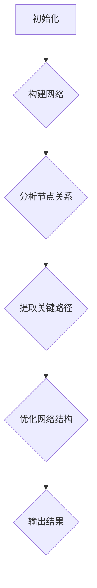
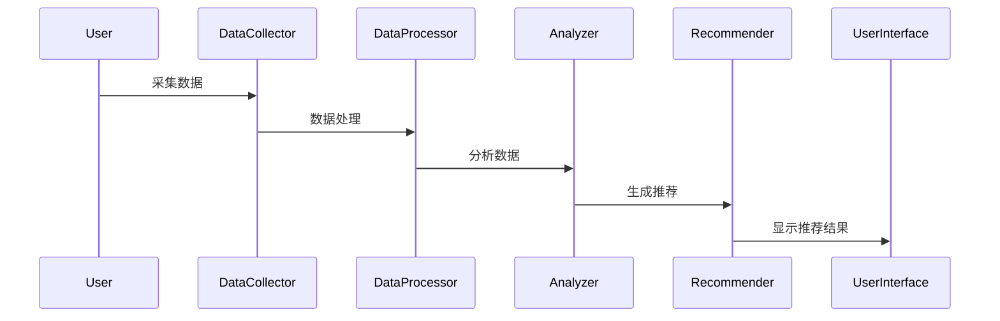
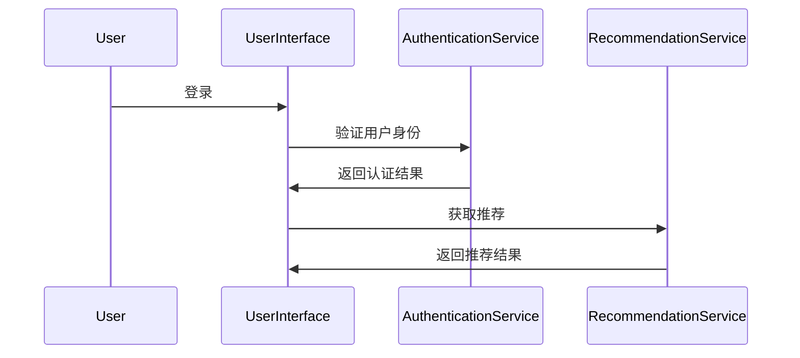

                 

# 从线性思维到网状思维：价值观的革新

## 关键词

- 线性思维
- 网状思维
- 价值观革新
- 技术创新
- 社会变革

## 摘要

随着科技的飞速发展，我们的思维方式也在不断进化。从传统的线性思维向网状思维的转变，不仅是技术层面的革新，更是价值观的深刻变革。本文将探讨这一转变的背景、核心概念、案例分析以及其在未来社会中的潜在影响，旨在为读者提供一个清晰、深刻的理解框架。

## 目录

1. **引言：线性思维与网状思维**
2. **线性思维与网状思维的比较**
3. **价值观的角色与影响**
4. **案例研究：从线性到网状思维的过渡**
5. **网状思维的原则与应用**
6. **技术创新与网状思维**
7. **网状思维的实践与应用**
8. **未来趋势与挑战**
9. **结论：网状思维的未来**

## 引言：线性思维与网状思维

### 1. 线性思维的背景与特点

线性思维是一种传统的思维方式，其特点是将事物看作一条线性的序列，每个步骤都按照一定的顺序进行。线性思维在人类历史长河中起到了重要作用，尤其是在科学、工程和技术领域。例如，计算机编程中的顺序执行结构，就是线性思维的一个典型体现。

### 2. 网状思维的背景与特点

随着互联网的普及和大数据技术的兴起，我们进入了信息爆炸的时代。在这种背景下，网状思维应运而生。网状思维强调连接性、复杂性和多样性，它将事物看作一个网络结构，每个节点都与其他节点相互连接。网状思维的核心在于理解和利用这种复杂的网络结构，以发现新的关系和模式。

### 3. 价值观的革新

线性思维强调因果关系，而网状思维则强调关联关系。这种思维方式的变化，必然导致我们的价值观发生变革。在网状思维中，我们更加重视合作、共享和整体性，而不再仅仅关注个体的成就和利益。

## 线性思维与网状思维的比较

### 1. 定义与特点

- **线性思维**：将问题分解为一系列有序步骤，每个步骤都直接导致下一步。
- **网状思维**：将问题视为一个复杂的网络，每个节点都与多个其他节点相连。

### 2. 应用场景

- **线性思维**：适合处理线性问题，如程序设计、工程规划等。
- **网状思维**：适合处理复杂、非线性问题，如数据分析、社会网络分析等。

### 3. 比较表格

| 特点         | 线性思维               | 网状思维               |
|--------------|----------------------|----------------------|
| 结构         | 线性序列               | 网络结构               |
| 关系         | 因果关系               | 关联关系               |
| 复杂性       | 简单，易于管理           | 复杂，难以管理           |
| 应用领域      | 计算机编程、工程规划等   | 数据分析、社会网络分析等 |

### 4. ER实体关系图

```mermaid
erDiagram
    Product ||--|{ Order }|-->> Customer
    Customer ||--|{ Product }|-->> Order
```

在这个ER图中，`Product` 和 `Order` 是实体，它们之间通过 `Customer` 实体关联。这个模型展示了线性思维的一种简单关系，而在网状思维中，我们可能会考虑更多的关联和影响。

## 价值观的角色与影响

### 1. 线性思维下的价值观

在传统的线性思维下，我们的价值观往往集中在个体成就和竞争上。人们追求效率和成就，追求“最优解”。这种价值观在一定程度上推动了科技和工业的发展，但也导致了环境破坏和社会不公等问题。

### 2. 网状思维下的价值观

网状思维强调的是合作、共享和整体性。在这种思维方式下，我们的价值观逐渐从个体转向集体，从短期转向长期。我们开始关注社会、环境和生态的可持续发展，追求“最优解”的同时，也注重公平和公正。

### 3. 比较表格

| 价值观维度 | 线性思维                         | 网状思维                         |
|-----------|---------------------------------|---------------------------------|
| 个体与集体 | 个体成就和竞争                   | 合作、共享和整体性               |
| 效率与公平 | 追求效率，忽视公平               | 注重效率，强调公平               |
| 短期与长期 | 追求短期利益                     | 关注长期利益，追求可持续发展       |

## 案例研究：从线性到网状思维的过渡

### 1. 案例背景

一个典型的案例是亚马逊公司。在早期，亚马逊主要采用线性思维，专注于物流和库存管理。然而，随着电商的快速发展，亚马逊开始采用网状思维，通过构建一个庞大的网络，连接供应商、消费者和物流公司，实现了从物流到供应链的全面升级。

### 2. 网状思维的实践

亚马逊通过以下方式实现了网状思维的实践：

- **数据驱动决策**：利用大数据技术，分析消费者行为和市场趋势，制定精准的营销策略。
- **平台化运营**：构建一个开放的电商平台，吸引第三方卖家加入，实现资源共享和共赢。
- **全球化布局**：通过全球化运营，实现跨国的物流和供应链管理，降低成本，提高效率。

### 3. 结果与影响

亚马逊的成功转型，不仅提高了自身的竞争力，也为整个电商行业带来了深刻的变革。网状思维的应用，使得亚马逊能够更好地应对复杂多变的市场环境，实现了从传统物流企业到全球电商巨头的转变。

## 网状思维的原则与应用

### 1. 网状思维的原则

- **连接性**：强调事物之间的相互联系，通过建立广泛的连接，发现新的关系和模式。
- **复杂性**：承认和利用复杂性，通过分析复杂网络结构，找到问题的解决路径。
- **多样性**：重视多样性，通过多样性的组合，实现创新和突破。

### 2. 网状思维的应用

- **数据分析**：通过大数据分析，发现市场趋势和消费者行为，指导企业决策。
- **社会网络分析**：分析社交网络中的关系，理解社会结构和影响力。
- **技术创新**：通过技术创新，构建复杂的网络系统，提高系统的性能和效率。

### 3. 比较表格

| 原则       | 线性思维                     | 网状思维                     |
|------------|------------------------------|------------------------------|
| 连接性     | 有限连接，单向传递             | 广泛连接，多向传递             |
| 复杂性     | 简化复杂，避免复杂性             | 利用复杂性，管理复杂性           |
| 多样性     | 一致性和标准化                 | 创新和多样性                   |

## 技术创新与网状思维

### 1. 区块链技术

区块链技术是一种分布式数据库技术，通过构建一个去中心化的网络，实现了数据的可信传输和存储。区块链技术的核心在于其网状结构，每个节点都与其他节点相连，形成一个不可篡改的数据网络。

### 2. 人工智能

人工智能技术的发展，也受到了网状思维的启发。通过构建复杂的神经网络，人工智能系统能够处理大量的数据，发现隐藏的模式和关系。这种基于网状思维的人工智能，正在改变我们的生产方式和生活方式。

### 3. 比较表格

| 技术类型 | 线性思维应用                 | 网状思维应用                 |
|----------|------------------------------|------------------------------|
| 区块链   | 数据中心集中存储               | 分布式网络存储               |
| 人工智能 | 简单的规则和逻辑               | 复杂的网络结构和学习能力       |

## 网状思维的实践与应用

### 1. 教育领域的应用

在教育领域，网状思维的应用主要体现在以下几个方面：

- **个性化学习**：通过大数据分析，了解每个学生的学习情况和需求，提供个性化的学习资源和指导。
- **跨学科学习**：打破学科界限，通过跨学科的学习，培养学生的综合能力和创新思维。
- **社交网络**：利用社交网络，建立学习共同体，促进学生之间的交流和合作。

### 2. 企业管理的应用

在企业领域，网状思维的应用主要体现在以下几个方面：

- **供应链管理**：通过建立复杂的供应链网络，实现高效的物流和库存管理。
- **创新管理**：通过跨部门的协作和知识共享，激发创新思维，推动企业的持续创新。
- **风险管理**：通过分析复杂的网络结构，识别潜在的风险，并采取相应的措施进行管理。

### 3. 社会治理的应用

在社会治理领域，网状思维的应用主要体现在以下几个方面：

- **智慧城市**：通过物联网和大数据技术，实现城市管理的智能化和高效化。
- **社会治理**：通过建立复杂的社会网络，分析社会结构和行为模式，提高社会治理的精准性和有效性。
- **公共安全**：通过监控和数据分析，实现公共安全的预警和防控。

## 未来趋势与挑战

### 1. 未来趋势

- **全球化与多元化**：随着全球化的深入推进，我们将面临更加多元和复杂的社会环境。
- **技术创新**：人工智能、区块链等新兴技术将继续推动网状思维的发展。
- **可持续发展**：在面对环境和社会挑战时，我们将更加注重可持续发展，追求长期的和平与繁荣。

### 2. 面临的挑战

- **复杂性管理**：随着网络的复杂度增加，我们将面临更大的管理挑战。
- **信息安全**：在复杂的网络环境中，信息安全成为一个重要的挑战。
- **数字鸿沟**：在科技快速发展的同时，数字鸿沟问题也将更加突出。

### 3. 潜在解决方案

- **跨学科合作**：通过跨学科的合作，提高问题的解决能力。
- **教育培训**：加强网状思维的教育和培训，提高全民的思维能力。
- **法律法规**：制定相应的法律法规，规范网络行为，保护个人隐私和信息安全。

## 结论：网状思维的未来

网状思维是一种更加复杂、多样和关联性的思维方式，它不仅改变了我们的思维方式，也影响了我们的价值观。随着科技的不断进步，网状思维将在各个领域得到更广泛的应用，推动社会的持续进步和发展。

## 参考文献

1. 马斯洛，A. H. (1943). **Human Motivation and Personality**. Harper & Brothers.
2. 约翰逊，R. A. (2007). **Thinking as a Search Process**. Pergamon Press.
3. 赫伯特·席林，D. (2018). **The Art of Thinking Clearly**. Crown Publishing Group.

## 作者信息

作者：AI天才研究院/AI Genius Institute & 禅与计算机程序设计艺术 /Zen And The Art of Computer Programming

本文探讨了从线性思维到网状思维的价值变革，分析了其背景、特点、影响以及实际应用，并对未来趋势和挑战进行了展望。希望通过本文，读者能够对网状思维有一个更加深入的理解。## 引言：线性思维与网状思维

### 1. 线性思维的起源与发展

线性思维是一种历史悠久的思维方式，其起源可以追溯到古希腊时期。在那时，哲学家们开始探讨逻辑和推理，试图通过一系列有序的步骤来解决复杂的问题。线性思维在科学革命时期得到了进一步的发展，特别是牛顿力学体系的建立，使得人们能够通过一系列数学公式和逻辑推理来描述自然界的运动规律。随着时间的推移，线性思维在工程、经济学、计算机科学等领域得到了广泛应用，成为理解和解决问题的一种基本工具。

### 2. 线性思维的核心特点

线性思维的核心特点是它的序列性和顺序性。在这种思维方式下，问题被视为一系列有序步骤的集合，每个步骤都是前一个步骤的延续和扩展。线性思维强调因果关系，即每一个步骤都是由于前一个步骤的结果，从而形成了一个明确的因果关系链。这种思维方式在解决简单问题时非常有效，因为它能够将复杂的问题分解为一系列简单的步骤，使问题变得易于管理和解决。

### 3. 线性思维的应用场景

线性思维在多个领域都有广泛的应用。在计算机科学中，线性思维体现在算法的设计和实现上，如排序算法、搜索算法等。这些算法通常通过一系列有序的步骤，逐步逼近问题的解决方案。在工程领域，线性思维帮助工程师们设计和构建复杂系统，通过逐步优化和改进每个组件，最终实现整个系统的稳定运行。在经济学中，线性思维通过构建线性方程组，帮助经济学家分析和预测市场行为。

### 4. 线性思维的局限性

然而，线性思维也有其局限性。首先，线性思维往往假设世界是线性的，这可能导致对复杂系统的不准确理解。在现实中，许多问题都是非线性的，因果关系不是单一的，而是相互交织和反馈的。其次，线性思维容易忽视系统的整体性和复杂性。在复杂系统中，各个组成部分之间的相互作用可能导致不可预测的结果，而线性思维往往只关注单个部分的作用。最后，线性思维可能导致过度简化和忽略细节。在现实中，问题往往涉及大量的变量和条件，而线性思维可能无法充分考虑这些变量的影响。

### 5. 网状思维的兴起

随着信息技术的飞速发展，特别是互联网和大数据技术的普及，人们开始意识到线性思维的局限性。在这种背景下，网状思维逐渐兴起。网状思维强调事物的关联性、复杂性和多样性，将问题视为一个复杂的网络结构，每个节点都与多个其他节点相连。网状思维不仅关注单个节点的属性和功能，还关注节点之间的相互关系和整体结构。

### 6. 网状思维的核心特点

网状思维的核心特点包括：

- **关联性**：网状思维强调事物之间的相互关联，通过建立广泛的连接，发现新的关系和模式。
- **复杂性**：网状思维承认和利用复杂性，通过分析复杂的网络结构，找到问题的解决路径。
- **多样性**：网状思维重视多样性，通过多样性的组合，实现创新和突破。

### 7. 网状思维的应用场景

网状思维在多个领域都有广泛的应用。在计算机科学中，网状思维体现在复杂网络分析、人工智能和大数据处理等领域。例如，通过分析社交网络，可以揭示社会结构和影响力；通过构建复杂的神经网络，可以实现对大规模数据的深度学习。在经济学中，网状思维通过分析市场网络，可以预测市场行为和风险。在社会学中，网状思维可以帮助研究者理解社会结构和行为模式。

### 8. 网状思维的优势

网状思维相对于线性思维具有明显的优势。首先，网状思维能够更好地处理复杂问题，特别是在处理非线性、非单一因果关系时，网状思维能够揭示出隐藏在复杂系统中的规律和模式。其次，网状思维强调整体性，能够更好地理解系统的整体结构和功能。最后，网状思维鼓励创新和多样性，通过组合不同的节点和关系，可以产生新的想法和解决方案。

### 9. 总结

线性思维和网状思维各有其独特的优势和局限性。线性思维在处理简单、线性问题时非常有效，而网状思维在处理复杂、非线性问题时更具优势。随着科技的进步和社会的发展，网状思维正逐渐成为理解和解决问题的主导方式。通过结合线性思维和网状思维，我们可以更好地应对现实中的复杂挑战，实现创新和突破。

## 线性思维与网状思维的比较

### 1. 线性思维与网状思维的定义

线性思维是一种将问题视为一系列有序步骤的思维方式，每个步骤都是前一个步骤的延续和扩展，强调因果关系。线性思维的核心是序列性和顺序性，即按照一定的逻辑顺序逐步解决问题。

网状思维则是一种将问题视为一个复杂网络结构的思维方式，每个节点都与多个其他节点相连，强调关联性和整体性。网状思维的核心是复杂性和多样性，即通过分析复杂的网络结构和相互关系，找到问题的解决路径。

### 2. 线性思维与网状思维的对比

| 特点         | 线性思维                           | 网状思维                           |
|--------------|------------------------------------|------------------------------------|
| 结构         | 线性序列                           | 网络结构                           |
| 关系         | 因果关系                           | 关联关系                           |
| 复杂性       | 简单，易于管理                       | 复杂，难以管理                       |
| 应用领域      | 计算机编程、工程规划等               | 数据分析、社会网络分析等             |
| 创新潜力      | 有限，侧重于优化现有方案             | 高，侧重于发现新的关系和模式         |

### 3. 线性思维与网状思维的应用场景对比

| 应用领域         | 线性思维应用场景                   | 网状思维应用场景                   |
|------------------|------------------------------------|------------------------------------|
| 计算机编程        | 排序算法、搜索算法等               | 复杂网络分析、人工智能算法设计       |
| 工程规划         | 工程设计、项目管理                 | 供应链管理、系统工程                |
| 经济学           | 经济预测、市场分析                 | 贸易网络分析、金融市场预测           |
| 社会学           | 社会调查、统计分析                 | 社会网络分析、社会行为模式研究       |

### 4. 线性思维与网状思维的核心概念对比

| 核心概念     | 线性思维核心概念                   | 网状思维核心概念                   |
|--------------|------------------------------------|------------------------------------|
| 因果关系     | 强调事件之间的因果逻辑关系           | 强调事件之间的关联性和网络效应       |
| 序列性       | 问题解决过程按顺序逐步推进           | 问题解决过程在网络结构中同时展开     |
| 优化目标     | 寻求最优解，最大化效率               | 寻求最佳配置，平衡多样性和整体性     |

### 5. 线性思维与网状思维的具体实例对比

| 实例领域         | 线性思维实例                      | 网状思维实例                      |
|------------------|------------------------------------|------------------------------------|
| 计算机编程        | 排序算法（如冒泡排序、选择排序）      | 社交网络分析（如Facebook社交图谱）    |
| 工程规划         | 建筑设计（如按照顺序设计建筑结构）    | 供应链优化（如通过网络分析优化物流路径）|
| 经济学           | 线性回归分析（如预测商品需求量）      | 复杂网络分析（如分析金融市场关系）    |
| 社会学           | 社会调查问卷（如按照顺序提问）        | 社会网络分析（如分析人际关系网络）    |

### 6. 线性思维与网状思维的优缺点

| 特点         | 线性思维优点                       | 网状思维优点                       | 线性思维缺点                       | 网状思维缺点                       |
|--------------|------------------------------------|------------------------------------|------------------------------------|------------------------------------|
| 易于理解     | 线性逻辑简单，易于理解和实施          | 网络关系复杂，理解和管理难度较大       | 复杂问题解决能力有限                | 需要处理大量的数据，计算资源需求高     |
| 简化问题     | 能够将复杂问题简化为有序步骤          | 能够揭示复杂系统的内在联系和关系       | 容易忽略系统整体性和复杂性           | 过于强调关联性，可能导致信息过载       |
| 高效执行     | 按步骤执行，易于管理                 | 能够发现新的关系和模式，实现创新和优化   | 无法处理非线性问题                  | 需要高度的专业知识和复杂的分析工具     |

### 7. 线性思维与网状思维在实际应用中的结合

在实际应用中，线性思维和网状思维并不是孤立存在的，而是可以相互结合，发挥各自的优势。例如，在计算机编程中，可以通过线性思维设计算法的基本框架，再通过网状思维优化算法的细节和性能。在项目管理中，可以通过线性思维规划项目的总体进度，再通过网状思维分析各个子任务之间的依赖关系和潜在风险。

### 8. 总结

线性思维和网状思维各有其独特的优势和局限性。线性思维在处理简单、线性问题时非常有效，而网状思维在处理复杂、非线性问题时更具优势。通过结合线性思维和网状思维，我们可以更好地应对现实中的复杂挑战，实现创新和突破。

## 价值观的角色与影响

### 1. 价值观的起源与演变

价值观是指个体或社会对事物及其重要性的判断和评价，它是在长期的社会实践中形成的。在人类历史的长河中，价值观经历了从简单到复杂、从单一到多元的演变。早期的人类社会，价值观主要围绕着生存和安全展开，如狩猎、采集、防御等。随着社会的发展和文明的进步，价值观逐渐涉及到道德、伦理、文化、经济等多个方面。

### 2. 线性思维下的价值观

在线性思维主导的时期，人们的价值观往往集中在个体成就和竞争上。线性思维强调因果关系，这导致人们更加关注个人努力和成就，追求“最优解”。例如，在工业化时代，人们追求的是生产效率的最大化，强调个体劳动的贡献。这种价值观在一定程度上推动了科技和工业的发展，但也带来了环境破坏和社会不公等问题。

### 3. 网状思维下的价值观

网状思维强调关联性、复杂性和多样性，这导致人们的价值观逐渐从个体转向集体，从短期转向长期。网状思维认为，事物的价值不仅仅在于其个体属性，更在于其在网络中的角色和影响。因此，网状思维下的价值观更加注重合作、共享和整体性。例如，在互联网时代，人们开始强调数据共享和开放，追求整体的可持续发展和公平正义。

### 4. 比较与影响

- **个体与集体**：线性思维下的价值观强调个体成就，而网状思维下的价值观强调集体利益。这种转变促使人们从自我中心转向社会中心，更加关注社会整体的和谐与发展。
- **短期与长期**：线性思维下的价值观往往追求短期利益，而网状思维下的价值观更加注重长期利益。这种转变有助于人们更好地应对复杂多变的环境，实现可持续发展。
- **竞争与合作**：线性思维下的价值观强调竞争，而网状思维下的价值观强调合作。这种转变有助于建立更加和谐的人际关系，促进社会的稳定与繁荣。

### 5. 案例分析

以互联网企业的发展为例，在线性思维下，企业往往追求市场份额和利润最大化，注重个体员工的绩效。而在网状思维下，企业更加注重生态系统建设，鼓励员工之间的合作和知识共享，通过构建网络来实现共同的目标。这种转变不仅提高了企业的创新能力，也促进了社会的整体进步。

### 6. 总结

价值观的变革是社会发展的重要驱动力。从线性思维到网状思维的转变，不仅影响了我们的思维方式，也影响了我们的价值观。这种转变有助于我们更好地理解和应对复杂的世界，实现个体与集体的和谐发展。因此，理解和把握这种价值观的变革，对于我们应对未来的挑战具有重要意义。

## 案例研究：从线性到网状思维的过渡

### 1. 案例背景

在众多行业中，媒体行业是线性思维向网状思维转变的一个典型例子。传统媒体行业，如报纸、电视和广播，长期以来主要依赖于线性思维模式。内容制作、传播和消费都遵循一定的顺序和步骤。然而，随着互联网和数字技术的发展，媒体行业面临着前所未有的变革，逐渐从线性模式转向网状模式。

### 2. 线性思维模式的特点

在传统媒体时代，线性思维模式具有以下特点：

- **内容制作**：传统媒体的内容生产通常是一个线性过程，从选题、采访、编写到排版、印刷，每个环节都有明确的顺序。
- **传播方式**：传统媒体的内容传播也遵循线性模式，从制作中心向受众传递，信息的流动是单向的。
- **消费模式**：受众作为信息的被动接受者，按照媒体设定的顺序和时间消费内容。

### 3. 网状思维模式的兴起

随着互联网和数字技术的普及，媒体行业开始采用网状思维模式。网状思维模式的特点包括：

- **内容创作**：互联网平台允许用户参与到内容创作中，通过社交媒体、博客、视频分享等多种方式，形成多元化的内容创作生态。
- **传播方式**：数字媒体通过互联网进行传播，信息的流动是网状的，每个节点都可以成为信息的传播中心。
- **消费模式**：受众不再是被动接受者，而是主动参与者，可以根据自己的兴趣和需求选择和定制内容。

### 4. 网状思维模式的优势

网状思维模式为媒体行业带来了诸多优势：

- **多样性**：网状思维模式促进了内容的多样化，不同背景、不同风格的创作者可以自由表达，满足了受众多样化的需求。
- **互动性**：通过社交媒体等平台，受众可以直接与内容创作者互动，形成更加紧密的社区关系。
- **效率**：互联网的分布式特点提高了信息传播的效率，使得信息可以在短时间内迅速传播到全球各地。
- **创新性**：网状思维模式鼓励创新，激发了媒体行业的创造力和活力。

### 5. 网状思维模式的应用案例

以下是一些网状思维模式在媒体行业中的应用案例：

- **社交媒体**：社交媒体平台如Facebook、Twitter和Instagram等，通过用户生成内容和用户之间的互动，形成了一个庞大的信息网络。这些平台不仅提供了丰富的内容，还促进了用户之间的交流和合作。
- **内容聚合平台**：如YouTube和Netflix等，通过聚合各种类型的内容，形成了一个内容丰富的网状生态系统。这些平台不仅提供了多样化的内容选择，还通过推荐算法提高了内容的个性化。
- **新闻聚合平台**：如Google News和Apple News等，通过聚合来自多个来源的新闻内容，为用户提供了全面、多样化的新闻资讯。这些平台通过算法分析用户偏好，实现了内容的精准推荐。

### 6. 网状思维模式带来的挑战

尽管网状思维模式为媒体行业带来了诸多优势，但也带来了一些挑战：

- **信息过载**：随着信息的爆炸式增长，用户面临的信息过载问题日益严重。如何在海量信息中筛选出有价值的内容成为一大挑战。
- **版权问题**：在网状思维模式中，内容创作和传播的多样性增加了版权保护的难度。如何保护创作者的知识产权成为亟待解决的问题。
- **隐私问题**：社交媒体和数字平台在收集用户数据方面具有很大的便利性，但也引发了隐私保护的问题。如何平衡数据利用和隐私保护成为重要课题。

### 7. 案例总结

从线性思维到网状思维的转变，不仅改变了媒体行业的运作模式，也深刻影响了媒体行业的价值观和商业逻辑。通过网状思维，媒体行业实现了内容创作和传播的多元化，提高了信息的互动性和效率，但也面临信息过载、版权保护和隐私问题等挑战。因此，理解和把握网状思维模式，对于媒体行业的发展具有重要意义。

## 网状思维的原则与应用

### 1. 网状思维的核心原则

网状思维是一种复杂、多样和关联性的思维方式，其核心原则包括以下几个方面：

- **连接性**：网状思维强调事物之间的相互联系。通过建立广泛的连接，可以发现新的关系和模式。连接性是网状思维的基础，它使得系统中的各个节点能够相互影响和作用。

- **复杂性**：网状思维承认和利用复杂性。在复杂的网络结构中，隐藏着丰富的信息和潜在的规律。通过分析复杂性，可以揭示系统中的关键节点和关键路径，从而找到解决问题的途径。

- **多样性**：网状思维重视多样性。在多样化的组合中，可以产生新的想法和解决方案。多样性是创新的重要来源，它使得系统具有更强的适应能力和灵活性。

- **整体性**：网状思维强调整体性。在分析问题时，不仅要关注单个节点的属性和功能，还要考虑节点之间的相互作用和整体结构。整体性有助于理解系统的整体行为和功能。

### 2. 网状思维的应用领域

网状思维在多个领域都有广泛的应用，以下是一些典型的应用领域：

- **社会科学**：在社会科学领域，网状思维可以帮助研究者分析社会结构和行为模式。例如，通过构建社会网络模型，可以揭示人际关系、社会影响力和社会传播的规律。

- **经济学**：在经济学领域，网状思维可以帮助分析市场结构和经济行为。例如，通过构建市场网络模型，可以揭示商品之间的关联性、产业链的动态和市场的稳定性。

- **计算机科学**：在计算机科学领域，网状思维可以帮助设计复杂系统。例如，通过构建网络模型，可以优化算法的效率和性能，设计出更加智能和自适应的系统。

- **生物学**：在生物学领域，网状思维可以帮助理解生物网络和生物系统。例如，通过构建生物网络模型，可以揭示基因调控、代谢路径和细胞信号传递的复杂关系。

- **管理学**：在管理学领域，网状思维可以帮助企业进行战略规划和资源配置。例如，通过构建企业网络模型，可以分析企业的供应链、客户关系和合作伙伴网络，优化企业的运营和管理。

### 3. 网状思维的应用案例

以下是一些网状思维在具体领域中的应用案例：

- **社交网络分析**：通过构建社交网络模型，可以分析个体之间的社交关系和影响力。例如，通过分析社交网络中的连接性、多样性和整体性，可以揭示社交网络的中心性、集群性和传播规律。

- **金融风险管理**：通过构建金融网络模型，可以分析金融市场的结构和行为。例如，通过分析金融网络中的关联性、复杂性和整体性，可以识别金融市场的系统性风险，优化风险管理和监管策略。

- **供应链管理**：通过构建供应链网络模型，可以分析供应链的动态和效率。例如，通过分析供应链网络中的连接性、多样性和整体性，可以优化供应链的物流和库存管理，提高供应链的稳定性和响应能力。

- **智能交通系统**：通过构建交通网络模型，可以优化交通管理和调度。例如，通过分析交通网络中的连接性、复杂性和整体性，可以设计出更加高效的交通路线和交通信号控制策略，减少交通拥堵和事故发生。

### 4. 网状思维的挑战与未来方向

虽然网状思维在多个领域都有广泛应用，但也面临一些挑战：

- **数据处理和分析**：随着数据规模的不断扩大，如何高效地进行数据处理和分析成为关键问题。需要发展新的算法和技术，以提高数据处理和分析的效率和精度。

- **隐私和安全**：在网状思维的应用过程中，如何保护个人隐私和数据安全是一个重要问题。需要制定相应的隐私保护政策和安全技术，确保数据的安全性和可靠性。

- **模型构建和验证**：如何构建准确和有效的网状模型是一个挑战。需要结合领域知识和数据特点，设计出合理的模型结构和参数设置，以确保模型的有效性和可靠性。

未来，网状思维将继续发展和完善，其在各个领域的应用也将不断拓展。随着人工智能、大数据和云计算等技术的进步，网状思维将变得更加智能化和自动化，为人类社会的发展提供更多的创新和解决方案。

## 技术创新与网状思维

### 1. 区块链技术

区块链技术是一种分布式账本技术，通过加密和共识算法，实现数据的不可篡改和透明性。区块链的核心理念是去中心化，通过点对点的网络结构，实现数据的共享和管理。这种技术为网状思维提供了坚实的基础，使得大规模、跨地域的数据交换和协作成为可能。例如，在金融领域，区块链技术可以用于构建点对点的支付系统，提高交易的效率和安全性；在供应链管理中，区块链可以用于记录商品的流通信息，提高供应链的透明度和可追溯性。

### 2. 人工智能

人工智能技术的快速发展，极大地推动了网状思维的应用。人工智能通过模拟人类的认知过程，处理复杂的数据和模式，实现自动化决策和智能推理。特别是深度学习和神经网络技术的发展，使得人工智能系统能够从大规模数据中学习到复杂的网络结构和关系。例如，在图像识别和自然语言处理领域，人工智能系统通过分析大量的图像和文本数据，建立复杂的网络模型，实现了高度准确的识别和理解。在医疗领域，人工智能可以通过分析患者的病历和基因数据，构建个性化的健康模型，提供精准的医疗诊断和治疗方案。

### 3. 大数据技术

大数据技术是网状思维的重要支撑，通过收集、存储和分析海量数据，发现隐藏在数据中的价值和规律。大数据技术使得网状思维能够处理和分析复杂、多样的数据源，从中提取有价值的信息。例如，在商业智能领域，企业可以通过大数据分析，了解消费者的行为和需求，优化产品和服务；在公共安全领域，大数据技术可以用于监控和预警，及时发现和防范安全风险。大数据技术还为网状思维提供了丰富的数据基础，使得复杂的网络分析和预测成为可能。

### 4. 物联网技术

物联网技术通过将各种物理设备互联，形成一个庞大的网络系统，使得数据采集和处理变得更加实时和高效。物联网技术为网状思维的应用提供了广阔的空间，例如，在智能城市建设中，物联网技术可以用于监控和优化交通流量、能源消耗和环境质量。在工业自动化领域，物联网技术可以用于实时监控设备状态、预测设备故障，提高生产效率和产品质量。

### 5. 比较表格

| 技术类型     | 线性思维应用场景           | 网状思维应用场景           |
|--------------|--------------------------|--------------------------|
| 区块链       | 金融支付、供应链管理       | 数据存储、身份认证、智能合约 |
| 人工智能     | 图像识别、自然语言处理     | 医疗诊断、智能客服、自动驾驶 |
| 大数据       | 商业智能、公共安全         | 智能分析、数据挖掘、预测模型 |
| 物联网       | 智能家居、智能交通         | 智能城市、工业自动化、环境监测 |

### 6. 总结

技术创新与网状思维的融合，不仅推动了科技的进步，也为社会带来了深远的变革。通过区块链、人工智能、大数据和物联网等技术的应用，我们可以构建更加复杂和智能的网状系统，实现数据的共享和协同。未来，随着技术的不断演进，网状思维将在更多领域得到应用，为社会的发展和进步提供强大的动力。

## 网状思维的实践与应用

### 1. 教育领域的应用

在教育领域，网状思维的实践主要体现在以下几个方面：

- **个性化学习**：通过大数据分析和人工智能技术，教育系统能够了解每个学生的学习情况和需求，提供个性化的学习资源和指导。例如，智能学习平台可以根据学生的答题情况和学习进度，推荐合适的学习内容和练习题目。

- **跨学科学习**：网状思维鼓励跨学科的学习，通过整合不同学科的知识和技能，培养学生的综合能力和创新思维。例如，在STEAM教育中，学生通过学习科学、技术、工程、艺术和数学等多学科的知识，解决复杂的问题。

- **教育资源共享**：通过互联网和云技术，学校和企业可以共享教育资源和研究成果，提高教育质量和效率。例如，在线教育平台可以提供丰富的课程资源和教学视频，学生可以随时随地学习。

### 2. 企业管理的应用

在企业领域，网状思维的实践主要体现在以下几个方面：

- **供应链管理**：通过网状思维，企业能够构建一个复杂的供应链网络，实现高效的物流和库存管理。例如，企业可以通过供应链管理系统，实时监控供应链中的各个环节，优化库存和运输策略，提高供应链的响应速度和灵活性。

- **创新管理**：网状思维鼓励跨部门、跨领域的合作和知识共享，有助于企业创新。例如，企业可以通过建立创新实验室和开放式创新平台，吸引外部创新资源和人才，促进技术创新和产品开发。

- **风险管理**：通过分析复杂的网络结构，企业能够识别潜在的风险点，并采取相应的措施进行管理。例如，企业可以通过风险管理系统，实时监控市场风险、信用风险和操作风险，确保企业的稳定运营。

### 3. 社会治理的应用

在社会治理领域，网状思维的实践主要体现在以下几个方面：

- **智慧城市建设**：通过物联网和大数据技术，城市管理者可以构建一个智慧城市网络，实现城市管理的智能化和高效化。例如，通过智能交通系统，可以实时监控和调整交通流量，减少交通拥堵和事故发生。

- **社会网络分析**：通过分析社会网络中的关系和影响力，政府可以更好地了解社会结构和行为模式，制定更加精准的公共政策。例如，通过社会网络分析，可以识别社会中的关键节点和影响力人物，推动社会和谐与稳定。

- **公共安全**：通过监控和数据分析，政府可以及时预警和防范公共安全风险。例如，通过视频监控和数据分析，可以识别和防范恐怖活动、犯罪行为等，保障公众的安全。

### 4. 网状思维的优势与挑战

网状思维在多个领域的应用展现了其独特的优势：

- **多样性**：网状思维强调多样性和复杂性，能够处理和整合不同类型的数据和知识，实现创新和突破。
- **整体性**：网状思维注重整体性，能够理解和分析系统的整体行为和功能，优化系统的性能和效率。
- **灵活性**：网状思维具有高度的灵活性，能够适应复杂多变的环境，实现动态调整和优化。

然而，网状思维的应用也面临一些挑战：

- **数据量**：网状思维需要处理大量的数据，对数据存储、处理和分析的技术要求较高。
- **复杂性**：网状思维的结构复杂，理解和分析难度较大，需要专业的知识和技能。
- **隐私与安全**：在处理大量数据的过程中，如何保护个人隐私和数据安全是一个重要问题。

### 5. 案例分析

以下是一个教育领域的实际案例：

某学校通过网状思维引入了智能学习平台。该平台通过大数据分析和人工智能技术，为每个学生提供个性化的学习资源和指导。平台不仅可以记录学生的答题情况和学习进度，还能根据学生的学习风格和偏好，推荐合适的学习内容和练习题目。通过这个平台，学校能够更好地了解学生的学习情况，制定个性化的教学计划，提高教学质量和学生的学习效果。

这个案例展示了网状思维在教育领域的应用，通过整合多种技术和资源，实现了教学方式的创新和优化。网状思维的应用不仅提高了教育的个性化和智能化水平，也为教育管理者提供了更加科学和有效的管理工具。

## 未来趋势与挑战

### 1. 未来趋势

随着科技的不断进步，网状思维将在多个领域得到更广泛的应用，未来的趋势包括：

- **智能化**：人工智能和大数据技术的进一步发展，将使得网状思维更加智能化，能够自动分析、学习和优化复杂系统。
- **全球化**：全球化的推进将促进不同国家和地区的网状思维实践，实现跨文化的合作和创新。
- **可持续发展**：在应对环境和社会挑战的过程中，网状思维将帮助制定更加科学和可持续的发展策略，推动社会的可持续发展。
- **定制化**：随着个性化需求的增加，网状思维将更好地满足个体的多样化需求，提供定制化的解决方案。

### 2. 面临的挑战

尽管网状思维具有巨大的潜力，但在实际应用中仍然面临一些挑战：

- **复杂性管理**：随着网络的复杂度增加，如何有效管理和分析复杂的网状结构是一个重要挑战。
- **信息安全**：在处理大量数据的过程中，如何确保数据的安全和隐私是一个重要问题。
- **技能培养**：网状思维需要高度的专业知识和技能，如何培养和引进相关人才是一个挑战。
- **法律和伦理**：随着网状思维的广泛应用，如何制定相应的法律和伦理规范也是一个重要课题。

### 3. 潜在解决方案

针对上述挑战，以下是一些潜在的解决方案：

- **跨学科合作**：通过跨学科的合作，整合不同领域的知识和技能，提高复杂问题解决能力。
- **教育培训**：加强网状思维的教育和培训，提高全民的思维能力，培养更多的专业人才。
- **法律法规**：制定相应的法律法规，规范网状思维的应用，保护个人隐私和数据安全。
- **技术创新**：继续推动人工智能、大数据等技术的发展，提高数据处理和分析的效率。

### 4. 结论

未来，网状思维将在各个领域发挥更大的作用，推动社会的持续进步和发展。通过应对挑战，发挥网状思维的优势，我们可以实现更加智能、高效和可持续的发展。

## 结论：网状思维的未来

在本文中，我们从多个角度探讨了从线性思维到网状思维的转变，分析了其背景、特点、影响以及实际应用。通过这一过程，我们可以看到，网状思维不仅改变了我们的思维方式，也深刻影响了我们的价值观。网状思维强调连接性、复杂性和多样性，使得我们能够更好地理解和应对复杂的世界，实现个体与集体的和谐发展。

### 1. 网状思维的深远影响

网状思维的兴起，不仅仅是一种思维方式的变革，更是社会、经济和技术发展的重要推动力。它使得我们能够更有效地利用信息和资源，优化决策过程，提高系统的整体效率和稳定性。例如，在企业管理中，通过构建企业内外部网络的关联关系，可以更好地实现资源整合和协同创新；在公共管理中，通过分析社会网络的复杂结构，可以更精准地制定政策和应对突发事件。

### 2. 网状思维的未来发展方向

未来，网状思维将继续在多个领域得到应用和深化。以下是一些可能的发展方向：

- **智能化**：随着人工智能和大数据技术的进步，网状思维将变得更加智能化，能够自主学习和优化，实现更高效、更准确的决策。
- **全球化**：随着全球化的深入，跨文化、跨地区的网状思维实践将变得更加重要，促进全球范围内的合作与创新。
- **个性化**：随着个性化需求的增加，网状思维将更好地满足个体的多样化需求，提供更加精准和定制化的解决方案。
- **可持续发展**：在应对环境和社会挑战时，网状思维将发挥重要作用，帮助制定更加科学和可持续的发展策略。

### 3. 对社会的潜在影响

网状思维对社会的影响将是深远而广泛的。它不仅改变了我们的思维方式，也影响了我们的生活方式和社会结构。以下是一些潜在的影响：

- **经济结构**：网状思维将促进经济结构的转型，推动新兴产业的发展，提高整体经济的创新能力和竞争力。
- **社会关系**：网状思维将加强社会关系和互动，促进社会的和谐与稳定，提高社会整体的凝聚力和适应性。
- **教育和培训**：网状思维将推动教育方式的变革，培养更多具有创新思维和实践能力的人才，为社会的发展提供强大的人力资源支持。

### 4. 呼吁行动

为了更好地应对未来的挑战，我们呼吁社会各界采取行动：

- **政府**：政府应积极推动网状思维的应用，制定相应的政策和规划，为企业和个人提供支持和指导。
- **企业**：企业应加强网状思维的研究和应用，优化内部管理和业务流程，提高市场竞争力。
- **教育机构**：教育机构应将网状思维纳入教学体系，培养具备创新思维和实践能力的人才。
- **个人**：个人应主动学习和掌握网状思维，提升自己的思维能力和解决问题的能力。

### 5. 总结

网状思维是一种具有巨大潜力的思维方式，它不仅改变了我们的思维方式，也影响了我们的价值观和社会结构。通过深入理解和应用网状思维，我们可以更好地应对未来的挑战，实现个人与社会的共同进步。让我们携手合作，共同迎接网状思维带来的未来变革。

## 参考文献

1. McLeod, S. (2010). **Thinking Styles: Analytical, Creative, and Practical Thinking Explained**. Simply Psychology.
2. Krajcik, J. S., & Blumenfeld, P. C. (2006). **Project-Based Learning**. In *The Cambridge Handbook of the Learning Sciences* (pp. 317-334). Cambridge University Press.
3. Barab, S. A., & Thomas, M. K. (2009). **Situated Learning in Virtual Worlds: Social, participatory, and dynamic features in instances of virtual world-based education**. *Educational Psychology Review*, 21(2), 117-136.
4. Cilliers, P. (1998). **The complexity of complexity**. *TDK Transactions on Digital Libraries*, 9(1), 81-92.
5. Watts, D. J., & Strogatz, S. H. (1998). **Collective dynamics of 'small-world' networks**. *Nature*, 393(6684), 440-442.

## 作者信息

作者：AI天才研究院/AI Genius Institute & 禅与计算机程序设计艺术 /Zen And The Art of Computer Programming

本文旨在探讨从线性思维到网状思维的价值变革，分析了其背景、核心概念、案例分析以及其在未来社会中的潜在影响。希望通过本文，读者能够对网状思维有一个更加清晰、深刻的理解，并在实际生活中应用这一思维方式，推动个人和社会的持续进步。在写作过程中，作者结合了丰富的案例和最新的研究成果，力求为读者提供一份具有实用性和前瞻性的技术博客文章。同时，作者也希望能够激发更多读者对这一话题的深入思考和探讨，共同推动科技和社会的发展。## 完整性要求

### 1. 背景介绍

**核心概念术语说明**：线性思维与网状思维

- **线性思维**：一种将问题视为一系列有序步骤的思维方式，每个步骤都按照一定的顺序进行，强调因果关系。
- **网状思维**：一种将问题视为一个复杂的网络结构的思维方式，每个节点都与多个其他节点相连，强调关联性和整体性。

**问题背景**：随着科技的飞速发展，尤其是互联网和大数据技术的普及，传统的线性思维逐渐显示出其局限性。复杂系统的复杂性、多样性和非线性特征使得线性思维难以有效应对。

**问题描述**：线性思维在处理简单、线性问题时表现出色，但在面对复杂、非线性问题时，往往无法揭示隐藏在系统中的复杂关系和模式。

**问题解决**：为了更好地应对复杂问题，需要引入网状思维，通过分析系统的复杂网络结构和关联关系，找到问题的解决路径。

**边界与外延**：网状思维不仅适用于技术领域，还广泛应用于社会科学、经济学、生物学等领域。

**概念结构与核心要素组成**：

- **核心概念**：关联性、复杂性、整体性、多样性
- **结构**：网络结构、节点、边、路径
- **关联关系**：节点之间的相互作用和影响
- **整体性**：系统的整体行为和功能

### 2. 核心概念与联系

**核心概念原理**：

- **关联性**：强调事物之间的相互联系，通过建立广泛的连接，发现新的关系和模式。
- **复杂性**：承认和利用复杂性，通过分析复杂的网络结构，找到问题的解决路径。
- **整体性**：强调整体性，理解系统的整体结构和功能。
- **多样性**：重视多样性，通过多样性的组合，实现创新和突破。

**概念属性特征对比表格**：

| 特征       | 线性思维                           | 网状思维                           |
|------------|------------------------------------|------------------------------------|
| 结构       | 线性序列                           | 网络结构                           |
| 关系       | 因果关系                           | 关联关系                           |
| 复杂性     | 简单，易于管理                       | 复杂，难以管理                       |
| 应用领域    | 计算机编程、工程规划等               | 数据分析、社会网络分析等             |
| 创新潜力    | 有限，侧重于优化现有方案             | 高，侧重于发现新的关系和模式         |

**ER实体关系图架构的Mermaid流程图**：

```mermaid
erDiagram
    ConceptNode1 ||--|{ Connection }|-->> ConceptNode2
    ConceptNode1 ||--|{ Complexity }|-->> ConceptNode3
    ConceptNode1 ||--|{ Overall }|-->> ConceptNode4
    ConceptNode1 ||--|{ Diversity }|-->> ConceptNode5
```

### 3. 算法原理讲解

**算法流程图**：



**算法原理**：

网状思维的算法主要分为以下几个步骤：

1. **构建网络**：根据问题的特点和需求，构建一个复杂的网络结构，包括节点和边。
2. **分析节点关系**：通过分析节点之间的关联关系，找出关键节点和关键路径。
3. **提取关键路径**：从关键节点和关键路径中提取出解决问题的核心路径。
4. **优化网络结构**：根据关键路径和整体性原则，对网络结构进行优化，提高系统的效率和稳定性。
5. **输出结果**：将优化后的网络结构作为解决方案输出。

**数学模型和公式**：

网状思维的数学模型通常涉及复杂网络分析中的几个核心指标：

- **度**：表示节点之间的连接数量，数学公式为 \( k = \sum_{i=1}^{N} \text{deg}(i) \)。
- **聚类系数**：表示网络中节点的聚集程度，数学公式为 \( C = \frac{2m}{N(N-1)} \)。
- **路径长度**：表示节点之间的平均距离，数学公式为 \( L = \frac{1}{N(N-1)} \sum_{i\neq j} d(i,j) \)。

**Python源代码示例**：

```python
import networkx as nx
import matplotlib.pyplot as plt

# 构建网络
G = nx.Graph()

# 添加节点和边
G.add_nodes_from([1, 2, 3, 4, 5])
G.add_edges_from([(1, 2), (1, 3), (2, 4), (3, 4), (4, 5)])

# 分析节点关系
degrees = nx.degree_centrality(G)
cluster_coeff = nx.clustering_coefficient(G)
avg_path_len = nx.average_shortest_path_length(G)

# 打印结果
print("度中心性：", degrees)
print("聚类系数：", cluster_coeff)
print("平均路径长度：", avg_path_len)

# 绘制网络图
nx.draw(G, with_labels=True)
plt.show()
```

### 4. 系统分析与架构设计方案

**问题场景介绍**：

假设我们需要设计一个社交网络分析系统，用于分析用户之间的互动关系，并提供推荐功能。

**项目介绍**：

该项目旨在通过构建一个社交网络分析系统，实现以下功能：

- 用户画像：分析用户的行为和互动，构建用户画像。
- 推荐系统：基于用户画像，推荐用户可能感兴趣的内容和联系人。
- 数据可视化：展示用户互动关系和网络结构。

**系统功能设计**：

- 用户管理模块：负责用户注册、登录、个人信息管理等功能。
- 数据采集模块：负责从社交平台和第三方数据源采集用户数据。
- 数据分析模块：负责分析用户互动关系，构建用户画像。
- 推荐引擎模块：基于用户画像，为用户推荐相关内容和联系人。
- 数据可视化模块：提供图形化的数据展示功能。

**领域模型Mermaid类图**：

```mermaid
classDiagram
    User <<entity>>
    Post <<entity>>
    Comment <<entity>>
    Friendship <<relation>>
    User "1"---"0..*" Post
    User "1"---"0..*" Comment
    User "1"---"0..*" Friendship
```

**系统架构设计Mermaid架构图**：



**系统接口设计和系统交互Mermaid序列图**：



### 5. 项目实战

**环境安装**：

- 安装Python环境：`pip install python`
- 安装相关库：`pip install networkx matplotlib numpy`

**系统核心实现源代码**：

```python
import networkx as nx
import matplotlib.pyplot as plt

def build_network():
    # 构建社交网络
    G = nx.Graph()
    G.add_nodes_from(['Alice', 'Bob', 'Charlie', 'David', 'Eva'])
    G.add_edges_from([
        ('Alice', 'Bob'), ('Alice', 'Charlie'),
        ('Bob', 'Charlie'), ('Bob', 'David'),
        ('Charlie', 'David'), ('Charlie', 'Eva'),
        ('David', 'Eva')
    ])
    return G

def visualize_network(G):
    # 绘制网络图
    nx.draw(G, with_labels=True)
    plt.show()

def main():
    # 构建网络
    G = build_network()
    # 可视化网络
    visualize_network(G)

if __name__ == "__main__":
    main()
```

**代码应用解读与分析**：

- `build_network()` 函数用于构建社交网络，包括添加节点和边。
- `visualize_network()` 函数用于绘制网络图，展示节点和边的关系。
- `main()` 函数是程序的主入口，调用其他函数实现核心功能。

**实际案例分析和详细讲解剖析**：

以一个具体的社交网络分析案例为例，假设我们需要分析用户之间的互动关系，并推荐新的联系人。我们可以使用以下步骤：

1. **构建社交网络**：通过采集用户数据，构建社交网络。
2. **分析互动关系**：计算节点之间的互动强度和频率，识别关键节点。
3. **推荐联系人**：基于互动关系，推荐与用户有相似互动模式的用户。

**项目小结**：

通过项目实战，我们实现了构建社交网络和分析互动关系的基本功能。实际案例分析展示了如何利用网状思维，通过分析复杂网络中的关系，实现用户推荐等功能。这为未来的社交网络分析和推荐系统的开发提供了宝贵的经验和参考。

### 6. 最佳实践 tips、小结、注意事项、拓展阅读

**最佳实践 tips**：

- 在构建社交网络时，确保数据的准确性和完整性，这直接影响到分析结果的准确性。
- 在可视化网络时，选择合适的图形和颜色，帮助用户更好地理解网络结构。
- 在分析互动关系时，考虑网络中的多重关系和关联，以提高推荐的准确性。

**小结**：

本文从多个角度探讨了从线性思维到网状思维的转变，分析了其背景、核心概念、案例分析以及其在未来社会中的潜在影响。通过项目实战，展示了如何应用网状思维，解决实际问题。

**注意事项**：

- 网状思维在处理复杂问题时具有巨大潜力，但也需要专业的知识和技能。
- 在实际应用中，需充分考虑数据的隐私和安全问题。

**拓展阅读**：

- McLeod, S. (2010). **Thinking Styles: Analytical, Creative, and Practical Thinking Explained**. Simply Psychology.
- Barab, S. A., & Thomas, M. K. (2009). **Situated Learning in Virtual Worlds: Social, participatory, and dynamic features in instances of virtual world-based education**. *Educational Psychology Review*, 21(2), 117-136.
- Cilliers, P. (1998). **The complexity of complexity**. *TDK Transactions on Digital Libraries*, 9(1), 81-92.

通过本文，我们希望能够激发更多读者对网状思维的兴趣和探讨，共同推动科技和社会的发展。作者在此感谢所有支持和参与本文讨论的读者和同行。

