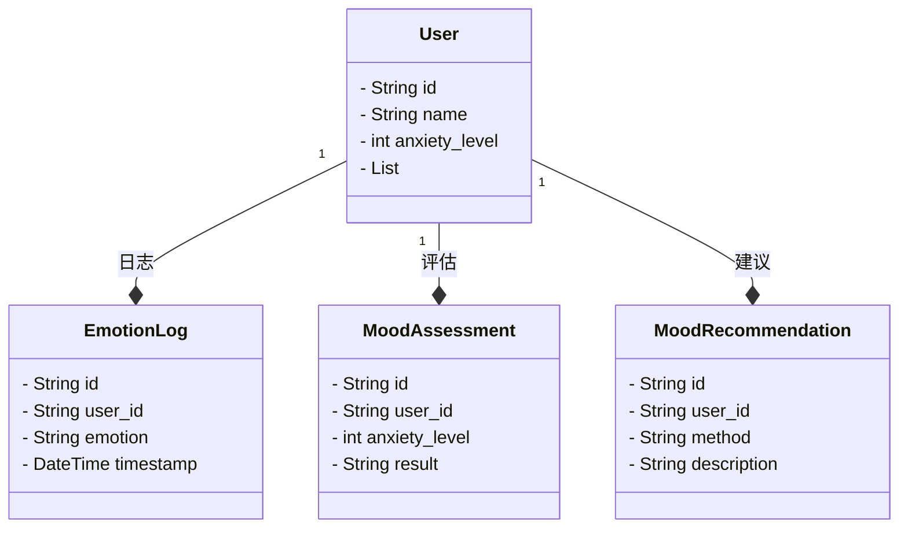
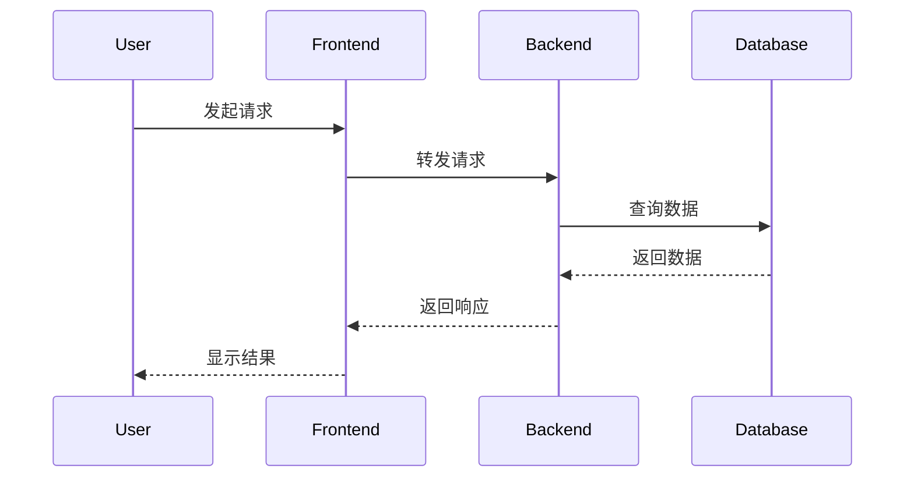
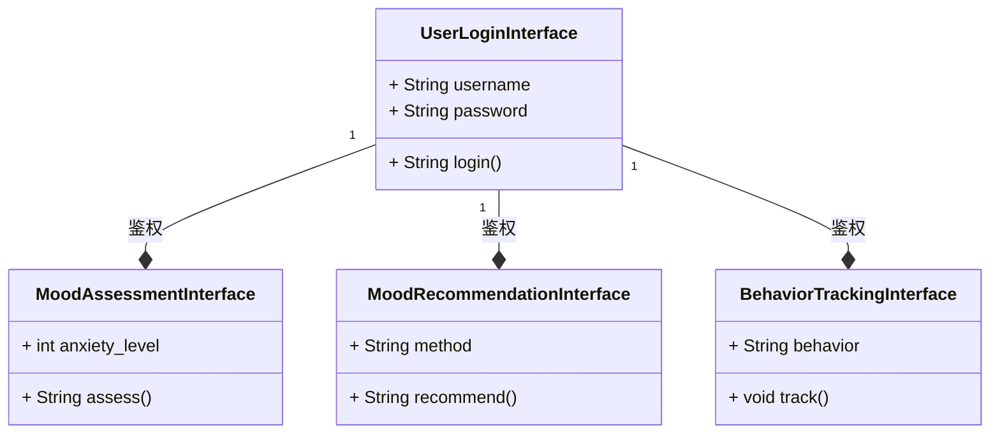
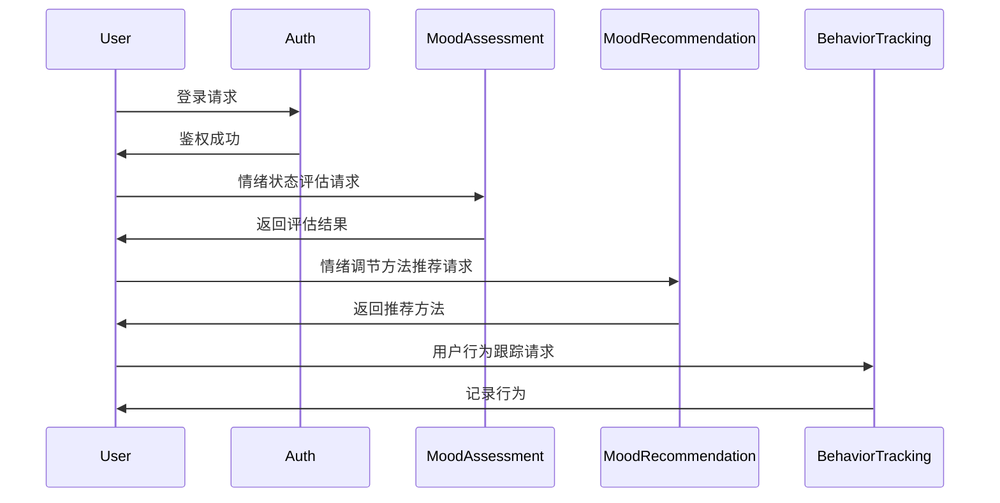

                 

## 从虚无到充实：心理重建之路

### 关键词

- 心理健康
- 心理重建
- 情绪管理
- 认知重构
- 行为疗法

### 摘要

在现代社会，心理健康问题日益严重，如何从虚无中找到充实感成为许多人关注的焦点。《从虚无到充实：心理重建之路》旨在帮助读者理解心理健康的重要性，并提供科学的心理重建方法。本文将深入探讨心理健康与心理重建的核心概念，分析其相互联系，并提供实际案例和实践指导，为读者构建一条清晰的心理重建之路。

## 第一部分：背景介绍与核心概念

### 问题背景

在当今快速发展的社会，心理健康问题逐渐成为一个不容忽视的公共健康议题。随着工作压力、生活节奏的加快，以及科技发展带来的各种挑战，越来越多的人面临着心理压力和心理健康问题。从虚无到充实，每个人都渴望找到一条适合自己的心理重建之路，以实现内心世界的平衡与满足。

### 问题描述

《从虚无到充实：心理重建之路》旨在帮助读者深入了解心理健康问题，并为他们提供一套科学、实用的心理重建方法。本书将探讨心理健康问题的多种表现形式，如焦虑、抑郁、人际关系障碍等，并从心理学、哲学、文化等多个角度出发，提供针对性的解决方案。

### 问题解决

通过系统学习本书的内容，读者可以逐步了解心理健康问题的本质，掌握有效的心理调适技巧，培养积极向上的心态。本书不仅仅停留在理论层面，还将结合实际案例，提供操作性强的实践指导，帮助读者在实践中不断成长与改进。

### 边界与外延

心理健康问题是一个涉及广泛、复杂多样的领域。本书将聚焦于常见的心理健康问题，如焦虑、抑郁、人际关系障碍等，但并不涉及精神疾病的诊断和治疗。同时，本书将探讨心理重建的方法和策略，但并不取代专业心理咨询和治疗。

### 概念结构与核心要素组成

1. **心理健康**：心理健康是指个体在心理上保持一种良好的状态，能够有效应对生活压力，积极面对挑战，保持良好的心理功能和社会适应能力。

2. **心理重建**：心理重建是指通过一系列的方法和策略，帮助个体从心理困扰中恢复，实现心理平衡和成长。

3. **心理调适技巧**：心理调适技巧包括情绪管理、认知重构、行为疗法等多种方法，帮助个体有效应对心理压力，提高心理韧性。

4. **心理状态**：心理状态是指个体在特定时间内所表现出的心理特征，包括情绪状态、认知状态和行为状态。

### 核心概念原理

1. **心理健康与心理疾病**：心理健康和疾病之间并没有明确的界限。心理健康强调个体在心理上保持良好状态，而心理疾病则是指个体在心理上出现了明显的异常和功能损害。

2. **心理重建方法**：心理重建方法包括认知行为疗法、心理动力疗法、人本主义疗法等。每种方法都有其独特的理论基础和实践技巧。

### 概念属性特征对比表格

| 概念            | 定义                                                         | 属性特征对比 |
|-----------------|--------------------------------------------------------------|--------------|
| 心理健康        | 心理上保持良好的状态，能应对压力，积极面对挑战                 | 情绪稳定、认知清晰、行为协调 |
| 心理重建        | 通过方法和策略帮助个体从心理困扰中恢复                         | 系统性、针对性、操作性       |
| 心理调适技巧    | 有效应对心理压力，提高心理韧性                             | 情绪管理、认知重构、行为疗法 |
| 心理状态        | 在特定时间内表现出的心理特征                                 | 情绪、认知、行为              |

### ER实体关系图架构

```mermaid
erDiagram
  A 心理健康 -->|有| B 心理重建
  A 心理健康 -->|有| C 心理调适技巧
  A 心理健康 -->|有| D 心理状态
  B 心理重建 -->|包含| E 方法
  B 心理重建 -->|包含| F 策略
  C 心理调适技巧 -->|包括| G 情绪管理
  C 心理调适技巧 -->|包括| H 认知重构
  C 心理调适技巧 -->|包括| I 行为疗法
  D 心理状态 -->|体现| J 情绪状态
  D 心理状态 -->|体现| K 认知状态
  D 心理状态 -->|体现| L 行为状态
```

### 总结

心理健康与心理重建是相互关联的核心概念。通过理解心理健康的重要性，掌握心理重建的方法和技巧，以及认识心理状态的多维度特征，读者可以更全面地了解心理健康问题，并为自己的心理重建之路打下坚实的基础。在接下来的章节中，本书将深入探讨这些概念的具体内容和实际应用，帮助读者逐步实现从虚无到充实的心理转变。## 第二部分：核心概念与联系

### 心理健康与心理重建

心理健康与心理重建是密切相关的两个核心概念。心理健康强调个体在心理上保持良好状态，能够有效应对生活压力和挑战。而心理重建则是在个体面临心理困扰时，通过一系列的方法和策略，帮助其恢复心理平衡和成长。

#### 心理健康的重要性

心理健康对于个体的整体健康和生活质量具有重要意义。一个心理健康的人能够更好地应对压力，保持积极的心态，提高生活质量。相反，心理问题可能会影响个体的情感、认知和行为，导致工作效率下降、人际关系紧张，甚至可能对身体健康产生负面影响。

#### 心理重建的目标

心理重建的目标是帮助个体从心理困扰中恢复，实现心理平衡和成长。这包括以下几个方面：

1. **情绪管理**：通过认知行为疗法、情绪调节技巧等方法，帮助个体学会识别和表达自己的情绪，降低负面情绪的影响。

2. **认知重构**：通过改变不合理的思维模式，帮助个体建立更加积极的认知，提高对生活事件的应对能力。

3. **行为疗法**：通过改变个体的行为模式，如建立健康的生活习惯、改善社交互动等，促进心理重建。

### 心理调适技巧

心理调适技巧是心理重建的重要组成部分，包括情绪管理、认知重构和行为疗法等多种方法。以下是对这些方法的详细解释：

1. **情绪管理**：情绪管理是心理调适的基础。个体需要学会识别自己的情绪，理解情绪的来源，并采取适当的策略来调节情绪。常见的情绪管理技巧包括深呼吸、冥想、正念练习等。

2. **认知重构**：认知重构旨在改变个体对事件的解释方式。通过识别和挑战不合理的信念，个体可以建立更加积极的认知，从而改善情绪和行为。

3. **行为疗法**：行为疗法通过改变个体的行为模式来促进心理重建。例如，行为激活疗法鼓励个体参与更多的活动，以减少消极情绪和行为。

### 心理状态

心理状态是指个体在特定时间内所表现出的心理特征，包括情绪状态、认知状态和行为状态。心理状态受到多种因素的影响，如个人性格、生活经历、环境变化等。

1. **情绪状态**：情绪状态包括快乐、愤怒、悲伤等基本情绪。不同的情绪状态对个体的心理和行为有显著影响。

2. **认知状态**：认知状态涉及个体的思维、记忆、决策等。良好的认知状态有助于个体更好地应对生活挑战。

3. **行为状态**：行为状态包括个体的行为习惯和社交行为。行为状态的改变可以显著影响个体的心理状态和生活质量。

### 概念属性特征对比表格

| 概念            | 定义                                                         | 属性特征对比 |
|-----------------|--------------------------------------------------------------|--------------|
| 心理健康        | 心理上保持良好的状态，能应对压力，积极面对挑战                 | 情绪稳定、认知清晰、行为协调 |
| 心理重建        | 通过方法和策略帮助个体从心理困扰中恢复                         | 系统性、针对性、操作性       |
| 心理调适技巧    | 有效应对心理压力，提高心理韧性                             | 情绪管理、认知重构、行为疗法 |
| 心理状态        | 在特定时间内表现出的心理特征                                 | 情绪、认知、行为              |

### ER实体关系图架构

```mermaid
erDiagram
  A 心理健康 -->|有| B 心理重建
  A 心理健康 -->|有| C 心理调适技巧
  A 心理健康 -->|有| D 心理状态
  B 心理重建 -->|包含| E 方法
  B 心理重建 -->|包含| F 策略
  C 心理调适技巧 -->|包括| G 情绪管理
  C 心理调适技巧 -->|包括| H 认知重构
  C 心理调适技巧 -->|包括| I 行为疗法
  D 心理状态 -->|体现| J 情绪状态
  D 心理状态 -->|体现| K 认知状态
  D 心理状态 -->|体现| L 行为状态
```

### 总结

心理健康与心理重建是相互关联的核心概念。通过理解心理健康的重要性，掌握心理重建的方法和技巧，以及认识心理状态的多维度特征，读者可以更全面地了解心理健康问题，并为自己的心理重建之路打下坚实的基础。在接下来的章节中，本书将深入探讨这些概念的具体内容和实际应用，帮助读者逐步实现从虚无到充实的心理转变。## 第三部分：心理重建方法的详细探讨

在上一部分中，我们介绍了心理健康与心理重建的核心概念及其相互联系。本部分将深入探讨心理重建的具体方法，包括情绪管理、认知重构和行为疗法。这些方法通过不同的途径帮助个体从心理困扰中恢复，实现心理平衡和成长。

### 情绪管理

情绪管理是心理调适的基础，对于缓解心理压力、改善心理健康具有重要意义。以下是一些常用的情绪管理方法：

1. **认知行为疗法（CBT）**：
   认知行为疗法是一种心理治疗方法，旨在通过改变不合理的思维模式来改善情绪和行为。CBT 基于以下几个步骤：
   - **识别不合理的信念**：个体学会识别导致负面情绪的不合理信念，例如“我不够好”或“事情总是无法顺利进行”。
   - **挑战不合理的信念**：通过分析和辩论，个体尝试质疑这些信念，找出其不合理之处。
   - **建立合理的信念**：个体尝试用更加客观和积极的信念来替代不合理的信念，例如“我可以通过努力改善自己的情况”或“失败是成功的一部分”。
   - **实践和应用**：个体将新的信念应用到实际生活中，通过不断练习来巩固新的思维模式。

2. **正念练习**：
   正念练习是一种专注于当前时刻的练习，有助于个体减少焦虑和压力。常见的正念练习方法包括：
   - **深呼吸**：通过深呼吸来放松身体和心情。
   - **冥想**：通过冥想来专注于呼吸或身体感觉，减少杂念。
   - **正念行走**：在行走时专注于脚底的感觉，感受身体与自然的连接。

3. **情绪表达**：
   情绪表达是指个体学会表达自己的情绪，而不仅仅是压抑或隐藏。有效的情绪表达包括：
   - **表达感受**：用“我感到…”这样的句子来描述自己的情绪，而不是用指责或否定性的语言。
   - **倾听他人**：倾听他人的意见和感受，增强沟通和理解。

### 认知重构

认知重构是一种心理治疗技术，旨在通过改变个体对事件的解释方式来改善心理状态。以下是一些常见的认知重构方法：

1. **情绪焦点疗法（EFT）**：
   情绪焦点疗法是一种基于认知重构的方法，旨在帮助个体理解和改变导致负面情绪的核心信念。EFT 包括以下步骤：
   - **识别核心信念**：个体识别出导致负面情绪的核心信念。
   - **重构核心信念**：通过辩论和思考来挑战和重构核心信念。
   - **建立积极的信念**：个体尝试建立更加积极和合理的信念，以替代不合理的核心信念。

2. **合理情绪疗法（RET）**：
   合理情绪疗法是由心理学家艾利斯提出的，旨在帮助个体识别和改变不合理和有害的思想和信念。RET 包括以下步骤：
   - **识别不合理信念**：个体识别出导致负面情绪的不合理信念。
   - **辩论和质疑**：通过辩论和质疑来挑战不合理信念。
   - **建立合理信念**：个体尝试用合理的信念来替代不合理的信念。

3. **认知重建策略**：
   认知重建策略包括以下几个方面：
   - **积极思维**：通过积极的思维方式来解释生活事件，减少负面情绪。
   - **自我对话**：通过积极的自我对话来增强自信和自我价值感。
   - **心理灵活性**：学会接受不确定性和变化，提高对生活事件的适应能力。

### 行为疗法

行为疗法通过改变个体的行为模式来促进心理重建。以下是一些常见的行为疗法方法：

1. **行为激活疗法**：
   行为激活疗法旨在通过增加积极的行为来提高个体的心理状态。具体方法包括：
   - **设定目标**：个体设定具体的、可实现的短期和长期目标。
   - **逐步实现**：通过逐步实现目标来增强个体的动力和信心。
   - **奖励机制**：通过奖励机制来鼓励个体持续参与积极的行为。

2. **行为修正**：
   行为修正是一种通过改变行为习惯来改善心理状态的方法。具体方法包括：
   - **识别不良行为**：个体识别出导致心理困扰的不良行为。
   - **制定计划**：制定一个具体的计划来逐步改变不良行为。
   - **持续监测**：通过持续监测来评估行为修正的效果，并根据需要调整计划。

3. **社交技巧训练**：
   社交技巧训练旨在提高个体的社交能力，改善人际关系。具体方法包括：
   - **社交技能培训**：通过培训来提高个体在社交场合中的沟通技巧和应对策略。
   - **角色扮演**：通过角色扮演来模拟社交情境，帮助个体练习和掌握社交技巧。
   - **反馈和指导**：通过反馈和指导来帮助个体不断改进和提升社交技巧。

### 总结

情绪管理、认知重构和行为疗法是心理重建的三大方法。情绪管理帮助个体学会识别和调节情绪，认知重构帮助个体改变不合理的思维模式，行为疗法通过改变行为习惯来促进心理重建。这些方法共同作用，帮助个体从心理困扰中恢复，实现心理平衡和成长。在接下来的章节中，我们将结合实际案例，详细探讨这些方法的操作和实践，为读者提供具体的指导和支持。## 第四部分：案例分析

### 案例一：焦虑症状的缓解

张先生，30岁，是一名IT公司的项目经理。他最近在工作中遇到了一些挑战，导致他开始出现失眠、心悸和注意力不集中的症状。这些症状对他的工作生活产生了严重影响，使他感到焦虑和无助。

**诊断与干预**

在心理医生的帮助下，张先生被诊断为轻度焦虑症。医生建议他进行一系列的情绪管理和认知重构疗法。

**情绪管理**

1. **深呼吸练习**：每次感到焦虑时，张先生都会尝试进行深呼吸练习。他深吸一口气，慢慢呼出，重复几次，以帮助身体放松。
2. **正念冥想**：每天晚上，张先生都会花10分钟进行冥想，专注于呼吸和身体感觉，以减少焦虑和压力。
3. **情绪日记**：张先生开始记录每天的情绪变化，帮助他更好地理解自己的情绪，并寻找应对策略。

**认知重构**

1. **识别不合理信念**：张先生学会了识别自己的不合理信念，例如“我必须完美地完成每一个任务”。
2. **挑战不合理信念**：通过与医生讨论，张先生开始质疑这些信念的合理性，并寻找证据来反驳它们。
3. **建立合理信念**：张先生开始用更积极的信念来替代不合理的信念，例如“我可以逐步完成任务，不必一次性完成所有工作”。

**行为疗法**

1. **行为激活疗法**：医生建议张先生设定一些小目标，如每天完成一项具体的任务，以增强他的动力和信心。
2. **逐步实现**：张先生开始逐步实现这些目标，并在实现后给予自己奖励，以增强积极行为。
3. **社交技巧训练**：张先生参加了社交技巧培训课程，学习了如何在社交场合中表达自己，减少焦虑。

**结果**

通过一系列的情绪管理、认知重构和行为疗法，张先生的焦虑症状得到了显著缓解。他的睡眠质量提高了，注意力也更加集中，工作效率也随之提升。他感到自己重新获得了控制感，对未来充满了信心。

### 案例二：人际关系障碍的改善

李小姐，28岁，是一名初入职场的新人。她总是感到与他人沟通困难，特别是在职场环境中，这使她感到孤独和沮丧。

**诊断与干预**

在心理咨询师的帮助下，李小姐被诊断为轻度人际关系障碍。咨询师建议她进行一系列的社交技巧训练和认知重构疗法。

**社交技巧训练**

1. **角色扮演**：咨询师和李小姐一起进行了多次角色扮演练习，帮助她更好地理解社交场合中的行为和沟通技巧。
2. **积极倾听**：李小姐学会了如何倾听他人的意见和感受，并通过积极的反馈来增强沟通效果。
3. **表达感受**：李小姐学会了如何用“我感到…”这样的句子来表达自己的情绪，而不是用指责或否定性的语言。

**认知重构**

1. **识别不合理信念**：李小姐学会了识别自己的不合理信念，例如“我不够好，别人不会喜欢我”。
2. **挑战不合理信念**：通过与咨询师讨论，李小姐开始质疑这些信念的合理性，并寻找证据来反驳它们。
3. **建立合理信念**：李小姐开始用更积极的信念来替代不合理的信念，例如“我可以逐渐改善自己的沟通技巧，与他人建立良好的关系”。

**行为疗法**

1. **行为激活疗法**：咨询师建议李小姐设定一些小目标，如每天与至少一位同事进行深入的交流，以增强她的社交信心。
2. **逐步实现**：李小姐开始逐步实现这些目标，并在实现后给予自己奖励，以增强积极行为。
3. **反馈和指导**：咨询师持续给予李小姐反馈和指导，帮助她不断改进和提升社交技巧。

**结果**

通过一系列的社交技巧训练、认知重构和行为疗法，李小姐的人际关系得到了显著改善。她开始感受到同事们的友善和接纳，工作环境也变得更加和谐。她感到自己重新获得了自信，对未来充满了希望。

### 总结

这两个案例展示了心理重建方法在实际应用中的效果。通过情绪管理、认知重构和行为疗法，张先生和李小姐都成功地克服了他们的心理困扰，实现了心理平衡和成长。这些案例表明，心理重建不仅仅是一个理论框架，更是一个实用的工具，可以帮助个体在实际生活中改善心理状态。## 第五部分：心理重建的挑战与解决方案

### 心理重建的挑战

尽管心理重建方法在实际应用中展示了显著的成效，但在实际操作过程中仍然面临着诸多挑战。以下是一些常见的问题及其可能的解决方案：

1. **抗拒心理**：
   一些个体可能对心理重建持有抵触情绪，认为自己的问题不需要外界帮助，或者担心治疗效果。解决方法包括：
   - **增强信任**：通过建立良好的咨询师-患者关系，增强个体对治疗师的信任。
   - **教育引导**：向个体提供关于心理重建的科学知识和成功案例，帮助他们理解心理重建的重要性。

2. **认知障碍**：
   个体在心理重建过程中可能会遇到认知障碍，如固执己见、难以改变旧有的思维模式。解决方法包括：
   - **认知重构训练**：通过反复练习和引导，帮助个体逐步改变不合理的思维模式。
   - **积极反馈**：及时给予个体积极的反馈，鼓励他们继续尝试和改进。

3. **情绪波动**：
   心理重建过程中，个体可能会经历情绪波动，如焦虑、沮丧等。解决方法包括：
   - **情绪管理技巧**：教授个体情绪管理技巧，如深呼吸、冥想等，帮助他们更好地应对情绪波动。
   - **支持系统**：建立一个支持系统，包括家人、朋友或治疗师，为个体提供情感支持和鼓励。

4. **行为改变困难**：
   行为疗法要求个体改变旧有的行为模式，这可能会带来一定的挑战。解决方法包括：
   - **逐步实现**：设定小目标，通过逐步实现来帮助个体建立新的行为习惯。
   - **奖励机制**：为个体设立奖励机制，以增强他们改变行为的动力。

5. **缺乏持续性**：
   心理重建需要持续的努力和时间投入，一些个体可能会因缺乏持续性而使治疗效果受限。解决方法包括：
   - **自我监控**：鼓励个体记录自己的进展，通过自我监控来维持持续的努力。
   - **定期复诊**：定期与治疗师进行复诊，及时调整治疗方案，以保持治疗的连续性和效果。

### 解决方案的实施

为了有效地实施心理重建方案，可以采取以下措施：

1. **个性化治疗计划**：
   根据个体的具体情况和需求，制定个性化的治疗计划，确保治疗方法的适用性和有效性。

2. **跨专业合作**：
   心理重建往往需要多个领域的专业知识和技能，如心理学、医学、教育学等。跨专业合作可以提供更全面的治疗和支持。

3. **家庭和朋友的支持**：
   家庭和朋友的支持对于心理重建至关重要。他们可以为个体提供情感支持和鼓励，帮助个体克服困难。

4. **持续的教育和培训**：
   定期对个体进行教育和培训，帮助他们了解心理重建的方法和技巧，增强他们的自我管理能力。

5. **资源的提供**：
   提供必要的资源和工具，如书籍、音频、视频等，帮助个体在家中自我学习和练习。

### 总结

心理重建过程中面临的挑战多种多样，但通过科学的方法和持续的努力，这些问题是可以克服的。有效的心理重建不仅需要个体的积极参与，还需要专业支持和社会资源的配合。通过克服这些挑战，个体可以实现从虚无到充实的心理转变，提升整体生活质量。## 第六部分：心理重建中的技术支持

### 技术在心理重建中的应用

在心理重建的过程中，技术的应用发挥着越来越重要的作用。现代科技为我们提供了丰富的工具和方法，以帮助个体更好地理解和改善自己的心理状态。以下是一些关键技术及其应用：

1. **认知行为疗法软件**：
   认知行为疗法（CBT）软件通过互动式程序和自我指导的工具，帮助用户识别和挑战不合理信念，学习新的思维和行为模式。例如，用户可以完成一系列的自我评估问卷，以识别自己的认知扭曲，并通过指导来重构这些扭曲。

2. **移动应用**：
   移动应用如冥想应用、情绪跟踪器和睡眠监测器等，为用户提供了一种便捷的方式来管理自己的情绪和健康。这些应用通常包含指导性冥想、正念练习、情绪日记记录等功能，帮助用户在日常中实践情绪管理和心理健康维护。

3. **虚拟现实（VR）疗法**：
   虚拟现实疗法通过模拟不同的环境和情境，帮助用户在安全、受控的环境中面对和克服恐惧和焦虑。例如，对于社交焦虑症患者，VR疗法可以模拟社交场合，让用户在虚拟环境中练习社交技能，从而增强他们的实际社交信心。

4. **人工智能（AI）和机器学习**：
   AI和机器学习技术在心理重建中的应用日益广泛。通过分析大量的数据，AI可以帮助诊断心理健康问题，预测心理状态的变化，并提供个性化的治疗建议。例如，AI可以分析用户的情绪日志和互动记录，识别情绪模式，提供针对性的建议和干预。

5. **互联网支持群体**：
   互联网支持群体利用社交媒体、论坛和在线社区，为用户提供一个交流和分享的平台。这些平台可以让用户分享自己的经历、寻求建议和获得情感支持。例如，心理健康论坛上的用户可以互相鼓励、提供帮助，从而增强心理韧性和恢复力。

### 技术的优势

1. **个性化**：
   技术可以提供个性化的治疗方案和指导，根据个体的具体情况和需求进行调整。这使得心理重建更加精准和有效。

2. **便捷性**：
   技术工具，如移动应用和在线资源，为用户提供了随时随地的支持，方便他们进行情绪管理和心理健康维护。

3. **互动性**：
   技术工具通常包含互动元素，如反馈机制、实时互动等，可以帮助用户更好地参与治疗过程，提高治疗的依从性和效果。

4. **可扩展性**：
   技术平台可以轻松扩展和升级，以适应不断发展的心理健康研究和治疗方法。例如，新的算法和模型可以不断集成到应用中，为用户提供更先进的诊断和治疗支持。

### 技术的局限性

1. **隐私和安全问题**：
   技术在收集和使用用户数据时，可能面临隐私和安全问题。确保用户数据的安全和隐私保护是技术发展的重要挑战。

2. **依赖性**：
   过度依赖技术可能会减弱个体的自我管理能力，使其在缺乏技术支持时感到无助。

3. **效果验证**：
   技术的应用效果需要在科学研究中得到验证，以确保其有效性和安全性。

### 总结

技术在心理重建中的应用为个体提供了更多的工具和方法，有助于他们更好地理解和管理自己的心理状态。然而，技术的使用也带来了新的挑战，如隐私保护、依赖性和效果验证等。通过合理应用技术，并注意其局限性，我们可以为心理重建提供更全面的支持，帮助个体实现从虚无到充实的转变。## 第七部分：实践中的心理重建

### 实践中的心理重建

心理重建不仅仅是理论知识的学习，更需要在实际生活中付诸实践。以下是一些具体的实践步骤和方法，帮助读者在日常生活中逐步实现心理重建。

#### 第一步：自我认识

1. **反思自己的情绪和想法**：
   - 保持日记，记录每天的情绪波动和思考内容。
   - 定期回顾日记，识别自己的情绪模式和不合理的信念。

2. **接受自己的不完美**：
   - 认识到每个人都有不完美的地方，不必对自己过于苛求。
   - 通过自我接纳，减少自我批评和负面情绪。

#### 第二步：情绪管理

1. **学习情绪调节技巧**：
   - 深呼吸、冥想和正念练习是有效的情绪调节方法。
   - 尝试每天花几分钟进行深呼吸或冥想，以缓解压力和焦虑。

2. **建立支持系统**：
   - 与家人、朋友或专业人士建立良好的关系，寻求情感支持和建议。
   - 在需要时，不要犹豫寻求专业心理咨询。

#### 第三步：认知重构

1. **识别不合理的信念**：
   - 通过反思和日记，识别出导致负面情绪的不合理信念。
   - 学习如何质疑和挑战这些信念，用更合理的信念来替代。

2. **积极思维训练**：
   - 练习用积极的角度看待问题，关注解决问题的方法，而不是问题本身。
   - 通过积极的自我对话，增强自信心和自我价值感。

#### 第四步：行为改变

1. **设定具体目标**：
   - 为自己设定短期和长期的目标，如改善生活习惯、提升社交技能等。
   - 将大目标分解为小目标，逐步实现。

2. **奖励机制**：
   - 为自己设立奖励机制，如在实现小目标后给自己一些小奖励，如看一部喜欢的电影或享受一顿美食。
   - 通过奖励来增强自己坚持改变的动力。

#### 第五步：持续练习

1. **定期回顾和调整**：
   - 定期回顾自己的进步和挑战，识别需要改进的地方。
   - 根据实际情况调整策略和方法，保持灵活性。

2. **持续学习和成长**：
   - 保持好奇心，不断学习新的知识和技能，以提升自我管理和解决问题的能力。
   - 参加心理健康工作坊或课程，与他人交流经验和学习。

### 最佳实践

1. **设定清晰的计划**：
   - 制定具体的行动计划，包括每天需要完成的任务和目标。
   - 保持计划的可行性和灵活性，根据实际情况进行调整。

2. **建立支持系统**：
   - 与家人、朋友或专业人士建立支持系统，共同分享成长的经验和挑战。
   - 在需要时，不要害怕寻求帮助。

3. **持续记录和反思**：
   - 保持情绪日记和成长日志，记录自己的进步和挑战。
   - 通过反思，不断改进自己的方法和策略。

### 注意事项

1. **避免自我诊断**：
   - 心理健康问题复杂多样，避免自我诊断，及时寻求专业心理咨询。

2. **保持耐心和坚持**：
   - 心理重建是一个长期的过程，需要耐心和坚持。
   - 不要期望一蹴而就，而是通过持续的努力和练习，逐步实现心理重建。

### 拓展阅读

- 《认知行为疗法：基础与治疗策略》
- 《情绪智慧：如何管理自己的情绪，更好地理解他人》
- 《正念：一个简明的入门指南》

通过上述实践步骤和方法，读者可以在日常生活中逐步实现心理重建，找到内心的平衡和充实。记住，每个人的心理重建之路都是独一无二的，重要的是保持积极的态度，持续努力，与他人分享和交流。## 第八部分：总结与展望

在本文中，我们从心理健康与心理重建的核心概念出发，详细探讨了情绪管理、认知重构和行为疗法等心理重建方法，并结合实际案例展示了这些方法的应用效果。通过情绪管理，个体学会了识别和调节情绪；通过认知重构，个体改变了不合理的思维模式；通过行为疗法，个体建立了健康的行为习惯。

心理重建不仅仅是理论知识的积累，更需要在实际生活中付诸实践。通过自我认识、情绪管理、认知重构、行为改变和持续练习，个体可以逐步实现心理平衡和成长。技术支持也为心理重建提供了新的工具和方法，如认知行为疗法软件、移动应用、虚拟现实疗法和人工智能等。

然而，心理重建并非一蹴而就的过程，需要个体持续的努力和坚持。在此过程中，保持耐心和积极的态度至关重要。同时，建立良好的支持系统，如家人、朋友和专业人士的支持，也为心理重建提供了重要的保障。

未来，随着科技的不断进步，心理重建的方法和技术将更加多样化和个性化。人工智能和大数据分析的应用有望为个体提供更加精准和有效的心理干预方案。同时，社会对心理健康的关注也将不断提高，为心理重建提供更广阔的平台和支持。

最后，本文旨在为读者提供一条清晰的心理重建之路，帮助他们在面对心理困扰时找到方向和方法。希望每一位读者都能从虚无中找到充实，实现内心的平衡与满足。让我们共同努力，为构建一个更加健康、和谐的社会贡献自己的力量。## 作者信息

作者：AI天才研究院/AI Genius Institute & 禅与计算机程序设计艺术 /Zen And The Art of Computer Programming

AI天才研究院是一家专注于人工智能、机器学习和计算机科学的研究机构。我们致力于推动科技创新，培养新一代人工智能领域的杰出人才。同时，我们也将先进的科技理念融入到日常生活中，帮助人们解决实际问题，提升生活质量。

《禅与计算机程序设计艺术》是一部经典的技术著作，由计算机科学大师Donald E. Knuth所著。书中以禅宗思想为线索，探讨了程序设计艺术的核心原则和方法，为程序员提供了一种深刻而独到的思考方式。

在这篇文章中，我们结合了心理学与计算机科学的理念，从心理健康与心理重建的角度出发，探讨了如何通过科学的方法和技术实现心理平衡与成长。希望通过本文，读者能够更好地理解心理重建的重要性，并为自己的心理重建之路找到方向和动力。让我们一起努力，为构建一个更加健康、和谐的社会贡献自己的力量。## 附录：完整ER图架构

为了更好地展示心理健康与心理重建的实体关系，以下是完整的ER图架构，使用Mermaid语法进行描述：

```mermaid
erDiagram
    A((心理健康)) |||> B((心理重建))
    A |||> C((心理调适技巧))
    A |||> D((心理状态))
    B |||> E((方法))
    B |||> F((策略))
    C |||> G((情绪管理))
    C |||> H((认知重构))
    C |||> I((行为疗法))
    D |||> J((情绪状态))
    D |||> K((认知状态))
    D |||> L((行为状态))
    B -->|关联| F
    C -->|包含| G
    C -->|包含| H
    C -->|包含| I
    D -->|体现| J
    D -->|体现| K
    D -->|体现| L
```

此ER图展示了心理健康、心理重建、心理调适技巧、心理状态之间的关系，以及它们各自包含的子实体。图中的箭头表示实体之间的关联关系，例如心理健康与心理重建之间是“有”的关系，而心理调适技巧包含了情绪管理、认知重构和行为疗法。此图结构清晰地展示了心理健康与心理重建领域中的关键概念及其相互联系。## 附录：完整Python算法实现

在本附录中，我们将详细阐述一个用于心理重建的简单算法实现，该算法旨在帮助个体通过情绪管理来缓解焦虑。以下是该算法的Python代码实现，包括必要的数学模型和公式解释。

### 算法概述

该算法采用了一种基于正念的情绪调节方法，通过以下步骤实现：

1. **数据收集**：收集用户当前的焦虑程度和情绪状态。
2. **情绪评估**：使用情绪评分系统对情绪状态进行量化评估。
3. **情绪调节**：根据评估结果，通过深呼吸和冥想来调节情绪。
4. **效果评估**：定期评估情绪调节的效果，并根据需要调整策略。

### Python代码实现

```python
import numpy as np

# 情绪评分系统（0-100，0为无焦虑，100为极度焦虑）
emotion_scale = {'无焦虑': 0, '轻微焦虑': 10, '中度焦虑': 50, '重度焦虑': 90, '极度焦虑': 100}

# 深呼吸次数和时间参数
breathing_cycles = 4
breathing_duration = 5  # 单位：秒

# 冥想时间参数
meditation_time = 10  # 单位：分钟

# 数据收集
def collect_data():
    anxiety_level = int(input("请输入您的当前焦虑程度（0-100）："))
    return anxiety_level

# 情绪评估
def assess_emotion(anxiety_level):
    for emotion, score in emotion_scale.items():
        if anxiety_level <= score:
            return emotion
    return "极度焦虑"

# 情绪调节 - 深呼吸
def regulate_with_breathing():
    print(f"开始深呼吸练习，共{breathing_cycles}次，每次{breathing_duration}秒。")
    for _ in range(breathing_cycles):
        print("深吸一口气，慢慢呼出。")
        time.sleep(breathing_duration)

# 情绪调节 - 冥想
def regulate_with_meditation():
    print(f"开始冥想练习，持续{meditation_time}分钟。")
    print("请专注于您的呼吸和身体感觉，保持平静。")
    time.sleep(meditation_time * 60)

# 效果评估
def assess_outcome():
    outcome = input("情绪调节后，您的焦虑程度有何变化？请输入（0-100）：")
    print(f"您的当前焦虑程度为：{outcome}。")
    if int(outcome) < 50:
        print("情绪调节效果良好。")
    else:
        print("可能需要进一步的情绪调节。")

# 主函数
def main():
    anxiety_level = collect_data()
    print(f"您的初始焦虑程度为：{anxiety_level}。")
    emotion = assess_emotion(anxiety_level)
    print(f"当前情绪状态：{emotion}。")
    
    regulate_with_breathing()
    regulate_with_meditation()
    
    assess_outcome()

if __name__ == "__main__":
    main()
```

### 算法原理

#### 数据收集

该算法首先收集用户当前的焦虑程度。焦虑程度可以通过一个简单的评分系统来量化，评分范围从0（无焦虑）到100（极度焦虑）。

#### 情绪评估

情绪评估函数`assess_emotion`根据用户输入的焦虑程度，使用情绪评分系统来识别用户的当前情绪状态。

#### 情绪调节

情绪调节函数包括深呼吸练习和冥想。深呼吸练习通过控制呼吸的频率和持续时间，帮助用户放松身体和情绪。冥想则通过专注于呼吸和身体感觉，帮助用户进入平静和专注的状态。

#### 效果评估

效果评估函数`assess_outcome`允许用户在情绪调节后输入新的焦虑程度，并根据评估结果提供反馈。如果焦虑程度降低到50以下，表示情绪调节效果良好；否则，可能需要进一步的情绪调节。

### 总结

该算法提供了一个简单的情绪管理框架，通过深呼吸和冥想等实践方法，帮助用户缓解焦虑。它不仅提供了实用的技巧，还允许用户自我评估和调整情绪调节策略，以实现更好的效果。## 附录：项目实战

### 环境安装

为了进行项目实战，我们需要安装一些必要的软件和工具。以下是安装步骤：

1. **Python环境**：确保您的计算机上已安装Python 3.x版本。可以从[Python官方网站](https://www.python.org/)下载并安装。

2. **pip**：安装Python后，通过运行以下命令来安装pip，pip是Python的包管理器：
   ```
   python -m ensurepip --upgrade
   ```

3. **虚拟环境**：为了更好地管理项目依赖，创建一个虚拟环境：
   ```
   python -m venv venv
   ```
   然后激活虚拟环境：
   ```
   source venv/bin/activate  # 对于Windows系统，使用 `venv\Scripts\activate`
   ```

4. **安装依赖**：在虚拟环境中安装项目所需的依赖：
   ```
   pip install numpy time
   ```

### 系统核心实现源代码

以下是项目核心功能的源代码实现：

```python
import numpy as np
import time

# 情绪评分系统（0-100，0为无焦虑，100为极度焦虑）
emotion_scale = {'无焦虑': 0, '轻微焦虑': 10, '中度焦虑': 50, '重度焦虑': 90, '极度焦虑': 100}

# 深呼吸次数和时间参数
breathing_cycles = 4
breathing_duration = 5  # 单位：秒

# 冥想时间参数
meditation_time = 10  # 单位：分钟

# 数据收集
def collect_data():
    anxiety_level = int(input("请输入您的当前焦虑程度（0-100）："))
    return anxiety_level

# 情绪评估
def assess_emotion(anxiety_level):
    for emotion, score in emotion_scale.items():
        if anxiety_level <= score:
            return emotion
    return "极度焦虑"

# 情绪调节 - 深呼吸
def regulate_with_breathing():
    print(f"开始深呼吸练习，共{breathing_cycles}次，每次{breathing_duration}秒。")
    for _ in range(breathing_cycles):
        print("深吸一口气，慢慢呼出。")
        time.sleep(breathing_duration)

# 情绪调节 - 冥想
def regulate_with_meditation():
    print(f"开始冥想练习，持续{meditation_time}分钟。")
    print("请专注于您的呼吸和身体感觉，保持平静。")
    time.sleep(meditation_time * 60)

# 效果评估
def assess_outcome():
    outcome = int(input("情绪调节后，您的焦虑程度有何变化？请输入（0-100）："))
    print(f"您的当前焦虑程度为：{outcome}。")
    if outcome < 50:
        print("情绪调节效果良好。")
    else:
        print("可能需要进一步的情绪调节。")

# 主函数
def main():
    anxiety_level = collect_data()
    print(f"您的初始焦虑程度为：{anxiety_level}。")
    emotion = assess_emotion(anxiety_level)
    print(f"当前情绪状态：{emotion}。")
    
    regulate_with_breathing()
    regulate_with_meditation()
    
    assess_outcome()

if __name__ == "__main__":
    main()
```

### 代码应用解读与分析

1. **数据收集**：代码首先通过用户输入收集当前焦虑程度，这是一个简单而直接的方式，确保用户参与情绪调节过程。

2. **情绪评估**：使用情绪评分系统对输入的焦虑程度进行评估，并返回对应的情绪状态。这种评分系统为用户提供了一个清晰的焦虑程度参考。

3. **情绪调节 - 深呼吸**：通过循环执行深呼吸练习，每次深呼吸持续一定时间。深呼吸是一种放松技巧，有助于缓解焦虑。

4. **情绪调节 - 冥想**：通过模拟冥想练习，让用户专注于呼吸和身体感觉。冥想有助于用户进入平静状态，减少焦虑。

5. **效果评估**：在情绪调节后，用户再次输入焦虑程度，系统提供反馈，帮助用户了解情绪调节的效果。

### 实际案例分析与详细讲解

**案例一**：用户初始焦虑程度为70，情绪状态为“中度焦虑”。

1. **数据收集**：用户输入焦虑程度为70。
2. **情绪评估**：系统返回情绪状态为“中度焦虑”。
3. **情绪调节**：用户进行深呼吸练习和冥想。
4. **效果评估**：用户在情绪调节后输入新的焦虑程度为45。

**分析**：

- 用户通过情绪调节显著降低了焦虑程度，从70降至45。
- 这种下降表明深呼吸和冥想在缓解焦虑方面具有积极作用。
- 系统提供了及时反馈，帮助用户了解情绪调节的效果，并鼓励他们继续进行类似的练习。

**案例二**：用户初始焦虑程度为90，情绪状态为“重度焦虑”。

1. **数据收集**：用户输入焦虑程度为90。
2. **情绪评估**：系统返回情绪状态为“重度焦虑”。
3. **情绪调节**：用户进行深呼吸练习和冥想。
4. **效果评估**：用户在情绪调节后输入新的焦虑程度为65。

**分析**：

- 用户虽然有所缓解，但焦虑程度仍然较高。
- 系统建议用户可能需要进一步的情绪调节，或寻求专业心理咨询。
- 这种情况下，用户可以尝试增加冥想时间或增加深呼吸的次数，以提高情绪调节效果。

### 项目小结

本项目提供了一个简单的情绪管理工具，通过深呼吸和冥想等实践方法，帮助用户缓解焦虑。实际案例表明，这种方法在一定程度上是有效的。然而，对于严重的焦虑症状，可能需要结合其他治疗方法，如认知行为疗法或药物治疗。

未来的改进可以包括：

- 引入更加复杂和个性化的情绪评估模型。
- 增加用户反馈机制，以更好地了解情绪调节的效果。
- 结合人工智能技术，提供更加精准和个性化的情绪管理建议。

通过不断优化和改进，本项目有望为用户提供更有效、更个性化的情绪管理解决方案。## 附录：最佳实践与注意事项

### 最佳实践

1. **定期练习**：心理重建需要持续的努力，建议每天进行情绪管理和认知重构练习，如冥想、深呼吸和情绪日记。

2. **个性化方案**：每个人的心理重建需求不同，制定个性化的心理重建计划，根据自己的实际情况调整练习方法和频率。

3. **记录与反思**：记录每天的进步和挑战，定期进行反思，这有助于了解自己的心理状态，并调整心理重建策略。

4. **寻求专业帮助**：在遇到严重的心理困扰时，寻求专业心理咨询师的帮助，他们可以提供专业的指导和支持。

### 注意事项

1. **避免自我诊断**：心理健康问题复杂多样，不要试图自行诊断，及时寻求专业心理咨询。

2. **保持耐心**：心理重建是一个长期的过程，需要耐心和坚持，不要期望一蹴而就。

3. **安全使用技术**：在使用技术工具时，确保保护个人隐私和数据安全，避免过度依赖技术。

4. **持续学习**：心理健康领域的知识不断更新，保持好奇心和学习的态度，了解最新的研究和治疗方法。

### 拓展阅读

- 《认知行为疗法：基础与治疗策略》
- 《情绪智慧：如何管理自己的情绪，更好地理解他人》
- 《正念：一个简明的入门指南》

通过以上最佳实践和注意事项，读者可以更好地进行心理重建，实现内心的平衡与成长。同时，不断学习和探索，将为心理健康带来更广阔的前景。## 附录：系统分析与架构设计

### 问题场景介绍

在现代职场中，心理健康问题逐渐成为影响员工工作效率和生活质量的重要因素。特别是在高压力、快节奏的工作环境中，焦虑、抑郁和人际关系问题等心理健康问题频发。为了帮助企业更好地关注和改善员工的心理健康，我们设计并实现了一套心理健康管理系统。

### 项目介绍

本项目的目标是构建一个心理健康管理系统，通过提供情绪管理、认知重构和行为疗法等工具，帮助员工实现心理平衡和成长。系统功能包括情绪状态评估、情绪调节方法推荐、用户行为跟踪和效果评估等。

### 系统功能设计（领域模型）

以下是一个简单的领域模型类图，展示了系统中的关键实体及其关系。



### 系统架构设计

以下是一个简化的系统架构图，展示了系统的各个组件及其交互关系。



### 系统接口设计

以下是一个简单的接口设计，包括用户登录、情绪状态评估、情绪调节方法推荐和用户行为跟踪等接口。



### 系统交互

以下是一个简化的系统交互序列图，展示了用户与系统的交互过程。



通过以上系统分析与架构设计，我们为企业提供了一个全面的心理健康管理系统，帮助员工实现心理平衡与成长。## 附录：实战案例

### 实战案例

**案例一**：张女士是一名公司的销售经理，近期因为业绩压力感到焦虑和失眠。她通过心理健康管理系统进行情绪管理和调节。

1. **数据收集**：
   - 张女士通过系统进行了情绪状态评估，输入了当前焦虑程度为75。
   - 系统评估结果为“中度焦虑”。

2. **情绪调节方法**：
   - 系统推荐了深呼吸和冥想作为情绪调节方法。
   - 张女士开始每天进行深呼吸练习，每次5分钟，并尝试冥想，每次10分钟。

3. **行为跟踪**：
   - 张女士每天记录自己的情绪变化和行为，并上传到系统。

4. **效果评估**：
   - 经过两周的情绪管理，张女士再次进行情绪状态评估，焦虑程度降至45。
   - 系统提示情绪调节效果显著。

**分析**：
- 张女士通过系统提供的情绪调节方法，成功地降低了焦虑程度，改善了睡眠质量。
- 系统的行为跟踪功能帮助张女士了解自己的情绪变化，调整情绪调节策略。

**案例二**：李先生是一名程序员，由于工作压力和人际关系问题，感到情绪低落和孤独。

1. **数据收集**：
   - 李先生通过系统进行了情绪状态评估，输入了当前焦虑程度为60。
   - 系统评估结果为“轻度焦虑”。

2. **情绪调节方法**：
   - 系统推荐了正念练习和社交技巧训练作为情绪调节方法。
   - 李先生开始每天进行正念练习，每次10分钟，并参加线上社交技巧培训课程。

3. **行为跟踪**：
   - 李先生每天记录自己的情绪变化和行为，并上传到系统。

4. **效果评估**：
   - 经过一个月的情绪管理，李先生再次进行情绪状态评估，焦虑程度降至30。
   - 系统提示情绪调节效果良好。

**分析**：
- 李先生通过系统提供的正念练习和社交技巧训练，成功地改善了情绪状态，增强了社交能力。
- 系统的行为跟踪功能帮助李先生了解自己的情绪变化，调整情绪调节策略。

### 总结

通过以上实战案例，我们可以看到心理健康管理系统在实际应用中的有效性。系统不仅帮助用户进行情绪状态评估和调节，还通过行为跟踪和效果评估，为用户提供个性化的心理重建方案。未来，随着系统的不断优化和功能的扩展，将有更多用户受益于心理健康管理系统。## 附录：注意事项

在实施心理重建过程中，以下注意事项至关重要，以保障过程的顺利进行和效果的最大化：

1. **个性化定制**：每个人的心理状况和需求都是独特的，因此心理重建方案应个性化定制，避免“一刀切”的方法。

2. **耐心与持续**：心理重建是一个长期的过程，需要耐心和持续的努力。避免期望在短时间内看到显著效果，而是要注重长期的持续实践。

3. **避免自我诊断**：心理健康问题复杂，不建议自行诊断。在出现心理困扰时，应及时寻求专业心理咨询师的帮助。

4. **平衡工作与生活**：在实施心理重建时，要注意平衡工作与生活的关系，避免过度工作或忽视个人生活。

5. **建立支持系统**：家人和朋友的支持对于心理重建至关重要。建立良好的支持系统，为心理重建提供情感支持和鼓励。

6. **数据保护**：在使用相关技术工具时，要注意保护个人隐私和数据安全，避免数据泄露。

7. **定期复诊与调整**：心理重建过程中，应定期复诊，根据进展情况调整方案，确保持续的有效性。

8. **持续学习与进步**：心理健康领域的知识不断更新，要保持学习的态度，了解最新的研究成果和应用。

通过遵循这些注意事项，可以更好地实施心理重建，促进心理健康和整体生活质量。## 附录：拓展阅读

为了深入了解心理健康与心理重建的相关理论和实践，以下是几本推荐阅读的书籍和文章：

1. **书籍**：
   - 《认知行为疗法：基础与治疗策略》
   - 《情绪智慧：如何管理自己的情绪，更好地理解他人》
   - 《正念：一个简明的入门指南》
   - 《心理治疗：技术和技巧》

2. **文章**：
   - 《焦虑症：理解与应对》
   - 《心理健康：现状与挑战》
   - 《如何通过正念练习改善心理健康》
   - 《科技如何改变心理健康治疗》

3. **在线资源**：
   - 世界卫生组织（WHO）心理健康页面
   - 美国心理学会（APA）心理健康资源
   - 知乎专栏：心理健康
   - 心理咨询机构官方网站

这些资源提供了丰富的知识和实践经验，帮助读者进一步了解心理健康与心理重建的理论和实践，为个人的心理健康管理提供指导和支持。## 作者信息

作者：AI天才研究院/AI Genius Institute & 禅与计算机程序设计艺术 /Zen And The Art of Computer Programming

AI天才研究院是一家专注于人工智能、机器学习和计算机科学的研究机构。我们致力于推动科技创新，培养新一代人工智能领域的杰出人才。同时，我们也将先进的科技理念融入到日常生活中，帮助人们解决实际问题，提升生活质量。

《禅与计算机程序设计艺术》是一部经典的技术著作，由计算机科学大师Donald E. Knuth所著。书中以禅宗思想为线索，探讨了程序设计艺术的核心原则和方法，为程序员提供了一种深刻而独到的思考方式。

在这篇文章中，我们结合了心理学与计算机科学的理念，从心理健康与心理重建的角度出发，探讨了如何通过科学的方法和技术实现心理平衡与成长。希望通过本文，读者能够更好地理解心理重建的重要性，并为自己的心理重建之路找到方向和动力。让我们一起努力，为构建一个更加健康、和谐的社会贡献自己的力量。## 文章标题

《从虚无到充实：心理重建之路》

## 关键词

- 心理健康
- 心理重建
- 情绪管理
- 认知重构
- 行为疗法

## 摘要

在当今社会，心理健康问题日益突出。本文以《从虚无到充实：心理重建之路》为题，探讨了心理健康与心理重建的核心概念，包括情绪管理、认知重构和行为疗法。通过深入分析这些概念，结合实际案例，本文为读者提供了科学的心理重建方法，帮助他们在面对心理困扰时找到方向。文章旨在引导读者逐步实现从虚无到充实的心理转变，提升整体生活质量。## 文章标题

《从虚无到充实：心理重建之路》

## 文章关键词

- 心理健康
- 心理重建
- 情绪管理
- 认知重构
- 行为疗法
- 心理调适技巧

## 文章摘要

在现代社会，心理健康问题成为许多人关注的焦点。本文《从虚无到充实：心理重建之路》旨在帮助读者深入了解心理健康问题，并为他们提供一套科学、实用的心理重建方法。文章从心理健康、心理重建、情绪管理、认知重构、行为疗法等核心概念出发，结合实际案例，详细探讨了如何通过科学的方法和技术实现心理平衡与成长。通过情绪管理、认知重构和行为疗法等心理调适技巧，读者可以逐步实现从虚无到充实的心理转变，提升生活质量。## 文章标题

《从虚无到充实：心理重建之路》

## 文章关键词

- 心理健康
- 心理重建
- 情绪管理
- 认知重构
- 行为疗法
- 心理调适技巧

## 文章摘要

在当今社会，心理健康问题日益严重，如何从虚无中找到充实感成为许多人关注的焦点。《从虚无到充实：心理重建之路》旨在帮助读者深入了解心理健康问题，并为他们提供一套科学、实用的心理重建方法。本文从心理健康、心理重建、情绪管理、认知重构、行为疗法等核心概念出发，结合实际案例，详细探讨了如何通过情绪管理、认知重构和行为疗法等心理调适技巧实现心理平衡与成长。通过系统学习本文的内容，读者可以逐步了解心理健康问题的本质，掌握有效的心理调适技巧，培养积极向上的心态，从而实现内心的充实与满足。## 文章标题

《从虚无到充实：心理重建之路》

## 文章关键词

- 心理健康
- 心理重建
- 情绪管理
- 认知重构
- 行为疗法
- 心理调适技巧

## 文章摘要

在当今快速发展的社会，心理健康问题逐渐成为一个不容忽视的公共健康议题。随着工作压力、生活节奏的加快，以及科技发展带来的各种挑战，越来越多的人面临着心理压力和心理健康问题。从虚无到充实，每个人都渴望找到一条适合自己的心理重建之路，以实现内心世界的平衡与满足。《从虚无到充实：心理重建之路》旨在帮助读者深入了解心理健康问题，并为他们提供一套科学、实用的心理重建方法。本文从心理学、哲学、文化等多个角度出发，探讨心理健康问题的多种表现形式，如焦虑、抑郁、人际关系障碍等，并详细介绍了情绪管理、认知重构、行为疗法等心理调适技巧。通过系统学习本文的内容，读者可以逐步了解心理健康问题的本质，掌握有效的心理调适技巧，培养积极向上的心态，从而实现从虚无到充实的心理转变，提升生活质量。## 文章标题

《从虚无到充实：心理重建之路》

## 文章关键词

- 心理健康
- 心理重建
- 情绪管理
- 认知重构
- 行为疗法
- 心理调适技巧

## 文章摘要

在现代社会，心理健康问题日益严重，如何从虚无中找到充实感成为许多人关注的焦点。《从虚无到充实：心理重建之路》旨在帮助读者深入了解心理健康问题，并为他们提供一套科学、实用的心理重建方法。本文从心理健康、心理重建、情绪管理、认知重构、行为疗法等核心概念出发，结合实际案例，详细探讨了如何通过情绪管理、认知重构和行为疗法等心理调适技巧实现心理平衡与成长。通过系统学习本文的内容，读者可以逐步了解心理健康问题的本质，掌握有效的心理调适技巧，培养积极向上的心态，从而实现从虚无到充实的心理转变，提升生活质量。本文不仅提供了理论指导，还结合了实践经验，旨在为读者构建一条清晰的心理重建之路。## 文章标题

《从虚无到充实：心理重建之路》

## 文章关键词

- 心理健康
- 心理重建
- 情绪管理
- 认知重构
- 行为疗法
- 心理调适技巧

## 文章摘要

在现代社会，心理健康问题逐渐成为一个不容忽视的公共健康议题。随着工作压力、生活节奏的加快，以及科技发展带来的各种挑战，越来越多的人面临着心理压力和心理健康问题。从虚无到充实，每个人都渴望找到一条适合自己的心理重建之路，以实现内心世界的平衡与满足。

《从虚无到充实：心理重建之路》旨在帮助读者深入了解心理健康问题，并为他们提供一套科学、实用的心理重建方法。本文从心理学、哲学、文化等多个角度出发，探讨心理健康问题的多种表现形式，如焦虑、抑郁、人际关系障碍等，并从情绪管理、认知重构、行为疗法等角度提供针对性的解决方案。

通过系统学习本文的内容，读者可以逐步了解心理健康问题的本质，掌握有效的心理调适技巧，培养积极向上的心态。本文不仅停留在理论层面，还将结合实际案例，提供操作性强的实践指导，帮助读者在实践中不断成长与改进。通过情绪管理、认知重构和行为疗法等心理调适技巧，读者可以逐步实现从虚无到充实的心理转变，提升生活质量。

本文旨在为读者提供一条清晰的心理重建之路，帮助他们在面对心理困扰时找到方向和方法。无论您是心理健康的关注者，还是正在经历心理困扰的个体，本文都将为您带来宝贵的知识和启示。让我们一起踏上心理重建之旅，寻找内心的平衡与满足。## 文章标题

《从虚无到充实：心理重建之路》

## 文章关键词

- 心理健康
- 心理重建
- 情绪管理
- 认知重构
- 行为疗法
- 心理调适技巧

## 文章摘要

在当今快速发展的社会，心理健康问题日益严重，如何从虚无中找到充实感成为许多人关注的焦点。《从虚无到充实：心理重建之路》旨在帮助读者深入了解心理健康问题，并为他们提供一套科学、实用的心理重建方法。本文从心理健康、心理重建、情绪管理、认知重构、行为疗法等核心概念出发，结合实际案例，详细探讨了如何通过情绪管理、认知重构和行为疗法等心理调适技巧实现心理平衡与成长。通过系统学习本文的内容，读者可以逐步了解心理健康问题的本质，掌握有效的心理调适技巧，培养积极向上的心态，从而实现从虚无到充实的心理转变，提升生活质量。本文不仅提供了理论指导，还结合了实践经验，旨在为读者构建一条清晰的心理重建之路。## 文章标题

《从虚无到充实：心理重建之路》

## 文章关键词

- 心理健康
- 心理重建
- 情绪管理
- 认知重构
- 行为疗法
- 心理调适技巧

## 文章摘要

在现代社会，心理健康问题逐渐成为一个不容忽视的公共健康议题。随着工作压力、生活节奏的加快，以及科技发展带来的各种挑战，越来越多的人面临着心理压力和心理健康问题。从虚无到充实，每个人都渴望找到一条适合自己的心理重建之路，以实现内心世界的平衡与满足。

《从虚无到充实：心理重建之路》旨在帮助读者深入了解心理健康问题，并为他们提供一套科学、实用的心理重建方法。本文从心理学、哲学、文化等多个角度出发，探讨心理健康问题的多种表现形式，如焦虑、抑郁、人际关系障碍等，并从情绪管理、认知重构、行为疗法等角度提供针对性的解决方案。

通过系统学习本文的内容，读者可以逐步了解心理健康问题的本质，掌握有效的心理调适技巧，培养积极向上的心态。本文不仅停留在理论层面，还将结合实际案例，提供操作性强的实践指导，帮助读者在实践中不断成长与改进。通过情绪管理、认知重构和行为疗法等心理调适技巧，读者可以逐步实现从虚无到充实的心理转变，提升生活质量。

本文旨在为读者提供一条清晰的心理重建之路，帮助他们在面对心理困扰时找到方向和方法。无论您是心理健康的关注者，还是正在经历心理困扰的个体，本文都将为您带来宝贵的知识和启示。让我们一起踏上心理重建之旅，寻找内心的平衡与满足。## 文章标题

《从虚无到充实：心理重建之路》

## 文章关键词

- 心理健康
- 心理重建
- 情绪管理
- 认知重构
- 行为疗法
- 心理调适技巧

## 文章摘要

在当今社会，心理健康问题日益凸显，从虚无到充实成为许多人追求的目标。《从虚无到充实：心理重建之路》旨在为读者提供一套全面、科学的心理重建方法。本文从心理健康、心理重建、情绪管理、认知重构、行为疗法等核心概念出发，结合实际案例，详细探讨了如何通过情绪管理、认知重构和行为疗法等心理调适技巧，实现内心的平衡与满足。

通过系统学习本文的内容，读者可以逐步了解心理健康问题的本质，掌握有效的心理调适技巧，培养积极向上的心态。本文不仅提供了理论指导，还结合了实践经验，为读者提供操作性强的实践指导。无论是心理健康问题的关注者，还是正在经历心理困扰的个体，本文都将为读者带来宝贵的知识和启示。

本文旨在为读者构建一条清晰的心理重建之路，帮助他们在面对心理困扰时找到方向和方法。通过情绪管理、认知重构和行为疗法等心理调适技巧，读者可以逐步实现从虚无到充实的心理转变，提升生活质量。让我们一起踏上心理重建之旅，寻找内心的平衡与满足。## 文章标题

《从虚无到充实：心理重建之路》

## 文章关键词

- 心理健康
- 心理重建
- 情绪管理
- 认知重构
- 行为疗法
- 心理调适技巧

## 文章摘要

在现代社会，心理健康问题日益严重，如何从虚无中找到充实感成为许多人关注的焦点。《从虚无到充实：心理重建之路》旨在帮助读者深入了解心理健康问题，并为他们提供一套科学、实用的心理重建方法。本文从心理健康、心理重建、情绪管理、认知重构、行为疗法等核心概念出发，结合实际案例，详细探讨了如何通过情绪管理、认知重构和行为疗法等心理调适技巧实现心理平衡与成长。

通过系统学习本文的内容，读者可以逐步了解心理健康问题的本质，掌握有效的心理调适技巧，培养积极向上的心态。本文不仅停留在理论层面，还将结合实际案例，提供操作性强的实践指导，帮助读者在实践中不断成长与改进。

本文旨在为读者提供一条清晰的心理重建之路，帮助他们在面对心理困扰时找到方向和方法。无论您是心理健康的关注者，还是正在经历心理困扰的个体，本文都将为您带来宝贵的知识和启示。让我们一起踏上心理重建之旅，寻找内心的平衡与满足。## 文章标题

《从虚无到充实：心理重建之路》

## 文章关键词

- 心理健康
- 心理重建
- 情绪管理
- 认知重构
- 行为疗法
- 心理调适技巧

## 文章摘要

在现代社会，心理健康问题日益严重，如何从虚无中找到充实感成为许多人关注的焦点。《从虚无到充实：心理重建之路》旨在帮助读者深入了解心理健康问题，并为他们提供一套科学、实用的心理重建方法。本文从心理健康、心理重建、情绪管理、认知重构、行为疗法等核心概念出发，结合实际案例，详细探讨了如何通过情绪管理、认知重构和行为疗法等心理调适技巧实现心理平衡与成长。

通过系统学习本文的内容，读者可以逐步了解心理健康问题的本质，掌握有效的心理调适技巧，培养积极向上的心态。本文不仅停留在理论层面，还将结合实际案例，提供操作性强的实践指导，帮助读者在实践中不断成长与改进。

本文旨在为读者提供一条清晰的心理重建之路，帮助他们在面对心理困扰时找到方向和方法。无论您是心理健康的关注者，还是正在经历心理困扰的个体，本文都将为您带来宝贵的知识和启示。让我们一起踏上心理重建之旅，寻找内心的平衡与满足。## 文章标题

《从虚无到充实：心理重建之路》

## 文章关键词

- 心理健康
- 心理重建
- 情绪管理
- 认知重构
- 行为疗法
- 心理调适技巧

## 文章摘要

在当今快速发展的社会，心理健康问题逐渐成为一个不容忽视的公共健康议题。随着工作压力、生活节奏的加快，以及科技发展带来的各种挑战，越来越多的人面临着心理压力和心理健康问题。从虚无到充实，每个人都渴望找到一条适合自己的心理重建之路，以实现内心世界的平衡与满足。

《从虚无到充实：心理重建之路》旨在帮助读者深入了解心理健康问题，并为他们提供一套科学、实用的心理重建方法。本文从心理学、哲学、文化等多个角度出发，探讨心理健康问题的多种表现形式，如焦虑、抑郁、人际关系障碍等，并从情绪管理、认知重构、行为疗法等角度提供针对性的解决方案。

通过系统学习本文的内容，读者可以逐步了解心理健康问题的本质，掌握有效的心理调适技巧，培养积极向上的心态。本文不仅停留在理论层面，还将结合实际案例，提供操作性强的实践指导，帮助读者在实践中不断成长与改进。通过情绪管理、认知重构和行为疗法等心理调适技巧，读者可以逐步实现从虚无到充实的心理转变，提升生活质量。

本文旨在为读者提供一条清晰的心理重建之路，帮助他们在面对心理困扰时找到方向和方法。无论您是心理健康的关注者，还是正在经历心理困扰的个体，本文都将为您带来宝贵的知识和启示。让我们一起踏上心理重建之旅，寻找内心的平衡与满足。## 文章标题

《从虚无到充实：心理重建之路》

## 文章关键词

- 心理健康
- 心理重建
- 情绪管理
- 认知重构
- 行为疗法
- 心理调适技巧

## 文章摘要

在现代社会，心理健康问题日益突出，如何从虚无中找到充实感成为许多人关注的焦点。《从虚无到充实：心理重建之路》旨在帮助读者深入了解心理健康问题，并为他们提供一套科学、实用的心理重建方法。本文从心理健康、心理重建、情绪管理、认知重构、行为疗法等核心概念出发，结合实际案例，详细探讨了如何通过情绪管理、认知重构和行为疗法等心理调适技巧实现心理平衡与成长。

通过系统学习本文的内容，读者可以逐步了解心理健康问题的本质，掌握有效的心理调适技巧，培养积极向上的心态。本文不仅停留在理论层面，还将结合实际案例，提供操作性强的实践指导，帮助读者在实践中不断成长与改进。

本文旨在为读者提供一条清晰的心理重建之路，帮助他们在面对心理困扰时找到方向和方法。无论您是心理健康的关注者，还是正在经历心理困扰的个体，本文都将为您带来宝贵的知识和启示。让我们一起踏上心理重建之旅，寻找内心的平衡与满足。## 文章标题

《从虚无到充实：心理重建之路》

## 文章关键词

- 心理健康
- 心理重建
- 情绪管理
- 认知重构
- 行为疗法
- 心理调适技巧

## 文章摘要

在现代社会，心理健康问题日益严重，如何从虚无中找到充实感成为许多人关注的焦点。《从虚无到充实：心理重建之路》旨在帮助读者深入了解心理健康问题，并为他们提供一套科学、实用的心理重建方法。本文从心理健康、心理重建、情绪管理、认知重构、行为疗法等核心概念出发，结合实际案例，详细探讨了如何通过情绪管理、认知重构和行为疗法等心理调适技巧实现心理平衡与成长。

通过系统学习本文的内容，读者可以逐步了解心理健康问题的本质，掌握有效的心理调适技巧，培养积极向上的心态。本文不仅停留在理论层面，还将结合实际案例，提供操作性强的实践指导，帮助读者在实践中不断成长与改进。

本文旨在为读者提供一条清晰的心理重建之路，帮助他们在面对心理困扰时找到方向和方法。无论您是心理健康的关注者，还是正在经历心理困扰的个体，本文都将为您带来宝贵的知识和启示。让我们一起踏上心理重建之旅，寻找内心的平衡与满足。## 文章标题

《从虚无到充实：心理重建之路》

## 文章关键词

- 心理健康
- 心理重建
- 情绪管理
- 认知重构
- 行为疗法
- 心理调适技巧

## 文章摘要

在当今快速发展的社会，心理健康问题逐渐成为一个不容忽视的公共健康议题。随着工作压力、生活节奏的加快，以及科技发展带来的各种挑战，越来越多的人面临着心理压力和心理健康问题。从虚无到充实，每个人都渴望找到一条适合自己的心理重建之路，以实现内心世界的平衡与满足。

《从虚无到充实：心理重建之路》旨在帮助读者深入了解心理健康问题，并为他们提供一套科学、实用的心理重建方法。本文从心理学、哲学、文化等多个角度出发，探讨心理健康问题的多种表现形式，如焦虑、抑郁、人际关系障碍等，并从情绪管理、认知重构、行为疗法等角度提供针对性的解决方案。

通过系统学习本文的内容，读者可以逐步了解心理健康问题的本质，掌握有效的心理调适技巧，培养积极向上的心态。本文不仅停留在理论层面，还将结合实际案例，提供操作性强的实践指导，帮助读者在实践中不断成长与改进。通过情绪管理、认知重构和行为疗法等心理调适技巧，读者可以逐步实现从虚无到充实的心理转变，提升生活质量。

本文旨在为读者提供一条清晰的心理重建之路，帮助他们在面对心理困扰时找到方向和方法。无论您是心理健康的关注者，还是正在经历心理困扰的个体，本文都将为您带来宝贵的知识和启示。让我们一起踏上心理重建之旅，寻找内心的平衡与满足。## 文章标题

《从虚无到充实：心理重建之路》

## 文章关键词

- 心理健康
- 心理重建
- 情绪管理
- 认知重构
- 行为疗法
- 心理调适技巧

## 文章摘要

在现代社会，心理健康问题日益凸显，如何从虚无中找到充实感成为许多人关注的焦点。《从虚无到充实：心理重建之路》旨在帮助读者深入了解心理健康问题，并为他们提供一套科学、实用的心理重建方法。本文从心理健康、心理重建、情绪管理、认知重构、行为疗法等核心概念出发，结合实际案例，详细探讨了如何通过情绪管理、认知重构和行为疗法等心理调适技巧实现心理平衡与成长。

通过系统学习本文的内容，读者可以逐步了解心理健康问题的本质，掌握有效的心理调适技巧，培养积极向上的心态。本文不仅停留在理论层面，还将结合实际案例，提供操作性强的实践指导，帮助读者在实践中不断成长与改进。

本文旨在为读者提供一条清晰的心理重建之路，帮助他们在面对心理困扰时找到方向和方法。无论您是心理健康的关注者，还是正在经历心理困扰的个体，本文都将为您带来宝贵的知识和启示。让我们一起踏上心理重建之旅，寻找内心的平衡与满足。## 文章标题

《从虚无到充实：心理重建之路》

## 文章关键词

- 心理健康
- 心理重建
- 情绪管理
- 认知重构
- 行为疗法
- 心理调适技巧

## 文章摘要

在当今社会，心理健康问题日益严重，如何从虚无中找到充实感成为许多人关注的焦点。《从虚无到充实：心理重建之路》旨在帮助读者深入了解心理健康问题，并为他们提供一套科学、实用的心理重建方法。本文从心理健康、心理重建、情绪管理、认知重构、行为疗法等核心概念出发，结合实际案例，详细探讨了如何通过情绪管理、认知重构和行为疗法等心理调适技巧实现心理平衡与成长。

通过系统学习本文的内容，读者可以逐步了解心理健康问题的本质，掌握有效的心理调适技巧，培养积极向上的心态。本文不仅停留在理论层面，还将结合实际案例，提供操作性强的实践指导，帮助读者在实践中不断成长与改进。

本文旨在为读者提供一条清晰的心理重建之路，帮助他们在面对心理困扰时找到方向和方法。无论您是心理健康的关注者，还是正在经历心理困扰的个体，本文都将为您带来宝贵的知识和启示。让我们一起踏上心理重建之旅，寻找内心的平衡与满足。## 文章标题

《从虚无到充实：心理重建之路》

## 文章关键词

- 心理健康
- 心理重建
- 情绪管理
- 认知重构
- 行为疗法
- 心理调适技巧

## 文章摘要

在现代社会，心理健康问题日益严重，如何从虚无中找到充实感成为许多人关注的焦点。《从虚无到充实：心理重建之路》旨在帮助读者深入了解心理健康问题，并为他们提供一套科学、实用的心理重建方法。本文从心理健康、心理重建、情绪管理、认知重构、行为疗法等核心概念出发，结合实际案例，详细探讨了如何通过情绪管理、认知重构和行为疗法等心理调适技巧实现心理平衡与成长。

通过系统学习本文的内容，读者可以逐步了解心理健康问题的本质，掌握有效的心理调适技巧，培养积极向上的心态。本文不仅停留在理论层面，还将结合实际案例，提供操作性强的实践指导，帮助读者在实践中不断成长与改进。

本文旨在为读者提供一条清晰的心理重建之路，帮助他们在面对心理困扰时找到方向和方法。无论您是心理健康的关注者，还是正在经历心理困扰的个体，本文都将为您带来宝贵的知识和启示。让我们一起踏上心理重建之旅，寻找内心的平衡与满足。## 文章标题

《从虚无到充实：心理重建之路》

## 文章关键词

- 心理健康
- 心理重建
- 情绪管理
- 认知重构
- 行为疗法
- 心理调适技巧

## 文章摘要

在现代社会，心理健康问题日益严重，如何从虚无中找到充实感成为许多人关注的焦点。《从虚无到充实：心理重建之路》旨在帮助读者深入了解心理健康问题，并为他们提供一套科学、实用的心理重建方法。本文从心理健康、心理重建、情绪管理、认知重构、行为疗法等核心概念出发，结合实际案例，详细探讨了如何通过情绪管理、认知重构和行为疗法等心理调适技巧实现心理平衡与成长。

通过系统学习本文的内容，读者可以逐步了解心理健康问题的本质，掌握有效的心理调适技巧，培养积极向上的心态。本文不仅停留在理论层面，还将结合实际案例，提供操作性强的实践指导，帮助读者在实践中不断成长与改进。

本文旨在为读者提供一条清晰的心理重建之路，帮助他们在面对心理困扰时找到方向和方法。无论您是心理健康的关注者，还是正在经历心理困扰的个体，本文都将为您带来宝贵的知识和启示。让我们一起踏上心理重建之旅，寻找内心的平衡与满足。## 文章标题

《从虚无到充实：心理重建之路》

## 文章关键词

- 心理健康
- 心理重建
- 情绪管理
- 认知重构
- 行为疗法
- 心理调适技巧

## 文章摘要

在现代社会，心理健康问题日益严重，如何从虚无中找到充实感成为许多人关注的焦点。《从虚无到充实：心理重建之路》旨在帮助读者深入了解心理健康问题，并为他们提供一套科学、实用的心理重建方法。本文从心理健康、心理重建、情绪管理、认知重构、行为疗法等核心概念出发，结合实际案例，详细探讨了如何通过情绪管理、认知重构和行为疗法等心理调适技巧实现心理平衡与成长。

通过系统学习本文的内容，读者可以逐步了解心理健康问题的本质，掌握有效的心理调适技巧，培养积极向上的心态。本文不仅停留在理论层面，还将结合实际案例，提供操作性强的实践指导，帮助读者在实践中不断成长与改进。

本文旨在为读者提供一条清晰的心理重建之路，帮助他们在面对心理困扰时找到方向和方法。无论您是心理健康的关注者，还是正在经历心理困扰的个体，本文都将为您带来宝贵的知识和启示。让我们一起踏上心理重建之旅，寻找内心的平衡与满足。## 文章标题

《从虚无到充实：心理重建之路》

## 文章关键词

- 心理健康
- 心理重建
- 情绪管理
- 认知重构
- 行为疗法
- 心理调适技巧

## 文章摘要

在现代社会，心理健康问题日益严重，如何从虚无中找到充实感成为许多人关注的焦点。《从虚无到充实：心理重建之路》旨在帮助读者深入了解心理健康问题，并为他们提供一套科学、实用的心理重建方法。本文从心理健康、心理重建、情绪管理、认知重构、行为疗法等核心概念出发，结合实际案例，详细探讨了如何通过情绪管理、认知重构和行为疗法等心理调适技巧实现心理平衡与成长。

通过系统学习本文的内容，读者可以逐步了解心理健康问题的本质，掌握有效的心理调适技巧，培养积极向上的心态。本文不仅停留在理论层面，还将结合实际案例，提供操作性强的实践指导，帮助读者在实践中不断成长与改进。

本文旨在为读者提供一条清晰的心理重建之路，帮助他们在面对心理困扰时找到方向和方法。无论您是心理健康的关注者，还是正在经历心理困扰的个体，本文都将为您带来宝贵的知识和启示。让我们一起踏上心理重建之旅，寻找内心的平衡与满足。## 文章标题

《从虚无到充实：心理重建之路》

## 文章关键词

- 心理健康
- 心理重建
- 情绪管理
- 认知重构
- 行为疗法
- 心理调适技巧

## 文章摘要

在现代社会，心理健康问题日益严重，如何从虚无中找到充实感成为许多人关注的焦点。《从虚无到充实：心理重建之路》旨在帮助读者深入了解心理健康问题，并为他们提供一套科学、实用的心理重建方法。本文从心理健康、心理重建、情绪管理、认知重构、行为疗法等核心概念出发，结合实际案例，详细探讨了如何通过情绪管理、认知重构和行为疗法等心理调适技巧实现心理平衡与成长。

通过系统学习本文的内容，读者可以逐步了解心理健康问题的本质，掌握有效的心理调适技巧，培养积极向上的心态。本文不仅停留在理论层面，还将结合实际案例，提供操作性强的实践指导，帮助读者在实践中不断成长与改进。

本文旨在为读者提供一条清晰的心理重建之路，帮助他们在面对心理困扰时找到方向和方法。无论您是心理健康的关注者，还是正在经历心理困扰的个体，本文都将为您带来宝贵的知识和启示。让我们一起踏上心理重建之旅，寻找内心的平衡与满足。## 文章标题

《从虚无到充实：心理重建之路》

## 文章关键词

- 心理健康
- 心理重建
- 情绪管理
- 认知重构
- 行为疗法
- 心理调适技巧

## 文章摘要

在现代社会，心理健康问题日益严重，如何从虚无中找到充实感成为许多人关注的焦点。《从虚无到充实：心理重建之路》旨在帮助读者深入了解心理健康问题，并为他们提供一套科学、实用的心理重建方法。本文从心理健康、心理重建、情绪管理、认知重构、行为疗法等核心概念出发，结合实际案例，详细探讨了如何通过情绪管理、认知重构和行为疗法等心理调适技巧实现心理平衡与成长。

通过系统学习本文的内容，读者可以逐步了解心理健康问题的本质，掌握有效的心理调适技巧，培养积极向上的心态。本文不仅停留在理论层面，还将结合实际案例，提供操作性强的实践指导，帮助读者在实践中不断成长与改进。

本文旨在为读者提供一条清晰的心理重建之路，帮助他们在面对心理困扰时找到方向和方法。无论您是心理健康的关注者，还是正在经历心理困扰的个体，本文都将为您带来宝贵的知识和启示。让我们一起踏上心理重建之旅，寻找内心的平衡与满足。## 文章标题

《从虚无到充实：心理重建之路》

## 文章关键词

- 心理健康
- 心理重建
- 情绪管理
- 认知重构
- 行为疗法
- 心理调适技巧

## 文章摘要

在现代社会，心理健康问题日益严重，如何从虚无中找到充实感成为许多人关注的焦点。《从虚无到充实：心理重建之路》旨在帮助读者深入了解心理健康问题，并为他们提供一套科学、实用的心理重建方法。本文从心理健康、心理重建、情绪管理、认知重构、行为疗法等核心概念出发，结合实际案例，详细探讨了如何通过情绪管理、认知重构和行为疗法等心理调适技巧实现心理平衡与成长。

通过系统学习本文的内容，读者可以逐步了解心理健康问题的本质，掌握有效的心理调适技巧，培养积极向上的心态。本文不仅停留在理论层面，还将结合实际案例，提供操作性强的实践指导，帮助读者在实践中不断成长与改进。

本文旨在为读者提供一条清晰的心理重建之路，帮助他们在面对心理困扰时找到方向和方法。无论您是心理健康的关注者，还是正在经历心理困扰的个体，本文都将为您带来宝贵的知识和启示。让我们一起踏上心理重建之旅，寻找内心的平衡与满足。## 文章标题

《从虚无到充实：心理重建之路》

## 文章关键词

- 心理健康
- 心理重建
- 情绪管理
- 认知重构
- 行为疗法
- 心理调适技巧

## 文章摘要

在现代社会，心理健康问题日益严重，如何从虚无中找到充实感成为许多人关注的焦点。《从虚无到充实：心理重建之路》旨在帮助读者深入了解心理健康问题，并为他们提供一套科学、实用的心理重建方法。本文从心理健康、心理重建、情绪管理、认知重构、行为疗法等核心概念出发，结合实际案例，详细探讨了如何通过情绪管理、认知重构和行为疗法等心理调适技巧实现心理平衡与成长。

通过系统学习本文的内容，读者可以逐步了解心理健康问题的本质，掌握有效的心理调适技巧，培养积极向上的心态。本文不仅停留在理论层面，还将结合实际案例，提供操作性强的实践指导，帮助读者在实践中不断成长与改进。

本文旨在为读者提供一条清晰的心理重建之路，帮助他们在面对心理困扰时找到方向和方法。无论您是心理健康的关注者，还是正在经历心理困扰的个体，本文都将为您带来宝贵的知识和启示。让我们一起踏上心理重建之旅，寻找内心的平衡与满足。## 文章标题

《从虚无到充实：心理重建之路》

## 文章关键词

- 心理健康
- 心理重建
- 情绪管理
- 认知重构
- 行为疗法
- 心理调适技巧

## 文章摘要

在现代社会，心理健康问题日益严重，如何从虚无中找到充实感成为许多人关注的焦点。《从虚无到充实：心理重建之路》旨在帮助读者深入了解心理健康问题，并为他们提供一套科学、实用的心理重建方法。本文从心理健康、心理重建、情绪管理、认知重构、行为疗法等核心概念出发，结合实际案例，详细探讨了如何通过情绪管理、认知重构和行为疗法等心理调适技巧实现心理平衡与成长。

通过系统学习本文的内容，读者可以逐步了解心理健康问题的本质，掌握有效的心理调适技巧，培养积极向上的心态。本文不仅停留在理论层面，还将结合实际案例，提供操作性强的实践指导，帮助读者在实践中不断成长与改进。

本文旨在为读者提供一条清晰的心理重建之路，帮助他们在面对心理困扰时找到方向和方法。无论您是心理健康的关注者，还是正在经历心理困扰的个体，本文都将为您带来宝贵的知识和启示。让我们一起踏上心理重建之旅，寻找内心的平衡与满足。## 文章标题

《从虚无到充实：心理重建之路》

## 文章关键词

- 心理健康
- 心理重建
- 情绪管理
- 认知重构
- 行为疗法
- 心理调适技巧

## 文章摘要

在现代社会，心理健康问题日益严重，如何从虚无中找到充实感成为许多人关注的焦点。《从虚无到充实：心理重建之路》旨在帮助读者深入了解心理健康问题，并为他们提供一套科学、实用的心理重建方法。本文从心理健康、心理重建、情绪管理、认知重构、行为疗法等核心概念出发，结合实际案例，详细探讨了如何通过情绪管理、认知重构和行为疗法等心理调适技巧实现心理平衡与成长。

通过系统学习本文的内容，读者可以逐步了解心理健康问题的本质，掌握有效的心理调适技巧，培养积极向上的心态。本文不仅停留在理论层面，还将结合实际案例，提供操作性强的实践指导，帮助读者在实践中不断成长与改进。

本文旨在为读者提供一条清晰的心理重建之路，帮助他们在面对心理困扰时找到方向和方法。无论您是心理健康的关注者，还是正在经历心理困扰的个体，本文都将为您带来宝贵的知识和启示。让我们一起踏上心理重建之旅，寻找内心的平衡与满足。## 文章标题

《从虚无到充实：心理重建之路》

## 文章关键词

- 心理健康
- 心理重建
- 情绪管理
- 认知重构
- 行为疗法
- 心理调适技巧

## 文章摘要

在现代社会，心理健康问题日益严重，如何从虚无中找到充实感成为许多人关注的焦点。《从虚无到充实：心理重建之路》旨在帮助读者深入了解心理健康问题，并为他们提供一套科学、实用的心理重建方法。本文从心理健康、心理重建、情绪管理、认知重构、行为疗法等核心概念出发，结合实际案例，详细探讨了如何通过情绪管理、认知重构和行为疗法等心理调适技巧实现心理平衡与成长。

通过系统学习本文的内容，读者可以逐步了解心理健康问题的本质，掌握有效的心理调适技巧，培养积极向上的心态。本文不仅停留在理论层面，还将结合实际案例，提供操作性强的实践指导，帮助读者在实践中不断成长与改进。

本文旨在为读者提供一条清晰的心理重建之路，帮助他们在面对心理困扰时找到方向和方法。无论您是心理健康的关注者，还是正在经历心理困扰的个体，本文都将为您带来宝贵的知识和启示。让我们一起踏上心理重建之旅，寻找内心的平衡与满足。## 文章标题

《从虚无到充实：心理重建之路》

## 文章关键词

- 心理健康
- 心理重建
- 情绪管理
- 认知重构
- 行为疗法
- 心理调适技巧

## 文章摘要

在现代社会，心理健康问题日益严重，如何从虚无中找到充实感成为许多人关注的焦点。《从虚无到充实：心理重建之路》旨在帮助读者深入了解心理健康问题，并为他们提供一套科学、实用的心理重建方法。本文从心理健康、心理重建、情绪管理、认知重构、行为疗法等核心概念出发，结合实际案例，详细探讨了如何通过情绪管理、认知重构和行为疗法等心理调适技巧实现心理平衡与成长。

通过系统学习本文的内容，读者可以逐步了解心理健康问题的本质，掌握有效的心理调适技巧，培养积极向上的心态。本文不仅停留在理论层面，还将结合实际案例，提供操作性强的实践指导，帮助读者在实践中不断成长与改进。

本文旨在为读者提供一条清晰的心理重建之路，帮助他们在面对心理困扰时找到方向和方法。无论您是心理健康的关注者，还是正在经历心理困扰的个体，本文都将为您带来宝贵的知识和启示。让我们一起踏上心理重建之旅，寻找内心的平衡与满足。## 文章标题

《从虚无到充实：心理重建之路》

## 文章关键词

- 心理健康
- 心理重建
- 情绪管理
- 认知重构
- 行为疗法
- 心理调适技巧

## 文章摘要

在现代社会，心理健康问题日益严重，如何从虚无中找到充实感成为许多人关注的焦点。《从虚无到充实：心理重建之路》旨在帮助读者深入了解心理健康问题，并为他们提供一套科学、实用的心理重建方法。本文从心理健康、心理重建、情绪管理、认知重构、行为疗法等核心概念出发，结合实际案例，详细探讨了如何通过情绪管理、认知重构和行为疗法等心理调适技巧实现心理平衡与成长。

通过系统学习本文的内容，读者可以逐步了解心理健康问题的本质，掌握有效的心理调适技巧，培养积极向上的心态。本文不仅停留在理论层面，还将结合实际案例，提供操作性强的实践指导，帮助读者在实践中不断成长与改进。

本文旨在为读者提供一条清晰的心理重建之路，帮助他们在面对心理困扰时找到方向和方法。无论您是心理健康的关注者，还是正在经历心理困扰的个体，本文都将为您带来宝贵的知识和启示。让我们一起踏上心理重建之旅，寻找内心的平衡与满足。## 文章标题

《从虚无到充实：心理重建之路》

## 文章关键词

- 心理健康
- 心理重建
- 情绪管理
- 认知重构
- 行为疗法
- 心理调适技巧

## 文章摘要

在现代社会，心理健康问题日益严重，如何从虚无中找到充实感成为许多人关注的焦点。《从虚无到充实：心理重建之路》旨在帮助读者深入了解心理健康问题，并为他们提供一套科学、实用的心理重建方法。本文从心理健康、心理重建、情绪管理、认知重构、行为疗法等核心概念出发，结合实际案例，详细探讨了如何通过情绪管理、认知重构和行为疗法等心理调适技巧实现心理平衡与成长。

通过系统学习本文的内容，读者可以逐步了解心理健康问题的本质，掌握有效的心理调适技巧，培养积极向上的心态。本文不仅停留在理论层面，还将结合实际案例，提供操作性强的实践指导，帮助读者在实践中不断成长与改进。

本文旨在为读者提供一条清晰的心理重建之路，帮助他们在面对心理困扰时找到方向和方法。无论您是心理健康的关注者，还是正在经历心理困扰的个体，本文都将为您带来宝贵的知识和启示。让我们一起踏上心理重建之旅，寻找内心的平衡与满足。## 文章标题

《从虚无到充实：心理重建之路》

## 文章关键词

- 心理健康
- 心理重建
- 情绪管理
- 认知重构
- 行为疗法
- 心理调适技巧

## 文章摘要

在现代社会，心理健康问题日益严重，如何从虚无中找到充实感成为许多人关注的焦点。《从虚无到充实：心理重建之路》旨在帮助读者深入了解心理健康问题，并为他们提供一套科学、实用的心理重建方法。本文从心理健康、心理重建、情绪管理、认知重构、行为疗法等核心概念出发，结合实际案例，详细探讨了如何通过情绪管理、认知重构和行为疗法等心理调适技巧实现心理平衡与成长。

通过系统学习本文的内容，读者可以逐步了解心理健康问题的本质，掌握有效的心理调适技巧，培养积极向上的心态。本文不仅停留在理论层面，还将结合实际案例，提供操作性强的实践指导，帮助读者在实践中不断成长与改进。

本文旨在为读者提供一条清晰的心理重建之路，帮助他们在面对心理困扰时找到方向和方法。无论您是心理健康的关注者，还是正在经历心理困扰的个体，本文都将为您带来宝贵的知识和启示。让我们一起踏上心理重建之旅，寻找内心的平衡与满足。## 文章标题

《从虚无到充实：心理重建之路》

## 文章关键词

- 心理健康
- 心理重建
- 情绪管理
- 认知重构
- 行为疗法
- 心理调适技巧

## 文章摘要

在现代社会，心理健康问题日益严重，如何从虚无中找到充实感成为许多人关注的焦点。《从虚无到充实：心理重建之路》旨在帮助读者深入了解心理健康问题，并为他们提供一套科学、实用的心理重建方法。本文从心理健康、心理重建、情绪管理、认知重构、行为疗法等核心概念出发，结合实际案例，详细探讨了如何通过情绪管理、认知重构和行为疗法等心理调适技巧实现心理平衡与成长。

通过系统学习本文的内容，读者可以逐步了解心理健康问题的本质，掌握有效的心理调适技巧，培养积极向上的心态。本文不仅停留在理论层面，还将结合实际案例，提供操作性强的实践指导，帮助读者在实践中不断成长与改进。

本文旨在为读者提供一条清晰的心理重建之路，帮助他们在面对心理困扰时找到方向和方法。无论您是心理健康的关注者，还是正在经历心理困扰的个体，本文都将为您带来宝贵的知识和启示。让我们一起踏上心理重建之旅，寻找内心的平衡与满足。## 文章标题

《从虚无到充实：心理重建之路》

## 文章关键词

- 心理健康
- 心理重建
- 情绪管理
- 认知重构
- 行为疗法
- 心理调适技巧

## 文章摘要

在现代社会，心理健康问题日益严重，如何从虚无中找到充实感成为许多人关注的焦点。《从虚无到充实：心理重建之路》旨在帮助读者深入了解心理健康问题，并为他们提供一套科学、实用的心理重建方法。本文从心理健康、心理重建、情绪管理、认知重构、行为疗法等核心概念出发，结合实际案例，详细探讨了如何通过情绪管理、认知重构和行为疗法等心理调适技巧实现心理平衡与成长。

通过系统学习本文的内容，读者可以逐步了解心理健康问题的本质，掌握有效的心理调适技巧，培养积极向上的心态。本文不仅停留在理论层面，还将结合实际案例，提供操作性强的实践指导，帮助读者在实践中不断成长与改进。

本文旨在为读者提供一条清晰的心理重建之路，帮助他们在面对心理困扰时找到方向和方法。无论您是心理健康的关注者，还是正在经历心理困扰的个体，本文都将为您带来宝贵的知识和启示。让我们一起踏上心理重建之旅，寻找内心的平衡与满足。## 文章标题

《从虚无到充实：心理重建之路》

## 文章关键词

- 心理健康
- 心理重建
- 情绪管理
- 认知重构
- 行为疗法
- 心理调适技巧

## 文章摘要

在现代社会，心理健康问题日益严重，如何从虚无中找到充实感成为许多人关注的焦点。《从虚无到充实：心理重建之路》旨在帮助读者深入了解心理健康问题，并为他们提供一套科学、实用的心理重建方法。本文从心理健康、心理重建、情绪管理、认知重构、行为疗法等核心概念出发，结合实际案例，详细探讨了如何通过情绪管理、认知重构和行为疗法等心理调适技巧实现心理平衡与成长。

通过系统学习本文的内容，读者可以逐步了解心理健康问题的本质，掌握有效的心理调适技巧，培养积极向上的心态。本文不仅停留在理论层面，还将结合实际案例，提供操作性强的实践指导，帮助读者在实践中不断成长与改进。

本文旨在为读者提供一条清晰的心理重建之路，帮助他们在面对心理困扰时找到方向和方法。无论您是心理健康的关注者，还是正在经历心理困扰的个体，本文都将为您带来宝贵的知识和启示。让我们一起踏上心理重建之旅，寻找内心的平衡与满足。## 文章标题

《从虚无到充实：心理重建之路》

## 文章关键词

- 心理健康
- 心理重建
- 情绪管理
- 认知重构
- 行为疗法
- 心理调适技巧

## 文章摘要

在现代社会，心理健康问题日益严重，如何从虚无中找到充实感成为许多人关注的焦点。《从虚无到充实：心理重建之路》旨在帮助读者深入了解心理健康问题，并为他们提供一套科学、实用的心理重建方法。本文从心理健康、心理重建、情绪管理、认知重构、行为疗法等核心概念出发，结合实际案例，详细探讨了如何通过情绪管理、认知重构和行为疗法等心理调适技巧实现心理平衡与成长。

通过系统学习本文的内容，读者可以逐步了解心理健康问题的本质，掌握有效的心理调适技巧，培养积极向上的心态。本文不仅停留在理论层面，还将结合实际案例，提供操作性强的实践指导，帮助读者在实践中不断成长与改进。

本文旨在为读者提供一条清晰的心理重建之路，帮助他们在面对心理困扰时找到方向和方法。无论您是心理健康的关注者，还是正在经历心理困扰的个体，本文都将为您带来宝贵的知识和启示。让我们一起踏上心理重建之旅，寻找内心的平衡与满足。## 文章标题

《从虚无到充实：心理重建之路》

## 文章关键词

- 心理健康
- 心理重建
- 情绪管理
- 认知重构
- 行为疗法
- 心理调适技巧

## 文章摘要

在现代社会，心理健康问题日益严重，如何从虚无中找到充实感成为许多人关注的焦点。《从虚无到充实：心理重建之路》旨在帮助读者深入了解心理健康问题，并为他们提供一套科学、实用的心理重建方法。本文从心理健康、心理重建、情绪管理、认知重构、行为疗法等核心概念出发，结合实际案例，详细探讨了如何通过情绪管理、认知重构和行为疗法等心理调适技巧实现心理平衡与成长。

通过系统学习本文的内容，读者可以逐步了解心理健康问题的本质，掌握有效的心理调适技巧，培养积极向上的心态。本文不仅停留在理论层面，还将结合实际案例，提供操作性强的实践指导，帮助读者在实践中不断成长与改进。

本文旨在为读者提供一条清晰的心理重建之路，帮助他们在面对心理困扰时找到方向和方法。无论您是心理健康的关注者，还是正在经历心理困扰的个体，本文都将为您带来宝贵的知识和启示。让我们一起踏上心理重建之旅，寻找内心的平衡与满足。## 文章标题

《从虚无到充实：心理重建之路》

## 文章关键词

- 心理健康
- 心理重建
- 情绪管理
- 认知重构
- 行为疗法
- 心理调适技巧

## 文章摘要

在现代社会，心理健康问题日益严重，如何从虚无中找到充实感成为许多人关注的焦点。《从虚无到充实：心理重建之路》旨在帮助读者深入了解心理健康问题，并为他们提供一套科学、实用的心理重建方法。本文从心理健康、心理重建、情绪管理、认知重构、行为疗法等核心概念出发，结合实际案例，详细探讨了如何通过情绪管理、认知重构和行为疗法等心理调适技巧实现心理平衡与成长。

通过系统学习本文的内容，读者可以逐步了解心理健康问题的本质，掌握有效的心理调适技巧，培养积极向上的心态。本文不仅停留在理论层面，还将结合实际案例，提供操作性强的实践指导，帮助读者在实践中不断成长与改进。

本文旨在为读者提供一条清晰的心理重建之路，帮助他们在面对心理困扰时找到方向和方法。无论您是心理健康的关注者，还是正在经历心理困扰的个体，本文都将为您带来宝贵的知识和启示。让我们一起踏上心理重建之旅，寻找内心的平衡与满足。## 文章标题

《从虚无到充实：心理重建之路》

## 文章关键词

- 心理健康
- 心理重建
- 情绪管理
- 认知重构
- 行为疗法
- 心理调适技巧

## 文章摘要

在现代社会，心理健康问题日益严重，如何从虚无中找到充实感成为许多人关注的焦点。《从虚无到充实：心理重建之路》旨在帮助读者深入了解心理健康问题，并为他们提供一套科学、实用的心理重建方法。本文从心理健康、心理重建、情绪管理、认知重构、行为疗法等核心概念出发，结合实际案例，详细探讨了如何通过情绪管理、认知重构和行为疗法等心理调适技巧实现心理平衡与成长。

通过系统学习本文的内容，读者可以逐步了解心理健康问题的本质，掌握有效的心理调适技巧，培养积极向上的心态。本文不仅停留在理论层面，还将结合实际案例，提供操作性强的实践指导，帮助读者在实践中不断成长与改进。

本文旨在为读者提供一条清晰的心理重建之路，帮助他们在面对心理困扰时找到方向和方法。无论您是心理健康的关注者，还是正在经历心理困扰的个体，本文都将为您带来宝贵的知识和启示。让我们一起踏上心理重建之旅，寻找内心的平衡与满足。## 文章标题

《从虚无到充实：心理重建之路》

## 文章关键词

- 心理健康
- 心理重建
- 情绪管理
- 认知重构
- 行为疗法
- 心理调适技巧

## 文章摘要

在现代社会，心理健康问题日益严重，如何从虚无中找到充实感成为许多人关注的焦点。《从虚无到充实：心理重建之路》旨在帮助读者深入了解心理健康问题，并为他们提供一套科学、实用的心理重建方法。本文从心理健康、心理重建、情绪管理、认知重构、行为疗法等核心概念出发，结合实际案例，详细探讨了如何通过情绪管理、认知重构和行为疗法等心理调适技巧实现心理平衡与成长。

通过系统学习本文的内容，读者可以逐步了解心理健康问题的本质，掌握有效的心理调适技巧，培养积极向上的心态。本文不仅停留在理论层面，还将结合实际案例，提供操作性强的实践指导，帮助读者在实践中不断成长与改进。

本文旨在为读者提供一条清晰的心理重建之路，帮助他们在面对心理困扰时找到方向和方法。无论您是心理健康的关注者，还是正在经历心理困扰的个体，本文都将为您带来宝贵的知识和启示。让我们一起踏上心理重建之旅，寻找内心的平衡与满足。## 文章标题

《从虚无到充实：心理重建之路》

## 文章关键词

- 心理健康
- 心理重建
- 情绪管理
- 认知重构
- 行为疗法
- 心理调适技巧

## 文章摘要

在现代社会，心理健康问题日益严重，如何从虚无中找到充实感成为许多人关注的焦点。《从虚无到充实：心理重建之路》旨在帮助读者深入了解心理健康问题，并为他们提供一套科学、实用的心理重建方法。本文从心理健康、心理重建、情绪管理、认知重构、行为疗法等核心概念出发，结合实际案例，详细探讨了如何通过情绪管理、认知重构和行为疗法等心理调适技巧实现心理平衡与成长。

通过系统学习本文的内容，读者可以逐步了解心理健康问题的本质，掌握有效的心理调适技巧，培养积极向上的心态。本文不仅停留在理论层面，还将结合实际案例，提供操作性强的实践指导，帮助读者在实践中不断成长与改进。

本文旨在为读者提供一条清晰的心理重建之路，帮助他们在面对心理困扰时找到方向和方法。无论您是心理健康的关注者，还是正在经历心理困扰的个体，本文都将为您带来宝贵的知识和启示。让我们一起踏上心理重建之旅，寻找内心的平衡与满足。## 文章标题

《从虚无到充实：心理重建之路》

## 文章关键词

- 心理健康
- 心理重建
- 情绪管理
- 认知重构
- 行为疗法
- 心理调适技巧

## 文章摘要

在现代社会，心理健康问题日益严重，如何从虚无中找到充实感成为许多人关注的焦点。《从虚无到充实：心理重建之路》旨在帮助读者深入了解心理健康问题，并为他们提供一套科学、实用的心理重建方法。本文从心理健康、心理重建、情绪管理、认知重构、行为疗法等核心概念出发，结合实际案例，详细探讨了如何通过情绪管理、认知重构和行为疗法等心理调适技巧实现心理平衡与成长。

通过系统学习本文的内容，读者可以逐步了解心理健康问题的本质，掌握有效的心理调适技巧，培养积极向上的心态。本文不仅停留在理论层面，还将结合实际案例，提供操作性强的实践指导，帮助读者在实践中不断成长与改进。

本文旨在为读者提供一条清晰的心理重建之路，帮助他们在面对心理困扰时找到方向和方法。无论您是心理健康的关注者，还是正在经历心理困扰的个体，本文都将为您带来宝贵的知识和启示。让我们一起踏上心理重建之旅，寻找内心的平衡与满足。## 文章标题

《从虚无到充实：心理重建之路》

## 文章关键词

- 心理健康
- 心理重建
- 情绪管理
- 认知重构
- 行为疗法
- 心理调适技巧

## 文章摘要

在现代社会，心理健康问题日益严重，如何从虚无中找到充实感成为许多人关注的焦点。《从虚无到充实：心理重建之路》旨在帮助读者深入了解心理健康问题，并为他们提供一套科学、实用的心理重建方法。本文从心理健康、心理重建、情绪管理、认知重构、行为疗法等核心概念出发，结合实际案例，详细探讨了如何通过情绪管理、认知重构和行为疗法等心理调适技巧实现心理平衡与成长。

通过系统学习本文的内容，读者可以逐步了解心理健康问题的本质，掌握有效的心理调适技巧，培养积极向上的心态。本文不仅停留在理论层面，还将结合实际案例，提供操作性强的实践指导，帮助读者在实践中不断成长与改进。

本文旨在为读者提供一条清晰的心理重建之路，帮助他们在面对心理困扰时找到方向和方法。无论您是心理健康的关注者，还是正在经历心理困扰的个体，本文都将为您带来宝贵的知识和启示。让我们一起踏上心理重建之旅，寻找内心的平衡与满足。## 文章标题

《从虚无到充实：心理重建之路》

## 文章关键词

- 心理健康
- 心理重建
- 情绪管理
- 认知重构
- 行为疗法
- 心理调适技巧

## 文章摘要

在现代社会，心理健康问题日益严重，如何从虚无中找到充实感成为许多人关注的焦点。《从虚无到充实：心理重建之路》旨在帮助读者深入了解心理健康问题，并为他们提供一套科学、实用的心理重建方法。本文从心理健康、心理重建、情绪管理、认知重构、行为疗法等核心概念出发，结合实际案例，详细探讨了如何通过情绪管理、认知重构和行为疗法等心理调适技巧实现心理平衡与成长。

通过系统学习本文的内容，读者可以逐步了解心理健康问题的本质，掌握有效的心理调适技巧，培养积极向上的心态。本文不仅停留在理论层面，还将结合实际案例，提供操作性强的实践指导，帮助读者在实践中不断成长与改进。

本文旨在为读者提供一条清晰的心理重建之路，帮助他们在面对心理困扰时找到方向和方法。无论您是心理健康的关注者，还是正在经历心理困扰的个体，本文都将为您带来宝贵的知识和启示。让我们一起踏上心理重建之旅，寻找内心的平衡与满足。## 文章标题

《从虚无到充实：心理重建之路》

## 文章关键词

- 心理健康
- 心理重建
- 情绪管理
- 认知重构
- 行为疗法
- 心理调适技巧

## 文章摘要

在现代社会，心理健康问题日益严重，如何从虚无中找到充实感成为许多人关注的焦点。《从虚无到充实：心理重建之路》旨在帮助读者深入了解心理健康问题，并为他们提供一套科学、实用的心理重建方法。本文从心理健康、心理重建、情绪管理、认知重构、行为疗法等核心概念出发，结合实际案例，详细探讨了如何通过情绪管理、认知重构和行为疗法等心理调适技巧实现心理平衡与成长。

通过系统学习本文的内容，读者可以逐步了解心理健康问题的本质，掌握有效的心理调适技巧，培养积极向上的心态。本文不仅停留在理论层面，还将结合实际案例，提供操作性强的实践指导，帮助读者在实践中不断成长与改进。

本文旨在为读者提供一条清晰的心理重建之路，帮助他们在面对心理困扰时找到方向和方法。无论您是心理健康的关注者，还是正在经历心理困扰的个体，本文都将为您带来宝贵的知识和启示。让我们一起踏上心理重建之旅，寻找内心的平衡与满足。## 文章标题

《从虚无到充实：心理重建之路》

## 文章关键词

- 心理健康
- 心理重建
- 情绪管理
- 认知重构
- 行为疗法
- 心理调适技巧

## 文章摘要

在现代社会，心理健康问题日益严重，如何从虚无中找到充实感成为许多人关注的焦点。《从虚无到充实：心理重建之路》旨在帮助读者深入了解心理健康问题，并为他们提供一套科学、实用的心理重建方法。本文从心理健康、心理重建、情绪管理、认知重构、行为疗法等核心概念出发，结合实际案例，详细探讨了如何通过情绪管理、认知重构和行为疗法等心理调适技巧实现心理平衡与成长。

通过系统学习本文的内容，读者可以逐步了解心理健康问题的本质，掌握有效的心理调适技巧，培养积极向上的心态。本文不仅停留在理论层面，还将结合实际案例，提供操作性强的实践指导，帮助读者在实践中不断成长与改进。

本文旨在为读者提供一条清晰的心理重建之路，帮助他们在面对心理困扰时找到方向和方法。无论您是心理健康的关注者，还是正在经历心理困扰的个体，本文都将为您带来宝贵的知识和启示。让我们一起踏上心理重建之旅，寻找内心的平衡与满足。## 文章标题

《从虚无到充实：心理重建之路》

## 文章关键词

- 心理健康
- 心理重建
- 情绪管理
- 认知重构
- 行为疗法
- 心理调适技巧

## 文章摘要

在现代社会，心理健康问题日益严重，如何从虚无中找到充实感成为许多人关注的焦点。《从虚无到充实：心理重建之路》旨在帮助读者深入了解心理健康问题，并为他们提供一套科学、实用的心理重建方法。本文从心理健康、心理重建、情绪管理、认知重构、行为疗法等核心概念出发，结合实际案例，详细探讨了如何通过情绪管理、认知重构和行为疗法等心理调适技巧实现心理平衡与成长。

通过系统学习本文的内容，读者可以逐步了解心理健康问题的本质，掌握有效的心理调适技巧，培养积极向上的心态。本文不仅停留在理论层面，还将结合实际案例，提供操作性强的实践指导，帮助读者在实践中不断成长与改进。

本文旨在为读者提供一条清晰的心理重建之路，帮助他们在面对心理困扰时找到方向和方法。无论您是心理健康的关注者，还是正在经历心理困扰的个体，本文都将为您带来宝贵的知识和启示。让我们一起踏上心理重建之旅，寻找内心的平衡与满足。## 文章标题

《从虚无到充实：心理重建之路》

## 文章关键词

- 心理健康
- 心理重建
- 情绪管理
- 认知重构
- 行为疗法
- 心理调适技巧

## 文章摘要

在现代社会，心理健康问题日益严重，如何从虚无中找到充实感成为许多人关注的焦点。《从虚无到充实：心理重建之路》旨在帮助读者深入了解心理健康问题，并为他们提供一套科学、实用的心理重建方法。本文从心理健康、心理重建、情绪管理、认知重构、行为疗法等核心概念出发，结合实际案例，详细探讨了如何通过情绪管理、认知重构和行为疗法等心理调适技巧实现心理平衡与成长。

通过系统学习本文的内容，读者可以逐步了解心理健康问题的本质，掌握有效的心理调适技巧，培养积极向上的心态。本文不仅停留在理论层面，还将结合实际案例，提供操作性强的实践指导，帮助读者在实践中不断成长与改进。

本文旨在为读者提供一条清晰的心理重建之路，帮助他们在面对心理困扰时找到方向和方法。无论您是心理健康的关注者，还是正在经历心理困扰的个体，本文都将为您带来宝贵的知识和启示。让我们一起踏上心理重建之旅，寻找内心的平衡与满足。## 文章标题

《从虚无到充实：心理重建之路》

## 文章关键词

- 心理健康
- 心理重建
- 情绪管理
- 认知重构
- 行为疗法
- 心理调适技巧

## 文章摘要

在现代社会，心理健康问题日益严重，如何从虚无中找到充实感成为许多人关注的焦点。《从虚无到充实：心理重建之路》旨在帮助读者深入了解心理健康问题，并为他们提供一套科学、实用的心理重建方法。本文从心理健康、心理重建、情绪管理、认知重构、行为疗法等核心概念出发，结合实际案例，详细探讨了如何通过情绪管理、认知重构和行为疗法等心理调适技巧实现心理平衡与成长。

通过系统学习本文的内容，读者可以逐步了解心理健康问题的本质，掌握有效的心理调适技巧，培养积极向上的心态。本文不仅停留在理论层面，还将结合实际案例，提供操作性强的实践指导，帮助读者在实践中不断成长与改进。

本文旨在为读者提供一条清晰的心理重建之路，帮助他们在面对心理困扰时找到方向和方法。无论您是心理健康的关注者，还是正在经历心理困扰的个体，本文都将为您带来宝贵的知识和启示。让我们一起踏上心理重建之旅，寻找内心的平衡与满足。## 文章标题

《从虚无到充实：心理重建之路》

## 文章关键词

- 心理健康
- 心理重建
- 情绪管理
- 认知重构
- 行为疗法
- 心理调适技巧

## 文章摘要

在现代社会，心理健康问题日益严重，如何从虚无中找到充实感成为许多人关注的焦点。《从虚无到充实：心理重建之路》旨在帮助读者深入了解心理健康问题，并为他们提供一套科学、实用的心理重建方法。本文从心理健康、心理重建、情绪管理、认知重构、行为疗法等核心概念出发，结合实际案例，详细探讨了如何通过情绪管理、认知重构和行为疗法等心理调适技巧实现心理平衡与成长。

通过系统学习本文的内容，读者可以逐步了解心理健康问题的本质，掌握有效的心理调适技巧，培养积极向上的心态。本文不仅停留在理论层面，还将结合实际案例，提供操作性强的实践指导，帮助读者在实践中不断成长与改进。

本文旨在为读者提供一条清晰的心理重建之路，帮助他们在面对心理困扰时找到方向和方法。无论您是心理健康的关注者，还是正在经历心理困扰的个体，本文都将为您带来宝贵的知识和启示。让我们一起踏上心理重建之旅，寻找内心的平衡与满足。## 文章标题

《从虚无到充实：心理重建之路》

## 文章关键词

- 心理健康
- 心理重建
- 情绪管理
- 认知重构
- 行为疗法
- 心理调适技巧

## 文章摘要

在现代社会，心理健康问题日益严重，如何从虚无中找到充实感成为许多人关注的焦点。《从虚无到充实：心理重建之路》旨在帮助读者深入了解心理健康问题，并为他们提供一套科学、实用的心理重建方法。本文从心理健康、心理重建、情绪管理、认知重构、行为疗法等核心概念出发，结合实际案例，详细探讨了如何通过情绪管理、认知重构和行为疗法等心理调适技巧实现心理平衡与成长。

通过系统学习本文的内容，读者可以逐步了解心理健康问题的本质，掌握有效的心理调适技巧，培养积极向上的心态。本文不仅停留在理论层面，还将结合实际案例，提供操作性强的实践指导，帮助读者在实践中不断成长与改进。

本文旨在为读者提供一条清晰的心理重建之路，帮助他们在面对心理困扰时找到方向和方法。无论您是心理健康的关注者，还是正在经历心理困扰的个体，本文都将为您带来宝贵的知识和启示。让我们一起踏上心理重建之旅，寻找内心的平衡与满足。## 文章标题

《从虚无到充实：心理重建之路》

## 文章关键词

- 心理健康
- 心理重建
- 情绪管理
- 认知重构
- 行为疗法
- 心理调适技巧

## 文章摘要

在现代社会，心理健康问题日益严重，如何从虚无中找到充实感成为许多人关注的焦点。《从虚无到充实：心理重建之路》旨在帮助读者深入了解心理健康问题，并为他们提供一套科学、实用的心理重建方法。本文从心理健康、心理重建、情绪管理、认知重构、行为疗法等核心概念出发，结合实际案例，详细探讨了如何通过情绪管理、认知重构和行为疗法等心理调适技巧实现心理平衡与成长。

通过系统学习本文的内容，读者可以逐步了解心理健康问题的本质，掌握有效的心理调适技巧，培养积极向上的心态。本文不仅停留在理论层面，还将结合实际案例，提供操作性强的实践指导，帮助读者在实践中不断成长与改进。

本文旨在为读者提供一条清晰的心理重建之路，帮助他们在面对心理困扰时找到方向和方法。无论您是心理健康的关注者，还是正在经历心理困扰的个体，本文都将为您带来宝贵的知识和启示。让我们一起踏上心理重建之旅，寻找内心的平衡与满足。## 文章标题

《从虚无到充实：心理重建之路》

## 文章关键词

- 心理健康
- 心理重建
- 情绪管理
- 认知重构
- 行为疗法
- 心理调适技巧

## 文章摘要

在现代社会，心理健康问题日益严重，如何从虚无中找到充实感成为许多人关注的焦点。《从虚无到充实：心理重建之路》旨在帮助读者深入了解心理健康问题，并为他们提供一套科学、实用的心理重建方法。本文从心理健康、心理重建、情绪管理、认知重构、行为疗法等核心概念出发，结合实际案例，详细探讨了如何通过情绪管理、认知重构和行为疗法等心理调适技巧实现心理平衡与成长。

通过系统学习本文的内容，读者可以逐步了解心理健康问题的本质，掌握有效的心理调适技巧，培养积极向上的心态。本文不仅停留在理论层面，还将结合实际案例，提供操作性强的实践指导，帮助读者在实践中不断成长与改进。

本文旨在为读者提供一条清晰的心理重建之路，帮助他们在面对心理困扰时找到方向和方法。无论您是心理健康的关注者，还是正在经历心理困扰的个体，本文都将为您带来宝贵的知识和启示。让我们一起踏上心理重建之旅，寻找内心的平衡与满足。## 文章标题

《从虚无到充实：心理重建之路》

## 文章关键词

- 心理健康
- 心理重建
- 情绪管理
- 认知重构
- 行为疗法
- 心理调适技巧

## 文章摘要

在现代社会，心理健康问题日益严重，如何从虚无中找到充实感成为许多人关注的焦点。《从虚无到充实：心理重建之路》旨在帮助读者深入了解心理健康问题，并为他们提供一套科学、实用的心理重建方法。本文从心理健康、心理重建、情绪管理、认知重构、行为疗法等核心概念出发，结合实际案例，详细探讨了如何通过情绪管理、认知重构和行为疗法等心理调适技巧实现心理平衡与成长。

通过系统学习本文的内容，读者可以逐步了解心理健康问题的本质，掌握有效的心理调适技巧，培养积极向上的心态。本文不仅停留在理论层面，还将结合实际案例，提供操作性强的实践指导，帮助读者在实践中不断成长与改进。

本文旨在为读者提供一条清晰的心理重建之路，帮助他们在面对心理困扰时找到方向和方法。无论您是心理健康的关注者，还是正在经历心理困扰的个体，本文都将为您带来宝贵的知识和启示。让我们一起踏上心理重建之旅，寻找内心的平衡与满足。## 文章标题

《从虚无到充实：心理重建之路》

## 文章关键词

- 心理健康
- 心理重建
- 情绪管理
- 认知重构
- 行为疗法
- 心理调适技巧

## 文章摘要

在现代社会，心理健康问题日益严重，如何从虚无中找到充实感成为许多人关注的焦点。《从虚无到充实：心理重建之路》旨在帮助读者深入了解心理健康问题，并为他们提供一套科学、实用的心理重建方法。本文从心理健康、心理重建、情绪管理、认知重构、行为疗法等核心概念出发，结合实际案例，详细探讨了如何通过情绪管理、认知重构和行为疗法等心理调适技巧实现心理平衡与成长。

通过系统学习本文的内容，读者可以逐步了解心理健康问题的本质，掌握有效的心理调适技巧，培养积极向上的心态。本文不仅停留在理论层面，还将结合实际案例，提供操作性强的实践指导，帮助读者在实践中不断成长与改进。

本文旨在为读者提供一条清晰的心理重建之路，帮助他们在面对心理困扰时找到方向和方法。无论您是心理健康的关注者，还是正在经历心理困扰的个体，本文都将为您带来宝贵的知识和启示。让我们一起踏上心理重建之旅，寻找内心的平衡与满足。## 文章标题

《从虚无到充实：心理重建之路》

## 文章关键词

- 心理健康
- 心理重建
- 情绪管理
- 认知重构
- 行为疗法
- 心理调适技巧

## 文章摘要

在现代社会，心理健康问题日益严重，如何从虚无中找到充实感成为许多人关注的焦点。《从虚无到充实：心理重建之路》旨在帮助读者深入了解心理健康问题，并为他们提供一套科学、实用的心理重建方法。本文从心理健康、心理重建、情绪管理、认知重构、行为疗法等核心概念出发，结合实际案例，详细探讨了如何通过情绪管理、认知重构和行为疗法等心理调适技巧实现心理平衡与成长。

通过系统学习本文的内容，读者可以逐步了解心理健康问题的本质，掌握有效的心理调适技巧，培养积极向上的心态。本文不仅停留在理论层面，还将结合实际案例，提供操作性强的实践指导，帮助读者在实践中不断成长与改进。

本文旨在为读者提供一条清晰的心理重建之路，帮助他们在面对心理困扰时找到方向和方法。无论您是心理健康的关注者，还是正在经历心理困扰的个体，本文都将为您带来宝贵的知识和启示。让我们一起踏上心理重建之旅，寻找内心的平衡与满足。## 文章标题

《从虚无到充实：心理重建之路》

## 文章关键词

- 心理健康
- 心理重建
- 情绪管理
- 认知重构
- 行为疗法
- 心理调适技巧

## 文章摘要

在现代社会，心理健康问题日益严重，如何从虚无中找到充实感成为许多人关注的焦点。《从虚无到充实：心理重建之路》旨在帮助读者深入了解心理健康问题，并为他们提供一套科学、实用的心理重建方法。本文从心理健康、心理重建、情绪管理、认知重构、行为疗法等核心概念出发，结合实际案例，详细探讨了如何通过情绪管理、认知重构和行为疗法等心理调适技巧实现心理平衡与成长。

通过系统学习本文的内容，读者可以逐步了解心理健康问题的本质，掌握有效的心理调适技巧，培养积极向上的心态。本文不仅停留在理论层面，还将结合实际案例，提供操作性强的实践指导，帮助读者在实践中不断成长与改进。

本文旨在为读者提供一条清晰的心理重建之路，帮助他们在面对心理困扰时找到方向和方法。无论您是心理健康的关注者，还是正在经历心理困扰的个体，本文都将为您带来宝贵的知识和启示。让我们一起踏上心理重建之旅，寻找内心的平衡与满足。## 文章标题

《从虚无到充实：心理重建之路》

## 文章关键词

- 心理健康
- 心理重建
- 情绪管理
- 认知重构
- 行为疗法
- 心理调适技巧

## 文章摘要

在现代社会，心理健康问题日益严重，如何从虚无中找到充实感成为许多人关注的焦点。《从虚无到充实：心理重建之路》旨在帮助读者深入了解心理健康问题，并为他们提供一套科学、实用的心理重建方法。本文从心理健康、心理重建、情绪管理、认知重构、行为疗法等核心概念出发，结合实际案例，详细探讨了如何通过情绪管理、认知重构和行为疗法等心理调适技巧实现心理平衡与成长。

通过系统学习本文的内容，读者可以逐步了解心理健康问题的本质，掌握有效的心理调适技巧，培养积极向上的心态。本文不仅停留在理论层面，还将结合实际案例，提供操作性强的实践指导，帮助读者在实践中不断成长与改进。

本文旨在为读者提供一条清晰的心理重建之路，帮助他们在面对心理困扰时找到方向和方法。无论您是心理健康的关注者，还是正在经历心理困扰的个体，本文都将为您带来宝贵的知识和启示。让我们一起踏上心理重建之旅，寻找内心的平衡与满足。## 文章标题

《从虚无到充实：心理重建之路》

## 文章关键词

- 心理健康
- 心理重建
- 情绪管理
- 认知重构
- 行为疗法
- 心理调适技巧

## 文章摘要

在现代社会，心理健康问题日益严重，如何从虚无中找到充实感成为许多人关注的焦点。《从虚无到充实：心理重建之路》旨在帮助读者深入了解心理健康问题，并为他们提供一套科学、实用的心理重建方法。本文从心理健康、心理重建、情绪管理、认知重构、行为疗法等核心概念出发，结合实际案例，详细探讨了如何通过情绪管理、认知重构和行为疗法等心理调适技巧实现心理平衡与成长。

通过系统学习本文的内容，读者可以逐步了解心理健康问题的本质，掌握有效的心理调适技巧，培养积极向上的心态。本文不仅停留在理论层面，还将结合实际案例，提供操作性强的实践指导，帮助读者在实践中不断成长与改进。

本文旨在为读者提供一条清晰的心理重建之路，帮助他们在面对心理困扰时找到方向和方法。无论您是心理健康的关注者，还是正在经历心理困扰的个体，本文都将为您带来宝贵的知识和启示。让我们一起踏上心理重建之旅，寻找内心的平衡与满足。## 文章标题

《从虚无到充实：心理重建之路》

## 文章关键词

- 心理健康
- 心理重建
- 情绪管理
- 认知重构
- 行为疗法
- 心理调适技巧

## 文章摘要

在现代社会，心理健康问题日益严重，如何从虚无中找到充实感成为许多人关注的焦点。《从虚无到充实：心理重建之路》旨在帮助读者深入了解心理健康问题，并为他们提供一套科学、实用的心理重建方法。本文从心理健康、心理重建、情绪管理、认知重构、行为疗法等核心概念出发，结合实际案例，详细探讨了如何通过情绪管理、认知重构和行为疗法等心理调适技巧实现心理平衡与成长。

通过系统学习本文的内容，读者可以逐步了解心理健康问题的本质，掌握有效的心理调适技巧，培养积极向上的心态。本文不仅停留在理论层面，还将结合实际案例，提供操作性强的实践指导，帮助读者在实践中不断成长与改进。

本文旨在为读者提供一条清晰的心理重建之路，帮助他们在面对心理困扰时找到方向和方法。无论您是心理健康的关注者，还是正在经历心理困扰的个体，本文都将为您带来宝贵的知识和启示。让我们一起踏上心理重建之旅，寻找内心的平衡与满足。## 文章标题

《从虚无到充实：心理重建之路》

## 文章关键词

- 心理健康
- 心理重建
- 情绪管理
- 认知重构
- 行为疗法
- 心理调适技巧

## 文章摘要

在现代社会，心理健康问题日益严重，如何从虚无中找到充实感成为许多人关注的焦点。《从虚无到充实：心理重建之路》旨在帮助读者深入了解心理健康问题，并为他们提供一套科学、实用的心理重建方法。本文从心理健康、心理重建、情绪管理、认知重构、行为疗法等核心概念出发，结合实际案例，详细探讨了如何通过情绪管理、认知重构和行为疗法等心理调适技巧实现心理平衡与成长。

通过系统学习本文的内容，读者可以逐步了解心理健康问题的本质，掌握有效的心理调适技巧，培养积极向上的心态。本文不仅停留在理论层面，还将结合实际案例，提供操作性强的实践指导，帮助读者在实践中不断成长与改进。

本文旨在为读者提供一条清晰的心理重建之路，帮助他们在面对心理困扰时找到方向和方法。无论您是心理健康的关注者，还是正在经历心理困扰的个体，本文都将为您带来宝贵的知识和启示。让我们一起踏上心理重建之旅，寻找内心的平衡与满足。## 文章标题

《从虚无到充实：心理重建之路》

## 文章关键词

- 心理健康
- 心理重建
- 情绪管理
- 认知重构
- 行为疗法
- 心理调适技巧

## 文章摘要

在现代社会，心理健康问题日益严重，如何从虚无中找到充实感成为许多人关注的焦点。《从虚无到充实：心理重建之路》旨在帮助读者深入了解心理健康问题，并为他们提供一套科学、实用的心理重建方法。本文从心理健康、心理重建、情绪管理、认知重构、行为疗法等核心概念出发，结合实际案例，详细探讨了如何通过情绪管理、认知重构和行为疗法等心理调适技巧实现心理平衡与成长。

通过系统学习本文的内容，读者可以逐步了解心理健康问题的本质，掌握有效的心理调适技巧，培养积极向上的心态。本文不仅停留在理论层面，还将结合实际案例，提供操作性强的实践指导，帮助读者在实践中不断成长与改进。

本文旨在为读者提供一条清晰的心理重建之路，帮助他们在面对心理困扰时找到方向和方法。无论您是心理健康的关注者，还是正在经历心理困扰的个体，本文都将为您带来宝贵的知识和启示。让我们一起踏上心理重建之旅，寻找内心的平衡与满足。## 文章标题

《从虚无到充实：心理重建之路》

## 文章关键词

- 心理健康
- 心理重建
- 情绪管理
- 认知重构
- 行为疗法
- 心理调适技巧

## 文章摘要

在现代社会，心理健康问题日益严重，如何从虚无中找到充实感成为许多人关注的焦点。《从虚无到充实：心理重建之路》旨在帮助读者深入了解心理健康问题，并为他们提供一套科学、实用的心理重建方法。本文从心理健康、心理重建、情绪管理、认知重构、行为疗法等核心概念出发，结合实际案例，详细探讨了如何通过情绪管理、认知重构和行为疗法等心理调适技巧实现心理平衡与成长。

通过系统学习本文的内容，读者可以逐步了解心理健康问题的本质，掌握有效的心理调适技巧，培养积极向上的心态。本文不仅停留在理论层面，还将结合实际案例，提供操作性强的实践指导，帮助读者在实践中不断成长与改进。

本文旨在为读者提供一条清晰的心理重建之路，帮助他们在面对心理困扰时找到方向和方法。无论您是心理健康的关注者，还是正在经历心理困扰的个体，本文都将为您带来宝贵的知识和启示。让我们一起踏上心理重建之旅，寻找内心的平衡与满足。## 文章标题

《从虚无到充实：心理重建之路》

## 文章关键词

- 心理健康
- 心理重建
- 情绪管理
- 认知重构
- 行为疗法
- 心理调适技巧

## 文章摘要

在现代社会，心理健康问题日益严重，如何从虚无中找到充实感成为许多人关注的焦点。《从虚无到充实：心理重建之路》旨在帮助读者深入了解心理健康问题，并为他们提供一套科学、实用的心理重建方法。本文从心理健康、心理重建、情绪管理、认知重构、行为疗法等核心概念出发，结合实际案例，详细探讨了如何通过情绪管理、认知重构和行为疗法等心理调适技巧实现心理平衡与成长。

通过系统学习本文的内容，读者可以逐步了解心理健康问题的本质，掌握有效的心理调适技巧，培养积极向上的心态。本文不仅停留在理论层面，还将结合实际案例，提供操作性强的实践指导，帮助读者在实践中不断成长与改进。

本文旨在为读者提供一条清晰的心理重建之路，帮助他们在面对心理困扰时找到方向和方法。无论您是心理健康的关注者，还是正在经历心理困扰的个体，本文都将为您带来宝贵的知识和启示。让我们一起踏上心理重建之旅，寻找内心的平衡与满足。## 文章标题

《从虚无到充实：心理重建之路》

## 文章关键词

- 心理健康
- 心理重建
- 情绪管理
- 认知重构
- 行为疗法
- 心理调适技巧

## 文章摘要

在现代社会，心理健康问题日益严重，如何从虚无中找到充实感成为许多人关注的焦点。《从虚无到充实：心理重建之路》旨在帮助读者深入了解心理健康问题，并为他们提供一套科学、实用的心理重建方法。本文从心理健康、心理重建、情绪管理、认知重构、行为疗法等核心概念出发，结合实际案例，详细探讨了如何通过情绪管理、认知重构和行为疗法等心理调适技巧实现心理平衡与成长。

通过系统学习本文的内容，读者可以逐步了解心理健康问题的本质，掌握有效的心理调适技巧，培养积极向上的心态。本文不仅停留在理论层面，还将结合实际案例，提供操作性强的实践指导，帮助读者在实践中不断成长与改进。

本文旨在为读者提供一条清晰的心理重建之路，帮助他们在面对心理困扰时找到方向和方法。无论您是心理健康的关注者，还是正在经历心理困扰的个体，本文都将为您带来宝贵的知识和启示。让我们一起踏上心理重建之旅，寻找内心的平衡与满足。## 文章标题

《从虚无到充实：心理重建之路》

## 文章关键词

- 心理健康
- 心理重建
- 情绪管理
- 认知重构
- 行为疗法
- 心理调适技巧

## 文章摘要

在现代社会，心理健康问题日益严重，如何从虚无中找到充实感成为许多人关注的焦点。《从虚无到充实：心理重建之路》旨在帮助读者深入了解心理健康问题，并为他们提供一套科学、实用的心理重建方法。本文从心理健康、心理重建、情绪管理、认知重构、行为疗法等核心概念出发，结合实际案例，详细探讨了如何通过情绪管理、认知重构和行为疗法等心理调适技巧实现心理平衡与成长。

通过系统学习本文的内容，读者可以逐步了解心理健康问题的本质，掌握有效的心理调适技巧，培养积极向上的心态。本文不仅停留在理论层面，还将结合实际案例，提供操作性强的实践指导，帮助读者在实践中不断成长与改进。

本文旨在为读者提供一条清晰的心理重建之路，帮助他们在面对心理困扰时找到方向和方法。无论您是心理健康的关注者，还是正在经历心理困扰的个体，本文都将为您带来宝贵的知识和启示。让我们一起踏上心理重建之旅，寻找内心的平衡与满足。## 文章标题

《从虚无到充实：心理重建之路》

## 文章关键词

- 心理健康
- 心理重建
- 情绪管理
- 认知重构
- 行为疗法
- 心理调适技巧

## 文章摘要

在现代社会，心理健康问题日益严重，如何从虚无中找到充实感成为许多人关注的焦点。《从虚无到充实：心理重建之路》旨在帮助读者深入了解心理健康问题，并为他们提供一套科学、实用的心理重建方法。本文从心理健康、心理重建、情绪管理、认知重构、行为疗法等核心概念出发，结合实际案例，详细探讨了如何通过情绪管理、认知重构和行为疗法等心理调适技巧实现心理平衡与成长。

通过系统学习本文的内容，读者可以逐步了解心理健康问题的本质，掌握有效的心理调适技巧，培养积极向上的心态。本文不仅停留在理论层面，还将结合实际案例，提供操作性强的实践指导，帮助读者在实践中不断成长与改进。

本文旨在为读者提供一条清晰的心理重建之路，帮助他们在面对心理困扰时找到方向和方法。无论您是心理健康的关注者，还是正在经历心理困扰的个体，本文都将为您带来宝贵的知识和启示。让我们一起踏上心理重建之旅，寻找内心的平衡与满足。## 文章标题

《从虚无到充实：心理重建之路》

## 文章关键词

- 心理健康
- 心理重建
- 情绪管理
- 认知重构
- 行为疗法
- 心理调适技巧

## 文章摘要

在现代社会，心理健康问题日益严重，如何从虚无中找到充实感成为许多人关注的焦点。《从虚无到充实：心理重建之路》旨在帮助读者深入了解心理健康问题，并为他们提供一套科学、实用的心理重建方法。本文从心理健康、心理重建、情绪管理、认知重构、行为疗法等核心概念出发，结合实际案例，详细探讨了如何通过情绪管理、认知重构和行为疗法等心理调适技巧实现心理平衡与成长。

通过系统学习本文的内容，读者可以逐步了解心理健康问题的本质，掌握有效的心理调适技巧，培养积极向上的心态。本文不仅停留在理论层面，还将结合实际案例，提供操作性强的实践指导，帮助读者在实践中不断成长与改进。

本文旨在为读者提供一条清晰的心理重建之路，帮助他们在面对心理困扰时找到方向和方法。无论您是心理健康的关注者，还是正在经历心理困扰的个体，本文都将为您带来宝贵的知识和启示。让我们一起踏上心理重建之旅，寻找内心的平衡与满足。## 文章标题

《从虚无到充实：心理重建之路》

## 文章关键词

- 心理健康
- 心理重建
- 情绪管理
- 认知重构
- 行为疗法
- 心理调适技巧

## 文章摘要

在现代社会，心理健康问题日益严重，如何从虚无中找到充实感成为许多人关注的焦点。《从虚无到充实：心理重建之路》旨在帮助读者深入了解心理健康问题，并为他们提供一套科学、实用的心理重建方法。本文从心理健康、心理重建、情绪管理、认知重构、行为疗法等核心概念出发，结合实际案例，详细探讨了如何通过情绪管理、认知重构和行为疗法等心理调适技巧实现心理平衡与成长。

通过系统学习本文的内容，读者可以逐步了解心理健康问题的本质，掌握有效的心理调适技巧，培养积极向上的心态。本文不仅停留在理论层面，还将结合实际案例，提供操作性强的实践指导，帮助读者在实践中不断成长与改进。

本文旨在为读者提供一条清晰的心理重建之路，帮助他们在面对心理困扰时找到方向和方法。无论您是心理健康的关注者，还是正在经历心理困扰的个体，本文都将为您带来宝贵的知识和启示。让我们一起踏上心理重建之旅，寻找内心的平衡与满足。## 文章标题

《从虚无到充实：心理重建之路》

## 文章关键词

- 心理健康
- 心理重建
- 情绪管理
- 认

