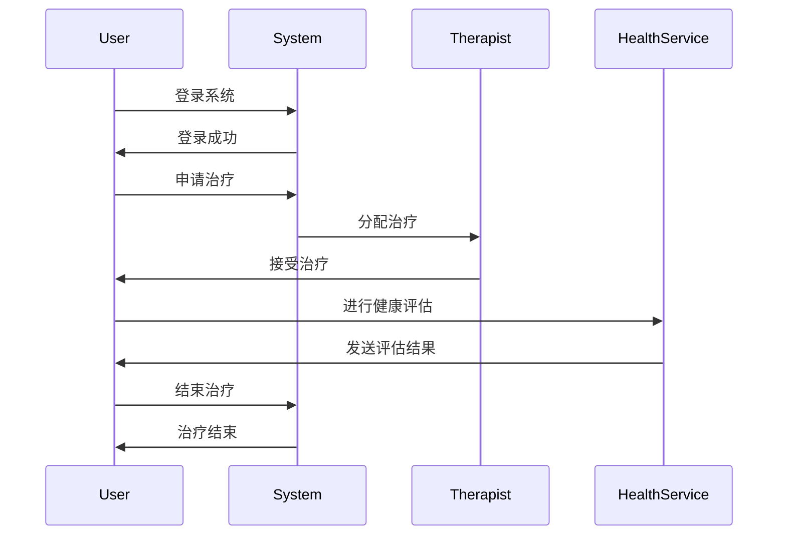
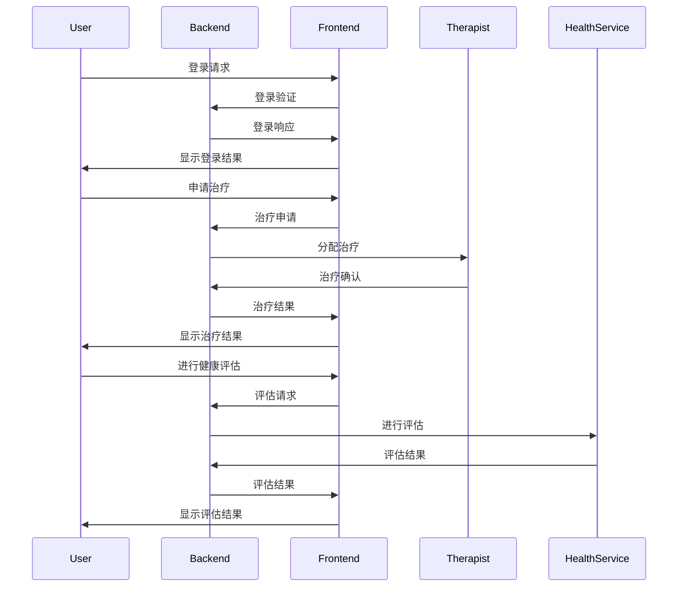

                 

### 从虚无到重建：探索现代人的精神之路

现代社会中，许多人在追求物质财富和社会地位的同时，常常感到内心空虚和迷茫。这种精神困境不仅影响了他们的生活质量，也对社会稳定构成威胁。因此，我们需要深入探讨如何从虚无中重建现代人的精神之路。

**关键词：** 现代人的精神困境、精神重建、心理健康

**摘要：** 本文旨在通过分析现代人面临的精神困境，探讨精神重建的理论基础和实践路径，以及重建过程中的挑战与机遇，旨在为现代人提供一条从虚无到重建的精神之路。

### 目录大纲

1. 第一部分：现代人的精神困境
   1.1 现代人的精神困境概述
   1.2 精神困境中的核心概念
   1.3 精神重建的理论基础

2. 第二部分：精神重建的实践路径
   2.1 生活习惯的调整
   2.2 心理干预与治疗
   2.3 社会支持的构建

3. 第三部分：精神重建中的挑战与机遇
   3.1 挑战与困境
   3.2 机遇与未来发展

4. 第四部分：精神重建的成功案例
   4.1 案例一：克服焦虑的职场人士
   4.2 案例二：重建自我价值的艺术家
   4.3 案例三：建立心理健康社区的项目

5. 第五部分：精神重建的社会责任
   5.1 社会责任与精神健康
   5.2 企业与精神健康
   5.3 个人与精神健康

6. 第六部分：小结与展望
   6.1 小结与反思
   6.2 展望与建议

### 第一部分：现代人的精神困境

#### 1.1 现代人的精神困境概述

随着社会的发展，现代人面临着越来越多的精神压力。这种压力不仅源于工作、生活上的压力，还源于自我认同、自我价值的困惑。许多人在追求物质财富和社会地位的过程中，逐渐失去了对生活的热情和方向。他们感到内心空虚，对未来充满了迷茫。

#### 1.1.1 现代社会与精神困境

现代社会是一个高度竞争的社会，人们为了追求更好的生活，不断地加班、学习、竞争。这种高强度的生活节奏导致了许多人的精神压力。同时，现代社会的信息爆炸，让人们不断地接受大量的信息，导致人们的精神负担加重。

#### 1.1.2 精神困境的成因

精神困境的成因复杂，主要包括以下几个方面：

1. **物质追求与精神需求的冲突：** 现代社会，人们追求物质财富的同时，忽略了精神需求的满足，导致内心空虚。
2. **自我认同的困惑：** 在追求社会地位的过程中，许多人失去了自我认同，不知道自己是谁，想要成为谁。
3. **工作压力：** 高强度的工作压力导致了许多人的精神崩溃，长期处于焦虑、抑郁的状态。
4. **社会压力：** 社会的竞争压力，让人们感到自己必须不断地进步，否则就会被淘汰，这种压力加剧了人们的精神困境。

#### 1.1.3 精神困境的影响

精神困境对现代人产生了深远的影响：

1. **身心健康：** 精神困境会导致许多身心疾病，如焦虑、抑郁、失眠等。
2. **人际关系：** 精神困境会影响人际关系，导致人际关系的疏离，孤立感加重。
3. **生活质量：** 精神困境会降低生活质量，使人们对生活失去兴趣，影响日常生活和工作。
4. **社会稳定：** 精神困境不仅影响个体，也会影响社会的稳定。如果大量人群陷入精神困境，可能会对社会产生负面影响。

#### 1.2 精神困境中的核心概念

在探讨精神困境时，我们需要了解一些核心概念，如内在需求、外在需求、自我认同、自我价值等。

#### 1.2.1 内在需求与外在需求

内在需求是指个体内在的、深层的需求，如安全感、自我实现等。外在需求是指个体通过外部环境获取的需求，如物质需求、社会地位等。

在现代社会，许多人追求外在需求，而忽略了内在需求的满足。这种失衡导致了精神困境。

#### 1.2.2 自我认同与自我价值

自我认同是指个体对自己的认同感和自我认知。自我价值是指个体对自己的价值评价和自我尊重。

在精神困境中，许多人失去了自我认同和自我价值。他们不知道自己是谁，不知道自己的价值，导致内心的空虚和迷茫。

#### 1.2.3 精神健康与心理障碍

精神健康是指个体心理状态处于良好状态，能够适应生活中的挑战和变化。心理障碍是指个体心理状态不正常，导致生活质量下降的障碍。

精神健康与心理障碍是精神困境的两个极端。精神健康是重建精神之路的基础，而心理障碍则是需要解决的问题。

#### 1.3 精神重建的理论基础

精神重建是指通过调整生活习惯、心理干预和社会支持等方式，帮助现代人恢复心理平衡和健康的过程。

精神重建的理论基础主要包括心理学基本理论、精神重建的原则与方法、精神重建的心理机制等。

心理学基本理论为我们提供了理解精神困境和精神重建的基础。精神重建的原则与方法指导我们如何进行有效的精神重建。精神重建的心理机制则解释了精神重建的过程和效果。

#### 1.3.1 心理学基本理论

心理学基本理论包括认知心理学、行为心理学、人本心理学等。这些理论为我们提供了理解人类心理和行为的基础。

1. **认知心理学：** 认知心理学关注人类的心理过程，如感知、记忆、思维等。它帮助我们理解人类如何处理信息和如何做出决策。
2. **行为心理学：** 行为心理学关注人类的行为，如习惯、学习等。它帮助我们理解人类行为的变化和塑造。
3. **人本心理学：** 人本心理学关注人类的内在需求和自我实现。它帮助我们理解人类追求幸福和满足的过程。

#### 1.3.2 精神重建的原则与方法

精神重建的原则包括：

1. **个体化原则：** 每个人的精神困境都是独特的，需要个性化的解决方案。
2. **积极原则：** 积极面对精神困境，寻求解决问题的方法。
3. **系统性原则：** 精神重建是一个系统性的过程，需要从多个方面进行干预。

精神重建的方法包括：

1. **心理干预：** 通过心理咨询、心理治疗等方式，帮助个体解决精神问题。
2. **生活习惯调整：** 通过调整生活习惯，如饮食、运动、睡眠等，改善个体的精神状态。
3. **社会支持：** 通过家庭、朋友、社区等社会支持系统，为个体提供帮助和支持。

#### 1.3.3 精神重建的心理机制

精神重建的心理机制包括：

1. **自我认知：** 通过自我认知，个体可以更清晰地了解自己，找到自己的需求和问题。
2. **情绪调节：** 通过情绪调节，个体可以更好地处理情绪，减少负面情绪的影响。
3. **行为改变：** 通过行为改变，个体可以改变不良的生活习惯，提高生活质量。

### 第二部分：精神重建的实践路径

#### 2.1 生活习惯的调整

生活习惯的调整是精神重建的重要一环。通过调整生活习惯，我们可以改善身心健康，提高生活质量。

#### 2.1.1 健康饮食

健康饮食是精神重建的基础。我们应该：

1. **均衡营养：** 营养均衡，确保身体得到足够的营养。
2. **减少加工食品：** 减少加工食品的摄入，避免过多的糖分和盐分。
3. **多吃水果和蔬菜：** 增加水果和蔬菜的摄入，提供丰富的维生素和矿物质。

#### 2.1.2 规律运动

规律运动有助于改善身心健康。我们应该：

1. **每天运动：** 每天进行适量的运动，如散步、跑步、游泳等。
2. **选择喜欢的运动：** 选择自己喜欢的运动，提高运动的乐趣。
3. **逐渐增加运动量：** 根据自己的身体状况，逐渐增加运动量。

#### 2.1.3 充足睡眠

充足睡眠是精神重建的重要保障。我们应该：

1. **保持规律的作息：** 保持规律的作息，建立良好的生物钟。
2. **避免熬夜：** 避免熬夜，保证充足的睡眠时间。
3. **改善睡眠环境：** 改善睡眠环境，提供一个安静、舒适的睡眠环境。

#### 2.2 心理干预与治疗

心理干预与治疗是解决精神困境的有效方法。通过心理干预与治疗，我们可以帮助个体恢复心理健康。

#### 2.2.1 心理咨询

心理咨询是一种常见的心理干预方法。通过心理咨询，个体可以：

1. **倾诉心声：** 倾诉内心的困扰，减轻心理压力。
2. **获得建议：** 获得专业的建议，找到解决问题的方法。
3. **自我认知：** 通过心理咨询，个体可以更清晰地了解自己，找到自己的需求和问题。

#### 2.2.2 心理治疗

心理治疗是一种针对精神障碍的治疗方法。通过心理治疗，个体可以：

1. **情绪调节：** 通过情绪调节，个体可以更好地处理情绪，减少负面情绪的影响。
2. **行为改变：** 通过行为改变，个体可以改变不良的生活习惯，提高生活质量。
3. **认知重建：** 通过认知重建，个体可以改变错误的认知，建立正确的自我认知。

#### 2.3 社会支持的构建

社会支持是精神重建的重要保障。通过构建社会支持系统，我们可以为个体提供帮助和支持。

#### 2.3.1 家庭支持

家庭支持是精神重建的重要基础。家庭应该：

1. **关心关爱：** 关心个体的心理健康，给予关爱和支持。
2. **倾听理解：** 倾听个体的心声，理解个体的困扰。
3. **提供帮助：** 在个体需要帮助时，提供实际的帮助。

#### 2.3.2 社会支持

社会支持系统包括社区、学校、工作单位等。这些支持系统应该：

1. **提供心理健康知识：** 提供心理健康知识，提高公众心理健康意识。
2. **提供心理咨询服务：** 提供专业的心理咨询服务，帮助个体解决心理问题。
3. **提供社交活动：** 提供丰富的社交活动，为个体提供社交机会，减轻孤独感。

### 第三部分：精神重建中的挑战与机遇

#### 3.1 挑战与困境

精神重建过程中，个体和社会都会面临一系列的挑战与困境。

#### 3.1.1 个体挑战与困境

1. **心理抵抗：** 个体可能会对精神重建产生抵抗，不愿改变现有的生活方式和思维方式。
2. **习惯改变困难：** 改变生活习惯需要付出努力，个体可能会感到困难和挫折。
3. **情绪波动：** 在精神重建过程中，个体可能会经历情绪波动，如焦虑、恐惧等。

#### 3.1.2 社会挑战与困境

1. **心理健康教育资源不足：** 许多地区心理健康教育资源不足，难以满足公众的需求。
2. **社会支持体系不完善：** 社会支持体系不完善，难以提供有效的帮助和支持。
3. **心理健康观念落后：** 许多人对心理健康观念落后，缺乏对心理健康的正确认识。

#### 3.2 机遇与未来发展

尽管精神重建过程中存在挑战与困境，但同时也存在机遇和未来发展。

#### 3.2.1 技术进步

随着技术的进步，我们可以利用人工智能、大数据等技术为精神重建提供支持。例如，通过心理测评工具，个体可以更准确地了解自己的心理状况，为精神重建提供依据。

#### 3.2.2 社会关注

随着社会对心理健康问题的关注增加，精神重建的社会支持体系将不断完善。政府、企业、社会组织等将更加重视心理健康问题，为精神重建提供更多的资源和支持。

#### 3.2.3 心理健康知识的普及

随着心理健康知识的普及，公众对心理健康的认识将不断提高。个体将更加关注自己的心理健康，主动寻求帮助和支持，积极参与精神重建。

### 第四部分：精神重建的成功案例

#### 4.1 案例一：克服焦虑的职场人士

一位年轻的职场人士，因为工作压力和人际关系问题，长期处于焦虑状态。他通过心理咨询和自我调整，逐渐克服了焦虑，重拾信心。

#### 4.1.1 案例背景

这位职场人士是一名互联网公司的产品经理，工作压力大，经常加班。由于工作原因，他需要与不同团队沟通，处理复杂的人际关系。这种高压环境导致他出现了严重的焦虑症状。

#### 4.1.2 解决方案

1. **心理咨询：** 他寻求心理咨询师的帮助，通过心理咨询，他了解了焦虑的原因，并学会了情绪调节的方法。
2. **自我调整：** 他调整了自己的工作方式，合理安排时间，避免长时间加班。他还参加了瑜伽和冥想课程，放松身心。
3. **人际沟通：** 他学习了人际沟通技巧，改善了与同事和上级的关系，减少了工作压力。

#### 4.1.3 结果

经过一段时间的努力，他的焦虑症状得到了缓解，工作效率和生活质量得到了显著提高。

#### 4.2 案例二：重建自我价值的艺术家

一位艺术家，因为长期不被认可，感到自我价值丧失。通过心理咨询和生活调整，他逐渐重建了自我价值，重拾创作热情。

#### 4.2.1 案例背景

这位艺术家是一位年轻的画家，他的作品具有独特的风格和创意。然而，由于艺术市场的竞争激烈，他的作品一直未能得到市场的认可。长期的不被认可让他感到自我价值丧失，逐渐失去了创作热情。

#### 4.2.2 解决方案

1. **心理咨询：** 他寻求心理咨询师的帮助，通过心理咨询，他了解了自我价值的重要性，并学会了自我肯定的方法。
2. **创作调整：** 他调整了自己的创作风格，寻找自己的独特之处。他参加了艺术展览，与同行业的人交流，得到了他们的认可和鼓励。
3. **生活调整：** 他改变了生活方式，注重身体健康，培养了自己的兴趣爱好。他还加入了艺术社区，与志同道合的人交流，找到了创作的灵感。

#### 4.2.3 结果

经过一段时间的努力，他的作品逐渐得到了市场的认可，他的创作热情得到了恢复。他的生活变得更加丰富多彩，自我价值也得到了重建。

#### 4.3 案例三：建立心理健康社区的项目

一个公益组织，通过建立心理健康社区，为心理健康问题者提供帮助和支持。该项目取得了显著成效，为心理健康问题的解决提供了新的思路。

#### 4.3.1 案例背景

该公益组织发现，许多心理健康问题者因为缺乏社会支持，无法得到有效的帮助。他们希望通过建立心理健康社区，为这些人提供支持和帮助。

#### 4.3.2 解决方案

1. **建立社区：** 公益组织建立了心理健康社区，提供了一个安全、开放的空间，让心理健康问题者可以自由表达自己的困扰。
2. **专业支持：** 社区邀请了专业的心理咨询师和志愿者，为心理健康问题者提供心理支持和咨询服务。
3. **社交活动：** 社区组织了各种社交活动，如兴趣小组、户外拓展等，帮助心理健康问题者建立社交关系，提高生活质量。

#### 4.3.3 结果

心理健康社区取得了显著成效，许多心理健康问题者得到了有效的帮助和支持。他们的心理健康状况得到了改善，生活质量得到了提高。同时，心理健康社区也为公众提供了心理健康知识，提高了公众对心理健康的认识。

### 第五部分：精神重建的社会责任

#### 5.1 社会责任与精神健康

精神健康是社会稳定和发展的基石。因此，每个社会成员都有责任关注和维护自己的精神健康。同时，企业、政府和非政府组织也应承担起社会责任，为精神健康提供支持和帮助。

#### 5.1.1 企业与精神健康

企业是社会经济的重要组成部分，企业的员工精神健康直接影响到企业的运营和发展。因此，企业应：

1. **提供心理健康支持：** 企业应为员工提供心理健康支持，如心理咨询、心理培训等。
2. **营造健康的工作环境：** 企业应营造健康的工作环境，减少工作压力，提高员工的幸福感。
3. **关注员工心理健康：** 企业应关注员工的心理健康，及时发现和解决员工的心理问题。

#### 5.1.2 政府与精神健康

政府是社会的主导力量，应承担起维护公众精神健康的责任。政府应：

1. **制定相关政策：** 政府应制定相关政策，支持心理健康事业的发展。
2. **提供心理健康服务：** 政府应提供心理健康服务，如心理咨询服务、心理治疗等。
3. **推广心理健康知识：** 政府应推广心理健康知识，提高公众对心理健康的认识。

#### 5.1.3 非政府组织与精神健康

非政府组织在精神健康事业中发挥着重要作用。他们应：

1. **开展心理健康公益活动：** 非政府组织应开展心理健康公益活动，提高公众对心理健康的认识。
2. **提供心理健康支持：** 非政府组织应为心理健康问题者提供支持，帮助他们恢复心理健康。
3. **促进心理健康事业发展：** 非政府组织应促进心理健康事业的发展，为心理健康问题者提供更多的帮助。

### 第六部分：小结与展望

#### 6.1 小结与反思

通过本文的探讨，我们可以看出，现代人面临着严重的的精神困境。这种困境不仅影响了个体的生活质量，也对社会稳定构成威胁。精神重建是解决这一问题的关键。我们需要从生活习惯的调整、心理干预与社会支持等多方面进行努力，帮助现代人重建精神健康。

#### 6.1.1 小结

1. 现代人的精神困境源于物质追求与精神需求的失衡、自我认同的困惑、工作压力等。
2. 精神重建需要从生活习惯的调整、心理干预与社会支持等多方面进行。
3. 企业、政府和非政府组织都有责任关注和维护公众的精神健康。

#### 6.1.2 反思

1. 我们需要更加重视心理健康问题，提高公众对心理健康的认识。
2. 我们需要加强心理健康教育，提高个体的心理健康水平。
3. 我们需要完善心理健康服务体系，为心理健康问题者提供有效的帮助和支持。

#### 6.2 展望与建议

展望未来，我们可以期待技术在精神健康领域的更多应用，如人工智能、大数据等。这些技术将为精神健康问题提供更准确、更有效的解决方案。同时，我们也需要加强社会支持系统，为心理健康问题者提供更多的帮助和支持。

**建议：**

1. **加强心理健康教育：** 在学校、家庭、社会等多方面加强心理健康教育，提高公众对心理健康的认识。
2. **完善心理健康服务体系：** 政府和非政府组织应共同努力，完善心理健康服务体系，为心理健康问题者提供有效的帮助和支持。
3. **推广心理健康知识：** 利用媒体、网络等渠道，推广心理健康知识，提高公众对心理健康的认识。
4. **关注特殊群体：** 关注心理健康问题特殊群体，如老年人、儿童、残疾人等，为他们提供针对性的心理健康服务。

### 附录：核心概念与联系

| 核心概念 | 定义 | 关联概念 |
| ------ | ------ | ------ |
| 精神困境 | 现代人在生活中面临的内心冲突和困扰 | 内在需求、外在需求、自我认同、自我价值、精神健康 |
| 精神重建 | 指通过调整生活习惯、心理干预和社会支持等方式，帮助现代人恢复心理平衡和健康的过程 | 心理学基本理论、心理干预与治疗、生活习惯的调整、社会支持的构建 |
| 内在需求 | 个体内在的、深层的需求，如安全感、自我实现等 | 外在需求、自我认同、自我价值 |
| 外在需求 | 个体通过外部环境获取的需求，如物质需求、社会地位等 | 内在需求、自我认同、自我价值 |
| 自我认同 | 个体对自己的认同感和自我认知 | 自我价值、精神健康、心理障碍 |
| 自我价值 | 个体对自己的价值评价和自我尊重 | 自我认同、精神健康、心理障碍 |
| 精神健康 | 个体心理状态处于良好状态，能够适应生活中的挑战和变化 | 精神困境、心理障碍、心理干预与治疗 |
| 心理障碍 | 个体心理状态不正常，导致生活质量下降的障碍 | 精神困境、精神健康、心理干预与治疗 |

### 数学模型和数学公式

为了更深入地理解精神困境与心理障碍之间的关系，我们可以使用数学模型进行量化分析。以下是一个简化的数学模型：

$$
心理障碍程度 = f(精神困境程度, 自我认同程度, 自我价值程度)
$$

$$
f(x, y, z) = (1 - \frac{x}{10}) \times (1 - \frac{y}{10}) \times (1 - \frac{z}{10})
$$

其中，$x$、$y$、$z$ 分别表示精神困境程度、自我认同程度、自我价值程度，取值范围均为 $0$ 到 $10$。$f(x, y, z)$ 表示心理障碍程度。

### 系统分析与架构设计方案

**问题场景介绍**

现代人面临着各种精神困境，包括焦虑、抑郁、压力过大等。这些问题不仅影响个人的生活质量，还会影响到社会稳定。因此，我们需要一套系统的方法来分析和解决这些精神问题。

**项目介绍**

本项目旨在通过心理干预、生活习惯调整和社会支持等多种方式，帮助现代人重建精神健康。项目的主要目标是：

1. 提高个体的心理健康水平。
2. 减轻精神困境对个体和社会的影响。
3. 推广心理健康知识，提高公众心理健康意识。

**系统功能设计（领域模型Mermaid类图）**

```mermaid
classDiagram
Person <<-- Therapist
Person <<-- HealthService
Therapist --|> Treatment
HealthService --|> Assessment
Class1[value:Integer] <<-- Class2[field:Integer]
Class1 <|-- Class3[field:Integer]
Class2 <|-- Class3[field:Integer]
Class1 <<-- Class3

Class Person {
  +name: string
  +age: int
  +gender: string
}

Class Therapist {
  +name: string
  +experience: int
}

Class HealthService {
  +name: string
  +serviceType: string
}

Class Treatment {
  +treatmentID: int
  +startDate: date
  +endDate: date
  +treatmentType: string
}

Class Assessment {
  +assessmentID: int
  +assessmentDate: date
  +assessmentResult: string
}
```

**系统架构设计（Mermaid架构图）**



**系统接口设计和系统交互（Mermaid序列图）**



### 项目实战

**环境安装**

1. 安装Python环境，版本建议为3.8及以上。
2. 安装依赖库，如Flask、SQLAlchemy、Flask-Migrate等。

```bash
pip install Flask SQLAlchemy Flask-Migrate
```

**系统核心实现源代码**

以下是一个简单的心理健康评估系统的实现：

```python
from flask import Flask, request, jsonify
from models import User, Treatment, Assessment
from database import init_db

app = Flask(__name__)
init_db()

@app.route('/login', methods=['POST'])
def login():
    username = request.form['username']
    password = request.form['password']
    user = User.query.filter_by(name=username, password=password).first()
    if user:
        return jsonify({'status': 'success', 'user_id': user.id})
    else:
        return jsonify({'status': 'failure'})

@app.route('/apply_treatment', methods=['POST'])
def apply_treatment():
    user_id = request.form['user_id']
    treatment_type = request.form['treatment_type']
    treatment = Treatment(user_id=user_id, treatment_type=treatment_type)
    db.session.add(treatment)
    db.session.commit()
    return jsonify({'status': 'success', 'treatment_id': treatment.id})

@app.route('/health_assessment', methods=['POST'])
def health_assessment():
    user_id = request.form['user_id']
    assessment_result = request.form['assessment_result']
    assessment = Assessment(user_id=user_id, assessment_result=assessment_result)
    db.session.add(assessment)
    db.session.commit()
    return jsonify({'status': 'success'})

if __name__ == '__main__':
    app.run(debug=True)
```

**代码应用解读与分析**

这段代码实现了一个简单的心理健康评估系统，包括用户登录、申请治疗和健康评估等功能。用户登录后，可以申请治疗，并在治疗结束后进行健康评估。

**实际案例分析和详细讲解剖析**

假设有一个用户，他因为工作压力导致焦虑，他想通过这个系统申请治疗并完成健康评估。

1. 用户在登录时，发送用户名和密码到/login接口，系统验证用户信息后返回用户ID。
2. 用户通过用户ID，向/apply_treatment接口发送申请治疗的请求，包括用户ID和治疗类型。系统将治疗信息保存到数据库，并返回治疗ID。
3. 治疗结束后，用户向/health_assessment接口发送健康评估结果。系统将评估结果保存到数据库。

通过这个实际案例，我们可以看到系统的具体应用过程。每个接口都有明确的输入和输出，系统通过数据库保存和查询数据，实现了用户、治疗和评估的关联。

**项目小结**

这个简单的心理健康评估系统实现了用户登录、申请治疗和健康评估等功能。虽然这个系统很简单，但它为心理健康问题提供了一个基本的解决方案。在实际应用中，我们可以根据需求扩展系统的功能，如增加用户管理、治疗进度跟踪等。

### 最佳实践 Tips

1. **定期自我评估：** 定期进行心理健康自我评估，了解自己的精神状态，及时发现问题。
2. **建立支持系统：** 建立家庭、朋友、同事等支持系统，遇到困难时寻求帮助。
3. **保持健康生活方式：** 保持健康饮食、规律运动和充足睡眠，提高身体素质和精神状态。

### 注意事项

1. **隐私保护：** 在设计和实施心理健康项目时，要特别注意保护用户的隐私。
2. **专业支持：** 在进行心理干预和治疗时，应寻求专业的心理咨询师或心理医生的帮助。

### 拓展阅读

1. **《心理学与生活》**：理查德·吉尔伯特著，全面介绍心理学的基本概念和应用。
2. **《精神障碍的诊断与治疗》**：约翰·M·奥里恩著，详细介绍精神障碍的诊断与治疗。
3. **《正念：一条通往平和与幸福的道路》**：乔·卡巴金著，介绍正念练习对心理健康的好处。

