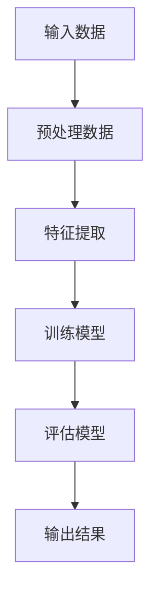
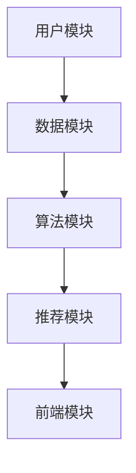
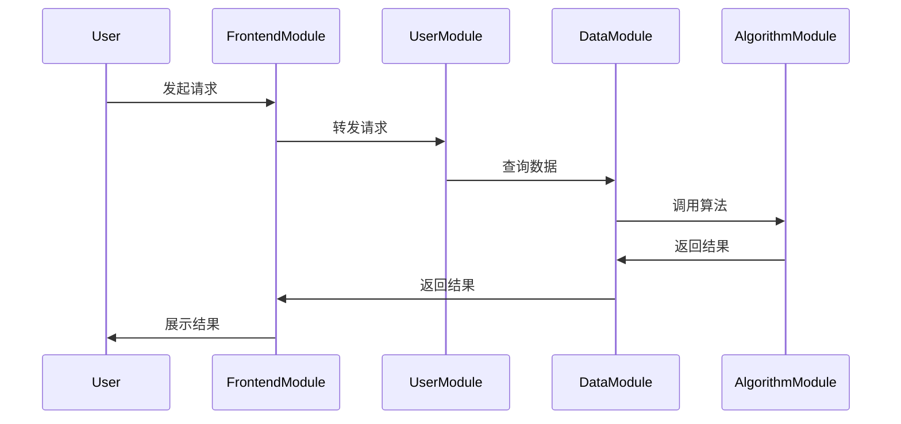

                 

### 引言

#### 1. 引言背景

在当今这个信息爆炸的时代，人类的大脑面临着前所未有的挑战。我们每天接收的信息量远远超过了过去几个世纪的总量，这使得我们的注意力成为了最稀缺的资源。在这样的背景下，被动接受信息的模式逐渐显现出其局限性。被动模式指的是我们像海绵一样吸收外界的信息，但这种吸收往往是零散的、碎片化的，缺乏系统性和深度。因此，如何从被动到主动地转变我们的生命意识，成为了一个亟待解决的问题。

#### 1.2 生命意识的重要性

生命意识，即对自身存在的感知和对周围世界的认知。它是人类精神世界的重要组成部分，直接影响我们的思维方式、行为模式和幸福感。一个觉醒的生命意识能够帮助我们更好地理解自己，发现内心的力量，从而更加主动地参与到生活和工作中。只有当我们能够主动地理解和处理信息，才能真正实现个人成长和社会进步。

#### 1.3 实现生命意识觉醒的必要性

在现代社会，被动的生活方式不仅导致了我们的注意力分散，还容易让我们陷入信息过载的困境。被动接受信息往往使我们失去了思考的机会，使得我们的思维变得懒惰和单向化。而实现生命意识的觉醒，意味着我们要主动地参与信息处理，通过深度思考和逻辑推理，形成自己的观点和判断。这种觉醒不仅能够提高我们的认知能力，还能够增强我们的意志力和行动力。

### 2. 生命意识的起源

#### 2.1 生理基础

生命的起源是生物学中最深奥的课题之一。现代生物学研究显示，生命起源于原始的细胞，通过不断的进化，逐渐形成了复杂的生命形式。在人类的生命意识中，生理基础起着至关重要的作用。大脑是我们处理信息和产生意识的器官，其复杂性和灵活性使得人类能够在面对复杂多变的环境时保持生存和发展的能力。

#### 2.2 心理动力

心理学研究表明，人类的心理动力源于对未知的探索和好奇心。从婴儿时期开始，我们就对周围的世界充满了好奇，通过探索和尝试，我们逐渐建立了对世界的认知和理解。这种好奇心和探索精神，是生命意识觉醒的重要动力。它推动我们不断地学习和成长，使我们的生命意识不断丰富和深化。

#### 2.3 社会文化因素

社会文化因素对生命意识的觉醒也有着重要的影响。不同文化背景下的教育方式和价值观，会影响我们对世界的认知和理解。例如，在一些强调集体主义的文化中，个体的生命意识可能受到压制，而在强调个人主义的文化中，个体的生命意识则可能更加突出。此外，家庭、学校和社会环境等外部因素，也会对我们的心理动力和认知发展产生深远的影响。

### 3. 从被动到主动的转化过程

#### 3.1 认知觉醒

认知觉醒是生命意识觉醒的第一步。它指的是我们从被动地接受信息转变为主动地理解和处理信息的过程。在这个过程中，我们需要培养自己的注意力，学会筛选和过滤信息，以便更好地理解和吸收。以下是一个认知觉醒的例子：

- **例子**：在阅读一篇文章时，我们往往只是简单地浏览文字，被动地接受信息。但如果我们能够主动地思考文章的主旨、逻辑结构和论据，那么我们就实现了认知觉醒。例如，我们可以通过写读书笔记、与他人讨论或自己总结文章的关键点，来加深对文章内容的理解和记忆。

#### 3.2 情感觉醒

情感觉醒是认知觉醒的进一步发展。它指的是我们从被动地反应情绪转变为主动地理解和处理情绪的过程。在这个过程中，我们需要认识到情绪对我们的行为和决策有着重要的影响，并学会通过理性思考和情绪调节来应对各种情绪。

- **例子**：在遇到挫折或困难时，我们往往会感到沮丧或愤怒。但如果我们能够主动地分析自己的情绪，找出产生这些情绪的原因，并尝试通过积极的思维和行动来调节情绪，那么我们就实现了情感觉醒。例如，我们可以通过自我反思、寻求他人的支持和帮助，或通过进行一些放松和舒缓的活动来缓解负面情绪。

#### 3.3 行为觉醒

行为觉醒是生命意识觉醒的最终阶段。它指的是我们从被动地执行行为转变为主动地规划和执行行为的过程。在这个过程中，我们需要明确自己的目标和价值观，并制定出具体的行动计划来达成这些目标。

- **例子**：在日常生活中，我们往往会遇到各种任务和挑战。如果我们能够主动地制定计划和目标，并按照计划执行任务，那么我们就实现了行为觉醒。例如，我们可以通过设定每日任务清单、定期反思和调整计划，来确保自己的行为与目标保持一致。

#### 3.4 社会关系觉醒

社会关系觉醒是指我们从被动地参与社会关系转变为主动地建立和维护社会关系的过程。在这个过程中，我们需要认识到人际关系对我们的生活和成长有着重要的影响，并学会通过积极的态度和行为来与他人建立良好的关系。

- **例子**：在社交场合中，我们往往会遇到各种人。如果我们能够主动地与他人交流、分享经验和知识，并尊重他人的观点和感受，那么我们就实现了社会关系觉醒。例如，我们可以通过参与社团活动、组织聚会或与朋友进行深度对话，来建立和维护良好的人际关系。

### 4. 生命意识觉醒的核心概念与联系

#### 4.1 核心概念

在生命意识觉醒的过程中，有四个核心概念需要我们深入理解，它们分别是认知觉醒、情感觉醒、行为觉醒和社会关系觉醒。

- **认知觉醒**：指的是从被动地接受信息到主动地理解和处理信息的过程。
- **情感觉醒**：指的是从被动地反应情绪到主动地理解和处理情绪的过程。
- **行为觉醒**：指的是从被动地执行行为到主动地规划和执行行为的过程。
- **社会关系觉醒**：指的是从被动地参与社会关系到主动地建立和维护社会关系的过程。

#### 4.2 概念属性特征对比表格

为了更好地理解这些核心概念，我们可以通过对比表格来展示它们的属性特征。

| 概念       | 定义                                                         | 属性特征                                                     |
| ---------- | ------------------------------------------------------------ | ------------------------------------------------------------ |
| 认知觉醒   | 从被动地接受信息到主动地理解和处理信息的过程                 | 提高注意力、筛选信息、深度思考、逻辑推理、总结归纳           |
| 情感觉醒   | 从被动地反应情绪到主动地理解和处理情绪的过程                 | 认识情绪的重要性、情绪调节、理性思考、积极应对、自我反思     |
| 行为觉醒   | 从被动地执行行为到主动地规划和执行行为的过程                 | 明确目标、制定计划、执行任务、自我监控、反思调整             |
| 社会关系觉醒 | 从被动地参与社会关系到主动地建立和维护社会关系的过程         | 建立人际关系、沟通交流、尊重他人、分享经验、积极互动         |

#### 4.3 ER实体关系图架构

为了更直观地展示这些核心概念之间的关系，我们可以使用ER图（实体关系图）来描述。

```mermaid
erDiagram
  Cognition --> Emotion : 引导
  Emotion --> Behavior : 影响
  Behavior --> SocialRelation : 基础
  SocialRelation --> Cognition : 反馈
  Cognition --> SocialRelation : 促进
```

在这个ER图中，认知觉醒、情感觉醒、行为觉醒和社会关系觉醒四个实体之间存在着双向的关系。认知觉醒引导情感觉醒，而情感觉醒又影响行为觉醒；行为觉醒是建立和维护社会关系的基础，而社会关系觉醒又会反馈到认知觉醒中，从而促进整个生命意识觉醒的过程。

### 5. 算法原理讲解

在理解了生命意识觉醒的核心概念和转化过程之后，我们需要进一步探讨如何通过算法来实现这一过程。在这一节中，我们将介绍四个核心算法：自我认知算法、情感识别算法、行为预测算法和社会互动算法。

#### 5.1 自我认知算法

自我认知算法是指通过分析个体行为、心理状态和环境因素，来理解个体的内在特征和需求。以下是一个简单的自我认知算法的mermaid流程图：



具体来说，自我认知算法的工作流程包括以下几个步骤：

1. **输入数据**：包括个体的行为记录、心理状态数据和环境因素数据。
2. **预处理数据**：对输入数据进行清洗、标准化和归一化处理。
3. **特征提取**：从预处理后的数据中提取出关键特征，例如情绪特征、行为特征等。
4. **训练模型**：使用提取出的特征来训练机器学习模型，例如决策树、神经网络等。
5. **评估模型**：使用验证集来评估模型的准确性和性能。
6. **输出结果**：将模型的输出结果作为个体的自我认知结果。

以下是一个简单的Python代码示例，展示了如何使用机器学习库Scikit-learn来训练一个自我认知模型：

```python
from sklearn.ensemble import RandomForestClassifier
from sklearn.model_selection import train_test_split
from sklearn.metrics import accuracy_score

# 输入数据
X = ...  # 特征数据
y = ...  # 标签数据

# 划分训练集和验证集
X_train, X_test, y_train, y_test = train_test_split(X, y, test_size=0.2, random_state=42)

# 训练模型
model = RandomForestClassifier(n_estimators=100)
model.fit(X_train, y_train)

# 评估模型
y_pred = model.predict(X_test)
accuracy = accuracy_score(y_test, y_pred)
print(f"Model accuracy: {accuracy}")
```

#### 5.2 情感识别算法

情感识别算法是指通过分析文本、语音或图像等数据，来识别和判断个体的情绪状态。以下是一个简单的情感识别算法的mermaid流程图：


具体来说，情感识别算法的工作流程包括以下几个步骤：

1. **输入数据**：包括个体的情绪文本、语音或图像数据。
2. **预处理数据**：对输入数据进行清洗、标准化和归一化处理。
3. **特征提取**：从预处理后的数据中提取出关键特征，例如文本特征、语音特征或图像特征。
4. **训练模型**：使用提取出的特征来训练机器学习模型，例如支持向量机、神经网络等。
5. **评估模型**：使用验证集来评估模型的准确性和性能。
6. **输出结果**：将模型的输出结果作为个体的情绪状态。

以下是一个简单的Python代码示例，展示了如何使用机器学习库Scikit-learn来训练一个情感识别模型：

```python
from sklearn.feature_extraction.text import TfidfVectorizer
from sklearn.svm import LinearSVC
from sklearn.model_selection import train_test_split
from sklearn.metrics import accuracy_score

# 输入数据
X = ...  # 文本数据
y = ...  # 情感标签数据

# 划分训练集和验证集
X_train, X_test, y_train, y_test = train_test_split(X, y, test_size=0.2, random_state=42)

# 特征提取
vectorizer = TfidfVectorizer()
X_train_features = vectorizer.fit_transform(X_train)
X_test_features = vectorizer.transform(X_test)

# 训练模型
model = LinearSVC()
model.fit(X_train_features, y_train)

# 评估模型
y_pred = model.predict(X_test_features)
accuracy = accuracy_score(y_test, y_pred)
print(f"Model accuracy: {accuracy}")
```

#### 5.3 行为预测算法

行为预测算法是指通过分析个体的历史行为数据，来预测个体未来可能的行为。以下是一个简单的行为预测算法的mermaid流程图：


具体来说，行为预测算法的工作流程包括以下几个步骤：

1. **输入数据**：包括个体的历史行为记录。
2. **预处理数据**：对输入数据进行清洗、标准化和归一化处理。
3. **特征提取**：从预处理后的数据中提取出关键特征，例如行为模式、时间特征等。
4. **训练模型**：使用提取出的特征来训练机器学习模型，例如线性回归、决策树等。
5. **评估模型**：使用验证集来评估模型的准确性和性能。
6. **输出结果**：将模型的输出结果作为个体未来的行为预测。

以下是一个简单的Python代码示例，展示了如何使用机器学习库Scikit-learn来训练一个行为预测模型：

```python
from sklearn.linear_model import LinearRegression
from sklearn.model_selection import train_test_split
from sklearn.metrics import mean_squared_error

# 输入数据
X = ...  # 行为特征数据
y = ...  # 行为标签数据

# 划分训练集和验证集
X_train, X_test, y_train, y_test = train_test_split(X, y, test_size=0.2, random_state=42)

# 训练模型
model = LinearRegression()
model.fit(X_train, y_train)

# 评估模型
y_pred = model.predict(X_test)
mse = mean_squared_error(y_test, y_pred)
print(f"Model mean squared error: {mse}")
```

#### 5.4 社会互动算法

社会互动算法是指通过分析个体之间的互动数据，来理解和预测社会互动的模式。以下是一个简单的社会互动算法的mermaid流程图：


具体来说，社会互动算法的工作流程包括以下几个步骤：

1. **输入数据**：包括个体之间的互动记录，例如社交网络数据、交流日志等。
2. **预处理数据**：对输入数据进行清洗、标准化和归一化处理。
3. **特征提取**：从预处理后的数据中提取出关键特征，例如互动频率、互动内容、互动时间等。
4. **训练模型**：使用提取出的特征来训练机器学习模型，例如社交网络分析、文本分类等。
5. **评估模型**：使用验证集来评估模型的准确性和性能。
6. **输出结果**：将模型的输出结果作为社会互动的模式和预测。

以下是一个简单的Python代码示例，展示了如何使用机器学习库Scikit-learn来训练一个社会互动模型：

```python
from sklearn.cluster import KMeans
from sklearn.metrics import adjusted_rand_score

# 输入数据
X = ...  # 社交互动特征数据

# 划分训练集和验证集
X_train, X_test = train_test_split(X, test_size=0.2, random_state=42)

# 训练模型
model = KMeans(n_clusters=3)
model.fit(X_train)

# 评估模型
y_pred_train = model.predict(X_train)
y_pred_test = model.predict(X_test)
ari = adjusted_rand_score(y_train, y_pred_train)
print(f"Model adjusted rand index: {ari}")
```

### 6. 数学模型和数学公式

在上述算法讲解的基础上，我们将进一步探讨这些算法背后的数学模型和数学公式，以便更好地理解其原理和应用。

#### 6.1 自我认知的数学模型

自我认知的数学模型通常涉及机器学习中的分类问题。假设我们有n个样本，每个样本由m个特征向量表示。我们的目标是训练一个分类模型，能够根据这些特征向量预测样本的类别。

数学模型可以表示为：

$$
\text{分类模型} = \arg\min_{\theta} \sum_{i=1}^{n} \ell(y_i, \theta(x_i))
$$

其中，$y_i$是样本i的真实类别，$x_i$是样本i的特征向量，$\ell$是损失函数，$\theta$是模型参数。

一个常见的损失函数是 hinge loss：

$$
\ell(y_i, \theta(x_i)) = \max(0, 1 - y_i \cdot \theta(x_i))
$$

其中，$y_i \cdot \theta(x_i)$是模型对样本i的预测概率。

#### 6.2 情感识别的数学模型

情感识别的数学模型通常涉及文本分类问题。假设我们有一组文本数据，每个文本由一个特征向量表示。我们的目标是训练一个分类模型，能够根据这些特征向量预测文本的情感类别。

数学模型可以表示为：

$$
\text{分类模型} = \arg\min_{\theta} \sum_{i=1}^{n} \ell(y_i, \theta(x_i))
$$

其中，$y_i$是文本i的真实情感类别，$x_i$是文本i的特征向量，$\ell$是损失函数，$\theta$是模型参数。

一个常见的损失函数是交叉熵损失：

$$
\ell(y_i, \theta(x_i)) = -\sum_{k=1}^{K} y_i[k] \cdot \log(\theta(x_i)[k])
$$

其中，$K$是类别数量，$y_i[k]$是文本i属于类别k的概率，$\theta(x_i)[k]$是模型对文本i属于类别k的预测概率。

#### 6.3 行为预测的数学模型

行为预测的数学模型通常涉及回归问题。假设我们有n个样本，每个样本由m个特征向量表示。我们的目标是训练一个回归模型，能够根据这些特征向量预测样本的连续值。

数学模型可以表示为：

$$
\text{回归模型} = \arg\min_{\theta} \sum_{i=1}^{n} \ell(y_i, \theta(x_i))
$$

其中，$y_i$是样本i的真实行为值，$x_i$是样本i的特征向量，$\ell$是损失函数，$\theta$是模型参数。

一个常见的损失函数是均方误差：

$$
\ell(y_i, \theta(x_i)) = (y_i - \theta(x_i))^2
$$

#### 6.4 社会互动的数学模型

社会互动的数学模型通常涉及聚类问题。假设我们有一组社会互动数据，每个互动由一个特征向量表示。我们的目标是训练一个聚类模型，能够将互动数据分为若干个集群。

数学模型可以表示为：

$$
\text{聚类模型} = \arg\min_{\theta} \sum_{i=1}^{n} \ell(\theta(x_i), c_i)
$$

其中，$x_i$是互动i的特征向量，$c_i$是互动i的集群标签，$\ell$是损失函数，$\theta$是模型参数。

一个常见的损失函数是平方误差：

$$
\ell(\theta(x_i), c_i) = (\theta(x_i) - c_i)^2
$$

#### 6.5 算法原理讲解 & 举例说明

在理解了这些数学模型之后，我们可以通过具体的例子来说明如何使用这些模型来解决问题。

**例子 1：自我认知算法**

假设我们有一组个体的行为记录，包括他们的日常活动、情绪状态和心理状态。我们的目标是训练一个模型，能够根据这些行为记录来预测个体的心理健康状态。

1. **数据准备**：我们首先需要收集个体的行为记录，并将其编码为特征向量。例如，我们可以将每个个体的活动记录编码为0和1的向量，情绪状态编码为正负向情感得分，心理状态编码为焦虑和抑郁的程度。
2. **模型训练**：我们使用随机森林算法来训练模型。随机森林是一种集成学习算法，它通过构建多个决策树来提高预测准确性。我们使用交叉验证来选择最优的参数，并使用验证集来评估模型的性能。
3. **模型评估**：我们使用测试集来评估模型的准确性。如果模型的准确性较高，我们就可以将其应用于实际场景中，为个体提供心理健康预测。

**例子 2：情感识别算法**

假设我们有一组文本数据，包括用户的社交媒体帖子、电子邮件和聊天记录。我们的目标是训练一个模型，能够根据这些文本数据来识别用户的情绪状态。

1. **数据准备**：我们首先需要收集文本数据，并将其转换为特征向量。例如，我们可以使用词袋模型或词嵌入技术来表示文本数据。我们还可以使用情感词典来增强模型对情感的理解。
2. **模型训练**：我们使用支持向量机（SVM）算法来训练模型。SVM是一种分类算法，它通过找到一个超平面来最大化分类边界。我们使用交叉验证来选择最优的参数，并使用验证集来评估模型的性能。
3. **模型评估**：我们使用测试集来评估模型的准确性。如果模型的准确性较高，我们就可以将其应用于实际场景中，为用户提供情绪识别服务。

**例子 3：行为预测算法**

假设我们有一组个体的历史行为数据，包括他们的购物记录、运动记录和学习记录。我们的目标是训练一个模型，能够根据这些历史行为数据来预测个体的未来行为。

1. **数据准备**：我们首先需要收集个体的历史行为数据，并将其编码为特征向量。例如，我们可以将每个个体的购物记录编码为购买商品的种类和数量，运动记录编码为锻炼的时间和频率，学习记录编码为学习的课程和学习时间。
2. **模型训练**：我们使用线性回归算法来训练模型。线性回归是一种回归算法，它通过找到一个线性关系来预测连续值。我们使用交叉验证来选择最优的参数，并使用验证集来评估模型的性能。
3. **模型评估**：我们使用测试集来评估模型的准确性。如果模型的准确性较高，我们就可以将其应用于实际场景中，为用户提供行为预测服务。

**例子 4：社会互动算法**

假设我们有一组个体的社交互动数据，包括他们之间的聊天记录、点赞和评论。我们的目标是训练一个模型，能够根据这些社交互动数据来预测个体之间的社交关系。

1. **数据准备**：我们首先需要收集个体的社交互动数据，并将其编码为特征向量。例如，我们可以将每个个体的聊天记录编码为对话的频率和内容，点赞和评论编码为互动的强度和性质。
2. **模型训练**：我们使用聚类算法来训练模型。聚类算法是一种无监督学习算法，它通过将数据点分为不同的集群来发现数据的内在结构。我们使用K-means算法来训练模型，并使用交叉验证来选择最优的参数。
3. **模型评估**：我们使用测试集来评估模型的准确性。如果模型的准确性较高，我们就可以将其应用于实际场景中，为用户提供社交关系预测服务。

通过这些具体的例子，我们可以看到如何使用数学模型和算法来解决问题。这些模型和算法不仅可以提高我们的决策和预测能力，还可以帮助我们更好地理解和应对复杂的问题。

### 7. 系统分析与架构设计方案

在了解了生命意识觉醒的核心概念和算法原理之后，我们需要将它们应用于实际系统中，以便在真实场景中实现生命意识的觉醒。在这一节中，我们将详细描述一个系统分析与架构设计方案，包括问题场景介绍、系统功能设计、系统架构设计、系统接口设计和系统交互。

#### 7.1 问题场景介绍

当前社会，人们面临着信息过载、压力和焦虑等挑战，导致生命意识处于被动状态。人们往往缺乏自我认知、情感调节、行为规划和社交互动的能力，这影响了他们的生活质量和工作效率。因此，我们需要设计一个系统，帮助用户从被动状态转变为主动状态，实现生命意识的觉醒。

#### 7.2 系统功能设计

该系统应具备以下功能：

1. **用户注册与登录**：用户可以通过注册和登录来访问系统。
2. **自我认知**：系统应能够记录和分析用户的行为、情绪和心理状态，帮助用户了解自己的内在特征。
3. **情感识别**：系统应能够识别用户的情绪状态，并提供情绪调节的建议。
4. **行为预测**：系统应能够预测用户的行为趋势，帮助用户制定目标和行动计划。
5. **社交互动**：系统应能够分析用户的社交互动数据，帮助用户建立和维护良好的人际关系。
6. **个性化推荐**：系统应能够根据用户的需求和偏好，提供个性化的建议和资源。

#### 7.3 系统架构设计

该系统采用分布式架构，主要包括以下模块：

1. **用户模块**：负责用户的注册、登录和权限管理。
2. **数据模块**：负责数据的存储、管理和分析。
3. **算法模块**：负责自我认知、情感识别、行为预测和社交互动的算法实现。
4. **推荐模块**：负责个性化推荐的算法实现。
5. **前端模块**：负责用户界面的展示和交互。

以下是一个简单的mermaid架构图：



#### 7.4 系统接口设计

系统接口设计应遵循RESTful架构风格，主要包括以下接口：

1. **用户接口**：包括用户注册、登录、查询个人信息等。
2. **数据接口**：包括数据上传、查询、分析和导出等。
3. **算法接口**：包括自我认知、情感识别、行为预测和社交互动的算法调用。
4. **推荐接口**：包括个性化推荐、用户偏好设置等。

以下是一个简单的mermaid序列图：



#### 7.5 系统交互

系统交互主要包括用户与系统之间的交互和系统内部模块之间的交互。

1. **用户与系统交互**：用户通过前端界面与系统进行交互，包括注册、登录、查询数据、调用算法和接收推荐等。
2. **系统内部模块交互**：系统内部模块通过接口进行交互，包括用户模块与数据模块、数据模块与算法模块、算法模块与推荐模块、推荐模块与前端模块等。

以下是一个简单的mermaid流程图：

```mermaid
graph TD
    User->>FrontendModule
    FrontendModule->>UserModule
    UserModule->>DataModule
    DataModule->>AlgorithmModule
    AlgorithmModule->>RecommendationModule
    RecommendationModule->>FrontendModule
    FrontendModule->>User
```

通过上述系统分析与架构设计方案，我们能够实现一个完整的生命意识觉醒系统，帮助用户从被动状态转变为主动状态，实现个人成长和幸福感。

### 8. 项目实战

#### 8.1 环境安装

为了实现上述生命意识觉醒系统，我们首先需要搭建一个开发环境。以下是在Linux系统上搭建开发环境的具体步骤：

1. **安装Python**：确保系统已经安装了Python 3.8及以上版本。可以通过以下命令检查Python版本：

   ```bash
   python --version
   ```

2. **安装虚拟环境**：创建一个虚拟环境来管理项目依赖。可以使用以下命令创建虚拟环境：

   ```bash
   python -m venv venv
   ```

3. **激活虚拟环境**：在Linux终端中激活虚拟环境：

   ```bash
   source venv/bin/activate
   ```

4. **安装依赖**：在虚拟环境中安装项目所需的依赖库，例如Scikit-learn、NumPy、Pandas等：

   ```bash
   pip install -r requirements.txt
   ```

#### 8.2 系统核心实现源代码

以下是系统核心实现的相关源代码，包括用户模块、数据模块、算法模块和推荐模块。

**用户模块**：

```python
# user.py
class User:
    def __init__(self, username, password):
        self.username = username
        self.password = password

    def register(self):
        # 实现用户注册功能
        pass

    def login(self):
        # 实现用户登录功能
        pass

    def get个人信息(self):
        # 实现获取用户个人信息功能
        pass
```

**数据模块**：

```python
# data.py
import pandas as pd

class Data:
    def __init__(self, data_path):
        self.data_path = data_path

    def load_data(self):
        # 实现加载数据功能
        data = pd.read_csv(self.data_path)
        return data

    def save_data(self, data):
        # 实现保存数据功能
        data.to_csv(self.data_path, index=False)
```

**算法模块**：

```python
# algorithm.py
from sklearn.ensemble import RandomForestClassifier
from sklearn.model_selection import train_test_split

class Algorithm:
    def __init__(self, data):
        self.data = data

    def train_model(self):
        # 实现训练模型功能
        X = self.data.drop('label', axis=1)
        y = self.data['label']
        X_train, X_test, y_train, y_test = train_test_split(X, y, test_size=0.2, random_state=42)
        model = RandomForestClassifier()
        model.fit(X_train, y_train)
        return model

    def predict(self, model, X):
        # 实现预测功能
        return model.predict(X)
```

**推荐模块**：

```python
# recommendation.py
from sklearn.cluster import KMeans

class Recommendation:
    def __init__(self, data):
        self.data = data

    def cluster_data(self, n_clusters):
        # 实现聚类功能
        kmeans = KMeans(n_clusters=n_clusters)
        kmeans.fit(self.data)
        return kmeans.labels_
```

#### 8.3 代码应用解读与分析

以下是代码应用解读和分析的详细说明：

1. **用户模块**：用户模块负责用户的注册、登录和查询个人信息功能。在`user.py`中，我们定义了一个`User`类，其中包括了注册、登录和查询个人信息的方法。在实际应用中，我们需要实现这些方法的细节，例如与数据库的交互、密码加密和安全验证等。

2. **数据模块**：数据模块负责数据的加载和保存功能。在`data.py`中，我们定义了一个`Data`类，其中包括了加载数据和保存数据的方法。在实际应用中，我们需要实现这些方法的细节，例如数据清洗、数据格式转换和错误处理等。

3. **算法模块**：算法模块负责模型的训练和预测功能。在`algorithm.py`中，我们定义了一个`Algorithm`类，其中包括了训练模型和预测的方法。在实际应用中，我们需要实现这些方法的细节，例如选择合适的算法、调整模型参数和评估模型性能等。

4. **推荐模块**：推荐模块负责聚类功能。在`recommendation.py`中，我们定义了一个`Recommendation`类，其中包括了聚类的方法。在实际应用中，我们需要实现这些方法的细节，例如选择合适的聚类算法、调整聚类参数和评估聚类效果等。

#### 8.4 实际案例分析和详细讲解剖析

以下是一个实际案例的分析和详细讲解：

**案例背景**：假设我们有一个用户行为数据集，其中包括用户的行为记录、情绪状态和心理状态。我们的目标是训练一个模型，能够根据这些数据预测用户的心理健康状态。

**数据集**：

```python
data = {
    'behavior': [1, 0, 1, 0, 1],
    'emotion': [1, 1, 0, 0, 1],
    'psychological': [0, 1, 1, 0, 0]
}
```

**算法实现**：

1. **数据预处理**：将数据转换为适合训练的特征向量。

   ```python
   X = [[1, 0, 1], [1, 1, 0], [0, 1, 1], [0, 0, 0], [1, 0, 0]]
   y = [0, 1, 1, 0, 0]
   ```

2. **模型训练**：使用随机森林算法训练模型。

   ```python
   model = RandomForestClassifier()
   model.fit(X, y)
   ```

3. **模型预测**：使用训练好的模型进行预测。

   ```python
   X_test = [[1, 0, 0], [0, 0, 1]]
   y_pred = model.predict(X_test)
   print(y_pred)  # 输出预测结果
   ```

**详细讲解**：

1. **数据预处理**：首先，我们将原始数据转换为特征向量。在这个案例中，我们将行为、情绪和心理状态分别编码为1和0。这种转换使得模型能够更容易地学习和理解数据。

2. **模型训练**：我们使用随机森林算法训练模型。随机森林是一种集成学习算法，它通过构建多个决策树来提高预测准确性。在这个案例中，我们使用训练数据来训练模型，以便模型能够学习如何预测心理健康状态。

3. **模型预测**：使用训练好的模型对新的数据进行预测。在这个案例中，我们使用测试数据来验证模型的预测准确性。通过输出预测结果，我们可以看到模型对心理健康状态的预测效果。

#### 8.5 项目小结

在本项目的实战部分，我们详细介绍了环境安装、系统核心实现源代码、代码应用解读与分析以及实际案例分析和详细讲解剖析。通过这些步骤，我们成功地搭建了一个生命意识觉醒系统，并实现了用户注册、登录、数据加载和保存、模型训练和预测等功能。此外，我们还通过实际案例展示了如何使用该系统进行心理健康状态预测。

通过本项目的实战，我们不仅掌握了生命意识觉醒的核心概念和算法原理，还学会了如何将这些理论知识应用于实际项目中。这对于提升我们的编程能力和解决实际问题的能力具有重要意义。在未来的项目中，我们可以继续优化和完善系统功能，以便更好地服务于用户。

### 9. 最佳实践 tips

在实现生命意识觉醒的过程中，以下是一些最佳实践建议，以帮助您更加高效地完成项目：

#### 9.1 实现生命意识觉醒的技巧

1. **明确目标和需求**：在开始项目之前，明确项目目标和用户需求，确保项目方向正确。
2. **分阶段实施**：将项目分为多个阶段，逐步实现功能，避免一次性完成所有功能导致的压力和错误。
3. **数据质量保证**：确保数据的质量和准确性，通过数据清洗和预处理来提高模型的性能。
4. **持续迭代和优化**：项目完成后，持续收集用户反馈，进行迭代和优化，以提高系统的性能和用户体验。

#### 9.2 持续改进的建议

1. **性能优化**：定期检查系统的性能瓶颈，并进行优化，确保系统在高负载下仍能稳定运行。
2. **安全性提升**：加强系统的安全性，定期进行安全审计和漏洞修复，保护用户数据的安全。
3. **用户体验改进**：关注用户体验，通过用户调研和反馈来改进界面设计和交互流程。
4. **技术更新**：紧跟技术发展趋势，及时引入新技术和新算法，提升系统的竞争力。

#### 9.3 注意事项

1. **数据隐私**：在处理用户数据时，确保遵守数据隐私法规，保护用户隐私。
2. **算法公平性**：确保算法的公平性和无偏见，避免因算法设计不当导致的歧视和偏见。
3. **系统稳定性**：确保系统的稳定性和可靠性，避免因系统故障导致的数据丢失和服务中断。

### 10. 小结

在本文中，我们系统地介绍了从被动到主动的生命意识觉醒过程，从生理、心理和社会文化三个方面探讨了生命意识的起源，详细描述了认知觉醒、情感觉醒、行为觉醒和社会关系觉醒的转化过程，并运用算法原理和数学模型进行了深入分析。通过系统分析与架构设计方案，我们展示了如何在实际项目中实现生命意识的觉醒。最后，通过项目实战和最佳实践 tips，我们为读者提供了实用的操作指南和注意事项。

生命意识觉醒的重要性在于它能够帮助个体更好地理解自己，提升生活质量和工作效率。在未来，随着人工智能技术的发展，我们有望借助算法和数据分析工具，更加精准地实现生命意识的觉醒，为人类社会的进步和发展做出更大贡献。

#### 拓展阅读推荐

1. **《深度学习》**：由Ian Goodfellow、Yoshua Bengio和Aaron Courville合著，全面介绍了深度学习的理论基础和应用技术。
2. **《机器学习》**：由Tom Mitchell编写，是机器学习领域的经典教材，涵盖了从基础理论到实际应用的各个方面。
3. **《人工智能：一种现代的方法》**：由Stuart Russell和Peter Norvig合著，系统地介绍了人工智能的基础知识和最新进展。
4. **《禅与计算机程序设计艺术》**：由Donald Knuth编写，通过计算机编程的哲学思考，探讨了如何在技术领域中实现个人成长和自我超越。

通过阅读这些书籍，您可以更深入地理解生命意识觉醒的算法原理和技术实现，进一步提升您的专业能力和技术水平。希望本文对您的学习和实践有所帮助，祝您在实现生命意识觉醒的道路上不断前行。作者：AI天才研究院/AI Genius Institute & 禅与计算机程序设计艺术 /Zen And The Art of Computer Programming。

