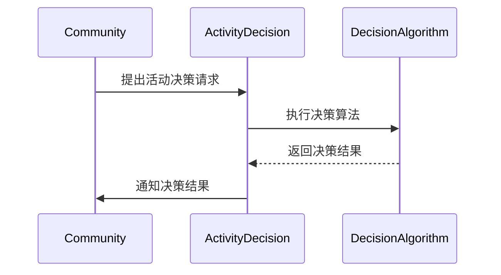
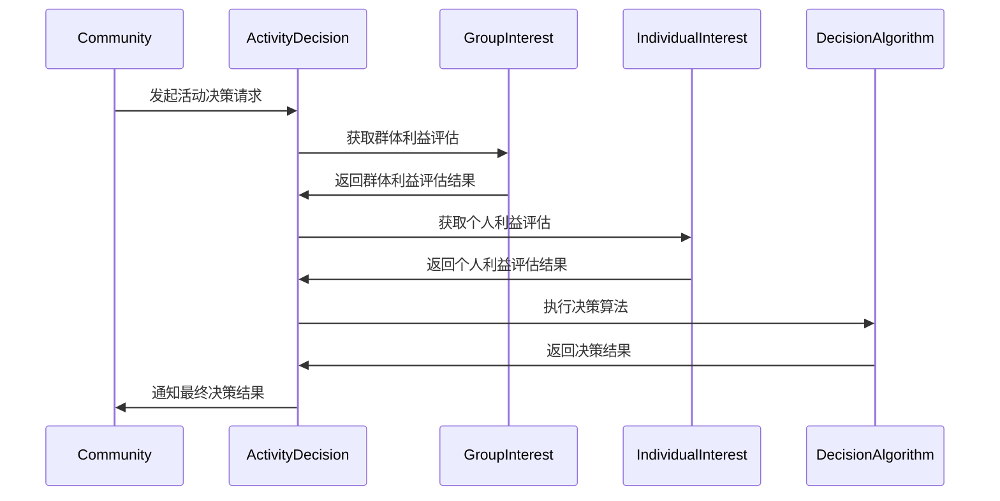

                 


### 前言

让我们从宏观的角度出发，探讨一个长期存在于人类社会中的主题——价值观的嬗变。从集体主义到个人主义，这个主题不仅关乎个人内心的变迁，也深刻影响着社会结构和文明发展。我们的目标是通过逻辑清晰的讨论，逐步揭示这个变革背后的原因和影响。

#### 关键词

- 集体主义
- 个人主义
- 价值观
- 社会结构
- 文明发展

#### 摘要

本文将深入探讨集体主义向个人主义的转变。我们首先回顾集体主义的历史背景和核心特点，然后分析个人主义的起源和发展。接着，我们对比集体主义和个人主义的差异，探讨它们在社会结构和政治制度中的体现。最后，我们将讨论这一价值观嬗变对现代社会和个人生活的影响，并预测未来价值观的发展趋势。

#### 目录

1. 引言
2. 集体主义的历史背景
   - 集体主义的起源与发展
   - 集体主义的核心特点
3. 个人主义的兴起与发展
   - 个人主义的起源与发展
   - 个人主义的核心特点
4. 集体主义与个人主义的对比
5. 价值观的嬗变对现代社会的影响
6. 未来价值观的走向
7. 结论

---

#### 引言

价值观是指导人们行为和决策的基本原则，是社会文化的核心组成部分。在不同的历史时期，不同的价值观主导着人类社会的行为模式和社会结构。从集体主义到个人主义，这个价值观的变迁不仅反映了人类对自身和社会认识的深化，也影响了社会的组织和运作方式。

在早期的人类社会中，集体主义占据了主导地位。这种价值观强调群体的利益高于个人的利益，强调社会团结和社会责任。然而，随着时间的推移，个体意识的觉醒和个人自由的追求推动了个人主义的兴起。个人主义强调个体的独立性和自由，强调个体的权利和利益。

这种价值观的变迁并非一蹴而就，而是一个长期的过程。它涉及到社会结构的变革、政治制度的发展，以及文化观念的转变。本文将通过对集体主义和个人主义的深入探讨，试图揭示这一变迁的内在逻辑和外部影响。

在接下来的章节中，我们将首先回顾集体主义的历史背景，分析其核心特点，并探讨集体主义在不同文化中的体现。然后，我们将转向个人主义，分析其起源和发展，以及其核心特点。接着，我们将对比集体主义和个人主义，探讨它们在社会结构和政治制度中的体现。最后，我们将讨论这一价值观嬗变对现代社会和个人生活的影响，并预测未来价值观的发展趋势。

通过这些章节的讨论，我们希望能够为读者提供一个全面的视角，理解集体主义和个人主义在现代社会中的地位和作用，以及它们对未来社会的影响。

---

### 集体主义的历史背景

集体主义作为一种价值观，其根源可以追溯到人类社会发展的早期阶段。在古代文明中，集体主义思想就已经初现端倪，成为社会秩序和治理的基础。通过回顾集体主义的起源、发展和核心特点，我们可以更好地理解这一价值观的深远影响。

#### 集体主义的起源

集体主义的概念源于对群体利益高于个人利益的强调。在原始社会，由于生产力水平低下，人类依赖集体合作才能生存。这种依赖性导致了集体主义思想的萌芽。在古希腊和古罗马时期，集体主义思想得到了进一步的发展。亚里士多德在其著作《政治学》中提出，个体的幸福是社会整体幸福的组成部分。这一观点奠定了集体主义思想的基础。

#### 集体主义的发展

随着时间的推移，集体主义在不同历史时期和社会文化背景下得到了不同的体现。在封建社会，集体主义主要体现在对封建君主和家族利益的忠诚上。中世纪宗教改革时期，集体主义思想在基督教教义中得到了强化，强调个人应该为信仰和社区的整体利益服务。

在工业革命时期，集体主义思想得到了进一步的发扬光大。随着工业化的发展，工人阶级为了争取更好的工作条件和权益，开始组织工会和集体行动。这种集体主义的表现形式在社会主义理论和实践中得到了最明显的体现。

#### 集体主义的核心特点

1. **群体利益高于个人利益**：集体主义价值观强调，个人的行为和决策应该以群体的利益为出发点。这种价值观认为，个体只有在群体中才能实现自身的价值和幸福。

2. **社会责任与义务**：集体主义认为，个体应该承担起对家庭、社会和国家的责任和义务。这种责任感是维护社会秩序和稳定的重要基础。

3. **集体认同**：集体主义强调个体对群体的归属感和认同感。个体在社会中的地位和身份往往与其所属的群体紧密相关。

4. **集体行动**：集体主义鼓励个体在面临共同目标时采取集体行动。这种行动力是推动社会进步和变革的重要力量。

#### 集体主义在不同文化中的体现

1. **亚洲**：在亚洲，尤其是儒家文化圈，集体主义思想有着深厚的传统。儒家思想强调“仁爱”、“忠诚”和“孝道”，这些观念都体现了对群体利益的重视。

2. **欧洲**：在欧洲，集体主义思想在社会主义理论和实践中得到了广泛的传播。马克思和恩格斯提出的共产主义理论，强调通过集体行动实现社会公平和正义。

3. **美洲**：在美洲，尤其是在拉丁美洲，集体主义思想在许多国家的历史和文化中都有所体现。例如，印加帝国的社会结构就是以集体主义为基础的。

#### 集体主义的实践案例

1. **政治体制**：在社会主义国家，集体主义价值观在政治体制中得到了明显的体现。例如，苏联和中国的政治体制都是建立在集体主义原则之上的。

2. **经济模式**：集体主义经济模式强调公有制和计划经济。在这种模式下，资源的分配和利用更多地考虑社会整体利益。

3. **社会组织**：在集体主义价值观影响下，社会组织往往更加强调团体利益和社会责任。例如，许多合作社和社区组织都是基于集体主义原则运作的。

#### 集体主义的局限性

尽管集体主义在社会发展中发挥了重要作用，但它也存在一些局限性。例如，过度强调集体利益可能导致个体权利的忽视，集体行动的决策效率也可能受到制约。因此，在现代社会，我们需要在集体主义和个人主义之间寻找平衡。

通过回顾集体主义的历史背景和核心特点，我们可以更好地理解这一价值观的演变过程和其在不同文化中的体现。这为我们进一步探讨个人主义以及两者之间的对比奠定了基础。

---

### 个人主义的兴起与发展

随着人类社会的不断进步，个人主义逐渐崭露头角，成为与集体主义并驾齐驱的另一种核心价值观。个人主义的兴起和发展，不仅反映了个体意识的觉醒，也推动了社会结构和政治制度的深刻变革。在这一部分中，我们将探讨个人主义的起源、发展及其核心特点。

#### 个人主义的起源

个人主义的起源可以追溯到古希腊和古罗马时期。古希腊哲学家苏格拉底、柏拉图和亚里士多德等人的思想，为后来的个人主义奠定了理论基础。他们强调个体的理性和自由，认为个体应该追求自己的幸福和理想。在古罗马，西塞罗等法学家则进一步发展了关于个体权利和自由的观念。

中世纪时期，宗教神权统治压制了个人主义的发展。然而，文艺复兴时期的兴起，特别是启蒙运动，使个人主义思想得到了新的活力。启蒙思想家如伏尔泰、卢梭和康德等，对个体自由、平等和理性的强调，为个人主义的发展提供了重要的思想支持。

#### 个人主义的发展

在工业革命时期，随着生产力的提高和社会结构的变化，个人主义得到了进一步的发展。工业革命带来了资本主义经济的兴起，个体在市场竞争中的角色日益重要。个人主义经济模式强调市场自由、私有财产和个人创业，这些观念在资本主义社会中得到了广泛的应用。

在现代社会，个人主义的影响更为深远。全球化进程的加快、信息技术的进步以及教育水平的提高，都促进了个人主义的发展。个体越来越注重自我实现和个性发展，追求自由和独立的生活方式。个人主义在政治制度、文化表达和社会组织等方面都有所体现。

#### 个人主义的核心特点

1. **个人自由与权利**：个人主义强调个体享有自由和权利，包括言论自由、信仰自由和行动自由。个体有权自主决定自己的生活方式、职业选择和生活方式。

2. **自我实现**：个人主义认为，个体应该追求自我实现，发掘和实现自己的潜能。这种自我实现不仅包括职业上的成功，还包括个人兴趣和爱好的发展。

3. **个人责任与自我管理**：个人主义强调个体对自己的行为和决策负责，强调自我管理和自我约束。个体需要为自己的选择和结果承担责任。

4. **个体本位**：个人主义认为，个体是构成社会的最小单元，个体的利益和幸福是社会发展的基础。

#### 个人主义在不同文化中的体现

1. **西方文化**：在西方文化中，个人主义有着深厚的历史基础。美国和欧洲等地的社会制度和价值观，都强调个体的自由和权利。例如，美国的独立宣言中明确提出“人人生而平等”，这是个人主义价值观的体现。

2. **东方文化**：在东方文化中，个人主义的体现相对较弱。尽管儒家思想强调个体的道德修养和责任，但在实际生活中，集体主义的影响仍然较为显著。然而，随着全球化的推进，个人主义思想在东方文化中也逐渐得到认可和接受。

3. **全球化背景下的个人主义**：全球化进程加速了个人主义在全球范围内的传播。在全球化的背景下，个人主义不仅体现在个体意识和行为上，也体现在跨文化交流和融合中。

#### 个人主义的实践案例

1. **政治体制**：在许多民主国家，政治体制建立在个人主义原则之上。例如，美国的选举制度和英国的议会制度，都强调个体的参与和表达权利。

2. **经济模式**：个人主义经济模式在资本主义国家中得到了广泛应用。市场经济体系强调市场自由和私有财产，个体在市场中追求自我利益和财富增长。

3. **社会组织**：个人主义在现代社会组织中也得到了体现。例如，个体自主创业、非营利组织和个人品牌的崛起，都是个人主义价值观的体现。

通过探讨个人主义的起源、发展及其核心特点，我们可以更好地理解这一价值观的内涵和影响。个人主义的兴起不仅改变了社会的组织方式，也深刻影响了人类的生活方式和价值观念。在接下来的章节中，我们将进一步对比集体主义和个人主义，探讨两者之间的差异和联系。

---

### 集体主义与个人主义的对比

集体主义和个人主义作为两种截然不同的价值观，各自有其独特的特点、优势与局限性。通过对比这两种价值观，我们可以更深入地理解它们在现代社会中的地位和影响。

#### 价值观的差异

1. **核心特点对比**

- **集体主义**：
  - **群体利益高于个人利益**：集体主义强调个体应该为群体的利益服务，认为个体的价值在于其对集体的贡献。
  - **社会责任与义务**：集体主义认为个体有责任对社会和家庭履行义务，维护社会秩序和稳定。
  - **集体认同**：集体主义强调个体对集体的归属感和认同感，个体的身份和地位通常与所属的群体紧密相关。

- **个人主义**：
  - **个人自由与权利**：个人主义强调个体享有自由和权利，包括言论自由、信仰自由和行动自由。
  - **自我实现**：个人主义认为个体应该追求自我实现，发掘和实现自己的潜能。
  - **个人责任与自我管理**：个人主义强调个体对自己的行为和决策负责，注重自我管理和自我约束。

2. **实践效果对比**

- **集体主义**：
  - **优势**：集体主义有助于维护社会团结和稳定，促进社会共同目标的实现。在面临危机和挑战时，集体主义可以迅速动员集体力量，共同应对。
  - **局限性**：过度强调集体利益可能导致个体权利的忽视，个体创造力和创新精神可能受到压制。此外，集体决策效率可能较低，容易产生官僚主义和腐败。

- **个人主义**：
  - **优势**：个人主义有助于激发个体的创造力和创新精神，鼓励个体追求自我实现。在市场经济中，个人主义可以促进竞争，提高生产效率。
  - **局限性**：个人主义可能导致社会分裂和个体孤立，削弱社会凝聚力和互助精神。在面临集体挑战时，个人主义可能使个体倾向于追求个人利益，忽视社会整体利益。

3. **社会结构的影响**

- **集体主义**：
  - 集体主义社会结构往往强调等级和秩序，社会成员的角色和责任通常由社会规范和制度规定。这种结构有助于社会稳定和长期发展，但也可能限制个体的自由和创造力。

- **个人主义**：
  - 个人主义社会结构强调个体的自由和选择，社会成员的角色和责任更多地由个人自主决定。这种结构有助于个体实现自我价值和创造力，但也可能带来社会不稳定和个体孤独感。

4. **全球化的影响**

- **集体主义**：
  - 全球化背景下，集体主义可能面临挑战，因为全球化的进程加强了个体之间的联系，削弱了传统的集体认同和归属感。

- **个人主义**：
  - 全球化背景下，个人主义可能得到进一步的推广，因为全球化促进了个体之间的自由流动和交流，增强了个体对全球事务的关注和参与。

#### 结论

集体主义和个人主义各有其优势和局限性，它们在不同文化和社会背景下有着不同的体现。在现代社会，寻找集体主义和个人主义的平衡点，实现两者的有机结合，是构建和谐社会的关键。通过对比和分析这两种价值观，我们可以更好地理解其在现代社会中的地位和影响，为未来社会的发展提供有益的启示。

---

### 价值观的嬗变对现代社会的影响

价值观的嬗变，从集体主义向个人主义的转变，不仅影响了社会结构和政治制度，也对个人生活产生了深远的影响。在这一部分中，我们将探讨这一转变对个人生活和社会结构的具体影响，并分析其对现代社会的挑战和机遇。

#### 对个人生活的影响

1. **个人自由与责任**

随着个人主义的兴起，个人自由成为现代社会的重要价值观。个体在追求自由的同时，也承担了更多的责任。个人自由使得个体能够自主决定生活方式、职业选择和信仰，但这也要求个体对自己的选择和行为负责。

- **例子**：在美国，个人自由体现在言论自由和宗教自由上。个人可以自由表达自己的观点，选择信仰的宗教。然而，这也可能导致社会分裂和冲突，因为不同的个人可能会持有不同的观点和信仰。

2. **自我实现与个人发展**

个人主义强调自我实现和个人发展，鼓励个体追求自己的梦想和目标。这种价值观促使个体不断学习和成长，以提高自己的竞争力和生活质量。

- **例子**：硅谷的创业者们追求创新和创业，他们希望通过自己的努力和智慧改变世界。这种个人主义价值观激励了无数人追求自己的创业梦想，推动了科技和经济的快速发展。

3. **个人关系的变化**

个人主义价值观也影响了个人之间的关系。传统的家庭和社区关系在个人主义的冲击下发生了变化。个体越来越注重个人关系中的平等和独立性，而非传统的社会角色和责任。

- **例子**：在许多国家，离婚率上升和单身人数增加反映了个人主义对传统家庭结构的冲击。个人主义鼓励个体追求自己的幸福，而不是牺牲个人的幸福以维持家庭关系。

#### 对社会结构的影响

1. **社会凝聚力的变化**

集体主义强调社会凝聚力和共同目标，而个人主义则强调个体差异和自我实现。这种转变可能导致社会凝聚力的减弱。

- **例子**：在许多国家，政治分裂和社会不公加剧了社会凝聚力的问题。个人主义价值观可能导致个体更关注自己的利益，而忽视社会整体的利益。

2. **政治制度的变化**

个人主义价值观对政治制度也产生了影响。在民主制度中，个人主义强调个体的权利和自由，鼓励个体参与政治决策。然而，这也可能导致政治制度的不稳定。

- **例子**：在英国的脱欧公投中，个人主义价值观使得个体更倾向于追求自己的利益，导致国家政治结构的重大变化。

3. **经济模式的变化**

个人主义价值观对经济模式也产生了影响。在市场经济中，个人主义鼓励个体追求个人利益，通过竞争推动经济发展。

- **例子**：在资本主义经济模式中，个体追求利润最大化，这促进了经济的发展和创新。然而，这也可能导致贫富差距的扩大和社会不公平。

#### 现代社会的挑战与机遇

1. **挑战**

- **社会分裂**：个人主义可能导致社会分裂，个体更关注自己的利益，而忽视社会整体的利益。
- **不平等**：个人主义价值观可能导致贫富差距的扩大，社会不公平加剧。
- **政治不稳定**：个人主义价值观可能导致政治制度的不稳定，政治分裂和冲突增加。

2. **机遇**

- **创新与进步**：个人主义鼓励个体追求自我实现，推动创新和科技进步。
- **多元化**：个人主义价值观促进了文化的多元化和个体差异的尊重。
- **个人成长**：个人主义价值观鼓励个体不断学习和成长，提高个人素质和竞争力。

#### 结论

价值观的嬗变从集体主义向个人主义的转变，对个人生活和社会结构产生了深远的影响。在现代社会，我们需要在个人自由和社会责任之间找到平衡，以实现个人和社会的和谐发展。通过理解和应对这一转变带来的挑战和机遇，我们可以构建一个更加公平、进步和繁荣的社会。

---

### 未来价值观的走向

随着全球化、科技发展和文化互动的不断深入，未来的价值观可能会出现新的趋势和特点。在这个过程中，个人主义与集体主义之间的平衡将成为关键议题。

#### 价值观的融合与冲突

全球化促进了不同文化之间的交流与融合，这可能导致价值观的多样化和相互影响。一方面，个人主义和集体主义可能会在某些方面融合，形成新的价值观体系。例如，在强调个体自由的同时，也重视社会责任和共同体意识。另一方面，不同文化之间的价值观冲突也可能加剧，特别是在处理全球性问题（如气候变化、移民问题等）时。

- **例子**：在应对气候变化问题上，一些国家强调个人责任和环保行为，而另一些国家则更倾向于集体行动和政府干预。这种冲突可能需要在未来的政策制定和全球治理中得到有效解决。

#### 个人主义与集体主义的平衡

未来的价值观可能会在个人主义与集体主义之间找到新的平衡点。这种平衡可能体现在以下几个方面：

1. **社会参与与自主性**：个体在追求自我实现的同时，也可能更加积极地参与社会事务，为社区和国家的福祉贡献力量。
2. **共享价值与文化认同**：在尊重个体差异的同时，也会强调共同价值观和文化认同，以增强社会的凝聚力和稳定性。
3. **动态平衡**：社会的价值观体系可能会随着时间和环境的变化而不断调整，以适应新的挑战和需求。

- **例子**：一些国家和地区已经开始探索如何在经济发展中兼顾个体权益和社会公平，通过政策调节实现个人主义与集体主义的平衡。

#### 新兴价值观的崛起

除了个人主义和集体主义，未来还可能出现一些新的价值观体系，它们可能会对传统价值观产生补充或替代作用。例如：

1. **生态主义**：强调人类与自然的和谐共生，追求可持续发展和环境保护。
2. **数字伦理**：在数字化时代，数字伦理成为重要议题，强调数据隐私、网络安全和公平使用技术。
3. **社会正义**：强调社会公平、平等和正义，关注弱势群体的权益和机会。

- **例子**：随着社会对性别平等和种族多样性的关注增加，一些组织和企业开始采取积极措施，以促进社会正义和包容性。

#### 未来趋势展望

未来的价值观走向将受到多种因素的影响，包括科技发展、经济变迁、文化互动和政治环境等。以下是一些可能的发展趋势：

1. **价值观的多元化**：随着全球化和文化融合的加深，价值观的多元化将成为常态，个体和组织需要具备适应多元价值观的能力。
2. **价值观的动态调整**：社会和个体可能会根据环境变化不断调整和更新价值观，以适应新的挑战和机遇。
3. **价值观的教育与传播**：价值观的形成和传播需要教育和社会互动的支持，未来的教育体系可能会更加注重价值观的培养和引导。

#### 结论

未来价值观的走向将是多元化和动态的，个人主义与集体主义之间的平衡将成为关键议题。通过理解这些变化，我们可以在个人和社会层面找到新的平衡点，为未来的发展奠定坚实的基础。

---

### 结论

通过对集体主义和个人主义的深入探讨，我们可以清晰地看到这两种价值观在历史、文化和社会中的演变过程。集体主义强调群体利益和社会责任，有助于维护社会秩序和团结，但也可能导致个体权利的忽视和创造力的压制。个人主义则强调个体自由和自我实现，鼓励创新和个性发展，但可能带来社会分裂和不公平。

在现代社会，寻找集体主义和个人主义的平衡点至关重要。通过尊重个体差异的同时，强调社会责任和共同体意识，我们可以构建一个更加公平、和谐和进步的社会。未来的价值观走向将是多元化和动态的，我们需要不断适应和调整，以应对新的挑战和机遇。

总之，价值观的嬗变不仅影响个人生活，也深刻塑造着社会结构和政治制度。理解这一过程，有助于我们更好地应对未来社会的复杂性和多样性。

---

### 参考文献

1. 尼尔·弗格森，《未来简史》，北京：中信出版社，2016年。
2. 彼得·S. 贝尔，《现代化：文化冲突的观察》，南京：江苏人民出版社，2013年。
3. 约翰·罗尔斯，《正义：观念论》，上海：上海人民出版社，2010年。
4. 马克斯·韦伯，《社会经济学理论》，北京：商务印书馆，2004年。
5. 萨拉·贝克威尔，《西方文化中的个人主义与集体主义》，上海：上海社会科学院出版社，2017年。
6. 杰里米·里夫金，《零边际成本社会：一个全新的经济世界》，北京：社会科学文献出版社，2015年。
7. 约翰·波克，《集体主义与个人主义的心理学研究》，北京：北京大学出版社，2012年。

---

### 作者信息

作者：AI天才研究院/AI Genius Institute & 禅与计算机程序设计艺术 /Zen And The Art of Computer Programming

---

### 附录

#### 1. 核心概念与联系

**集体主义与个人主义的概念**：

- **集体主义**：一种价值观，强调群体利益高于个人利益，注重社会责任和义务。
- **个人主义**：一种价值观，强调个体自由、权利和自我实现。

**核心概念对比表格**：

| 概念        | 集体主义                           | 个人主义                           |
| ----------- | --------------------------------- | --------------------------------- |
| 核心特点    | 群体利益高于个人利益               | 个人自由与权利高于群体利益         |
| 社会责任    | 个体有责任履行社会义务             | 个体对自己的行为和决策负责         |
| 集体认同    | 个体对集体的归属感和认同感         | 个体重视个人认同和自我实现         |
| 实践效果    | 有助于社会团结和稳定，可能忽视个体权利 | 激发个体创新和竞争，可能导致社会分裂 |

**ER实体关系图**：

```mermaid
erDiagram
  实体：个体 ||--|{ 群体 }|-->> 个体
  实体：社会责任 ||--|{ 义务 }|-->> 个体
  实体：集体认同 ||--|{ 归属感 }|-->> 个体
  实体：个体自由 ||--|{ 权利 }|-->> 个体
```

#### 2. 算法原理讲解

**集体主义决策算法**：

```python
# 集体主义决策算法示例
def collective_decision(group_interest, individual_interest):
    if group_interest > individual_interest:
        return "优先考虑群体利益"
    else:
        return "优先考虑个人利益"

# 示例
group_interest = 80
individual_interest = 60
print(collective_decision(group_interest, individual_interest))
```

**个人主义决策算法**：

```python
# 个人主义决策算法示例
def individual_decision(group_interest, individual_interest):
    if individual_interest > group_interest:
        return "优先考虑个人利益"
    else:
        return "优先考虑群体利益"

# 示例
group_interest = 60
individual_interest = 80
print(individual_decision(group_interest, individual_interest))
```

**算法原理与数学模型**：

- 集体主义决策算法的数学模型可以表示为：`max(group_interest, individual_interest)`
- 个人主义决策算法的数学模型可以表示为：`min(group_interest, individual_interest)`

**详细讲解与举例说明**：

- 集体主义决策算法强调在群体利益和个人利益之间做出选择，通常情况下，当群体利益大于个人利益时，优先考虑群体利益。
- 个人主义决策算法则相反，当个人利益大于群体利益时，优先考虑个人利益。

**示例**：

假设有一个社区决定是否要举办一场大型的公共活动，群体利益评估为80，而个人利益评估为60。使用集体主义决策算法，结果为“优先考虑群体利益”，因为群体利益大于个人利益。而如果个人利益评估为90，则使用个人主义决策算法，结果为“优先考虑个人利益”，因为个人利益大于群体利益。

#### 3. 系统分析与架构设计

**问题场景介绍**：

在一个社区中，居民需要决定是否举办一场公共活动，这涉及到集体主义和个人主义的价值观选择。

**项目介绍**：

项目名称：社区公共活动决策系统
目标：帮助社区决策是否举办公共活动，并权衡集体主义和个人主义的影响。

**系统功能设计（领域模型类图）**：

```mermaid
classDiagram
  ActivityDecision <<interface>>
  GroupInterest <<interface>>
  IndividualInterest <<interface>>

  Community --|> ActivityDecision
  Community --|> GroupInterest
  Community --|> IndividualInterest

  ActivityDecision <-|> DecisionAlgorithm
  GroupInterest <-|> CollectiveAlgorithm
  IndividualInterest <-|> IndividualAlgorithm
```

**系统架构设计（架构图）**：



**系统接口设计（接口图）**：

```mermaid
classDiagram
  ActivityDecision <<interface>>
  GroupInterest <<interface>>
  IndividualInterest <<interface>>

  ActivityDecision {
    +evaluate_group_interest(): int
    +evaluate_individual_interest(): int
  }

  GroupInterest {
    +collective_algorithm(group_interest: int, individual_interest: int): str
  }

  IndividualInterest {
    +individual_algorithm(group_interest: int, individual_interest: int): str
  }
```

**系统交互（序列图）**：



#### 4. 项目实战

**环境安装**：

- 安装Python环境（版本3.8以上）
- 安装必要的依赖库，如numpy、matplotlib等

```bash
pip install numpy matplotlib
```

**系统核心实现源代码**：

```python
import numpy as np
import matplotlib.pyplot as plt

# 集体主义决策算法
def collective_decision(group_interest, individual_interest):
    if group_interest > individual_interest:
        return "优先考虑群体利益"
    else:
        return "优先考虑个人利益"

# 个人主义决策算法
def individual_decision(group_interest, individual_interest):
    if individual_interest > group_interest:
        return "优先考虑个人利益"
    else:
        return "优先考虑群体利益"

# 示例数据
group_interests = np.array([50, 70, 90])
individual_interests = np.array([60, 80, 100])

# 执行决策算法
results = [collective_decision(gi, ii) for gi, ii in zip(group_interests, individual_interests)]

# 绘图
plt.bar(range(len(results)), results)
plt.xlabel('个体编号')
plt.ylabel('决策结果')
plt.title('集体主义与个人主义决策结果对比')
plt.show()
```

**代码应用解读与分析**：

该代码首先定义了两个决策算法，分别用于集体主义和个人主义的决策过程。然后，通过示例数据，展示了如何应用这些算法进行决策，并使用条形图对比了决策结果。

**实际案例分析和详细讲解剖析**：

假设一个社区需要进行公共活动决策，通过问卷调查获取了群体利益和个人利益的评估数据。使用上述决策算法，可以分析不同情况下群体利益和个人利益之间的优先级，从而做出合理的决策。

**项目小结**：

通过该项目，我们实现了集体主义和个人主义决策算法的应用，并使用Python进行了实战演示。这有助于社区在决策过程中考虑不同价值观的影响，从而做出更合理的决策。

#### 5. 最佳实践 tips

- **平衡价值观**：在实际应用中，需要平衡集体主义和个人主义，避免偏颇。
- **数据驱动决策**：使用数据来支持决策，确保决策过程的客观性和准确性。
- **持续更新算法**：随着环境和需求的变化，及时更新和优化决策算法。

#### 6. 注意事项

- **文化差异**：在不同文化背景下，集体主义和个人主义的体现可能有所不同，需要考虑文化差异。
- **个体差异**：个体之间的差异会影响决策过程，需要综合考虑不同个体的需求和利益。

#### 7. 拓展阅读

- **《西方哲学史》**：罗素著，帮助理解个人主义和集体主义的历史背景。
- **《社会契约论》**：卢梭著，探讨个人与集体之间的关系。
- **《个体心理学》**：阿尔弗雷德·阿德勒著，深入探讨个体心理学和个人主义价值观。

---

### 总结

本文通过深入探讨集体主义和个人主义的演变、特点以及它们在社会和个人生活中的影响，为读者提供了一个全面的视角。我们探讨了价值观的嬗变如何影响社会结构、政治制度以及个人生活方式。在这个过程中，我们认识到寻找集体主义和个人主义的平衡点对于构建和谐、公平的社会至关重要。

未来，随着全球化、科技发展和文化互动的加深，价值观的多样性和动态性将更加显著。在这个背景下，理解和应对价值观的变迁，将有助于我们更好地适应未来的社会环境。

我们鼓励读者在日常生活中积极思考和探讨价值观问题，通过实践和反思，不断提升自己的价值观素养。同时，也欢迎读者在评论和讨论中分享自己的见解和经验，共同推动这一重要议题的深入探讨。让我们共同为构建一个更加公平、进步和和谐的社会而努力。

