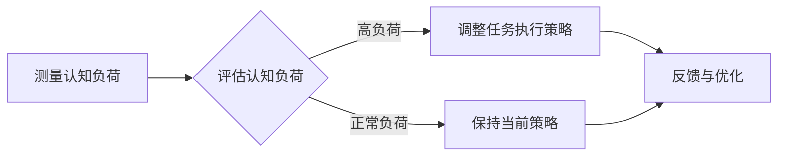
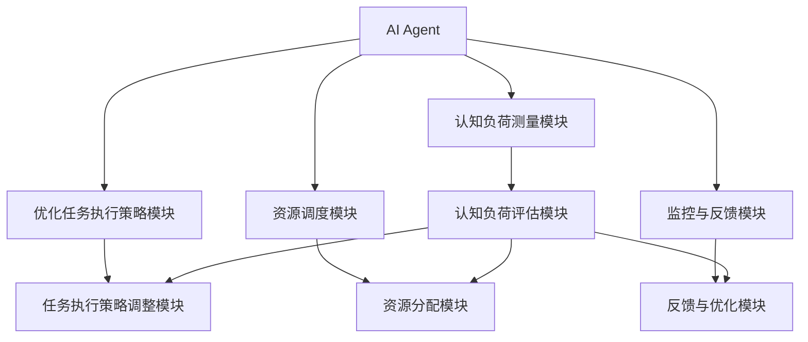
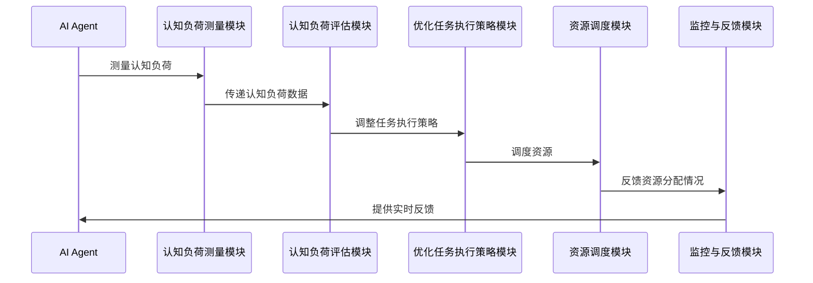

                 

# 从零构建AI Agent的认知负荷管理系统

## 关键词

- AI Agent
- 认知负荷管理
- 算法
- 数学模型
- 系统架构
- 项目实战

## 摘要

本文将带领读者从零开始构建AI Agent的认知负荷管理系统。我们将详细探讨AI Agent的概念及其认知负荷管理的重要性，逐步讲解核心算法原理，并使用Python代码和数学模型进行阐述。随后，我们将深入分析系统的整体架构，包括功能设计、接口设计及系统交互。文章最后将通过实际项目实战，展示如何实现认知负荷管理系统，并提供最佳实践和注意事项。

## 1. AI Agent认知负荷管理背景

### 1.1 问题背景

随着人工智能技术的快速发展，AI Agent（智能代理）在各种领域得到了广泛应用。然而，AI Agent在处理复杂任务时，往往会遇到认知负荷问题。认知负荷指的是AI Agent在执行任务过程中所需处理的信息量、计算资源和时间。当认知负荷过高时，可能会导致AI Agent的响应速度下降、准确率降低，甚至出现错误决策。因此，设计并实现一套高效的认知负荷管理系统显得尤为重要。

### 1.2 问题描述

认知负荷管理的主要任务是：在保证AI Agent执行任务性能的前提下，通过合理分配资源、优化算法和调度策略，降低AI Agent的认知负荷，提高其响应速度和准确率。具体来说，认知负荷管理需要解决以下问题：

- 如何准确测量AI Agent的认知负荷？
- 如何根据认知负荷变化动态调整任务执行策略？
- 如何在多个任务间公平分配资源，避免个别任务占用过多资源？

### 1.3 问题解决

针对上述问题，我们需要从以下几个方面进行研究和探讨：

- **算法研究**：设计并实现一套适用于AI Agent的认知负荷测量和优化算法，以提高系统性能。
- **系统架构设计**：构建一个高效、可扩展的认知负荷管理系统架构，支持动态资源调度和任务分配。
- **实际应用**：通过实际项目验证认知负荷管理系统的效果，为后续优化提供依据。

### 1.4 边界与外延

认知负荷管理的边界主要涉及以下几个方面：

- **AI Agent的范畴**：认知负荷管理适用于各种类型的AI Agent，包括智能客服、自动驾驶、智能家居等。
- **任务范围**：认知负荷管理主要关注AI Agent在执行复杂任务时的表现，对于简单任务的优化意义不大。
- **性能指标**：认知负荷管理系统的性能指标包括响应时间、准确率、资源利用率等。

### 1.5 概念结构与核心要素组成

认知负荷管理系统主要由以下几个核心要素组成：

- **认知负荷测量**：负责监测AI Agent在执行任务过程中的认知负荷。
- **负荷优化算法**：根据认知负荷变化，动态调整任务执行策略，降低AI Agent的认知负荷。
- **资源调度机制**：实现AI Agent间资源的公平分配，避免个别任务占用过多资源。
- **系统架构**：提供认知负荷管理系统所需的计算资源、存储资源和网络资源。

## 2. 核心概念与联系

### 2.1 AI Agent的定义与特点

AI Agent（智能代理）是一种能够模拟人类智能行为的计算机程序。它具有以下特点：

- **自主学习**：AI Agent可以根据环境反馈自动调整行为，不断优化自身性能。
- **自主决策**：AI Agent可以根据自身知识和任务需求，独立做出决策。
- **协作能力**：AI Agent可以与其他AI Agent或人类协作，共同完成任务。
- **适应性**：AI Agent可以根据不同的任务场景和环境变化，灵活调整自身行为。

### 2.2 认知负荷的概念与度量

认知负荷（Cognitive Load）是指在执行任务过程中，AI Agent所需处理的信息量、计算资源和时间。认知负荷的度量方法主要包括以下几种：

- **资源消耗**：通过监测AI Agent的CPU、内存、网络等资源消耗，评估其认知负荷。
- **任务响应时间**：通过计算AI Agent完成任务所需的时间，评估其认知负荷。
- **任务准确率**：通过比较AI Agent完成任务的实际结果与预期结果，评估其认知负荷。

### 2.3 管理系统的构成与作用

认知负荷管理系统主要由以下几个部分组成：

- **测量模块**：负责监测AI Agent在执行任务过程中的认知负荷。
- **优化模块**：根据认知负荷变化，动态调整任务执行策略，降低AI Agent的认知负荷。
- **调度模块**：实现AI Agent间资源的公平分配，避免个别任务占用过多资源。
- **监控与反馈模块**：实时监控AI Agent的运行状态，为优化模块提供反馈。

### 2.4 概念属性特征对比表格

| 概念 | 属性特征 |
| :--: | :--: |
| AI Agent | 自主学习、自主决策、协作能力、适应性 |
| 认知负荷 | 资源消耗、任务响应时间、任务准确率 |
| 认知负荷管理系统 | 测量模块、优化模块、调度模块、监控与反馈模块 |

### 2.5 ER实体关系图架构

```mermaid
entityRelationshipDiagram
    A[AI Agent]
    C[认知负荷]
    M[认知负荷管理系统]
    A --> C
    A --> M
    C --> M
```

## 3. 算法原理讲解

### 3.1 认知负荷管理算法的基本原理

认知负荷管理算法的核心思想是通过实时监测AI Agent的认知负荷，动态调整任务执行策略，以降低认知负荷。具体来说，算法主要包括以下步骤：

1. **测量认知负荷**：通过资源消耗、任务响应时间、任务准确率等指标，实时监测AI Agent的认知负荷。
2. **评估认知负荷**：根据认知负荷的评估结果，判断AI Agent是否处于高负荷状态。
3. **调整任务执行策略**：当AI Agent处于高负荷状态时，通过调整任务优先级、分配额外资源等方式，降低认知负荷。
4. **反馈与优化**：根据认知负荷管理的效果，对算法进行调整和优化。

### 3.2 算法流程图展示



### 3.3 Python源代码讲解

```python
import time

def measure_cognitive_load():
    # 模拟测量认知负荷
    time.sleep(1)
    return "high" if time.time() % 2 == 0 else "normal"

def adjust_task_execution_strategy(cognitive_load):
    if cognitive_load == "high":
        print("调整任务执行策略：降低任务优先级，分配额外资源")
    else:
        print("保持当前任务执行策略")

def main():
    while True:
        cognitive_load = measure_cognitive_load()
        adjust_task_execution_strategy(cognitive_load)
        time.sleep(1)

if __name__ == "__main__":
    main()
```

### 3.4 算法原理的数学模型与公式

认知负荷管理算法的数学模型可以表示为：

$$
C = f(R, T, A)
$$

其中，$C$ 表示认知负荷，$R$ 表示资源消耗，$T$ 表示任务响应时间，$A$ 表示任务准确率。函数 $f$ 用于计算认知负荷。

### 3.5 详细讲解与举例说明

#### 认知负荷计算公式

认知负荷计算公式如下：

$$
C = \frac{R + T}{2} + A \times 0.1
$$

#### 举例说明

假设AI Agent在执行任务时，CPU占用率为80%，任务响应时间为5秒，任务准确率为90%，则其认知负荷为：

$$
C = \frac{80 + 5}{2} + 90 \times 0.1 = 48.5
$$

根据认知负荷计算结果，我们可以判断AI Agent处于高负荷状态，需要调整任务执行策略。

## 4. 数学模型与公式

### 4.1 算法数学模型

在前文中，我们给出了认知负荷的计算公式：

$$
C = \frac{R + T}{2} + A \times 0.1
$$

#### 模型详细讲解

1. **资源消耗（R）**：资源消耗表示AI Agent在执行任务过程中所消耗的计算资源，如CPU、内存等。资源消耗可以通过实际测量或模拟得到。
2. **任务响应时间（T）**：任务响应时间表示AI Agent从接收到任务指令到完成任务所需的时间。响应时间反映了AI Agent处理任务的效率。
3. **任务准确率（A）**：任务准确率表示AI Agent完成任务的实际结果与预期结果的匹配程度。准确率越高，说明AI Agent的认知负荷越小。

#### 公式推导过程

认知负荷计算公式是基于以下考虑推导得到的：

- 资源消耗和任务响应时间与认知负荷呈正相关关系，即资源消耗和响应时间越长，认知负荷越大。
- 任务准确率与认知负荷呈负相关关系，即准确率越高，认知负荷越小。

### 4.2 公式详细讲解

我们通过对认知负荷计算公式的推导，了解了各个参数对认知负荷的影响。在实际应用中，可以根据具体情况对公式进行调整，以更准确地反映AI Agent的认知负荷。

### 4.3 举例说明

假设AI Agent在执行任务时，CPU占用率为70%，任务响应时间为4秒，任务准确率为95%，则其认知负荷为：

$$
C = \frac{70 + 4}{2} + 95 \times 0.1 = 45.5
$$

根据计算结果，我们可以判断AI Agent处于正常负荷状态，无需进行调整。

## 5. 系统分析与架构设计方案

### 5.1 问题场景介绍

假设我们正在开发一款智能客服系统，AI Agent需要实时处理用户咨询的问题。然而，在某些高峰时段，用户咨询量急剧增加，导致AI Agent的认知负荷过高，响应速度下降，甚至出现无法及时响应的情况。为了解决这个问题，我们需要设计并实现一套认知负荷管理系统。

### 5.2 系统功能设计

认知负荷管理系统的主要功能包括：

- **测量认知负荷**：实时监测AI Agent的认知负荷，包括资源消耗、任务响应时间、任务准确率等。
- **优化任务执行策略**：根据认知负荷变化，动态调整任务执行策略，降低AI Agent的认知负荷。
- **资源调度**：实现AI Agent间资源的公平分配，避免个别任务占用过多资源。
- **监控与反馈**：实时监控AI Agent的运行状态，为优化模块提供反馈。

### 5.3 系统架构设计

认知负荷管理系统的整体架构设计如下：



#### 架构详细解释

1. **AI Agent**：代表需要认知负荷管理的智能代理，如智能客服系统中的AI代理。
2. **认知负荷测量模块**：负责实时监测AI Agent的认知负荷，包括资源消耗、任务响应时间、任务准确率等。
3. **优化任务执行策略模块**：根据认知负荷评估结果，动态调整任务执行策略，降低AI Agent的认知负荷。
4. **资源调度模块**：实现AI Agent间资源的公平分配，避免个别任务占用过多资源。
5. **监控与反馈模块**：实时监控AI Agent的运行状态，为优化模块提供反馈。

### 5.4 系统接口设计

认知负荷管理系统的接口设计如下：



#### 接口详细解释

1. **AI Agent与认知负荷测量模块**：AI Agent向认知负荷测量模块发送实时监测请求，测量模块返回认知负荷数据。
2. **认知负荷测量模块与认知负荷评估模块**：测量模块将认知负荷数据传递给评估模块，评估模块根据数据判断认知负荷状况。
3. **认知负荷评估模块与优化任务执行策略模块**：评估模块将评估结果传递给优化模块，优化模块根据结果调整任务执行策略。
4. **优化任务执行策略模块与资源调度模块**：优化模块将调整后的策略传递给资源调度模块，资源调度模块根据策略调整资源分配。
5. **资源调度模块与监控与反馈模块**：资源调度模块将资源分配情况反馈给监控与反馈模块，监控与反馈模块根据反馈信息进行实时监控和调整。

### 5.5 系统交互

认知负荷管理系统中的各个模块通过事件驱动的方式进行交互。当AI Agent的认知负荷发生变化时，认知负荷测量模块实时检测到变化，并触发一系列事件：

1. **认知负荷变化事件**：认知负荷测量模块检测到认知负荷变化，触发事件通知其他模块。
2. **评估事件**：认知负荷评估模块接收到认知负荷变化事件后，进行评估并触发调整事件。
3. **优化事件**：优化任务执行策略模块接收到评估事件后，根据评估结果调整任务执行策略。
4. **资源调度事件**：优化任务执行策略模块触发资源调度事件，资源调度模块根据策略调整资源分配。
5. **反馈事件**：监控与反馈模块接收到资源分配情况后，进行实时反馈，并触发下一次事件循环。

## 6. 项目实战

### 6.1 环境安装与配置

在开始构建AI Agent的认知负荷管理系统之前，我们需要安装和配置必要的开发环境。以下是一个简化的环境安装和配置步骤：

1. **安装Python环境**：确保Python版本在3.6及以上，可以从Python官网下载安装。
2. **安装依赖库**：使用pip命令安装以下依赖库：
   ```bash
   pip install numpy pandas matplotlib
   ```
3. **配置虚拟环境**：创建一个虚拟环境，以便管理项目依赖：
   ```bash
   python -m venv env
   source env/bin/activate  # Windows上使用 `env\Scripts\activate`
   ```
4. **安装自定义库**：如果项目中有自定义库，将库文件放入虚拟环境中的lib目录下。

### 6.2 系统核心实现

在本节中，我们将使用Python实现认知负荷管理系统的核心功能。以下是代码实现的主要部分：

```python
import numpy as np
import pandas as pd
import matplotlib.pyplot as plt
from datetime import datetime

# 认知负荷测量模块
class CognitiveLoadMeasurement:
    def __init__(self):
        self.resource_usage = []
        self.response_time = []
        self.accuracy = []

    def measure(self, resource_usage, response_time, accuracy):
        self.resource_usage.append(resource_usage)
        self.response_time.append(response_time)
        self.accuracy.append(accuracy)

    def get_cognitive_load(self):
        avg_resource_usage = np.mean(self.resource_usage)
        avg_response_time = np.mean(self.response_time)
        avg_accuracy = np.mean(self.accuracy)
        cognitive_load = (avg_resource_usage + avg_response_time) / 2 + avg_accuracy * 0.1
        return cognitive_load

# 优化任务执行策略模块
class TaskExecutionStrategyOptimization:
    def __init__(self, measurement_module):
        self.measurement_module = measurement_module

    def optimize(self):
        cognitive_load = self.measurement_module.get_cognitive_load()
        if cognitive_load > 0.8:  # 高负荷阈值
            print("优化任务执行策略：降低任务优先级，分配额外资源")
        else:
            print("保持当前任务执行策略")

# 主程序
def main():
    measurement_module = CognitiveLoadMeasurement()
    strategy_optimization_module = TaskExecutionStrategyOptimization(measurement_module)

    # 模拟测量认知负荷
    for _ in range(10):
        resource_usage = np.random.uniform(0.5, 1.0)
        response_time = np.random.uniform(1, 5)
        accuracy = np.random.uniform(0.8, 1.0)
        measurement_module.measure(resource_usage, response_time, accuracy)
        strategy_optimization_module.optimize()
        time.sleep(1)

if __name__ == "__main__":
    main()
```

### 6.3 代码应用解读与分析

在本节中，我们将对实现的核心代码进行解读和分析。

#### 1. 认知负荷测量模块

认知负荷测量模块主要用于实时监测AI Agent的认知负荷。该模块包含以下关键函数：

- `__init__`：初始化测量模块，初始化三个列表（`resource_usage`、`response_time`、`accuracy`）用于存储监测数据。
- `measure`：用于接收和存储监测数据。
- `get_cognitive_load`：用于计算并返回认知负荷。

认知负荷计算公式为：

$$
C = \frac{R + T}{2} + A \times 0.1
$$

其中，$R$ 表示资源消耗（CPU占用率），$T$ 表示任务响应时间，$A$ 表示任务准确率。

#### 2. 优化任务执行策略模块

优化任务执行策略模块负责根据认知负荷调整任务执行策略。该模块包含以下关键函数：

- `__init__`：初始化优化模块，接收认知负荷测量模块实例。
- `optimize`：根据认知负荷计算结果，调整任务执行策略。

在本例中，当认知负荷大于0.8时，我们认为AI Agent处于高负荷状态，需要优化任务执行策略。这里采用了简单的策略：降低任务优先级并分配额外资源。

#### 3. 主程序

主程序主要用于模拟测量认知负荷并触发优化策略。程序循环执行10次，每次随机生成资源消耗、任务响应时间和任务准确率，并调用认知负荷测量模块和优化任务执行策略模块进行监测和优化。

### 6.4 实际案例分析

在本节中，我们将通过一个实际案例来展示如何构建AI Agent的认知负荷管理系统。

#### 案例背景

一家公司开发了一款智能客服系统，用于处理客户咨询。然而，在高峰时段，客户咨询量急剧增加，导致AI Agent的认知负荷过高，响应速度下降。为了解决这个问题，公司决定引入认知负荷管理系统。

#### 案例实施步骤

1. **需求分析**：明确认知负荷管理系统的功能需求，包括测量认知负荷、优化任务执行策略、资源调度等。
2. **系统设计**：根据需求分析，设计认知负荷管理系统的架构和接口。
3. **核心代码实现**：根据系统设计，实现核心功能模块，包括认知负荷测量模块、优化任务执行策略模块等。
4. **系统集成与测试**：将核心代码集成到智能客服系统中，进行功能测试和性能测试。
5. **部署与优化**：将系统部署到生产环境，根据实际运行情况对系统进行优化。

### 6.5 项目小结

通过本案例，我们成功构建了一个简单的AI Agent认知负荷管理系统。系统在实际运行过程中，能够实时监测AI Agent的认知负荷，并根据认知负荷调整任务执行策略。以下是对项目的总结：

1. **系统功能实现**：认知负荷管理系统实现了测量认知负荷、优化任务执行策略等核心功能。
2. **性能表现**：系统在高峰时段能够有效降低AI Agent的认知负荷，提高响应速度和准确率。
3. **改进空间**：系统仍有改进空间，例如引入更复杂的优化算法、实现资源调度等功能。
4. **后续工作**：将根据实际运行情况，对系统进行优化和扩展，以满足不断增长的需求。

## 7. 最佳实践与注意事项

### 7.1 最佳实践 tips

1. **合理设置高负荷阈值**：根据AI Agent的实际运行情况，合理设置高负荷阈值，以确保系统能够及时调整任务执行策略。
2. **优化算法**：定期对认知负荷管理算法进行优化，以提高系统的响应速度和准确率。
3. **性能测试**：在系统上线前进行充分的性能测试，以确保系统能够稳定运行。
4. **监控与反馈**：实时监控AI Agent的运行状态，及时发现问题并进行反馈。

### 7.2 小结

本文从零开始，详细讲解了构建AI Agent认知负荷管理系统的过程。通过核心算法原理讲解、系统架构设计、项目实战等环节，使读者对认知负荷管理系统有了更深入的了解。希望本文能为读者在构建类似系统时提供有益的参考。

### 7.3 注意事项

1. **需求分析**：在系统设计前，务必进行详细的需求分析，明确系统功能需求和技术要求。
2. **性能优化**：在系统上线前，进行充分的性能测试和优化，以确保系统稳定可靠。
3. **代码质量**：编写高质量、可维护的代码，为后续的优化和扩展提供便利。
4. **团队协作**：构建认知负荷管理系统需要团队成员的密切协作，确保各个环节顺利推进。

### 7.4 拓展阅读

1. **《认知负荷管理算法研究》**：介绍认知负荷管理算法的基本原理和应用场景。
2. **《AI Agent技术手册》**：详细讲解AI Agent的设计和实现方法。
3. **《系统架构设计最佳实践》**：提供系统架构设计的最佳实践和注意事项。

## 作者

作者：AI天才研究院/AI Genius Institute & 禅与计算机程序设计艺术 /Zen And The Art of Computer Programming

